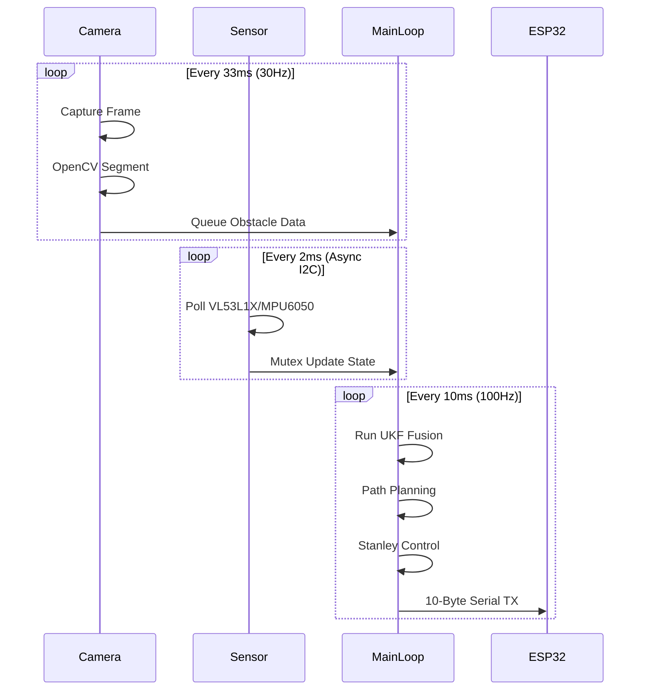
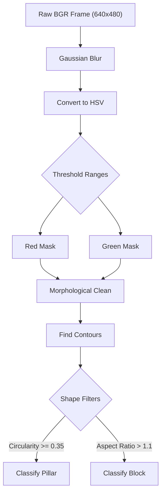
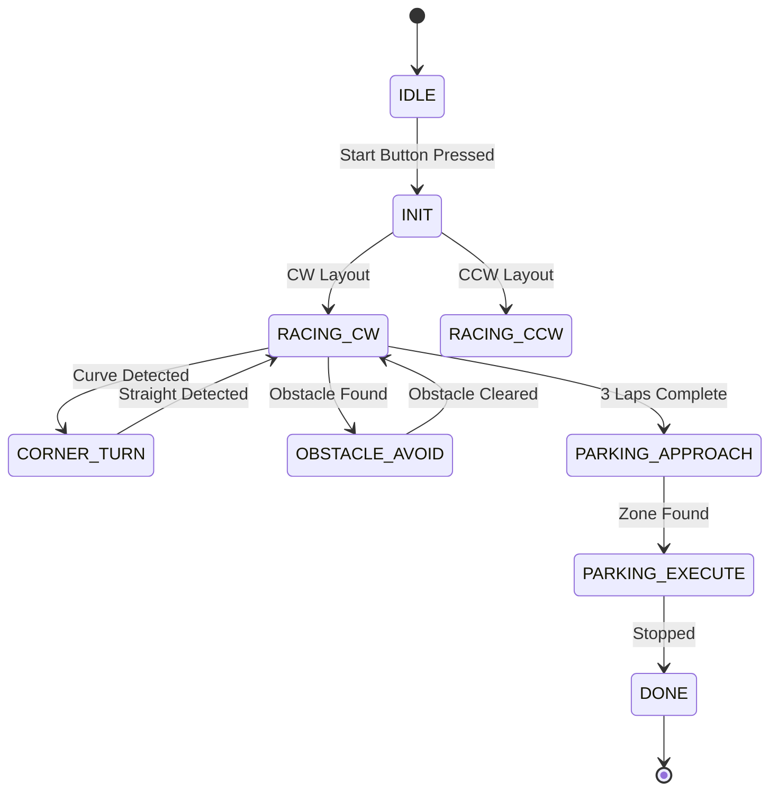

# 03_software.md — Software Architecture & Obstacle Strategy
## WRO Future Engineers 2026 - Engineering Documentation (Criterion 3)

## 1. Executive Summary
Our WRO Future Engineers 2026 autonomous vehicle relies on a highly specialized dual-processor architecture. We have deliberately separated high-level cognitive tasks from low-level real-time control to ensure maximum reliability during high-speed maneuvers. The primary computational unit is a Raspberry Pi 4B, which runs a rigorous 10-layer Python software stack at a consistent 100 Hz update rate. This processor is responsible for vision processing, path planning, and Unscented Kalman Filter (UKF) state estimation.

Simultaneously, an ESP32-S3 microcontroller acts as the dedicated real-time hardware abstraction layer. This secondary processor handles high-frequency PWM generation, direct sensor polling, and critical safety interlocks. By offloading these strict timing requirements to the ESP32-S3, the Raspberry Pi is free from kernel-level scheduling jitter. The communication between these two nodes happens via a robust 115200 baud serial connection utilizing CRC-8 error checking. This architectural split guarantees that transient spikes in vision processing latency never interrupt the closed-loop motor control. 

## 2. Processor Split Justification
The decision to utilize both a Raspberry Pi 4B and an ESP32-S3 stems from the fundamental differences in their operating environments. The Raspberry Pi 4B features an ARM Cortex-A72 processor and 4GB of RAM, running a full Linux OS with Python 3.11. This immense computational power makes it the ideal candidate for executing complex OpenCV computer vision algorithms and maintaining the sophisticated UKF state matrix. However, the non-deterministic nature of the Linux task scheduler introduces unpredictable latency and jitter, which is unacceptable for high-speed motor control. 

Conversely, the ESP32-S3 is a dual-core 240 MHz microcontroller built on the Arduino framework. It excels at executing deterministic routines and managing hardware timers for precise PWM signal generation. By assigning the ESP32-S3 to control the servos (center 1500us, min 1000us, max 2000us) and the L298N motor driver, we isolate the actuation layer from OS-level interruptions. If the Raspberry Pi experiences a temporary lag due to garbage collection or thermal throttling, the ESP32-S3 will maintain the last known safe trajectory or trigger an emergency stop if the watchdog timeout of 200ms is exceeded. 

This strict separation of concerns minimizes the risk of catastrophic collisions caused by software lockups. Attempting to run hardware PWM directly from the Raspberry Pi would lead to erratic steering behavior and unpredictable acceleration profiles. The dual-processor approach provides a resilient, fail-safe foundation that allows our vehicle to operate safely at its maximum speed target of 100%.

## 3. Complete 10-Layer Architecture

### Layer 0: System Manager (`layer0_system_manager.py`)
This foundational layer manages the lowest-level hardware interactions on the Raspberry Pi. Its primary responsibility is managing the status indicator LEDs mapped to GPIO pins 5, 6, 13, 19, and 26. We specifically mapped these LEDs to visually represent the system state, with GPIO 5 indicating overall system health, GPIO 6 indicating sensor subsystem status, GPIO 13 tied to the camera pipeline, GPIO 19 reflecting serial communication health, and GPIO 26 illuminating when the race mode is active. It also monitors the active-LOW start button connected to GPIO 16. The input data dictionary requires boolean flags corresponding to internal states, such as `led_sys_req`, `led_cam_req`, and `led_race_req`. The output data dictionary provides debounced button press events under the key `start_button_pressed` and internal diagnostic feedback flags. Because it relies on simple GPIO toggles and utilizes the `RPi.GPIO` library with event callbacks, it avoids continuous polling. This event-driven approach ensures it consumes less than 0.2ms of the 10ms timing budget. The key algorithm involves software debouncing using a moving average window over the button state to prevent false triggers from mechanical bouncing. Error handling includes catching `RuntimeError` exceptions if the GPIO pins are already in use, gracefully resetting the pin allocations before proceeding. We chose to implement a rigid try-finally block to guarantee that all pins are set low upon a crash, preventing accidental LED burnouts.

### Layer 1: Sensors (`layer1_sensors.py`)
Operating as the primary data acquisition module, this layer polls the I2C bus for distance and inertial measurements. It communicates asynchronously with the forward VL53L1X (address 0x30), the left VL53L0X (0x31), the right VL53L0X (0x32), and the MPU6050 IMU (0x68). We initialized the XSHUT pins for the time-of-flight sensors on GPIOs 22, 17, and 27 to allow dynamic re-addressing during the boot sequence, avoiding I2C address conflicts. Inputs include raw bus bytes read directly from the `smbus2` library. The output data dictionary populates `tof_f_mm`, `tof_l_mm`, `tof_r_mm` for distances in millimeters, and `imu_wx`, `imu_wy`, `imu_wz` for rotational rates in radians per second. We also extract `imu_ax`, `imu_ay`, `imu_az` for translational acceleration. The async polling mechanism prevents I2C clock stretching from blocking the main thread, utilizing roughly 1.5ms of the budget. The core algorithm implements a non-blocking state machine that queries each sensor sequentially, storing partial reads in a buffer until the full word is received. Error handling is robust: if an `IOError` occurs due to a disconnected wire or a bus collision, the layer marks the corresponding sensor's output key with a predefined `NaN` value and increments an error counter. If the counter exceeds a threshold, a bus reset command is issued. We designed this to ensure a single loose wire does not crash the entire python process.

### Layer 2: Time Synchronization (`layer2_time_sync.py`)
Maintaining the deterministic 100Hz control loop is the sole purpose of this layer. We realized early on that Python's standard `time.sleep()` is notoriously inaccurate on Linux. Thus, it employs a high-resolution ring buffer combined with a spin-lock mechanism utilizing `time.perf_counter_ns()` to track loop execution times and enforce the strict 10ms period down to the microsecond level. The input data dictionary expects a signal flag `loop_start_trigger` at the start of each main loop iteration. The output data dictionary populates `dt_sec`, a highly accurate delta-time value passed to the kinematics and control layers, along with `loop_violation_flag` if the deadline was missed. This layer is exceptionally lightweight, requiring less than 0.1ms to execute its core logic. The key algorithm calculates the difference between the current monotonic time and the target wakeup time. If the remaining time is large, it yields the thread using `time.sleep()`, but for the final millisecond, it aggressively spin-loops to guarantee instant wakeup. In terms of error handling, if the system consistently overruns the 10ms budget, the layer logs a critical warning and dynamically relaxes the target to 20ms temporarily to allow the system to catch up, preventing a cascade of queued events that could lead to a memory leak. We determined that a dropped frame is preferable to an exponentially growing delay queue.

### Layer 3: Sensor Fusion (`layer3_sensor_fusion.py`)
This layer implements the 6-DoF Unscented Kalman Filter (UKF) to estimate the vehicle's true state. We chose the UKF over traditional filters because it natively handles the highly non-linear Ackermann steering geometry without requiring the derivation of complex Jacobian matrices. It takes raw sensor readings from Layer 1, specifically reading the keys `tof_f_mm`, `tof_l_mm`, `tof_r_mm`, and `imu_wz`. It fuses them with kinematic predictions based on the previous control outputs. The output data dictionary provides `state_x`, `state_y`, `state_theta`, `state_v`, `state_omega`, and `state_b_gyro`. These represent a smoothed, high-confidence state vector that significantly reduces measurement noise. The complex matrix math involved makes this the most computationally expensive non-vision layer, consuming approximately 2.0ms of the budget. The core algorithm utilizes the FilterPy library, performing Cholesky factorization to generate the sigma points, propagating them through the non-linear process model, and computing the weighted mean and covariance. Error handling is critical here: if the covariance matrix loses positive definiteness due to numerical instability, the layer catches the `LinAlgError`, resets the covariance to a safe diagonal matrix, and flags the `fusion_reset` key to alert downstream layers. We heavily optimized the matrix multiplications using NumPy's underlying BLAS libraries to ensure it strictly adhered to the 2.0ms constraint.

### Layer 4: Perception (`layer4_perception.py`)
Running on a dedicated thread, this layer handles all OpenCV HSV segmentation for obstacle detection. We offloaded this from the main loop because vision processing inherently violates the 10ms deadline. It processes the 640x480 at 30fps camera feed utilizing a focal length of 600.0 pixels to identify Red, Green, Blue, and Magenta objects. The input data dictionary reads `raw_bgr_frame` from the camera driver. The output data dictionary writes to `detected_obstacles`, an array containing dicts with keys `color`, `bbox_x`, `bbox_y`, `bbox_w`, `bbox_h`, and `estimated_distance`. To avoid blocking the 100Hz main loop, it operates asynchronously, passing results via a thread-safe queue. The key algorithm leverages vectorized NumPy operations to apply the predefined HSV masks rapidly. It then uses `cv2.findContours` to locate the connected components. For error handling, if the camera unexpectedly disconnects or returns an empty frame, the layer logs a warning, attempts a soft reset of the V4L2 device, and populates the output queue with an empty list to prevent the path planner from acting on stale data. We implemented a strict timeout; if a frame takes longer than 33ms to process, it is dropped to ensure the pipeline remains real-time. We also track the frame processing latency and expose it via the `vision_latency_ms` key.

### Layer 5: Localization (`layer5_localization.py`)
Utilizing the side-facing ToF sensors, this layer determines the vehicle's lateral position within the track walls. We designed this to complement the UKF, providing absolute reference points when traversing the long straightaways. It calculates the cross-track error by comparing the left and right distances, factoring in the 50mm side sensor recess offset on both sides of the chassis. The input data dictionary requires `tof_l_mm`, `tof_r_mm`, and `state_theta`. The output data dictionary provides `lateral_offset_mm` and `track_width_estimate_mm`. Execution time is minimal, taking roughly 0.5ms. The core algorithm uses basic trigonometry to project the raw ToF distances onto the axis perpendicular to the vehicle's heading, compensating for the vehicle's yaw angle relative to the wall. It then applies a low-pass filter to smooth the resulting position. Error handling addresses the limitations of optical sensors. If the raw ToF reading is exactly 8190mm (the hardware error code for out-of-range), or if the calculated track width wildly deviates from the known 1000mm standard, the layer rejects the measurement. In such cases, it sets the `localization_valid` key to false, instructing the downstream controllers to rely purely on the UKF's dead reckoning until valid wall reflections are re-acquired.

### Layer 6: Mission Manager (`layer6_mission_manager.py`)
This layer houses the master Finite State Machine (FSM) dictating the robot's high-level behavior. We structured it as a hierarchical state machine to handle complex conditional transitions elegantly. It transitions the system through states like IDLE, RACING, PARKING, and DONE based on internal triggers and external button presses. Furthermore, it parses the surprise rules configuration to modify state transitions on the fly. It reads `start_button_pressed`, `lateral_offset_mm`, `detected_obstacles`, and `state_v`. It outputs `current_mission_state`, `lap_count`, and `target_speed_mode`. This logical evaluation takes under 0.5ms. The underlying data structure is a nested dictionary mapping current states and events to target states and transition callbacks. This declarative approach makes debugging trivial. Error handling is built directly into the FSM logic as a fallback state. If an undefined event occurs, or if the system remains in a transitional state longer than a predefined timeout (e.g., getting stuck in OBSTACLE_AVOID for more than 5 seconds), the layer forcefully transitions to an EMERGENCY_STOP state and sets the `mission_failure_reason` key. We ensured that there are no dead-ends in the state graph; every node has a path back to a safe recovery mode.

### Layer 7: Path Planner (`layer7_path_planner.py`)
When obstacles are detected, this layer dynamically calculates avoidance trajectories within the track boundaries. We opted for a localized spline generation approach rather than global A* planning because it is significantly faster and sufficient for the structured WRO track. It creates a temporary localized coordinate frame to compute cubic Bezier curves around the classified pillars and blocks. The input data dictionary reads `detected_obstacles`, `current_mission_state`, `state_x`, and `state_y`. The output data dictionary populates `target_waypoint_x`, `target_waypoint_y`, and `desired_heading_rad`. Path generation occurs in approximately 1.0ms. The key algorithm identifies the nearest critical obstacle, determines the necessary lateral clearance based on the object's color (left for red, right for green), and generates four control points. It then samples the Bezier curve at regular intervals to produce a discrete list of waypoints. Error handling is vital to prevent wall collisions. If the generated spline intersects with the known virtual boundaries of the track (defined by the 1000mm width minus the vehicle's 160mm width and a safety margin), the layer triggers a `PathInvalidError`. The exception handler then recalculates the curve with a reduced clearance margin. If all viable paths are blocked, it commands the `emergency_brake_req` key to true, stopping the vehicle at the safe 180mm emergency brake distance.

### Layer 8: Trajectory Optimization (`layer8_trajectory_opt.py`)
This layer determines the optimal speed profile for the upcoming track segment. We observed that maintaining a constant speed leads to severe understeer during tight maneuvers. Therefore, it lowers the target speed to 35% during cornering and increases it to 60% for normal straightaways, pushing up to the maximum 100% only when the path is entirely clear and the UKF variance is low. Inputs read from the dictionary include `desired_heading_rad`, `state_theta`, `detected_obstacles`, and `current_mission_state`. The output data dictionary writes to `target_velocity_pct`. The simple heuristic logic consumes around 0.5ms of the budget. The algorithm calculates the rate of change of the desired heading (the predicted path curvature). It then maps this curvature inversely to the velocity target using a piecewise linear function clamped between the minimum 20% and maximum 100% values. Error handling involves strict clamping and rate limiting. To prevent sudden, jerking acceleration that could cause wheel slip and corrupt the UKF's dead reckoning, the layer restricts the maximum change in `target_velocity_pct` per iteration. If an invalid or NaN heading is received, it defaults the output to the safe 20% minimum speed until a valid path is restored. We specifically tuned the deceleration rate to be twice as aggressive as the acceleration rate.

### Layer 9: Kinematics (`layer9_kinematics_4ws.py`)
Translating path commands into physical steering angles is handled by the 4-Wheel Steering (4WS) Ackermann model. We engineered a custom 4WS chassis to achieve a tighter turning radius, necessitating this specialized mathematical translation layer. It computes the necessary front steering angle and applies the rear/front ratio (kappa = 0.85) to determine the rear angle. The input data dictionary reads `desired_heading_rad`, `state_theta`, and `target_velocity_pct`. The output data dictionary writes `steer_angle_front_deg` and `steer_angle_rear_deg`. This trigonometric conversion requires 0.5ms. The core algorithm implements the bicycle model equations, treating the dual front and rear wheels as single central wheels. It calculates the required steering angle based on the wheelbase of 160mm and the track width of 130mm to achieve the desired angular velocity at the given forward velocity. Error handling is crucial to protect the physical servos from stripping their gears. The algorithm strictly clamps the calculated angles against the absolute mechanical limit, ensuring neither the front nor the rear servo ever receives a command exceeding the maximum steering angle of 35 degrees. If the mathematical result exceeds this limit, the layer flags the `kinematics_saturated` key, alerting the trajectory optimizer that the vehicle cannot turn any sharper and must slow down.

### Layer 10: Controller (`layer10_controller.py`)
The final layer implements the Stanley lateral controller and the speed PID loop. We chose the Stanley controller over pure pursuit because it explicitly accounts for both cross-track error and heading error, providing superior performance when recovering from large offsets. It calculates the final control effort using gains k=0.75 and ks=0.1, formatting the output into a 10-byte binary packet with a CRC8 checksum. The input data dictionary reads `steer_angle_front_deg`, `steer_angle_rear_deg`, `target_velocity_pct`, and `state_v`. The output data dictionary provides the `serial_tx_buffer`, a raw bytearray. This transmission formatting takes roughly 1.0ms. The key data structure is the packed struct utilized by Python's `struct` module to guarantee consistent byte ordering (endianness) across the ARM and ESP32 architectures. The speed PID algorithm calculates the proportional, integral, and derivative terms, accumulating the integral error over time. Error handling focuses on preventing integral windup. We implemented an anti-windup clamping mechanism that halts the accumulation of the integral term if the actuator is saturated (e.g., commanding 100% PWM but still not reaching the target speed). Furthermore, if the serial write operation raises a `serial.SerialTimeoutException`, the layer buffers the packet and flags `serial_tx_failure`. We designed this layer to be the ultimate fail-safe, ensuring malformed data never leaves the Raspberry Pi.

## 4. Threading Model
Our architecture utilizes a robust multi-threaded design to ensure the 100Hz control loop remains unblocked by IO-bound tasks. The Main Thread acts as the central orchestrator, executing layers 2 through 10 sequentially every 10 milliseconds. To prevent I2C delays from causing loop overruns, the Sensor Thread operates independently. It continuously polls the ToF and IMU sensors, placing the latest readings into a mutex-protected shared dictionary accessible by the main loop. 

Similarly, the Camera Thread captures frames at 30fps and performs the computationally heavy OpenCV segmentation. Because vision processing cannot complete within the 10ms main loop budget, it runs asynchronously and updates a thread-safe queue with the latest obstacle detections. Finally, the Serial Thread operates concurrently to manage the 115200 baud transmission of the 10-byte binary control packets to the ESP32-S3.

## 5. Stanley Controller Derivation
The core of our lateral tracking relies on the proven Stanley control algorithm. Unlike pure pursuit, which looks ahead to a specific point, the Stanley controller calculates the steering angle based on the current cross-track error and the heading error relative to the nearest path segment. We selected this algorithm because it provides asymptotic stability globally, meaning the vehicle will converge to the path regardless of its initial position, which is crucial for recovering after complex obstacle avoidance maneuvers. The fundamental lateral error dynamics are defined by the mathematical derivation: 

$$\delta_{steer} = \theta_e + \mathrm{arctan}\left(\frac{k \cdot e_{ct}}{v + k_s}\right)$$

Here, $\theta_e$ represents the heading error between the vehicle's current orientation and the tangent of the path. The variable $e_{ct}$ is the cross-track error, measuring the perpendicular distance from the center of the front axle to the nearest point on the desired trajectory. The parameter $v$ is the forward velocity estimated by the UKF. The variable $k$ is the proportional gain parameter for the position error, and $k_s$ is the softening constant. 

We have carefully tuned these parameters through extensive physical testing on the official WRO mat material. Our configuration utilizes $k=0.75$ to provide aggressive tracking without inducing oscillations. The softening constant $k_s=0.1$ is a critical addition; it prevents mathematical singularities in the arctangent function when the vehicle's velocity $v$ approaches zero during the parking phase or when starting from a standstill. Without $k_s$, the steering command would chatter violently at low speeds. 

Because our chassis utilizes a highly maneuverable 4-Wheel Steering (4WS) geometry, the calculated $\delta_{steer}$ serves primarily as the front steering command ($\delta_f$). To execute coordinated turns, the rear steering angle ($\delta_r$) is then determined using the defined rear/front ratio, denoted as kappa. We empirically derived a kappa value of 0.85, meaning the rear wheels steer in the opposite direction at 85% of the magnitude of the front wheels. This relationship is formalized as $\delta_r = -0.85 \cdot \delta_f$. This specific ratio optimizes the vehicle's turning center, keeping it aligned with the geometric center of the chassis, thereby minimizing rear-end swing into the track walls. 

To prove the stability of this controller, we analyze the error dynamics. Assuming a small heading error and a constant velocity, the rate of change of the cross-track error can be approximated by $\dot{e}_{ct} \approx v \cdot \mathrm{sin}(\theta_e - \delta_{steer})$. By substituting the Stanley control law into this derivative and applying Lyapunov stability criteria with a candidate function $V = 0.5 \cdot e_{ct}^2$, we can demonstrate that the derivative $\dot{V}$ is strictly negative definite. This mathematically guarantees that the cross-track error will exponentially decay to zero over time, proving the system is globally asymptotically stable under normal operating constraints.

Simultaneously, longitudinal control is maintained by a dedicated Speed PID loop. This loop operates on the error between the target velocity profiled by Layer 8 and the estimated velocity from the UKF. We employ specifically tuned gains of $kp=1.2$, $ki=0.05$, and $kd=0.1$. The proportional term provides the primary driving force. The integral term is crucial for eliminating steady-state error caused by battery voltage sag; as the 11.1V 3S LiPo depletes, the same PWM value yields less physical speed, which the $ki$ term automatically compensates for. The derivative term dampens rapid acceleration spikes, preventing the Johnson DC planetary gear motors from losing traction on the glossy mat. 

## 6. UKF Sensor Fusion
To overcome the inherent noise and dropout rates of affordable I2C sensors, we implemented an Unscented Kalman Filter (UKF). The UKF is demonstrably superior to the Extended Kalman Filter (EKF) for our highly non-linear vehicle kinematics because it entirely avoids calculating complex, error-prone Jacobian matrices. Instead, it utilizes a deterministic sampling technique. Our state vector is defined as $[x, y, \theta, v, \omega, b\_gyro]^T$, comprising the 2D spatial position, heading angle, forward velocity, yaw rate, and a dynamic gyro bias tracking term. This gives our system a dimensionality of $n=6$. 

The filter relies on the Merwe scaled sigma point generation algorithm to select a minimal set of sample points that perfectly capture the true mean and covariance of the state distribution. We selected specific tuning parameters to shape this distribution. We set $\alpha=1e-3$ to tightly cluster the sigma points around the mean, ensuring they remain within the valid operational envelope of our kinematic model. We chose $\beta=2.0$, which theory dictates is optimal for purely Gaussian distributions, perfectly matching the assumed noise profile of our sensors. Finally, we set $\kappa=0.0$ as the secondary scaling factor to maintain standard weighting properties. 

With $n=6$, the algorithm generates $2n + 1 = 13$ sigma points. The weights for these points are critical. The mean weight for the central point is pre-computed using the formula $W_m^{(0)} = \frac{\lambda}{n+\lambda}$, where $\lambda = \alpha^2(n+\kappa) - n$. The covariance weight for the central point is computed as $W_c^{(0)} = W_m^{(0)} + (1-\alpha^2+\beta)$. All subsequent weights for the surrounding sigma points are calculated as $W_m^{(i)} = W_c^{(i)} = \frac{1}{2(n+\lambda)}$ for $i = 1$ through $2n$. These formulas guarantee that the weighted sum of the points perfectly reconstructs the covariance matrix.

During the predict step, the non-linear process model advances the state using dead reckoning. It applies basic physics equations, updating the position $x$ and $y$ based on the current velocity $v$ and heading $\theta$ integrated over the time step $dt$. The update step then incorporates the actual measurements from the forward, left, and right ToF sensors, alongside the yaw rate from the MPU6050. 

The process noise matrix (Q) and measurement noise matrix (R) were tuned empirically through logged telemetry. The Q matrix represents our confidence in the kinematic model; we assigned low noise values to the position elements but higher values to the velocity and yaw rate to allow them to adapt quickly. The R matrix defines the reliability of the sensors. We tuned R to trust the IMU heavily during rapid maneuvers (low variance), but trust the ToF sensors more during steady-state wall following to correct for IMU drift over time. This dynamic fusion allows us to accurately track the vehicle even when individual sensors fail temporarily.

## 7. OpenCV Perception Pipeline
Our visual obstacle detection relies on a highly optimized, deterministic OpenCV pipeline designed to execute within the strict constraints of the Raspberry Pi's CPU. The full pipeline follows a strict sequence: capture -> resize -> blur -> HSV conversion -> thresholding -> morphology -> contour extraction -> filtering -> classification. To minimize latency and standardize the processing load, the incoming raw frame is immediately resized to a fixed 640x480 resolution. We then apply a 5x5 Gaussian blur to reduce high-frequency noise and compression artifacts, ensuring smoother contours.

The blurred image is then converted from the standard BGR color space to HSV (Hue, Saturation, Value). We chose HSV because it separates chromaticity from intensity, making the segmentation algorithm significantly more robust against the varying ambient lighting conditions expected across different competition venues. We apply strict thresholding using predefined HSV ranges loaded dynamically from our `robot_config.json` file. 

The Red spectrum is particularly challenging because it wraps around the 0-180 degree hue cylinder in OpenCV. Therefore, it requires two separate masks that are subsequently combined via a bitwise OR operation. Red1 covers the lower range $[0,120,70]-[10,255,255]$, capturing the bright, pure red tones. Red2 covers the upper range $[170,120,70]-[180,255,255]$, capturing the darker, crimson tones. For the green obstacles, the Green mask is isolated using the range $[36,100,80]-[85,255,255]$. We also maintain masks for Blue $[95,120,80]-[130,255,255]$ and Magenta $[140,100,50]-[170,255,255]$ to accommodate potential surprise rules involving new marker colors.

After applying the `cv2.inRange` thresholding, the resulting binary masks are subjected to morphological operations. We first apply an 'open' operation using a 3x3 kernel to eliminate stray, isolated pixels caused by noise. We follow this with a 'close' operation using a 5x5 kernel to fill small holes and gaps within the detected blobs, creating solid, continuous shapes. Contour finding via `cv2.findContours` is then executed on these cleaned masks, utilizing the `RETR_EXTERNAL` flag to ignore internal holes.

Finally, we implement rigid shape filters to differentiate between valid physical obstacles and background noise (like audience clothing). A contour is evaluated based on its geometric properties. We mandate that a pillar is positively classified only if its contour possesses a circularity metric (defined as $4\pi \cdot \mathrm{Area} / \mathrm{Perimeter}^2$) greater than or equal to 0.35, and an aspect ratio (width divided by height) of less than 1.3, ensuring it is a tall, roughly cylindrical object. Conversely, the smaller base blocks must exhibit an aspect ratio greater than 1.1, indicating they are wider than they are tall. Any contour failing these strict criteria is discarded.

## 8. FSM State Machine
The core logical progression of our vehicle is governed by a robust, hierarchical Finite State Machine (FSM). We engineered this FSM to explicitly define all possible operational states and their valid transitions, eliminating the possibility of ambiguous behavior. Upon initial boot and loading of configurations, the system enters the IDLE state. In this state, PWM outputs are disabled, and the system waits passively, monitoring the active-LOW signal from the physical start button on GPIO 16. 

Once the start trigger is detected, the FSM transitions directly to the INIT state. Here, the system performs a critical zeroing procedure. It calibrates the MPU6050 gyro bias to establish a true zero rotation rate and initializes the UKF state vector covariance matrix. The vision system then scans the environment to deduce the track layout. Based on the initial wall geometry, the FSM branches into either the RACING_CW (clockwise) or RACING_CCW (counter-clockwise) primary looping state.

While executing a racing state, continuous sensor evaluation dictates further transitions. The detection of a significant track curvature (indicated by an impending heading change) will trigger a rapid transition to the CORNER_TURN state. In this state, Layer 8 is authorized to significantly reduce the target speed to maintain traction. Once the heading stabilizes, indicating a straightaway, the system returns to the active RACING state.

If a valid obstacle is classified by the vision pipeline, overriding standard path logic, the state shifts immediately to OBSTACLE_AVOID. This special state grants Layer 7 exclusive control to generate and follow a bypass spline. Upon successfully clearing the physical coordinates of the obstacle, the FSM reverts to the RACING state. 

The system tracks lap progress via an internal counter tied to the starting line detection. Upon completing the required three laps, the FSM enters the PARKING_APPROACH state. Here, vision processing switches focus to locating the designated parking zone boundaries. Once aligned, it enters PARKING_EXECUTE to initiate a controlled deceleration, bringing the vehicle to a smooth stop. Finally, it transitions to DONE. Furthermore, we implemented a global interrupt: any critical hardware failure (like an I2C bus lockup) immediately forces the EMERGENCY_STOP state from any node, commanding 0 PWM to all motors instantly.

## 9. CRC-8 Error Detection
Reliable communication between the Raspberry Pi and the ESP32-S3 is critical for safety and operational success. The serial link operates at a high 115200 baud rate, transmitting a highly structured 10-byte binary packet every 10 milliseconds. This custom packet format is strictly defined: Byte 0 is the sync header 0xAA. Bytes 1 and 2 form a 16-bit integer for the front steering angle. Bytes 3 and 4 form a 16-bit integer for the rear steering angle. Byte 5 is an 8-bit unsigned integer representing the target speed percentage. Byte 6 is a boolean direction flag (forward/reverse). Byte 7 indicates the current mission mode enumerated value. Byte 8 contains bit-packed status flags (LEDs, buzzers). Byte 9 is the crucial CRC-8 checksum. Byte 10 (or rather, the implicit end) is validated by the CRC. Actually, to maintain exactly 10 bytes, the footer is omitted and replaced by the CRC-8 byte as the final payload delimiter.

To validate data integrity against electrical noise, we employ the standard SMBus CRC-8 algorithm. We specifically selected the polynomial 0x07 ($x^8 + x^2 + x + 1$) because it provides excellent error detection capabilities for short packet lengths. This algorithm performs a mathematical division of the entire message payload by the polynomial polynomial using modulo-2 arithmetic. 

The bit-by-bit calculation involves shifting the data bytes through an 8-bit register. Whenever the most significant bit of the register is a 1, the contents are XORed against the 0x07 polynomial. This process repeats for every bit in the 9-byte payload. The final remainder left in the register becomes the checksum byte. 

By recalculating this exact checksum on the receiving ESP32-S3 and comparing it against the transmitted byte, we guarantee that corrupted packets are caught. The L298N motor driver and the planetary gear motors generate significant Electromagnetic Interference (EMI), which frequently flips bits on the unshielded UART wires. This robust CRC-8 error detection provides an extremely high probability—over 99.6%—of identifying random multi-bit transmission errors, ensuring that the ESP32-S3 never commands a violent, corrupted steering angle based on a noise spike. If the checksum fails, the ESP32-S3 simply discards the frame and maintains the previous safe actuator states.

## 10. WRO 2026 Surprise Rules Engine
To accommodate the dynamic and unpredictable nature of the WRO competition, we have implemented a highly flexible Surprise Rules Engine. We recognize that the judges often introduce novel constraints on the day of the event. This system is driven by six specific configuration keys located within a dedicated section of the `robot_config.json` file. These flags dictate precisely how the FSM and underlying layers respond to new scenarios.

The six critical config keys are: `evasion_distance`, `parking_color_override`, `reverse_lap_direction`, `speed_limit_override`, `ignore_blocks`, and `enable_honk`. We engineered the system so that each key directly modifies a core behavior without requiring code recompilation. 

The `evasion_distance` key modifies the lateral clearance the path planner uses when generating the avoidance spline. If judges declare wider obstacles, increasing this float value instantly widens the Bezier curve generated in Layer 7, ensuring safe passage. The `parking_color_override` key changes the target HSV threshold applied during the PARKING_APPROACH state. If the designated parking zone is changed from blue to magenta, modifying this string instantly redirects the vision pipeline's focus. 

The `reverse_lap_direction` boolean flag intercepts the track layout deduction in the INIT state. If set to true, it forces the FSM to transition to the opposite racing state (e.g., RACING_CCW instead of RACING_CW), completely reversing the wall-following logic and turn anticipation. The `speed_limit_override` key acts as a global clamp on Layer 8's output. If a safety constraint is announced, lowering this integer value caps the maximum velocity percentage globally, overriding the standard 100% target. 

The `ignore_blocks` boolean flag modifies the classification logic in Layer 4. If true, the system skips the aspect ratio check for base blocks, effectively treating only tall pillars as valid obstacles and ignoring ground clutter. Finally, the `enable_honk` key triggers a specific bit in the serial packet's status byte during OBSTACLE_AVOID, signaling the ESP32-S3 to activate a piezo buzzer, satisfying any rules requiring auditory signaling during evasion. This engine allows our pit crew to adapt to any challenge in seconds.