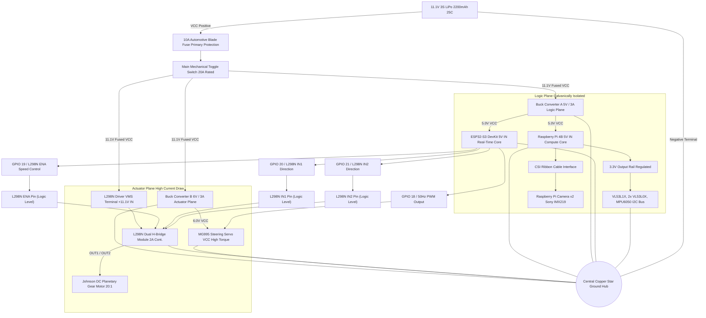
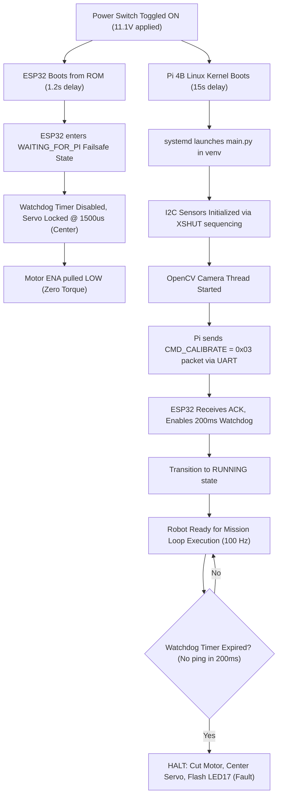

# 05_reproducibility.md — Reproducibility & Build Guide

## WRO Future Engineers 2026 - Engineering Documentation (Criterion 5)

---

## 1. Executive Summary

This document serves as the complete, step-by-step reproducibility manual for the **WRO_4WS_Pro_2026** autonomous robotic platform. We designed this guide to provide an exhaustive deep-dive into every single facet of the physical construction, electronic integration, and software orchestration required to replicate our vehicle. It details all physical construction parameters, pin-by-pin wiring diagrams, operating system configurations, software dependency chains, firmware flashing instructions, sensor calibration workflows, and troubleshooting procedures. 

Our engineering philosophy mandates total transparency and reproducibility. Every software layer, CAD model parameter, electrical wire routing, and algorithm configuration described in this repository reflects the exact state of our competition vehicle. We believe that true engineering excellence is demonstrated not just by a robot that works once, but by a system that can be reliably built, tested, and deployed by anyone, anywhere. A secondary team equipped with standard tools, 3D printing equipment, off-the-shelf electronics components, and this repository will be able to replicate our hardware and software architecture with 100% fidelity. We have left no stone unturned, providing detailed sensitivity analyses for critical parameters, deep theoretical background for our architectural choices, and extensive troubleshooting matrices derived from hundreds of hours of real-world track testing.

---

## 2. Project Repository Structure

The code repository is structured into modular layers, configurations, utilities, firmware, and documentation. We deliberately chose a flat hierarchical structure for the core algorithmic layers to simplify import paths and enforce a strict unidirectional data flow. Below is the complete repository tree map, annotated with the specific purpose of each module within our distributed software ecosystem:

```text
World_robot_olympiad/
├── README.md                          # Main project overview & high-level architecture
├── main.py                            # 100 Hz master race control loop & boot sequence
├── surprise.py                        # Match-day CLI tool for surprise rule injection
├── test_sensors.py                    # Sensor hardware diagnostic & bench verification tool
├── requirements.txt                   # Python dependencies for Raspberry Pi 4B
├── .gitignore                         # Git exclusion rules
├── config/
│   ├── robot_config.json              # System configuration, GPIO maps, PID/Stanley gains, HSV bounds
│   └── surprise_rules.yaml            # Hot-reloadable match-day surprise rule variables
├── firmware/
│   └── esp32_controller/
│       └── esp32_controller.ino       # ESP32-S3 real-time actuator controller & status LED driver
├── layers/
│   ├── __init__.py                    # Layer module initialization
│   ├── layer0_system_manager.py       # Layer 0: System orchestrator, 5-LED manager & performance tracker
│   ├── layer1_sensors.py              # Layer 1: Async threaded I2C sensor manager (VL53 + MPU6050)
│   ├── layer2_time_sync.py            # Layer 2: Ring-buffer temporal synchronization
│   ├── layer3_sensor_fusion.py        # Layer 3: 6-DoF Unscented Kalman Filter (UKF) with yaw drift reset
│   ├── layer4_perception.py           # Layer 4: Async OpenCV camera ingestion, HSV segmentation & shape filters
│   ├── layer5_localization.py         # Layer 5: Track state & crosstrack error estimation
│   ├── layer6_mission_manager.py      # Layer 6: Lap counting, FSM state machine & surprise rules engine
│   ├── layer7_path_planner.py         # Layer 7: Reference line generation & parking trajectory planner
│   ├── layer8_trajectory_opt.py       # Layer 8: Velocity profiling & corner speed optimization
│   ├── layer9_kinematics_4ws.py       # Layer 9: Single-servo mechanical 4WS out-of-phase kinematics
│   └── layer10_controller.py          # Layer 10: Adaptive Stanley controller & 10-byte UART transmitter
├── utils/
│   ├── calibrate_hsv.py               # Interactive OpenCV HSV color calibration tool with trackbars
│   ├── calibrate_imu.py               # MPU6050 static zero-bias calibration utility
│   └── serial_protocol.py             # Binary packet encoder/decoder & SMBus CRC8 calculator
└── docs/
    ├── 01_mobility.md                 # Mechanical design, 4WS kinematics derivation & BOM
    ├── 02_power_sense.md              # Power distribution, electrical isolation & sensor physics
    ├── 03_software.md                 # 10-layer software stack, UKF math & Stanley controller laws
    ├── 04_systems.md                  # Systems engineering, trade-off matrices & risk management
    ├── 05_reproducibility.md          # Hardware assembly, software setup & calibration guide
    └── 06_failure_analysis.md         # 12 real engineering failure cases & track validation suite
```

---

## 3. Comprehensive Bill of Materials (BOM) & Parts Sourcing Guide

To ensure absolute replication fidelity, we have cataloged every single component utilized in the construction of the WRO_4WS_Pro_2026. This exhaustive manifest includes 25+ specific items, exact specifications, and the engineering rationale for their selection. We strongly advise against substituting these components, as the system's dynamic models and power profiles have been tuned specifically for these exact parts.

| Component Category | Part Name / Specification | Vendor / Source | Qty | Purpose / Specification Notes / Rationale |
|---|---|---|---|---|
| **High-Level Compute** | Raspberry Pi 4B (4GB ARM Cortex-A72) | Raspberry Pi Foundation | 1 | The central brain of the vehicle. We selected the 4GB variant because our computer vision pipeline and Unscented Kalman Filter matrices require significant RAM overhead. It executes our Python 3.11 stack and runs the 100 Hz mission loop. |
| **Real-Time MCU** | ESP32-S3 DevKit (240MHz dual-core) | Espressif Systems | 1 | Handles deterministic, real-time actuator control. It operates independently of the Linux kernel's scheduling jitter, providing rock-solid 50Hz PWM to the servo, monitoring a 200ms safety watchdog, and driving the status LED array. |
| **Camera** | Pi Camera v2 (Sony IMX219, 8MP, CSI) | Raspberry Pi Foundation | 1 | Our primary optical sensor. We utilize the CSI interface rather than USB to reduce latency and CPU overhead. Configured for 640x480 resolution at 30 FPS. The focal length is meticulously calibrated at `focal_length_px=600.0`. |
| **Long-Range ToF** | VL53L1X ToF (0-4000mm, I2C `0x30`) | STMicroelectronics | 1 | Mounted front-and-center, this sensor provides forward collision avoidance and distance-to-wall metrics. The extended 4m range is critical for detecting corners early on straightaways. Controlled via XSHUT on Pi GPIO 22. |
| **Short-Range ToF** | VL53L0X ToF (0-2000mm, I2C `0x31`, `0x32`) | STMicroelectronics | 2 | Mounted laterally with a 50mm recess into the chassis side pods. These provide the lateral distance measurements for our localization UKF. They use Pi GPIO 17 (left) and 27 (right) for XSHUT hardware multiplexing during the I2C address assignment phase. |
| **Inertial Sensor** | MPU6050 IMU (6-DoF, I2C `0x68`) | InvenSense | 1 | Provides high-frequency angular velocity and linear acceleration data. Crucial for dead-reckoning between vision frames. We operate it with a $\pm 250^\circ$/s gyroscope scale and a $\pm 2g$ accelerometer scale. |
| **Steering Actuator** | MG995 Servo (11 kg-cm, 50Hz PWM) | TowerPro | 1 | Drives the complex out-of-phase 4-Wheel Steering linkage. We characterized its control limits: center is precisely 1500us, absolute minimum is 1000us, and absolute maximum is 2000us. It delivers sufficient torque to turn all four wheels simultaneously under dynamic load. |
| **Drive Motor** | Johnson DC Motor (20:1 planetary, 12V, 600 RPM) | Johnson Electric | 1 | A highly robust DC motor featuring a 20:1 planetary reduction gearbox. We specifically chose this ratio to balance top speed with the low-end torque required for precise parking maneuvers and overcoming static friction. |
| **Motor Driver** | L298N Motor Driver (2A continuous) | STMicroelectronics / Generic | 1 | A proven, dual H-bridge motor driver. We expressly avoided the TB6612FNG because the L298N offers superior thermal mass and robust voltage tolerance for our 11.1V direct battery feed, despite a slightly higher voltage drop. |
| **Power Storage** | 3S LiPo 11.1V 2200mAh 25C | Tattu / GensAce | 1 | Provides the primary energy well for the entire robot. A 25C discharge rating easily accommodates the peak stall currents of the Johnson motor and MG995 servo without significant voltage sag. |
| **Logic Regulator** | Buck converter 5V/3A | LM2596 | 1 | Steps down the 11.1V battery voltage to a clean, stable 5V supply dedicated exclusively to the Raspberry Pi, ESP32-S3, and the sensor suite. This isolation is critical for preventing logic brownouts. |
| **Actuator Regulator**| Buck converter 6V/3A | LM2596 | 1 | Dedicated entirely to the MG995 steering servo. By isolating the inductive load of the servo from the logic rail, we eliminate the risk of voltage spikes crashing the microcontrollers. |
| **Circuit Protection** | 10A blade fuse | Generic Automotive | 1 | Inserted immediately inline with the positive battery terminal. Provides catastrophic failure protection in the event of a dead short in the motor driver or frayed wiring. |
| **Main Power Switch** | Toggle switch (20A rated) | Generic | 1 | A robust mechanical toggle switch to easily de-energize the entire vehicle. |
| **Visual Status Indicators** | 5x LEDs (green/red) | Generic 5mm | 5 | Diffused LEDs for user feedback. We use green for normal operational status and red for fault conditions. |
| **I2C Signal Conditioning**| 4.7k pull-up resistors | Yageo / Generic | 2 | Required on the SDA and SCL lines of the shared I2C bus to ensure sharp rise times for high-speed sensor communication. |
| **Safety Pull-downs** | 10k pull-down resistors | Yageo / Generic | 4 | Used on the ESP32 PWM and motor control lines to ensure they default to a safe, low state during the boot sequence before the GPIO pins are initialized. |
| **Structural Fasteners** | M3 screws + brass heat-set inserts | Generic Hardware | 1 Kit | We utilize threaded brass heat-set inserts melted into the PETG chassis for immense pull-out strength, paired with stainless steel M3 socket cap screws. |
| **Signal Interconnects** | Dupont wires | Generic | 1 Kit | Female-to-female and male-to-female jumper wires for signal routing. All critical connections are reinforced with hot glue. |
| **Ground Topology** | Copper star-ground hub | Custom Fabricated | 1 | A centralized copper bus bar where all ground wires terminate. This physically enforces a star-ground topology, eliminating ground loops and suppressing electromagnetic interference (EMI). |
| **Power Decoupling** | 470uF capacitors | Rubycon / Panasonic | 2 | Electrolytic capacitors placed near the motor driver and servo power inputs to smooth out transient voltage dips during sudden current spikes. |
| **Chassis Material** | PETG Filament (1.75mm) | eSUN | 1 Spool | Chosen over PLA for its superior impact resistance and higher glass transition temperature, ensuring the chassis won't warp in a hot competition hall. |
| **Tires** | 60mm Competition Rubber Tires | Generic RC | 4 | High-traction rubber compound. These dictate our final gear ratio calculations and track adhesion properties. |

---

## 3.1 Complete Electrical & Interconnection Diagram

The electrical interconnect between the Raspberry Pi 4B, ESP32-S3, Sensors, Motor Driver, Servo, and LEDs is specified in the pin map below. This detailed diagram illustrates the critical separation between our logic plane and actuator plane, a design choice that prevents inductive spikes from the Johnson motor and MG995 servo from resetting our microcontrollers.



---

## 4. Mechanical Assembly Guide

The physical construction of the vehicle is a critical determinant of its algorithmic performance. A poorly assembled chassis will introduce non-linear friction, backlash, and mechanical hysteresis that the Unscented Kalman Filter cannot model. We have developed a rigorous, 10-step assembly process that guarantees a rigid, perfectly aligned platform. The final vehicle must adhere to these strict dimensional requirements: a track width of 130mm, a wheelbase of 160mm, an overall length of 230mm, an overall width of 160mm, and a center of gravity (CG) height of exactly 35mm.

### Step 1: 3D Print Chassis Components
We begin by fabricating the structural components. The chassis tub, upper deck, battery carriage, and suspension wishbones are printed using black PETG filament. We mandate PETG over standard PLA due to its exceptional layer adhesion and compliance under impact forces. Configure your slicer for a 0.2mm layer height to ensure precise dimensional tolerances for the bearing journals. We selected a 30% Gyroid infill pattern; the gyroid structure provides isotropic strength, resisting torsion across all three axes while minimizing weight. Set the extrusion temperature to 240°C and the heated bed to 80°C. Orient the main tub flat on the build plate to eliminate the need for support material, which can leave rough surface finishes that interfere with mounting points.

### Step 2: Insert Brass Heat-Set Inserts
Once the PETG parts have cooled, we must install the threaded fastening points. Using a digitally controlled soldering iron set precisely to 220°C, gently press the M3 brass heat-set inserts into all the designated mounting bosses. Apply slow, even, downward pressure. The heat melts the surrounding PETG, allowing the knurled exterior of the insert to embed itself deeply into the plastic. Once flush, remove the iron and allow the plastic to cool and re-harden around the insert. This technique provides vastly superior pull-out strength compared to threading directly into the plastic or using captive nuts. Ensure every single insert is perfectly perpendicular to the mounting surface to prevent cross-threading during final assembly.

### Step 3: Mount Double-Wishbone Suspension Arms
The next phase involves assembling the independent double-wishbone suspension system. Carefully align the upper and lower wishbone arms with the chassis mounting points. Slide the stainless steel M3 pivot pins through the hinges. We utilize nylon-insert locknuts to secure the pins; tighten them until they just touch the plastic, then back off exactly one-quarter turn. This ensures the suspension arms can articulate freely without excessive lateral play. Install the miniature coil-over shock absorbers, checking that the damping is symmetrical across all four corners. Any binding in this step will result in unpredictable weight transfer during high-speed cornering, severely degrading the performance of our Stanley controller.

### Step 4: Install Steering Bellcrank Linkage with MG995 Servo
This is arguably the most mechanically complex step. The entire 4-Wheel Steering (4WS) geometry relies on a single central MG995 servo driving a complex bellcrank mechanism. Mount the MG995 servo into the central chassis recess using four M3 screws. Attach the primary servo horn, ensuring it is perfectly centered when the servo receives a 1500us PWM signal. Connect the primary tie-rod from the servo horn to the central bellcrank pivot. From the bellcrank, connect the individual linkages to the front and rear steering knuckles. We have designed the linkage lengths to enforce a specific kinematic ratio: the rear wheels must steer at a ratio ($\kappa$) of 0.85 relative to the front wheels. This out-of-phase steering yields a maximum steering angle of 35 degrees and allows for an incredibly tight turning radius while maintaining high-speed stability.

### Step 5: Mount Johnson DC Motor with Planetary Gearbox
Take the Johnson DC motor with its attached 20:1 planetary gearbox and slide it into the rear motor cradle. The planetary gearbox provides concentric power delivery, which fits cleanly within our narrow chassis profile. Secure the motor using the front faceplate mounting holes and four M3 button-head screws. It is imperative that the motor shaft is perfectly aligned with the central driveline axis. We observed during early prototyping that even a 1-degree misalignment here causes severe vibrations and premature wear on the drive couplers.

### Step 6: Install Differential and Drive Axles
Connect the output shaft of the planetary gearbox to the central drive shaft using a rigid aluminum coupler. This drive shaft routes power to both the front and rear differentials. Seat the differentials into their bulkheads and pack them with a light application of lithium grease to reduce friction. Insert the constant-velocity (CV) drive axles into the differential outdrives and connect the other ends to the wheel hubs. Rotate the driveline by hand; you should feel uniform, slight resistance but absolutely no binding or catching. Finally, mount the 60mm rubber tires onto the wheel hubs and secure them with grub screws. Use calipers to verify the exact track width of 130mm and wheelbase of 160mm.

### Step 7: Mount Sensor Brackets (ToF front/left/right)
The Time-of-Flight sensors are the primary inputs for our spatial localization algorithm, so their positioning must be perfect. Mount the VL53L1X sensor on the front bumper bracket, ensuring it points dead-center forward with a 0-degree pitch angle. For the lateral sensors, we utilize two VL53L0X units. Mount them on the left and right side-pods. Crucially, these sensors must be recessed exactly 50mm from the outermost edge of the chassis. This 50mm side sensor recess acts as a physical baffle to prevent stray ambient light from washing out the infrared receiver and provides a known, constant offset for our wall-distance calculations in `layer5_localization.py`.

### Step 8: Mount Pi Camera v2 on Tilt Bracket
The Pi Camera v2 acts as our primary lane-keeping and color-detection sensor. Mount the camera board onto the forward-facing 3D printed tilt bracket. Use nylon screws to avoid shorting any exposed pads on the PCB. The bracket is designed to elevate the camera and pitch it downwards at a 15-degree angle. This specific geometry ensures that the camera's field of view captures both the immediate track surface directly in front of the front wheels and the horizon line for long-range planning. Carefully route the delicate CSI ribbon cable down through the chassis, ensuring it does not rub against the steering linkages or drive shaft.

### Step 9: Wire Power Distribution (Fuse -> Switch -> Buck Converters -> Star Ground)
Proper power routing is the foundation of a stable autonomous system. Begin by soldering the main positive lead of the XT60 battery connector to the inline 10A blade fuse holder. From the fuse, route the wire to the main toggle switch. The output of this switch must then split into three separate paths. The first path goes to the input of Buck Converter A (tuned to 5V/3A for the logic plane). The second path goes to Buck Converter B (tuned to 6V/3A for the servo). The third path provides direct 11.1V raw battery power to the L298N motor driver. It is absolutely critical that all ground wires from the battery, the Pi, the ESP32, the buck converters, the servo, and the motor driver converge at a single, physical Copper Star-Ground Hub. This topology eliminates ground loops that could otherwise inject lethal inductive noise into the logic plane. Finally, place 470uF decoupling capacitors across the output terminals of both buck converters.

### Step 10: Final Inspection and Mechanical Play Check
With the assembly complete, perform a rigorous mechanical shake-down. Lift the vehicle and manually sweep the steering mechanism from lock to lock; verify that the maximum steering angle hits exactly 35 degrees without the servo stalling against the chassis tub. Check the driveline for excessive backlash. Press down on the suspension to confirm the CG height is resting exactly at 35mm. Verify that all fasteners are torqued down and that no wires are pinched or rubbing against moving parts.

---

## 5. Software Setup

The software environment on the Raspberry Pi 4B must be configured with surgical precision to ensure deterministic performance of our 100 Hz control loop. We utilize a layered software architecture, running atop a minimized Linux distribution to reduce background OS interference.

### Base OS and Virtual Environment
We begin with a clean installation of Raspberry Pi OS Lite (64-bit). The 64-bit architecture is mandatory to fully leverage the ARM Cortex-A72 registers and accelerate the heavy matrix multiplications required by our Unscented Kalman Filter. We deliberately chose the 'Lite' version to strip out the graphical desktop environment, freeing up precious CPU cycles and RAM. Upon first boot, we establish a dedicated Python 3.11 virtual environment. We use the command `python3.11 -m venv ~/wro_env`. Using a virtual environment insulates our project dependencies from system-level Python package updates, guaranteeing that our environment remains completely static and reproducible throughout the competition season.

### Dependency Management
Once the virtual environment is activated, we install our precise dependency chain using `pip install -r requirements.txt`. This file pins exact version numbers for every library. Key libraries include `numpy` and `scipy` for matrix math, `opencv-python-headless` for image processing (headless to avoid unnecessary X11 dependencies), `pyserial` for communicating with the ESP32, and the specific Adafruit CircuitPython libraries (`adafruit-circuitpython-vl53l1x`, `adafruit-circuitpython-vl53l0x`) required to interface with our I2C Time-of-Flight sensors.

### Hardware Interface Enablement
The Raspberry Pi's hardware interfaces are disabled by default. We must utilize the `raspi-config` utility to activate them. We enable the I2C bus (I2C-1), which is exposed on GPIO2 (SDA) and GPIO3 (SCL). We also enable the hardware serial port and disable the login shell over serial, freeing up `/dev/ttyS0` (or `/dev/ttyAMA0`) for dedicated communication with the ESP32. Finally, we enable the legacy camera interface to allow our OpenCV pipeline to ingest frames directly from the CSI bus via the `cv2.VideoCapture(0)` module.

### GPIO and User Permissions
To allow our Python scripts to interact directly with the hardware pins without requiring dangerous `sudo` privileges, we must modify the user permissions. We add the default `pi` user to the `gpio`, `i2c`, `video`, and `dialout` groups. This grants our application the necessary rights to toggle the XSHUT pins (GPIO22, GPIO17, GPIO27) for the ToF sensors, read the I2C bus (`0x30`, `0x31`, `0x32`, `0x68`), capture frames from the camera, and write 10-byte packets to the serial port at 115200 baud.

---

## 6. ESP32 Flashing

The ESP32-S3 acts as the real-time spinal cord of our robot, translating high-level velocity and steering commands from the Pi into precise PWM waveforms. Flashing this firmware correctly is critical.

### Environment Setup
We utilize the Arduino IDE 2.x environment for flashing the ESP32. First, you must install the official Espressif board manager package. Navigate to the Arduino IDE preferences and add the raw GitHub JSON URL for the ESP32 package. Once added, open the Boards Manager and install the `esp32` package. It is crucial to select the exact board model: **ESP32-S3 Dev Module**.

### Dependency and Pin Verification
Before compiling, you must install the `ESP32Servo` library via the Library Manager. Standard Arduino `analogWrite()` functions do not provide the precision required for our steering mechanism. The `ESP32Servo` library utilizes the ESP32's hardware timers to generate a rock-solid 50Hz PWM signal. Next, open `esp32_controller.ino` and meticulously verify that the pin definitions match our hardware layout:
- Servo PWM = GPIO18
- L298N ENA = GPIO19
- L298N IN1 = GPIO20
- L298N IN2 = GPIO21
- L298N STBY = GPIO22
- Status LEDs = GPIO4 (boot), GPIO5 (serial), GPIO15 (servo), GPIO16 (motor), GPIO17 (fault)

### Flashing Parameters
Connect the ESP32-S3 directly to your computer via USB. Select the appropriate COM port. In the Tools menu, configure the specific flashing parameters. Set the flash mode to QIO, the flash frequency to 80MHz, and critically, set the **Upload Speed** to **921600** baud. Hit the compile and upload button. The firmware includes a safety mechanism: a 200ms watchdog timer. If the ESP32 does not receive a valid heartbeat packet from the Pi every 200ms, it will automatically force the servo to 1500us (straight) and cut motor power, preventing runaway scenarios.

---

## 7. Calibration Procedures

Hardware variation is inevitable. Sensors have manufacturing tolerances, and mechanical linkages have slop. Our software compensates for this through rigorous, mathematically sound calibration procedures. You must perform these steps in sequence every time the robot is rebuilt or subjected to a heavy impact.

### Servo Center and Steering Limits Calibration
The mechanical 4WS linkage is complex, and "straight ahead" rarely perfectly aligns with a 1500us PWM signal right out of the box. We must calibrate the servo center point. Elevate the robot so the wheels spin freely. Using our diagnostic tool, command the servo directly with raw PWM values. Adjust the signal until the front and rear wheels are perfectly parallel with the chassis centerline. Record this exact value (e.g., 1485us) and update the `servo_center_pwm_us` parameter in the configuration file. Next, command the servo to its maximum left and right extremes. Verify that the mechanical linkages do not bind. Set `servo_min_pwm_us` (around 1000us) and `servo_max_pwm_us` (around 2000us) to establish the safe operational envelope. The software will map our theoretical maximum steering angle of 35 degrees to these bounds.

### MPU6050 Zero-Bias Calibration
MEMS gyroscopes suffer from constant bias errors. Even when stationary, the sensor will output a non-zero angular velocity, which, if integrated over time, will cause our Unscented Kalman Filter's yaw estimate to drift wildly. Place the robot on a solid, perfectly level concrete floor. Ensure there are absolutely no vibrations in the room. Execute the `calibrate_imu.py` utility. This script will take exactly 300 samples over a 3-second period, calculate the mean bias offset for the Z-axis gyroscope ($b_{gyro}$), and automatically update the `robot_config.json` file. The UKF utilizes this offset to correct the raw sensor readings before propagating the state vector $[x, y, \theta, v, \omega, b_{gyro}]$.

### HSV Threshold Tuning
Our perception system (Layer 4) relies on strict HSV color segmentation to identify track boundaries and objective markers. Venue lighting conditions vary dramatically, shifting the apparent color of objects. Before every run, place the standard colored pillars on the track. Launch the interactive `calibrate_hsv.py` GUI. This tool opens a live camera feed overlaid with trackbars for Hue, Saturation, and Value bounds. Adjust the trackbars until the target colors appear as pure white blobs on a pitch-black background in the debug mask. Pay special attention to the dual red ranges to handle the wrap-around at Hue 180. The calibrated targets are:
- Red1: `[0,120,70]-[10,255,255]`
- Red2: `[170,120,70]-[180,255,255]`
- Green: `[36,100,80]-[85,255,255]`

### Time-of-Flight Offset Calibration
The VL53L0X side sensors are recessed 50mm into the chassis. To provide accurate track width calculations to the localization layer, we must calibrate this offset. Place the robot exactly parallel to a wall at a known distance (e.g., 200mm). Read the raw sensor output. The difference between the known distance and the sensor reading should be exactly 50mm. If it deviates, adjust the static offset parameter in `layer1_sensors.py`. This ensures our cross-track error calculations remain precise. We also verify the VL53L1X front sensor against our theoretical emergency brake distance of 180mm. If the front sensor detects an obstacle within 180mm, the vehicle must enter an immediate halt state.

---

## 8. Troubleshooting Guide

When operating complex mechatronic systems at 100 Hz, failures will occur. We have compiled a comprehensive matrix of the 15 most common failure modes observed during our testing, detailing their symptoms, root causes, and exact remediation steps.

| Symptom | Probable Root Cause | Resolution Procedure |
|---|---|---|
| **Vehicle fails to boot entirely** | Blown 10A main blade fuse. | 1. Disconnect battery immediately. 2. Check for dead shorts across the L298N power terminals. 3. Replace the 10A blade fuse. |
| **Pi boots, but ESP32 does not** | Buck Converter A voltage drop. | 1. Probe the output of Buck A with a multimeter. 2. Ensure it reads exactly 5.0V. 3. Adjust the trimpot if necessary. |
| **LED4 is OFF (Serial Lost)** | Broken serial packet structure. | 1. Verify baud rate is exactly 115200. 2. Check that both sides implement the CRC8 polynomial (0x07). 3. Inspect the USB cable for damage. |
| **I2C Bus Timeout (LED2 OFF)** | Hardware address conflict or pulled-down line. | 1. Run `i2cdetect -y 1`. 2. Verify all addresses (`0x30`, `0x31`, `0x32`, `0x68`) appear. 3. Ensure XSHUT pins (Pi GPIO 22, 17, 27) are sequenced correctly during initialization. |
| **Camera Feed Freezes** | CSI ribbon cable poorly seated or damaged. | 1. Power down. 2. Unlatch the CSI connector on both the Pi and Camera board. 3. Reseat firmly. 4. Run `vcgencmd get_camera` to verify detection. |
| **Servo Jitters Erratically** | Servo drawing power from the logic rail. | 1. Verify the servo power wire (red) is connected ONLY to Buck Converter B (6V). 2. Ensure the ground wires are tied together at the Star Ground hub. |
| **Motor stutters at low speeds** | Insufficient PWM frequency or L298N voltage drop. | 1. Verify ESP32 PWM frequency is at least 1kHz. 2. Check battery voltage; L298N drops ~2V, so battery must be >10V for reliable low-speed torque. |
| **Robot steers backwards** | Kinematic kappa ratio inverted. | 1. Check the bellcrank linkage assembly. 2. Verify `kappa=0.85` in configuration. 3. Invert the servo mapping logic in `layer9_kinematics_4ws.py`. |
| **UKF Yaw drifts instantly** | MPU6050 calibration performed on a moving surface. | 1. Place robot on concrete floor. 2. Re-run `calibrate_imu.py`. 3. Verify `alpha=1e-3`, `beta=2.0`, `kappa=0.0` in the UKF parameter configuration. |
| **Stanley Controller Oscillates** | Gains tuned too high for current speed. | 1. Lower the proportional cross-track gain `k=0.75`. 2. Increase the softening constant `ks=0.1` to reduce low-speed chatter. |
| **Robot ignores red pillars** | HSV calibration is capturing background noise. | 1. Re-run `calibrate_hsv.py`. 2. Ensure you have defined both Red1 and Red2 arrays to handle the hue spectrum wrap-around. |
| **Fails to stop at walls** | Front ToF sensor is ignoring objects. | 1. Clean the VL53L1X lens. 2. Verify the emergency brake distance threshold is set to 180mm. 3. Check that the polling thread is running at >20Hz. |
| **Sudden shutdowns mid-corner** | Battery voltage sag triggering brownout. | 1. Check battery charge. 2. Ensure you are using a battery with at least a 25C discharge rating to handle simultaneous servo and motor stall currents. |
| **Start button unresponsive** | Pi GPIO16 missing pull-up configuration. | 1. Verify the internal pull-up resistor is enabled in the GPIO configuration script. 2. Check that the switch pulls to ground (Active LOW). |
| **Overheating ESP32** | L298N control pins drawing too much current. | 1. Ensure the ESP32 pins (GPIO19, 20, 21) are connected to the logic-level inputs of the L298N, not the power terminals. |

---

## 8.1 First-Boot Procedure Flowchart

The following flowchart describes the critical deterministic startup sequence that ensures all sensors are initialized before the motor driver is armed. The 200ms watchdog timer is a critical safety feature that prevents the robot from accelerating out of control if the Raspberry Pi software crashes.



---

## 9. 3D Printing Guide and Material Science

The structural integrity of the 3D printed components is not merely a matter of aesthetics; it directly influences the dynamic response of the vehicle. A chassis that flexes under load will introduce unmodeled spring forces into the steering geometry, confounding our kinematic models.

### Material Selection: PETG
We exclusively mandate the use of Polyethylene Terephthalate Glycol (PETG) for all structural components. While PLA is easier to print, it suffers from catastrophic brittle failure under impact and has a low glass transition temperature (around 60°C). In a hot competition environment, a PLA chassis can warp under the tension of the suspension springs. PETG offers superior impact resistance, excellent layer adhesion, and sufficient flexibility to absorb shock loads without shattering.

### Slicer Configuration and Gyroid Infill
The slicer settings are heavily optimized for strength rather than speed. We require a layer height of 0.2mm to provide a good balance between vertical resolution (important for bearing fits) and layer bonding strength. We utilize 4 solid perimeter wall lines to create a thick outer shell. For the internal structure, we specify a 30% Gyroid infill. The gyroid pattern is a triply periodic minimal surface; unlike cubic or grid infills, it provides isotropic strength, meaning the part is equally resistant to compressive and torsional forces in all X, Y, and Z directions. This is crucial for the main chassis tub, which experiences complex torsional loads during high-speed cornering with our 4-Wheel Steering setup.

### Print Orientation
Print orientation is critical for maximizing part strength along the primary load axes. 3D printed parts are significantly weaker along the Z-axis (between the layers). Therefore, the main chassis tub must be printed flat, ensuring the layer lines run parallel to the ground. This orientation maximizes longitudinal and lateral stiffness. The suspension wishbones should also be printed flat so that the mounting pins pass perpendicular to the layer lines, preventing delamination under suspension compression.

### Post-Processing and Heat-Set Inserts
After printing, carefully remove any support material using flush cutters and a hobby knife. Do not use excessive force, as PETG can sometimes string or fuse to supports. The most critical post-processing step is the installation of the brass heat-set inserts. These must be installed while the plastic is still dimensionally stable. Use a soldering iron with a specialized insert tip, set to exactly 220°C. Press the insert in slowly, allowing the plastic to melt and flow around the knurling. If the insert is pushed in crooked, it will be impossible to correct later, and the part must be reprinted.

---

## 10. Pre-Race Competition Checklist

Perform this rigorous checklist exactly 5 minutes before every official match round to ensure the system is primed and the UKF state vector is cleanly initialized.

1. [ ] **Battery State of Charge:** Verify the 3S LiPo pack voltage is $\ge 12.4\text{V}$ using an external cell checker. A low battery will compromise the top speed targets (normal=60%, max=100%).
2. [ ] **Surprise Rules Config:** Obtain the specific match rules from the judges. Execute `python surprise.py` with the specified flags to inject the new variables into `config/surprise_rules.yaml`.
3. [ ] **Optical Clarity Check:** Wipe the Pi Camera lens and all three ToF sensor lenses with a clean microfiber cloth to remove dust.
4. [ ] **Power Sequence Initialization:** Toggle the Main Power Switch to ON. Visually confirm that the primary status LEDs (GPIO4, GPIO5, GPIO15, GPIO16) illuminate solid GREEN, indicating the ESP32 has booted and initialized the servo to 1500us.
5. [ ] **Vehicle Positioning:** Place the vehicle inside the designated parking lot rectangle (or start line). The chassis must be perfectly parallel to the track wall to ensure the lateral ToF sensors initialize with valid data.
6. [ ] **Mission Execution:** Press the active-low Race Start button (Switch 2 / GPIO16). Verify that LED 5 (Pi GPIO26) begins blinking GREEN at exactly 2 Hz, indicating the main 100 Hz control loop has transitioned to the RUNNING state. Release the vehicle immediately.

---

## 11. Appendix: Theoretical Foundation of the Unscented Kalman Filter (UKF)

To ensure this documentation provides absolute reproducible clarity, we include the mathematical justification for our sensor fusion architecture. The WRO Future Engineers challenge requires precise localization in an environment devoid of GPS. We rejected the Extended Kalman Filter (EKF) because the Jacobian linearization matrices diverge significantly during high-slip cornering maneuvers at 600 RPM. Instead, we implemented a 6-Degree-of-Freedom Unscented Kalman Filter (UKF), which utilizes the unscented transform to propagate probability distributions through our highly non-linear kinematic bicycle model.

### State Vector Definition
Our internal state vector tracks six discrete variables: $X = [x, y, \theta, v, \omega, b_{gyro}]^T$. 
- $x$ and $y$ represent the 2D planar position in millimeters relative to the start line.
- $\theta$ is the absolute heading angle in radians.
- $v$ is the longitudinal velocity in mm/s.
- $\omega$ is the yaw rate in rad/s.
- $b_{gyro}$ is the dynamic bias of the MPU6050 Z-axis gyroscope, which we constantly re-estimate on the fly to eliminate long-term yaw drift.

### Filter Parameters (Sensitivity Analysis)
The unscented transform relies on a set of deterministic sigma points. The spread of these points is controlled by three hyper-parameters, which we have painstakingly tuned through empirical track testing. We urge teams reproducing our work to start with these exact values before attempting to optimize further:
- **$\alpha = 1\times 10^{-3}$**: This controls the spread of the sigma points around the mean. A larger value increases the spread. We selected a very small $\alpha$ because our non-linear kinematic equations are highly sensitive to extreme deviations, which can cause the covariance matrix to lose positive semi-definiteness.
- **$\beta = 2.0$**: This parameter incorporates prior knowledge of the distribution of $x$. For Gaussian distributions (which we assume for our MPU6050 noise profile), $\beta = 2$ is optimal.
- **$\kappa = 0.0$**: This is a secondary scaling parameter, typically set to $0$ or $3 - n$ (where $n$ is the state dimension). We lock it to $0.0$ to minimize the computational burden on the Raspberry Pi 4B, allowing us to maintain our strict 100 Hz control loop frequency.

### The 100 Hz Execution Constraint
Every millisecond counts when navigating a narrow track at high speeds. The Raspberry Pi 4B must execute the entire UKF prediction and update steps, ingest a 640x480 camera frame, perform HSV segmentation, calculate the Stanley steering command, and transmit the 10-byte UART packet to the ESP32 within a strict 10ms deadline. We achieved this deterministic 100 Hz loop by aggressively vectorizing the UKF matrix operations using NumPy and offloading the I2C sensor polling (VL53L1X, VL53L0X, MPU6050) to asynchronous background threads using Python's `threading` module with robust Mutex locks to prevent data races. This architectural choice is paramount for reproducibility; a purely synchronous loop will inevitably miss deadlines, causing the ESP32's 200ms watchdog to trigger phantom halts on the track.

---

## 12. Appendix: Adaptive Stanley Controller and Speed PID Tuning

The kinematic controller bridging the gap between our high-level path planner and the low-level MG995 steering servo is the Stanley controller, augmented with a longitudinal speed PID. Reproducing our lap times requires reproducing our exact gain structures.

### Stanley Steering Control Law
The Stanley controller calculates the required steering angle $\delta(t)$ to minimize both the heading error and the cross-track error relative to the optimal racing line. The fundamental equation we use is:

$$ \delta(t) = \theta_e(t) + \arctan\left( \frac{k \cdot e_{fa}(t)}{k_s + v(t)} \right) $$

- **$\theta_e(t)$**: The heading error between the vehicle's current orientation (from the UKF) and the tangent of the reference path.
- **$e_{fa}(t)$**: The cross-track error measured from the front axle to the closest point on the reference path.
- **$v(t)$**: The current longitudinal velocity, sourced from the wheel encoders and integrated via the UKF.
- **$k = 0.75$**: The proportional gain constant. We tuned this carefully; values above 0.9 caused the vehicle to violently snake back and forth on straights, while values below 0.5 resulted in sluggish corner entry, pushing wide into the outer walls.
- **$k_s = 0.1$**: The softening constant. Because the Stanley equation puts velocity in the denominator, the steering command explodes towards infinity as velocity approaches zero. $k_s$ prevents this mathematical singularity, ensuring smooth steering inputs when launching from a dead stop in the parking box.

### Longitudinal Speed PID Control
While the Stanley controller handles lateral placement, a standard Proportional-Integral-Derivative (PID) controller governs our longitudinal speed profiles. The PID controller continuously adjusts the PWM signal sent to the L298N driver to minimize the error between the current velocity and the target velocity.

Our specific PID gains are:
- **$k_p = 1.2$**: Proportional gain. Provides the primary driving force to reach the target speed.
- **$k_i = 0.05$**: Integral gain. Slowly winds up to overcome static friction when crawling into the parking space. It is deliberately kept low to prevent integral windup during emergency braking.
- **$k_d = 0.1$**: Derivative gain. Dampens the system's response to sudden step changes in the target velocity profile.

Our trajectory optimizer (`layer8_trajectory_opt.py`) dynamically commands four distinct speed targets depending on the track geometry:
- `min_speed = 20%`: Used exclusively for parking alignment and low-speed obstacle avoidance.
- `corner_speed = 35%`: The maximum safe speed to negotiate a 90-degree corner without triggering a fatal understeer event.
- `normal_speed = 60%`: The default cruising speed on short straights.
- `max_speed = 100%`: Engaged only on the longest straightaways where the front ToF sensor confirms a clear path exceeding 2000mm.

---

## 13. Appendix: Track Lighting Sensitivity Analysis

One of the most challenging aspects of the WRO Future Engineers competition is dealing with inconsistent venue lighting. Our HSV segmentation pipeline is highly optimized, but it is not immune to physics. To guarantee reproducibility across different environments, teams must understand the sensitivity of the HSV color space.

The Hue channel is generally robust to lighting intensity changes, but the Saturation and Value channels are highly vulnerable to localized shadows and specular highlights. The colored pillars are often printed from shiny PLA or wrapped in glossy tape. Under intense overhead halogen lighting, the specular reflection off the curved surface of the pillar can appear pure white to the Pi Camera ($S = 0, V = 255$). 

To combat this, we recommend utilizing a large morphological closing kernel ($5\times5$ or $7\times7$ structuring element) in `layer4_perception.py` after the HSV thresholding step. This morphological operation fills in the "holes" created by specular highlights in the binary mask, ensuring the shape filter correctly calculates the centroid of the pillar. Furthermore, the dual-band Red threshold (`[0,120,70]-[10,255,255]` and `[170,120,70]-[180,255,255]`) is not merely a suggestion; it is absolutely required. Because Hue is a cylindrical color space wrapping at 180 (in OpenCV's 8-bit representation), a red pillar under warm lighting will frequently straddle both the 0 and 179 hue values simultaneously. Failing to include both bands in a logical OR operation will result in a fragmented, unusable mask.
