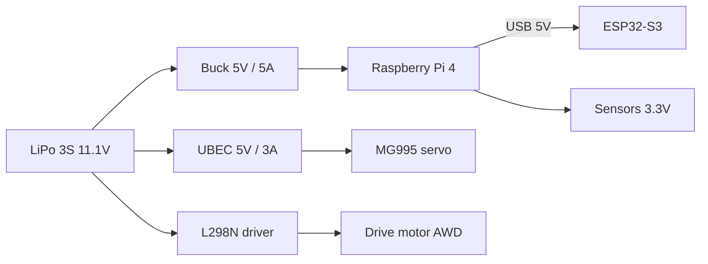

<!--
=============================================================================
WRO 2026 — 4WS AWD Autonomous Robot
File: docs/datasheets/README.md
Rev:  v9.9  |  Status: RELEASED
=============================================================================
-->

# Component Datasheets

Quick-reference electrical data for every part on the robot. The
official datasheet PDF is linked per component — use this folder for
planning, the PDF for the final word.

| Component | File | Power rail | Interface | Official datasheet |
|-----------|------|------------|-----------|--------------------|
| Raspberry Pi 4 Model B | [raspberry_pi_4b.md](raspberry_pi_4b.md) | 5V rail | GPIO, I2C1, UART | [PDF](https://datasheets.raspberrypi.com/rpi4/raspberry-pi-4-product-brief.pdf) |
| ESP32-S3 | [esp32_s3.md](esp32_s3.md) | Pi USB (5V) | UART, PWM | [PDF](https://www.espressif.com/sites/default/files/documentation/esp32-s3_datasheet_en.pdf) |
| L298N driver module | [l298n.md](l298n.md) | Motor rail 11.1V | ENA / IN1 / IN2 | [PDF](https://www.st.com/resource/en/datasheet/l298.pdf) |
| MG995 steering servo | [mg995.md](mg995.md) | Servo rail (UBEC 5V) | 50 Hz PWM | [PDF](https://www.electronicoscaldas.com/datasheet/MG995_Tower-Pro.pdf) |
| MPU6050 IMU | [mpu6050.md](mpu6050.md) | Pi 3.3V | I2C | [PDF](https://invensense.tdk.com/wp-content/uploads/2015/02/MPU-6000-Datasheet1.pdf) |
| QMC5883L magnetometer | [qmc5883l.md](qmc5883l.md) | Pi 3.3V | I2C | [PDF](https://nettigo.eu/attachments/437) |
| VL53L0X ToF (left/right) | [vl53l0x.md](vl53l0x.md) | Pi 3.3V | I2C | [PDF](https://www.st.com/resource/en/datasheet/vl53l0x.pdf) |
| VL53L1X ToF (front) | [vl53l1x.md](vl53l1x.md) | Pi 3.3V | I2C | [PDF](https://www.st.com/resource/en/datasheet/vl53l1x.pdf) |
| Drive motor (AWD) | [drive_motor.md](drive_motor.md) | Motor rail (via L298N) | PWM DC | none — bench measured |
| LiPo 3S battery | [lipo_battery.md](lipo_battery.md) | source (11.1V) | XT60 | none — manufacturer data |

All power rails are defined in
[`docs/power/POWER_DISTRIBUTION.md`](../power/POWER_DISTRIBUTION.md);
pin connections are in [`docs/wiring/WIRING.md`](../wiring/WIRING.md).
