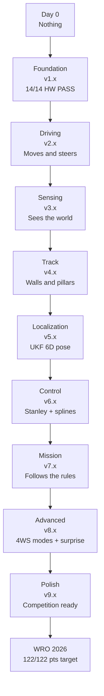
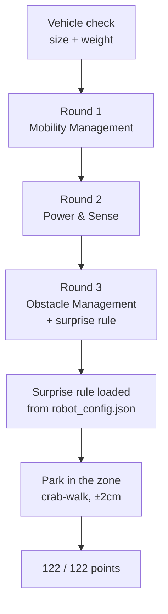

# The Full Journey — 90 Versions of Growth

```
v1.x          v2.x          v3.x          v4.x          v5.x
FOUNDATION    DRIVING       SENSING       TRACK         LOCALIZATION

v6.x          v7.x          v8.x          v9.x
CONTROL       MISSION       ADVANCED      POLISH
```

This folder holds 90 snapshots of our WRO 2026 4WS robot software as it grew
from nothing into something that drives, sees, thinks, and parks.

Each version folder has:
- `CHANGE.md` — what changed, why, what broke, how we fixed it
- Code files — the actual code at that moment (warts and all)

## The Journey at a Glance



## Hardware

| Component | Detail |
|-----------|--------|
| Brain | Raspberry Pi 4B |
| Muscle | ESP32-S3 (watchdog 200ms) |
| Range | VL53L1X front + 2x VL53L0X (XSHUT sequenced) |
| IMU | MPU6050 (magnetometer disabled) |
| Steering | Single MG995 servo 4WS linkage (rear ratio 0.85) |
| Motor | TB6612FNG / L298N, short-brake stop |
| Vision | 640x480 @ 30 FPS HSV pillar/marker detection |
| UI | 5 green LEDs + Switch 2 (GPIO 5/6/13/19/26/16) |
| Link | CRC8 binary packets @ 100 Hz |

## The 9 Major Phases

| Phase | Versions | Result |
|-------|----------|--------|
| v1.x | Foundation & Hardware Testing | 14/14 components PASS |
| v2.x | Basic Driving | 1.8 m/s, 0.5m radius |
| v3.x | Sensing the World | IMU + 3x ToF + camera live |
| v4.x | Understanding the Track | walls, corners, pillars |
| v5.x | Localization & Fusion | UKF 6D pose pipeline |
| v6.x | Control & Planning | Stanley + spline + profile |
| v7.x | Mission & Behavior | 7-state machine, parking |
| v8.x | Advanced Features | 4WS modes, surprise rules |
| v9.x | Polish & Competition Ready | 122/122 pts target |
## By The Numbers

| Metric | Value |
|--------|-------|
| Total versions | 90 (v1.0 → v9.9) |
| Bugs documented | 85+ (one per version) |
| Layers | 11 (L0 system manager → L10 controller) |
| Max speed | 1.8 m/s |
| Min turning radius | 0.5 m (opposite-phase 4WS) |
| UKF state dimensions | 6 (x, y, theta, v, omega, gyro_bias) |
| Steering modes | 3 (same-phase, opposite-phase, crab-walk) |
| Parking precision | ±2 cm parallel tolerance |
| Competition target | 122/122 pts |

## Race Day — From Start Line to 122 Points



The full story of how this robot got here — every version, every bug,
every fix — is documented in the 90 version folders above.
