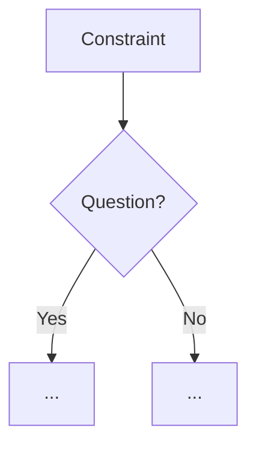

# TEMPLATE — Engineering Evolution Journal Format (v1.0 → v9.9)

Every version folder's `CHANGE.md` must be a **~10,000-word engineering
reasoning document** — a top-tier engineering journal entry that shows *how we
thought*, not just *what we did*. It must read like a senior robotics engineer
walking a junior through every decision: constraints, first-principles
derivation, alternatives, trade-offs, failure analysis, verification.

Target word count: **9,500–10,500 words** per file.
Minimum 2 mermaid flowcharts per file (decision flowchart + data/architecture flow).

---

## Mandatory section structure (in this exact order)

### 1. Version header table

```markdown
| Version | Phase | Days |
|---------|-------|------|
| vX.Y | <Phase Name> | Day A-B |
```

Keep the Phase and Days exactly as in the current short CHANGE.md.

### 2. Title
`# vX.Y — <Short technical title>`

### 3. Mission of this version (~600 words)
- The single problem this version attacks and **why it is the correct next
  step** on the critical path to the competition.
- What capability gap existed at the end of the previous version.
- What "done" looks like — measurable acceptance criteria written *before*
  the work.

### 4. Engineering context — where we stood (~800 words)
- Recap of the previous version's capability and its known weaknesses.
- The system-level constraints that shape everything (WRO size/weight limits,
  Pi 4B CPU budget, ESP32-S3 real-time role, 100 Hz serial link, battery).
- What pressure existed (time to race, risk of compounding debt).

### 5. The engineering thought process — first principles (~2,000 words)
This is the heart. Write it as real reasoning, not a summary:
- 5.1 Constraints and hard limits (derive them from first principles with
  numbers: e.g. 100 Hz link × 25 bytes = 20 kbps, Pi CPU at 640×480 HSV etc.)
- 5.2 Requirements derived from constraints (traceable: "constraint C ⇒
  requirement R").
- 5.3 Alternatives considered — at least 3, each with a short honest analysis.
- 5.4 Trade-off matrix table (rows = alternatives, columns = effort /
  robustness / speed / risk / reuse; scores with justification).
- 5.5 Decision + mathematical / logical justification for the winner.
- 5.6 What we deliberately deferred and why (scope control).

### 6. Decision flowchart (~500 words + mermaid)

The flowchart must capture the *branching decision process* of section 5.

### 7. Implementation blueprint (~2,000 words)
- Step-by-step how the code was built: modules, functions, data structures,
  thread model, timing budget.
- Walk through the real code in the version folder — reference actual
  function names, constants, and design choices verbatim.
- Explain the interface contract (inputs, outputs, failure behavior).

### 8. Architecture / data-flow flowchart (~400 words + mermaid)
Second mandatory flowchart: how data flows through this version's system
(sensor → fusion → decision → actuator).

### 9. Errors, failures, and root-cause analysis (~1,500 words)
For each error in the original CHANGE.md:
- Symptom (what we observed)
- Initial hypotheses (what we guessed, honestly)
- Investigation (what we measured / logged / re-read)
- Root cause (with mechanism — why the bug happened physically/logically)
- Fix (exact change)
- Prevention (process change so it never returns)
Use the original "Key error fixed" as the seed but expand every step.

### 10. Verification and metrics (~800 words)
- Test procedure performed.
- Raw numbers measured (speeds, times, error rates, latencies).
- Pass/fail against the acceptance criteria from section 3.
- What we trusted vs. what we still distrusted afterwards.

### 11. Lessons learned — permanent mental models (~600 words)
- 3–5 deep lessons that changed how we will engineer the *next* versions.
- Connect each lesson to a concrete future risk it prevents.

### 12. Code in this snapshot
Keep the exact file list from the original CHANGE.md.

### 13. Bridge to the next version (~400 words)
- What capability this version unlocks.
- The known debt / next problem that v(X.Y+1) must attack, with one line of
  reasoning on why.

---

## Writing rules (all agents must obey)

1. **First person plural** — "we", our engineering team journal voice.
2. **Honesty** — show wrong guesses, dead ends, and the moment of insight.
3. **Numbers everywhere** — speeds, timings, sizes, rates, tolerances.
4. **Traceability** — every decision traces back to a constraint or measurement.
5. **Specificity** — reference the actual code in the version folder; never
   invent API names that don't exist in the code.
6. **No fluff repetition** — every paragraph must carry information or reasoning.
7. **Flowcharts** — mermaid `flowchart TD`; label edges with reasons.
8. **Markdown tables** for trade-offs and metrics.
9. Write the file in ONE complete `write` call if possible; if the file is too
   long for a single call, write it in 3–4 sequential parts (write + append via
   `edit`/additional writes) until complete.
10. Verify word count at the end with:
    `(Get-Content "<file>" -Raw).Split(@(' ','`n','`r','	'),[System.StringSplitOptions]::RemoveEmptyEntries).Count`
    Target 9,500–10,500. If under, expand sections 5, 7, and 9 first.
11. Do NOT change the phase names or day numbers from the original file.
12. Do NOT create new files — only overwrite `CHANGE.md` in the assigned folder.
