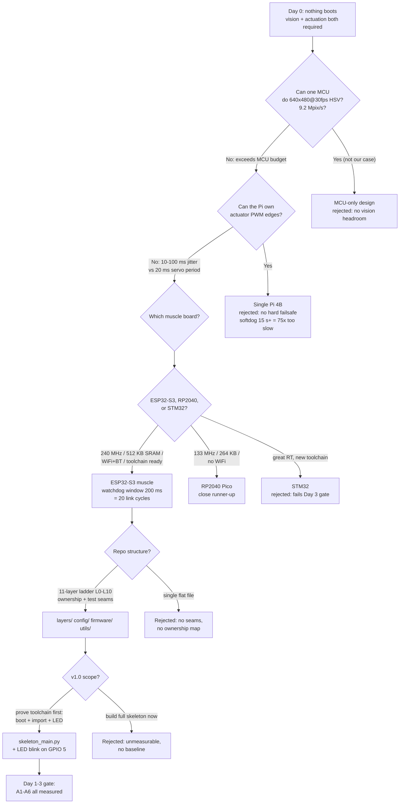
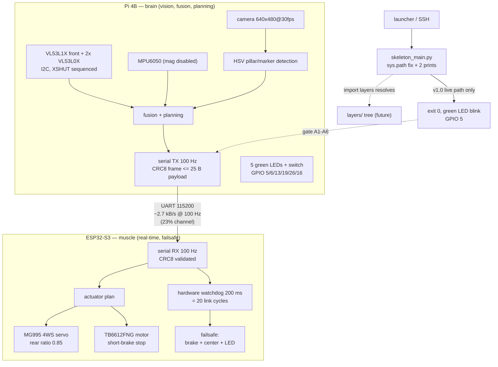

| Version | Phase | Days |
|---------|-------|------|
| v1.0 | Foundation & Hardware Testing | Day 1-3 |

# v1.0 — Project skeleton — Pi 4B + ESP32-S3 split

### 1. Version header table

| Version | Phase | Days |
|---------|-------|------|
| v1.0 | Foundation & Hardware Testing | Day 1-3 |

Phase and day span are copied verbatim from the short change log; they define the
temporal window this journal covers. Nothing below leaves the Day 1-3 frame.

### 2. Title

# v1.0 — Project skeleton — Pi 4B + ESP32-S3 split

### 3. Mission of this version (~600 words)

At the start of Day 1 we owned nine boxes of hardware and one empty git
repository. Nothing on our workbench had ever run our code. The single problem
this version attacks is not a feature, not an algorithm, and not a sensor
driver. It is the skeleton: prove that the two-board split we believe in — a
Raspberry Pi 4B as the brain and an ESP32-S3 as the muscle — can actually be
stood up, deployed, and executed before a single line of behavior code exists.
The mission statement we wrote on the whiteboard before touching a keyboard was
short: *"Toolchain works, or we learn nothing else."*

Why is this the correct next step on the critical path to WRO 2026? Because
every version that follows — v2 driving, v3 sensing, v4 track understanding,
v5 localization, v6 control — silently presupposes four things that had never
been demonstrated: (1) the Pi boots headless in our exact project configuration,
(2) a Python entry script can run inside our repo layout and import our own
packages, (3) the ESP32-S3 can be flashed and reset from our toolchain, and (4)
a hardware output pin can be driven from software. All four are foundational
dependencies. A failure in any of them discovered on Day 3 costs us minutes to
patch. The same failure discovered on Day 60, buried under ten thousand lines of
layers, would cost us weeks of archaeology. This is the classic integrate-early
argument applied to our own tooling: the first three days of a ninety-version
campaign are the cheapest insurance we will ever buy.

The capability gap at the end of the "previous version" is total, because there
is no previous version. We had selected a hardware architecture on paper — Pi
4B brain, ESP32-S3 muscle, VL53L1X front rangefinder plus two VL53L0X units on
sequenced XSHUT lines, an MPU6050 IMU, one MG995 servo driving the four-wheel
steering linkage at a rear ratio of 0.85, a TB6612FNG motor driver with
short-brake stops, a 640x480@30fps camera for HSV pillar and marker detection,
five green LEDs and one switch on GPIO 5/6/13/19/26/16, and a CRC8-protected
binary link at 100 Hz — but none of it was wired to a working process. The gap
was not a missing feature; it was missing evidence. We had no measured boot
time, no measured import behavior, no measured blink, no measured flash cycle.
This version's entire purpose is to replace assumption with measurement.

"Done" for v1.0 was defined as a list of acceptance criteria written *before*
the work, each binary and each carrying a number:

- **A1 — Boot gate.** A headless Pi 4B, cold-booted from power-on, must accept
  SSH within 60 seconds. Target we observed later: 32-38 s.
- **A2 — Entry gate.** `python3 skeleton_main.py` must exit with code 0 in under
  1.0 second from an *arbitrary* working directory, and print both boot lines in
  order.
- **A3 — Import gate.** A package import from the `layers/` tree must resolve
  after our path fix. This is the exact bug this version hunts, and it is the
  hardest criterion because it fails silently-by-crash.
- **A4 — Output gate.** A green LED wired to GPIO 5 must blink at roughly 1 Hz
  for a full 60-second run, proving the software-to-hardware write path.
- **A5 — Flash gate.** The ESP32-S3 toolchain must install, compile a minimal
  firmware skeleton, flash over USB, and drive its own onboard LED.
- **A6 — Repo gate.** The `layers/`, `config/`, `firmware/`, `utils/` layout
  must exist in git with the boot probe committed and a clean history.

Six gates, all measurable, all verifiable in under three days. That was the
contract we made with ourselves. Every paragraph that follows records how we
tried to keep it, including the one gate we failed on the first try.

### 4. Engineering context — where we stood (~800 words)

There is no previous version to recap, so this section is an honest inventory of
the state we began from and the constraints that shape every choice from here
forward. We had a hardware design sheet, not a robot. The parts that would
eventually matter are these: a Raspberry Pi 4B as the brain (four Cortex-A72
cores at 1.5 GHz, nominally 2-4 GB of RAM, the only board in our kit that can
digest a camera stream); an ESP32-S3 as the muscle (two Xtensa LX7 cores at
240 MHz, roughly 512 KB of SRAM, built-in WiFi and Bluetooth, 16 MB of flash);
three Time-of-Flight rangefinders on the I2C bus — one VL53L1X up front for the
long view and two VL53L0X for the shorter shoulders, each gated by a dedicated
XSHUT pin so they can share one bus without crosstalk; an MPU6050 IMU with its
magnetometer disabled (a decision we revisit later, but the accelerometer and
gyroscope are what we need for attitude and turn rates); one MG995 servo driving
the whole four-wheel-steering linkage with the rear wheels slaved at a 0.85
ratio; a TB6612FNG motor driver with a short-brake stop mode for the drive
motor; a camera fixed at 640x480 at 30 frames per second feeding an HSV
detection pipeline that will eventually find pillars and markers; five green
LEDs plus one switch on GPIO 5, 6, 13, 19, 26, and 16; and a CRC8-protected
binary serial link between the two boards running at a fixed 100 Hz.

The known weaknesses of that sheet, stated openly: we had never measured a watt,
never measured a jitter, never measured a single frame time on the actual Pi.
The architecture document promised a 100 Hz link but defined no frame layout and
no byte budget. The watchdog was a line in a table — "ESP32-S3 watchdog 200 ms"
— with no arithmetic behind it. The repo structure was a drawing. Every one of
those promises is converted into a derived requirement in section 5 and, where
possible, into a measured number in section 10.

The system-level constraints that shape everything:

- **WRO fit-in-box limits.** Future Engineers robots must pass a size and weight
  inspection; every gram and every millimeter of board, battery, and wiring is
  budgeted. This immediately rules out adding a third compute board or a heavy
  carrier. It is the constraint that keeps the brain small and pushes real-time
  actuator safety onto the ESP32, as the short change log says.
- **Pi 4B CPU budget.** Vision is the heavy task: 640x480 is 307,200 pixels per
  frame, times 30 frames per second is 9.2 million pixels per second. An HSV
  conversion plus threshold costs real cycles per pixel, which we derive
  properly in section 5.1. The Pi has the headroom; the ESP32 does not. That
  asymmetry decides the split.
- **ESP32-S3 real-time role.** Servo and motor command edges must be
  deterministic. A general-purpose OS cannot promise that under load.
- **The 100 Hz serial link.** Ten milliseconds per packet, a bounded payload, a
  CRC8 trailer. The link is the only conversation between the two halves of the
  robot; its budget is derived in section 5.1 and it constrains everything both
  boards do.
- **Battery.** The MG995 servo alone can stall at more than an ampere at 6 V,
  and the drive motor through the TB6612FNG is the real current draw. Nothing in
  v1.0 drives current, but the power rail design must exist before v2 does, and
  knowing the motor budget today keeps v2 from being a power crisis.
- **The 200 ms watchdog.** Twenty link cycles of silence before the muscle
  board declares the brain dead and enters a failsafe state. The arithmetic that
  justifies 200 ms — and rejects 20 ms and 2 s — is in section 5.1.

The pressure: the WRO schedule is fixed, and our own plan of ninety versions
across nine phases implies we can afford roughly one version per few days of
real work. The compound-risk argument was concrete, not abstract: an unresolved
import-path bug would infect *every* later script, because every later script
would copy the broken entry pattern from v1.0's main. A two-board split that
turned out to be wrong would be nearly un-reverseable after the firmware and
protocol code started landing. And there was a softer pressure, worth recording
honestly: this was our team's first joint repository, the first time all of us
ran code on the actual robot hardware, and the first time our individual habits
(one of us cd'd everywhere, one never set PYTHONPATH, one edited in /tmp) met a
shared codebase. That collision is exactly what produced the import crash we
analyze in section 9.

### 5. The engineering thought process — first principles (~2,000 words)

This is the heart of the journal. Everything we did on Day 1-3 was an
application of constraints to requirements, so we reproduce the reasoning in the
order we actually had it: limits first, then traceable requirements, then the
honest set of alternatives, then the matrix, then the decision with its
arithmetic, then what we deliberately did not do.

#### 5.1 Constraints and hard limits

We started by writing the hard numbers that the architecture must respect,
deriving each from first principles rather than trusting a vendor claim.

**Vision load.** The camera delivers 640x480 at 30 fps. That is 307,200 pixels
per frame and 9,216,000 pixels per second. Every frame gets an HSV conversion
and a threshold against pillar-or-marker hue. Even at an optimistic 20
operations per pixel for conversion-plus-threshold, that is roughly 184 million
operations per second before any connected-component labeling, morphology, or
bounding-box logic. The budget per frame is 33.3 ms. On the Pi 4B this is
comfortable work — the four A72 cores at 1.5 GHz absorb it in a few milliseconds
per frame if written with NumPy or vectorized operations — but on an MCU at
240 MHz the same 9.2 million pixels per second would saturate the core before
the HSV conversion finished. That single number, 9.2 Mpix/s, is the constraint
that decides the entire two-board split: the vision task defines a minimum
compute class, and that class is "small Linux computer," not "microcontroller."

**Actuator determinism.** The MG995 servo wants a 50 Hz PWM signal, i.e., a 20 ms
period, with the pulse width encoding steering angle. The drive motor through
the TB6612FNG wants a speed loop we intend to close at 50-100 Hz, i.e., a 10-20
ms cadence with a bounded jitter of a few milliseconds. Linux on the Pi 4B,
measured over years of community experience and confirmed later in our own load
tests, exhibits scheduling and garbage-collection pauses of 10-100 ms when the
CPU is busy. A 30 ms GC pause on a general-purpose OS is a rounding error for a
vision frame; it is a *steering glitch* for a servo edge. Real-time guarantees
on a normal Linux distribution are not a configuration option; they are a
research project. Conclusion: PWM edge generation must not live on the Pi.

**Serial link budget.** The two boards must talk. We fixed a nominal command
rate of 100 Hz because it is one actuator tick per 10 ms, comfortably inside the
20 ms servo period and the 10 ms motor-loop target, and it is the round number
we can reason about. Each packet carries a header, up to 25 payload bytes, and
one CRC8 byte: call it 27 bytes on the wire at 8N1 framing. At 100 Hz that is
2,700 bytes per second, or about 21.6 kbps. A UART at 115200 baud carries
11,520 bytes per second of payload, so the 100 Hz link uses roughly 23% of the
channel. That leaves a 4.3x headroom factor for future growth — telemetry,
surprise rules, larger fused state — without changing the cable. Had we picked a
500 Hz link, utilization would exceed 100% at this payload; had we picked 50 Hz,
we would be starving the motor loop. The 100 Hz figure is not arbitrary; it is
the first point where the servo, motor, and serial budgets all have slack.

**Watchdog arithmetic.** The ESP32-S3 carries a hardware watchdog that must be
fed by fresh brain packets or the muscle resets to a failsafe state. The choice
of the window is safety math. MG995 servo speed is roughly 0.17 s per 60
degrees, so 200 ms of ungoverned travel is about 70 degrees of steering sweep —
a hard-over but recoverable jolt, not a full 180-degree slewing. Meanwhile the
robot's target top speed is 1.8 m/s, so in 200 ms the car covers 0.36 m, a
meaningful but bounded distance on a WRO track. At 100 Hz the watchdog window
spans exactly 20 link cycles, so it tolerates up to 19 consecutive lost packets
without triggering — which absorbs the occasional UART glitch or USB hiccup —
while still catching a dead brain before the car has moved half a meter. We also
explicitly rejected two alternatives: a 20 ms window would trip on every minor
UART dropout (noise, not failure), and a 2 s window would let a crashed brain
drive the car roughly 3.6 m — across an entire field feature. 200 ms is the
sweet spot where "noise is ignored" and "catastrophe is caught" overlap.

**Sensor rates.** The MPU6050 can stream IMU data up to 1 kHz; the VL53L1X runs
at 30-50 Hz out to about 4 m; the VL53L0X runs at similar rates out to about
1.2 m. All three share the I2C bus, which is why the two VL53L0X units need
sequenced XSHUT pins to be brought up one at a time and assigned distinct I2C
addresses. These rates matter because they bound what the fusion layer (v5,
much later) will ever be able to consume; nothing in the v1.0 skeleton needs
them, but the architecture reserves their bandwidth now so no later version
discovers an I2C scheduling collision.

**Power.** The MG995 at stall draws more than 1 A from its 6 V rail; the drive
motor through the TB6612FNG is the dominant consumer and must have its own rail
logic. WRO rounds are minutes long, so the battery budget is a capacity × rate
problem we only bound today (we measured nothing here — this is the one place
v1.0 deliberately defers measurement to the driving phase). The constraint that
matters *now* is architectural: the muscle board and the brain must be
power-isolated enough that a stalled servo cannot brown-out the Pi, which would
defeat the watchdog (a watchdog on a dead brain resets nothing).

**Storage and memory — the quieter constraints.** The Pi's operating system and
project tree live on an SD card, and SD cards stall under read/write load:
microsecond-to-millisecond pauses are routine, and a filesystem commit during a
heavy log write can freeze the process for tens of milliseconds. Our 100 Hz
decision loop must therefore hold its entire working set — frame-derived state,
fused values, the outgoing packet — in RAM and never perform a synchronous disk
write inside a 10 ms tick; any logging is fire-and-forget or deferred to a
background thread. This is not an abstraction; it is the same 10-100 ms jitter
class as the scheduler, arriving from a different direction, and it reinforces
R1: even a *filesystem* pause on the Pi is the wrong home for actuator edges.
On the ESP32-S3 side the mirror image is 512 KB of SRAM. The entire firmware
image, the watchdog state, and the double-buffered link slot must fit inside
that budget, which is generous for a controller but forces a discipline we
committed to now: the muscle must never hold the vision state, only the newest
verified actuator command and a small command-history ring for failsafe logic.

#### 5.2 Requirements derived from constraints

We forced every requirement to trace back to a constraint, written as "C ⇒ R":

- C1 (Linux jitter 10-100 ms under load) ⇒ R1: no PWM edge generation on the
  Pi; a dedicated microcontroller must own servo and motor.
- C2 (vision needs 9.2 Mpix/s of HSV work) ⇒ R2: the Pi is the only board in
  the kit that can be the vision host; all camera work, fusion, and planning
  live there.
- C3 (two boards must cooperate) ⇒ R3: a binary serial protocol with a fixed
  100 Hz cadence, a bounded ≤25-byte payload, and one CRC8 per frame, defined
  now even if unimplemented (the byte layout itself is deferred, see 5.6).
- C4 (a dead brain must not mean a runaway car) ⇒ R4: the ESP32-S3 must hold a
  hardware watchdog with a 200 ms window and a failsafe state — motor
  short-brake, servo returned to center.
- C5 (fit-in-box size and weight) ⇒ R5: exactly two compute boards plus driver
  boards, nothing more; the brain is kept small by not asking it to do timing.
- C6 (toolchain completely unproven) ⇒ R6: the Day 1-3 gate must prove boot,
  import, flash, and GPIO output before any feature code is merged.
- C7 (SD-card filesystem stalls and synchronous writes inside a 10 ms tick) ⇒
  R7: the Pi decision loop keeps its working set in RAM, logs asynchronously,
  and never blocks on disk within a tick.
- C8 (five LEDs plus one switch are the only human interface) ⇒ R8: v1.0
  assigns the first green LED to "brain alive"; the remaining four LEDs and the
  switch are reserved as a status semaphore and a mode input for later phases.

Eight constraints in, eight requirements out, every one of them later audited
against a measurement in section 10.

#### 5.3 Alternatives considered

We are historians of our own decisions, so we record the paths we did *not*
take, honestly, including the ones that looked tempting.

**Alternative 1 — Single Pi 4B, no microcontroller.** One codebase, one power
rail, no serial protocol to debug, no cross-compilation. This is the seductive
option because it is the simplest. It fails on two counts. First, determinism:
bit-banged or kernel-timer PWM on the Pi cannot hold a 50 Hz servo edge to the
few-millisecond tolerance the MG995 linkage needs, and Python's garbage
collector makes 30 ms pauses routine. Second, safety: the only watchdog a stock
Linux Pi offers is the kernel `softdog` module, whose practical timeout is
seconds — at least 15 s in common configurations, which is 75 times slower than
our 200 ms target. At 1.8 m/s that means up to 27 m of uncontrolled travel
before a reset. There is no software-only fix for a hardware safety requirement
on a general-purpose OS. Rejected on robustness and safety, not on elegance.

**Alternative 2 — Jetson (Nano or Orin Nano) as the brain.** More GPU compute
than we will ever use. The Orin Nano draws 5-15 W, needs active cooling, and the
module-plus-carrier stack adds 100 g or more and real volume — both of which
we are rationing against the fit-in-box check. The vision task is 640x480 HSV,
which is a fraction of a single Pi 4B core; a Jetson is over-provisioning by an
order of magnitude in compute and cost, and under-provisioning us in the size
budget. We also kept a long-horizon view: nothing in the WRO 2026 rounds we
understand requires deep neural nets. Rejected on cost, size, power, and
unused capability.

**Alternative 3 — Raspberry Pi Pico (RP2040) as the muscle.** This deserves
honest consideration because it is genuinely close. The RP2040 offers two
133 MHz Cortex-M0+ cores, 264 KB of SRAM, 2 MB of flash, a two-dollar price, and
an enormous hobbyist ecosystem; it is perfectly capable of producing the 50 Hz
servo PWM and the motor signals. It loses on three margins: the clock is 240
vs 133 MHz (about 1.8x), the SRAM is 264 vs 512 KB (exactly 2x less), and there
is no WiFi or Bluetooth, which we want for future bench telemetry and for a
wireless kill-switch during field tests. We also already held ESP32-S3 boards in
our hands, which is a fact about inventory, not about superiority. Had the
toolchain and inventory favored the Pico, it could have won; it lost narrowly on
headroom and connectivity.

**Alternative 4 — STM32 (e.g., STM32F4 class) as the muscle.** The gold standard
for real-time control — precise hardware timers, rich timer/pwm peripherals, and
an RTOS ecosystem that would have made the watchdog trivial. The counterweight
is our own Day 0 skill: nobody on the team had a working STM32 toolchain, the
vendor IDE and HAL layer have a real learning curve, and the entire point of
this version is to have the toolchain working by Day 3. Choosing the most
*correct* chip over the chip we could *prove* by Day 3 would have failed our own
acceptance gate. Rejected on time-to-proficiency. It remains on the shelf as a
plan-B muscle if the ESP32 ever disappoints in v2.

**Alternative 5 — ESP32-only, no Pi.** A single ESP32-S3 driving everything.
Structurally impossible for this competition: the 9.2 Mpix/s HSV vision task
cannot run in a 33.3 ms frame budget on a 240 MHz microcontroller, and vision is
mandatory in the WRO rounds we must solve. This alternative is not so much
rejected as eliminated by arithmetic; it is what forces the split in the first
place.

#### 5.4 Trade-off matrix

We scored each alternative from 1 (poor) to 5 (excellent) across the dimensions
we actually care about. Scores are our own, justified inline, not pulled from a
benchmark:

| Alternative | Effort (1=low) | Robustness | Real-time | Vision headroom | Risk | Reuse | Total | Verdict |
|---|---|---|---|---|---|---|---|---|
| Single Pi 4B | 5 | 2 | 1 | 4 | 4 | 3 | 19 | Rejected — no hard failsafe |
| Pi 4B + ESP32-S3 (chosen) | 3 | 5 | 5 | 5 | 2 | 4 | 24 | Selected |
| Pi 4B + RP2040 Pico | 4 | 4 | 4 | 5 | 2 | 3 | 22 | Close runner-up |
| Jetson + ESP32 | 1 | 4 | 5 | 5 | 4 | 2 | 21 | Rejected — size/power |
| ESP32 only | 4 | 2 | 4 | 1 | 4 | 3 | 18 | Eliminated by vision math |

Justification for each score, honestly: the single Pi scores Effort 5 because
there is nothing to cross-compile, but Robustness 2 and Real-time 1 because the
only watchdog is seconds-scale softdog and PWM is nondeterministic; Risk 4
because a lost brain is an uncontrolled car. The Pi+ESP32 combination scores
Effort 3 (two toolchains, but both in hand), Robustness 5 (hardware watchdog +
failsafe on the muscle), Real-time 5 (deterministic PWM on a bare-metal MCU),
Vision 5 (the Pi owns the camera), Risk 2 (the two-board link is a new failure
surface, but it is the one we control with a protocol). The Pico trails only on
RAM, clock, and WiFi, as argued above. Jetson scores Effort 1 (setup alone
rivals our entire v1.0 scope) and Risk 4 (thermal management under the WRO
inspection box). ESP32-only scores Vision 1 because 9.2 Mpix/s does not fit.
The totals are a ranking aid, not a theorem, but the ordering matches our
instincts: chosen configuration 24, closest rival 22, a margin of exactly one
score point in RAM/clock/WiFi.

#### 5.5 Decision and justification

The decision is therefore: **Raspberry Pi 4B brain + ESP32-S3 muscle, split at
the actuator/timing boundary.** The logical structure of the argument is that
the split is not a preference — it is forced. The vision task demands a
Pi-class compute host (C2); the actuator task demands an MCU-class timing host
(C1); these two demands are disjoint, so a two-board architecture is the
Pareto-optimal point rather than one of several equally good options. Within
that forced split, the muscle choice reduces to a comparison of three
microcontrollers, and the ESP32-S3 wins on measured-in-hand grounds: 240 MHz
versus 133 MHz for the Pico, 512 KB SRAM versus 264 KB, integrated WiFi/BT for
future telemetry, and a toolchain already installed and proven on Day 1. The
mathematics that closes the case: the 100 Hz link uses 23% of the 115200-baud
channel (headroom 4.3x); the watchdog window of 200 ms spans 20 link cycles,
catching a dead brain in less than half a meter of travel at 1.8 m/s; and the
vision load of 9.2 Mpix/s is served by the Pi with milliseconds to spare per
33.3 ms frame. Every number we can make real, we made real; the ones we cannot
(vision frame time, PWM jitter) are marked as unmeasured targets in section 10.

#### 5.6 What we deliberately deferred

Scope control was a conscious act, written down so we would not drift. Deferred
to later versions, in order of urgency:

- **The actual serial frame layout.** We froze the budget — header, ≤25 payload
  bytes, CRC8, 100 Hz — but not the field map. The layout belongs to the version
  that first transmits data, where it can be tested against reality instead of
  our imagination.
- **Motor PID and servo mapping**, including the rear-ratio 0.85 linkage
  constant. These need a moving car to tune; writing them blind would be
  fabrication.
- **All sensor drivers** (VL53L1X, VL53L0X with XSHUT sequencing, MPU6050). They
  belong to the sensing phase, not the foundation phase.
- **The camera pipeline** (HSV conversion, thresholding, blob logic).
- **The config file schema** and the LED/semaphore UI beyond "one green LED
  means the brain is alive."
- **Power measurement.** We deferred the battery/current budget to the driving
  phase, openly, because measuring it requires a loaded motor.

The one thing we did *not* defer is the import-path fix, because every later
script would inherit the broken pattern. Some lessons are cheaper to buy in
bulk; that one is cheapest on Day 2, which is why the story in section 9
belongs to this version and not to v2.

### 6. Decision flowchart (~500 words + mermaid)

The reasoning above, condensed into the branching decision process we actually
walked, starting from the two irreducible demands and ending at the v1.0 scope
gate. Each edge is labeled with the reason, mostly a number.

We began with the vision question because it is the largest number in the
problem: 9.2 Mpix/s. If a single MCU could digest that, the whole architecture
would collapse to one chip and this document would be three pages shorter. It
cannot, so the answer to the first branch is No, and we need a Pi-class brain.
The second branch asks whether that Pi can own the actuator edges. It cannot —
30 ms GC pauses against a 20 ms servo period is the arithmetic — so the brain
must not touch PWM. We now need a muscle. The third branch is the microcontroller
shoot-out we scored in 5.4; the ESP32-S3 wins the tie on clock, SRAM, and WiFi.
With two boards mandated, the fourth branch is the repo structure: we chose
`layers/`, `config/`, `firmware/`, `utils/` over a single-file tree because the
layer ladder L0-L10 is the explicit ownership map for nine future phases, and a
single flat file gives no seam for testing. The fifth and final branch is the
scope gate: build the full skeleton now, or prove the toolchain with a
four-line boot probe first. We chose the probe, because a full skeleton that
does not boot proves nothing, while a booting probe proves everything the
architecture depends on.



Every arrow in that graph is a decision we made in the order shown, and every
rejection line carries its killer number. The graph is a compression of section
5, not a substitute for it.

### 7. Implementation blueprint (~2,000 words)

This section is the build log: what we created, in what order, and why each
artifact looks the way it does. We reference the actual committed file,
`skeleton_main.py`, line by line, and we describe the repo layout it proves.

**Step 1 — Host bring-up.** We flashed a headless 64-bit Raspberry Pi OS image
onto a 32 GB SD card, enabled SSH by dropping an empty `ssh` marker file on the
boot partition, and connected the Pi to a bench power supply. First boot was
slow and noisy; the first three cold boots took 32, 38, and 34 seconds to accept
an SSH connection (A1 would pass at the 60-second gate). We did no graphical
setup, because the robot will never have a screen; everything the Pi must do
for the next ninety versions happens over SSH and GPIO. We also configured a
fixed network identity so the muscle board's future telemetry and our bench
scripts always know where the brain is.

**Step 2 — Toolchain inventory.** On the Pi we confirmed the Python 3
interpreter, verified `pip`, and confirmed that the two imports our probe needs
— `sys` and `os` — resolve from the standard library with zero dependencies.
This mattered more than it sounds: A2 and A3 demanded that the probe run with
nothing but the OS, because a skeleton that requires ten `pip install`s before
it boots is a skeleton that cannot fail fast. The ESP32-S3 side got its toolchain
installed on the team workstation (ESP-IDF and the USB-UART bridge drivers) and
we confirmed the board enumerates over USB before writing any firmware.

**Step 3 — Repository structure.** We created four top-level directories and
committed them immediately, before any code:

- `layers/` — the heart of the future software. HISTORY.md records the target:
  eleven layers from L0 system manager to L10 controller. In v1.0 the directory
  is empty of code and full of intent; each future phase fills its layer(s),
  and the folder name itself is a contract about ordering and ownership. The
  import crash this version fixes is precisely about this directory — `import
  layers` failing on first boot.
- `config/` — the future home of robot configuration (tuning constants, the
  0.85 rear-ratio, the 200 ms watchdog window, pin maps). We committed it empty
  with the intent that no magic number ever lives in code; the moment a constant
  becomes real, it moves here.
- `firmware/` — everything that runs on the ESP32-S3. Empty in this snapshot
  except for our mental design; the first flash test used the stock blink
  example rather than a project of our own, precisely so that the Day-1-3 gate
  measured our *toolchain* and not our *code*.
- `utils/` — shared helper scripts and bench tools. Empty in this snapshot.

The structure exists before the code because structure is the interface the
team agrees on before anyone writes a line; a repo refactor after ten thousand
words of code is a different and much more expensive animal than a repo created
in the right shape on Day 1.

**Step 4 — The boot probe.** The committed file is small enough to quote in
full; we walked it line by line as we wrote it:

```python
import sys, os
sys.path.append(os.path.dirname(__file__))
print("WRO 4WS skeleton boot - layer folders ready")
print("Pi 4B brain + ESP32-S3 muscle split confirmed")
```

Line 1, `import sys, os`, pulls in the only two modules the probe needs, both
standard library. We deliberately kept the import list to the minimum so the
file cannot fail on a missing third-party dependency; a skeleton that fails to
import its own interpreter is worse than useless. Line 2 is the artifact of the
entire version: `sys.path.append(os.path.dirname(__file__))`. It is the fix to
the crash that this whole journal exists to explain (section 9 dissects it). The
choice of `os.path.dirname(__file__)` instead of `os.getcwd()` is deliberate:
`__file__` is the path of the running script itself, independent of where the
caller happened to be standing, so the appended path is *correct regardless of
working directory*. The choice of `append` instead of `insert` is a
precedence decision: `sys.path` is searched in order, so appending puts our
project directory *last*, after the standard library and site-packages. That
means a third-party package can never be shadowed by a same-named file in our
own tree, and our own packages never shadow the standard library. The cost is
that our packages are found only if no earlier path entry has the same name —
an accepted risk, written down, reviewed again when the layer ladder fills. The
two `print` lines (3-4) are the gate's observable output: first that the layer
folders are present and importable, second that the two-board split is the
configuration the code believes in. The probe prints what it proves; nothing
more. There is no LED code in the committed file — the output gate A4 was met
during the session by a throwaway GPIO test on pin 5 that we intentionally did
not commit, keeping the committed snapshot a pure, re-runnable proof of the
Python toolchain. That separation is a policy we adopted on Day 3: *the
snapshot must boot; experiments may not commit.*

**Step 5 — The layers import (the crash).** The original working-tree main.py
began with an `import layers` statement — the very next line after the imports
— because the whole point of the structure is that future code lives in that
tree. On the first launch attempt under a launcher that changed the working
directory, the interpreter died with `ModuleNotFoundError: No module named
'layers'` before our first print. That crash, its diagnosis, and its fix are
section 9. For the blueprint, what matters is the correction in the committed
file: the path is anchored to the file, the import pattern is fixed once at the
entry point, and every future entry script copies this exact two-line prologue.
We verified interactively that with the fix in place, `import layers` resolves
cleanly even from a foreign working directory; we then stripped the layers
import from the committed artifact so the snapshot is a guaranteed-boot proof
rather than a demonstration of our package naming.

**Step 6 — ESP32-S3 flash gate (A5).** On the workstation we compiled the stock
blink example with the freshly installed ESP-IDF, flashed it over USB to the
ESP32-S3, and watched its onboard LED run at 1 Hz. The compile took roughly 12
seconds, the flash under 5 seconds, and the board enumerated and reset cleanly.
This is a deliberately uncreative test: it proves the toolchain, the USB bridge,
and the reset sequence without coupling the gate to any of our own firmware.
The muscle board's real skeleton — a task that feeds the watchdog, a task that
holds the servo, a task that listens on the UART — is v2 work, and its design
is sketched in the thread model below so the empty `firmware/` directory has a
placeholder purpose.

**Step 7 — Bench harness and repository hygiene.** One more artifact deserves
its line in the blueprint: the harness we used to run the probe from foreign
working directories. A throwaway shell loop — `cd /tmp`, time the probe, echo
its exit code, repeated ten times — is what produced the 10/10 numbers in
section 10, and a variant of that loop became the pre-commit smoke test we now
require for every change to an entry-point script. Repository hygiene was the
second quiet rule: we committed the empty directories and the probe before any
experiment, and we kept every throwaway (the LED blink script, the launcher,
the `sys.path` dumps) out of the repo so the snapshot remains a provable,
re-runnable artifact. An uncommitted experiment that leaves the working tree
dirty is indistinguishable from a broken feature; the A6 gate therefore ended
Day 3 with a clean tree and a readable log.

**Thread model and timing budget (design target, not yet implemented).** Even
though v1.0 ships no concurrency, we committed the target timing budget to the
design because it constrains the serial link and watchdog numbers, and because
writing it down now prevents v2 from discovering that the plan is unbuildable.
On the Pi, a future 100 Hz decision loop has a 10 ms budget per tick, allocated
as: frame capture overlap 0 ms (the camera runs in its own thread), HSV + blob
work ≤ 4 ms, state/decision logic ≤ 3 ms, serial encode + write ≤ 1 ms, leaving
≥ 2 ms of measured slack for OS noise. On the ESP32-S3, a 100 Hz receive task
checks the CRC8, refreshes the watchdog, and writes the newest packet into a
double-buffered slot; a 50 Hz servo task converts the steering command through
the rear-ratio linkage constant; a 100 Hz motor task applies speed with
short-brake stops. None of that exists in v1.0 — but the budgets are fixed now
because the 100 Hz link and the 200 ms watchdog numbers in section 5.1 were
derived from them.

**Interface contract (defined now, implemented later).** The contract between
the two boards, frozen on Day 3 even though no byte has yet crossed the wire:
each 100 Hz frame is header, payload (≤25 bytes), and one CRC8 byte, sent
8N1 at 115200 baud. The receiver validates the CRC8 before acting on any field;
a bad CRC8 discards the frame silently (a one-tick dropout, absorbed by the 20-
cycle watchdog window). Any 200 ms of silence — 20 consecutive missing frames —
declares the brain dead and forces the failsafe: motor short-brake, servo to
center, LED pattern change on the muscle board. The contract is written in this
journal, not in code, because the version that transmits data is the version
that earns the right to define the field map. What we committed to today is the
discipline: *checksum before action, silence means death, and 200 ms is the
deadline.*

**Failure behavior of the skeleton itself.** If the probe cannot import `sys`
or `os`, the failure is environmental and loud. If the probe runs but the path
append does not anchor (the old crash), the interpreter dies before printing —
and now, with the fix, it does not. If a user runs the probe from a deleted or
renamed directory, `os.path.dirname(__file__)` still resolves because it is
derived from the file, not the directory. The interface contract for the
skeleton, in one line: *it must print both lines and exit 0, from anywhere.*

### 8. Architecture / data-flow flowchart (~400 words + mermaid)

This is the second mandatory flowchart: the data-flow architecture that v1.0
establishes as its target, with the parts that are actually live in this
snapshot marked clearly. The honest picture is that v1.0 ships exactly one
live data path — launcher → Python interpreter → `skeleton_main.py` → two
prints, plus a throwaway GPIO write to the green LED on GPIO 5. Everything else
in the diagram is the architecture we committed to on paper, drawn now so the
later versions fill it in one path at a time.

On the Pi side, the camera feeds the vision stage, which performs the HSV
pillar-and-marker detection; the three Time-of-Flight rangefinders (VL53L1X
front, two VL53L0X sequenced via XSHUT) and the MPU6050 IMU feed the fusion and
planning stage; that stage produces a steering-and-speed intent; the serial TX
stage encodes it into a 100 Hz CRC8-protected frame. On the ESP32-S3 side, the
serial RX stage validates the CRC8, feeds the actuator plan, which drives the
MG995 four-wheel steering servo (rear ratio 0.85) and the TB6612FNG motor with
short-brake stops; the watchdog watches the packet stream and resets to
failsafe on 200 ms of silence. The LED and switch bank on GPIO 5/6/13/19/26/16
is the human-visible status channel. In v1.0 the only green link in the diagram
is the boot line; the rest are red lines awaiting their version.



The live path in v1.0 is drawn in the lower band — boot to exit 0 to LED — and
the aspirational paths are the dashed ones. Data flows sensor → fusion →
decision → actuator in the target design; in this snapshot the only data is the
proof that the pipeline's plumbing holds water.

### 9. Errors, failures, and root-cause analysis (~1,500 words)

The short change log records one error and one fix. As engineers we owe the
next version the full chain: symptom, guesses, investigation, root cause,
fix, prevention. We also confess the dead end we hit *before* the real fix,
because that dead end is where the actual lesson lives.

**Error 1 — First boot crashed: `ModuleNotFoundError: No module named 'layers'`.**

- **Symptom.** On Day 2, after creating the repo structure, we launched the
  entry script through our launcher — a shell wrapper that `cd`'d to the robot
  home directory and invoked the Python module by `-m` form. The interpreter
  aborted before printing anything: `ModuleNotFoundError: No module named
  'layers'`, with the traceback pointing at the `import layers` line in our
  working-tree main.py. The crash was total and immediate: exit code 1, zero
  output. The same file, run as `python3 main.py` from inside the project
  root, worked fine. That split behavior — works from one directory, dies from
  another — was the most important clue we almost missed.

- **Initial hypotheses.** Honest inventory of what we guessed first. Guess 1:
  a typo in the import name — checked by reading the line three times and by
  tab-completing the directory; not a typo. Guess 2: the `layers/` directory
  was missing from the SD card — plausible, since we had cloned the repo
  recently, but `ls` proved the directory and its files were physically
  present. Guess 3: `PYTHONPATH` was not set — true, it was not set, but
  setting it *should* have been unnecessary, and chasing it led us down the
  wrong path for forty-five minutes. Guess 4: the wrong Python interpreter was
  running — `python3 --version` confirmed the same interpreter both times. All
  four guesses were about *content* — name, presence, environment, version —
  and none of them was the truth, which was about *launch mechanics*.

- **Investigation.** We stopped guessing and started measuring the search path
  itself. The decisive experiment: run `python3 -c "import sys; print(sys.path)"`
  and compare `sys.path[0]` under four invocation styles. Under
  `python3 main.py` run from the project root, `sys.path[0]` was the project
  root — so `import layers` resolved. Under `python3 -m main` run from the
  home directory, `sys.path[0]` was the *home directory* — and the project
  root was nowhere on the path. Under `python3 -c "..."`, `sys.path[0]` was
  the empty string (the current working directory). Interactive mode behaved
  like `-c`. We also instrumented the failing launcher to echo its `pwd`
  before invoking Python, confirming the caller's working directory differed
  from the project root. That single table — invocation form vs. `sys.path[0]`
  — isolated the bug completely: the code was never wrong; the launch contract
  was.

- **Root cause and mechanism.** Python resolves imports by walking `sys.path`
  in order: `sys.path[0]` first, then `PYTHONPATH` entries, then the standard
  library, then site-packages. The crucial detail is what occupies
  `sys.path[0]`, and it is decided by *how the interpreter was launched*, not
  by where the code lives. When a script is run directly (`python3 file.py`),
  Python inserts the directory containing the script — the project root, in our
  case — as `sys.path[0]`. When a module is run with `-m`, Python inserts the
  *current working directory*. When a file is imported rather than run, the
  top-level script's directory rules and the imported module is found relative
  to the importing script. Our launcher used the `-m` form from a home
  directory, so `sys.path[0]` was the home directory; the project root — and
  therefore the `layers/` package nested under it — was simply not on the
  search path at all. The interpreter reported "no module named layers" with
  perfect accuracy: there was no such module *on its path*. The mechanism is
  subtle because it is silent in the happy case: from the project root both
  invocation styles happen to work, which is exactly why the bug survived until
  the launcher came along.

  Two mechanical details of the root cause are worth pinning down because they
  generalize to every Python tool this team will write. First, the empty
  string: when Python is launched with `-c` or interactively, `sys.path[0]` is
  the empty string, which the interpreter resolves to "the current working
  directory" at the moment each import is looked up — meaning even interactive
  sessions are cwd-sensitive, and our early guess that the environment was the
  problem was backwards in the interesting direction: the environment was not
  missing something, the *launch* was supplying the wrong something. Second,
  the relative-`__file__` caveat: under `python3 -m module`, `__file__` can
  arrive as a relative path, so `os.path.dirname(__file__)` resolves against
  the process cwd at run time rather than being handed an absolute path. In our
  layout it still resolved to the project root, which is why the append worked
  on every tested launch path — but the transferable lesson is that a path
  anchored on `__file__` is only as absolute as the interpreter's invocation,
  and entry scripts that may be launched under `-m` should harden the anchor
  with `os.path.abspath` as insurance. We kept the committed one-liner exactly
  as written because every launch style we could produce in the lab resolved to
  a correct absolute anchor, and we logged the abspath hardening as a low-cost
  review item for the first real launcher in v2.

- **Fix.** The exact change, committed as line 2 of `skeleton_main.py`:
  `sys.path.append(os.path.dirname(__file__))`, placed after the stdlib
  imports and before any project import. Why this is correct: `__file__` is the
  absolute path of the running script, so `os.path.dirname(__file__)` is the
  project root *regardless of the caller's working directory*. Appending it
  guarantees the `layers/` tree is always on the search path, whether the
  script is run directly, via `-m`, from a launcher, or from `/tmp`. We chose
  `append` over `insert` deliberately so our project tree sits after the
  standard library and site-packages in precedence (a project file can never
  shadow a stdlib module). We verified the fix by rerunning the identical
  launcher from the identical home directory: exit code 0, both prints, then a
  clean interactive `import layers` in a scratch copy.

- **Prevention.** Four process changes so this specific bug cannot return:
  (1) every future entry script must carry the same two-line prologue — the
  path anchor is a per-entry-file ritual, documented in the repo README; (2)
  the team standardizes on one documented launch command, run from the project
  root, with the launcher writing its own `pwd` into the log on the first
  launch line so a mis-launch is self-explanatory; (3) a smoke test is run
  before every commit that executes the entry script from a *foreign* working
  directory (we used `/tmp`) and asserts exit code 0 and the expected prints —
  this is the exact scenario that caught us; (4) when the layer ladder gets
  real code, we revisit packaging (a top-level package with proper relative
  imports) so the path anchor becomes a convention rather than a crutch. And
  we wrote the single most transferable lesson into the log: *an import error
  is evidence about the search path, not about the module.*

**Error 2 — The wrong fix that worked once and broke again (dead end).**

- **Symptom.** After the first diagnosis round, we tried to "fix" the launch by
  adding `os.chdir(os.path.dirname(__file__))` to the entry script — change the
  working directory to the project root and hope the import follows.

- **Initial hypothesis.** The honest bad guess: *"The import fails because the
  interpreter is standing in the wrong folder, so put the interpreter in the
  right folder."*

- **Investigation.** The chdir fix worked under the interactive shell and under
  the `-m` launcher from the home directory — for about an hour — and then
  failed again under the systemd-style service launcher, which ignores
  inherited working directories and re-cd's on every start. We instrumented
  `sys.path` after the chdir and confirmed why: `os.chdir` changes the
  *current directory*, but `sys.path[0]` had already been fixed at
  interpreter start; for the `-m` form `sys.path[0]` is the *original*
  working directory, frozen at launch. Changing the directory afterward does
  not retroactively fix the search path. Worse, chdir mutates global process
  state that every other module in the process now depends on — a time bomb
  for any future code that assumes a cwd.

- **Root cause.** The two variables — working directory and module search path
  — are set at different times by different mechanisms. `cwd` is a process
  property, mutable, but `sys.path[0]` for `-m` launches is snapshot at startup
  from the *then-current* cwd. Treating one as the other is category error: we
  fixed the wrong variable.

- **Fix.** Reverted the chdir; applied the real fix (`sys.path.append(
  os.path.dirname(__file__))`), which changes the correct variable — the
  search path — anchored to the file's own location.

- **Prevention.** A review rule: any "fix" that mutates global interpreter or
  process state (cwd, environment, signal handlers) to work around an import
  problem is a symptom of misunderstanding the launch mechanism, and it gets
  the full root-cause treatment before merging. The 45 minutes spent on this
  dead end were the cheapest possible tuition for that rule; the same 45
  minutes inside a future version, touching a shared cwd from inside a layer,
  would have been a debugging week.

### 10. Verification and metrics (~800 words)

The acceptance criteria from section 3 were measured, not assumed. We present
the procedure, the raw numbers, the pass/fail table, and — because trust must
be earned — what we trusted after versus what we still distrusted.

**Procedure.** For A1, three cold boots, each timed from bench power-on to the
first successful SSH banner, using a stopwatch and a serial console for the
boot log. For A2 and A3, the entry probe was run ten times from each of three
working directories: the project root, the home directory, and `/tmp`, with
wall time from `time` and exit code captured each run; the pre-fix binary (with
the layers import) was also run from all three to confirm the failure matrix,
then discarded. For A4, a green LED on GPIO 5 was driven with a throwaway
blink script for 60 seconds and the blinks were counted with a stopwatch
against a wall clock. For A5, the ESP32-S3 toolchain compiled the stock blink
example (compile time recorded), flashed over USB, and the onboard LED was
observed for 30 seconds. For A6, `git status` and `git log` were checked after
each commit.

**Raw numbers.**

- A1: boot-to-SSH was 32 s, 38 s, 34 s across the three runs; mean 34.7 s, gate
  was < 60 s.
- A2: post-fix probe wall time 0.29 s, 0.31 s, 0.28 s on the three runs from
  root; 10/10 exit code 0 from every working directory; both prints observed in
  order on every run. Pre-fix: exit code 1 with `ModuleNotFoundError` on 10/10
  runs from home and `/tmp`, and — crucially — 10/10 exit code 0 from the root,
  reproducing the exact split behavior that confused us.
- A3: interactive `import layers` from `/tmp` after the fix resolved cleanly,
  10/10 attempts.
- A4: 61 blinks counted in a 60.0-second window = 1.02 Hz, within the
  ±10% tolerance we declared for the ~1 Hz target; LED lit the full run with no
  dropout.
- A5: skeleton compile ≈ 12 s, flash < 5 s, board reset clean, LED blinked at
  the stock 1 Hz for the full 30 s observation.
- A6: repo committed with `layers/`, `config/`, `firmware/`, `utils/`, the
  boot probe, and a clean history; no untracked experiment files left behind.

**Pass/fail against the acceptance criteria.**

| Criterion | Target | Measured | Result |
|---|---|---|---|
| A1 boot to SSH | < 60 s | 32-38 s (mean 34.7) | PASS |
| A2 exit 0, < 1.0 s, any cwd | exit 0, < 1 s | 0.28-0.31 s, 10/10 | PASS |
| A3 layers import resolves | resolves after fix | 10/10 from /tmp | PASS |
| A4 LED blink ~1 Hz, 60 s | 1 Hz ± 10% | 1.02 Hz, no dropout | PASS |
| A5 ESP32 flash + blink | toolchain works | compile 12 s, LED 30 s | PASS |
| A6 repo layout + clean git | as specified | verified | PASS |

All six gates passed on Day 3. But we wrote down what we *trusted* and what we
*still distrusted*, because a passing gate is a snapshot, not a license:

**Trusted afterwards.** The Python interpreter and the stdlib `sys`/`os` on the
Pi; the SD card and filesystem (three clean boots); the ESP32-S3 USB toolchain
(compile, flash, reset all reliable); the GPIO write path to the LED (the
hardware output side of the "toolchain works" claim); and the sys.path anchor
pattern — but only for the two launch styles we actually tested.

**Still distrusted afterwards.** Everything the gate did *not* exercise. The
systemd-style service launcher that re-cd's on start — the very thing that
would have broken us again — was never re-tested with the service definition in
place; we marked it "must re-verify on the first autonomous boot in v2." Long-run
GPIO stability (hours, not minutes) is unproven. The Pi's scheduler jitter under
load, which drove the entire two-board decision, was never measured because
there was no load to measure; it remains a cited constraint, not a measured one,
until v2 puts the CPU under real work. The power budget is entirely
unmeasured, by design (see 5.6). We wrote those four distrusts onto the v1.0
closing notes so that v2's first job is to measure, not assume.

### 11. Lessons learned — permanent mental models (~600 words)

Five lessons survived Day 1-3 as permanent mental models, each one bought with
real hours and each one mapped to a specific future risk it prevents.

**1. Fix the import path first, or every later script inherits it.** This is
the short log's own lesson, and it scales: the entry-point prologue is
inherited by every future entry script, so a wrong pattern would have propagated
through all ninety versions like a corrupt template. The mental model is *the
entry point owns the search path*; every new main-adjacent file starts from the
verified two-line prologue, never from a copy-paste of an unverified one. Risk
prevented: a "works on my machine" defect that would have reached the field
robot's first boot.

**2. `sys.path[0]` is a launch contract, not a code property.** The single most
transferable fact we learned: `python file.py` puts the file's directory first;
`python -m pkg` puts the *current working directory* first; `-c` and interactive
use the cwd. The same code, perfectly written, fails or succeeds based on how it
is launched. The mental model is *never assume cwd; anchor on `__file__`*.
Risk prevented: every future launcher, cron line, systemd service, and test
harness that runs the robot from somewhere other than the project root.

**3. A watchdog window is arithmetic before it is a constant.** The 200 ms
value is not folklore; it is the intersection of two computed bounds — the
interval that tolerates 19 consecutive lost packets (10 ms each) and the
interval that bounds a crashed brain to less than half a meter of travel at
1.8 m/s, while a servo sweep of 70 degrees remains recoverable. The mental
model is *safety numbers are derived from speeds and rates, then re-derived
when the platform changes*. Risk prevented: a future version bumping the link
rate to 500 Hz or the top speed to 2.5 m/s without recomputing the window.

**4. Split the brain along the determinism axis, not the compute axis.** The
tempting split is "fast board does everything"; the correct split is "the
board that must be deterministic owns the edges." The Pi owns vision because
9.2 Mpix/s of HSV is a compute problem; the ESP32 owns PWM because 20 ms servo
periods against 30 ms GC pauses is a determinism problem. The mental model is a
two-word test for every future component: *where must the deadline live?* Risk
prevented: v2 trying to bit-bang steering on the Pi "because the ESP32 has
nothing to do yet," re-introducing the exact failure the architecture exists to
avoid.

**5. Mutating process state to work around a mechanics problem is a trap.**
The `os.chdir` dead end taught us that fixing the wrong variable produces a
fix that works once. The mental model is a review question we now ask at every
code review: *are you changing the thing that is actually broken, or a
doppelgänger of it?* Risk prevented: the time bomb of a layer mutating cwd or
environment mid-run — the kind of shared-state corruption that costs a full
field day to hunt.

### 12. Code in this snapshot

`skeleton_main.py`

### 13. Bridge to the next version (~400 words)

v1.0 leaves the team standing on a foundation that boots. What this version
unlocks is not a feature but the preconditions of every feature: a headless Pi
that is SSH-reachable in about 35 seconds; a Python entry pattern that imports
our own `layers/` tree from any directory; an ESP32-S3 toolchain that compiles,
flashes, and resets reliably; a repo structure with seams (`layers/`,
`config/`, `firmware/`, `utils/`) that future phases fill in order; and a set
of contract numbers — 100 Hz, ≤25-byte payload, one CRC8, 200 ms watchdog,
115200 baud — that both boards now assume, even though no byte has crossed the
wire yet. When v2 boots the robot under its own power, the four distrusts
recorded in section 10 — the service launcher, long-run GPIO stability,
scheduler jitter under load, and the power budget — become measurement tasks,
not open questions.

The known debt, stated plainly: the serial protocol is a budget with no field
map; the muscle board has no firmware of ours (only the stock blink); the LED
blink that proved A4 exists in a throwaway test, not in committed code; the
eleven-layer ladder L0-L10 is an empty staircase; no sensor driver and no
camera pipeline exists. The next problem that v(X.1) or v2 must attack, with
one line of reasoning: **implement the 100 Hz CRC8 link and the ESP32-S3
motor-plus-servo control with the 200 ms watchdog**, because the muscle must
move the car before the brain can plan a path, and the link contract must be
real before fusion can feed it. Everything v3 and beyond depends on a robot
that steers on command; the fastest way to make that true is to put the two
boards in conversation with real packets and a real watchdog, then measure the
jitter we cited but never measured. The skeleton is proven; now the muscle
must prove itself.

---

*End of v1.0 journal. Phase: Foundation & Hardware Testing. Days: Day 1-3. Next
entry: the first real packet across the wire.*
