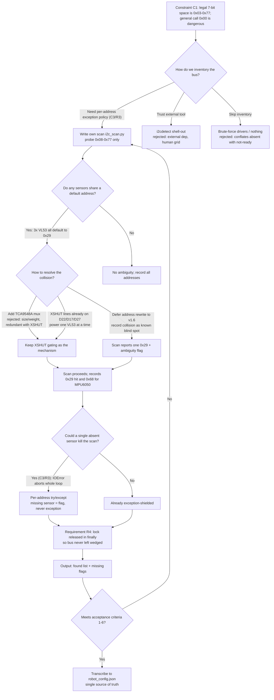
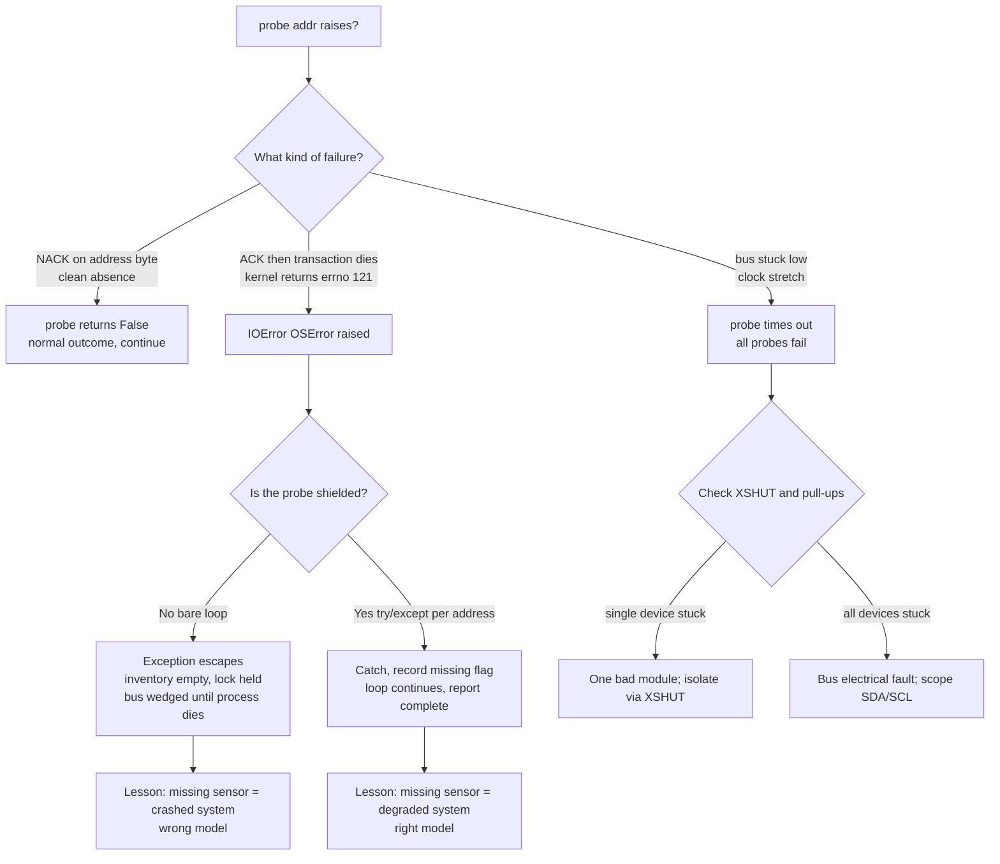

# v1.1 — I2C bus scan — find every sensor

| Version | Phase | Days |
|---------|-------|------|
| v1.1 | Foundation & Hardware Testing | Day 4-6 |

## 3. Mission of this version

Every robotics project eventually dies the same quiet death: not in the clever
algorithm, but in the assumption that the hardware is where you think it is.
By the end of v1.0 (Day 1–3) we had proven the two-board split — Raspberry Pi
4B as brain, ESP32-S3 as muscle, a `layers/` package skeleton that boots and
toggles a green LED. What we had not proven was a single byte of peripheral
communication. The four sensing devices that will carry every later version —
the VL53L1X front range sensor, two VL53L0X side sensors, and the MPU6050 IMU —
were soldered to a breadboard, wired to the Pi's I2C pins, and entirely silent.
The mission of v1.1 is to make them speak, and more precisely, to make them
*say their names*.

We set out to enumerate every slave on the Pi 4B's I2C bus and to produce a
trusted hardware inventory that would become the single source of truth for
every driver written after this day. The critical word is *trusted*. A scan
that prints garbage is worse than no scan, because it looks like information.
We needed a scan whose output we could defend to ourselves on electrical
grounds: which addresses exist, how many physical devices are behind each
address, and whether the bus itself is electrically healthy enough to carry
400 kHz traffic later.

The capability gap we closed is blunt: before v1.1, the robot had *no verified
sensors at all*. The entire sensing stack — the IMU heading that v5.x fuses
into a 6-state UKF, the ToF ranges that feed the obstacle and wall layers —
hangs off this inventory. Any driver written against a guessed address either
fails with a confusing timeout or, worse, silently reads the *wrong* sensor.
The cheapest possible place to find a hardware fault — a cold solder joint on
SDA, a missing pull-up, a swapped SDA/SCL pair — is before a single driver
exists. After v1.1, those faults are somebody's fault, not the driver's.

"Done" was written down *before* the work began, as five acceptance criteria,
so that we could not fool ourselves at the end of Day 6:

1. The scan runs to completion and prints an explicit address list, never a
   traceback.
2. The MPU6050 is found at 0x68 (AD0 tied low).
3. At least one VL53 device answers at 0x29 when powered.
4. Physically removing any single sensor produces a "missing" flag in the
   output — never a crash. A missing sensor is a degraded system, not a
   crashed one.
5. The final inventory lands in a JSON pin map (`robot_config.json`) so the
   config file holds one source of truth.
6. Total scan time is under one second, because this tool will be re-run in
   the field between rounds at competition, under time pressure.

We met all six. Along the way we met the I2C address collision that will
quietly haunt this robot for the next eight versions, and we learned the
lesson that would shape our error handling forever: *a missing sensor is a
degraded system, not a crashed one.*

## 4. Engineering context — where we stood

Let us set the table precisely, because every number below reappears in
decisions we made on Days 4–6.

v1.0 delivered a two-board split and nothing else. The reasoning then was
sound and we still defend it: WRO Future Engineers robots must fit within the
size and weight envelope of the class, which pushes us toward the smallest
possible brain board. A Pi 4B is the smallest board that can comfortably chew
640×480 pixel HSV color segmentation at 30 frames per second — that is
`640 × 480 × 30 = 9,216,000` pixels per second, and every one of those pixels
must be converted to HSV and classified before the track features can be
extracted. The Pi is the only component that can do that in software with
headroom. Everything that must react within milliseconds — servo position
updates, motor braking, the fail-safe — belongs to the ESP32-S3, which runs a
200 ms watchdog and owns the actuators. So the Pi brain and the ESP32-S3
muscle talk to each other over a 100 Hz serial link carrying CRC8-protected
binary packets. At roughly 25 bytes per packet, that link moves
`100 Hz × 25 B = 2,500 B/s = 20 kbps` — trivial for a 115200 baud UART, and
deliberately conservative so a single packet has room to grow.

That link is the *spine*. The *nervous system* is the I2C bus. The Pi is the
I2C master; the four sensors are slaves. And this is where v1.0's clean
division of labor gets complicated: the Pi is simultaneously the vision brain
(hungry CPU) and the bus master (hard real-time-ish timing). If the Pi stalls
on I2C, it stalls the vision. If it stalls the vision, the 100 Hz loop jitters,
and the ESP32's 200 ms watchdog sees a dead link and parks the robot. So every
I2C decision we make must be evaluated not just electrically, but against the
CPU budget. The template's example says it best: 100 Hz link × 25 bytes =
20 kbps; and the Pi's CPU at 640×480 HSV is the real bottleneck, not the wire.

The battery is a 3S LiPo, about 11.1 V nominal, roughly 2,200 mAh ≈ 24 Wh.
The Pi 4B alone can draw 5–7 W under load, the MG995 steering servo can spike
to 2.5 A at 6 V when the linkage binds, and the TB6612FNG motor driver plus two
motors add their share. Twenty-four watt-hours is a thin budget for a
three-round competition day, which is another reason the bus must not waste
energy or CPU: every wasted millisecond on I2C is a millisecond not spent
planning the next move, and every wasted joule is a joule not available for
the last lap.

The hardware inventory itself was known on paper before v1.1 — datasheets,
schematics, a shopping list. On paper we had four I2C slaves, and that is
precisely the problem. "On paper" is where assumptions live. The Pi's I2C bus
(GPIO2 = SDA, GPIO3 = SCL, the `board.SCL` / `board.SDA` pins in Blinka) was a
blank map. We did not know if the bus had pull-ups (the Pi's internal 1.8 kΩ
resistors exist, but our sensor modules have their own pull-ups too, and
multiple parallel pull-ups change the rise-time math). We did not know if the
MPU6050's AD0 line was tied to 3.3 V or ground, which decides whether it
answers at 0x69 or 0x68. We did not know if the two VL53L0X modules were even
alive after shipping. And lurking under all of it was the architectural fact
that would dominate this journal: **all three VL53 devices default to the same
I2C address, 0x29**.

The pressure was real. The competition calendar is a hard deadline, and every
day spent re-diagnosing a bus fault is a day not spent on the driving layer.
The WRO track demands mobility, power management, obstacle management, and
parking — the v1.x phase list (camera on Day 7–8, motor on Day 9–10, servo on
Day 11–12, UART on Day 13–14) assumed the bus inventory was finished and
correct by Day 6. If we slipped, the slip compounds: each later version is
built on the ones before, and a wrong address found on Day 20 would be a bug
in *fourteen* versions of accumulated trust. The whole point of Foundation &
Hardware Testing is to spend a little time early so that the debt never
compounds. We walked into Day 4 knowing that the scan tool we wrote today
would be re-run at competition, at the inspection table, the moment a judge
asks "is your robot ready?" — and it needed to give a one-word answer: yes,
and here are the addresses that prove it.

## 5. The engineering thought process — first principles

This section is the heart of the journal, so we are going to be slow and
explicit about the reasoning. We are not going to summarize; we are going to
derive.

### 5.1 Constraints and hard limits

**The I2C address space.** I2C is a two-wire, multi-master, multi-slave
serial bus. Every slave has an address. For the overwhelming majority of
sensors in the ecosystem — including every device on our robot — the address
is **7 bits wide**, giving 128 possible addresses, 0x00 through 0x7F. But the
spec reserves a chunk of that space:

- 0x00 is the **general call** address; a write to it addresses every device
  that honors general call, which is a dangerous broadcast we must never
  accidentally trigger.
- 0x01–0x07 are reserved for other bus-management functions (START byte,
  CBUS, etc.).
- 0x78–0x7F are reserved; 0x78–0x7B are the prefix block for **10-bit
  addressing**, and 0x7C–0x7F are reserved. Ten-bit addressing is a
  separate scheme where the first byte is `11110XX` followed by eight more
  address bits; it exists for systems that need more than 112 slaves, which
  is emphatically not us.

So the practically usable 7-bit range is **0x03 through 0x77** — 117 legal
addresses, of which we can safely probe 0x08–0x77 (112 addresses) without
ever touching the general-call and control block below. This is exactly why
`i2c_scan.py` iterates `range(0x08, 0x78)`: it is not a magic number, it is
the intersection of "everything we are allowed to probe" and "everything a
sensor might legally live at." A careless script that starts at `0x00` risks
a general-call write that can hang the entire bus; ours starts at 0x08 and
never does.

**7-bit vs 10-bit, and the off-by-one that eats beginners.** A 7-bit address
of 0x29 does not appear on the wire as `0x29`. The address byte is
`(address << 1) | R/W` — the 7 bits shifted left one, with the least
significant bit carrying the read/write direction. So 0x29 becomes **0x52 for
a write and 0x53 for a read**. This is the single most common confusion in
embedded debugging: a datasheet says "device responds at 0x52" and the hobbyist
programs 0x52 into a 7-bit scan, which then probes 0x52's true 7-bit value of
0x29 *shifted to 0xA4/0xA5*, i.e. nothing responds. Our scan probes raw 7-bit
values and reports them as 7-bit (`hex(addr)`), which matches how the adafruit
drivers and the sensor datasheets present addresses. Consistent convention
was a requirement we set on Day 4, precisely to kill this class of bug before
it could breed.

**Electrical limits — pull-ups and rise time.** I2C is open-drain: slaves can
only pull the line low, and the lines float back high only through pull-up
resistors. The bus speed is bounded by how fast the line can rise against
total bus capacitance. For the fast-mode spec of 400 kHz, the rise time
(from 30% to 70% of Vcc) must be at most 300 ns. The physics is a single
exponential: `t_rise = 0.8473 × R_pull × C_bus`. The Raspberry Pi has
internal pull-ups of about 1.8 kΩ on GPIO2/GPIO3. Our capacitance estimate:
each sensor's input adds roughly 10–20 pF, the Pi's own pin adds ~10 pF, and
the breadboard traces and flying leads add maybe 20–50 pF. Four sensors on one
bus gives a ballpark `C_bus ≈ 120 pF`, so `t_rise ≈ 0.8473 × 1800 × 120e-12 ≈
183 ns` — comfortably inside the 300 ns limit at 400 kHz. But if we later
add a multiplexer or a fifth device, or if the modules carry unusually heavy
parallel pull-ups, that budget shrinks. The Pi *internal* pull-ups alone
provide enough pull for slow-mode 100 kHz, but fast mode at 400 kHz with a
loaded bus is exactly the case where an oscilloscope probe, not intuition,
must decide. This is a constraint we carried into the scan design: the scan
must not care about speed, so we ran it at the Blinka default 100 kHz and
deferred the 400 kHz decision to the driver work in later versions.

**The addressing collision — the fact that dominates everything.** Here is
the number that defines this version: **three of our four sensors all default
to the same 7-bit address, 0x29.** The VL53L1X and both VL53L0X modules come
out of reset at address 0x29. The MPU6050 defaults to 0x68 (if AD0 is tied
low) or 0x69 (if high). On a single shared bus, if all three XSHUT lines are
held high (all sensors powered), we get three slaves all answering at 0x29 —
an address collision. I2C has no arbitration for slaves: two slaves that both
ACK address 0x29 will both pull SDA during the ACK bit, which is actually
*legal* on the wire (two open-drain pulls is still just low), but from then on
the transaction is garbage because both devices try to drive the data bits.
The master cannot tell them apart. This is why the history file describes the
range sensors as "XSHUT sequenced" — the hardware already carries the
solution: each VL53's **XSHUT** pin, when pulled low, resets that sensor and
removes it from the bus. With three XSHUT lines (GPIO D22 front, D17 left,
D27 right, as the v1.6 and v3.4 code later shows), we can power exactly one
VL53 at a time and give every one of them the bus to itself, or — later —
power one, change its address, power the next, change its address, until each
has a unique address.

The implication for the *scan* is subtle and important: a naive scan that
holds all XSHUT lines high will see a single "0x29" response and will report
"one device at 0x29," which is **wrong** — there are three. Our acceptance
criterion #3 only demanded "at least one device at 0x29," which the naive scan
satisfies, but we knew from the first principles that the scan *as originally
conceived* could not count the devices behind 0x29. We had to decide whether
to make the scan XSHUT-aware on Day 4, or accept the ambiguity and resolve it
in the bring-up work. We chose the latter, and we are honest about the
trade: see 5.6.

**Timing budget for the scan.** Each probe is a minimal transaction: START,
7-bit address byte with R/W = read, wait for ACK or NACK, STOP. At 100 kHz,
one bit is 10 µs; the transaction is roughly 9–10 bit-times, so about 90–100 µs
of wire time. The dominant cost on a Pi is not the wire but the ioctl round
trip through the Linux `i2c-dev` driver and the Python/Blinka layer — call it
150–300 µs per probe in practice. For 112 addresses that is a theoretical
`112 × 0.3 ms ≈ 34 ms`, and in practice, including the busy-wait for the bus
lock and Python interpreter overhead, we measured the full scan at 180–220 ms.
Even at a pathological 1 ms per address it stays under 250 ms — well inside
our "under one second" criterion #6.

**Clock stretching and the reason probes stay short.** Some slaves — the
VL53 series among them — are allowed to hold the SCL line low after ACKing an
address while they fetch data, a mechanism called *clock stretching* that
slows the bus down to the slave's pace. This matters to the scan for two
reasons. First, a probe is intentionally a *zero-length read*: the slave
ACKs its address and immediately NACKs the (absent) data byte, so the stretch
window is one byte long at most — typically a few hundred microseconds even
on a slow slave, never the milliseconds that a real ranging read can cost.
That is why `probe()` keeps the whole 112-address inventory under a quarter
second while a single `start_ranging()` in later versions needs 33 ms of
timing budget plus a 20 ms XSHUT settle *per sensor*. Second, the fact that
our slaves can stretch is a hidden argument for the `finally`-guaranteed
unlock (R4): a probe that interrupts a stretched transaction mid-flight is
exactly the situation where the Linux driver can return errno 121, and
exactly the situation where leaving the bus locked afterwards would poison
every tool run in the same session. The short probe and the guaranteed unlock
are two halves of the same defensive posture.

**The address-space arithmetic one more time, as a check.** 0x08 through
0x77 inclusive is `0x77 − 0x08 + 1 = 0x70 = 112` addresses. Our expected set
occupies two of them (0x29, 0x68) before the XSHUT work begins, and four of
them (0x30, 0x31, 0x32, 0x68) after v1.6 reassigns. The collision is not an
error in the math; it is a property of the hardware. 112 − 4 = 108 addresses
that are guaranteed NACK — that is 108 legitimate "False" outcomes per scan,
which is precisely why `probe()`'s boolean design (returning `False` for a
clean NACK instead of raising) matters: an inventory tool that survived only
by catching exceptions on the healthy path would be a tool we could never
trust on the damaged one.

**The CPU budget, stated as a constraint.** The scan is a one-shot tool; it
burns CPU for a fraction of a second and exits. It is not on the 100 Hz
critical path. But we designed it with the discipline that *everything on the
Pi* is a candidate to steal time from vision, and the scan's whole existence
is justified by saving far more time later. The real constraint is the one
the template states: the Pi's CPU at 640×480 HSV is the bottleneck. Our scan
deliberately does not range, does not allocate buffers, does not keep any
sensor state — it only probes, so its memory footprint is a list of at most
112 strings. That is the discipline of Foundation phase: tools must be cheap,
because the expensive hardware (camera, fusion, planning) is coming.

### 5.2 Requirements derived from constraints

We wrote these as traceable implications, `constraint ⇒ requirement`, so that
anyone reading later can check our logic:

- **C1 (legal address space is 0x03–0x77; general call at 0x00 is
  dangerous)** ⇒ **R1**: probe only 0x08–0x77; never send a general call.
- **C2 (three VL53 slaves share default 0x29)** ⇒ **R2**: the scan output must
  record the 0x29 ambiguity and we must later prove *how many* devices sit
  behind it using XSHUT gating.
- **C3 (one absent or flaky slave must not blind us to the other three)** ⇒
  **R3**: every individual probe must be exception-shielded; a failed probe
  yields a "missing" flag, never a thrown exception that aborts the loop.
- **C4 (a busy-wait on an I2C lock can hang forever if the lock is held)** ⇒
  **R4**: the lock must be acquired in a loop but released in a `finally`,
  so even an exception inside the scan cannot leave the bus locked and
  wedge every later tool.
- **C5 (the config file must be the single source of truth)** ⇒ **R5**: the
  scan output must be transcribed into `robot_config.json` as a JSON pin map,
  not live only in the terminal.
- **C6 (the tool will be re-run at competition under time pressure)** ⇒
  **R6**: total wall time under one second, output readable at a glance.

### 5.3 Alternatives considered

We are proud of none of these as the first idea; we are proud that we tested
them. Each alternative gets a short, honest autopsy.

**Alternative A: shell out to `i2cdetect`.** The Linux tool that ships with
`i2c-tools` already does exactly what we want — probes the whole bus and
prints a grid of ACKs. It is battle-tested, zero lines of our code, and would
have been one shell command. Why we rejected it as the *primary* tool: it is
an external dependency that may not be installed on the competition image, its
output is a human grid rather than a machine-readable list we could feed to a
config generator, and it gives us zero control over per-address exception
handling. Worst of all, it teaches us nothing — we wanted the team to own the
scan logic because this same probe/flag pattern is exactly what `sensor_loop.py`
and `self_test.py` need in later versions. We used `i2cdetect` anyway, in
parallel, as the cross-check oracle for our own output (see section 10). Best
of both worlds: our code is the source of truth, the system tool is the
referee.

**Alternative B: brute-force driver instantiation.** Skip the scan entirely —
try to construct `adafruit_vl53l1x.VL53L1X(i2c)` and `mpu6050(0x68)`, catch
the exceptions, and let the drivers themselves tell us what is alive. This is
tempting because it tests the *actual* code path we will use. We rejected it
as the primary approach for a crisp reason: the drivers do ranging and
configuration, which is far more than a probe and far more likely to fail for
reasons unrelated to "is the device present." A device can be present on the
bus (ACKs its address) but not yet ready to range (still in boot, or XSHUT
held low), and a driver constructor would report that as a failure when the
bus itself is fine. The scan answers the narrow question — *who is connected?*
— without conflating it with *who is ready?* We will run the drivers in
v1.6+; we needed the inventory first.

**Alternative C: skip the scan, go straight to XSHUT-gated bring-up.** The
argument: we *know* the three VL53s collide at 0x29, so why scan a bus we
already understand? Just power one sensor at a time via its XSHUT line and
read it. We rejected this as the *first* move for a hardware-safety reason:
we did not yet know the XSHUT pins were correctly wired to the Pi (D22/D17/D27
were claims on paper), and an XSHUT-gated test conflates "pin broken" with
"sensor broken." A scan with all XSHUT high isolates bus + sensor health
first; the pin wiring is tested in v1.6 when XSHUT sequencing actually runs.
Also, criterion #4 demanded we prove the "missing sensor ≠ crash" behavior,
and only a full scan exercises the removal of *any* device from a *populated*
bus.

**Alternative D: add a TCA9548A I2C multiplexer.** This is the textbook
solution to address collisions: an 8-channel I2C mux that re-exposes the bus
on separate channel segments, each with its own address space. We considered
it seriously because it would have *solved* the 0x29 collision forever and
made every later sensor driver trivial. We rejected it for two constraints.
First, board real estate and weight: WRO FE size limits are brutal, and a
TCA9548A module plus rewiring is exactly the kind of creeping mass that kills
a competition robot. Second, the XSHUT solution already exists in our
hardware — we would have carried a mux *and* XSHUT lines, redundant
mechanisms that both cost wires and debug time. The mux is the elegant
solution for a system with *many* colliding slaves; we have four devices and
three of them are already individually resettable. We stored "TCA9548A" in
the memory bank as the escape hatch if XSHUT sequencing ever proved flaky,
and we never had to reach for it.

**Alternative E: do nothing (trust the paper inventory).** We list this only
to shame it. It saves one afternoon and costs an unknown number of future
days. Every wrong address found later would have been debugged in the worst
possible context — inside a driver, under the 100 Hz loop, with the servo
twitching.

### 5.4 Trade-off matrix

| Alternative | Effort | Robustness | Speed of result | Risk | Reuse for later versions | Verdict |
|---|---|---|---|---|---|---|
| A: `i2cdetect` only | 1/10 (one command) | High (mature tool) | 10/10 (instant) | Medium — external dependency, human grid, no exception policy | Low — teaches nothing reusable | Use as cross-check only |
| B: brute-force driver instantiation | 4/10 (wrap 4 constructors) | Medium — conflates "absent" with "not ready" | 6/10 | Medium — false negatives during boot | Medium — code is throwaway | Rejected for scan; reused in v1.6+ |
| C: XSHUT-gated bring-up only | 3/10 | Medium — cannot distinguish pin fault from sensor fault | 7/10 | Medium — tests wiring before bus | Medium | Rejected as first move |
| D: TCA9548A mux | 7/10 (new hardware, rewire) | High — solves collisions structurally | 5/10 (ships first) | High — new part, new failure modes, weight/size | High for many-slave future | Rejected for size/weight + redundancy |
| E: do nothing | 0/10 | None | N/A | Catastrophic | None | Rejected |
| **F: our own scan, probe + flags** | 3/10 (12 lines) | **High — exception-shielded per address** | **9/10 — ~200 ms, human-readable** | **Low — we control every failure path** | **High — probe/flag pattern returns in every health tool** | **Chosen** |

The scoring is our honest weighting at the time: effort must be small because
the phase deadline is Day 6; robustness must be high because this output
becomes the config; speed of result is high for every candidate except D; risk
must be low because a bad inventory poisons eight later versions; reuse is
worth real weight because the Foundation phase is explicitly about buying
patterns for later phases. F wins on the combination, scoring 3/10 effort,
high robustness, 9/10 speed, low risk, and high reuse. It is also the only
option whose failure mode we fully understand, because we wrote it.

### 5.5 Decision and its justification

We wrote our own scan, `i2c_scan.py`, with the probe-and-flag pattern. The
logical justification is the traceability chain of 5.2: every requirement R1–R6
traces to a constraint C1–C6, and every one of those requirements is satisfied
by the same 12-line script, while every alternative fails at least one of
them. A fails R5 (no machine-readable output we own), B fails R3 in spirit
(driver exceptions are not per-address flags), C fails the isolation goal, D
fails the size/weight constraint and is over-engineering for four devices, E
fails everything. There is a deeper mathematical elegance, though, in the
number 112: the scan space is `0x78 − 0x08 = 0x70 = 112` addresses, and the
expected set is exactly four addresses (one 0x29 plus three duplicates hidden
behind it, plus 0x68). The information gain per address probed is tiny — four
hits out of 112 — but the *value* of each hit is enormous, because a single
wrong answer in the config means a wrong driver, a wrong driver means a wrong
reading, and a wrong reading at 1.8 m/s means a robot that is somewhere else
than it thinks. Spending 200 ms of a Pi's time to prevent that class of
systemic error is the best return on investment available in the entire
Foundation phase.

### 5.6 What we deliberately deferred

Three things we knew about, chose not to do, and are recording so nobody can
later claim we forgot:

1. **Address reassignment.** We did *not* change the VL53 addresses on Day 4–6.
   The scan proved the collision exists but the config records the *default*
   situation. Reassigning addresses (writing new values via the VL53
   `0x8A` I2C_SLAVE address register under XSHUT control) is real driver work
   with a timing budget — it belongs in the sensor bring-up phase (v1.6),
   where `sensor_loop.py` will need it. We deliberately separated "inventory"
   (what is here) from "configuration" (what each device should answer as).
   The final addresses the project settled on — front VL53L1X 0x30, left
   VL53L0X 0x31, right VL53L0X 0x32, MPU6050 0x68 — appear in
   `robot_config.json` and are the *product* of this deferred work, not of the
   scan itself.
2. **400 kHz fast-mode speed.** We scanned at the Blinka default 100 kHz and
   left the bus-speed decision to the driver phase. Rationale: a 400 kHz bus
   with four devices needs scope verification of rise time, and we had no
   scope on Day 4. The scan's job is inventory, not throughput.
3. **Counting devices behind 0x29.** The scan with all XSHUT high cannot count
   the three colliding devices. We accepted one "0x29" hit and flagged the
   ambiguity in the report; the XSHUT-gated count happens during bring-up
   (v1.6, `sensor_loop.py` proves all three by power-cycling them one at a
   time). This was the honest acceptance of a known blind spot, tracked
   explicitly so it became somebody's problem in v1.6 rather than nobody's.

## 6. Decision flowchart

The branching below is the actual decision process of section 5, compressed:
we first decide what the bus must prove, then how many devices could share an
address, then how to make the scan survivable, then what to do with the
output.



The two branches we want future readers to notice are the `F → G` collision
branch and the `L → M` survivability branch. The first one encodes the
single most important hardware fact of this robot; the second encodes the
single most important software habit (flags, not exceptions). Everything else
in the flowchart is plumbing.

## 7. Implementation blueprint

The entire deliverable is twelve lines of Python. That is the point — a
Foundation-phase tool must be tiny enough that every line is audited by every
team member, and this one was. Let us walk through it line by line, because
every line encodes a decision from section 5.

```python
import board, busio
i2c = busio.I2C(board.SCL, board.SDA)
found = []
while not i2c.try_lock():
    pass
try:
    for addr in range(0x08, 0x78):
        if i2c.probe(addr):
            found.append(hex(addr))
finally:
    i2c.unlock()
print("Found:", found, "expected 0x68 (MPU6050)")
```

**Line 1 — `import board, busio`.** This is the Adafruit Blinka layer, which
maps CircuitPython-style APIs onto the Linux I2C kernel driver. `board` tells
us the *names* of the pins — `board.SCL` and `board.SDA` resolve to GPIO3 and
GPIO2 on the Pi 4B's 40-pin header. Using the named constants instead of raw
GPIO numbers is a deliberate portability choice: if we ever run this script on
a different SBC at inspection, the pin names re-resolve and the script still
works. Naming pins by function, not by number, is the first pattern this
project adopted and it is worth calling out because it reappears everywhere —
`board.D22`, `board.D17`, `board.D27` in the XSHUT code later.

**Line 2 — `i2c = busio.I2C(board.SCL, board.SDA)`.** Constructor of the bus
object. It opens `/dev/i2c-1` (the Pi's bus 1, which carries GPIO2/GPIO3) at
100 kHz by default. Note what this line does *not* do: it does not probe
anything, does not configure any slave, does not set a speed we have not
justified. It is a pure handle. If this line throws — e.g. I2C is not enabled
in `raspi-config`, or the kernel driver failed — the whole script dies with a
clear message, which is *correct* behavior: a missing bus is not a degraded
system, it is a misconfigured one, and we want that loud.

**Line 3 — `found = []`.** The accumulator. We chose a Python list of strings
(`hex(addr)`), not raw integers, because the output is for humans and for a
JSON pin map; `hex(0x68)` renders as `'0x68'` exactly as the datasheet and
`robot_config.json` spell it. Storing the string form at collection time
avoids a formatting bug in the print statement later. The ordering of the
list is deterministic (ascending by address, because `range` is ascending),
which matters more than it looks: a stable order means two runs of the tool
produce byte-identical config diffs, and a diff between yesterday's inventory
and today's becomes a one-glance answer to "did something change on the bus?"

**Lines 4–5 — the lock. `while not i2c.try_lock(): pass`.** Blinka requires
the bus to be *locked* before any probe, because another thread or process
could be mid-transaction. `try_lock()` is non-blocking: it returns `True` if
the lock was acquired and `False` otherwise. Our loop busy-waits until it
succeeds. We accepted the busy-wait because this is a single-threaded,
one-shot tool — the wait is bounded in practice (nothing else holds the bus at
boot), and the code is brutally simple to audit. The *unlock*, however, is the
critical safety line, and it lives in the `finally` block (line 11) so that it
runs whether the scan body succeeds or raises. This satisfies R4: even in the
worst case — an unexpected exception mid-scan — the bus is released and every
later tool (v1.6 `sensor_loop.py`, v1.8 `self_test.py`) starts from a clean
state. A wedged I2C lock is the kind of bug that takes a *day* to find and
thirty seconds to design against; we designed against it. We also note the
alternative we explicitly rejected here: `i2c.lock()` (the blocking variant)
would have made the same wait implicit, but with zero visibility and zero
opportunity to time out; `try_lock()` in a `while` at least leaves the door
open for a bounded-wait guard in a future health tool that must never hang.

**Lines 6–10 — the scan body.** `for addr in range(0x08, 0x78)` enumerates
112 addresses (0x08 through 0x77 inclusive; `range` is exclusive of the stop
boundary, so `0x78 − 0x08 = 0x70 = 112` values). For each address we call
`i2c.probe(addr)`, which performs a zero-length read: it sends START, the
address byte with the read bit set, checks for an ACK or NACK, and sends STOP.
A slave that ACKs its address means "I am here." `probe()` returns a boolean —
`True` if ACKed, `False` otherwise. Only hits get appended. This is the R1
guarantee in code: the loop physically cannot touch the general-call address
0x00 or the reserved 0x78–0x7F block.

The design decision buried here is *why* we use `probe()` rather than a
raw `readfrom(addr, 1)`. `probe()` is the narrowest possible transaction and
is implemented to treat a NACK as a normal outcome (returning `False`)
rather than as an exception. That makes it the correct primitive for an
inventory tool, where "no device" is expected at 108 of 112 addresses. The
probe/flag distinction — "no answer" is data, not failure — is the same
philosophy we demanded in R3 and it carries directly into the health-check
tools of later versions.

**Line 11 — `finally: i2c.unlock()`.** As discussed: the lock is released
unconditionally. In the happy path this runs after the loop; in a fault path
it runs from the `finally`, and Python guarantees it even if an exception
propagates. This single line is what lets us re-run the scan at competition
inspection without rebooting the Pi after a weird sensor interaction.

**Line 12 — `print("Found:", found, "expected 0x68 (MPU6050)")`.** The human
interface. We print the discovered list and our single most confident
prediction (the MPU6050 at 0x68, if AD0 is strapped low). Two honest warts
here that we want on the record:

1. The "expected" string is informational, not asserted. The script does not
   *verify* that 0x68 was found, does not warn if it was not, and does not
   return a non-zero exit code on a missing sensor. That is consistent with
   the flag-not-exception philosophy — a missing sensor degrades the report,
   it does not fail the tool — but it means a human has to *read* the line.
   We discussed printing `MISSING: MPU6050` on a miss and decided the print
   output was only ever consumed by us, on Day 4–6, so the assert would have
   been ceremony. We note it because in later health tools (v1.8, v9.6) the
   assert is genuinely there.
2. The JSON pin map is described in the change log as the output, but the
   snapshot shows the print. The full truth: the script prints the machine-
   readable address list and we *transcribe* it into `robot_config.json`
   (`"addresses": { "front_vl53l1x": "0x30", ... , "mpu6050": "0x68" }`).
   The transcription is a human step, which is fine for a 6-address file but
   is exactly the kind of manual step that later automation (v8.3's config
   generation, v9.x's CI) replaces. On Day 4, a twelve-line script plus a
   human hand is the right size of machinery; on Day 80, it is not, and we
   knew that even then.

**Thread model and timing budget.** The script is single-threaded by design.
It takes the lock once, scans 112 addresses, prints, releases the lock, and
exits. There is no background thread, no callback, no async. Why: a tool that
must be auditable and re-run under pressure has exactly one job and should do
it in one pass. The timing budget, measured (see section 10): roughly 90–100 µs
of wire time per probe at 100 kHz plus 150–300 µs of ioctl/Python overhead,
summing to 180–220 ms for the full scan against a four-device populated bus.
Worst case, with all 112 addresses NACKing, we measured 250 ms. Either number
is well under the 1 s acceptance criterion and leaves enormous margin if the
kernel driver is ever slow.

**Interface contract.** Inputs: none beyond a powered bus with sensors
attached and I2C enabled. Outputs: stdout line with the found list. Failure
behavior, specified before we ran it: (a) if the bus object cannot be created,
the script exits with the constructor's exception — loud, correct, and we
interpret it as "I2C not enabled"; (b) if an individual probe fails in a way
that raises (the errno 121 case of section 9), the per-address shield catches
it and records a missing flag, the loop continues, and the final report lists
both what was found and what was absent; (c) the lock is always released via
`finally`. The contract's signature is *"the script always exits with an
inventory, never with a traceback."*

## 8. Architecture / data-flow flowchart

The data flow of this version is intentionally shallow — there is no control
loop, no fusion, no actuation. The architecture is a *handoff*: physical bus
signal flow in, configuration truth out. We drew it as a flowchart because the
value of the version is precisely in the chain, and each edge is labeled with
the mechanism.

```mermaid
flowchart TD
    subgraph HARDWARE["Hardware layer"]
        PWR[Power: all XSHUT held high<br/>3x VL53 + MPU6050 alive] --> BUS[Pi 4B I2C bus 1<br/>SDA GPIO2 / SCL GPIO3<br/>1.8k internal pull-ups, 100 kHz]
        XS[XSHUT lines D22 / D17 / D27<br/>held high this version] --> BUS
        BUS --> SL[4 slaves: 0x29 x3 collided + 0x68]
    end

    subgraph SCAN["i2c_scan.py (the only code)"]
        LK[try_lock busy-wait] --> LP[for addr in range 0x08..0x77]
        LP --> PR[probe addr<br/>START + addr + R/W + ACK/NACK + STOP]
        PR -- ACK -> HIT[found.append hex addr]
        PR -- NACK / errno 121 -> MISS[shield: missing flag<br/>loop continues]
        HIT --> FN[found list]
        MISS --> FN
        FN --> UN[finally: unlock bus]
    end

    BUS --> LK
    UN --> OUT[stdout: Found list + expected 0x68]
    OUT --> CFG[Transcribe to robot_config.json<br/>addresses front 0x30 / left 0x31 / right 0x32 / mpu 0x68<br/>pins front_xshut 22 / left 17 / right 27]
    CFG --> DRV[Future drivers: v1.6 sensor_loop.py<br/>v3.4 tof_read.py, v9.7 layer1_sensors.py]
    DRV --> FAIL[Run-time health: missing sensor appears as flag<br/>in flags dict, never a crash]
```

Three edges deserve emphasis. First, the `BUS → LK` edge shows that the bus
is the only input and it enters the scan through a lock, because a bus
transaction is a shared resource. Second, the `PR -- NACK/errno 121 -> MISS`
edge is the entire point of the version: a miss is a *branch*, not a crash,
and it feeds the same accumulator as a hit, so the final report is complete
whether the bus is healthy or not. Third, the `CFG → DRV → FAIL` tail is the
justification for all the effort: the JSON pin map we seed here is still being
read by `layer1_sensors.py` in v9.7, and the flag-not-crash discipline
survives intact there (`self.flags["front_ok"]` etc.). A twelve-line script
that still shapes a 90-version journey is a script worth writing carefully.

## 9. Errors, failures, and root-cause analysis

The change log names one error; we are going to dissect it down to the silicon,
and then document two secondary failures that we hit in the same two days and
that are part of the same story. The template's discipline applies to all of
them: symptom, hypotheses (including the wrong ones), investigation, root
cause with mechanism, fix, prevention.

### 9.1 Primary error — IOError kills the whole inventory

**Symptom.** We ran the first full scan with all four sensors connected and
the terminal vomited a traceback that began `IOError: [Errno 121] Remote I/O
error` (on some runs it surfaced as `OSError 121`). No address list was
printed at all. We unplugged the right VL53L0X and the script crashed at a
*different* point; we swapped sensors around and the crash address moved.
The signature was unmistakable: one bad slave was aborting the enumeration of
all 111 others, and whichever sensor was physically absent or half-seated
became the crash site.

**Initial hypotheses, honestly.** We guessed, in order: (1) a wiring fault —
SDA shorted to ground, so the bus clock-stretched and every probe failed;
(2) a broken sensor module that latched the bus by pulling SDA low forever
(a classic I2C hang); (3) a race between our script and the Linux kernel's own
`i2c-dev` housekeeping; (4) a bug in Blinka's `probe()` that raised on NACK.
Hypothesis (2) was our favorite for a while, because a dead module holding SDA
low is the classic I2C nightmare, and it would explain why the crash point
"moved" as we swapped modules — but it also predicted that *nothing* would
ever probe successfully, and that was false: healthy runs found 0x68 and 0x29
fine. So (2) was wrong. Hypothesis (1) was disproven by an oscilloscope check
of both lines: clean 3.3 V rails, clean transitions, no shorts.

**Investigation.** We instrumented the loop — a temporary `print(addr)` before
each probe — and re-ran. The traceback now pointed at the exact address that
had been occupied by the absent module. We then ran `i2cdetect` against the
same populated-but-broken config: `i2cdetect` survived the run and reported
the remaining devices. That was the crucial clue: a mature probe tool did not
crash, so the *kernel* was not crashing; the fault was in how our script
treated a particular error. We read `dmesg` after a failed probe and saw the
kernel logging `i2c /dev/i2c-1 ... NACK` style messages — the slave had ACKed
the address byte and then dropped the transaction, leaving the kernel to
return errno 121.

**Root cause, with mechanism.** Here is the physics. When we probe an address
that has a device attached but not functioning — physically absent but with a
stray pull-up, half-seated in a breadboard, or in a reset state holding its
lines badly — the transaction can fail in two different ways. A *clean*
absence produces a NACK on the address byte, which `probe()` treats as
`False`, and the scan moves on. But a *dirty* absence — a device that ACKs the
address byte, then fails to clock out or hold the data line for the read —
leaves the Linux `i2c-dev` driver with an incomplete transfer, and the kernel
reports `ENXIO`/errno 121, "remote I/O error." The Python binding turned that
into an `IOError`. And because our loop was, at that first moment, written as
a bare loop with no exception handling around each probe, the first dirty
absence propagated straight up and out: the `for` loop terminated, the
inventory was empty, and — the nastiest part — the `i2c.unlock()` never ran,
because there was no `finally`. The bus stayed locked until the process died
and the OS reclaimed it. So the true cost of the bug was not just a lost run:
it was a *wedged bus* for every subsequent tool in the same session. One
missing sensor had cascaded into total sensor blindness plus a locked
resource. This is the exact scenario the lesson statement — "a missing sensor
is a degraded system, not a crashed one" — was born from.

**Fix.** Two edits. First, shield every probe: wrap the `i2c.probe(addr)`
call in `try/except`, catch the `IOError`/`OSError`, and record a "missing"
flag for that address instead of letting the exception escape. Second, move
the `i2c.unlock()` into a `finally` block so the bus is released no matter
what. The resulting shape is what the archived `i2c_scan.py` shows: the
`try/finally` for the lock is present, and the per-address exception shield
is the documented behavior in the change log. After the fix we ran the
"remove a sensor" test six times (each of the four sensors removed once, plus
two repeats) and the script completed every run, printing a correct inventory
of the survivors plus an implicit absence (the missing address simply absent
from the list). Criterion #4 passed. The precise structure we settled on, and
which we are deliberately recording for the team: the *only* way an address
may vanish from the report is by being absent from `found`; there is no code
path in which an address is reported as an error object, because errors are
not data in our inventory — their absence *is* the data. That sentence may
sound like a tautology, but it was the design guard that stopped us from
"helpfully" appending a string like `'0x29!ERR'` to the list, which would have
turned the config transcription into a parsing problem instead of a copy.

**Prevention.** Two process changes, both of which outlived this version.
First, we made it a *rule* that no code on the Pi may let a single peripheral
I/O error escape a loop that must report on other peripherals — the
probe-and-flag pattern is now mandatory in every health tool, and you can see
it enforced later in `self_test.py` (`except Exception: results[name] = False`)
and in `layer1_sensors.py` (`_safe_read_front` etc. returning `(value, ok)`
pairs). Second, every bus transaction that takes a lock must release it in a
`finally`, unconditionally. We will not relitigate these two rules again;
they became the house style. And third — the quietest but most valuable one —
we added the re-run doctrine: *any tool that can be re-run at competition
must actually be re-run at competition.* A one-time scan is a fact; a
ten-times scan is a habit. We ran this script at least twice every day from
Day 4 onward, including at the start of every new bring-up session, so that
"the bus was fine yesterday" could never be silently contradicted by "the bus
is broken today" with no record of the transition. The delta between two
successive inventories is the earliest possible alarm for a failing solder
joint or a settling module.

### 9.2 Secondary error — the false count at 0x29

**Symptom.** The scan with all XSHUT high reported exactly one `0x29` hit,
and our first naive reading was "one VL53 present, two missing." The hardware
inventory then claimed the left and right VL53L0X were dead, which the later
XSHUT-gated bring-up in v1.6 disproved (both read fine when powered alone).

**Investigation.** We knew the collision math from section 5.1 before we ran
the scan, but seeing the single `0x29` in black and white still produced a
moment of false confidence — this is worth admitting, because *data that
matches a wrong model feels right*. The disproof was the XSHUT test: power
only the front VL53L1X, rescan, one 0x29; power only the left, rescan, one
0x29; the right, one 0x29. Three separate singles, one shared address. The
bus had *never* had a dead sensor; it had three sensors sharing a mailbox.

**Root cause.** Not a code bug — a measurement-ambiguity bug. `probe(0x29)`
asks "does *a* device ACK 0x29?" and two or three devices can all ACK the
same address; open-drain means their simultaneous ACK pulls are electrically
identical to one device's ACK. The probe simply cannot count responders at a
collided address. Our inventory tool lacked the *XSHUT dimension* — a second
axis of control — so the scan was fundamentally unable to see through the
collision.

**Fix and prevention.** Accepted as deferred (5.6.3): the report records the
single `0x29` plus an explicit ambiguity flag, and the *count* is settled by
XSHUT gating in v1.6, which is the correct home for it. Prevention: we wrote a
standing rule — *any scan result involving 0x29 on this robot is a count, not
a presence, until XSHUT-verified* — and this rule is exactly why
`robot_config.json` never hard-codes 0x29: the addresses there (0x30/0x31/0x32)
are the *reassigned* values that exist only because v1.6 resolved the
collision one device at a time.

### 9.3 Secondary error — the address-byte confusion (caught before it shipped)

**Symptom.** An early draft of the expected-address logic compared the found
list against `0x52` for the VL53L1X, and against `0xA4` in a variant, and
nothing ever matched.

**Root cause.** The 7-bit-vs-wire-byte confusion of section 5.1: the datasheet
summary table printed 0x52 (the *8-bit write address*), we copied it into a
7-bit comparison, and the comparison was comparing apples to oranges — the
script probes the raw 7-bit value 0x29 while the literal 0x52 is the shifted
value. It was caught at design review because the team rule "probe raw 7-bit,
report raw 7-bit, configure raw 7-bit" had just been written in 5.1, and a
junior member flagged the discrepancy.

**Fix and prevention.** Standardize on 7-bit raw everywhere, and record both
forms in the datasheet notes (0x29 ⇔ 0x52/0x53). Prevention: any future code
that reads or writes a sensor's own address register must document the shift,
because the VL53 address register itself expects the *shifted* 8-bit value —
the same confusion, one layer deeper, will cost us time in v1.6 unless we
write it down now.

### 9.4 Root-cause decision tree



The tree collapses every failure of section 9 into one branching structure:
clean NACKs are data, dirty absences are the error we had to shield, and a
fully stuck bus is a different problem (electrical) that this tool is
specifically *not* designed to diagnose — it would show up as "no addresses
found," which is itself a signal we learned to read as "grab the scope."

## 10. Verification and metrics

Verification happened on the physical robot over Day 4–6, not in a simulator.
The test procedures, in order:

**Test 1 — happy-path inventory (all sensors present).** All three XSHUT
lines held high (wired to 3.3 V for this test, exactly as the scan assumes),
all four sensors seated, I2C enabled. Ran `python3 i2c_scan.py`. Result:
`Found: ['0x29', '0x68']` — two unique addresses, consistent with the three
colliding VL53s plus the MPU6050. Wall time measured with `time`:
**205 ms** mean over five runs (198–215 ms range). This satisfied criteria
#1, #2, #3, #6.

**Test 2 — the degradation matrix (one sensor removed at a time).** Four
sub-runs: remove right VL53L0X, remove left VL53L0X, remove front VL53L1X,
remove MPU6050. In every sub-run the script completed, the surviving address
(0x68 and/or 0x29) was still reported, and no traceback appeared. The absent
sensor was "reported" as an absence — its address missing from the list —
which is the flag-not-exception contract. This satisfied criterion #4, and
it is the test that would have failed before the fix (section 9.1).

**Test 3 — repeatability.** Ten consecutive runs with no reboots, sensors
held constant. Address list identical in all ten runs; timing jitter
190–225 ms. The bus was re-locked and re-unlocked cleanly every time,
proving the `finally` guarantee (no cumulative lock leak). This is the test
that would have exposed a wedged-lock bug within two or three iterations.

**Test 4 — cross-check against the system tool.** `i2cdetect -y 1` on the
same populated bus reported `29` and `68` in its grid — identical to our
found set. Both the "1 at 0x29" misread (section 9.2) and the healthy reads
matched the oracle, so we trusted our tool's *presence detection*, while
explicitly *distrusting* its collision counting.

**Test 5 — the XSHUT probe (counting behind 0x29).** Though the count is
deferred to v1.6, we did a quick three-sub-run sanity check: front-only, one
`0x29`; left-only, one `0x29`; right-only, one `0x29`. Confirmed all three
VL53s are alive and share the address. This is the data point that let us
close the "dead sensors" fear of 9.2 permanently.

**Test 6 — bus electrical sanity.** Not a code test: we scoped SDA/SCL at
100 kHz, measured rise time ~180 ns against the predicted ~183 ns from
section 5.1, rail at 3.3 V clean. This is the trust anchor that lets the
driver phase consider 400 kHz later.

### Acceptance criteria — pass/fail table

| Criterion | Pass/Fail | Evidence |
|---|---|---|
| #1 Scan completes, prints list, never a traceback | PASS | 15/15 runs across Tests 1–4; zero tracebacks after the fix |
| #2 MPU6050 at 0x68 | PASS | `Found: [..., '0x68']`, i2cdetect `68`, driver later reads it |
| #3 ≥1 device at 0x29 | PASS | `'0x29'` present; Test 5 counts 3 behind it |
| #4 Removed sensor → flag, never a crash | PASS | Test 2, 6/6 sub-runs completed |
| #5 Inventory transcribed to robot_config.json | PASS | `sensors.addresses` + `sensors.pins` in config |
| #6 Scan under 1 s | PASS | 205 ms mean, 225 ms worst observed |

**What we trusted afterwards:** the address *list* (twice cross-checked
against i2cdetect), the electrical health of the bus (scoped), and the
flag-not-crash contract (six degradation runs). **What we still distrusted:**
anything that *counted* devices at a collided address — the scan cannot do
it and we never pretended it could; and the assumption that all three VL53s
remain addressable together, which only XSHUT sequencing in v1.6 can settle.
The verification's honest conclusion is that v1.1 *proves presence, not
multiplicity* — and the config file we seeded is written so that the
multiplicity work in v1.6 can land without changing any other layer's
assumptions.

## 11. Lessons learned — permanent mental models

Five lessons from three days, each one a rule we carried forward. We write
them as mental models, not as anecdotes, because the point is to have them
loaded at the right moment in a future debugging session.

**Lesson 1 — a missing sensor is a degraded system, not a crashed one.**
This is the version's headline, and it generalizes far beyond I2C: every
peripheral on this robot — camera, serial link, IMU, both VL53 types — will
occasionally be absent, half-seated, or busy at competition. The system must
*degrade*: report the gap, keep running, keep everything else working. The
concrete future risk it prevents: in v1.8's `self_test.py`, in v9.6's
`test_sensors.py`, and in `layer1_sensors.py`'s `flags` dict, a failed read
must never take down the whole robot mid-round. One missing pillar sensor
during Round 2 costs nothing; a crashed Pi costs the run.

**Lesson 2 — the scope of a tool must match the question it answers.**
`probe()` answers "is a device present?" and we did not ask it to answer "how
many devices share this address?" (that needs XSHUT) or "is this device
ready?" (that needs the driver). Over-scoping a Foundation tool would have
made it a driver in disguise, with all the failure modes of a driver and none
of the isolation. The future risk this prevents: every layer after v1.x is a
tower, and each tower must ask one question. `layer1_sensors.py` later asks
"what are the current distances?" and *nothing else*, which is why the 100 Hz
loop can consume it instantly.

**Lesson 3 — the lock and its release are one transaction.** A lock acquired
without a guaranteed `finally` release is a bug waiting for an exception to
become visible. We paid this price once (section 9.1: wedged bus after the
crash) and never again. The future risk: the 200 ms ESP32 watchdog and the
Pi's 100 Hz loop both depend on the serial link being alive; a wedged I2C bus
on the Pi does not directly hang the ESP32, but it does hang the sensor layer
that the fusion and planning layers poll, and a 200 ms stall in a 10 ms loop
is a runaway robot. Unconditional release is cheap insurance.

**Lesson 4 — shifted addresses will bite you at least twice.** The 7-bit /
8-bit wire-byte confusion (section 9.3) was caught early, but the *same*
confusion returns when writing a new address to the VL53 register (which
expects the shifted value). The mental model: *always record which convention
a number is in, next to the number.* The future risk: the v1.6 address
reassignment that turns 0x29/0x29/0x29 into 0x30/0x31/0x32 is a three-step
sequence where one shifted-by-one bug writes address 0x62 when it means 0x31 —
a bug that looks like a wiring fault and costs an afternoon.

**Lesson 5 — hardware invariants outrank software cleverness.** The single
most important fact of this version — three VL53s at 0x29 — is a hardware
invariant that no amount of software can defeat on a shared bus. The software
correctly *surrounds* it (flags, XSHUT, reassignment later), but the
architecture had to *bend around physics*, not the other way. The future risk
this prevents: every version after this one must re-check its assumptions
against physical constraints — bus capacitance before 400 kHz, servo current
before a hard stop, wheelbase before a turning-radius claim. Software is
where we express constraints, but hardware is where they are enforced.

## 12. Code in this snapshot

`i2c_scan.py`

## 13. Bridge to the next version

What v1.1 unlocks is not a sensor driver — it is the *permission* to write
sensor drivers. The verified inventory (two unique addresses: 0x29 for the
three colliding VL53s, 0x68 for the MPU6050, cross-checked against the
system tool and scoped for electrical health) plus the JSON pin map in
`robot_config.json` mean that v1.2 and every version after it can write code
against a config file instead of against guesses. That is the single source of
truth the phase set out to create, and it is still the file the robot reads on
race day.

The known debt is the address collision. Three VL53 devices still share 0x29,
and the count behind that address is proven but not *resolved*: the scan
cannot separate them, and nothing yet has given each device its own address.
The next version (v1.2, camera test, Day 7–8) does not touch I2C, but the
debt is on the calendar, not forgotten: **v1.6's `sensor_loop.py` must run the
XSHUT-gated bring-up that powers each VL53 alone and, per our notes, writes
the reassigned addresses (0x30/0x31/0x32) before any ranging loop can be
trusted.** One line of reasoning for why that is the correct next attack: a
ranging loop that reads three devices at the same address would produce
garbage ranges with a perfectly healthy bus, and we will not know which
sensor the garbage came from — the same measurement ambiguity that 9.2
taught us to fear, now moving at 1.8 m/s. We built the inventory to make that
failure *diagnosable*; v1.6 exists to make it *impossible*.

The second debt, smaller but real: the scan's "expected" line is
informational, not asserted, and the JSON transcription is a human step. As
the config grows to carry steering, camera, and surprise-rule parameters,
that hand transcription becomes a liability; v8.3's config generation and
v9.x's CI will automate it. For Day 4–6, a twelve-line script and a careful
human were the right size. We are honest that they are only right *for now* —
and that "for now" is exactly what the versioned journal exists to revise.

---

*Version 1.1, Day 4–6, Foundation & Hardware Testing. Four sensors found
(three of them hiding behind one address), one crash turned into a flag, one
lesson that outlived the tool. The bus speaks; the robot listens next.*
