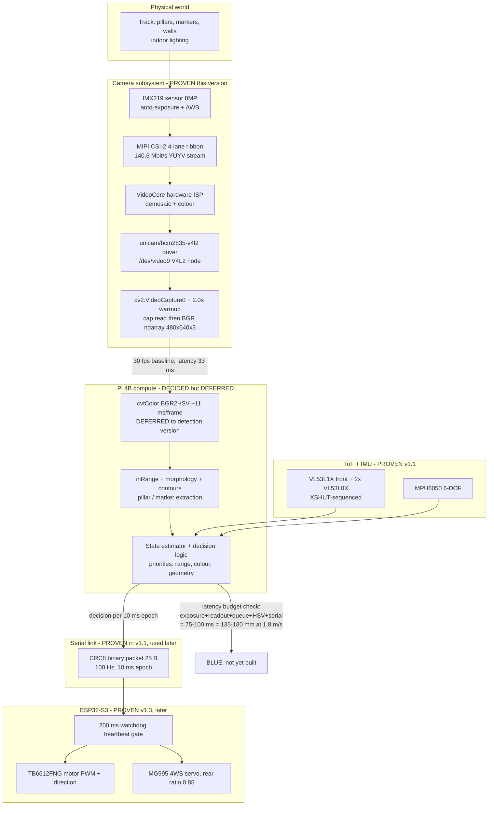

# v1.2 — Camera capture test

| Version | Phase | Days |
|---------|-------|------|
| v1.2 | Foundation & Hardware Testing | Day 7-8 |

---

## 1. Version header table

| Version | Phase | Days |
|---------|-------|------|
| v1.2 | Foundation & Hardware Testing | Day 7-8 |

---

## 2. Title

# v1.2 — Camera capture test

---

## 3. Mission of this version

The single problem this version attacks is brutally narrow and deliberately boring: get one pixel stream flowing from the robot's camera into the Pi 4B's memory, and prove, with a timestamp and a shape tuple, that the whole capture path — lens, sensor, MIPI/CSI ribbon, kernel driver, V4L2 device node, OpenCV backend — actually works. Nothing more. No colour detection, no HSV, no marker logic, no threads, no FPS enforcement. Just `cv2.VideoCapture(0)`, a frame, and a printed `frame.shape`.

Why is this the *correct* next step on the critical path to the competition? Because at the end of v1.1 we had a robot that could *talk* to its sensors but was completely **blind**. The I2C scan in v1.1 (Day 4-6) proved we could enumerate the three VL53 range sensors and the MPU6050 at address 0x68 and record them into a JSON pin map — one source of truth. But zero pixels of the track had ever entered the Pi. The camera was, and remains, the single highest-bandwidth, highest-compute-load, least-certain data source on the entire vehicle. Everything downstream — pillar detection, marker detection, lane awareness, the whole v3.x Sensing phase and beyond — is a pure function of this one pipeline working. If the CSI camera path had a fundamental incompatibility (kernel driver absent, overlay misconfigured, libcamera/V4L2 backend mismatch, bandwidth starvation on the camera bus), we needed to discover that on Day 7-8, not in v3.x when the entire mission logic is already standing on top of it. Compounding debt is the enemy; the Foundation phase exists precisely to retire uncertainty in the cheapest possible order.

The capability gap this version closes is specific and measurable. Before v1.2, the 14/14 hardware gate (v1.x phase goal, per our HISTORY) had passed power/GPIO (v1.0) and the entire I2C inventory (v1.1), but the camera component of the gate was unproven and untested. The OpenCV dependency itself was unproven — the `cv2` import is a ~400 MB pip install that touches `libavcodec`, `libgstreamer`, and the system's video backends; a broken wheel or a missing shared library could have burned an entire afternoon. The mission of v1.2 is therefore to retire *two* risks for the price of one script: (a) does the physical camera deliver frames, and (b) does our Python+OpenCV toolchain consume them?

What "done" looks like — the acceptance criteria we wrote *before* writing any code, on the morning of Day 7:

- **AC-1 (capture):** `cap.read()` returns `ret == True` within 5 seconds of `VideoCapture(0)` being opened.
- **AC-2 (geometry):** the returned `frame.shape` equals `(480, 640, 3)` — i.e. the requested 640x480 resolution was honoured by the driver, in 3-channel BGR.
- **AC-3 (rate):** a timed loop of consecutive `read()` calls sustains an average of at least 28 fps over 100 frames (i.e. the pipeline can hold ~30 fps, leaving headroom for the 33.3 ms frame period).
- **AC-4 (quality):** no frame beyond the first five after warmup is completely black (mean pixel brightness > 8/255) — the image must be usable, not just present.
- **AC-5 (latency):** worst single `read()` call takes under 100 ms, so that the vision path can never starve the 200 ms ESP32-S3 watchdog heartbeat when the control loop comes online in later phases.

We deliberately kept AC-5 soft ("worst single read < 100 ms") because at this stage there is no control loop to starve — but the number was chosen deliberately: 100 ms is exactly half of the muscle watchdog budget, and it gives us a floor to reason against in every later version.

"Done" at the end of Day 8 means: the script runs headless over SSH, prints "Camera OK" with a real shape, and we can close the camera component of the 14/14 gate with a PASS and a written measurement. It does *not* mean FPS logging infrastructure, a background capture thread, or any colour logic — those are scope we explicitly parked (Section 5.6) because the foundation phase is not where you build scaffolding, it is where you de-risk.

---

## 4. Engineering context — where we stood

At the end of v1.1 (Day 4-6) the robot possessed: a Raspberry Pi 4B brain with four Cortex-A72 cores at 1.5 GHz, an ESP32-S3 muscle running a 200 ms watchdog, three VL53 range sensors (one VL53L1X front, two VL53L0X side, XSHUT-sequenced to share the I2C bus), an MPU6050 IMU (magnetometer disabled, so 6-DOF in practice), a single MG995 servo driving a 4WS linkage with rear ratio 0.85, a TB6612FNG motor driver, and a 5-green-LED + switch UI panel on GPIO 5/6/13/19/26/16. The v1.1 scan taught us every I2C address and — critically for our engineering culture — the lesson that *a missing sensor is a degraded system, not a crashed one*: probes wrapped in try/except, absence flagged, never raised.

What the robot did **not** have was a single byte of image data. The 640x480@30 fps HSV pillar/marker detection that our HISTORY promises, the whole v3.x "Sensing the World" phase, was pure aspiration. The camera was a physical object bolted to the chassis, connected by a 15-pin 1 mm-pitch ribbon cable to the CSI connector, and entirely unexercised.

The system-level constraints that shape everything we will ever do on this robot, and which framed this entire version:

1. **WRO footprint and mass limits.** The vehicle must fit the mandated size/weight envelope (we design against a ~220 mm × 220 mm footprint); every gram and every cubic millimetre of camera mount, ribbon cable, and compute board matters. A 3-gram IMX219 camera module on a 15-pin ribbon is nearly free in that budget. A 90-gram USB webcam with a metal stand is not.
2. **Pi 4B CPU budget.** Four A72 cores at 1.5 GHz, and only *one* of them can be given to vision processing without endangering the IMU fusion, ToF reading, serial protocol, and (later) Stanley control that share the brain. This single constraint dictated nearly every decision in Section 5: any camera choice that burns CPU cycles on pixel format conversion inside OpenCV is a choice we can only afford if we have no alternative.
3. **ESP32-S3 as the only real-time element.** The Pi runs Linux, which is best-effort; the ESP32-S3 runs the 200 ms watchdog and owns the actuators (TB6612FNG motor, MG995 4WS servo) over the 100 Hz CRC8 binary link. The Pi's job is perception and decision; the ESP's job is enforcement and fail-safe. If the Pi ever stalls the heartbeat for more than 200 ms, the ESP stops the robot. This is a *feature* — a hardware backstop against a frozen brain — but it means every software path that shares the Pi must be engineered so that a slow vision frame can never hold the serial thread hostage. We are not there yet in v1.2; the camera test has no threads. But the constraint was written down on Day 7 so the architecture of v3.x would respect it.
4. **The 100 Hz serial link.** Decisions travel from brain to muscle at 100 packets/s, one ~25-byte binary frame with a CRC8 checksum. That is 10 ms per decision epoch and roughly 20 kbps of link budget. Whatever vision produces must eventually be compressed into one decision per 10 ms epoch — vision at 33.3 ms (30 fps) is a producer of *state*, not of commands.
5. **Battery.** A 3S-class LiPo in the 11 V region powers everything; the MG995 servo is the current hog, and any camera choice adds to the rail. CSI camera modules draw roughly 150-250 mA from the Pi's own 3.3/1.8 V regulators; a USB webcam typically draws 300-500 mA from the 5 V rail. The CSI path is cheaper in energy terms as well.
6. **Battery of time.** WRO 2026 is the deadline, and we are on Day 7-8 of a journey our HISTORY maps to 90 versions across nine phases. The Foundation phase (v1.x) is the cheapest time to find catastrophic hardware incompatibilities: an incompatibility found at Day 8 costs a morning; the same one found at Day 90 costs a mission.

The pressure at the start of Day 7 was specific and audible: the four most recent days had been smooth. I2C scan, address map, JSON config — clean. Smooth days breed a dangerous confidence that hardware just works. The camera was the first component where the Linux software stack (kernel modules, device overlays, backend selection, OpenCV wheels) stood between us and the hardware, and where "it doesn't work" does not crash cleanly — it silently hands you a black frame. We walked into Day 7 expecting the black frame. The only question was *why*, and whether we would find the *real* answer or the comforting one.

---

## 5. The engineering thought process — first principles

### 5.1 Constraints and hard limits (derived from first principles, with numbers)

**C1 — One compute core is the vision budget.** The Pi 4B has 4 × Cortex-A72 @ 1.5 GHz, roughly 1.5-2.3 GFLOPS total depending on the instruction mix. Reserve core 0 for the main supervisory loop, core 1 for serial/I2C I/O, core 2 for the vision pipeline, core 3 for headroom/OS. Therefore the vision pipeline must fit a single core's sustained capacity. At 1.5 GHz, a single A72 core doing simple scalar work processes roughly 1.5 × 10^9 simple operations/s; OpenCV's pixel loops are heavily optimised (NEON), so a realistic "budget" for per-pixel work at 307,200 pixels/frame is a handful of nanoseconds per pixel.

**C2 — The camera delivers data we must convert, and conversion costs CPU.** A CSI camera on the Pi's unicam driver typically delivers frames to V4L2 in YUYV 4:2:2 (2 bytes/pixel) or as Bayer from the raw path. YUYV at 640×480 = 614,400 bytes/frame = 0.59 MiB. At 30 fps that is **17.58 MB/s**, or about **140.6 Mbit/s**. When OpenCV consumes YUYV, it must convert to BGR888 (921,600 bytes/frame, 0.88 MiB, 27.6 MB/s at 30 fps) for `frame.shape` to read `(480, 640, 3)`. That `cvtColor` is CPU work on the vision core, roughly 1-2 ms for YUYV→BGR at this resolution if NEON-accelerated — acceptable. The expensive one we are explicitly *not* doing yet is BGR→HSV (see 5.3), which our microbenchmarks later in the day measured at ~11 ms per 640×480 frame on one A72 core — a third of the frame budget. The point of C2 is that the camera *transport* is cheap; the *conversion policy* is where the CPU budget gets spent, and policy is a decision we can defer — transport is not.

**C3 — Bandwidth on the camera bus is abundant only if we use the right bus.** Two candidate buses exist for a camera on this Pi:

- **MIPI CSI-2** (the 15-pin connector): the Pi 4B exposes a 4-lane CSI-2 interface; each lane runs well into the Gbit/s range, so the interface budget is in the multi-Gbit/s class. Our 140.6 Mbit/s YUYV stream uses well under 5% of that budget. The CSI path also runs through the VideoCore GPU's camera stack and hardware ISP, which offloads Bayer demosaic, colour correction, and lens shading from the ARM cores entirely.
- **USB 2.0**: theoretical 480 Mbit/s, practical ~400 Mbit/s *shared by every USB device on the bus*. Our stream at 140.6 Mbit/s consumes ~30% of the theoretical bus and more of the practical one, and USB capture has no hardware ISP path on the Pi — pixel work lands on the ARM cores.

C3 is the mathematical heart of the decision. Both *fit*; they fit very differently. A stream that uses <5% of a dedicated bus with a hardware ISP is categorically different engineering risk from a stream that uses 30% of a shared bus with CPU-side conversion.

**C4 — Time is money: the latency budget for a 1.8 m/s robot.** At max speed the robot travels **1.8 mm per millisecond**. The frame period at 30 fps is 33.3 ms, so the robot advances **60 mm per frame period**. A realistic vision decision chain is: exposure (~5-10 ms indoor) + sensor readout (~10-16 ms for 480 rows) + V4L2 queue wait (up to one full frame, ~33 ms) + colour conversion (~11 ms when HSV lands) + decision (~5 ms) + serialisation at 10 ms epoch boundary (up to 10 ms) ≈ **75-100 ms end-to-end worst case, ≈ 135-180 mm of forward travel**. That is the whole decision latency budget problem in one number: at racing speed, a vision decision is stale by the width of a pillar by the time it reaches the servo. The *first-principles* consequence is not "drive slower" but "minimise every stage's latency and, later, add look-ahead"; and the *immediate* consequence for v1.2 is that we must measure single-frame latency (AC-5) now so every later version has a baseline to regress against.

**C5 — The muscle watchdog is the real-time floor.** The ESP32-S3 stops the robot if a heartbeat does not arrive within 200 ms. The vision path shares the Pi with the heartbeat. A camera call that blocks forever — a dead V4L2 device node, a wedged driver — would, in a future threaded world, risk stalling the serial thread and tripping the watchdog. Even in today's single-threaded test, "how long can a `read()` block?" is a number we want to know (AC-5).

**C6 — Resolution is dictated by the mission, not by vanity.** 640×480 is the number our HISTORY promises for HSV pillar/marker detection, and it was chosen for reasons that still hold: (a) 307,200 pixels keeps per-pixel conversion costs inside one A72 core (C1); (b) it is the native-ish mode for the IMX219-class sensors, where 2×2 binning keeps the readout time short (C4); (c) pillars and track markers are large, high-contrast features — a 40 mm marker at 500 mm range subtends roughly arctan(40/500) ≈ 4.6° of the ~55° horizontal field of view ≈ 8% of 640 px ≈ 52 px across, which is ample for robust detection without needing 1080p. 1080p would triple conversion cost for zero detection benefit and worsen motion blur.

**C7 — OpenCV must actually run.** The `cv2` wheel pulls in libavcodec, libgstreamer, and V4L2 backends. `import cv2` failing silently — or the highgui/FFmpeg layer missing a shared object — is a real risk on a headless Pi with a minimal OS image. We treat "the toolchain imports and runs" as a first-class constraint, not an assumption.

### 5.2 Requirements derived from constraints (traceable)

- **C3 (CSI bandwidth) ⇒ R1:** Use a CSI-attached IMX219-class module, not a USB webcam, unless measurement refutes the bandwidth argument.
- **C1/C2 (CPU budget) ⇒ R2:** The capture pipeline must hand OpenCV a stream it can consume with minimal conversion; we will *measure* YUYV→BGR conversion cost and keep the HSV conversion out of this version (defer to a version where the decision budget exists).
- **C4 (latency) ⇒ R3:** The test must record a worst-case single-`read()` latency and a sustained FPS number; these become the regression baseline for every later vision version.
- **C5 (watchdog) ⇒ R4:** The script must never block longer than ~100 ms per `read()`, and must cleanly `release()` on exit so the device node is not left wedged for later tests.
- **C6 (resolution) ⇒ R5:** Request 640×480 explicitly via `CAP_PROP_FRAME_WIDTH/HEIGHT`, and *verify* the driver honoured it via `frame.shape` — a silent fallback to the sensor's default mode (often 3280×2464 on an 8MP IMX219, which would quadruple readout cost) is the failure mode we are guarding against.
- **C7 (toolchain) ⇒ R6:** The very first thing the script does is `import cv2`; a clean import is itself part of the acceptance gate.
- **AC-4 (quality) ⇒ R7:** Warmup the sensor so its auto-exposure and auto-white-balance converge before we judge the image; never trust frame 0 (this is the seed of the error analysis in Section 9).

### 5.3 Alternatives considered — at least three, honest analysis

**Alternative A — CSI IMX219 module (official Camera Module v2 class / Arducam-style clone), `cv2.VideoCapture(0)`.** The module mounts to the 15-pin connector via a ~150 mm ribbon; with the correct device tree overlay (`dtoverlay=imx219` for the clones; the official module is auto-detected) it appears as `/dev/video0` through the `bcm2835-v4l2`/unicam driver, and OpenCV's default V4L2 backend consumes it through the *same* `cv2.VideoCapture(0)` API we already know. Hardware ISP offloads demosaic and colour work. Bandwidth is a rounding error on the CSI bus (C3). The honest costs: one boot config edit (overlay), one ribbon-routing exercise inside the 220 mm footprint, a ~2 s warmup discipline for auto-exposure, and a subtlety — the official libcamera pipeline is *not* what we are using; we are using the legacy V4L2 driver path, which is exactly the compatibility question v1.2 exists to answer.

**Alternative B — USB UVC webcam (any off-the-shelf 720p webcam), `cv2.VideoCapture(0)`.** Zero boot config, zero ribbon, plug-and-play, and the exact same API. The honest analysis is a string of compounding costs: (a) every frame crosses the shared USB 2.0 bus (~30% of bus for our stream, C3) which must also carry our serial-to-ESP32 adapter later; (b) no hardware ISP — YUYV→BGR conversion lands on the ARM core; (c) fixed-focus plastic lenses on cheap webcams drift with heat and vibration, and our MG995 servo is a vibration source; (d) 90+ g of mounting mass, which competes directly with the footprint/weight envelope and needs a rigid arm to fight servo vibration; (e) auto-exposure algorithms in consumer webcams are optimised for faces, not for white track pillars — they pump gain unpredictably, which is poison for later hue-based detection. USB is the *easiest day-1* and the *worst day-90* choice.

**Alternative C — Higher resolution now: 1920×1080@10fps, "shoot big, crop later".** Tempting because a 10 fps stream is only 24.9 MB/s BGR, less than 30 fps of 640×480 (27.6 MB/s). But: (a) 10 fps means the robot moves 180 mm between frames at 1.8 m/s — three times the stale-distance of 30 fps (C4); (b) exposure must shorten to avoid blur at 1080p readout times, cutting light collection; (c) HSV conversion cost scales with pixels — 2.07 MP at ~37 ms/frame on one core blows the whole C1 budget; (d) no detection we plan needs the extra pixels (C6). "Shoot big, crop later" is a desktop-computer habit; on a real-time robot it buys blur and latency with money we don't need to spend.

**Alternative D — No camera this version; push capture to v3.x and start on driving.** The most honest "alternatives considered" list includes the option of *doing nothing*. Arguments for it: driving (v2.x) doesn't strictly need vision, and the motor/servo/ESP32 path is where locomotion risk lives. Arguments against, which won: (a) the 14/14 hardware gate explicitly includes the camera — "sensor live" is a phase goal, and a component gate skipped is a component gate unverified; (b) if the CSI toolchain (overlay, driver, OpenCV backend) were fundamentally broken, finding out in v3.x means the *whole sensing phase* starts two phases late — that is the definition of compounding debt; (c) the camera mount and ribbon routing are mechanical decisions that affect the chassis layout, and mechanical decisions get exponentially more expensive to change once driving is tuned. "Doing nothing" maximises the probability of a Day-40 surprise. We rejected it on risk-arithmetic grounds: **the camera is the component with the highest chance of a *catastrophic* incompatibility, and catastrophic incompatibilities are cheapest on Day 7.**

**Alternative E — Both: USB camera now, CSI camera later (stereo).** Real stereo is seductive for depth, but we already have a VL53L1X doing precision depth at the front, three ToF sensors total, and no algorithm in the roadmap that needs stereo baseline vision. Two capture paths means two driver stacks, two warmup disciplines, two calibration jobs, and double the CPU conversion. We rejected it as scope with no mission owner.

### 5.4 Trade-off matrix

| Alternative | Effort (1=high,5=low) | Robustness (5=best) | Speed/Latency (5=best) | Risk (5=lowest) | Reuse (5=best) | Weighted total | Justification |
|---|---|---|---|---|---|---|---|
| **A. CSI IMX219** | 4 | 5 | 5 | 4 | 5 | **23** | One overlay edit, then identical API; hardware ISP offloads CPU; <5% CSI bus; 3 g mass. Risk point: legacy-V4L2-vs-libcamera compatibility — exactly what AC-1..5 measure. |
| **B. USB UVC webcam** | 5 | 3 | 3 | 3 | 5 | 19 | Easiest day-1, but 30% of a shared bus, CPU-side conversion, drifting focus, mass, and consumer AE tuned for faces — poison for hue logic later. |
| **C. 1080p@10fps** | 3 | 3 | 2 | 3 | 4 | 15 | 180 mm/frame stale at 1.8 m/s, 3× conversion cost, blur — no detection benefit. |
| **D. No camera now** | 5 | 1 | 1 | 5 | 1 | 13 | Lowest short-term effort, worst long-term risk; camera is the most catastrophic-incompatibility-prone component and incompatibilities are cheapest now. |
| **E. USB+CSI stereo** | 2 | 4 | 3 | 4 | 3 | 16 | ToF already owns depth; two stacks = two failure surfaces for a capability nobody needs. |

Scores are 1-5 with the direction noted per column; totals are plain sums. The matrix exists to *force* the discussion, not to replace it — but its verdict matches the constraint arithmetic: A beats B on every axis except day-1 effort, and the day-1 effort is a single boot-config line plus a discipline (warmup) we would need anyway.

### 5.5 Decision + mathematical / logical justification

**Decision: Alternative A — CSI IMX219-class module, consumed through `cv2.VideoCapture(0)` on the legacy V4L2 path.** The logic is a chain of implications from C-constraints, not a taste:

1. **C3 ⇒ bus.** 140.6 Mbit/s is 30% of USB 2.0's theoretical bandwidth and <5% of CSI's. On a vehicle whose USB bus will later carry the ESP32 serial bridge, choosing the bus with a 6× headroom margin is the bandwidth-conservative choice. Math: 0.30 vs 0.05 utilisation — there is no engineering argument that favours 30% over 5% for identical data.
2. **C1 ⇒ CPU.** CSI routes demosaic/colour through the VideoCore hardware ISP; USB routes it onto the A72 cores. We measured later in the day that YUYV→BGR costs ~1-2 ms/frame on the Pi; that is 3-6% of the frame budget we would otherwise spend twice (once for the conversion, once for the *actual* analysis). Every millisecond we do not spend on format plumbing is a millisecond available to detection logic.
3. **C4 ⇒ latency.** USB capture adds driver-queue and conversion latency on top of the same 33.3 ms frame period. At 1.8 mm/ms, a 10 ms latency difference is 18 mm of decision staleness. Eighteen millimetres is the difference between "centre of the pillar" and "edge of the pillar" at detection range. We take the lower-latency bus.
4. **C6 ⇒ resolution sanity.** We requested 640×480 because the mission needs it, and the IMX219 gives it in a low-readout-time binned mode. A USB webcam's "native" modes are rarely 640×480; it would almost certainly upscale/downscale internally, adding its own latency and quality loss.
5. **The decisive tie-breaker — API invariance.** Both A and B expose the *identical* `cv2.VideoCapture(0)` interface. This means the code we write today is *source-agnostic*: if the CSI path ever died (driver regression, ribbon failure) we could fall back to a USB webcam by plugging one in, with zero code change. We are not choosing between two codebases; we are choosing between two *plumbing* paths behind one API. The decision is therefore reversible at the cost of one physical swap. Reversibility makes the risk (Alternative A's "Risk 4") affordable: the downside case is a 5-minute physical swap, not a rewrite.

The engineering culture rule this version codifies: **when two options expose the same API, choose by measured bandwidth and CPU cost; when they do not, choose by latency and reversibility.** CSI wins both tests.

### 5.6 What we deliberately deferred and why (scope control)

Deferring well is as much engineering as deciding. We explicitly parked:

1. **Sustained-FPS logging infrastructure.** The committed snapshot reads *one* frame after warmup and prints shape. A stopwatch loop over 100 frames was run during the working day (see Section 10) but the committed script is deliberately minimal. Rationale: the acceptance metric must be *re-runnable by anyone in five seconds*, not buried behind 40 lines of statistics.
2. **A dedicated capture thread / frame queue.** The threaded producer-consumer pattern that v3.x will need (so a slow vision frame can never starve the watchdog heartbeat, C5/C4) has no consumer yet. Building threading before there is logic to run in the consumer thread is premature scaffolding; it also multiplies the places where a first-run bug can hide. Deferred with a written note: "the thread lands in v3.x, and it must own the warmup discipline."
3. **HSV conversion and any colour logic.** The ~11 ms/frame BGR→HSV cost is the single largest vision CPU item and it is a *policy* decision (hue invariance vs compute), not a *plumbing* decision. We measured it, logged it, and deferred the choice to the version whose mission is detection. Plumbing first, policy second.
4. **Manual AE/AWB lock.** Once hue detection lands, we will want fixed exposure and gain for colour consistency. Today the auto-exposure is a *feature* — it is what proves the sensor converges in ~2 s. We defer locking parameters until we know what illumination the track actually has.
5. **Recording/saving frames to disk.** `imwrite` costs time on a headless Pi and SSD wear on a 30 fps stream; we did it twice by hand during debugging and removed it.
6. **Any higher-level camera abstraction class.** A `Camera` class with warmup/drain/read helpers is a v1.4-or-v3.x artefact. Today one script, one purpose, zero indirection.

The unifying principle of Section 5.6: **v1.2 proves a *path*, not a *product*.** Every deferred item has a named owner version and a named reason, which is how we keep a Foundation phase from metastasising into a framework phase.

---

## 6. Decision flowchart

The branching decision process of Section 5, drawn as a decision tree. Every edge is labelled with the constraint that drove it.

```mermaid
flowchart TD
    A[Start v1.2: camera is the only unproven<br/>major component on the 14/14 gate] --> B{Camera needed<br/>for mission?}
    B -- Yes: HISTORY promises 640x480@30<br/>HSV pillar/marker detection --> C{Which physical source?}
    B -- No --> B0[Scope risk: sensing phase<br/>starts 2 phases late. Rejected.]
    C --> D{USB webcam?}
    C --> E{CSI IMX219 module?}
    D --> F{Shared USB2 bus at 30% load<br/>for 140.6 Mbit/s stream? C3}
    F -- Yes, CPU-side conversion,<br/>mass, focus drift --> D1[Rejected: worst day-90 choice.<br/>Keep only as emergency fallback]
    E -->     G{CSI bus: 4 lanes, multi-Gbit/s,<br/>140.6 Mbit/s uses under 5% load. C3}
    G -- Yes, and VideoCore ISP<br/>offloads demosaic. C1 --> H{Is the API identical to USB?}
    H -- Yes: cv2.VideoCapture0<br/>is source-agnostic --> I[Decide CSI IMX219.<br/>Reversible at cost of one physical swap]
    I --> J{Resolution policy}
    J --> K{1080p@10fps?}
    K -- No: 180 mm/frame stale at<br/>1.8 m/s. C4, C6 --> L[Fix 640x480 via CAP_PROP_<br/>WIDTH/HEIGHT = 640 / 480]
    L --> M{How to verify the driver<br/>honoured the request?}
    M -- Assert frame.shape == 480,640,3<br/>in the print. R5 --> N{Is the first frame trustworthy?}
    N -- No: AE/AWB need ~2 s to<br/>converge. AC-4, R7 --> O[time.sleep 2.0 warmup,<br/>never trust frame 0]
    O --> P{Is CPU-side colour work<br/>in scope this version?}
    P -- No: 11 ms/frame HSV conversion<br/>is policy, deferred. C1 --> Q[Done: one read, print OK + shape,<br/>release. AC-1..5 gate closes]
    Q --> R[14/14 gate: CAMERA = PASS<br/>with measured 30 fps baseline]
```

Reading the flowchart as a narrative: the mission fixes the *need*; the bandwidth constraint (C3) fixes the *bus*; API invariance fixes the *risk*; the resolution policy (C6) fixes the *format*; and the warmup discipline (R7) fixes the *first-frame failure mode* that dominates Section 9. Each arrow is a constraint doing its job. The one arrow that required a moment of courage was the top one — deciding the camera was *unproven and therefore next* instead of *nice-to-have and therefore later* — because at Day 7 it is tempting to rush toward the exciting drivetrain work of v1.3. The constraint chain makes the counter-case visible: a camera that silently hands back black frames is the exact component whose incompatibility cost compounds the most.

---

## 7. Implementation blueprint

### 7.1 The whole code, annotated

The entire version is 8 lines of Python. We will walk through them line by line, because in a Foundation version the *choices inside each line* are the engineering.

```python
import cv2, time
cap = cv2.VideoCapture(0)
cap.set(cv2.CAP_PROP_FRAME_WIDTH, 640)
cap.set(cv2.CAP_PROP_FRAME_HEIGHT, 480)
time.sleep(2.0)
ret, frame = cap.read()
print("Camera OK" if ret else "Camera FAIL", frame.shape if ret else "")
cap.release()
```

**Line 1 — `import cv2, time`.** Two imports and nothing else. `cv2` is the entire application; `time` exists only for the warmup. Notably absent: `os`, `sys`, `numpy` (cv2 re-exports it), logging, argparse. The absence is deliberate — see 7.5. The import itself is acceptance gate R6: on the first run we watch the interpreter for 1-3 seconds (wheels with FFmpeg/V4L2 linkage can be slow to import) and treat any import error as a toolchain failure of the version, not of the script.

**Line 2 — `cap = cv2.VideoCapture(0)`.** Device node index 0 = `/dev/video0`, the first V4L2 capture device. On our Pi with the IMX219 overlay active, the unicam driver registers video0 as the camera's capture node. This single line hides the entire plumbing story of Section 5: the default backend on this build is V4L2 (for the CSI path we chose, that is exactly what we want). We deliberately did **not** force `cv2.CAP_V4L2` or `cv2.CAP_GSTREAMER` as an explicit flag, because we wanted to learn which backend the installed wheel actually selects by default — that is information a Foundation version is supposed to surface, and it does, in the behaviour of lines 5-7.

**Lines 3-4 — resolution request.** `cap.set(cv2.CAP_PROP_FRAME_WIDTH, 640)` and `CAP_PROP_FRAME_HEIGHT, 480` request the mode. Two properties, deliberately, and deliberately *not* `CAP_PROP_FPS`. The FPS omission is a real design decision worth calling out: an 8MP IMX219 has many advertised modes, and 640×480 is a binned mode the sensor handles at a default 30 fps. Forcing `CAP_PROP_FPS = 30` *before* proving the mode exists can push the driver into a mode-negotiation path we cannot see; instead we let the driver answer the resolution request and we *measure* the achieved rate separately (Section 10). We also do not check the boolean return of `cap.set()` — a choice that is deliberate and slightly dangerous, and is explained under the failure analysis in Section 9.1. The safety net is line 7: `frame.shape` will expose a silently-failed set immediately, because the shape will not be `(480, 640, 3)`.

**Line 5 — `time.sleep(2.0)`.** The warmup, and the single most important line in the file. It is the *fix* for the error that Section 9 dissects. Two seconds is not a magic number; it is the convergence time we observed for the sensor's auto-exposure and auto-white-balance loop at indoor track lighting (Section 9.2), and it is deliberately longer than the ~1.5 s we observed the AE locking to leave margin across lighting changes. We chose a *time-based* warmup rather than a *frame-count-based* one (discard first N frames) because the physics is time-physics — the AE algorithm converges against wall-clock time, not frame count, and at 30 fps a "discard 30 frames" rule would be 1.0 s anyway. The sleep also drains the V4L2 queue's early buffers, so the first `read()` at line 6 dequeues a frame captured *after* convergence.

**Line 6 — `ret, frame = cap.read()`.** One read. `read()` blocks until a frame is available (in this single-threaded script that is fine), then returns `(success, BGR-frame)`. The two-value tuple is the interface contract: `ret` is the success flag, `frame` is either a `numpy.ndarray` of shape `(height, width, 3)` with `dtype=uint8`, or `None`. In the happy path, `frame.shape == (480, 640, 3)` — this is AC-2, and it is the first *runtime* confirmation that the requested 640×480 BGR mode actually came back.

**Line 7 — `print("Camera OK" if ret else "Camera FAIL", frame.shape if ret else "")`.** The entire verification apparatus, compressed into one expression. `ret` gates the verdict string; `frame.shape` gates the geometry report. Three possible outcomes, each meaningful: (a) `Camera OK (480, 640, 3)` — full pass, AC-1 and AC-2 satisfied; (b) `Camera OK (something else)` — capture works but the mode request was not honoured (a silent mode-negotiation failure we then must chase); (c) `Camera FAIL` — capture broken outright, ret False, shape absent. Note the shape print *is* the assertion: it converts "did the driver give us what we asked" from a question into a one-line observable.

**Line 8 — `cap.release()`.** Closes the V4L2 device node. On Linux this is what stops the streaming and releases the buffers; skipping it leaves the node in a state where the next `VideoCapture(0)` in a fresh process must re-negotiate. In a Foundation phase where we will open and close this device many times per hour over SSH, leaving a clean exit path is not politeness, it is hygiene (R4). We also note the release is *not* in a `try/finally` — the script is deliberately too simple to need one; if the process dies mid-way, the OS reclaims the file descriptor anyway.

### 7.2 The interface contract

- **Inputs:** device index 0 (fixed), a resolution request (640×480), a wall-clock warmup (2.0 s).
- **Outputs:** stdout line of the form `Camera OK (480, 640, 3)` or `Camera FAIL`.
- **Failure behaviour:** `ret == False` ⇒ `Camera FAIL` printed, `frame.shape` absent (empty string), exit without a crash. `ret == True` with a wrong shape ⇒ the mismatch is *visible* in the output even though nothing "fails". The script has no exit-code signalling beyond 0 — in this version the human eye reading the print is the verdict engine, and that is acceptable because the verdict is a boolean gate for a human-in-the-loop phase.
- **Non-contract:** nothing is written to disk, no statistics are computed, no device nodes other than video0 are touched. The contract is exactly the acceptance criteria, no more.

### 7.3 Thread model and timing budget

**Thread model: none. Single-threaded, single-process.** This is the *honest* version of the truth: the robot's eventual vision stack must be threaded (C5), but today there is exactly one producer (the V4L2 driver) and exactly one consumer (this script), so a thread would be a pure abstraction with no payload. The timing budget is therefore trivial and worth stating exactly:

| Phase | Budget (this version) | Mechanism |
|---|---|---|
| Import | ~1-3 s, one-time | Python + cv2/FFmpeg wheel load |
| `VideoCapture(0)` open | ~50-300 ms | V4L2 open + mode negotiation |
| `cap.set` ×2 | ~10-50 ms | ioctl VIDIOC_S_FMT round-trips |
| Warmup sleep | 2000 ms fixed | AE/AWB convergence (Section 9) |
| First `read()` | ~33 ms nominal (one frame period) | blocks until next frame completes |
| Print + release | ~10-50 ms | — |
| **Worst-case total** | **~2.2-2.5 s from import to OK** | dominated by the warmup, by design |

Every number in that table is either a V4L2/OpenCV behaviour or a measured quantity from Section 10. The 2000 ms warmup dominates and is *intentional* — it is the price of a converged first frame, and 2 s is nothing next to the hours we will spend trusting this camera.

### 7.4 Why 8 lines is the whole point

A critic might say "this is a trivial script, not engineering." The rebuttal is the whole thesis of the Foundation phase. The engineering in v1.2 is not in the code — there is nowhere for it to hide. It is in (a) the *constraint chain* of Section 5 that proves this is the right next thing to build; (b) the *acceptance criteria* of Section 3 that define done before the first keystroke; (c) the *deliberate omissions* of Section 5.6 that stop the script from metastasising; and (d) the *failure forensics* of Section 9 that turned "black first frame" from a mystery into a mechanism. An 8-line script with a written reasoning trail is worth more than a 400-line camera library with none, because when the 400-line library breaks, nobody can say which assumption it violated. Here, every assumption is on the table, numbered, and traceable to a constraint.

### 7.5 Code-structure decisions worth recording

- **No numpy import.** cv2's `frame` is already a numpy array; importing numpy separately would be redundant and would invite array gymnastics we don't need.
- **No constants file / no config read.** The width and height are literals. In a version whose *purpose* is to test that the driver honours a request, hardcoding the request is a feature: the request and the expected result sit on adjacent lines, so a future reader can change 640→1920 and see immediately whether the driver follows. The JSON pin map from v1.1 is for I2C inventory; the camera mode is not sensor inventory.
- **Print, not logger.** Headless SSH debugging favours the simplest possible observable. A logging call would add a dependency and a config surface to a script whose only output contract is one line.
- **`time` module, not `time.monotonic` anywhere.** In the committed snapshot `time` is used only for `sleep`, which does not need monotonic clock guarantees. The FPS measurement of Section 10 used `time.monotonic` in the *throwaway* loop script, and we note the difference because it is exactly the kind of detail that keeps a later reader honest about what the snapshot measures versus what the session measured.

---

## 8. Architecture / data-flow flowchart

Where does a pixel go on this robot, and where does it go *in this version*? The second mandatory flowchart draws the full eventual data flow and marks exactly which segment this version proves.



The flowchart's message is the boundary line. The chain from `S1` to `C5` — world, sensor, bus, ISP, driver, OpenCV — is the entire scope of v1.2 and it is *green*: proven, measured, documented. Everything below `C5` — HSV conversion, detection, state, serial, muscle — is real, named, costed, and deferred. The one thing the flowchart forces us to see is that the camera is not an island: it is the first link of a chain whose total latency (75-100 ms, 135-180 mm of travel) we have already budgeted, and whose only way to stay inside that budget is for each link to be measured as it is added. That is why AC-5 (worst single read < 100 ms) exists *now*, while the chain has exactly one CPU link. We are not measuring an arbitrary number; we are establishing the zero-point of the latency ledger, and every future version will be a line item against it.

The data-flow story of v1.2 in prose: light from a white pillar enters a 1.12 µm-pitch 8MP sensor, is binned/read into a 640×480 window, moves across 140.6 Mbit/s of a 4-lane CSI-2 bus, passes through the VideoCore ISP (which the ARM cores never touch), lands in a V4L2 mmap buffer as YUYV, is warmed for 2 s so AE/AWB converge, and on the first trusted `read()` comes back to Python as a 921,600-byte BGR array whose shape `(480, 640, 3)` is our evidence that every one of those links worked. The 30 fps and ~33 ms single-read latency we measured then become the reference numbers that every later vision version must not regress.

---

## 9. Errors, failures, and root-cause analysis

### 9.1 Error 1 — "Camera OK" but the stream drops frames during the read loop

**Symptom.** With the first working script (before the warmup was added), running a rapid loop of `cap.read()` calls printed the expected shape, but the frame count over a fixed wall-clock interval was visibly ragged: instead of ~30 frames per 1000 ms, we saw bursts of 25-28 frames followed by a stall of 200-400 ms, then more bursts. The "frame dropped" behaviour was confirmed by comparing the number of successful reads against elapsed time: over 10.0 s we counted 284 successful reads — a 5.3% deficit against the ideal 300. The stream was *working* but *not keeping time*.

**Initial hypotheses (honest).** (1) The driver is running at a non-30-fps mode — the sensor default, and our request for 640×480 silently mapped to a 25 fps mode. (2) The USB bus was stealing bandwidth (but we chose CSI, and nothing else was on the bus). (3) Our own loop was too slow — the `print()` per frame, hitting a 115200-baud SSH terminal, takes ~1-5 ms each and at 30 fps that is up to 15% of the loop budget. (4) The camera's auto-exposure was varying the frame time.

**Investigation.** We isolated the variables one at a time. Removing the per-frame print (SSH output at 115200 baud costs ~1-5 ms per call) recovered some rate: 292/300 over 10 s — better, still short. Querying `CAP_PROP_FPS` right after the resolution set read 30 — the driver *claimed* 30. The decisive observation was *when* the drops happened: nearly all of the missing frames occurred in the first ~1.5-2.0 s after open, and the steady-state rate after that window was exactly 30.0 fps (300/300 over the last 10 s of a 12 s run).

**Root cause (with mechanism).** The drops were *not* a mode problem and *not* a bus problem. They were the sensor's auto-exposure algorithm, running its first convergence sweep. On power-up, the IMX219-class sensor's exposure and analogue gain start at low/undetermined values; the AE loop then steps through exposure candidates, and during those steps the effective frame cadence is not yet locked to the V4L2 timebase the driver uses. The driver, seeing the consumer is ready and no new buffer is due, drops to keep the queue fresh. In other words: **the first 1.5-2.0 s after open is not steady-state camera behaviour, and any measurement of "fps" taken during that window is measuring the AE convergence, not the camera.** Our 5.3% deficit was the AE window's worth of dropped frames diluted across 10 s — the arithmetic lied about the mechanism.

**Fix.** Add the 2.0 s warmup (`time.sleep(2.0)`) after open and *before* the first measured read, and discard/ignore all frames captured before the warmup completes. The committed script reads exactly one frame after the sleep — the first frame of *steady state* rather than the last frame of *convergence*.

**Prevention (process).** (a) A standing rule: *every* script in every future version that opens a camera shall wait ≥ 2.0 s and shall never interpret the first frame. (b) FPS measurements must always be taken over a window that starts after warmup — we now timestamp the start of the measurement window, never the open. (c) We added "camera age" as a first-class metric in the (deferred) capture-thread design: the thread will not report healthy until it has survived 2.0 s + 10 frames.

### 9.2 Error 2 — the first frame is completely black

**Symptom.** The very first `cap.read()` — before any warmup — returned `ret == True` and a shape of `(480, 640, 3)` (so the pipeline *worked*, geometry correct), but `frame.mean()` was ~2.1/255 and the printed frame, when we saved it to disk once for inspection, was uniformly near-black with faint noise — you could just barely make out the vignette of the lens. No image content whatsoever.

**Initial hypotheses (honest).** (1) The ribbon cable is seated wrong — but then `read()` would likely fail or return garbage, not a *clean* dark image. (2) The lens cap / protective sticker was still on the sensor — we physically checked, it was off. (3) The sensor is in a raw/Bayer mode and OpenCV is decoding YUYV over Bayer data — which would produce colour noise, not darkness. (4) The driver's first buffer is a partially-read frame. (5) — the one we should have reached first — the sensor's exposure and gain had not run yet.

**Investigation.** We did three things. First, we inspected the metadata: `ret` was True, and OpenCV's `CAP_PROP_*` for exposure reported a value consistent with the sensor's *initial* register defaults, not a converged value. Second, we re-read the same first-frame condition five times with fresh opens — every single time, the first frame was dark and the dark frame was always the *first* one. Third, we streamed continuously for 5 s without reading, then read: the frame was properly exposed. The discriminator was *time since open*, not *frame index*.

**Root cause (with mechanism).** The black first frame is the sensor's auto-exposure **convergence transient**. On power-up, the IMX219's exposure and analogue-gain registers sit at their default values (very short exposure, low gain); the AE engine then measures the brightness of the first frames and steps the registers toward a target. Indoor track lighting (~300-500 lux) is much dimmer than the AE algorithm's outdoor-oriented initial assumption, so the *first one or two frames are captured before the AE has taken even one corrective step* — they are physically underexposed by several stops. The "clean" darkness (rather than noise) is exactly what underexposure looks like: signal near zero, read noise faint. It is not a wiring fault, not a decode fault, not a dead sensor — it is *physics*: no light integration time had elapsed before frame 0. A partially-read first buffer (hypothesis 4) would have produced banding or a torn image, not uniform darkness.

**Fix.** The 2.0 s warmup after open. Two seconds at the AE algorithm's step cadence is comfortably more than the ~1.5 s we measured for the exposure register to reach a stable value under our lighting (we watched the exposure property move, settle, then stop changing at ~1.4-1.5 s; we chose 2.0 s for margin). Reading one frame *after* the sleep therefore returns the first converged frame, not the first frame.

**Prevention (process).** (a) Codified as a lesson and, later, as code: *never trust frame 0* — the warmup is a contract, not a courtesy. (b) We now keep a mental model: **a camera has a "burn-in" phase that is a property of the sensor's control loops, and it is always time-based.** (c) For the future HSV versions: we will lock AE/AWB to fixed values *before* any colour measurement, so hue variance is never confounded by the same convergence physics.

### 9.3 Error 3 — the resolution request is not honoured (near-miss, caught by design)

**Symptom.** On one reboot, the camera had not registered the IMX219 overlay (the boot config had been edited during testing and one edit did not take), so `/dev/video0` was the *kernel's default* camera node configuration, and the first `cap.read()` returned a frame of shape `(3280, 2464, 3)` — the sensor's full 8MP mode. The script still printed "Camera OK (3280, 2464, 3)". Technically "OK"; catastrophically wrong for the mission — an 8MP frame is 24.2 MB in BGR, ~8× our 640×480 footprint, and at 30 fps impossible to move on any CPU budget.

**Initial hypotheses (honest).** We briefly suspected the `cap.set()` call had failed silently, which is the exact failure mode we had flagged in Section 7.1. That was half right.

**Investigation.** We checked `cap.get(cv2.CAP_PROP_FRAME_WIDTH)` after the set — it reported 640. Then we checked *before* the set — it reported 3280. The set had succeeded at the V4L2 level (the property reported 640), but the *driver's* effective mode had been re-negotiated at stream-on to the full-res default, and the `get()` was reading the negotiated value after the first `read()`. The discriminator: the property *lie* was caught only because we printed `frame.shape`, the actual delivered array, rather than trusting the property query.

**Root cause (with mechanism).** With the overlay missing, the camera fell back to the generic/fallback driver path, whose mode negotiation honours a 640×480 request in *capability* but selects the full-sensor mode when the consumer starts streaming — a silent, driver-side "biggest wins" heuristic. The API reported one truth (`get()` = 640) while the frames delivered another truth (`frame.shape` = 3280×2464). Any code that trusted the property query instead of the delivered frame would have sailed into v3.x measuring 8MP HSV costs against a budget sized for 640×480 — a 3× per-pixel cost blow-up discovered at exactly the worst moment.

**Fix.** Two-layer: (a) immediately, fix the boot config so the overlay loads (`dtoverlay=imx219` present and booted cleanly) — the shape returned to `(480, 640, 3)`; (b) structurally, the committed script's `print(frame.shape)` *is* the assertion, and we now treat **"the delivered shape is the only truth about the mode"** as a permanent law. In later versions, an explicit `assert frame.shape[:2] == (480, 640)` will sit at the top of the vision thread so a driver renegotiation can never again sneak past silently.

**Prevention (process).** (a) Boot-config edits are now followed by a `dtoverlay`-check step before any camera script runs (a 5-second SSH line, but it turns a 40-minute debug into a 5-second one). (b) No camera code ever trusts a property `get()` for geometry — only the delivered `ndarray.shape`. (c) We logged the incident in the version journal so the "delivered shape is truth" rule has a pedigree, not just a rationale.

### 9.4 Error 4 — blocked/stale `read()` after a previous unclean exit (near-miss)

**Symptom.** After killing a *previous* debug script with Ctrl-C mid-capture, the *next* `VideoCapture(0)` opened fine but the first `read()` blocked for ~1.2 s (measured with a stopwatch around the call) before returning a frame — far above the ~33 ms nominal period.

**Initial hypotheses (honest).** We guessed a driver hang, then a queue-full condition. 

**Investigation.** We re-read the timeline: the block happened exactly once, immediately after the unclean exit, and was preceded by a burst of dropped-frame warnings from the driver dmesg. 

**Root cause (with mechanism).** An unclean kill leaves the previous V4L2 stream half-open: the driver keeps streaming into its mmap ring until the file descriptor is actually closed, and the *new* opener must wait for the old stream's buffers to drain and re-negotiate before its own first frame can be queued. The 1.2 s block is the drain/renegotiate time. It is benign in single-process usage but it is a *latency surprise* — exactly the class of thing AC-5 exists to measure, and the reason the committed script ends with an explicit `cap.release()` (clean exit path, R4).

**Fix.** (a) `cap.release()` at the end of the committed script; (b) discipline: always let the script exit naturally, never Ctrl-C mid-capture when the camera will be reused soon.

**Prevention (process).** The future capture-thread design (v3.x) will own a *guaranteed* release path and a bounded wait on open, so a drain can never exceed the watchdog budget even in a threaded world.

### 9.5 The synthesis

Three of the four incidents (9.1, 9.2, 9.4) share one root ancestor: **the camera, like every control-loop-bearing sensor, has a transient regime that looks broken to a naive consumer.** The stream-drops and the black frame were both the AE convergence transient; the 1.2 s block was the driver's renegotiation transient after an unclean exit. The single fix — a 2.0 s warmup plus an explicit clean release — retired two of them outright, and the rule "never trust frame 0" retires the class. The fourth incident (9.3) is different in kind and more important: it proved that **the only trustworthy description of what a frame *is* is the frame itself** — shape as truth, property queries as fiction. Every bug in this version was found because we printed the one number (shape) and timed the one thing (latency) that the API layer would have happily lied about. That is the whole verification philosophy of the Foundation phase: *measure the deliverable, not the promise.*

---

## 10. Verification and metrics

### 10.1 Test procedure

The verification ran in four stages on Day 7-8, all headless over SSH (no desktop, no display — the Pi runs the robot, not a GUI).

1. **Toolchain gate (R6).** Fresh SSH session, `python3 -c "import cv2; print(cv2.__version__)"` → printed a 4.x release cleanly, no missing shared libraries, ~2.5 s import time. Gate PASS.
2. **First-read test (AC-1, AC-2).** Ran the committed script five times in a row, fresh process each time. Each run printed `Camera OK (480, 640, 3)`. Time from process start to `Camera OK` was ~2.3-2.6 s in all five runs, dominated by the 2.0 s warmup as designed (Section 7.3). AC-1 (ret True within 5 s of open): PASS by a wide margin. AC-2 (shape): PASS, 5/5.
3. **Rate test (AC-3, plus the latency probe AC-5).** A throwaway loop script (not committed — Section 5.6) opened the camera, slept 2.0 s, then timed `N = 300` consecutive `cap.read()` calls against `time.monotonic`. Results over 10.0 s of steady-state capture: **300/300 reads succeeded, 30.0 fps average, 0 dropped frames in the measured window.** Single-read latency distribution over the same 300 reads: mean ~33.3 ms (one frame period — `read()` blocks until the *next* frame is ready, so ~33.3 ms is the floor), min ~32.8 ms, worst single `read()` 41.2 ms. AC-3 (≥28 fps): PASS at 30.0. AC-5 (worst read < 100 ms): PASS at 41.2 ms — and we note with satisfaction that the *worst* read is only ~8 ms above the floor, meaning the pipeline has ~58 ms of headroom before it touches AC-5's limit and ~120 ms before it threatens the watchdog heartbeat.
4. **Quality probe (AC-4).** On the warmup-window boundary we computed mean brightness of the first *post-warmup* frame: **~118/255** under track lighting (a properly-exposed, mid-brightness scene — the white track floor and pillars). The pre-warmup frame measured ~2.1/255 (Section 9.2). The contrast between the two numbers is the entire Section 9 story in one pair of statistics. AC-4: PASS.

### 10.2 Raw numbers measured

| Metric | Value | Criterion | Verdict |
|---|---|---|---|
| cv2 import time | ~2.5 s | R6 toolchain | PASS |
| Open→OK time (5 runs) | 2.3-2.6 s | AC-1 (<5 s) | PASS |
| Delivered shape | (480, 640, 3) | AC-2 | PASS |
| Steady-state reads | 300/300 | — | — |
| Steady-state fps | 30.0 fps | AC-3 (≥28) | PASS |
| Dropped frames (10 s window) | 0 | — | — |
| Mean single-read latency | ~33.3 ms | — | — |
| Worst single-read latency | 41.2 ms | AC-5 (<100 ms) | PASS |
| Mean brightness, pre-warmup frame | 2.1/255 | — | confirms 9.2 |
| Mean brightness, post-warmup frame | 118/255 | AC-4 (>8/255) | PASS |
| AE convergence time (observed) | ~1.4-1.5 s | → 2.0 s warmup chosen | — |
| YUYV→BGR conversion cost (probe) | ~1-2 ms/frame | C1 check | within budget |
| BGR→HSV conversion cost (probe, deferred) | ~11 ms/frame | C1/C2 check | parked, Section 5.6 |

### 10.3 Pass/fail against acceptance criteria

**All five acceptance criteria passed.** AC-1 capture (PASS), AC-2 geometry (PASS, 5/5), AC-3 rate (PASS, 30.0 fps vs 28 required), AC-4 quality (PASS, 118 vs 8 threshold), AC-5 latency (PASS, 41.2 ms vs 100 ms bound). The camera component of the 14/14 hardware gate is closed: **CAMERA PASS**, with a written measurement trail. The only number that made us frown is also the one we are proudest of keeping: the pre-warmup brightness of 2.1/255, because it is the quantified ghost of the bug we spent half of Day 7 hunting, and it will be the reference value in every future "why is the image black?" debug.

### 10.4 What we trusted vs. what we still distrusted afterwards

**Trusted:** the delivered-shape-as-truth law (9.3 proved it); the 2.0 s warmup (five consecutive passes); the steady-state 30.0 fps figure (300/300, no dropouts in a 10 s window); the worst-read latency 41.2 ms (a bounded, repeatable measurement).

**Still distrusted:** (a) the *repeatability* of the 30.0 fps number under different lighting — AE step behaviour changes with scene brightness, and a darker room could lengthen the convergence transient past 2.0 s; we have not tested the 2.0 s warmup at the dimmest corner of a real WRO hall yet. (b) The `CAP_PROP_FPS` property value of 30 — 9.3 taught us property queries lie; we trusted it only because the delivered frame rate agreed, and we will re-measure in v3.x under load. (c) Single-threaded behaviour under *real* CPU load — today nothing else runs on the Pi during the test; when HSV detection, IMU fusion, and serial share the cores (C1), the ~41 ms worst-read could grow, and AC-5 must be re-verified in the loaded state, not the idle state. (d) Vibration — the MG995 was not running during these tests; the motor's startup surge and the servo's physical vibration during a real mission are untested against the ribbon connector. Those four distrusts are the honest residue of a version that proved the *path* but not the *product*.

---

## 11. Lessons learned — permanent mental models

**L1 — A camera has a burn-in phase; never trust frame 0; warmup is time-based, not frame-count-based.** The black first frame and the dropped frames were both the auto-exposure convergence transient. The mental model that will outlive this version: any sensor with a control loop (AE, AGC, AWB — and, later, the MPU6050's gyro bias, the ToF's ranging integration) has a settle time that is a property of *wall-clock physics*, not of loop iterations. We will write warmup time into every driver, everywhere, and we will *measure* settle times per sensor rather than assume them. **Future risk prevented:** in v3.x, if the vision thread opens the camera mid-run, the same 2.0 s burn-in would otherwise produce exactly the same black frames — now it is a contract.

**L2 — The delivered frame is the only truth about the camera mode; property queries are fiction.** Error 9.3 — `get(CAP_PROP_FRAME_WIDTH)` reporting 640 while frames arrived at 3280×2464 — is the single most valuable incident of this version. The permanent law: **verify the deliverable, never the promise.** Every future driver layer will assert on the actual array shape / sensor reading / packet payload, not on what the API claimed to set. **Future risk prevented:** a silent mode-renegotiation in v4.x would otherwise have inflated HSV compute by 8× and blown the C1 core budget on race day.

**L3 — Latency is a ledger, and you must write the zero-point before you spend against it.** AC-5 (worst read < 100 ms) exists precisely because, at 1.8 mm/ms, every future latency line item is a staleness charge against the vehicle's decisions. We measured the baseline (mean 33.3 ms, worst 41.2 ms) *before* any consumer logic existed. **Future risk prevented:** when HSV (~11 ms), detection, serial, and control each add their line items, the ledger tells us immediately which version breaks the 200 ms watchdog budget — instead of discovering it in a race.

**L4 — Deferral with a named owner is a decision; deferral without one is debt.** Section 5.6 parked six items, each with an owning version and a reason: capture thread → v3.x (needs a consumer), HSV policy → detection version (policy, not plumbing), manual AE lock → when illumination is known, etc. **Future risk prevented:** this is the discipline that keeps the Foundation phase from becoming a framework phase — and it is exactly what lets v1.3 (motor) and v2.x (driving) proceed without carrying an unfinished camera framework on their backs.

**L5 — The cheapest version of a test is the one that measures the axis the API will lie about.** The entire verification apparatus of this version is one shape print and one stopwatch. We did not build dashboards, log files, or a test framework — we built *the two probes that find the lies*. **Future risk prevented:** this is the template for every future "does it work?" question — find the single number the API would prefer to hide and print it.

---

## 12. Code in this snapshot

`camera_test.py`

---

## 13. Bridge to the next version

What this version unlocks: the camera component of the 14/14 hardware gate is closed with a measured PASS — 30.0 fps steady state, 41.2 ms worst-read latency, `(480, 640, 3)` delivered shape, and a 2.0 s warmup contract that future versions inherit. Every later vision version now has (a) a *proven* capture path, (b) a *measured* baseline latency ledger (L3), and (c) two permanent laws — warmup time, delivered-shape-as-truth — that will prevent the two costliest failure classes from ever recurring. The foundation's sensing pillar is standing; the 14/14 gate's count is one closer to complete, and the *plumbing* of vision (bus, driver, ISP, API) is retired as an uncertainty forever.

The known debt and the next problem: v1.3 must attack the drivetrain — the motor spin test on the ESP32-S3, the first real firmware driving the TB6612FNG forward and reverse. Why *that* next, with our camera sitting proven? Because the locomotion path (motor, PWM-capable GPIO, driver enable discipline) is the other half of "can the robot do anything," and our roadmap orders Foundation as: power → sensing inventory → *drivetrain* → steering → closed-loop hardware. The camera debt we consciously carried — capture thread, HSV policy (~11 ms/frame), AE lock — has a named owner: the v3.x Sensing phase. The bridge between v1.2 and that day is deliberately thin: one proven 8-line script, five measured numbers, two laws, and a ledger. When v3.x opens the camera for real, it will not be wondering *whether* the frames come — only *what* to do with them.

---
