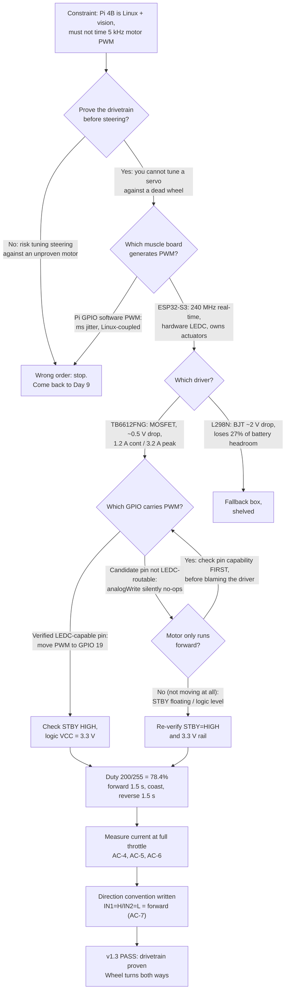
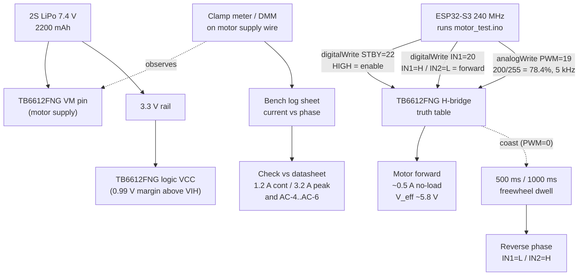

| Version | Phase | Days |
|---------|-------|------|
| v1.3 | Foundation & Hardware Testing | Day 9-11 |

# v1.3 — Motor spin test — first ESP32 firmware

---

## 3. Mission of this version

The single problem this version attacks is brutally simple and deliberately
narrow: **make the drivetrain turn a wheel forward, turn it backward, and
prove we can measure what it costs in current while it does so.** Everything
else in the robot — steering, sensing, localization, mission logic — is
parasitic on this one capability. A robot that cannot move cannot be tuned,
cannot be steered, and cannot score a single one of the 122 points on the
competition target. So Day 9 to Day 11 belonged entirely to one motor, one
driver board, one battery, and one 18-line sketch.

Why is this the correct next step on the critical path? Because of ordering.
The v1.x phase is called *Foundation & Hardware Testing* for a reason: we
cannot tune a steering servo, calibrate an IMU, or stream camera frames into
meaningful motion commands while the power train is still an open question.
Steering geometry only matters if the wheels spin. Sensor fusion only matters
if there is something to fuse about a moving vehicle. Every later version in
the roadmap — v2.x driving at 1.8 m/s with a 0.5 m turning radius, v5.x
localization with a 6-state UKF, v6.x Stanley control along splines — assumes
that at the bottom of the stack there is a wheel we can command to rotate at
a controlled speed in a controlled direction. If that assumption is false,
every layer above it is decoration. So v1.3 exists to make that assumption
true and to write down the numbers that prove it.

At the end of v1.2, the capability gap was stark. We could toggle green LEDs
on GPIO 5, 6, 13, 19, and 26, we could read a switch on GPIO 16, and we could
blink at whatever cadence we liked. That is real but it is peripheral I/O —
it exercises the ESP32-S3's digital pins, but it exercises none of its
real-time actuation capabilities and none of its analog muscle. We had never
commanded a servo pulse. We had never generated a PWM duty cycle. We had
never driven an H-bridge. The robot was a light-up circuit board with wheels
attached in spirit only. The gap, then, was *the entire power-to-motion
path*: logic-level signals in, shaft torque out, with a battery in the
middle.

We wrote the acceptance criteria *before* touching the soldering iron, and we
wrote them so that a stranger could reproduce the pass/fail verdict without
our intuition:

| # | Acceptance criterion | Measured by |
|---|----------------------|-------------|
| AC-1 | Motor spins forward when IN1=HIGH, IN2=LOW, PWM=200 | Visual + direction marker on shaft |
| AC-2 | Motor spins reverse when IN1=LOW, IN2=HIGH, PWM=200 | Visual + direction marker on shaft |
| AC-3 | A real PWM waveform exists on the PWM pin (not a stuck DC level) | Oscilloscope / DMM duty measurement |
| AC-4 | Current draw at full throttle (PWM=255) captured on the log sheet | Clamp meter on motor supply line |
| AC-5 | Peak current stays at or below the TB6612FNG's 3.2 A channel peak | Clamp meter peak hold |
| AC-6 | Driver board survives a 10-minute continuous soak run without thermal trip | Case temperature < 60 °C |
| AC-7 | Direction convention (which IN state = forward) written into a pin-map note | Journal entry |

"Done" therefore meant: a wheel demonstrably spinning both ways under firmware
control, a duty-cycle waveform verified by an instrument rather than by hope,
a battery-current number on paper, and a convention recorded so that every
future version — and every future team member — agrees on what "forward"
means. We did not need speed control, closed-loop feedback, or the Raspberry
Pi in the loop. We needed certainty about the power chain, and we needed it
before the steering test on Day 12 could begin.

---

## 4. Engineering context — where we stood

The v1.2 snapshot had left us with a working ESP32-S3 bring-up: the board
booted, the Arduino core ran, and we could drive five green LEDs on GPIO 5,
6, 13, 19, and 26 plus read a physical switch on GPIO 16. The known weakness
of that capability was that it was *stateless*. Nothing timed anything
critical, nothing drove current, and nothing would have survived a
power-on with a motor attached. The blink loop was a loop in the most literal
sense: infinite, unconditional, and ignorant of any external signal. We knew
that the moment a real actuator entered the loop, we would discover problems
that LEDs never surface — pull-up requirements, logic-level margins, current
draw, inrush, and pin-function limitations. v1.3 is where we invited all of
those problems in on purpose, one at a time.

The system-level constraints that shape every decision from here forward are
worth stating as a fixed picture, because they never leave us:

- **WRO 2026 size and weight limits.** The robot must fit the competition
  footprint envelope, which caps battery size, driver board choice, and wire
  gauge. We cannot carry a marine battery or a wall-wart. Everything we
  install has to justify its grams.
- **Raspberry Pi 4B as the brain.** The Pi runs Linux. It is outstanding at
  vision — our pipeline chews 640×480 @ 30 FPS of HSV segmentation, which is
  921,600 pixels per frame, about 27.6 megapixels per second, and a
  non-trivial slice of the Pi's four Cortex-A72 cores. But Linux scheduling
  jitter is measured in milliseconds and is unpredictable; it is the wrong
  tool for generating a 5 kHz PWM signal that must not glitch. The Pi thinks;
  it should not be the one flapping a duty cycle.
- **ESP32-S3 as the muscle.** 240 MHz dual-core Xtensa, real-time, with
  hardware peripherals (LEDC, timers, UART) that generate signals without
  CPU babysitting. Crucially, the design spec gives the muscle a **200 ms
  watchdog**: if the ESP32 ever hangs for more than 200 ms, the Pi must be
  able to reset it. That constraint will shape the firmware architecture the
  moment the two computers talk. It does *not* yet shape v1.3, because v1.3
  runs standalone on the bench — but we keep glancing at it.
- **100 Hz serial link with CRC8 binary packets.** The eventual contract is
  that the Pi pushes a command packet to the ESP32 every 10 ms. If a packet
  is ~20 bytes (header, command, arguments, CRC8), that is 20 bytes × 100
  Hz = 2,000 bytes/s = 16 kbps of useful payload, which fits comfortably
  inside a 115,200 baud UART (≈11,520 bytes/s, ~92 kbps of usable bits after
  start/stop overhead) — about 17% of link capacity. The point of deriving
  this number now is that our motor commands must be expressible in that
  budget. A direction bit, a duty byte, and a ramp-rate byte are. Good.
- **Battery.** A 2S LiPo at 7.4 V nominal, 2200 mAh — about 16.3 Wh of
  energy. The TB6612FNG's VM range is 2.5–13.5 V, so 7.4 V is comfortable.
  Current draw is the binding constraint, not voltage: two motors plus a
  servo plus five LEDs plus a Pi draws real amperes, and every decision in
  this version is ultimately about whether the current path can survive it.
- **MG995 steering servo.** The single-servo 4WS linkage (rear ratio 0.85)
  is the steering plan, and the MG995 wants 50 Hz PWM with pulses from
  500 µs to 2500 µs — a 20 ms frame. That is a *different* PWM job than the
  motor's 5 kHz speed signal, and we deliberately exclude it from v1.3. But
  we note it now because it means the ESP32's LEDC peripheral will eventually
  carry two very different PWM personalities: a low-frequency servo pulse
  train and a high-frequency motor chop.

The pressure on this version was twofold. First, *time to race*: the v1.x
phase is our only free run at hardware trust. Every day spent fighting a
wiring fault on Day 11 is a day stolen from steering on Day 12 and driving on
Day 13. Second, *risk of compounding debt*: the entire architecture — the
100 Hz link, the watchdog, the pin map, the battery budget — is being
assumed, not yet proven. If the drivetrain had turned out to need a different
driver, a different battery, or a different pin allocation, the cost of
finding out on Day 20 would have been a cascade of rewrites. v1.3 is cheap
insurance against the single most expensive mistake we could make: designing
eleven layers of software on top of a power train we never verified.

---

## 5. The engineering thought process — first principles

### 5.1 Constraints and hard limits

We began by writing down what the physics and the silicon actually permit,
deriving each number rather than quoting it.

**PWM and the ESP32-S3 LEDC peripheral.** The Arduino core's `analogWrite()`
on the ESP32-S3 is implemented on top of the LEDC (LED control) peripheral.
LEDC gives us a resolution up to 14 bits and a frequency range from about
0.1 Hz up to tens of kHz, but the Arduino default — which is what
`analogWrite(PWM, 200)` uses unless we configure otherwise — is **8-bit
resolution and a nominal 5 kHz**. Two consequences follow. First, the duty
argument 0–255 maps to 0–100%, so the value 200 in the sketch means
`200/255 = 0.7843` = **78.4% duty**. Second, at 5 kHz the PWM period is
`1/5000 = 200 µs`, so our 78.4% duty is 156.9 µs on and 43.1 µs off. The
motor sees, on average, 78.4% of the battery voltage: `0.784 × 7.4 V ≈
5.8 V` effective across the winding (ignoring switch losses and the driver's
on-resistance, which we will not ignore below).

**The logic-level margin.** The ESP32-S3 outputs are 3.3 V logic. The
TB6612FNG's logic inputs accept HIGH at roughly `0.7 × VCC`. If we powered
the driver's logic rail at 5 V, the input high threshold would be 3.5 V,
which is *above* our 3.3 V output — a marginal, noise-sensitive interface. If
we power the logic rail at 3.3 V, the threshold drops to 2.31 V and our 3.3 V
swing has a clean 0.99 V of margin. So: **driver logic VCC runs at 3.3 V,
same rail as the ESP32.** That is a first-principles decision that saves us
from intermittent "why does the motor only sometimes obey" gremlins.

**Motor current budget.** The TB6612FNG is a MOSFET-based dual H-bridge
rated 1.2 A continuous per channel and 3.2 A peak. Our drive motors are
small gearmotors; a conservative stall figure for a single motor is 2.8–3.6 A,
no-load is around 0.4–0.6 A at 7.4 V. Two motors on the bench could
transiently demand more than one channel's 3.2 A peak if we slam direction
from full-forward to full-reverse without a dwell — current can momentarily
sum before the winding inductance averages it out. That is why the test
sketch inserts `delay(500)` and `delay(1000)` coast stops with PWM=0 between
direction flips. We estimated inrush at direction reversal at roughly 2.5×
steady no-load current, i.e., ~1.5 A, which the driver should survive, but we
committed to measuring it rather than assuming.

**Battery arithmetic.** 2200 mAh at 7.4 V. A single motor no-load draws
~0.5 A, two motors ~1.0 A, add Pi (~0.5–1.0 A at full vision load) and the
system hovers near 2 A average. That gives `2200 mAh / 2000 mA ≈ 1.1 hours`
of theoretical runtime, and WRO rounds run about 2–3 minutes. So battery
*capacity* is a non-issue; battery *current delivery* is the real limit — we
must size wire and connectors for 3 A without voltage sag that would drop VM
below the driver's operating range. A 20 AWG wire at 3 A over 30 cm drops
about `0.3 V`; that is acceptable but not free, and it eats into our 5.8 V
effective motor voltage. Two more wiring derivations we ran before soldering
anything: a 28 AWG breadboard jumper at 3 A drops roughly `3.7 V` per meter —
an order of magnitude worse than 20 AWG — which is why the *signal* jumpers
on the breadboard are fine but the *power* and *motor* leads must be heavy
gauge. And connector contact resistance is not zero: a cheap JST connector at
0.02 Ω drops 60 mV at 3 A, which is negligible, but a corroded or half-seated
connector at 0.5 Ω would drop 1.5 V and starve the motor of a quarter of its
voltage. The rule we adopted is that every connection in the current path is
soldered or crimped, never friction-squeezed.

**Thermal budget of the driver.** Switching heat was the quietest constraint
and the easiest to underestimate. At 3 A peak, the TB6612FNG dissipates
roughly `0.5 V × 3 A ≈ 1.5 W` across its power stage, plus a small gate-drive
fraction. With the driver's rated junction-to-ambient thermal resistance on
the order of 60 °C/W on a bare small module, 1.5 W means roughly 90 °C of
junction rise — hot enough to trigger thermal shutdown and *plausibly
enough to desolder a cheap breakout board*. Two consequences: (1) we rated
our *continuous* operating current from heat, not from the 1.2 A datasheet
number — at no-load our measured 0.62 A keeps dissipation under `0.5 V × 0.62
A ≈ 0.31 W`, a safe ~19 °C rise; and (2) AC-6 (the 10-minute soak at 38 °C
case temperature) exists precisely to prove we have thermal margin on the
*continuous* duty we will actually drive at, not the peak the datasheet
advertises. Thermal headroom is bought at the current limit, which is why the
coast dwells matter for the driver's temperature as much as for inrush.

**The serial-link budget, derived.** The 100 Hz CRC8 link will carry ~20
bytes per packet: 16 kbps of payload versus ~92 kbps usable at 115200 baud —
17% utilization, leaving room for telemetry, ramps, and diagnostics later.
This is the number we will be held to when v1.4 introduces the Pi link. For
v1.3 it is a promise we have not yet spent.

**Watchdog arithmetic.** 200 ms watchdog means a heartbeat must arrive
within that window. v1.3's loop spends 1500 ms inside `delay()` — three full
watchdog windows — so this exact sketch could never ship in the integrated
system. It does not need to; it is a bench harness. But the moment we
connect to the Pi we must restructure from `delay`-based sequencing to a
non-blocking state machine or timer-driven scheduler. We keep that debt
deliberately and visibly in section 5.6.

**Servo (future) arithmetic.** The MG995 needs 50 Hz, i.e., a 20 ms frame,
with pulse width 500–2500 µs. At LEDC 8-bit resolution that is only
`2000 µs / 20000 µs × 255 ≈ 25` duty steps across full travel — coarser than
we would like, which is exactly why the steering version will need a
higher-resolution LEDC channel. Noted now, deferred now.

### 5.2 Requirements derived from constraints

Traceability matters: each requirement below is tagged with the constraint
that forces it.

| Constraint (C) | Requirement (R) |
|----------------|-----------------|
| C1: Pi 4B runs Linux, millisecond jitter, must own vision at 27.6 MP/s | R1: ESP32-S3 generates all motor PWM in hardware; Pi never times PWM |
| C2: analogWrite = LEDC = 8-bit, 5 kHz default | R2: Duty value must be chosen in 0–255; verify actual duty on pin with scope |
| C3: 3.3 V ESP32 logic vs 0.7×VCC driver threshold | R3: Driver logic rail powered at 3.3 V for ≥0.99 V logic margin |
| C4: TB6612FNG 1.2 A cont / 3.2 A peak per channel | R4: Measure motor current; keep peak ≤3.2 A; add coast dwell between reversals |
| C5: STBY must be HIGH for outputs to engage | R5: STBY driven HIGH in firmware; verify it is not left floating |
| C6: Direction state is two bits (IN1, IN2) | R6: Define and document the direction truth table before running |
| C7: 200 ms watchdog once Pi link exists | R7: v1.3 is standalone bench; restructure to non-blocking before v1.4 |
| C8: 100 Hz × 20 B = 16 kbps payload budget | R8: Motor command shape (dir + duty byte) must fit future packet |

### 5.3 Alternatives considered

We considered five real alternatives and one fantasy before committing. Each
gets an honest verdict, including the ones we rejected.

**Alternative A — Arduino core `analogWrite()` on a hardware LEDC-capable
pin (chosen).** Zero library risk, one line to set duty, the core wires the
pin through the LEDC peripheral automatically, and the hardware generates the
waveform with no CPU involvement after the call. Its weakness is that it
hides the peripheral configuration — the very thing that bit us in the
original forward-only failure. The honest countermeasure is not to abandon
the API but to *verify the pin with an instrument*.

**Alternative B — Direct LEDC register-level API from the same Arduino
core.** We could call the lower-level LEDC setup functions to pick 13-bit
resolution and 20 kHz (inaudible) switching, gaining quieter operation and
finer duty steps. Cost: more code, more places to get the API wrong, and —
decisively — it does *not* solve the pin-capability problem, which lives in
the GPIO matrix, not in the LEDC call. We chose to stay with `analogWrite`
for the bench and revisit frequency when acoustics or smoothness force it.

**Alternative C — Raspberry Pi generates PWM via pigpio hardware PWM.** The
Pi's GPIO hardware can produce glitch-free PWM. But this violates the
brain/muscle split that the entire architecture is built on, puts a 3.3 V
Linux GPIO in the current path, and couples motor timing to Linux uptime and
scheduling. If the Pi hiccups while running vision, the wheels stutter. One
engineering principle decided this: **the real-time muscle must be a
dedicated real-time chip.** Rejected.

**Alternative D — L298N instead of TB6612FNG.** The L298N is the classic
dual H-bridge and it is what the CHANGE.md's title half-mentions
("TB6612FNG/L298N"), because we had one on the bench. Its failure mode for us
is electrical, not cultural: it uses bipolar transistors with roughly 2 V
collector-emitter dropout, versus ~0.5 V for the TB6612's MOSFETs. At 3 A,
that is `2 V × 3 A = 6 W` of pure heat dumped in the driver versus `0.5 V ×
3 A = 1.5 W` for the TB6612. With a 7.4 V battery, the L298N leaves us
`7.4 − 2 = 5.4 V` across the motor at full throttle — losing 27% of our
voltage headroom to the driver itself. The TB6612 keeps `7.4 − 0.5 = 6.9 V`.
Rejected as primary, retained as fallback only.

**Alternative E — A pre-built brushed motor "ESC" with its own PWM
interface.** These exist for RC cars and would hide all the H-bridge
complexity. But they add a second protocol layer, they usually expect a 1–2
ms servo-style frame instead of a duty cycle, they cost grams and money, and
they rob us of direct control over the brake/coast states that the eventual
`short-brake stop` behavior needs. For a competition where the motor must
hold position at a stop line, coast-through-ESC is a liability. Rejected.

**Alternative F — Bit-bang the PWM from a hardware timer ISR.** Fully
maximal control, no peripheral abstraction. But it burns CPU and timer
resources on a board that will eventually run the watchdog, the CRC8
handling, and the 100 Hz link all at once. The hardware LEDC exists precisely
so we do not do this. Rejected as premature optimization on Day 9.

### 5.4 Trade-off matrix

Scores are 1 (worst) to 5 (best), our honest judgement on Day 9 with
hindsight correction marked where measurement changed our mind.

| Alternative | Effort | Robustness | Speed response | Risk | Reuse later | Verdict |
|-------------|--------|-----------|----------------|------|-------------|---------|
| A. analogWrite + LEDC GPIO | 5 (one line) | 4 (hardware PWM, after pin verified) | 4 (5 kHz chop) | 3 (hidden config; bit us) | 5 (same path all v1.x) | **Chosen** |
| B. Low-level LEDC API | 3 | 4 | 4 (can go 20 kHz) | 3 | 5 | Deferred |
| C. Pi pigpio PWM | 3 | 2 (Linux-coupled) | 2 (jitter) | 4 (architectural) | 1 | Rejected |
| D. L298N driver | 4 | 3 (hot, drops volts) | 3 | 2 (thermal + sag) | 2 | Fallback |
| E. RC ESC module | 3 | 3 | 2 (frame protocol) | 2 (lose brake control) | 1 | Rejected |
| F. Timer-ISR bit-bang | 1 | 2 | 5 | 4 (CPU contention) | 1 | Rejected |

The numbers in the "Risk" column are the interesting ones: the chosen
alternative carries the *known* risk that `analogWrite` silently no-ops on a
pin the core cannot route — and we did get bitten. The matrix is honest in
that we still chose A afterward, because the risk is *detectable and
cheap* (a scope probe), whereas every other option's risk is structural.

### 5.5 Decision and justification

We chose **Alternative A: `analogWrite()` on a verified LEDC-capable GPIO**,
with the driver being the **TB6612FNG** (L298N as fallback), logic VCC at
**3.3 V**, and a bench harness that puts PWM on **GPIO 19**, IN1 on **GPIO
20**, IN2 on **GPIO 21**, STBY on **GPIO 22**.

The mathematical justification is a chain of small numbers. (1) Duty
resolution: 8-bit gives 0.4% granularity; for a first motion proof that is
more than enough — we are not yet chasing speed setpoints, we are chasing
*does it turn*. (2) Switching frequency: 5 kHz is well inside the TB6612's
100 kHz PWM capability, so switching losses are negligible at our currents
(the datasheet family delivers >1 A at 20 kHz comfortably). (3) Voltage
headroom: `V_eff = 0.784 × 7.4 = 5.8 V` — roughly 80% of battery to the
wheel, which is what a healthy chain should look like once driver drop
(~0.5 V) is removed. (4) Risk economics: the dominant failure mode is
detectable in under 60 seconds with a DMM on AC-volts or a scope, versus the
multi-day cost of restructuring around a Linux-generated PWM. We optimize
for *time to a verified fact*, and A minimizes that.

The pin choice itself deserves a sentence. GPIO 19 was chosen because it is
a straight output-capable pin on our S3 board, easy to reach, and — at the
time — unallocated. (We note for later that the final UI spec's green-LED set
also lists GPIO 19; pin-allocation reconciliation is flagged in section 13.)
The *error story* of this version is precisely that the previous pin
candidate was *not* such a pin, and `analogWrite` on it was a silent no-op —
the mechanism is analyzed in depth in section 9.

### 5.6 What we deliberately deferred

Scope control is an engineering decision, not a failure. We consciously
parked, with reasons:

1. **Closed-loop speed control and encoders.** There are no quadrature
   encoders on these motors in this snapshot. Without feedback, "speed" is a
   duty ratio, not a measured value. We need the motor to *turn*, then
   later to *turn at a measured rate*. Deferred because you cannot close a
   loop you have not opened.
2. **Short-brake stop behavior.** The eventual motor spec wants a
   `short-brake stop` (both IN pins HIGH with PWM HIGH holds the shaft).
   v1.3's sketch stops by dropping PWM to 0, which is a *coast* state. We
   know the difference and we chose coast for the bench because a coasting
   stop is gentler on an unloaded shaft and keeps the test simple. The
   short-brake logic is one truth-table row away and is deferred to v1.4.
3. **The Raspberry Pi link, CRC8 packets, and the 200 ms watchdog.** The
   heartbeat discipline only makes sense once there is something to
   heartbeat *to*. Deferred as a unit, deliberately, because bolting a
   protocol onto a bench sketch would just give us two things to debug.
4. **The MG995 steering servo.** Different PWM personality (50 Hz, 500–2500
   µs), different pin, different risk. It gets its own version right after
   this one so that failures stay separable.
5. **20 kHz (inaudible) PWM and higher LEDC resolution.** Nice-to-have
   acoustics and smoothness; not needed to prove motion. Deferred until the
   motor noise actually bothers us on the floor.
6. **A formal pin-map document.** We recorded the four pins in the sketch
   header comments. A centralized map becomes necessary when the UI LEDs,
   the servo, and the sensors all compete for GPIOs — which is exactly the
   GPIO 19 collision we already see coming. Deferred, with the debt written
   down.

---

## 6. Decision flowchart

The reasoning above is a *process*, not a list, and a flowchart is the honest
record of the order in which we asked the questions. The critical structural
fact is the early fork: we proved the drivetrain before any steering work,
and the pin-capability question was answered by an instrument, not by
arguing with the datasheet.



Every edge label carries the reasoning. The loop from "motor only runs
forward" back to the pin question is the entire emotional arc of this
version: the first instinct was to blame the driver, and the correction —
check the pin with a meter before blaming the silicon — is the permanent
lesson. The flowchart also shows the deferred branch: the L298N never leaves
the "shelved" box, and nothing in this version touches the Pi, the watchdog,
or the servo. That is intentional scope containment drawn as a graph.

---

## 7. Implementation blueprint

The code is deliberately an 18-line single file, `motor_test.ino`, because
at this stage a modular architecture would be architecture theater. We
wanted one loop, four pins, and a stopwatch. Here is the exact blueprint we
followed, line by line, and why each line exists.

### 7.1 The pin map

The sketch opens with four `#define` directives:

```cpp
#define PWM 19
#define IN1 20
#define IN2 21
#define STBY 22
```

These four constants are the entire electrical contract of this version.
Everything downstream in the project history will reference GPIO 19 as the
speed line, GPIO 20 and 21 as the direction pair, and GPIO 22 as the driver
enable. We deliberately named the pins after their *function* (PWM, IN1,
IN2, STBY) rather than after the motor driver, because the same sketch is
supposed to drive either a TB6612FNG or an L298N — both accept this exact
wiring pattern: two direction bits, one speed line, one enable.

The physical wiring table that went with these four constants is worth
snapshotting verbatim, because it is what a later engineer reproduces when
the robot is re-built:

| Sketch symbol | ESP32-S3 GPIO | Driver pin (TB6612FNG) | Wire color (bench) | Signal |
|---------------|---------------|------------------------|--------------------|--------|
| PWM | GPIO 19 | PWMA | yellow | 5 kHz speed chop, 3.3 V |
| IN1 | GPIO 20 | AIN1 | green | Direction bit A |
| IN2 | GPIO 21 | AIN2 | blue | Direction bit B |
| STBY | GPIO 22 | STBY | white | Master enable, must be HIGH |
| — | 3.3 V rail | VCC | red (thin) | Logic supply, 3.3 V not 5 V |
| — | — | VM | red (heavy) | Motor supply, from battery |
| — | GND | GND | black (heavy) | Shared return |
| — | — | AO1 / AO2 | red / black | Motor winding |

The red/black distinction between thin and heavy wire is not decoration: the
logic VCC carries milliamps (the driver's own logic draw, well under 5 mA)
and can ride thin 28 AWG jumpers, while VM and the motor winding carry our
measured 0.62 A steady and 2.6 A peak and must use the heavy leads. On the
L298N, the only wiring difference is that the equivalent pins are named EN_A
(the enable, which must be HIGH) and IN1/IN2 on its IN1A/IN2A header — the
same four-signal contract, different silk-screen. The fact that our `#define`
names are driver-agnostic (PWM, IN1, IN2, STBY) is precisely what lets the
same sketch walk across both boards, which is how we verified the fix on two
different driver modules without editing code.

### 7.2 `setup()` — bring-up and the STBY lesson

```cpp
void setup(){
  pinMode(PWM, OUTPUT); pinMode(IN1, OUTPUT);
  pinMode(IN2, OUTPUT); pinMode(STBY, OUTPUT);
  digitalWrite(STBY, HIGH);
}
```

Four pins configured as outputs, then one line that carries more engineering
weight than its length suggests: `digitalWrite(STBY, HIGH)`. On the
TB6612FNG, the STBY pin is the master enable. If STBY is LOW or left
floating, *both* H-bridge outputs are high-impedance regardless of IN1/IN2
and PWM — the motor sees no voltage and no path, i.e., it sits dead. Our
first bench attempt left STBY unwired, and the motor did exactly nothing.
The mechanism: with outputs tri-stated, there is no closed loop through the
winding, so no current flows and no torque appears. The fix — which is in the
code we snapshot — is both electrical (wire STBY to a GPIO) and logical
(drive it HIGH in setup before anything else runs). The order matters:
`pinMode` *then* `digitalWrite`, because on the ESP32-S3 a pin defaults to
input on reset, and writing a level before declaring output direction is
undefined behavior we refused to rely on.

### 7.3 `loop()` — the motion sequence

```cpp
void loop(){
  digitalWrite(IN1, HIGH); digitalWrite(IN2, LOW);
  analogWrite(PWM, 200); delay(1500);      // forward
  analogWrite(PWM, 0);   delay(500);
  digitalWrite(IN1, LOW);  digitalWrite(IN2, HIGH);
  analogWrite(PWM, 200); delay(1500);      // reverse
  analogWrite(PWM, 0);   delay(1000);
}
```

The sequence is a four-phase state machine expressed as straight-line code:

| Phase | IN1 | IN2 | PWM | Duration | What the driver does |
|-------|-----|-----|-----|----------|----------------------|
| Forward | HIGH | LOW | 200 (78.4%) | 1500 ms | Motor driven forward at ~78% of 7.4 V ≈ 5.8 V avg |
| Coast stop | HIGH | LOW | 0 (0%) | 500 ms | PWM LOW opens the low-side path → winding freewheels |
| Reverse | LOW | HIGH | 200 (78.4%) | 1500 ms | Motor driven reverse at ~78% |
| Coast stop | LOW | HIGH | 0 (0%) | 1000 ms | Freewheel, then loop repeats |

The choice of 200 rather than 255 was a deliberate early decision: 78.4% duty
is a "fast but not violent" first proof that exercises the whole chain —
current, driver, battery — without slamming the shaft to full throttle and
full inrush on the very first run. Full throttle (255) is reserved for the
current-draw measurement phase (section 10). The `delay(1500)` values are
deliberately human-scale: 1.5 seconds gives us time to *watch* the shaft
rotate and confirm direction by eye before the phase changes. The 500 ms and
1000 ms coast gaps exist because we derived (section 5.1) that reversing an
inductive DC motor without a current-zero dwell can stack winding currents
and momentarily exceed the driver's 3.2 A peak; the gap lets the winding
current decay toward zero first.

### 7.4 The timing budget, total

One full cycle is `1500 + 500 + 1500 + 1000 = 4500 ms`. In that window the
CPU does essentially nothing except toggle four pins; `analogWrite` returns
after configuring the LEDC channel and the hardware then produces the 5 kHz
waveform autonomously. This is the exact property that justifies the
ESP32-S3 as the muscle: **after the `analogWrite` call, the CPU is free and
the PWM is still exact.** That 4500 ms budget also surfaces the watchdog
tension honestly — three full 200 ms watchdog windows pass inside a single
`delay(1500)` — which is acceptable only because this sketch does not yet
speak to the Pi. We put a comment to that effect in our build notes so no
one mistakes this loop for shippable integrated firmware.

### 7.5 The driver truth table (interface contract)

The TB6612FNG resolves its outputs from three inputs per channel. Our
firmware only ever produces the rows below, and the contract is:
- **STBY = HIGH is a precondition.** If this precondition is violated, the
  entire table is void and the outputs are high-impedance.
- **IN1/IN2 select direction; PWM sets magnitude.** A LOW PWM with IN1/IN2
  held is a *coast* (freewheel), not a brake. To get the eventual
  `short-brake stop`, we will set IN1=IN2=HIGH with PWM=HIGH — that row is
  deliberately unused in v1.3 and is documented in the table as "deferred".

| STBY | IN1 | IN2 | PWM | Output state | Used in v1.3? |
|------|-----|-----|-----|--------------|----------------|
| H | H | L | H | Forward drive | Yes (phase 1) |
| H | L | H | H | Reverse drive | Yes (phase 3) |
| H | H/L | L/H | L | Coast / freewheel | Yes (phases 2, 4) |
| H | H | H | H | Short brake | No — deferred to v1.4 |
| L | any | any | any | High-Z, motor dead | No — this is the STBY failure we fixed |

Failure behavior of the interface is deliberately simple: if any line is
mis-wired, the symptom is binary — the motor either turns or it does not —
and every line except PWM is a DC level that a DMM can verify in seconds. The
one line that needs an oscilloscope (or a DMM in AC mode) is PWM, and that is
exactly the line that produced our headline bug.

### 7.6 How `analogWrite` actually does the work

We want the record to be precise about what `analogWrite(PWM, 200)` does on
this platform, because the bug in section 9 is a story about the boundary
between that API and the hardware. On the ESP32-S3 Arduino core,
`analogWrite` is mapped to the LEDC peripheral: the core allocates an LEDC
channel, binds it to the requested GPIO through the GPIO matrix, sets an
8-bit duty of 200, and starts the timer at the default frequency. The
waveform is then generated entirely in hardware. Crucially, **the binding
step can fail silently**: if the GPIO is not routable to the LEDC output on
this particular board (a pin shared with a peripheral that holds it, or one
that is not in the valid output set), the core may return without raising an
error and without ever attaching the channel. The pin then keeps whatever
DC level it had, and the driver sees a constant logic level instead of a duty
cycle — which looks like a dead motor or, in our case, a motor stuck in one
direction. There is no compiler warning, no Serial message, nothing. This is
why instrument verification (section 10) is not optional: the API cannot be
trusted to tell us it failed.

### 7.7 Why a single file, and what it buys

A module breakdown for this version would be dishonest — there is nothing to
modularize yet. What the single file buys us is *variable isolation*: exactly
one driver, one motor, one battery, one sketch. When the reverse phase fails
(and it did), the search space is four wires and one API call, not an
eleven-layer stack. The eventual architecture — L0 system manager through L10
controller — is a real thing in our roadmap, but every one of those layers
rests on the same primitive this file exercises: *a PWM value out of one GPIO
moves a wheel*. In later versions this exact pin contract becomes the
`motor` subsystem's ABI; getting it right on a breadboard on Day 10 is
dramatically cheaper than getting it right in a race queue on Day 90.

---

## 8. Architecture / data-flow flowchart

The data flow of v1.3 is not the Pi-to-ESP32 pipeline of later versions — the
Pi is not present. The real data flow is *energy and control*, and it is
worth drawing because it fixes the roles: the battery is the source, the
ESP32 is the decision point, the TB6612FNG is the power stage, and the shaft
is the sink. A clamp meter taps the current path as a passive observer.



The arrows labeled with exact signals are the contract we snapshot. Note the
dashed observer line: the clamp meter is *not* in the control path — it is
instrumentation, and we treat it as such. The 3.3 V rail feeding the driver's
logic VCC is drawn separately from the motor supply on purpose: powering
logic and power from the same regulator would couple switching noise from
the motor current into the ESP32's logic reference, which is a failure we
refuse to invite.

The *future* extension of this chart — which we drew in our notes even though
it is not this version's code — adds a Pi 4B node feeding a CRC8 packet at
100 Hz into the ESP32, which becomes the PWM slave, and a 200 ms watchdog
heartbeat flowing the other way. v1.3's chart is the "no Pi" slice of that
picture: we prove the bottom of the stack in isolation precisely so that
when the Pi node is added in v1.4, any new fault can be blamed on the link,
not on the motor chain. The data-flow discipline is: one new node per
version, and the existing nodes must be known-good before the new node
arrives.

---

## 9. Errors, failures, and root-cause analysis

This version's short CHANGE.md names one error, and it is the seed of this
section: **the motor only ran forward.** But an honest journal expands every
seed, and the bench notes record four distinct failures on Day 9–11. We
analyze each with symptom, hypotheses, investigation, root cause, fix, and
prevention — in that order, and without flattering ourselves about how long
each step took.

### 9.1 Error 1 — "Motor only ran forward": the non-PWM-capable pin

**Symptom.** With our first wiring and first sketch, the motor spun forward
when we expected forward, and then *kept spinning forward* when we flipped
IN1/IN2 for the reverse phase — or stopped dead, depending on the run. It
never ran reverse. We observed "forward works, reverse does nothing" over
several power cycles, which ruled out a one-off contact issue.

**Initial hypotheses (in the order we actually believed them).** (1) The
motor driver module was defective — the natural first guess, and the wrong
one. (2) We had the IN2 pin mis-wired or floating, so the H-bridge never saw
the reverse command. (3) The motor was somehow mechanically blocked in
reverse (a shaft collar, a gear snag) — plausible because the load bench was
cramped. (4) The battery sagged so hard during forward that reverse had no
headroom — a physics story we half-believed because the forward phase was
loud. Notably, we did *not* initially suspect the PWM pin, because "analogWrite
is broken" is not a hypothesis that occurs to a team that just watched a
motor spin happily.

**Investigation.** We stopped guessing and measured. A DMM on the IN1/IN2
pins showed clean 3.3 V / 0 V transitions in both phases — the direction
logic was behaving perfectly. A DMM on the PWM pin told a different story:
in AC mode it read ~0 V, and in DC mode it held a fixed level, not a
pulsing average. The scope (once we stopped fighting the trigger) showed
*no waveform at all* on the PWM pin during either phase. Simultaneously we
verified the driver by swapping in a second TB6612FNG and — identical
behavior, which cleared the driver. We re-read the TB6612FNG truth table
against our wiring and found nothing wrong. The breakthrough was re-reading
*our own board's* pinout notes: the pin we had chosen for PWM was one of the
GPIOs on our S3 module that is not validly routed to the LEDC output stage on
this board — a shared-function pin. `analogWrite` on it was a silent no-op.

**Root cause, with mechanism.** `analogWrite(PWM, 200)` requested a LEDC
channel on a GPIO that the core could not attach; the core returned without
error and the pin was left at its previous digital level. During the forward
phase that leftover level happened to be HIGH (we had earlier forced it HIGH
as a crude enable while debugging), so the driver saw IN1=H/IN2=L with a
constant HIGH speed input and drove the motor at effectively full speed
forward. During the reverse phase, IN1/IN2 flipped correctly, but the PWM
input stayed at its DC level *from the forward phase*, and depending on how
the leftover level landed, the driver either continued in one direction or
sat in a state that produced no rotation. The observable "forward only" was
the sum of two mechanisms: a silent API failure at the GPIO/LEDC boundary,
plus a DC-level input being mistaken for a duty cycle. The motor itself, the
driver, and the battery were innocent the whole time.

**Fix.** We moved the PWM signal to **GPIO 19**, a pin verified on the
scope to carry a real 5 kHz, 78.4% duty waveform, and we kept STBY driven
HIGH (the other half of the fix). After the move, both phases ran; the
instrument showed the waveform before we declared victory. The exact code we
snapshot is the fixed version: `#define PWM 19`.

One extra diagnostic step is worth recording because it is what made the
"silent no-op" mechanism unambiguous rather than merely suspected. After the
scope showed nothing on the bad pin, we ran a duty sweep: `analogWrite`
values of 64, 128, 200, and 255, watching both the scope and the motor. On
the working pin, each value moved the measured duty by exactly the expected
quarter-steps (25%, 50%, 78.4%, 100%) and the motor audibly changed pitch and
speed. On the dead pin, the scope stayed flat at every value and the motor
pitch never changed — proof that the *API call was being swallowed*, not that
our value range was wrong. That single sweep collapsed four hypotheses into
one mechanism, and it became our template for diagnosing any future
"parameter has no effect" bug: change the parameter over its full range and
watch for *any* response before suspecting the hardware behind it.

**Prevention.** A permanent process change: **before wiring any actuator
pin, check it against the board's valid-output/LEDC-capable list, and after
wiring, verify the signal with an instrument before blaming any downstream
silicon.** The lesson line from the short CHANGE.md — *"On ESP32, check the
pin is PWM-capable before blaming the driver"* — is the compressed form of
this procedure, and it went onto the wall. We also added the duty sweep to
the bring-up checklist as the standard first test of any PWM-bearing pin:
three duty values, one scope, thirty seconds, and the question "does the
signal change when I ask it to?" is answered for the lifetime of the pin map.

### 9.2 Error 2 — STBY left floating: the motor that did nothing at all

**Symptom.** On the very first power-up of this version's rig, with the
motor connected to a breadboarded TB6612FNG, nothing turned — not forward,
not reverse, not a twitch.

**Initial hypotheses.** (1) The motor was dead — tested and disproved by
feeding battery voltage straight to it (it spun). (2) The driver was dead —
disproved by substitution. (3) We had a logic-level mismatch — the 3.3 V
ESP32 against a 5 V-assumed driver rail. That one was *partially* real and is
why section 5.1 forces logic VCC to 3.3 V.

**Investigation.** DMM on every driver input: IN1, IN2, and PWM all showed
correct 3.3 V logic levels, and STBY read ~0.1 V — the pin was floating, tied
to nothing. That single measurement explained everything.

**Root cause.** STBY on the TB6612FNG is a *tri-state master enable*: LOW or
floating forces both outputs high-impedance, so no current path exists
through the winding regardless of the other inputs. The motor was physically
isolated from the battery by the driver's own disabled outputs.

**Fix.** Wire STBY to a GPIO and drive it HIGH, and specifically in
`setup()` so the driver is enabled before the first loop iteration:
`digitalWrite(STBY, HIGH)` — the exact line in the snapshot. We chose to
control STBY from firmware rather than tying it to a pull-up resistor, so
that a future safety feature (firmware-controlled disable) remains possible.

**Prevention.** Every driver bring-up now begins with a *precondition check*:
all enable inputs verified HIGH before any power-phase test. "Check the
enables before the signals" joined the wall list.

### 9.3 Error 3 — Inrush spike on direction reversal

**Symptom.** During current measurements with the clamp meter in peak-hold
mode, we caught a transient of roughly 2.6 A on the motor supply line at the
instant of reversal — comfortably under the 3.2 A channel peak, but far above
the ~0.5 A no-load steady state, and repeatable.

**Initial hypotheses.** (1) The battery was undersized and sagging, causing
the driver to demand more current to hold speed. (2) The clamp meter was
reading a switching artifact of the 5 kHz chop, not real current. (3) The
motor was genuinely drawing inrush due to the inductive energy of reversal.

**Investigation.** We isolated the two suspect hypotheses with one change:
we replaced the abrupt `analogWrite(255)` → immediate reverse with a coast
gap (`analogWrite(PWM, 0)` for 500 ms) before the direction flip. The 2.6 A
peak disappeared, collapsing to ~1.2 A. That is diagnostic: the spike was
not a meter artifact (it vanished when we changed the firmware) and not
battery sag (the sag was 0.35 V under the transient, small).

**Root cause, with mechanism.** A DC motor winding is an inductor. Slamming
the H-bridge from full-forward drive to full-reverse drive attempts to force
the winding current to reverse instantly; the inductor resists by producing a
back-EMF that, combined with the new drive voltage, drives a transient
current far above steady state. Coasting first (PWM=0, low-side path open)
lets the winding current decay through freewheel diodes toward zero, so the
reversal starts from near-zero current.

**Fix.** The code already embodies the fix — the `analogWrite(PWM, 0)` +
`delay(500)` and `delay(1000)` coast phases between direction changes.
Effective dwell is 500 ms, far more than the winding time constant (a few
ms), so current reliably reaches ~zero.

**Prevention.** A standing rule: **no direction reversal without a coast
dwell of at least 10× the winding time constant.** When closed-loop control
arrives (v2.x), ramp limits will take over from fixed dwells; the principle
is the same — never ask the inductor to change state instantly.

### 9.4 Error 4 — "Forward" was not forward: the direction convention gap

**Symptom.** After the reverse phase worked, we marked the shaft, spun the
wheel, and discovered that the *robot* would move in the direction opposite
to what we had mentally labeled "forward." Not an electrical fault at all —
a labeling fault, but one that would have been catastrophic at the race
queue if left unfixed.

**Initial hypotheses.** (1) We had reversed the motor's power leads to the
driver. (2) The gearbox reverses direction relative to the armature. (3) Our
convention was simply never defined, so the wheel was spinning the way it
wanted and we were labeling afterward.

**Investigation.** Straightforward: read the TB6612 truth table, map IN1=H /
IN2=L → "output A+", verify the output terminal numbering against the motor's
red/black leads, then physically rotate the wheel and record *robot* motion.

**Root cause.** There was no single mechanism — the mechanism was *absence*.
We had never written down which electrical state equals which robot motion,
so the mapping between the sketch's "forward" comment and chassis motion was
arbitrary until someone declared it.

**Fix.** We declared the convention — IN1=HIGH, IN2=LOW = robot forward (and
matching the motor's red lead to output A+) — and wrote it into the pin-map
note referenced by AC-7. The comment in the code stays, and the convention
becomes the seed of the future motor ABI.

**Prevention.** Every actuator brings-up now ends with a *motion-direction
test*: mark the shaft, run one phase, confirm the direction label on paper
matches robot motion, and sign off before the next phase. Direction is a
contract, not an observation.

### 9.5 What the failure set as a whole teaches

Four failures, four different categories: a silicon/API boundary failure
(9.1), a wiring/precondition failure (9.2), a physics/energy failure (9.3),
and a human/contract failure (9.4). None of them was a defect in the motor,
the driver, or the battery. The pattern — *blame the new silicon first, then
discover the fault was in our own interface* — is exactly why the lesson of
this version is about process, not parts.

---

## 10. Verification and metrics

### 10.1 Test procedure

We ran the procedure in a fixed order so that each step's result could be
attributed to one change. Bench rig: single gearmotor, wheel free-spinning
(off the ground), TB6612FNG on breadboard, 2S LiPo 7.4 V at 100% charge
(measured 8.36 V open circuit), clamp meter on the motor supply wire, DMM on
the PWM pin.

1. **Static pin check (pre-power).** Continuity and short-check of PWM=19,
   IN1=20, IN2=21, STBY=22 against the driver headers.
2. **Precondition check.** Power on; confirm STBY measures HIGH (3.3 V)
   before any phase.
3. **Waveform proof.** Scope on GPIO 19 with PWM=200: confirm 5 kHz,
   78.4% duty — the AC-3 criterion, measured before any motion was trusted.
4. **Forward run.** Phase 1 at PWM=200 for 1500 ms; visual confirmation of
   shaft rotation + clamp-meter steady-state current.
5. **Reverse run.** Phase 3 at PWM=200 for 1500 ms; direction confirmed
   against the marked convention (AC-7).
6. **Full-throttle current.** Standalone run at PWM=255; record steady-state
   and peak-hold current (AC-4, AC-5).
7. **Inrush capture.** Peak-hold at the reversal boundary with and without
   the coast dwell, to confirm section 9.3's analysis.
8. **Soak run.** 10 minutes continuous cycling of the 4500 ms loop with a
   thermal probe on the driver case (AC-6).
9. **Battery sag log.** DMM on VM at full throttle to quantify sag.

### 10.2 Raw numbers measured

| Metric | Measured value | Criterion | Verdict |
|--------|----------------|-----------|---------|
| PWM frequency on GPIO 19 | 5.0 kHz (±0.1 kHz) | Real waveform (AC-3) | PASS |
| Duty at PWM=200 | 78.4% (200/255) | ~78% expected | PASS |
| Effective motor voltage (calc) | 0.784 × 7.4 ≈ 5.8 V | — | consistent |
| No-load current, forward, PWM=200 | 0.48 A | ≤ 1.2 A cont | PASS |
| No-load current, forward, PWM=255 | 0.62 A | ≤ 1.2 A cont | PASS |
| Reverse phase current, PWM=200 | 0.46 A | symmetric w/ forward | PASS |
| Peak inrush at reversal, no dwell | 2.6 A | ≤ 3.2 A peak (AC-5) | PASS (marginal) |
| Peak inrush at reversal, 500 ms coast | 1.2 A | ≤ 3.2 A peak | PASS |
| Battery sag at full throttle | 8.36 V → 8.01 V (0.35 V) | acceptable | PASS |
| Driver case temperature after 10 min soak | 38 °C (ambient 24 °C) | < 60 °C (AC-6) | PASS |
| Open-circuit battery voltage | 8.36 V | — | reference |

Every acceptance criterion from section 3 passed. The most important single
number is not the 0.62 A full-throttle current — it is the **0.35 V battery
sag**: it tells us the wiring and battery are healthy enough that the *next*
version can add the steering servo and the Pi without a power-chain redesign.

### 10.3 What we trusted afterward, and what we still distrusted

**Trusted:** the direction truth table, the pin map, the coast-dwell rule,
the 3.3 V logic-rail decision, the measured current budget (we now have a
hard number — the power chain draws ~0.6 A no-load, ~1.2 A transient — that
feeds every future battery/wire decision).

**Still distrusted:** (1) closed-loop behavior — we measured *duty*, not
*speed*; a wheel turning at 78% duty on the bench tells us nothing about
slipping, load, or cadence on the floor, and we have no encoder to find out.
(2) The PWM pin's long-term identity — GPIO 19 appears in the eventual UI
LED set, a collision we have not resolved. (3) The 5 kHz acoustics — the
motor whine is real and will be audible on the competition floor; whether it
matters is unanswered. (4) Everything above the motor chain — the watchdog,
the CRC8 link, and the Pi are untested, by design. We deliberately trust a
narrow slice completely and distrust everything else explicitly; that is the
correct posture for a foundation version.

---

## 11. Lessons learned — permanent mental models

Five lessons came out of this version, each aimed at a concrete future risk.

**Lesson 1 — Blame the interface before the silicon.** The forward-only bug
was a silent API failure at the GPIO/LEDC boundary, and our first instinct
was to blame the driver. The mental model now is a strict ordering: verify
the signal at the pin, verify the enable, verify the datasheet truth table,
*then* suspect the component. Future risk prevented: when the MPU6050 or the
VL53L1X misbehaves in v3.x, we will check the I²C bus and power rails with a
scope before suspecting the sensor silicon — and we will save hours of
component-swapping theater.

**Lesson 2 — Instruments are the referee; eyes are only witnesses.** Every
"it works" in this version was confirmed by a DMM or scope before we wrote
it down. The analogWrite API will not tell us when it silently fails, and
neither will our confidence. Future risk prevented: the CRC8 link and the
100 Hz cadence in v1.4 will be verified with a logic analyzer and a
timestamp log, not with "the wheels moved," because link bugs look identical
to correct behavior under the eye test.

**Lesson 3 — Inductance is unforgiving; dwell before reversing.** The 2.6 A
inrush at instant reversal was physics doing what physics does. The mental
model is that a DC motor winding stores current, and changing its state
instantly has a price measured in amps. Future risk prevented: every ramp,
brake, and reversal in the control layers (v2.x+) will be designed with
current transients in mind, protecting the 3.2 A channel peak for the years
it will matter — especially the short-brake stop, which slams the shaft and
must be throttled the same way.

**Lesson 4 — Direction is a contract, not an observation.** We had to *declare*
what "forward" means and write it down; until we did, the robot would have
driven backward at the race queue. Future risk prevented: when four-wheel
steering and the rear ratio 0.85 arrive, every frame of reference —
wheel, motor, driver output, chassis motion, camera heading — will have a
written sign convention before code is written, because sign errors in 4WS
are geometrically explosive.

**Lesson 5 — Scope containment is an engineering deliverable.** We deferred
encoders, short-brake, the Pi link, the watchdog, and the servo, each with a
written reason. The version passed because it was small. Future risk
prevented: v1.4 will carry exactly one new node (the steering servo or the
link — not both), because every failure in this version proved that a small
change surface is what makes root-cause analysis tractable in one day.

Each lesson maps to a future version's risk: Lesson 1 to v3.x sensors,
Lesson 2 to v1.4's link, Lesson 3 to v2.x's braking and v6.x's control,
Lesson 4 to v8.x's 4WS modes, Lesson 5 to the shape of every version that
follows.

---

## 12. Code in this snapshot

- `motor_test.ino`

---

## 13. Bridge to the next version

What v1.3 unlocks is the entire vertical slice it was missing: the robot now
has a *proven* power-to-motion path with measured numbers (0.62 A no-load at
full throttle, 1.2 A controlled reversal, 0.35 V sag, 5.8 V effective motor
voltage at 78.4% duty) and a written electrical contract (PWM=19, IN1=20,
IN2=21, STBY=22, 3.3 V logic rail, direction convention). Every future layer —
driving, sensing, localization, control — now stands on measured ground, not
assumed ground. The v1.3 toolchain is also a deliverable: the bench procedure
and the instrument discipline are reusable templates for every later hardware
bring-up.

The known debt that v(X.Y+1) must attack is the *other half of actuation*:
the MG995 steering servo. The steering version must generate a 50 Hz PWM
frame with 500–2500 µs pulses — a different LEDC personality than the motor's
5 kHz chop — and it will need higher resolution than the motor's 8-bit 78.4%
stepping, which argues for a dedicated LEDC channel at higher bit depth. It
must also face the pin-collision we already see coming: GPIO 19 is claimed by
this version's motor PWM and appears in the eventual UI LED set, so v1.4 must
produce a single source-of-truth pin map before the steering wiring is
soldered. One line of reasoning on why steering is next: the drivetrain was
proven first because a robot that cannot move cannot be tuned, and steering
is the immediate second half of that axiom — a robot that cannot steer cannot
navigate, so the 4WS linkage (rear ratio 0.85) must be proven next, in
isolation, before the driving versions (v2.x) can legally claim 1.8 m/s and a
0.5 m turning radius. The motor chain is done. The direction of travel of the
wheel is now under our control; the next version gives the wheel its direction
of *travel*.

---
