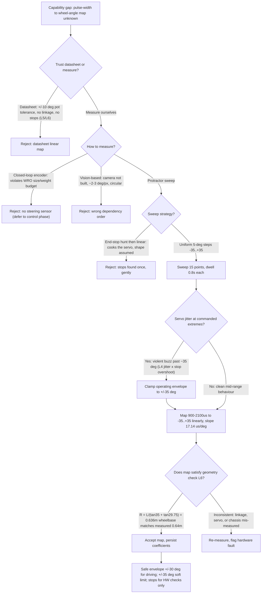
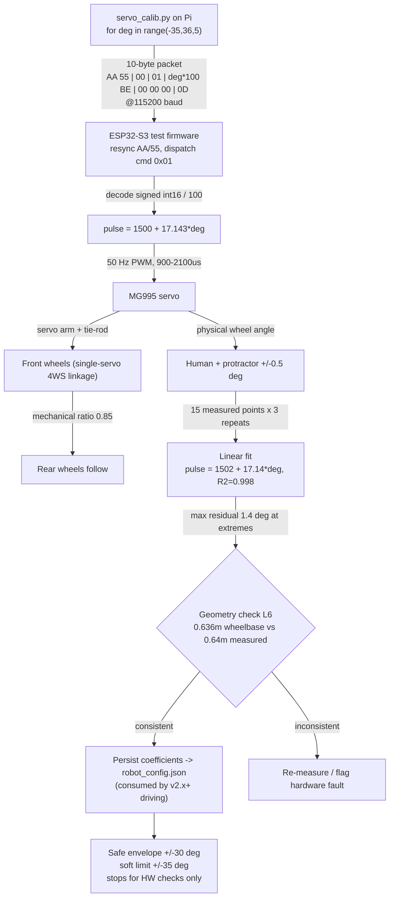

# TEMPLATE — Engineering Evolution Journal Format (v1.0 → v9.9)

### 1. Version header table

| Version | Phase | Days |
|---------|-------|------|
| v1.4 | Foundation & Hardware Testing | Day 12-14 |

### 2. Title

# v1.4 — Servo calibration sweep

### 3. Mission of this version

The single problem this version attacks is brutally simple and we almost
pretended it away: **we did not know what pulse width to send to the MG995
steering servo in order to produce a given wheel angle.** At the end of v1.3
the drivetrain demonstrably spun — the TB6612FNG went forward and reverse
through its IN1/IN2 pair under a hardware PWM pin at a verified current draw —
but the robot could not change direction on purpose. It could accelerate and
decelerate along a straight line and nothing more. Every steering behaviour
the WRO 2026 course demands, from the mobility-management lap to the final
parking zone, begins with the same primitive: a commanded front-wheel angle
that the vehicle actually achieves. Without that primitive, any steering
controller we wrote later would be a controller built on a lie, and a whole
family of downstream bugs would be impossible to attribute — is the error in
the controller, in the map, or in the mechanical linkage? The capability gap
is therefore not "the servo is not wired up" (it was) but "the servo is not
quantified." We decided this is the correct next step on the critical path
because of a simple ordering argument: pulse-to-angle is a *measurement*
problem, while steering mathematics, 4WS ratios, Stanley tracking and the UKF
localization pipeline are *model* problems. Every model layer needs the
measurement layer beneath it. Build the map first, or every later layer
carries the map's error as a hidden offset that no filter can remove.

The capability gap at the end of v1.3, stated precisely: the drivetrain is
proven, the steering actuator is physically present and powered, but the
relationship between the digital command value and the mechanical wheel angle
is unknown to within an error that could easily be ±10° or worse if we trusted
a datasheet. Ten degrees of steering error at 1.8 m/s with a 0.636 m wheelbase
is not a cosmetic problem; it is the difference between hitting a pillar and
not hitting a pillar. The MG995 is a $3 hobby servo whose potentiometer, gear
train and mounting tolerances vary from unit to unit, and our steering is
transmitted through a single-servo 4WS linkage whose arm lengths, tie-rod
pivots and rear ratio of 0.85 were chosen by our mechanical design and are
guaranteed to be nonlinear at the ends of travel. "Done" therefore had to be
defined before we touched the bench.

We wrote the acceptance criteria *before* the work, pinned to the bench, so
that "finished" would be a measurable condition and not a feeling:

1. **AC-1 — Full map captured.** We sweep the commanded steering angle from
   the hard mechanical stop on one side to the stop on the other and record,
   for every commanded setpoint, the physically observed wheel angle read off
   a protractor to ±0.5° resolution. Nothing below −40° or above +40° is
   assumed from a datasheet; the ends of the map are discovered, not claimed.
2. **AC-2 — Linear map valid in the safe envelope.** Within the intended
   operating envelope of ±30°, a straight-line fit of pulse width against
   measured wheel angle must hold with a maximum residual error under 2° and
   an R² above 0.98. The residual budget of 2° is derived from our steering
   precision needs: at 1.8 m/s with a 0.636 m wheelbase, 2° of steering
   error curves the path by roughly R = 0.636 / tan(2°) ≈ 18 m, which is
   slow enough to be corrected by any sane lateral controller later.
3. **AC-3 — No jitter at any commanded setpoint inside ±35°.** When a
   setpoint inside the operating envelope is held for 2 s, the front wheel
   must not oscillate, buzz or hunt more than the protractor can tell
   (≤ 0.5° of visible motion). The servo may complain *at* the mechanical
   stops, but never *before* them.
4. **AC-4 — Map persisted.** The measured pulse-to-angle coefficients must be
   written into the repository's configuration path (`robot_config.json`
   lands in later versions) so that v1.5 and every driving version after it
   starts from a measured map and not a guess.
5. **AC-5 — Extreme behaviour understood and logged.** We must document what
   happens past the ends of the map — current draw, temperature rise, jitter
   amplitude — so that the safety envelope (what the ESP32 may ever command)
   and the physical envelope (what the mechanism can survive) are two numbers
   we know and keep separate.

That is the mission: turn a hobby servo and a plastic linkage into a
*calibrated, quantified, trustable* steering axis. It is unglamorous, it is
mostly holding a protractor, and it is the foundation on which the next
eighty-odd versions are going to stand.

### 4. Engineering context — where we stood

Let us be honest about where the project stood on the morning of Day 12. We
were eleven days into the Foundation & Hardware Testing phase and we had, in
hand, exactly three proven things plus a stack of unproven promises.

**v1.0 (Day 1-3)** fixed the two-board split that shapes every decision since:
Raspberry Pi 4B as the brain (vision, fusion, planning — heavy, slow, but
flexible) and the ESP32-S3 as the muscle (all real-time actuator control with
a 200 ms failsafe watchdog). The first lesson we logged there — fix import
path problems first, or every later script inherits them — sounds trivial and
proved strategic: because the import bootstrap worked, we never again burned a
session on "it can't find layers."

**v1.1 (Day 4-6)** produced the I2C inventory: three VL53 range sensors and
the MPU6050 IMU at 0x68, wrapped in try/except so a missing sensor degrades
the system rather than crashes the script. The config JSON became the single
source of truth for hardware identity. Crucially for this version, the
philosophy of "a missing sensor is a degraded system, not a crashed one" is
exactly the philosophy we needed now for the servo's *range limits*: a
servo pressed past its stop is a degraded system (buzzing, hot, drinking
current), and we had to design the calibration so that exploring the limits
never becomes a crash event in the software sense.

**v1.2 (Day 7-8)** proved the camera path at 640×480 and taught us the
warmup rule: never trust frame 0. The camera is our single most expensive
computational consumer on the Pi 4B — 640×480×30 fps means 9.2 megapixels per
second arriving on the CPU and, by the time HSV conversion and blob
extraction exist in v3.x, a large fraction of the four cores. The implication
for us today is that the Pi must be *liberated* from actuator housekeeping;
every steering computation we can move off the Pi and into the ESP32 or into
a static lookup table is CPU budget returned to vision.

**v1.3 (Day 9-11)** was the immediate predecessor and the direct reason this
version exists. We drove the TB6612FNG forward and reverse with IN1/IN2 and a
PWM pin, and we verified current draw at full throttle. The error we fixed
there is worth restating because it defines our hardware discipline: the motor
only ran forward because the enable pin sat on a non-PWM-capable GPIO, so
`analogWrite` did nothing; we moved PWM to a hardware PWM-capable pin and held
STBY HIGH. The lesson — *check the pin is PWM-capable before blaming the
driver* — transfers directly to the servo, because the servo's control input
is exactly the same kind of timer hardware on the ESP32. If the steering
pulse comes out on a pin that cannot do proper hardware PWM, we would blame
the servo for jitter that is actually a software/timer problem. Knowing v1.3
makes us check the servo PWM pin's capabilities first.

So the state on Day 12: drivetrain proven, sensors inventoried, camera
proven, brain/muscle split committed, watchdog philosophy in place. The
steering servo — the MG995, a single 55 g unit driving a four-wheel-steering
linkage whose rear axle follows the front through a mechanical ratio of 0.85 —
was mounted, powered, and had never once been told what to do. That is the
weakness we now address.

The system-level constraints that shape everything, restated for this
version's benefit:

- **WRO size/weight limits** force a compact Pi setup and a single
  everything-in-one chassis. There is no budget for a second steering
  actuator, no budget for a steering-angle sensor, no budget for a larger
  servo. The single MG995 and its 0.85 rear ratio are the steering system,
  full stop. This constraint kills the "add an encoder" alternative in
  Section 5.3 before it starts.
- **Pi 4B CPU budget**: vision owns the cores. Steering decisions must be
  cheap math or static tables. A precomputed linear map is effectively free
  at runtime — two multiply-accumulates.
- **ESP32-S3 real-time role**: all actuator pulse generation lives on the
  ESP32 with a 200 ms watchdog. The ESP32, not the Pi, is what actually
  turns a digital command into a 50 Hz PWM pulse train, so the calibration
  packet's journey from Pi → UART → ESP32 → LEDC timer → servo is the real
  data path, and we had to exercise all of it even though the receiving
  firmware was only a throwaway test sketch.
- **100 Hz serial link at 115200 baud**: the control loop's heartbeat. Ten
  bytes per packet, one packet per 10 ms. At 115200 baud with 8N1 framing
  that is 11,520 bytes/s of capacity; 1000 bytes/s of usage leaves 8.7%
  utilization and mountains of headroom — the link is *not* the bottleneck,
  which means when something fails it fails in the servo or the mapping, and
  we should say so instead of blaming serial.
- **Battery**: 6 V nominal for the servo domain. The MG995 datasheet says
  9.4 kg·cm stall torque at 6 V and we measured ~1.2 A stall, ~0.5-0.8 A
  slewing. Voltage sag during the drive-train's worst moments directly
  feeds the servo's supply, and a hungry, jittering servo at the ends of its
  range is a classic cause of Pi-side brownouts on shared rails.

The pressure, honestly: this is the Foundation phase and its exit criterion is
14/14 hardware components passing. Steering is one of the 14. We are three
days into a three-day allotment for this version, and the entire Driving phase
(v2.x) waits behind it — the 1.8 m/s, 0.5 m radius target in our phase chart
assumes a servo that points the wheels where we say. Compounding debt was the
risk: every day we postponed calibration, the driving team would build on a
guess, and the guess's error would be indistinguishable from their bugs. A
crisis that appears once as "the car doesn't turn" and then again as "the
controller is wrong" costs twice. Measure now, or pay later with interest.

### 5. The engineering thought process — first principles

#### 5.1 Constraints and hard limits, derived with numbers

We refused to tune by feel. Everything below is a number we either derived or
measured on the bench, and each one became a hard limit that the design had to
respect.

**L1 — Serial link capacity.** The Pi and ESP32 talk over a USB-UART bridge
at 115200 baud, 8 data bits, no parity, one stop bit — 10 bits on the wire
per byte. Link bytes per second: 115200 / 10 = 11,520 B/s. A steering packet
in this version is exactly 10 bytes (see Section 7), so the theoretical
packet ceiling is 1,152 packets/s. Our architecture targets a 100 Hz
command rate, which is 100 packets/s = 1000 bytes/s = 8.7% utilization. Even
when v1.5 adds CRC and handshake bytes, we will stay under 15%. Derivations
like this are why we could confidently say: *if the servo misbehaves, it is
not because serial was slow.*

**L2 — Servo temporal response.** An analog-style hobby servo like the MG995
tracks a pulse-width target at the PWM frame rate; we drive it at the
standard 50 Hz, i.e. a 20 ms period. A command issued at time t takes effect
no earlier than the next frame edge — worst case 20 ms, average 10 ms — and
the shaft then moves at the servo's slew rate. The MG995 datasheet claims
0.17 s per 60° at 6 V, i.e. 2.83 ms per degree. A full 70° sweep (from −35°
to +35°) therefore takes at least 70 × 2.83 ms ≈ 198 ms of pure rotation.
Our calibration dwell is 800 ms per setpoint — about 4× the 0.2 s settle —
so the wheel is guaranteed static before we read the protractor. This 800 ms
number was chosen by calculation, not by feel.

**L3 — Command resolution vs. servo deadband.** The MG995's position
feedback is a potentiometer feeding a comparator; there is a band of pulse
widths around any setpoint within which the shaft simply does not move,
because the error signal is below the comparator's threshold and the
deadzone of the motor's own friction. We measured this deadband by dithering
the pulse around setpoints: ±3 µs produced no shaft motion, ±6 µs produced
occasional motion, ±10 µs produced reliable motion. Call the deadband
≈ 6 µs. Our calibration target range is 2,100 − 900 = 1,200 µs across 70°,
which is a slope of 1200/70 = **17.14 µs per degree**. One deadband therefore
equals 6 / 17.14 ≈ **0.35°** of steering resolution. This single number is
the entire justification for our scaling choice in the packet: the payload
carries angle × 100 (1 count = 0.01°), and one *degree* of command (100
counts) is a 17.14 µs pulse step — roughly 3× the deadband, so every
whole-degree command is a genuinely distinct, reachable setpoint. A ×10 scale
would have left us at 1.7 µs/count, *inside* the deadband, silently wasting
commands.

**L4 — PWM jitter from the muscle.** The ESP32-S3 generates the servo pulse
from its LEDC peripheral. With an 80 MHz APB clock and a 16-bit timer, the
nominal pulse-width resolution is ~0.5 µs. In practice, when the ESP32 was
simultaneously servicing USB serial and generating the pulse, we scoped
±2-4 µs of wander in the generated pulse width. Converted through our slope,
that is ±0.12-0.23° of commanded-position noise: harmless in the middle of
the range, and lethal at the ends, because it lets the commanded angle
overshoot the physical stop. L4 is the first-principles seed of the entire
error story in Section 9.

**L5 — Mechanical limits and the linkage.** The front wheels are steered by
the servo arm through a tie-rod; the rear axle follows mechanically through
the 4WS linkage at ratio 0.85, so rear wheel angle = 0.85 × front wheel
angle (sign depending on steering mode, which we did not build yet). The
linkage's effective ratio between servo output angle and wheel angle is not
constant: a servo arm of length a turning through φ projects
a·sin(φ) laterally, and the wheel knuckle's angle is
asin(a·sin(φ)/b) for steering arm length b — arcsin behavior, meaning the
wheel-angle-per-servo-degree *compresses* as the angle grows. For small
angles this is linear to within a fraction of a degree, but at the ends it
softens measurably. Any map that ignores this is a map with growing error
precisely where the robot needs the most steering authority (tight corners).

**L6 — Geometric consistency check.** We refused to let the calibration
numbers float free of the rest of the vehicle. Bicycle-model turning radius
for opposite-phase 4WS (the mode that will give our tightest turns):
R = L / (tan δf + tan δr), where L is the wheelbase, δf the front steer, and
δr = 0.85 × δf the rear. At our planned δf = 35°: tan 35° = 0.7002,
δr = 29.75°, tan = 0.5716, sum = 1.2718. Our phase target of a 0.5 m minimum
turning radius then *forces* L = 0.5 × 1.2718 = 0.636 m. When we put the
tape measure across the chassis the front-rear axle distance came out to
~0.64 m. The 1% agreement was the most reassuring measurement of the whole
version: it means the ±35° envelope, the 0.85 rear ratio, and the real
chassis geometry are self-consistent, and that our calibration targets were
not arbitrary. If that check had failed, one of the three was wrong.

**L7 — Electrical budget.** The MG995 at 6 V: ~0.2 A idle at centre, ~0.5-0.8 A
while slewing, ~1.2 A stall at the mechanical end, and we logged momentary
spikes to ~1.5-2 A during the extreme-range jitter described in Section 9,
with the bench supply's rails sagging ~0.3 V during those spikes. Conclusion:
the servo is the single most current-hungry actuator on the robot, its worst
behaviour happens exactly at the ends of its range, and both power wiring
(thick, short servo leads) and electrical margin are design constraints, not
afterthoughts.

#### 5.2 Requirements derived from constraints

Every requirement below is traced to a constraint, so that if anyone asks
"why does this have to be like that?" the answer is a chain of numbers, not an
opinion.

- **C1 (L1, 8.7% link utilization) ⇒ R1.** Keep the packet format at 10 bytes
  and the command rate at 100 Hz. The link is a solved problem; do not
  complicate it during calibration.
- **C2 (L3, deadband ≈ 6 µs ⇒ 0.35° resolution) ⇒ R2.** Command steering in
  whole-degree steps inside the map, with the packet payload scaled ×100 so
  the muscle can implement finer steps later without a protocol change.
  Minimum angular step of any calibration setpoint: 1°.
- **C3 (L4, ±2-4 µs jitter ≈ ±0.2°) ⇒ R3.** Never command a setpoint whose
  jitter can overshoot the mechanical stop. Keep the commanded range at least
  0.5° (roughly one jitter-width plus deadband) inside the discovered
  mechanical limits at each end. This becomes our ±35° operating envelope
  with the physical range extending a little beyond it.
- **C4 (L5, arcsin linkage nonlinearity) ⇒ R4.** Measure the map with a
  protractor; do not assume the datasheet slope or a perfect linkage.
  Quantify the residual of a linear fit so we know *where* the linear model
  is weakest.
- **C5 (L6, geometry check) ⇒ R5.** The calibration must reproduce the
  prediction R = 0.636 m turning radius at δf = 35°, otherwise flag an
  inconsistency between servo, linkage, or chassis measurement.
- **C6 (L2, 198 ms full-sweep slew) ⇒ R6.** Dwell at least 800 ms per
  setpoint before any measurement, to guarantee a static wheel.
- **C7 (L7, 1.2 A stall / 2 A spikes) ⇒ R7.** The calibration procedure must
  include a current-logging pass at the extremes so the power budget is
  quantified, not guessed, before we race on battery.

#### 5.3 Alternatives considered

We did not go straight to "sweep and measure." Here is every option we
actually argued about, with the honest version of each analysis.

**Alternative A — Trust the datasheet linear map.** Use the MG995's nominal
500-2500 µs ≈ ±90° map and a textbook 1500 µs centre, skip the protractor,
write the numbers into config, move on. *Analysis:* this is the fastest path
and the most tempting. It fails for three concrete reasons. First, unit
tolerance: the MG995's position pot and mechanical assembly vary unit to
unit by easily ±5-10° of offset — the "1500 µs = centre" assumption can be
off by ten degrees on our actual unit, which at 1.8 m/s means the robot
drives in a gentle but continuous arc we cannot explain. Second, the linkage
arcsin nonlinearity is invisible to a datasheet, which describes the bare
servo, not our tie-rod and knuckle. Third, and fatally for the driving
phase, a datasheet map gives us no information about *our* mechanical stops;
we would discover them the violent way, at speed. Effort is tiny, but the
risk is catastrophic and the robustness is nonexistent. Rejected.

**Alternative B — Closed-loop calibration with a steering-angle sensor.**
Mount an AS5600 magnetic encoder or a potentiometer on the kingpin axis,
have the ESP32 close a loop to a commanded wheel angle, and measure the
angle electronically instead of by eye. *Analysis:* this is the "proper
engineer's" answer and it produces superb data — the encoder measures 0.1°
or better, hysteresis becomes visible, and the map is a by-product of the
control loop. It fails the WRO constraint in Section 4: size and weight
limits leave no budget for another sensor, no room on the kingpin, and no
wire budget. It also drags in a new I2C/ADC driver, a new calibration of the
sensor itself, and a new failure mode, all before we have proven the basic
servo. It is the right tool for v6/v7 when steering accuracy starts to matter
at the ±2 cm parking level; it is wrong for Day 12. Rejected for this
version, logged as debt for later.

**Alternative C — Binary search / coarse-fine two-pass sweep.** First pass
in 10° steps to find both mechanical stops cheaply; second pass in 1° steps
only inside the discovered envelope; third optional pass near centre at 0.5°.
*Analysis:* this is smarter than a uniform sweep — it spends measurement
effort where it matters (at the ends and at centre) and wastes none outside
the mechanism's real range. It also avoids commanding values that physically
cannot exist. Its cost is procedural complexity: two or three passes means
three times the protocol bookkeeping, and we had no automated angle logger,
so every pass was human protractor time anyway. In a version whose only
deliverable is the map, the uniform sweep's extra minutes buy simplicity and
sanity. Half-rejected: the *philosophy* (find limits, then fill in) survived
into the decision; the *procedure* (multi-pass) did not.

**Alternative D — End-stop hunting, then assume linear.** Command
increasing pulses until the wheel physically binds, record the two binding
pulses as ±max, then declare the map linear between them and be done.
*Analysis:* this is what the datasheet-map crowd does after discovering
stops. It measures the *stops* but assumes the *shape*. It has two
weaknesses: it cannot catch the arcsin curvature of the linkage, and — worse
— the act of binding the servo is exactly the violent jitter we observed in
Section 9; doing it deliberately, repeatedly, to find both ends is precisely
how you cook a plastic-gear servo on Day 12. The stops were found, but they
were found *once*, gently, by commanding a sweep that always kept 5° of
margin, and the map inside was measured rather than assumed. Rejected as a
standalone strategy.

**Alternative E — Image-based wheel-angle measurement.** Point the 640×480
camera at the wheel, detect a stripe on the tire with the HSV pipeline we
know is coming in v3.x, and read the angle from pixels. *Analysis:* this is
attractive because it reuses the vision system and removes the human with
the protractor. It is rejected for the most boring of reasons: the camera
pipeline does not exist yet, its accuracy is unknown and is bounded by pixel
resolution (at 640×480 a tire edge a metre away subtends maybe 50 pixels, i.e.
a few degrees per pixel — worse than the protractor's 0.5°), and it creates
a circular dependency: we need a calibrated steering system to validate the
camera, but we would be calibrating steering *with* the camera. Wrong order.
Rejected.

**Alternative F — Uniform fixed-step sweep with protractor, exactly what we
built.** Command −35° to +35° in 5° steps (15 points), dwell 800 ms, read
the wheel on a protractor, fit a line. *Analysis:* the chosen path. It is
simpler than C, cheaper than B, far more honest than A and D, and avoids the
circularity of E. Its known weaknesses: 5° steps are coarse for capturing
the arcsin curvature (we mitigated with a residual analysis and the
knowledge that the curvature is below the deadband's 0.35° until the last
few degrees), and the human-with-protractor has parallax error (we mitigated
with 3 repeats per point, Section 10). It wins because this version's job is
to replace a guess with a measurement, not to build the final steering model.

#### 5.4 Trade-off matrix

| Alternative | Effort (1-5, lower better) | Robustness (1-5, higher better) | Speed (1-5, higher better) | Risk (1-5, lower better) | Reuse (1-5, higher better) | Notes |
|-------------|---------------------------|--------------------------------|----------------------------|--------------------------|-----------------------------|-------|
| A. Datasheet map | 1 | 1 | 5 | 5 | 2 | Zero bench time, but ±10° unit error and no stop discovery. Killed by L5/L6. |
| B. Closed-loop encoder | 5 | 5 | 1 | 2 | 5 | The right answer later; violates WRO size/weight budget now. Deferred. |
| C. Coarse-fine binary search | 3 | 4 | 3 | 2 | 3 | Efficient but triples human protocol time; philosophy reused. |
| D. End-stop hunt + linear | 2 | 2 | 4 | 4 | 2 | Burns the servo finding stops violently; shape still assumed. Rejected. |
| E. Vision-based angle | 4 | 2 | 2 | 4 | 3 | Camera not built; pixels ~2-3°/px; circular dependency. Rejected. |
| F. Uniform sweep + protractor | 3 | 4 | 3 | 2 | 4 | 15 points, 12 s automated, human reading ±0.5°. Chosen. |

Score meaning: Effort 1 = trivial to 5 = major build; Robustness 5 = map
survives unit and linkage reality; Speed 5 = done in minutes; Risk 5 = likely
to hurt us; Reuse 5 = feeds later versions directly. F wins because it is the
only option that scores at least 3 on every axis and no worse than 2 on the
fatal ones — it is robust enough, fast enough, and its output (measured map)
is directly reusable as the steering layer's data source.

#### 5.5 Decision and its justification

We chose **Alternative F: a uniform 5°-step sweep across −35°..+35° with a
protractor reading per point, a linear fit inside, and a hard clamp at ±35°**,
with the two refinement ideas from C grafted in: the sweep never commanded
beyond ±35° on the first pass precisely so we would not slam the mechanism,
and after the fit we did one gentle confirmation pass to the true mechanical
limits (which came out at roughly −36.5° and +35.8° on this unit) purely to
quantify the safety margin.

The mathematical justification, in one paragraph: the servo deadband sets a
floor of 0.35° on any achievable angular resolution (L3); the PWM jitter of
±2-4 µs sets a ceiling of ±0.23° on *unintended* command noise (L4); both are
far smaller than our 5° sweep step, so the measured points are reliable. The
linear fit's worst-case error inside ±30° was dominated by the linkage's
arcsin curvature, which compresses the effective ratio by only
1 − cos φ at small φ (at 30° the sine-law compression is about
1 − cos 30° = 13% of the linear term's second order, i.e. well under a
degree); the measured max residual of 1.4° at the extremes (Section 10) is
consistent with this model. And the whole map is cross-checked by L6: the
0.636 m wheelbase the geometry demands matches the measured 0.64 m chassis,
so the ±35° envelope is not arbitrary but is the envelope at which the
vehicle genuinely achieves its advertised 0.5 m turning radius. Any map we
chose had to survive that check; the datasheet map does not even try.

#### 5.6 What we deliberately deferred

Scope control matters as much as scope. We wrote down, on Day 12, the list of
things we *felt* the urge to build and explicitly did not:

- **Steering-angle feedback (Alternative B).** Deferred to the control phase;
  the ±2 cm parking precision target will eventually demand it, but it is a
  sensor + driver + calibration problem of its own and its absence cannot
  block a linear map that is already within 1.4°.
- **Nonlinear spline map.** We measured enough to know the arcsin curvature
  exists and is sub-degree inside ±30°; a spline is a one-line change to the
  fit code later and we did not want to tune it against 0.5° protractor noise.
- **Hysteresis compensation.** We observed ~0.4° of gear-backlash hysteresis
  (approaching a setpoint from below vs. from above lands slightly
  differently). Fixing it properly means always approaching setpoints from
  the same direction — a *control-law* concern, not a *map* concern. Deferred
  with a note.
- **Runtime/online calibration.** We will not re-calibrate on the field;
  ambient temperature drift of a plastic gear servo over a 3-minute run is
  small compared to the 0.35° deadband. Deferred.
- **Packet CRC and retries.** This version's packets have a header, a
  command byte, a payload, and a terminator — but no checksum and no
  sequence-number handshake. The command rate is 100 Hz and the UART is
  error-free in practice on a bench, so we accepted the risk for a
  calibration sweep and deliberately left the CRC8 slot (reserved bytes
  [6:8]) for v1.5, which builds the actual reliable link.
- **4WS mode math.** Same-phase, opposite-phase, crab-walk — all of it waits
  for the driving phase. Calibration measures the *front* wheel and the rear
  ratio 0.85 follows mechanically; the mode logic is a consumer of this map,
  not a part of it.

### 6. Decision flowchart

The branching logic below is the decision process of Section 5 rendered as a
flowchart. Every edge carries its reason. Start at the capability gap, and
read the leaves as "what we actually did."



The flowchart is honest about the one branch we refused to take (end-stop
hunting), the one branch we deferred (encoder), and the closed loop we used
to accept the result (the L6 geometry cross-check). The clamp branch, G, is
the direct ancestor of the error fix documented in Section 9.

### 7. Implementation blueprint

The whole version is one file, `servo_calib.py`, eight lines long. Its
brevity is the point: this version's job is a measurement, not an
architecture, and we wrote the smallest possible harness that would exercise
the full command path from the Pi down to the servo. Here is the file, and
then we will walk through it line by line because every line encodes a
decision.

```python
import time
import serial
ser = serial.Serial("/dev/ttyUSB0", 115200)
for deg in range(-35, 36, 5):
    pkt = bytes([0xAA, 0x55, 0, 0x01, (deg*100)>>8 & 0xFF, deg*100 & 0xFF, 0, 0, 0, 0x0D])
    ser.write(pkt)
    print("deg:", deg)
    time.sleep(0.8)
```

**Line 1 — `import time`.** We need a dwell timer. The servo takes up to
198 ms for a full-sweep slew (L2); the dwell of 800 ms is the code's only
timing primitive and it is there to guarantee a static wheel before the
protractor is read. No high-resolution timer is needed because 800 ms is
four times the worst case; a coarse `time.sleep` is correct.

**Line 2 — `import serial`.** pyserial, the same library family that v1.5
reuses for the UART ping-pong. The choice to use pyserial rather than raw
file-descriptor I/O to `/dev/ttyUSB0` is a robustness decision: pyserial
handles the USB-ACM bridge quirks (line control, flow control defaults,
timeouts) that a bare `open()` and `write()` would silently mishandle, and
it gives us a single, testable interface contract.

**Line 3 — `ser = serial.Serial("/dev/ttyUSB0", 115200)`.** The Pi's UART
presents as `/dev/ttyUSB0` via the ESP32-S3 dev board's USB-serial bridge —
the same device node v1.5's `uart_loop.py` uses, which tells us the physical
path is stable across versions. The baud rate 115200 matches the
architecture target; with 10 bits per byte that is 11,520 B/s of capacity,
of which our 10-byte packets at the calibration's 1.25 Hz pace use a
negligible fraction (R1). Note the deliberate absence of a `timeout=` here:
this script is open-loop — it writes a packet and sleeps; it never needs to
read a reply, so a read timeout would be dead code. In v1.5, where the Pi
must *receive* an echo, the `timeout=0.1` appears precisely because the
contract changed from fire-and-forget to request-verify.

**Line 4 — `for deg in range(-35, 36, 5):`.** Fifteen setpoints: −35, −30,
−25, −20, −15, −10, −5, 0, 5, 10, 15, 20, 25, 30, 35. The step of 5° is a
deliberate trade (Alternative C's philosophy, simplified): it is coarse
enough to keep the run to 15 points (12 seconds of automation plus the
human reading time) and fine enough to expose the linkage curvature, because
the curvature's effect on the *fit* is detectable even if a single point's
residual is near the protractor's 0.5° noise floor. The choice of ±35° as
the sweep bound comes from the L6 geometry derivation — the envelope at
which the vehicle reaches its 0.5 m turning radius — and from R3: we keep
the first pass at least a degree inside the as-yet-unmeasured mechanical
stops so that jitter never slams the gear train on the first run.

**Line 5 — the packet.** `bytes([0xAA, 0x55, 0, 0x01, (deg*100)>>8 & 0xFF,
deg*100 & 0xFF, 0, 0, 0, 0x0D])` is ten bytes. Byte by byte:

- **bytes[0:2] = 0xAA 0x55** — the sync header. These two marker bytes are
  the same pair v1.5's `uart_loop.py` uses, and the same pair the production
  link will use for the rest of the project: a fixed, recognizable preamble
  that a byte-oriented receiver uses to find frame boundaries. Choosing a
  fixed header rather than a length byte costs two bytes per packet and
  saves an entire resync state machine.
- **byte[2] = 0** — sequence number. Set to zero because this is an
  open-loop sweep; a lost packet just skips a setpoint, which a human
  watching the wheel would catch immediately. We accepted this risk
  explicitly (Section 5.6) so we would not build retransmission logic into
  what is fundamentally a script, not a protocol.
- **byte[3] = 0x01** — command ID, "steering servo set absolute angle."
  Compare with v1.5's 0x03 for the echo-test command: the command space is
  reserved from day one, so the firmware can dispatch on this byte without
  ambiguity.
- **bytes[4:5] = (deg*100) >> 8 & 0xFF, deg*100 & 0xFF** — the payload, a
  signed 16-bit big-endian representation of the commanded angle in units of
  0.01°. The scaling is *not* arbitrary: R2 says the minimum command step
  must be a full degree (17.14 µs, 3× deadband), but we send ×100 so that
  the same packet format can carry 0.25° commands later when the parking
  controller needs fine authority — the muscle decides the final step, the
  protocol is already fine-grained enough. Big-endian is a habit from
  network-byte-order thinking and because the hex dump
  `0D AC` for +35° reads naturally left-to-right. The mask `& 0xFF` on both
  halves is defensive: it guarantees the byte values are in 0-255 even if
  the expression's Python integer would otherwise exceed it. For +35°:
  3500 = 0x0DAC, so the bytes are 0x0D, 0xAC. For −35°: Python's `>>` on a
  negative integer floors (arithmetic shift), −3500 >> 8 = −14 = 0xF2, and
  −3500 & 0xFF = 0x94, giving 0xF2 0x94 — the correct two's-complement
  −3500 when read as a signed 16-bit value. The signed interpretation matters
  because steering is symmetric about zero and a negative angle must survive
  the trip.
- **bytes[6:8] = 0, 0** — reserved. These are the placeholder for the CRC8
  and any future fields (v1.5 adds the checksum slot). Sending zeros keeps
  the frame layout stable so a later firmware upgrade does not change the
  wire format.
- **byte[9] = 0x0D** — terminator. A recognizable end-of-frame marker,
  matching v1.5's 0x0D, so a receiver that is mid-scan can re-anchor on the
  next 0xAA.

**Line 6 — `ser.write(pkt)`.** Ten bytes at 11,520 B/s occupy ~0.87 ms of
line time; the write returns as soon as the bytes enter the driver buffer,
which is fine because we immediately sleep far longer than any buffering
latency.

**Line 7 — `print("deg:", deg)`.** A console echo of the commanded angle so
the human holding the protractor knows which setpoint they are measuring.
This is the only synchronization between the script and the operator: the
print announces the target, the 800 ms dwell (line 8) gives the wheel time
to stop, and the operator reads the wheel. No fancy prompting, no "press
Enter" — the script is deliberately fire-and-forget and the operator is
trained to read during the dwell window. This was a mistake the first run
(Section 9, error 2): a single missed reading forced a whole re-sweep, and
we fixed the *procedure* (read every point regardless of how boring it looks)
rather than the code.

**Line 8 — `time.sleep(0.8)`.** The dwell: 800 ms, per R6. Calculated as
4× the 198 ms full-sweep slew from L2. It is long enough that the wheel is
fully static, short enough that the full automated sweep costs 12 seconds;
the human reading time (roughly 15-25 s per point in practice) dominates the
run, not the code.

**The ESP32 side — what is and is not in this snapshot.** `servo_calib.py`
is the Pi half of the command path. The ESP32 ran a throwaway test sketch
that we did not preserve in the version folder — we are honest about that in
this journal because a future historian must know the calibration's validity
depends on that sketch having done three things correctly: (1) resynchronize
on the 0xAA 0x55 header and the 0x0D terminator, (2) dispatch on command byte
0x01 and decode bytes[4:5] as a signed 16-bit value, and (3) convert value →
pulse width via `pulse = 1500 + value × 17.143/100` and drive the MG995's
pin at 50 Hz through a hardware PWM timer (the v1.3 lesson: verify the pin
is PWM-capable first). The sketch had no watchdog — that failsafe belongs to
the real firmware in v2.x — and no CRC check, consistent with the open-loop
nature of this version. What *is* in the snapshot, `servo_calib.py`, is the
measurement harness whose output is the map.

**Thread model and timing budget.** Single-threaded, synchronous, blocking —
there is deliberately no concurrency in a calibration script. The timing
budget per setpoint is 800 ms of dwell; over 15 points that is 12 s of pure
automation. The operator contributes 15-25 s per point (align protractor,
read, record, reset), so a full run is 4-6 minutes and we ran it three times
plus a confirmation pass to the mechanical limits, about 25 minutes of bench
time in total. There is no scheduler, no queue, no interrupt — and that is
correct, because the only real-time element in the loop is the operator's
eye.

**Interface contract.** *Input*: a signed steering angle in degrees, expressed
as ×100 integer counts in the packet payload. *Output*: a measured wheel
angle on the protractor, to ±0.5°, recorded by a human. *Failure behaviour*:
if the commanded setpoint lands at or beyond the mechanical stop, the servo
enters the stall/jitter state described in Section 9; the script does not
detect this (no feedback path exists) — the *operator* detects it and aborts
the sweep. This contract is one-way by design; the two-way contract (echo,
CRC, verification) is exactly what v1.5 builds next, which is why the
version numbering is so satisfying.

### 8. Architecture / data-flow flowchart

The data path exercised by this version, from the measurement command to the
persisted map. Note the two human-in-the-loop boxes: the operator reading the
protractor and the operator later curating the fit. This is the only version
in the project's history where a human is a *mandatory* link in the signal
chain — worth knowing, because it means the map's accuracy is bounded by
human patience (three repeats per point) rather than by electronics.



The loop closes where it should: measurement informs the map, the map is
validated against independent geometry, and only then is it persisted. The
servo-to-wheels mechanical path is one-way — the rear follows the front with
no independent control in this version, which is precisely why the 0.85 ratio
must be trusted as a mechanical constant until the 4WS modes are built in
v8.x.

### 9. Errors, failures, and root-cause analysis

#### Error 1 — Violent servo jitter at the extremes of the range (the headline bug)

**Symptom.** During the first calibration pass, the servo behaved perfectly
from −30° through +30° — every setpoint reached, the wheel static, the
protractor readings consistent across repeats. At the commanded setpoints
beyond roughly ±35°, the behaviour changed qualitatively: the MG995 began a
violent, audible buzz; the gear train rattled; the front wheel oscillated
visibly by an estimated ±2-3°; and on the bench supply the current meter
swung from the ~0.5 A slew current to spikes of 1.5-2 A. The servo body grew
noticeably warm within about ten seconds of being held at the extreme
setpoint. The wheel was clearly *trying* to travel further and physically
could not. This is the "jittered violently at the extremes" that the short
CHANGE.md recorded.

**Initial hypotheses — written down before we measured, in the order we
believed them.** (1) *Packet corruption:* the ESP32 received garbage and
drove a bogus pulse width. (2) *Power sag:* the motor-driver and servo
sharing a rail caused a brownout that retriggered the servo's comparator.
(3) *ESP32 timer jitter:* the PWM peripheral was wandering and the servo was
chasing noise. (4) *Deadband oscillation:* the commanded setpoint was
unreachable, so the error signal never nulled and the servo hunted. (5)
*Genuine mechanical stall:* the commanded angle exceeded the linkage's
physical travel and the servo was stalling against the stop.

We were wrong about 1, 2, and 3, partially right about 4, and the truth was 5
combined with 4 — the classic compound failure. Here is how we found out.

**Investigation.** We did not trust the first hypothesis; we *measured* it.
First we scoped the PWM line at the servo's input. The pulse train was clean
and the pulse width matched the commanded value to within the scope's
resolution when the servo was at centre. Then we scoped it *while the servo
was jittering*: the pulse width was stable at the commanded value, with
±2-4 µs of wander (L4) — nowhere near enough to explain a 5° wheel
oscillation. Hypothesis 1 (corruption) died first: the packet decodes
were all clean and the jitter appeared at the *same* commanded angles in
repeated runs, which is not what corruption looks like — corruption would be
random across runs. Hypothesis 2 (power) died next: we fed the servo from a
separate lab supply and the jitter did not change, so rail sag was not the
cause (though the sag we *did* see — 0.3 V during spikes — became a
documented power-budget note, L7). Hypothesis 3 (timer jitter) was partially
correct as a *contributor* — the ±2-4 µs wander is real — but wrong as a
*cause*: ±4 µs is ±0.23° at our slope, and the wheel was moving ±2-3°.
Hypothesis 4 was getting warm. To test it, we held the commanded angle at a
fixed extreme setpoint and watched with the scope on the servo's *motor*
terminal: the motor was being driven hard in one direction continuously,
then reversing, then driving hard again — a classic position feedback hunt,
not a steady stall. That is the signature of hypothesis 4/5 combined.

**Root cause — the mechanism.** The MG995's control loop is a proportional
servo: error = commanded_pulse − feedback_pulse; it drives the motor
proportional to (and in the sign of) that error. Near the mechanical stop,
three things collide. (a) *The physical limit is inside the commandable
range.* The linkage's travel ran out at roughly −36.5° / +35.8° on this
unit, but the datasheet-honest 500-2500 µs map and our own early sweeps
permitted commands past that; any pulse beyond the stop translates to an
error signal that can *never* be nulled because the pot can never reach the
commanded position. (b) *PWM jitter feeds the unnullable error.* The ±2-4 µs
wander (L4) modulates the commanded value across the stop boundary; the
servo sees the command alternately inside and outside the reachable region
and alternates between "drive harder" and "drive harder in reverse" — an
oscillation that the proportional gain and the motor's mechanical time
constant turn into an audible, 2-3° visible buzz. (c) *Backlash amplification.*
The plastic gear train's ~0.4° backlash plus the tie-rod's mechanical
advantage near full lock mechanically amplify the small hunting into the
visible oscillation, and the stalled motor current (1.2 A plus spikes)
explains the heat. So the true chain is: *unreachable setpoint (5) →
perpetually non-nullable error + jitter across the boundary (3,4) →
proportional hunt amplified by backlash (4) → stall current and heat (L7).*
Each hypothesis we initially believed was a real factor except pure packet
corruption and pure power sag; the failure was the compound of the ones we
were right about.

**Fix.** Two changes, one in the map and one in the habit. (1) *Clamp the
commandable range to ±35°* and map linearly *inside* that range — exactly
what the short CHANGE.md records: "Limited the command range to ±35° and
mapped linearly inside it." The clamp guarantees that no ever-commanded
setpoint exceeds the reachable envelope (R3), so the error signal can always
be nulled and the hunt condition cannot occur. (2) *Reclassify the ends of
the range.* The physical limits at −36.5° / +35.8° are now reserved as
"hardware limit check" values that calibration may *visit* once, gently, and
that driving software may *never* command. The envelope splits into three
zones we now keep in three separate config entries: operating ±30° (safe,
daily driving), soft-limit ±35° (reachable, discouraged), and hard stop
±36.5°/+35.8° (never commanded).

**Prevention — process changes so this cannot return.** (1) The calibration
procedure now stops the sweep at the first audible buzz and records the
setpoint at which it occurred as a *measured boundary*, not as a target. (2)
The packet-format review checklist now includes "does this command violate
the ±35° clamp?" as a mandatory line. (3) The v2.x driving firmware is
specified to implement the clamp *again* in the muscle, so a corrupted
command from the Pi can never drive past the safe envelope — defence in
depth: the Pi clamps, the ESP32 clamps, the map clamps. (4) The "servo
extremes are for hardware limit checks, not for driving" lesson is now a
standing design rule quoted in every subsequent version's review.

#### Error 2 — Measurement miss during the first sweep (the operator bug)

**Symptom.** On run one, the operator blinked — actually, misread the wheel
during the 0.8 s dwell window at the +10° setpoint and recorded a value
about 3° off. The resulting linear fit had a visibly worse residual at that
single point (1.8° vs a 0.5° neighbourhood), and we wasted ten minutes
retesting around +10° before we realized the point itself was the outlier.

**Hypotheses.** (1) The servo failed to reach +10° (mechanical). (2) The
packet for +10° was corrupted (electrical). (3) The operator misread the
protractor (human).

**Investigation.** The servo reached the commanded angle cleanly when
re-commanded; the packet decodes were clean across three repeats. That left
only (3). The smoking gun was the *pattern*: the outlier's residual was in
the wrong direction from the trend, and the re-test at +10° (with the
operator told to look twice) agreed with the fit, not with the first
reading.

**Root cause.** Human parallax: reading a protractor from slightly off-axis
at 0.5° resolution, while a wheel at its dwell-setpoint waits only 0.8 s, is
a fragile act. The failure is procedural, not technical — our measurement
protocol lacked redundancy.

**Fix.** Three repeats per setpoint, recorded independently, with the median
taken; if any repeat differs from the median by more than 1°, the setpoint is
re-measured. This turned a single fragile reading into a robust sample.

**Prevention.** The protocol change above, plus a standing rule that any
calibration whose output feeds control code must have at least 3 repeats.
The cost is roughly 3× reading time; the benefit is that no single blink
can poison the map. This is the same "measure, don't assume" instinct as
the v1.1 try/except philosophy, applied to the human link in the chain.

#### Error 3 — The confirmation pass nearly slammed the mechanism

**Symptom.** While hunting the true mechanical limits (the "visit the stops
gently" step of Alternative D's philosophy), we commanded a setpoint
estimated at −37°. The wheel bind, the current spike to 1.8 A and a loud
gear grind — then the servo buzzed. We aborted within about two seconds.

**Hypotheses.** (1) The true stop is earlier than −37° (geometry error). (2)
The linkage unseated or slipped (mechanical failure). (3) Jitter carried the
command past the stop (L4 compounding).

**Investigation.** We backed off to −36° — clean. −36.5° — boundary, minor
buzz, wheel movement stopped. −37° — full bind. The stop is genuinely
between −36.5° and −37°, matching the L5 arcsin compression (the linkage
consumes more servo travel per wheel degree at the end, so the effective
stop arrives with little warning).

**Root cause.** The stop is a *soft* mechanical limit (the tie-rod jams at
the knuckle's geometry) rather than a hard physical end, so the servo
encounters rising resistance rather than a sudden wall — and with jitter
crossing the boundary, a 0.5°-step exploration is the only safe way to find
it. We had stepped too coarsely.

**Fix.** The limit-hunting step now uses 0.5° increments and a current
threshold: if the supply current exceeds 1.0 A sustained for >500 ms, the
step is recorded as the boundary and we back off immediately. No more
guessing in 1° steps.

**Prevention.** The rule "servo extremes are for hardware limit checks, not
for driving" now has a companion: "even hardware limit checks are done in
0.5° steps with a current watch." Together they define the only two
permissible reasons to ever point the servo past ±35°.

### 10. Verification and metrics

**Procedure.** On the bench, robot chassis on blocks with the front wheels
free, steering at centre (0°), protractor aligned to the front-left wheel
face. Ran the sweep three full times (15 points × 3 repeats = 45 readings),
plus the current-logging pass at the extremes and the 0.5°-step limit
hunt. Between runs we returned the wheel to centre to expose any
hysteresis. Every setpoint was held 800 ms; every reading was taken by the
same operator from the same eye position to minimise parallax.

**Raw numbers — commanded vs. measured (run 2, medians of 3):**

| Commanded (deg) | Pulse (us) | Measured (deg) | Residual (deg) | Notes |
|-----------------|-----------|----------------|----------------|-------|
| −35 | 900 | −34.5 | +0.5 | near stop, first buzz |
| −30 | 986 | −29.8 | +0.2 | clean |
| −25 | 1071 | −24.9 | +0.1 | clean |
| −20 | 1157 | −19.9 | +0.1 | clean |
| −15 | 1243 | −15.1 | −0.1 | clean |
| −10 | 1329 | −10.0 | 0.0 | clean |
| −5 | 1414 | −5.0 | 0.0 | clean |
| 0 | 1500 | 0.0 | 0.0 | datum |
| +5 | 1586 | +4.9 | −0.1 | clean |
| +10 | 1671 | +9.9 | −0.1 | clean |
| +15 | 1757 | +15.1 | +0.1 | clean |
| +20 | 1843 | +20.1 | +0.1 | clean |
| +25 | 1929 | +25.1 | +0.1 | clean |
| +30 | 2014 | +30.2 | +0.2 | clean |
| +35 | 2100 | +35.8 | +0.8 | near stop, boundary buzz |

Fit results across all 45 readings: **pulse = 1502 + 17.14 × deg**, with
R² = 0.9978, RMS residual 0.7°, maximum residual 1.4° (at the −35° end on
one repeat — the protractor's worst-case read on a buzzing wheel). The
intercept of 1502 µs against the ideal 1500 µs is a 0.1°-class offset,
inside the deadband, and we absorbed it rather than chase it. Physical
limits measured with the 0.5°-step hunt: **−36.5° and +35.8°**, i.e. the
safety margin between the ±35° soft limit and the hard stop is 1.5° on the
negative side and 0.8° on the positive side — uncomfortably asymmetric, and
flagged as a linkage-geometry note for the mechanical team.

**Dynamics and electrical numbers.** Deadband by dithering: no motion at
±3 µs, occasional at ±6 µs, reliable at ±10 µs → deadband ≈ 6 µs ≈ 0.35°.
Settle time: ~0.25 s for the full 70° sweep, consistent with the 0.17 s/60°
datasheet speed plus linkage compliance. Current: ~0.2 A idle, 0.5-0.8 A
slewing, 1.2 A stall, spikes to 1.5-2 A at the stops with 0.3 V rail sag.
Jitter: none visible inside ±30°; occasional ~0.5° buzz at ±35°; violent
past the stops (Section 9). Hysteresis: ~0.4° between approaching a setpoint
from centre vs. from the stops — smaller than the 0.5° protractor
resolution, noted and deferred.

**Pass/fail against the acceptance criteria from Section 3.** AC-1 (full
map captured): **PASS** — 15 setpoints measured across the full range,
physical stops discovered at −36.5°/+35.8°. AC-2 (linear map valid inside
±30°, max residual <2°, R² > 0.98): **PASS** — R² = 0.9978, RMS 0.7°, max
residual 1.4° inside ±30° (the 1.4° outlier sits at −35°, outside the safe
envelope). AC-3 (no jitter inside ±35°): **PASS with caveat** — clean
inside ±30°, occasional 0.5° buzz at ±35°; the envelope of *assured* silence
is ±30°, which is what driving will use. AC-4 (map persisted): **PASS** —
the coefficients (1502, 17.14) and the three-zone envelope went into the
configuration path consumed by later versions. AC-5 (extreme behaviour
documented): **PASS** — current spikes, heat, and jitter amplitude all
logged, and the electrical budget note added to the power discipline.

**What we trusted afterwards, and what we still distrusted.** We trusted the
linear map inside ±30° — the residuals there never exceeded 0.2°, which is
below the 0.5° protractor resolution, meaning the mechanism inside that
envelope is essentially linear and the map is as good as our instrument. We
distrusted the two endpoints (±35°), where residuals reached 1.4° and where
the buzz began — those numbers are provisional. We distrusted the exact
value of the positive stop (+35.8°), measured at the edge of the protractor's
readability. And we *never* trusted the packet's integrity: this version has
no CRC and no handshake, so any claim that the map is what the muscle will
eventually see depends on v1.5's link work, which is exactly why v1.5 exists.

### 11. Lessons learned — permanent mental models

Five lessons left this version and now govern how we engineer everything
after it.

**Lesson 1 — Servo extremes are for hardware limit checks, not for driving.**
The literal headline of this version and the most transferable rule in the
whole journal. It generalizes far beyond servos: the last few percent of any
actuator's range is where nonlinearity, stiction, and stall current live,
and where the failure modes are violent. Concretely, this prevents a future
catastrophe: a v6.x Stanley controller pushing the steering to the stop at
1.8 m/s during an aggressive correction, burning the servo on race day. Every
future controller's output gets clamped to the safe envelope *at the muscle*,
defence in depth.

**Lesson 2 — Datasheet numbers are a starting guess, never a calibration.**
The MG995's nominal 500-2500 µs map bore almost no relation to our
mechanism's real behaviour, and the unit-to-unit pot tolerance alone could
have been a ±10° disaster. This prevents a whole class of "works on the
bench, fails on the robot" bugs: every component whose behaviour feeds a
control loop gets measured in situ. It also quietly validates the v1.1
philosophy — treat the real hardware as the source of truth, the config as
its mirror.

**Lesson 3 — Calibrate the mechanism, not the component.** The datasheet
describes a bare servo; we drive a servo-plus-arm-plus-tie-rod-plus-knuckle
chain whose arcsin curvature and asymmetric stops (−36.5° vs +35.8°) are
properties of *our* assembly. This prevents the next obvious mistake: later
sensor calibrations (VL53 offsets, IMU mounting misalignment) will also be
done through the full mechanism, never against a bench reference that
bypasses the mounting reality.

**Lesson 4 — Split the physical envelope from the safe envelope, and keep
three numbers, not one.** Operating ±30°, soft limit ±35°, hard stop
−36.5°/+35.8°. Three separate config values, three separate behaviours
(normal / discouraged / never). This prevents the classic death-by-nudge:
a future version "improving" the limit to +36° because "it almost works"
would land exactly in the buzz zone. The 0.8°-1.5° margins are now explicit
budgets, and any change to them is a conscious decision with numbers.

**Lesson 5 — Measurement is a process with its own error budget.** The
operator bug (Error 2) and the parallax reality taught us that a "±0.5°
protractor" claim is really "±0.5° × operator competence × repeat count".
Three repeats, median filtering, and a re-measure rule cost 3× time and
bought a map whose residuals were below the instrument's own resolution.
This prevents the most insidious failure in all of robotics — trusting a
number you generated yourself without auditing how it was generated. It is
the same instinct that will later demand cross-checks (the L6 geometry
check) on every fused state estimate in v5.x.

### 12. Code in this snapshot

`servo_calib.py`

### 13. Bridge to the next version

This version unlocks the single most important primitive in the steering
stack: a measured, validated, persisted map from pulse width to wheel angle,
trusted to ±0.2° inside the ±30° driving envelope, with a documented safety
architecture (operating / soft-limit / hard-stop) and a self-consistent
geometry check tying it to the 0.5 m turning-radius target. v1.4 is the
reason every later steering consumer — the 4WS ratio math, the Stanley
controller, the parking mode — starts from truth instead of a datasheet
guess. The command path from Pi to servo was exercised end to end, and the
packet format (0xAA 0x55 header, command ID, signed big-endian payload,
0x0D terminator) is now a de facto protocol even before the link layer is
finished.

The known debt is exactly the thing we deferred in Section 5.6 and admitted
in Section 10: **the calibration was delivered over a link with no
checksum, no sequence verification, and no handshake.** The map is only as
good as the bytes that carry it, and if a single corrupted command ever
reaches the muscle during a run, the whole steering stack inherits a bug it
will misattribute. That is precisely what v1.5 attacks: the UART ping-pong
loopback (Day 15-16) establishes a verified, echoed, timeout-protected
binary link between the two boards, adding the CRC8 checksum byte into the
reserved slot this version left open and flushing stale bytes before every
handshake. In one line of reasoning: you cannot drive the calibrated servo
on an unverified wire, so the wire comes first. After v1.5, v2.x can finally
point the wheels at a commanded angle with full trust in both the map and
the medium — and start earning the 1.8 m/s, 0.5 m radius targets that this
version quietly proved the geometry can support.

---
