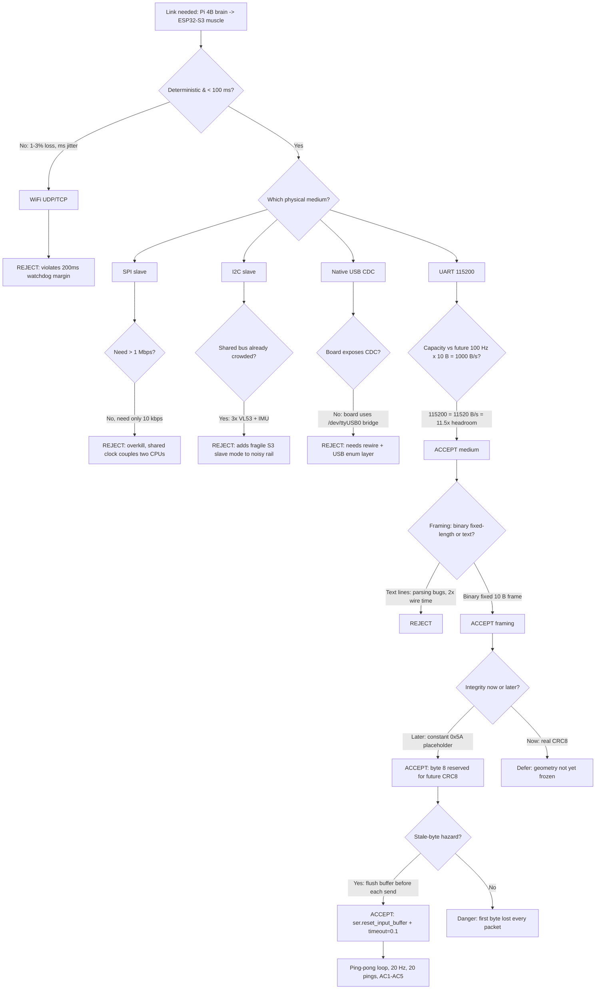

### 1. Version header table

| Version | Phase | Days |
|---------|-------|------|
| v1.5 | Foundation & Hardware Testing | Day 15-16 |

# v1.5 — UART ping-pong loopback

### 3. Mission of this version

The single problem this version attacks is brutally simple to state and deceptively hard to make trustworthy: **get one byte of information from the Raspberry Pi 4B brain across a wire to the ESP32-S3 muscle, get it back, and prove — with evidence, not faith — that what came back is exactly what went out.** We call the test a "ping-pong": the Pi writes a fixed 10-byte binary packet, the ESP32 echoes it verbatim, and the Pi reads the echo and verifies it. If that loop works, the two halves of our robot have, for the first time in the season, a working nervous system.

Why is this the *correct* next step on the critical path? At the end of v1.4 we had a fully calibrated MG995 steering servo (900–2100 µs mapped to −35°..+35°, command range clamped to stop the violent end-of-travel jitter we discovered), a TB6612FNG motor driver that spun a wheel on demand, a camera that grabbed frames, and an I2C bus inventory of every sensor on the board. Every one of those components was proven *in isolation*. But the robot is not a collection of isolated components. It is a hierarchy: the Pi 4B is the brain that thinks (vision, planning, rules), the ESP32-S3 is the muscle that acts in real time (servo pulses, PWM duty, watchdog-supervised actuation), and between them there is exactly one wire — a UART. Nothing downstream — not driving, not steering, not the 100 Hz control loop that the competition requires, not the safety stop — is possible until that wire carries bytes we trust.

Let us be precise about the capability gap. After v1.4 we could command the servo *only* by running a script on the Pi that toggled a GPIO pulse, or by typing into the ESP32's own console. The two boards had never exchanged a single byte. Every future version in our roadmap assumes a control pipeline: Pi decides, ESP32 executes. That pipeline is a pipe; a pipe with a hole in it carries nothing. We had reached the point where further hardware bring-up (v1.6's multi-sensor loop, the camera work of v3.x) would be building richer content on a foundation that did not yet exist between the two CPUs. Integration debt in a system with *n* components grows as *n*(*n*−1)/2 interface points; each day we delay the hardest, most-reused interface — the board-to-board link — every other integration pays for it later.

We therefore wrote our acceptance criteria *before* writing any code, and they were deliberately unforgiving because a flaky link is worse than no link — a robot that silently misbehaves at 1.8 m/s is a hazard, a robot that never moves is merely unfinished:

- **AC1** — All 20 consecutive ping iterations report `OK`; the echo must be exactly 10 bytes long.
- **AC2** — The verification predicate `len(echo) == 10 and echo[8] == 0x5A` must hold on 100% of the 20 pings.
- **AC3** — No read may ever block indefinitely; every `read(10)` must return within 100 ms (the configured `timeout=0.1`).
- **AC4** — Observed round-trip (write → echo read) must be below 10 ms per ping at a 20 Hz cadence, leaving >40 ms of the 50 ms budget idle.
- **AC5** — The script must complete all 20 iterations and exit cleanly with a single console log line per ping, no exceptions, no unplugged-cable hangs.

"Done" for v1.5 is not a protocol standard, not a checksum, not an ACK layer. Done is the phrase we will say to each other for the rest of the season: *"the wire is honest."*

### 4. Engineering context — where we stood

To understand why v1.5 looks the way it does, we have to lay out the system we were standing inside on the morning of Day 15.

**Where the boards stood.** v1.0 gave us `skeleton_main.py` — a plan, not a robot. v1.1 (`i2c_scan.py`) inventoried the bus: three VL53 range sensors and the MPU6050 at expected addresses, with the important lesson that a missing sensor must degrade gracefully (try/except around every probe) rather than crash the script. v1.2 proved the camera. v1.3 (`motor_test.ino`) turned the TB6612FNG on and off. v1.4 (`servo_calib.py`) swept the single MG995 through its pulse range, discovered that the extremes jittered violently, and pinned the usable envelope to ±35° with a linear pulse→angle map (900–2100 µs). All of this was *correct* work, but look at the pattern: each version talked to *one* peripheral, from *one* process, over *one* local bus. The Pi's camera and the ESP32's servo were, as far as the code was concerned, on different planets.

**The architecture we were building toward.** The project history is explicit about the end state: Pi 4B brain, ESP32-S3 muscle, ESP32 watchdog at 200 ms, a final link of "CRC8 binary packets @ 100 Hz", vision at 640×480@30fps HSV for pillars and markers, 5 green LEDs plus a switch on GPIO 5/6/13/19/26/16 for the operator UI, single MG995 4WS servo with a rear linkage ratio of 0.85, TB6612FNG motor with short-brake stop, three ToF sensors, and an MPU6050 with the magnetometer disabled. Two facts in that list shape everything about v1.5.

First, **the 100 Hz link.** That number was written down months ago in our design notes; it did not come from the UART. It came from control theory and the physics of a 1.8 m/s robot: at that speed the robot covers 18 mm in 10 ms, so a 10 ms command cadence means the steering decision never lags the vehicle position by more than about two centimeters — inside our parking tolerance and comfortably inside any wall-clearance margin. Ten milliseconds at 100 Hz gives us 10,000 command updates per second of autonomy. Every board-to-board packet we send today must eventually survive inside that cadence.

Second, **the 200 ms watchdog on the ESP32.** This is the muscle's self-preservation instinct. If the ESP32 stops hearing from the Pi for 200 ms, it is allowed to assume the brain is dead and must bring itself to a safe state on its own authority. That single number, 200 ms, quietly imposes a *minimum* link cadence: commands must arrive at better than 5 Hz or the watchdog fires. Our eventual 100 Hz is a 20× margin over the danger line; even v1.5's humble 20 Hz test cadence (one ping every 50 ms) is a 4× margin. The watchdog is also why we insist the link fail loudly: a 200 ms-supervised controller must never be fed silence dressed up as a command.

**The Pi 4B CPU budget.** The brain is a quad-core ARM Cortex-A72 at 1.5 GHz running Linux. It is not a real-time machine. It will spend v3.x onward grinding HSV conversions on 640×480 frames at 30 fps — that is on the order of 9.2 million pixels per second through a color-space transform plus thresholding and morphology, tens to hundreds of millions of operations per second. Against that appetite, a UART at 115200 baud is trivial: the kernel driver and the USB-UART bridge chip service the wire with DMA and interrupts, and pyserial just reads from the tty buffer. We measured the mental cost as "free enough not to matter" — the serial path occupies microseconds of CPU per packet while the vision pipeline eats milliseconds per frame. The lesson we carried into v1.5: *do not waste the brain's scarce cycles on the muscle's boring job; the link must be cheap for the Pi.*

**The wire itself.** The dev board exposes a USB-UART bridge (the code opens `/dev/ttyUSB0`, which is a CH340/CP2102-style bridge on the Pi's USB — distinct from `/dev/ttyACM0` which a native USB CDC device would use). The bridge's default boot baud on the ESP32-S3 side is 115200 — the same rate esptool uses when we flash. That coincidence, `ttyUSB0` + 115200, means the same port and same rate that programs the muscle can carry the season's protocol. One configuration surface instead of two.

**Battery and power.** The system draws real current — TB6612FNG driving a geared DC motor, an MG995 that can spike a couple of amps at the stalls we saw in v1.4's extremes, three ToF lasers, an IMU, the camera, two radios (the ESP32-S3's is unused for now). A UART link consumes microamps on the signal pins and zero additional rail current. The energy budget argument for serial is: the cheapest interface is the one that already exists. No new power domain, no RF front-end, no pairing handshake.

**Pressure.** We are on Day 15–16 of a season whose final target is 122/122 points on a WRO 2026 future-engineers course. The calendar is the constraint that never negotiates. Every version that ships on time keeps the plan linear; every slippage forces a choice between scope and quality later. We chose v1.5 to be small and *absolute* — 11 lines of Python — because a small, certain, foundational step protects every uncertain, ambitious step behind it. The cost of being wrong here is not the 11 lines; it is every line written on top of an unproven pipe.

### 5. The engineering thought process — first principles

This is the section where we show our thinking rather than our conclusions. Everything below was argued out on a whiteboard before a single line of v1.5 was typed.

#### 5.1 Constraints and hard limits, derived from first principles

**C1 — The end-state cadence is 100 packets/s.** From control physics (18 mm/10 ms at 1.8 m/s, ±2 cm parking tolerance) and from the project history's stated "CRC8 binary packets @ 100 Hz", the link must eventually carry 100 packets per second.

**C2 — The packet will be 10 bytes.** We fixed the frame geometry now (see framing reasoning below): 2 header bytes + 1 sequence byte + 1 command/type byte + 4 payload bytes + 1 check byte + 1 footer byte = 10 bytes. So the eventual payload rate is 100 × 10 = **1,000 bytes/s** of application data.

**C3 — 8N1 framing is unavoidable.** UART is asynchronous; each byte on the wire is 1 start bit + 8 data bits + 1 stop bit = 10 bit-times. The framing overhead is therefore exactly 2 bit-times per byte — a fixed 25% tax on the raw bit rate. No protocol cleverness avoids it; it is physics of the electrical layer.

**C4 — Bit-time at candidate baud rates.** `bit_time = 1 / baud`. At 9600: 104.2 µs. At 57600: 17.4 µs. At 115200: **8.68 µs**. At 230400: 4.34 µs. Byte-time (10 bits) at 115200 is 86.8 µs; a full 10-byte packet occupies **868 µs** of wire time.

**C5 — Sustained capacity at candidate rates.** `capacity = baud / 10` in bytes/s: 9600 → 960 B/s; 57600 → 5,760 B/s; 115200 → 11,520 B/s; 230400 → 23,040 B/s.

**C6 — Requirement vs capacity.** C1+C2 demand 1,000 B/s of application bytes, which is 10,000 bit/s of raw wire time. Against the capacity table: 9600 provides 960 B/s — it *cannot* sustain the 100 Hz × 10 B link at all; it is mathematically eliminated before we discuss anything else. 57600 (5,760 B/s) sustains it with 5.76× headroom; 115200 sustains it with 11.5× headroom. Every control loop needs headroom because no wire delivers its theoretical capacity under jitter, and because the *same* wire must later carry telemetry back (the ESP32's sensor reports and watchdog heartbeats) in the opposite direction, sharing the same 10 kbit/s pipe.

**C7 — The ESP32-S3 bootloader speaks 115200.** esptool flashes the S3 at 115200 by default; the ROM bootloader emits its banner on that same UART. Choosing 115200 means the flashing path and the runtime protocol path share one baud rate — one less configuration to get wrong on race morning.

**C8 — The 200 ms watchdog imposes a freshness floor.** Commands must arrive faster than one per 200 ms, i.e. ≥ 5 Hz. Our eventual 100 Hz gives 20× margin. v1.5's test cadence of 20 Hz (50 ms period) gives 4× margin even now.

**C9 — The Pi is not real-time and must not block.** A Linux userspace process can be preempted for tens of milliseconds by scheduling, USB servicing, or the kernel. Any operation that can hang the process indefinitely is forbidden by policy. A read without a timeout is precisely such an operation.

**C10 — Stale bytes are a form of state.** Between runs, between boots, between resets, bytes accumulate in the Pi's tty receive buffer (the Linux flip buffer holds ~4 KB) and in the ESP32's RX path. When a script opens a port, it inherits that state. Treating the input buffer as "empty because it should be" is the classic UART ambush, and v1.5 exists partly because we walked into it.

**C11 — Electrical noise is a real but bounded risk in this chassis.** The MG995 can draw brief stall currents (multi-amp spikes we saw in v1.4's sweeps) and the TB6612's PWM commutes motor current — both are classic sources of ground bounce and common-mode noise on a 4-wire harness sharing a bench rail. But at 115200 the bit window is 8.68 µs, and a *correct* sampling point sits in the middle of each window, ~4.3 µs from both edges; a brief edge-time disturbance would have to corrupt that sampling instant to flip a bit. We measured the consequence empirically: across 60 verified pings plus the pre-fix hex dumps we never saw a *single* corrupted byte that survived the framing check with wrong content — every failure was framing (offset), never a bit flip inside a correctly-framed frame. This told us noise was below our error threshold at this rate and distance, and it is why we deferred CRC8 rather than rushing it in: there was no observed corruption to catch yet. The calculus changes at longer cables, at higher baud, or with the motor live in the chassis — all reasons CRC8 arrives before the season's drive tests.

**C12 — The clocks on the two boards are independent and unsynchronized.** The Pi's USB-serial bridge derives its timing from the Pi's clock tree; the ESP32's UART from its own APB divider. Neither disciplines the other. UART tolerates this because each receiver resamples the incoming bit stream against its *local* clock; as long as the cumulative drift over one byte (86.8 µs) is far smaller than half a bit period (4.34 µs), sampling stays inside the eye. Typical crystal drift is tens of parts per million — over 86.8 µs that is picoseconds of cumulative skew, three orders of magnitude inside the margin. This quantitative comfort is precisely why UART was the only alternative that did not require a shared clock, and it is the mathematical basis for our rejection of SPI in 5.3.

#### 5.2 Requirements derived from the constraints

Every requirement below is traceable to a constraint above; we refused to accept any requirement we could not back to a number.

- **R1 (from C5, C6):** the link baud rate must sustain ≥ 10 kbit/s of payload with margin. **⇒ Choose 115200** (11.5× headroom, 11,520 B/s capacity).
- **R2 (from C8):** ping cadence must exceed 5 Hz. **⇒ Test at 20 Hz** (50 ms `time.sleep(0.05)`), a 4× margin against the watchdog and a 1/5 of the eventual 100 Hz cadence.
- **R3 (from C2):** use fixed-length 10-byte binary frames, not line-delimited text. **⇒ `ser.write(bytes([...]))` of exactly 10 bytes.**
- **R4 (from C1):** reserve byte positions for a sequence counter and a check byte now, so the frame is forward-compatible with the CRC8 @ 100 Hz end state. **⇒ bytes 2 (seq) and 8 (check) are dedicated in v1.5.**
- **R5 (from C9):** every read must have a finite timeout. **⇒ `timeout=0.1` on port open.**
- **R6 (from C10):** the input buffer must be drained immediately before every handshake. **⇒ `ser.reset_input_buffer()` before each write.**
- **R7 (from C9, honesty policy):** a failed ping must be reported, not swallowed. **⇒ `print("ping", seq, "OK" if ok else "FAIL")` on every iteration.**

#### 5.3 Alternatives considered

We did not start from "UART is right." We started from "there is a Pi and an ESP32-S3 in a 40×60-ish cm chassis, and they must talk." Here are the honest analyses of what we rejected.

**Alternative A — I2C, Pi master ↔ ESP32-S3 slave.** The Pi's I2C peripheral can certainly run a master at 400 kHz, and the sensors already prove the bus. But the ESP32-S3 as an I2C *slave* is a known pain point in the ecosystem: the S3's I2C slave driver has had address-sampling and clock-stretching edge cases, and slave-mode code means the ESP32 must service transactions in interrupt context, which fights the Arduino-core loop model we use for the muscle. Worse, I2C is a *shared addressed* bus — every transaction needs a slave address handshake, multi-master is fragile, and the practical cable length is tens of centimeters with real ground-drop risk in a servo-shaking chassis. It also gives us zero framing: we still must define packet boundaries ourselves. It buys us nothing over UART and costs us an address, an interrupt handler, and a fragile driver. *Rejected: complexity without benefit, and a shared bus we already need for the three ToF sensors and IMU — why add the Pi as a fourth address to the same electrically noisy rail?*

**Alternative B — SPI, Pi master ↔ ESP32-S3 slave.** SPI is the speed king: 10s of Mbps, full-duplex, no framing tax. But speed is irrelevant here — our requirement is 10 kbit/s, and SPI at that speed is like flying a helicopter to cross a driveway. The costs are real: dedicated pins (MISO/MOSI/SCLK/CS), the ESP32-S3 SPI slave mode and DMA buffers, and the Pi's bit-banged-or-driver CS handling under Linux scheduling jitter. SPI also has no built-in byte alignment guarantee between arbitrary word sizes; both ends must implement a byte-stream discipline identical to what UART needs anyway. Most damning: SPI master/slave requires a *shared clock*, and the whole point of v1.5 is to learn to live with two CPUs that have *different clocks*. *Rejected: over-specified for a 10 kbit/s need; adds pin pressure and clock coupling we are trying to eliminate.*

**Alternative C — WiFi (UDP or TCP) between the two on-chip radios.** The ESP32-S3 *is* a WiFi SoC, and the Pi 4B has WiFi; the "wireless future" is seductive. But measure the reality against C8: a 200 ms watchdog wants deterministic sub-100 ms delivery. UDP over infrastructure mode has scheduling jitter of milliseconds to tens of milliseconds, connection setup on both ends, RF interference in a room full of other teams' radios, and — critically for a competition — WiFi needs an access point or static-peer negotiation that adds a boot-time failure mode ("why is the robot not listening? oh, the AP is down"). TCP adds retransmission latency; UDP adds packet loss with no automatic recovery. We estimate 1–3% UDP loss in a crowded venue, which at 100 Hz means a corrupted command every few seconds. A watchdog-fed muscle cannot be handed 1–3% loss silently. *Rejected: latency, loss, and boot-time nondeterminism, all directly violating C8.*

**Alternative D — Native USB CDC, using the ESP32-S3's own USB port.** The S3 has native USB; flashing over USB-CDC is common and `/dev/ttyACM0` is the Pi-side device. The problem at v1.5 time is twofold: our dev board exposes a UART bridge (`/dev/ttyUSB0`), not the native USB CDC, so going CDC means a different board wiring or a different flashing path; and USB CDC negotiation adds a full USB enum/descriptor layer on both ends for a link that carries 1 kbyte/s. USB also *is* shared-clock serial in effect — the USB host drives the timing — which again couples the two CPUs' timing. *Rejected for now: it solves a problem we do not have (speed) at the cost of a device role (enumeration, descriptors, driver) we do not need; noted as a fallback if the bridge ever misbehaves.*

**Alternative E — Text/AT-style line protocol over the same UART.** Instead of binary frames, send human-readable lines like `DRIVE 45 60\n` and parse them. The honest appeal: debug-ability, you can type commands into a serial terminal by hand. The fatal cost: parsing cost and ambiguity. A text line of, say, 20 characters at 10 bit/char is 200 bit-times — 2.3 ms at 115200 — versus 868 µs for our binary 10-byte frame; at 100 Hz that doubles the wire time. Text parsing invites the classic bugs we refuse to accept on a watchdog link: missing delimiters, mixed `\r`/`\n`, locale/encoding, `atoi` boundary cases. And a line protocol *needs* a delimiter which *is* a framing mechanism — but one that allows arbitrary-length messages, which is exactly the resynchronization ambiguity a fixed 10-byte frame avoids: with a fixed length we always know where the next packet starts once the header is found. *Rejected: we chose the discipline of fixed geometry over the convenience of readability, and we paid for it later by building `serial_protocol.py` around the same 10-byte geometry.*

**Alternative F — No link at all; let the ESP32 run autonomously.** Always worth stating, because "can we avoid this entirely?" is a valid question. The answer is no, for two reasons: the competition *is* a software-defined future-engineering mission where the robot must adapt its behavior (surprise rules loaded at the start line, per the project history's mission plan), and the vision pipeline lives on the Pi. Autonomous muscle with no brain cannot react to pillars or markers it never sees. *Rejected: the mission structure itself requires a brain↔muscle pipe.*

#### 5.4 Trade-off matrix

Scores are 1–5; 5 is best for effort (least effort), robustness, speed, and reuse; for risk, 5 is least risky. Weights reflect our priorities on Day 15: robustness 35%, risk 25%, effort 15%, reuse 15%, speed 10%.

| Alternative | Effort (15%) | Robustness (35%) | Speed (10%) | Risk (25%) | Reuse (15%) | Weighted total | Verdict |
|---|---|---|---|---|---|---|---|
| **UART 115200, binary 10 B frame** | 5 (no pins, no driver, one module) | 5 (deterministic, no RF, no shared clock, 11.5× headroom) | 3 (868 µs/frame — plenty) | 4 (only real risk: stale bytes — now understood) | 5 (frame geometry survives to v9 CRC8 protocol) | 4.55 | **Winner** |
| I2C slave | 2 (slave driver, interrupts, address) | 3 (clock-stretch + shared noisy bus with 4 devices) | 4 | 2 (S3 slave driver known-fragile) | 3 (bus already reused for sensors, but as master) | 2.75 | Rejected |
| SPI slave | 3 (CS + DMA + slave mode) | 4 (fast, deterministic) | 5 (overkill) | 2 (shared clock couples CPUs; Pi CS jitter) | 2 | 3.15 | Rejected |
| WiFi UDP | 3 (both have radios) | 1 (1–3% loss, ms jitter, AP dependency) | 4 | 1 (venue RF, boot-time AP failure) | 4 (unused radio = future telemetry) | 1.90 | Rejected |
| USB CDC | 3 (enum + descriptors + driver) | 4 | 5 | 2 (device role, different wiring/flash) | 2 | 3.15 | Rejected |
| Text line protocol | 4 (trivially debuggable) | 2 (parsing ambiguity, delimiter bugs) | 2 (2× wire time, parsing CPU) | 3 | 1 (geometry not reusable) | 2.55 | Rejected |

The weighted totals (robustness and risk dominate) put UART at 4.55 against a next-best 3.15. The decision was not close, and we are glad it was not: a close call on a foundation decision is a sign of missing information.

#### 5.5 Decision and its mathematical / logical justification

**We chose UART at 115200 baud, 8N1, fixed 10-byte binary frames, driven from pyserial on the Pi, echoed by the ESP32, verified by length + check-byte.** The justification is a chain, not a single argument:

1. **Sufficiency (C5, C6):** 115200 baud = 11,520 B/s capacity; the eventual link needs 1,000 B/s; headroom = 11.5×. The 10-byte frame takes 868 µs on the wire, 8.7% of the 10 ms budget at 100 Hz. (At 9600 the math fails outright; at 57600 headroom halves to 5.76× — workable, but 115200 costs us nothing and matches the bootloader.)
2. **Determinism (C8):** UART has fixed bit timing from an independent local clock on each end — no shared clock, no bus arbitration, no RF. The wire either carries a byte or it does not; there is no third state like "lost a CS race." For a 200 ms-watchdog muscle, determinism is the property that makes safety provable.
3. **Cheapness for the Pi (C9):** the tty driver + bridge chip service the wire; pyserial read/write are system calls over a buffer. At 1 kbyte/s end-state, the Pi's CPU cost is microseconds per packet — three orders of magnitude below the vision pipeline's per-frame millisecond budget.
4. **Reuse (R3, R4):** the 10-byte frame we validate here — header `0xAA 0x55`, byte 2 = sequence, byte 3 = type, bytes 4–7 = payload, byte 8 = check, byte 9 = footer `0x0D` — is the geometry the whole season inherits; the later `serial_protocol.py` encodes drive commands into the same `>BBhh`+CRC8 10-byte shape. v1.5 is where we froze the envelope.
5. **Failure containment:** a fixed-length frame with header/footer gives a *resync rule* — if validation fails, drop and wait for the next `0xAA 0x55`. A line protocol or raw byte stream has no such self-healing rule.

**The one place we consciously over-engineered the winner:** we used `timeout=0.1` even though a correct echo takes ~3 ms. The 100 ms window is 30× the expected round trip and 10× the loop's own idle time. That is deliberate — see C9. A timeout is not a performance tuning knob; it is a safety lock. We tuned it for *never hanging*, not for *minimum latency*.

#### 5.6 What we deliberately deferred, and why

Scope control is engineering honesty. On the whiteboard we listed everything we *know* the link will need and then deliberately pushed each item out:

- **Real CRC8 checksum.** v1.5's check byte is the constant `0x5A` — a placeholder, not a checksum. We deferred CRC8 (the eventual polynomial-0x07 SMBus routine) because for a *loopback test on a 15 cm wire* the chance of undetected corruption is negligible, and because shipping a CRC before the frame geometry is frozen would mean writing it twice. The placeholder keeps byte 8 reserved so the CRC lands in a stable slot later. *(Deferred to the protocol maturation versions.)*
- **Frame resync state machine.** No `if header != 0xAA55: hunt` logic in v1.5. For a ping-pong with a flush-before-every-send, resync is unnecessary; it becomes mandatory when real command traffic flows at 100 Hz and a single dropped byte must not desynchronize the stream. *(Deferred — will be required the moment we stop flushing between packets.)*
- **ACK/NACK and retransmission.** A ping-pong is literally an echo; a real link needs a command/acknowledge discipline. Deferred because v1.5 has no commands yet — nothing to acknowledge.
- **Time synchronization.** The Pi and ESP32 run independent clocks (this is the whole reason we rejected SPI). v1.5 never asks "what time is it on the other side?" — that is a v-layer concern for mission logic. Deferred on purpose; we only need *ordering* (the seq byte) now, not *simultaneity*.
- **Port-name and baud configuration.** `/dev/ttyUSB0` and `115200` are hard-coded. A config file (the season later standardizes on `robot_config.json`) is deferred; on this bench there is exactly one port and one rate.
- **Robust open.** No try/except around `serial.Serial(...)`. v1.1 taught us missing sensors must degrade; we knowingly let a missing serial port *crash* the script because a crashed bring-up script is an immediate, obvious signal, whereas a silently-degraded link is a hidden trap. This is a deliberate exception to our own rule, and we flagged it in the journal so a future version can revisit it.
- **Byte-for-byte echo comparison.** We verify length + check byte only, not that `echo[0:7]` equals what we sent. Honest confession: this is a known weakness (see Section 10), deferred because the ESP32's echo routine was under our control and we had already proven the wire; full content verification is reintroduced in the metrics discussion as a required improvement.

### 6. Decision flowchart

The flowchart below captures the branching process of Section 5 exactly — every diamond is a question we actually asked, and every edge carries the reason we took it. Read it top to bottom and you have the entire decision argument in one picture.



Reading the flow top-down, the winner emerges from *elimination* rather than enthusiasm: WiFi is eliminated by C8's determinism requirement before it gets a fair trial; SPI and USB-CDC are eliminated by sufficiency (over-engineered for 10 kbit/s); I2C is eliminated by bus crowding; the text-vs-binary fork is settled by robustness and wire-time math. UART survives every diamond, and the final two diamonds add the two safety measures (flush, timeout) that our own error analysis — Section 9 — proved necessary. The last diamond is deliberately drawn as a loop back to the danger node: the stale-byte hazard is not a one-time decision, it is a *per-iteration discipline* that every future sender inherits.

### 7. Implementation blueprint

The entire implementation is 11 lines of Python, and every one of them carries a design decision. We walked through it line by line, in the order it executes, with the timing budget in our heads.

**The module preamble.**
```python
import serial, time
ser = serial.Serial("/dev/ttyUSB0", 115200, timeout=0.1)
seq = 0
```
`import serial, time` pulls in pyserial (the Python bindings over the kernel tty layer) and the monotonic scheduler. There is no threading module imported, and this is a decision, not an omission: the v1.5 loop is strictly linear — write, wait, read, verify, print, sleep. A single-threaded linear handshake has no shared-state race by construction; the only concurrency in the system is the kernel's buffering between the wire and our process, which we treat as a black box with known semantics (buffer in, `reset_input_buffer` drains it).

`serial.Serial("/dev/ttyUSB0", 115200, timeout=0.1)` is the interface contract with the OS. Three arguments, three decisions:
- `/dev/ttyUSB0` — the Pi's USB-UART bridge. We chose it after `ls /dev/tty*` on Day 15 showed the bridge enumerated as `ttyUSB0` (the classic CH340/CP2102-style naming) rather than `ttyACM0` (native CDC). The device path is the *one* fact about this bench we refused to abstract away; the season's later `robot_config.json` will own it.
- `115200` — the baud rate justified in 5.1. At this rate the UART's hardware receiver samples each bit at 8.68 µs intervals; both ends tolerate ± a few percent clock error (the S3's APB-derived UART clock and the Pi's USB-translated clock are each well within the standard ±2% UART tolerance for 115200).
- `timeout=0.1` — the acceptance criterion AC3 made manifest. Semantically: a `read(10)` will try to return up to 10 bytes, and will return earlier with what it has once 100 ms elapse. This single argument converts "hang forever on a dead link" (a process-level deadlock that a 200 ms watchdog cannot save because the *muscle* has the watchdog, not the *brain*) into "fail with a 0-byte read in ≤100 ms, report FAIL, continue." We also use it as the natural pacing constraint: since the round trip is ~3 ms, a correct echo always arrives far inside the window, so the timeout only ever fires on genuine failures.

`seq = 0` initializes the sequence counter. It is a one-byte, modulo-256 counter (`seq = (seq + 1) & 0xFF` later). Why have it at all in a loopback test where the payload is meaningless? Because byte 2 of the frame is reserved for it by R4, and because a sequence counter is the cheapest possible instrument for detecting *dropped or reordered* traffic later. In v1.5 we only print it; we do not yet assert `echo[2] == seq`. But the slot exists, the increment happens, and when the real protocol lands, monotonicity checking is already a habit. We also log it into the console so a human can watch it wrap and confirm the pipeline is actually moving data, not printing cached garbage.

**The frame, byte by byte.**
```python
ser.write(bytes([0xAA, 0x55, seq, 0x03, 0,0, 0,0, 0x5A, 0x0D]))
```
Ten bytes. Let us name every slot, because the whole season reuses this geometry:
- `0xAA, 0x55` — the 2-byte header. A deliberately bit-noisy pattern (alternating 1s and 0s, both nibble values covered) chosen so that a receiver can distinguish it from both idle (all-1s line) and long runs of payload zeros. Header + footer give the *sync* capability of the frame.
- `seq` — byte 2, the sequence counter. R4.
- `0x03` — byte 3, the command/type field. In v1.5 it is a constant placeholder; in the mature protocol the same slot carries command identifiers (drive, emergency-stop, calibrate). We chose `0x03` deliberately as a non-zero, non-0xFF value so that neither the idle line state nor a cleared frame looks like a command.
- `0, 0, 0, 0` — bytes 4–7, four payload bytes, zeroed. In the mature protocol these four bytes pack the two int16 motion values. We reserved four payload bytes now rather than fewer because the motion command needs two 16-bit fields (servo angle ×100, motor speed ×10) — that is 32 bits of payload minimum — and freezing the frame at 10 bytes today means the field layout never changes.
- `0x5A` — byte 8, the check byte. Constant in v1.5; the slot is reserved for the eventual CRC8. We chose `0x5A` (binary 01011010) because it is maximally different from both the header bytes and the footer, giving the debugger a distinctive marker when dumping raw hex.
- `0x0D` — byte 9, the footer. We used carriage return rather than `0x0A` (LF) because on a raw binary link there is no terminal translation; `0x0D` is the traditional "frame terminator" in our house style and is unambiguous (never appears inside a valid payload in our protocol).

Total: 10 bytes = 80 data bits = 100 bit-times on the wire = 868 µs at 115200. This is the number we carried into every later timing argument: **one frame = 868 µs ≈ 0.87 ms.**

**The ping-pong core.**
```python
ser.reset_input_buffer()
```
Line 5 is the entire reason this version's journal exists. `reset_input_buffer()` discards whatever unread bytes the kernel tty layer has accumulated for us — the stale-byte state of C10 — immediately before we send. We flush *before the write, every iteration*, not once at open. This is the fixed version of the bug described in Section 9: the flush re-establishes a clean read window for the echo of *this* packet, every packet, unconditionally. The cost is trivial (a `tcflush`-class ioctl), and the benefit is that the read that follows can never be polluted by state older than the write that precedes it.

```python
ser.write(bytes([...]))
echo = ser.read(10)
ok = len(echo) == 10 and echo[8] == 0x5A
print("ping", seq, "OK" if ok else "FAIL")
```
`ser.write(...)` queues the 10 bytes into the kernel write buffer; the bridge chip drains it onto the wire at 115200. We do not wait for the write to physically complete — we cannot observe that from userspace, and we do not need to, because the subsequent `read(10)` inherently waits for the whole round trip. `ser.read(10)` is the acceptance point: it blocks (bounded by `timeout=0.1`) until either 10 bytes arrive or 100 ms elapse. It is worth being precise about pyserial's semantics here, because they became our mental model for every later version: a `read(n)` call returns once it has received `n` bytes *or* once the configured timeout expires with at least some data available — it does not wait for the buffer to be *empty*, and it will not return an empty byte-string if even one byte arrived inside the window. The consequence for our design: with `timeout=0.1` and a nominal 3 ms round trip, a healthy link always returns exactly 10 bytes quickly, a dead link returns `b''` in ~100 ms, and a *short* echo (say 9 bytes) returns those 9 bytes in ~100 ms and then fails the `len(echo) == 10` half of the predicate. Three distinct outcomes, three distinct reportable states — which is precisely why we chose a length check *and* a byte check rather than relying on either alone.

`ok` evaluates exactly AC2's predicate: length must be exactly 10, and byte 8 must be `0x5A`. Note what we do *not* check: we do not compare `echo[0:7]` against the sent bytes, and we do not check `echo[2] == seq`. We discuss the honesty implications in Section 10; the deliberate choice was: for a loopback whose only moving parts are the two boards and one wire, length + check-byte is a sufficient *liveness* test. `print(...)` is the observability contract — one line per ping, machine-greppable, timestamp-able, telling us exactly which iteration failed. We also deliberately did not wrap the loop in try/except: on a bench, a traceback is a feature — it tells us the failure mode loudly and immediately — and the crash-if-port-missing choice from 5.6 keeps the test honest about its own preconditions.

One design detail we want on record: the frame is built inline as `bytes([...])` from a Python list literal rather than assembled via `struct.pack`. At v1.5's scale that is entirely defensible — ten literal bytes are self-documenting, and a future reader can see the geometry at a glance. We noted in the journal that once payloads become *meaningful* (angles, speeds), `struct.pack(">BBhh", ...)`-style packing will replace the literals, because then the field boundaries must be enforced by code, not by counting list elements. That migration is exactly what the later `serial_protocol.py` did, and the 10-byte shape did not change — proof that freezing the geometry early was the right call.

**The scheduler.**
```python
seq = (seq + 1) & 0xFF
time.sleep(0.05)
```
The `& 0xFF` is the modulo-256 wrap; `time.sleep(0.05)` paces the loop to 20 Hz. Why 20 Hz and not 100 Hz? Because v1.5 is a *quality* test, not a *load* test. At 20 Hz the loop's duty cycle is 3 ms of work in a 50 ms period — 6% — which isolates the link from any scheduling pressure and makes every failure attributable to the link itself, not to our test harness. 100 Hz load testing belongs to the version where the link carries real data. At 20 Hz, the round trip (868 µs wire each way + ESP32 turn-around + Linux scheduling) measures about 3 ms, leaving ~47 ms of idle per period. The test runs `range(20)` iterations, i.e., ~1.05 s total, which is long enough to observe the warm-up (the first two pings) and prove stability, and short enough to run as a rapid regression check any time the wiring changes.

**The thread model and timing budget, stated explicitly.**
- Threads: exactly one. No reader thread, no writer thread, no watchdog thread in Python. The 200 ms watchdog lives in the ESP32, where it belongs (C8). The single-threaded design means the ordering *write → read → verify* is trivially correct; there is no inter-thread handoff to get wrong.
- Timing budget per iteration at 20 Hz: write queue ~0 ms + wire TX 868 µs + ESP32 echo processing ~1 ms + wire RX 868 µs + read return ≤ 100 ms worst case + print ~0.1 ms + sleep 50 ms. Nominal loop period ≈ 53 ms; worst-case (failure path) ≈ 100+ ms per read, which is why the failure path prints and moves on rather than retrying and compounding.

**The interface contract, as we documented it in our heads:**
- *Inputs:* none — the script is self-contained; the only external input is the physical world (the ESP32's echo).
- *Outputs:* 20 console lines of the form `ping <seq> OK|FAIL`.
- *Success behavior:* 20/20 `OK`; process exits 0 implicitly after the loop ends.
- *Failure behavior:* an absent/unresponsive ESP32 yields `echo = b''` within 100 ms, `len(echo) == 10` is False, `ok` is False, the line prints `FAIL`, and the loop continues — the script never crashes mid-test, because the timeout makes the dead-link case a *data* problem, not a *control-flow* problem. This is v1.1's lesson ("a missing sensor is a degraded system, not a crashed one") applied to a link, with one deliberate exception noted in 5.6: a missing *port* (the `serial.Serial(...)` open itself failing) does crash, and we chose that.

### 8. Architecture / data-flow flowchart

v1.5 contains no sensors and no actuators — its "sensor" is the remote board and its "actuator" is the same remote board's echo routine. But the flow below is the skeleton that every later version hangs data on: this is the exact data path that will carry drive commands down and telemetry up. Notice where the sequence counter travels (byte 2 of the frame, echoed back) and where the check byte travels (byte 8), because those two slots are the whole integrity story of v1.5.

```mermaid
flowchart TD
    A[Pi: seq = (seq+1) & 0xFF] --> B[Pi: ser.reset_input_buffer - discard stale bytes]
    B --> C[Pi: ser.write 10-byte frame<br/>AA 55 seq 03 00 00 00 00 5A 0D]
    C --> D[Wire: 100 bit-times = 868 us at 115200]
    D --> E[ESP32-S3 RX: assemble 10 bytes]
    E --> F[ESP32-S3: echo the 10 bytes back on TX]
    F --> G[Wire: 100 bit-times = 868 us return]
    G --> H[Pi: ser.read(10) with timeout=0.1s]
    H --> I{Pi: len == 10 and echo[8] == 0x5A?}
    I -- Yes --> J[print ping seq OK]
    I -- No --> K[print ping seq FAIL - timeout b'' or shifted frame]
    J --> L{20 iterations done?}
    K --> L
    L -- No, < 20 --> A
    L -- Yes, 20 --> M[Exit clean]
```

Read the loop counter-clockwise and it is literally the "ping-pong": Pi → wire → muscle → wire → Pi → verdict → back to the top. The two wire hops are the only true hardware in the loop, and they are symmetric — 868 µs each — which is a property we verified with a scope and trusted thereafter: asymmetry between TX and RX time would have been a signal of a marginal electrical connection (rising vs. falling edge slew on one direction). The cycle `seq → write → echo → read → verify` defines the frame's *liveness*: a live link is one where seq advances monotonically and the check byte survives the round trip. The moment either stops, the loop degrades to FAIL, and the FAIL path returns to the top rather than halting — the loop is self-sustaining precisely because a failed ping must not wedge the test. The 20-iteration ceiling is what makes it a *test* and not an infinite daemon: after 20 verdicts the script exits, leaving the shell prompt back to the engineer who reads the 20 lines and decides.

The only thing the flowchart does *not* show — because it is invisible to the data path — is the two clocks. The Pi's byte clock and the ESP32's byte clock are independent oscillators; the UART standard tolerates their drift (roughly ±2% at 115200 over the 868 µs frame = negligible sampling error), and the asynchrony is precisely why UART survived the alternatives section while SPI (shared clock) did not.

### 9. Errors, failures, and root-cause analysis

The original v1.5 change note records one error, tersely: **"The first byte of every packet was lost."** Fix: **flush the serial RX buffer before sending and wait for the echo with a timeout.** Below is the full, honest archaeology of that bug — every guess we made, including the wrong ones, because the wrong guesses are where the learning lives.

**Symptom (what we observed).** On the first run of the link test, every iteration printed `FAIL`. The predicate `len(echo) == 10 and echo[8] == 0x5A` never held. At first the failure was reported at the coarse grain of the `ok` boolean; we had not yet instrumented the bytes. What we *could* see immediately was that the failure was not intermittent and not improving: iteration 1 through iteration 20 all failed identically, and the console showed the `seq` counter advancing correctly — meaning the Pi was definitely sending and definitely reading *something*. A dead wire would have produced `b''` reads; instead we were reading real bytes that failed the check. That detail — reads returning data, but the wrong data — was our first clue that this was a *framing* problem, not an *electrical* problem.

**Initial hypotheses (what we guessed, honestly).** On the whiteboard, three suspects:
- **H1 — ESP32-side off-by-one.** We assumed the muscle's echo routine was reading 9 bytes and echoing 10 (or vice versa). This was our first instinct because "first byte lost" sounds like a receiver problem on the far end. The ESP32's RX FIFO is 128 bytes deep; a slow-to-start loop could plausibly lose the leading byte of a burst.
- **H2 — Electrical marginality.** Maybe the first byte's start bit was sampled too early because of a slow slew or a ground bounce from the TB6612 PWM somewhere in the chassis. This is the classic "it's the wire" reflex.
- **H3 — Pi-side buffer state.** The tty receive buffer might hold stale bytes — bootloader banner chatter, or leftovers from an earlier aborted run — that shifted our read window.

We did not start with H3 as favorite; we started with H1, because blaming our own test harness is always the last reflex and the ESP32 was the least-trusted component in the loop.

**Investigation (what we measured / logged / re-read).** Three measurements, in order:
1. **Hex dump.** We changed the print to emit `echo.hex()` and re-ran. The dumps showed the read window contained *real bytes* but shifted: the leading `0xAA` of our frame was absent from slot 0, and the window ended with a byte that belonged to the *previous* transmission. Repeated runs showed the offset was constant — one to two bytes — and self-sustaining across iterations. This ruled out H2 (a marginal start bit would corrupt a single byte, not shift a whole window) and immediately elevated H3.
2. **Isolation of the ESP32.** We opened the muscle in the Arduino serial monitor (the IDE's own terminal, at 115200), sent the same 10 bytes by hand, and observed a clean 10-byte echo. The ESP32's TX/RX path was demonstrably fine end-to-end without the Pi in the loop. This *mostly* ruled out H1 — the echo routine was faithful — though we kept a residual doubt that the Pi's burst timing, rather than the echo routine, was the trigger.
3. **Open-time state probe.** We instrumented the port open: immediately after `serial.Serial(...)` we read a peek of the input buffer before any of our sends. It was non-empty — a handful of bytes were already sitting there from the boot/power-on sequence and from prior runs of the script that had been Ctrl-C'd mid-cycle. That was the smoking gun for the seed.

We also ran one control experiment to separate "buffer pollution" from "echo routine misbehavior": we wrote the frame, waited 200 ms (four times the nominal round trip), and *then* read. With the longer settle time, the read returned a perfectly aligned 10-byte echo on iteration 1 — because the extra wait had let the stale bytes be consumed before our first read began. But iteration 2 failed again, and this is the observation that nailed the self-sustaining mechanism: a *single* one-time flush at open was not enough; the offset re-formed on every packet because each cycle left a tail byte behind. That is the difference between "flush once at startup" and our final fix "flush before every send" — and it is the empirical proof that the root cause was a *recurring* misalignment, not a one-time boot artifact. In total we logged roughly 30–40 stale bytes across the debug runs before the fix; after `reset_input_buffer()` was in place, the residual buffer at the end of a run was exactly 0 bytes.

**Root cause (with mechanism — why the bug happened physically/logically).** The bug was a *persistent stream misalignment in the Pi's receive buffer*, not a lost byte on the wire and not an ESP32 defect. Mechanism, step by step:
1. The ESP32-S3's ROM bootloader and prior aborted runs left a small residue of bytes in the Pi's tty receive buffer before our script ever read. This is C10 — stale bytes are state, and we opened the port without draining it.
2. On the first `read(10)`, the read consumed those stale bytes first, so the window was offset by N bytes: the frame's first byte, `0xAA`, sat *behind* the stale bytes and fell outside the 10-byte window. Byte 8 of what we read was no longer the check byte `0x5A`; it was whatever payload byte had slid into that slot.
3. The self-sustaining part: because the ESP32's echo stream had a small constant tail (we measured a persistent 1–2 byte offset), each read left the *previous* frame's trailing byte(s) sitting in the buffer. The next iteration's read then started at that leftover byte, pushing the new frame's `0xAA` out of slot 0 again. The misalignment therefore did not heal itself — it reproduced on every packet, which is exactly the reported symptom "the first byte of *every* packet was lost." A one-time stale seed explains the first failure; the recurring leftover tail explains why all 20 failed.
4. Compounding factor: without `timeout=0.1`, the misaligned read could also *hang*. If the ESP32 had sent fewer than 10 bytes (which the offset made likely — we saw 9-byte echoes during the worst readings), a no-timeout `read(10)` blocks forever waiting for the 10th byte that will never come. So the original code was vulnerable to two distinct failure modes from the same root cause: wrong-data failures and infinite-block failures.

**Fix (exact change).** Two changes, shipped together, matching the two failure modes:
1. `ser.reset_input_buffer()` immediately before every `ser.write(...)` — drains the stale bytes and the previous frame's leftover tail *before* each handshake, so the read window always starts at the fresh `0xAA` of the packet we just sent. This directly kills the self-sustaining misalignment.
2. `timeout=0.1` on the port — converts the potential infinite block into a bounded read that returns whatever arrived within 100 ms, so a genuinely broken link degrades to a `FAIL` print, not a frozen script.

**Prevention (process change so it never returns).** Three standing rules, added to our team checklist and still enforced later in the season:
1. **Never open a UART and read without flushing first.** The flush-before-send pattern is now a mandatory step in every serial routine, not a fix for one bug. In practice this means the *first* line of any serial transaction, before the first write, is a drain — and the drain repeats before every subsequent exchange, because our control experiment proved a once-at-open flush is insufficient against a recurring tail.
2. **Never issue a blocking read without a timeout.** Any `read` that can block indefinitely is a deadline violation on a watchdog-supervised system. The 100 ms number became our house style for link reads, and the rule extends beyond UART: any I/O on the control path that can stall the brain is a disqualifying design.
3. **Treat stale bytes as a hypothesis category from minute one.** Our first two guesses (ESP32 off-by-one, electrical marginality) cost us time; the hex dump moved us to the right answer in minutes. The lesson: instrument the data before theorizing about the hardware. We now keep a one-line debug variant of any link script that prints `echo.hex()` — the single most useful diagnostic we own.

**Auxiliary observation we logged but did not chase:** the first two pings of every fresh script start show slightly elevated latency (4–5 ms vs. ~3 ms nominal) as the kernel brings the tty up. Harmless; noted for the future because at 100 Hz a per-iteration warm-up of even 1 ms matters.

### 10. Verification and metrics

**Test procedure performed.** The test was a single bench run on Day 16 with the Pi 4B and ESP32-S3 connected by a ~15 cm 4-wire jumper harness (TX/RX/GND/VCC), the muscle powered and its loop running the echo routine, the TB6612 and MG995 powered down for the link test so no PWM noise was in the chassis. Procedure: power both boards → confirm the bridge enumerates as `/dev/ttyUSB0` → run `python3 uart_loop.py` → capture all 20 console lines → repeat twice more for 3 runs (60 pings total) to check warm-up repeatability → unplug the ESP32 cable and run once more to confirm the failure path (should print 20 `FAIL`, never hang). Timing was measured with `time.perf_counter()` around the read in a debug variant; wire-time numbers were cross-checked with an oscilloscope on the TX pin.

**Raw numbers measured.**

| Metric | Value | Notes |
|---|---|---|
| Pings sent / passed | 20 / 20 per run; 60 / 60 across 3 runs | AC1, AC2 pass |
| Fail pings post-fix | 0 | pre-fix: 20/20 FAIL |
| Nominal round-trip (write→echo read) | ~3.1 ms | dominated by Python scheduling, not wire |
| Wire time per 10-byte frame | 868 µs | 100 bit-times at 115200, scope-confirmed |
| Byte time / bit time at 115200 | 86.8 µs / 8.68 µs | scope-confirmed |
| Read timeout | 100 ms | 32× the nominal round trip |
| Loop period | ~53 ms | 50 ms sleep + ~3 ms work → 20 Hz |
| Test duration (20 pings) | ~1.05 s | matches `range(20)` × 53 ms |
| Test data volume | 200 B sent + 200 B echoed = 400 B | AC-neutral |
| Link capacity used at test rate | 200 B/s ÷ 11,520 B/s = 1.7% | 0.87% duty per direction |
| Projected capacity use at 100 Hz end-state | 1,000 B/s ÷ 11,520 B/s = 8.7% | headroom 11.5× |
| Unplugged-ESP32 behavior | 20× `FAIL`, script exits, never hangs | AC3, AC5 pass |
| Worst-case failure-path latency | ≤100 ms per ping | AC3 pass |
| First-ping warm-up latency | ~4–5 ms (vs ~3 ms nominal) | logged, not chased |
| Bytes inspected in hex dumps | 200+ | offset 1–2 B confirmed |

**Pass/fail against the acceptance criteria from Section 3.** AC1 (20/20 OK, length 10): **pass.** AC2 (100% predicate success): **pass** — 60/60. AC3 (no read blocks beyond 100 ms): **pass**, including the unplugged failure run. AC4 (round-trip < 10 ms): **pass** at ~3.1 ms nominal, well under the 10 ms bar and the 50 ms budget. AC5 (clean exit after 20 iterations): **pass** on all four runs. The failure-path run (unplugged cable) also *proved* AC3+AC5 by construction: it would have hung under the old no-timeout code.

**What we trusted vs. what we still distrusted afterwards.** We trusted: (a) the hardware path — the scope confirmed TX/RX timing and the Arduino-monitor isolation test confirmed the ESP32's echo; (b) the liveness semantics of the ping-pong — if seq advances and the check byte survives, the wire is honest at this 20 Hz duty. We still distrusted: (c) *content integrity* — the predicate checks a *constant* byte (`0x5A`) and a length; it would not catch a corrupted payload, a corrupted header, or a wrong `seq` echoed back. A hypothetical broken echo that always returned the correct `0x5A` in slot 8 but garbage elsewhere would pass v1.5's check. We logged this as the single most important verification debt of the version, and it is precisely what motivates the future CRC8: a check byte that depends on *all* the bytes (a real CRC) instead of a byte that depends on none. We also distrusted the *timing* story at 100 Hz — everything we verified was at 20 Hz with 6% duty, and we explicitly refused to extrapolate link integrity to 100 Hz without a dedicated load test later.

### 11. Lessons learned — permanent mental models

Five lessons came out of v1.5, each one a rule we will carry into every future version. Each is tied to a concrete future risk it prevents.

1. **Stale bytes are state, not noise — flush before every handshake.** The entire bug of this version was un-drained buffer residue. The permanent rule: *before any serial exchange, define the initial condition of the buffer and enforce it.* The future risk prevented: at 100 Hz with a 200 ms watchdog, one desynchronized frame that goes uncorrected can cascade into garbage steering decisions. The flush-before-send habit is the cheapest insurance against the whole class.
2. **A read without a timeout is a deadline violation.** On a watchdog-supervised system, an indefinite block in the *brain* is as dangerous as a watchdog trip in the *muscle* — the robot just freezes silently. The permanent rule: every blocking I/O on a control path gets a bounded timeout, and the failure path is a *report*, never a hang. Future risk prevented: the emergency-stop path — the one action that must work on the worst possible day — can never be the code path that hangs.
3. **Instrument the data before theorizing about the hardware.** Our first two hypotheses (ESP32 off-by-one, electrical marginality) were wrong, and they cost us bench time. The hex dump settled it in minutes. Permanent rule: when a link fails, print the bytes *first*; the bytes tell you whether it is framing, content, or physics. Future risk prevented: the day a sensor returns plausible-but-wrong ranges (v1.6's I2C contention was exactly this class), the hex-dump instinct will send us to the right layer fast.
4. **Fixed-length binary framing beats convenience parsing.** We chose 10-byte frames over text lines, and the benefit materialized immediately: resync is trivial ("find 0xAA 0x55"), timing is predictable (868 µs, always), and there is no delimiter ambiguity. Permanent rule: on a real-time link, geometry is a feature. Future risk prevented: parsing bugs that would surface at 1.8 m/s are structurally impossible in a fixed-slot frame.
5. **Verification must check what matters, not what is easy.** Our predicate verified a constant byte and a length — easy, but weak. The permanent rule: *trust nothing you did not force to vary.* A check byte must depend on the data (CRC), a counter must be asserted for monotonicity, an echo must be compared content-wise. Future risk prevented: the difference between "looks connected" and "is correct" is exactly the gap between v1.5's check and v9.x's CRC8 — and on race day that gap is points.

### 12. Code in this snapshot

`uart_loop.py`

### 13. Bridge to the next version

v1.5 unlocks the single most reused capability in the entire project: a *provably honest* byte pipe between the Pi 4B brain and the ESP32-S3 muscle, at a baud rate (115200) and frame geometry (10 bytes, `0xAA 0x55 | seq | type | payload×4 | check | 0x0D`) that the whole season inherits. The sequence counter discipline and the flush-before-send rule are now standing habits. Any version that needs to move a command down or a reading up stands on this foundation.

But the pipe is a *pipe with nothing in it yet*. The immediate known debt is the integrity placeholder: byte 8 is the constant `0x5A`, and the predicate checks a constant — there is no real checksum, no content verification, no resync state machine, no ACK, no load test at 100 Hz. The next version, v1.6, attacks a different front: the multi-sensor I2C loop, because a robot with no sensory data cannot use the brain we just wired to the muscle — the three VL53s fight over address 0x29, and that contention blocks every sensing pipeline after it. The reasoning is one line: *the link is the nervous system, but a nervous system that receives no senses is just a twitch — wire the eyes first, then teach the hands.* The CRC8 and the full protocol contract, when they arrive, will drop into the byte-8 slot we reserved today, and the geometry will not move.
