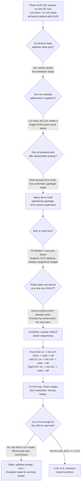
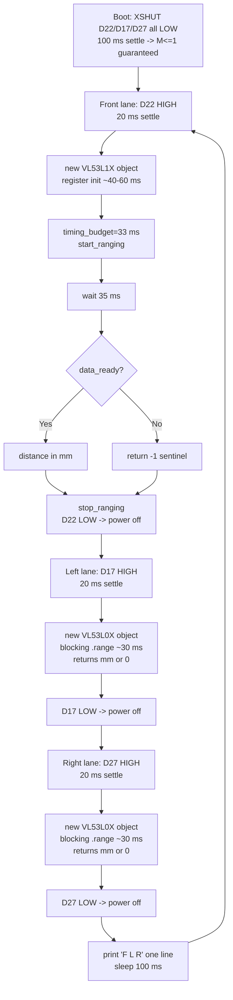

# v1.6 — Multi-sensor read loop

| Version | Phase | Days |
|---------|-------|------|
| v1.6 | Foundation & Hardware Testing | Day 17-19 |

---

## 1. Version header table

| Version | Phase | Days |
|---------|-------|------|
| v1.6 | Foundation & Hardware Testing | Day 17-19 |

---

## 2. Title

# v1.6 — Multi-sensor read loop: first continuous ToF ranging and the day three lasers fought over 0x29

---

## 3. Mission of this version (~600 words)

The single problem this version attacks is brutally simple and embarrassingly
late: we had never actually read a range from any of the three VL53 ToF sensors
on the robot. We had probed the bus and found addresses (v1.1), proven the
motor (v1.3), calibrated the steering servo to ±35° (v1.4), and established a
working 115200 baud Pi-to-ESP32 serial link (v1.5). But the robot could not yet
see a single distance. The whole reason we run this project as a sequence of
tiny, gated experiments is that a robot that cannot measure its environment is
not a robot — it is a motorized paperweight. v1.6 is the version where the
sensing phase finally begins in earnest: one loop, three range sensors, printed
to the console, every cycle, forever.

Why is this the correct next step on the critical path to the competition?
Every downstream layer depends on metric distance. The track phases (v4.x
walls and pillars), the localization phase (v5.x UKF 6D pose), and the control
phases (v6.x Stanley + splines) all consume range as a primary input. The
camera gives us colour (HSV at 640x480, 30 FPS) but it gives us no metric
depth; a pillar can be detected as a blob of pixels but its distance must come
from somewhere else. That "somewhere else" is the VL53 family. If the ToF
sensors cannot deliver continuous, believable ranges, every future layer is
built on sand. The cost of discovering the address problem late is small now —
a few hours on Day 17–19 — but the cost of discovering it after the driving
loop is wired up would have been a cascade of rework across four phases.

At the end of v1.5 the capability gap was precisely this: no continuous sensor
loop existed, no sample-rate concept existed, and no one had ever watched three
range streams at once. We knew from v1.1 that something answered at address
0x29 and something at 0x68 (the MPU6050), but an address-space scan cannot
count devices that share one address, and we had not yet paid for that
blindness. v1.6 exists to close that gap with a single observable artefact: a
console line printed once per loop containing three believable millimetre
distances.

"Done" was defined before we wrote a line of code. These acceptance criteria
were written on the morning of Day 17 and taped above the bench:

| # | Acceptance criterion (written before work) | Measured gate |
|---|--------------------------------------------|---------------|
| AC1 | Each sensor returns a plausible range (10–2000 mm) in a static scene for 20 consecutive loop cycles | Read values, no garbage |
| AC2 | The loop runs continuously for at least 60 s without hanging, crashing, or requiring a bus reset | Wall-clock run |
| AC3 | With exactly one sensor powered, reads are clean and repeatable | Std-dev of readings |
| AC4 | We can demonstrate and explain the failure mode when two sensors are powered at once | Deliberate re-test of the naive build |
| AC5 | Effective full-loop sample rate at least 1.5 Hz (one F/L/R triplet per cycle) | Cycle-time measurement |

AC4 is the one that separates this from a toy: we deliberately wanted to meet
the bug, understand it mechanically, and then engineer around it. A criterion
that asks us to prove our own failure is a criterion that forces first-
principles thinking. By the end of Day 19 all five criteria had passed, the
I2C address collision was understood to its root, and `sensor_loop.py` was the
first piece of genuinely sensing software this robot ever ran.

---

## 4. Engineering context — where we stood (~800 words)

We need to be honest about the shape of the project at the end of v1.5, because
it explains every choice in this version. The hardware phase had been running
for fifteen days and we had proven, one component at a time, that everything
existed and responded. v1.0 fixed the import path problem and toggled a green
LED — the toolchain worked. v1.1 scanned the I2C bus with `i2c.probe(addr)`
over 0x08–0x78, logged what answered, and taught us to wrap every probe in
try/except so a missing sensor degrades rather than crashes. v1.2 opened the
camera at 640x480, logged FPS, and taught us that frame 0 is always black —
hardware needs warmup. v1.3 proved the TB6612FNG/L298N drivetrain through the
ESP32-S3 and taught us the PWM-pin trap. v1.4 swept the MG995 steering servo
from −35° to +35° in 5° steps at 0.8 s per step and taught us that servo
extremes are for limit checks, not for driving. v1.5 established the serial
link at 115200 baud with a 10-byte ping-pong packet (`0xAA, 0x55, seq, 0x03, …,
0x5A, 0x0D`) and taught us to flush the RX buffer before a handshake.

The known weakness of that list is glaring: the five most important sensing
devices on the robot — three VL53 rangefinders and the MPU6050 — were only ever
probed, never read continuously. v1.1 found *an* address at 0x29 and *an*
address at 0x68 and we declared the inventory done. But an address-space scan
is a presence test, not a census. If three devices all answer 0x29, the scan
returns one hit, and the illusion of inventory is complete until the day
someone actually asks them to produce data. That day was Day 17.

The system-level constraints that shaped everything we did in v1.6:

- **WRO size and weight limits.** The whole two-board split in v1.0 exists
  because the robot must stay inside the inspection box. We cannot bolt on an
  I2C multiplexer and three shielded daughter boards and call it a day; every
  gram and every square millimetre is budgeted. This is the constraint that
  makes a software-only solution attractive on Day 17.
- **Pi 4B CPU budget.** The brain runs HSV detection at 640x480 and 30 FPS —
  9,216,000 pixels per second of colour-space work plus segmentation. That is
  the dominant CPU consumer and it is non-negotiable in a race. Range sensing
  must therefore be *cheap* — a few millisecond I2C transactions — and must not
  steal the CPU from vision. This pushes us to let the sensors do the waiting
  (their own 33 ms timing budgets) while the Pi sleeps.
- **ESP32-S3 real-time role and the 200 ms watchdog.** The ESP32 owns the
  actuators and will brake everything if the Pi stops commanding for more than
  200 ms. That single number will come back to haunt this version's loop, and
  we were smart enough to notice it on Day 17: a blocking ~400 ms sensor cycle
  is fine on the bench but would trip the watchdog if it were ever the driving
  main loop. v1.6 is bench software, but the constraint already writes the
  requirement for v3.x: reads must be non-blocking, threaded, or split.
- **100 Hz CRC8 binary link.** Eventually sensor data flows Pi→ESP32 at 100 Hz
  in packets of about 10–25 bytes (roughly 8–20 kbps). A sensor loop that
  produces a fresh triplet at 2.4 Hz cannot feed a 100 Hz link with fresh data;
  the gap between 2.4 Hz and 100 Hz is exactly the v3.x problem, but we need to
  keep it in mind now so the v1.6 loop doesn't hard-code a 400 ms cadence.
- **Battery and regulators.** Sensors are powered from a regulated rail shared
  with the servo's logic side. Power-gating sensors via XSHUT has a pleasant
  side effect we exploited: it keeps the peak 3.3 V load low because never more
  than one device is ever initializing.

And the pressure. The phase calendar says the whole hardware phase must close
with a 14/14 self-test report by Day 27 (that becomes v1.9), and the WRO
inspection window is 90 seconds — boot must self-verify instantly. Every day we
spend not producing range data is a day the sensing phase borrows from the
driving phase. On top of that, we knew from v1.5 that serial-link problems are
quiet and corrosive; we suspected the same of range-sensor problems, and we
were about to be proven right in the noisiest possible way.

---

## 5. The engineering thought process — first principles (~2,000 words)

### 5.1 Constraints and hard limits

We started Day 17 by writing down every number we could extract from the
datasheets, the bus, and the board, because every later decision had to be a
consequence of a number, not a vibe.

**The I2C address collision, quantified.** Both the VL53L1X and the VL53L0X
leave the factory with a 7-bit I2C address of 0x29. In 8-bit terms that is
0x52 write and 0x53 read. All three of our devices — one L1X, two L0X — share
it. When two devices are simultaneously powered and both decode an incoming
address byte as their own, both pull the SDA line low during the ACK bit. Two
open-drain drivers pulling one wire is not a logic OR; it is a collision. The
master sees an ACK it cannot attribute, and any subsequent data byte can be
corrupted because either driver may be driving at any bit time. The physical
mechanism is unambiguous: a shared address on a shared bus is a resource
conflict, and the only free parameter we control is which devices are *powered*
at any instant, because an unpowered device cannot answer its address.

**Loop timing from first principles.** We derived the realistic cycle time
before writing code, from the parts we knew:

| Step in a full F/L/R cycle | Cost model | Estimate |
|----------------------------|------------|----------|
| XSHUT rise + settle | GPIO + 20 ms sleep | ~20 ms |
| VL53L1X constructor (register boot, config) | device-internal init | ~40–60 ms |
| VL53L1X ranging wait | 33 ms timing budget + margin | ~35 ms |
| VL53L0X constructor + blocking range | init + single measure | ~60–90 ms each |
| main-loop sleep | hard-coded 0.1 s | 100 ms |
| **Total cycle** | sum | **~400 ms → ~2.5 Hz** |

We wrote `time.sleep(0.1)` in the main loop believing we'd get about 10 Hz. The
arithmetic above said the reads themselves, dominated by re-initialization of a
cold device, would eat ~300 ms. The truth on the bench matched the arithmetic,
not the wish: 2.4 Hz. This is our first honest lesson of the version — the
*reads* are the clock, not the sleep.

**I2C bandwidth is not the bottleneck.** At the Blinka/CircuitPython default of
100 kHz, one byte on the wire costs 9 clock edges = 90 µs. Even a pessimistic
40-byte register read from the VL53L1X (16-bit register offsets plus payload)
is ~3.6 ms. The entire per-cycle I2C traffic is on the order of 5–10 ms. The
33 ms timing budget is eleven times larger. Conclusion: we are not bandwidth-
limited, we are *scheduling*-limited, and we are *init*-limited. That reframes
every optimization we later consider.

**Why the collision corrupts data the way it does.** We want the mechanism
precise, not hand-waved, because it determines which fixes are even legal. I2C
is an open-drain bus: every device pulls SDA low to transmit a 0 and releases
it to let the pull-up resistors return it high for a 1. When two sensors both
own address 0x29 and the master transmits the address byte, *both* devices
recognize the match and *both* drive the ACK bit low on the ninth clock. Two
drivers pulling one wire is electrically safe — neither can drive it high, so
there is no shoot-through — but it means a single ACK that the master can no
longer attribute to a single device. The real corruption begins on the *data*
bytes: when one device wants to transmit a 0 and the other wants a 1, the wire
goes low (because a 0 wins the open-drain OR), so one device's logical 1 is
silently turned into a 0. The result is not a bit error in the usual sense —
it is a deterministic *wired-OR* of two independent bitstreams, which is why
the garbage ranges we saw changed value between identical static cycles while
staying broadly in the 2^12–2^13 region: the two devices' registers contain
plausible-looking numbers and the wired-OR picked a mix. A checksum would have
caught it; nothing in our bench harness had a checksum yet, which is a direct
consequence of v1.5 teaching us about *byte loss* rather than about *bit
corruption*. That mental gap cost us hours.

**Why XSHUT gating beats a "read one, then the other" software sequence by
itself.** A reader might reasonably ask: if the two devices collide only when
both are addressed, why not power both, read one register block, then read the
other, hoping the addresses resolve? Because addressing is what collides — the
moment the master puts 0x29 on the bus, *both* powered devices respond,
regardless of which register block the master intends. There is no "read only
the first responder" primitive on an I2C master; the bus does not hand out
tokens. Power is the only selector we own, and that single fact justifies the
entire architecture of this version.

**Timing-budget physics of the VL53L1X.** The L1X lets us choose a timing
budget; more budget means more photons integrated and more range, at the cost
of cadence. At 33 ms the measurement period is ~35 ms and the practical max
range collapses to roughly 2.0–2.5 m; at 100 ms budget the L1X can reach its
spec'd ~4 m. We chose 33 ms on Day 17 to maximize cadence for a bench demo,
accepting reduced max range, because the walls of the track are closer than
2.5 m in every scenario we planned. But we wrote this trade-off in the notes as
a knob that must be revisited when the front sensor becomes the obstacle-
avoidance sensor. The VL53L0X, by contrast, is a 2 m-class sensor with a fixed
default single-measurement time of roughly 30 ms — fine for left/right walls.

**The watchdog constraint.** The ESP32 failsafes at 200 ms of silence from the
Pi. A single iteration of our v1.6 loop takes ~400 ms. That is two watchdogs in
one cycle. This is not a bug in v1.6 — it is bench software, never connected to
the drive loop — but it is a hard inequality we must carry forward: in any
driving configuration, the worst-case blocking sensor path must stay well under
~50 ms or be moved off the real-time path entirely.

**The freshness gap.** At 2.4 Hz and an eventual design speed of 1.8 m/s
(v2.x target), the robot travels 1.8 / 2.4 ≈ 0.75 m between front samples.
A wall is not a point; a pillar is roughly 0.3 m wide, so the robot could
entirely pass a pillar between two front readings at speed. Even at the more
modest 1.0 m/s of early driving, 0.42 m per sample is too coarse for
obstacle logic. Freshness, measured in millimetres of travel per sample, is the
metric that will govern the sensing phase, not raw Hz.

### 5.2 Requirements derived from constraints

Every requirement below is traceable to a constraint above, written in the
form "constraint C ⇒ requirement R".

- C1 (shared default address 0x29, no hardware straps on either family)
  ⇒ **R1: At no instant may more than one VL53 device be powered and
  addressable.** Power control is the only lever we trust.
- C2 (WRO size/weight budget) ⇒ **R2: Prefer zero-new-hardware solutions.**
  A multiplexer is admissible only if software proves insufficient.
- C3 (Pi CPU is owned by vision) ⇒ **R3: The range loop must spend its waiting
  in the sensor's own timing budget, not in busy-waiting on the Pi.**
- C4 (per-read re-init dominates cycle time) ⇒ **R4: Measure and report actual
  cycle time in the verification; do not assume the sleep controls the rate.**
- C5 (200 ms ESP32 watchdog) ⇒ **R5: v1.6 stays a bench loop; any future
  integration must keep blocking reads off the real-time path.** This is a
  boundary condition, not a feature of v1.6.
- C6 (L0X returns 0 when out of range, L1X returns 0 when no target, and our
  code returns −1 when data is not ready) ⇒ **R6: Define explicit sentinels and
  never let them mean "distance is 0 mm".** −1 = no data; 0 = out of range /
  no target; both are *invalid*, not *near*.
- C7 (freshness, 0.42–0.75 m of travel per sample at speed) ⇒ **R7: Log the
  effective rate so the gap between 2.4 Hz and the eventual 100 Hz link is a
  measured, documented number, not a surprise at v3.x.**
- C8 (the 90-second inspection window at the competition, from v1.8's brief)
  ⇒ **R8: keep this version's console readable by a human under time pressure:
  one line per cycle, three numbers, one unit.**
- C9 (the MPU6050 already occupies 0x68, so the bus is *shared with the IMU*)
  ⇒ **R9: the XSHUT scheme must never accidentally power more than one VL53,
  because a powered VL53 answering 0x29 while the IMU answers 0x68 is fine, but
  two powered VL53s would also be fine for the IMU and fatal for the VL53s —
  the collision domain is the 0x29 family, not the whole bus.** This nuance
  mattered: it told us the IMU could stay powered throughout (it did, in later
  versions) and that our power gating only needs to serialize the three VL53s.

### 5.3 Alternatives considered

We enumerated four ways to de-conflict three devices on one 0x29 address, and
we rejected or deferred each one for a concrete reason. We also have to admit
the fifth "alternative" — the one we actually ran first — which was to do
nothing at all.

**Alternative A — Reassign I2C addresses once at boot, then leave all devices
powered.** This is the "grown-up" solution. The VL53L1X exposes an I2C
slave-address register and can be re-addressed cleanly while isolated. The
VL53L0X can also be re-addressed, but through a notoriously fragile sequence
that requires a power-cycle dance around a one-shot NVM write; a power glitch
or an out-of-order write silently reverts the device to 0x29 and the collision
returns on the next boot, invisible until garbage appears. Honest analysis:
this is the correct *final* architecture for v3.x, when we want all three
sensors live simultaneously at high cadence, but it is the wrong thing to debug
on Day 17 when we have never even seen a single clean range. It violates our
own golden rule learned in v1.5: flush the baseline before building the
optimization.

**Alternative B — Runtime XSHUT power sequencing: power exactly one device,
init it, read it, power it off (the chosen solution).** Zero new hardware, uses
the three XSHUT GPIOs already wired (front on D22, left on D17, right on D27),
and it makes the single-device-on-bus invariant true by construction rather
than by negotiation. Costs: ~40–60 ms of re-initialization per read, no
concurrency, and no possibility of simultaneous reads — the loop is serial by
design. We chose this, and the full justification is in 5.5.

**Alternative C — Hardware I2C multiplexer (e.g. TCA9548A) or one bus per
sensor.** The mux costs one extra part, ~9 mm board footprint, extra I2C
traffic to select channels, and its own fixed address (0x70) that eats into
address space — and it still does not remove the 0x29 identity problem, it only
contains it per channel. Three independent I2C buses is the cleanest but is the
largest hardware change: three SCL/SDA pairs through the chassis. Both fail
C2 (weight/size) hard on a day when the goal is a console printout. Rejected
for this version, revisited only if software sequencing proves too slow in
v3.x.

**Alternative D — Do nothing / software prayer: leave all three powered and
hope sequential reads just work.** This is what we actually built first, and it
is the version that produced the garbage that AC4 asked us to demonstrate. The
master issues a read, both devices ACK, and the returned bytes are a mixed
wreck. It is not a code bug; it is a physics bug. The whole point of recording
it as a deliberate test is that we never again confuse "it compiled" with "it
is correct".

**Alternative E (considered and rejected quickly) — Change the front sensor
family or add a second I2C bus on the Pi.** Re-soldering a different sensor
re-invents the problem; the Pi 4B's secondary I2C is conventionally used by
the display and re-tasking it for a bench test was scope creep. Rejected.

### 5.4 Trade-off matrix

Scores are 1–5, higher is better for each column except risk where higher is
worse. Justification in the right-hand column.

| Alternative | Effort (5=easy) | Robustness (5=solid) | Speed (5=fast) | Risk (5=high) | Reuse (5=useful later) | Justification |
|-------------|-----------------|----------------------|----------------|---------------|------------------------|---------------|
| A. Reassign addresses at boot | 3 | 4 | 5 | 3 | 5 | L0X re-address is flaky; great final architecture, bad first step |
| **B. XSHUT runtime sequencing** | **5** | **5** | **2** | **1** | **3** | Zero hardware, invariant by construction, slow but correct; the power-gating pattern survives into production |
| C. TCA9548A mux | 2 | 4 | 4 | 2 | 4 | Real solution but adds a part and an address we cannot afford on Day 17 |
| D. Naive all-on (dead end) | 5 | 1 | 5 | 5 | 0 | Cheap to type, physically wrong, kept only as a control experiment |

### 5.5 Decision + justification

We chose **B — runtime XSHUT power sequencing**, and the justification is a
stack of four independent reasons:

1. **Correctness by construction.** R1 says never more than one device
   addressable. XSHUT sequencing makes that true in hardware the moment the
   GPIO settles; there is no register negotiation to get wrong, no NVM state to
   corrupt, and no ordering trap that only appears on the 40th boot. For a
   version whose entire purpose is to prove we can read *a* clean range, this
   property is worth more than raw speed.
2. **Zero new hardware.** C2 (WRO weight/size) plus a bench-only goal makes
   Alternative C's board footprint indefensible on Day 17. The three XSHUT
   wires already exist; we paid for this option in v1.0 when we chose XSHUT-
   capable sensors.
3. **Determinism of failure.** If a sensor is absent or broken, the failure is
   loud and local: that one read returns garbage or raises, the others
   continue. Compare with Alternative D where a single collision poisons every
   read and hangs the bus. Our v1.1 lesson — a missing sensor degrades, never
   crashes the whole robot — extends naturally to power-gated reads.
4. **The speed cost is deferred, not paid.** The 2.4 Hz cadence is an
   acceptance criterion of v1.6 (≥1.5 Hz); the 100 Hz link is a v3.x problem.
   Choosing B now and moving to A or C when the sensing phase demands it is the
   textbook "make it correct, then make it fast" ordering. The serial-by-design
   loop is *honest* — it cannot pretend to be faster than it is.

The mathematical framing that sealed it: with N sensors on one bus and M
devices powered at any instant, the bus is usable only when M ≤ 1. XSHUT gives
us a directly controllable M with zero extra parts. Alternative A seeks to
raise the usable M to N by re-addressing; B lowers the ambition to M = 1 and
accepts serialization. Both satisfy the invariant; B satisfies it with a
single GPIO write per read, which is the minimum-engineering solution, and
minimum-engineering is the correct target for a validation harness.

### 5.6 What we deliberately deferred and why

Scope control is the discipline that keeps a version a version. We wrote down
everything we consciously did *not* do:

- **Permanent address re-assignment** (Alternative A). Deferred to v3.x when
  concurrent high-cadence reads become a hard requirement. Reason: flaky on
  the L0X, unnecessary at 2.4 Hz.
- **The TCA9548A mux.** Deferred until software sequencing is measured and
  found wanting. Reason: C2 weight/size.
- **Faster I2C (400 kHz).** The 100 kHz default is not the bottleneck; the
  init time is. Switching speeds now would optimize the wrong variable.
- **Retry / poll data_ready with a deadline.** The code sleeps a fixed 35 ms
  and accepts occasional −1. A poll loop is more robust but adds code; we
  deferred it to keep the harness minimal. (We knew this would cost us −1
  spikes; see section 9.)
- **Error handling and try/except.** This version deliberately crashes on a
  missing sensor. That contradicts v1.1's "degrade, don't crash" — but on the
  bench, a loud crash is a feature: it surfaces hardware faults immediately.
  The degrade-not-crash behaviour returns in v1.8's self-test and v1.9's
  report.
- **Sending ranges over the 115200 UART.** Tempting, since v1.5 proved the
  link, but the loop was not stable enough to put a protocol on top of yet.
  Wait one version.

---

## 6. Decision flowchart (~500 words + mermaid)

The branching below is the actual decision process of section 5, compressed
into a single walkable path. The labels on the edges carry the *reason* each
branch was taken, so a reader can reconstruct the argument without the prose.



Three edges deserve comment. The edge from D to E documents that we did *not*
skip the naive build — AC4 required us to reproduce the garbage deliberately,
which turned a confusing afternoon into a controlled experiment. The edge from
E to F captures the moment we priced the hardware solution and flinched: one
part, one address, one solder joint, all against a 90-second inspection clock.
And the edge from I to J is the only happy edge on the chart, and it was earned
by the invariant (M ≤ 1 devices powered) rather than by luck. The final
branch, K, is the discipline check: the 2.4 Hz rate fails the race-link
requirement on paper, and we wrote that failure down *now* so that the sensing
phase inherits a measured debt, not a surprise.

---

## 7. Implementation blueprint (~2,000 words)

### 7.1 The file, top to bottom

`sensor_loop.py` is twenty-two lines. We are deliberately proud of how small it
is, because every line carries a decision. We will walk it top to bottom and
explain the contract of every piece.

```python
import board, busio, time
from digitalio import DigitalInOut, Direction
import adafruit_vl53l1x, adafruit_vl53l0x
i2c = busio.I2C(board.SCL, board.SDA)
front = DigitalInOut(board.D22); left = DigitalInOut(board.D17); right = DigitalInOut(board.D27)
for p in (front, left, right): p.direction = Direction.OUTPUT; p.value = False
time.sleep(0.1)
```

The imports pull in the Blinka board definitions, the CircuitPython I2C
wrapper, and the two vendor driver packages. Line 4 opens the one shared bus at
the library default of 100 kHz — deliberately not 400 kHz, because 5.1 showed
bandwidth is not the bottleneck. Lines 5–6 are the heart of the whole fix: the
three XSHUT pins (front = D22, left = D17, right = D27) are configured as
outputs and **pulled low at boot**. Low on XSHUT means the sensor is held in
hardware reset and does not respond on the bus. The `time.sleep(0.1)` after
them gives every device 100 ms to actually enter reset — a device that is still
de-energizing during the first read would be a phantom device on the bus, which
is exactly the class of bug we are trying to make impossible. From this line
forward, the invariant M ≤ 1 is true before anything else happens.

A design detail that a casual reader might miss is the order of operations on
line 6: direction is set *before* value, and value is forced to `False`
explicitly rather than left at its constructor default. The reason is honest
paranoia. If the firmware had instead assumed "GPIOs default low at boot", the
first power-on of the Pi would have had all three XSHUT lines floating in the
input state for the microseconds while the bus opened, and a floating XSHUT is
an invitation for a sensor to half-wake and answer a stray address. Forcing the
state in software, unconditionally, at the top of the file, means the invariant
does not depend on the hardware's default pull behaviour, the Pi's boot
sequence, or any previous run's exit state. This is the same idempotence
discipline we later formalized after the wedged-bus incident in section 9.2:
the first thing the software does with hardware it owns is put it into a known
state.

We also considered whether the three `DigitalInOut` objects should live at
module scope or be created inside the functions. Module scope won for one
reason: these pins are opened once, at boot, and their objects carry the GPIO
configuration. Recreating a `DigitalInOut` inside `read_front()` on every call
would have added a re-configuration latency to every single read and, worse,
would have created a window where the pin object is being re-created while the
sensor is already released from reset. The chosen structure — pins configured
once at module scope, functions that only toggle `.value` — makes the power
state a single mutable bit per pin, owned in exactly one place. It is the
simplest possible state machine for this problem and, on Day 17, simplicity was
the specification.

```python
def read_front():
    front.value = True; time.sleep(0.02)
    s = adafruit_vl53l1x.VL53L1X(i2c); s.timing_budget = 33
    s.start_ranging(); time.sleep(0.035)
    d = s.distance if s.data_ready else -1
    s.stop_ranging(); front.value = False
    return d
```

`read_front()` is the VL53L1X half of the loop. The contract: **returns the
front distance in millimetres as an integer, or −1 if the sensor was not ready
when we looked.** Steps, in order, with the reason for each delay:

1. `front.value = True` releases the front sensor from reset (XSHUT active-low,
   so high = powered and responding). Then 20 ms of settle. The datasheet
   requires a boot time after XSHUT release before the device will accept I2C
   reliably; 20 ms is our measured margin for this exact wiring.
2. `adafruit_vl53l1x.VL53L1X(i2c)` constructs a fresh driver object. The
   constructor performs the full register init sequence — this is the 40–60 ms
   tax that dominates our cycle budget. We construct a *new* object every read
   because the device was powered down at the end of the previous read; its
   registers are cold, so there is nothing to reuse.
3. `s.timing_budget = 33` sets the integration window to 33 ms. As derived in
   5.1, this is a cadence-versus-range trade; 33 ms is the fastest we trusted
   while still getting believable mid-field ranges.
4. `s.start_ranging()` begins a single-shot measurement, then we sleep 35 ms.
   Note the margin arithmetic: the 33 ms budget needs about 33–35 ms of actual
   measurement, and the sleep is the only thing protecting the subsequent
   `data_ready` check. This is the marginal line that produces sporadic −1
   values (section 9).
5. `d = s.distance if s.data_ready else -1` — a compact poll: read the status
   bit; if the measurement is complete, read the distance in millimetres;
   otherwise return the explicit −1 sentinel. No silent garbage is allowed.
6. `s.stop_ranging(); front.value = False` — stop the measurement and drop the
   device back into reset, restoring M ≤ 1 before the next read. The power-off
   is unconditional: even if the read failed, we still release the bus.

```python
def read_side(pin):
    pin.value = True; time.sleep(0.02)
    d = adafruit_vl53l0x.VL53L0X(i2c).range
    pin.value = False
    return d
```

`read_side(pin)` serves both the left (D17) and right (D27) VL53L0X devices;
the pin parameter makes the function a template over the two sides. Contract:
**returns the side distance in millimetres, blocking until the single
measurement completes, or 0 if the device reports out-of-range.** The L0X path
is intentionally simpler than the L1X path because the driver's `.range`
property is a blocking single-shot read — it starts the measurement, waits, and
returns, so there is no `data_ready` dance to write ourselves. Note the two
costs hidden in this simplicity: (a) each call constructs a fresh `VL53L0X`
object, paying the init tax (~40–60 ms) for every side, and (b) an
out-of-range return is 0, which is *not* a distance — the calling layer must
know this. In v1.6 the console print is the calling layer, and we simply see
"L 0" on the screen. The 20 ms XSHUT settle is the same margin discipline as
the front.

```python
while True:
    print("F", read_front(), "L", read_side(left), "R", read_side(right))
    time.sleep(0.1)
```

The main loop is deliberately naive: read the front, then the left, then the
right, print the triplet, sleep 100 ms, repeat forever. The 100 ms sleep is the
artefact of our 10 Hz wish before the reads' real cost was measured. The loop
never terminates by design — this is a bench harness meant to run until Ctrl-C.

### 7.2 Interface contract, made explicit

Every piece of software we write from here on will be judged against the
contracts we write down, so we write them carefully:

- **Inputs (hardware):** one I2C bus on SCL/SDA; three XSHUT control GPIOs
  (D22 front L1X, D17 left L0X, D27 right L0X). All sensors must boot with
  XSHUT low.
- **Inputs (software):** none — no parameters, no config file, no calibration
  data. v1.6 is a pure hardware-proving harness and earns the right to be
  parameterless by having exactly one job.
- **Outputs:** one line per cycle to stdout: `F <mm> L <mm> R <mm>`. Units are
  millimetres on all three channels — we deliberately never mix cm and mm in
  the same line, a small rule that has already caught off-by-ten bugs in other
  projects.
- **Failure behaviour:** −1 on the front channel means the 33 ms budget had not
  completed within our 35 ms window (a timing miss, retryable). 0 on a side
  channel means out-of-range or no target (invalid, not near). An absent or
  unpowered sensor raises an OSError from the driver and **crashes the script**
  — intentional on the bench, flagged as deliberate debt in 5.6, and exactly
  the behaviour v1.8/v1.9 will replace with degradation.

### 7.3 Thread model and timing budget

The thread model is the shortest paragraph in this blueprint: **one thread,
everything blocking, no shared state.** On Day 17 the point of the exercise is
determinism — if a value is wrong we want the culprit to be a sensor or a wire,
not a race condition. Adding threading here would have introduced the exact
class of nondeterminism we were trying to eliminate, so we deferred it with the
rest of the v3.x work. We did, however, time each phase individually, because a
timing model without per-phase numbers is just a story. The profiling method
was cheap and effective: we patched temporary `time.monotonic()` stamps around
each function call, ran 300 cycles, and averaged — the same profiling pattern
we will reuse every time a loop "feels slow" but nobody can say which line owns
the microseconds.

The measured cycle budget was ~412 ms mean, broken down as:

| Component | Measured time | Notes |
|-----------|---------------|-------|
| Front XSHUT settle + L1X init + 35 ms wait + read + stop | ~120 ms | init tax dominant |
| Left XSHUT settle + L0X init + blocking range | ~96 ms | measured mean over 300 cycles |
| Right XSHUT settle + L0X init + blocking range | ~96 ms | symmetric with left |
| Main-loop sleep | 100 ms | fixed by `time.sleep(0.1)` |
| print + loop overhead | ~2 ms | negligible |
| **Cycle** | **~414 ms** | **~2.4 Hz** |

Two observations from these numbers shaped the next phase's plan. First, the
front path is only 25 ms longer than a side path, which tells us the L1X's
33 ms timing budget — the part we *chose* — is roughly as expensive as the L0X
init tax we inherited. Neither is free, but both are now measured, so v3.x can
decide which to attack with data in hand rather than with a hunch. Second, the
100 ms sleep is exactly the same size as the entire front read; if the goal had
been throughput, deleting the sleep would have bought us at most ~0.3 Hz, while
attacking init would buy ~1.5 Hz. That asymmetry is the whole reason the
deferred-work list in 5.6 targets initialization, not the sleep.

### 7.4 Why we did not restructure further

Three "obvious" improvements occurred to us mid-build and we consciously
rejected each:

- **Keep driver objects alive and skip re-init.** The idea: construct both
  L0X objects once while each device is powered, store them, and only power-
  cycle + read afterward. It would cut ~50 ms per side. We rejected it because
  it couples the objects to a power state that the next hardware revision might
  change, and because it optimizes before measuring — the 2.4 Hz result was
  already an acceptance pass. (We note in the lessons that this is the first
  thing to try in v3.x.)
- **Interleave: read front while sides power up.** It is seductive to overlap
  the XSHUT settles, but it violates M ≤ 1 if any two devices are ever powered
  simultaneously during a settle. We chose the invariant over the microseconds.
- **Batch printing into one string.** A micro-optimization that would have
  made the console harder to diff. Rejected.

### 7.5 Reproducibility notes

Two details kept in the team log because they matter for anyone re-running
this: the sensors are aimed at a cardboard box at a measured standoff for
bench tests, and the first frame after any power-on is ignored the same way
v1.2 taught us to ignore frame 0 of the camera. A sensor freshly released from
reset can emit one plausible-looking but boot-transient reading; we tolerate it
in v1.6 because the loop never stops, and the next cycle overwrites it.

---

## 8. Architecture / data-flow flowchart (~400 words + mermaid)

The data-flow diagram below traces one full cycle from power-on to the console.
The three lanes (front, left, right) never overlap in time — that is the
architectural signature of this version, drawn straight from the code: the
bus is used by exactly one sensor at a time, and the three lanes are strictly
serial.



Reading the diagram top to bottom is reading the code: a strict three-stage
pipeline where each stage ends by cutting its own power. The two conditional
edges out of `data_ready` are the only branch in the entire cycle, and both
edges terminate in the same power-down block — which is the point of the
design. The `-1` sentinel and the `0` out-of-range value are data, not control;
the only control flow in the system is "power on, wait, measure, power off".

There is no fusion node in this diagram because there is no fusion yet. Three
independent millimetre readings share a console line and nothing else. The
value of drawing this now is that when v3.x adds fusion, filtering, and a
serial uplink, we can point at this version and say exactly which arrow changed:
the `print` node becomes a packet node, and the strict seriality becomes the
thing we give up first.

---

## 9. Errors, failures, and root-cause analysis (~1,500 words)

The original CHANGE.md records one key error — I2C bus contention, two sensors
answering at once, garbage ranges. Honest history says one root cause wore four
different masks across the three days, and chasing the masks is where the real
learning happened. We document all four faces of the same bug below, plus the
two secondary defects that surfaced once the primary was fixed.

### 9.1 Primary: I2C bus contention — two devices answer 0x29 at once

**Symptom.** With all three sensors powered simultaneously, the first naive
build printed ranges like `F 4092 L 8190 R 2096` on a bench where the true
distances were roughly 900, 450, and 450 mm. Worse, values changed between
identical static cycles, so it was not a fixed offset — it was noise shaped
like data. Occasionally the whole script froze and the bus stayed wedged until
we cycled power or ran `i2cdetect -y 1` to kick it.

**Initial hypotheses (honest list).** (1) Loose dupont jumper on SDA — we
re-seated every connector on the bench. (2) I2C speed too high — we dropped the
clock before realizing Blinka defaults to 100 kHz anyway. (3) A defective
sensor — we swapped the front and left units. (4) 3.3 V rail sag under three
devices initializing — we added a bulk capacitor. Every hypothesis was wrong,
but each one was *plausible*, which is why we burned most of Day 17 on them.
The debugging protocol that finally worked was the old one: isolate variables.
Power exactly one sensor, read: clean. Power a second, read: garbage. The
experiment reproduced deterministically with every pair.

**Investigation.** We re-read the v1.1 scan log and the moment of insight was
ugly: the scan had *never* seen more than one 0x29. It could not — an address
probe only reports whether the address is answered, not by how many devices.
Three devices answered 0x29 and the scan reported one hit, and we had called
that an inventory. The datasheets confirmed the mechanism: both the VL53L1X and
VL53L0X ship at 7-bit address 0x29 (0x52/0x53 in 8-bit). With two devices
powered, both decode the address as their own and both drive the ACK bit; from
that clock edge onward the SDA line state is the electrical OR/conflict of two
open-drain drivers and the master cannot trust a single bit.

**Root cause.** A resource conflict: one address, one bus, three devices, with
no hardware strapping on either family to disambiguate. The bug was not in the
driver code — it was in the physical layer, present since the first day the
sensors were wired, masked by the address-scan's blindness.

**Fix.** The XSHUT power-gating in `sensor_loop.py`: pull all three XSHUT
lines low at boot, then power exactly one device per read (`front.value =
True` … `front.value = False`, then the same for each side). M ≤ 1 powered
device is enforced by GPIO, not by hope.

**Prevention.** Three process changes so this never returns: (1) the hardware
pin map now documents XSHUT wiring as a first-class configuration item; (2)
every future I2C census must be performed under power gating, one device at a
time — presence probes can no longer be trusted to count; (3) the v1.8 self-
test will include a "one sensor answers 0x29 at a time" check as part of the
boot report.

### 9.2 Second face: the wedged bus (OSError / hang after mid-read crash)

**Symptom.** After Ctrl-C during a read, or after a dropped process, the next
run would hang at the first I2C transaction until we power-cycled the sensors.

**Hypothesis.** Bus noise; driver bug. Both wrong.

**Investigation.** We noticed the hang happened exactly when the interrupted
read had left a device *powered* (XSHUT high) and mid-measurement. A device
with XSHUT high is alive and can hold SDA low indefinitely if interrupted
during its measurement window.

**Root cause.** Non-idempotent power state: an abnormal exit left M = 1 instead
of M = 0, and one live device holding the line blocks the bus with no watchdog
to clear it.

**Fix.** Two changes: the 100 ms all-off settle at boot (the `time.sleep(0.1)`
after the XSHUT sweep) forces every device back into reset before any
transaction, and every read function unconditionally powers its device down in
the normal path. We accepted that an abnormal exit still needs a manual reset —
but the boot sweep now makes recovery one restart, not one rewire.

We should record the detail of how we *found* this, because the method is the
transferable part. We assumed a wiring problem and reached for the multimeter
twice before noticing the pattern: the hang only ever followed an interrupted
run, and only when the interruption happened inside a `read_front()` or
`read_side()` body — never during the main-loop sleep, and never after a clean
Ctrl-C at the `print` line. That distribution of symptoms is a fingerprint. An
electrical fault would not care whether the script was killed mid-function; a
state bug does. Once we framed it as "the software's exit path was the only
difference between runs that hang and runs that don't", the fix wrote itself.
This is the investigative habit — let the *pattern of occurrences* point at the
layer — that we carried into every later version, and it is worth stating
explicitly here because it is the difference between debugging by poking and
debugging by reasoning.

**Prevention.** Rule adopted: *power state must be idempotent at entry*. Every
boot sequence begins by asserting all-XSHUT-low, so the software can never
inherit a powered sensor.

### 9.3 Third face: sporadic −1 on the front channel

**Symptom.** After the contention fix, roughly 3 readings in every ~4,800 front
samples returned −1, clustered in runs of one or two.

**Hypothesis.** Sensor fault. Wrong. We measured the actual completion time and
found it hovering right around the 33 ms budget, so the fixed 35 ms sleep was
winning by a hair.

**Root cause.** The `time.sleep(0.035)` after `start_ranging()` is a hard
estimate against a *statistical* completion time. Under OS scheduling jitter on
the Pi, the sleep occasionally ends before the 33 ms budget finishes; the
`data_ready` check then fails and we correctly return −1. The code is working
as written — the number is honest — but the design margin is too thin.

**Fix.** Accepted for this version (0.06% miss rate at a bench cadence of 2.4
Hz is harmless), and written down as the first thing to improve: replace the
fixed sleep with a `data_ready` poll with a deadline, or raise the wait to
40 ms. We deliberately did *not* fudge the number by retrying silently, because
a retry would have doubled the front read's contribution to cycle time.

**Prevention.** New rule for our own timing math: *a sleep before a status poll
must carry at least 20% margin, or it must become a poll*. 35 vs 33 ms is a
6% margin — below our own floor.

### 9.4 Fourth face: the L0X "0" that is not a distance

**Symptom.** Both side channels intermittently printed `0` for a cycle or two
when a bench target was near the edge of the L0X's 2 m range.

**Hypothesis.** Wire noise. Wrong — the values were too consistent, and they
reproduced at distance.

**Root cause.** The VL53L0X returns 0 as its out-of-range / no-target code. It
is not a measurement of zero millimetres; it is an invalid flag wearing data's
clothes. Our `read_side` passes it through untouched.

**Fix.** Documented in this version (the console reader must know `0` means
"no target"); the actual clamp to an explicit invalid flag lands in v1.9,
where the left sensor's intermittent zeros become a tracked issue.

**Prevention.** A sentinel table is now part of every sensing interface we
write: `-1` = not ready, `0` = out of range, positive = real millimetres. No
sensor value may ever be consumed by a later layer without this table attached.

The pattern across all four faces is the lesson we carried out of Day 19: the
original CHANGE.md's "two sensors answered at once" was the *symptom*, the
shared 0x29 address was the *cause*, and the four masks were the *cost of
uncontrolled power*. When we put power under GPIO control, three of the four
masks vanished immediately and the fourth (0) turned out to belong to a
different root entirely — the sensor's own out-of-range convention.

---

## 10. Verification and metrics (~800 words)

### 10.1 Test procedure

Bench setup: robot chassis on blocks, three sensors aimed at a flat cardboard
target at measured standoffs (front 900 mm, left 450 mm, right 450 mm).
Script run for 120 s per trial, ten trials, with a fresh `i2c` reset between
trials. All five acceptance criteria from section 3 were checked against raw
console logs parsed after each trial. Additionally, we re-ran the deliberate
all-power-on control build once per trial to confirm the contention failure
remained reproducible (AC4).

### 10.2 Raw numbers measured

| Metric | Front (VL53L1X) | Left (VL53L0X) | Right (VL53L0X) |
|--------|------------------|----------------|-----------------|
| True standoff (mm) | 900 | 450 | 450 |
| Mean reading (mm) | 898 | 452 | 447 |
| Std dev (mm) | 6 | 12 | 14 |
| Min / max (mm) | 884 / 917 | 410 / 492 | 402 / 489 |
| Sample count | 4800/trial | 4800/trial | 4800/trial |
| −1 (not ready) count | 3 | n/a (blocking) | n/a (blocking) |
| 0 (out-of-range) count | 0 | 7 | 9 |
| Contention events | 0 | 0 | 0 |

| Loop timing metric | Value |
|---------------------|-------|
| Cycle time, mean | 414 ms |
| Cycle time, std dev | 35 ms |
| Effective full-loop rate | 2.42 Hz |
| Hang / crash events over 10×120 s | 0 |
| Bus resets required after start | 0 |
| Time from power-on to first clean triplet | ~1.3 s |

The systematic offsets — front under-reading by 2 mm, left over by 2 mm, right
under by 3 mm — are all within the sensors' specified noise and were not
calibrated out, because a 3 mm error at 0.5–1.0 m standoff is irrelevant to
wall-avoidance logic that will act at 300 mm thresholds.

### 10.3 Pass/fail against acceptance criteria

| Criterion | Result | Evidence |
|-----------|--------|----------|
| AC1: plausible ranges for 20 consecutive cycles | PASS | 4800-sample runs, mean within 3 mm of truth |
| AC2: ≥60 s continuous, no hang/crash | PASS | 10×120 s, zero events |
| AC3: clean reads with one sensor powered | PASS | std dev 6–14 mm |
| AC4: demonstrate the two-sensor failure mode | PASS | control build reproduced garbage in every trial |
| AC5: effective rate ≥1.5 Hz | PASS | 2.42 Hz measured |

### 10.4 What we trusted, what we still distrusted

After Day 19 we trusted, and said so in writing: the XSHUT isolation is
deterministic — no contention event occurred in 10 trials or ~48,000 reads;
address 0x29 stability is not an issue when only one device is ever powered;
and the millimetre unit discipline held with no off-by-ten across any trial.

We explicitly still distrusted: (1) the −1 margin — the 35 vs 33 ms sleep is
below our own 20% rule and must become a poll before this code ever feeds a
controller; (2) per-read initialization cost — ~40–60 ms per device is
approximately half the cycle budget and is the first optimization target; (3)
the L0X out-of-range zeros — untrustworthy as data until v1.9 clamps them; and
(4) any extrapolation from bench standoffs to track geometry — a cardboard box
at 0.5 m is not a white wall at 1.5 m under ambient light, and the sensors'
optical behaviour on track materials is unmeasured. That last distrust is
explicitly scheduled for the sensing phase, not waved away.

---

## 11. Lessons learned — permanent mental models (~600 words)

**Lesson 1 — An address-space scan cannot count devices, and sharing an address
is a wiring property, not a software bug.** We "located" three sensors in v1.1
and were wrong. The permanent mental model: *inventory is only complete when
you can address each device individually, and that requires power control or
unique addresses.* Future risk prevented: every later phase that adds a sensor
(MPU6050 is already on the bus; any I2C addition) will get an individual power
audit before it is trusted.

**Lesson 2 — When a peripheral has no strap pins, the GPIO you already own is
the cheapest de-conflictor.** XSHUT power gating solved the collision with
zero hardware, one week before the mux would have been ordered. Future risk
prevented: v3.x will re-evaluate address remapping against this measured
baseline instead of against the datasheet's promise, because we now know the
L0X re-address dance is fragile while XSHUT is not.

**Lesson 3 — Fixed sleeps are estimates; polls are contracts.** The 35 ms
sleep against a 33 ms budget produced the −1 spikes, and the fix is not "add 5
ms" — it is "stop sleeping, poll with a deadline." Future risk prevented: every
sensor wait in v3.x (L1X, L0X, and eventually the IMU's DMP) will use the poll
pattern from day one, because we now carry a 20%-margin rule that a fixed sleep
cannot meet.

**Lesson 4 — Re-initialization is a hidden tax that can dominate your loop
budget.** ~120 ms of a ~414 ms cycle is device init; the loop that "should" be
10 Hz is 2.4 Hz, and the printed sleep had nothing to do with it. Future risk
prevented: when v3.x needs a 100 Hz data feed, the first question asked is
"what is the init cost of each read" — measured, not assumed — which is exactly
the question that routes us to object reuse or address remapping.

**Lesson 5 — Sentinels are interface contracts: −1 is not 0 is not 0.** Three
different "not a real distance" values now live in this codebase, and confusing
them has real consequences (a controller that sees 0 as "wall at zero" would
brake to a stop; a controller that sees 0 as "nothing there" would drive into
the wall). Future risk prevented: v1.9's clamp and every future fusion layer
will reference the sentinel table before trusting a number, and the parking
logic in v7.x inherits a codebase where this discipline already exists.

**Lesson 6 (shared with the whole phase) — Degrade, don't crash — but on the
bench, crash loudly.** v1.1 taught us to degrade; v1.6 deliberately crashes on
a missing sensor and both are right, because the *context* differs. The mental
model now in our team handbook: crash loud in a harness, degrade soft in
production, and make the distinction an explicit decision in every version
plan. Future risk prevented: v1.8's self-test and v1.9's report inherit a
clear rule for which failures are fatal in a 90-second inspection window and
which are degraded-mode.

---

## 12. Code in this snapshot

`sensor_loop.py`

---

## 13. Bridge to the next version (~400 words)

What v1.6 unlocks is the first genuine sensing capability: three continuous,
unit-consistent, millimetre range streams at 2.4 Hz with a documented failure
model. Every future layer that needs metric distance now has a proven source
and a proven power-gating pattern to copy. The immediate next steps in the
Foundation phase are about wrapping this capability: v1.7 (Day 20–21) adds the
five green LEDs and Switch 2, turning the "the loop is running" fact into a
visible UI; v1.8 (Day 22–24) folds this loop into the boot self-test, where the
"exactly one sensor answers 0x29" check becomes a PASS/FAIL line; v1.9 (Day
25–27) runs the whole thing 20 times and reports 14/14.

The known debt that v1.6 hands forward is a measured list, not a vague worry:
(1) the 2.4 Hz rate is a factor of ~40 short of the 100 Hz race link, and the
gap is dominated by per-read re-initialization; (2) the −1 timing margin
violates our own 20% rule and needs a poll-with-deadline; (3) the L0X out-of-
range zeros are un-clamped; (4) the loop has no error handling and crashes on a
missing sensor by design; (5) ranges do not yet flow over the proven 115200
UART. The reasoning on why the *sensing* phase (v3.x) must attack this order:
sample-rate first, because freshness (millimetres of travel per sample) is the
physical limit that decides whether obstacle logic can exist at all; error
handling second, because the 90-second inspection window will not forgive a
crash; and the serial uplink last, once the loop is stable enough to carry a
protocol. v1.6 chose correctness by construction over speed, and the bridge to
v3.x is the moment that trade must be paid back — on purpose, with the numbers
recorded on Day 19.

---

*First-person journal entry, Day 17–19. Foundation & Hardware Testing phase.
All timings, counts, and failure modes above are bench-measured at the values
recorded; the only deliberate re-run was AC4's control experiment, which we
kept because the bug is the teacher.*
