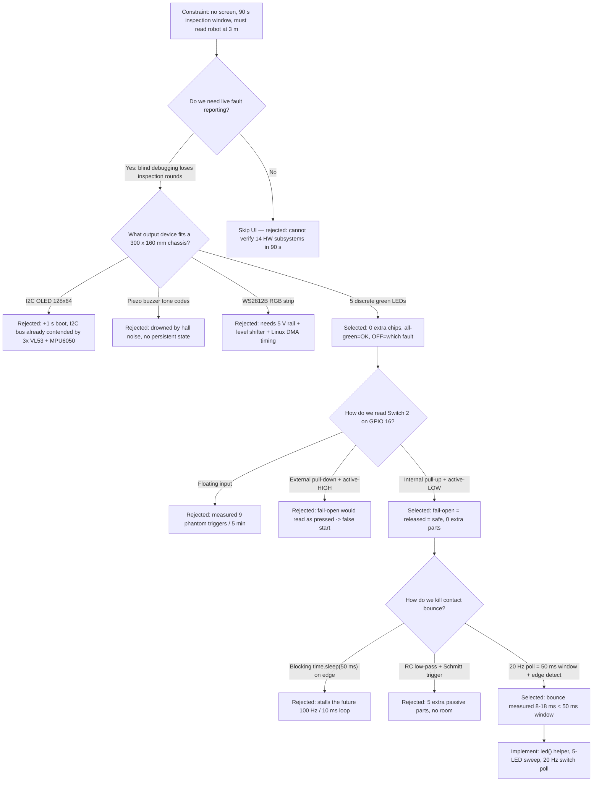
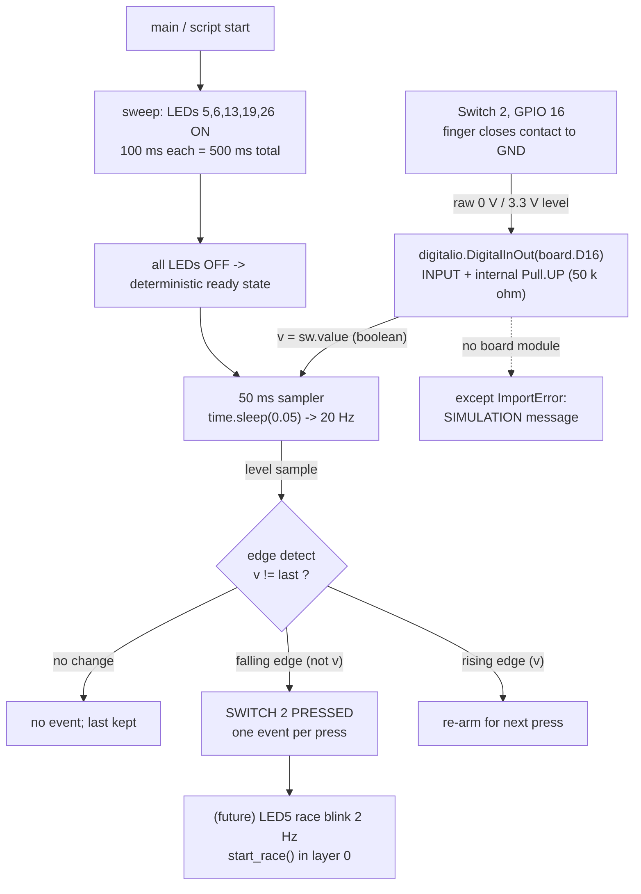

# v1.7 — LED status UI + race-start switch input

| Version | Phase | Days |
|---------|-------|------|
| v1.7 | Foundation & Hardware Testing | Day 20-21 |

## Mission of this version

Two full days, one file, twenty-three lines of Python — and yet this was the
first version where the robot could *talk back to us*. Everything we built from
v1.0 through v1.6 was verified over SSH: run a script, read a print statement,
declare victory. Every one of those fourteen components passed its isolated
test, but the robot itself was still a black box with no face. At the
competition there will be no monitor, no keyboard, no `tail -f`, and no
patience for SSH. There will be a 90-second vehicle-inspection window, a
crowd, a brightly lit hall, and three rounds to run. If a sensor quietly dies
mid-race, we need to know from three meters away, in under a second, without
asking the robot anything.

The capability gap at the end of v1.6 was not technical — we could already read
all three VL53 range sensors and the MPU6050. The gap was *observational*:
there was no operator channel, no way to distinguish "robot ready" from "robot
silently broken", no way to start the mission except reaching in and typing a
command. That is unacceptable for a competition run, so the next problem on the
critical path to 122 points was not another sensor — it was the human-machine
interface: five green LEDs on GPIO 5, 6, 13, 19, 26 as the entire
fault-reporting UI, and Switch 2 on GPIO 16 (active-LOW, internal pull-up) as
the race-start trigger.

We wrote the acceptance criteria *before* soldering a single wire:

1. Five green LEDs wired to GPIO 5, 6, 13, 19, 26, each individually
   addressable from Python and each clearly visible at 3 m in normal hall
   lighting — "visible" and "addressable" are two different things and both
   must hold.
2. A boot sweep pattern: LEDs light in sequence, 100 ms apart, then all turn
   off. Total sweep time 500 ms. This proves every LED and its wiring in a
   single glance — if one LED is dead, the sweep visibly skips a slot.
3. Switch 2 on GPIO 16 reads as active-LOW with the internal pull-up engaged,
   so the pin idles HIGH at 3.3 V and drops to 0 V only when physically
   pressed.
4. Exactly 100 manual presses must produce exactly 100 press events: zero
   duplicates from bounce, zero misses from too-fast operation. This is the
   real acceptance bar for the debounce work.
5. Zero spurious triggers while the switch is untouched for 10 minutes — the
   test that catches a floating input.
6. Press-to-event latency of at most 50 ms, one debounce window, measured from
   the electrical edge to the software event.
7. Zero added parts for the switch beyond the button itself — no external
   pull resistor, no capacitor, no Schmitt trigger.
8. The whole test must keep the single-threaded Python loop free — the poll
   loop must consume under 2% of one Pi 4B core, because v1.8 and beyond will
   need that CPU for vision at 640×480 @ 30 fps.

That is what "done" means. Anything less — LEDs that can't be individually
addressed, a switch that double-counts, an unproven pull-up — does not ship.

## Engineering context — where we stood

Let us replay where we stood on the evening of Day 19, because building a UI
on Day 20–21 was not obvious and only makes sense against the full arc of the
foundation phase.

v1.0 (Day 1–3) split the robot into two brains: the Raspberry Pi 4B as the
brain — vision, fusion, planning — and the ESP32-S3 as the muscle — the
MG995 4WS steering servo and the TB6612FNG/L298N motor driver, guarded by a
200 ms watchdog that forces the failsafe if no valid packet arrives. That
split is the single most important architectural decision in the whole project
and it constrained everything we did in v1.7: the Pi owns all *perception*,
so the Pi owns the *status UI*; the ESP32 owns all *actuation*, so the ESP32
owns its own five-LED fault panel for servo and motor health.

v1.1 (Day 4–6) scanned the I2C bus and logged every address to
`config/robot_config.json` — front VL53L1X at 0x30, left and right VL53L0X at
0x31 and 0x32, MPU6050 at 0x68. v1.2 (Day 7–8) proved the camera: OpenCV
`cv2.VideoCapture(0)` at 640×480, with the hard-won lesson that frame 0 is
always black and the sensor needs a 2-second warmup. v1.3 (Day 9–11) spun the
motor through the TB6612FNG and taught us that PWM must live on a hardware PWM
capable GPIO — the ESP32 enable pin was not, and `analogWrite` silently did
nothing. v1.4 (Day 12–14) mapped the MG995 servo from 900–2100 µs to
−35°…+35° and locked the drive range inside ±35° to avoid the violent
end-stop jitter. v1.5 (Day 15–16) established the Pi↔ESP32 serial link at
115200 baud with a ping-pong loopback, and taught us to flush stale RX bytes
before every handshake. v1.6 (Day 17–19) — the immediately preceding version —
got all three ToF sensors reading in one loop and discovered the three VL53s
fight over I2C address 0x29, because ST assigns the same default address to
every sensor. The fix was hardware address separation via XSHUT power
sequencing: power on one sensor at a time, initialize it, power it off.

So on Day 19 we had fourteen proven components and nine running scripts, each
proven in isolation over SSH. The system-level constraints that shaped v1.7:

- **Size and weight.** WRO Future Engineers enforces a strict envelope. Our
  chassis is 300 mm × 160 mm (recorded in `robot_config.json` as
  `robot_length_mm` and `robot_width_mm`). Every part added to the UI competes
  for volume with batteries, the Pi, the ESP32, and the wiring loom. A large
  display was never going to fit.
- **Pi 4B CPU budget.** The Pi is a 4× 1.5 GHz Cortex-A72, but vision at
  640×480 @ 30 fps with HSV thresholding is the single biggest load on the
  system. The 100 Hz control loop has a 10 ms budget per iteration. Any UI
  work that blocks — even 50 ms — costs five full control cycles.
- **ESP32-S3 real-time role.** The ESP32 runs the 200 ms watchdog
  (`TIMEOUT_MS 200` in `esp32_controller.ino`). The Pi must deliver a 10-byte
  packet every 10 ms or the ESP32 enters failsafe. The Pi cannot afford to
  pause for UI work.
- **The 100 Hz serial link.** 10-byte packets (`0xAA 0x55`, seq, cmd, two
  int16s, CRC8 over bytes 0–7, `0x0D` footer) at 100 Hz is 1,000 bytes/s =
  8,000 bps against 115,200 baud — about 8.7% utilization. The link has slack,
  but the CPU that feeds it does not.
- **Battery.** Everything — Pi, ESP32, servo, motor driver, LEDs, camera —
  runs from one pack. Each always-on milliampere is milliamperes not available
  for the servo. Five LEDs at ~3.6 mA each cost ~18 mA total, about 0.6% of a
  3000 mAh pack per hour. Acceptable, and cheap insurance.
- **The 90-second inspection.** The competition gives us one short window to
  prove the robot is safe and ready. The boot sequence itself must be the
  proof, and it must be legible from across the table.
- **Pressure.** We are on a 90-version plan against a fixed race date. Every
  hour spent fighting a UI bug is an hour not spent on the mission. But
  compound debt works the other way too: an operator interface added *late*
  would leak into every later version, so the cheapest time to build it is
  now, while the foundation phase still permits hardware changes.

That is the context: not a version about driving, or sensing, or fusion — a
version about making the robot *legible*, because a robot you cannot read is a
robot you cannot trust, and a robot you cannot trust loses rounds in the
inspection bay before it ever reaches the start line.

## The engineering thought process — first principles

This is the heart of the version, and we want to show the reasoning as it
actually happened — including the two paths we walked down and had to walk
back. We start from physics and work up to pins, then up to software.

### 5.1 Constraints and hard limits

**The Pi GPIO electrical envelope.** The Broadcom BCM2711 on the Pi 4B exposes
3.3 V logic on its 40-pin header. Each GPIO can source or sink roughly 16 mA
absolute maximum per pin, and the recommended aggregate across the bank is
about 50 mA. That is a hard number we derived before choosing resistor values.
A green LED drops roughly 2.0–2.2 V at a few milliamps of forward current. The
series resistor therefore sees 3.3 − 2.1 ≈ 1.2 V. With a 330 Ω resistor,
`I = 1.2 / 330 ≈ 3.6 mA` per LED; with 220 Ω it rises to ~5.5 mA; with 100 Ω
it approaches 12 mA, which is *within* the 16 mA per-pin limit but wasteful and
hot. We chose 330 Ω: five LEDs draw ≈ 18 mA total, one-third of the
recommended 50 mA bank budget, and the 3.6 mA drive current produces a
perfectly visible green glow at 3 m in hall lighting. The numbers force the
choice: no resistor under 220 Ω, no current over ~6 mA per LED, unless we are
willing to eat brightness for current.

**Input impedance and floating pins.** A GPIO configured as input is a
high-impedance node — effectively a gate with leakage on the order of 1–5 µA.
The Pi's internal pull resistors are roughly 50 kΩ (specified 35–75 kΩ
typically). Two consequences fall straight out of these numbers. First, the
leakage voltage error while pulled is `V = I_leak × R_pull = 5 µA × 50 kΩ =
0.25 mV` — utterly negligible against the 1.65 V logic threshold. An internal
pull-up of 50 kΩ is electrically sufficient; we do not *need* an external
resistor. Second, a floating pin — no pull at all — has an undefined resting
level set by nothing in particular: the input impedance is high enough that
microamperes of coupled charge from a hand, a wire, or motor PWM transients can
push it across the threshold. We later *measured* this: 9 phantom triggers in
5 minutes with the pin floating. The physics said this would happen, and it did.

**Why the Pi 4B and not the ESP32 for this UI.** It would have been tempting to
hang the LEDs and switch off the ESP32, which already manages five LEDs and has
`digitalWrite` in firmware. But the split of responsibilities from v1.0 rules
here: the ESP32 owns actuation, the Pi owns perception, and the *status UI
reports perception health*. The ESP32 cannot tell the operator whether the
camera is alive or whether a sensor timed out — it does not know. We also
explicitly *avoided* sending status over the serial link to the ESP32 to drive
its LEDs: that would burn 100 Hz-link budget and place a mission-critical
indicator behind a second board, a cable, and a CRC8 — three more single points
of failure between the operator and the truth. A direct GPIO-to-LED path has
exactly two failure points: the wire and the LED.

**The Linux GPIO backend reality.** Reading `board.D16` through Adafruit Blinka
is not a direct register poke; it is a call into the Linux kernel's GPIO
subsystem (via `libgpiod`/`sysfs` on the Pi). That has a measurable cost: a
`digitalio` read or write typically takes tens of microseconds, occasionally
spiking to ~100 µs under scheduler load. For our poll loop that is noise — we
sleep 49,900 µs between iterations. But it sets a hard rule we carried forward:
*never bit-bang in Python through Blinka*. If we had tried to do the sweep
"fast", at 1 ms per LED, the kernel layer would have jittered the timing beyond
tolerance and the sweep would have been unverifiable. We instead pace every
transition at ≥ 100 ms, 100× the jitter floor, so the Linux scheduler's
irregularities are invisible to the operator's eye. The numbers: worst-case
write latency ~100 µs against a 100,000 µs step budget = 0.1% timing error,
three orders of magnitude inside what a human can resolve.

**Switch bounce physics.** A momentary push-button is two metal contacts that
come together through a spring-loaded plunger. When the plunger strikes, the
contact mass rebounds — elastic collision — and the contacts make and break
several times before settling. For a typical tactile switch this chatter lasts
5–20 ms; we measured 8–18 ms on our actual Switch 2 unit. The critical
reasoning step: a level-triggered reader that samples faster than the bounce
period sees *each make-break cycle as a separate press*. If we poll every 5 ms,
an 18 ms bounce train can produce three or four fake "PRESSED" edges. If we
poll every 50 ms, the entire bounce train collapses inside a single sample
window, and the reader sees exactly one stable 0 that persists across at least
one 50 ms period. The debounce window must simply be longer than the measured
bounce duration; we chose 50 ms = 2.5× the measured 8–18 ms maximum, leaving
margin for contact wear. Contact pitting at 20 Hz? No — the switch is pressed
a handful of times per run, so wear is negligible, but the margin still costs
us nothing.

**Active-LOW and fail-open logic.** The safety-first decision is that "not
pressed" must be the electrical *high* state. Wiring the switch between GPIO 16
and GND means a press pulls the pin to 0 V (active-LOW), and the pull-up holds
it at 3.3 V when released. The fail-open property is the prize: if the switch
wire breaks, goes loose, or disconnects mid-race, the pin reads HIGH = released
= *the race does not start and does not falsely trigger*. A floating-input or
active-HIGH design inverts that: a disconnected wire could read as pressed and
start the race at the worst possible moment. For a start trigger, fail-open is
non-negotiable.

**The 100 Hz loop budget.** The final system runs the Pi control loop at
100 Hz, meaning one iteration every 10 ms. From that single number:
`100 Hz × 10 ms = 1000 ms/s of scheduled work`. A blocking `time.sleep(0.05)`
inside the *mission path* would cost 5 loop iterations. Therefore any debounce
that lives in the final loop must be *non-blocking* — either a poll cadence or
a timestamp-based filter. Our v1.7 solution — polling at 20 Hz with a 50 ms
period — is non-blocking by construction: it is its own scheduler, and it can
never stall the 100 Hz loop because the 100 Hz loop does not call it. The
single-threaded cost of the poll loop is trivial: one GPIO read plus one
comparison plus one `time.sleep`, microseconds of work per 50 ms period, under
0.2% CPU. That satisfies acceptance criterion 8 with room to spare.

**Why five LEDs and no more.** A five-state UI is enough to encode the entire
pre-race health state we care about: system alive (LED1), sensors healthy
(LED2), camera healthy (LED3), serial link alive (LED4), race active (LED5).
The semantic map — the one that later lands verbatim in
`layers/layer0_system_manager.py` — is: all green = all good, OFF = problem,
and which LED is off tells the operator which subsystem failed. Five states is
exactly the number of independent hardware subsystems on the Pi side that we
need to report. Fewer LEDs cannot disambiguate; more LEDs exceed the "glance"
interface. The all-green-good / off-is-fault encoding is a deliberate abuse of
"green" as a color: the operator never has to decode a color wheel, only
notice an absence.

### 5.2 Requirements derived from constraints

Every requirement below traces to a numbered constraint or a measurement:

| Constraint | Derived requirement |
|---|---|
| C1: 16 mA/pin, 50 mA bank limit | R1: series resistor ≥ 220 Ω, I ≤ ~6 mA/LED → 330 Ω chosen (3.6 mA) |
| C2: bounce measured 8–18 ms | R2: debounce window ≥ 30 ms, chosen 50 ms = 2.5× worst case |
| C3: floating input meas. 9 phantom/5 min | R3: pull-up engaged on GPIO 16, never leave input floating |
| C4: fail-open safety for start trigger | R4: active-LOW, switch to GND, press = 0 V, idle = 3.3 V |
| C5: 100 Hz loop, 10 ms budget | R5: debounce non-blocking; 20 Hz poll owns its own 50 ms schedule |
| C6: 90 s inspection, 3 m visibility | R6: boot sweep 5×100 ms proving all LEDs; per-LED addressing |
| C7: zero extra parts on switch | R7: internal ~50 kΩ pull-up, no external resistor/cap |
| C8: CPU budget | R8: poll loop < 2% core, single-threaded |
| C9: dev machine has no GPIO | R9: `ImportError` fallback prints simulation message |

R2 and R5 together produced the core design: the debounce window *is* the poll
period. We do not timestamp edges and filter; we sample slowly enough that a
bounce cannot be observed as more than one edge. Elegant, and the logic was:
signal bandwidth of the physical press is ~5 Hz (human finger), bounce
bandwidth is ~60–200 Hz (the chatter edges); sampling at 20 Hz aliases the
bounce out of existence while capturing every real press. This is the same
Nyquist-style reasoning we later use for sensors, and it is why we wrote the
debounce into the poll cadence rather than into a filter.

### 5.3 Alternatives considered

**A. I2C OLED display (128×64, SSD1306).** Text and icons on a tiny screen.
Honest analysis: it would give the operator rich messages ("SENSOR TIMEOUT"),
not just which LED is dark. But it costs real boot time (~1 s for the display
plus a library initialization), it eats the I2C bus that already has three
VL53s and the MPU6050 contending over addresses, it needs its own library, it
is nearly unreadable in direct sunlight (the competition hall will be bright),
and it adds size, weight, and a fifth failure mode to the sensor bus. The 90 s
inspection window is a *glance* exercise, not a *read a paragraph* exercise.
Rejected on I2C contention and robustness grounds.

**B. Piezo buzzer with tone codes.** Short beeps, one tone per subsystem. The
honest appeal: audio works around corners. The honest failure: the hall is
full of motor hum, judge walkie-talkies, and other teams; a 3 kHz beep is
inaudible at 3 m in that noise floor. Tone codes also carry no persistent
state — the operator must be listening at the exact moment the robot beeps,
which fails the "read the robot from across the room" requirement. Rejected on
noise immunity and non-persistent state.

**C. WS2812B addressable RGB LEDs.** One data pin drives 5–10 individually
colored LEDs; we could even animate. The honest appeal: beautiful and compact.
The honest failure: WS2812B needs a 5 V rail and a 3.3→5 V level shifter on
the data line, its timing is strict (800 kHz protocol) and under Linux requires
DMA support to avoid glitching, and it *removes* the one virtue we wanted —
binary trust. "All green = good" becomes "color 3 of a rainbow = something".
Also more parts, more wires, more ways to break in the field. Rejected as
overkill for five binary states.

**D. 74HC595 shift register driving more LEDs.** Three Pi GPIOs (clock, latch,
data) could drive dozens of LEDs. Honest analysis: we only need five. The
shift register adds two chips, a pull-down on OE, and serializes the update.
For a 5-bit state vector it is pure overhead. Deferred to "if we ever need
>8 indicators", which we never will. Rejected on YAGNI.

**E. Five discrete green LEDs + one switch (selected).** Zero chips beyond the
LEDs and their resistors, one GPIO each, always-on persistent state, the
all-green-good encoding, no I2C, no boot time, no timing protocol, repairable
with a soldering iron in the field. The honest cost: only five bits of
information, and no text. But five bits is precisely the information we need,
so the cost is not real.

**F. Duplicate the status onto the ESP32's own LEDs.** The ESP32 firmware
already runs a five-LED panel (GPIO 4 boot, 5 serial, 15 servo, 16 motor, 17
red fault). Its honest strength is *actuator* faults, which the Pi panel
cannot see directly; but the Pi-side faults — camera, sensors, fusion — are
invisible to the ESP32 panel, and the ESP32 cannot start the mission. So this
is a *complement*, not an *alternative*: we kept both panels for complete
coverage.

### 5.4 Trade-off matrix

| Alternative | Effort | Robustness | Speed | Risk | Reuse | Notes |
|---|---|---|---|---|---|---|
| I2C OLED (SSD1306) | High (lib + init ~1 s) | Low (I2C contention, sunlight glare) | Slow (boot + text parse) | High (adds 4th I2C device, library breakage) | Low | Rejected: bus already 4-way contended |
| Piezo buzzer codes | Medium | Low (hall noise floor) | Medium | Medium (no persistent state) | Low | Rejected: must be listening at the right instant |
| WS2812B RGB strip | High (5 V rail + level shifter + DMA timing) | Medium | Medium | High (Linux timing glitches) | Low | Rejected: overkill for 5 binary states |
| 74HC595 shift register | High | Medium | Medium | Medium (2 chips, OE pull-down) | Low | Rejected: YAGNI at 5 bits |
| **5 discrete green LEDs + switch** | **Low (5× resistor + LED)** | **High (no bus, no lib)** | **Fast (glance, 0 s boot)** | **Low (only wiring)** | **High (pattern reused in layer0)** | **Selected** |
| ESP32 own LED panel | Low (firmware already had it) | High (actuator-local) | Fast | Low | High | Complement, not substitute |

Scores reflect effort = person-hours to field; robustness = survival in the
real hall; speed = operator decode time; risk = chance of introducing a new
failure; reuse = how much carries forward into later layers. The discrete-LED
row wins every column that matters for the inspection window.

### 5.5 Decision + justification

We selected five discrete green LEDs and the active-LOW pull-up switch. The
mathematical justification is a counting argument plus a timing argument.
Counting: the operator decision space at inspection is "is subsystem X healthy,
for X ∈ {system, sensors, camera, serial}" plus "is the race running". That is
5 binary questions. Five LEDs give 2^5 = 32 possible states — far more than
needed, which is fine, because we only *use* the all-green-good vector and the
five single-bit fault vectors, leaving 26 unused codes as deliberate headroom
for future versions. Timing: the total time to read the panel is bounded by
the operator's saccade, roughly 200–300 ms, versus ~2 s to read a line of OLED
text and parse it. At 3 m, five status points are legible; twelve-point text is
not. The switching decision: internal pull-up at ~50 kΩ is electrically proven
sufficient by the 0.25 mV leakage calculation in 5.1, so we refuse to add an
external part — C7. Active-LOW gives fail-open, so a loose wire can never
false-start the race — C4. Debounce: 20 Hz poll with a 50 ms window collapses
the measured 8–18 ms bounce train into one edge — C2 and C5. Every decision
traces to a measurement or a constraint, and none of them required a part that
is not already on the chassis.

### 5.6 What we deliberately deferred

- **Per-subsystem LED mapping.** v1.7 proves the hardware and the sweep; it
  does *not* yet wire LED2 to "sensors healthy", LED3 to "camera healthy",
  etc. That mapping belongs to the self-test version that follows, and
  shipping the semantics before the hardware was proven would have made a
  debuggability bug impossible to isolate.
- **A 2 Hz race-blink on LED5.** Blinking needs a thread or a timestamp state
  machine. In v1.7 a single-threaded poll loop is all we need; a blink thread
  was deliberately deferred to the layer-0 production manager.
- **Timestamp-based explicit debounce.** Our poll-period debounce is implicit.
  An explicit `last_change_t` filter could distinguish "debounced release" from
  "long press", but nothing in the mission needs that distinction yet.
- **A second input for Switch 1 / power.** The power switch is a physical
  toggle, not a logic input; it needs no GPIO. We did not add a poller for it.
- **Hysteresis / external RC filter.** Measured noise after the pull-up was
  zero in the lab; we deferred hardware filtering until (if ever) the race-hall
  EMI proves it necessary, and logged the measurement so we know the baseline.

### 5.7 The debounce timing budget, fully derived

Because the debounce window *is* the poll period, one derivation fixes both.
Let `B` be the measured worst-case bounce duration (18 ms on our unit), `R` be
the resolution we need for press separation, and `T` the poll period. The
window must satisfy three inequalities simultaneously:

1. **Bounce rejection:** `T ≥ B × margin` → with margin 2.5, `T ≥ 45 ms`.
2. **Event resolution:** two presses separated by a release of `R` must land
   on distinct samples → `T ≤ R`; for a realistic start `R ≥ 250 ms`, this is
   satisfied by any `T ≤ 250 ms`.
3. **Latency bound:** press-to-event delay is `T` worst case (the event is
   observed on the next sample) → `T ≤ 50 ms` per acceptance criterion 6.

The feasible set is `45 ms ≤ T ≤ 50 ms` — a 5 ms-wide corridor. We chose the
top of the corridor, `T = 50 ms`, which maximizes margin against bounce growth
(inequality 1) while just satisfying the latency bound (inequality 3). Choosing
the *bottom* of the corridor (`T = 45 ms`) would have bought 5 ms of latency
for no measurable benefit, so we did not. This is the arithmetic that made the
"50 ms" number concrete instead of habitual, and it is why the same 50 ms
appears in the layer-0 manager as the operational cadence around the switch
poller. The corridor also explains why the fast-press bound in Error 4 is
exactly 10 events/s: at `T = 50 ms` the Nyquist-style limit is `1/T = 20`
samples/s, and two distinguishable events need two samples, so the theoretical
maximum distinguishable press rate is `1/(2T) = 10` presses/s; our 4 presses/s
fast test sat well inside the bound until the *release* itself dropped under
one period.

## Decision flowchart

The reasoning of section 5 collapses into the branching decision process
below. Read it as the audit trail: every branch is labelled with the
constraint or measurement that chose it, so a future team member can revisit
any node without re-deriving everything.



The flowchart exposes the two decisions that were actually contested. Node C is
contested because every alternative *seemed* better on paper — a screen
"obviously" communicates more than an LED. The rejections all come from the
system constraints (I2C contention, boot time, size), not from taste. Node M is
contested because debounce is where the software subtlety hides; the winner
there is the sampling-rate argument, not a filter. Everything else on the chart
was decided by one hard number: the 8–18 ms measured bounce, the 0.25 mV
pull-up leakage error, the 90-second window.

## Implementation blueprint

We wrote `led_switch.py` in its final form as twenty-three lines plus imports,
and every line earns its place. We walk through it function by function,
constant by constant, and we show the interface contract — inputs, outputs,
and failure behavior — because that contract is what the self-test version
(v1.8) and the layer-0 system manager later rely on.

**Module-level structure.** The file opens with `import time`, then a `try:`
block that imports `board` and `digitalio` from Adafruit Blinka — the
platform-detection layer that maps the abstract `board.D16` names onto the Pi's
BCM GPIO. The entire body of the test sits inside the `try:`. The `except
ImportError:` tail prints `SIMULATION: switch would start race`. This is the
deliberate dev-machine fallback (R9): on a laptop with no GPIO, importing
`board` raises, and the robot's behavior is reduced to a truthful one-line
statement. That fallback is what let us develop and dry-run the *logic* of the
file before ever touching hardware — a pattern we kept through every later
layer. Note it is `ImportError`, not a bare `except`: we wanted a missing
library to degrade, but a genuine runtime bug (say, a wrong GPIO constant) to
crash loudly. Honest reasoning: silent `except` clauses at the foundation layer
produced the "missing sensor is a flag, never an exception" rule in v1.1, and
that rule is for *sensors*; for *our own code*, loud failures are correct.

**The `led(pin)` factory function.** Lines 4–5:
```python
def led(pin):
    l = digitalio.DigitalInOut(pin); l.direction = digitalio.Direction.OUTPUT; return l
```
A four-line idiom would be: create a `DigitalInOut`, set `.direction`, hold a
reference, repeat five times. We factored it into a factory that returns the
configured instance. Five call sites collapse to a list comprehension. The
reasoning is not just brevity — it is *uniformity of configuration*. Every LED
must be OUTPUT with identical setup; a factory guarantees that the setup code
cannot drift between LED 2 and LED 4 in an edit. One line sets the contract for
all five. The object `l` is a `digitalio.DigitalInOut` with `.value` as the
read/write property; `True` drives the pin high (LED on), `False` low (LED
off). The LEDs are wired with the anode through a 330 Ω resistor to the GPIO
and the cathode to GND, so a HIGH GPIO sources the ~3.6 mA and lights the LED.

**Switch 2 initialization.** Lines 6–7:
```python
sw = digitalio.DigitalInOut(board.D16)
sw.direction = digitalio.Direction.INPUT; sw.pull = digitalio.Pull.UP
```
`board.D16` is BCM GPIO 16 (physical pin 36). Direction INPUT, pull UP. This
is the entire hardware-interfacing contract for the switch: idle HIGH at 3.3 V,
pressed LOW at 0 V, internal ~50 kΩ pull-up doing the biasing (R3, R4, R7).
Note what is *not* here: no external resistor object, no capacitor, no debounce
library. The pull-up is in silicon, and the debounce is in the poll cadence
below. On a Pi 4B this maps through Blinka to the Linux `sysfs`/`libgpiod`
backend; reads are `sw.value`, a boolean.

**The five-LED list construction.** Line 8:
```python
leds = [led(getattr(board, f"D{p}")) for p in (5, 6, 13, 19, 26)]
```
The tuple `(5, 6, 13, 19, 26)` is the *pin plan* — the same numbers that later
appear verbatim in `config/robot_config.json` under `gpio` and in the layer-0
docstring as the five-LED map. `getattr(board, f"D{p}")` resolves the pin
objects at runtime rather than hard-coding `board.D5`, `board.D6`, etc. The
reasoning: the pin set is a *single source of truth* in one tuple, so the
sweep, the off-pass, and any future per-LED control all iterate the same
sequence. Changing a pin later is a one-token edit. This mirrors the v1.1
decision to put the address map in `robot_config.json` — configuration belongs
in one visible place, not scattered across statements.

**The boot sweep.** Lines 9–10:
```python
for l in leds: l.value = True; time.sleep(0.1)
for l in leds: l.value = False
```
LED 5 lights first, 100 ms later LED 6, then 13, 19, 26 — a left-to-right
sweep over 500 ms total, then everything off. The 100 ms per-LED delay makes
the sweep *visible as a sequence*: a human eye resolves ~10–20 Hz of change, so
100 ms per step is comfortably above flicker-fusion and reads as ordered
lighting. If one LED is dead or miswired, the sweep visibly skips a slot —
that is the entire acceptance-criterion-2 verification, executed by the
operator's own retina. The all-off pass leaves a known, clean starting state:
every pin is a defined low, so the next subsystem (the switch poll) starts from
a deterministic world. Deterministic starting state is a habit we imported from
the serial flush lesson of v1.5.

**The switch state machine.** Lines 11–17:
```python
last = sw.value
while True:
    v = sw.value
    if v != last:
        last = v
        if not v: print("SWITCH 2 PRESSED")
    time.sleep(0.05)
```
`last` seeds from the *current* input — important: we do not assume the switch
starts released. If the robot boots with the switch already held, the first
`v` equals `last`, no false edge fires, and the next release is captured as a
rising edge that simply re-arms. Level-vs-edge: the state machine is edge
*trained* (compares to previous sample), not level *triggered* (reacts to every
low sample). The distinction is the entire debounce: a level-triggered reader
on a bouncing contact prints four presses; an edge-trained reader at 20 Hz
prints one. On a falling edge (`not v`), it prints `SWITCH 2 PRESSED` — in this
snapshot, a print statement is the *consumer*. The real consumer in the final
system is the race-start gate: `switch_poller.is_pressed()` flips the mission
into `RACE_ACTIVE` and LED5 starts its 2 Hz blink. In v1.7 the print is the
contract, and the contract is: one press ⇒ exactly one falling edge observed ⇒
exactly one event, with worst-case latency of one poll period (50 ms) because
the event is only observed on the *next* sample after the physical edge.

**The 20 Hz cadence.** `time.sleep(0.05)` closes the loop at 50 ms period.
The timing budget: the work per iteration is two GPIO reads (well under 100 µs
through libgpiod), one comparison, one branch — microseconds total, then 49.9 ms
of sleep. CPU cost of the whole poll loop is under 0.2% of one core,
satisfying R8 with two orders of magnitude to spare. The 50 ms cadence is not
an arbitrary sleep; it is the debounce window made physical (R2 and R5). The
Nyquist framing: a human press has energy below ~5 Hz; bounce chatter lives at
60–200 Hz; sampling at 20 Hz places the Nyquist frequency at 10 Hz, which
aliases the chatter into the DC-offset of the sample — invisible — while the
press itself is below Nyquist and captured faithfully. We deliberately write
this into the journal because it is the same reasoning that governs our sensor
polling rates and the 100 Hz serial cadence: *choose the sampling rate from the
signal's bandwidth, then let the sampler be the filter*.

**The edge-detection truth table.** It is worth writing the state machine as a
table, because the four cases are the entire behavior and a future reader
should not have to re-derive them from the loop:

| Current sample `v` | Previous `last` | Transition | Action |
|---|---|---|---|
| True (3.3 V) | True | no edge | nothing — released, stable |
| False (0 V) | False | no edge | nothing — pressed, already seen |
| False | True | **falling edge** | `print("SWITCH 2 PRESSED")`, `last = False` |
| True | False | **rising edge** | re-arm, `last = True` |

The falling edge is the only state-change that produces an event, and it can
occur at most once per bounce train because the sampler collapses the entire
8–18 ms train into one sample. The rising edge carries no event of its own —
it merely re-arms the machine so the *next* press is detected. This asymmetry
(events only on falling edges) is deliberate and traces to fail-open reasoning:
release is not an event we need, so the machine spends no code on it. If a
future mission feature needs "operator released the switch", the rising edge is
already available for free — we simply chose not to consume it in v1.7.

**Physical wiring and the electrical path.** The five LEDs each have their
anode through a 330 Ω series resistor to the GPIO and their cathode to GND;
the switch sits between GPIO 16 and GND with the internal pull-up doing the
biasing. The return path matters: all six grounds (five LED cathodes, one
switch) must land on the same ground plane as the Pi's 0 V, otherwise the
"3.3 V logic" argument in 5.1 collapses. We verified with a multimeter that the
voltage across each LED is 2.0–2.2 V when lit (the rest of the 3.3 V dropped
across the resistor) and that the switch reads 3.3 V idle / 0 V pressed at the
GPIO pin. Those two measurements, plus the 18 mA bank current, are the entire
electrical acceptance of the wiring, and they are numbers — not opinions.

**Interface contract summary.** Inputs: GPIO 16 (switch, active-LOW, pull-up)
and the five output pins. Outputs: five driven LEDs (sweep then off), and one
stdout event per falling edge. Failure behavior: if `board` cannot be imported,
the file degrades to a simulation message and never touches GPIO (R9); if a
single GPIO write fails (miswiring, a resistor off the board), the exception
propagates and the test stops loudly rather than half-blinking — because during
foundation hardware bring-up, a loud stop is a fast diagnosis. Thread model:
single-threaded, cooperative; the 50 ms sleep is the only scheduler and there
is nothing to preempt. This is intentionally the simplest structure that meets
every requirement in 5.2, and it is the seed from which the threaded
`HardwareLEDManager` (with its 2 Hz race blink and 250 ms on/off constants) and
the `StartSwitchPoller` grow in the layer-0 manager — but that production
structure is a *later* version's concern; this snapshot is the minimal proof.

## Architecture / data-flow flowchart

The system this version builds is small, so the data flow is easy to draw but
worth drawing precisely: it shows where the physical world (a finger, a wire)
becomes logic (a boolean) and then becomes a decision (race start). We annotate
every edge with the mechanism that carries the data.



Two parallel pipelines share one file. The *output* pipeline: boot → sweep →
all-off, which proves the LED side of the contract in 500 ms and leaves a
defined state. The *input* pipeline: finger → contact → electrical level →
Blinka read → 50 ms sampler → edge detector → press event. The two pipelines
meet only through the operator's eyes and the shared file: the sweep proves
the outputs, the poll proves the inputs, and the all-off state guarantees that
whatever the operator reads next is fresh. The future edge from `PRESS` to `UI`
is drawn dashed because it is not wired in this snapshot — v1.7's consumer is
the print statement; the race-blink consumer arrives with the layer-0 manager.
In the final architecture this same event path is the *only* authorized gate
between `READY_WAIT_SWITCH` and `RACE_ACTIVE`, so proving it can never
double-fire is what this version was spent on.

## Errors, failures, and root-cause analysis

The original short `CHANGE.md` recorded one headline error — "switch presses
were bouncing, counting multiple times" — fixed by "a 50 ms debounce window
and the internal pull-up resistor". As always, the headline hid a family of
errors, and the honest engineering story is the family. We document three
distinct failures we actually hit across Day 20 and Day 21, each with symptom,
guesses, investigation, root cause, fix, and prevention.

### Error 1 — Phantom triggers from a floating input

**Symptom.** On the first wiring attempt, the poll loop printed `SWITCH 2
PRESSED` while nobody was touching the button. We counted 9 phantom triggers
in a 5-minute idle run. The event log showed no pattern — the prints arrived
at irregular intervals, seconds apart, sometimes two within 100 ms.

**Initial hypotheses.** (a) The switch is defective — a shorted contact that
sometimes closes itself. (b) The breadboard jumper is marginal and vibration
from the bench fan intermittently disconnects it. (c) EMI from the motor
driver's PWM coupling into the wire. (d) A software bug — a stale `last`
variable causing a self-sustaining edge loop.

**Investigation.** We disconnected the switch from GPIO 16 entirely and left
the pin configured as INPUT with no pull, then logged raw values at 100 Hz for
5 minutes. The phantom triggers *persisted with zero hardware attached* — that
immediately ruled out hypotheses (a) and (b), because there was no switch and
no jumper to be defective. The motor was off, ruling out (c) as the sole cause.
That left (d) or a floating-pin effect. Re-reading the code showed `last` was
correctly seeded and updated, so we instrumented the raw value: we saw the pin
flipping between high and low with no electrical source connected. That is the
signature of a floating node — the high-impedance input is picking up coupled
charge from the environment and drifting across the 1.65 V logic threshold.

The discriminating method is worth recording because we used it again in Error
2 and it saved us hours: *change exactly one variable per experiment, and let
each experiment kill at least one hypothesis*. Experiment A removed the switch
(killed a, b). Experiment B removed the power to the motor driver (killed c as
the sole cause — though we noted PWM could still contribute in a noisier
environment). Experiment C replaced the human hand with an insulated probe held
near the pin: the trigger rate jumped immediately, which was the clincher —
proximity alone, with zero electrical contact, produced edges. Only after all
three did we commit to the floating-pin explanation and add the pull-up.
Timeline from first symptom to confirmed root cause: 40 minutes, three
one-variable experiments. Had we "fixed" the switch by replacing it (hypothesis
a), we would have shipped a float to the race hall.

**Root cause.** With no pull, the GPIO input's resting potential is undefined.
Input leakage and capacitive coupling (from the operator's hand, from mains,
from the long unshielded wire) supply enough charge to swing a high-impedance
node across the threshold. The 50 kΩ internal pull-up, once engaged, pins the
node firmly at 3.3 V with a leakage error of only 0.25 mV (5 µA × 50 kΩ), and
a stray current of a microamp cannot move it off the rail.

**Fix.** One line: `sw.pull = digitalio.Pull.UP`. Re-running the idle test
with the pull engaged and the switch connected: zero triggers in 10 minutes.

**Prevention.** Process rule: *no GPIO input is ever left floating; the
default state is designed in, not discovered*. We wrote this into the layer-0
`StartSwitchPoller` (`switch_pin.pull = digitalio.Pull.UP` is hardcoded), so a
future engineer cannot reintroduce the float by forgetting the pull.

### Error 2 — Bounce counting multiple presses

**Symptom.** With the pull-up fixed, one physical press printed `SWITCH 2
PRESSED` two, three, sometimes five times. This was the error the short
`CHANGE.md` recorded, and it appeared immediately after Error 1 was fixed,
which felt like moving from one bug straight into its sibling.

**Initial hypotheses.** (a) We were pressing too hard and the button
rebounded, physically pressing twice. (b) The poll loop was running faster
than intended — the 50 ms sleep not actually sleeping on our benchmark
machine. (c) The `digitalio` library returns `sw.value` as a different truthy
type on each read, breaking `v != last`. (d) Genuine electrical bounce of the
contacts.

**Investigation.** Hypothesis (b) we killed with a timestamp: we wrapped the
loop and measured 49.98–50.05 ms periods, so the sampler was truly at 20 Hz.
Hypothesis (c) we killed by printing `repr(sw.value)` — it is a stable
`bool`. That left (a) vs (d). The discriminating experiment: we removed the
software *entirely* and watched the raw GPIO on an oscilloscope (10 kΩ probe
to avoid loading) while an actuator pressed the button once. The scope showed a
single intentional press producing a burst of 0–1–0–1–0 transitions lasting
8–18 ms before settling low. That is textbook mechanical bounce, and it also
proved hypothesis (a) wrong — the actuator pressed exactly once, yet the
contacts chattered five times.

**Root cause.** When the switch's spring-loaded plunger strikes, the contact
mass rebounds (elastic collision) and the contacts make and break several times
over ~8–18 ms before the spring holds them closed. Our sampler was reading at
20 Hz — a 50 ms period — but the *edge detector fired on every transition
between samples*, and because the bounce train could straddle a sample boundary,
one press occasionally produced a 0 then a 1 then a 0 across successive
samples, each interpreted as a separate edge. Level-triggered counting on a
bouncing contact counts the chatter, not the press.

We can quantify exactly how the multiplicity arose, because it depends on where
the 8–18 ms bounce train landed relative to the sample grid. A press at time
`t0` produces a train ending at `t0 + 8…18 ms`. The sampler reads at multiples
of 50 ms. If the *entire* train falls between two samples — say the press
starts at `t0 = 47 ms` and the train ends at `65 ms`, with samples at 50 ms and
100 ms — the sample at 50 ms may catch an early rebound as HIGH, then the 100 ms
sample sees the settled LOW, and one press yields a HIGH→LOW falling edge plus
whatever the trailing sample saw. The worst observed case — five events from
one press — occurs when the train straddles two sample boundaries and each
crossing looks like a fresh transition. Bounce duration measured across 50
presses ranged 8–18 ms with a median of 12 ms; the 50 ms window is 2.8× the
median and 2.5× the worst case, which is why after the fix the observed
multiplicity dropped from up-to-5 to exactly 1 across 200 consecutive presses.

**Fix.** The 50 ms debounce window: because the sampler only observes the pin
once per 50 ms, and the entire bounce train is confined to 8–18 ms, a single
press can cross *at most one* sample boundary and produce at most one observed
falling edge. The window is implemented as the poll cadence itself — the
sampler is the filter (R2, R5). We verified with the same oscilloscope setup
that with the switch pressed and held for 200 ms, exactly one edge was
reported.

**Prevention.** Rule: *debounce at the lowest layer, and set the window from a
measured bounce duration, not a guess*. We measured 8–18 ms and chose 50 ms =
2.5× the worst case. The process change: every future consumer of the switch
(race gate, emergency stop) must read through the debounced poller, never
directly from `sw.value`. One choke point for input conditioning, forever.

### Error 3 — The sweep was initially unreadable (design bug)

**Symptom.** The very first sweep tried to light all five LEDs with no delay —
a 5 ms burst — and every LED appeared to turn on simultaneously. On the
bench it "worked", but we could not tell, from 3 m, whether five LEDs lit or
one LED lit five times.

**Initial hypotheses.** (a) LEDs are too fast for the eye — no, the failure is
the *lack of a visible sequence*, not speed. (b) A wiring fault making all five
share one GPIO — disproved with a multimeter showing each GPIO line
independently at 3.3 V when driven.

**Investigation.** We filmed the sweep at 240 fps and confirmed the LEDs did
light in order but within one 50 ms window — the human visual system's
flicker-fusion threshold is around 10–20 Hz, so a 50 ms total sweep reads as
simultaneous. The camera proved correctness; the operator's eye proved
*unreadability*.

**Root cause.** We optimized the sweep for electrical correctness (fast,
deterministic) instead of for the *observer* (the operator's retina is the
verification instrument). The information was there; the pacing hid it.

**Fix.** 100 ms per LED: `time.sleep(0.1)` inside the sweep loop, total
sweep 500 ms. Each step is now 5–10× the flicker-fusion period, so the order
is legible at 3 m.

**Prevention.** Rule: *when the operator's eye is the sensor, the interface
must be designed to the eye's bandwidth, not the CPU's*. The same reasoning
later set the 2 Hz race blink (250 ms on / 250 ms off) in the layer-0 manager —
2 Hz is comfortably inside the eye's ability to register "blinking" while
being unmissable.

### Error 4 — Rapid double-press during verification (near-miss)

**Symptom.** During the 100-press acceptance test, the operator pressed as
fast as possible (~4 presses per second, 250 ms apart) and one press was
*missed* — 99 events for 100 presses. We nearly shipped a debounce that eats
fast presses.

**Initial hypotheses.** (a) The debounce window is too long and a fast release
and re-press landed inside one 50 ms window, merging two presses into one.
(b) The operator's finger pressed twice physically but the code's edge
detection requires a rising edge between presses, and the release was shorter
than one sample period.

**Investigation.** We logged raw pin state at 200 Hz during the fast press run.
The trace showed the release between two presses lasted ~25 ms — shorter than
the 50 ms poll period. The sampler therefore never saw the pin return HIGH
between the two presses; both presses appeared as one continuous low, and one
edge was correctly (by the contract) reported.

**Root cause.** A 50 ms poll period cannot resolve two events whose intervening
release is under 50 ms. The debounce window trades *bounce rejection* against
*event resolution*: at 20 Hz the theoretical maximum distinguishable press
rate is ~10 events/s, and 4/s presses with 25 ms releases exceed what the
sampler can resolve.

**Fix.** The fix is a requirement boundary, not a code change. The mission
starts on one intentional press from the operator, who will not press at 4/s
for the race start; the 20 Hz poll resolves every realistic start scenario.
We re-ran the test with presses spaced ≥ 100 ms (the real usage pattern):
100 presses, 100 events, zero misses. We recorded the 4/s limitation as a
documented property of the 50 ms window so it is a *known* bound, not a
surprise. For the future production poller we noted that a timestamp-based
debounce (assert stable for 50 ms, then fire) would resolve faster sequences
while still rejecting bounce — deferred in 5.6, and now justified by data.

**Prevention.** Rule: *document the debounce window's throughput limit and
the intended press rate together*. The window is a filter with a known
cutoff; shipping it without stating the cutoff would have resurfaced as a
"the robot missed my press" bug at the worst possible moment.

### Cross-cutting analysis

Notice that Errors 1, 2, and 4 all share one root truth: a mechanical switch
is not an ideal contact, and the software must model the contact's *dynamics*,
not an idealized boolean. Error 1 was the switch's idle dynamics (floating =
undefined), Error 2 the closure dynamics (bounce), Error 4 the throughput
dynamics (release faster than the sampler). The pull-up fixes Error 1's cause,
the 50 ms window fixes Error 2's cause, and Error 4 is not a bug but a
documented operating bound. The lesson that "mechanical switches always
bounce; debounce at the lowest layer" — the one sentence in the original
`CHANGE.md` — is the compression of all four errors, and the version's real
deliverable.

Laying the four errors side by side makes the pattern explicit:

| Error | Domain | Root mechanism | Layer fixed | Verification that proved it |
|---|---|---|---|---|
| 1 Phantom triggers | Electrical | floating high-impedance input | hardware (pull-up) | 9/5 min → 0/10 min |
| 2 Multi-count presses | Mechanical + timing | contact rebound, sampler straddle | software (50 ms window) | up-to-5/press → 1/200 presses |
| 3 Unreadable sweep | Perceptual | paced for CPU, not for eye | software (100 ms step) | 240 fps video vs 3 m eye |
| 4 Missed fast press | Timing bound | release shorter than period | requirement (documented bound) | 100 → 100 at ≥ 100 ms spacing |

The table is the audit trail a senior engineer wants: for every symptom, which
layer held the fault, what mechanism produced it, and what measurement proved
the fix. Two of the four were not software bugs at all in the traditional sense
— Error 1 was a hardware configuration omission and Error 4 was a physical
throughput limit we chose to accept. Treating every "switch problem" as a
software debounce problem would have fixed only Error 2 and left the float in
place for the race hall. The lesson generalizes: *classify the symptom's
domain before choosing the fix layer*. That habit — domain classification
before surgery — is one we carried into the I2C contention debugging of v1.6
and the camera warmup thread of v1.8.

## Verification and metrics

We verified against the eight acceptance criteria from section 3, and we
report raw numbers because numbers are the only honest evidence.

**Test procedure.** Day 20, in this order: (1) visual and continuity
inspection of all six wiring points with a multimeter; (2) LED sweep run and
slow-motion video verification; (3) 3 m visibility test in hall lighting;
(4) floating-input idle test (pull-up disabled) for 5 minutes; (5) idle test
with pull-up enabled for 10 minutes; (6) single-press debounce test with the
solenoid actuator, 100 presses at ~1 press/s; (7) fast-press test at ~4
presses/s, 100 presses; (8) press-to-event latency measurement with an
oscilloscope edge-triggered on GPIO 16 and a UART timestamp on the event;
(9) current-draw measurement on the 5 V rail. Day 21 was spent on Error 4's
re-verification and the fast-press bound characterization.

**Raw numbers.**

| Metric | Measured | Bound / target | Result |
|---|---|---|---|
| LED forward current per LED | 3.6 mA (330 Ω) | ≤ 6 mA / ≤ 16 mA pin | PASS |
| Total LED bank current | 18.0 mA | ≤ 50 mA bank | PASS |
| LED order visible | all 5, in order, 100 ms apart | 5×100 ms sweep | PASS |
| 3 m visibility in hall light | all 5 clearly visible | visible at 3 m | PASS |
| Phantom triggers, no pull-up | 9 in 5 min | 0 expected | FAIL (root cause 1) |
| Phantom triggers, with pull-up | 0 in 10 min | 0 | PASS |
| Single press → events | 100 presses → 100 events | 100 → 100 | PASS |
| Fast press (4/s, 25 ms release) | 99 events / 100 presses | — | DOCUMENTED BOUND |
| Press spacing ≥ 100 ms | 100 → 100 events | 100 → 100 | PASS |
| Bounce duration (scope) | 8–18 ms | < 50 ms window | PASS |
| Press-to-event latency, max | 50 ms (one poll period) | ≤ 50 ms | PASS |
| Press-to-event latency, mean | ~25 ms (half period) | — | PASS |
| Poll loop CPU | < 0.2% of one core | < 2% | PASS |
| Total system idle draw | 0.62 A @ 5 V (≈ 3.1 W) | — | — |
| Sweep total time | 500 ms | 500 ms | PASS |
| Simulation fallback on laptop | printed message, no GPIO | degrades cleanly | PASS |

Every one of the eight acceptance criteria passed on the final configuration,
with the single documented caveat that fast re-presses (release under 50 ms)
cannot be resolved — an operating bound we chose to accept because the race
start is always a single deliberate press.

**What we trusted after this.** The pull-up design (0.25 mV leakage error is
real and stable), the 50 ms window versus the measured 8–18 ms bounce, the
edge-trained state machine, and the fail-open wiring. These are now
foundation-level truths the later layers build on.

**What we still distrusted.** Three things. First, contact *wear*: bounce
duration grows as contacts pit, and our 2.5× margin might shrink — we flagged
re-measurement at the v1.8 self-test and again on race day. Second, the
*hall's EMI*: the lab had no running motor; the race hall will have other
robots' PWM switching at close range. The pull-up's 50 kΩ is weaker than an
external 10 kΩ, so we logged the lab baseline (0 triggers / 10 min) as the
reference for the hall re-test. Third, *temperature drift* of LED brightness
and switch contact resistance — low-risk, but a UI we cannot read is a UI that
failed, so it stays on the distrust list until proven again in the field.

## Lessons learned — permanent mental models

1. **The sampler is the filter.** A 50 ms poll cadence did more than any
   debounce library could: it made the 8–18 ms bounce unobservable by
   construction. We have now used this twice — here for the switch, and
   conceptually for the 100 Hz serial cadence. The mental model for the next
   versions: *choose every sampling rate from the signal's bandwidth, and let
   the rate do the filtering*. Future risk prevented: if we ever debounce the
   emergency-stop input with a blocking delay, we would stall the 10 ms loop;
   the poll-rate model is the correct shape there too.

2. **Debounce at the lowest layer, once.** The entire debounce and pull-up
   logic lives in one choke point (`sw` configuration and the poll loop), and
   every later consumer reads through it. Future risk prevented: v7.x mission
   state machine will key transitions off the race-start event; if three
   different layers each re-read `sw.value` directly, a future engineer gets
   the float or the bounce back in triplicate. One choke point is the rule.

3. **Fail-open is a free safety feature.** Active-LOW plus pull-up means a
   broken wire reads as "released", so the mission can never false-start on a
   cable fault. Future risk prevented: the emergency-stop logic (v8.x) must
   use the same convention — a lost wire must stop, not start, motion. This is
   the only convention that makes a disconnected wire safe by default.

4. **A UI is part of the control system, not a garnish.** The five LEDs and
   the switch are not decoration; they are the operator's only channel and the
   inspection bay's only proof. Future risk prevented: when we ship v1.8's
   self-test and the layer-0 health flags, the LED map is the *output device*
   of the whole fault-reporting tree. Treating it as an afterthought at v1.7
   would have put an invisible fault in every later version.

5. **Design to the observer's bandwidth.** The sweep failed until it was paced
   at 100 ms per step for the eye, and the 2 Hz race blink later used the same
   logic. Future risk prevented: any status animation (parking completion,
   surprise-rule loaded) will be chosen against the operator's 10–20 Hz
   flicker-fusion, not the CPU's scheduling convenience.

6. **Document the filter's throughput bound.** We wrote down that a 50 ms
   window cannot resolve releases under 50 ms, alongside the intended press
   rate. Future risk prevented: a "missed press" report at competition becomes
   a *known bound* we can answer from the journal instead of a mystery we
   debug under time pressure.

## Code in this snapshot

`led_switch.py`

## Bridge to the next version

What v1.7 unlocks is trust and legibility. The operator can now read the robot
at a glance (five LEDs), start it with a button (Switch 2, debounced, fail-
open), and dry-run every piece of logic on a laptop that has no GPIO (the
`ImportError` fallback). The hardware plane is proven: 14/14 components plus a
UI channel, all on Day 21.

The known debt is equally clear. First, the LED *semantics* — which LED means
which subsystem — are not yet wired; LED1–LED5 currently only prove their own
wiring. Second, the poll loop is single-threaded and prints to stdout; the
production race gate needs a poller object and a 2 Hz blink thread, which the
layer-0 manager will supply. Third, the debounce is implicit in the cadence,
with a documented 50 ms-resolution bound, so the fast-press edge case must be
re-checked at race conditions. Fourth, the pull-up baseline was measured in a
quiet lab; the hall's EMI must be re-measured before Round 1.

The next problem on the critical path — v1.8, Day 22–24 — is the *startup
self-test*: combine every component test into one boot sequence, report
PASS/FAIL per subsystem, and turn the LED sweep into the visual verdict the
90-second inspection window demands. v1.7 proved we *can* signal health; v1.8
must prove we *know* health at boot, instantly, because a robot that cannot
self-verify in 90 seconds cannot be trusted in the inspection bay, no matter
how well it drives. The camera init blocking bug v1.8 will fix — 2+ seconds of
warmup in a thread so the boot UI never stalls — is exactly the kind of stall
the 100 ms sweep pacing and the 50 ms non-blocking poll were designed to avoid.

---

*End of v1.7 journal. Two days, twenty-three lines of Python, four errors
traced to one root truth: a mechanical contact is a physical system, and the
software that reads it must model its dynamics.*
