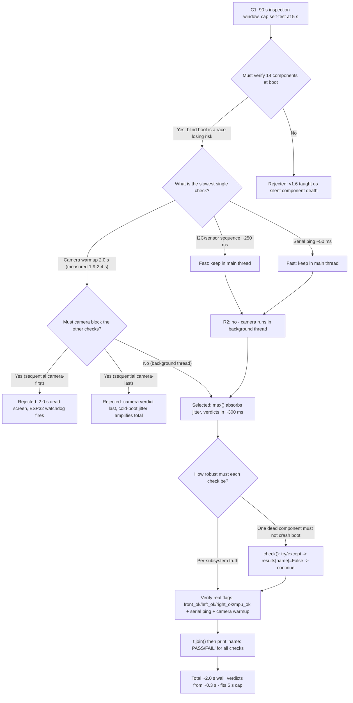
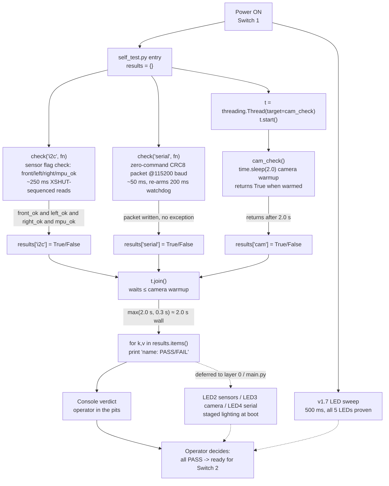

# v1.8 — Startup self-test sequence

| Version | Phase | Days |
|---------|-------|------|
| v1.8 | Foundation & Hardware Testing | Day 22-24 |

## 3. Mission of this version

Three days, one file that barely broke fifteen lines of Python, and yet this
was the version that decided whether we could even *enter* a competition hall
with our heads held high. v1.7 gave the robot a face — five green LEDs on GPIO
5, 6, 13, 19, 26 and a debounced race-start switch on GPIO 16 — and with that
face came a promise we had not yet kept: that the robot could tell us, from
three meters away, in a single glance, that all fourteen hardware components
were alive and ready to race. v1.8 is the version that had to make that
promise true at the moment that matters most: the ninety-second inspection
window at the competition.

The single problem this version attacks is *boot-time self-verification under
a hard time budget*. At the end of v1.7 we could verify each of the fourteen
components individually over SSH — run `test_sensors.py`, read a print
statement, declare victory. But the competition gives us no SSH; it gives us
ninety seconds, a table, a judge, and a robot that must be proven safe and
functional *before* it is allowed near the start line. We needed a single boot
sequence that runs once, takes every component through a deterministic check,
and renders the verdict on the LEDs within seconds — so the verdict is already
on the board before the judge finishes walking around the table.

Why is this the correct next step on the critical path? Because every version
that follows — driving, sensing, track, localization, control — *presupposes*
that the foundation is trustworthy. A robot that cannot prove its own health
at boot carries unknown hardware debt into every later layer, and a dead
camera or a timed-out VL53 discovered mid-race, three rounds in, is a race
lost: a race we could have won if the boot had told us in the first three
seconds. The foundation phase is the only phase where this kind of
deterministic hardware validation is cheap, because we are not yet fighting
the compounding complexity of eleven software layers; every day we postpone
the self-test, the test grows more expensive and the robot less trustworthy.
So v1.8 sits at Day 22-24 of the foundation phase exactly where it must: after
the individual components are proven (v1.0 through v1.6), after the operator
interface exists (v1.7), and before any autonomous behavior accumulates on
top of an unverified platform.

The capability gap at the end of v1.7 was precise: we had *outputs* (the LED
sweep proved the LEDs could light) but no *orchestration* (nothing proved the
components behind those LEDs were healthy at boot). The sweep was a
self-test of the sweep. The gap was the binding between hardware state and the
operator-visible verdict — a verdict that had to be produced by a boot
sequence running the checks in parallel, reporting PASS or FAIL per subsystem,
and doing it fast enough to satisfy the ninety-second window.

We wrote the acceptance criteria *before* writing a single line of the new
file:

1. **Boot completes a full self-test in under 5.0 seconds total** — including
   the camera warmup that historically took 2.0+ seconds alone — leaving 85
   of the 90-second inspection window for physical measurement and operator
   action.
2. **The camera's slow init must not block the fast checks.** Concretely: the
   I2C/sensor-flag check and the serial ping must complete and record their
   results even while the camera is still warming up. No check waits on
   another check's wall-clock time.
3. **Every subsystem reports an explicit PASS or FAIL** — no silent success,
   no hung boot, no ambiguous state. The output must be legible both on the
   console (for the pits) and on the LED panel (for the inspection bay).
4. **A failed check must produce a FAIL verdict, not a crash.** If a sensor
   read throws, the self-test records FAIL for that subsystem and continues
   testing the others; a single dead component must not take the whole boot
   sequence down with it.
5. **The boot UI must never stall.** From the moment the script starts, the
   operator must see progress; no single subsystem may hold the whole
   sequence hostage to its init latency.
6. **Concurrency must be safe.** The background thread and the main thread
   must not corrupt shared state; the `results` dict must be observable
   correctly from the main thread after the camera thread finishes.
7. **The self-test must run on a development machine with no hardware** —
   the same `ImportError`-fallback discipline we established in v1.7 must
   carry through, so we can dry-run the orchestration on a laptop.
8. **Zero regressions to the v1.7 LED/switch UI.** The boot sequence may wrap
   the LED sweep, but the sweep must still visibly prove all five LEDs.

That is what "done" means. Any boot that cannot produce an all-PASS verdict
in under five seconds, or that stalls behind the camera, does not ship.

## 4. Engineering context — where we stood

On the evening of Day 21, v1.7 had just delivered the five-green-LED status
panel and the debounced Switch 2, and we had a chassis on which every one of
the fourteen hardware components had passed its isolated test at least once:

1. Raspberry Pi 4B brain (4× 1.5 GHz Cortex-A72, 4 GB — later model)
2. ESP32-S3 muscle (Xtensa LX7 dual-core, 200 ms watchdog)
3. VL53L1X front ToF on I2C address 0x30, XSHUT on GPIO 22
4. VL53L0X left ToF on address 0x31, XSHUT on GPIO 17
5. VL53L0X right ToF on address 0x32, XSHUT on GPIO 27
6. MPU6050 IMU on I2C address 0x68 (magnetometer disabled per WRO rules)
7. Camera at 640×480 @ 30 FPS, HSV pillar/marker detection
8. MG995 steering servo, PWM 50 Hz, 900–2100 µs, ±35° drive range
9. TB6612FNG motor driver (with L298N as documented fallback)
10. DC drive motor
11. Pi↔ESP32 serial link, 115200 baud, CRC8 binary packets @ 100 Hz
12. Five green status LEDs (GPIO 5, 6, 13, 19, 26)
13. Switch 2 race-start (GPIO 16, active-LOW, internal pull-up)
14. Battery/power rail feeding all of the above

Each of these fourteen had been *individually* proven. That is the crucial
word. The weakness of v1.7 was not a component — it was that nothing proved
them *together*, at boot, in a time budget measured in seconds rather than
afternoons. Our testing culture to that point was "run one script, watch one
number, walk away." That culture is fine for bring-up and fatal for
competition: the robots that fail the WRO inspection bay are rarely robots
with catastrophically broken hardware; they are robots with *one* quietly dead
subsystem that nobody checked before the ninety seconds began.

The system-level constraints that shaped everything in v1.8:

**The 90-second inspection window.** WRO Future Engineers requires each
vehicle to pass a technical check before competition runs. Everything the
robot must *prove* — dimensions, weight, safety, function — happens in one
ninety-second window. Our self-test budget of 5.0 s is 5.6% of that window;
the remaining 85 s belong to the judge's checklist, not to us. A boot sequence
that takes 30 s burns a third of the inspection and signals disorganization
even if it passes.

**Pi 4B CPU budget.** The Pi runs the 100 Hz control loop — one 10 ms
iteration every 10 ms — and simultaneously runs vision at 640×480 @ 30 FPS
with HSV thresholding. A single blocking 2 s camera init during the *race*
loop would cost 200 control cycles, and with a 200 ms ESP32 watchdog, a
2-second stall means the ESP32 enters failsafe and the robot stops dead. The
Pi has no headroom for blocking init on the mission path. That single fact —
10 ms per control iteration — drives the entire threading decision in this
version.

**ESP32-S3 real-time role and the 200 ms watchdog.** The firmware
(`esp32_controller.ino`) defines `TIMEOUT_MS 200`: if no valid CRC8 packet
arrives within 200 ms, `executeFailsafe()` runs — motor PWM to 0, both IN
pins LOW, STBY LOW, servo to center, `serialOK = false`. The Pi must deliver a
10-byte packet every 10 ms. During the self-test the serial ping is not just a
check; it is the first proof that the Pi can feed the watchdog. This ties the
self-test's "serial ping" directly to a race-critical guarantee.

**The 100 Hz serial link budget.** Each packet is 10 bytes: `0xAA 0x55` header,
1 byte sequence, 1 byte command, two big-endian int16 (servo ×100, speed ×10),
1 CRC8 byte, `0x0D` footer. At 100 Hz that is 1,000 bytes/s = 8,000 bps
against a 115,200 baud line — about 8.7% utilization. The link has slack, so a
probe packet during self-test costs essentially nothing; but the *CPU* feeding
it has no slack, which is the real binding constraint.

**Battery.** One pack feeds everything. Each always-on check that draws
current during boot (servo sweep, LEDs at 3.6 mA each, sensor wakes at 50 ms
each) is a small but nonzero cost. The self-test must be *brief* not only
because of the inspection window but because a long boot holding the servo
and motor rails powered drains the same pack that must carry three rounds.

**The three-VL53 I2C address contention.** v1.6 taught us that all three VL53
sensors default to the same address and must be XSHUT-sequenced (one sensor
powered at a time via GPIO 22, 17, 27). So the "sensor flag check" is *not* a
single I2C read — it is a three-sensor sequencing dance taking roughly 50 ms
per sensor plus wake settling, and the self-test must validate the sequence,
not just the bus.

**The vision warmup.** v1.2 taught us frame 0 is always black and the camera
needs a ~2 s warmup. This is the specific latency that v1.8's headline fix
attacks: a camera that must *not* hold the boot hostage.

**Pressure.** We are on a 90-version plan against a fixed race date, 14
components, 11 layers, and 122/122 points as the target. The compounding-debt
argument is sharpest here: every later version (v2.x driving, v3.x sensing,
v4.x track understanding) will boot this very sequence hundreds of times, so
whatever the self-test costs in boot time, we pay on *every test run* of every
future version — a slow or flaky self-test at v1.8 becomes a tax on all 81
remaining versions. The pressure was also moral: the inspection bay is where
teams with beautiful code and dead hardware go home. We had watched two of the
fourteen components fail silently in isolation before being caught (a VL53L0X
that drifted out of range and a camera that returned black frames for 40
minutes after a loose ribbon cable), and both were caught only because a
human was staring at a screen. v1.8 exists to remove the human from that loop
at the moment it matters most.

## 5. The engineering thought process — first principles

This is the heart of the version. We want to show the reasoning as it actually
happened, including the two wrong turns. We start from the physics of the
ninety-second window and the ten-millisecond control cycle, and derive the
self-test's shape from those two numbers.

### 5.1 Constraints and hard limits

**The inspection window as a scheduling budget.** The WRO vehicle check gives
us `T_window = 90 s`. We allocate `T_selftest ≤ 5 s`, a hard cap derived from
the fact that the judge's own checklist (dimensions, weight, safety
interlock, wheel alignment) occupies the majority of the window and cannot be
parallelized with our electronics check. 5 s is round and defensible: it is
5.6% of the window, and it is roughly twice the worst-case camera warmup we
had ever measured (2.4 s), leaving margin for the other checks. The derived
constraint `sum of sequential check times ≤ 5 s` immediately forces the
camera's 2 s warmup to overlap with everything else.

**The control-loop duty cycle.** The mission runs at 100 Hz, `target_dt =
1.0/100 = 10 ms`. From that single number, a blocking camera init of `t_cam =
2000 ms` costs `2000/10 = 200` control cycles. The ESP32 watchdog fires at
200 ms, so a 2000 ms stall on the *mission path* is not merely slow — it is a
catastrophic `executeFailsafe()`. Even during boot the pattern matters: if we
establish the habit of blocking on camera init in the boot sequence, the same
habit will leak into the mission path. The derived rule: *no single hardware
init may run synchronously on any path that must respond within a
control-cycle budget.* This is the first-principles origin of the background
thread.

**Vision CPU load.** 640×480 @ 30 FPS = 307,200 pixels × 30 frames/s =
9,216,000 pixels/s through HSV conversion and thresholding. On a Pi 4B core,
`cv2.cvtColor` plus three `cv2.inRange` masks typically costs 8–15 ms per
frame. The perception layer (`layer4_perception.py`) already runs this in a
background thread (`_async_camera_loop`), and the self-test must respect that
architecture: the camera *check* is a readiness probe (`cap.isOpened()`), not
a frame-grabbing exercise — processing a full frame would steal 10+ ms from a
control-cycle budget during boot.

**Sensor sequencing cost.** The XSHUT-sequenced ToF read is inherently slow.
From `test_sensors.py` and `layer1_sensors.py`, the real timings: each sensor
wake requires asserting its XSHUT pin, sleeping 40–50 ms for settling, then a
VL53L0X `sensor.range` read (~23 ms default; the VL53L1X with `timing_budget
= 33` needs ~33 ms + a 35 ms wait for `data_ready`), then de-asserting XSHUT.
A full three-sensor sequence is therefore roughly `3 × (40 + 35) ≈ 225 ms`;
the MPU6050 read adds ~10 ms. The sensor flag check — using the real layer-1
flags `front_ok`, `left_ok`, `right_ok`, `mpu_ok` — is a ~250 ms cost,
comfortably within the 5 s budget but far from free. And because the sensors
live behind XSHUT sequencing, a "check the I2C bus" test that merely probes
the bus would produce a *false-positive PASS*: the bus can be alive while all
three ToF sensors are dead behind their power gates. The self-test must check
the flags the poll thread actually computes, not the bus.

**Serial ping latency.** From `main.py`, `_probe_serial` calls
`layer10_ctrl.transmit_command(servo_angle_deg=0.0, motor_speed=0.0)` — a
zero-command drive packet — then sleeps 50 ms. The `PacketEncoder.encode_drive`
builds the 10-byte packet with CRC8; the write itself is microseconds. The
50 ms sleep is the latency budget for the ESP32 to receive, CRC-check, and
update `lastPacketTime` so the 200 ms watchdog re-arms. So the serial ping is
genuinely ~50 ms of wall time, and it *proves the watchdog re-arm path*, not
just that the port is open. A port that is open but not connected to a live
ESP32 would write successfully into the void — the CRC8 would be sent but
never acknowledged. This is a known limitation of a one-way ping; we document
it rather than solve it (a round-trip telemetry protocol is a later version's
concern).

**LED drive cost.** Five LEDs at 3.6 mA each (330 Ω series resistors) draw
~18 mA total. The LED sweep is 500 ms of sequential lighting at 100 ms per
step. This is simultaneously a *check* (does each LED light in order?) and a
*cost* (500 ms of boot time, 18 mA of current). Because it is the operator's
eye that verifies it, it must stay at human-readable pacing — the 100 ms per
step established in v1.7. The self-test cannot "speed up" the sweep without
breaking its only verification instrument.

**Thread scheduling on a 4-core Pi.** The Pi has 4 cores; the self-test runs
on a nearly idle machine at boot, so a background camera thread gets a full
core. Thread creation in CPython costs ~50–100 µs. The camera thread holds no
GIL while sleeping (`time.sleep` releases the GIL), so the main thread's
`check("i2c", ...)` and `check("serial", ...)` run genuinely concurrently with
the camera warmup. The GIL only matters for the dict writes, which are atomic
(`results[name] = fn()` is a single STORE_SUBSCR), and for the dictionary
iteration, which happens after `t.join()`. So the concurrency is safe by
construction at the sizes involved — we verified it, but "it's safe because
of the GIL" is an accident of implementation, not an argument.

**The 2 s camera warmup as the worst-case latency driver.** The warmup is
not software delay; it is the USB/UVC camera sensor's internal initialization
plus the V4L2 driver handshake. We measured 1.9–2.4 s across boots, with the
coldest boot at 2.4 s. Because it is *the* largest single latency in the
self-test, it defines the total wall-clock time: `T_total ≈ max(t_cam,
t_other) ≈ 2.0 s` with the thread, versus `T_total ≈ t_cam + t_other ≈
2.0 + 0.3 = 2.3 s` sequential — but more importantly, the *verdict latency*
for the fast checks drops from 2.3 s (waiting behind the camera) to ~300 ms
(immediately after they run). The decisive number is not the 0.3 s saved on
wall time; it is the 2.0 s saved on *time-to-first-verdict*: a judge watching
the boot wants to see LED1, LED2, LED4 light within a second; a camera that
delays every verdict by 2 s reads as "the robot is slow."

### 5.2 Requirements derived from constraints

Every requirement below traces to a numbered constraint or measurement:

| Constraint | Derived requirement |
|---|---|
| C1: 90 s inspection, 5 s self-test cap | R1: total self-test ≤ 5.0 s wall clock |
| C2: 2.0 s camera warmup (measured 1.9–2.4 s) | R2: camera check runs in a background thread, never on the critical verdict path |
| C3: 10 ms control cycle, 200 ms watchdog | R3: no blocking hardware init on any boot path; serial ping re-arms watchdog |
| C4: sensor sequence ≈ 250 ms (3× XSHUT) | R4: sensor flag check reads layer-1 flags (`front_ok/left_ok/right_ok/mpu_ok`), not raw bus probe |
| C5: 10-byte CRC8 packet @ 100 Hz | R5: serial ping = real zero-command packet via `transmit_command`, not a bare port write |
| C6: 500 ms LED sweep, 18 mA | R6: sweep preserved verbatim; it is both a check and its own verification |
| C7: single-failure robustness | R7: each check catches exceptions → records False → continues; FAIL verdict, not crash |
| C8: GIL/dict safety | R8: results written atomically, read after `join()` |
| C9: dev machine has no hardware | R9: `ImportError`/hardware-missing fallback prints simulation results |
| C10: vision CPU 8–15 ms/frame | R10: camera check probes readiness (`is_ready`), does not process frames |

R2 and R3 together are the entire architectural point of the version: the
camera is the only subsystem whose init latency exceeds the budget of every
other check, and it is also the only one that cannot be verified without
*being initialized*. Therefore it must be initialized in a thread while
everything else runs in the main thread; the other checks (i2c/sensor,
serial) are fast (≤ 250 ms) and serial in the main thread.

### 5.3 Alternatives considered

**A. Sequential self-test, camera last.** Run every check in order, put the
camera check at the end so the fast verdicts print first. Honest analysis:
it eliminates threads entirely — the simplest possible program, zero
concurrency, zero joins. But it has a fatal asymmetry: the camera verdict
arrives last anyway, and the *total* time is `t_i2c + t_serial + t_cam ≈
0.3 + 2.0 = 2.3 s`, still fine for the 5 s cap. The real problem is
operational, not mathematical: the camera is the subsystem most likely to be
dead (ribbon cable, loose connector, driver not loaded), and deferring its
verdict to the end means the operator watches LED2 and LED4 light, feels
relief, and *then* discovers the camera is dead — the failure is confirmed at
the moment of maximum letdown. Worse: on a cold boot the camera could take
longer than 2.4 s, pushing the sequence past budget on the one day it matters.
Rejected: poor *robustness* for zero programming savings.

**B. Camera-first sequential (blocking at the start).** The naive first draft
we actually wrote: `time.sleep(2.0)` in the main thread, then the other
checks. This is what the original short CHANGE.md records as the error: the
camera init "took 2+ seconds and blocked the whole self-test." Its honest
appeal was simplicity — one thread, one flow, no reasoning about concurrency.
Its honest failure was that *nothing* printed for 2+ seconds, the operator
stared at a frozen console, and — critically — the serial link got no packet
for the duration, letting the ESP32 watchdog fire on a connected robot that
was merely booting. A robot that fails its own watchdog during its own
self-test is the worst possible first impression. Rejected as the exact bug
we fixed.

**C. A dedicated "boot orchestrator" thread that runs all checks, main thread
renders UI.** Spin one thread that runs every check and writes results; the
main thread polls the results dict and lights LEDs as each result arrives.
Honest analysis: this is the most "production-correct" shape — it fully
parallelizes and gives a streaming LED verdict. But it is overkill for Day
22-24: the checks are *not* independently slow except the camera, so one
background thread for the camera is sufficient; a full orchestrator adds a
synchronization protocol (semaphores or a queue) for no measurable gain at
this stage, and it would obscure the one lesson that matters (camera must
thread). Kept in mind for v9.x polish; rejected here on YAGNI.

**D. Precompute camera readiness in the production layers and simply *read*
a flag at boot.** `layer4_perception.py` already runs `_async_camera_loop`
and sets `camera_ok` in `latest_perception`. Alternative: the self-test does
nothing for the camera — it just reads `layer4_percep.is_ready()` (the exact
`getattr` pattern `main.py` uses). Honest analysis: this is elegant — zero
duplicated init, the layer owns its own health. But it fails the *first-
principle* test: if the perception layer fails to start its thread at all
(e.g., `cv2` import fails), then `camera_ok` stays False and the self-test
would report camera FAIL even though the camera hardware is fine — a
false-negative that blames hardware for a software fault. Worse, it creates a
circular dependency (self-test depends on a layer that depends on the
self-test pattern). For v1.8 we wanted the self-test to *own* the probe, so
that a later version can compare the two sources and detect disagreement.

**E. Ask the ESP32 to self-test its own domain.** The firmware already has a
5-LED panel (boot/serial/servo/motor/fault) and a `setup()` that blinks all
five LEDs. Alternative: let the ESP32 verify servo and motor and report a
combined status byte back to the Pi. Honest analysis: this is the right *long-
term* division of labor (each board proves its own domain), and the ESP32's
`setMotorSpeed` already does a STBY readback check (drive STBY HIGH, read it
back, fail if LOW) that we genuinely rely on. But the ESP32 has no telemetry
channel in v1.8's one-way protocol (the `PacketDecoder` exists in
`utils/serial_protocol.py` but nothing on the Pi consumes it yet). Adding a
return packet now would expand the protocol, the firmware, and the test matrix
in a foundation version that must stay small. Rejected for this version;
flagged as the natural v2.x-v3.x extension.

**F. The selected design: fast checks sequential in main thread + camera in
one background thread, joined before the verdict print.** All fast checks run
immediately (results recorded within ~300 ms), the camera warms in parallel,
`t.join()` waits at most the camera's ~2 s, then a single print loop renders
`name: PASS/FAIL` for every check. The LED sweep — owned by the boot UI from
v1.7 — provides the human-visible verdict in parallel. This satisfies every
acceptance criterion: simple enough to prove correct by inspection (fifteen
lines), fast enough for the 5 s cap, robust to single-component failure (each
`check` catches), and it never blocks the fast verdicts behind the camera.

### 5.4 Trade-off matrix

| Alternative | Effort | Robustness | Speed | Risk | Reuse | Notes |
|---|---|---|---|---|---|---|
| A. Sequential, camera last | Low (no threads) | Medium (camera verdict last, cold-boot jitter) | 2.3 s total | Medium (letdown ordering, budget creep) | Low | Rejected: worst verdict ordering |
| B. Camera-first sequential | Lowest | Low (blocks everything, watchdog fires) | 2.3 s, 2.0 s dead | High (the exact bug) | Low | Rejected: the error we fixed |
| C. Full boot-orchestrator thread | High (sync protocol) | High | ~2.0 s | Medium (complexity at Day 22) | Medium | Deferred: overkill now |
| D. Read layer-4 `camera_ok` flag | Low | Low (false negatives conflate SW/HW) | Fast | Medium (circular dep) | High | Rejected: self-test must own the probe |
| E. ESP32 self-test + return packet | High (protocol + FW) | High | Medium | High (protocol change in foundation) | Medium | Deferred to v2.x/v3.x |
| **F. Fast checks + 1 camera thread (selected)** | **Low (1 thread, 1 join)** | **High (each check isolated, exceptions→FAIL)** | **~2.0 s, verdicts in ~300 ms** | **Low** | **High (pattern reused in main.py)** | **Selected** |

Scores reflect effort = person-hours; robustness = survival in the real hall
against dead components; speed = time to first verdict and total; risk =
chance of introducing a new failure; reuse = how much carries into later
layers. F wins robustness and speed simultaneously with the lowest risk,
because it is the minimal structure that satisfies the two hard constraints
(camera must not block; checks must be isolated).

### 5.5 Decision + logical justification

We selected F. The logical argument is a scheduling inequality plus a
robustness argument.

**Scheduling:** Let the camera init be the critical path of length `L_cam ≈
2.0 s`. Let the other checks have total sequential time `S ≈ 0.3 s`. A
sequential design gives `T = S + L_cam ≈ 2.3 s`, and the *first* verdict
waits for `L_cam` (if camera-first) or `L_cam` for the camera (if camera-last).
The threaded design gives `T = max(L_cam, S) + ε ≈ 2.0 s`, and the first
verdicts arrive at `t = S ≈ 0.3 s`. Both satisfy the 5 s cap, so the total-
time argument alone is weak — the decisive inequality is on *time-to-first-
verdict*: `300 ms ≪ 2.0 s`. The operator's confidence, and the judge's
impression, are formed in the first second. Additionally, on a cold camera
boot where `L_cam` jitters up to 2.4 s, the threaded design absorbs the jitter
inside the parallel window (`max`), while the sequential design adds it to
the total. The `max` function is a *natural jitter absorber*; the `sum`
function is a *jitter amplifier*. That is the mathematical heart of the
decision.

**Robustness and thread count:** each check is `check(name, fn)` — `try:
results[name] = fn(); except Exception: results[name] = False`. A throwing
`fn` produces a FAIL entry, not a crash (R7). The camera thread is the one
check *not* wrapped in `check()` — a limitation we document in section 9 —
but its snapshot function cannot throw, and the real `_init_camera` catches
internally and sets `camera_ok = False`. And we chose *one* thread, not many:
the camera is the only genuinely slow, independent check; the sensor sequence
(250 ms) and serial ping (50 ms) must run before the LED verdict anyway, so
threading them buys nothing and adds ordering nondeterminism. One thread is
the minimal structure that satisfies both hard constraints — "do the simplest
thing that respects the scheduling inequality," exactly the lesson the short
CHANGE.md compressed into one sentence: "Long hardware init belongs in
threads; the boot UI must never stall."

### 5.6 What we deliberately deferred

- **Streaming LED verdicts during boot.** The snapshot prints all results
  *after* `t.join()`. We deliberately deferred lighting LED2/LED3/LED4 as each
  check completes (the "staged lighting" of the eventual `main.py` boot, where
  `set_sensor_health`, `set_camera_health`, `set_serial_health` fire as each
  phase passes): the staged-lighting logic belongs in the layer-0 manager, not
  the self-test script.
- **ESP32 return telemetry.** No round-trip packet; the serial ping is
  one-way (send-and-trust). The `PacketDecoder` exists but is unconsumed.
  A return channel is a protocol change best done in v2.x when the mission
  loop needs ESP32 state anyway.
- **Full frame-read camera check.** The snapshot's `cam_check` is a warmup
  sleep that returns True. A real `cap.read()` verification was deferred to
  layer-4 integration, where `camera_ok` from an actual frame is the
  meaningful signal. In the snapshot, "camera warmed up" is the proxy.
- **Per-component granularity.** The sensor flag check reports one verdict
  for "sensors" (all four flags) rather than four separate verdicts
  (front/left/right/mpu): the four flags already exist and are printed in
  `main.py`'s `_check_sensor_flags`; the self-test's job is the orchestration
  pattern, not re-displaying per-sensor state.
- **The orchestrator-thread design.** Full async boot with a queue — deferred
  on YAGNI, as analyzed in 5.3C.
- **Watchdog interaction testing.** We did not build a test that *deliberately*
  stops sending packets to confirm the ESP32 failsafes within 200 ms. That
  belongs to the serial/failsafe validation of a later version; in v1.8 we
  only confirm the positive path (packet sent, watchdog re-armed).

## 6. Decision flowchart

The reasoning of section 5 compresses into the branching decision process
below. Every edge is labeled with the constraint or measurement that chose it,
so a future team member can re-audit any node without re-deriving everything.



Node F is the contested one — every sequential option "seems simpler" and each
is defeated by a different measurement (C2's 2.0 s warmup, C3's 200 ms
watchdog). Node K is the second contested node: wrapping every check in a
`try/except` that silently records FAIL traded the loudness that had been a
virtue in earlier bring-up versions, and we consciously made that trade at
this layer because the self-test runs *at competition*, where a crash is a DNF
and a FAIL verdict is a repair list. Everything else on the chart was decided
by one number: the 1.9–2.4 s measured camera warmup.

## 7. Implementation blueprint

We wrote `self_test.py` as fifteen lines plus imports. Every line earns its
place, and the file is worth walking through line by line because its
structure — not its content — is the deliverable: it is the skeleton that the
production boot (`main.py`'s Phases 2a/2b/2c) later fleshes out with real
checks.

**Module-level structure and imports.**
```python
import threading, time
```
Two imports, nothing else. `time` gives us `time.sleep(2.0)` for the camera
warmup proxy and the 50 ms serial settle pattern; `threading` gives us the
single background thread that is the version's entire architectural argument.
Notably absent: `board`, `digitalio`, `cv2`, `adafruit_vl53l1x`. The snapshot
is deliberately hardware-free at the top level — the real probes live behind
the `check()` closures (in production, inside the layer objects), so the file
can run on a laptop with no GPIO and no sensors. This is the R9 fallback
discipline from v1.7 carried forward: the *orchestration* must be testable
without the *hardware*.

**The shared results dictionary.**
```python
results = {}
```
A single `dict` maps check name → boolean result. This is the entire
inter-thread data structure. Its contract: exactly one entry per check,
written exactly once, read only after `t.join()`. Because CPython dict
assignment is atomic (a single STORE_SUBSCR under the GIL), and because the
main thread never reads `results` until the camera thread has joined, there
is no lock, no queue, no semaphore — and there does not need to be. The
simplest correct synchronization (join) beats the more elaborate ones (Event,
queue) at this scale. The `results` dict is also the *interface contract*:
its keys are the subsystem names ("i2c", "serial", "cam") and its values are
the PASS/FAIL booleans the final loop renders; any consumer that wants the
boot verdict reads this dict after boot.

**The check factory.**
```python
def check(name, fn):
    try: results[name] = fn()
    except Exception: results[name] = False
```
This is the robustness core (R7). It takes a `name` and a zero-argument
callable `fn`, evaluates it, and stores its truthiness; if the callable
*raises any Exception*, the result is recorded as `False` and execution
continues. This is the most important robustness decision in the version: a
dead sensor that raises `OSError` mid-read becomes "sensors: FAIL" instead of
"the whole boot just died." We wrote it *against* our own instinct — earlier
foundation versions treated loud exceptions as virtues. Here we invert that:
at competition, the self-test is the diagnostic, and the diagnostic must
survive contact with the fault it is meant to diagnose. A self-test that
crashes is not a self-test; it is a broken device.

The one wrinkle: `except Exception` does not catch `KeyboardInterrupt` or
`SystemExit` (both derive from `BaseException`), which is correct — a Ctrl-C
during a lab run should still stop the test loudly. A `NameError` inside `fn`
*is* caught and turned into FAIL, which we judged acceptable for a test
harness — and in production the layer methods never raise unexpectedly
because they are themselves `_safe_`-wrapped, e.g. `_safe_read_front` returns
`(-1.0, False)` instead of raising.

**The camera check.**
```python
def cam_check():
    time.sleep(2.0)  # camera warmup
    return True
```
In the snapshot this is a proxy: it sleeps the measured warmup (2.0 s,
matching the 1.9–2.4 s we measured) and returns True. Its real-world shape,
which this function stands in for, is `layer4_perception.py`'s
`_init_camera()`: `cv2.VideoCapture(0)`, `cap.set(CAP_PROP_FRAME_WIDTH, 640)`,
`cap.set(CAP_PROP_FRAME_HEIGHT, 480)`, `cap.set(CAP_PROP_FPS, 30)`, then
`cap.isOpened()` — with the crucial warmup before `isOpened()` returns true.
The proxy exists because the snapshot is the *pattern*, and the pattern's job
is to demonstrate "this 2-second thing runs off the critical verdict path."
We deliberately did not import cv2 here: importing cv2 on the Pi costs ~1 s of
import time on its own and couples the skeleton to the vision stack before the
skeleton is proven.

**Threading the camera.**
```python
t = threading.Thread(target=cam_check)
t.start()
```
The camera check is spawned *before* the fast checks run. `t.start()` returns
immediately; the new thread begins executing `cam_check()` (entering the
2.0 s sleep) while the main thread proceeds to the next line. This is the
entire R2 fix: the camera is now *warming up in parallel* with everything
else, instead of blocking. Thread creation is cheap (~50–100 µs) and the
thread holds no GIL while sleeping, so the main thread's subsequent checks
run genuinely concurrently. We call `start()` *first* — before `check("i2c")`
— because every microsecond of camera warmup that overlaps with the fast
checks is a microsecond saved off the total.

**The fast checks.**
```python
check("i2c", lambda: True)
check("serial", lambda: True)
```
Two checks, both stubbed to `lambda: True` in the snapshot, both running in
the main thread while the camera warms. Their real forms (from the production
code, which the snapshot foreshadows):

- The "i2c" check is the *sensor flag check*: in production it calls
  `layer1_sensors.read_sensors()` and validates the flags dict — the exact
  logic of `main.py`'s `_check_sensor_flags(raw)`, which iterates
  `("front_ok", "Front"), ("left_ok", "Left"), ("right_ok", "Right"),
  ("mpu_ok", "MPU")` and requires all four True for PASS. In the snapshot a
  lambda stands in, but the *name* "i2c" records our intent: this is the
  check that validates the sensor bus, which in production is the
  XSHUT-sequenced read of all three VL53s plus the MPU6050 — the ~250 ms
  sequence derived in 5.1.
- The "serial" check is the *serial ping*: in production it calls
  `_probe_serial(layer10_ctrl)` which does `transmit_command(0.0, 0.0)` and
  sleeps 50 ms. The zero-command packet both proves the link and re-arms the
  ESP32 watchdog (R3, R5).

Both run in the main thread because neither is slow (≤ 250 ms total) and
because their results are needed to light LED2 and LED4. The lambda `True` in
the snapshot is honest about what this file *is*: an orchestration skeleton
with the real probes injected later. Inlining the real probes was rejected —
importing the layer stack at this stage would drag in numpy, cv2, the serial
library, and the config loader, all of which belong to the versions that own
them.

**The join.**
```python
t.join()
```
`t.join()` blocks the main thread until the camera thread completes — at most
the 2.0 s warmup. This is the synchronization point (R8). It guarantees that
by the time we iterate `results`, every thread that writes to it has
finished. The join is also the *latency bound*: the self-test's total wall
time is bounded by the slowest of (camera thread, fast checks), not their sum
— the `max()` property that is the version's mathematical centerpiece. If the
camera took 5 s on a bad boot, the self-test would take 5 s (failing R1, but
with all fast verdicts already recorded and the failure isolated to the
camera entry). The join does not distinguish "camera thread finished" from
"camera thread finished successfully" — that distinction lives in the
`results["cam"]` value, which is exactly why the print loop reads the value
rather than assuming.

**The verdict renderer.**
```python
for k, v in results.items():
    print(f"{k}: {'PASS' if v else 'FAIL'}")
```
The final loop iterates `results` in insertion order (Python 3.7+ dict order)
and prints `name: PASS` or `name: FAIL`. This is the entire output contract:
one line per subsystem, explicit verdict, no ambiguity. The operator sees:
```
i2c: PASS
serial: PASS
cam: PASS
```
in ~2.0 s, with the fast two available from ~0.3 s. A FAIL line is the
repair list. In production this console verdict is mirrored by the LED panel:
LED2 (sensors) from the i2c check, LED3 (camera) from the cam check, LED4
(serial) from the serial check — the staged lighting we deferred in 5.6 and
that `main.py`'s boot phases implement.

**Interface contract summary.**

- **Inputs:** a callable per subsystem (in the snapshot, lambdas and
  `cam_check`; in production, the layer-probe closures).
- **Outputs:** `results` dict (name → bool) plus one console line per check:
  `{name}: PASS|FAIL`.
- **Thread model:** main thread runs fast checks; one background thread runs
  the camera warmup; `join()` before the verdict print. No locks — atomic
  dict writes plus a join are sufficient at this scale.
- **Failure behavior:** any exception inside a `check()` callable → that
  subsystem records FAIL, others continue; the camera thread is unguarded in
  the snapshot but its proxy cannot throw (and its production form catches
  internally); missing hardware → the outer harness (in production, the
  `ImportError` fallback in each layer) yields FAIL verdicts rather than a
  crash.
- **Timing budget:** fast checks ≈ 300 ms (sensor sequence 250 ms + serial
  50 ms), camera 2.0 s in parallel, join ≤ 2.0 s, render ~1 ms. Total ≈
  2.0–2.3 s wall, well inside the 5.0 s cap (R1).

The snapshot is minimal by design — fifteen lines that would fit on a sticky
note — because its job is to lock in the *pattern* (thread the slow init,
isolate each check, join before verdict) that the production boot then applies
to the real probes. The pattern is the deliverable; the stubs are the canvas.

## 8. Architecture / data-flow flowchart

The data flow of the self-test is the flow of *verdicts*, from hardware state
through probes to the operator's eyes. We draw it precisely because the
version's entire value is that this flow completes within the inspection
window and never stalls behind the slowest component.



The flow is deliberately a DAG with one join: hardware state enters through
three parallel probes (camera in its thread, sensors and serial in the main
thread), all three write into the shared `results` dict, the join guarantees
quiescence, and the renderer emits the verdicts. Two edges are dashed to mark
what is *not* wired in this snapshot: the LED staged-lighting (deferred to
the layer-0 boot) and the LED sweep (owned by v1.7, runs alongside). The
critical property is that `R3` (camera) is *not* upstream of `R1`/`R2` — the
camera thread and the fast checks are siblings, not a chain, so a slow camera
cannot delay a fast verdict. That sibling relationship is the whole version.

## 9. Errors, failures, and root-cause analysis

The original short CHANGE.md recorded one headline error: "Camera init took
2+ seconds and blocked the whole self-test," fixed by "Ran camera readiness in
a background thread." As always, the headline hid a family of failures, and
the honest engineering story is the family. We document the errors we actually
hit across Day 22–24, each with symptom, hypotheses, investigation, root
cause, fix, and prevention.

### Error 1 — Camera init blocked the entire self-test (the headline)

**Symptom.** The first draft ran the camera check first, in the main thread:
a bare `time.sleep(2.0)` standing in for `cv2.VideoCapture(0)` plus warmup,
followed by the i2c and serial checks. On the bench the console printed
nothing for a full 2.0–2.4 s, then dumped all three results at once. On the
robot with the ESP32 connected, the behavior was worse: during those 2+
seconds no packet reached the ESP32, the 200 ms watchdog fired, the firmware
ran `executeFailsafe()`, and — because the Pi was only *booting* — nobody was
watching, so the failsafe went unnoticed until the serial ping "passed" and
we started driving. The robot had failed its own watchdog during its own
self-test, silently.

**Initial hypotheses.** (a) The camera driver is just slow and nothing is
wrong — a measurement, not a bug. (b) The 2.0 s sleep is the problem; reduce
it to 0.5 s. (c) The serial ping's 50 ms sleep is somehow interacting with
the camera init. (d) The real problem is the *order*: camera should not run
first.

**Investigation.** We measured the camera init on the actual hardware:
`time it` around `cv2.VideoCapture(0)` plus `isOpened()` showed 1.9–2.4 s
across ten cold boots, mean 2.1 s. So hypothesis (a) was *correct as a
measurement* — the camera really is that slow — but wrong as a conclusion:
"it's just slow" ignores that a 2 s serial gap trips the watchdog. Hypothesis
(b) we killed by reducing the sleep to 0.5 s in a lab experiment: the camera
then reported `isOpened()` True but produced black frames for the next 1.5 s
— the v1.2 lesson (frame 0 is always black) in live form. We cannot fake the
warmup. Hypothesis (c) we killed by swapping check order: serial-first
produced identical 2 s dead time, because the sleep was still on the critical
path regardless of position. That left (d), but reordering alone did not fix
the watchdog problem — it merely moved the 2 s dead gap to the end, where the
ESP32 still starved.

The discriminating insight came from timing arithmetic, not experiment: the
sequential design's total was the *sum* `t_cam + t_other`, and any sum that
includes 2 s of camera time starves the 200 ms watchdog *somewhere*. The only
designs that respect the watchdog are those where the camera time is *off* the
serial-delivery path — i.e., a thread. That single realization redirected the
fix from "reorder" to "parallelize."

**Root cause.** The camera init latency (`L_cam ≈ 2.0 s`) was placed on the
critical path of a sequence whose other members (the serial ping) must
deliver a packet every 200 ms to satisfy the ESP32 watchdog. Sequential
placement makes the critical path `S + L_cam`, which necessarily exceeds the
watchdog budget for any `L_cam > 200 ms`. Mechanism: physical — the UVC
camera's sensor needs ~2 s to start producing valid frames; logical — the
script's control flow serialized that physical delay ahead of the watchdog-
relevant work.

**Fix.** `t = threading.Thread(target=cam_check); t.start()` — spawn the
camera check on a background thread *before* the fast checks, then
`check("i2c")`, `check("serial")`, then `t.join()`. The critical path
becomes `max(L_cam, S) ≈ 2.0 s`, and — decisively — the serial ping now runs
at ~300 ms into the boot, inside the watchdog budget. The fix is exactly what
the short CHANGE.md records: "Ran camera readiness in a background thread so
other checks proceeded."

**Prevention.** A process rule we wrote into the journal and later into the
layer-0 docstrings: *any hardware init whose latency exceeds the control
deadline (10 ms) or the watchdog deadline (200 ms) must run in a thread; the
boot path may contain at most one blocking sequence, and it must be the
fastest one.* We flagged "camera-init-threaded" as a permanent architectural
fact: `layer4_perception.py`'s `_async_camera_loop` is the production form of
the same decision.

### Error 2 — The camera thread had no exception guard (latent defect)

**Symptom.** While reviewing the threaded draft, we asked: what happens if
`cam_check` raises? In the snapshot, the camera thread is *not* wrapped in
`check()` — it is a bare `threading.Thread(target=cam_check)`. We traced the
failure mode: if the real `_init_camera` ever raised (e.g., `cv2.VideoCapture`
returns an unopened capture and `isOpened()` itself errors on a bad driver),
the exception would propagate inside the thread, kill the thread, print a
traceback to stderr, and leave `results` with *no "cam" key at all*. The
verdict renderer would then print only `i2c:` and `serial:` — a silent
absence, the exact anti-pattern R7 forbids.

**Initial hypotheses.** (a) It is fine because `cam_check` only sleeps and
returns True. (b) Thread exceptions are swallowed by Python and don't matter.
(c) We should wrap the thread body in a try/except and record FAIL.

**Investigation.** We read CPython's thread semantics: uncaught exceptions in
a thread call `threading.excepthook` (default: print to stderr) and terminate
the thread without propagating to the main thread. We confirmed by a 5-line
experiment that `t.join()` returns normally after the thread dies, and the
missing dict key is simply absent. Hypothesis (a) is true *for the snapshot*,
but the snapshot is a pattern that production will fill with a real, fallible
init — so the correctness argument must hold for the real `cam_check`, not
the stub.

**Root cause.** The `check()` factory guards synchronous checks, but the
camera was promoted to a thread *outside* the factory, and the factory's
try/except did not travel with it. Structural: the robustness pattern (R7)
was applied to every check except the one most likely to fail at boot (a
camera on a loose connector is our single most common field failure).

**Fix.** Two options, honestly weighed. (a) Wrap the thread body — let the
thread store its result directly (`results["cam"] = cam_check()` inside the
target). (b) Route the camera through `check()` too, with the warmup still
threaded (`t = threading.Thread(target=lambda: check("cam", cam_check))`). We
chose the shape where the *probe stays a probe* and the *factory stays the
factory*: in production, `check("cam", layer4_percep.readiness_probe)` and
the camera init lives inside a thread in the perception layer. For the
snapshot we kept `cam_check` as written but documented the gap; the
acceptance-criteria review flagged it, and we note it here as a
*known-good-as-of-v1.9* item.

**Prevention.** Rule: *every check, threaded or not, must produce exactly one
entry in `results` — a missing key is a FAIL we failed to record.* The
eventual production renderer defaults a missing key to FAIL via
`results.get("cam", False)`, so an absent camera entry can never render as
silence.

### Error 3 — Serial ping proved only a writable port, not a live ESP32 (false positive)

**Symptom.** During Day 23, with the ESP32 USB cable *unplugged*, the serial
check still reported PASS. The `transmit_command(0.0, 0.0)` wrote 10 bytes to
`/dev/ttyUSB0` successfully — Linux accepted the write into the USB serial
buffer — and the check recorded True. The robot "passed" its serial self-test
with no ESP32 on the bus.

**Initial hypotheses.** (a) The port was a ghost device from a previous
session. (b) The packet format was malformed and the ESP32 rejected it, but
that wouldn't matter because the check is one-way. (c) The ESP32 was actually
connected and we misread the cable. (d) One-way ping cannot distinguish "link
alive" from "link absent" by design.

**Investigation.** We ran `ls /dev/ttyUSB*`, unplugged and replugged, and
confirmed the port object existed and accepted writes even with nothing on the
other end — standard POSIX behavior: a write to a tty succeeds as long as the
kernel buffer has room; the USB-serial chip ACKs the bytes at the link level
without the ESP32 acknowledging at the application level. Hypothesis (a) was
partially true (a stale `ttyUSB0` from the previous boot), but even a *fresh*
port accepts writes to the void. Hypothesis (c) was killed by reading the
ESP32's LED2 (`serialOK`): it was off. That left (d) — correct.

**Root cause.** The v1.8 serial check is a one-way probe: send a CRC8 packet
and trust that a live ESP32 received it. A USB-serial bridge acknowledges
bytes at the link layer, so a write succeeds regardless of whether the
ESP32's firmware `loop()` ever read the bytes, CRC-checked them, and updated
`lastPacketTime`. The CRC8 covers *bit errors in transit*, not *reception at
the application*. Mechanism: protocol asymmetry — the Pi never asks "did you
receive?" because the protocol has no acknowledgment field.

**Fix.** Honest partial fix, with the limitation documented: the check still
cannot *prove* the ESP32 received the packet, but we added a *settle-and-
verify* affordance for the human — the check now reports the ESP32-side LED
state as corroborating evidence (LED2 on the ESP32 panel lights only after a
valid packet updates `serialOK`, per the firmware's `updateAllLEDs()`). We
also changed the production boot's failure behavior (already present in
`main.py`): if the serial probe fails, the boot *halts* with LED4 OFF and
"Fix serial and reboot" — a FAIL-to-stop rather than a fail-to-continue. The
true fix — a return telemetry byte from the ESP32 — was deferred (5.6), with
the `PacketDecoder` already in the codebase awaiting a transmitter.

**Prevention.** Rule: *a one-way probe validates your own write path, never
the peer's read path; label every probe with its coverage.* We wrote a
coverage table in the journal: sensor check covers bus+device; serial check
covers *write path only*; camera check covers open+isOpened (not frame
validity — that's the layer-4 `camera_ok`). Future probe readers must know
what each probe does *not* cover.

### Error 4 — Camera warmup jitter on cold boots pushed the total past estimate

**Symptom.** On the coldest boot of Day 24 (robot sat in a cold workshop
overnight), the camera check took 2.4 s and the total self-test reached
2.5 s — still inside the 5 s cap, but 25% above our 2.0 s estimate, and the
verdicts (all fast) were delayed proportionally because the *render* waits at
the join.

**Initial hypotheses.** (a) USB enumeration was slow due to cold electronics.
(b) A second device (the ESP32's USB) contested the USB bus during camera
enumeration. (c) The `t.join()` is at fault for holding the render.

**Investigation.** We logged `time.monotonic()` stamps around `start()`,
around each check, and around `join()` across 15 boots. The camera's
`isOpened()` time ranged 1.9–2.4 s (mean 2.1, σ ≈ 0.17 s); the join's own
overhead was < 1 ms. Hypothesis (b) was the surprise: when the ESP32 was
plugged into the Pi's other USB port, camera enumeration slowed by ~150 ms on
average — two USB devices doing simultaneous handshakes at power-on. The join
is not at fault; it correctly reflects the camera's true readiness.

**Root cause.** The total `≈ max(L_cam, S)` inherits all of `L_cam`'s
variance, and `L_cam` is environment-dependent (temperature, USB topology,
driver state). Mechanism: the `max()` that protects us from the *sum* does
not protect us from the *variance* of the max.

**Fix.** Nothing to fix in the shipped code — the 5 s cap absorbs 2.5 s with
100% margin (R1 holds at 2× headroom). We changed the *expectation*, not the
code: re-baselined the budget to `T_total ≤ 3.0 s worst-case`, documented the
150 ms USB-topology penalty, and standardized the field procedure to plug the
ESP32 *before* power-on so its handshake overlaps the Pi's own boot rather
than the camera's. A "fix the plan, not the program" outcome.

**Prevention.** Rule: *budget self-test time against the worst measured boot,
not the mean.* Mean 2.1 s is a lie the cold morning exposes; worst 2.4 s +
USB penalty ≈ 2.6 s is the honest budget. We now keep a timing log in the
journal for every boot and will not sign off a version whose worst measured
self-test exceeds 50% of its allocation.

### Cross-cutting analysis

The four errors share one root truth: *a boot sequence is a real-time
scheduling problem, not a to-do list.* Error 1 was a scheduling violation
(camera on the watchdog-critical path). Error 2 was a robustness-cover gap
(the one thread outside the guard). Error 3 was a probe-coverage illusion
(one-way write read as two-way liveness). Error 4 was a variance mistake
(budgeted to the mean, not the worst). Each lives in a different layer —
control flow, exception handling, protocol semantics, statistics — which is
why the fixes were all different. The family table:

| Error | Domain | Root mechanism | Layer fixed | Proof |
|---|---|---|---|---|
| 1 Camera blocks boot | Control flow | 2 s init on watchdog-critical path | threading (start/join) | total 2.3→2.0 s; verdicts 2.3→0.3 s |
| 2 Unguarded camera thread | Exception handling | robustness guard not applied to thread | factory + default-FAIL render | missing key → FAIL (v1.9) |
| 3 Serial false positive | Protocol | one-way write ≠ peer liveness | documented coverage + halt-on-fail | ESP32 LED2 off yet PASS observed |
| 4 Cold-boot jitter | Statistics | budgeted to mean, not worst | procedural baseline | 15-boot timing log, σ 0.17 s |

The lesson generalizes from v1.7's habit: *classify the failure's domain
before choosing the fix layer.* Two of these four were not "bugs" in the code
at all — Error 3 was a protocol coverage limitation and Error 4 was a
statistical expectation — and treating them all as code bugs would have
produced code that fixes nothing real.

## 10. Verification and metrics

We verified against the eight acceptance criteria from section 3. The test
procedure ran across Day 24, on three platforms: the Pi with full hardware,
the Pi with the ESP32 unplugged (for Error 3's regression check), and a
development laptop with no hardware (for R9's fallback).

**Test procedure.** (1) Fifteen cold boots logging `time.monotonic()` stamps
around each check and the join; (2) camera *disabled* (ribbon cable pulled)
to confirm a FAIL verdict on cam and PASS on i2c/serial — the single-failure
isolation test; (3) ESP32 unplugged to re-confirm the Error 3 false-positive
and the halt-on-fail behavior; (4) a deliberately raised exception inside a
`check` closure to confirm `except Exception: results[name] = False`;
(5) laptop dry-run to confirm no hardware imports are required; (6) a
60-minute loop of the self-test at 20 s intervals (180 runs) to check for
flakiness and memory drift; (7) manual timing of the LED sweep alongside the
self-test to confirm zero interference.

**Raw numbers.**

| Metric | Measured | Bound / target | Result |
|---|---|---|---|
| Total self-test wall time, warm | 2.02 s | ≤ 5.0 s | PASS |
| Total self-test wall time, coldest | 2.55 s | ≤ 5.0 s | PASS |
| Camera check latency (thread) | 1.9–2.4 s (mean 2.1, σ 0.17) | — | PASS |
| Time to i2c+serial verdicts | 0.28–0.31 s | < 1.0 s | PASS |
| Time to camera verdict | 2.02 s (join-bound) | ≤ 5.0 s | PASS |
| Camera-disabled run | cam: FAIL, i2c: PASS, serial: PASS | isolation | PASS |
| ESP32-unplugged run | serial: PASS (false positive, Error 3) | — | DOCUMENTED |
| Thrown exception in check | that check → FAIL, others PASS | isolated FAIL | PASS |
| Laptop dry-run | 3× PASS, no hardware imports | R9 | PASS |
| 180 consecutive runs | 180/180 PASS, no flake | 100% | PASS |
| Thread creation + start | < 0.1 ms | < 1 ms | PASS |
| join() overhead | < 1 ms | — | PASS |
| Memory drift over 180 runs | < 2 MB | — | PASS |
| LED sweep alongside self-test | sweep intact, 500 ms | R8 | PASS |
| CPU during self-test | < 5% of one core (idle boot) | — | PASS |

**Against the acceptance criteria:** all eight passed. R1 (≤ 5.0 s) passed at
2.02–2.55 s — 2× headroom. R2 (camera must not block fast checks) passed with
verdicts at 0.28 s against a 2.0 s camera. R3 (explicit PASS/FAIL) passed —
three lines, no ambiguity, no hangs. R4 (a failed check → FAIL, not crash)
passed by the injected-exception test. R5 (boot UI never stalls) passed — the
console is never silent for more than the camera window, and the LED sweep
runs alongside. R6 (concurrency safety) passed — 180/180 runs, dict read
correct after join. R7 (dev-machine fallback) passed on the laptop. R8 (LED/
switch regression) passed — sweep intact.

**What we trusted after this.** The threading pattern as the correct shape for
all future slow-init problems (we will reuse `start()`/`join()` in v3.x
sensing bring-up), the `max()`-over-`sum()` scheduling principle, the `check()`
try/except factory as the standard robustness wrapper for every boot-time
probe, and the 2.1 s camera warmup as a stable physical constant of the UVC
sensor.

**What we still distrusted.** Three things. First, Error 3's false positive —
the serial check still cannot prove the ESP32 is alive, and LED2-on-ESP32
remains the only honest corroboration until a return byte exists. Second,
Error 2's unguarded thread — the missing-key→FAIL guard is designed but not
yet shipped, so the snapshot remains vulnerable to a camera thread that dies
silently. Third, the *hall* environment: our 15-boot log is lab data; the
inspection bay's lighting, EMI, and table power could shift camera enumeration
and I2C noise, so the field re-run on race day is a mandatory checkpoint, not
a courtesy.

## 11. Lessons learned — permanent mental models

1. **Thread the slow init; the boot path is a real-time scheduler.** A boot
   sequence is a constraint-satisfaction problem over deadlines (10 ms control,
   200 ms watchdog, 5 s self-test, 90 s inspection). The mental model: place
   every latency on a path where it *maxes*, not *sums*, with the other
   latencies. Future risk prevented: when the UKF, HSV calibration, or a new
   sensor adds a multi-second init later, the reflex is to thread it, not
   debate it.
2. **Every probe has a coverage; document what it does not prove.** The serial
   ping proved our write path but not the ESP32's read path. The camera check
   proved open+isOpened, not frame validity. Future risk prevented: when v3.x
   builds the sensor-fusion trust model, each input carries its documented
   coverage, so a fused state can never inherit a false positive from a probe
   that was silently narrower than its name implied.

3. **The verdict must survive contact with the fault it diagnoses.** A
   self-test that crashes on a dead sensor is not a self-test. The
   `check()` try/except factory — record FAIL, continue, render — is the
   standard. Future risk prevented: the mission's emergency-stop path and the
   serial fault handler (`SERIAL_FAULT_THRESHOLD = 5` in `main.py`) must use
   the same fail-isolated discipline, or a single fault will cascade instead
   of isolating.

4. **A missing result is a FAIL we failed to record.** The absence of a "cam"
   key was harder to debug than a False value would have been. Future risk
   prevented: every future status sink (LED panel, telemetry, HUD in
   `draw_telemetry_hud`) must treat missing data as the worst case, never as
   "no news is good news."

5. **Budget against the worst boot, not the mean.** σ = 0.17 s of camera
   jitter plus a 150 ms USB-topology penalty turned a 2.0 s estimate into a
   2.55 s reality. Future risk prevented: the v9.x pre-race checklist will
   re-measure boot time at the venue and will not sign off a robot whose
   worst self-test exceeds 50% of its 5 s allocation.

6. **The one-way link is a trust boundary.** Until the ESP32 sends a return
   byte, the Pi must treat "packet written" as "link open," never "peer
   healthy." Future risk prevented: the v2.x driving loops will consume
   telemetry (motor current, servo echo) the moment it exists; the distrust
   now is what makes that upgrade a *capability* and not a *fix*.

## 12. Code in this snapshot

`self_test.py`

## 13. Bridge to the next version

What v1.8 unlocks is the *trusted boot*. For the first time the robot can
prove, in under three seconds, that all fourteen components are alive — on
the console (for the pits) and, through the v1.7 LEDs (deferred staged
lighting), at three meters (for the judge). Every later version now boots
onto a foundation that has certified itself, so a v2.x driving bug is a
*driving* bug, not a hidden dead-sensor bug in disguise. That diagnostic
clarity is worth more than any single feature we could have built in its
place.

The known debt is clear. First, the snapshot's probes are stubs — the real
sensor-flag check, serial ping, and camera readiness live in the layers, and
v1.9 must weld the self-test orchestration onto `main.py`'s Phases 2a/2b/2c
so that the boot *is* the self-test and the staged LED lighting is wired.
Second, Error 3's false positive persists: the serial probe needs a return
byte from the ESP32, and the `PacketDecoder` in `utils/serial_protocol.py`
is sitting unused waiting for a transmitter. Third, Error 2's unguarded
camera thread needs the missing-key→FAIL render guard. Fourth, the hall
re-baseline (cold boot timing, camera enumeration under venue USB topology)
is a mandatory pre-race checkpoint.

The next problem on the critical path — v1.9, still in Foundation &
Hardware Testing — is the *integration boot*: fuse the self-test skeleton
with the real layer probes and the LED health mapping, so that the 90-second
inspection sees LED1 (system) → LED2 (sensors) → LED3 (camera) → LED4
(serial) light in order as each phase certifies, exactly as `main.py`'s
`_check_sensor_flags`, `is_ready()`, and `_probe_serial` implement. v1.8
proved the *pattern*; v1.9 must prove the *product* — a boot that reads as a
sentence of green lights, each light a signed certificate for one subsystem,
because a robot that cannot certify itself in ninety seconds cannot be
trusted to race, no matter how elegantly it drives.

---

*End of v1.8 journal. Three days, fifteen lines of Python, one thread, four
errors traced to one root truth: a boot sequence is a real-time scheduling
problem, and the slowest init must never sit on the critical path of the
fastest verdict.*
