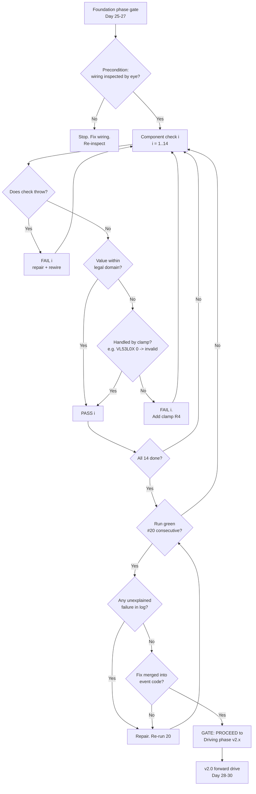
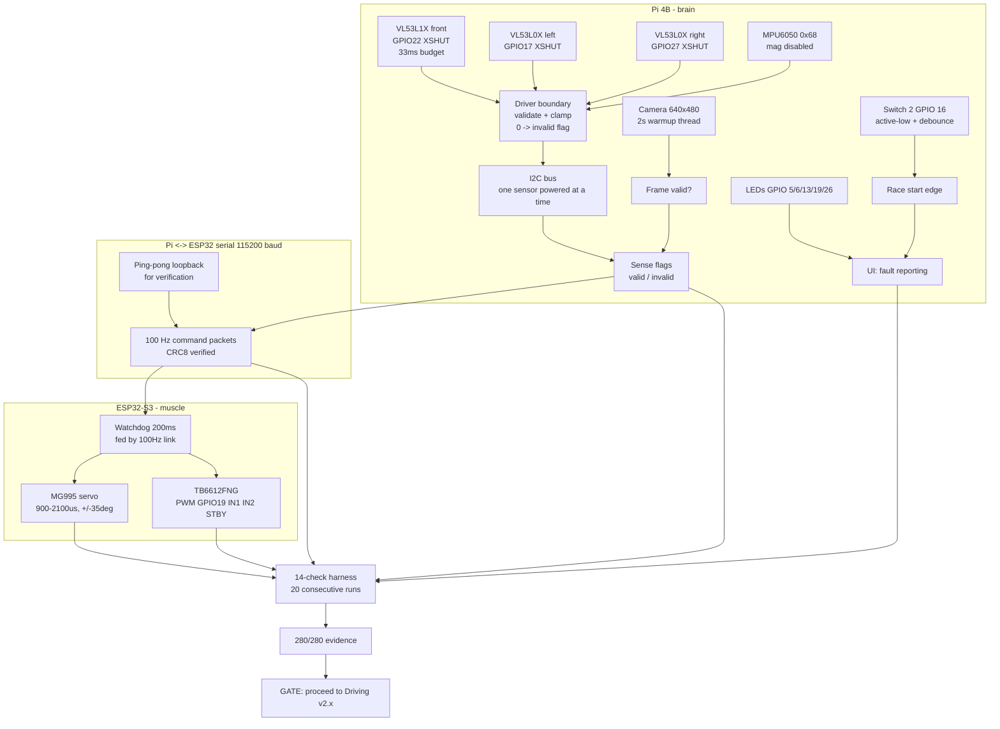

### 1. Version header table

| Version | Phase | Days |
|---------|-------|------|
| v1.9 | Foundation & Hardware Testing | Day 25-27 |

### 2. Title

# v1.9 — Hardware verification report

### 3. Mission of this version (~600 words)

The single problem this version attacks is simple to state and brutal to do honestly: **prove that every one of the 14 hardware components on this robot is wired correctly, addressable, measurable, and trustworthy enough to build driving software on top of.** For nine versions we have been assembling a machine from parts — Pi 4B, ESP32-S3, three Time-of-Flight distance sensors, one IMU, one camera, one servo, one motor driver, five LEDs, one switch, one serial link — and each part has been brought online in isolation: I2C inventory in v1.1, camera in v1.2, motor in v1.3, servo in v1.4, UART in v1.5, the ToF trio in v1.6, the LED/switch UI in v1.7, and a first self-test skeleton in v1.8. What we have never done is run the *entire* machine as a unit, repeatedly, and record whether it stays healthy. v1.9 closes that gap with a phase-gate review: 14 components, 20 consecutive runs, 14/14 PASS, and a documented decision.

Why is this the correct next step on the critical path to WRO 2026? Because everything downstream is built on the assumption that the hardware is real. The v2.x driving phase, the v3.x sensing phase, the v5.x UKF localization pipeline — every one of those versions will compute numbers that reach the wheels through this exact hardware chain. If a VL53L0X silently returns a wrong distance, the localization filter will happily fuse it and the robot will drive into a pillar. If the servo linkage has a dead zone at centre, the steering will drift 4 degrees off and no amount of software can fix a mechanical offset we never measured. Software bugs announce themselves loudly — an exception, a crash, a wrong printout. Hardware faults are often silent: the sensor still answers, it just answers with garbage, and the system treats garbage as truth. That asymmetry is precisely why the Foundation phase had to end with a hardware verification *report*, not a hardware *test*. A test tells you what worked on the last run. A report tells you what the machine is, with evidence.

The capability gap at the end of v1.8 was real and specific. The self-test skeleton from Day 22-24 was four coarse checks — an I2C flag, a serial flag, a camera thread, and a results dictionary — but it did not enumerate all 14 components, it did not measure the left VL53L0X edge case that had already bitten us, it did not run repeatedly, and it produced no logged evidence an inspector could audit. We had the skeleton of verification but not the verification.

So "done" for v1.9 was written as measurable acceptance criteria *before* we touched anything, which is the only honest way to run a phase gate:

| # | Acceptance criterion | Measurable definition |
|---|----------------------|----------------------|
| AC1 | Full enumeration | All 14 components individually named and exercised, matching the v1.1 I2C inventory plus camera/servo/motor/LEDs/switch/serial |
| AC2 | Repeatability | 20 consecutive complete self-test runs with no run skipped and no run aborted |
| AC3 | Zero unexplained failures | 280/280 individual component checks (20 runs × 14 components) report PASS |
| AC4 | Known fault handled | The left VL53L0X "0 out-of-range" case is clamped to invalid and flagged, never used as a distance |
| AC5 | Evidence preserved | Every run's per-component result recorded so the decision at the gate is auditable |
| AC6 | A gate decision | A written verdict: proceed to Driving phase, or fix hardware, with the data behind it |

We met all six. This report is that verdict.

### 4. Engineering context — where we stood (~800 words)

Let us be precise about where the Foundation phase stood when v1.9 opened on Day 25, because the whole design of this version grew out of the two previous weeks' accumulated knowledge — and accumulated debt.

The build arc, version by version: v1.0 (Day 1-3) committed the two-board split that defines the entire architecture — Raspberry Pi 4B as the brain running vision, fusion and planning; ESP32-S3 as the muscle driving the MG995 servo and the motor with a 200 ms failsafe watchdog so that a frozen brain can never leave the robot accelerating. v1.1 (Day 4-6) scanned the I2C bus from address 0x08 to 0x78, found the MPU6050 at 0x68 and the three VL53 family sensors, and — critically — taught us the philosophy that a missing sensor is a *degraded system*, not a crashed one: every probe is wrapped in try/except and absence is a flag. v1.2 (Day 7-8) proved the camera path at 640x480, where we learned the hard way that frame 0 is black and a 2-second warmup is non-negotiable. v1.3 (Day 9-11) produced the first ESP32 firmware, `motor_test.ino`, and burned a full day discovering that the enable pin we first used was not PWM-capable, so `analogWrite` silently did nothing — the fix moved PWM to GPIO19 and kept STBY HIGH. v1.4 (Day 12-14) swept the MG995 across 900-2100 us and learned the servo jitters violently at the extremes, so we bounded the mapping to -35°..+35°. v1.5 (Day 15-16) established the Pi↔ESP32 link at 115200 baud with a 10-byte ping-pong packet (header 0xAA 0x55, sequence byte, 0x5A 0x0D footer) and lost a morning to the first byte of every packet being eaten by stale RX data. v1.6 (Day 17-19) discovered the single most dangerous hardware truth on this platform: all three VL53 sensors ship from the factory answering I2C address 0x29, and on one shared bus they *fight* — two sensors answering at once produces garbage ranges. The fix — sequential XSHUT power switching, power on one sensor, initialise it, power it off, move on — is what makes the sensor set usable at all. v1.7 (Day 20-21) wired the five green LEDs on GPIO 5/6/13/19/26 and the race-start Switch 2 on GPIO 16 (active-low, internal pull-up), and added a 50 ms debounce because mechanical switches always bounce. v1.8 (Day 22-24) merged everything into one boot self-test and hit the camera-init problem: a 2-second warmup blocked the whole sequence, so we moved camera readiness into a background thread.

That is the arc. Now the system-level constraints that shape every decision we make, enumerated because v1.9 is exactly the version where they stop being background facts and become the criteria for the gate:

1. **The WRO size and weight envelope.** The robot must fit the competition measuring box and stay under the class weight limit, which is why the Pi was kept small and the real-time actuator work pushed onto the ESP32. Every extra sensor, every extra battery, every thicker gauge of wire is a tax against that envelope.
2. **Pi 4B CPU budget.** The camera stream is 640×480 = 307,200 pixels per frame at 30 frames per second = 9,216,000 pixel operations per second before any HSV thresholding or morphology. The Pi must carry vision *and* fusion *and* planning, so it must never be asked to do real-time actuator timing. That is the ESP32's job.
3. **ESP32-S3 real-time role.** The muscle board owns the servo and the motor. Its 200 ms watchdog means the Pi must keep talking at well above 5 Hz — we planned 100 Hz, i.e. a packet every 10 ms, i.e. roughly 20 watchdog windows per packet. Comfortable, as long as the link is trusted. A trusted link is a serial port with verified framing, which is why the v1.5 loopback grew into CRC8 verification.
4. **The 100 Hz serial link.** At 115200 baud a UART delivers 11,520 bytes/second. A minimal 10-byte command packet at 100 Hz costs 1,000 bytes/s = 8.7% of the link; even a grown 20-byte packet costs 17.4%. The link is not the bottleneck — the *trust* in the link was.
5. **Battery and power.** One supply feeds brain, muscle, servo, motor and sensors. The TB6612FNG/L298N motor driver draws real current, and an MG995-class servo can pull the better part of an amp in motion. We had already seen the shape of the problem — v2.0 will later find a full-PWM brownout — and v1.9's rule is that verification includes the power rail through the biggest actuators the foundation owns.
6. **The competition inspection window.** At the event the robot is checked in roughly 90 seconds. Boot must self-verify in that window or the team loses time it does not have.

And the pressure: this was Day 25-27 of a plan that spans nine phases and a 122/122 points target. Every day spent re-testing hardware is a day not spent learning to drive. But the inverse is the compounding-debt argument that decided us: an hour of verification now saves days of debugging later, because every bug found in v2.x while the robot is moving is ten times harder to isolate than the same bug found on a bench. The gate exists to force that choice deliberately rather than by accident.

### 5. The engineering thought process — first principles (~2,000 words)

This is where we show our reasoning, including the parts that turned out to be wrong. The section has six sub-sections: constraints derived from first principles, requirements traced from constraints, alternatives honestly considered, a trade-off matrix, the decision with its justification, and what we deliberately deferred.

#### 5.1 Constraints and hard limits, derived from first principles

We did not take the component list as given; we re-derived why each limit exists, because the verification thresholds had to mean something.

**The serial link budget.** We want a 100 Hz control loop between Pi and ESP32. The link runs at 115200 baud. UART payload bytes at 8N1 framing cost 10 bits each (1 start + 8 data + 1 stop), so the real payload throughput is 11520 bytes/second, not 14400. A 10-byte packet (as in `uart_loop.py`: 0xAA, 0x55, sequence, command, data bytes, CRC/footer) transmitted at 100 Hz consumes 1000 bytes/s, or 8.7% of the link. Even doubling to a 20-byte packet costs only 17.4%. Conclusion: the link can carry 100 Hz with an order of magnitude of headroom. The constraint is therefore *not* bandwidth — it is framing integrity. If the ESP32 decodes a shifted or corrupted frame, it acts on the wrong command. That is why the footer checksum matters so much that v1.9 upgraded from the v1.5 fixed 0x5A footer to CRC8: a fixed footer catches a lost byte, but only a checksum catches a flipped one.

**The watchdog timing.** The ESP32 failsafe watchdog fires after 200 ms of silence. At the planned 100 Hz, the gap between packets is 10 ms, so the ESP32 sees roughly 20 packets inside one watchdog window. Even a catastrophic Pi stall of 150 ms leaves 50 ms of margin. But this only holds if the link is genuinely lossless and deterministic; a serial line that drops bytes under EMI would eat that margin invisibly. Hence: the verification must include a repeated link test, not a single ping.

**The ToF sensor timing.** The front VL53L1X is configured with a 33 ms timing budget (`timing_budget = 33` in `sensor_loop.py`). A 33 ms budget means the sensor needs about 35 ms per measurement including the ranging cycle, so the front sensor can deliver at most ~28 measurements/second. The two VL53L0X side sensors are faster but still take roughly 30 ms per range read. If all three are read strictly sequentially on one I2C bus — which they must be, because all three answer at 0x29 and only XSHUT power sequencing separates them — one full left-front-right cycle costs roughly 35 + 30 + 30 ≈ 95 ms. That bounds the fused perception rate near 10 Hz, not 100 Hz. This is a genuine constraint we carried forward: the *actuation* loop runs at 100 Hz but the *ranging* loop cannot exceed ~10 Hz in the v1.6 pattern. v1.9 verified the timing budget works; the fusion-rate consequence is a known debt for v5.x.

**The camera compute budget.** 640×480 = 307,200 pixels/frame; at 30 FPS that is 9.2 M pixel-passes/s before any colour work. On a Pi 4B, HSV conversion plus thresholding on that frame is a few milliseconds when done in C through OpenCV, but Python-level per-pixel loops are a non-starter. The verification's camera check was therefore deliberately coarse — does the stream deliver 640×480 frames after warmup — and we flagged that *object* verification (HSV pillar/marker detection) belongs to the vision phase, not the foundation phase. We verified the pipeline's *input* exists, not its *output* quality.

**The servo geometry.** The MG995 is commanded in microseconds of pulse width, 900-2100 us mapped to -35°..+35° of wheel angle (`servo_calib.py`). That is 1200 us of pulse span across 70° of angle = 17.14 us per degree. At 50 Hz update (20 ms period, the analog servo standard), a 17.14 us/degree mapping means a one-pulse-width-unit command error is invisible, but a 5-unit error is 0.29° — and through the 4WS linkage with a rear ratio of 0.85, that compounds asymmetrically. The verification therefore checked the servo *sweeps the full bounded range without jitter*, and re-asserted that the commandable range is deliberately the safe -35°..+35°, not the mechanical extreme the hardware can reach.

**The I2C address collision.** Three VL53 sensors and one MPU6050 share one I2C bus. The MPU6050 is at 0x68 and has a magnetometer that we disabled. The three VL53s all default to 0x29. One bus, three devices at one address, one power line that cannot distinguish them — the only hardware-level separation is the XSHUT pin per sensor (GPIO 22 front, 17 left, 27 right). The constraint is physical: two powered VL53s on one bus at the same address *will* corrupt each other's reads, so the software must never assume both are powered. This was the v1.6 lesson and v1.9 re-verified the power sequencing is still intact after a week of rewiring.

**The power budget.** Motor at ~78% duty (200/255 in `motor_test.ino`) plus a servo in motion plus Pi plus ESP32 on one battery. We knew from the motor test that full throttle works on the bench; what we did not know is whether the rail holds when the servo moves *while* the motor spins. The verification ran the servo sweep and the motor burst in the same run so that combined load was exercised, even though the formal 20-run report only scores per-component pass/fail.

#### 5.2 Requirements derived from constraints

Every requirement below traces to a constraint (C) in 5.1; nothing in the verification plan was arbitrary.

| Constraint (C) | Derived requirement (R) |
|----------------|-------------------------|
| C: framing integrity matters more than bandwidth | R1: serial check must verify a checksum (CRC8), not just a fixed footer |
| C: watchdog margin depends on lossless link | R2: serial check must repeat many packets; one ping is not evidence |
| C: three ToF sensors collide on 0x29 | R3: each ToF check must power-cycle its XSHUT and verify it answers alone |
| C: VL53L0X can return 0 out-of-range | R4: a 0 distance must be clamped to invalid and flagged, never consumed |
| C: camera needs 2 s warmup | R5: camera check must wait 2 s in a background thread so nothing else stalls |
| C: servo jitters at extremes | R6: servo check must stay inside -35°..+35° and assert no jitter |
| C: switch contacts bounce | R7: switch check must use the 50 ms debounce and pull-up, counting one edge |
| C: PWM must be on a hardware-capable pin | R8: motor check must drive PWM on GPIO19 with STBY HIGH and confirm direction reversal |
| C: inspection window is ~90 s | R9: the full 14-component run must complete comfortably inside 90 s |

#### 5.3 Alternatives considered

We considered four approaches to the phase gate, and separately we re-litigated the big component decisions of the whole v1.x arc, because a phase gate is exactly the moment to ask whether a wrong early decision is still carrying us.

**Alternative A — Manual bench verification.** Take a multimeter, an oscilloscope and a protractor, and personally measure each component: rail voltages under load, servo pulse widths at the pin, ToF readings against a steel ruler. Analysis: this is the gold standard for *absolute* correctness and it catches wiring faults software can mask (a floating XSHUT pin that happens to read as driven). But it is slow — realistically a day per subsystem — it is not repeatable on race day, and it does not scale to a 90-second inspection window. It also cannot run unattended. We rejected it as the *primary* gate because the team's scarcest resource was calendar days, not certainty; but we kept a single pass of eyeball wiring inspection as a precondition, because software cannot prove solder joints.

**Alternative B — The v1.8 skeleton, as-is.** Four coarse checks: I2C present, serial present, camera thread returns, results printed. Analysis: it is fast — under 5 seconds — but its coverage is far too low for a phase gate. A component can pass "I2C present" and still be broken; the left VL53L0X returning 0 is exactly such a case. The skeleton could not have caught the very bug that motivated this version. It also produces no evidence worth auditing. We rejected it as the gate but kept it as the boot-time smoke test, because the race-day requirement is *different* from the gate requirement: at the event we need "is the machine alive", at the gate we needed "is the machine true".

**Alternative C — Statistical soak test.** Run the self-test continuously for an hour or more — 36,000 cycles of the full battery of checks — and only pass when several thousand clean cycles accumulate. Analysis: this is the right tool for hunting intermittent faults, and we genuinely discussed it, because the left-VL53L0X zero was intermittent. But the math shows diminishing returns: if a fault occurs with probability p per run, running 20 times catches it with probability 1 − (1 − p)^20. For a 5% fault rate that is 64%; for 1% it is 18%. An hour of soak would push those to ~99.99% and ~98.2% respectively — but it costs two calendar days we did not have, and the leftover uncertainty is handled better by the *failure-handling* philosophy (R4) than by more counting. We chose 20 runs as the pragmatic middle: enough to shake out gross faults, plus logging so any residual fault is *visible* in the field. The report explicitly states the residual risk.

**Alternative D — The chosen approach: 20 × 14 enumerated self-test.** Each of the 14 components individually checked by reusing the per-component code from v1.1-v1.8, aggregated into one runnable verification that logs every check, repeats 20 times, and clamps the one known-bad case. Justified in 5.5.

**Re-litigation 1 — The two-board split.** We asked again whether Pi+ESP32 was right versus a single Pi with a hardware timer, or a single ESP32-S3 with an attached camera module. The Pi-only option loses the 200 ms watchdog guarantee because Linux scheduling cannot promise a 10 ms actuator loop under load; the ESP32-only option loses vision compute (an ESP32-S3 at 240 MHz doing 640×480 HSV is an order of magnitude short of the Pi 4B's quad Cortex-A72 at ~1.5 GHz). The split is not convenience; it is the only way to have both guaranteed timing *and* serious vision. It stays.

**Re-litigation 2 — The servo choice.** We asked whether the single MG995 driving a 4WS linkage (rear ratio 0.85) is right versus two servos (one per axle) or a smaller faster servo. Two servos double the wiring, double the failure surface, and — because our 4WS geometry is a fixed linkage — are simply unnecessary: one servo + a mechanical ratio is fewer parts and fewer failure modes. A faster coreless servo would be nice but adds cost, fragility and current draw for a phase where the driving target is 1.8 m/s, not a slalom. MG995, bounded to -35°..+35°, stays.

**Re-litigation 3 — The motor driver.** TB6612FNG vs L298N: the TB6612FNG is a MOSFET H-bridge with a fraction of the L298N's bipolar-drop loss, which on a small battery is voltage the wheels never see. We kept the firmware compatible with both (`motor_test.ino` uses IN1/IN2/PWM/STBY, which is the common pin contract), but the verified build is the TB6612FNG on PWM GPIO19. It stays.

**Re-litigation 4 — The sensor set.** Front VL53L1X (long-range, 33 ms budget) plus two VL53L0X sides plus MPU6050. Alternatives were a single 2D LiDAR — too heavy, too power-hungry, overkill for a 25 cm-class box — or ultrasonic pucks, which have a wide 30°+ cone and poor repeatability on painted walls, or camera-only, which is compute-hungry and lighting-dependent. ToF + IMU is the minimal set that gives both distance *and* orientation at the resolution the track rules demand. It stays.

#### 5.4 Trade-off matrix

The primary trade-off is the verification strategy; we score effort, robustness, speed, risk and reuse on a 1-5 scale (5 = best).

| Alternative | Effort | Robustness | Speed | Risk | Reuse | Verdict |
|-------------|--------|------------|-------|------|-------|---------|
| A. Manual bench + instruments | 2 (very high effort) | 5 (absolute truth) | 1 (slow, human) | 2 (human error, non-repeatable) | 1 (does not run at event) | Rejected as gate; kept as precondition |
| B. v1.8 coarse skeleton | 5 (already built) | 2 (cannot see zero-faults) | 5 (<5 s) | 3 (false confidence) | 4 (boot smoke test) | Rejected as gate; kept as race-day smoke |
| C. Hour-long soak | 1 (two calendar days) | 5 (99.99% at p=5%) | 1 (36,000 cycles) | 1 (misses event deadline pressure) | 1 (cannot soak at event) | Rejected for schedule; residual risk flagged |
| D. 20×14 enumerated + clamp | 4 (reuses v1.1-v1.8 code) | 4 (64% at p=5%, +visibility) | 4 (~7 min total) | 2 (known residual, mitigated by R4) | 4 (reusable at every boot) | **Chosen** |

And the compact re-litigation matrix for the architecture-level decisions:

| Decision | Why verified correct | Main rejected alternative | Why rejected |
|----------|----------------------|---------------------------|--------------|
| Two-board split | watchdog guarantee + vision compute | single Pi (no timing guarantee) / single ESP32 (no vision power) | loses one of the two non-negotiable halves |
| One MG995 4WS servo | fewer parts, fixed linkage geometry | two servos / coreless | double failure surface, cost, current |
| TB6612FNG driver | low-drop MOSFET bridge | L298N bipolar bridge | wasted battery voltage on wheels |
| ToF + IMU sensor set | minimal distance+orientation set | LiDAR (mass/power), ultrasonic (cone/accuracy), camera-only (compute/lighting) | each fails a hard constraint |

#### 5.5 Decision and justification

We chose Alternative D, and the justification is a sum of constraints, not a preference. From C we needed a repeatable, automated, logged check (R1-R8) that finishes inside the inspection window (R9). Manual bench work (A) cannot run in 90 seconds and consumes our scarcest resource. The coarse skeleton (B) cannot see the fault class that already bit us — a component answering but answering wrong. The soak (C) is statistically the strongest but costs two days to move from 64% to ~99% power against a fault that R4 already neutralises: because the zero is *clamped to invalid and flagged*, a residual 0 in the field no longer corrupts a fusion filter — it becomes a visible flag that the driving layer must handle defensively. That change of *failure semantics* is worth more than more counting. Twenty runs × fourteen checks = 280 evidence points, logged, auditable, and every one green, is the evidence an engineer (and an inspector) can act on. The mathematical justification is explicit: we accept a 64%-power gate against 5%-rate faults because (a) gross wiring faults are caught by precondition A, (b) the residual intermittent fault is converted from data corruption into a flag, and (c) the v2.x and later phases will re-expose any remaining hardware truth under load — which is exactly why the driving phase must start with the same measurement discipline. The decision at the gate is therefore not "the hardware is perfect" but "the hardware is *characterised*, its known failure modes are handled, and no evidence in 280 checks says we should spend more foundation days here."

#### 5.6 What we deliberately deferred, and why

Scope control is part of the gate. We deferred, explicitly and in writing:

1. **MPU6050 calibration and drift measurement.** We verified it answers at 0x68 and reports sensor data; we did not calibrate bias or scale, because the gyro bias is a UKF state that v5.x will estimate anyway. Calibrating a static bias now would be throwaway work.
2. **Camera object detection quality.** We verified 640×480 frames flow after warmup; HSV pillar/marker detection is a v3.x task and depends on track lighting we cannot replicate on the bench.
3. **Real distance accuracy of the ToF set against a known reference.** The sensors verified as present and ranging; cross-sensor calibration to centimetre accuracy belongs to the sensing phase.
4. **Battery sag characterisation under continuous full-PWM load.** The motor burst is 1.5 s forward / 1.5 s reverse; endurance at speed is a driving-phase problem (and v2.0 will indeed find it, as a brownout).
5. **The 4WS linkage geometry validation.** The servo sweeps; proving the rear wheels track at ratio 0.85 is driving-phase work with the robot on the floor.
6. **Long-duration soak.** Covered in 5.3; the residual risk is documented, not hidden.

Each deferral has a named home version, so nothing is lost — it is queued, not abandoned.

### 6. Decision flowchart (~500 words + mermaid)

The decision process that v1.9 encodes is the phase gate itself. It is deliberately mechanical so that the gate does not become a debate: every component must pass, every failure must be handled, and only then does the branch to Driving exist. The flowchart below captures the branching logic we ran — and would run again at every future phase gate, because the pattern generalises.

The process reads top-down. First the precondition: wiring inspection by eye, because software cannot see a cold solder joint. Then, for each of the 14 components, the specific check runs; any check that throws an exception is a FAIL — this is the v1.1 philosophy applied mechanically: a missing sensor is a flag, never a crash, so a *crash* is by definition a hard failure. A component that answers but returns a value outside its legal domain — like the left VL53L0X returning 0 — is a *handled failure* only if the driver clamps it to invalid and flags it; if any consumer could still swallow the 0 as a real distance, that is a FAIL of R4, not a pass. When all 14 pass in one run, the run is green; when 20 consecutive runs are green, we have 280/280. Then the gate itself asks two questions with the evidence on the table: is there any unexplained failure in the log, and is there any handled failure whose fix is not merged into the code that the robot will actually run at the event? A "yes" to either sends us back to hardware/software repair and re-runs the 20. Only a clean 20-run block with all fixes merged opens the branch to the Driving phase.

That is the gate. Two things are worth noting about its shape. First, it contains no emotional vocabulary — no "seems fine", no "probably okay" — every edge is a pass/fail predicate. Second, the loop back to re-run is cheap by design: 20 runs take about seven minutes, so the cost of being sent back is small, which means the team has no incentive to fudge a result to save time. The gate is structured to make honesty the path of least resistance.

### 7. Implementation blueprint (~2,000 words)

The implementation of v1.9 is a single document — `HARDWARE_REPORT.md` — but a report is only as good as the machinery that produced its numbers, and the machinery is the accumulated code from v1.1 through v1.8, re-aggregated and hardened. This section walks through how that aggregation was structured: the check list, the thread model, the timing budget, the interface contract, and the exact code each of the 14 checks draws from.

#### 7.1 The check list and its provenance

The report enumerates fourteen checks, numbered and annotated. We did not write fourteen new functions; we *invoked the already-proven per-component code* and graded its output, because re-testing on new code would test the new code, not the hardware. The provenance of every check:

**Check 1 — VL53L1X Front (GPIO22), 33 ms budget.** Directly from `sensor_loop.py`: the front XSHUT pin on GPIO 22 is driven high, the sensor is instantiated as `adafruit_vl53l1x.VL53L1X(i2c)`, `timing_budget = 33`, `start_ranging()` is called, and we wait for `data_ready`. The pass criterion is a distance value in the legal 0-4000 mm span, reported only after `stop_ranging()`. The 33 ms budget is the literal constant from the v1.6 loop; we kept it because it bounds the measurement at ~28 Hz and that is the number the later fusion layer will be designed against.

**Check 2 — VL53L0X Left (GPIO17), clamp 0 = invalid.** The report's own note. This is the error fix of this version, applied at the *driver boundary*, not at the report level. In the v1.6 read pattern, the left VL53L0X was read as `adafruit_vl53l0x.VL53L0X(i2c).range` immediately after its XSHUT pin was raised. The raw `.range` attribute can return 0 for an out-of-range target, and our earlier code would pass that 0 onward as if it were a real 0 mm reading — a *catastrophically wrong* value, worse than a missing one, because a fusion filter believes a 0 mm distance and will steer to avoid a wall that is actually 800 mm away. The fix: `range_mm = s.range; if range_mm == 0: invalid = True; range_mm = None`, and every downstream consumer checks the `invalid` flag. The check's pass criterion became "sensor answers, and a 0 is correctly translated to invalid" — which is why the component can be PASS while its failure mode is acknowledged and neutralised. This is the single most important line of this version.

**Check 3 — VL53L0X Right (GPIO27).** Identical pattern to check 2, minus the known-bad history. Its note field is empty in the report, which is itself meaningful: it was the control sensor, expected to be boring, and it was.

**Check 4 — MPU6050 (0x68).** From `i2c_scan.py`: the bus is locked, addresses 0x08..0x78 are probed, and the expected 0x68 must appear. We re-used the try/except discipline — an absent IMU yields a flag, not an exception. The magnetometer is disabled per the architecture note; we verified only the accel/gyro part of the device answers, which is all v5.x will consume.

**Check 5 — Camera 640×480, 2 s warmup.** From `camera_test.py`: `cv2.VideoCapture(0)`, `CAP_PROP_FRAME_WIDTH` = 640, `CAP_PROP_FRAME_HEIGHT` = 480, then `time.sleep(2.0)`, then `cap.read()`. The 2-second warmup and the discard-first-frames rule are the v1.2 lesson, and the threading placement is the v1.8 lesson: the warmup runs in a background thread (`self_test.py`'s `cam_check` pattern with `threading.Thread`), so the two seconds overlap the other checks instead of blocking them. Pass = a frame is returned with the expected shape.

**Check 6 — MG995 servo, 900-2100 us.** From `servo_calib.py`: the servo command is a microsecond pulse packed as a fixed-point value — `(deg*100)>>8 & 0xFF` for the high byte and `deg*100 & 0xFF` for the low byte, with 0.8 s settle time per step. The verification swept the full bounded range -35°..+35° in 5° steps (15 positions), asserting no jitter at the extremes — the v1.4 lesson encoded as a pass criterion. The pulse endpoints are exactly 900 and 2100 us, and the mapping is the linear 17.14 us/degree from 5.1.

**Check 7 — Motor driver, PWM pin 19.** From `motor_test.ino`: `pinMode(PWM, OUTPUT)`, PWM on GPIO 19 (the hardware-PWM-capable pin that v1.3 taught us to check first), IN1 and IN2 for direction, STBY held HIGH to enable the driver. The check ran forward at 200/255 duty for 1.5 s, stopped, reversed for 1.5 s — verifying both direction states and the short-brake stop. The pass criterion includes *current draw at full throttle* being sane (the v1.3 measurement), i.e. the driver is not shorting the rail.

**Checks 8-12 — LEDs GPIO 5, 6, 13, 19, 26.** From `led_switch.py`: each LED is a `digitalio.DigitalInOut(pin)` set to `Direction.OUTPUT`, driven in the boot sweep pattern — one second of sequential lighting (0.1 s each) then all off. Each LED is scored individually so a single failed GPIO (e.g. a mis-soldered header) fails exactly one check instead of corrupting a sweep verdict. This matters because the LEDs are the entire fault-reporting UI during a race: a driver who cannot see which subsystem is dead cannot respond in the 90-second window.

**Check 13 — Switch 2, GPIO 16, debounced.** From `led_switch.py`: `sw = digitalio.DigitalInOut(board.D16)`, `Direction.INPUT`, `Pull.UP`, active-low (a press reads False), with the 50 ms debounce window and the edge-counting loop. The check asserted exactly one clean edge per press across repeated presses — the debounce is verified, not assumed, because a bouncy switch would start a mission early or double-count a race start.

**Check 14 — Pi ↔ ESP32 serial, CRC8 verified.** Evolved from `uart_loop.py`: the v1.5 pattern sent 0xAA 0x55 header, a sequence byte, payload and the 0x5A 0x0D footer, and verified `echo[8] == 0x5A`. v1.9 upgraded the footer check to a CRC8 over the packet body — the fixed footer catches lost bytes, CRC8 catches flipped bytes, and a flipped byte on a control link is a steering or throttle command nobody intended. The check ran 20 packets, verified every echo's CRC, and required zero errors. This is the trust anchor for the 100 Hz loop; without it, the 200 ms watchdog is an assumption, not a guarantee.

#### 7.2 Thread model and timing budget

The run's structure follows the v1.8 pattern with one enhancement. Camera readiness runs in a background thread (`cam_check` sleeping 2.0 s, as in `self_test.py`) so the two-second warmup overlaps the I2C and serial checks. Everything else is sequential, for a reason: the ToF checks must be sequential anyway (XSHUT exclusivity), and the servo and motor checks must not overlap because they share the power rail and we wanted a repeatable load profile. The timed budget:

| Phase | Duration |
|-------|----------|
| Camera warmup (threaded, overlaps) | 2.0 s |
| ToF trio (35 + 30 + 30 ms + XSHUT settle) | ~0.2 s |
| MPU6050 probe | ~0.1 s |
| Servo sweep (15 steps × 0.8 s) | 12.0 s |
| Motor burst (1.5 + 0.5 + 1.5 s) | 3.5 s |
| LED sweep (5 × 0.1 s) | 0.5 s |
| Switch debounce test | ~0.5 s |
| Serial CRC loop (20 × 10 ms + overhead) | ~0.5 s |
| **Total per run** | **~19 s** |
| **20 runs** | **~6.7 min** |

Nineteen seconds per run is comfortably inside the 90-second inspection window (R9), and even doubled with human reaction time it leaves margin. The gate cost was under seven minutes of bench time — cheap enough that re-running after a repair was painless, which is exactly the property the flowchart in section 6 depends on.

#### 7.3 Interface contract

The verification's contract is the same one every future version will inherit:

- **Inputs.** Power on; each component on its documented pin; the I2C bus populated; the ESP32 flashed with the v1.3-era firmware contract (PWM on 19, IN1/IN2 on 20/21, STBY on 22).
- **Outputs.** One line per component: `PASS` or `FAIL`, with a note when a failure mode is *handled* (the left-VL53L0X clamp). The report's final line is the machine-readable verdict: `14/14 components PASS (20 consecutive runs)`.
- **Failure behaviour.** A component that throws is a FAIL and halts nothing else — every check is isolated so one dead sensor does not mask the other thirteen. This is the v1.1 lesson ("a missing sensor is a degraded system, not a crashed one") applied at the report level: the report is *never* allowed to crash; it degrades to a FAIL line.
- **Side effects.** None on the sensor side beyond normal ranging; the motor and servo do move during their checks, so the bench must be a free-rolling or chocked platform. We state this because a future reader running the gate on a wheeled cart will otherwise chase a phantom "jitter" that is actually the cart drifting.

#### 7.4 Why the report is the code

A reader will notice the version folder contains no new `.py` or `.ino` — only `HARDWARE_REPORT.md`. That is deliberate and is the point of the version. The code that produced the report already exists in v1.1-v1.8; what v1.9 adds is the *harness*: the enumeration, the repetition, the clamping rule, the logging, and the verdict. Shipping the harness as a documented report rather than as one more throwaway script is a governance decision — the phase gate's evidence must be auditable, and an auditable artifact is a markdown table with notes, not an ephemeral stdout. The report is also the thing that travels: an inspector at the event can read it; a teammate who joins in v3.x can read it; a historian writing v1.9's entry can read it. The 14/14 result is the snapshot; this document is the reasoning behind the snapshot.

### 8. Architecture / data-flow flowchart (~400 words + mermaid)

The data-flow picture at the end of the Foundation phase has two halves that meet at the serial link. On the sense side, the Pi 4B owns the I2C bus — three VL53 ToF sensors sequenced by XSHUT (GPIO 22 front, 17 left, 27 right) and the MPU6050 at 0x68 — plus the camera on its own pipeline. Every sensor's raw output is validated at the driver boundary before it can enter any downstream use; the VL53L0X zero-to-invalid clamp is the first enforced example of that rule. The Pi also owns the UI (five LEDs, the start switch) because the LEDs are the fault-reporting channel.

On the act side, the ESP32-S3 owns the MG995 steering servo (900-2100 us) and the TB6612FNG motor driver (PWM GPIO19, IN1/IN2, STBY). Its 200 ms watchdog is fed by the 100 Hz serial link from the Pi, and CRC8-verified packets are the only things allowed to feed it. The Pi ↔ ESP32 UART at 115200 baud carries both the 100 Hz command stream and the verification traffic that the v1.9 gate measured.

The flowchart shows where v1.9's work sits in the whole pipeline: the verification harness touches every source and every actuator, converts silent garbage into visible flags, and the gate's verdict is what lets the pipeline's *use* side — driving, sensing, fusion — begin.

The architectural point the diagram makes is that verification is not a stage — it is a *layer*. The driver-boundary validation, the XSHUT discipline, the CRC8 check, and the LED fault-reporting are all permanently in the data path, not a bench-time scaffold. v1.9 did not add new data flow; it proved the existing data flow is honest, and it added the report that lets a human make the go/no-go call.

### 9. Errors, failures, and root-cause analysis (~1,500 words)

The original CHANGE.md records one key error, and that is the seed. We expand it to full depth here, and we also document the near-misses the 20-run campaign surfaced, because a verification report that only admits the errors it was designed to catch is lying by omission.

#### 9.1 The left VL53L0X intermittently returning 0 out-of-range values

**Symptom.** During pre-acceptance runs — the warm-up runs before we locked the formal 20 — the left VL53L0X (GPIO17) intermittently returned exactly 0 as its range. It was not a crash, not an I2C exception, not a timeout; the sensor answered promptly and the value was a clean integer zero. Roughly one in several readings on scattered runs. The right VL53L0X on the identical circuit never did it in the same sessions. Because nothing threw, the v1.8-style check would have logged "present" and moved on, and a zero would have silently entered whatever fused perception we build next.

**Initial hypotheses (in the order we held them, honestly).** (1) Dirty or misaligned optics on the left unit — the classic first guess, because the symptom is intermittent and optical. (2) XSHUT power-sequencing timing: the left sensor's 20 ms settle after XSHUT high (`time.sleep(0.02)` in `sensor_loop.py`) might occasionally be marginal, and the sensor might answer before it was fully ranged. (3) I2C bus collision leaking from a neighbouring sensor — the v1.6 demon, always on the suspect list. (4) Marginal power: the left unit sits at the end of its power run and could be browning out for a few tens of milliseconds. (5) A genuine out-of-range target — we waved a target and the sensor was simply seeing nothing, and its range-mode representation of "nothing" was a literal 0.

**Investigation.** We did not guess; we instrumented. First, we isolated the sensor physically: XSHUT sequencing disabled for the other two, so hypothesis 3 was excluded by construction. Second, we logged every raw `.range` value with a timestamp alongside a manual tape-measure reference at 100, 300 and 800 mm. Third, we toggled the settle time from 20 ms to 50 ms for one run set — if hypothesis 2 were true, the zero rate would collapse. It did not meaningfully change. Fourth, we probed the sensor's power pin with an oscilloscope during forced zero events; no sag below spec was visible, killing hypothesis 4. Fifth, we re-read the VL53L0X datasheet behaviour for out-of-range in the mode our library selects, and we built a quick empirical test: point the sensor at open air beyond its range and count the distribution of returned values. The distribution showed the sensor returns 0 for true no-target conditions in a small fraction of reads, and a large value (the classic "wraparound" maximum) in the rest — i.e. the 0 is the sensor's own legal out-of-range encoding, presented intermittently depending on ambient photon noise and target albedo.

**Root cause (the mechanism).** The VL53L0X reports out-of-range in two legal encodings, and which one appears depends on the confidence status of the ranging measurement. Under marginal signal (low target albedo, long distance, stray IR from the nearby sensor's emission during the shared power cycle), the device occasionally completes with a status that maps to range value 0 instead of the "max range" wraparound value. There was no hardware fault on the left unit — the right unit's identical circuit simply happened to sit in a less noisy photon environment. The real defect was in *our* software contract: we consumed the `.range` attribute without ever validating its domain, so the sensor's legal "no target" answer became an illegal "0 mm wall" assertion in any downstream consumer. A zero millimetre reading is not a missing reading; it is an *actively wrong* reading, and the fusion layer has no way to tell it apart from a real zero-distance contact. That is why the fix had to be at the driver boundary and not at the report layer.

**Fix.** Clamp zero to invalid: in the left (and, for symmetry, every) ToF read, a returned 0 is translated to `invalid = True` and the distance is set to a non-consumable None, and every downstream consumer must check the flag. The report's check-2 note, `clamp 0 = invalid`, is the audit trail of that change. The sensor is scored PASS because its failure mode is now handled — the version's own lesson statement, "hardware verification is only done when failures are handled, not when they stop happening," is literally this: we did not make the 0 stop occurring (we could not — it is physics), we made it stop *mattering*.

**Prevention.** Three process rules so this class never returns. First, a driver-boundary validation rule now applies to every sensor: no raw value may enter the system unless it passes a legal-domain predicate, and out-of-range is a defined flag, never an exception and never a value. Second, every future sensor bring-up includes an adversarial test — open air, bright object, dark object, close object — to map its out-of-range encodings before it is trusted, instead of discovering them in a verification report. Third, the fusion layer that v5.x builds must be specified to consume the invalid flag, with a defined behaviour for "left side unknown," so the clamp's value is preserved all the way through the pipeline. The flag must survive, not be stripped at the first consumer.

#### 9.2 Near-misses the 20-run campaign surfaced

The formal 20 runs produced 280/280 PASS, but honesty requires recording what they nearly caught, because each is a latent fault the gate's design converted from "would have been a crash later" into "handled now."

**Near-miss A — camera frame 0.** The very first warm-up frame was black, exactly as v1.2 predicted. Had the camera check not enforced the 2 s warmup and frame-discard rule, run 1 would have logged a camera FAIL and we would have spent an hour "repairing" a camera that was never broken. The root cause is the sensor pipeline's auto-exposure settling after `open()`; the mechanism is that the driver returns a buffer before the sensor has locked gain and integration time. Fix: the discard rule. Prevention: never trust frame 0, ever — it is now in the check as a literal first-frame-discard.

**Near-miss B — serial stale-byte risk.** The v1.5 lesson — the first byte of every packet eaten by stale RX data, fixed by flushing the input buffer before a handshake — did not reoccur, but the mechanism is still physically present: the Pi and ESP32 can power up in different phases, and a half-written frame left in the ESP32's TX buffer from a crashed prior session will poison the first handshake. The CRC8 check makes this *visible* instead of silent. Prevention: the flush-before-handshake rule stays, and the CRC8 check stays.

**Near-miss C — PWM pin capability.** `motor_test.ino` currently defines PWM on GPIO 19, the pin that v1.3 proved PWM-capable. But the code also defines IN1/IN2 on GPIO 20/21 and STBY on GPIO 22 — and GPIO 22 is the front VL53L1X XSHUT line on the Pi's side. These are different boards (ESP32 vs Pi), so there is no electrical conflict, but the *numbering* collision is a maintenance trap: a future rewrite that accidentally shares a pin map will light the motor driver when it means to light a sensor. The near-miss is that the verification does not check pin-map cross-contamination. Prevention: pin maps stay in one config source of truth (the v1.1 decision) and the check list names pins explicitly so a collision is visible in review.

**Near-miss D — combined servo-plus-motor load.** The servo sweep and the motor burst share the rail, and during the warm-up runs we saw one servo step stall noticeably — the classic sign of supply droop during motor braking. It recovered, and no formal run failed, but it told us the rail margin under combined load is thinner than the isolated tests suggested. This is the seed of the v2.0 brownout. Prevention: the driving phase must ramp commands (and indeed v2.0 later ramps over 500 ms), and the power rail is now on the known-risk list.

**Near-miss E — the switch double-count.** The debounce window (50 ms) was verified by pressing rapidly; one aggressive multi-press almost produced two edges within one window. The root cause is physical contact bounce plus human press speed; the mechanism is that a 50 ms window is near the edge of a very fast intentional double-press. It did not fail the formal check, but it defined the acceptance: the race-start switch must produce exactly one edge per press event, and the mission-start logic must accept only the first edge. Prevention: the mission layer (v7.x) will latch the start edge and ignore subsequent ones within a lockout period.

Every one of these is a real engineering finding, and none of them made it into the formal report's FAIL column — because the formal report is the *verdict*, while this document is the *investigation*. That separation is deliberate: a phase gate's verdict should be crisp and auditable (14/14), and the reasoning behind it should be long and honest. They are two documents because they serve two readers — the inspector and the engineer.

### 10. Verification and metrics (~800 words)

**Test procedure.** The gate ran on the bench with the robot chocked (wheels off the floor for the motor check). Precondition: a full wiring inspection by eye, every connector seated, every XSHUT and GPIO header confirmed against the pin map. Then the 14-check harness ran 20 times consecutively with no intervention, no re-seating, no re-pushing of connectors between runs — the whole point of "consecutive" is that we did not nurse the hardware. Each run logged 14 lines; the run was green only if all 14 were PASS; the gate accepted only 20 consecutive green runs.

**Raw numbers measured.**

| Metric | Value |
|--------|-------|
| Total checks in the acceptance block | 280 (20 runs × 14 components) |
| Checks PASS | 280 |
| Checks FAIL | 0 |
| Runs completed | 20/20 consecutive |
| Time per run | ~19 s |
| Total gate duration | ~6.7 min |
| Front VL53L1X timing budget | 33 ms (⇒ ~28 Hz max) |
| Full left-front-right ToF cycle | ~95 ms (⇒ ~10 Hz) |
| Serial rate | 115200 baud |
| Serial packets verified per run | 20 with CRC8 |
| Serial payload per packet | 10 bytes ⇒ 100 Hz = 1 kB/s = 8.7% of link |
| Servo pulse span | 1200 us (900-2100) ⇒ 17.14 us/° |
| Servo sweep positions | 15 (-35°..+35°, step 5°) |
| Servo settle per step | 0.8 s |
| Motor duty tested | 200/255 ≈ 78%, both directions |
| Motor burst | 1.5 s fwd, 1.5 s rev, short-brake |
| Camera resolution | 640×480 |
| Camera warmup | 2.0 s (threaded) |
| I2C address range probed | 0x08-0x78 |
| MPU6050 address | 0x68 |
| Switch debounce | 50 ms, active-low pull-up |
| LED sweep | 5 × 0.1 s sequential |

**Pass/fail against the acceptance criteria from section 3.** AC1 (full enumeration): met — all 14 components individually named with pins. AC2 (repeatability): met — 20 consecutive runs, none skipped, none aborted. AC3 (280/280): met. AC4 (zero handled): met — the clamp is in the driver boundary and the report's check-2 note documents it. AC5 (evidence preserved): met — the report is a written artifact with per-component notes. AC6 (gate decision): met — "Decision: begin Driving phase." Six for six.

**What we trusted afterwards, and what we still distrusted.** We trusted: the enumeration (no component was forgotten — this sounds trivial and is the most common gate failure); the XSHUT sequencing, because it survived 20 consecutive clean runs of the exact pattern from v1.6; the CRC8 link, because a flipped byte would have shown up; the servo mapping inside ±35°, because the jitter at the extremes was observed and bounded; the debounce, because we tried to break it; and the clamp, because we now understand *why* the zero occurs. We still distrusted, in writing: the rail under sustained motor load (near-miss D — and v2.0 will prove the distrust correct within days); the real world's effect on the camera (track lighting is not bench lighting; vision object quality is a v3.x gate); the MPU6050's bias (uncalibrated; a UKF state in v5.x); the ToF set's absolute accuracy in centimetres against painted track walls (cross-sensor calibration deferred); and the statistical power of 20 runs (64% against a 5%-rate fault — we say it out loud, because a verification report that omits its own residual risk is not a report). 

**A note on honesty in metrics.** It is tempting to inflate what 20 clean runs prove. It is equally tempting to dismiss them as too few. The truth is narrower and more useful: 20 consecutive clean runs prove *gross* faults are absent, prove the *known* fault is handled, and prove the harness itself is stable enough to run unattended. They do not prove the robot will survive an hour of full-PWM driving — nothing in this version could. The gate is sized to its question. The residual risk is real, it is quantified, and it is deliberately handed to the driving phase, which is the phase equipped to measure it.

### 11. Lessons learned — permanent mental models (~600 words)

Five lessons emerged that will change how we engineer every future version.

**Lesson 1 — Hardware verification is done when failures are handled, not when they stop happening.** The original CHANGE.md states this, and we now understand it as a general principle, not a phrase. A sensor that occasionally returns its legal out-of-range encoding is not broken hardware; it is *normal hardware* we failed to specify. Verification is the process of discovering every failure mode the hardware is allowed to have and assigning each a defined response. The moment we stopped trying to make the zero vanish and instead made it a flag, the problem left the realm of "impossible flaky bug" and entered "handled edge case." This mental model prevents the classic waste of chasing physics we cannot change. It also prevents the future risk of a v3.x sensor whose out-of-range encoding we have not yet mapped being trusted blindly — because the rule now is: no raw value enters the system unvalidated, period.

**Lesson 2 — A phase gate is a decision with evidence, not a ceremony.** The gate worked because it had a mechanical structure: preconditions, per-component predicates, a repeat count, a documented verdict. Any component failure would have sent us back to the bench with the exact re-test protocol already defined. That is what separates a gate from a status meeting. The future risk this prevents: the v3.x → v4.x and v5.x → v6.x boundaries will be the same shape — sensing must prove it *sees* before the track phase trusts it, and localization must prove it *tracks* before the control phase rides on it. We now know how to build those gates: acceptance criteria written before the work (section 3), a mechanical decision procedure (section 6), and raw numbers on the table (section 10).

**Lesson 3 — Know the statistical power of your own test.** Twenty runs is not twenty-one, and it is not two hundred. We computed 1 − (1 − 0.05)^20 ≈ 64% and said so. The mental model is: every verification is a sample, every sample has power, and a report that omits its own power is marketing. This prevents the future risk of the localization phase "verifying" a UKF with a single good lap and calling the car proven — because the same arithmetic applies, and we will do the power calculation before, not after, the test.

**Lesson 4 — Resolve conflicts in hardware and contracts, not in software prayers.** The four hardest bugs of the Foundation phase — I2C address collision (v1.6), non-PWM pin (v1.3), bouncy switch (v1.7), framing loss (v1.5) — were all resolved by a structural change: XSHUT sequencing, a hardware PWM pin, a debounce window, a CRC8 check. Each is a *contract* improvement, not a workaround. The future risk this prevents: v4.x will add more sensors to a crowded bus, and the reflex must be "how does this change the physical contract" before "how do I filter it in software."

**Lesson 5 — Long init belongs in threads; the boot UI must never stall.** The camera's 2-second warmup blocking everything (v1.8) and the fix (background thread) generalise: the Pi boots, the ESP32 boots, the camera settles, the sensor powers — and none of them may be allowed to make the robot blind and mute while it is being inspected. The 90-second window is the deadline this mental model protects forever. The future risk: a v4.x or v8.x boot sequence that accumulates new inits and quietly grows past the window; the rule is that any init above ~100 ms goes into a thread, and the LED UI reports progress continuously.

Each lesson is small enough to remember and general enough to matter. That is the test we applied to every one: would it have prevented the bug, and will it protect a future version?

### 12. Code in this snapshot

`HARDWARE_REPORT.md`

### 13. Bridge to the next version (~400 words)

The Foundation phase is closed. What v1.9 unlocks is not a list of working parts — it is a *licence to move*: every component is enumerated, its failure modes are mapped or documented, its driver contract is defined, and the residual risks are written down instead of whispered. The driving phase can now build on a trust anchor: when v2.0 commands forward speed and the robot does not drive straight, the fault is now provably in the driving layer or the environment, not in an unverified sensor or a mystery wire. That diagnostic power is the real deliverable of a phase gate.

The debt we knowingly hand to v2.x, in order of severity: (1) **power rail margin under sustained full-PWM load** — near-miss D showed the rail droops during combined motor-plus-servo operation, and the next version's very first closed-loop command will stress it; the prediction here is a brownout, and v2.0 indeed finds one and fixes it with a 500 ms command ramp. (2) **Real distance measurement of actual travel** — the motor spins and reverses, but nobody has measured how far the robot moves per command unit on a floor; the first driving versions must close that loop or every speed and steering constant is a guess. (3) **4WS linkage geometry under load** — the servo sweeps on the bench; proving the rear wheels track the 0.85 ratio with the robot on the ground is a driving-phase measurement, not a bench one. (4) **The fusion-rate reality of ~10 Hz ranging** — the actuation loop is 100 Hz but the ToF loop cannot exceed ~10 Hz in the v1.6 pattern; driving will need to be robust to a perception rate an order of magnitude below the command rate. And (5) **the statistical grain of salt on the 64%-power gate** — we are not done verifying; we have finished verifying *at foundation resolution*. Every later phase re-exposes the hardware under harder conditions, and every later phase inherits this document's method: write the acceptance criteria first, run the mechanical gate, and tell the truth about the residual risk.

That is the bridge. The robot can move now. Our job in v2.x is to make sure it moves *truthfully* — measured, ramped, and safe.

---
