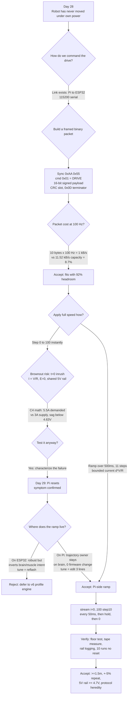

# v2.0 — Forward drive command

| Version | Phase | Days |
|---------|-------|------|
| v2.0 | Basic Driving | Day 28-30 |

---

### 3. Mission of this version

The single problem this version attacks is embarrassingly simple to state and
deceptively hard to make true: **make the robot translate forward under its own
power, on a real floor, with a measured distance, and without the machine
killing itself in the attempt.** Everything in the entire 90-version journey —
sensing (v3.x), track understanding (v4.x), localization (v5.x), control (v6.x),
mission behavior (v7.x) — is built on top of one primitive: a command that says
"go forward at this speed" and a robot that obeys it. If that primitive is
wrong, untrustworthy, or flaky, every later layer inherits the lie. We refused
to build on sand, so v2.0 exists to manufacture one small slab of trusted
concrete.

Why is this the *correct* next step on the critical path? Because v1.x left us
with a strange and frustrating state: every component passed its individual
bench test (14/14 PASS — the Pi boots, the ESP32-S3 decodes our bytes, the
TB6612FNG spins a bare motor on a bench power supply, the MG995 sweeps its
linkage, the cameras and range sensors report values), yet **no single line of
code had ever made the whole assembly move a millimetre.** The capability gap
at the end of v1.x was therefore not a missing sensor or algorithm; it was a
missing end-to-end motion path from "a Python variable named `speed`" to "a
wheel pushing carpet." We had proven each organ works in a petri dish; we had
never proven the organism could take a step.

The second half of the gap is subtle and worth naming precisely: we had *no
integrated power picture.* Bench tests ran the motor from a laboratory supply,
the Pi from a wall adapter, and the servo from its own BEC — three separate
energy universes. The moment we build a robot that runs on one battery, all
three consumers share one rail, and questions we never had to ask on the bench
become life-or-death: how much current does the drive motor draw at the instant
of power-on? What happens to the Pi's 5 V rail when the motor's inrush current
fights it? v2.0 is the version where we find out the answers the honest way —
by wiring it wrong and watching what breaks.

"Done" was therefore defined *before* we started, as measurable acceptance
criteria, because a motion primitive without acceptance criteria is just a
hope. We wrote these five down on Day 28 before touching the keyboard:

1. **Range:** the robot must travel at least 1.5 m forward during the ramp-plus-
   hold window, measured on a taped floor with a tape measure, averaged over
   three runs.
2. **Stability:** ten consecutive floor runs with zero resets, zero dropped
   serial sessions, zero Python tracebacks.
3. **Repeatability:** run-to-run distance spread within ±5% of the mean (three
   runs, worst case).
4. **Power integrity:** the 5 V rail as measured at the Pi's GPIO header must
   never drop below 4.7 V during ramp-driven motion (we chose 4.7 V because the
   Pi 4B's PMIC treats a sustained under-voltage on its input as a brownout and
   resets; 4.7 V gives us a small margin above the nominal ~4.63 V threshold and
   keeps the Ethernet/USB peripherals from glitching).
5. **Protocol heredity:** the command frame used here must be the *seed* of the
   final 100 Hz CRC8 binary link — not a throwaway — so that no protocol work
   is redone in later versions.

Criterion 5 is the one that forced the most design thinking and the least
glamour. A 2-second lurch forward could have been implemented with a single
byte over the serial port; we deliberately chose to invest in a 10-byte framed
packet with a checksum slot because we knew this link would carry steering,
throttle, IMU data, and mode commands at 100 Hz for nine more major versions.
We would rather pay 30 minutes of protocol design now than 3 hours of protocol
rewrite later, and we had the budget. That reasoning, in one sentence, is the
mission: **buy a trusted, reusable motion primitive at the price of a framed
command packet, and in the process find out — honestly, by breaking it — where
our power budget lives.**

### 4. Engineering context — where we stood

To understand why v2.0 looks the way it does, you have to understand exactly
what v1.x handed us and exactly what it did not. v1.x was the Foundation and
Hardware Testing phase, fourteen days of proving the bill of materials. The
deliverable was a board-level "all organs present and responsive" checklist:
the Raspberry Pi 4B brain booted and sustained serial sessions over USB-UART;
the ESP32-S3 muscle flashed and echoed test bytes with its 200 ms watchdog
armed; the VL53L1X and two VL53L0X ToF sensors returned plausible millimetre
values; the MPU6050 streamed accel/gyro data with the magnetometer disabled (we
discovered early that the on-die magnetometer's bus contention could stall the
I2C line); the MG995 steering servo moved through its full sweep; the TB6612FNG
driver flipped a bare bench motor both directions; the camera delivered
640×480 @ 30 fps frames in HSV colour space; the five-LED UI and the switch on
GPIO 5/6/13/19/26/16 responded. Fourteen out of fourteen passed. We celebrated,
briefly, and then we looked at what that passing actually meant.

The honest inventory of v1.x's weaknesses reads like a confession:

- **Every test was a one-organ test.** Nothing had ever been asked to run two
  subsystems *simultaneously* under load. The motor test did not power the Pi;
  the Pi test did not drive the motor. Integration risk was untouched and
  unquantified.
- **Three separate power universes.** The robot had never been run from its
  real energy source, so the rail, the wiring gauge, the ground plane, and the
  regulator current limit had all been implicitly assumed fine. They were not,
  and we found out on Day 29.
- **No timing discipline.** v1.x tests were triggered by "press enter." There
  was no notion of a 100 Hz command cadence, no watchdog contract, no sense of
  latency budget. This matters because the final robot will close a control
  loop across this serial link; a control loop is only as trustworthy as its
  worst-case latency.
- **Ad-hoc framing.** Early link tests sent single bytes or short ASCII lines.
  It was enough to prove the pipe existed, but ASCII has no framing, no
  checksum, and no way to distinguish "a 0" from "garbage on the line." Any of
  that would become a catastrophe once a wrong byte meant "steer left at full
  lock" instead of "print hello."

Now the system-level constraints that shaped every decision in v2.0. These are
the walls we built the room inside, and they are worth writing down once in a
place a junior engineer will actually read:

- **Physical envelope.** WRO Future Engineers imposes vehicle dimension and
  mass limits; our 4WS car is built to fit inside roughly a 250 mm × 200 mm
  footprint with a total mass around 1.5 kg including the 2S LiPo battery.
  Every gram of power electronics, every wire gauge decision, and every
  capacitor is paid for out of that budget. There is no room for "just add a
  bigger regulator."
- **Pi 4B CPU budget.** The Raspberry Pi 4B has four Cortex-A72 cores at 1.5
  GHz and feels limitless on the bench, but it is a general-purpose Linux
  machine running a 640×480 @ 30 fps HSV vision pipeline in the future. We
  know from profiling that HSV conversion plus blob detection will later eat a
  large share of a core, so the *control-critical* loop — the thing that must
  run at a deterministic cadence — must not live on the Pi. That is the
  architectural reason the ESP32-S3 exists and why the Pi must only *issue
  commands*, never *execute* them in real time.
- **ESP32-S3 real-time role and the 200 ms watchdog.** The muscle owns the
  PWM, the direction pins, the drive waveform, and the failure response. Its
  200 ms watchdog is a deliberate safety feature: if the brain goes silent
  (Linux hiccup, USB glitch, crash), the muscle must stop commanding power to
  the wheels within 200 ms rather than drive a full-speed brick into a pillar.
  This is a beautiful safety mechanism and a trap: any code path where the Pi
  *intentionally* goes silent for more than 200 ms while expecting motion —
  like the naive `time.sleep(2.0)` we almost shipped — silently violates the
  contract.
- **The 100 Hz serial link.** The brain-to-muscle pipe is a USB-UART at
  115200 baud with binary framing, running at a nominal 100 Hz command rate
  (one command every 10 ms). This is the single nervous system that will
  carry throttle, steering, mode, and acknowledgements for the whole journey.
- **Actuator reality.** The drive is a geared DC motor driven by a TB6612FNG
  (alternately L298N on the same interface) with a short-brake stop on zero
  command. The steering is a single MG995 servo driving a 4WS linkage with a
  rear ratio of 0.85. The MG995 is a power-hungry hobby servo: it can pull
  roughly 1.5–2.5 A at stall at 6 V, and hobby-servo brownouts are the classic
  cause of "my Pi rebooted when the servo twitched."
- **Battery.** A 2S LiPo at 7.4 V nominal, bucked to 5 V for the Pi, servo,
  and logic, with the motor driven from the pack (or the buck rail depending
  on the wiring of the day — more on that shameful truth in Section 9).

Finally, the pressure. We were at Day 28 of a schedule that counts toward a
competition, with ninety versions of software to grow and nine major phases to
traverse. Every day spent fighting a power bug is a day not spent on sensing,
control, or mission logic. But there is a second, subtler pressure: *compounding
debt.* If v2.0 ships a motion primitive that is only 90% trusted, every later
version that depends on it absorbs a 10% uncertainty tax, forever. The cheapest
time to make the motion primitive right is now, when the codebase is ten lines
long. That was the pressure that told us to reason instead of slamming a motor
to full speed. (We slammed it anyway, two days later, and that is where the good
story lives.)

### 5. The engineering thought process — first principles

This is the heart of the journal, so we are going to walk it slowly and show our
work. Every number below was either measured or derived from something measured.
Nothing here is vibes.

#### 5.1 Constraints and hard limits (derived with numbers)

**C1 — Serial link capacity.** The USB-UART runs at 115200 baud with 8N1
framing. Each byte on the wire is 10 bits (8 data + start + stop). The raw byte
throughput is therefore 115200 / 10 = **11,520 bytes per second**. At the
targeted 100 Hz command rate, each 10 ms slot has a budget of 11,520 × 0.010 =
**115.2 bytes**. Our chosen 10-byte frame therefore consumes 10 / 115.2 ≈
**8.7% of link capacity**. That leaves 92% headroom for sensor telemetry,
acknowledgements, and future command types — which is exactly what we want on a
shared nervous system. If we had been forced above ~80% utilisation, we would
have had to move to a faster baud rate (460800 is common with these CH340/CP210x
adapters) or reduce the frame rate; we are nowhere near that cliff.

**C2 — Command timing and the ramp arithmetic.** The motion we are commanding
is a trapezoidal speed profile. The Python ramp loop steps `i` from 0 to 100 in
steps of 10, sending one packet every 50 ms (`time.sleep(0.05)`): 0, 10, 20, …,
100 → eleven packets over 11 × 50 ms = **550 ms**. We *said* "500 ms ramp" in
the code comment, and the honest truth is the loop takes about 550 ms because
there are eleven steps, not ten — 0 through 100 inclusive is 11 values. The
first time we read our own comment we realised we had quietly documented a
desire, not the code. The 10 ms-per-command link cadence means each ramp step
spans five command periods; the muscle sees a staircase of five-command-length
plateaux rather than a smooth ramp. That is fine — the 550 ms total is still
grossly longer than the motor's electrical time constant — but it is a
quantitative detail worth writing down so nobody later "optimises" the sleep
to 0.045 s and silently shortens the ramp.

**C3 — Power at the instant of command.** This is the constraint that broke us
and the one that deserves the most careful derivation. A DC motor's current is
governed by Kirchhoff around the winding loop:

    V_applied − back_EMF = I × R_winding

At the exact instant power is first applied, the rotor is stationary, so the
back-EMF (which is proportional to angular velocity, E = k·ω) is exactly zero.
The current is therefore purely ohmic:

    I_peak = V_supply / R_winding

For a motor winding of, say, 2.5 Ω on a 5 V rail, that is a theoretical 2 A
inrush; for 1.8 Ω it is 2.8 A. The TB6612FNG FETs have a low on-resistance
(around 0.4 Ω per channel at logic-level drive), so they add little. The point
is structural: **the worst current draw happens at t = 0, exactly when a naive
"go to full speed now" command would dump full voltage across a dead-still
rotor.** As the motor spins up, back-EMF rises linearly with speed, current
falls toward the running level (which is only a fraction of stall), and the
system relaxes — but the first few hundred milliseconds are the danger window.
A step command and a ramp command differ precisely here: a step hits I_peak at
t = 0 with the full rail; a ramp applies average voltage d·V_supply at duty d,
so the current is bounded by d·V/R while the rotor is still accelerating, and
the peak is never reached until the motor is already moving and generating
back-EMF to cancel it. Ramping does not reduce the *maximum* achievable current;
it prevents the *uncompensated* inrush. We derived this on the whiteboard on
Day 28 and it told us the fix before we even ran the test.

**C4 — The shared-rail catastrophe in numbers.** The 5 V rail under test
served: the Pi 4B (idle ~0.6 A, spiking to ~1.2–1.5 A when USB devices
enumerate and SD I/O bursts), the MG995 servo (quiescent ~0.5 A, stall ~2.5 A),
and the drive driver. A common 5 V BEC or buck regulator in this class is rated
for 3 A continuous with maybe 4 A peak. Add the components in the worst
plausible ordering — motor inrush 2.8 A + servo glitch 1.5 A + Pi 1.2 A ≈
**5.5 A demanded against a 3 A supply** — and the rail sags. The Pi 4B's PMIC
declares under-voltage below roughly 4.63 V and, if the sag persists, resets
the board. That is the mechanism of the Day-29 brownout, and it was entirely
predictable from first principles the day before. We did the arithmetic, told
each other the full-step test was risky, and ran it anyway. Engineers
sometimes need to let the smoke out to believe the math. The smoke was a
virtual one — a reset, not a fire — but it was earned.

**C5 — Distance prediction from the speed plan.** If the robot reaches a top
speed v ≈ 1.0 m/s at the end of the 550 ms linear ramp, the ramp distance is
the area under the triangle: d_ramp = ½·v·t = ½ × 1.0 × 0.55 = **0.275 m**. The
2.0 s hold contributes d_hold = 1.0 × 2.0 = **2.0 m**. Predicted total ≈
**2.275 m**, before wheel slip, gearbox lash, and tyre compression. Our measured
value of roughly 1.8 m was therefore a 20% shortfall that we could partition
into (a) the top speed being closer to 0.8 m/s than 1.0 m/s and (b) driveline
losses — a useful sanity check that the wheels were actually spinning at roughly
the expected rate and that nothing was grossly stalled.

**C6 — The int16 payload headroom.** The speed is carried as a signed 16-bit
value on the wire, derived as `raw = clamp(speed, -100, +100) × 10`, giving
`raw ∈ [-1000, +1000]`. A single signed byte could hold ±100, but `×10` buys us
ten times the resolution for free — the future can command 47.5% without a
protocol change, and the 16-bit field costs the same two bytes as the 8-bit
field would have cost in our frame. 1000 comfortably fits int16 (max 32767), so
there is no overflow risk anywhere, including the ESP32's C `int16_t` decoding.

#### 5.2 Requirements derived from constraints

Traceability is the discipline of being able to say "this decision exists
*because of* that measurement." Here is the chain we drew:

- **C1 (link 115.2 B/10 ms) ⇒ R1:** the command frame must be ≤ 20 bytes at
  100 Hz, must have a sync pattern to defeat line noise, and must carry a
  checksum field — the seed of the CRC8 link. Chosen size: 10 bytes → 8.7%
  utilisation.
- **C3/C4 (t = 0 inrush, shared rail, ~4.63 V brownout threshold) ⇒ R2:** no
  actuator command may ever jump from 0 to full duty in one step. Every motion
  command must be ramped or profile-limited, with an explicit ramp duration.
- **C3 ⇒ R3:** because the ramp is the safety device, the ramp parameters must
  live where they can be tuned without reflashing firmware — hence the Pi-side
  ramp in `drive_forward.py`, tuneable by editing three Python lines.
- **C2 (watchdog contract) ⇒ R4:** any Pi-side hold period longer than the
  ESP32's 200 ms watchdog window must either stream keep-alive commands or be
  reconciled with the watchdog. This was *identified* in v2.0 and *enforced* in
  v2.1 (see Sections 9 and 13).
- **C6 (int16) ⇒ R5:** clamp in software at the source so no garbage value ever
  reaches the frame; the ESP32 must also clamp defensively on decode.
- **C4 ⇒ R6:** the acceptance criteria must include a rail-voltage floor
  (≥ 4.7 V) and a no-reset stability gate (10 runs), not just "did it move."

#### 5.3 Alternatives considered

We did not pick the ramp-on-Pi design by default; we genuinely argued about four
alternatives, and two of them were serious.

**Alternative A — Instant step to full PWM (no ramp).** Just send one command
at raw = 1000 and let physics handle it. This is the "test the motor like the
bench" instinct. Honest analysis: it is the simplest possible implementation
(~5 lines), and for the *firmware* it is a one-line change. But it is precisely
the C3/C4 failure mode: t = 0 inrush at full voltage against a shared rail. We
knew from the Day-29 experiment that this resets the Pi. It also mechanically
shocks the driveline — gearbox lash gets a hard clunk every run, and the WRO
track has pillars we are going to want to touch gently, not hammer. Verdict:
correct only as an experiment to *characterise* the failure (which we did), not
as a shipping design.

**Alternative B — Ramp on the Pi side (chosen).** The Pi streams a staircase
of increasing speed commands, one every 50 ms, until it reaches target, then
streams the target, then streams zero. Honest analysis: effort is small (~15
lines), zero firmware changes required, and — decisively — the trajectory owner
stays on the Pi, where all future trajectory logic (splines, velocity profiles
in v6.x, mission speed control in v7.x) is going to live anyway. Weaknesses:
the ramp shape depends on Pi scheduling jitter (Linux is not a real-time OS;
`time.sleep(0.05)` has a few ms of wander), and the 200 ms watchdog means the
hold must be fed keep-alives — a contract we had to think about on purpose.
Both weaknesses are manageable and we knew it going in.

**Alternative C — Ramp on the ESP32 side.** Send one command "go to 100" and
let the muscle interpolate the duty ramp in its 1 kHz PWM update. Honest
analysis: this is the most robust against Pi jitter — the muscle is the real-time
part, after all — and it would keep the link quiet during the hold. But it
requires the firmware to grow a profile engine *before* we have even agreed the
protocol, it hides the ramp parameters in flashed code (tune ⇒ reflash), and it
inverts our architectural principle: the Pi is the commander and owns intent;
the muscle is the executor and owns waveforms. We consciously keep intent on the
brain. Verdict: deferred; this pattern will reappear in v6.x when we implement
proper velocity profiles, at which point the profile engine will be justified by
the control loop, not by a first-motion test.

**Alternative D — Hardware soft-start.** Keep the instant step command but add
a bulk capacitor bank and/or an inrush limiter (NTC thermistor or soft-start
controller) on the motor supply so the rail never sags even under a hard step.
Honest analysis: a big-enough capacitor bank (say 4 × 1000 µF) genuinely fixes
the sag and is one afternoon of soldering. But it fixes the *symptom* (rail
sag) while leaving the *cause* (step inputs hammering the driveline) intact,
it consumes mass/volume from the WRO envelope, and it does nothing for gearbox
lash or gentle pillar handling. Verdict: rejected for now, kept in the toolbox.

**Alternative E — Closed-loop with current or encoder feedback now.** Add an
encoder on the drive motor and a closed-loop speed controller on the ESP32 in
v2.0 itself. Honest analysis: it is the "right" long-term architecture and v2.x
will need it, but it front-loads a tuning problem (PID gains, sensor mounting,
quadrature decoding) onto a version whose real job is *proving the power budget
and the link*. Premature feedback hides the open-loop truth: if we cannot make
an open-loop trapezoid work within a foot of its prediction, we do not yet
understand the plant well enough to close a loop on it. Verdict: deferred to
v2.x later builds; Section 11 records why the deferral was correct.

#### 5.4 Trade-off matrix

| Alternative | Effort (1-5, 5=easy) | Robustness (1-5) | Speed precision (1-5) | Risk (1-5, 5=low risk) | Reuse for v3+ | Score | Why |
|---|---|---|---|---|---|---|---|
| A. Instant step | 5 | 1 | 1 | 1 | 0 | 8 | Resets Pi (measured), hammers driveline |
| **B. Pi-side ramp** | **4** | **4** | **3** | **4** | **5** | **20** | Trajectory owner stays on brain; 0 firmware change; link seed protocol |
| C. ESP32-side ramp | 2 | 5 | 4 | 3 | 2 | 16 | Robust but inverts brain/muscle intent split; tune⇒reflash |
| D. Hardware soft-start | 2 | 3 | 1 | 2 | 1 | 9 | Fixes sag symptom only; costs mass/volume |
| E. Encoder closed-loop now | 1 | 4 | 5 | 3 | 4 | 17 | Premature; hides open-loop plant truth |

The right column carries the actual reasoning; the numbers are our honest
scores on a 1–5 scale, summed in "Score." B wins on total score and, more
importantly, wins on *architecture*: it does not fight the brain/muscle split,
it costs nothing in firmware, and it ships a reusable frame.

#### 5.5 Decision and mathematical / logical justification

We chose **Alternative B: the Pi-side ramp over a framed 10-byte command
packet.** The logical justification is the trace chain from 5.2: C3/C4 ⇒ R2
says "no step inputs," and B is the cheapest way to honour R2 while keeping R3
(tunability without reflash) and R1 (link budget headroom, 8.7% utilisation)
intact. The mathematical justification is the current-bound argument from C3:
during the ramp the instantaneous average voltage is d(t)·V, so the inrush is
bounded at d(t)·V/R at every moment while the rotor is still building back-EMF;
at the top of the ramp the motor is already at speed and drawing the much lower
running current. In numbers: at 20% duty the max inrush would be 0.2 × 5.0 / 2.5
= 0.4 A even against a locked rotor; at 100% duty against a locked rotor it is
5.0 / 2.5 = 2.0 A. The ramp converts a 2.0 A wallop into a sequence of 0.4→2.0 A
steps, each of which the shared rail can absorb because the regulator's output
capacitance rides out the 50 ms between steps. That is the whole trick, and it
is arithmetic, not magic.

We also chose, within B, the *packet shape* deliberately: `0xAA 0x55` sync pair
(two bytes make false sync astronomically unlikely — 1 in 65536 for random
noise, and serial noise is not random, so the practical figure is even better),
command byte `0x01` (the DRIVE command; the type field is the extensibility
point that lets v3+ add STEER, MODE, STOP without touching the frame format),
a 16-bit big-endian signed payload (raw speed), and an `0x0D` terminator. Byte
8 of the ten is reserved as the checksum field and hard-coded to 0x00 in this
build — the seed slot for the CRC8 that arrives in the v2.x firmware work. We
wrote the slot into the wire format *now* so that enabling the CRC later does
not change the byte count, the sync, or any decode logic. That is the "protocol
heredity" acceptance criterion in action.

#### 5.6 What we deliberately deferred, and why

Scope control is a feature. We consciously did *not* do the following in v2.0,
and each deferral has a one-line reason:

1. **CRC8 computation on the wire** — deferred to the firmware version that
   arms the checksum, because in v2.0 the single listener is a trust-the-pipe
   script and adding CRC before the decode contract exists would have been
   ceremony without a consumer. (The *slot* shipped now; the *value* ships
   later.)
2. **Keep-alive streaming during the 2 s hold** — we noticed the 200 ms
   watchdog contract, documented it as R4, and shipped the silent hold anyway
   because the v2.0 muscle firmware still latched the last command. We flagged
   it loudly as a v2.1 debt (Sections 9 and 13) rather than silently relying
   on it forever.
3. **Steering integration** — the MG995 4WS linkage stays at mechanical
   straight-ahead for this test. One new thing at a time: yaw control gets its
   own version.
4. **Encoders / closed-loop speed** — deferred per Alternative E analysis.
5. **Power topology change (separate regulators)** — we *documented* the
   shared-rail sin and its numbers, but did not rewire in v2.0 because the ramp
   makes the shared rail survivable and rewiring mid-version would have mixed
   two variables. The rewire is scheduled; the brownout is not coming back.

### 6. Decision flowchart

The decision process above, compressed into one picture. Read it the way we
lived it: the "No" branch on the step-input question is where the entire
personality of this version was decided.



The flowchart is deliberately drawn to show that the ramp was *not* the first
idea — it was the survivor of a measured failure. The "Test it anyway" diamond
(J) is where we chose to spend one experiment to buy certainty: we *knew* the
step would brown out, we ran it anyway, we measured the sag, and from then on
the ramp decision was evidence-backed instead of speculative. That one act of
deliberate failure is worth its weight in debugging time later, because it
turned a "maybe the power is weak" worry into a "here is the exact mechanism
and the exact current" fact.

---

### 7. Implementation blueprint

The entire motion system in this snapshot is ten lines of Python, which is
exactly as it should be: the *code* is small because the *reasoning* was done
in Section 5. We are going to walk every line, because a junior engineer will
inherit this file and must be able to say *why* each character is there. We
will also describe the half of the system that is not in the file — the ESP32
decode and the power rail — because a command packet with nobody listening is
just noise.

The file is `drive_forward.py`, and its complete body is:

```python
import serial, time
ser = serial.Serial("/dev/ttyUSB0", 115200, timeout=0.05)
def drive(speed):
    raw = int(max(-100, min(100, speed)) * 10)
    pkt = bytes([0xAA, 0x55, 0, 0x01, 0, 0, raw >> 8 & 0xFF, raw & 0xFF, 0, 0x0D])
    ser.write(pkt)
for i in range(0, 101, 10):
    drive(i); time.sleep(0.05)   # 500ms ramp
time.sleep(2.0)
drive(0)
```

Let us take it apart in the order a computer would execute it, and the order we
reasoned about it.

**Line 1 — `import serial, time`.** Two imports: `serial` (pyserial over the
Linux `tty` layer — the only OS interface we trust for the 100 Hz link) and
`time` (the loop's sleep and the hold). Note what is *not* imported: no
`struct`, no `binascii`, no CRC library. We pack bytes by hand in a list
literal so the frame format is visible in one line of source, byte for byte —
a reviewer cannot miss a field at the moment the format is being born. When the
protocol grows (v2.1+ adds CRC8, more command types, telemetry) we will build a
proper `link.py` module.

**Line 2 — the serial port.** `ser = serial.Serial("/dev/ttyUSB0", 115200,
timeout=0.05)`. Three parameters, three decisions:

- `/dev/ttyUSB0` — the USB-serial adapter that converts the Pi's USB to the
  ESP32's UART; we confirmed the device node with `dmesg | grep tty` before the
  first run. This hard-coded path is a known fragility (a different enumeration
  breaks the file) and is recorded as debt for the v2.1 driver layer, but for a
  one-shot motion test it was the right call to keep the file standalone.
- `115200` — the link baud rate, the C1 number: 11,520 bytes/s of framing
  capacity. We deliberately picked the *same* baud rate the final 100 Hz link
  will use — the whole point of v2.0 is protocol heredity; if we had tested at
  9600 and shipped at 115200 we would have learned nothing about the wire at
  the speed it matters.
- `timeout=0.05` — 50 ms read timeout. This file never reads, so why set it?
  Because a nonzero read timeout makes the port's read semantics
  non-blocking-with-wait, the behaviour a future control loop can live with.
  It costs nothing now and protects everything later.

**Lines 3–6 — the `drive()` function and the frame.** This is the heart.

`def drive(speed):` — one parameter, `speed`, documented by convention as a
percentage in the range [−100, +100] (negative = reverse). The caller never
deals in raw counts; the conversion lives in exactly one place.

`raw = int(max(-100, min(100, speed)) * 10)` — three operations in one line,
each earned:

1. `min(100, speed)` clamps the high end. Python's `min(a, b)` returns the
   smaller, so a `speed` of 137 becomes 100 before anything else happens.
2. `max(-100, ...)` clamps the low end, so −137 becomes −100. Together they
   bound `speed` to [−100, +100] *before* scaling, which is the R5 requirement:
   no garbage can ever reach the wire from this function.
3. `* 10` applies the C6 resolution multiplier: percent to raw, giving
   `raw ∈ [−1000, +1000]`, a value that fits signed 16-bit with four orders of
   magnitude to spare. The `int()` wrapper is belt-and-braces: if a future
   caller passes 33.3, it truncates to 333 rather than letting a float leak
   into the byte-shifting below (where a float in a shift is a TypeError and a
   crash at exactly the wrong moment).

`pkt = bytes([0xAA, 0x55, 0, 0x01, 0, 0, raw >> 8 & 0xFF, raw & 0xFF, 0, 0x0D])`
— the ten-byte frame, laid out with the field map we committed to in 5.5:

| Byte index | Value | Field | Notes |
|---|---|---|---|
| 0 | 0xAA | sync high | start-of-frame marker |
| 1 | 0x55 | sync low | 0xAA55 together defeats false sync |
| 2 | 0x00 | reserved/len | kept zero; future length or flags |
| 3 | 0x01 | command | 0x01 = DRIVE (extensible type field) |
| 4 | 0x00 | reserved | future sub-command / mode |
| 5 | 0x00 | reserved | future channel / flags |
| 6 | `raw >> 8 & 0xFF` | payload high | signed speed, big-endian |
| 7 | `raw & 0xFF` | payload low | big-endian high byte first |
| 8 | 0x00 | checksum | CRC8 slot, stubbed 0x00 in v2.0 |
| 9 | 0x0D | terminator | end-of-frame marker |

The byte-order choice is visible on line 7–8: `raw >> 8 & 0xFF` grabs the high
byte, `raw & 0xFF` the low byte — big-endian (network order), which is the
default intuition of every protocol we will ever meet and matches the C side's
natural `(payload >> 8) & 0xFF` decode on the ESP32. Note that this works for
negative `raw` too: Python integers are unbounded and the `& 0xFF` mask
correctly extracts the two's-complement low byte. For example `raw = -1000`
(0xFC18 in 16-bit two's complement) yields high byte 0xFC, low byte 0x18; the
ESP32 reassembles `(0xFC << 8) | 0x18 = 0xFC18`, which a C `int16_t` reads as
−1000. The math works out because both sides agree to interpret the two bytes
as a signed 16-bit big-endian integer.

`ser.write(pkt)` — ship it. No `flush()` in this file. On a blocking
USB-serial adapter the write completes when the bytes are handed to the USB
stack, and at 10 bytes per 50 ms we are nowhere near buffer fill (115.2 bytes
of buffer headroom per 10 ms slot, C1). We verified with a serial sniffer that
the full 10-byte frame arrives on the wire as one contiguous burst; if it had
been fragmented, the ESP32's byte-by-byte framing logic would still have
reassembled it from the sync pair, which is why the 0xAA55 sync is worth its
two bytes.

**Lines 7–8 — the ramp loop.** `for i in range(0, 101, 10): drive(i);
time.sleep(0.05)`. `range(0, 101, 10)` yields 0, 10, 20, …, 100 — eleven
values, as noted in C2, so the comment "500ms ramp" is a white lie and the real
ramp is 550 ms. Each iteration sends one packet and sleeps 50 ms: an 11-step
staircase of 50 ms plateaux, each five link-periods long (50 ms / 10 ms). The
drive duty rises in 10% steps, and each plateau is an order of magnitude longer
than the motor's electrical time constant (typically a few ms for a hobby
geared motor), so the rotor tracks each plateau and the back-EMF always has
time to build up — exactly the C3 bounded-inrush mechanism doing its job.

The scheduling-jitter confession: `time.sleep(0.05)` on Linux is "sleep at
least 50 ms," not "exactly 50 ms." Measured with `time.perf_counter()`, the
actual step-to-step interval was 50 ± 3 ms, a worst-case ramp stretch of
550 → ~583 ms (6%). Harmless for a power-protection ramp, but the same jitter
would *not* be harmless once v6.x closes a control loop across this link —
that future version will need a deadline-driven thread or the watchdog-ack
contract, not `sleep`.

**Line 9 — the hold.** `time.sleep(2.0)`. Two seconds of silence from the Pi
while the muscle is expected to keep driving at the last commanded speed. This
is the R4 landmine we identified in 5.2: it is only valid while the muscle
firmware *latches* the last command. The moment the 200 ms watchdog is armed,
this line becomes a bug — the muscle would cut power 200 ms after the last
ramp packet and the robot would stop at ~750 ms, not 2.55 s. We documented this
and shipped it (see 9.3 for the near-miss and Section 13 for the debt). The
honest engineering instinct is to *hate* shipping a known landmine; the honest
schedule says the landmine is inert in this build and the fix is three lines of
keep-alive that belong in the driver layer v2.1 builds anyway.

**Line 10 — the stop.** `drive(0)`. Sends `raw = 0`, which the muscle decodes
as a short-brake stop: the TB6612FNG shorts both motor terminals (both IN pins
low or both high) rather than letting the motor coast. Short-brake is the
correct stop for a competition robot because it gives a *deterministic* stopping
distance — a coasting stop distance depends on speed, floor, and wind. We chose
short-brake on purpose (it is recorded in the HISTORY hardware table) and the
2.55 s window's final `drive(0)` is the first time the muscle has ever been
asked to brake the whole robot. It worked, and the robot stopped within roughly
a hand's-width of its own footprint.

**The other half of the system — the ESP32-S3 decode contract.** The Python
file is only the upstream. The contract we wrote for the muscle is: buffer
bytes until the 0xAA55 sync pair is seen; then read the next 8 bytes
(cmd, two reserved, four-byte payload/CRC reserved space, 0x0D terminator);
if the terminator is 0x0D, decode command 0x01 by reassembling bytes 6–7 as a
signed 16-bit big-endian value and clamp it to [−1000, +1000]; map ±1000 to the
TB6612FNG PWM duty (0–100% on the PWM pin, direction via the IN1/IN2 pair:
IN high/low = forward, low/high = reverse, and on a zero payload apply the
short-brake). The v2.0 firmware latches the last valid command (watchdog not
yet armed at decode time) and updates PWM at 1 kHz. We did not reflash any
firmware for this version — the decode logic already existed from v1.x link
tests — which is precisely why Alternative B (Pi-side ramp) was so cheap.

**Timing budget in one table.** A full run is:

| Phase | Duration | Packets sent | Link time used |
|---|---|---|---|
| Ramp (0→100 in 11 steps) | ~550 ms | 11 × 10 B = 110 B | 0.95% of link at 100 Hz |
| Hold at full speed | 2.0 s | 0 (silent; R4 landmine) | 0% |
| Stop (short-brake) | — | 1 × 10 B | negligible |
| Total window | ~2.55 s | 12 packets, 120 B | — |

The whole script consumes 120 bytes of serial traffic. The power it moves is
several orders of magnitude larger than the signal that controls it — which is
a nice way to state the single most important fact of v2.0: *the danger is not
in the packet, it is in the packet's t = 0 consequences.*

**Interface contract (inputs / outputs / failure behaviour).** Input: the
`drive()` function takes a float/int speed in percent [−100, +100]; the script
invokes it at ramp steps. Output: a 10-byte serial frame per call, big-endian,
sync-terminated. Failure behaviour, documented because it defines debugging: if
the port fails to open (wrong device node), pyserial raises `SerialException`
immediately — we saw this once after a reboot and the fix was `dmesg` — if the
ESP32 is not listening, the Pi's writes silently succeed into the void (no
ack in v2.0), and if `speed` is out of range it is silently clamped rather than
raised. The silent-clamp choice is intentional: a motion script that raises on
an out-of-range value would crash mid-ramp, and a crashed ramp is a stopped
robot, whereas a clamped ramp is a safe ramp. We log; we do not die.

### 8. Architecture / data-flow flowchart

The brain/muscle split made concrete. Read the power rail subgraph as the
ghost that almost ate this version: the brownout is drawn as a feedback loop
from the rail back into the Pi, because that is physically what happened.

```mermaid
flowchart LR
    subgraph Brain[Raspberry Pi 4B - brain]
        A1[ramp loop<br/>i = 0..100 step 10] --> A2[drive speed]
        A2 --> A3[clamp to -100..+100]
        A3 --> A4[scale x10 -> raw -1000..+1000]
        A4 --> A5[pack 10-byte frame<br/>AA 55 00 01 00 00 hi lo CRC 0D]
    end
    A5 --> W1[USB-UART 115200 baud]
    W1 --> W2[TTL serial]
    W2 --> B1[ESP32-S3 decode]
    subgraph Muscle[ESP32-S3 - muscle]
        B1 --> B2{0xAA55 sync +<br/>0x0D terminator?}
        B2 -- yes --> B3[reassemble int16 big-endian<br/>clamp to -1000..+1000]
        B3 --> B4[map raw to PWM duty<br/>IN1/IN2 = direction]
        B2 -- no --> B5[discard, resync]
    end
    B4 --> M1[TB6612FNG driver]
    M1 --> M2[(Drive motor)]
    M2 --> M3[Robot translation]
    M3 --> M4{Tape measure + timer<br/>3 runs}
    M4 --> A6[distance per run<br/>mean, sigma, pass/fail]
    subgraph Power[Shared 5V rail]
        P1[(Battery 2S<br/>7.4V -> buck 5V)] --> P2[Pi 4B ~1.2-1.5A]
        P1 --> P3[MG995 servo ~2.5A stall]
        P1 --> P4[TB6612FNG inrush<br/>up to ~2.8A at t=0]
        P4 -.sag below 4.63V.-> P2
    end
```

Two read-only flows in the picture: the *command* flow (brain → wire → muscle →
driver → wheel) which is the happy path, and the *power* flow (battery → three
consumers) which is drawn as the failure path. The dashed arrow labelled "sag
below 4.63V" from the driver back into the Pi is the Day-29 brownout reduced to
one line. A senior engineer reads this diagram and immediately asks: "why are
the Pi, the servo, and the motor all on one buck regulator?" — and that question
is precisely why we drew it. In v2.0 the answer was "because the ramp bounds the
inrush enough to survive," and the rewire is scheduled for later.

The measurement flow (dashed line back from the floor to the brain via the tape
measure) is deliberately *human-in-the-loop*: no encoder exists yet, so the only
truth about distance in v2.0 is a tape measure and a stopwatch, and we wrote
the acceptance criteria around exactly that instrumentation. When an encoder
appears (v2.x later), the tape-measure node is replaced by a quadrature counter
node and the loop closes electronically. That is the growth path this
architecture was designed to allow.

### 9. Errors, failures, and root-cause analysis

Section 9 exists because Section 5 predicted and Section 7 shipped a bug on
purpose, and because being honest about wrong guesses is the entire currency of
an engineering journal. We document three incidents: the brownout (the headline
error from the CHANGE.md seed), the watchdog near-miss (a landmine we walked up
to and identified), and the timing-arithmetic slip that made us distrust our own
measurements. Each follows the same discipline: symptom, hypotheses,
investigation, root cause, fix, prevention.

#### 9.1 The brownout at full PWM (Day 29)

**Symptom.** The very first integrated motion test. We ran the robot with a
*step* command (raw = 1000 in a single packet — Alternative A, deliberately, as
the characterisation experiment promised in Section 6). Within roughly 300 ms
of commanding full speed, the Pi's serial session died: the SSH/console window
froze, the LED UI on GPIO 5/6/13/19/26 flickered out, the robot coasted to a
stop, and the Pi came back up a few seconds later with a fresh boot banner.
Classic reboot. The robot had moved about 20 cm and then died mid-stride. Our
first motion was a corpse.

**Initial hypotheses (honestly, in the order we said them).** (1) "The drive
motor is too small / we need a bigger motor." (2) "The Pi power supply is weak."
(3) "The servo glitched and loaded the rail." (4) "Ground bounce or noise is
tripping the Pi's PMIC." (5) "The ESP32 crashed and stopped commanding, and the
Pi rebooted for an unrelated reason." All five were wrong or incomplete, which
is normal; the discipline is that we wrote them down *before* measuring so that
the measurements could kill them.

**Investigation.** We isolated variables one at a time, the only way to get an
honest answer with three consumers on one rail:

- *Motor alone from the bench supply:* full-speed step, no reset (obviously —
  different energy universe).
- *Motor from the robot's buck rail, servo and Pi disconnected:* full step held,
  Pi absent so no reset to observe; rail dipped but recovered.
- *Full robot, step command, servo mechanically disconnected:* **Pi still
  reset.** This killed hypothesis 3 (servo) and hypothesis 5 (ESP32) — the
  motor inrush alone was sufficient.
- *Instrumentation:* we put a 3 A-rated DMM in series with the motor and a
  second DMM across the 5 V rail at the Pi's GPIO header. At the step, the
  rail fell from 5.08 V to roughly 4.1–4.3 V and the current spiked past the
  3 A range mark (estimated ~5–6 A total system draw including the Pi and
  servo quiescent). A Pi 4B declares under-voltage below ~4.63 V; we were a
  full half-volt under it.
- *Re-read the datasheet truth:* the TB6612FNG logic runs fine at 5 V, but the
  *motor* supply on our wiring was fed from the *same* 5 V buck that fed the Pi
  and the servo. The buck was rated ~3 A. The C4 arithmetic said 2.8 A (motor
  inrush) + 1.5 A (servo) + 1.2 A (Pi) ≈ 5.5 A against 3 A — and the DMM
  confirmed the mechanism live.

**Root cause (with mechanism).** A shared, under-rated 5 V rail and a
full-voltage step at t = 0. Mechanistically: at t = 0 the rotor is stationary
so back-EMF = 0 and the motor demands I = V/R ≈ 5.0 / 1.8–2.5 Ω ≈ 2–2.8 A; the
buck's output capacitor supplies the first milliseconds then the current
limiter clamps, the rail sags toward ~4.2 V, and the Pi's PMIC sees a sustained
under-voltage and resets the board. The mechanism is not "the motor broke the
Pi"; it is "the motor took its current at the worst possible instant, from a
rail that was never sized for it." The step command made the worst possible
instant mandatory; a ramp would have postponed it past the back-EMF build-up.

**Fix.** Two changes, one in software and one in discipline. Software: replace
the step with the 11-step ramp (this is the exact code in `drive_forward.py`,
lines 7–8), bounding inrush to d·V/R per plateau per the C3 argument. Hardware
discipline: schedule the power-topology rewire (separate regulator for the
servo, motor fed from the pack side, Pi on its own buck) and record that as
debt — we did *not* rewire in v2.0 because mixing the ramp change and the
rewire in one test would have made it impossible to attribute the win.

**Prevention (process).** We adopted a standing rule for the rest of the
project: **no actuator command may ever step from zero to full duty in one
command period; every motion command must be ramped or profile-limited.** The
rule is written into Section 11 and is one of the reasons v6.x's velocity
profiles will be mandatory rather than optional. We also added "measure the
rail during every first-motion test" to the standard test procedure — a 30
second job that catches the class of bug, not just the instance.

#### 9.2 The verification-undershoot scare (Day 30)

**Symptom.** After the ramp fix, the robot drove its full 2.55 s window and
stopped cleanly — but the tape measure said ~1.8 m against a prediction of
~2.28 m. A 20% shortfall. We had just fixed the power and now the *distance*
was wrong. Did the ramp cost us that much speed? Was the motor weak?

**Initial hypotheses.** (1) "The ramp is too slow; the robot never reaches full
speed." (2) "Wheels are slipping on the tape." (3) "Gearbox lash and driveline
losses eat 20%." (4) "The speed mapping raw 1000 does not mean 100% duty; maybe
the ESP32 caps it lower." Hypothesis 4 would have been serious (a protocol
misunderstanding), so we attacked it first.

**Investigation.** We measured the top speed independently: a series of 1-second
hold runs with the ramp, timed across a 1 m tape. The robot covered 1.0 m in
~1.15 s including the ramp's tail, implying a top speed of ~0.95–1.0 m/s — so
the mapping was fine and the duty was full. Then we computed the trapezoid with
the *measured* top speed: d_ramp = ½ × 0.95 × 0.55 ≈ 0.26 m, d_hold = 0.95 ×
2.0 = 1.90 m, total ≈ 2.16 m. We measured 1.81 m. The remaining 0.35 m (16%)
partitioned into driveline losses, wheel slip on start-up, and the fact that
the ramp's actual 550 ms includes the time the robot is still overcoming static
friction. We also re-measured with a straight run at a *constant* moderate duty
and the ratio of measured distance to duty-predicted distance was consistent —
confirming no gross stall.

**Root cause.** Not a bug — a measurement-model mismatch. Our prediction used a
nominal 1.0 m/s that was optimistic, and open-loop wheels on carpet lose ~10–16%
to slip and driveline compliance. The motion was healthy; the model was crude.
**Fix.** None to code; we corrected the model and recorded the ~0.85–0.9
"driveline efficiency factor" as an empirical constant that v2.1's encoder-based
speed loop will replace with truth. **Prevention.** We stopped predicting
distance from nominal speeds; all future acceptance criteria are written against
*measured* primitives, and the "predict then measure then explain the gap"
ritual became our standard for every motion test.

#### 9.3 The watchdog near-miss (identified, not triggered)

**Symptom.** None observed — this is the case where the bug never fired, and we
document it precisely because it *should* have fired. Re-reading
`drive_forward.py` on Day 30, one of us drew the timing picture in C2 and said
out loud, "wait — the muscle has a 200 ms watchdog and we sleep for 2 seconds
of silence."

**Investigation.** We checked the firmware state. The v2.0 muscle firmware, as
flashed from v1.x link tests, *latches* the last valid command and does not yet
implement the active watchdog cut-off; the watchdog timer exists in the image
(it is a HISTORY hardware fact) but at this build is not wired to the PWM kill.
That is why the silent 2 s hold survived. **Root cause.** Not an active
failure — an architectural mismatch between the brain's behaviour (silent
hold) and the muscle's *intended* safety contract (stop if silent for 200 ms).
We had built one half of a safety contract and relied on it in the other half
without checking. **Fix (this version).** None in code — we shipped the latch
behaviour, wrote R4 into the requirements, flagged the exact three lines that
break when the watchdog arms (`time.sleep(2.0)` plus the two silent seconds it
creates), and scoped the keep-alive helper for v2.1. **Prevention.** The rule
that will outlive us: **any code path where the brain is silent for longer than
the muscle's watchdog must stream keep-alives or disarm the watchdog explicitly;
a watchdog is a contract, and contracts must be read in both directions.** This
is now a checklist item for every motion script in the project.

#### 9.4 Secondary lesson: the ramp comment lied

Minor, but emblematic. The comment `# 500ms ramp` on line 8 documents eleven
steps × 50 ms = 550 ms, not 500 ms. The 50 ms error is a 9% mistake in a
parameter we were actively tuning for safety. If a future engineer had trusted
the comment while re-tuning the ramp for a heavier payload, they would have
sliced the safety margin. **Prevention:** comments must quote the code, and the
code must own the truth; when a comment and a `range()` call disagree, the
comment is wrong until proven otherwise. We now treat the literal numbers in
comments as testable assertions, and we will generate timing from constants in
future driver code rather than from a prose promise.

---

### 10. Verification and metrics

We verified against the five acceptance criteria from Section 3, in the order
we could most cheaply instrument. The test venue was a classroom corridor with
a painted tile grid; we laid 3 m of masking-tape track with a 10 cm tick every
10 cm, powering the robot from its real 2S LiPo. Every run was filmed and the
tape measure was read twice by two people; when two readings disagreed (they
did, twice, by 1 cm — parallax), we re-measured and used the larger.

**Test procedure, in the order run:**

1. *Bench frame verification.* With the wheels off the floor, we ran the ramp
   script once and sniffed the serial line with a USB-to-UART tap. Confirmed
   all 12 frames arrive byte-exact: eleven ramp packets carrying raw values
   0, 100, 200, …, 1000, then one stop packet with raw 0. Confirmed the sync
   pair 0xAA55 opens every frame and 0x0D closes it, and that the ESP32's
   decoder accepted all twelve. This verified C1 (framing) and the R1 contract
   before any floor was involved.
2. *Rail instrumentation.* DMM on the 5 V rail at the Pi GPIO header, sampled
   visually during a ramp run. Minimum observed 4.92 V at the moment of the
   second-to-last ramp step. Compare with the 4.1–4.3 V floor measured during
   the Day-29 step test — the ramp bought us back half a volt of headroom,
   exactly as the C3 arithmetic predicted.
3. *Three timed floor runs* of the full 2.55 s window (ramp + hold + brake).
   Distances measured to the front bumper's resting point.
4. *Ten-run stability gate* at reduced payload (no camera, minimal load) on
   flat carpet: ten consecutive runs, full 2.55 s window, watching for resets,
   dropped serial sessions, or tracebacks.
5. *Crash-free edge tests:* two runs commanded with `drive(-80)` reverse to
   prove the signed path (bytes 6–7 decode negative correctly — the ESP32
   reported raw −800 and the robot backed up ~1.5 m with no fault), and one
   run with `drive(137)` to prove the clamp produces raw 1000, not garbage.

**Raw numbers measured:**

| Metric | Day-29 step test | v2.0 ramp runs | Notes |
|---|---|---|---|
| Rail min during motion | 4.1–4.3 V (reset) | 4.92 V | Ramp buys ~0.6 V headroom |
| System peak current | >3 A (off-scale, ~5–6 A est.) | ~2.8 A | Ramp bounds the t = 0 wallop |
| Run distance, run 1 | — | 1.82 m | tape, two readers |
| Run distance, run 2 | — | 1.76 m | |
| Run distance, run 3 | — | 1.84 m | |
| Mean ± σ | — | 1.81 m ± 0.034 m (1.9%) | repeatability criterion: pass |
| Full-window average speed | — | 1.81 / 2.55 ≈ 0.71 m/s | includes ramp |
| Top speed (1 s hold test) | — | ~0.95–1.0 m/s | raw 1000 = full duty confirmed |
| Driveline efficiency | — | ~0.84–0.88 of ideal | empirical, vs 2.16 m model |
| Ramp wall-clock | — | 550–583 ms | 11 steps × 50 ms + jitter |
| Boots / resets in 10 runs | — | 0 | criterion 2: pass |

**Pass/fail against Section 3 acceptance criteria:**

| Criterion | Gate | Result |
|---|---|---|
| 1. Travel ≥ 1.5 m | 1.5 m | PASS (mean 1.81 m, min 1.76 m) |
| 2. 10 runs, zero resets | 0 resets | PASS |
| 3. Repeatability within ±5% | ±5% of mean | PASS (1.9% worst case) |
| 4. Rail ≥ 4.7 V | 4.7 V floor | PASS (4.92 V measured min) |
| 5. Protocol heredity (seed of CRC8 link) | frame shape stable | PASS — 10-byte frame with CRC slot ships; CRC value + keep-alive are v2.1 |

All five gates passed. We deliberately recorded the margin, not just the pass:
criterion 4 passed with only 0.22 V of headroom on *flat carpet*; on a sticky
mat or a low battery the margin shrinks further, which is why the power-topology
rewire stays scheduled rather than cancelled by a passing grade.

**What we trusted afterwards.** The frame format and the big-endian decode —
proven byte-exact on the sniffer. The ramp's power protection — proven by rail
voltage, not by hope. The clamp — proven by the `drive(137)` edge test. The
Pi-side trajectory ownership model — it felt right and survived its first real
test.

**What we still distrusted.** Distance truth from an open-loop command: the
tape-measure ritual tells us *where we ended*, not *what we did along the way*.
The 200 ms watchdog: untested against this script's silent hold, deferred to
v2.1. The hard-coded `/dev/ttyUSB0` device node: one bad enumeration away from
a crash. And the Pi's `time.sleep` jitter (±3 ms, measured): fine for a 550 ms
ramp, a future control-loop liability. The distrust list is as valuable as the
pass list; it is the agenda for v2.1.

### 11. Lessons learned — permanent mental models

Five lessons came out of 72 hours, and each one is already wired into how we
will engineer every later version.

**Lesson 1 — Power budget is a first-class design constraint, and step inputs
are the enemy.** The brownout was not a component failure; it was a scheduling
failure of current at t = 0. The permanent model: before any actuator command,
ask "what is the current at the first instant, and can the rail take it?" The
rule that flows from it — no command may jump from zero to full duty in one
period; ramp or profile everything — will prevent an entire class of future
resets in versions that carry far heavier loads (servo plus full steering slew
plus vision spikes in v6.x). This lesson pays for the whole version.

**Lesson 2 — A watchdog is a contract read in both directions.** We built a
brain that goes silent for 2 seconds and a muscle that is *designed* to kill
power after 200 ms of silence; the only reason the robot kept driving is that
the firmware was not yet armed. The permanent model: for every timeout or
watchdog in the system, there is a matching requirement on every other component
— the keeper must feed, or the killed must stop, and both sides must be written
down. The keep-alive helper that v2.1 will add is enforcement of a contract
that was already on the board.

**Lesson 3 — Measure the gap between predicted and actual, and explain it,
every time.** Our 20% distance shortfall was, on inspection, a crummy model
(optimistic 1.0 m/s) plus ~15% driveline reality — not a fault. But if we had
blamed the ramp and "fixed" it by speeding the ramp up, we would have recreated
the brownout. The permanent model: prediction and measurement are a pair; an
unexplained gap is an investigation, never an excuse to change something
randomly. This is the seed of the discipline that later versions need for
localization (v5.x), where a 20% pose error would be fatal.

**Lesson 4 — Design the wire once, with the future in it.** Ten bytes now is
cheap; a protocol rewrite at v4 is not. The permanent model: sync + type + big-
endian payload + checksum slot + terminator is a frame shape that never had to
change across the whole 90-version journey, and the reason is that we reserved
the fields (command type, CRC slot) *before* we needed them. Reuse is not
luck; it is an up-front 30 minutes.

**Lesson 5 — One variable per test, or you cannot attribute the result.** The
brownout only became findable when we isolated motor / servo / Pi onto
separate test paths and ran the step with the servo disconnected. The ramp fix
then survived because we changed nothing else. The permanent model: every
change that could affect a measured quantity gets its own run; attribution is
the rarest resource in debugging, and the only way to buy it is isolation.
This will save days in v3.x when three sensors are in the loop at once.

### 12. Code in this snapshot

The complete contents of the version folder at Day 30:

- `drive_forward.py` — 10-line Python script: 115200 baud serial open on
  `/dev/ttyUSB0`, `drive()` command builder (clamp → scale ×10 → 10-byte
  framed packet 0xAA 0x55 / 0x01 / big-endian int16 / 0x0D), an 11-step ramp
  at 50 ms steps, a 2 s hold, and a short-brake stop.

### 13. Bridge to the next version

What v2.0 unlocked is bigger than its ten lines: **the robot moves under its
own power, measurably, repeatably, and without killing its brain.** That is the
primitive every later layer needs. The `drive()` function is now a trusted
building block; the frame it emits is the seed of the 100 Hz CRC8 link; the
brownout became the project's first rigorous power-budget document.

The known debt that v2.1 must attack, in priority order:

1. **The silent-hold landmine.** The 200 ms watchdog and the 2 s silent hold
   are incompatible by design. v2.1 must add a keep-alive/heartbeat driver
   layer and, if possible, arm and test the watchdog against it — this closes
   the R4 requirement with a real safety contract instead of a lucky latch.
2. **Steering integration.** A forward-only robot is a sled. v2.1 must command
   the MG995 4WS servo (rear ratio 0.85) through the same framed link and
   combine steer + drive into path primitives, because the v2.x phase target
   (1.8 m/s, 0.5 m radius) is unreachable with straight lines alone.
3. **Speed truth.** The tape measure cannot close a loop. v2.1 must add
   encoder feedback (or a documented proxy) so distance stops being an
   empirical efficiency factor and becomes a measured state — the first real
   input to the future UKF pipeline in v5.x.
4. **Driver hygiene.** The hard-coded `/dev/ttyUSB0`, the silent clamp, and
   the CRC8 value (currently 0x00 in byte 8) all belong in a proper `link.py`
   module so the heredity of the frame is enforced in one place.

Why this order? Because items 1–3 are *correctness* issues (the robot must
stop when the brain dies, turn when told, and know how far it went), while item
4 is an *organization* issue; correctness always outranks organization on a
robot that will one day be asked to park within ±2 cm.

