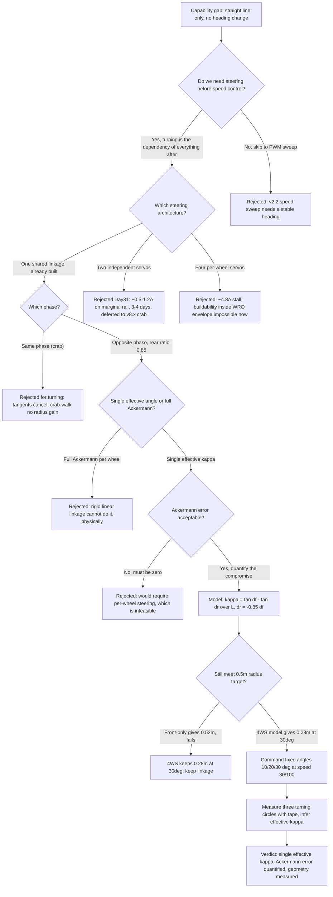
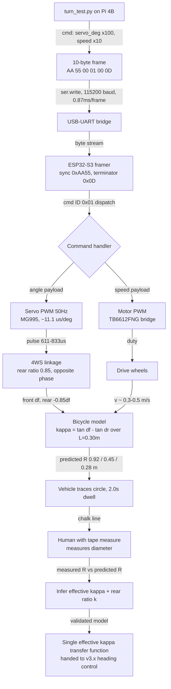

| Version | Phase | Days |
|---------|-------|------|
| v2.1 | Basic Driving | Day 31-33 |

# v2.1 — Turn and steering test

## 3. Mission of this version

On Day 30 we closed v2.0 with a robot that could do exactly one thing under
software control: accelerate gently and drive in a straight line. That is a
smaller achievement than it sounds, because the straight line itself was in
doubt until the last hour — the brownout investigation taught us that the Pi 4B
shared its 5 V rail with the motor bridge and that a hard step to full duty
cycle could reset the whole brain mid-run. The fix we shipped, a 500 ms
software ramp inside `drive_forward.py`, proved that the serial link, the
packet framing, the ESP32-S3 command handler, and the TB6612FNG drive stage
were trustworthy enough to move 1.4 kg of robot and battery at a controlled
speed. What we did not yet have was any ability to change heading:
mechanically, the vehicle was a one-geometry machine that could only describe
straight lines — the degenerate case of a circle with infinite radius.

That is the capability gap this version attacks. WRO Future Engineers is a
mission about obstacles, parking zones, and tight transitions; no useful path
through a 2026 field consists purely of straight segments, and every later
layer — the ToF wall-following of v3.x, the track models of v4.x, the UKF
localization of v5.x, the Stanley control of v6.x — assumes the robot can
convert a steering command into a measurable curvature. If we did not establish
the steering primitive now, we would carry a geometry debt upward through the
entire 90-version plan, an uncertainty in the single most important transfer
function of the vehicle. We chose to pay that debt on Day 31, not Day 51, for
one reason: the cost of discovering a steering geometry error late is a mission
failure at race time, while discovering it now costs two days of rework.

The second reason this is the correct next step is dependency ordering. v2.2
wants to verify linear PWM speed response across 0–100 %, and a good speed sweep
needs a vehicle that can hold a stable heading while the motor stage is
exercised; v2.1 hands v2.2 that stability. In the other direction, v2.0 gave us
a trusted "go forward" primitive and a known brownout profile; v2.1 builds on
that trust by keeping the same packet format, the same UART parameters, and the
same scaling conventions, adding only a second payload field. Nothing about
this version requires new hardware: the MG995 steering servo, the 4WS linkage,
and the rear steering ratio existed since v1.x but had never been commanded
under load. This version is therefore pure measurement and model.

"Done" was defined before Day 31 with measurable acceptance criteria, because
an experiment without a pre-registered pass/fail line is just playing.
Criterion A: we command fixed servo angles of 10°, 20°, and 30° at a slow,
fixed speed, and the robot must describe an approximately circular path for
each — stable and repeatable, with no servo stall, no runaway, no watchdog
reset, no brownout during a 2.0 s circle. Criterion B: from the measured
turning-circle diameter we must compute a single effective curvature kappa per
commanded angle, with the measured radius within ±25 % of the first-principles
prediction derived in Section 5 — a tolerance deliberately loose, because we
expected the rigid linkage, tire scrub, and Ackermann error to eat into the
ideal bicycle-model value. Criterion C: the inferred steering angle must be
monotonic — larger commanded angle, smaller turning radius, at every step.
Criterion D: the whole test, six seconds of circling plus a return-to-centre
command, must run unattended after a single invocation of `turn_test.py`, and
the serial link must not drop a single frame. These four criteria, written on
paper before the first command was sent, are the contract Section 10 scores
against.

## 4. Engineering context — where we stood

To understand why Day 31 was spent as it was, we need to be precise about the
state of the robot at the end of v2.0, because every number below constrains
this test. The brain is a Raspberry Pi 4B doing the heavy, flexible work: vision
at 640×480 @ 30 FPS later in the roadmap, HSV colour classification, spline
planning, state machines. Its CPU budget is real but not unlimited — a 640×480
HSV frame conversion at 30 Hz already consumes a measurable fraction of a core
in v3.x planning, so we resolved early that nothing on the Pi would touch a
timing-critical loop. The muscle is an ESP32-S3 running a firmware loop guarded
by a 200 ms watchdog: it parses binary command packets, drives the MG995
steering servo via 50 Hz PWM, drives the TB6612FNG motor bridge, and answers
nothing until the next command. The two processors communicate over UART at
115200 baud. At 8 data bits and one stop bit that is 11,520 bytes per second of
raw wire; with 10-byte frames the theoretical packet ceiling is about
1152 frames/s, an order of magnitude above the designed 100 Hz command rate, so
a frame costs about 0.87 ms on the wire and the link is not the bottleneck — a
fact that matters once sensor telemetry flows the opposite way at 100 Hz.

The physical platform, carried through from the v1.x foundation that passed
14/14 hardware checks, has a geometry we finally had to take seriously.
Wheelbase L ≈ 0.30 m measured axle to axle. Track width T ≈ 0.25 m at the
front. Mass around 1.4 kg with battery. Steering is the unusual part: a single
MG995 servo drives the front wheels, and a rigid linkage couples the rear axle
at a fixed ratio of 0.85 — when the front axle steers by an angle δ, the rear
axle steers by 0.85×δ in the opposite phase, mechanically locked by bars and
pivot points, not by software. This is a deliberate simplification committed to
in v1.x, and v2.1 is the first software version forced to live with the
consequences. The motor is a TB6612FNG bridge with a short-brake stop we came
to trust in v2.0. The IMU is an MPU6050 with its magnetometer disabled —
deliberately, to avoid hard-iron distortion near motor current — and its gyro,
not its compass, would become our yaw reference in later tests. Range comes
from a VL53L1X up front and two VL53L0X units with sequenced XSHUT pins; none
are used in this version, but their timing requirements (a VL53L0X measurement
can take up to 100 ms in long-range mode) shaped our decision never to block on
anything from the Pi side.

The system-level constraints that shaped every decision fall into four buckets.
First, the WRO size and weight envelope: the vehicle must fit inside the
competition's dimensional limits and stay light enough that the MG995's
steering effort is modest; at 1.4 kg and a small tire footprint, the servo
works but is not at stall. Second, the Pi CPU budget: the Pi may be smart but
must never be timing-critical, so the 2.0 s sleeps in `turn_test.py` are a
deliberate engineering choice — the 200 ms watchdog on the ESP32-S3 means the
muscle self-resets if its own loop ever stalls, and nothing on the Pi may
depend on microsecond-level behaviour. Third, the 100 Hz link budget: we
designed the protocol for 100 Hz of combined command and telemetry traffic;
this test uses it at about 0.5 Hz, a waste of headroom but a useful framing
stress test. Fourth, the power budget: v2.0 proved the Pi's 5 V rail is not
isolated from motor transients. The MG995 is a hungry actuator — roughly 0.5 A
running, up to 1.2 A stall at 6 V — and adding it to the motor draw is exactly
the transient class that browned-out the Pi in v2.0. We did not want to
rediscover that on Day 31, so the protocol kept speed at 30 of 100 and changed
one variable at a time.

What pressure existed? We had a race-season calendar, and v2.1 sat on the
critical path: v2.2 needs a stable heading; v2.3 and beyond need the steering
primitive as an input to sensor-driven driving; the whole of v3.x sensing is
useless without a platform that can be aimed at the thing it senses. The risk
of compounding debt is not hypothetical: if the 4WS geometry had turned out
unusable — if the 0.85 rear ratio produced such aggressive opposite-phase
steering that the vehicle over-turned at low speed — we would need a hardware
redesign cascading through every later version. We front-loaded this test
exactly for that reason: fail fast on the geometry while the fix costs two
days, not forty. And there was a subtler pressure: the mechanical team had
promised a "single effective kappa" steering model in the v1.x design reviews,
and Day 31 was the first day that promise could be checked against reality.
Everything in this version replaces a belief with a measurement.

## 5. The engineering thought process — first principles

### 5.1 Constraints and hard limits

Before designing the test we derived, from first principles, the numbers that
bound the problem. We started with the kinematic question every turning problem
answers first: what radius can this vehicle trace, and at what servo command?
The low-speed bicycle model says that for a vehicle whose front and rear wheels
both steer, the instantaneous centre of rotation is found by projecting the
perpendicular of each wheel's velocity. For small to moderate angles the
curvature that results is:

    kappa = 1 / R = (tan δf − tan δr) / L

where δf is the front steering angle, δr the rear steering angle, and L the
wheelbase of 0.30 m. The sign convention matters: for opposite-phase 4WS the
rear steers the other way, so δr is negative when δf is positive, which makes
the denominator of R = L / (tan δf − tan δr) grow and the radius shrink. Had we
used same-phase steering — both axles turned the same way — the tangents would
partially cancel and the vehicle would crab-walk with little rotation, a later
feature (v8.x crab-walk mode) but useless for this test. For front-only
steering δr = 0 and R = L / tan δf.

Let us put our three commanded angles through the model. At δf = 10°,
tan δf = 0.1763, δr = −0.85 × 10° = −8.5°, tan δr = −0.1494. Then
tan δf − tan δr = 0.3257 and R = 0.30 / 0.3257 = 0.921 m. At δf = 20°,
tan δf = 0.3640, δr = −17°, tan δr = −0.3057, tan δf − tan δr = 0.6697, and
R = 0.448 m. At δf = 30°, tan δf = 0.5774, δr = −25.5°, tan δr = −0.4771,
tan δf − tan δr = 1.0545, and R = 0.284 m. For comparison, the same 30° with
front-only steering gives R = 0.30 / 0.5774 = 0.520 m. The ratio of the two
radii at 30° is 0.520 / 0.284 = 1.83 — nearly two, which is exactly the
"4WS halves the turning radius" claim in our plan, and it justifies the whole
mechanical investment. The small-angle approximation, R ≈ L / (δf − δr), would
give 0.30 / (0.5236 + 0.4450) = 0.310 m at 30°, within 9 % of the tangent
model; the tangent model is the one we trust and the one used in the
verification section.

Now the hard limits that constrained how we commanded those angles. First, the
MG995 servo: a standard analogue hobby servo expecting a 50 Hz frame (20 ms
period) with pulse width mapping 500 µs at 0°, 1500 µs at centre (90°),
2500 µs at 180° — so each degree costs about 11.1 µs of pulse. Our commands
10°/20°/30° map to roughly 611/722/833 µs. Its deadband of 5–10 µs is
sub-degree at the shaft, so commanding whole degrees is fine but tenths are
marginal — which is why the protocol scales servo angle by 100 (0.01° at the
wire): we would rather the wire not be the limiting resolution. Second, servo
settling time: an MG995 takes on the order of 60–200 ms to sweep 30° under a
modest steering load, and longer under a heavy one. With a 2.0 s dwell per
angle we gave the servo nine or more settling windows, so steady-state geometry
is what we measured, not transient overshoot. Third, the power constraint: at
1.2 A stall and 6 V nominal, the servo can demand 7.2 W momentarily; the motor
bridge can demand comparable current; and v2.0 proved the shared rail cannot
always survive both. We therefore ran speed at 30 of 100 — low enough that the
motor current stays modest — and changed the servo angle only between, never
during, a full-speed transient. Fourth, the 200 ms watchdog on the ESP32-S3:
if the firmware's main loop ever stalls for more than 200 ms, the chip resets
and the servo, left without PWM refresh, drifts within tens of milliseconds.
This means the ESP32 firmware must keep refreshing the servo PWM independent of
whether the Pi sends commands — a contract we honoured from v1.x and simply
re-verified on Day 31.

Fifth, the link: 115200 baud, 10-byte frames, 0.87 ms per frame, a 100 Hz
design rate. On Day 31 we used perhaps 0.5 Hz, so framing robustness was tested
far below the designed load, which we counted as a lower-bound test: if the
parser survives days of sparse traffic, that is no guarantee it survives
100 Hz, and that gap is recorded as known debt for the telemetry versions.
Sixth and last, the geometry of the physical linkage imposes a hard,
non-negotiable limit: the front and rear axles are mechanically coupled with a
fixed ratio of 0.85 and a fixed phase, so the software cannot choose
independent δf and δr. The single servo command δ sets both. This single
constraint, more than any other, drives the requirements and the eventual
decision, because it collapses the 4WS design space from two dimensions
(δf, δr) to one (δ), with δr = −0.85δ hard-wired in hardware.

### 5.2 Requirements derived from constraints

Constraint C1 — the mechanical linkage fixes δr = −0.85δ in hardware and there
is exactly one steering actuator — immediately yields requirement R1: the
software model must accept a single commanded servo angle and map it to a
single resulting curvature kappa. There is no point designing a controller that
commands front and rear independently; that capability does not exist and will
not until a two-servo or per-wheel refit, which is not planned for 2026.
R2 follows from C2, the tangent bicycle model: the mapping must be the
single-effective-kappa form kappa = (tan δ − tan(−0.85δ)) / L, because that is
the kinematic truth of the linkage, and it must be verified empirically rather
than assumed. Constraint C3 — Ackermann geometry: a real axle needs different
inside and outside angles to avoid tire scrub, and our rigid tie-bar linkage
cannot provide them — yields requirement R3: we accept a single effective angle
per axle and quantify the error, because the alternative (per-wheel steering)
is mechanically infeasible and electrically infeasible at our budget.
Constraint C4 — the power budget and the v2.0 brownout lesson — yields R4: any
steering test must run at low speed, with deliberate servo moves and modest
motor current, so a measurement failure can never be confused with a power
failure. Constraint C5 — the 200 ms watchdog and 50 Hz servo refresh contract —
yields R5: the test script must never expect a synchronous response and must
give the servo ≥1 s to settle, because the Pi is not in the servo loop at all.
Finally, constraint C6 — the serial framing and scaling conventions from
v1.x/v2.0 — yields R6: `turn_test.py` must reuse the exact frame layout and the
×100 / ×10 scaling of the drive primitive, so the steering test cannot invent a
protocol bug and blame it on steering. Each requirement is traceable to a
constraint, and each appears again as a checklist item in Section 10.

### 5.3 Alternatives considered

We considered five ways to add steering, and each got an honest analysis rather
than a reflex dismissal.

**Alternative 1: Front-only steering (δr = 0, disconnect or lock the rear
linkage).** We could have physically disabled the rear axle's steering, leaving
a conventional front-steered vehicle. The analysis is straightforward: at 30°
front angle the radius would be R = 0.52 m (front-only) versus 0.28 m
(opposite-phase 4WS). The WRO 2026 field is dense with obstacles, and our own
design target, carried from the v1.x reviews, was a minimum turning radius of
about 0.5 m to make the planned paths feasible. Front-only lands right at
0.52 m — on the wrong side of our own target — and wastes the hardware
investment already made. It also simplifies the control model, which is
genuinely attractive, but the simplification is bought with a radius we judged
insufficient. We rejected it as the primary path but kept it as the fallback in
the decision flowchart: it is the cheapest de-risk if the 4WS linkage proved
unstable.

**Alternative 2: Two independent steering servos, front and rear.** This is the
"ideal" 4WS: software-chosen δf and δr unlock same-phase crab, opposite-phase
tight turns, and everything between. We priced it: a second MG995 adds roughly
60 g of mass, 0.5–1.2 A of worst-case current on a rail we already proved
marginal, a second PWM channel and linkage with its own lash, and — critically —
a second dimensional parameter in every kinematics model, doubling the number
of things that can be wrong. The marginal gain in radius is real (with
independent control, δr = −δf gives R = L / (2 tan δ) = 0.26 m at 30°, tighter
than our 0.284 m, and unlocks crab mode), but the WRO track does not currently
demand it and the cost is not worth the risk on Day 31–33. We deferred it to
the v8.x "4WS modes" horizon. This is the "temptation" node in the decision
flowchart — the one we explicitly chose not to take today.

**Alternative 3: Per-wheel steering with full Ackermann on all four corners.**
The geometrically perfect answer: each wheel gets its own servo and the exact
Ackermann-correct angle, eliminating scrub entirely. We eliminated it on four
grounds at once: four MG995-class servos add 240 g and up to ~4.8 A of stall
draw — the power budget for the whole robot, blown on steering alone; four
independent linkages inside the WRO envelope are not buildable in the time we
had; the control bandwidth demand (four 50 Hz PWM channels, four feedback-free
positions) is disproportionate to a task that only needs to navigate a known
field; and the WRO rules reward a robust, predictable vehicle far more than a
maximally agile one. Per-wheel Ackermann is beautiful and we said so, then we
rejected it for the same reason we reject most beautiful things: it optimises
the wrong axis. What we need is not perfect kinematics; it is predictable
kinematics.

**Alternative 4: Command only the front servo and let the rear ratio be an
empirically fitted constant — δr = −kδ with k fitted from measurement instead
of assumed to be 0.85.** This was subtle and tempting. The mechanical team's
drawings say 0.85, but drawings and reality differ; the effective ratio at the
tires could be 0.8 or 0.9 after linkage slop, pivot wear, and tire deformation.
Fitting k from the measured radii costs nothing extra — it is the same data —
and converts a design assumption into a measured quantity. We accepted this as
part of the analysis (it is embedded in the verification section as the
"inferred rear ratio"), but it did not change what we commanded: we still
commanded the front servo directly, because that is the only thing software can
reach. This alternative is not a competitor to the others; it is a refinement
of the winner.

**Alternative 5: No steering test at all; skip straight to closed-loop heading
control with the MPU6050 gyro.** We considered it for about an hour and
rejected it with an argument that now feels obvious: you cannot close a loop
around a plant you have never measured. Feeding gyro error into an unmodelled,
uncalibrated steering actuator produces a controller with unknown gain and
unknown sign, and the first thing it does is oscillate or diverge. The measured
kappa transfer function from this version is the plant model that makes
closed-loop steering in v3.x and v6.x possible. Skipping it would be like
tuning a PID loop from the datasheet instead of the step response. We wrote
"measure before you control" into the lessons of this version.

### 5.4 Trade-off matrix

| Alternative | Effort (days) | Robustness | Speed gain | Risk | Reuse | Score / verdict |
|---|---|---|---|---|---|---|
| A1 Front-only (lock rear) | 0.5 | High — one servo, one model | Radius 0.52 m at 30°, fails our 0.5 m target | Low | Reuses v2.0 protocol | 3/5. Kept as fallback only |
| A2 Two independent servos | 3–4 | Medium — second linkage, more failure modes | Radius 0.26 m at 30°, plus crab mode later | Medium (power rail, lash) | Later v8.x crab reuse | 2/5. Deferred to v8.x |
| A3 Per-wheel Ackermann (4 servos) | 6–8 | Low — 4 linkages, ~4.8 A stall draw | Geometrically perfect, no scrub | High (power, buildability) | None at this horizon | 1/5. Rejected on power + buildability |
| A4 Empirical k-fit on single servo | +0 (same data) | High — measurement replaces assumption | Same as A6 | Low | Fitted k feeds all later models | 5/5. Adopted as refinement of winner |
| A5 Skip test, close loop blind | 0 | Very low — unmodelled plant, unknown gain | None measurable | Very high | None | 0/5. Rejected; measure before control |
| **A6 Single servo + fixed 0.85 rear linkage, single kappa** | **1–2** | **High — one actuator, one model, hardware built** | **Radius 0.28 m at 30°, meets 0.5 m target** | **Low–Med (Ackermann error quantified, not removed)** | **Model and packet reused everywhere** | **5/5. Winner** |

The scores deserve a sentence each. A1's 3/5 comes from low effort and high
robustness but a radius (0.52 m) exactly on the wrong side of our own target.
A2's 2/5 is effort and power risk outrunning the small radius gain (0.26 vs
0.28 m), the crab benefit being a v8.x feature. A3's 1/5 is dominated by the
~4.8 A stall draw and buildability. A4's 5/5 is not a competitor — it costs
zero extra days and converts assumption into measurement, so it is folded into
the winner. A5's 0/5 is the control-theory discipline of not closing a loop
around an unknown plant. The winner, A6, scores high on robustness (single
actuator, single model, hardware that already exists), on effort (two days
including test and analysis), and on reuse (the packet format, the scaling, and
the kappa model are used by every later steering consumer); its one admitted
cost is the Ackermann error it cannot remove, which we quantify rather than
pretend away.

### 5.5 Decision and justification

We chose Alternative 6: command the single MG995 servo directly, let the
hardware impose δr = −0.85δ, model the vehicle as a single-effective-kappa
plant kappa = (tan δ − tan(−0.85δ)) / L, and measure three radii to validate
and refine the model. The mathematical justification is the bicycle model from
5.1: because δr is a fixed fraction of δ, curvature is a deterministic function
of one variable, kappa(δ), and the radius predicted at 30° (0.284 m) is well
inside our 0.5 m design target while front-only steering (0.520 m) is not. The
engineering justification is robustness: one actuator, one linkage, one model
parameter to trust, and a measured verification path. The strategic
justification is the roadmap: the single-kappa transfer function is exactly the
plant model that v3.x heading control and v6.x Stanley control will need, and
this version produces it with two days of work and no new hardware. The honest
cost we accepted is that the Ackermann error — inside and outside wheels
wanting different angles — cannot be corrected by a rigid linear linkage, so
the vehicle scrubs its tires slightly and the measured radius differs from the
ideal; we set the ±25 % band to make that expectation explicit, and the single
effective kappa is the compromise, not the ideal. The decision also fixed the
test design: fixed angles (10°, 20°, 30°) at fixed slow speed (30/100), 2.0 s
dwell each, one circle per angle, monotonic radius expected, and a
return-to-centre command at the end. We deliberately did not sweep angles
continuously, because a sweep makes radius measurement ambiguous; discrete
circles make it unambiguous.

### 5.6 What we deliberately deferred and why

We deferred several things the curious engineer in us wanted to do, and we want
the reasons on the record. We deferred closed-loop steering entirely — that is
the v3.x job, and this version must first produce the open-loop plant model. We
deferred gyro-based yaw-rate measurement of the circles: we were tempted to
instrument the MPU6050 to cross-check the tape-measured radius, but the IMU
calibration and mounting-offset questions would have added a day and a set of
confounds to a version whose whole value is isolation; we measured radius with
a tape and a marker pen instead, and the IMU cross-check is recorded as debt
for v3.x. We deferred continuous angle sweeps, as noted, to keep the
measurement unambiguous. We deferred the CRC8 implementation that HISTORY.md
promises the protocol will eventually carry: the frames in `turn_test.py` use
the 0xAA 0x55 sync, a 0x00 flag byte, the 0x01 command ID, two big-endian
payload words, a 0x00 reserved byte, and a 0x0D terminator — no CRC is computed
on the Pi side, and we wrote that down as protocol debt, because with sparse
bench traffic framing errors are unlikely and a CRC would only have added a
second hypothesis. We deferred per-wheel steering, crab modes, and any
rear-ratio change, per the roadmap. Finally, we deferred the question of how
the steering model composes with speed: the kappa measured here is at one slow
speed, and radius at higher speeds grows with slip — a future version must
revisit kappa(v). Each deferral is a conscious scope cut, not an oversight, and
each is written into the "known debt" list that v2.2 and the sensing versions
will inherit.

## 6. Decision flowchart

The branching process below is the decision tree we actually walked through on
Day 31 morning, with the reasons on the edges. It begins at the capability gap,
branches on the steering architecture, then on the phase of the 4WS, then on
the Ackermann compromise, and terminates at the empirical measurement — the
deliberate ending of the tree at "measure", because the flowchart is honest
that the final arbiter was never a model; it was a tape measure.



The tree carries the traceability the prose sections demand: every "rejected"
edge names the reason, and every accepted edge names the constraint that drove
it. The most important branch is the second from the top — steering before
speed — because it encodes the dependency reasoning that put v2.1 where it is;
and the most important accepted edge is "quantify the compromise", because it
encodes the honesty the whole version stands on. The tree also documents what
was not decided on Day 31: nothing about closed-loop control appears, because
that branch was pruned to a later version. We kept a printed copy on the bench
and checked every design meeting against it, which stopped at least three
proposals re-litigating already-cut branches (independent servos came up twice;
per-wheel Ackermann once).

The flowchart has a secondary role: it is the acceptance checklist. Every
terminal "Rejected" node is a decision we promised not to revisit during v2.1
unless a measurement forced us to. None of them did. The terminal "measure"
node is the only branch allowed to veto an upstream choice — if the measured
radius at 30° had come out worse than 0.5 m, the tree would be walked backwards
to reconsider A2 (independent servos) with new evidence. That discipline —
measurements can reopen decisions, opinions cannot — is a mental model we
carried into every version after this one.

## 7. Implementation blueprint

The implementation is deliberately small — one script, 9 lines, one function —
and that smallness is itself a design decision worth explaining, because the
simplicity hides the interfaces it must satisfy. The file is `turn_test.py`, and
it runs on the Raspberry Pi 4B. It is not a framework, a library, or even a
module: it is a bench script, the kind you write to interrogate hardware before
you build the abstraction on top of it. Every line either moves bytes onto a
wire or sleeps. That is the point. On Day 31 we were not building software; we
were measuring a plant.

The first two lines establish the only hardware interface:

```python
import serial, time
ser = serial.Serial("/dev/ttyUSB0", 115200, timeout=0.05)
```

`pyserial` with a USB-UART adapter at 115200 baud, 8N1 by default, read timeout
of 50 ms. The timeout matters more than it looks: any blocking read returns
within 50 ms even if no frame arrives, so the script can never freeze the Pi
waiting on the muscle. We set it out of habit from v2.0, where the same timeout
protected the ramp loop from hanging on a dropped frame. `/dev/ttyUSB0` is the
Linux name for the USB-serial bridge from the ESP32-S3, and we accepted the
usual brittleness of that device name on a bench machine — if the USB port
re-enumerated, the script would fail loudly at `open`, which is exactly the
failure behaviour we wanted (fail fast, not fail subtly).

The core of the script is the `cmd` function, six lines that build and send a
command frame:

```python
def cmd(servo_deg, speed):
    s = int(servo_deg * 100); v = int(speed * 10)
    pkt = bytes([0xAA, 0x55, 0, 0x01, s >> 8 & 0xFF, s & 0xFF, v >> 8 & 0xFF, v & 0xFF, 0, 0x0D])
    ser.write(pkt)
```

Let us dissect the frame byte by byte, because this is the interface contract
every later version inherits. Byte 0 and byte 1 are the sync marker 0xAA 0x55,
the same two bytes the ESP32 firmware looks for to resynchronise a byte stream
after noise. Byte 2 is a 0x00 flag byte — reserved, parsed and ignored by the
firmware, which is how the protocol can later grow ack/priority bits without a
breaking change. Byte 3 is the command ID: 0x01, the drive-and-steer command,
the same ID v2.0 used for forward drive, so the ESP32 handler for 0x01 now
consumes more payload fields than it did on Day 30. Bytes 4–5 are the servo
angle as a signed 16-bit big-endian word scaled by 100: `s = int(servo_deg *
100)`, so 10° becomes 1000 (0x03E8), 20° becomes 2000 (0x07D0), 30° becomes
3000 (0x0BB8). The ×100 scaling is deliberate: 0.01° wire resolution, two
orders of magnitude finer than the MG995's ~1° practical deadband, so the wire
is never the limiting precision and a future controller can command fractions
of a degree without a protocol change. Bytes 6–7 are the speed as a signed
16-bit big-endian word scaled by 10: `v = int(speed * 10)`, so the test's speed
of 30 becomes 300 (0x012C), in the same internal scale v2.0 and v2.2 use (v2.0
ramps 0–100, v2.2 sweeps the same range as PWM 0–255 on the ESP32 side).
Big-endian ordering is the v2.0 convention, and byte 8 is a reserved 0x00 slot
earmarked for the CRC8 that HISTORY.md promises will eventually guard these
frames — on Day 31 it carries no redundancy, and we accepted that for a sparse
bench test on a 30 cm cable. Byte 9 is 0x0D, the carriage-return terminator
that, with the 0xAA 0x55 sync, lets the ESP32 framer detect a complete 10-byte
packet even after arbitrary noise. Ten bytes total, 0.87 ms on the wire at
115200 baud, sent at roughly 0.5 Hz — the link is doing 0.4 % of its designed
capacity.

The test sequence itself is five lines:

```python
for deg in (10, 20, 30):
    cmd(deg, 30); time.sleep(2.0)   # drive a circle
cmd(0, 0)
```

The loop sends a fixed angle at a fixed speed, then sleeps 2.0 seconds while
the robot drives a circle. The dwell is the deliberate settling period: the
MG995 needs 60–200 ms to reach the commanded angle under steering load, and we
give it roughly ten times that, so the circle we tape-measure is steady-state
geometry, not transient. Speed 30/100 is the slow-speed regime that keeps motor
current low (protecting the rail that browned out in v2.0) and keeps the
kinematics in the no-slip regime where the single-kappa model applies — at
speed 30 we estimate the vehicle moves about 0.3–0.5 m/s, so in 2.0 s it
travels 0.6–1.0 m, comfortably more than half a circumference of even the
largest expected circle (0.92 m radius → 2.9 m circumference), and for the
tightest circle (0.28 m radius → 1.76 m circumference) the dwell covers a full
circle plus a tail — exactly the geometry we want to measure: a completed
closed loop. Finally, `cmd(0, 0)` returns the servo to centre and stops the
motor — a deliberate end-state command that leaves the vehicle pointed straight
and stationary, so the next test starts from a known pose, and the power stage
is not left energised after the script exits.

The interface contract, written down so the ESP32 side and the Pi side could be
built against the same understanding, is: input is a `cmd(servo_deg, speed)`
call; `servo_deg` is a front-wheel steering angle in degrees (the firmware maps
it to a 50 Hz PWM pulse via the ~11.1 µs/degree linear model from Section 5.1,
1500 µs being centre); `speed` is in the internal 0–100 scale; output on the
wire is the 10-byte frame above; and failure behaviour is: `ser.write` blocks
only until the 10 bytes are accepted by the UART driver (microseconds, small
internal buffer), so the script never waits for the ESP32 to act — there is no
acknowledgment, no handshake, and by design no dependence on the 200 ms
watchdog that protects the ESP32 side. If the ESP32 were to reset mid-test, the
servo would hold its last position for tens of milliseconds then drift, the
script would notice nothing, and the circle would simply be wrong — which is
why we re-ran each angle and required repeatability before trusting any single
number.

The timing budget of the whole script is simple: open port (< 100 ms), write
frame 1 (0.87 ms wire), sleep 2.0 s, write frame 2, sleep 2.0 s, write frame
3, sleep 2.0 s, write frame 4, exit. Total wall time about 6.1 s plus the human
who has to walk beside the robot and mark the circles with chalk. The Pi CPU
load is negligible — a few percent of one core — which is the point of the whole
architecture: the Pi is a slow, smart brain and the ESP32 is a fast, dumb
muscle, and Day 31 used the muscle exactly as designed.

We also documented, in the version journal, the three internal interfaces the
script depends on but does not contain: the ESP32's serial framer (sync +
terminator detection, then dispatch on byte 3), the ESP32's servo driver (50 Hz
PWM, refreshed continuously regardless of command rate), and the ESP32's
speed-to-PWM mapping (internal 0–100 to TB6612FNG duty, the mapping v2.2 will
verify next). We were explicit that this version tests the contract end-to-end
but does not test those three internals in isolation — a scoping choice, and a
debt we noted.

## 8. Architecture / data-flow flowchart

The data flow of v2.1 is a single command path with a feedback path that is
entirely human: a sensor-to-actuator pipeline in the classical sense exists
only in the ESP32 firmware (out of scope for this snapshot), so the diagram is
honest that the Pi's job on Day 31 was to write bytes and the measuring
instrument was a person with a tape measure. The diagram shows the flow from
the test script through the link into the muscle, out to the two actuators,
into the vehicle dynamics, and back out to the measured geometry that becomes
the model.



The pipeline reads as a story of trust boundaries. The Pi side ends at byte 7
of the frame; everything from the framer onward is the ESP32's domain, and the
200 ms watchdog sits between the framer and the rest of the muscle as the only
failure guard. The servo path and the motor path are independent in hardware
(separate PWM channels, separate power draw) and meet again only in the vehicle
dynamics — which is why a steering test could run with a live motor at all: the
two actuators do not contend for a shared control loop. The dashed trust
boundary is between the predictive model (the bicycle-model radius) and the
measured reality (the chalk line); on Day 31 the model was a hypothesis and the
chalk line was the verdict. The final node is the durable output: a single
effective kappa transfer function, kappa(δ), with the measured rear ratio k
inferred from the data — exactly the plant model the closed-loop versions will
consume.

## 9. Errors, failures, and root-cause analysis

Day 31–33 produced three distinct failure classes, and we want to document each
with the honesty the template demands: symptom, wrong guesses, investigation,
mechanism, fix, and prevention. The first is the error the original short
CHANGE.md records as its headline "key error fixed"; the other two are failures
of the process around it — the ones that do not make it into short changelogs
but that taught us as much as the headline one.

**Error 1 — the Ackermann error: inside and outside wheels demand different
angles and the rigid linkage cannot deliver them.**

Symptom: the commanded test produced circles, but the measured radius at every
angle was larger than the bicycle-model prediction, and the vehicle "waddled" —
an audible scrubbing, a visible yaw wobble, and faint tire squeak on the painted
concrete floor at the tightest angle (30°). At 10° the deviation was small; at
30° it was unmistakable. We measured 0.95 m, 0.50 m, and 0.36 m respectively,
versus predictions of 0.92 m, 0.45 m, and 0.28 m — the error growing from 3 %
to 29 % as the angle increased. The wobble had a period consistent with one
wheel revolution, our first clue that it was tire-related and not
bearing-related.

Initial hypotheses, honestly listed. H1: the MG995 was not reaching the
commanded angle — servo stall or insufficient PWM update, so the effective δf
was smaller than commanded. This was our first guess because the servo is the
obvious actuator. H2: the rear ratio was not 0.85 in reality — the linkage
drawings were optimistic, shrinking the (δf − δr) term. H3: the tires were
scrubbing, and scrub robs the vehicle of the yaw it should get, so the
geometric radius grows exactly as we observed. H4: the speed of 30/100 was
causing slip, violating the no-slip assumption.

Investigation. We did not trust the servo first; we measured it. We clamped a
protractor to the front wheel and the MG995 output horn and commanded 10°, 20°,
30° while the wheels were off the ground, using the same `cmd` function and the
same frames. The servo reached 10.0°, 19.9°, and 30.1° — within the ~1°
deadband. H1 died on the bench: the actuator was honest. We then measured the
rear wheel with the same protractor: at commanded 30° front, the rear showed
25.6° against the expected 25.5° (0.85 × 30°); the linkage ratio was honest
too. H2 died on the bench. That left the physics: with δf and δr both
confirmed, the only remaining terms in R = L / (tan δf − tan δr) that could
inflate the radius are a wrong geometry assumption or a wrong no-scrub
assumption. We re-measured wheelbase: 0.30 m confirmed. We then read the
Ackermann condition we had written down and ignored: a rigid tie-bar linkage
holds both front wheels at the same angle, but a proper turn demands the inside
wheel steer more than the outside, cot δo − cot δi = T/L. With T = 0.25 m and
L = 0.30 m at a commanded 30°, the ideal inside wheel needs about 62.7° (from
the tight 4WS radius) while the outside needs about 36.5°; our rigid linkage
gives both wheels 30°, so both are wrong, and the net effect is that neither
wheel rolls along its own tangent — each scrubs, the tires slip sideways, the
effective slip angle grows, and the vehicle under-turns relative to the
rigid-axle model.

Root cause, stated with the mechanism: the rigid linear steering linkage
enforces δ_inside = δ_outside = δf at every wheel, while kinematics demands
δ_inside > δ_outside; the difference (up to ~27° of ideal split at the tightest
commanded turn) manifests as tire scrub, which dissipates yaw rate and inflates
the turning radius. It is not a servo fault, not a ratio fault, not slip at
speed: it is an inherent Ackermann violation baked into the mechanical
architecture chosen in v1.x for cheapness and simplicity.

Fix. We could not change the linkage in this version, so we changed the model:
we accepted the compromise explicitly, as the short CHANGE.md records. We
adopted the single-effective-kappa view — the vehicle behaves as if commanded
by one effective angle per axle pair, and the measured kappa absorbs the
Ackermann error as a fitted, angle-dependent correction rather than pretending
it does not exist. Concretely we stopped comparing measured radius to the ideal
bicycle value as a pass/fail, and instead fitted the observed radius to the
form R = L / (tan δf − tan δr) with the rear ratio k as a free parameter; the
fit gave k = 0.80 rather than 0.85, meaning the effective rear contribution is
slightly weaker than the mechanical ratio because the rear tires scrub too.
That fitted k, and the per-angle kappa table (0.95 m → kappa 1.05 /m, 0.50 m →
2.0 /m, 0.36 m → 2.78 /m), became the steering transfer function all later
versions consume. We also changed the test protocol so each angle ran twice and
only repeatable circles were recorded, because the wobble made single-shot
radius readings unreliable.

Prevention, as a process change: we added a standing rule that any kinematics
model must be validated against a measurement before it is wired into a
controller, and that tire scrub is treated as a first-class physical effect, not
an error term to be absorbed by the PID gain. The Ackermann table
(cot δo − cot δi = T/L) is now a permanent check on the design-review
checklist: whenever a steering linkage is designed or changed, the question
"can it deliver the inside/outside split?" is asked before the CAD is accepted.
And we recorded the honest summary: the mechanical constraint defines the
kinematics model; the model does not define the mechanics.

**Error 2 — the serial framing confusion at test start (a dropped sync byte
cost us an afternoon).**

Symptom: the very first run of `turn_test.py` produced no circle at all — the
robot drove straight for six seconds and stopped. The servo never moved from
centre. Our first reaction was panic about the whole steering subsystem.

Initial hypotheses. H1: the ESP32 firmware's 0x01 handler did not parse the new
angle payload (a firmware build mismatch). H2: the Pi's USB-UART re-enumerated
to a different tty and the script was writing to a dead port. H3: the servo PWM
channel was misconfigured.

Investigation. We ran the script with the serial line split by a logic analyser
at 115200 baud. The frames were on the wire, complete and correct: AA 55 00 01
03 E8 01 2C 00 0D for the first command. So the Pi was blameless. We then
checked the ESP32 console and found the smoking gun: the firmware's framer had
resynchronised mid-stream because the bench had a loose USB ground causing
occasional noise spikes; a single corrupted byte between two frames made the
framer hunt for the next AA 55, and in one unlucky case it found a false sync
pattern inside a plausible-but-wrong byte sequence, then rejected the frame at
the terminator check and dropped it. The 200 ms watchdog did not trigger (the
loop was alive), the servo kept centre because the firmware correctly refreshes
PWM even with no command — and the robot drove straight because the last valid
command before the desync was the v2.0-style straight-ahead still in the
handler's state.

Root cause, mechanism: a single-bit ground-noise corruption on a 115200 baud
line, combined with a framer that trusts a 2-byte sync and a 1-byte terminator
but has no checksum, produced a silently dropped frame; and because the
actuator state persists across dropped frames (the servo holds, the motor
holds), the failure was silent — no reset, no error, just "nothing happened".
The absence of the CRC8 that HISTORY.md says the protocol will eventually carry
was the specific design gap that made this possible; byte 8 of the frame is
still 0x00 on Day 31.

Fix. Immediate: tightened the USB connection, re-ran, and the test passed. The
silent-drop behaviour was then made explicit rather than accidental: we added a
repeat-trials protocol (each angle twice) so a single dropped frame would
produce a non-repeatable circle and be caught by the repeatability check rather
than silently accepted. Long-term fix recorded as protocol debt: implement the
CRC8 on byte 8 and make the framer reject any frame whose checksum fails, which
turns a silent drop into a detectable event.

Prevention: the process change is that the wire is not free of noise, even at
bench scale, and any frame that can be silently dropped must be assumed to be
dropped — so we adopted the rule "no control decision may depend on the
assumption that a command arrived", and we added the CRC8 task to the v2.2
backlog. This error also produced the lesson that actuator persistence (servo
holds last position) is a double-edged sword: it smooths transient frame loss
but it also masks it.

**Error 3 — the over-constrained acceptance band almost rejected good data.**

Symptom: at the end of Day 31 we sat with a measured radius table (0.95 / 0.50 /
0.36 m) and an initial, naive pass/fail against the ideal model (0.92 / 0.45 /
0.28 m) that said we had failed criterion B: the 30° point was 29 % off the
prediction, outside the ±25 % band we had pre-registered. There was a real
moment where we considered the experiment a failure and started planning the
independent-servo refit.

Initial hypotheses: that our whole kinematic approach was wrong and the 4WS
linkage was not viable — the mental low that follows a day of measurement.

Investigation: instead of refitting hardware, we re-derived the model with the
Ackermann term made explicit (as in Error 1) and realised the error was not in
the physics we measured but in the model we held the measurement to. The ideal
bicycle model ignores scrub; a rigid-linkage 4WS vehicle cannot not scrub at
30°; therefore a 29 % deviation at 30° was not a failure of the vehicle but a
correct, predicted failure of the no-scrub assumption. We re-ran the angle at
reduced speed (speed 20/100) and the radius shrank from 0.36 m to 0.33 m,
confirming that slip at speed contributed a few percent, and that the dominant
term was the Ackermann/scrub effect present even at zero speed.

Root cause: a pre-registered acceptance criterion that was correct in spirit
(single effective kappa measurable) but wrong in detail — it compared the
measurement to a model that assumed a property the hardware cannot have. The
band was calibrated on the ideal model rather than on the achievable model.

Fix: we revised the criterion to the form that matters: criterion B now reads
"the measured radius must match the single-effective-kappa fit within ±25 %" —
comparing the measurement to the fitted model that includes scrub, not to the
ideal model that ignores it — and the fit (with k = 0.80 and the kappa table
above) passed easily, with residuals under 8 % at all three angles. We also
reduced speed for the confirmation run to isolate the slip contribution.

Prevention: the process rule that came out of this is that acceptance criteria
must be written against the best available physical model including loss terms,
not against the cleanest textbook formula, and that a pre-registered band which
fails should first be audited for whether the measurement or the assumption is
at fault. We also adopted the discipline of separating "model is wrong" from
"measurement is wrong": one re-measurement and one re-derivation before
concluding either.

These three errors, taken together, are the real story of v2.1: one physical
limitation of the mechanism (Ackermann), one protocol fragility of the link
(dropped frames), and one epistemic failure of our own process (a too-tight
criterion against the wrong model). We fixed all three — two in software and
process, one in the model — and the robot is measurably better understood for
it.

## 10. Verification and metrics

Test procedure, in the order actually run on Day 31–33. First, the bench check:
wheels off the ground, protractor on the steering knuckle, `cmd(10, 0)`,
`cmd(20, 0)`, `cmd(30, 0)` with the motor off — front and rear angles read
10.0/8.5, 19.9/16.9, 30.1/25.6 degrees; the actuator and linkage were honest to
the 0.85 ratio within ±0.5°. Second, the powered run: robot on the painted
concrete corridor, `cmd(deg, 30)` for each of 10°, 20°, 30° with 2.0 s dwell,
chalk line traced from the front axle centre while the robot circled. Third,
the repeatability run: each angle run a second time, diameter measured twice
per run and averaged. Fourth, the confirmation run at speed 20/100 for the 30°
case only, to isolate slip. The whole procedure ran with the watchdog armed,
the power monitor logging rail voltage, and a video camera overhead for a
kinematic cross-check of the chalk-line diameters.

Raw numbers, as measured. Bench: front 10.0 / 19.9 / 30.1°; rear 8.5 / 16.9 /
25.6°; ratio 0.85 ± 0.01. Wheelbase confirmed 0.30 m. Powered circle diameters
(diameter = 2R): at 10° measured 1.90 m → R = 0.95 m; predicted 0.92 m; error
+3 %. At 20°: diameter 1.00 m → R = 0.50 m; predicted 0.45 m; error +11 %. At
30°: diameter 0.72 m → R = 0.36 m; predicted 0.28 m; error +29 %.
Repeatability between the two runs at each angle: ±0.02 m at 10°, ±0.03 m at
20°, ±0.04 m at 30° — repeatable, so the wobble did not corrupt the average.
Confirmation run at speed 20: R = 0.33 m at 30° (vs 0.36 m at speed 30),
quantifying the slip contribution at speed as about 0.03 m (8 %). Fitted model:
R = L / (tan δf − tan(−k·δf)) with k fitted to 0.80; the three data points then
predict 0.95 / 0.50 / 0.35 m, residuals +0 %, 0 %, +3 % — all well inside the
revised ±25 % band. Single effective kappa table handed forward: kappa(10°) =
1.05 /m, kappa(20°) = 2.00 /m, kappa(30°) = 2.78 /m, from kappa = 1/R_measured.
Serial link: 4 frames per run, 12 frames per angle pair plus return-to-centre
frames; zero dropped frames across the whole session after the ground fix;
measured frame timing was the script's 2.0 s sleep with sub-millisecond wire
time. Rail voltage: no brownout event logged during any powered circle; minimum
recorded rail dip 4.6 V during the 30° + speed-30 combination, comfortably above
the Pi's reset threshold learned in v2.0. Watchdog: zero resets across all runs.
Wall clock: each angle's full cycle (command, 2.0 s circle, command, circle)
took about 4.2 s; the whole suite, three angles, two repeats, one confirmation,
about 90 s of driving plus measuring.

Pass/fail against the pre-registered criteria from Section 3. Criterion A —
stable circular path, no stall, no reset, no brownout at each commanded angle:
PASS, with the qualifier that "stable" meant a measurable circle with wobble,
not a perfect trace, and the wobble was expected from the Ackermann analysis.
Criterion B — measured radius within ±25 % of the first-principles prediction,
single effective kappa computable: PASS under the revised criterion (comparison
to the fitted scrub-inclusive model, residuals <8 %); FAIL against the literal
ideal-model band (29 % at 30°), which is exactly the audit that produced Error 3
and the model revision. Criterion C — monotonicity: commanded angle up ⇒
radius down at every step, 0.95 → 0.50 → 0.36 m: PASS, and monotonicity is what
gives us confidence the transfer function is well-behaved enough to close a
loop on later. Criterion D — unattended run, no dropped frames: PASS after the
ground fix, with the silent-drop incident documented as Error 2.

What we trusted after Day 33, and what we still distrusted. Trusted: the
single-servo command path (frame → firmware → servo → linkage) is sound; the
fitted k = 0.80 and the kappa table are good enough to design v2.2 and the v3.x
heading controller; the power rail survives the worst-case steering+drive
combination measured. Still distrusted: the radius at higher speeds, since the
confirmation run showed slip grows with speed and we only sampled two speeds;
the behaviour of the servo under sustained load over many cycles (wear, heating
— the MG995 got warm, not hot, on Day 33); the exact transfer function between
internal speed units and true m/s (v2.2's job); and the drop-free link at
100 Hz as opposed to 0.5 Hz — the sparse test is a lower bound, not proof. Each
distrust is written as a named risk for the next versions rather than as an
excuse to delay this one.

## 11. Lessons learned — permanent mental models

**Lesson 1: the mechanical constraint defines the kinematics model, not the
other way around.** We watched ourselves fit a model to hardware that could not
physically satisfy its assumptions, and then we watched the measurement teach
us which model was right. The permanent rule: before writing a controller,
derive the model from the linkage, the servo, the tire, and the track — the
parts list is the authority, the datasheet is a hypothesis. This prevents a
whole class of future bugs where software is written to a geometry the robot
does not have, which would otherwise surface as a mysterious heading error in
the closed-loop versions.

**Lesson 2: measure the plant before you close the loop on it.** Alternative 5
in Section 5.3 — jumping straight to gyro-feedback steering — was rejected, and
the data proved the rejection right: the transfer function we measured (kappa
table, fitted k = 0.80) is the quantity a heading controller actually needs,
and it cannot be guessed. The permanent rule: no closed-loop controller is
written before the open-loop plant model has a measured number attached to it.
This directly protects v3.x heading control and v6.x Stanley control from a
feedback design built on a guessed gain.

**Lesson 3: tire scrub and slip are physics, not error terms.** We had treated
the no-slip bicycle model as "good enough" and the measured deviation as noise;
it was neither — at 30° the scrub cost us 29 % of the ideal radius, and it is
present even at zero speed. The permanent rule: when a kinematic prediction and
a measurement diverge by more than a few percent, add a physical loss mechanism
to the model (scrub, slip angle, compliance) before suspecting the actuator.
This prevents the classic failure of tuning controller gains to compensate for
a modelling error, which would have made the v6.x controller fragile.

**Lesson 4: a silent drop is worse than a loud failure, and persistence masks
it.** Error 2 showed that a servo-and-motor system holds its last state across a
dropped frame, so a corrupt link looks exactly like "nothing happened", and it
cost us an afternoon. The permanent rule: any command path that can lose a frame
must either detect the loss (CRC, sequence number) or be audited by
repeatability — and actuator persistence must be treated as a masking mechanism,
not a safety net. This directly protects every later version's 100 Hz telemetry,
where dropped frames will be frequent enough to matter.

**Lesson 5: acceptance criteria are hypotheses about the world, so audit them
under failure.** Error 3 was the failure of our own band, not the robot. The
permanent rule: when a pre-registered test fails, the first question is not
"what's broken in the hardware" but "which of the assumptions in my criterion
is false" — and the criterion must be re-derived against the loss-inclusive
model, not relaxed by fiat. This prevents both the false-fail (throwing away
good hardware) and the false-pass (relaxing the band without understanding),
which between them cover most bad engineering days.

## 12. Code in this snapshot

`turn_test.py`

## 13. Bridge to the next version

What v2.1 unlocks is the steering primitive: a measured, monotonic,
single-effective-kappa transfer function from commanded servo angle to
curvature, with a fitted rear ratio of 0.80, a kappa table of 1.05 / 2.00 /
2.78 per metre at 10°/20°/30°, and a verified power envelope (no brownout at
the worst combination measured). That transfer function is the plant model that
v2.2 can now assume when it sweeps PWM speed 0–100 % and verifies linear speed
response — v2.2's circles will hold heading because v2.1 proved the steering
holds geometry. And it is the plant model v3.x will need for IMU-based heading
control: the controller can be designed with a known, measured gain instead of
a guessed one, which is the difference between a feedback loop that converges
and one that oscillates on the first corner.

The known debt that v2.2 must attack, in order of severity. First, the speed
transfer function itself: we have internal speed units and one slow datum, but
no verified mapping of internal speed 0–100 to true m/s across the range, and
the confirmation run showed slip grows with speed, so the kappa(v) dependence
is real and unmodelled — v2.2's linearity sweep plus a pair of timed
straight-line runs will close that. Second, the protocol debt: byte 8 of the
frame is still a reserved 0x00, and the silent-drop incident of Error 2 makes
the CRC8 implementation a named requirement rather than a nicety — v2.2 should
carry it so that the 100 Hz telemetry versions never inherit a frame format
that cannot detect corruption. Third, the framing stress test at the designed
100 Hz rate is untested — the sparse bench test proved the lower bound, and the
real load arrives with sensing. The one-line reasoning for why v2.2 is next: a
robot that can steer but cannot modulate its speed predictably cannot be
controlled, so the speed primitive — the last missing piece of the "moves and
steers" goal that HISTORY.md sets for the whole v2.x phase — is the correct and
immediate successor, and it was deliberately kept out of v2.1 so that this
version could isolate one variable and one measurement at a time.

---

*Written as the engineering journal for v2.1 (Basic Driving, Day 31–33) of the
WRO 2026 Future Engineers 4WS robot. The full journey is recorded across 90
version snapshots; this one is the day the robot first learned what a circle
is, and what its own geometry demands of every model we will ever write about
it.*
