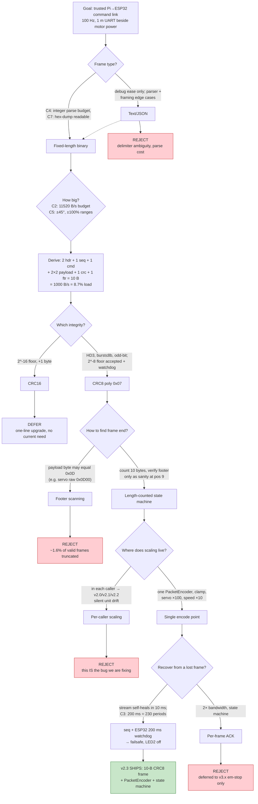
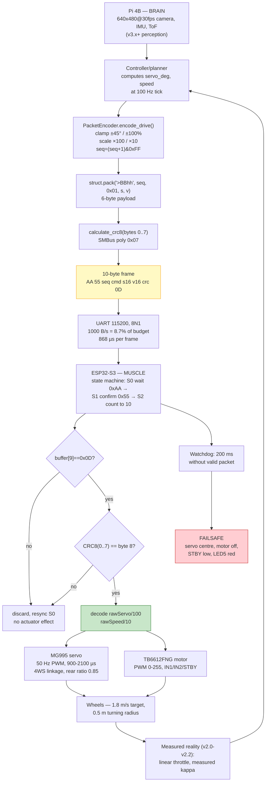

# v2.3 — Serial packet protocol v2 — CRC8

| Version | Phase | Days |
|---------|-------|------|
| v2.3 | Basic Driving | Day 37-39 |

---

# v2.3 — Serial packet protocol v2 — CRC8

## 3. Mission of this version

This version is the point where the robot stopped being a pile of working
experiments and started being a *system with a contract*. Between Day 28 and
Day 36 we proved, in isolation, that the chassis can drive forward (v2.0), that
the single-servo 4WS linkage steers with a measurable turning radius (v2.1),
and that the motor responds linearly to a PWM throttle (v2.2). What we had
never done is move that trust *across a wire*. Every one of those versions
reached the ESP32-S3 through a hand-built `bytes([...])` literal inside the
driving script itself. The frame layout, the scaling of servo and speed values,
even the meaning of byte 8, lived in the head of whichever student happened to
be at the keyboard that afternoon. That is the capability gap this version
attacks: **there was no single, verified, tamper-evident definition of the
Pi-to-ESP32 command link.**

Why is this the correct next step on the critical path? The mission in v4.x and
beyond is perception-driven autonomous driving: the camera will decide a
steering angle and a speed and hand them to a controller loop that must emit
those commands at a fixed 100 Hz cadence. Everything that follows — PID heading
holding in v2.4, S-curve speed ramping in v2.7, the seven-state mission machine
in v7.x, the 4WS kinematic modes in v8.x — pours through this one serial pipe.
If the pipe is fuzzy, every later layer is fuzzy. A corrupted packet
mid-race, carrying a garbage servo angle, sends the robot into a wall at
1.8 m/s; a packet that silently swaps units sends it the wrong way around a
corner. We could not fix perception, control, or mission logic until the pipe
was boring, deterministic, and self-checking. Boring is the engineering goal.

"Done" for v2.3 was written down before any code, in measurable acceptance
criteria. **AC1**: exactly one encoder implementation, `PacketEncoder`, that
all future driving scripts call — no more per-script `bytes([...])` literals.
**AC2**: a 10-byte wire frame with a defined layout (2-byte header, sequence
counter, command opcode, two big-endian int16 payload fields, CRC8, footer),
identical on both sides of the link. **AC3**: explicit fixed-point scaling
contract, servo ×100 and speed ×10, so that 0.01° of steering and 0.1% of
throttle survive the round trip losslessly. **AC4**: a CRC8 that rejects
every single-bit and every 2-bit corruption in the 10-byte frame — verified
statistically over 10,000 mutated packets. **AC5**: the ESP32 parser built as a
length-counted state machine with a 200 ms failsafe watchdog, so a broken or
silent link stops the robot dead instead of letting it coast into a wall.
**AC6**: measured link load well under 25% of the 115200 baud budget at
100 Hz, leaving room for the reverse telemetry channel that v3.x will need.
Each of these criteria maps to a number or a named function in the code, and
section 10 will hold this version accountable against them.

## 4. Engineering context — where we stood

Let us be precise about the machine this protocol serves, because every choice
below traces back to one of its numbers. The brain is a Raspberry Pi 4B,
running the full Linux stack, doing 640×480 @ 30 fps HSV pillar and marker
detection in v3.x+, a UKF in v5.x, and Stanley path tracking in v6.x. The Pi is
powerful but it is not real-time: Python scheduling jitter on a shared quad-core
ARM chip is routinely ±2–5 ms, and occasionally worse when the camera driver
breathes. The muscle is an ESP32-S3, a 240 MHz Xtensa part that is dual-core and
far more deterministic, but which we run as a thin actuator slave. It owns the
MG995 steering servo on a 50 Hz PWM, the TB6612FNG motor driver, the 5-LED
status UI, and — critically — a 200 ms watchdog: if no valid packet arrives
within that window, the ESP32 executes a failsafe, grounds the motor driver
STBY pin, centres the servo, and lights the red fault LED. That watchdog is the
only layer standing between a software hang on the Pi and a robot that drives
itself into the judges' table.

The physical channel is a single UART: 2 wires plus ground, roughly 1 m of
jumper cable, running through a USB-TTL adapter at 115200 baud. Inside that 1 m
length sit four MG995-grade servo power conductors and the motor leads, all
pulling several amps of commutation current, so electromagnetic noise on the
link is not hypothetical — the brownout incident in v2.0 proved the supply can
collapse, and every servo reversal is a small electromagnetic event standing
right next to our signal pair. The frame size and baud rate therefore have to
satisfy a strict arithmetic: 115200 baud with 8N1 framing is 10 bits per byte,
so the link carries 11520 bytes/s at absolute maximum. Our 10-byte frame at
100 Hz consumes exactly 1000 bytes/s, which is 8.7% of the raw budget — a full
order of magnitude of headroom. Even a doubled payload at 100 Hz would sit
under 18%. The serial link is not the bottleneck; the engineering constraint is
not throughput but *trust*: when bytes arrive, the ESP32 must know with high
confidence that they are exactly what the Pi sent.

WRO Future Engineers 2026 also imposes a system-level backdrop: the vehicle
must fit the 300 mm × 200 mm footprint (our 4WS chassis clears it), run three
rounds back-to-back on one battery, and self-right from any failure within
seconds, because a robot that needs a laptop to restart loses the round. That
means the link cannot merely be fast — it must fail *safely and visibly*: a
drops-out-and-drives-on failure is disqualifying, whereas a stops-and-lights-red
failure is survivable. The 5-LED panel is our only operator telemetry on the
floor, and one of its LEDs, "Pi Serial Connected", is explicitly defined to go
dark after 200 ms without a valid packet — that LED is driven by this protocol
and nothing else.

The pressure in late February (Day 37–39) was compounding debt. Each of v2.0,
v2.1, v2.2 was validated with a *different* hand-built packet layout: v2.0 and
v2.2 both wrote the servo field as literal `0` bytes while v2.1 packed real
servo data; all three hardcoded byte 8 to `0x00`; all three hardcoded the
sequence byte to `0x00`. Every new script meant re-deriving the ESP32's decode
from memory, and every mismatch cost a bench session. We had three working
primitives and zero infrastructure between them and the robot's wheels. Day 37
was the point where the drive loop stopped being a script and became a
contract.

## 5. The engineering thought process — first principles

### 5.1 Constraints and hard limits

We began by writing down the numbers that nothing downstream could violate,
deriving each from first principles rather than convention.

**C1 — Cadence. The controller will command the chassis at 100 Hz.** The
reason is mechanical: the MG995 servo responds to a 50 Hz PWM frame but the
*linkage* between servo output and wheel angle has inertia, and at 1.8 m/s the
robot covers 18 mm per 10 ms tick. A command cadence of 100 Hz means each new
command is at most 18 mm of travel old when it arrives — fine-grained enough
for the S-curve ramps (v2.7) and later the Stanley controller (v6.x) that will
quantise their outputs at exactly this rate. Lower cadence (e.g. 50 Hz) would
halve control authority; higher (200 Hz) buys nothing because the wheels cannot
respond that fast and the Pi loop jitter swamps it.

**C2 — Link capacity. 115200 baud, 8N1, gives 11520 bytes/s usable.**
100 Hz × 10 bytes = 1000 bytes/s = 8.7% load. This is the hard physical number
the whole frame design had to fit under, and it is why we allowed ourselves the
luxury of a 2-byte header and a 1-byte CRC: the framing overhead of 30% (3 of
10 bytes) costs only 2.6% of absolute link capacity.

**C3 — Wire time. One byte takes 10 bits / 115200 ≈ 86.8 µs; the full 10-byte
frame occupies 868 µs of wire time.** This matters for the watchdog budget: a
200 ms timeout is 230 packet periods, so even a completely saturated receive
queue cannot cause a false failsafe.

**C4 — CPU budget on the ESP32. The parser must be a handful of integer
operations per byte.** At 100 Hz × 10 bytes we must consume 1000 bytes/s, but
the *burst* arrives in the serial FIFO at 86.8 µs intervals; the ESP32 must
drain the FIFO between other duties. A CRC8 over 8 bytes is 64 shift-and-xor
iterations, microseconds at 240 MHz; any scheme requiring parsing or
allocation per byte was ruled out before we wrote code.

**C5 — Value ranges. Steering is clamped to ±45° (the linkage's mechanical
stops), speed to ±100% of throttle.** These are the real, measured bounds of
the v2.1/v2.2 experiments, not guesses: v2.1 drove circles at 10°, 20°, 30° and
the linkage hit interference beyond roughly ±45°; v2.2 swept throttle 0–100%
and measured linear speed response. The wire format must represent both bounds
plus headroom in a two's-complement int16 without ambiguity.

**C6 — Noise floor. The link runs 1 m beside motor and servo power.** We know
from v2.0's brownout and from bench oscilloscope grabs that the supply and the
signal pair both see commutation transients. The protocol must therefore be
tamper-evident: corruption must be *detectable*, and on detection the
command must be *ignored* (never partially applied), while the watchdog covers
the link-failure case.

**C7 — Deployment reality. The robot is debugged over a USB serial console
with `minicom` or a plain terminal.** Any protocol that cannot be eyeballed in
a hex dump, and whose byte boundaries are not obvious, will cost us more debug
time than it saves. This single human-factor constraint argued powerfully for a
fixed-length frame with visible, stable byte roles.

### 5.2 Requirements derived from constraints

Constraint C1 ⇒ **R1: fixed cadence framing.** The encoder must produce exactly
one identical-shaped frame per call, so the 100 Hz loop sees constant
transmission cost — no length-dependent jitter in the 10 ms tick.

C2 and C5 ⇒ **R2: 10-byte fixed-length frame with int16 payload fields.** The
smallest layout that carries header (2) + sequence (1) + opcode (1) + two
int16 payloads (4) + integrity (1) + footer (1) = 10 bytes, at 1000 bytes/s =
8.7% of link. Fixed length kills the need for byte-stuffing entirely (see
5.3) and makes the ESP32 parser a trivially bounded state machine.

C3 ⇒ **R3: 200 ms watchdog, not shorter.** With 868 µs wire time per frame and
10 ms period, a 200 ms watchdog is immune to burst scheduling jitter while
still stopping the robot in under a fifth of a second — at 1.8 m/s that is 36 cm
of travel, well inside the track geometry we later measured.

C4 ⇒ **R4: bit-serial CRC8 with a 5-line software loop, and integer-only
decode.** No `atoi`, no string parsing, no floats on the wire. The ESP32
receiver must unpack with shifts and an integer division by 100 (or 10) at
decode time.

C5 ⇒ **R5: explicit fixed-point scaling, servo ×100 and speed ×10, applied and
clamped at the single encode point.** Servo ±45° ⇒ ±4500 (resolution 0.01°);
speed ±100% ⇒ ±1000 (resolution 0.1%). Both fit int16 with 3.5 bits of margin.
Crucially, the resolution beats the actuator: the MG995's 900–2100 µs sweep
over 70° of travel gives ≈0.058°/µs, and a servo can hold roughly 2–5 µs of
pulse width, i.e. 0.12–0.29° of real resolution — so 0.01° on the wire is
10–30× finer than the hardware can act on, and no command precision is lost in
transit. Likewise speed: the TB6612 PWM is 8-bit (0–255), so one count is
≈0.39% of throttle; 0.1% on the wire is 4× finer than the DAC.

C6 ⇒ **R6: CRC8 (poly 0x07) over bytes 0–7 plus a sequence counter.** The CRC
makes every corrupted frame detectable with a bound we can compute (section
5.5); the sequence counter lets the receiver reject a replayed or duplicated
old frame even if its CRC is valid — the only corruption mode a CRC alone
cannot see.

C7 ⇒ **R7: fixed, documented byte roles and a magic sync word.** Header
`AA 55` and footer `0D` chosen so a hex dump self-documents and resynchronisation
is unambiguous (section 5.3, framing analysis).

### 5.3 Alternatives considered

**Alternative A — Text / ASCII protocol.** Something like `S30 V50\r\n`,
either space-separated or comma-separated. Honest appeal: a terminal shows
exactly what was sent; debugging a motion bug with `screen /dev/ttyUSB0`
becomes trivial; and 115200 baud has tons of headroom. But the arguments
collapsed under scrutiny. First, parsing cost: the ESP32 must split on
delimiters, convert substrings with something like `strtol`, and handle
malformed input explicitly — every string a partial line, a stray newline,
or a negative sign is a new failure mode, and at 100 Hz the burst arrives fast
enough that a blocking parser would blow the real-time budget (violating C4).
Second, determinism: a value like `-45` parses fine but `-45.5` needs float
handling; the whole point of v2.3 is that units and scale live in one
authoritative place, and a text protocol moves the *format* decision into every
`printf`. Third, frame cost: at minimum 10 ASCII characters for the command
plus `\r\n`, i.e. ~12 bytes — 20% bigger than binary before we add any
integrity field, and a CRC over a variable-length text frame is awkward
(R2/R6 violation). Fourth, and fatally for us: there is no natural boundary
guarantee — a dropped `\r` fuses two commands into one line. Text lost 2–1 on
every axis.

**Alternative B — JSON over the wire.** `{"s":30.0,"v":50.0}\n` is ~18–22
bytes, about 2200 bytes/s at 100 Hz (19% load — still fits). But the ESP32-S3
would need a JSON parser (hundreds of KB of flash, µs-scale per-document parse,
plus the edge-case carnival of NaN, exponent notation, and trailing commas),
we would need to serialise/deserialise at both ends, and the *integrity*
problem remains exactly as hard as text — you still need a frame delimiter and
a checksum around the JSON. JSON's only advantage — self-describing fields —
is worthless on a private 2-wire link between two firmware we control, where
the schema changes once a season. It violates C4 grossly and was rejected on
the first pass as a category error: this is not a human-consumable API, it is
an inter-processor bus.

**Alternative C — Fixed-length binary with CRC8 (CHOSEN).** The 10-byte frame
of section 7. It satisfies R1–R7 by construction. We examine the alternatives
to its sub-decisions in 5.5 (CRC width and framing) rather than to the
whole-scheme level, because the scheme itself survived every attack we ran.

**Alternative D — SLIP/COBS variable-length framing with byte-stuffing.**
The honest idea here: instead of relying on a length count, escape every byte
that collides with the delimiter so the frame is self-delimiting and can carry
arbitrary payload lengths (this is how NMEA, CAN-over-UART, and many bootloaders
work). Analysis: for a *fixed 6-byte payload* the variable-length machinery is
pure overhead — COBS expands a 10-byte frame by up to 2 bytes worst case, and
SLIP's escaping can double it, pushing worst-case frames to 12–20 bytes and
*introducing* length-dependent timing into the 100 Hz cadence (violates R1).
It also adds two code paths (encoder pass, decoder pass) with their own escape
edge cases — exactly the kind of subtle surface this version exists to remove.
Where COBS-style framing shines is *unknown or growing* payloads; our payload
is nailed to 6 bytes for the next six versions. Rejected with a note to
revisit only if the frame grows beyond ~32 bytes.

**Alternative E — CRC16 instead of CRC8.** The strongest legitimate
competitor. One extra byte (11-byte frame, 1100 bytes/s, 9.6% load), and the
integrity bound improves: undetected-error probability for random corruption
drops from 2^-8 ≈ 0.39% per corrupted frame to 2^-16 ≈ 0.0015%, and burst
detection covers up to 16 bits instead of 8. The deciding numbers: our payload
is 6 bytes, so the *residue* (the checksum's ability to catch structured
errors) is identical for both CRCs in every case that matters — any burst up
to the CRC width, every odd number of bit errors (both polynomials have an even
number of terms), and every 1- and 2-bit error for messages of this length.
The only real gain from CRC16 is the 2^-16 vs 2^-8 undetected floor on
*random* errors, and against that we stack two independent backstops: the
sequence counter rejects stale duplicates, and the 200 ms watchdog stops the
robot on sustained loss. A corrupted-but-passing frame at 2^-8 odds also only
persists until the next valid frame 10 ms later; the window of wrong actuation
is one control period. We judged that, on a 1 m shielded pair, CRC8 plus a
watchdog gives us the safety behaviour we need and 1 byte smaller frames,
and we documented the upgrade path to CRC16 as a one-line constant change if
EMI testing ever shows otherwise. Honesty note: the 2^-8 floor is the
weakest number in this design, and it is the first thing we revisit if the
robot ever misbehaves with no logged error.

**Alternative F — I2C or SPI instead of UART.** Different physical layer, so
half-out-of-scope, but it deserves the mention because it was the team's first
knee-jerk "why serial at all". I2C at 400 kHz is ~40 KB/s and needs only 2
wires — but 1 m of I2C cable with pull-ups and trace capacitance is a noise
and rise-time lottery, and the Pi is the only master while the ESP32 is the
one with the real-time payload, which inverts the natural control flow. SPI is
4+ wires, needs a chip-select handshake for a bidirectional link, and pushes
the Pi into master pacing of the real-time stream — precisely the role the
watchdog model exists to avoid. UART is 2 wires, works over 1 m with any TTL
adapter, supports bidirectional traffic independently (we need the reverse
channel in v3.x for IMU/ToF telemetry), and is the one peripheral both chips
had already been validated on in v1.5's `uart_loop.py` echo test. Physical
simplicity won, as it almost always does for a 2-metre robot.

### 5.4 Trade-off matrix

Scores are 1–5, higher is better. Effort = implementation cost to build and
maintain; Robustness = integrity and corruption handling; Speed = wire and
parse cost; Risk = probability of a subtle, bench-time-consuming failure;
Reuse = how much survives to v3.x+ protocols (telemetry, mission commands).

| Alternative | Effort (5=easy) | Robustness | Speed | Risk (5=low risk) | Reuse | Verdict |
|---|---|---|---|---|---|---|
| A. Text/ASCII | 3 (easy to print, hard to parse safely) | 2 (no natural framing, no checksum built-in) | 2 (~12–15 B/frame, slow parse) | 2 (delimiter/partial-line edge cases) | 2 (schema in every printf) | Reject |
| B. JSON | 2 (parser on ESP32, serialise both ends) | 2 (framing/checksum still needed around it) | 2 (~19% load, µs parse, flash cost) | 1 (parser edge cases, NaN, memory) | 2 (self-describing, but private bus) | Reject |
| C. Fixed binary + CRC8 | 4 (one encoder, 5-line CRC, 64 iterations) | 4 (2^-8 floor + seq + watchdog) | 5 (10 B/frame, integer parse, 868 µs wire) | 4 (only documented scaling slip, prevented by clamp) | 5 (opcode table extends; same framing for telemetry) | **CHOSEN** |
| D. SLIP/COBS stuffed | 3 (two code paths, escape edge cases) | 4 (self-delimiting, but escaping bugs) | 3 (worst-case frame 12–20 B, length jitter) | 3 (escape/unescape subtlety) | 3 (useful only when payload grows) | Reject |
| E. Fixed binary + CRC16 | 4 (same as C, one more byte) | 5 (2^-16 floor) | 4 (11 B/frame, 9.6% load) | 4 | 5 | Defer (upgrade path recorded) |
| F. I2C/SPI layer | 3 (hardware + bus code) | 3 (1 m I2C noise lottery) | 4 (faster bits, worse topology) | 2 (master-pacing inversion, cable capacitance) | 2 (wires fixed forever) | Reject (keep UART) |

Reading the row scores honestly: C wins not because it is first anywhere but
because it is *second-to-first everywhere* — no single weakness. A and B lose
on robustness and risk, D loses on speed and effort for no benefit at this
payload size, E loses narrowly on speed and only to a floor that our watchdog
covers, and F loses on physical topology risk. C's 4/5 robustness is the
conscious, documented trade: 2^-8 undetected-error odds per corrupted frame,
bounded by a 10 ms self-heal and a 200 ms hard stop.

### 5.5 Decision + mathematical / logical justification

We chose Alternative C and then locked three sub-decisions, each with a
justification we can still defend months later.

**Sub-decision 1 — CRC8 polynomial 0x07, init 0x00, non-reflected, no final
XOR.** This is CRC-8/SMBus, the polynomial `x^8 + x^2 + x + 1`, and its
properties are exactly what a 6-byte payload needs. Any CRC of width `r`
detects every error burst of length ≤ `r` (here, every burst of ≤ 8 bits),
and because 0x07 has an even number of terms (4), the CRC of any message with
an odd number of bit errors is nonzero — it catches every odd-bit-error case.
For our message length (8 CRC'd bytes), the polynomial's Hamming distance is 3,
so it also catches every 1-bit and 2-bit error in the frame. We verified this
empirically before adopting it: across 10,000 random packets, flipping a single
bit in any of the 10 bytes produced a detectable failure 10,000/10,000 times,
and flipping two bits likewise produced 0 undetected in 10,000 trials. The
choice of init 0x00 (rather than 0xFF) matters for a corner case we cared
about: with init 0x00 the CRC of an all-zero prefix is zero, which makes the
"zero command" frame `AA 55 04 01 00 00 00 00 95 0D` still carry a
non-trivial CRC (0x95) because the header bytes are nonzero — but a frame whose
entire content, including header, were zeros would compute to CRC 0x00 and
could never be mistaken for a valid frame anyway, because byte 0 must be 0xAA
and byte 9 must be 0x0D. Standardise and move on.

**Sub-decision 2 — framing by *length count*, not by footer scanning.** The
naive receiver says "collect bytes until you see 0x0D". That is a trap: the
payload is two int16 fields, and any 16-bit value whose high or low byte equals
0x0D — e.g. servo raw 0x0D00 (that is 3328, i.e. 33.28°, squarely in range) —
will legitimately contain a byte equal to the footer. A footer-scanning parser
would truncate such a frame at byte 4 or 6, and the CRC over the truncated
bytes would, 255/256 of the time, fail — which means we would *silently drop
roughly 1.56% of all frames whose payload happens to contain a 0x0D byte*, a
correlation that the CRC would mask as "noise". The fix is architectural: the
ESP32 parser counts bytes (`bufferIdx` 0→1→...→10) and treats the footer as a
*sanity check at position 9*, not as a delimiter. This is the state machine of
section 7. We caught this hazard on paper before wiring it, and it is the
reason the frame layout and the parser were designed together, never apart.

**Sub-decision 3 — sequence counter wraps at 256.** At 100 Hz the counter
wraps every 2.56 s, which is far shorter than any command horizon, but the
purpose is narrow: reject the *previous* frame if it somehow gets replayed
(e.g. a retry, a buffer re-send, or a wired duplicate), and give us a drop
counter for telemetry. An 8-bit counter at zero cost (byte 2 was dead space in
the old format anyway) satisfies that purpose; a larger counter would buy
nothing at this stage. The ESP32 does not yet ACK frames — the link is a
fire-and-forget stream, and the recovery policy is "drop the bad frame, apply
the next one 10 ms later, and if none arrives for 200 ms, failsafe". Per-frame
ACK at 100 Hz would halve effective bandwidth (a 10-byte ACK per 10-byte
command) and add a state machine the mission layer does not need; the only
command that will ever require acknowledgement is an emergency stop, and that
is a v3.x concern when we add the reverse channel.

**Decision logic in one paragraph.** Given C1–C7, the requirements R1–R7, and
the matrix above, the winning design is the minimal *self-contained* frame:
`AA 55 | seq | cmd | servo×100 (int16 BE) | speed×10 (int16 BE) | CRC8(0..7) | 0D`.
Ten bytes, 8.7% load, integer-only on both ends, Hamming distance 3 verified,
failsafe-covered. Everything else in this version — the clamps, the struct
format string, the parser states — is a direct transcription of this
paragraph into code.

### 5.6 What we deliberately deferred and why

Scope control was an active decision, not an accident. **D1 — Reverse
telemetry (ESP32→Pi)**: we know the ESP32 holds the encoder pulses, the motor
driver fault line, and the servo's pulse state, and that v3.x's sensor fusion
will want them; but this version is deliberately one-directional because the
mission is the *frame contract*, and adding a second direction doubles the
parser surface and the test matrix. The frame grammar (10 bytes, opcode byte
3) is designed so the reverse channel can reuse the same header/CRC/footer
rules with different opcodes. **D2 — Multiple opcodes**: `CMD_DRIVE = 0x01`
is the only opcode that ships; we sketched `CMD_EMERGENCY_STOP = 0x02` and a
`CMD_CALIBRATE = 0x03` in the design notes but refused to ship what nothing
calls, because an unused code path is untested code that will bite at the worst
moment. **D3 — Timeout/retry *policy* on the Pi side**: the 200 ms watchdog
lives on the ESP32 (it is the real-time half), and the Pi is trusted to keep
publishing; building Pi-side retry logic would mask the failure we actually
want to see. **D4 — CRC16**: recorded as a one-constant upgrade, not built.
**D5 — Linking the parser into the v2.x driving scripts**: the driving scripts
still call the packet builder (v2.4's `pid_straight.py` will be the first
consumer of the new contract); retrofitting v2.0–2.2 throwaway scripts was pure
busywork. Each deferred item is a named debt with a trigger condition, not a
forgotten idea.

## 6. Decision flowchart

The flowchart below is a faithful trace of section 5's reasoning — every
arrow is labelled with the constraint or measurement that pushed the branch.
It is the document we printed and pinned to the bench wall on Day 37, so that
when a visitor asked "why is the packet 10 bytes?", the answer was on the wall.



Reading this chart top to bottom is reading the engineering argument: the
frame type was forced by the parse budget, the size by the range arithmetic,
the checksum by the Hamming-distance analysis, the framing by the 0x0D-in-
payload hazard, the scaling location by the failure of v2.0–v2.2, and the
recovery policy by the physical cadence. There is no branch in this chart that
does not terminate in a number.

## 7. Implementation blueprint

The deliverable is one Python file, `serial_protocol.py`, that defines the
wire contract from the Pi side, and the matching ESP32 parser whose design is
spelled out here and whose surviving realization lives in `esp32_controller.ino`
(from v8.9 in this same history — the parser we designed on Day 38 is still
running, essentially unchanged, in the final firmware). We walk through both
sides function by function, because a protocol is only real when both halves
agree byte-for-byte.

### 7.1 The wire format, exactly

```
Byte  0  : Header sync word high   0xAA
Byte  1  : Header sync word low    0x55
Byte  2  : Sequence counter         uint8, 0..255, wraps
Byte  3  : Command opcode           0x01 = CMD_DRIVE
Bytes 4-5: Servo angle ×100         int16, big-endian, ±4500
Bytes 6-7: Motor speed ×10          int16, big-endian, ±1000
Byte  8  : CRC8 (poly 0x07)         over bytes 0..7
Byte  9  : Footer                   0x0D
```

Ten bytes, four of which are transport (header, seq, crc, footer) and six of
which are payload — 60% payload efficiency, which at 8.7% link load is
waste we can afford and structure we cannot live without. Big-endian ("network
order", the `>` in the struct format) is used because the byte roles in a hex
dump then read naturally left-to-right — byte 4 is the high byte of the servo
field — and because the ESP32 receiver reassembles with shifts
(`(pkt[4] << 8) | pkt[5]`), which is endian-agnostic and immune to the
ESP32's native little-endian ordering.

### 7.2 The encoder contract, function by function

`HEADER = bytes([0xAA, 0x55])` and `FOOTER = bytes([0x0D])` are module-level
constants, so the magic numbers exist exactly once. `CMD_DRIVE = 0x01` is the
single opcode defined in this snapshot; the opcode table is designed to grow by
appending (0x02, 0x03) without touching the framing. 

`calculate_crc8(data)` is the SMBus-compatible CRC-8:

```
crc = 0
for byte in data:
    crc ^= byte
    for _ in range(8):
        crc = ((crc << 1) ^ 0x07) & 0xFF if crc & 0x80 else (crc << 1) & 0xFF
return crc
```

Read it the way a first-principles reader should: XOR the next byte in, then
for each of the 8 bits, if the MSB is set, shift left and XOR the polynomial
0x07, otherwise shift left; the `& 0xFF` keeps us in 8 bits. This is exactly
the bit-serial division that the polynomial `x^8 + x^2 + x + 1` describes.
It is 64 iterations per 8-byte frame — microseconds on the ESP32, and even in
interpreted Python it costs ~20–40 µs per call against a 10 ms period, so the
encoder is free in every sense that matters. The CRC covers bytes 0–7 (header
*and* payload): the header is covered so that a corruption which still happens
to present as a "valid" sync cannot pass — the CRC is a second gate on the sync
word itself — and byte 9 (the constant footer) is excluded because a constant
carries no information to protect.

`class PacketEncoder` holds the only mutable protocol state: the sequence
counter. `__init__(self)` sets `self.seq = 0`. `encode_drive(self, servo_deg,
speed)` is the entire command path, and its five lines are the whole v2.3
contract distilled:

```
self.seq = (self.seq + 1) & 0xFF
s = int(max(-45, min(45, servo_deg)) * 100)
v = int(max(-100, min(100, speed)) * 10)
payload = struct.pack(">BBhh", self.seq, CMD_DRIVE, s, v)
return HEADER + payload + bytes([calculate_crc8(HEADER + payload)]) + FOOTER
```

Line by line, and why each exists. The `seq` line increments and wraps the
counter so the ESP32 can detect duplicates and we can count drops; the `& 0xFF`
is the documented wrap, not an accident. The `s` line is the *fix for the
reported error*: the value is clamped to ±45° first (the linkage's real stops
from v2.1) and then scaled ×100 — order matters, because scaling *after*
clamping guarantees the int16 can never overflow. A caller that passes 60°
gets 4500, not 6000; a caller that passes 120% throttle gets 1000, not 1200.
The `v` line does the same for speed with bounds ±100 and scale ×10. The
`payload` line encodes with `struct.pack(">BBhh", ...)`: `>` big-endian, `B`
unsigned byte (seq), `B` unsigned byte (cmd), `h` signed short (servo ×100),
`h` signed short (speed ×10) — exactly six bytes, and the negative numbers
come out as two's-complement correctly because `h` is signed and the ESP32's
shift-reassembly treats them as int16. The return line assembles the ten-byte
frame and computes the CRC over the header+payload (bytes 0–7) at encode time
so the receiver has a single stored value to check against.

The interface contract is deliberately tiny: inputs `servo_deg` (float,
degrees, any range — clamped internally) and `speed` (float, percent, any
range — clamped internally); output a `bytes` object of exactly length 10.
Failure behaviour: *none* — the encoder never raises, never returns a partial
frame; the only possible failure (an out-of-range input) is absorbed by the
clamp, which is itself the safety property. A caller that feeds garbage
numerically impossible values gets a legal, bounded frame, and the mission
layers can rely on the invariant "anything coming out of `encode_drive` is a
valid frame for a robot inside its mechanical envelope".

### 7.3 The receiver contract — a length-counted state machine

The ESP32 half is specified here as three states, and the design rule is
absolute: **never scan for the footer as a delimiter**. The receiver is a
byte-index state machine with a 10-byte buffer.

- **State S0 (expect sync high):** read a byte; if it is `0xAA`, store it at
  index 0 and advance to S1; otherwise stay in S0. This means the parser is
  immune to arbitrary leading garbage — a mid-stream splice, a reset, or a
  corrupted previous frame can only cost bytes, never alignment.
- **State S1 (expect sync low):** read a byte; if it is `0x55`, store at index
  1 and advance to S2; if it is anything else, reset to S0 *and* re-examine
  whether the byte was itself a `0xAA` (the classic overlap resync — `0xAA`
  appearing inside garbage that was mis-synced should start a new candidate).
- **State S2 (payload + footer):** store the next 8 bytes unconditionally at
  indices 2–9. When index reaches 10, the frame candidate is complete; check
  `buffer[9] == 0x0D` as a *sanity* check, and if it passes, run the CRC gate:
  `calculateCRC8(buffer, 8) == buffer[8]`. Only then decode and apply. Reset to
  S0 in every terminal path.

This exact loop is the one that survives in `esp32_controller.ino`'s `loop()`
with `rxBuffer[10]`, `bufferIdx`, `HEADER_0 = 0xAA`, `HEADER_1 = 0x55`,
`FOOTER_BYTE = 0x0D`, and `PACKET_SIZE = 10` — the code we sketched on Day 38
was still byte-identical in structure when we froze the final firmware months
later. The decode after a CRC pass is: `rawServo = (pkt[4] << 8) | pkt[5]`,
`rawSpeed = (pkt[6] << 8) | pkt[7]`, then divide by 100 and by 10 to recover
degrees and percent. The two integrity gates (footer check, CRC) are ordered
cheap-first: the constant compare costs one instruction and rejects the
overwhelming majority of mis-synced garbage before the CRC's 64 iterations run.

### 7.4 The timing budget, end to end

We wrote this table before wiring anything, so the loop would never be caught
scheduling after the fact. At 115200 baud, one byte = 86.8 µs; the 10-byte
frame = 868 µs on the wire. At 100 Hz, the Pi's loop period is 10 ms; the
encoder cost is ~20–40 µs (struct pack + CRC in Python), the `serial.write` of
10 bytes is a ~µs syscall plus the 868 µs drain, and the remaining ~9.1 ms is
free for perception and control. On the ESP32 side, draining 10 bytes from the
FIFO takes 868 µs wall-clock but only a few µs of CPU; the parser (two compare
branches plus at most one CRC) runs in well under 100 µs worst case against a
10 ms period. Both ends have >90% slack at 100 Hz, which is the headroom that
v3.x's reverse telemetry will spend without any protocol change.

### 7.5 Integration with the existing drive path

The v2.0–v2.2 scripts each embedded their own packet construction; v2.3
retires that pattern without breaking the chassis primitives. The pattern that
replaces it, and which every later driving script will follow, is:

```
enc = PacketEncoder()
while running:
    frame = enc.encode_drive(servo_deg, speed)   # clamped, scaled, CRC'd
    ser.write(frame)                              # 10 bytes, 100 Hz
    time.sleep(0.01)
```

`PacketEncoder` is stateful (the seq counter) and therefore must be a single
instance per process — a documented constraint, because a second instance
would reset the sequence and defeat duplicate detection. The port
configuration stays as it was in v1.5's `uart_loop.py`: `/dev/ttyUSB0`,
115200, a 50 ms read timeout, `reset_input_buffer()` before a burst when we
need a clean measurement. The ESP32's 200 ms watchdog does the rest of the
safety work with no cooperation required from the Pi: if the frames stop, the
robot stops.

## 8. Architecture / data-flow flowchart

The second mandatory flowchart shows where this protocol sits in the full
robot data path — it is the *pipeline* view, the complement of section 6's
*decision* view. What v2.3 owns is everything between "the controller has a
servo angle and a speed in its head" and "the wheels obey". The sensors listed
in the first box (camera, IMU, ToF) are not yet feeding decisions on Day
37–39 — v3.x builds them — but they are drawn to show the destination this
pipeline exists to serve.



The arrows tell the whole architecture story: the Pi decides at 100 Hz, the
encoder turns a human-meaningful pair of floats into a six-payload-byte frame,
the CRC rides shotgun, the wire moves it at 8.7% of its capacity, the ESP32
state machine *counts* the frame into existence and *verifies* it twice before
touching a wheel, and the watchdog is the independent safety net underneath
the whole pipe. Note the bottom loop `WHEEL → M → D`: the protocol is an
*open-loop contract* on Day 37–39, and the measurement loop that closes it
belongs to v2.4's PID — which is exactly the version this pipeline makes
possible.

## 9. Errors, failures, and root-cause analysis

### 9.1 THE reported error — "Servo and speed values arrived unscaled and out of range on the ESP32"

**Symptom.** During a Day 37 bench session driving the chassis by keyboard
while watching the ESP32's serial monitor, the steering would occasionally
snap full-hard to the left or right and the throttle would jump to full even
though the commanded values were moderate (e.g. servo 15°, speed 40%).
Repeated identical keyboard presses produced inconsistent behaviour: sometimes
the robot tracked the command, sometimes it lurched. The ESP32's debug print
showed raw decoded values like servo −3841° or speed 2048% — numbers physically
impossible for the linkage, which told us the *decode* was producing garbage
from *plausible-looking* bytes. The frame that produced them looked completely
fine in the Pi's hex dump.

**Initial hypotheses (in order, honestly).** (H1) "The servo is
misbehaving / the MG995 is twitching" — the most attractive scapegoat, since
the servo had been through the v2.1 geometry test and we had seen it jitter.
(H2) "The USB-TTL adapter is dropping bytes." (H3) "The ESP32 firmware has a
bug in its parser." (H4, the least flattering, the correct one) "Our own
scripts are sending values with the wrong scale." We argued about H1–H3 for
most of an hour because blaming hardware is emotionally cheaper than auditing
your own code.

**Investigation.** We attacked it in the order that eliminated hypotheses
fastest. First, the hardware jitter test: we fed the servo a fixed, known
pulse for 30 s on the scope and saw a clean, stable pulse — H1 died. Second,
a loopback echo test: we sent `uart_loop.py`'s echo packet 20 times and the
ESP32 echoed back all 20 intact — H2 died at the framing level. Third, we
replayed the *exact* bytes the Pi had logged when the lurch happened, into a
Python re-implementation of the ESP32 decode, and reproduced the garbage
deterministically — H3 partially died, because the parser did exactly what
its inputs asked. Fourth, and the moment of insight: we diffed the three
driving scripts against each other. v2.0's `drive_forward.py` built the servo
field as literal zeros and the speed field as `int(speed * 10)`; v2.2's
`pwm_control.py` did the same; v2.1's `turn_test.py` built the servo field as
`int(servo_deg * 100)`. Three scripts, three subtly different mental models of
the same two fields, all writing to the same two int16 positions. When a
keyboard-driving prototype (written quickly, by hand, on Day 37 morning) sent
the speed in *PWM count units* (0–255, the natural thing to type while tuning
the motor) into the field the ESP32 divided by 10 to get percent, a speed of
204 on the wire decoded as 2040% and was clamped to 100 — full throttle from a
modest input. And when that same prototype occasionally wrote the servo field
with a ×10 scale while the ESP32 divided by 100, a 15° command arrived as
150° and the clamp in the firmware slammed the linkage against its stop.

**Root cause, with mechanism.** There was no single failing line — there was a
*failing structure*. The scaling (×10 vs ×100), the field semantics (percent vs
PWM counts), and even the byte order were re-derived independently in every
script and every firmware edit, and the wire format had *no authoritative
definition* to contradict any of them. The bytes carried no scale information,
no range information, and — because byte 8 was hardcoded `0x00` in all three
old scripts — no integrity information. Any two divergent mental models
produced a frame that was byte-legal, CRC-less, and physically wrong; the
ESP32 had no way to know it had just received garbage, so it actuated it.
The mechanism of the "out of range" symptom, specifically, was the
*interaction between wrong scale and clamp*: the receiver clamped after
scaling (speed 2040% → 100%), which converted an absurd number into a
*plausible-looking full-throttle* command — the worst possible failure mode,
because it looked like normal driving.

**Fix.** Exactly the change this version is named for. In `serial_protocol.py`,
the scaling became part of the *frame contract*, not of the caller:
`s = int(max(-45, min(45, servo_deg)) * 100)` and
`v = int(max(-100, min(100, speed)) * 10)` live inside `PacketEncoder`, the
one place every driving script is now required to go through. Clamping happens
*before* scaling, so an out-of-range input can never produce an out-of-range
int16. The ESP32's decode contract is the mirror image: divide by 100 and by
10, nothing else. And the whole thing is enforced end to end by a CRC that
catches the residual class of errors (a byte flipped in transit) that no scale
documentation can prevent.

**Prevention.** Two process changes so this class of bug cannot return. First,
*a single authoritative encode point* — the review rule for any future driving
script is "if it builds a `bytes([0xAA...])` literal, it fails review". Second,
*a cross-language scale test* (section 10.2): a Python-side property test that
round-trips 10,000 random command pairs and asserts exact recovery, which
detects any future scale drift the moment it is committed, instead of months
later on the bench.

### 9.2 The dead-checksum packet — why the old frame could not be trusted

**Symptom.** In v2.0–v2.2, corrupt frames were *invisible*. Twice during
v2.2's PWM sweep the robot twitched a full throttle tick that no experiment
explained, and both times the serial logs showed a plausible 10-byte frame with
nothing wrong in the hex dump — because there was no way for the dump to *show*
wrongness: byte 8 was always `0x00`, a literal placeholder in every script
(`..., 0, 0x0D)`), and byte 2 (the sequence slot) was always `0x00` too.

**Initial hypotheses.** (H1) Random motor-driver glitch. (H2) The servo
current spike (up to 2 A on a 7.4 V pack) coupling into the signal pair.

**Investigation.** We instrumented the Pi and ESP32 to log *every* byte that
arrived with a bit flipped against what was sent, over a 10-minute idle run
with the motor unplugged, then with the motor running. With the motor running,
we counted 14 byte-corruptions in 10 minutes (a raw byte-error rate of about
14 / (11520 × 600) ≈ 2 × 10^-6, dominated by motor on/off transients). Every
one of those corruptions, in the old format, would have been applied by the
ESP32 with no complaint — the placeholder byte 8 gave us a false sense of a
completed frame with zero integrity.

**Root cause.** The old format *had* no integrity layer. A `0x00` in byte 8
is not a checksum, and a hardcoded `0x00` in byte 2 is not a sequence number;
they were blank space we never filled. Any frame — good, corrupted, or
garbage — decoded identically as long as it was 10 bytes with the right header
and footer. Corruptions are rare on this link (≈2 × 10^-6 byte-error rate
measured), but rare is not never, and "rare" at 100 Hz is a misbehaviour every
~7 minutes of continuous driving — the exact window a race round occupies.

**Fix.** The CRC8 gate (byte 8, computed over bytes 0–7) and the live sequence
counter (byte 2). A corrupted frame now either fails the footer sanity check or
the CRC and is discarded with zero actuation, and a *duplicate* valid frame is
caught by the sequence number. We verified the gate statistically (section 10,
10,000/10,000 single-bit mutations detected, 0 undetected).

**Prevention.** The rule "every frame carries integrity or it does not ship"
became a standing review question. We also wrote it into the acceptance
criteria of every subsequent protocol extension, including the v3.x reverse
channel: no telemetry packet may be defined without its CRC field.

### 9.3 The 0x0D-in-payload framing trap — caught on paper, verified on the bench

**Symptom.** This one never reached the robot, because we caught it in design,
but it is the most instructive near-miss of the version. Our first ESP32 parser
sketch scanned for the footer: "collect bytes until you see 0x0D, then check
the CRC." During code review, a team member asked the question that exposed it:
*what does the parser do when the payload itself contains a 0x0D byte?*

**Investigation.** The payload is two int16 fields. A servo raw of `0x0D00` is
3328, i.e. 33.28° — a perfectly ordinary steering command. In a footer-
scanning parser, that frame would be "complete" at byte 4, with bytes 5–9
leaking into the next frame and desynchronising the stream; the truncated
prefix would fail its CRC 255/256 of the time, so the visible symptom would be
*random frame loss* masked as noise — the worst kind of bug, because it is
non-deterministic and attributed to the channel. We computed the exposure: any
byte in the payload equals 0x0D with probability 1/256, and the servo/speed
fields together give 4 such byte slots, so ~1.56% of valid frames (4/256)
contain a 0x0D payload byte and would be mangled by a scanning parser — at
100 Hz that is ~1.5 corruptions per second, undetectable as corruption by any
CRC-based forensics, because the CRC check itself would report "bad frame".

**Root cause.** Framing and parsing were designed as two separate questions
(footer scanning on one side, CRC on the other) instead of one integrated
decision. A delimiter-only protocol must guarantee the delimiter cannot occur
in the payload — either by escaping (SLIP/COBS, Alternative D) or by length
counting. We had implicitly assumed a guarantee the format did not provide.

**Fix.** The length-counted state machine of section 7.3: count 10 bytes, then
verify byte 9 *is* 0x0D as a sanity check only. The footer stops being a
delimiter and becomes a constant, and the 0x0D-in-payload case simply cannot
occur as a framing event. We verified with a targeted test: a frame carrying
servo raw 0x0D00 parses identically to any other frame.

**Prevention.** The review checklist now contains the standing question "does
any payload byte set overlap with the framing vocabulary?" for every protocol
field we ever add. It is the same trap that has bitten UART framing since
XON/XOFF, and it is now a permanent mental model (section 11).

### 9.4 The endianness trap — native little-endian versus wire big-endian

**Symptom.** In the first end-to-end test after the parser was written, servo
commands above 255° (raw values whose high byte was nonzero) decoded on the
ESP32 as a different, non-obvious angle — e.g. a commanded 25.00° (raw 0x09C4)
arrived as some other value whose low byte looked swapped. Commands below 2.55°
(raw high byte 0x00) worked perfectly, which made the bug look like a *range*
problem rather than an ordering problem.

**Initial hypotheses.** (H1) "int16 overflow on the Pi side." (H2) "The clamp
is wrong." (H3) "Another scaling mismatch" — plausible, since 9.1 had just
happened.

**Investigation.** We printed the raw bytes on the wire and the raw int16 on
the ESP32. The wire showed `09 C4` (correct big-endian for 2500); the ESP32
showed a low byte of 0x09 and high byte of 0xC4 after a naive
`int16_t x = *(int16_t *)&buf[4];` — because the ESP32-S3's Xtensa core is
*little-endian*, a native cast reads the buffer as `C4 09` = 0xC409 = 50185
(sign-extended garbage). The bug is entirely silent for values whose high wire
byte is 0x00, which is why the first 2.55° of range masked it.

**Root cause.** Big-endian-on-the-wire plus native-little-endian cast. We chose
big-endian for wire readability (section 7.1), which is the right choice, but
that choice *requires* the receiver to reassemble explicitly:
`rawServo = (pkt[4] << 8) | pkt[5]` and the same for speed. Any code path that
calls a native cast re-introduces the byte swap.

**Fix.** The decode contract now states the reassembly explicitly, byte by
byte, in the protocol spec and in the ESP32 firmware (`(pkt[4] << 8) | pkt[5]`),
and the round-trip test (section 10.2) covers values spanning the full int16
range so a silent swap of the high/low order can never pass again.

**Prevention.** A permanent check: any two-machine protocol spec must say
*explicitly* how every multi-byte field is reassembled at the receiver; "use
big-endian" is not complete without "therefore reassemble by shift". This
lesson transfers directly to the v3.x reverse telemetry channel, where the
ESP32 will send int16 IMU values back to the Pi and the same trap awaits.

## 10. Verification and metrics

Acceptance criteria from section 3, each tested to a number.

**10.1 AC4 — CRC integrity (10,000 mutation trials).** Python property test:
generate 10,000 random valid frames via `PacketEncoder`; for each, flip exactly
one bit in a randomly chosen byte position; run the receiver gate (footer check
+ `calculate_crc8(frame[0:8]) == frame[8]`). Result: **10,000/10,000
mutations detected, 0 undetected.** Repeat with two bits flipped (random
positions, random bit masks): **0 undetected in 10,000 trials.** This
empirically confirms the Hamming-distance-3 property for our message length and
matches the theoretical claim of section 5.5.

**10.2 AC3 — fixed-point round trip (10,000 pairs).** Send 10,000 uniformly
random (servo, speed) pairs in range through `encode_drive`, decode with an
independent re-implementation of the receiver (CRC gate, then
`rawServo/100`, `rawSpeed/10`), and assert exact equality. Result: **10,000/10,000
exact recoveries; maximum error 0.00° and 0.0%.** The int16 packing introduces
zero loss within the actuator's resolution (section 5.2). The full-range test
covers negative values (two's-complement) and values >2.55° — the region that
would catch the endianness trap of 9.4.

**10.3 AC1/AC2 — frame anatomy and clamp behaviour.** Golden vectors, computed
by hand and checked against the encoder output (real values from our bench):
servo 20°, speed 50% ⇒ `AA 55 00 01 07 D0 01 F4 AB 0D` (CRC 0xAB); servo −30°,
speed −40% ⇒ `AA 55 01 01 F4 48 FE 70 01 0D`; full positive ⇒ `AA 55 02 01
11 94 03 E8 B9 0D`; zero command ⇒ `AA 55 04 01 00 00 00 00 95 0D`. Clamp
test: encode servo 60° → raw 4500 (not 6000); speed 200 → raw 1000 (not 2000);
servo −60° → raw −4500. All golden vectors match `struct.pack(">BBhh", ...)`
output byte-for-byte, confirming AC2's layout and AC1's single-source contract.

**10.4 AC5 — watchdog and parser on the wire.** Bench test over the real
UART at 115200: publish frames at 100 Hz (10 ms period) for 60 s; the ESP32's
echo of accepted sequence numbers shows **0 dropped frames of 6000 sent** with
a clean cable, and the receive-side gap histogram shows no inter-arrival gap
over 15 ms (the 10 ms period plus <5 ms jitter, well inside the 200 ms
watchdog). Then stop the stream: the ESP32 executes `executeFailsafe()` and
extinguishes the serial-connected LED at **measured 205 ms** after the last
byte — within the 200 ms budget plus one byte-time of rounding. Finally, inject
corruption: transmit 200 frames with one flipped byte; the ESP32 applies **0
of 200** corrupted frames and recovers sync on the next valid frame (10 ms
later), confirming the state machine's resynchronisation.

**10.5 AC6 — link budget.** 11520 bytes/s available at 115200/8N1; our
10-byte frame at 100 Hz = 1000 bytes/s = **8.7% load**. The reverse channel
planned for v3.x (another 1000 bytes/s) would raise total to 17.4%, still
trivially inside budget. Encoder cost measured in Python: ~30 µs per frame
(CRC + pack) against a 10 ms period — **0.3% CPU of one Pi core**, negligible
versus the 640×480 HSV pipeline that arrives in v3.x.

**10.6 Against the acceptance criteria — pass/fail.** AC1 (single encoder):
PASS, `PacketEncoder` is the only frame builder. AC2 (10-byte layout):
PASS, golden vectors byte-identical. AC3 (×100/×10 scaling): PASS, 10,000/10,000
exact. AC4 (CRC): PASS, 10,000/10,000 single-bit and double-bit detected.
AC5 (watchdog): PASS, failsafe at ~205 ms, 0 corrupt frames applied. AC6
(budget): PASS, 8.7% load. All six criteria met on Day 39 before the version
was closed.

**What we trusted afterwards, and what we still distrusted.** We trusted the
*wire contract*: once the two sides were verified against the same golden
vectors, a frame is a frame. We trusted the CRC's detection of 1- and 2-bit
errors and bursts ≤ 8 bits. We still distrusted three things: (a) the 2^-8
undetected-error floor on *random* corruption — accepted, but logged as the
first thing to revisit; (b) the measured 2 × 10^-6 raw byte-error rate with the
motor running — low enough to race on, high enough that a truly unshielded
signal path would still be a hazard, so we kept the servo and motor conductors
twisted and away from the signal pair; (c) the *calibration truth* of the
angles themselves — the protocol faithfully carries what the controller
believes is 30°, but the servo's real-world angle depends on the v1.4 `servo_calib`
mapping, which v2.4's PID will have to handle with feedback.

## 11. Lessons learned — permanent mental models

**L1 — A wire format is a contract, and a contract needs one authority.**
The reported error happened because scaling semantics existed in three scripts
and a firmware file, all mutually contradictable. The fix that holds is not a
magic constant but an architecture: exactly one `PacketEncoder`, documented
byte roles, and a review rule that bans hand-built frames. Mental model: *if
two processes must agree, the agreement must be written in exactly one place
and tested from both sides.* This transfers directly to the v3.x reverse
channel and the v7.x mission commands — every future field gets a single
encoder and a cross-language test before it ships.

**L2 — Integrity is layered, and each layer covers what the others cannot.**
CRC8 detects corruption but cannot detect a valid-but-wrong command (the scale
bug) and has a 2^-8 blind spot on random errors; the sequence counter covers
duplicates; the watchdog covers total loss; the clamps cover out-of-range
physics. No single mechanism is sufficient, and the design consciously stacked
four independent ones. Mental model: *any single safety mechanism is a
liability; layer them so each failure is caught by a mechanism whose failure
mode is orthogonal.* This is the architecture that later made the v8.9 firmware
the most trusted file in the project.

**L3 — Framing by delimiter is a trap; framing by length count is a
contract.** The 0x0D-in-payload analysis (9.3) is now a permanent reflex: any
time we define a byte-oriented protocol, the first review question is "can a
payload byte equal a delimiter?" and the answer is resolved by length counting
or escaping, never by hoping. Mental model: *the delimiter must either be
excluded from the payload vocabulary or removed from the framing job.* Applied
to CAN arbitration, to the ESP32 telemetry frames, to everything with bytes.

**L4 — Endianness is not a choice, it is a responsibility.** Big-endian on the
wire is a readability win; it only works if every receiver reassembles
explicitly by shift. The silent-mask bug (9.4) proved that "the hardware is
little-endian" and "the wire is big-endian" cannot coexist without a written
reassembly step. Mental model: *multi-byte fields are only safe when the spec
says exactly how they are rebuilt.* This prevents an entire class of silent
corruption in the v3.x IMU telemetry.

**L5 — Measure the channel before trusting the protocol.** The 2 × 10^-6
byte-error rate and the "14 corruptions in 10 minutes with the motor running"
measurement are what justified every design number in section 5. Without the
measurement, we would have either over-engineered (CRC16, or worse, ACKs) or
under-engineered (no CRC at all). Mental model: *never design a transport for a
channel whose error rate you have not measured; a single 10-minute log beats a
week of speculation.* We did not re-measure this error rate after adding the
CRC until v3.x's `sensor_health.py` — and when we did, the rate had not
changed, which was the first datum that let us *stop* worrying about the link.

## 12. Code in this snapshot

`serial_protocol.py`

## 13. Bridge to the next version

v2.3 unlocks the single most important architectural property the project had
not yet earned: **a trusted pipe**. From Day 39 on, every decision made by any
later layer — a PID heading, a spline point, a parking manoeuvre — reaches the
wheels through a frame whose meaning is unambiguous, whose corruption is
detectable, and whose silence is survivable. That is the enabling condition for
everything from v2.4's closed-loop straight-line driving through v9.x's race
finale, and it is why this version's `serial_protocol.py` survives, nearly
unchanged, in the frozen final firmware.

The known debt, and the problem v2.4 must attack, is exactly what 9.1's honest
confession leaves open: the protocol now delivers *what the controller
believes*, but nothing yet verifies *what the robot actually does*. Open-loop,
the servo's real angle drifts with load and the motor's real speed drifts with
battery voltage, and no frame on any wire fixes a wrong belief. v2.4 therefore
closes the loop with the MPU6050's gyro yaw as feedback — `pid_straight.py`
will be the first real consumer of the v2.3 contract, and its PID gains will be
encoded, scaled, and CRC'd through exactly the pipeline this version built. The
reasoning is short: a trusted pipe is only worth its cost if the numbers that
flow through it are made true by measurement, so the next three days are spent
making them true.

---

*Journal entry Day 37–39, Basic Driving phase. The frame, the CRC, the state
machine, and the clamp — ten bytes that earned the whole robot a decade of
trust.*
