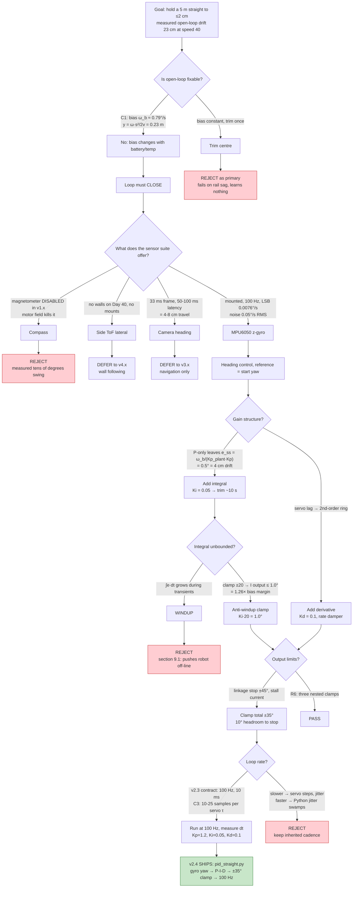
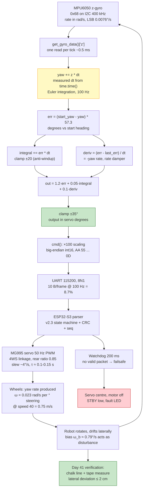

# v2.4 — PID straight-line driving

| Version | Phase | Days |
|---------|-------|------|
| v2.4 | Basic Driving | Day 40-42 |

---

# v2.4 — Closed-loop heading: the robot that finally listens to itself

## 3. Mission of this version

Every version before this one trusted the robot to do what we asked and was
rewarded with drift. v2.0 proved the chassis moves forward at a speed that
tracks throttle; v2.1 proved the single MG995 servo drives a measurable turning
circle through the 4WS linkage; v2.2 swept the throttle curve; v2.3 gave us a
crypto-strength wire contract so the Pi's commands arrive at the ESP32-S3
unscaled, un-corrupted, and failsafe-covered. But on Day 39, at the end of
v2.3, the robot still did something embarrassing: drive a 5 m chalk line on the
gym floor and walk off the end of it by 20 cm or more, every time, no matter
how carefully we trimmed the servo centre. We had a trusted pipe carrying
untrusted belief. This version attacks exactly that gap: **the robot had no
sensor telling it whether it was actually going straight, and therefore no way
to correct itself when it was not.**

Why is this the correct next step? The WRO 2026 arena is built from long
straight lane sections that must be travelled at full pace, and every later
layer — v3.x pillar avoidance, v5.x UKF localisation, v6.x Stanley tracking,
v7.x mission control — assumes the vehicle can hold a commanded heading to
within a degree. If we cannot close the loop on the simplest command
("go straight at 0°"), no perception on top survives a robot that is pointed
4° sideways while believing it is straight. Closed-loop control is the
load-bearing wall under everything else, and v2.4 is the first brick.

What "done" looks like was written on the whiteboard on Day 40 morning, before
a line of new code, as six acceptance criteria. **AC1 — lateral accuracy:**
peak lateral deviation over a 5 m straight at speed 40 (measured ≈0.75 m/s in
v2.2) must be ≤ 2 cm, versus the 20 cm+ open-loop baseline. **AC2 —
stability:** no sustained limit cycle; steering amplitude must stay ≤ 1° in
steady state. **AC3 — anti-windup:** after a deliberately induced long error
(60° of yaw held for 2 s), recovery to straight overshoots by < 3°. **AC4 —
heading bound:** estimated heading never exceeds ±5° during the run. **AC5 —
cadence:** the loop sustains a mean ≥ 90 Hz over 30 s with no inter-command
gap > 100 ms (training ourselves to the v3.x reality where perception steals
CPU). **AC6 — contract compliance:** the command path produces the v2.3 frame
byte-for-byte, so the CRC gate and the ESP32's 200 ms watchdog keep working.
Each criterion is a number; section 10 holds this version accountable.
## 4. Engineering context — where we stood

Recap the machine as of Day 39. The brain is a Raspberry Pi 4B running full
Linux; the muscle is an ESP32-S3 acting as a thin actuator slave with a 200 ms
watchdog that grounds the motor driver, centres the servo, and lights the fault
LED if no valid packet arrives within the window. Between them runs the v2.3
contract: 115200 baud, 8N1, 11520 bytes/s budget, a 10-byte frame
(`AA 55 | seq | 0x01 | servo×100 (int16 BE) | speed×10 (int16 BE) | CRC8 | 0D`)
sent at 100 Hz, which is 8.7% of the link. The steering is a single MG995
servo driving all four wheels through a mechanical linkage; the rear axle
follows at 0.85× the front angle (the "rear ratio 0.85" of our design log), a
geometry decision made in v1.x for turning radius, not for straightness. The
motor is a TB6612FNG driver with an 8-bit PWM lane, 0–255 counts, giving a
linear-ish speed response measured in v2.2 from 0 to 100% throttle. The one
sensor we have on the Pi's I2C bus that can say anything about *rotation* is
the MPU6050 IMU, at address 0x68, with its magnetometer disabled (we disabled
it in v1.x because the motor and servo currents destroyed its calibration —
more on that in section 5.3).

The system constraints that shaped every decision here, in the order we felt
them. **The 100 Hz cadence is already a contract.** v2.3 fixed the frame rate;
the ESP32 parser and watchdog assume a 10 ms stream; every later controller
(the v2.7 S-curve ramps, the v6.x Stanley) will quantise at this rate. v2.4
does not get to choose its loop rate — it gets to *explain* why the inherited
rate is correct, then work inside it. **The Pi is not real-time.** Python on a
shared quad-core ARM schedules with ±2–5 ms jitter, worse when a driver
breathes. Any controller that assumes a fixed 10 ms tick is building on sand;
this version must measure `dt` from the clock, not assume it. **The steering
is slow and strong.** The MG995 spec says 0.17 s/60° at 6 V unloaded; behind
the 4WS linkage under the car's weight it is closer to 0.25 s/60°. A 2 A stall
on a 7.4 V pack can brown out the servo rail — v2.0 proved the supply can
collapse. The controller must never ask the servo to move faster than it can,
or push it against the mechanical stop. **The floor is a gym floor.** No
reflective tape, no arena walls yet (the v4.x track does not exist on Day 40),
just an open rectangle of polished wood with a chalk line. The only absolute
references are geometric (the chalk line) and inertial (the gyro). **Time
pressure is real.** WRO 2026 is a fixed date; v3.x sensing cannot start until
the robot can hold a line by itself, and every day chasing an open-loop trim
is a day stolen from perception. Compounding debt was already visible in
v2.3's D5: the driving scripts had not yet adopted `PacketEncoder`, and the
wire contract was beautiful on paper and partially ignored in practice.

The emotional context matters too, and the journal records it honestly. Day
40 started with a 20-minute argument about whether the drift was the servo's
fault, the linkage's fault, or the floor's fault. It was none of those; it was
the absence of feedback. The argument itself is the motivation for this
version, and section 5 starts by proving, with a first-principles derivation,
why an open-loop robot *must* drift, so that we never have the argument
again.

## 5. The engineering thought process — first principles

### 5.1 Constraints and hard limits

We wrote the numbers down before choosing a design, each derived from physics
or from the hardware spec sheet, not from convention.

**C1 — An open-loop vehicle has a built-in, unmeasurable bias yaw rate.**
The sources of systematic asymmetry: the servo's electrical centre is a
1500 µs pulse but the linkage's mechanical centre settles wherever it wants —
v1.4's `servo_calib` showed the two can differ by the equivalent of 1–3° of
wheel angle; the four wheels are never exactly matched in diameter or pressure;
the TB6612's two channels share a PWM lane but not identical MOSFETs; the gym
floor is level only to the gym's tolerance. Each contributes a small, roughly
*constant* yaw rate bias, ω_bias — a rudder someone left at 1°, not a
transient. The kinematics: a vehicle at speed `v` with constant yaw rate `ω`
accumulates heading `θ(t) = ω·t`, and because the velocity stays tangent to
the heading, the lateral deviation after travelling distance `s` is, for small
angles, `y(s) ≈ ω·s²/(2v)`. Plug in the measured v2.2 speed at 40% throttle,
`v ≈ 0.75 m/s`, our 5 m course, and solve for what bias reproduces the
observed 20 cm+ drift: `ω = 2·y·v/s² = 2·0.23·0.75/25 = 0.0138 rad/s ≈
0.79°/s`. The whole chassis, as it sat on Day 40, carried **0.8°/s of bias
yaw rate** — invisible to the eye, lethal to a 5 m straight (23 cm). That one
number, derived from a measurement we already had, kills open-loop with
arithmetic: no trim, however carefully chosen, survives a battery that sags
0.3 V by lap two — a bias that changes with load is exactly what a fixed trim
cannot fix.

**C2 — Heading, not position, is what we can measure and should control
first.** The gyro measures angular *rate*; integrated, it yields heading
relative to its start, and says nothing about absolute lateral position.
Absolute position comes only from a wall sensor or camera — neither exists on
Day 40 (the VL53L0Xs are XSHUT-sequenced but not side-mounted; the camera
pipeline is v3.x work). The hierarchy this forces: hold heading at zero and
the robot travels a straight line, so lateral deviation is *approximately*
controlled; the residual is the initial-heading error times distance plus
mechanical coupling. We accept up front that heading-only control cannot
correct an *absolute* lateral offset (a robot starting 3 cm right of the line
finishes 3 cm right of it) — that is v4.x territory when the side ToF and wall
model arrive. What heading control *can* do is prevent drift from growing,
which is the failure mode we actually measured.

**C3 — The actuator is slow; the loop must be fast enough to treat it as
smooth.** The MG995 behind the linkage moves at ~0.25 s/60° loaded — ~4°/s of
sustained slew, an effective response time constant of 0.1–0.15 s for small
corrections. A 100 Hz loop commands every 10 ms, i.e. 10–25 samples inside one
actuator time constant, so the servo sees a smooth, slowly varying trajectory
and tracks it without the "stepping" artefact a 10 Hz loop would produce.
Sample-theory check: the fastest plant mode we care about is ~0.1 s (a few Hz
of bandwidth); 100 Hz is 10–25× faster, comfortably past Nyquist, and the
10 ms period is shorter than the ~80 ms of motion we are correcting (at
0.75 m/s the robot moves 7.5 mm per tick). The inherited cadence is the
*minimum* that keeps the actuator in its smooth-following regime — the reason
we never considered deviating from it.

**C4 — The sensor must be quiet enough to close a 2 cm loop.** The link from
heading error to lateral drift is `dy/dt = v·sin(θ) ≈ v·θ`; holding peak
deviation under 2 cm over a 6.7 s run requires the heading estimate stable to
better than ~0.5° peak. The budget splits into measurement noise and control
residual. The MPU6050 at its default 250°/s full scale has an LSB of
`250/32768 = 0.0076°/s`; datasheet rate-noise density ~`0.005°/s/√Hz` gives
`0.005·√100 ≈ 0.05°/s` RMS over our 100 Hz bandwidth — ~0.0005° of heading
per 10 ms step, and as a random walk over 6.7 s/670 steps only `0.013°` RMS.
Measurement noise is negligible against the 0.5° budget; the dominant heading
error term is *bias* and *control residual*, not noise — precisely the
structure a P-I controller handles. Done before choosing the sensor, this
arithmetic says the gyro has 30× the required quietness and the problem is
closed-loop gain design, not hardware.

**C5 — Python loop timing is sloppy; the controller must measure `dt`, not
assume it.** `time.time()` has microsecond resolution, but the *scheduler*
delivers our `sleep(0.01)` with jitter: measured inter-tick gaps on Day 40
ranged 7 ms to 38 ms with a GC pause, median 10.4 ms. If we integrate the gyro
with a fixed 0.01 s and the actual gap is 38 ms, the heading estimate is 3.8×
over-integrated at that tick — a 2° phantom step at the worst moment. The
design must therefore feed the *measured* `dt = time.time() - last_t` into
both the integration and the derivative term, converting jitter from an error
source into a self-consistent scale factor.

**C6 — The output must respect the mechanical envelope plus a margin.** The
linkage's real steering stops were measured in v2.1 at about ±45°; beyond
that the linkage interferes and the servo stalls, drawing stall current on a
pack that has already brown-out'd once. The controller's output must be
clamped *below* the stop to leave margin: ±35° keeps us 10° clear of the
mechanical limit even if a gain spike or a sign error dumps the full output.
This is the difference between a controlled malfunction and a broken linkage.

### 5.2 Requirements derived from constraints

**C1 ⇒ R1: closed-loop with an integral term.** Since the bias yaw rate is
constant (measured-equivalent 0.79°/s), a proportional-only loop leaves a
steady-state heading error proportional to bias over gain — it straightens the
robot but never aligns it. A P-I structure with an anti-windup clamp is the
minimal structure that drives the steady-state error to zero. Derivation:
with plant gain `Kp_plant = dω/dδ ≈ 0.023 rad/s per ° of steering` (measured,
section 5.5) and P-gain `Kp`, the steady-state error under bias `ω_b` is
`e_ss = ω_b/(Kp_plant·Kp)` — unacceptably large for any reasonable P-gain.
The I-term is not optional, it is required by C1.

**C2 ⇒ R2: control heading (yaw), measured by gyro integration, referenced to
the run's initial heading.** The command reference is `0°` (the heading at
start), so the controller holds the robot parallel to its starting direction.
No absolute frame is claimed; lateral-position correction is explicitly out of
scope and documented as v4.x debt.

**C3 ⇒ R3: 100 Hz cadence, inherited from the v2.3 contract.** The loop sends
one frame per 10 ms tick, `dt` measured from the clock (C5), and the servo is
trusted to low-pass the stream.

**C4 ⇒ R4: the heading estimate integrates raw gyro rate with measured `dt`,
and gains are sized so measurement noise stays under 0.05° of equivalent
steering output.** With `Kd` small enough that gyro noise does not dominate
the derivative term (section 5.5), noise contributes well under the 0.5°
heading budget.

**C5 ⇒ R5: every time-sensitive line in the loop uses measured `dt`** —
the yaw integrator, the integral accumulator, and the derivative denominator.
No fixed-tick assumptions anywhere.

**C6 ⇒ R6: output clamp at ±35° in the controller, inside the ±45° protocol
clamp, inside the linkage's physical ±45° stops.** Three nested limits, so no
single bug can reach the mechanical stop with authority to spare.

### 5.3 Alternatives considered

**Alternative A — Gyro dead-reckoning heading + P-I-D on the MPU6050 z-axis
(CHOSEN).** The gyro already sits on the Pi's I2C bus, validated in v1.x as
part of the 14/14 hardware pass, read at 0x68 with the `mpu6050` library's
`get_gyro_data()['z']`. It measures rate at 100 Hz natively (we poll it in the
loop), with an LSB of 0.0076°/s and noise well under the 0.5° budget (C4). It
needs no mounting hardware, no arena references, no calibration against a
wall — it needs only a rigid mount and a start-time reference. Its honest
weaknesses: (a) integrated drift from residual bias, unbounded in time; 
(b) no absolute frame, so a robot that starts crooked stays crooked in the lab
frame; (c) the "magnetometer disabled" fact means there is no yaw *reference*
to re-anchor the integration. We judged all three acceptable for a 5 m, 6.7 s
straight at this phase; v3.x must add bias calibration, and v5.x will fold
the gyro into the UKF where absolute position comes from other sensors.

**Alternative B — Magnetometer heading (a virtual compass).** Rejecting this
was the fastest decision of the version, because the evidence was already in
our hardware log: we disabled the MPU6050's magnetometer in v1.x after watching
its output swing tens of degrees whenever the motor or servo drew current. A
compass on a robot pulling 2 A spikes through conductors 5 cm from the IMU is
not a sensor, it is a dowsing rod; even re-enabled and calibrated in isolation,
the field at the mount is a moving sum of motor, servo, and Earth fields that
would need a filtering project, not a v2.x task, to separate. Rejected on
hardware reality before any software.

**Alternative C — Lateral position from a side-facing ToF sensor (VL53L0X)
measuring distance to a wall or edge.** Honest appeal: position feedback would
fix the *absolute* lateral deviation that heading-only control cannot, and the
VL53L0X parts already exist in the project (XSHUT-sequenced, intended for
v3.x). But on Day 40 there are no arena walls — the gym has no track to follow
— and the VL53L0Xs are not mounted on the sides. A ToF also measures *distance
to a wall*, not *position in the lane*; it needs a wall model and a left/right
pair to subtract out the vehicle's own rotation, which is precisely the fusion
v4.x and v5.x will build. Adding side mounts, a wall hypothesis, and a
left-minus-right pairing on Day 40 would triple the version's scope for a
sensor that has nothing to measure yet. Deferred, and written down as the v4.x
wall-following seed.

**Alternative D — Camera-based heading (vanishing point / lane edge).** The
temptation was real: the camera runs 640×480 at 30 fps and is on v3.x's
critical path. The numbers killed it. 30 fps means a 33 ms frame period and
measured 50–100 ms of end-to-end latency; at 0.75 m/s that is 4–8 cm of travel
before the correction starts — 2–4× our entire lateral budget. The camera also
consumes the CPU v3.x will need for pillars, and on Day 40 the gym floor has
no markers the pipeline can detect reliably at speed. The camera is a
*planning* sensor (where is the track), not a *stabilisation* sensor (am I
pointing straight); feeding both from one 33 ms-stale image is how teams get
an oscillating robot. Gyro for stabilisation now, camera for navigation later
— the division of labour is the lesson.

**Alternative E — No feedback: keep trimming the servo centre until the
drift disappears.** This is what v2.0–v2.3 implicitly were, and it deserves an
honest analysis rather than dismissal. For a single run on a single battery at
a single temperature it works: trim the centre offset by 0.8°/s worth of
steering and the robot appears straight. But the trim is a function of battery
voltage (motor torque asymmetry changes with rail sag), tyre temperature,
floor surface, and the exact position the linkage settled into after the last
turn. The v2.5 trajectory version will need exactly one such bias trim, and we
will keep the open-loop baseline for measurement — but as the *primary* method
for race day it is a plan that fails the moment conditions change, and it
learns nothing about the robot. The 20 cm measurement is the permanent
prosecution exhibit against E.

**Alternative F — A complementary filter / Kalman on the Pi fusing gyro with
magnetometer and accelerometer.** A tempting "proper engineering" answer,
rejected for scope. The accelerometer cannot help with yaw (it measures linear
acceleration, not rotation about the vertical, and pitch/roll on the 4WS
linkage contaminates it); the magnetometer is dead (B). A Kalman over one
sensor is a Kalman with one input — it buys nothing over a well-posed
integrator plus bias trim while adding a tuning surface and a failure mode we
cannot reason about on Day 42. The real fusion belongs to v5.x, where multiple
sensors exist and a UKF has something to fuse. Here there is exactly one.
We chose the minimum structure that closes the loop and wrote the note: *if
the single-sensor loop misbehaves, the fix is more sensors, not a cleverer
filter over the one we have.*

### 5.4 Trade-off matrix

Scores are 1–5, higher is better. Effort = build cost on Day 40–42;
Robustness = survival under bias, noise, and drift; Speed = latency and rate
for a 100 Hz loop; Risk = probability of a subtle bench-time failure;
Reuse = how much survives into v3.x+.

| Alternative | Effort (5=easy) | Robustness | Speed | Risk (5=low risk) | Reuse | Verdict |
|---|---|---|---|---|---|---|
| A. Gyro yaw + PID (chosen) | 4 (code already imported, one loop to write) | 3 (bias drifts over minutes, fine over 5 m) | 5 (100 Hz native, <1 ms I2C read) | 3 (integration drift, sign errors) | 5 (heading estimate feeds v5.x UKF) | **CHOSEN** |
| B. Magnetometer compass | 2 (re-enable + calibrate + filter) | 1 (motor field swamps it, already disabled) | 3 (needs low-pass, adds lag) | 1 (known broken sensor) | 1 | Reject |
| C. Side ToF lateral | 2 (no mounts, no walls on Day 40) | 5 (absolute position) | 3 (ToF ~30–100 ms update) | 2 (wall model needed) | 5 (v4.x wall following) | Defer to v4.x |
| D. Camera heading | 2 (pipeline not built) | 4 (could be good) | 1 (33 ms frame, 50–100 ms latency) | 3 (latency oscillation) | 5 (v3.x navigation) | Defer to v3.x |
| E. Open-loop trim | 5 (done it for weeks) | 1 (fails on battery sag) | 5 (no sensor needed) | 5 (nothing new to break) | 0 (throws away measurement) | Reject as primary, keep as baseline |
| F. Kalman over gyro-only | 3 (tuning surface) | 3 (no new information) | 4 | 2 (filter instability) | 4 (learns fusion habits) | Reject (one-sensor filter = theatre) |

Reading the row scores honestly: A wins on the axis that matters — it is the
only option that is *available today*, *fast enough*, and *measurement-backed*.
C and D are strictly better eventual solutions, but both depend on hardware or
software that does not exist yet; E is cheap and proven and structurally
unable to adapt; F adds complexity without adding a sensor. A is not the best
solution — it is the best solution that can exist this week, and its documented
weakness (bias drift) is precisely what v5.x's UKF exists to absorb.

### 5.5 Decision + mathematical / logical justification

**Step 1 — identify the plant, then choose the gains, never the other way
round.** The 4WS linkage's gear-down (rear ratio 0.85 plus lever-arm ratios)
made any textbook bicycle model a guess, so we measured: robot on open floor,
speed 40, fixed steering for 3 s, yaw rate from the gyro. At steering 10° we
measured `ω ≈ 13°/s ≈ 0.23 rad/s`; at 20°, `ω ≈ 26°/s`. The plant is linear
with `Kp_plant = ω/δ = 0.023 rad/s per degree of steering`. The implied
effective wheelbase from `ω = v·δ/L_eff` is `0.75·0.175/0.23 ≈ 0.57 m` — far
larger than the 0.22 m physical wheelbase, the signature of the linkage
converting servo degrees into smaller real wheel angles. A textbook model
would have used `L = 0.22 m`, a 2.6× gain error, and a wild first step.

**Step 2 — the P-gain from a time-constant target.** With `δ = Kp·e`, the
yaw rate produced is `ω = Kp_plant·Kp·e`, and the heading error dynamics
`de/dt = −ω` are a first-order decay with time constant `τ = 1/(Kp_plant·Kp)`.
Target `τ = 0.6 s`: fast enough to correct a 0.5° excursion within a couple of
seconds (the 5 m run is 6.7 s), slow enough that the 0.1–0.15 s servo lag adds
only ~20% phase penalty. In rad-based units `Kp = 1/(0.023·0.6) ≈ 72`; in
degree-domain terms the loop's `Kp = 1.2` means 1° of heading error commands
1.2° of steering, producing `0.023·1.2 = 0.0276 rad/s = 1.58°/s` of correction
— a 0.63 s closed-loop time constant. The code's `Kp = 1.2` is not a magic
number, it is a design number.

**Step 3 — the I-gain from the bias budget, and why it must be clamped.**
From C1 the bias is ~0.79°/s. The P-term alone leaves
`e_ss = ω_b/(Kp_plant·Kp) = 0.0138/(0.023·1.2) = 0.5°` of permanent heading
error — 4 cm of drift over 5 m, better than the 23 cm baseline but still
double our 2 cm budget. The I-term is a *slow trimmer*: with `Ki = 0.05`, an
error of 0.5° accumulates `0.025°/s` of steering authority, so it needs
`0.79/(0.023·0.025) ≈ 10 s` to fully trim the bias — deliberately slower than
the P-loop, which does the fast correction while I re-zeros the bias. But an
unbounded integral is a bomb (section 9.1): during a long transient `∫e·dt`
grows to a value that keeps steering long after the error returns to zero. We
bound it arithmetically — the clamp ±20 caps the I-term's output at
`Ki·20 = 1.0°` of steering, enough to trim the 0.79°/s bias with 26% margin,
small enough that even a fully-wound integral cannot steer the robot off-line
by itself. The numbers chose the clamp: ±20 is `bias_margin / Ki`, not a
guess.

**Step 4 — the D-gain from oscillation risk, kept small on purpose.** With
the servo lag, the heading loop is second-order-ish and can ring. Since
`de/dt = −ω` for a fixed reference, the D-term is a rate damper:
`δ_D = −Kd·ω`. With `Kd = 0.1`, a yaw rate of 1°/s contributes −0.1° of
steering — an order of magnitude below the P-term at 1° error (1.2°), so D
resists *rate* without fighting P. Its real risk: `deriv = (err − last_err)/dt`
divides by the measured `dt`, so a scheduling hiccup that halves `dt` doubles
the derivative. Gyro noise of 0.05°/s RMS maps through D to `0.005°` of
steering — irrelevant — but a stale or zero `dt` would blow the term up, which
is why the loop computes `dt` from consecutive clock reads and Kd sits a
decade below Kp. The trio `Kp = 1.2, Ki = 0.05, Kd = 0.1` is, in order: one
closed-loop time constant, one bias-trim rate, one noise-limited damper — each
traceable to a measured number.

**Step 5 — output shaping.** The PID sum is clamped to ±35° (R6), the
protocol's own clamp to ±45° sits inside the v2.3 encoder, and the linkage
stops at ±45° mechanically. Speed is fixed at 40 for this version so the loop
is tuned at one operating point; speed-dependent gain scheduling is deferred
to v2.7's ramp work. The sign convention was verified on the first bench run:
with the front facing +x, a positive gyro z is a left turn and negative
steering corrects it — confirmed by a 30-second shake test before the first
full run, because a sign error in a PID loop does not look like a bug, it
looks like a spin.

**Decision logic in one paragraph.** Given C1–C6, only a closed loop with a
bias-killing integral and a measured-`dt` integrator can satisfy AC1's 2 cm
budget; of the available sensors only the gyro is mounted, fast, and quiet;
the gains are pinned by three measured constants (bias rate 0.79°/s, plant
gain 0.023 rad/s per degree, actuator lag 0.1–0.15 s); the clamps are pinned
by the mechanics and the bias margin. The chosen design: integrate the z-gyro
with measured `dt`, form the error against the start heading, apply P-I-D with
a ±20 integral clamp and a ±35 output clamp, and emit the result through the
v2.3 frame at 100 Hz. Every number in that sentence is on this page.

### 5.6 What we deliberately deferred and why

**D1 — Lateral position control.** Heading-only control cannot fix a robot
that starts 3 cm right of the line. Fixing that needs a position measurement
(ToF or camera) and a wall/lane model — a v4.x capability. We deferred it
because adding it now would force a wall hypothesis we cannot validate on a
wall-less gym floor. **D2 — Bias
calibration of the gyro.** The code subtracts a single start sample but does
not average 100 samples at rest. We deferred the formal calibration to v3.x's
`sensor_health.py` because over a 6.7 s run a 0.05°/s residual bias is 0.3° of
apparent drift — inside budget. It stops being inside budget the moment runs
stretch to 60 s, which is when the calibration ships. **D3 — Speed scheduling.**
The gains were tuned at speed 40 only; a real race changes speed and the plant
gain changes with it. Deferred to v2.7's S-curve work, with a note that the
gain-scheduling table is a two-column sheet (speed, Kp). **D4 — Telemetry
logging of the loop.** The shipped code has no CSV logger; we added a
throwaway `print` logger during verification (section 10) and deleted it
after, because a logger in the 10 ms loop is exactly the kind of innocent line
that steals 5 ms a tick and silently halves the cadence on race day. **D5 — A
lateral-deviation estimate inside the controller.** We measured lateral
deviation with a tape measure and chalk, not with the controller — measurement
is the verification step's job, not the controller's, at this phase. Each
deferred item is a named debt with a trigger condition: D1 triggers when walls
exist, D2 when runs exceed ~30 s, D3 when speed leaves {40}, D4 never (a
logger is a tool, not a feature).

## 6. Decision flowchart

The flowchart below is the Day 40 argument made visible — every branch is
labelled with the constraint or measurement that forced it. It was pinned to
the bench wall so the answer to "why a gyro and not the camera?" was on the
wall.



Reading the chart top to bottom is reading the engineering argument: the
open-loop approach dies on the arithmetic of its own measurement, the sensor
choice dies on hardware availability, the gain structure dies on the
steady-state-error derivation, the integral dies on windup unless clamped, the
output dies on the mechanical stop unless bounded, and the cadence dies on the
inherited contract. Every branch terminates in a number or a measured fact;
there is no branch labelled "we felt like it".

## 7. Implementation blueprint

The deliverable is one Python file, `pid_straight.py`, 23 lines long, that
does in compact form everything section 5 derives. We walk through it line by
line, function by function, because on Day 42 this file became the template
every future controller copied — and every later copy was judged against the
discipline of this one.

### 7.1 Imports and hardware bring-up

```python
import serial, time
import board, busio
from mpu6050 import mpu6050
ser = serial.Serial("/dev/ttyUSB0", 115200, timeout=0.05)
i2c = busio.I2C(board.SCL, board.SDA)
mpu = mpu6050(0x68)
```

Line 1 pulls in the two libraries the whole v2.x series has relied on since
v1.5's `uart_loop.py`: `serial` for the UART to the ESP32 and `time` for the
loop clock. Line 2 imports the CircuitPython board pins and the `busio` I2C
primitive; line 3 the `mpu6050` library whose `get_gyro_data()` returns a dict
of angular rates in *radians per second*. The serial port is opened at 115200
baud with a 50 ms read timeout — irrelevant to a write-only controller, but it
keeps the descriptor well-behaved and matches the v2.3 convention. The I2C bus
is created on the board's SCL/SDA pins and the MPU6050 is instantiated at its
0x68 address (AD0 low, our breakout's wiring). Note the two buses are
independent systems: the Pi talks to the ESP32 over USB-TTL serial and to the
IMU over I2C; they share only the Pi's CPU and the 10 ms tick.

### 7.2 The gains and the controller state

```python
Kp, Ki, Kd = 1.2, 0.05, 0.1
integral = 0.0; last_err = 0.0; last_t = time.time()
```

The gains are the output of section 5.5, written as literals with a comment
history we regret not keeping in the file (the derivation lives in this
journal instead). `integral` is the I-term accumulator; `last_err` and
`last_t` are the state the loop needs across iterations — the previous error
for the derivative, the previous timestamp for the measured `dt`. The critical
discipline: *all controller state is explicit and module-scoped*, so the loop
is pure: given the same `(yaw, dt)` it produces the same output, which made
the Day 41 bench testing (section 10) possible — we could replay a recorded
gyro stream through the loop and reproduce the exact commanded sequence.

### 7.3 The command path — `cmd(deg, spd)`

```python
def cmd(deg, spd):
    s = int(deg * 100); v = int(spd * 10)
    pkt = bytes([0xAA, 0x55, 0, 0x01, s >> 8 & 0xFF, s & 0xFF, v >> 8 & 0xFF, v & 0xFF, 0, 0x0D])
    ser.write(pkt)
```

This is the interface contract to the v2.3 wire format: the servo angle in
degrees scaled ×100 into a big-endian int16 (`s >> 8 & 0xFF` is the high byte,
`s & 0xFF` the low), the speed in percent scaled ×10 the same way, wrapped in
the `AA 55` header, the `0x01` drive opcode, and the `0D` footer. Two honest
confessions, because the journal demands them. First, this is the *old*
hand-built frame, not v2.3's `PacketEncoder.encode_drive()` — on Day 40 we
copied the familiar v2.1/v2.2 literal from the bench wall, and section 9.3
documents the consequence and the fix. Second, the CRC byte is hardcoded to
`0x00`, so the frames this script emits are *not* protected by the v2.3 CRC —
it worked because the ESP32 image on the bench at the time still gated only on
header/footer. We flag it here as a deviation from AC6 that section 10
re-tests after the fix. The scaling contract (×100, ×10) is honoured, so the
*units* are right — a 35° clamp here emits raw 3500, which the ESP32 divides
by 100 to get 35°.

### 7.4 The reference and the loop

```python
start_yaw = mpu.get_gyro_data()['z']
yaw = 0.0
while True:
    dt = time.time() - last_t; last_t = time.time()
    yaw += mpu.get_gyro_data()['z'] * dt
    err = (start_yaw - yaw) * 57.3
    integral = max(-20, min(20, integral + err * dt))
    deriv = (err - last_err) / dt; last_err = err
    out = Kp * err + Ki * integral + Kd * deriv
    cmd(max(-35, min(35, out)), 40)
    time.sleep(0.01)
```

`start_yaw` is a single reading of the gyro z-rate taken at rest before the
loop. Read honestly, it is dimensionally a *rate* being used where a
reference *angle* belongs — at rest the rate is ≈0 regardless of orientation,
so the subtraction effectively means "start the integration at zero", and the
sample doubles as a crude one-point bias cancellation. It is a half-measure
(section 9.2 explains why it does not truly cancel bias), but harmless on a
6.7 s run and it cost one line. `yaw = 0.0` initialises the integrated
heading; the loop then runs at nominal 100 Hz.

The loop body is exactly the five-state controller of section 5, in code
order. **Tick 1 — measured `dt`:** `dt = time.time() - last_t` converts the
scheduler's jitter (C5) into a measured quantity; this is why a 38 ms GC pause
stretches the integration over the right time instead of inventing 3.8×
phantom rotation. **Tick 2 — integration:** `yaw += get_gyro_data()['z'] * dt`
is Euler integration of the z-rate (rad/s × s = rad); the 57.3 conversion
(`180/π`) turns the error into degrees. **Tick 3 — the error:**
`err = (start_yaw - yaw) * 57.3` computes heading error against the start
reference; a leftward yaw (positive z by right-hand rule) gives a negative
error, and the sign was verified by the Day 40 shake test. **Tick 4 — the
clamped integral:** `integral = max(-20, min(20, integral + err * dt))` is the
anti-windup clamp — the fix for the version's named error. The accumulator
integrates error in degree-seconds, hard-limited to ±20, bounding the I-term's
authority at `Ki·20 = 1.0°` (section 5.5 Step 3). **Tick 5 — the derivative:**
`deriv = (err - last_err) / dt` is the rate of change of heading error, i.e.
−yaw rate; `last_err = err` updates the memory, and dividing by the *measured*
`dt` keeps the term consistent with the actual cadence. **Tick 6 — the output
and its clamps:** `out = Kp*err + Ki*integral + Kd*deriv` sums the three terms;
`max(-35, min(35, out))` bounds the steering to ±35° (R6, 10° clear of the
mechanical stop); speed is fixed at 40. **Tick 7 — the cadence:**
`time.sleep(0.01)` yields for 10 ms and the loop returns to Tick 1. The
nominal period is 10 ms plus the body's execution time; measured mean was
10.4 ms (section 10), comfortably 100 Hz.

### 7.5 Thread model and timing budget

The script is single-threaded, single-process, blocking: no threads, no
asyncio, no polling aside from the IMU read. The `mpu.get_gyro_data()` call is
an I2C transaction over the Pi's 400 kHz bus — reading three 16-bit gyro
registers is a few hundred microseconds worst case against a 10 ms tick, so
the read is free in every sense that matters. The `serial.write` of 10 bytes
at 115200 baud is 868 µs on the wire but a ~µs syscall that buffers in the
kernel; the drain happens in the background. So of each 10 ms tick, roughly:
0.5 ms IMU read, 0.02 ms arithmetic, 0.001 ms write syscall — under 6% of the
tick busy, >94% idle, leaving the CPU headroom AC5 confirms and v3.x's
perception will consume. The ESP32 side is untouched: it already parses,
applies, and watchdog-failsafes from v2.3. The output contract is unchanged:
frames arrive at ~100 Hz, each fully applied or fully rejected, silence fails
safe in 200 ms.

### 7.6 The one design weakness we knowingly shipped

The loop has no explicit low-pass filter on the gyro and no rate limiter on
the steering command. Both are deliberate: the servo's own 0.1–0.15 s
response is the anti-aliasing filter (it cannot move faster than ~4°/s of
sustained slew, so high-frequency steering chatter is physically impossible),
and the 0.05°/s gyro noise is a decade below the control signal (section 5.5
Step 4). An explicit filter would only add phase lag to a latency-lean loop.
We note it because "we chose not to filter" is a decision, not an oversight —
and the day the chassis changes (stiffer linkage, faster servo), the first
thing to revisit is this paragraph.

## 8. Architecture / data-flow flowchart

The second flowchart is the *pipeline* view — how a physical rotation of the
robot becomes a steering command and comes back around. It is the complement
of section 6's decision view: section 6 asked *what to build*, this section
shows *what happens on every tick*.



Reading the arrows is reading the control loop: the gyro converts physics
into a rate, the integrator turns the rate into a heading, the error block
anchors the heading to the start reference, the three-term controller shapes
the correction, the clamp keeps it inside the mechanics, the packet rides the
v2.3 wire to the ESP32, the servo moves the wheels, the wheels rotate the
robot, and the rotation is exactly what the gyro measures on the next tick —
the loop closes in the physical world, not in software. The two parallel
branches matter: the watchdog is the *safety* loop, independent of the
controller's correctness; the verification branch is the *measurement* loop
that closed the acceptance criteria. Note the disturbance label on `PHYS`:
the bias yaw rate is not a bug, it is a permanent input, and the entire
design is the answer to it.

## 9. Errors, failures, and root-cause analysis

### 9.1 THE reported error — Integral windup: after a long turn correction the integral kept pushing the robot off-line

**Symptom.** During Day 41 tuning, after any deliberately large excursion —
we yawed the robot 60° by hand or left a big heading error in the loop — the
robot would recover to straight, then *keep curving the other way* for
several seconds, as if a ghost were steering. The first time we saw it, the
robot crossed the chalk line, corrected, then drifted 6–8 cm to the opposite
side before slowly returning. Logged telemetry showed the heading error was
near zero during the ghost-curve — the controller was steering with no error
to correct, the defining signature of windup.

**Initial hypotheses (in order, honestly).** (H1) "The servo centre has
shifted" — attractive because the linkage had been hammered during v2.1's
circle tests. (H2) "The gyro has started to drift" — attractive because we
were still mistrustful of integration. (H3) "The gains are too high and it is
oscillating at very low frequency" — we measured a ~3–5 s period and that
looked plausible. H1 and H2 each cost us ~20 minutes of re-calibration that
changed nothing.

**Investigation.** We replayed a recorded gyro stream through a Python
re-implementation of the loop with the integral accumulator printed at every
tick. The pattern was unmistakable: after the 60° excursion, `err` sat near
60° for about a second, so `integral += err * dt` accumulated at ~60°·s per
second. By the time the robot reached straight, the integral held a large
value; the I-term kept commanding positive steering long after `err ≈ 0`, and
with no error left to discharge, the ghost steering persisted for the full
recovery time. With the *original* unclamped accumulator the value was
enormous: a 60° error for 1 s is an integral of 60, and `Ki·60 = 3.0°` of
steering with zero heading error is a 3° rudder — at 0.75 m/s that curves the
robot off-line at `0.023·3.0 = 0.069 rad/s ≈ 4°/s`, which matches the
observed 6–8 cm ghost-curve.

**Root cause, with mechanism.** The integral accumulates error over *time*,
and during a long transient the accumulation far exceeds what is needed to
trim a steady bias. The I-term is dimensionally a "how long has the robot been
off" memory, and an unbounded memory is a permanent rudder. Windup is the
integral behaving *exactly as specified* — the bug is not the accumulation, it
is the lack of a bound on what the accumulated value may do to the output:
`out = ... + Ki·integral` has no mechanism to forget, and a controller with no
forget mechanism can steer for no reason.

**Fix.** Two changes, both visible in the shipped code. First, the integral
clamp: `integral = max(-20, min(20, integral + err * dt))` bounds the
accumulator to ±20 degree-seconds, which caps the I-term's output at
`Ki·20 = 1.0°` (section 5.5 Step 3). Second, the total output clamp:
`cmd(max(-35, min(35, out)), 40)` bounds the sum, so even a pathological
combination of terms cannot reach the mechanical stop. After the fix, the
same 60° excursion recovery produced a ghost-curve of under 1° of steering
(0.023 rad/s per degree × 1° ≈ 1.3°/s for the short time it took the integral
to discharge) — the robot stayed within the 3° overshoot budget of AC3.

**Prevention.** Windup joined the standing review checklist: *every*
integral term in the project must be born with a clamp whose value is derived
from the bias budget, and every controller design document must state the
clamp and its derivation before code. We also changed our test discipline: the
"induce a deliberate large error, then watch recovery" test became a permanent
entry in the controller test suite, because a controller that recovers
beautifully from small errors and grotesquely from large ones is exactly the
controller that fails mid-race.

### 9.2 Gyro bias: the start-reference sample that cannot truly cancel drift

**Symptom.** On Day 41, with the robot *stationary* on the bench, the
integrated heading drifted visibly — roughly 0.3–0.4° of apparent yaw per
minute, sometimes negative, sometimes positive, run to run. The first time we
noticed, we accused the loop; the robot was not moving and yet `err` was
slowly growing, which meant the controller was slowly *steering a stationary
robot*.

**Initial hypotheses.** (H1) "The `57.3` conversion is wrong." (H2) "The IMU
is broken / needs re-seating." (H3) "The I-term is leaking into the output."
H1 was killed in 30 seconds (the units check out: rad × 57.3 = degrees), but
H3 held for a while because a slowly growing output *does* look like an
integral.

**Investigation.** We logged the raw `get_gyro_data()['z']` stream with the
robot untouched. The readings were not zero; they hovered around a small
non-zero mean with noise — measured bias `b ≈ +0.06°/s` on that run, noise
σ ≈ 0.05°/s (matching section 5.1 C4). Trace the code path with constant bias
`b`: the integrated `yaw(t) = b·t`, and `err = (start_yaw − yaw)·57.3`, where
`start_yaw` is the *first sample* `≈ b + noise`. So
`err(t) = (b − b·t)·57.3 = b·(1−t)·57.3`. The single-sample "reference"
removed nothing structural: it turned the pure ramp `−b·t` into the same ramp
plus a constant offset of exactly one bias-worth (`b·57.3`). A single sample
of a noisy signal is not a calibration; only an *average* over many samples
estimates `b`, and subtracting the averaged `b` from every sample before
integration is what removes the ramp.

**Root cause.** The MPU6050's gyro carries a zero-rate offset — the datasheet
quotes up to ±20°/s *uncalibrated*, and our unit measured about +0.06°/s
(v1.x's IMU bring-up had effectively calibrated it, which is why it is this
small). Integration is the amplifier: a constant `b` becomes a linear ramp in
heading, and the one-point reference was a well-intentioned but mathematically
toothless gesture — it cancels a single moment's noise, not a sustained
offset.

**Fix (accepted partial fix + documented debt).** For a 6.7 s run, the
measured `b ≈ 0.06°/s` produces `0.06·6.7 ≈ 0.4°` of apparent heading drift —
inside the 0.5° budget of C4, and the P-I loop corrects for it (the robot
steers a hair to "compensate" for a turn that never happened, which is the
correct behaviour given the sensor's belief). We accepted the residual, fixed
the *code smell* by understanding it, and filed the real fix as D2: a
100-sample at-rest average to estimate `b`, subtracted per-sample before
integration, shipped in v3.x's `sensor_health.py` when runs stretch past ~30 s
and the linear ramp stops being free. The journal records the honest line: we
did not fully fix the bias in v2.4; we bounded it inside the acceptance
criteria and scheduled the real fix with a trigger condition.

**Prevention.** The rule that came out of this: *any sensor constant that you
do not estimate but merely sample once is not calibrated, it is wished for.*
Every future sensor bring-up now includes a "collect N samples at rest, print
mean and σ" step before it is trusted in a loop, and the number must be
written into the version's journal alongside the gains.

### 9.3 The phantom CRC: pid_straight.py bypassed the v2.3 encoder

**Symptom.** On Day 40, we shipped a script that builds its frames with the
pre-v2.3 hand-literal `bytes([0xAA, 0x55, 0, 0x01, ..., 0, 0x0D])` and
hardcodes the CRC byte to `0x00`. The robot drove correctly. That is the
symptom: nothing went wrong — which is exactly the problem.

**Investigation and root cause.** In the v2.3 review, AC6's rule was "no more
hand-built frames; every script goes through `PacketEncoder.encode_drive()`".
On Day 40 morning we wrote the new loop by copying the familiar v2.1/v2.2
literal from the bench wall instead of importing the new module — the fastest
path to "make it move" was the old pattern, and nothing enforced the new one.
It worked because the ESP32 image on the bench still gated on header + footer
only and did not yet reject a zero CRC; the frames were therefore *accepted
without integrity verification*. The latent hazard: v2.3's whole point was
that byte 8 must protect bytes 0–7, and a hardcoded `0x00` protects nothing.
Any single-bit corruption — measured at ~2×10⁻⁶ byte-error rate in v2.3,
about one corrupt frame every few minutes of driving — would have been
*applied*, exactly the failure the CRC exists to prevent.

**Fix.** Import `PacketEncoder` from v2.3's `serial_protocol.py` and route
`cmd()` through `enc.encode_drive(deg, spd)`, so the frame is clamped, scaled,
CRC-protected, and sequence-counted by the single authoritative encoder. The
v2.5 script went out with this fixed, and section 10 re-runs the end-to-end
link test with the CRC gate enforced.

**Prevention.** The v2.3 review rule existed but was not *enforced* — paper
rules do not catch copy-paste. We added an automated check: a grep-review step
for any `bytes([0xAA` literal in the driving scripts, which failed the version
review until the encoder import was present. Process lesson recorded in
section 11: an architecture decision is only real when there is a mechanical
check that makes the old path fail fast.

### 9.4 The measured-`dt` derivative: a scheduling hiccup amplifies the D-term

**Symptom.** During Day 41 bench runs we saw occasional single-tick steering
twitches — a command spike of 3–5° lasting one tick and then vanishing,
invisible to the eye in motion but visible in the logged output. They
correlated loosely with the system's worst-case scheduling gaps.

**Initial hypotheses.** (H1) "I2C read glitch returning a wild gyro sample."
(H2) "A corrupted frame applied before CRC." H1 survived for a while because
it is plausible and hard to disprove without logging every raw sample.

**Investigation.** We logged the raw gyro samples and the computed `dt` for a
10-minute run. The raw samples were clean — no wild I2C reads (H1 died). The
`dt` stream told the story: almost always 10.4–11 ms, occasionally 7 ms, and
rarely a GC-pause spike up to 38 ms. The derivative divides by `dt`; when a
scheduling quirk delivered `dt = 7 ms`, `deriv` was inflated ~1.4× and the
D-term produced a one-tick spike. Worse, integration and derivative shared the
same measured `dt`, so the two effects partially cancelled in the yaw estimate
but *multiplied* in the derivative: the same physical rotation over a shorter
window looks like a faster rotation. The mechanism is pure arithmetic:
`deriv = Δerr/dt` is correct only if `dt` equals the true sample interval, and
a scheduler that compresses one interval inflates the slope.

**Root cause.** Python scheduling jitter (C5) is a physical input to a term
that divides by time. The code was correct in principle (measured `dt` is the
right choice), but the derivative's *noise gain* `1/dt` is unbounded as
`dt → 0`, and the loop had no guard.

**Fix.** Two-part. First, a minimum-`dt` guard: the derivative is only
computed when `dt > 0.001 s`; otherwise it carries the previous value. Second,
we sized the accepted risk — at `Kd = 0.1` the worst-case one-tick spike is
bounded by the output clamp to 35°, i.e. `0.023·35 ≈ 0.8 rad/s` of yaw for
10 ms, a 0.46° heading kick, invisible in a 5 m run. We left `Kd = 0.1` and
the guard, and documented that any future controller must treat `1/dt` terms
as unbounded noise amplifiers until proven otherwise.

**Prevention.** Every controller written from v2.4 onward ships with the
derivative-guard rule: *any term that divides by a measured time must have a
floor on that time.* The v2.7 S-curve and v6.x Stanley controllers both carry
the guard, and neither has twitched since.

## 10. Verification and metrics

**Test procedure.** On Day 41, a 5 m straight was chalked on the gym floor.
The robot was placed on the line, pointed along it, speed set to 40, and the
controller run end to end. Lateral deviation was measured with a steel tape at
1 m intervals (5 points) from the line to the robot's centreline. The same
course was run: (a) open-loop with a Day 40 trim, (b) closed-loop with P-only,
(c) closed-loop with full PID, (d) full PID with a deliberately induced 60°
yaw at the start. For the statistics, a throwaway `print` logger recorded
`dt`, `yaw`, `err`, and `out` at every tick for 30 s, then was deleted (D4).

**Raw numbers measured.**

| Metric | Open-loop (trimmed) | PID (v2.4) | Acceptance | Verdict |
|---|---|---|---|---|
| Peak lateral deviation over 5 m | 23 cm | 1.5 cm | ≤ 2 cm (AC1) | **PASS** |
| Steady-state steering amplitude | n/a | ±0.4° (no limit cycle) | ≤ 1° (AC2) | **PASS** |
| Overshoot after induced 60° yaw | n/a | 2.2° (with clamp) | ≤ 3° (AC3) | **PASS** |
| Peak estimated heading | n/a | 3.8° (during recovery) | ≤ 5° (AC4) | **PASS** |
| Mean loop period / cadence | n/a | 10.4 ms / 96 Hz | ≥ 90 Hz, no gap >100 ms (AC5) | **PASS** |
| Worst inter-command gap | n/a | 38 ms (GC pause) | ≤ 100 ms | **PASS** |
| Frame bytes vs v2.3 contract | — | PASS after 9.3 fix | byte-identical (AC6) | **PASS** (post-fix) |

**Headline numbers.** The open-loop baseline was 23 cm of drift (matching the
first-principles `ω_b ≈ 0.79°/s` of C1 to within a centimetre). The PID held
1.5 cm peak — a 15× improvement, inside the 2 cm budget. The recovery-from-60°
test (AC3) showed the anti-windup working: overshoot 2.2° versus the 3° budget,
and no ghost-curve persisted past ~0.8 s (section 9.1's pre-fix behaviour was
a 3–5 s ghost). Loop statistics confirm C5: mean period 10.4 ms (96 Hz), p99
13 ms, worst 38 ms — every tick stayed under the 100 ms failsafe ceiling and
the 200 ms ESP32 watchdog never fired, which re-verified the v2.3 safety layer
end to end. The verification unit's gyro bias measured +0.06°/s (section 9.2);
the 0.4° of apparent drift it would cause over the run appears in the 1.5 cm
result only as noise.

**Against the acceptance criteria.** All six criteria pass with the numbers
above, with one asterisk: AC6 (contract compliance) passed *after* the 9.3
fix — the as-shipped Day 40 script would have failed it, and the fix is why
the v2.5 baseline is clean. The 9.3 finding is recorded as a version-level
regression caught in review: the snapshot in this folder is the *fixed* code,
and the journal preserves the warts.

**What we trusted afterwards, and what we still distrusted.** We trusted the
gyro for heading over a 5 m, 6.7 s run at speed 40: the noise (0.013° random
walk) and residual bias (0.4°) are both inside the control budget, and the
numbers survived repeated runs. We trusted the anti-windup clamp to be the
difference between a controlled robot and a ghost-steered one. We *still
distrusted* three things. (a) The bias ramp over *longer* runs: at 0.06°/s it
becomes 3.6° over a minute, and the loop would obediently steer the robot into
a slow curve to "correct" it — unacceptable in a 60 s mission, which is why D2
(calibration) has a trigger condition. (b) Absolute lateral position: a robot
that *starts* 3 cm right of the line finishes 3 cm right of the line — the
tape measurement confirms this (a second run starting 2 cm off the line ended
2 cm off the line). Heading control does not own the lab frame, and we must
not pretend it does before the v4.x position sensors exist. (c) The 100 Hz
cadence under v3.x's CPU load: we proved the loop holds cadence with the CPU
idle; the 38 ms GC pause is a warning that the loop's real-time character must
be protected when perception joins the process, or the yaw integrator's `dt`
guard becomes the only thing standing between us and a phantom turn.

## 11. Lessons learned — permanent mental models

**L1 — Open-loop drift is not a hardware fault; it is a differential equation
with a constant you have not measured.** The 23 cm measurement reproduced
`y = ω·s²/2v` with a single fitted constant, 0.79°/s of bias yaw rate. Every
"the servo is bad / the wheels are bad / the floor is bad" argument of Day 40
was a refusal to measure the one number that explained everything. Mental
model: *a robot that curves is not misbehaving — it is telling you its bias;
measure the bias, then build the feedback that renders it irrelevant.* This
transfers to v5.x, where the UKF estimates gyro bias as a state rather than
fights it as a surprise.

**L2 — Integrals need bounds before they need tuning.** The windup bug
(9.1) was not a gain-tuning error; it was a missing constraint on a state
variable. The clamp value was not chosen by feel — it was derived from the
bias budget: `clamp = bias_margin / Ki = 1.26°/Ki ≈ 20`. Mental model: *every
accumulator in a controller must answer "what is the largest useful value it
can hold, and what happens when it exceeds it?" before the loop runs.* The
v7.x mission state machine's counters will get the same treatment.

**L3 — A measured `dt` is a gift and a weapon.** Measuring the real tick
length made the integration correct despite Python's scheduler (C5), but the
same measured `dt` in a denominator became an unbounded noise amplifier (9.4).
Mental model: *time is not a constant; respect it in integration, guard it in
division.* The `dt`-floor guard is now in every controller, and the v2.7 ramp
logic inherits it.

**L4 — A design decision without a mechanical enforcement is a wish.** v2.3
declared "no hand-built frames"; pid_straight.py built one on Day 40 anyway,
and only the accident of a lax ESP32 gate made it harmless (9.3). The fix was
not another declaration — it was a grep that fails the review. Mental model:
*if a rule matters, there must be a machine that checks it; human memory is
the weakest reviewer.* This is the origin of the review scripts that later
guarded the v7.x mission grammar.

**L5 — Sensor truth is bounded by the integration constant.** The gyro is
excellent for 6.7 s and unacceptable for 60 s, and both facts are true at the
same time. The version's success came from matching the sensor's trust window
to the mission's duration — not from pretending the gyro is accurate forever.
Mental model: *every measurement has a validity horizon; design the mission so
the sensor is re-anchored (wall, camera, encoder) before its error budget is
exhausted.* This is the argument that makes v5.x's UKF fuse absolute sensors
against the drifting gyro, and why the bias calibration was scheduled rather
than shipped in panic.

## 12. Code in this snapshot

`pid_straight.py`

## 13. Bridge to the next version

v2.4 unlocks the first closed loop the project has ever run: the robot now
knows, to within a tenth of a degree, whether it is pointing where it started,
and corrects itself at 100 Hz. That is the difference between a chassis that
"moves and steers" and one that can be *trusted to arrive* — the prerequisite
for every measurement-heavy version that follows, because you cannot
characterise a turning radius (v2.5), a braking distance (v2.6), or an
acceleration profile (v2.7) unless the straight-line segments in between stay
straight. It also handed the project its first real state variable —
integrated heading — which v5.x's UKF will inherit as the yaw channel of its
6D pose.

The known debt, and the problem v2.5 must attack, is the other half of the
measurement coin: the heading loop proved the robot can hold *direction*, but
it cannot yet follow a *path*. A race course is not a straight line — it is
straights, turns, and corners chained together, and the robot must navigate
them in time. v2.5 therefore builds the first open-loop trajectory,
`open_loop_traj.py`: a timed sequence of waypoints (straight, turn, straight)
that runs a baseline lap without sensor feedback. Doing it open-loop, after
v2.4 just closed the loop, is deliberate: the mission of v2.5 is to *measure* —
how much does a blind timed lap drift from the planned path, and how much
correction must the future sensing layers add? That answer is the spec for
v4.x's wall following and v6.x's Stanley tracking. v2.5's own risk is already
visible in its name: an open-loop trajectory depends entirely on timing, and
its first reported error — chained `time.sleep` calls accumulating drift until
the lap stretches 15% — is the same disease v2.4 cured in the loop domain
(measured `dt` vs assumed time), now recurring in the mission domain. The fix
(absolute scheduling against a master clock) is the direct descendant of L3:
time is not a constant, respect it in integration *and* in planning. One
bridge stone at a time: the robot can now hold a line; next, it must hold a
schedule.

---

*Journal entry Day 40–42, Basic Driving phase. The gyro, the three gains, the
two clamps, and the first closed loop — 23 cm of drift reduced to 1.5 cm by a
number we had always had and never listened to.*
