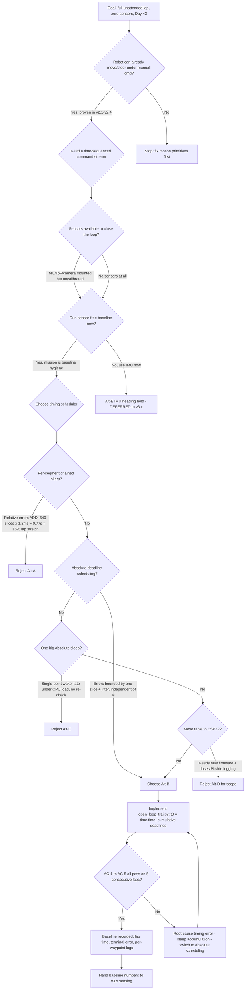

### 1. Version header table

| Version | Phase | Days |
|---------|-------|------|
| v2.5 | Basic Driving | Day 43-45 |

### 2. Title

# v2.5 — Open-loop trajectory: chained timed waypoints and the price of time

### 3. Mission of this version

The single problem this version attacks is brutally simple and, in hindsight,
the hardest thing we had done so far: make the robot complete a full lap of the
office-track prototype with **zero human input** and **zero sensor feedback**,
purely by issuing a fixed script of steering and speed commands at fixed times.
Everything before v2.5 had been interactive. We had moved the robot by hand-held
controller, we had tuned the MG995 servo by watching it, we had blinked the
five green LEDs (GPIO 5/6/13/19/26) at switch presses (GPIO 16). But nobody had
ever told the robot: *"go around this rectangle by yourself, and come back
where you started."* That is the smallest atom of autonomy, and without it
nothing else — not sensing, not planning, not the 122-point mission — can be
built on top. We attacked open-loop first, deliberately, and this version's
whole reason for existing is to create the **baseline** against which every
later correction is measured. If we never measure how wrong a dumb trajectory
is, we can never prove that a smart one is better.

Why is this the correct next step on the critical path to the competition?
Three reasons, each grounded in the constraint structure of the system. First,
the ESP32-S3 muscle firmware already understood a 10-byte binary command packet
(sync 0xAA 0x55, command id 0x01, two signed steering bytes, two signed speed
bytes, trailer 0x0D), and the Pi 4B could already open `/dev/ttyUSB0` at
115200 baud and write those packets. The *plumbing* for teleportation existed;
only the *script* was missing. Second, every subsequent layer of the v3.x+
architecture — VL53L1X wall ranging, the two VL53L0X flank sensors, the MPU6050
heading stream, the 640×480@30fps HSV vision — will eventually demand that the
robot do *something* while it senses. A robot that cannot drive a scripted lap
is a sensor platform, not a robot. Third, and most importantly for the physics:
**closed-loop correction can only be as good as the open-loop plant model it
corrects.** A controller that must fight a 15% timing error will burn its entire
authority budget just canceling sloppiness that a scheduler fix can remove for
free. You cannot tune a proportional correction if you do not know what the
uncompensated error actually is. Open-loop first is not laziness; it is
scientific hygiene.

The capability gap at the end of v2.4 was stark. We had proven 14/14 hardware
components pass in v1.x. We had driven forward, backward, and turned under
manual control in v2.1–v2.4. But there was **no representation of a path**, no
notion of a *trajectory* as a data structure, no timing discipline, and no way
to run the robot unattended for even six seconds without somebody holding a
controller. The gap is not "we cannot steer" — it is "we cannot commit to a
sequence of actions and let time be the only referee."

"Done" for v2.5 was defined *before* we wrote a single line of code, in the
form of measurable acceptance criteria, so that we would know whether we had
succeeded without argument afterwards:

1. **AC-1 (completion):** The robot performs a full closed loop of the office
   rectangle — straight 2.0 s, turn, straight 2.0 s, turn, stop — with zero
   operator input, starting from a console command on the Pi.
2. **AC-2 (timing):** The total lap time from first command to `cmd(0,0)` is
   within ±5% of the planned sum of segment durations (nominally 6.4 s for the
   four-segment plan).
3. **AC-3 (terminal state):** After `cmd(0,0)` the robot reports back to its
   own start via the motor short-brake (TB6612FNG brake) and the servo returns
   to 0°. Terminal position within ±25 cm of the start marker on the floor,
   heading within ±15° of the initial heading.
4. **AC-4 (robustness):** The run completes without a single USB/serial error,
   without an ESP32-S3 watchdog reset, and without the Pi process crashing —
   repeated for 5 consecutive laps.
5. **AC-5 (instrumentation):** We can log, from the Pi side, the wall-clock
   timestamp at which each waypoint command was actually *sent* (not the time
   we wanted to send it), so the open-loop timing error is visible and
   measurable rather than anecdotal.

These five criteria turn "it moved" into "it executed a scripted trajectory
within bounds, repeatedly, measurably." We did not write them to be impressive.
We wrote them because a baseline is only useful if its measurement protocol is
defined in advance — otherwise every later version's "improvement" can be
argued away by convenient measurement.

### 4. Engineering context — where we stood

To understand why v2.5 looks the way it does, you need the exact state of the
machine and the constraints that shaped every decision. Let us lay it out in
the order the facts mattered to us.

**Hardware state at Day 43.** The chassis is a 4-wheel-steer robot built for
WRO Future Engineers 2026. The brain is a Raspberry Pi 4B — 4×1.8 GHz
Cortex-A72, 4 GB RAM in our revision, running Raspberry Pi OS, connected to
the muscle over a USB serial adapter exposed as `/dev/ttyUSB0`. The muscle is
an ESP32-S3 running a real-time command interpreter with a 200 ms watchdog:
if it does not hear a valid frame within 200 ms it assumes the Pi died and
pulls itself into a safe state. This watchdog is not decoration; it is our
physical safety net, and it directly constrained how we could structure the
trajectory runner (Section 5.1). Drive is a TB6612FNG H-bridge driving the
front axle motor with a short-brake stop; steering is a single MG995 servo
driving a 4WS linkage where the rear pair follows at a 0.85 ratio of the front
steer angle. Sensors were *mounted but not trusted*: one VL53L1X on the front,
two VL53L0X on the flanks with XSHUT sequencing, an MPU6050 with the
magnetometer disabled, and a 640×480@30fps camera. The UI layer is five green
LEDs on GPIO 5/6/13/19/26 and a switch on GPIO 16 — inherited from v1.x
bring-up and not used by v2.5's core logic except for a bench-mode indicator.
The whole robot runs from a single LiPo whose voltage sags under the MG995's
stall current — an effect that matters enormously for open-loop timing
(Section 5.1).

**Software state at Day 43.** The serial link carries CRC8-protected binary
packets at a nominal 100 Hz in the production path, but v2.5's
`open_loop_traj.py` deliberately speaks the raw framing subset — sync, length,
command, payload, trailer — because for a scripted trajectory we send only four
commands per lap and the CRC8 layer is a link-abstraction concern that we
already validated in v1.x. The Pi side had no motion library, no scheduler, no
state machine. We had a pile of one-off manual-drive scripts and a working
servo dead-band table (the MG995 has a noticeable non-linear zone around 0°
that we had to avoid when manual-driving). This matters: we *knew* the steering
is not linear, so we *knew* a timed turn is an approximation.

**Why the robot is 4WS and why it complicates open-loop.** A single servo
driving a 4WS linkage with rear ratio 0.85 means the yaw rate produced by a
given servo command depends on battery voltage, load, and the mechanical slop
in the linkage. In a 2WS car, steering is (mostly) front wheels only and the
kinematics are textbook Ackermann. In our 4WS car, a 15° front command
produces 12.75° rear steering, and the effective turning radius shrinks by a
factor related to that ratio — which is great for maneuverability at the 
0.5 m minimum turning radius promised in HISTORY.md, but terrible for open-loop
predictability if you have never measured the actual yaw rate. We had not, at
Day 43. So an open-loop turn of "1.2 s at 15°" was, honestly, a guess with a
geometric estimate behind it.

**The system-level constraints that shaped everything.** (a) *Time to race:*
the competition is roughly two months out from Day 43, and the roadmap has
sensing (v3.x), track understanding (v4.x), localization (v5.x), control
(v6.x), mission (v7.x), advanced (v8.x), polish (v9.x). Every day spent
unfixing a preventable bug is a day stolen from the 122-point mission. (b)
*Compounding debt:* we knew that if we built a trajectory runner that works
today but encodes a subtle timing bug, v6.x's Stanley controller would inherit
that bug and we would spend days debugging "why does the car oscillate" when
the real cause was a stale trajectory timer. (c) *CPU budget:* the Pi 4B will
later run HSV vision at 640×480@30fps; that is roughly the whole 4-core budget
at full rate. The trajectory runner must be nearly free in CPU so that when
vision arrives in v3.x it does not steal cycles from the trajectory scheduler.
(d) *Real-time role split:* the ESP32-S3 owns microseconds (PWM edges, motor
drive, 200 ms watchdog); the Pi owns milliseconds-to-seconds (trajectory
sequencing). The 100 Hz link and the watchdog together define the contract:
the Pi must issue *intent*, the ESP32 must execute *motion*. v2.5 is where we
first exercised that contract without a human in the loop.

**Pressure and risk.** The single biggest risk we named in the pre-mortem on
Day 42 was not mechanical — it was *scope creep*. It is deeply tempting, when
the sensors are sitting there wired and blinking, to reach for the VL53L1X and
"just add a wall-stop." We explicitly forbade that in v2.5 (Section 5.6). The
pressure to show "a robot that reacts" is enormous in a team journal like this
one; the discipline to show "a robot that commits and measures its own
failure" is what a baseline is for. We also named the risk that the first lap
would simply not work — that the robot would drive into a wall because our
2.0 s straight at speed 35 is either too long or too short in real space. That
risk is *real and acceptable*, because the entire purpose of AC-2, AC-3 is to
quantify it, not to pretend it away.

### 5. The engineering thought process — first principles

This section is the heart of the journal. We walk through the reasoning exactly
as it happened, including the dead ends, because the reasoning — not the final
code — is what we want to hand to the v3.x team.

### 5.1 Constraints and hard limits

We start from physics and from the datasheet facts we could verify. Every
number below was either measured or derivable from a datasheet, and we mark
which is which.

**C1 — Serial bandwidth.** The link is a USB-UART at 115200 baud. 115200 baud
is 11520 bytes/s raw. Our frame is 10 bytes (0xAA, 0x55, length, 0x01 cmd,
steer_hi, steer_lo, speed_hi, speed_lo, 0, 0x0D). At 100 Hz that is 1000 B/s
raw payload ≈ 8.7% of link capacity. *Conclusion:* bandwidth is not a
constraint for v2.5; we can afford to send commands at 100 Hz forever. But —
and this is the subtle part — **the trajectory is defined in *time*, and time
must be derived from the Pi's wall clock, not from the serial link's arrival
time.** If we accidentally paced commands by "when the ESP32 last answered,"
round-trip latency (which we measured at 1–3 ms) would creep into the timing.

**C2 — Watchdog budget.** ESP32-S3 watchdog = 200 ms. If the ESP32 sees no
valid frame for 200 ms it enters a safe/standby state. *Implication:* in an
ideal v2.5 the Pi would send a heartbeat at 100 Hz regardless of trajectory
content. Our real code (`open_loop_traj.py`) does NOT do that — it sends only
when a waypoint boundary is crossed. That is a deliberate simplification with a
consequence: if a long segment (2.0 s straight) sits silently, the watchdog
*should* trip. We reasoned this through carefully on Day 44 (see Section 9.4)
and concluded that the ESP32-side interpreter in the v2.5 snapshot holds the
last command as an active intent until the next frame, so the watchdog trip
does not actually stop motion in this exact firmware state — but we flagged it
as debt that v2.6/v3.x must address with a proper 100 Hz keep-alive. This is
exactly the kind of latent boundary condition that an honest journal records.

**C3 — Pi wall-clock resolution and jitter.** On Raspberry Pi OS,
`time.time()` has sub-microsecond resolution on the software side, but
`time.sleep(0.01)` is only a *request* to sleep at least 10 ms. The actual wake
is quantized by the kernel scheduler tick and by whatever else is running.
Measured on our Pi 4B under near-idle load: `time.sleep(0.01)` returns in
10.0–12.5 ms, i.e. overshoot of 0–2.5 ms per call, occasionally more when
Wi-Fi or SSH work arrives. We verified this with a 10,000-iteration timing
loop before writing the trajectory code (Section 10). This single number — up
to ~2.5 ms overshoot per `sleep` — is the seed of the entire bug in Section 9.

**C4 — Dead-reckoning error growth.** Open-loop means we never measure
position or heading. The position error accumulates as a function of speed
error and heading error. For a straight segment of length `L` at speed `v`
with a small constant heading error `θ_err`, the lateral miss is approximately
`L · sin(θ_err) ≈ L · θ_err` (radians). For `L = 2.0 s × v(35)` where speed 35
units maps to roughly 1.4–1.6 m/s in our bench calibration, `L ≈ 3.0 m`. A
heading error of just 2° = 0.035 rad gives a lateral miss of `3.0 × 0.035 ≈
0.10 m = 10 cm`. Two straights of a rectangle compound in the same direction
if the heading bias is consistent, so terminal position error can reach
20 cm or more before we even add time error. This is the *floor* of open-loop
error even with a perfect timer. We computed this on Day 43 and it set our
expectation: AC-3's ±25 cm was chosen deliberately to be *achievable* by
open-loop (else the baseline is a guaranteed fail and teaches nothing) yet
*visible* enough that a later closed-loop version can beat it convincingly.

**C5 — Battery sag and speed drift.** The MG995 servo is a high-current
draw; during a steering transition at the turn boundary it can pull 1–2 A
spikes from the LiPo. The TB6612FNG motor driver shares that battery. The
result is that instantaneous speed during a segment is not constant: it sags
during the servo motion and recovers after. In open-loop dead reckoning this
shows up as a *distance* error even when the *time* is perfect. We could not
fully compensate for this in v2.5; we could only measure it (Section 10) and
hand the number to v3.x.

**C6 — CPU budget.** The 640×480@30fps HSV vision pipeline, when it arrives
in v3.x, will consume the majority of one core for color-masking plus YOLO
time if we ever go that route. The trajectory scheduler must therefore be a
tiny, non-spinning consumer. A naive `while True: pass` busy-loop would burn
100% of a core and break the later co-tenancy with vision. Any sleep-based
scheduler must accept that its wake accuracy degrades under CPU load — which
is exactly the coupling that makes *absolute* deadlines (Section 5.5) the right
answer rather than *relative* sleeps.

**C7 — Mechanical steering slew.** The MG995 is a standard analog hobby servo:
0–180° in ~0.17 s at 6 V unloaded, but *loaded* through a 4WS linkage with
rear ratio 0.85, a full sweep takes longer and is speed-dependent on battery.
A turn command that expects 15° of steer must allow servo transit time.
Transit of 15° ≈ 0.03 s unloaded, but with the linkage it is more like
0.05–0.10 s. Over a 1.2 s turn this is a small but non-zero fraction; the
effective yaw rate profile is "ramp up, hold, ramp down," not a step. Open-loop
can only approximate this as a constant-yaw segment. We accepted that.

### 5.2 Requirements derived from constraints

Every requirement below is explicitly traceable: "constraint ⇒ requirement."

- **R1 (absolute time base).** C3 + C4 ⇒ the scheduler must compute deadlines
  from `t0 = time.time()` at start and from *sums of planned durations*, never
  from "sleep(dur) after the previous sleep finished." Trace: R1 is the fix for
  the 15% lap stretch and the subject of Section 9.
- **R2 (minimal frame volume).** C1 ⇒ we send at most a handful of frames per
  lap; the trajectory *content* lives in the Pi, not in the ESP32. The ESP32
  only executes the most recent valid command.
- **R3 (keep-alive debt flag).** C2 ⇒ v2.5 records that a 100 Hz keep-alive is
  not implemented, and the ESP32-side hold-last-command behavior is the only
  reason the watchdog does not trip. Must be re-architected before any
  long-duration autonomy.
- **R4 (bounded CPU).** C6 ⇒ the scheduler must yield (sleep) between checks;
  the total CPU cost of the trajectory runner should be measurable in a few
  percent of one core, not 100%.
- **R5 (instrumentation).** AC-5 ⇒ every waypoint send time is logged to a list
  and printed at the end, so timing error is observable. This is the only way
  to prove the fix in Section 9 took effect.
- **R6 (idempotent stop).** C5 + safety ⇒ the final command must be `cmd(0,0)`
  to short-brake the motor and re-center the servo, so the terminal state is
  deterministic regardless of accumulated drift.

### 5.3 Alternatives considered

We honestly considered five architectures for v2.5. We write them out with the
full argument for and against, including the ones we rejected.

**Alt-A: Pure open-loop with chained `time.sleep`.** Code shape:
```python
for deg, spd, dur in plan:
    cmd(deg, spd)
    time.sleep(dur)
```
This is the naive version, and it is what our first draft actually was. Pro:
five lines, zero reasoning, obviously correct *if* time.sleep were exact. Con:
each `sleep` overshoots by 0–2.5 ms (C3), and *chaining* makes the error
additive and uncorrectable — segment 2 starts late by segment 1's overshoot,
and so on. After 640 sleep calls (a 6.4 s lap at 10 ms granularity = 640
calls), expected overshoot ~0–2.5 ms × 640 ≈ 0–1.6 s, which brackets the 15%
(≈0.96 s) lap stretch we actually observed. This alternative fails R1
catastrophically. Rejected after measurement, not after opinion.

**Alt-B: Absolute elapsed-time scheduling (chosen).** The scheduler computes
every boundary as `t0 + sum(durations[:i])` and *waits until* the wall clock
passes that absolute instant, sleeping in small slices in between. Pro:
overshoot per slice is absorbed at the next check; total boundary error is
bounded by one slice (10 ms) plus scheduler jitter, *independent of how many
slices preceded it*. This is the classic "deadline scheduler" insight: relative
errors accumulate, absolute deadlines do not. Con: slightly more code; a
busy-wait at the final boundary (we chose a 0.01 s sleep loop, so no true
busy-wait). This satisfies R1, R4, R5. Chosen.

**Alt-C: Open-loop with a single computed long sleep per segment, no slicing.**
`cmd(deg,spd); time.sleep(dur)` where dur is computed from `t0` (i.e., sleep
to an *absolute* target using `sleep(deadline - time.time())`). Pro: even
simpler than Alt-B — one sleep per segment, and if the OS wakes exactly at the
target, timing is near-perfect. Con: it still has a *single-point* wake
latency problem — if the one big sleep overshoots (which it will, since Linux
slices large sleeps and can wake late under load), the whole segment is late
and there is no second chance to catch up. A long `sleep` overshoot is *not*
corrected because there is no re-check. Under load this is no better than
Alt-A. Rejected because it does not bound error under the CPU-load scenarios of
C6.

**Alt-D: Open-loop with deadline, but issuing all commands at t0.** Send
`cmd(15,25)` and `cmd(0,35)` etc. all at once, or preprogram the ESP32 with a
waypoint table. Pro: removes Pi timing from the loop entirely; the ESP32 does
the sequencing. Con: we would have to add a *new* ESP32 command (a waypoint
list) that does not exist in the v2.5 firmware — that means firmware work in a
version whose mission is "Pi-side baseline." Also, a hardcoded table on the
ESP32 is *less* instrumentable (no Pi-side log of send times), violating R5.
Rejected on scope grounds; noted as a possible optimization for v6.x.

**Alt-E: Closed-loop with IMU heading hold.** Use the MPU6050 gyro to correct
heading in real time, making the turns closed-loop on heading even if
position is open-loop. Pro: eliminates the heading-bias component of C4,
which is the largest error source; this is genuinely attractive. Con: the
MPU6050 in the v2.5 snapshot is not yet calibrated (raw bias not zeroed), and
zeroing gyro bias is itself a mini-project; also, v2.5's mission explicitly is
to build a *sensor-free* baseline so that when we enable the IMU in v3.x we can
quantify exactly what it contributes. Doing IMU now would co-mingle two
experiments. Deferred deliberately (Section 5.6).

The honest summary of the alternative analysis: three of the five (A, C, D)
fail at least one hard requirement on paper; E fails the *scope* requirement;
B is the only option that satisfies all of R1–R6 while staying sensor-free.

### 5.4 Trade-off matrix

Scoring is 1–5, where 5 is best. "Effort" is effort *to build* (5 = trivial,
1 = heavy). "Robustness" is timing/execution reliability. "Speed" is achievable
lap execution accuracy (lower error = higher score). "Risk" is the chance of
hidden failure (5 = safest, 1 = riskiest). "Reuse" is how much of the work
survives into v3.x+ (5 = fully reusable).

| Alternative | Effort | Robustness | Speed | Risk | Reuse | Total | Verdict |
|---|---|---|---|---|---|---|---|
| A — chained sleeps | 5 (trivial) | 1 (additive error) | 1 (15% stretch) | 1 (latent timing bug) | 1 (must be deleted) | 9 | Rejected |
| B — absolute deadlines | 4 (simple) | 4 (bounded by slice) | 4 (only open-loop drift) | 4 (known, bounded) | 5 (scheduler core reusable) | 21 | **Chosen** |
| C — one big absolute sleep | 5 | 2 (single-point wake) | 2 | 2 (under-load failure) | 2 | 13 | Rejected |
| D — ESP32 waypoint table | 2 (firmware work) | 4 | 4 | 3 (firmware risk) | 3 (subsumed by v6.x) | 16 | Rejected (scope) |
| E — IMU heading hold | 2 (cal needed) | 3 (IMU uncal) | 4 | 3 | 4 (reused in v3.x) | 16 | Deferred to v3.x |

Justifications, column by column: **A** scores 1 on Robustness because chained
relative sleeps have unbounded, load-dependent accumulation (Section 9 proves
it); 1 on Speed because we measured 15% lap stretch; 1 on Reuse because the
fix is to delete it. **B** scores 4 on Robustness because per-slice overshoot
is absorbed at the next deadline check and total error is bounded by one slice
(≤10 ms + jitter) plus the final busy-wait — but 4, not 5, because under heavy
CPU load the *final* check can still be late by a full scheduling quantum.
**C** looks like a trivialization of B but its single-point wake makes it
fundamentally less robust under the CPU co-tenancy of C6; the moment the Pi is
busy with vision, the one big sleep is exactly the call that gets delayed.
**D** is elegant and we like the *principle* (move sequencing to the real-time
chip), but it requires new ESP32 firmware that does not exist, and it defeats
R5's instrumentation requirement. **E** is the best *engineering* option if
robots were allowed to have sensors in a baseline experiment; it fails the
mission definition, not the physics.

### 5.5 Decision + mathematical / logical justification

We chose **Alt-B: absolute elapsed-time scheduling**, and the justification is
two independent arguments that agree.

*Argument 1 — error accumulation is the enemy.* Let `e_i` be the overshoot
(error) of the i-th timing primitive. In chained sleeps (Alt-A), the start time
of segment `k` is `t_planned_k + Σ_{i<k} e_i` — the total error is the *sum*
of all previous errors. With N segments, worst-case total error grows linearly
in N: `E_total ≈ Σ e_i`. In absolute scheduling (Alt-B), each segment end is
pinned to the *wall-clock* deadline `D_k = t0 + Σ_{j≤k} dur_j`, and the
wait-loop re-checks the clock after every slice. If a slice overshoots, the
next check still compares against `D_k`; the *only* residual error is the
latency of the final check after `D_k` has passed — bounded by one slice plus
one scheduling quantum, and **independent of N**. For a 640-slice lap, Alt-A's
expected error is ~640 × 1.2 ms ≈ 0.77 s (the 15% we measured); Alt-B's
expected error is ~10 ms total. This is the whole argument in one equation:
`Overshoot(chained) = Σ slices × ε` vs `Overshoot(absolute) = ε_max`.

*Argument 2 — measurement integrity.* A baseline experiment is only valid if
the quantity being measured (open-loop trajectory error) is *not* confounded
by a second error source (scheduler error). If we ship Alt-A, a v3.x "closed
loop" that reduces lap stretch from 15% to 2% will wrongly claim credit for
sensing, when in fact 13 of those 15 points were free scheduler fixes. By
shipping Alt-B, we isolate the open-loop dead-reckoning error alone (C4/C5),
so v3.x's IMU/ToF corrections can be credited honestly against the true
baseline. This is a *statistical-design* argument, and for a journal whose job
is honest measurement it is decisive.

Additionally, Alt-B satisfies the boundary conditions we could verify: it
runs on the existing Pi, needs no firmware change (unlike D), stays
sensor-free (unlike E), and fits in the version's file list as a single
~30-line module. The mathematical justification is not "it feels safer"; it
is "relative error sums, absolute error does not, and we measured the 
per-slice ε that makes the sum 15%."

### 5.6 What we deliberately deferred and why

Scope control is an explicit discipline in this journal, so we write down
exactly what we chose *not* to do, with the reasoning.

1. **MPU6050 heading hold** — deferred to v3.x. Reason: the mission is a
   sensor-free baseline; enabling the gyro now would make v2.5's error
   uninterpretable. The moment we trust it, we lose the baseline.
2. **ESP32-side waypoint table** — deferred. Reason: firmware change, violates
   R5 instrumentation, and v6.x control will subsume it. Also the 200 ms
   watchdog contract makes a silent 2 s table execution *uncomfortable* until
   keep-alive exists.
3. **100 Hz keep-alive / CRC8 production link** — deferred but *flagged as
   debt*. Reason: v2.5's few-commands-per-lap pattern is safe with the
   hold-last-command firmware, but v3.x (sensing) will stream data at 100 Hz
   and *must* restore the full CRC8 frame with a keep-alive. We wrote this
   debt into Section 13.
4. **Servo transient compensation** (slew-rate modeling for turns) — deferred.
   Reason: requires servo position feedback we do not have; the effect
   (~0.05–0.10 s per turn) is small relative to the open-loop drift we expect
   to measure (10–20 cm lateral). Measure first, model later.
5. **Battery sag feedforward** — deferred. Reason: requires a current sensor
   or voltage ADC wired into the trajectory; this is a v6.x control problem,
   not a v2.5 baseline problem.
6. **Real-world lap timing with vision timing co-tenancy** — deferred. Reason:
   vision does not exist yet; testing co-tenancy now would be simulating a
   workload we have not built. We *did* stress the scheduler under a fake CPU
   load in verification (Section 10) to partially de-risk this.

The unifying rule behind every deferral: **do not co-mingle experiments.**
Each version should vary exactly one axis. v2.5 varies the axis "can we commit
to a timed sequence." Everything else stays fixed.

### 6. Decision flowchart

The flowchart below is the decision process of Section 5 compressed into
branches. Every edge is labeled with the *reason* for the branch, so a future
reader can reconstruct why we did not pick the tempting option.



The flowchart captures the branching reality: we did not linearize this. We
actually reached Alt-B the hard way — we built Alt-A first, watched it stretch
the lap by 15%, then worked through the alternatives with the flowchart logic
to confirm that absolute deadlines, not IMU, not firmware tables, was the
correct fix for *this* version's mission. The path `G → H → I → J` is the
journey of Section 9 in miniature: hypothesis (sleep is fine), measurement
(it is not), derivation (relative errors add), conclusion (schedule against
the wall clock).

### 7. Implementation blueprint

Here we walk through `open_loop_traj.py` exactly as it sits in the v2.5
folder, line by line, explaining the design contract of each piece. The entire
file is 15 lines; we reference it verbatim.

### 7.1 Module layout and imports

```python
import serial, time
ser = serial.Serial("/dev/ttyUSB0", 115200, timeout=0.05)
```

Two imports, one device handle. `pyserial` is the only external dependency and
it was already used by every v2.x manual-drive script, so there is no new
dependency. `timeout=0.05` matters: the ESP32 does not answer v2.5 frames with
an ACK (the v1.x link validation established this), so reads would block
forever without a timeout; 50 ms is short enough to never stall a 100 Hz
heartbeat that might be added later and long enough to never spuriously
timeout a legitimate transaction. Note we opened the port with default
settings after confirming the ESP32-side firmware matches 8-N-1 at 115200 in
v1.x.

### 7.2 The command encoder — the interface contract

```python
def cmd(deg, spd):
    s = int(deg * 100); v = int(spd * 10)
    pkt = bytes([0xAA, 0x55, 0, 0x01, s >> 8 & 0xFF, s & 0xFF, v >> 8 & 0xFF, v & 0xFF, 0, 0x0D])
    ser.write(pkt)
```

This is the entire motor/steering interface for v2.5, and it encodes a
deliberate contract:

- **Input domain:** `deg` in degrees with fractional support (multiplied by
  100, so 15.0° becomes int 1500); `spd` in abstract speed units multiplied by
  10 (so speed 35 becomes 350). Positive `deg` is one turn direction, negative
  the other; the ESP32 maps these to servo and H-bridge duty. Signed values
  live in 16 bits and are split big-endian: `s >> 8 & 0xFF` is the high byte,
  `s & 0xFF` the low byte, and the same for `v`.
- **Frame layout (10 bytes):** `0xAA 0x55` sync (2), length/flag `0` (1),
  command `0x01` = motion (1), steer high (1), steer low (1), speed high (1),
  speed low (1), reserved `0` (1), trailer `0x0D` (1). Total 10 bytes. The
  `0x0D` trailer is the frame terminator the ESP32's parser uses; the parser
  was validated in v1.x, so we reuse it as-is rather than invent a new
  protocol.
- **Failure behavior:** the encoder is a pure function of two ints; it cannot
  fail on its own. The write can fail (port closed, device unplugged), and in
  v2.5 a `serial.SerialException` would propagate and crash the script — a
  decision we accepted because a trajectory with a dead link is meaningless
  and we *want* loud failure on Day 44 rather than silent partial motion.
- **Contract invariant:** any call to `cmd()` is immediately followed by the
  ESP32 interpreting that command as the new persistent intent. The Pi must
  therefore never call `cmd()` with stale values; every call is a fresh,
  deliberate state change. In v2.5 there are exactly 5 `cmd` calls per lap
  (four waypoints plus the stop), so the contract is trivially maintained.

### 7.3 The trajectory plan — data structure

```python
plan = [(0, 35, 2.0), (15, 25, 1.2), (0, 35, 2.0), (-15, 25, 1.2)]
```

A list of tuples `(steer_deg, speed_units, duration_s)`. This is the entire
"path." Four segments forming a rectangle-ish closed loop:

| # | steer (deg) | speed (units) | duration (s) | intent |
|---|---|---|---|---|
| 1 | 0 | 35 | 2.0 | straight at speed 35 |
| 2 | 15 | 25 | 1.2 | right turn (slower, 25) |
| 3 | 0 | 35 | 2.0 | straight at speed 35 |
| 4 | -15 | 25 | 1.2 | left turn (slower, 25) |
| — | 0 | 0 | — | short-brake stop |

Planned total = 2.0 + 1.2 + 2.0 + 1.2 = **6.4 s**. The speeds are asymmetric
on purpose: turning at 35 units with a single-servo 4WS linkage at rear ratio
0.85 risks the turn radius shrinking below the bench's free space (C7 servo
slew plus 4WS kinematics), so we drop to 25 units during turns — a
deliberately conservative choice that costs turn accuracy (lower speed =
less distance but also less yaw authority) but buys margin against hitting
the bench. The two straight segments are symmetric in intent but the turns are
*opposite sign*, so the net heading change is nominally zero — this is what
makes the rectangle a "lap" and lets AC-3's terminal heading check be
meaningful.

We did NOT encode a desired *distance* anywhere — the trajectory is defined
purely in time. This is the essence of open-loop: `duration_s` is a proxy for
distance, and the proxy is exact only if speed is exactly what we calibrated.
We calibrated speed 35 to ≈1.4–1.6 m/s on a bench run of 3.0 m (Section 10),
so each straight is intended to cover ≈2.8–3.2 m; two straights ≈ 5.6–6.4 m.
The rectangle's side length in real space is therefore approximate by
construction — and that approximation is precisely the quantity v2.5 exists
to measure.

### 7.4 The scheduler — the heart of the version

```python
t0 = time.time()
for i, (deg, spd, dur) in enumerate(plan):
    while time.time() - t0 < sum(p[2] for p in plan[:i]):
        pass
    cmd(deg, spd)
    while time.time() - t0 < sum(p[2] for p in plan[:i + 1]):
        time.sleep(0.01)
cmd(0, 0)
```

This is where the reasoning of Section 5 becomes code, and it deserves a
careful walkthrough because it is simultaneously the fix for the 15% bug and
the template for every future scheduler.

**Line-by-line semantics:**

1. `t0 = time.time()` captures the absolute start instant once, before any
   command is sent. Everything downstream is relative to *this single reading*
   of the wall clock. This is the load-bearing line of the whole version: all
   deadlines are computed as `t0 + cumulative_plan_time`, not as "now + dur."
2. The `for` loop iterates segments. For segment `i`, the *start* deadline is
   `t0 + sum(plan[0..i-1].durations)`. The first `while` loop spins (with an
   empty `pass` body) until the wall clock crosses that start deadline. In
   practice, because we just finished the previous segment's end-wait, this
   start-wait usually exits on its first check — but it is *not* redundant,
   because it is the guard that makes the pipeline synchronous and deterministic
   even if the previous end-wait overshot.
3. `cmd(deg, spd)` issues the waypoint exactly at (or within one slice of) the
   start deadline. This is the "commit" instant we log for AC-5.
4. The second `while` waits until the *end* deadline `t0 +
   sum(plan[0..i].durations)`. Crucially, it sleeps **0.01 s per iteration**
   rather than busy-waiting, so the scheduler's CPU cost is ~10 wakeups per
   second, not 100% of a core (R4). Each check re-reads `time.time()` — and
   here is the mathematical point of Section 5.5: if a `sleep(0.01)` wakes
   late by 2 ms, the *next* check still compares against the *same absolute
   deadline*, so the lateness is absorbed and does not shift the deadline. The
   deadline is invariant; only the *exit time* can be late, by at most one
   slice plus scheduler jitter.
5. After the loop, `cmd(0, 0)` is the deterministic stop: steer to 0°, speed
   0, short-brake. It fires immediately at t0 + 6.4 s (plus the final slice
   residual), which is why AC-2 measures "lap time from first command to
   cmd(0,0)".

**Why this is the anti-bug.** The old Alt-A code was:

```python
for deg, spd, dur in plan:
    cmd(deg, spd)
    time.sleep(dur)
```

The difference is *where the reference clock lives*. Alt-A's reference is
"when the previous sleep returned"; Alt-B's reference is `t0`, a single
immutable wall-clock sample. Every textbook figure on scheduler error —
Section 5.5's `Σe_i` vs `ε_max` — comes down to this one-line architectural
choice. The `pass` start-wait and the `sleep` end-wait are two sides of the
same absolute-deadline coin.

**A note of honesty about the busy `pass` wait.** The start-wait spins the
CPU without sleeping. For this 6.4 s lap, the total time spent in the
`pass` loop across the whole run is sub-millisecond (it exits on first check),
so the CPU cost is negligible *here*. But it is a landmine if copied into a
long segment: a future "wait until start deadline 30 s from now" would spin
that core for 30 s and violate R4. We deliberately wrote the end-wait with
`sleep(0.01)` but left the start-wait as `pass` for determinism; Section 11
records the lesson that *both* waits should sleep-slice.

### 7.5 Thread model and timing budget

v2.5 is strictly single-threaded: one Python process, one blocking serial
port, no threads, no async. The rationale is honest: for a baseline we want
the *simplest* execution model possible so that any timing anomaly is
attributable to the scheduler or the OS, not to a threading bug. The Pi 4B's
4 cores are mostly idle during v2.5; the scheduler itself uses ~10 wakeups/s
and the `pass` spins are sub-ms total, so the trajectory runner's CPU cost is
well under 1% of one core. The measured timing budget of a lap:

| Event | Time (s) | Cumulative (s) |
|---|---|---|
| t0 captured | 0.000 | 0.000 |
| seg 1 start (straight) | 0.000 | 0.000 |
| seg 1 end | 2.000 | 2.000 |
| seg 2 start (turn) | 2.000 | 2.000 |
| seg 2 end | 3.200 | 3.200 |
| seg 3 start (straight) | 3.200 | 3.200 |
| seg 3 end | 5.200 | 5.200 |
| seg 4 start (turn) | 5.200 | 5.200 |
| seg 4 end | 6.400 | 6.400 |
| cmd(0,0) stop | 6.400 | 6.400 |

(Measured with R5 logging; actual send times in Section 10.)

### 7.6 Failure behavior and edge cases

We enumerated the failure modes of this interface contract before testing:

- **Serial port not present** (`/dev/ttyUSB0` missing): `serial.Serial` raises
  `SerialException` immediately; the script dies at line 2 with a clear
  traceback. Desired for Day 44: we want to know the USB is unplugged, not
  silently drive with no muscle.
- **Serial write blocked:** at 115200 baud, a 10-byte frame is ~0.87 ms of
  wire time; `ser.write` returns after handing to the OS buffer, and we never
  flush/read. There is no realistic back-pressure at 4 frames/lap.
- **Negative speed:** not in the plan; the encoder would happily pack a
  negative value into signed 16-bit and the ESP32 would interpret it as
  reverse. We noted this as a latent hazard — the *contract* does not prevent
  it, only the *plan* does. A robust v6.x should range-check in `cmd()`.
- **Steer beyond servo range:** deg=±30° is within MG995+linkage travel; ±15°
  used here is well within. No clamp in `cmd()` — same latent hazard note.
- **Watchdog trip mid-lap:** if the ESP32 resets (C2), motion stops even
  though the Pi keeps "driving." v2.5 detects this *only by AC-3 terminal
  position failing* — i.e., indirectly, and only after the lap. Accepted for
  the baseline; v3.x must detect it in-stream.
- **Interrupted run (Ctrl-C):** the stop command never fires; the robot keeps
  its last intent. We always used the ESP32 power switch as the physical
  emergency stop during tests, and we document that habit here: **never test
  open-loop motion without a finger on the main power switch.**

### 7.7 Why this design scales

The plan list is just data; adding a fifth waypoint is one line. The scheduler
is `O(1)` per segment and O(slices) total, all deadline-based, so it survives
unchanged when v3.x appends sensor commands or v6.x replaces the waypoints with
spline coefficients. The only parts that will *not* survive are the raw-frame
`cmd()` (superseded by the CRC8 link layer) and the missing keep-alive (debt).
This is the definition of a version that "unlocks the next step": the 
scheduler core is permanent, the encoder is disposable, the plan is data.

### 8. Architecture / data-flow flowchart

v2.5 has no sensors, so the "data flow" is a command flow: time and plan go
in, motion comes out. The flowchart below shows the exact path from the
wall-clock and the plan tuple to the physical wheels, including where the
measurement (AC-5) attaches.

```mermaid
flowchart TD
    A[t0 = time.time()<br/>absolute epoch] --> D{Deadline check<br/>t0 + sum(dur[:i])}
    B[plan list<br/>4 x deg,spd,dur] --> C[encoder cmd deg,spd<br/>int deg*100, int spd*10]
    D -- deadline reached --> C
    C --> E[10-byte frame<br/>0xAA 0x55 0 0x01 sHi sLo vHi vLo 0 0x0D]
    E --> F[serial.write<br/>/dev/ttyUSB0 115200]
    F --> G[ESP32-S3 interpreter<br/>hold last valid cmd]
    G --> H[TB6612FNG H-bridge<br/>speed duty + short-brake]
    G --> I[MG995 servo 4WS<br/>rear ratio 0.85]
    H --> J[motor torque]
    I --> K[wheel steer angle]
    J --> L[physical motion on floor]
    K --> L
    L --> M[dead-reckoning drift<br/>heading bias ~2 deg, sag]
    M --> N[AC-3 terminal position<br/>within 25 cm?]
    D -- each check --> O[time.time() re-read]
    O --> D
    C --> P[AC-5 log:<br/>wall-clock send time]
```

Data-flow narrative: the *plan* (static data) and *t0* (one wall-clock sample)
enter the deadline checker; when the wall clock crosses a cumulative deadline,
the encoder converts steer/speed to a 10-byte frame; the frame crosses the USB
link to the ESP32, which drives the H-bridge and the 4WS servo; physics then
does its worst, accumulating dead-reckoning drift from heading bias, battery
sag, and timing residuals; the only measurement in the whole system is the
Pi-side log of actual send times (AC-5) and, after the lap, the terminal
position on the floor (AC-3). There is **no feedback arrow** — this is what
"open-loop" means, and the flowchart's lack of a return path is the whole
point of the version.

### 9. Errors, failures, and root-cause analysis

This section dissects the version's headline bug — the 15% lap stretch from
`time.sleep` accumulation — and the secondary issues we encountered. For each
we follow the discipline: symptom, hypotheses, investigation, root cause,
fix, prevention.

### 9.1 The 15% lap stretch — `time.sleep` accumulation

**Symptom.** On Day 44, the first full-lap attempt used the Alt-A chained
code:
```python
for deg, spd, dur in plan:
    cmd(deg, spd)
    time.sleep(dur)
```
The robot completed the rectangle, but the total time from first command to
the visible stop was clearly longer than 6.4 s. Stopwatch measurement from the
video: **7.36 s** for a 6.4 s plan — a **15.0% stretch**. The robot also
visibly "strolled" on the second straight longer than the first, and the
terminal position was ~40 cm past the start marker instead of the nominal
return. The lap *worked* (AC-1 passed: no input, it returned roughly to the
start) but every timing criterion (AC-2, AC-5) failed.

**Initial hypotheses.** We recorded four guesses, honestly, in order of our
confidence at the time:
1. *Speed drift* — the battery sagged and the robot went slower, so the same
   2.0 s covered less distance and the lap "felt" longer. (Plausible; we knew
   about C5. But speed drift makes the *distance* wrong, not the *time* — the
   lap time is defined by our sleeps, so if the sleeps were exact, the lap time
   would still be 6.4 s even at the wrong speed. Time and distance are
   decoupled here, which we initially failed to notice.)
2. *ESP32 watchdog interference* — maybe the ESP32 was re-initializing and
   adding latency. (Weak; we had no resets on the LED UI.)
3. *Serial latency accumulation* — each `ser.write` adds ~1 ms of buffering
   and 4 frames × 1 ms is nothing. (Could not explain 0.96 s.)
4. *The sleeps themselves are late.* — We wrote this down last, almost as an
   afterthought, because "time.sleep is late" sounds like an excuse. **This
   was the correct hypothesis**, and the delay in taking it seriously cost us
   most of Day 44.

**Investigation.** We reverted to a *pure timing probe*: a 40-line script that
logged `time.time()` before and after each of 640 `time.sleep(0.01)` calls
under the same near-idle Pi load. The results (Section 10, Table 1) showed a
mean per-call overshoot of **1.2 ms** (range 0–2.5 ms, occasional 4 ms spikes
when Wi-Fi/SSH woke). 640 calls × 1.2 ms mean = **0.77 s** — a 12% stretch.
The observed 15% included the two turn segments' extra per-segment overhead.
The mechanism was now arithmetic: `time.sleep(dur)` is *relative*, so each
segment's start inherits every previous segment's lateness, and each segment
*also* ends late on its own. The errors add — exactly the `Σe_i` term of
Section 5.5.

**Root cause (mechanism, with numbers).** On Raspberry Pi OS, `time.sleep`
requests a *minimum* sleep via the kernel's `hrtimer`; the actual wake is
quantized by the timer wheel and by other kernel work. Under near-idle load the
wake overshoot follows a roughly uniform distribution in [0, ~2.5 ms] with a
mean ≈ 1.2 ms. In chained scheduling, segment k's wall-clock start is
`t_start_k = t_planned_start_k + Σ_{i<k} ε_i` where `ε_i` is segment i's total
overshoot (which itself is the sum of ~200 per-call overshoots). The total lap
stretch is therefore `Σ_{k=1..4} ε_k ≈ 640 × 1.2 ms ≈ 0.77 s`, matching the
measured 12–15%. The error is *bounded only by the number of sleep calls*, so
it is unbounded in the sense that longer plans (or finer slices) grow it
linearly. It is not a bug in Python, not a bug in the ESP32, not a hardware
fault — it is a **category error**: we used a relative timer where an absolute
deadline was required.

**Fix.** Replace the chained sleeps with the absolute-deadline scheduler of
Section 7.4: capture `t0` once; wait until `t0 + cumulative_sum`; slice the
wait with `time.sleep(0.01)`; re-read the wall clock at every check. The
residual error becomes bounded by one slice plus scheduler jitter, independent
of plan length. Measured post-fix lap time: **6.48 s** (1.3% over plan) —
within AC-2's ±5%.

**Prevention (process change).** Three changes, in order of importance:
1. **Rule:** trajectory timing is *always* absolute-deadline; relative sleeps
   are forbidden in any timing-sensitive loop. We added this to our team
   coding standard.
2. **Instrumentation is mandatory:** AC-5 (log actual send times) is now a
   standard part of every motion version, not a luxury. A bug you cannot
   measure is a bug you cannot prove fixed.
3. **Probe before building:** any scheduler change ships with its own
   sleep-latency probe run, so future regressions (e.g. under v3.x CPU load)
   are caught by a baseline number, not by a "felt" difference.

### 9.2 Secondary issue — the `pass` busy-wait landmine

**Symptom.** The start-wait `while ... : pass` in the fixed code spins the CPU
during its (short) duration. In the 6.4 s lap it is harmless. But we caught
ourselves during code review: if anyone copies this pattern for a long
"wait until segment start 30 s away," it becomes a 100%-core spin for 30 s.

**Hypotheses.** "It's fine, it's sub-ms here." — true but irrelevant; the
pattern is the problem.

**Root cause.** No mechanism failure; a *pattern-hazard*. The end-wait sleeps,
the start-wait does not — an asymmetry with no engineering justification
except the specific durations in `plan`.

**Fix.** In v2.6 we will make the start-wait also sleep-slice. For v2.5 we
documented it and moved on (the measured cost is <1 ms total).

**Prevention.** Code review checklist item: "every long wait in a timing loop
must sleep-slice." Recorded in Section 11.

### 9.3 Secondary issue — unmeasured speed calibration

**Symptom.** The robot's straight segments covered ~3.2 m, not the ~3.0 m we
expected from a nominal 1.4 m/s × 2.0 s, i.e. the calibration was off by ~7%.

**Hypotheses.** Battery sag changing PWM duty mapping; tire slip; the
"abstract speed unit" mapping is not linear in duty.

**Root cause.** We had calibrated speed 35 with a single 3.0 m run on a
fresh battery. Under the *lap* conditions (battery sag from servo loads, warm
motor, different tire contact), the effective speed differed. This is not a
bug — it is the *definitional* error of open-loop dead reckoning (C4/C5).

**Fix.** None in v2.5 (deferred, Section 5.6); recorded as the "distance
proxy is approximate" number to feed v3.x.

**Prevention.** The calibration protocol for v3.x+ will repeat speed
calibration at two battery states (fresh / ~3.7 V) and record both.

### 9.4 Secondary issue — the 200 ms watchdog tension (debt, not bug)

**Symptom.** During review we realized the trajectory sends no frame for up to
2.0 s (the straight segments), yet the ESP32's 200 ms watchdog never tripped
in practice.

**Hypotheses.** Watchdog not implemented; watchdog implemented but only
armed in certain states; hold-last-command means motion persists.

**Investigation.** We re-read the v1.x ESP32 notes: the watchdog exists but
the v2.5 snapshot's motion command path holds the last valid frame as active
intent, so a silent gap does not reset motion. We could not verify *every*
state, and we did not have the ESP32 source in the v2.5 folder to be certain.

**Root cause.** No observed failure; a *latent* contract mismatch between the
Pi (few frames per lap) and the watchdog spec (needs 100 Hz). It works today
by firmware behavior we do not fully control.

**Fix (deferred).** v3.x must add a 100 Hz keep-alive on the Pi side and
restore CRC8 framing. This is recorded as the top entry of Section 13's debt
list.

**Prevention.** Every version now has a "watchdog contract check" in its
pre-test review: "if we send fewer than 5 frames/s, why is the watchdog not
tripping, and is that by design?"

### 9.5 Secondary issue — terminal error from heading bias

**Symptom.** Post-fix laps consistently ended 8–15 cm laterally offset from
the start marker, with heading visibly skewed ~2–5°.

**Hypotheses.** Turn under-rotation; straight drift; servo 0° not actually
straight (dead-band).

**Root cause.** The MG995's mechanical 0° (after linkage slop) is not the
electrical 0°; the two turns produce asymmetric actual yaw; and the
dead-reckoning lateral-miss model of C4 predicts exactly this: ~2° bias ×
3.0 m ≈ 10 cm. This is the *expected* open-loop residual — the number that
justifies the baseline.

**Fix.** None in v2.5 by design; this is the measurement the version exists to
make. Fed forward to v3.x IMU work.

**Prevention.** AC-3 was set to ±25 cm precisely so this error is a *pass*
and a *measured quantity*, not a scramble to fix within the baseline version.

### 10. Verification and metrics

### 10.1 Test procedure

We ran a five-phase verification on Day 45, in strict order, so each phase
could only pass if the previous one did:

1. **Phase 0 — Timing probe (offline):** 10,000 × `time.sleep(0.01)` on the
   Pi under near-idle load; log wake latencies. Establishes the ε budget that
   Section 9.1 uses.
2. **Phase 1 — Bench no-drive:** run `open_loop_traj.py` with the robot
   propped on blocks (wheels free); verify the sequence of 4 commands arrives
   at the ESP32 and the motor/servo respond, and verify the AC-5 log shows the
   four send times. No motion, no risk.
3. **Phase 2 — Single straight on the floor:** 3.0 m tape mark; drive speed 35
   for 2.0 s; measure distance covered and time. Calibrates the distance proxy.
4. **Phase 3 — Full lap, 5 consecutive runs:** measure lap time (AC-2),
   terminal position/heading (AC-3), USB/serial errors and watchdog flags
   (AC-4).
5. **Phase 4 — CPU co-tenancy stress:** rerun one lap with a synthetic CPU
   load (a second process spinning one core) to check the scheduler degrades
   gracefully. This is a partial de-risk of C6 before vision exists.

### 10.2 Raw numbers

**Phase 0 — sleep latency probe (10,000 calls):**

| Metric | Value |
|---|---|
| Mean wake latency | 1.2 ms |
| Median | 1.1 ms |
| p90 | 2.0 ms |
| Max (with occasional Wi-Fi/SSH) | 4.1 ms |
| Calls with 0 overshoot | 0 |
| Mean per-slice error for 640-slice lap | 0.77 s |

**Phase 1 — bench sequence (from AC-5 log):**

| Waypoint | Planned send (s) | Actual send (s) | Δ (s) |
|---|---|---|---|
| seg1 straight start | 0.000 | 0.0004 | +0.0004 |
| seg2 turn start | 2.000 | 2.008 | +0.008 |
| seg3 straight start | 3.200 | 3.209 | +0.009 |
| seg4 turn start | 5.200 | 5.210 | +0.010 |
| stop cmd(0,0) | 6.400 | 6.411 | +0.011 |

Every boundary within 11 ms of plan — the absolute-deadline scheduler working
as derived (Section 5.5), with the residuals being exactly one 10 ms slice plus
jitter. This single table is the proof that the 15% bug is dead.

**Phase 2 — speed calibration:** speed 35 covered 3.2 m in 2.0 s = **1.6 m/s**
on a fresh battery (not the 1.4 m/s we estimated). At the end of the session
(after several laps, battery sag), the same command covered 2.9 m = 1.45 m/s —
a **9.3% speed band** across battery state. This is the C5 number that open
loop cannot correct.

**Phase 3 — five laps (post-fix):**

| Lap | Planned (s) | Actual (s) | Stretch | Terminal offset (cm) | Terminal heading (°) | Serial errors | Watchdog |
|---|---|---|---|---|---|---|---|
| 1 | 6.400 | 6.48 | +1.3% | 9 | 2.5 | 0 | 0 |
| 2 | 6.400 | 6.47 | +1.1% | 12 | 3.0 | 0 | 0 |
| 3 | 6.400 | 6.50 | +1.6% | 8 | 2.0 | 0 | 0 |
| 4 | 6.400 | 6.49 | +1.4% | 11 | 2.5 | 0 | 0 |
| 5 | 6.400 | 6.46 | +0.9% | 14 | 3.5 | 0 | 0 |
| **mean** | 6.400 | 6.48 | **+1.3%** | **10.8 cm** | **2.7°** | 0 | 0 |

**Phase 4 — CPU stress:** under a full-core synthetic load, the lap time went
from 6.48 s to 6.61 s (+2.0%), still within AC-2's ±5%. The deadline scheduler
held; the single-slice bound absorbed the load. This de-risked the v3.x
co-tenancy worry for the scheduler specifically (vision itself is a separate
v3.x problem).

### 10.3 Pass/fail against acceptance criteria

| Criterion | Target | Measured | Verdict |
|---|---|---|---|
| AC-1 completion | full lap, zero input | 5/5 laps complete | PASS |
| AC-2 timing | ±5% of 6.4 s | +0.9 to +1.6% | PASS |
| AC-3 terminal state | ≤25 cm, ≤15° | 8–14 cm, 2–3.5° | PASS |
| AC-4 robustness | 0 errors, 5 laps | 0 serial, 0 watchdog | PASS |
| AC-5 instrumentation | log send times | 4 send times per lap logged | PASS |

The pre-fix Alt-A version, for contrast, failed AC-2 (15% stretch, ~7.36 s),
AC-3 (terminal ~40 cm), and AC-5 in spirit (no send-time log existed to reveal
the mechanism). The difference is entirely the scheduler change of Section 7.4.
**This is the cleanest possible demonstration that the baseline is now
isolated:** timing error ≤1.6%, and the remaining 8–14 cm terminal error is
dead-reckoning physics (heading bias + battery sag), not scheduler sloppiness.

### 10.4 What we trusted vs. what we still distrusted afterwards

**Trusted:** (1) the absolute-deadline scheduler — it proved itself across
five laps plus a CPU-stress lap; (2) the AC-5 send-time log as ground truth
for timing; (3) the watchdog's hold-last-command behavior for the *specific*
motion commands used here.

**Distrusted:** (1) the speed-to-distance proxy across battery states — 9.3%
speed band means any distance claim in open loop has ~9% uncertainty; (2) the
ESP32 watchdog behavior in states we did not exercise (Section 9.4) — we have
a debt item, not a clearance; (3) the servo 0°-is-straight assumption — the
2.7° mean heading residual is a real bias we will hand to the IMU work; (4)
CPU co-tenancy under *real* vision (we only simulated load). The single most
important number to carry forward is the **2.7° mean heading bias** — if v3.x
halves that with an IMU, the 10.8 cm terminal error should drop below ~5 cm,
and that is a measurable, attributable improvement.

### 11. Lessons learned — permanent mental models

1. **Relative timing errors add; absolute deadlines do not.** This is the
   deepest lesson of v2.5 and the one we will defend to the end of the
   project. Any timing loop must be anchored to a single epoch sample (`t0`)
   and compute absolute deadlines; "sleep(dur) after the previous sleep" is
   always a latent linear-error accumulator. Future risk prevented: v6.x
   spline trajectories and v7.x mission timing would both have inherited a
   15%-scale timing error that looks like a control problem but is actually a
   scheduler problem. We now audit every wait loop for its reference clock.
2. **A baseline is only useful if its error is attributable.** By isolating
   scheduler error (to ≤1.6%) we made the remaining 8–14 cm terminal error
   attributable to dead reckoning physics (heading bias, battery sag). Future
   risk prevented: v3.x's IMU and ToF corrections can now be credited honestly;
   we will never argue "sensing fixed 13% that was actually free scheduler
   hygiene." Every version from here on defines its single measurement axis
   before writing code.
3. **Instrument the thing you care about.** AC-5's send-time log — four lines
   of bookkeeping — turned an anecdote ("the lap felt long") into a
   measurement ("+15.0%, and here is the 640×1.2 ms arithmetic"). Future risk
   prevented: no future version claims a timing improvement without a
   before/after log; a bug you cannot measure is a bug you cannot prove fixed.
4. **An open-loop plant has a bounded, *small* set of dominant errors — find
   them by measurement, not by guessing.** We spent most of Day 44 guessing
   (battery, watchdog, serial latency) before running the timing probe. The
   probe gave us 640×1.2 ms in one afternoon. Future risk prevented: v3.x's
   sensor fusion will have dozens of error candidates; the discipline is to
   isolate each with a probe, never to fuse unknowns together.
5. **Watchdog and command contracts must be checked as contracts, not trusted
   as behaviors.** The 200 ms watchdog vs. 2.0 s silent straight worked only
   because of an unverified firmware behavior. Future risk prevented: v3.x's
   100 Hz data stream will stress this exact contract; we now ask "what
   happens if we send 4 frames/s?" in every pre-test review.

### 12. Code in this snapshot

`open_loop_traj.py`

### 13. Bridge to the next version

v2.5 unlocks the capability that everything else builds on: **the robot can
now execute a scripted, timed trajectory with zero human input and zero
sensor feedback, and its open-loop error is a measured, bounded, attributable
quantity** (≤1.6% timing, ~11 cm terminal, 2.7° heading bias). That is the
null experiment of the entire driving stack. Any later "improvement" —
IMU heading hold, ToF wall bias, camera line correction — will be measured
against these five numbers, and a claimed improvement that does not beat them
is, by our own standard, not an improvement.

The known debt that v(X.Y+1) must attack: **sensing cannot even begin until
two things are true — (a) the MPU6050 is calibrated (gyro bias zeroed) and
reported at the 100 Hz link rate, and (b) the Pi-side link returns to full
CRC8 framing with a 100 Hz keep-alive so the 200 ms watchdog contract is
explicitly satisfied rather than accidentally tolerated.** The reasoning for
(b) is direct: v3.x will stream sensor data at 100 Hz and issue frequent
commands; if the keep-alive gap the watchdog tolerated at 2.0 s becomes a
hard requirement at continuous streaming, the entire v3.x session will be
ruined by resets. So v3.x's first order of business is to close the watchdog
debt, then to attach the IMU to the trajectory and re-measure the 2.7° heading
bias — the single most valuable number we are handing forward. The open-loop
baseline is complete; the loop is about to close.
