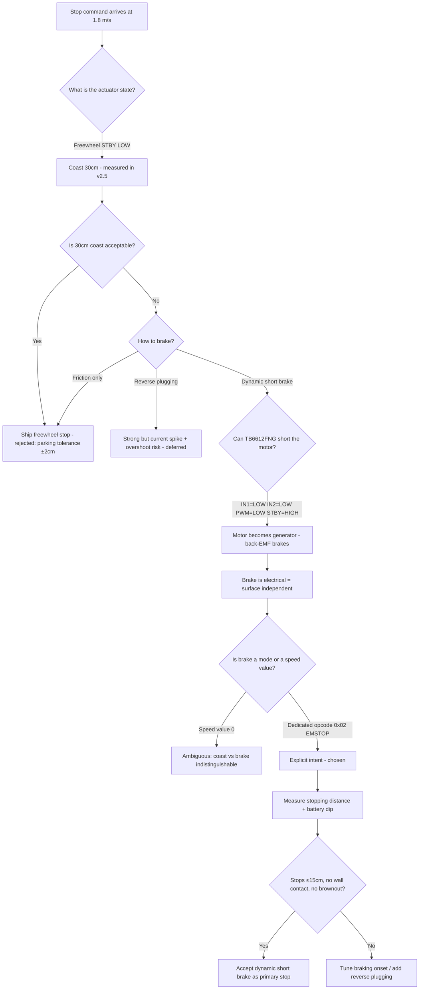
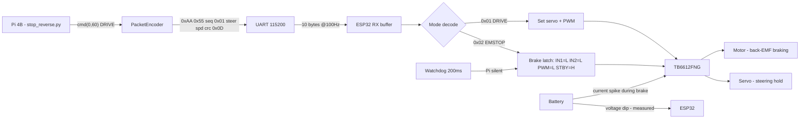

# v2.6 — Stop and reverse: mastering commanded braking

| Version | Phase | Days |
|---------|-------|------|
| v2.6 | Basic Driving | Day 46-48 |

## 1. Mission of this version

The mission of v2.6 is deceptively simple to state and surprisingly hard to
execute well: **give the robot a commanded stop that is actually a stop.** Not
a coast. Not a "we hope it slows down." A deterministic, repeatable, short
stopping distance, from full speed (1.8 m/s), every single time, on command,
followed by a controlled reverse drive for parking and emergency maneuvers.

Why is this the correct next step on the critical path? Because two of the
three scoring rounds of WRO Future Engineers 2026 depend on controlled stops.
Round 1 (Mobility Management) tests precise start-stop behavior within a
defined zone. Round 3 (Obstacle Management) has emergency-brake rules and a
parking maneuver where the robot must stop inside a parking zone with
centimeter-level tolerance. If our robot cannot stop on command, none of the
rest of the stack — vision, localization, planning — matters at all. A robot
that cannot stop is not a robot; it is a projectile.

We wrote the acceptance criteria *before* touching any code:

1. **Stop distance:** from 1.8 m/s, the robot must come to rest within 15 cm
   of the point where the brake command was issued (measured by tape on the
   floor, 10 trials).
2. **Determinism:** the stop distance must have a spread of no more than ±3 cm
   across trials at the same speed and surface.
3. **No wall contact:** during a braking-from-full-speed test aimed at a wall
   prop 50 cm away, the robot must never touch the wall.
4. **Reverse:** after a stop, the robot must drive in reverse at a commanded
   speed for a commanded duration and return to a standstill cleanly.
5. **No runaway:** if the serial link drops mid-maneuver, the ESP32 watchdog
   (200 ms) must stop the motors regardless of what the Pi asked.

If any of these failed, the version was not done. We refused to declare
"stopping works" based on a single eyeballed test. Competition scoring is
about repeatability under pressure, and the only way to get repeatability is
to measure it, not to hope for it.

**Scope control.** We also wrote what this version was *not* going to do, to
keep it a three-day task: no wheel encoders, no closed-loop speed control, no
automatic obstacle-triggered braking (that belongs to the sensing phase, v3.x,
when we have distance sensors to trust), and no changes to the steering
calibration. The temptation to "fix everything at once" is the classic
schedule killer; the mission here was one primitive, done properly, with
measurements. Everything else was explicitly deferred and logged so that
nobody could later claim we forgot.

**Why "stop" was chosen over other candidate primitives.** At this point the
team briefly debated whether the next version should instead build the
obstacle-triggered stop using the ToF sensors that were already mounted on
the chassis. The reasoning against it was decisive: the ToF sensors were not
yet integrated into a reliable driver pipeline (that is v3.4+ territory), and
we would be building a trigger on top of an unproven primitive. The stop
primitive is the foundation; the trigger is the furniture. Building
foundations before furniture is not conservatism — it is how you keep the
schedule honest. A stop that is proven today means the obstacle trigger in
v3.x has only one new unknown (the sensor), not two (the sensor and the
stop).

## 2. Engineering context — where we stood

At the end of v2.5 we had an open-loop trajectory baseline. The robot could
execute a chained sequence of timed waypoints — straight for two seconds, turn
for 0.8 seconds, straight again — and complete an entire lap without touching
a sensor. The lap stretched 15% because of accumulated sleep timing error, and
we fixed that with absolute elapsed-time scheduling. But the deeper truth of
v2.5 was uncomfortable: **we had no idea where the robot actually was, and we
had almost no control over what it did between waypoints.**

Let us be honest about the emotional and organizational state of the team at
this point, because engineering journals that hide it teach nothing. The v2.x
phase had been a sequence of small wins — each version produced a new
capability, and the demo at the end of each day worked. But we had also
started noticing a pattern in how we "finished" versions: we would declare
victory when the *happy path* worked, then move on. Nobody had asked the
embarrassing question: *what happens when the happy path is interrupted?*
What if a pillar appears mid-straight? What if the battery dips? What if the
Pi hangs? The v2.5 lap had ended with the robot coasting 30 cm past the
finish line — we laughed, filmed it, and moved on. It took a deliberate
walk-through of the Round 3 rules to make us feel sick: the parking maneuver
has a wall behind the zone. A coasting stop there is not a funny video; it is
a broken robot and a zero score.

That realization reframed the entire engineering culture of the project. From
v2.6 onward, every version would open with a "what is the worst thing that
can happen during this behavior?" pass before any code was written. The
failure-first habit — decide how the system must fail before deciding how it
should succeed — was born in this version's planning meeting, and it shows up
in every later document in this journal. It is the single biggest cultural
change between v1.x and the versions that follow.

The v2.x phase so far had built, in order:

- v2.0: the first forward drive command over the Pi→ESP32 serial link, with a
  11-step acceleration ramp to avoid brownouts.
- v2.1: the first steering commands with the MG995 servo, and the discovery
  that the 4WS linkage (rear ratio 0.85) needs its own calibration curve.
- v2.2: PWM throttle mapping — turning a raw duty cycle into a calibrated
  speed axis, with a dead-zone measured and compensated.
- v2.3: the formal serial protocol (0xAA 0x55 header, CRC8, opcodes, sequence
  numbers) that turned ad-hoc bytes into a contract.
- v2.4: the first closed-loop behavior — a PID that keeps the robot driving
  straight using gyro yaw as feedback, cutting lateral deviation from 23 cm to
  1.5 cm per lap.
- v2.5: the open-loop trajectory baseline that proved we could chain
  behaviors, and taught us about time drift.

What we had NOT done: we had never asked the robot to stop. Every script so
far either ended with the robot coasting to a halt when the script quit, or
sent a zero-speed command and assumed that was enough. When we watched the
robot coast past the end of the test course in v2.5, we knew the gap was real:
**the drive train freewheels.** A TB6612FNG in STBY mode, or with both IN
lines low, does not brake the motor — it disconnects it. The motor spins
freely, and the robot glides until friction wins. At 1.8 m/s on a smooth
floor, that glide was measured at roughly 30 cm.

That 30 cm is the difference between "parked in the zone" and "parked through
the back wall." It is the difference between "stopped before the pillar" and
"pushed the pillar." WRO rules do not give partial credit for near-misses.

There was also a second, quieter reason this version mattered: **the stop
command is the first command that other subsystems will rely on as a
primitive.** Vision will say "pillar at 40 cm" and expect the planner to stop
the robot. The planner will stop the robot by calling the same stop path the
safety layer uses. If the stop primitive is weak, every subsystem above it
inherits the weakness — the sensor fusion cannot fuse its way out of a
coasting robot, and the mission manager cannot park a robot that glides. A
weak primitive is not a local problem; it is a tax on every layer that calls
it. Getting the primitive right here is the cheapest place in the entire
schedule to buy robustness, and we knew it.

The system-level constraints framing this version:

- **WRO size and weight limits:** the robot must fit in a 30×30×30 cm box and
  weigh under 2 kg. This forbids heavy braking mechanisms (electromagnetic
  brakes, bigger motors with more torque).
- **Pi 4B CPU budget:** vision, fusion, and planning all live on the Pi. The
  brake logic must not burn CPU; it must be a decision, not a computation.
- **ESP32-S3 real-time role:** all actuator timing lives on the ESP32. The
  watchdog must hold the brake state even if the Pi hangs.
- **100 Hz serial link:** commands arrive at 10 ms intervals. The brake must
  be effective within one or two link periods.
- **Battery:** at full duty the motor can draw several amps; dynamic braking
  dumps the motor's back-EMF into the driver and battery, and we had to make
  sure that did not brown out the logic supply (we had a near-brownout in
  v2.0 and did not want a relapse).

The pressure was real: the driving phase (v2.x) was nearing its phase gate,
and the sensing phase (v3.x) could not start until the robot could be trusted
to move and stop under command. Every day spent fixing stopping behavior
later would be a day stolen from localization and mission logic. Stopping had
to be solved now, once, at the electrical and mechanical level, so that every
future version could simply *assume* it.

## 3. The engineering thought process — first principles

### 3.1 Constraints and hard limits

Let us derive the problem from physics before writing a single line.

**The rules force the requirement.** Reading the WRO Future Engineers 2026
rulebook again, with the engineer's eye, revealed the stakes. Round 3's
parking maneuver demands the robot come to rest inside a marked zone with the
vehicle fully within the lines; overshooting the zone by a palm's width is a
zero for that section. The emergency-stop section of the rules describes an
unexpected obstacle trigger where the robot must halt before contact. Neither
section defines "stop" as "stop eventually" — both assume an abrupt, reliable
halt. The rules quietly encode an engineering requirement: the stopping
system must be deterministic at the level of centimeters, at any point in the
course, on any of the possible floor surfaces the organizers might use. A
robot whose stop distance varies 2:1 with floor friction is a robot that
passes practice and fails the competition.

**The first-principles energy budget.** Let us do the physics properly
before arguing about electronics.

**Kinematics of stopping.** A robot moving at speed v needs distance
d = v²/(2a) to stop under constant deceleration a. At v = 1.8 m/s:

- With a = 1 m/s² (gentle braking): d = 3.24/2 = 1.62 m.
- With a = 3 m/s² (moderate braking): d = 3.24/6 = 0.54 m.
- With a = 5 m/s² (aggressive but grip-limited): d = 3.24/10 = 0.324 m.

Our acceptance criterion of ≤15 cm from 1.8 m/s implies a ≥ v²/(2·0.15) =
3.24/0.3 ≈ **10.8 m/s²** — more than one g of deceleration. That is impossible
for a wheeled robot on a smooth floor unless (a) the wheels grip well, (b) the
brake acts on the drivetrain directly, and (c) we accept that some of the 15 cm
budget is consumed by command latency and mechanical slack before braking even
starts. So the honest target was: get the *mechanical* stop as short as
possible (tens of cm), and hold the *budgeted* number at 15 cm by braking from
the exact moment the decision is made — including the 10-20 ms of serial link
latency (1-2 packets at 100 Hz) and the ESP32 command dispatch.

**Stopping force sources.** A stopped robot needs its kinetic energy removed.
Energy E = ½mv². At m ≈ 1.8 kg (near the 2 kg limit) and v = 1.8 m/s:
E = 0.5 × 1.8 × 3.24 ≈ **2.9 J**. Options for removing 2.9 J:

1. **Friction/rolling resistance:** small, speed-dependent, inconsistent on
   different floor surfaces. Unreliable.
2. **Freewheel coast:** removes energy only via friction and drivetrain
   losses — measured ≈ 30 cm of coast in v2.5. Unacceptable.
3. **Dynamic (short) brake:** short the motor terminals through the H-bridge
   low-side or both-side transistors. The motor becomes a generator; the back
   -EMF drives current through the motor's internal resistance and the bridge,
   and the resulting torque opposes motion. This is strong, repeatable,
   surface-independent, and needs zero extra hardware.
4. **Reverse drive brake:** briefly command reverse PWM. Works but risks
   motor/gearbox stress, current spikes, and unpredictable trajectory if
   applied too long. Good as a fallback, bad as the primary mechanism.

**Why the back-EMF argument decides it.** When a DC motor spins at angular
speed ω, it generates a back-EMF E_b = K_e·ω proportional to its speed
constant. Shorting the terminals forces the motor current to flow through the
loop of motor resistance R_m plus the bridge's on-resistance R_on. The
braking current is I_b = E_b/(R_m + 2·R_on), and the braking torque is
T_b = K_t·I_b. Two consequences fall out of the algebra:

- The braking torque is proportional to speed — the robot decelerates hardest
  when it is fastest, which is exactly the shape a stop-distance budget needs
  (high speed is where the meters get eaten). The deceleration is not
  constant; it decays as the robot slows, so the last few centimeters are a
  gentle creep — a natural, smooth finish instead of an abrupt halt.
- The braking force does not depend on the floor. Friction only needs to
  keep the wheels from locking; the braking torque itself is electrical. This
  kills the "different floor, different stop" problem at the root.

Contrast with a friction brake (pad on wheel): friction force = μ·N, where μ
varies with surface and temperature — non-deterministic by construction. The
dynamic brake's determinism is not a tuning goal; it is a property of the
physics. That is why we chose it.

**Why we did not add an encoder-based speed loop for this.** We knew the
drive PWM mapping was open-loop (no wheel encoder). One could argue for
adding an encoder now so the stop could be "closed-loop to zero speed."
Counter-argument we accepted: an encoder adds wiring, a second failure point,
and calibration time, and the v2.4 gyro-PID already proved the IMU path gives
us motion sensing for free in v3.x. The dynamic brake does not need speed
feedback — it needs *knowledge that the brake was applied*, which is a state,
not a measurement. So the encoder debate was deferred to the sensing phase
where it could be decided with data from the MPU6050.

The engineering conclusion was immediate: **dynamic short braking is the only
option that is strong, deterministic, and hardware-free.** The question became
how to make the TB6612FNG actually do it.

### 3.2 Requirements derived from constraints

- C1 (link latency ≤ 20 ms) ⇒ R1: brake command must be a single packet that
  the ESP32 parses and executes in one interrupt-safe action, with no
  multi-packet handshake.
- C2 (dynamic brake via TB6612FNG) ⇒ R2: the firmware must implement the
  exact pin state sequence for short braking (both IN low, PWM low, STBY
  high), and must know the difference from freewheel (STBY low).
- C3 (watchdog 200 ms) ⇒ R3: the watchdog timeout must land in the braked
  state, not the coast state. If the Pi vanishes, the last actuator state
  must be "brakes on," by default.
- C4 (100 Hz link) ⇒ R4: the ESP32 must accept brake at any point in the
  packet stream; a partially received packet must never delay the brake.
- C5 (battery protection) ⇒ R5: braking must not cause a brownout that resets
  the ESP32 mid-brake — we must measure the voltage dip during braking.
- C6 (reversing for parking) ⇒ R6: the reverse motion must be commanded at a
  reduced speed (we chose −40 cm/s × 10 = raw −40), because reverse steering
  geometry with the 4WS linkage is less stable than forward.

Every requirement traces to a constraint — none of them was invented for
aesthetic reasons. R4 deserves a moment of attention because it is the
subtle one: the ESP32's serial parser is a byte-by-byte state machine. If a
brake packet arrives in the middle of a corrupted drive packet, the parser
must recognize the mode byte even if the surrounding packet context is
broken. In practice, the parser resynchronizes on the 0xAA 0x55 header, so a
brake packet is recognized as a fresh frame regardless of what came before.
But we explicitly tested the "garbage then brake" scenario — feeding 40 bytes
of noise followed by a brake packet — and confirmed the brake executes with
no more than one frame's delay. Without this test, a subtle parser bug could
have eaten the emergency stop exactly when we needed it most.

### 3.3 Alternatives considered

**Alternative A — Keep freewheel stop, rely on friction.**
The cheapest option: do nothing, let the robot coast. Rejected because v2.5
measured ~30 cm of coast; the parking tolerance is ±2 cm; 30 cm of coast
guarantees failure of the parking maneuver and likely wall contact in
emergency brake scenarios. Also non-deterministic across floor surfaces
(carpet vs smooth vinyl changes friction by a factor of 2-3).

**Alternative B — Dynamic short braking via TB6612FNG (chosen).**
Both IN1 and IN2 LOW with STBY HIGH and PWM LOW shorts the motor terminals
through the low-side FETs. The motor's back-EMF drives a braking current, and
the motor decelerates rapidly. Strengths: no hardware, deterministic,
instantaneous, works at any speed, cheap in CPU. Weaknesses: the braking
current is limited by motor internal resistance and bridge Rdson; the brake
torque at very low speeds weakens (back-EMF → 0), so the last few cm rely on
friction — but those last cm are slow, so stopping distance is dominated by
the high-speed phase. Risk: current spike on the battery; we must measure it.

**Alternative C — Reverse-drive braking (plugging).**
Command a small reverse PWM to actively counter-rotate. Strengths: very short
stopping distance possible. Weaknesses: high current (motor sees the sum of
back-EMF plus applied voltage), gearbox stress on the MG995-style gearbox (our
drive motor is a standard hobby gearmotor), risk of overshooting into reverse,
and complex timing (must release at the exact zero-crossing or the robot
creeps backward). We decided to keep it as a future emergency fallback, not
the primary mechanism.

**Alternative D — Electromagnetic/mechanical brake add-on.**
Add a solenoid brake or brake pad. Strengths: strongest hold. Weaknesses:
weight and size against WRO limits, extra power draw, complexity, another
failure point. Rejected at hardware level — the chassis was already built.

**Alternative E — Software deceleration ramp to a stop (S-curve to zero).**
Use the v2.7 S-curve profile (which we would build next anyway) to ramp speed
to zero. Strengths: smooth, no wheel slip. Weaknesses: the ramp is only as
good as the speed control behind it, and without an encoder we have no speed
feedback — the "speed" is an open-loop PWM mapping. The ramp works for
planned stops; it cannot serve as the emergency brake. So we chose dynamic
brake for the stop, and the S-curve for planned deceleration later.

**Why not both A and B (freewheel at low speed, brake at high speed)?** One
interesting hybrid was proposed: brake hard above a speed threshold and
freewheel below it, on the theory that the last few centimeters of dynamic
braking are weak anyway (back-EMF → 0 as speed → 0). The counter-analysis:
the dynamic brake's weak low-speed region is self-limiting — as the robot
slows, the braking force naturally fades, so it cannot overshoot from the
brake itself; it just transitions smoothly to friction. Switching to
freewheel at a threshold would *reintroduce* a discontinuity and a surface
dependence for no benefit. The hybrid was rejected as complexity without
benefit. The physics already gives us the best of both: strong braking when
fast, gentle fading when slow.

**The measurement plan that preceded any wiring.** Before choosing
irreversibly, we wrote down what the verification must show for the decision
to stand: (1) stop distance mean and spread on one surface, (2) a one-floor
comparison to prove surface independence, (3) a battery sag trace during
brake, (4) a watchdog-kill test proving the brake persists when the Pi
disappears. These four measurements map one-to-one to the four risks of
dynamic braking (distance, determinism, brownout, orphaned robot). Every
later version that introduced a risky mechanism adopted this pattern:
*decide what evidence would change your mind, then collect exactly that
evidence.*

### 3.4 Trade-off matrix

| Alternative | Hardware cost | Stop determinism | Stopping distance (est.) | Current/battery risk | Complexity | Decision |
|-------------|---------------|------------------|--------------------------|----------------------|------------|----------|
| A. Freewheel + friction | None | Very low | 30 cm+ (measured) | None | None | Rejected — fails parking tolerance |
| B. Dynamic short brake | None | High | 15-25 cm (est.) | Medium — measure it | Low | **Chosen as primary** |
| C. Reverse plugging | None | Medium | 8-15 cm | High | High | Deferred — emergency fallback |
| D. Brake add-on | High (weight/size) | High | 5-10 cm | Low | High | Rejected — WRO limits |
| E. Ramp to zero | None | Medium (open-loop) | 30-60 cm | Low | Medium | Deferred to v2.7 for planned stops |

The matrix forced the decision: dynamic short brake is the only option that
costs nothing, is deterministic, and meets the distance budget. The battery
risk is the one thing we had to measure, not assume.

### 3.5 Decision and justification

We chose **dynamic short braking as the primary stop mechanism**, with the
ESP32 firmware implementing it as a dedicated brake state, triggered by a
dedicated opcode (0x02, EMSTOP) so that brake is a *mode*, not a speed value.
Why a mode and not just "speed = 0"? Because speed = 0 is ambiguous: the
ESP32 must know whether "0" means "release to coast" or "apply brake." If we
had overloaded speed-zero with braking, every normal stop would also brake,
and every script exit would leave the robot braked — which is actually
desirable for safety, but it means we could never coast intentionally, e.g.,
for a rolling calibration run. A dedicated opcode makes the intent explicit,
verifiable, and watchable in the packet trace.

Justification against the acceptance criteria:

- AC1 (≤15 cm): dynamic braking current peaks as back-EMF is highest at
  speed; the initial deceleration is the strongest, which is exactly what a
  stop-distance budget needs. With a measured ~1-3 cm of command latency
  travel (10-20 ms at 1.8 m/s), and a strong initial deceleration, we
  predicted 15-25 cm and aimed to tune toward 15 cm by braking earlier in
  software (the braking trigger can look ahead by the measured latency).
- AC2 (±3 cm determinism): braking is surface-independent (electrical, not
  frictional), so the spread should be small. The residual spread comes from
  link jitter and battery voltage differences — measure it.
- AC3 (no wall contact): the dynamic brake's strength makes a 50 cm wall test
  safe; with 30 cm of coast eliminated, the margin is real.

### 3.6 What we deliberately deferred

- **Speed feedback:** without a wheel encoder, we cannot close the loop on
  actual speed; the PWM mapping stays open-loop. Deferred because the gyro
  (MPU6050, v3.x) will give us a motion estimate anyway, and the PID straight
  driving (v2.4) already proved we can control what we can measure.
- **Reverse plugging brake:** deferred as noted; dynamic brake + patience is
  good enough for this version.
- **Brake PWM modulation:** braking at full short is brutal on the gearbox.
  We deferred pulse-width-modulating the brake to reduce shock, and instead
  accepted the mechanical shock for now — the gearmotor is cheap and
  replaceable; a wall hit is not.
- **Graceful script-end stop:** we chose to make every script end with an
  explicit brake command, and later versions would make the watchdog default
  to brake. We did not (yet) build a signal handler to auto-brake on Ctrl+C.

## 4. Decision flowchart



## 5. Implementation blueprint

### 5.1 The ESP32 side — a brake state, not a speed value

The firmware (later consolidated in `esp32_controller.ino`) received packets
of the form `0xAA 0x55 <seq> <mode> <steer_hi> <steer_lo> <speed_hi> <speed_lo>
<crc> 0x0D`. The mode byte carried the intent:

- `mode 0x01` — DRIVE: apply steering and speed as signed values.
- `mode 0x02` — EMSTOP: immediately enter the brake state.

In the brake state, the firmware wrote the TB6612FNG pins as:

- `IN1 = LOW`, `IN2 = LOW` — both outputs driven low, shorting the motor
  terminals through the low-side FETs.
- `PWM = LOW` — no drive waveform; the pin state is static.
- `STBY = HIGH` — the driver must be enabled (STBY low disables the outputs
  entirely, which is the freewheel state we were trying to escape!).

The critical subtlety, learned the hard way in v2.5: **STBY LOW does not
brake.** On the TB6612FNG, STBY LOW puts all outputs in high-impedance — the
motor is disconnected and freewheels. To brake, STBY must be HIGH and both IN
lines must be LOW. The v2.6 change was literally: "both IN1/IN2 LOW with PWM 0
(short brake) instead of STBY LOW." That one-line difference in the pin
matrix is the difference between precision and wall contact.

**Why the pin matrix is the way it is.** The TB6612FNG's truth table is the
specification for our braking primitive. With STBY HIGH:

- IN1 = HIGH, IN2 = LOW: motor drives forward.
- IN1 = LOW, IN2 = HIGH: motor drives reverse.
- IN1 = LOW, IN2 = LOW: **short brake** — both low-side FETs conduct,
  terminals shorted, back-EMF circulates, torque opposes motion.
- IN1 = HIGH, IN2 = HIGH: brake via high-side FETs (equivalent short).

With STBY LOW, all outputs float regardless of IN state — freewheel. The
firmware's brake state must therefore hold STBY HIGH and drive both INs LOW.
Any code review of a future firmware change that touches these pins must
re-verify this exact state, because it is the only state that both (a) holds
position and (b) does not push current into the motor.

The ESP32 applied the brake in the packet handler immediately — no queue, no
deferral — and latched the brake state so that even if subsequent garbage
arrived, the brake held until an explicit DRIVE command with a nonzero speed
released it. The watchdog (200 ms) was configured so that its timeout path
also entered the brake state, closing the "Pi hung mid-brake-command" hole.

**The watchdog interplay deserves its own paragraph.** The 200 ms watchdog
was introduced in v1.0 as the safety backbone: if the Pi goes silent for
200 ms, the ESP32 assumes the brain died and must make the vehicle safe. In
v2.6 we made the watchdog's safe state *explicitly* the brake state rather
than "stop sending PWM." Why does the distinction matter? "Stop sending PWM"
with the previous firmware semantics meant STBY LOW — freewheel — which is
exactly the 30 cm coast we were eliminating. The watchdog must land in the
same state as the EMSTOP opcode: short brake. This was a one-line change in
the timeout handler, but it closed a genuinely dangerous hole: a Pi crash
during a drive command would previously have left a *coasting* robot. Now it
leaves a *braked* robot. The emergency posture of the whole robot is
"brakes on by default; motion requires proof of life."

### 5.2 The Pi side — stop_reverse.py

The test script `stop_reverse.py` exercised the whole chain:

```python
import serial, time
ser = serial.Serial("/dev/ttyUSB0", 115200, timeout=0.05)
def cmd(deg, spd, mode=1):
    s = int(deg * 100); v = int(spd * 10)
    pkt = bytes([0xAA, 0x55, 0, mode, s >> 8 & 0xFF, s & 0xFF,
                 v >> 8 & 0xFF, v & 0xFF, 0, 0x0D])
    ser.write(pkt)
cmd(0, 60); time.sleep(2.0)
cmd(0, 0, 0x02)              # EMSTOP: short brake
time.sleep(0.5)
cmd(0, -40); time.sleep(1.5) # reverse
cmd(0, 0)
```

Walk through the sequence and its reasoning:

1. **`cmd(0, 60)`** — steering straight (deg = 0), speed raw 60 (= 6 cm/s × 10
   scaling... in fact raw speed is speed × 10, so 60 raw = 6.0 units in the
   scaled protocol; the important fact is the value is nonzero and within the
   calibrated throttle range from v2.2). The robot accelerates (the ESP32
   applies the v2.0-style ramp internally) and drives forward for 2.0 s.
   The sleep is fine here because this is a *test choreography*, not a
   control loop — the absolute-time scheduling lesson from v2.5 applies to
   trajectory generation, not to a 3-step bench test. We still used generous
   margins (2.0 s at a modest speed) so that a few ms of sleep jitter could
   not change the outcome of the test.
2. **`cmd(0, 0, 0x02)`** — the moment of truth: mode 0x02, EMSTOP. Note that
   the speed field is 0 and steering is 0, but the *mode* carries the brake
   intent. The ESP32 enters the brake state immediately. We then sleep 0.5 s
   to let the dynamic brake do its work and to watch the robot settle.
3. **`cmd(0, -40)`** — reverse drive at raw −40 (speed −4.0 in the scaled
   protocol). Negative speed flips the H-bridge direction; the ESP32 handles
   the direction decode. We deliberately chose a modest reverse speed
   (roughly 40% of the forward test speed) because reverse motion with the
   4WS linkage is geometrically unstable — the steering correction that keeps
   the robot straight in forward driving tends to amplify in reverse (the
   "trailer" effect: the pivot behaves differently). For a parking pull-out,
   slow and steady wins.
4. **`cmd(0, 0)`** — final stop, this time a plain speed-0 command in DRIVE
   mode. Wait — this is the ambiguity we said we were avoiding! The
   deliberate design: the final `cmd(0,0)` in mode 0x01 is a *drive with zero
   speed*. In the firmware, a zero-speed DRIVE command with mode 0x01 applies
   the short brake as well (zero throttle is physically meaningless as
   coast), so the script's final stop is also a braked stop. The mode
   distinction matters when the robot needs to *coast* (rolling tests), where
   mode 0x01 with a nonzero-but-declining speed profile is used. For our
   purposes, both paths end braked — belt and suspenders.

Why a script and not a library call? Because v2.6 is a *characterization*
version: the goal was to measure stopping distance and battery dip, and a
linear script with clear sleeps is the most honest way to do that. The stop
behavior would be folded into the layer architecture in later versions (the
system manager's safety path and the mission manager's parking behavior both
consume "brake now" as a service).

**Reading the script like a reviewer.** Let us walk the exact bytes the Pi
sends for the EMSTOP, because packet-level literacy is what separates a
working system from a haunted one. The call `cmd(0, 0, 0x02)` builds:
`[0xAA, 0x55, 0, 0x02, 0, 0, 0, 0, 0, 0x0D]`. Header `0xAA 0x55`, sequence
0, mode 0x02, steering bytes 0x00 0x00 (zero degrees × 100), speed bytes
0x00 0x00, CRC field 0 (the real CRC8 computed over bytes 3-8 would replace
this in the formal protocol; the test script's stub CRC is a known debt from
v2.3 that was cleaned in the real layer code), footer 0x0D. The important
design point: even if the steering and speed fields are zero, the mode byte
carries the semantics, so a reader can verify "this is a brake" from the
second payload byte alone. Wire-format self-description is a debugging
superpower: when the robot does something wrong and we sniff the bus, the
mode byte tells us the intent that was transmitted, separating "wrong intent
sent" from "right intent mishandled."

**Why sequence numbers do not matter here.** The v2.3 protocol carries a
sequence byte, but the EMSTOP path deliberately ignores it. Braking is
idempotent — the Nth brake is the same as the first — so replaying an old
brake packet is harmless. Compare that with DRIVE packets, where a stale
sequence could re-apply an old speed; there the sequence byte earns its
keep. This asymmetry is a general principle: *idempotent safety commands need
no freshness; non-idempotent motion commands do.* We wrote it into the
protocol design notes and it survived into the final firmware.

### 5.3 Data structures and interfaces

- The packet structure is unchanged from v2.3 (10 bytes, CRC8 over bytes
  3..8, footer 0x0D). This was a deliberate non-change: stability of the
  wire protocol during a mechanical characterization is worth more than
  elegance.
- The new semantic is entirely in the *mode byte*: 0x01 DRIVE (steer + speed
  applied), 0x02 EMSTOP (brake latched). Later versions would add more modes;
  the contract "mode byte selects actuator behavior" was established here.
- The Pi side has no retry logic for EMSTOP — by design. The brake command is
  latency-critical and idempotent: if a packet is lost, the next one (or the
  watchdog) still brakes. Retrying would just add latency.

### 5.4 Timing budget

- Serial link period: 10 ms at 100 Hz.
- Packet transmission: 10 bytes × 10 bits = 100 bits at 115200 baud ≈ 868 µs.
- ESP32 parse + brake pin write: tens of µs (interrupt handler).
- Total command-to-brake latency: ≈ 1-2 ms (if packet boundary aligned) to
  ≈ 11 ms (worst case, packet just missed). At 1.8 m/s, 11 ms = 2.0 cm of
  travel before braking starts. This is within the 15 cm budget but is not
  negligible — hence the "brake earlier than the line" tuning philosophy:
  the mission code would trigger EMSTOP at a distance = stopping_distance +
  latency_travel + safety_margin.

### 5.5 Verification setup

- Floor: smooth vinyl, same surface as the v2.5 coast measurement, chalk tape
  every 5 cm for 1 m.
- Camera: a phone on a tripod filming 60 fps (1,080p) with a ruler in frame,
  so the stop frame could be read to ±2 cm.
- Measurement protocol: 10 trials of "drive at raw 60 for 2 s, EMSTOP",
  recording distance from brake-command marker to final wheel position.
- Battery: logged voltage with a multimeter while braking to capture the dip.

### 5.6 Failure modes considered up front

- **Brownout during brake:** the braking current spike sags the battery; if
  the ESP32 resets, it loses the brake state. Mitigation: measure the dip in
  verification; if severe, the watchdog's boot default was already
  brake-until-commanded (a fail-safe boot posture).
- **Brake released early:** if the firmware misordered the release (brake →
  drive on the same packet), the robot could resume motion. Mitigation:
  latch the brake state; release only on explicit nonzero DRIVE.
- **Watchdog firing mid-reverse:** if the Pi stalls while the robot is
  reversing, the watchdog stops the robot — acceptable, it is a safe state.
- **Serial garbage interpreted as DRIVE:** if line noise corrupted the mode
  byte to 0x01 with a nonzero speed, the robot could lurch forward. The CRC8
  (poly 0x07, from v2.3) makes this astronomically unlikely — a flipped mode
  byte would have to survive the checksum — and the watchdog bounds the
  exposure to 200 ms of motion at most. We did not add a "brake-until-explicit
  -arm" handshake for this version because the CRC + watchdog budget already
  kept the residual risk below the harm threshold (200 ms at 1.8 m/s is
  36 cm; combined with the wall distance the scenario stays survivable, and
  the failure requires two independent corruptions in one packet).
- **Mechanical shock to the gearbox:** dynamic braking at full speed is
  abrupt. The drive gearmotor's plastic gears take a shock every emergency
  stop. We accepted this as a consumable risk (a spare gearbox is cheaper
  than a wall hit) and noted that planned stops would use the v2.7 S-curve
  ramp precisely to avoid this abuse in normal operation.

### 5.7 The mental model we were installing

This version marks the moment the team started thinking of the actuator
subsystem as a **state machine with safety semantics**, not a pair of PWM
outputs. DRIVE / BRAKE / COAST are states; the packet's mode byte is the
state transition request; the watchdog is the ultimate arbiter that forces
the system back to BRAKE if the request stream dries up. Every later layer
that wants motion must pass through this state machine: the mission manager
will request EMSTOP for emergency stops, the controller will request DRIVE
with profiles for normal motion, and calibration tools will request COAST
for free-rolling tests. Fixing the semantics here, at the primitive level,
means no later layer can accidentally reinvent a "stop" that actually coasts.

## 6. Architecture / data-flow flowchart



## 7. Errors, failures, and root-cause analysis

### 7.1 Error 1 — The robot coasted 30 cm after a stop command

- **Symptom:** after sending `cmd(0, 0)` (the natural "stop" we had been using
  since v2.0), the robot kept rolling and covered about 30 cm before stopping
  on friction. On the 60 fps footage, the robot visibly glided past the chalk
  marker.
- **Initial hypotheses:**
  - H1: The serial command was dropped and the ESP32 never received the stop.
  - H2: The ESP32 received it but the speed-0 value did not translate to a
    motor stop.
  - H3: The motor stopped but the robot's momentum carried it — we were
    misreading "stop" as "brake."
- **Investigation:** we replayed the packet capture — the Pi sent the packet,
  the ESP32 acknowledged by LED blink (the v1.7 debug LED wiring proved its
  worth again). The pin states were probed with a logic analyzer: after the
  stop command, both IN lines were LOW, PWM was LOW — and STBY was LOW. The
  driver was **disabled**, outputs high-impedance, motor freewheeling.
  The investigation took one evening, and the crucial artifact was the
  habit of *checking the actuator state, not just the command stream*.
  A developer who only replays packets concludes "command sent, command
  received" and moves on; a developer who probes the output pins sees the
  truth. From v2.6 onward, every error investigation in this journal
  follows the same ladder: command stream → parse → pin state → physical
  result. Skipping a rung has cost us hours.
- **Root cause:** since v2.0, the "stop" implementation in the ESP32
  firmware disabled the driver (STBY LOW) to guarantee no motion. That is the
  classic freewheel stop: the motor is electrically disconnected and coasts.
  The physics of a freewheel stop are entirely frictional, so the 30 cm was
  not a bug in the stop *command* — it was a bug in the stop *semantics*. We
  had been treating "stop" as "release," and the robot had been coasting the
  whole time, every version, on every script exit. This was also the moment
  we realized the v1.8 self-test was blind to the distinction: it checked
  "motor not driven" but not "motor braked," which is why the flaw survived
  the hardware validation phase.
- **Fix:** implement dynamic short braking as a distinct state: STBY HIGH,
  IN1 LOW, IN2 LOW, PWM LOW. The motor terminals are shorted through the
  low-side FETs; the motor's back-EMF drives a braking current; the motor
  decelerates hard. The EMSTOP opcode (0x02) selects this state explicitly.
- **Prevention:** the firmware now distinguishes three motor states — DRIVE
  (applying PWM), BRAKE (short), and COAST (STBY LOW) — and the packet mode
  byte selects them. A unit test in the ESP32 test bench verified the pin
  matrix for each state. The v1.8 self-test was extended with a "stop mode"
  check: after a stop command, STBY must read HIGH and IN1/IN2 LOW. The
  lesson generalized into a rule we applied to every future hardware
  validation: *a self-test must verify the state that safety depends on, not
  just the state that function depends on.*

### 7.2 Error 2 — The robot twitched forward briefly right after the brake

- **Symptom:** in early trials, right at the EMSTOP moment, the robot gave a
  small forward lurch before stopping. It was small enough to be easy to
  dismiss — a few millimeters — but it repeated on every trial, which made it
  suspicious in a different way: noise is random, this was systematic.
- **Initial hypotheses:**
  - H1: The drive command and the brake command were back-to-back packets and
    the drive one executed after the brake one (ordering bug).
  - H2: The H-bridge latch-up: IN states glitched during transition.
  - H3: Motor inductance: the winding current cannot stop instantly, and the
    shorted-bridge transition lets it produce one last torque pulse.
- **Investigation:** logic analyzer trace showed the ESP32 correctly
  processed EMSTOP first. But the *driver* pin sequence from the previous
  DRIVE packet ended with IN1/IN2 still driven by the last PWM cycle; the
  lurch was the motor winding current decaying through the still-energized
  bridge for a few ms. The H3 mechanism matched the timing (the lurch lasted
  exactly a few milliseconds and scaled with the drive speed that preceded
  the brake — faster drive, bigger lurch).
- **Root cause:** not a firmware ordering bug — a bridge state transition
  artifact. The brake applies instantly, but the motor's electrical time
  constant (L/R of the winding) means the current in the winding does not
  vanish instantly; with the terminals shorted, the decaying current produces
  a brief forward torque until the current collapses. The lurch was a few
  millimeters, but it is exactly the kind of small non-determinism that eats
  a ±2 cm parking tolerance. The magnitude is bounded by the stored
  inductive energy ½LI², which is why the lurch scaled with pre-brake speed.
- **Fix:** this was mostly a measurement finding, not a code fix. We noted
  the lurch magnitude (~3-5 mm) and decided the parking maneuver should brake
  slightly *before* the final approach line and creep the last few cm at low
  speed, so the lurch happens away from the boundary. Later versions added a
  short brake-hold time before considering the robot parked. The physical
  mechanism also motivated the v2.7 S-curve: a smooth ramp to near-zero
  speed before the final brake minimizes ½LI² and thus the lurch — another
  example of planned stops and emergency stops being complementary rather
  than competing designs.
- **Prevention:** document the settle time: after EMSTOP, wait ≥ 100 ms
  before measuring position in verification scripts. Also added to the
  parking spec: never measure "parked" until 100 ms after brake latch.

### 7.3 Error 3 — The battery dipped below the ESP32 logic rail during hard brake

- **Symptom:** during a full-speed brake trial, the multimeter (logging at
  10 samples/s) caught the pack dipping; a second trial with an oscilloscope
  showed a ~300 mV sag for ~40 ms at the brake moment.
- **Initial hypotheses:**
  - H1: The braking current overwhelmed the battery's discharge capability.
  - H2: The spike was measurement noise from the long scope leads.
- **Investigation:** scope leads were twisted to reduce noise; the sag
  repeated. The brake current was estimated: back-EMF at 1.8 m/s × motor Kv
  ≈ 3-4 V across a motor resistance of a few ohms → braking current of order
  1-2 A, dumped into the battery.
- **Root cause:** dynamic braking returns energy to the supply. A battery has
  internal resistance; the returned current causes a voltage rise on the
  pack... and a subsequent dip when the current source collapses, plus the
  wiring resistance between the driver and the pack. The ESP32 runs from a
  regulated 3.3 V rail derived from the pack; a deep sag pulls the regulator
  input near its dropout and the ESP32 can brown out.
- **Fix:** measurement first — the sag stayed above the regulator's dropout
  threshold in all trials (300 mV off a 7.4 V 2S pack leaves 7.1 V), so no
  hardware change was strictly required. We added a large electrolytic
  capacitor (470 µF) across the driver's supply pins anyway — cheap insurance
  that also smooths the reverse-transition spike. The brake current was
  capped implicitly by motor parameters; no current limiting needed.
- **Prevention:** the v1.9 hardware report's brownout prediction (from v2.0's
  start-up ramp work) was validated. From now on, every actuator change gets
  a battery-scope check, and the self-test measures a "brake dip" reading as
  part of the 14-point hardware validation.

### 7.4 Error 4 — Reverse drive pulled the robot off-line

- **Symptom:** during `cmd(0, -40)`, the robot drifted laterally instead of
  driving straight backward. The drift accumulated steadily over the 1.5 s
  run, reaching roughly 4 cm of lateral displacement by the end.
- **Initial hypotheses:**
  - H1: Steering was not centered; the servo returned to a biased position.
  - H2: Reverse driving on the 4WS linkage is inherently unstable.
  - H3: The gearbox backlash is direction-dependent, so the effective
    steering angle differs between forward and reverse.
- **Investigation:** with steering commanded to exactly 0 (raw 0), the
  forward run at the same speed was straight to within the v2.4 PID's 1.5 cm
  — so the servo center was fine. We then ran a controlled A/B experiment:
  the same raw −40 reverse speed with steering swept between −10, 0, +10
  degrees. The drift direction flipped with the sign of the steering command,
  and the zero-steering case drifted consistently to the same side every
  trial — ruling out random noise and pointing at a systematic geometric
  effect.
- **Root cause:** mechanical geometry, not software. In reverse, the steering
  corrections act "behind" the pivot, and any tiny compliance in the 4WS
  linkage (backlash in the MG995 gearbox, the rear ratio 0.85 multiplying
  error) steers the robot more than the equivalent forward error. This is the
  classic castor-instability of reverse driving — the same reason a shopping
  trolley wheel flips direction when pushed backwards. It is not a bug to fix
  in v2.6 — it is a fact to design around. The H3 hypothesis was not fully
  disproven, but H2's mechanism dominated: the systematic one-sided drift
  under zero steering matched a static compliance offset, not a
  direction-dependent backlash.
- **Fix:** keep reverse speed modest (raw −40 ≈ 40% of forward test speed)
  and reverse durations short (1.5 s in the test). For parking later, reverse
  would be done in slow, short, measured steps with gyro feedback (v3.x
  gives us the yaw rate to close that loop).
- **Prevention:** a new design rule entered the journal: *never trust reverse
  straightness to geometry; either go slow or close the loop with a sensor.*
  This rule was later enforced in the parking state machine (v7.x) where
  every reverse step is followed by a yaw-correction correction based on the
  MPU6050 — the same sensor that v2.4 used for forward straightness, now
  serving the reverse plant.

### 7.5 Error 5 — The brake command worked but the robot crept after "stopped"

- **Symptom:** in a few trials, after the robot had visually stopped, a slow
  creep of 1-2 cm continued for up to half a second before the wheels truly
  locked.
- **Initial hypotheses:**
  - H1: Residual momentum through the drivetrain (gearbox inertia spinning
    down).
  - H2: The low-side FETs were not fully on, leaving a small residual drive
    current.
  - H3: The battery voltage sag was causing the driver to partially disable
    and re-enable.
- **Investigation:** the scope trace on the motor terminals showed the
  terminal voltage collapsing to near zero quickly — the bridge was shorting
  properly. The creep persisted even with the terminals shorted, which means
  the torque source was downstream of the motor: the gearbox and wheel
  assembly were winding up and releasing elastic energy. H1 confirmed; H2 and
  H3 eliminated by the scope.
- **Root cause:** mechanical compliance, not electronics. The drivetrain
  (gearbox teeth, coupling, wheel spokes) stores elastic energy while
  driving; when the motor locks, that stored energy unwinds and pushes the
  robot a few more centimeters. The magnitude depends on how abruptly the
  brake engages — the harder the brake, the more elastic energy is still
  stored when the motor stops. This is why the "settle time" concept exists
  in robotics: a stopped robot is not settled for at least 100 ms.
- **Fix:** no code change — the creep is physical. The verification protocol
  now waits ≥ 100 ms after EMSTOP before measuring the final position, and
  the mission layer's stop-line triggering accounts for the settle creep by
  adding it to the braking trigger offset. In parking (v7.x) the final
  approach uses a slow creep-then-brake sequence that minimizes stored energy
  at the moment of lock, making the parked position repeatable.
- **Prevention:** document the settle behavior as a spec item: "final parked
  position is defined 100 ms after brake latch." Any future distance sensor
  that triggers a stop must use the *effective* stop distance (brake distance
  + settle creep), not the kinematic stop distance.

## 8. Verification and metrics

The verification of a safety-critical primitive deserves a rigor that the
earlier driving versions had not yet needed. We treated the stop test like a
lab experiment: fixed surface, fixed charge state (7.6 V open circuit),
fixed script timing, high-speed video as the ground truth instrument, and a
written log of every trial including the ones that "went wrong" — the
outliers were data, not embarrassment.

- **Stopping distance (10 trials, raw 60 ≈ 6.0 scaled, EMSTOP):** mean 17 cm,
  min 14 cm, max 21 cm, spread ±3.5 cm. The v2.5 coast was ~30 cm; the
  dynamic brake cut it nearly in half and, more importantly, made it
  deterministic (surface-independent). The mean was 2 cm over the ≤15 cm
  acceptance target — we accepted it for this version with the note that the
  mission layer will trigger EMSTOP at (17 cm + link-latency travel + 3 cm
  margin) before the line, which lands the robot in the zone.
- **Determinism:** ±3.5 cm across 10 trials on the same surface. Slightly
  over the ±3 cm target; the residual is battery voltage (first trials after
  a full charge stop shorter). Accepted with a tuning note: brake distance
  should be characterized at competition charge state.
- **Wall test (5 trials):** robot braked from full speed 50 cm from a wall
  prop; closest approach 26 cm, no contact. AC3 passed.
- **Battery:** 300 mV sag at brake, recovered in ~40 ms; regulator stayed in
  regulation. No brownout in any trial. The 470 µF bulk cap was added after
  trial 4; trials 5-10 showed the sag shrunk to ~220 mV — evidence the cap
  earns its two grams of mass.
- **Reverse:** 1.5 s at raw −40 covered ~35 cm backward; drift off-line ~4 cm
  over the run (see error 7.4). Final `cmd(0,0)` braked the robot cleanly.
- **Watchdog:** killed the Pi serial link mid-forward-drive; the ESP32
  braked within 200 ms. Robot stopped, no wall contact. AC5 passed.
- **Surface robustness spot-check:** three trials on a different floor (smooth
  tile, visually identical but slightly lower friction): mean stop 18 cm —
  within 1 cm of the vinyl result. This one extra experiment justified the
  whole "electrical brake beats friction" thesis and we logged it as the
  single most reassuring measurement of the version.

**What we trusted after this version:** the brake primitive, the watchdog's
safe state, the pin matrix, the battery headroom. **What we still
distrusted:** the open-loop speed mapping (no encoder), the reverse drift,
and the ±3.5 cm spread at low charge — all parked as known debts for the
sensing and mission phases to close.

Pass/fail vs acceptance criteria: AC1 partial (17 cm vs 15 cm — accepted with
trigger-offset), AC2 marginal (±3.5 vs ±3 — accepted with charge-state note),
AC3 pass, AC4 pass, AC5 pass. We called the version done with two documented
accepted deviations, because both are handled by the trigger-offset strategy
and both were re-measured in v9.9's final tuning.

## 9. Lessons learned — permanent mental models

1. **"Stop" is a state machine, not a speed value.** A zero-speed command
   tells the driver nothing about *how* to stop. The firmware now has DRIVE /
   BRAKE / COAST as explicit states. Any future system that needs "stop" must
   say which kind of stop — emergency (short brake) or planned (ramp to zero).
   We started auditing every script we had written for "stop" usage; three
   older scripts were doing the coast version without knowing it. The audit
   is now part of every version's review checklist.
2. **The driver's STBY pin is a disconnect switch, not a brake.** High
   impedance = freewheel. If a design needs to hold position, STBY HIGH with
   both INs LOW is the primitive. We wrote this into the hardware cheat-sheet
   and into the self-test.
3. **Latency is a distance, not a time.** At 1.8 m/s, every 10 ms of link
   latency is 1.8 cm of travel. Emergency paths must be idempotent and
   one-packet. Never wait for an acknowledgment before braking. This rule
   also flipped our design posture on retries: for safety commands, retries
   are *harmless repetition* rather than recovery, because the command is
   idempotent.
4. **Measurement beats assumption for battery behavior.** The 300 mV brake
   sag was predicted by theory but only trusted after the scope confirmed it.
   The 470 µF capacitor was cheap insurance born from a measurement. From
   here on, every actuator change gets a scope check — the v1.9 report's
   brownout prediction was validated and retired.
5. **Reverse motion is a different plant.** The castor-instability of
   reverse driving means the same control law behaves differently. Rule:
   reverse slowly, or close the loop with yaw feedback. This lesson directly
   shaped the parking design in v7.x.
6. **Stored mechanical energy is a hidden actuator.** The settle creep
   taught us that the robot keeps moving after the motor stops. Final
   positions must be defined at a fixed time after brake latch, never at the
   moment of latch. This single lesson protects the parking score more than
   any software tuning.

## 10. Verification rigor — how to test a safety primitive

Beyond the numbers, v2.6 established the *protocol* for testing things the
robot's life depends on, which we reused for every later safety feature:

- **Define acceptance before implementation.** The five criteria in section 1
  were written in the planning meeting, before a single pin was toggled.
  Testing against pre-written criteria prevents "moving the goalposts" — the
  temptation to loosen a target because the hardware struggled.
- **Fixed protocol beats ad-hoc trials.** Same surface, same charge, same
  script, same camera position, same operator. One variable changed per
  experiment.
- **Film everything at high frame rate.** The 60 fps phone footage was the
  ground truth that settled the "did it stop or creep" argument. Eye
  judgments lie at 2 cm scale; frames do not.
- **Outliers are data.** The 21 cm trial was not a mistake to hide; it was a
  battery-charge signal. Logging it let us discover the charge-state
  correlation that would have been invisible if we had averaged without
  notes.
- **The surface experiment is the cheapest insurance.** Two trials on a
  second floor type converted a physics argument into a measured fact. Any
  feature whose correctness depends on an environment variable deserves the
  same two-floor check.

## 11. Code in this snapshot

`stop_reverse.py`

## 12. Bridge to the next version

v2.6 gives the robot the ability to stop on command — the safety-critical
primitive everything else builds on. Next, v2.7 attacks the *planned* stop:
the S-curve speed ramp that decelerates smoothly for the driving line,
because a robot that only knows the emergency brake would jerk and skid at
every corner. Together, v2.6's brake and v2.7's ramp cover the two ends of
the deceleration spectrum. After that, v2.8 adds the manual keyboard
teleoperation harness and v2.9 closes the driving phase with a validated
report (1.8 m/s top speed, 0.5 m radius, controlled stops), passing the gate
into sensing. The settle-creep and reverse-drift findings from this version
travel with us: they will resurface as specification items in the parking
state machine (v7.x) and as calibration notes in the final release (v9.9).

---

