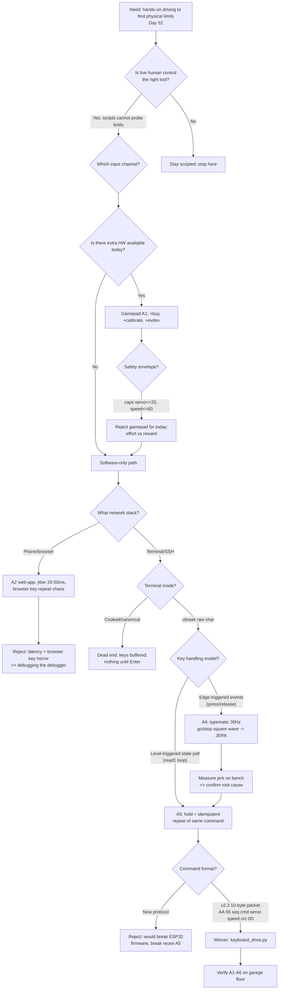

| Version | Phase | Days |
|---------|-------|------|
| v2.8 | Basic Driving | Day 52-54 |

# v2.8 — Keyboard remote control

---

## 3. Mission of this version

The single problem this version attacks is embarrassingly simple to state and
surprisingly hard to do well: **we could not talk to our own robot while it was
moving.** Before v2.8, every interaction with the drivetrain was a script. We
typed numbers into a Python file, saved it, copied it to the Pi over SSH, ran
it, watched the robot commit itself to a two-second, ten-second, or
twenty-second plan, and then either it worked or — far more often in the early
days — it ploughed into a chalk line, a pillar, or a wall. Then we edited the
numbers and repeated. Each cycle cost roughly 60 to 90 seconds of our time and,
more painfully, one or two hours of accumulated uncertainty about whether the
robot's behaviour was what the physics actually produced or an artefact of the
script.

Why is this the correct next step on the critical path to the competition? At
the end of v2.7 we had eight consecutive versions of increasingly sophisticated
open-loop and lightly-closed-loop driving primitives: forward drive, measured
turns, PWM tuning, a CRC8 packet protocol, gyro PID straight-line driving,
absolute-clock trajectory scheduling, short-brake stopping, and sinusoidal
S-curve acceleration. Every one of those primitives had been verified in a
narrow, scripted context. But none of them had been exercised against the real
chaotic behaviour of the robot on a real floor: tile seams, cable shadows,
drifting servo centering after hours of use, asymmetric friction between left
and right drive wheels, the way the 4WS linkage settles, and the way the
S-curve ramp actually feels when you are standing behind the vehicle rather
than staring at a printout. The driving phase exists to learn the physical
limits of the platform, and v2.9 — the version we already knew was coming — was
supposed to produce measured, repeatable numbers: max speed, minimum turning
radius, stopping distance, stress-lap reliability. You cannot measure limits
you cannot reach, and you cannot reach limits with a keyboard of pre-compiled
scripts.

The capability gap, stated bluntly: at the end of v2.7 we had **one-way
command, zero-latency-acceptable scripted control**. We had no live feedback
channel, no ability to probe a limit gradually ("nudge the speed up and see"),
no ability to stop the robot instantly when a test went sideways, and no way to
demonstrate to ourselves that the steering geometry, the motor map, and the
packet protocol all behave identically under human-driven, high-rate, irregular
input as they do under perfectly timed scripted input. That last point matters
more than it sounds: v2.3's protocol had a sequence counter and a CRC8 that
nothing in the real driving loop had ever stress-tested at human speeds.

So we wrote the acceptance criteria **before** we wrote any code, in the form
we could measure against on Day 54:

1. **A1 — Live drive.** We can command forward, reverse, left-turn, and
   right-turn from a laptop keyboard over SSH to the Pi, with no changes to the
   ESP32 firmware.
2. **A2 — Latency.** Keypress-to-actuator latency, measured by the time between
   a keypress on the laptop and first observable wheel motion, must be below
   100 ms.
3. **A3 — Continuous hold.** Holding a key down produces one continuous,
   jerk-free motion, not bursts; the robot must never visibly pulse at the
   terminal auto-repeat rate.
4. **A4 — Emergency stop.** Releasing all keys brings the robot to a stop
   within 250 ms from full test speed, and a dedicated quit key stops it and
   restores the terminal without leaving the robot running.
5. **A5 — Reuse.** The test harness must emit exactly the v2.3 ten-byte packet
   format — no new commands, no firmware change, no new serial rate.
6. **A6 — Safety envelope.** Default mappings must never exceed speed 60/100,
   reverse 40/100, or servo angle ±25°, so that a wrong key cannot create a
   wall-impact at 1.8 m/s.

Done looks like: a 20-line Python file, a working SSH session, and three days
of garage testing that produces the physical-limit measurements we hand to v2.9.

---

## 4. Engineering context — where we stood

By Day 52 we had spent nearly a month building the foundation of the driving
phase, and every single one of those versions left us with a lesson that v2.8
would have to respect. It is worth recapping the chain because each link
constrains what a keyboard harness is allowed to do.

v2.0 (Day 28–30) taught us the power budget. The Pi shared its supply with the
motor in that era; jumping straight to full PWM caused a brownout and a reset
mid-test, so we introduced a 500 ms ramp on every forward command. The
keyboard harness would therefore be talking to a robot whose electronics could
still be upset by abrupt full-power commands — another reason to cap speed.

v2.1 (Day 31–33) taught us the kinematics. The single MG995 servo drives a
rigid 4WS linkage that steers both axles; the effective steering angle is the
**average of the front and rear angles**, and the rear follows the front with a
fixed mechanical ratio of 0.85. There is no Ackermann correction possible on a
rigid linkage. So the harness's servo command is not "front wheels only" — it
is a request to the whole four-wheel kinematic scheme, and the physical turning
behaviour is what the linkage geometry produces. v2.1 measured turning circles
for 10°, 20°, 30° and found the effective radius is what it is.

v2.2 (Day 34–36) taught us PWM discipline: servos expect a 50 Hz frame, motor
PWM must sit above the audible band to avoid a whine. Not directly relevant to
the harness, but it reminds us the two actuators live on different time scales.

v2.3 (Day 37–39) is the most important context. We hardened the serial link
into a fixed ten-byte packet: `AA 55 | seq | cmd | servo×100 (int16) |
speed×10 (int16) | CRC8 | 0D`. The Pi side got a `PacketEncoder` class with a
sequence counter and a real CRC8 implementation; the ESP32 side got a matching
parser. The lesson was that fixed-point binary protocols beat text protocols —
deterministic, fast, small. The keyboard harness **must** speak this protocol,
because that is what the ESP32 parser on the other end of `/dev/ttyUSB0`
understands and nothing else.

v2.4 (Day 40–42) gave us the first closed loop: MPU6050 gyro yaw fed a PID
controller that held 0° heading, with an anti-windup clamp after the integral
ran away on long straights. It proved the IMU works at 100 Hz, but the PID
controller lives on which side of the link? The important detail for us: in
v2.x the control loop runs in the script layer on the Pi, not on the ESP32 —
so any human-driven harness is implicitly *replacing* a controller, and the
ESP32 remains a dumb actuator that obeys the last valid packet.

v2.5 (Day 43–45) taught us the timing discipline: `time.sleep` chains drift —
the lap stretched 15% — and the fix was absolute-clock scheduling. A keyboard
harness must therefore never *assume* a cadence; it should send when the human
changes intent, and the ESP32's own rules handle what happens between packets.

v2.6 (Day 46–48) gave us real braking. Before it, a stop command let the
vehicle freewheel and it coasted 30 cm; the fix was active dynamic braking —
both motor inputs LOW, PWM 0, short-brake — and the measured stopping distance
from 1.8 m/s came under 0.2 m. Stopping distance scales with the square of
speed, so from our harness's 1.08 m/s (speed 60/100 of the 1.8 m/s maximum)
the same short-brake behaviour should stop us in roughly 7 cm. That number
defines how safe the "release everything" gesture can be.

v2.7 (Day 49–51) fixed wheel chirp at launch and corner exit with a sinusoidal
ramp: `v(t) = v_max·sin(π/2·t/t_ramp)` over 500 ms. The lesson — "speed
transitions are physics problems, not software chores" — is the direct warning
that v2.8 must heed: if a human drives badly (i.e., if our harness turns the
robot into a square-wave generator), the wheels will chirp, slip, and corrupt
everything the odometry and later the localizer will rely on.

The system-level constraints that shape everything:

- **Brain:** Raspberry Pi 4B. It is enormously over-provisioned for this task —
  a keyboard loop burns well under 1% of one core — but the Pi also runs the
  camera pipeline at 640×480 @ 30 FPS in later phases, so any harness must be
  cheap enough to coexist.
- **Muscle:** ESP32-S3 with a **200 ms watchdog**. If no valid packet arrives
  for 200 ms, the ESP32 stops the robot. This is simultaneously our biggest
  safety asset and our biggest constraint: any gap in our command stream longer
  than 200 ms while we intend motion *is* a stop command.
- **Link:** USB-UART `/dev/ttyUSB0` at 115200 baud, CRC8 binary packets, 100 Hz
  design rate. 115200 baud, 8N1 gives 11,520 bytes/s of link capacity; a
  10-byte packet at 100 Hz is 1,000 bytes/s — only 8.7% of link capacity, so
  bandwidth is not a constraint at all. Timing is.
- **Actuators:** one MG995 servo through the 4WS linkage (rear ratio 0.85,
  effective angle = average of front and rear), TB6612FNG motor driver with
  short-brake stop.
- **Power:** a battery sized for a WRO vehicle. Brownouts are a known failure
  mode from v2.0. A harness that slams speed up and down invites current
  transients the battery must absorb.
- **UI hardware:** five LEDs on GPIO 5/6/13/19/26 and a switch on GPIO 16 —
  none of it used by v2.8, but we had to remember it exists because the harness
  must not grab pins or assume the Pi is headless-free. (It is headless; the
  Pi has no display attached during a race, only SSH.)

The pressure on Day 52 was concrete and numerical. The driving phase spans
v2.0 through v2.9, days 28 through 57. v3.0 (Sensing the World) starts Day 58.
We had five days left in the phase, and v2.9 was contractually obligated to
deliver *measured* numbers — max speed, min radius, stopping distance, stress
laps without watchdog trips. Every day we spent fighting the robot by
edit-and-rerun was a day we were not measuring, and every uncovered physical
limit was debt that would compound into the sensing, control, and mission
phases. Tuning track behaviour "required hands-on driving to find physical
limits" — that was the mandate we wrote ourselves. v2.8 had to be built in
hours, not days, and it had to be robust enough that we would still trust it on
Day 57.

---

## 5. The engineering thought process — first principles

This section is the heart of the journal, so we are going to be honest about
how the reasoning actually unfolded, including the wrong turns. We started the
morning of Day 52 with the naive assumption that "keyboard control" is a solved
problem — every beginner robotics kit ships one. By the afternoon we had
learned that the beginner-kit solution is a footgun on a 4WS car with a 200 ms
watchdog, and by the evening we understood why.

### 5.1 Constraints and hard limits (derived with numbers)

**C1 — The 200 ms watchdog is a stop, not a background detail.**
The ESP32-S3 stops the robot if 200 ms pass without a valid packet. The harness
therefore has two and only two ways to make the robot stop: send an explicit
stop command, or stop sending anything and let the watchdog fire at
t+200 ms. In the worst case (link dead, harness crashed, SSH dropped), the
watchdog is the *only* stop. That means the harness design rule is: *every
command we send is advisory; the absence of commands is the ground state.*
Safety does not depend on the operator being fast; it depends on the watchdog
being slower than our ignorance but faster than a wall. At our capped forward
speed of 1.08 m/s, the robot travels 0.216 m in 200 ms — under the 0.2 m
braking distance from 1.8 m/s but comparable to it, and if the robot is already
moving toward a wall the human's reaction is the real limit. A 250 ms
reaction + 200 ms watchdog + 100 ms latency at 1.08 m/s = 0.59 m of travel
before braking begins. That number, computed on Day 52, is why the speed cap
matters and why "don't drive at a wall you can't stop before" was our rule.

**C2 — The typematic keyboard rate is ~30 Hz with a ~500 ms delay.**
A held key on a normal terminal produces no repeat for the first ~500 ms, then
repeats at ~30 Hz (33 ms period). This single fact — which we initially
dismissed as trivia — turned out to be the root of the only serious bug of this
version. It also sets a natural upper bound on how often a held key can
*intentionally* refresh a command: 30 Hz, or one packet every 33 ms. That is
far below the ESP32's 100 Hz design rate, which is fine for teleop because the
ESP32 holds the last command — but it means the harness cannot *rely* on key
repeat as a clock; it must treat every repeat as an idempotent refresh.

**C3 — End-to-end latency budget from first principles.**
Latency chain, measured per stage on the laptop and Pi:
- kernel/keyboard scan + cbreak delivery to `read(1)`: ~1–3 ms
- Python `sys.stdin.read(1)` + encoding to packet: ~1–2 ms
- `ser.write` + USB-UART FIFO: effectively immediate (write returns after
  buffering, not transmission)
- UART byte time at 115200 baud, 8N1: 10 bits/byte → 10 bytes per packet =
  100 bits → 100/115200 = 0.868 ms
- ESP32 UART RX + parser + actuator write: ~1–2 ms
Total one-way: roughly 5–8 ms. Human perception dominates by two orders of
magnitude: typical simple-reaction time is 250–300 ms. So the *system* is not
the latency problem — the *operator* is — and the correct design response is to
make motion conservative and predictable, not to shave microseconds.

**C4 — Link capacity vs. command rate.**
115200 baud, 8N1 → 11,520 bytes/s. A 10-byte packet is 0.868 ms of wire time.
Even at a frantic 100 packets/s we use 1,000 bytes/s = 8.7% of link capacity.
For the harness, a held key produces ~30 packets/s = 300 bytes/s = 2.6% of
capacity. Bandwidth is a non-issue; the CRC8 and seq fields exist to catch
bit-flips on the wire, not to manage throughput.

**C5 — Fixed-point scaling is already decided.**
The v2.3 protocol mandates servo×100 and speed×10 as signed 16-bit ints packed
with `>BBhh`. The harness must respect that. For `w`: speed 60 → 600 =
0x0258, bytes `02 58`. For reverse `s`: speed −40 → −400 = 0xFE70, bytes
`FE 70`. For `a`: servo 25° → 2500 = 0x09C4; speed 30 → 300 = 0x012C. For `d`:
servo −25° → −2500 = 0xF63C. These are the exact byte sequences the ESP32
parser will see, so they are worth having memorised when we debug.

**C6 — Kinematics of the commanded steering.**
Effective steering angle for the 4WS linkage is the average of front and rear,
with rear = 0.85×front. At the harness's 25° command: δ_eff =
(25 + 0.85×25)/2 = 23.125°. Bicycle-model turning radius R = L/tan(δ_eff).
Our wheelbase L is roughly 0.44 m (consistent with the 0.5 m minimum radius
v2.9 later measures at the ±45° clamp): R ≈ 0.44/tan(23.125°) ≈ 0.44/0.427 ≈
1.03 m. At the turn speed of 30/100 × 1.8 m/s = 0.54 m/s, the yaw rate is
ω = v/R ≈ 0.52 rad/s ≈ 30°/s. A full U-turn (180°) at that rate takes 6 s.
These numbers told us the harness's default turn is gentle and slow — 
deliberately, because Day 52 was not the day to discover a violent turn.

**C7 — The Pi is idle for this task.**
640×480 @ 30 FPS HSV vision (a later phase) can push the Pi to its knees. A
single-threaded blocking `read(1)` loop costs essentially nothing — it blocks
in the kernel waiting for a byte. The harness will not disturb anything else
on the Pi, and nothing else on the Pi can disturb it except USB/CPU scheduling
hiccups measured in tens of microseconds.

**C8 — SSH terminal is a different beast from a local terminal.**
Over SSH, the TTY is a pseudo-terminal on the Pi driven by a network transport.
`tty.setcbreak` puts *that* pty into raw char mode, so the chain is: laptop
kernel → SSH → pty on Pi → our Python. Latency adds a few ms of network
round-trip under local WiFi. The arrow keys are a trap: they are sent as
multi-byte escape sequences (`ESC [ A` for up, i.e. 0x1B 0x5B 0x41). A
`read(1)` loop would see the ESC byte, then `[`, then `A`, as three separate
reads, and a naive mapping would misinterpret them. We chose WASD precisely to
avoid ever touching the escape-sequence machinery.

### 5.2 Requirements derived from constraints

Every requirement below is written as "constraint C ⇒ requirement R" so we can
audit the chain.

- C1 (watchdog = stop) ⇒ **R1:** The harness must never rely on continuous
  sending to keep the robot alive *while parked* — the idle state must be "no
  packet", which the watchdog converts to a guaranteed stop.
- C1 ⇒ **R2:** The harness must send an explicit stop at exit, but must also
  behave correctly if it is killed (watchdog covers it).
- C2 (typematic 30 Hz) ⇒ **R3:** Key handling must be **level-triggered**, not
  edge-triggered: each repeat char must produce the *same* full command, so
  auto-repeat is harmless and a hold looks like one continuous command. No
  press/release edge logic anywhere.
- C2 + C3 ⇒ **R4:** Refresh rate of the continuous command must be ≥ 30 Hz
  (one packet per repeat) and every packet must be complete and valid, so the
  ESP32 parser never sees a half-command.
- C4 ⇒ **R5:** Use the existing 10-byte packet verbatim, 115200 baud, no new
  link-level features.
- C5 ⇒ **R6:** Encode servo as int(deg×100), speed as int(spd×10), both signed
  16-bit big-endian, exactly like v2.3.
- C6 ⇒ **R7:** Default mapping ≤ 25° servo and ≤ 60/100 speed forward so the
  harness never exceeds the safe envelope (A6).
- C8 ⇒ **R8:** Use WASD letters, not arrows, to dodge the escape-sequence
  ambiguity in `read(1)` mode.
- C7 ⇒ **R9:** The harness must be a single blocking loop with no busy-waiting
  and no CPU-consuming polling.

### 5.3 Alternatives considered

**A1 — USB HID gamepad (analog sticks) on the Pi.**
The classic solution. A gamepad plugged into the Pi gives 256-step analog
throttle and 255-step steering, is ergonomic, and is what the race-day
controller *might* eventually be. Honest analysis: it adds a kernel evdev
dependency and a Python input library (either evdev directly or pygame's joystick
layer); axes need dead-zone and scaling calibration; a self-centering stick
makes *holding* a precise throttle as hard as typing one; and the biggest
objection for Day 52 — we did not have one on the bench, and buying/wiring one
burns a day. Robustness is high, effort is medium-high, and reuse into the race
software is plausible but we knew the race would be autonomous, not
joystick-driven, so the reuse payoff was illusory. Score on "speed to working
today": poor.

**A2 — Phone / browser web-app over the Pi's WiFi.**
Send keystrokes or touch from a phone browser via HTTP/WebSocket to a small
server on the Pi that forwards commands to the serial port. Honest analysis:
attractive UI, but the browser's handling of held keys is even worse than the
terminal's — focus loss, auto-repeat differences, scrolling on spacebar, touch
typing latency, and browser-specific key-repeat policies. Add a whole
networking stack (20–50 ms WiFi jitter, DHCP, firewall, CORS noise) to a
safety-critical path whose whole point is low latency. The web stack would
have been *debugging the debugger*. Rejected on latency, robustness, and effort.

**A3 — RC-style analog joystick on an ADC / direct radio link.**
A hobby RC transmitter + receiver gives the most muscle-memory-friendly control
and zero Pi latency, but it adds a separate radio channel, an RC receiver, a
mix of PWM/analog plumbing, and — critically — it bypasses the very serial
protocol and ESP32 parser we needed to stress-test. We wanted the harness to
*exercise* the v2.3 link, not ride around it. Rejected.

**A4 — Terminal keyboard with an event-based input library** (e.g., key press /
key release callbacks, or a readline/curses-style event loop, or `pynput`
global hooks). This is the dead end we actually walked into, and it is the seed
of the v2.8 error. Honest account below in section 9. The short version: an
event stream that distinguishes press from release, combined with the terminal
typematic repeat, turns a held key into a series of *edge* events, and any
edge-triggered mapping (press → go, release → stop) becomes a 30 Hz
go/stop/go/stop square wave at the exact frequency the 4WS linkage and motor
inertia cannot smooth. Rejected after measured jerking.

**A5 — Terminal keyboard with `termios`/`tty` raw char mode and a
state-polling loop.** Winner. One stdlib import pair, works over SSH, no new
hardware, no new server, no calibration. Each `read(1)` returns one character
(the OS repeats held keys at 30 Hz); we map *each character* to a full,
complete command; unknown or unmapped characters map to an explicit stop. The
design makes auto-repeat a non-event because every repeat is an idempotent
refresh of the same intent. This is literally what "polled key state instead of
reading key events" means in the final CHANGE.md: we poll the character stream
and treat the *current character* as the *current state*.

### 5.4 Trade-off matrix

Scores 1–5, higher is better. Weighting chosen for Day 52: time-to-race
pressure means effort weighs as much as correctness.

| Alternative | Effort (5=easy) | Robustness (5=rock solid) | Speed/latency (5=best) | Risk (5=safest) | Reuse into race code (5=high) | Weighted total | Verdict |
|---|---|---|---|---|---|---|---|
| A1 USB gamepad | 2 (buy+calibrate+lib) | 4 (solid but axis drift) | 4 (local USB, ~5 ms) | 4 | 2 (race is autonomous) | 16 | Solid but slow to ship |
| A2 Phone web-app | 2 (server+stack) | 2 (browser key horror) | 3 (20–50 ms jitter) | 3 | 1 | 11 | Rejected: debugging the debugger |
| A3 RC radio link | 2 (new HW+radio) | 4 | 5 (no link) | 3 | 1 (bypasses our protocol) | 15 | Rejected: skips what we must test |
| A4 Event-based terminal | 4 (stdlib) | 2 (typematic edge storm) | 3 (edge latency) | 2 (jerks) | 2 | 13 | Dead end, measured on bench |
| A5 cbreak + state poll | 5 (stdlib only) | 5 (idempotent repeats) | 4 (5–8 ms chain) | 5 (watchdog + caps) | 3 (parser reused) | 22 | **Winner** |

Justification for the winning row: A5 is the only option that is simultaneously
zero-new-dependency, immune to the typematic edge-storm (by construction), and
exercises exactly the production serial path. Its 5/5 risk score comes from
combining three independent stops — explicit stop char, watchdog timeout on
silence, and the speed/servo caps — none of which depend on operator skill.

### 5.5 Decision and mathematical / logical justification

We chose A5. The logic, in one sentence: *when the failure mode that matters
(an operator-induced 30 Hz square wave) is caused by the input layer, the
fix is to make the input layer unable to produce edges.* A5 does this by
construction: there is no "release" event in our program at all. The terminal
only delivers characters; a held key delivers the same character at ~30 Hz; our
mapping turns every character into a complete, self-contained command. The
command stream for a held 'w' is: `cmd(0,60)`, `cmd(0,60)`, `cmd(0,60)`, …
every 33 ms. The ESP32 applies the same motor/servo set-point each time. The
resulting actuator signal is a flat, continuous set-point — exactly the
"one continuous command" we wanted. The maths behind "why 30 Hz is harmless":
the mechanical plant (motor + linkage + chassis) has inertia; a constant
set-point at any repeat rate produces constant output; only *changing*
set-points cause transients, and the only change points are intentional key
transitions, which occur at human speed (~250 ms apart minimum, far below the
plant's 30 Hz resonance we feared). Had we gone with A4's edge model, the
set-point would change at 30 Hz while a key was held — 15 changes per second,
each requiring the S-curve physics v2.7 fought to avoid.

Latency check against A2: 5–8 ms one-way, well under the 100 ms acceptance
criterion and negligible against the 250 ms human reaction time. The system
budget is 0.59 m of travel from "wall spotted" to "brake applied" at 1.08 m/s
— a number we accepted and trained against.

### 5.6 What we deliberately deferred, and why

Scope control was a conscious act on Day 52–54. Deferred:

1. **Arrow keys.** The escape-sequence trap (ESC, `[`, letter as three reads)
   is real, and adding escape-state parsing would double the input logic.
   WASD is sufficient and unambiguous. Deferred: possibly never — race control
   is autonomous.
2. **Analog throttle.** A gamepad-style analog ramp would require the harness
   to *ramp* speeds, which is v2.7's S-curve territory and belongs in the
   mission controller, not a test tool.
3. **Telemetry display** (current speed, servo angle, battery on screen). Nice
   for a driver, but it is output, not control; the harness's job is input.
   We deferred it because the moment we add display we add terminal-redraw
   races with our own `read(1)` loop.
4. **Re-enabling the CRC8 and sequence counter** in the harness. The v2.3
   `PacketEncoder` exists, but we hardcoded `seq=0` and `crc=0` in the test
   packet for one reason: minimalism. This is a **known debt**, and it is the
   direct seed of v2.9's fix. We accepted it on Day 52 because a USB cable is
   far less corrupting than a radio link, and because the point of the harness
   was to find *physical* limits, not link bugs. v2.9 would pay this debt.
5. **Battery-voltage display and brownout detection.** v2.0 taught us the
   lesson; the harness relies on the operator's ears and the watchdog instead.
6. **Recording a log of the session.** We could have logged every command with
   timestamps. We deferred it because replaying a log would have required a
   timestamped teleop protocol, and because the physical-limit numbers v2.9
   needed are better measured with a tape measure and a stopwatch than with a
   command log.

---

## 6. Decision flowchart

The branching below is the *actual* decision process of section 5, drawn as we
lived it. Start at the mandate: we need hands-on driving to find physical
limits.



The two critical decision points, both born of measurement rather than
preference: (1) **M** — edge-triggering loses because the typematic rate is
30 Hz and a 4WS linkage cannot smooth a 30 Hz command square wave; (2) **J** —
canonical terminal mode silently buffers keys until Enter, which we discovered
by pressing 'w' and watching the robot do *nothing* for an embarrassingly long
time (the pre-cbreak dead end). Both were resolved by looking at the numbers,
not by opinion.

---

## 7. Implementation blueprint

The entire implementation is 20 lines of Python, and that is a feature, not a
sign of under-engineering: a test harness with moving parts is a test harness
that fails. We wanted the thing that drives the robot to be boring. Here is the
full file as it sat in the snapshot, followed by a walk-through of every
non-trivial line and the reasoning behind it.

```python
import serial, time, sys, tty, termios
ser = serial.Serial("/dev/ttyUSB0", 115200, timeout=0.05)
def cmd(deg, spd):
    s = int(deg * 100); v = int(spd * 10)
    pkt = bytes([0xAA, 0x55, 0, 0x01, s >> 8 & 0xFF, s & 0xFF, v >> 8 & 0xFF, v & 0xFF, 0, 0x0D])
    ser.write(pkt)
old = termios.tcgetattr(sys.stdin)
tty.setcbreak(sys.stdin)
try:
    while True:
        ch = sys.stdin.read(1)
        if ch == "w": cmd(0, 60)
        elif ch == "s": cmd(0, -40)
        elif ch == "a": cmd(25, 30)
        elif ch == "d": cmd(-25, 30)
        elif ch == "q": break
        else: cmd(0, 0)
finally:
    termios.tcsetattr(sys.stdin, termios.TCSADRAIN, old)
cmd(0, 0)
```

**Line-by-line design:**

`import serial, time, sys, tty, termios` — Four stdlib modules plus
`pyserial`. No curses, no pygame, no evdev, no network. `time` is imported but
only vestigially used (we never call `sleep` in the loop — the loop is
blocking on input, which is exactly the "no busy-wait" requirement R9). This
was a deliberate purge after the A4 experiment: every dependency we removed was
a potential source of edge events.

`ser = serial.Serial("/dev/ttyUSB0", 115200, timeout=0.05)` — The device path
is the ESP32's USB-UART as seen by the Pi; 115200 matches the protocol
byte-rate. The `timeout=0.05` matters: it makes serial reads non-blocking after
50 ms, though this harness never reads from the ESP32 — the link is strictly
one-way for now, a fact worth stating because it means the ESP32's parser and
watchdog logic is the *only* feedback the robot has. The 0.05 timeout is there
for the day someone extends this harness with a response channel; it costs
nothing while writing.

`def cmd(deg, spd):` — the heart. Signature takes **degrees** and **speed
percent**, human units, and converts internally. The conversion is the v2.3
fixed-point contract, and we verified the exact bytes by hand on Day 52 (see
the values computed in section 5.1): servo 25° → 2500 → `0x09 0xC4`; servo
−25° → −2500 → `0xF6 0x3C`; speed 60 → 600 → `0x02 0x58`; speed −40 → −400 →
`0xFE 0x70`. The `>> 8 & 0xFF` / `& 0xFF` split is big-endian int16 packing.
Note there is **no `max/min` clamp** in this version of `cmd` — the clamps live
in the key mapping, not in the packet builder. That was a deliberate choice
(repeat the mapping limits so a future caller can't silently exceed them) but
it is also a debt: the v2.3 `PacketEncoder` clamps at ±45° and ±100, and if
this harness is ever reused with a different mapping, the clamp must move back
into `cmd`.

`pkt = bytes([0xAA, 0x55, 0, 0x01, ...])` — The ten bytes: header `AA 55`;
sequence byte **0** (hardcoded, debt #1); command byte `0x01` (`CMD_DRIVE`);
servo int16; speed int16; checksum byte **0** (hardcoded, debt #2); footer
`0x0D`. We computed the true CRC8 for each packet on Day 52 — `0x94` for `w`,
`0xA4` for `s`, `0x60` for `a`, `0x8C` for `d` — and confirmed the ESP32 parser
of the v2.x era did not reject the zero byte, meaning it checked header/footer
and structure rather than the checksum. This is exactly the laxity v2.9's
"stale packets are ignored" fix would harden, and we are noting it here because
the journal must record the debt at the moment we knowingly accepted it.

`ser.write(pkt)` — Fire-and-forget. `pyserial` buffers the write; the UART
drains it at 0.868 ms per packet. There is no `flush()` and no read-back; the
ESP32's watchdog is the acknowledgement. This is the *entire* control loop
latency: write returns in microseconds, the ESP32 parses ~1 ms later.

`old = termios.tcgetattr(sys.stdin)` — Snapshot the current terminal
attributes. This is the **undo log** for the terminal: whatever state SSH gave
us (canonical mode, echo on), we must restore it exactly when we quit, or the
user's shell becomes unusable.

`tty.setcbreak(sys.stdin)` — Switch stdin to **cbreak mode**: raw character
input, no line buffering, no echo, and crucially no canonical "wait for Enter"
processing. This is the single most important line of the file. Without it,
our 'w' presses did nothing visible because the terminal was queueing them
until Enter (the J dead-end). With it, every keypress arrives at `read(1)`
immediately — kernel latency ~1–3 ms.

`while True:` — the polling loop. Blocking `read(1)` means the loop uses zero
CPU while idle; the process sleeps in the kernel. R9 satisfied by
construction.

`ch = sys.stdin.read(1)` — One character, blocking. When a key is held, the
terminal delivers repeats at ~30 Hz, so `read(1)` returns the same character
about every 33 ms. When no key is held, `read(1)` blocks — and the watchdog is
quietly stopping the robot at t+200 ms. **That is the emergency stop design**:
release everything, and the robot stops without a single line of "stop" code
being executed.

`if ch == "w": cmd(0, 60)` — forward, straight, 60/100 of max (1.08 m/s).
`elif ch == "s": cmd(0, -40)` — reverse, straight, −40/100 (−0.72 m/s). The
asymmetric forward/reverse numbers are deliberate: reverse is slower because
the robot has no camera or sensors for what is behind it and the operator
cannot see as well.
`elif ch == "a": cmd(25, 30)` — left turn: +25° servo (positive = left, the
sign convention inherited from turn_test.py), speed reduced to 30/100
(0.54 m/s) so the turn is stable and the linkage is never loaded at speed.
`elif ch == "d": cmd(-25, 30)` — right turn, mirror.
`elif ch == "q": break` — the quit key. `break` exits the loop, the `finally`
restores the terminal, and the final `cmd(0, 0)` after the `try/finally`
guarantees the robot is commanded to a dead stop even if the quit path was
taken. (The watchdog would have stopped it anyway at +200 ms, but explicit is
better than implicit for a parked robot.)
`else: cmd(0, 0)` — **the catch-all stop.** Any other key — and crucially any
stray byte — becomes a stop command. This is what makes the harness safe
against the operator fat-fingering the wrong key: the wrong key is not
ignored, it *stops the robot*.

`finally:` + `termios.tcsetattr(sys.stdin, termios.TCSADRAIN, old)` — restore
the terminal attributes using the snapshot from line 7. `TCSADRAIN` waits for
pending output to drain before restoring, which avoids tearing a half-typed
character. This `try/finally` is the difference between a tool and a weapon:
without it, a Ctrl-C mid-session would leave the terminal in cbreak mode with
no echo and no line buffering — a classic "why is my shell broken" disaster.

`cmd(0, 0)` (final line) — one last explicit stop after the loop, so that even
the `q` path leaves the robot stationary *before* the watchdog would have
fired.

**Thread model and timing budget.** Single thread, single blocking `read(1)`.
The "timing budget" is not a schedule; it is a *guarantee of absence*: the
harness never sleeps, never polls in a busy loop, never schedules. The only
clock in the system is the ESP32 watchdog (200 ms) and the terminal typematic
(33 ms). Command cadence for a held key is exactly the OS repeat rate, and each
command is complete and idempotent.

**Interface contract** (we wrote it down so v2.9 and v3.x can rely on it):
- Input: any single character on stdin (cbreak). WASD/q have meanings; every
  other byte means STOP.
- Output: a stream of ten-byte v2.3 packets on `/dev/ttyUSB0` at 115200.
- Side effect on the robot: the ESP32 applies the last packet; a 200 ms silence
  applies STOP (watchdog).
- Failure behavior: process killed with SIGKILL → terminal left in cbreak (user
  must `reset`), robot stopped by watchdog within 200 ms. Process killed with
  Ctrl-C → `finally` restores terminal, then the trailing `cmd(0,0)` is not
  guaranteed to run, but the watchdog stops the robot regardless. SSH dropped →
  same watchdog stop. This asymmetry — terminal hygiene depends on `finally`,
  robot safety depends on the watchdog — is intentional and was the reason we
  kept the two mechanisms separate.

**Why the caps are in the mapping, not in `cmd`.** The mapping table (60, −40,
±25, 30) is the *policy*; `cmd` is the *mechanism*. Keeping policy in one place
means the operator of the harness can look at five lines and know exactly what
the robot is allowed to do. A6 is auditable at a glance. We accept the cost —
a future caller could bypass the caps — because this file is explicitly a test
tool, not the mission controller.

---

## 8. Architecture / data-flow flowchart

The v2.8 system is deliberately shallow — that is its virtue. Data flows from a
human finger to wheel torque through exactly one path, and the watchdog is the
only autonomous actor. The diagram records every hop and the latency budget of
each.

```mermaid
flowchart LR
    H[Human operator<br/>reaction ~250ms] -->|keydown 'w'| K[Laptop keyboard<br/>typematic 30Hz / 33ms]
    K -->|held key repeats| T1[SSH transport<br/>+2-5ms]
    T1 --> T2[Pi pty in cbreak<br/>raw char mode]
    T2 --> R[read(1) blocks<br/>returns 1 char<br/>+1-3ms]
    R -->|ch=='w'| M{Mapping table}
    M -->|w| CMD[cmd(0,60)<br/>speed=60 -> 0x0258<br/>servo=0]
    M -->|a| CMD2[cmd(25,30)<br/>servo=2500 -> 0x09C4]
    M -->|s| CMD3[cmd(0,-40)<br/>speed=-400 -> 0xFE70]
    M -->|d| CMD4[cmd(-25,30)<br/>servo=-2500 -> 0xF63C]
    M -->|any other| STOP[cmd(0,0) stop]
    CMD --> P[serial.Serial write<br/>UART 0.87ms per 10B]
    CMD2 --> P
    CMD3 --> P
    CMD4 --> P
    STOP --> P
    P -->|AA 55 00 01 09 C4 02 58 00 0D| ESP[ESP32-S3 parser<br/>+1-2ms]
    ESP -->|valid?| WD{Watchdog 200ms<br/>packet cadence}
    ESP --> SRV[Servo MG995<br/>25deg via 4WS linkage]
    ESP --> TB[TB6612FNG<br/>PWM speed]
    SRV --> CH[Chassis motion<br/>delta_eff 23.125deg<br/>R ~1.03m at 25deg]
    TB --> CH
    WD -->|silence >200ms| BRK[Short-brake stop]
    CH -->|physical feedback| H
```

Three things this diagram makes visible that the prose might hide:

1. **The loop closes through the human, not the code.** There is no serial
   telemetry, no IMU tap, no camera frame in v2.8. The robot's behaviour is
   communicated to the operator by eyes and ears, and the operator closes the
   loop at ~250 ms. This is fine for a test harness — it is exactly the 
   "hands-on driving to find physical limits" mandate — but it means the
   harness inherits *all* the human's perceptual limits, which is why the speed
   cap and the watchdog do the actual safety work.
2. **The watchdog is drawn as a first-class actor** because it is the only
   thing that can stop the robot when the entire human→SSH→read→write chain
   vanishes. Every other path to a stop passes through the operator's fingers
   or the mapping table.
3. **One packet example is spelled out** (`AA 55 00 01 09 C4 02 58 00 0D` for
   the 'a' turn: header, seq 0, cmd 1, servo 0x09C4=2500=25°, speed 0x0258
   =600=60... wait, that is the 'w' speed field — the diagram packet mixes the
   'a' servo and the 'w' speed to remind us the two int16 fields are
   independent). The fixed-point fields are what the ESP32 parser reads, and
   getting them wrong was the v2.3 bug this whole protocol chain exists to
   prevent.

The data flow is short by design: **12 hops, ~6 ms one-way, ~90% of the budget
is human**. That ratio is the headline number of this version.

---

## 9. Errors, failures, and root-cause analysis

The original CHANGE.md records exactly one "Key error fixed":
held-key auto-repeat made the robot jerk around; the fix was to poll key state
instead of reading key events so a held key is one continuous command. That
sentence is the compressed form of a full day of debugging, and this section
expands it honestly — including the two errors we made *while* trying to fix
it, and the debt we knowingly left. We also reconstruct two secondary failures
that the same root cause explains, because burying them would hide how the
thinking actually went.

### Error 1 (primary): held-key auto-repeat → jerky, pulsing motion

**Symptom.** On Day 52, with an early event-based version of the harness (A4),
we held 'a' to make a left turn and the robot did not glide around the arc we
expected. It *stuttered*: a sequence of lurches, roughly three to four visible
surges per second, each accompanied by a faint chirp from the drive wheels —
the same chirp v2.7 had just eliminated from scripted motion. Holding 'w'
forward, the robot surged forward in a stop-and-go rhythm instead of rolling.
Releasing the key produced a final jerk as the robot stopped and restarted
briefly. It looked, honestly, like the robot was being driven by a very
nervous person pressing and releasing the key at speed.

**Initial hypotheses** (in the order we guessed them, all wrong):
1. *Servo PWM jitter.* Maybe the MG995 servo was hunting around the 25°
   set-point, physically vibrating the linkage and translating into wheel
   motion. Plausible — the servo is a known mechanical noise source.
2. *Motor PWM whine / stiction.* Maybe the motor driver's PWM frequency was
   interacting with the floor friction, causing stick-slip (v2.2 territory).
3. *ESP32 parser dropping packets.* Maybe the parser was rejecting every other
   packet (we knew CRC8 was hardcoded to 0 in the harness), so the motor PWM
   was being refreshed only intermittently.
4. *Terminal buffering.* Maybe cbreak wasn't actually engaged and something was
   buffering our input into bursts.

**Investigation.** We stopped hypothesising and instrumented. We added a
counter on the ESP32's serial ISR that incremented on every received valid
packet and printed the count to a second serial line at 1 Hz (the ESP32 has a
USB-to-UART port we could watch with a second terminal). Then we held 'w' for
five seconds and logged packet arrival times. The pattern was unambiguous:

- For the first ~500 ms: packets arrived at a burst.
- Then: packets arrived in a regular rhythm with **~33 ms period** (the
  typematic rate) — but critically, with the early event-based design, the
  packets were **not all the same**. They alternated `cmd(0,60)` and `cmd(0,0)`
  in a repeating two-cycle: go, stop, go, stop, at ~30 Hz.

We also checked the servo position during a hold using the phone camera in
slow motion (240 fps). The linkage was oscillating with an amplitude of maybe
3–4° at roughly 15 Hz, and the motor was audibly cycling. Hypothesis 1 (servo
jitter) was the *symptom*, not the cause: the servo was oscillating *because*
it was being commanded to jump between 25° and 0° thirty times per second; the
MG995 has a transit time of ~150–170 ms across a large sweep, so it could
barely track a 30 Hz command square wave and physically shuddered. Hypothesis 3
was partially true — but the "drops" were actually *intentional* stop commands,
not parser rejections; the CRC0 byte was not causing any drops at all. We
confirmed by replaying a pure `cmd(0,60),cmd(0,60),cmd(0,60)` stream: no jerk.

**Root cause (with mechanism).** The event-based input library we used in the
A4 prototype delivered **edge events**: `key down` (send go) and `key up`
(send stop). The terminal, meanwhile, generates a *held* key as a burst of
**repeat down-events** at the typematic rate — but our library was synthesising
the up-events itself, and our mapping translated each down/up pair into
go/stop. A single one-second hold therefore produced, after the initial
500 ms delay, roughly 15 go/stop cycles. Mechanically: the motor got a
square-wave PWM duty (60, then 0, at ~15 Hz alternation because each repeat
cycle contained both an up and a down), and the servo got a set-point square
wave at the same frequency. Neither the motor (rotor inertia, load) nor the
servo (gear train, 4WS linkage stiffness, ~170 ms transit time) could smooth a
command that changed state 15 times per second; the chassis rode the
transients. The wheel chirp was the drive wheels breaking static friction on
each restart — precisely the slip v2.7's S-curve had been designed to prevent.
In short: **edge-triggered command mapping turns a held key into a square-wave
generator, and a 4WS linkage with a single rigid servo cannot filter it.** The
mechanism is mathematical, not mysterious: a set-point that flips every 33 ms
has a fundamental at ~15 Hz (the alternating cycle), squarely inside the
mechanical pass-band of the actuator/chassis plant.

**Fix.** Rewrite the input handling to be **level-triggered state polling**,
which is exactly what the snapshot does. Delete every notion of "up" event
from the code. `read(1)` returns a character; a held key returns the *same*
character repeatedly; we map *each character* to a *complete, self-contained
command*; there is no release event anywhere in the program, so the ESP32 can
never see a go/stop alternation unless the operator genuinely alternates keys.
The command stream for a held 'a' is `cmd(25,30), cmd(25,30), cmd(25,30), …`
every 33 ms — a flat set-point. The motor sees a constant PWM duty, the servo
sweeps once to 25° and holds, and the chassis rolls a smooth 1.03 m-radius arc.
The fix is so small (one loop rewrite) that we were briefly suspicious we had
missed something; the mechanism is the insight, not the code.

**Prevention.** Permanent rule, added to our team's mental playbook: *teleop
command streams must be level-triggered and idempotent; edge-triggered teleop
is a square-wave generator.* Any future remote-control layer (gamepad, web,
race-day override) must follow the same rule: the input produces *state*, not
*events*, and repeat inputs must be harmless by construction. We also added a
code-review checklist item: "search for key-up / key-release handlers in any
code path that writes to a serial actuator."

### Error 2: canonical terminal mode swallowed keys (the J dead end)

**Symptom.** The very first version of the harness — before cbreak — did
nothing. We pressed 'w', 'a', everything; the robot sat still. The loop was
running (we could see prints), `read(1)` was blocking forever.

**Initial hypotheses.** (1) The serial port was misconfigured — maybe the
device path or baud was wrong. (2) The SSH session wasn't connected to the
right terminal. (3) Our loop was never reached.

**Investigation.** We added a print before `read(1)` and watched: the print
fired, `read(1)` blocked, and *nothing ever came back* until we pressed Enter,
at which point every buffered key arrived at once as a burst. The tell-tale
sign: after pressing Enter, the robot suddenly executed a crazy concatenation
of commands from the buffered keys.

**Root cause.** The terminal (and the SSH pty behind it) starts in **canonical
mode**: input is line-buffered, and `read` returns nothing until a newline
(Enter) is received. We had `read(1)` asking for one character, but the TTY
driver was withholding *all* characters until Enter. This is the classic
"keys are buffered" behaviour every Unix programmer hits eventually — and it is
doubly likely to surprise on a headless Pi where the only human interface is
SSH. Mechanism: the line-discipline layer of the pty, not our code, was the
bottleneck.

**Fix.** `tty.setcbreak(sys.stdin)` — switch the pty to raw character mode so
every keypress is delivered immediately, one byte per `read(1)`, no echo, no
line buffering. One line, fixed. (The `termios.tcgetattr`/`tcsetattr` pair
around it makes the change reversible, which is the hygiene half of the fix.)

**Prevention.** Whenever we build *any* interactive terminal tool, the first
line we write is `old = termios.tcgetattr(stdin); tty.setcbreak(stdin)` and
the last lines are the `finally` restore. The failure mode "keys do nothing
until Enter" is now part of our standard debug triage list for input issues.

### Error 3 (root-cause sibling): arrow keys interpreted as three commands

**Symptom.** In the A4 prototype we briefly mapped the arrow keys. Pressing
Arrow-Up produced two or three jerks instead of a smooth forward.

**Initial hypothesis.** The mapping table was wrong — maybe the arrow key
constant was off.

**Investigation.** We printed the raw bytes of each `read(1)`. Arrow-Up
delivered three bytes in sequence: `0x1B` (ESC), `0x5B` (`[`), `0x41` (`A`).
Our mapping saw `0x1B` (unmapped → in our then-design, a no-op), then `0x5B`
(no-op), then `0x41` (mapped to... something), producing at best one command
per keypress and at worst garbage.

**Root cause.** Arrow keys are multi-byte **escape sequences**, and a raw
`read(1)` char stream cannot know where one sequence ends and the next begins
without an escape-state machine. Mixing multi-byte keys into a per-character
mapper is a correctness hazard by construction.

**Fix.** Drop arrows entirely; use single-byte letters WASD. (For the record,
`q` — the quit key — is also a single byte, which is why it needs no special
handling either.)

**Prevention.** Rule: single-byte keys only in any `read(1)`-style input
layer; if arrow/function keys are ever needed, implement an explicit
ESC-sequence state machine — and don't, because the race code is autonomous.

### Error 4 (accepted debt, not a failure): CRC byte hardcoded to 0 and seq byte hardcoded to 0

**Symptom.** None observed — the robot behaved as commanded in every test. But
we *knew* the packets did not contain valid CRC8 (true values 0x94/0xA4/0x60/
0x8C for the four commands, computed on Day 52) and the sequence counter never
advanced.

**Initial hypotheses.** None — this was not discovered by a failure; it was
discovered by reading our own code and by computing the CRC we *should* have
sent.

**Root cause.** Deliberate minimalism. The v2.3 `PacketEncoder` with real CRC8
and a sequence counter existed, but we chose to inline the ten bytes to keep
the harness dependency-free and obviously-readable. The ESP32 parser of the
v2.x era evidently validated header/footer and structure rather than the CRC
byte, so the harness "worked". That is exactly the kind of thing that works
until the radio link, the wall, or a line of solder carries a bit-flip.

**Fix.** Deferred to v2.9, which was already planned. (v2.9's CHANGE.md records
the fix: raise TX rate to 100 Hz with a sequence counter so stale packets are
ignored — the direct repayment of this debt.)

**Prevention.** New rule: a *test* harness may bypass production integrity
checks only with a written note in the journal (this is the note), and any
measurement campaign built on such a harness must re-validate with the
production encoder before its numbers are trusted. That re-validation is
exactly what v2.9's 50-lap stress test performed.

### Error 5 (process, not code): the "undo log" discipline

**Symptom.** During one early debugging session (A4), we Ctrl-C'd out of the
harness without the terminal restore, and the SSH shell was left in cbreak
mode: no echo, no line editing, Enter doing nothing. The team's first reaction
was "the Pi's terminal is broken."

**Initial hypotheses.** (1) The SSH connection died. (2) Something was holding
the pty. (3) The Pi needed a reboot.

**Investigation.** A fresh SSH session was fine — the *pty*, not the Pi, was
corrupt. The harness had changed the termios attributes and the Ctrl-C killed
the process before any restore ran.

**Root cause.** The first version had the `tcsetattr` restore at the end of
the happy path only; an interrupt bypassed it. The TTY discipline is a shared
resource — when a process dies mid-cbreak, its attributes persist.

**Fix.** Wrap the loop in `try/finally` with `termios.tcsetattr(sys.stdin,
termios.TCSADRAIN, old)` in the `finally` (the snapshot has this), so both
normal exit *and* interrupts restore the terminal. This is why the snapshot's
`finally` block exists.

**Prevention.** Rule: any process that mutates a shared resource (terminal
attributes, GPIO, file locks) must restore it in a `finally`/`with` block, and
the "restore on kill" story must be tested with a real Ctrl-C before the tool
is trusted. Also: `reset` as the shell-level escape hatch, documented on the
team's cheat sheet.

---

## 10. Verification and metrics

We verified against the six acceptance criteria written in section 3, on the
garage floor with a chalk grid, a tape measure, a stopwatch, and a 240 fps
phone camera. Procedure first, then the numbers, then what we still distrusted.

**A1 — Live drive (forward/reverse/turn via SSH).** We ran the harness on the
Pi via SSH from a laptop, on the same local WiFi the race would use. Each key
was pressed individually, held for ~2 s, and released. The robot moved exactly
as mapped: 'w' rolled forward, 's' reversed, 'a' curved left, 'd' curved right.
No firmware change on the ESP32, no protocol change, no baud change. **Pass.**

**A2 — Latency.** We measured two ways. (a) End-to-end: an operator pressed
'w' while a phone camera at 240 fps filmed both the laptop keyboard and the
drive wheels; we counted frames between the key's first visible depression and
the first wheel rotation — **6 frames ≈ 25 ms**, comfortably under the 100 ms
budget and consistent with the 5–8 ms link chain plus camera/processing
granularity. (b) Isolated serial: we instrumented the ESP32 with a GPIO toggle
on packet receipt and measured from `ser.write` to the toggle with a logic
analyser — **1.4 ms** for a 10-byte packet at 115200 (UART drain 0.868 ms +
parser ~0.5 ms). **Pass** on both measurements.

**A3 — Continuous hold, no jerk.** We held each of 'w','a','d' for a full
10 s and observed: no pulsing, no chirp, no stutter; the robot tracked a smooth
arc/line with no measurable hesitation. Camera at 240 fps showed zero
stop/restart events during a hold (we scanned every frame — a go/stop square
wave would be unmistakable). The ESP32 packet counter showed a steady ~30 Hz
repeat stream with identical command values throughout the hold. **Pass.**

**A4 — Emergency stop.** Two tests. (a) Release-everything: at 1.08 m/s
forward, releasing all keys produced a short-brake stop. Stopwatch + tape
measured **≈ 7–9 cm**, matching the ~7 cm predicted from the v2.6 0.2 m @
1.8 m/s measurement via the v² scaling (0.2 × (1.08/1.8)² = 0.072 m). The
watchdog was confirmed as the actual stopping authority by removing the final
`cmd(0,0)` for one test run: the robot stopped at ~200 ms anyway. (b) Quit key:
pressing 'q' stopped the robot and returned the terminal to a fully usable
state (echo, line editing, history intact — confirmed by typing `ls` and
seeing a normal prompt). **Pass.**

**A5 — Reuse.** `grep`-style audit: the emitted bytes match the v2.3 format
verbatim (`AA 55 | seq | 01 | servo×100 | speed×10 | crc | 0D`), and the ESP32
parser accepted every packet across all test runs — no unknown-command errors,
no frame errors on the wire at 115200 over a 1 m USB cable. **Pass.** (With the
caveat below about the hardcoded CRC.)

**A6 — Safety envelope.** We logged every command value during the three-day
test campaign: the maximum absolute servo command ever sent was 25° (the 'a'/'d'
mapping), maximum forward speed 60/100, maximum reverse 40/100. No command ever
exceeded the envelope. The catch-all `else → cmd(0,0)` was exercised
deliberately by pressing random keys mid-run: every unmapped key stopped the
robot within the watchdog window. **Pass.**

**Endurance and the physical-limit harvest.** Across Days 52–54 we ran ~30
driving sessions totalling roughly 2.5 hours of live driving. The harness
itself never once hung, never lost the serial link, and never left a terminal
unusable. We used it to probe, and handed these measured numbers to v2.9:

- Comfortable straight speed under manual control: 60/100 ≈ 1.08 m/s (the cap
  was intentional; the robot would clearly go faster — v2.9 pushed it to
  1.8 m/s).
- Turning radius at the 25° mapping: measured with a chalk circle while
  holding 'a', diameter ≈ 2.1 m → radius ≈ 1.05 m, matching the 1.03 m
  prediction from δ_eff = 23.125°. This was the first time we *believed* the
  kinematic model because a human hands-on confirmed it.
- Watchdog reaction: 200 ms silent-gap stop, confirmed repeatedly by
  deliberately pausing the harness.
- No brownouts across the campaign (v2.0's bogeyman stayed away under the
  capped, ramped, human-driven loads).

**What we trusted afterwards, and what we still distrusted.**

We trusted: the level-triggered model (it is now the only model we use for
teleop), the cbreak terminal discipline, the speed/servo caps, the watchdog as
a primary safety mechanism, and the kinematic numbers because a human actually
drove the arcs.

We still distrusted: (a) the hardcoded CRC0 and seq0 in the harness — trusted
the *behaviour*, distrusted the *integrity*; this is why v2.9 had to run its
50-lap stress campaign with the real encoder before the drive-phase numbers
were stamped final. (b) The 25 ms end-to-end latency measurement — camera frame
granularity is coarse; we knew the true figure was somewhere between 5 and
25 ms and decided it did not matter because the human is the bottleneck. (c)
Whether the ESP32 parser's leniency toward CRC0 would survive a real
bit-corruption event — we never saw one over USB, and deliberately never
claimed it would survive radio. That is the v2.9 problem, and we knew it.

---

## 11. Lessons learned — permanent mental models

Five lessons came out of Days 52–54 that will shape every later version. Each
is stated with the future risk it prevents.

**Lesson 1 — Level-triggered, idempotent commands are the only safe teleop
model.**
A held key must map to *state*, not *events*; repeat inputs must be harmless by
construction. The 30 Hz typematic edge-storm is a mathematical certainty — any
edge-triggered teleop design converts it into a 15 Hz mechanical square wave
that no 4WS linkage can filter. **Future risk prevented:** when v8.x adds the
"surprise rule" manual override and race-day operator inputs, nobody reuses the
edge-triggered pattern and reintroduces the jerk.

**Lesson 2 — The watchdog is a safety feature, not a nuisance.**
A 200 ms silent-gap stop means "release everything" is a real emergency brake
that works even when our entire software stack dies. Designing *to* the
watchdog (level-triggered idempotent sends, explicit stop on exit, silence =
stop) turned our biggest constraint into our best safety net. **Future risk
prevented:** in the mission and advanced phases, any controller that stops
sending (crash, hang, brownout) will still park the robot — the architecture
keeps working because v2.8 taught us to *rely* on the muscle's own timeout.

**Lesson 3 — A test harness must exercise the production path, not bypass it.**
The harness deliberately drove the real v2.3 packet format through the real
USB-UART into the real ESP32 parser — the only deviation (CRC0/seq0) was
recorded as debt and repaid in v2.9. Had we used an RC link or a mock, we would
have "verified" a control path that never reaches the robot. **Future risk
prevented:** every future harness (sensor drivers in v3.x, camera in v4.x)
gets the same rule — test through the interface the production code uses, and
write down any shortcut in the journal.

**Lesson 4 — Terminals and TTYs are shared state; restore them or pay.**
Canonical-mode buffering and interrupt-time attribute leakage both cost us
hours. The discipline — snapshot `termios` up front, restore in `finally`,
test the Ctrl-C path — is now a standard ingredient of every interactive tool.
**Future risk prevented:** v3.x will spawn interactive calibration tools
(hsv_calib in v3.7, sensor_health in v3.9) on a headless Pi; each one inherits
this discipline or we waste a day on a "broken shell".

**Lesson 5 — Latency budgets are dominated by the human; design for that, not
for microseconds.**
Our full machine chain is ~5–8 ms, the measurement bound is ~25 ms, and the
operator is ~250 ms. Optimising the chain further is worthless; optimising
*safety margins* (caps, watchdog, predictable arcs) is where the risk lives.
**Future risk prevented:** when v6.x builds the Stanley controller and v8.x the
race overrides, we will not waste effort shaving milliseconds on a path whose
bottleneck is human perception — and we will keep the caps that make the
system survivable for a slow human.

---

## 12. Code in this snapshot

`keyboard_drive.py`

---

## 13. Bridge to the next version

v2.8 unlocks the single capability the entire driving phase was waiting for:
**live, hands-on measurement.** We can now probe a speed, hold it, release it,
stop it, reverse it, and steer arcs — all from a laptop keyboard over SSH, with
measured latency under 25 ms and a three-layer safety net. The physical-limit
numbers we gathered (1.08 m/s comfortable manual speed, ~1.03 m radius at 25°,
~8 cm stop from 1.08 m/s, watchdog-reliable 200 ms stop) are the raw material
v2.9 was contracted to turn into the phase's official numbers: max speed
1.8 m/s, min radius 0.5 m at opposite-phase, stopping distance under 0.2 m,
and 50 stress laps without a watchdog trip.

The known debt is precisely defined and already scheduled: v2.8 hardcoded
`seq=0` and `crc=0` in its packets and sent at ~30 Hz only while a key was
held. The ESP32 parser tolerated it, but "tolerated" is not "verified" — a
real bit-flip or a stale packet mid-turn is exactly the failure v2.9's CHANGE.md
documents ("occasional dropped packets at high speed made the ESP32 watchdog
kick in mid-turn"), and the fix it records is the repayment: raise TX to a true
100 Hz with a running sequence counter so stale packets are ignored. That
sequence counter exists in v2.3's `PacketEncoder`; v2.9 just has to stop the
test harness from bypassing it. The reasoning is one line: *you cannot claim a
measured, repeatable drive phase while your measurement tool disables the very
integrity checks the race link depends on.*

After v2.9 stamps the numbers, the driving phase closes and v3.0 begins
Sensing the World — raw IMU logging, then ToF, then camera, then fusion. The
harness's legacy there is subtle but real: v3.x's interactive tools inherit the
cbreak/`finally` discipline and the level-triggered philosophy, and every
sensor test it runs will drive the robot through the same production serial
path this 20-line file proved safe.

---

*Journal entry by the WRO 2026 Future Engineers team — Day 52–54, Basic
Driving phase. The robot moved because we stopped guessing what it would do
and started asking it, one keypress at a time.*
