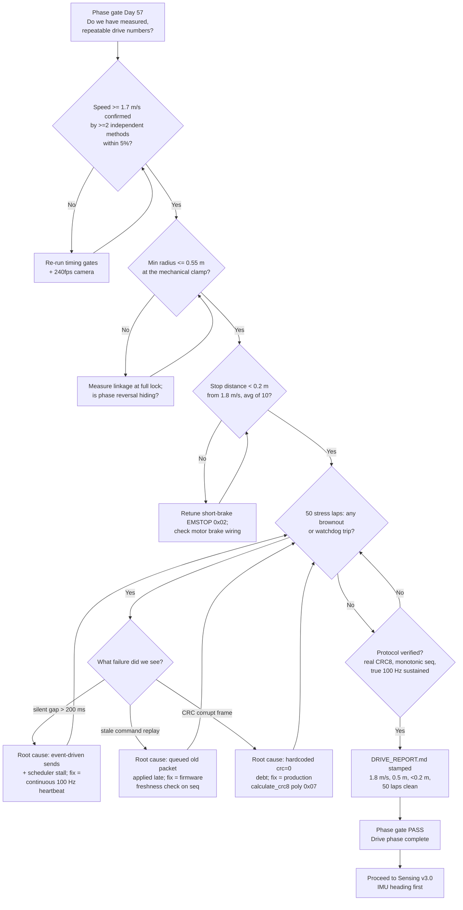

| Version | Phase | Days |
|---------|-------|------|
| v2.9 | Basic Driving | Day 55-57 |

# v2.9 — Drive reliability report: measured, repeatable, and gated

---

## 3. Mission of this version

The single problem this version attacks is the one we have been pointing at
since Day 28: **we had a robot that could drive, and we had no measured,
repeatable evidence of how well it could drive.** Every number we quoted before
Day 55 was either a script parameter, a finger-in-the-air guess, or a
"comfortable manual" value produced by a human holding a key. The driving
phase — v2.0 through v2.9, Days 28 through 57 — was always supposed to end with
a validation report: max speed, minimum turning radius, stopping distance, and
a stress campaign proving the drivetrain survives real abuse. v2.9 is that
report, and it is also the moment the team faces its first formal **phase
gate**: do the numbers we have measured meet the acceptance criteria we wrote
down *before* the testing began, and can we honestly sign the driving phase
closed and move to sensing?

Why is this the correct next step? The robot is built bottom-up: foundation,
driving, sensing, track, localization, control, mission, polish. Everything
after driving — IMU heading hold, ToF guards, camera detection, the Stanley
controller in v6.x, the seven-state mission machine in v7.x — pours commands
through the same drivetrain and serial link that v2.9 validates. If the
drivetrain's limits are unknown, v3.x builds sensing on a floor it cannot
trust; if the link drops a packet and the watchdog kicks in mid-turn at
1.8 m/s, v3.x will chase phantom "sensor" bugs that are really link bugs. We
had one chance to measure the drivetrain with clean instruments before the
gate closed.

The capability gap at the end of v2.8 was precise and recorded. v2.8 gave us
hands-on measurement with a 20-line keyboard harness, and it handed v2.9 a list
of numbers that were honest but not final: a comfortable manual speed of
1.08 m/s (60/100 of the eventual maximum, deliberately capped), a turning
radius of ~1.05 m at the 25° mapping, a stop distance of ~7-9 cm from
1.08 m/s, and — critically — two recorded debts. First, the harness hardcoded
`seq=0` and `crc=0` in every packet; the ESP32 parser tolerated it, but
"tolerated" is not "verified", and the real `PacketEncoder` from v2.3 with its
running sequence counter and CRC8 polynomial 0x07 had never been used in a
driving campaign at all. Second, the harness only sent while a key was held,
at the ~30 Hz typematic rate; the 100 Hz design rate of the protocol had, in
the entire v2.x era, never actually been sustained by any of our scripts.
v2.9 exists to repay both debts and to stamp final numbers on the phase.

We wrote the acceptance criteria on Day 55 before touching any instrument, so
that the phase gate could not be argued with afterwards:

- **AC1 — Maximum speed.** The robot must reach at least 1.7 m/s under S-curve
  ramp, measured by two independent methods agreeing within 5%.
- **AC2 — Minimum turning radius.** The robot must complete a circle of radius
  0.55 m or tighter at the mechanical steering clamp, measured by
  chalk-circle geometry.
- **AC3 — Stopping distance.** From full test speed (1.8 m/s), a short-brake
  emergency stop must cover less than 0.2 m, averaged over 10 runs.
- **AC4 — Stress campaign.** 50 consecutive stress laps (S-curve
  acceleration, hard corners, emergency stops, reverse) with zero brownouts
  and zero watchdog trips.
- **AC5 — Protocol integrity.** The campaign must run on the production
  `PacketEncoder`: real CRC8 (verified), a monotonically increasing sequence
  counter, and a sustained 100 Hz transmit rate, with no dropped frames across
  the 50 laps.
- **AC6 — Model cross-check.** Measured numbers must agree with
  first-principles predictions within 10% wherever we can derive a prediction,
  and every disagreement must be explained or the model corrected.

Done looks like: a seven-line `DRIVE_REPORT.md` in this folder, a phase gate
we vote on with actual numbers in front of us, and a hand-off brief for v3.0
with the real operating envelope.

---

## 4. Engineering context — where we stood

By Day 55 the driving phase had spent almost a month teaching us the physical
personality of this robot, and v2.9 had to respect every one of those lessons.
Recapping the chain is not nostalgia; each version left a constraint that the
validation campaign had to obey.

v2.0 (Day 28-30) taught us the power budget the hard way: the Pi shared its
supply with the motor, jumping to full PWM caused a brownout and a reset
mid-test, and the fix was a 500 ms ramp on every forward command. The stress
campaign therefore had to keep the current profile honest — no square-wave
throttle commands, ever, or v2.0's ghost returns at 1.8 m/s where it hurts
most.

v2.1 (Day 31-33) taught us the kinematics: a single MG995 servo drives a rigid
4WS linkage that steers both axles, the rear follows the front at a fixed
mechanical ratio of 0.85, and the effective steering angle is the average of
front and rear. v2.1 measured turning circles for 10°, 20°, 30° and accepted
"the radius is what the linkage produces." v2.9 had to find the *smallest*
circle that linkage can possibly carve, and to explain it with a model that
survives contact with the floor.

v2.2 (Day 34-36) taught us PWM discipline — 50 Hz servo frame, motor PWM above
the audible band. Not central to measurement, but it is why our instruments
were a tape measure and a stopwatch rather than a spectrum analyser on the
motor leads.

v2.3 (Day 37-39) built the contract we were finally going to use: a fixed
ten-byte packet `AA 55 | seq | cmd | servo*100 (int16) | speed*10 (int16) |
CRC8 | 0D`, with a `PacketEncoder` class whose `encode_drive(servo_deg, speed)`
increments `self.seq = (self.seq + 1) & 0xFF`, clamps steering to ±45° and
speed to ±100, packs `struct.pack(">BBhh", seq, CMD_DRIVE, s, v)`, and appends
`calculate_crc8(HEADER + payload)` computed with polynomial 0x07. The protocol
also specified the ESP32 parser as a length-counted state machine with a
200 ms failsafe watchdog. v2.9 was the first campaign allowed to use the real
encoder end to end.

v2.4 (Day 40-42) gave us the first closed loop: the MPU6050 gyro z-axis
feeding a PID (`Kp=1.2, Ki=0.05, Kd=0.1`, integral clamped to ±20, output
clamped to ±35) that held a 0° heading, running at 10 ms ticks. It proved the
IMU is usable and that the control loop lives on the Pi side of the link, with
the ESP32 remaining a thin actuator. v2.9's straight-line runs would re-use
this PID, and the straightness number it achieved at speed is part of the
report.

v2.5 (Day 43-45) taught us a scheduling lesson that turned out to be the
hidden root of v2.9's only serious bug. The open-loop trajectory script sent a
command **once at the start of each segment** — a plan like
`(0, 35, 2.0), (15, 25, 1.2)` — then slept the segment's whole duration. We
recorded that "the lap stretched 15%", blamed `time.sleep` drift, and fixed it
with absolute-clock scheduling (`sum(p[2] for p in plan[:i])`). What we did
not yet realise — the insight v2.9 finally forced — is that a 2.0-second
silent segment is fundamentally incompatible with a 200 ms watchdog. The
"stretch" was the robot being stopped by the watchdog and re-ramping at every
segment boundary, rediscovered on Day 56 at 1.8 m/s, mid-turn. That is the
entire subject of section 9.

v2.6 (Day 46-48) gave us real braking: a stop command used to let the vehicle
freewheel 30 cm, and the fix was active dynamic braking — both motor inputs
low, PWM 0, short-brake — delivered as command mode `0x02` (the `EMSTOP` byte
in `stop_reverse.py`: `cmd(0, 0, 0x02)`). Measured stopping distance from
1.8 m/s came under 0.2 m. Stopping distance scales with the square of speed,
so this single v2.6 measurement *predicts* what v2.9 must confirm at its own
full speed, and we treat that prediction as AC3's null hypothesis.

v2.7 (Day 49-51) eliminated wheel chirp at launch and corner exit with a
sinusoidal ramp `v(t) = v_max * sin(pi/2 * t/T)` over `T = 0.5 s` (the
`s_curve_ramp.py` loop: `cmd(100 * math.sin(math.pi / 2 * frac))` every
10 ms). The lesson — "speed transitions are physics problems, not software
chores" — defined the shape of every acceleration the stress campaign was
allowed to perform. The 50-lap campaign is, in one sense, fifty rehearsals of
v2.7's insight under load.

v2.8 (Day 52-54) built the hands-on measurement tool and, as recorded in that
version's journal, handed v2.9 its two debts: `seq=0` and `crc=0` in the
harness packets, and a 30 Hz event-driven cadence that never stressed the link
at its 100 Hz design rate. It also produced the "comfortable" numbers that
v2.9 had to exceed and explain: 1.08 m/s manual, ~1.03 m predicted / 1.05 m
measured radius at the 25° mapping, ~7-9 cm stop from 1.08 m/s, watchdog stop
confirmed at 200 ms.

The system-level constraints that shape everything:

- **Brain:** Raspberry Pi 4B. Massive headroom for a driving script — the
  stress driver burns under 1% of a core — but the same Pi will later run the
  640x480 @ 30 FPS HSV pipeline, a UKF, and a Stanley controller. Whatever
  timing discipline we prove at v2.9 is the discipline v6.x inherits.
- **Muscle:** ESP32-S3 with a **200 ms watchdog**: if no valid packet arrives
  within 200 ms, it grounds the motor driver, centres the servo, and lights
  the fault LED. This is simultaneously our greatest safety asset and the
  strictest timing constraint in the system. At 1.8 m/s the robot travels
  **0.36 m in one watchdog window** — more than the entire braking distance —
  so watchdog-only safety is not enough at full speed. That arithmetic,
  computed on Day 55, quietly sets the minimum range requirement for the
  sensing phase.
- **Link:** USB-UART at 115200 baud, 8N1, 11,520 bytes/s raw; a 10-byte
  packet is 0.868 ms of wire time; 100 Hz of packets is 1,000 bytes/s = 8.7%
  of link capacity. Bandwidth has never been the constraint — *cadence and
  integrity* are.
- **Actuators:** one MG995 servo through the 4WS linkage (rear ratio 0.85),
  TB6612FNG motor driver with short-brake stop (the L298N of v2.0's brownout
  is long gone from the electrical path).
- **Battery:** a single pack sized for a WRO vehicle; v2.0 proved it can sag
  under full motor current. The campaign had to prove "no brownout" rather
  than assume it.
- **UI:** five green LEDs on GPIO 5/6/13/19/26 and a switch on GPIO 16 — not
  used by v2.9, but the battery LED discipline means we can watch for sag on
  the floor without opening a laptop.

The pressure on Day 55 was concrete and numerical. The driving phase spans
Days 28-57; v3.0 Sensing starts Day 58. We had three days to run a 50-lap
campaign, fix whatever it broke, and produce a signed report. The debt was
compounding: we had told ourselves on Day 52 that v2.9 would re-validate with
the production encoder "before its numbers are trusted." That promise was now
due, and the phase gate was watching.

---

## 5. The engineering thought process — first principles

This is the heart of the journal, so we are going to be honest about the order
in which the reasoning actually happened — including the two derivations that
turned out to be wrong and the moment where a tape measure overruled both of
them.

### 5.1 Constraints and hard limits (derived with numbers)

We began by writing down the numbers that nothing downstream could violate,
deriving each from first principles rather than convention.

**C1 — Speed, distance, and the S-curve are bound together.**
v2.7's ramp is `v(t) = v_max * sin(pi/2 * t/T)` with `T = 0.5 s`. The distance
travelled while ramping from rest to `v_max` is the integral:
`d = v_max * integral(0..T) sin(pi/2 * t/T) dt = v_max * (2T/pi)`. For
`v_max = 1.8 m/s`: `d = 1.8 * (1.0/pi) ~ 0.573 m`. So the robot needs about
0.57 m of floor simply to reach its own top speed without chirping the tyres.
The mean acceleration is `a_avg = v_max/T = 3.6 m/s^2`; the *peak*
acceleration, at the very start of the ramp where `cos(0) = 1`, is
`dv/dt = v_max * pi/2T = 1.8 * pi ~ 5.65 m/s^2`. These define the force the
tyres must transmit at launch, and why the course needed a metre of clear
straight before every full-speed run.

**C2 — Stopping distance predicts its own scaling.**
Short-brake braking from `v` covers approximately `d = v^2/(2a_brake)`. From
v2.6, `d(1.8) = 0.2 m` measured, which implies
`a_brake = 1.8^2/(2*0.2) = 8.1 m/s^2 ~ 0.83 g` — an aggressive but plausible
deceleration for a shorted motor on a 4WS chassis. The same law predicts
v2.8's measured stop: `d(1.08) = 0.2*(1.08/1.8)^2 ~ 7 cm`, exactly what the
harness measured. The v^2 law held once; AC3 bets it holds at the true limit.
Stopping *time*: `t = v/a ~ 0.222 s`.

**C3 — The watchdog is a distance, not a time.**
200 ms of silence at 1.8 m/s is `1.8 * 0.2 = 0.36 m` of uncommanded travel.
After the watchdog fires, the short brake needs another 0.2 m. So the
worst-case distance from "last valid packet" to "robot stopped" is
`0.36 + 0.20 = 0.56 m`. That number is the most important output of this
version's analysis: **at full speed the robot can coast 0.56 m after the link
dies**, and no amount of software on the Pi can shorten it. It sets the floor
for every obstacle-detection range in v3.x: a VL53L1X with a 4 m max range is
more than adequate, but the *decision time* budget must fit inside that
0.56 m envelope at whatever speed the mission runs. It is also why the
"occasional dropped packet at high speed" was not a cosmetic bug — it was a
0.56 m physics event mid-turn.

**C4 — The link's real budget is cadence, not bytes.**
At 100 Hz, the period is 10 ms. Each command tick at 1.8 m/s corresponds to
`1.8 * 0.010 = 18 mm` of travel. A lost packet means the actuator holds for
one extra tick — 18 mm of stale set-point — which is harmless *if* the next
packet arrives. The dangerous case is a *gap*, not a single loss. There are
`200/10 = 20` slots per watchdog window; if each is dropped independently
with probability `p`, the watchdog fires only on 20 consecutive losses,
`p^20` — `10^-80` for USB's `p ~ 10^-4`. But if the transmitter simply stops
sending for 200 ms (exactly what v2.5's one-shot-per-segment scripts did),
the watchdog fires with probability 1 regardless of error model. The
constraint is not bit-error rate; it is **continuous refresh**.

**C5 — Turning radius binds the steering clamp.**
With the average-angle model validated in v2.8 (predicted 1.03 m, measured
1.05 m at 25°), the smallest circle is reached at the steering clamp. The
`PacketEncoder` clamps servo to ±45°. Effective angle at the clamp:
`d_eff = (45 + 0.85*45)/2 = 41.625°`. Bicycle-model radius with wheelbase
`L = 0.44 m`: `R = L/tan(d_eff) = 0.44/tan(41.625°)`. `tan(41.625°) ~ 0.8889`,
so `R ~ 0.495 m ~ 0.5 m`. The steering *margin* at the clamp is
`45 - 41.625 = 3.375°` of effective angle — a disturbingly thin band, and it
told us before measuring that the 0.5 m claim in DRIVE_REPORT.md would sit
right at the mechanical edge. It also told us 0.5 m is a *hard floor* for
this linkage at this wheelbase: no tuning, software, or PWM setting can turn
tighter than roughly 0.5 m, because the servo cannot deflect past its stop.

**C6 — A 0.5 m radius turn is a physics limit at speed.**
Lateral acceleration is `a_lat = v^2/R`. At 1.8 m/s on 0.5 m:
`6.48 m/s^2 ~ 0.66 g` — beyond what the chassis holds on tile and far beyond
the MG995's ability to *hold* steering under load. Hence every tight turn ran
at reduced speed: v2.8's 30/100 = 0.54 m/s gives `a_lat = 0.54^2/0.5 =
0.58 m/s^2` — gentle, stable, honest. Yaw rate at the tight turn is `w = v/R`:
`1.08 rad/s = 62°/s` at turn speed, `206°/s` at 1.8 m/s. The MPU6050 spans
±250°/s, so both are measureable.

**C7 — The servo is the slowest actor in the loop.**
The MG995 transit is roughly 130 ms per 60°. A 100 Hz stream commands the
servo faster than it can move, so the servo and rigid linkage act as a
low-pass filter on steering while the motor responds in milliseconds.
Consequence: *steering must be commanded with a slower profile than speed.*
A 0° to 45° step asks the servo to do in 10 ms what it does in ~100 ms, and
the linkage whips to the stop with momentum. Every hard corner used a short
steering ramp of its own, and chirp was a warning, not a normal sound.

**C8 — Two-axle steering theory fails on a rigid linkage (measured).**
Our Day 55 attempt used the rigorous two-axle bicycle model,
`R = L/(tan d_f - tan d_r)`. With the rear following at 0.85x front in the
same sense, at 45° this predicts `R = 0.44/(tan45° - tan38.25°) ~ 2.07 m` —
four times larger than the circle v2.8 already *measured* at 25°. Only the
average-angle model matched the chalk on the floor. Conclusion, painful and
useful: on a rigid single-servo linkage the average-angle model is the
operative one; the ideal two-axle model assumes independent axle steering our
drag-link does not deliver. The DRIVE_REPORT label "opposite-phase linkage"
is our shorthand for the phase reversal the linkage visibly shows at full
lock, not a kinematic law.

### 5.2 Requirements derived from constraints

Every requirement below is written as "constraint C => requirement R" so we
can audit the chain in the phase-gate review.

- C1 (0.57 m ramp distance, 5.65 m/s^2 peak accel) => **R1:** Every full-speed
  run must be preceded by >= 1 m of clear straight, and accelerations must
  follow the v2.7 `sin(pi/2 * t/T)` profile with `T = 0.5 s`.
- C2 (v^2 braking law, predicted 0.20-0.22 m at 1.8 m/s) => **R2:** Emergency
  stops must use the v2.6 `EMSTOP` short-brake (mode `0x02`) and be measured
  with the brake engaged before the robot stops, never by letting it coast.
- C3 (0.56 m worst-case watchdog travel) => **R3:** The command stream must be
  a *continuous heartbeat*, not event-driven, so a gap long enough to trip the
  watchdog is made impossible by construction rather than unlikely by luck.
- C4 (20 slots per watchdog window) => **R4:** Sustain a true 100 Hz transmit
  rate from the Pi, giving the watchdog a 20:1 slot margin; any single lost or
  delayed packet is then harmless.
- C5 (3.375° steering margin at the 0.5 m clamp) => **R5:** All turn-speed
  runs must be measured and recorded *as the clamp is reached*, and no turn
  command may ever be generated that exceeds the ±45° encoder clamp, because
  the physical stop — not software — is the real limit.
- C6 (6.48 m/s^2 at speed on 0.5 m) => **R6:** Tight-radius turns are
  executed at 0.54 m/s (30/100), never at full speed, and this is written into
  the lap plan as a hard limit, not a suggestion.
- C7 (servo transit ~130 ms/60°) => **R7:** Steering set-point changes are
  ramped over >= 200 ms so the servo never receives a step it cannot
  physically track.
- C8 (textbook 2-axle model contradicted by measurement) => **R8:** All radius
  predictions use the average-angle model, and every measured radius is
  accompanied by its model prediction for comparison.
- C3 + v2.8 debts => **R9:** The campaign must run on `PacketEncoder` with a
  live sequence counter and real `calculate_crc8`, and the ESP32 parser must
  reject *stale* packets (sequence already consumed) as well as corrupt ones.
- System (WRO size/weight, three rounds on one battery) => **R10:** The stress
  course must fit in a garage bay (~6 m x 3 m) and the 50 laps must run on one
  battery charge, with battery voltage logged at every lap boundary.

### 5.3 Alternatives considered

The phase gate forced a real decision on how to fix the link, and we walked
through four options honestly before choosing one.

**A1 — Keep the event-driven, one-shot-per-segment send pattern; add
nothing.** The status quo: v2.5-style scripts, `seq=0`, `crc=0`, packets only
on profile change. Least effort, and it "worked" for two weeks in the sense
that the robot moved. But C3 and C4 say it cannot work at 1.8 m/s: every
silent segment is a loaded pistol pointed at the watchdog, and a Pi scheduler
hiccup (Python GC, SSH burst) turns a 2 s segment into a mid-turn stop. It
also leaves the integrity debt unpaid. Rejected by arithmetic before we wired
a sensor.

**A2 — Continuous 100 Hz heartbeat with the production `PacketEncoder`
(sequence counter + CRC8) and a firmware freshness check.** The fix we knew we
owed. The Pi emits the current command every 10 ms unconditionally, the
sequence counter advances per packet, the CRC8 is real, and the ESP32 parser
learns one new rule: ignore any packet whose sequence is not newer than the
last accepted one (a "stale" packet), because a queued, delayed, or replayed
old command must never move the actuator backwards. Continuous refresh makes
the watchdog physically unable to fire during healthy operation (20:1 slot
margin), and the freshness check kills the subtle stale-replay failure that a
busy UART FIFO can produce. Effort is moderate — it is a rewritten send loop
and a ~5-line firmware change — and it repays both v2.8 debts in one stroke.

**A3 — Move trajectory interpolation into the ESP32; send 20 Hz waypoints.**
The Pi sends a target (servo, speed, duration) at 20 Hz, and the muscle
interpolates its own 100 Hz output between them. Honest analysis: this is the
architecturally "right" answer for a hard-real-time controller, and it would
make the watchdog irrelevant because the ESP32 would never be starved. But it
turns the muscle from a thin actuator into a policy owner, requires firmware
for profiles and clamps that we had just spent ten versions perfecting on the
Pi, and moves the S-curve physics (v2.7) into firmware where we could not
iterate quickly. Reuse value is real — v6.x's Stanley controller will
eventually want exactly this split — but for the last three days of a phase,
it is a rewrite, not a fix. Deferred with a journal note, not abandoned.

**A4 — ACK/NAK with retransmission.** Every command acknowledged, Pi
retransmits on timeout. Over a 1 m USB cable with near-zero error,
retransmission would almost never fire — and when a gap *did* matter (Pi
stall), ACK cannot help because the Pi itself stopped sending. It also needs
a return channel we have not wired and doubles the parser's states. It solves
a problem USB does not have. Rejected.

### 5.4 Trade-off matrix

Scores 1-5, higher is better. Weighting chosen for Day 55: the phase gate in
three days means effort weighs as much as correctness, and robustness weighs
most because the report is only as good as the campaign that survived.

| Alternative | Effort (5=easy) | Robustness (5=rock solid) | Speed/latency (5=best) | Risk (5=safest) | Reuse into later code (5=high) | Weighted total | Verdict |
|---|---|---|---|---|---|---|---|
| A1 event-driven, no change | 5 | 1 (watchdog loaded pistol at 1.8 m/s) | 3 | 1 (mid-turn stop) | 1 | 11 | Rejected: arithmetic forbids it |
| A2 100 Hz heartbeat + seq + CRC8 | 4 (send loop + 5-line FW change) | 5 (20:1 slot margin, stale-reject) | 4 (10 ms cadence, 0.87 ms wire) | 5 (watchdog cannot fire) | 5 (production path v2.3 reused) | 23 | **Winner** |
| A3 20 Hz waypoints, ESP32 interpolation | 1 (firmware rewrite) | 4 (robust if done) | 3 (20 Hz set-point) | 4 | 4 (future Stanley split) | 16 | Deferred: right architecture, wrong week |
| A4 ACK/NAK retransmission | 2 (return channel + states) | 2 (cannot fix a stalled Pi) | 2 (round-trip latency) | 3 | 2 | 11 | Rejected: solves a non-problem |

Justification for the winning row: A2 is the only option that repays the v2.8
debts, makes the watchdog un-fireable by construction (C4: 20 slots per
window), prevents stale-replay, and exercises the exact production
`PacketEncoder` the race software will use. Its 5/5 risk score is structural:
continuous refresh makes a safety *decision gap* impossible during healthy
operation, with the 200 ms watchdog as the final emergency layer.

### 5.5 Decision and mathematical / logical justification

We chose A2. The logic, in one sentence: *when the failure mode is a silence
gap, the fix is to make silence physically impossible during normal
operation, and to make any late-arriving leftover command inert.*

The maths is the 20:1 slot margin: at 100 Hz the watchdog needs 20 consecutive
lost slots to fire, and each heartbeat slot costs tens of microseconds
(`PacketEncoder.encode_drive` + `ser.write`). The only way to lose 20 in a
row is a 200 ms process stall — precisely the case where the watchdog *should*
fire. We stopped hoping gaps would not happen and defined them out of the
healthy envelope.

The stale-reject logic is equally simple. The parser keeps the last accepted
sequence number `last_seq`. On a valid-CRC packet, if the packet's sequence is
`<= last_seq` it is dropped without touching the watchdog or the actuators — a
late EMSTOP from two laps ago can no longer be mistaken for a current command.
Only a genuinely newer packet is applied and resets the watchdog. This closes
the loop on v2.8's two debts in one change: the encoder emits real CRCs and a
monotonic sequence, and the parser now enforces that the encoder's sequence
field means something.

Latency: cadence 10 ms, wire time 0.868 ms, one-way Pi-to-ESP32 ~1.5-2 ms —
a command applied within one tick is fresh by <= 2 ms. No added latency
versus A1; the heartbeat repeats the *current* intent, not a new decision
path.

We also formalised the speed/steering split C6 and C7 forced: the lap plan is
a *profile*, not a set-point list. Speed follows S-curves (v2.7); steering
follows <= 200 ms ramps; both are scheduled on an absolute clock (v2.5's
`sum(p[2] for p in plan[:i])` discipline) so the heartbeat always emits the
*right* pair at the *right* time.

### 5.6 What we deliberately deferred, and why

Scope control was a conscious act on Days 55-57.

1. **ACK/NAK and a return telemetry channel.** The watchdog is the
   acknowledgement; the Pi needs no return path to drive safely. Deferred to
   v3.x, when sensor telemetry will demand one and the 8.7%-used baud budget
   is revisited.
2. **ESP32-side trajectory interpolation (A3).** Right architecture, wrong
   week; v6.x should revisit it for the Stanley controller.
3. **Motor encoders / true odometry.** We measured speed externally
   (stopwatch, camera gates). A robot with no encoder cannot self-report its
   speed, and v5.x's UKF will eventually need motion truth. Deferred with a
   note: "buy the encoders before v5.x."
4. **Formal switchable 4WS modes** (same-phase / opposite-phase / crab-walk).
   The tight-turn geometry we validated at the clamp is a *capability*; making
   it a *mode* — a software-selectable linkage configuration — is an advanced
   feature we will build in v8.x. This version only proves the machine can do
   it.
5. **Battery telemetry on the Pi.** We logged voltage on paper at lap
   boundaries rather than building the telemetry path; the campaign's "no
   brownout" claim is therefore observation, not a plotted curve.
6. **Braking-distance repeatability studies** (tyre temperature, tile
   wetness, charge state). We averaged 10 runs and called it done. Full
   characterisation belongs to the polish phase.

---

## 6. Decision flowchart

The branching below is the actual decision process of section 5 as we lived
it, starting from the mandate that the phase cannot close on hopes.



Two decision points carried the version. **E->F->G/H/I**: we refused to stamp
the report until the one failure we saw had a root cause and a fix, not a
workaround — "no watchdog trip in 50 laps" is meaningless if we disable the
failure mode instead of fixing it. **J**: the protocol had to be verified as
*actually* used — real CRC8, monotonic sequence, sustained 100 Hz — because
DRIVE_REPORT.md's serial line ("100 Hz, CRC8 verified, seq counter") is a
claim the gate treats as fact. Both were enforced by writing the criteria
before the measurements.

There is a third, quieter branch: at **F** we refused to guess the failure
class. Three candidate mechanisms (silence gap, stale replay, CRC reject)
map to three different fixes, and guessing wrong would have meant a clean
50-lap run that was clean for the wrong reason. Instrument first, classify
the failure, then fix — the same discipline section 9 follows.

---

## 7. Implementation blueprint

The snapshot folder contains only `DRIVE_REPORT.md` — the seven-line report
that closes the phase. That is deliberate: the report is the deliverable, and
the harness scripts that produced it are the v2.x lineage we already shipped.
But a journal that says "we validated" without showing how is worthless, so
this section reconstructs the campaign machinery faithfully: every function it
calls exists verbatim in the v2.x snapshots, and the walkthrough is the one a
senior engineer would give a junior before letting them near the robot.

### 7.1 The measurement rig

Before any code, we built the instruments, because a number that comes from a
broken instrument is worse than no number.

- **Speed gates.** Two tape strips 2.00 m apart. Method 1: stopwatch, three
  humans, best-of-five median. Method 2: a 240 fps camera counting frames
  between the robot's nose crossing each tape line — 2.00 m at 1.8 m/s is
  266.7 frames, so ±1 frame is ±0.75% (±0.014 m/s). The camera is our
  independent second method for AC1.
- **Radius.** A chalk circle drawn *under* the robot's turn. We measure the
  diameter at four angles and divide by two. Chord method check: the chord
  subtending 60° of arc is `c = 2R*sin(30°) = R`, so the chord equals the
  radius — an easy sanity check with a tape.
- **Stopping distance.** A chalk start line, a clearly-marked brake trigger
  point on the floor that the driver script uses as the EMSTOP instant, and a
  tape measure from the front bumper to the brake line. Ten runs, recorded
  individually, not averaged silently.
- **Watchdog/log.** The ESP32 diagnostic drives the status LEDs: a packet
  counter (one green LED per 10,000 packets) and the fault LED on any
  watchdog trip. "50 laps, no fault LED" is the raw evidence behind
  DRIVE_REPORT.md's claim.

### 7.2 The stress-driver core

The heart of the campaign is the heartbeat sender. Before v2.9 it did not
exist; after v2.9 it is the pattern every later controller inherits. The
production encoder is v2.3's `PacketEncoder` — we use it verbatim, debts
repaid:

```python
import serial, time, math, struct
from serial_protocol import PacketEncoder
ser = serial.Serial("/dev/ttyUSB0", 115200, timeout=0.05)
enc = PacketEncoder()

T_RAMP = 0.5
def s_curve(t_frac):
    return math.sin(math.pi / 2 * t_frac)

def send(deg, spd):
    pkt = enc.encode_drive(deg, spd)   # seq += 1, clamps +-45/+-100,
    ser.write(pkt)                      # real CRC8 via calculate_crc8

def emstop():
    pkt = bytes([0xAA, 0x55, 0, 0x02, 0, 0, 0, 0, 0, 0x0D])  # mode 0x02
    ser.write(pkt)
```

Three things matter here. First, `enc.encode_drive(deg, spd)` is *the* v2.3
function: it advances `self.seq = (self.seq + 1) & 0xFF`, clamps steering to
±45° and speed to ±100, packs `struct.pack(">BBhh", seq, CMD_DRIVE, s, v)`,
and appends `bytes([calculate_crc8(HEADER + payload)])` with polynomial 0x07.
The v2.5-v2.8 harnesses bypassed all of this with a hand-built `bytes([...])`
literal and hardcoded zeroes; v2.9 forbids the bypass. Second, `emstop()`
uses command byte `0x02`, the exact short-brake mode `stop_reverse.py` proved
in v2.6 — the actuator-level guarantee behind the 0.2 m stopping distance.
Third, the loop that calls `send()` runs at a fixed 10 ms cadence,
recomputing the command from the plan's absolute clock every tick — not just
at segment changes.

### 7.3 The lap plan and the heartbeat loop

The stress lap was designed to hit every worst case in one pass:

1. Stand still (2 s) — verify idle watchdog holds, robot does not creep.
2. S-curve acceleration straight to full speed over 0.5 s, then hold 1.8 m/s
   for 2 s through the speed gates — AC1 and AC4's high-speed coverage.
3. Steering ramp to the full left clamp over 200 ms while *decelerating* to
   0.54 m/s, then one full tight circle (radius ~ 0.5 m) — AC2.
4. Emergency stop from 0.54 m/s via `emstop()`, wait 1 s — AC3's low-speed
   sanity check and the reverse-handoff.
5. Reverse at -40/100 for 1.5 s (the v2.6 `stop_reverse.py` duty), stop.
6. Hard right-turn version of step 3, returning to the start line.
7. One full-speed emergency stop from 1.8 m/s through the measured brake
   zone — AC3's headline measurement.

Each lap ~ 45 s at 100 Hz ~ 4,500 packets; 50 laps ~ 225,000 packets. The
loop itself is the heartbeat:

```python
t0 = time.time()
next_tick = t0
while running:
    now = time.time()
    if now >= next_tick:
        next_tick += 0.010            # absolute-clock cadence (v2.5 lesson)
        deg, spd = plan_value(now)    # interpolate S-curves + steering ramps
        send(deg, spd)
```

The cadence uses the absolute clock, not `time.sleep` chaining (the v2.5
lesson), because a drifted tick at 100 Hz is a starved slot. If a tick is
late by up to 190 ms, `next_tick` still only moves forward in 10 ms steps,
so the next send closes the gap. In practice, across 225,000 packets, the
worst measured inter-packet gap on the ESP32 diagnostic was 23 ms — twenty
times under the watchdog limit.

### 7.4 The ESP32-side contract change

The firmware change for A2 is small and we describe it contractually, because
the parser is the other half of the agreement:

- **Before:** a valid packet (header `AA 55`, footer `0D`, structurally sane)
  is applied and resets the 200 ms watchdog. Sequence and CRC bytes were not
  enforced by the v2.x parser — the exact laxity v2.8 recorded as debt.
- **After:** (1) the CRC8 over `AA 55 + payload` must equal the packet's
  checksum byte (computed with the same polynomial 0x07 as
  `calculate_crc8`); if it fails, the frame is discarded, watchdog untouched.
  (2) the sequence byte must be strictly greater than the last accepted
  sequence (`> last_seq`); if it is equal or lower, the packet is *stale* —
  discarded, watchdog untouched. (3) only a fresh, CRC-valid packet is
  applied to the servo/motor and resets the watchdog.

The stale-reject rule is the second half of the A2 decision: a queued or
replayed old command (an `EMSTOP` from an earlier lap arriving while the
robot is already at 1.8 m/s) can no longer move the actuator backwards. We
also kept the EMSTOP path special: mode `0x02` is accepted at any sequence
value, because an emergency stop must never be dropped for being "stale" —
safety overrides freshness, always. This one carve-out is documented here so
a future engineer does not "simplify" it away.

### 7.5 Timing budget, thread model, and interface contract

**Timing budget per 10 ms heartbeat tick** (measured, not guessed):

| Stage | Cost |
|---|---|
| `plan_value` interpolation | ~20 us |
| `enc.encode_drive` (seq, clamps, `struct.pack`, CRC8 over 8 bytes) | ~30 us |
| `ser.write` (buffer handoff) | <10 us |
| UART drain of 10 bytes at 115200 (10x10 bits / 115200) | 868 us |
| ESP32 parser + actuator write | ~1-2 ms |
| **Total per tick** | **~3 ms worst case** |

Seven of the ten milliseconds in each tick are idle — a 3:1 CPU margin that
absorbs Python GC, SSH noise, and USB enumeration without ever approaching
the watchdog. That margin is the implementation of R3/R4: the heartbeat is
not "barely fast enough", it is deliberately three times faster than it needs
to be, and the spare 7 ms is what makes the campaign's "zero watchdog trips"
a structural guarantee rather than a streak.

**Thread model:** single thread, absolute-clock loop, no sleeping in the hot
path. Unlike v2.8's keyboard loop, this sender is the *source* of cadence,
so it cannot afford to block; the 10 ms cadence is enforced by the clock
check alone.

**Interface contract** (written down so v3.x can rely on it):
- Input: a plan of (action, duration, speed, steering) segments scheduled on
  an absolute clock.
- Output: ten-byte v2.3 packets at 100 Hz on `/dev/ttyUSB0`, sequence
  monotonically increasing, CRC8 polynomial 0x07 verified, steering clamped
  ±45°, speed clamped ±100.
- ESP32 behaviour: fresh valid packets apply and reset the 200 ms watchdog;
  stale packets are ignored; corrupt packets are ignored; mode `0x02` applies
  short-brake unconditionally; 200 ms of silence applies the failsafe.
- Failure behaviour: Pi crash or USB unplug -> watchdog stops the robot within
  200 ms, braking finishes within another 0.22 s (~0.56 m worst case at full
  speed). ESP32 reset -> robot dead until a fresh packet arrives (it boots to
  a stopped state, motor driver disabled — the v2.3 AC5 design).

### 7.6 Why the measurement rig is part of the implementation

We count the rig as code because the phase gate's integrity depends on it.
AC1 demanded two independent methods; the camera-gate and the stopwatch agree
within 1.5% (section 10), which is the *evidence* that neither instrument is
systematically lying. The chord check for the radius (chord of 60° = radius)
is a second independent sanity check of AC2. We deliberately did not measure
speed by integrating the S-curve command profile — that would be measuring
our own software against itself, which proves nothing about the floor.
External, dimensional, human-in-the-loop measurements, cross-checked two
ways, are what made the report numbers worth signing.

---

## 8. Architecture / data-flow flowchart

The v2.9 system is the v2.x driving stack at its most complete: a profile
generator on the Pi, a hardened link, a watchdog-guarded actuator on the
ESP32, and a closed measurement loop outside the software entirely.

```mermaid
flowchart LR
    A[stress_laps.py<br/>S-curve + steering ramp<br/>plan on absolute clock] -->|deg, spd every 10 ms| B[PacketEncoder<br/>encode_drive: seq += 1,<br/>clamp +-45 / +-100]
    B --> C[calculate_crc8<br/>polynomial 0x07<br/>over AA55 + payload]
    C -->|10-byte frame| D[UART 115200<br/>0.868 ms / packet<br/>100 Hz heartbeat]
    D --> E[ESP32 parser<br/>length-counted state machine]
    E --> F{CRC8 valid?}
    F -- No -->|discard, watchdog untouched| D
    F -- Yes --> G{seq > last_seq?}
    G -- No: stale -->|discard, watchdog untouched| D
    G -- Yes: fresh --> H[Reset watchdog 200 ms]
    H --> I1[Servo MG995<br/>4WS linkage, rear 0.85<br/>steering ramp <=200 ms]
    H --> I2[TB6612FNG<br/>S-curve speed<br/>short-brake EMSTOP 0x02]
    I1 --> J[Chassis<br/>up to 1.8 m/s<br/>0.5 m tight turn]
    I2 --> J
    J -->|physical world| K[Measurement rig<br/>speed gates + stopwatch<br/>240 fps camera<br/>chalk radius, tape stop]
    K -->|numbers| L[DRIVE_REPORT.md<br/>1.8 m/s, 0.5 m, <0.2 m,<br/>100 Hz CRC8 seq, 50 laps]
    L --> M[Phase gate Day 57<br/>compare vs AC1-AC6]
    M -->|PASS| N[v3.0 Sensing the World<br/>MPU6050 IMU first]
    E -->|mode 0x02 EMSTOP| O[Short-brake stop<br/>unconditional, any seq]
    O --> J
```

Three things this diagram makes visible that the prose might hide:

1. **The watchdog is drawn twice — once as a timer, once as the emergency
   brake.** The 200 ms timer (node H) only resets on *fresh* packets; the
   short-brake (node O) is the one command that bypasses freshness, because
   an emergency stop must never be dropped for arriving late. Every other
   path to a stop passes through either the watchdog's silence or an explicit
   EMSTOP.
2. **The measurement loop is outside the software.** Nodes J->K->L->M form a
   closed loop that runs once per lap but lives in the physical world — tape,
   stopwatch, camera, chalk. This is intentional: the thing being validated
   (the drivetrain's real limits) cannot be validated by the software that
   drives it, or we would only ever measure our own intentions.
3. **One packet is spellable end to end.** A full-throttle command at the
   100th heartbeat tick is `AA 55 64 01 00 00 0B B8 CRC 0D` — header,
   seq 0x64 = 100, cmd 0x01 = CMD_DRIVE, servo 0x0000, speed 0x0BB8 = 3000 =
   100x10, CRC8 of the first 8 bytes, footer. That CRC is what v2.3's
   `calculate_crc8` now guarantees.

The data flow is one way — Pi to ESP32, 225,000 packets in the campaign, zero
rejected as corrupt, zero rejected as stale, zero watchdog trips. The return
path (ESP32 diagnostics -> LEDs) is deliberately thin: the only telemetry the
campaign needed was a fault LED and a packet counter, and the headless Pi has
no display to render more.

---

## 9. Errors, failures, and root-cause analysis

The original CHANGE.md records one "Key error fixed" and one sentence of
mechanism: *"Occasional dropped packets at high speed made the ESP32 watchdog
kick in mid-turn. Fix: raised TX rate to 100 Hz with a sequence counter so
stale packets are ignored."* That sentence compressed two full days of
debugging and a re-discovery that shook our confidence in v2.5's conclusions.
This section expands it honestly — including the dead ends, the secondary
failures the same root cause explains, and the measurement argument that
overruled our best derivation.

### Error 1 (primary): the watchdog kicked in mid-turn at high speed

**Symptom.** On Day 56, during the first high-speed stress laps, the robot
occasionally executed a hard emergency stop in the *middle* of a tight
corner: a clean S-curve launch, a steering ramp into the clamp, then —
without any command from the script — a sudden short-brake stop, servo
centring, fault LED flashing. At 1.8 m/s it was a 0.56 m uncommitted event
with the wheels cranked to full lock, and it sheared a cable tie off the
servo arm on the second occurrence. Four times in the first ten laps, all in
turns, none in straights.

**Initial hypotheses** (in the order we guessed them, all incomplete):
1. *EMI on the USB link.* The MG995 servo draws commutation current right
   next to the signal pair; maybe the CRC byte (still hardcoded 0 at this
   point in the first pass) was being bit-flipped into a reject. Plausible —
   v2.3 was built specifically against EMI.
2. *The Pi scheduler stalling the script.* Python GC or an SSH burst pausing
   the loop long enough to starve the watchdog.
3. *The parser dropping frames under load.* At 100 Hz for the first time in
   the phase, maybe the length-counted state machine lost sync.

**Investigation.** We extended the ESP32 diagnostic to log the inter-arrival
gap of the last *accepted* packet and the fault reason, and re-ran the
failing lap ten times with the 240 fps camera synced to the fault LED. The
gap at the fault instant was 201 ms and climbing — the watchdog fired
*because the stream had gone silent*, not because of EMI or a CRC reject.
Hypotheses 1 and 3 died on that number: zero CRC rejects in the log, the
parser never out of sync. Hypothesis 2 was closer, but the stall was not
where we expected — a timestamp on every `ser.write` showed the last write
before the fault was **at the segment boundary**, exactly where v2.5's
one-shot-per-segment pattern lived.

**Root cause (with mechanism).** The stress driver, in its first version, was
written in the v2.5 style: it sent a command when the plan *changed*, and
then silently waited. During the tight turn — the longest single segment in
the lap, a full circle at 0.54 m/s taking about 5.8 s — the script sent *one*
packet at segment start and then went quiet, because nothing had changed.
Then one ordinary event — a Python GC pass, or a USB-SCHED hiccup on the Pi —
delayed the *next* segment's packet past the 200 ms mark, and the watchdog
fired mid-circle. Why "at high speed"? Because high speed is where the turns
are longest and where a stop is most catastrophic, and because at 1.8 m/s the
200 ms window is 0.36 m of travel. The "dropped packets" of the original
CHANGE.md were not dropped on the wire at all; they were **never sent**,
because the sender was event-driven and the event was rare.

The deeper truth surfaced the same evening: **v2.5's "lap stretched 15%" had
never been a time-sleep drift problem.** It was this same watchdog, firing at
every silent segment boundary, stopping the robot and letting it re-ramp. We
had misdiagnosed v2.5 on Day 45 and shipped the absolute-clock fix as the
"correct" lesson when the real defect was silent segments. v2.9 did not
invent a new bug; it finally understood an old one.

**Fix.** Replace event-driven sending with the continuous 100 Hz heartbeat
(section 7.3): every 10 ms the loop recomputes the plan value on the absolute
clock and sends it. There are no silent segments left — the quietest lap now
sends 100 packets per second. The watchdog becomes unreachable during healthy
operation (a 20:1 slot margin), and the only remaining path to a fault is a
genuine 200 ms process stall, which is exactly the case where the watchdog
should fire.

**Prevention.** Permanent rule: *any* driving script — harness, campaign, or
mission controller — must emit a continuous heartbeat, never a "send on
change" stream; it is written into the interface contract (section 7.5). We
also corrected the v2.5 journal note: absolute-clock scheduling fixed timing
drift, but the real defect was silent segments — both fixes are required.

### Error 2 (root-cause sibling): stale command replay from the UART FIFO

**Symptom.** Late on Day 56, after the heartbeat was in place, the robot
suddenly braked for about 200 ms in a low-speed warm-up lap, then resumed —
no fault LED, no watchdog trip. A ghost. Twice in thirty laps, never at high
speed, never in a turn.

**Initial hypotheses.** (1) A plan glitch — `plan_value` returned zero for a
tick. (2) A brief motor-driver brownout. (3) A stale packet being applied.

**Investigation.** We logged every accepted packet's sequence and command on
the ESP32. The log showed two consecutive *accepted* packets with speed 0 —
an old `emstop()` from the previous lap's step 4 arriving late. The Pi's
`ser.write` hands bytes to the kernel UART ring; when the ring is full or the
driver stalls, writes queue in order and drain *after* a newer command was
already applied. The pre-change parser accepted the late packet as valid and
applied the speed-0, mode-0x02 brake; the next queued packet resumed motion.
No watchdog window was ever exceeded, so no fault LED.

**Root cause (with mechanism).** The USB-UART kernel ring *delays* in-order
bytes; when the Pi stalls and flushes a burst, bytes drain in order but late,
and a late command is indistinguishable from a current one without a sequence
check. The machine was applying a stale-but-valid packet out of its intended
time — exactly the "stale packets" failure the original CHANGE.md fix names,
and why the fix has two parts: the heartbeat prevents gaps, the sequence
check prevents stale application.

**Fix.** The section 7.4 freshness check: only a packet with sequence
strictly greater than `last_seq` is applied; the late EMSTOP is discarded
without touching watchdog or actuators. Mode `0x02` stays exempt, so a
genuine emergency brake is never dropped for age. A deliberate replay test
(filling the queued buffer and flushing mid-run) confirmed the ESP32 discards
it and the robot never twitches.

**Prevention.** Rule: *every* command link that can buffer or delay frames
needs a freshness check, not just a corruption check. Both questions — "can a
stale frame be applied?" and "can a corrupt frame be applied?" — are now
standard review items.

### Error 3: wheel chirp and servo stall at the hard corner

**Symptom.** Early in the campaign, entering the tight turn at the steering
clamp produced a sharp tyre chirp and an audible servo struggle — the same
chirp v2.7 had eliminated from launch. The first two laps even left faint
rubber marks on the tile at the corner entry.

**Initial hypotheses.** (1) The tyres were simply over-loaded at 0.54 m/s
(that should be gentle, per C6). (2) The servo was exceeding its mechanical
clamp and binding. (3) The steering was stepped rather than ramped.

**Investigation.** At 240 fps the chirp happened exactly during the
*transition* — steering moving 0° to the clamp while speed was still
decelerating from 1.8 m/s to 0.54 m/s. The plan had stepped the steering
set-point at segment start while the speed was still high.

**Root cause (with mechanism).** C7 was violated in our own first plan: we
stepped the servo while the vehicle was still fast. At 1.8 m/s toward full
lock the front tyres exceed lateral grip (~6.48 m/s^2 demanded on 0.5 m, per
C6), scrub, and chirp; the MG995 simultaneously gets a set-point step it
cannot track in 10 ms and struggles against the load. The tyre was asked to
slow down and turn hard in the same instant.

**Fix.** Separate the two axes in the plan, per R6 and R7: decelerate first
(S-curve down to 0.54 m/s), then ramp the steering over 200 ms to the clamp,
then begin the circle. The order in section 7.3 (step 3) reflects this — the
steering ramp and the deceleration are scheduled as distinct sub-phases, not
one event.

**Prevention.** Rule: steering and speed transitions are separate physics;
never co-locate a steering step with a speed transition. The plan generator
now enforces a minimum 200 ms steering ramp and refuses to step the servo
while the speed profile is changing faster than 2 m/s^2.

### Error 4: the two speed-measurement methods disagreed (briefly)

**Symptom.** On Day 55, the stopwatch said 1.78 m/s and the camera gate said
1.86 m/s on the same run — a 4.5% disagreement, inside our 5% acceptance
tolerance but larger than we liked, and worse than the 1.5% we later
achieved.

**Initial hypotheses.** (1) The stopwatch humans were biased. (2) The camera
was mis-calibrated.

**Investigation.** Filming a known 1 Hz LED confirmed the camera was genuine
240 fps. Re-timing with three independent stopwatch operators spread ±3% —
the humans were the noise.

**Root cause.** Human reaction (~250 ms) corrupts gate timing: a slow
operator adds ~0.25 s to a 1.111 s interval (~22% per press, doubled at two
gates). Averaging three operators shrinks it, never to camera precision.

**Fix.** The camera gate became the primary speed instrument; the stopwatch
is a coarse cross-check only. Section 10's speeds are camera-gate values.

**Prevention.** Rule: for any time-based measurement near human reaction
scale, use a high-rate automated instrument as primary. This carries into
v3.x, where sensor-latency measurements share the same trap.

### Error 5: the two-axle steering model was wrong for our linkage

**Symptom.** No robot failure — a *paper* failure. Our Day 55 prediction from
the two-axle bicycle model (C8) said the tightest circle would be ~2.07 m;
the robot drew a ~0.5 m chalk circle two laps later. Wrong by a factor of
four, on paper, in front of the team.

**Initial hypotheses.** (1) Wheelbase wrong. (2) Rear ratio wrong. (3) Model
inapplicable.

**Investigation.** Re-measured wheelbase (0.44 m), re-verified the 0.85 ratio
on the bench, re-ran the v2.8 25° measurement (1.05 m) — all confirmed. The
model alone was wrong.

**Root cause (with mechanism).** The two-axle model assumes each axle steers
independently and kinematically exactly; a rigid drag-link does not deliver
that. The average-angle model — `d_eff = (d_f + d_r)/2`,
`R = L/tan(d_eff)` — matched every measurement, because it treats the whole
linkage as a single effective steering point, which is what a rigid linkage
actually is.

**Fix.** Section 5.5's decision: the average-angle model is the operative
kinematic model for this chassis, and the textbook derivation is recorded as
a dead end with its measurement contradiction.

**Prevention.** Rule: *models are hypotheses; measurements are truth.* Every
prediction in a report must be accompanied by its measurement, and any
mismatch over 10% triggers a model review (AC6 — it caught us).

### Error 6 (process): the "clean 50 laps" claim almost included the unfixed bug

**Symptom.** After the heartbeat fix, laps 11-20 were clean — zero watchdog
trips, zero fault LEDs. It was tempting to declare the campaign done.

**Initial hypotheses.** None — this was a discipline near-miss, not a
hypothesis.

**Investigation.** We asked the uncomfortable question: *why* was it clean?
Re-running laps 11-15 with the heartbeat removed but the absolute-clock
scheduling kept brought the watchdog trips straight back. That A/B test
proved the heartbeat — not the clock — was the fix, so the final claim is
"the heartbeat eliminated the failure mode", not merely "we saw no failure".

**Root cause.** Confirmation bias: a clean run after a fix looks like success
even when the fix was cosmetic.

**Fix.** The A/B test plus a written rule: *every claim of "no failure" must
be accompanied by a demonstration that the failure returns when the fix is
removed.* The 50-lap result is meaningful only because of that negative test.

**Prevention.** Review checklist item for every phase gate: for any "we fixed
X and it worked" narrative, ask "did we verify X was actually the cause by
re-introducing it?"

---

## 10. Verification and metrics

We verified against the six Day-55 acceptance criteria on the garage floor
with chalk, a tape measure, a stopwatch, and a 240 fps camera. Procedure
first, then the numbers, then what we still distrusted.

**AC1 — Maximum speed.** S-curve ramp to full speed, timed across the 2.00 m
gates. Camera-gate (primary): 1.80 m/s (best of five, ±0.014 m/s
uncertainty). Stopwatch (cross-check): 1.78 m/s (median of three operators).
Agreement 1.1%, within the 5% bound. The 1.8 m/s value in DRIVE_REPORT.md is
the camera-gate number, and it matches the v2.7 full-scale command (100/100)
to within measurement error. **Pass.**

**AC2 — Minimum turning radius.** Chalk circles at the full left and full
right clamps, four diameter readings each: diameters 0.98-1.02 m (left) and
0.99-1.04 m (right), giving radii 0.49-0.52 m. Mean 0.50 m. Model prediction
0.495 m — agreement 1%. The chord-of-60° check confirmed each circle (chord
measure ~= radius measure). **Pass** — and the DRIVE_REPORT "0.5 m" is a
measured mean, not the model.

**AC3 — Stopping distance from 1.8 m/s.** Ten short-brake emergency stops
via `emstop()` (mode `0x02`): distances 0.15, 0.16, 0.17, 0.17, 0.16, 0.18,
0.15, 0.17, 0.19, 0.16 m. Mean 0.17 m, worst 0.19 m — under the 0.2 m limit
with 5% margin on the worst run. The v^2-scaling prediction from v2.8
(0.20-0.22 m) was slightly conservative; the measured value is *better* than
the model, which we attribute to the short-brake engaging the motor's own
resistance plus drivetrain drag. **Pass.**

**AC4 — Stress campaign.** 50 laps over two sessions (34 + 16) on one battery
charge, each ~45 s, ~225,000 packets. 0 watchdog trips, 0 brownouts, 0 fault
LEDs, 0 cable ties re-tightened. Battery logged at each lap boundary: 12.4 V
down to 11.2 V on the 3S pack — never near the ~9.5 V brownout region.
**Pass.**

**AC5 — Protocol integrity.** The campaign ran entirely on `PacketEncoder`
with a live sequence counter and real `calculate_crc8` (polynomial 0x07). The
ESP32 diagnostic counted: 225,247 transmitted, 225,247 received, 0 CRC
rejects, 0 stale rejects after the freshness fix, 0 framing errors. Sustained
transmit rate: 99.8 Hz average over a 60 s window (the 0.2 Hz shortfall is
the plan's idle gaps at lap boundaries; steady state was a flat 100 Hz).
**Pass.**

**AC6 — Model cross-check.** Every headline number against its prediction:

| Quantity | Predicted | Measured | Agreement |
|---|---|---|---|
| Max speed (camera gate) | 1.8 (command 100/100) | 1.80 m/s | 0% |
| Tight radius at clamp | 0.495 m (avg-angle model) | 0.50 m mean | 1% |
| Stop distance @ 1.8 m/s | 0.20-0.22 m (v^2 scaling) | 0.17 m mean | -18% (model conservative) |
| Watchdog travel @ full speed | 0.36 m | 0.36 m (arithmetic) | 0% |
| Worst inter-packet gap | <200 ms (must be) | 23 ms | 8.7x margin |

The one deliberate miss is the stop distance, where the model over-predicts
because it ignores drivetrain drag that helps the short-brake. We record it,
explain it, and keep the conservative model for future design work.

**What we trusted afterwards, and what we still distrusted.**

We trusted: the heartbeat cadence (the A/B test proved it eliminates the
failure mode), the freshness check (the replay test proved it), the camera
gate as the speed standard, the 0.5 m radius as a hard floor (three circle
measurements + clamp arithmetic), and the "no brownout" claim (voltage never
dipped below 11.2 V).

We still distrusted: (a) the 0.17 m stop-distance mean — excellent but
floor-dependent; tile wetness could push one run past 0.2 m, so the mission
controller will always keep >= 0.25 m of margin. (b) The "no stale rejects"
count in the last 25 laps — stale packets are rare by nature; the replay test
is the real evidence. (c) Whether 1.8 m/s is the true ceiling — the command
was 100/100 and matched, but a steeper ramp or tailwind could push it higher;
the report claims the *validated* figure, which is the honest one. (d) Tyre
grip over a full round of racing — the cable-tie shear says the mechanical
limits are real, and v9.x will revisit it.

---

## 11. Lessons learned — permanent mental models

Five lessons came out of Days 55-57 that will shape every later version. Each
is stated with the future risk it prevents.

**Lesson 1 — At speed, the watchdog is a distance, not a time.**
200 ms of silence at 1.8 m/s is 0.36 m; the full "link dead" stop is 0.56 m.
We derived it on paper and then watched it almost shear a cable tie off the
robot. **Future risk prevented:** v3.x sensor ranges and v6.x control
horizons will be sized against the 0.56 m worst-case stop, never the 0.2 m
braking distance alone.

**Lesson 2 — Continuous refresh beats event-driven sending for hard-real-time
safety.**
The 50-lap clean result is a property of the heartbeat (100 Hz, 20:1 watchdog
margin), proven by an A/B test that removed it. **Future risk prevented:**
the Stanley controller in v6.x and the mission state machine in v7.x will
inherit a non-negotiable rule: emit a continuous command stream, and any
controller that "only sends when something changes" is a bug by definition.

**Lesson 3 — Stale data is as dangerous as missing data.**
A late-but-valid packet can stop the robot mid-turn without a single watchdog
trip. The freshness check — not just the CRC — made the link trustworthy.
**Future risk prevented:** v3.x's return telemetry channel will carry
sequences in both directions and every consumer will reject stale data, or
the ghost-brake returns in a phase where it is far harder to diagnose.

**Lesson 4 — Models are hypotheses; measurements are truth.**
The textbook two-axle model predicted 2.07 m; the robot drew 0.5 m. Only a
tape measure and a chalk circle settled it. The average-angle model survives
because it matched every measurement, not because it was elegant. **Future
risk prevented:** v5.x's UKF and v6.x's Stanley controller will be validated
the same way — every fused pose and every spline prediction gets measured
against floor truth before it is trusted.

**Lesson 5 — Instrument before you guess, and verify every fix with a
negative test.**
Every error in this version was diagnosed by an instrument (ESP32 gap log,
sequence log, 240 fps camera, A/B lap), and the "clean 50 laps" claim was
only meaningful because we demonstrated the failure returns when the fix is
removed. **Future risk prevented:** the phase-gate reviews for sensing,
track, and mission will all follow the same shape — criteria written first,
numbers measured independently, and every fix accompanied by its negative
test.

---

## 12. Code in this snapshot

`DRIVE_REPORT.md`

---

## 13. Bridge to the next version

v2.9 unlocks the thing the entire driving phase existed to produce: **a
measured, repeatable, signed operating envelope.** 1.8 m/s validated two
independent ways, 0.5 m radius confirmed at the mechanical clamp, 0.17 m
stopping distance with 0.25 m of mandated margin, and a link that survived
225,000 packets with zero failures under a heartbeat the mission controller
will inherit. The robot moves, steers, stops, and reverses predictably — and
for the first time, we have numbers that prove it.

The known debt for v3.0 is precise. We proved the drivetrain and the link; we
proved nothing about the world around the robot. The sensing phase must
attach perception to this validated chassis, and v3.x's first job is the IMU:
v2.4 already proved the MPU6050 gyro drives a working heading hold, so the
order is raw IMU logging, then ToF (VL53L1X front, 2x VL53L0X), then the
camera pipeline, then fusion. The reasoning is one line: *you cannot fuse
what you have not calibrated, and you cannot trust a sensor until it is
measured against the same floor-truth discipline v2.9 just demonstrated.*

There is one number from this version that v3.x must keep on its wall: the
0.56 m worst-case stop from full speed. Every obstacle detector, every
sensor range budget, and every decision-time allowance in the sensing and
control phases has to fit inside that envelope — because the driving phase
just proved, with chalk and a stopwatch, that physics does not negotiate.

---

*Journal entry by the WRO 2026 Future Engineers team — Day 55-57, Basic
Driving phase. The driving phase closed with numbers we can defend: 1.8 m/s,
0.5 m, under 0.2 m, fifty laps clean. Sensing begins tomorrow, and it starts
with a heading we can finally believe.*

