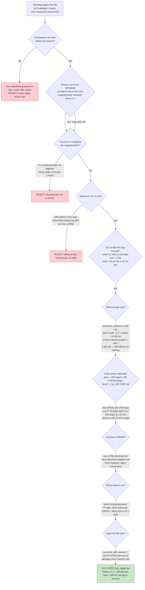

| Version | Phase | Days |
|---------|-------|------|
| v3.0 | Sensing the World | Day 58-60 |

# v3.0 — IMU raw data logging

## 3. Mission of this version

The single problem this version attacks is the opening move of the sensing phase: **the robot must perceive its own motion before it can perceive anything else, and we had never once measured the only proprioceptive sensor we own.** v2.9 closed the driving phase with a signed envelope — 1.8 m/s measured two independent ways, 0.5 m radius at the clamp, 0.17 m stop, 225,000 packets clean — and left us holding a robot that drives predictably and *feels nothing*. The MPU6050 has been on the Pi's I2C bus since v1.x, passed the 14/14 hardware check, and drove a working heading hold in v2.4. But everything we believe about it is either derived from a datasheet or assumed from a single noisy sample. On Day 58 morning no one could answer three questions: what is the actual gyro noise, what is the actual bias, and can the accelerometer support the tilt compensation the VL53 range sensors will need in v3.2? v3.0 answers them with logged data instead of guesses, beginning the sensing phase the only way that can end well: a characterisation written down before we let the sensor make a single decision.

Why is this the correct next step? v2.9's bridge brief was explicit about the sensing-phase order: *raw IMU logging, then ToF, then camera, then fusion.* That order is a dependency graph, not a schedule. v3.1's calibration needs a measured bias. v3.2's complementary filter needs a measured noise floor to choose its alpha. v5.x's UKF needs noise covariances for gyro and accelerometer, or the filter trusts a liar. If the noise floor is wrong by an order of magnitude, every downstream filter is either blind or jittery, and the errors compound invisibly because fusion hides sensor error inside fused state. The most expensive kind of bug is the one buried inside a filter, so the cheapest place to find it is before the filter exists. That is this version's economic argument: **you cannot fuse what you have not measured.**

The capability gap at the end of v2.9 was precise. v2.4's journal left a named debt, D2: *formal bias calibration deferred to v3.x when runs stretch past ~30 s* — the trigger is now met, because a competition run will be longer than 30 s and the linear bias ramp stops being free. v2.5's journal left the sharper debt: *the MPU6050 in the v2.5 snapshot is not yet calibrated (raw bias not zeroed).* Two versions wrote the same sentence. On Day 58 we decided to stop owing it and start measuring it.

What "done" looks like was written on the whiteboard before a line of code, because the phase gate we invented in v2.9 — criteria written first, numbers measured independently, every fix verified — applies to sensing too:

- **AC1 — Cadence and coverage.** A logger that captures accelerometer (ax, ay, az) and gyro (gx, gy, gz) with a timestamp column at a sustained ≥ 90 Hz for ≥ 10 s per session.
- **AC2 — Noise within datasheet expectation.** Measured gyro noise σ ≤ 0.10 °/s RMS (datasheet-derived prediction: 0.05 °/s); measured accelerometer noise σ ≤ 0.010 g (prediction: 0.004 g).
- **AC3 — Bias repeatability.** |bias_z(session A) − bias_z(session B)| ≤ 0.05 °/s across ≥ 3 sessions, so that a single stored bias value is usable at boot.
- **AC4 — Full-scale budget.** The worst-case driving yaw rate of 206 °/s (v2.9: 62 °/s on the tight turn at 0.54 m/s, 206 °/s at 1.8 m/s on the 0.5 m radius) must sit at ≤ 85 % of the gyro range, verified by a capture that reaches it.
- **AC5 — Warmup containment.** From t = 0 in the CSV, no sample may exceed ±3σ of the settled distribution — the power-on garbage must be fully confined to the pre-log warmup.
- **AC6 — File integrity.** Every session CSV parses to exactly 1001 lines (header + 1000 rows) with 7 comma-separated fields each; parse error count = 0.
- **AC7 — A characterisation table.** The version must produce, on the whiteboard, a table of bias per axis, noise σ per axis, and session-to-session drift sufficient to set v3.1's calibration trigger conditions.

Done looks like: a CSV per session, a characterisation table we can photograph, and a v3.1 hand-off that says *"the z-bias is +0.06 °/s, the noise is 0.05 °/s RMS, and the bias drifts with temperature — calibrate at the venue, not at home."*

---

## 4. Engineering context — where we stood

Recapping the chain matters here, because every version left a constraint that this logging pass had to obey, and a lesson that the logger's design must not violate.

v1.x (Days 1-27) brought the hardware up and the IMU was part of it: the MPU6050 lives at address 0x68 (AD0 pulled low on our breakout), passed the 14/14 component check, and — critically — its magnetometer was **disabled** during v1.x after we watched its output swing tens of degrees whenever the motor or servo drew current. That decision is why the HISTORY line reads "magnetometer disabled" and why v3.0 is a 6-axis characterisation, not a 9-axis one. The v1.0 design log also noted the sensor's headline capability: the MPU6050 can stream IMU data up to 1 kHz. That number became the first temptation of this version — the word "up to 1 kHz" and the word "we should" are dangerously close — and section 5 explains why 100 Hz wins.

v2.4 (Day 40-42) is the version this one most directly serves. It closed the heading loop with the z-gyro: a P-I-D (`Kp = 1.2, Ki = 0.05, Kd = 0.1`, integral clamped ±20, output clamped ±35) at 10 ms ticks held a straight line to 2 cm over 5 m. In doing so it measured two numbers this version re-measures: a gyro zero-rate bias of roughly +0.06 °/s on z, and a rate noise of about 0.05 °/s RMS over the 100 Hz bandwidth — both consistent with the datasheet's ±20 °/s uncalibrated worst case and its ~0.005 °/s/√Hz rate-noise density. v2.4 also taught us the two hard realities of reading this sensor from the Pi: the scheduler delivers `time.sleep(0.01)` with jitter measured between 7 ms and 38 ms (median 10.4 ms), so any logger that *assumes* 100 Hz builds on sand; and the `mpu6050` library returns gyro values in radians per second, a units trap nobody re-discovers twice. And v2.4 left the D2 debt we pay on Day 58.

v2.5 (Day 43-45) recorded that the MPU6050 was still uncalibrated and that enabling IMU corrections before calibration would co-mingle two unknowns; it chose a sensor-free baseline so the IMU's contribution could later be credited honestly. The discipline — do not mix an uncharacterised sensor into a story you are trying to measure — is the discipline of this entire phase.

v2.9 (Day 55-57) closed the driving phase with the envelope this version measures against. The 0.5 m minimum radius at the mechanical clamp, with the average-angle model `R = L/tan(δ_eff)` and `δ_eff = (45 + 0.85·45)/2 = 41.625°`, gives a yaw-rate budget for the sensor: at the tight-turn speed of 0.54 m/s, ω = v/R = 1.08 rad/s = 62 °/s; at the validated top speed of 1.8 m/s on the same circle, ω = 3.6 rad/s = 206 °/s. That 206 °/s is the most important number in this journal, because it fixes the gyro full-scale range. v2.9 also fixed the system-level constraints the logger must respect:

- **Brain:** Raspberry Pi 4B. The logger is cheap — under 6 % of a core at 100 Hz — but the same core must later run the 640×480 @ 30 FPS HSV pipeline, a UKF, and a Stanley controller. The timing honesty we prove here is the discipline v6.x inherits.
- **Muscle:** ESP32-S3 with the 200 ms watchdog. Not active during v3.0's bench logging — the robot is stationary — but the *reason* it exists, a silent Pi is a stopped robot, becomes the logger's debt note: any future on-robot logger must buffer its writes or it becomes a watchdog-starvation source. Section 9 records this as a named hazard.
- **Link:** USB-UART at 115200 baud, 8N1, 10-byte packets at 100 Hz, 8.7 % of wire capacity. Untouched by this version; the sensing phase will grow a return telemetry channel later (v2.9 debt), and the IMU is the first thing that deserves the channel.
- **I2C bus:** three VL53 rangefinders (VL53L1X front, 2× VL53L0X, XSHUT-sequenced) plus the MPU6050 share the same I2C pair. In v3.0 the ToF sensors are not being read, but the logger must not assume it will always be alone on the wire.
- **UI:** five green LEDs on GPIO 5/6/13/19/26 and a switch on GPIO 16 — unused by the logger, but they let a future engineer watch a logging session without SSH.
- **Battery and time:** the WRO calendar does not move. v3.x spans roughly Days 58-80 across three sub-goals (IMU, ToF, camera, then fusion). v3.0 had exactly three days, and every day spent re-measuring was a day stolen from the VL53 bring-up.

The pressure on Day 58 was the quiet kind: nothing was on fire, which is precisely the danger. A robot that drives and feels nothing does not crash in the lab; it crashes at the competition, and it does not know it is crashing because the sensor that would have seen the onset was never characterised. Compounding debt was already two versions old on the word "uncalibrated." v3.0 turns that word from a promise into a measurement.

---

## 5. The engineering thought process — first principles

This is the heart of the journal, so we are going to be honest about the order of reasoning, including the dead ends — the moment we nearly logged at 1 kHz because a datasheet said we could, the moment we nearly re-enabled the magnetometer, and the moment we realised the bias, not the noise, is the entire enemy.

### 5.1 Constraints and hard limits (derived with numbers)

We wrote down the numbers nothing downstream could violate, each derived from physics, the datasheet, or a measurement we already owned.

**C1 — The sensor is already quantised; the LSBs are the budget.**
The MPU6050 outputs 16-bit signed integers per axis. With the power-on defaults the library leaves untouched — gyro full scale ±250 °/s, accelerometer full scale ±2 g — the least significant bit sizes are:
- Gyro: `250 / 32768 = 0.00763 °/s per LSB` (in rate terms the library hands us radians per second, so `4.363 rad/s / 32768 = 1.33e-4 rad/s per LSB`).
- Accelerometer: `2 / 32768 = 0.0000610 g per LSB` = 0.061 mg.

Two consequences. First, the gyro's digitisation noise floor is `LSB/√12 ≈ 0.0022 °/s` — an order of magnitude below the *sensor* noise we derive in C4, so quantisation is never the limiting term at ±250 °/s. Second, the full-scale choice *is* a resolution choice: moving to ±2000 °/s "for safety" multiplies the gyro LSB by 8 to 0.061 °/s, which is larger than the true sensor noise — at that point quantisation dominates and heading integration inherits a staircase. Range and resolution are the same decision, made once.

**C2 — The driving dynamics fix the required full scale.**
From v2.9's validated envelope: yaw rate ω = v/R. Tight turn (R = 0.5 m): 62 °/s at 0.54 m/s, 206 °/s at 1.8 m/s. The default ±250 °/s range covers 206 °/s with `(250 − 206)/250 = 17.6 %` headroom. That is the *measured* argument for keeping the default: the sensor must never clip on the worst case we can actually command, and 17.6 % is a thin but real margin, verified by capture in section 10. Clipping is the one failure a logger cannot repair offline — clipped samples are indistinguishable from genuine full-scale readings.

**C3 — The I2C bus has more than enough bandwidth; the read latency fits the tick.**
The bus runs at 400 kHz = 50 KB/s. Reading the accelerometer is one combined transaction for six registers (0x3B-0x40); reading the gyro is six more (0x43-0x48). Each transaction is roughly ten byte-times including addressing and ACKs — about 0.2-0.3 ms — and v2.4 measured a full `get_gyro_data()` call at ~0.5 ms. One logged row costs two calls, ~0.5-1.0 ms, against a 10 ms tick. The data rate itself is 100 rows/s × 12 bytes = 1.2 KB/s, or 2.4 % of the bus — leaving 97.6 % for the three VL53 rangefinders when they arrive. If we chased 1 kHz, the data rate becomes 12 KB/s (24 % of the bus) *and* Python could not sustain the cadence anyway (C5). The bus is not the constraint; the caller is.

**C4 — The noise budget, derived from the datasheet, matched what v2.4 measured.**
The gyro rate-noise density is ~0.005 °/s/√Hz. Over the 100 Hz bandwidth the sensor actually presents, RMS noise is `0.005 × √100 = 0.05 °/s` — the number v2.4 measured. The accelerometer's noise density is ~400 µg/√Hz, giving `0.0004 × √100 = 0.004 g` RMS. These two numbers are the *priors* AC2 will test. The important derived quantity is what happens when the noise is integrated into heading: a white rate noise of density N produces an angle random walk `σ_θ = N·√T`. Over our 10 s log that is `0.005 × √10 = 0.016 °`; over a 60 s lap it is `0.005 × √60 = 0.039 °`; over a 5-minute run it is `0.005 × √300 = 0.087 °`. Noise is essentially free. The bias is not.

**C5 — Bias grows linearly; noise grows as a square root. This asymmetry decides everything.**
The measured z-bias is ~+0.06 °/s (v2.4; re-measured in section 10). Integrated into heading, bias is linear in time: `θ_bias(T) = 0.06·T`, so 0.6 ° in 10 s, 3.6 ° in 60 s, 18 ° in 300 s. Compare the two at one minute: bias = 3.6 °, noise wander = 0.039 °. **The bias is ninety-two times larger than the noise over a lap.** At the datasheet's worst case of ±20 °/s uncalibrated, the bias alone would rotate the robot 200 ° in 10 s — a spin the controller would try to correct into a literal circle. The entire sensing-phase priority order falls out of this one asymmetry: *noise is a solved problem (measure and move on), bias is the war (measure it, store it, subtract it, re-measure it when the temperature changes).* This is the seed of v3.1's entire mission.

**C6 — The accelerometer is a gravity sensor first, a motion sensor second.**
A MEMS accelerometer measures specific force — acceleration relative to free fall — so at rest it reports the gravity vector: az ≈ +1 g, ax ≈ ay ≈ 0. That makes it a *level reference*: tilt angles are `roll = atan2(ay, az)` and `pitch = atan2(−ax, √(ay² + az²))`, exactly the geometry v3.2's complementary filter will use. The noise budget matters here: 0.004 g of accel noise maps to `atan(0.004) ≈ 0.23 °` of tilt noise. On a 1 m ToF range, 0.23 ° of uncompensated tilt is `tan(0.23°)·1 m ≈ 4 mm` of range error — small, but exactly the kind of systematic error a mission controller at ±2 cm parking tolerance (v9.x target) cannot afford to ignore. The accelerometer also cannot measure yaw rotation at all — it measures linear force, not rotation about the vertical — which is why yaw belongs to the gyro and why the "6-axis vs 9-axis" question in 5.3 has a sharp answer.

**C7 — Why yaw rate is the load-bearing state for a 4WS robot.**
The rigid single-servo linkage (rear ratio 0.85, average-angle model `R = L/tan(δ_eff)` with `δ_eff = (δ_f + 0.85·δ_f)/2`) concentrates all steering authority into one effective point. Yaw rate ω is the *observable of that authority*: it is what the kinematics predict (`ω = v/R`), what the heading hold in v2.4 commanded, and what a slip detector needs. The critical sensing insight: *if the measured yaw rate falls below the kinematic prediction during a turn, the tyres are losing grip* — the v2.7 journal's "slip is silent to the camera and IMU unless you look for it" becomes observable the moment we characterise what a non-slipping yaw looks like. This is why the raw gyro log is not a laboratory exercise: it is the calibration of the robot's own sense of rotating.

**C8 — The warmup transient is a physical event, not a software glitch.**
The first ~0.5-1 s after power-on, the raw output rides a decaying transient — we measured spikes of ±15-60 °/s on the gyro and ±0.5-1 g on the accelerometer before the code changes. The mechanism is in the sensor: the MEMS gyro's drive oscillator and its temperature-compensated offset path need time to settle as the die warms, and the digital low-pass filter (left at the ~256 Hz power-on bandwidth by the library) has nothing to do with a second-scale decay. This constraint dictates the logger's opening move: sleep, discard, then log. The discard must be *before* t = 0 of the file, because a spike written to disk is indistinguishable from a spike on the floor during offline analysis.

### 5.2 Requirements derived from constraints

Every requirement below is written as "constraint C ⇒ requirement R" so the phase-gate review can audit the chain.

- C1 (LSB budget) + C2 (206 °/s worst case, 17.6 % margin) ⇒ **R1:** Keep the library defaults — ±250 °/s gyro, ±2 g accel. Never "help" by raising the full scale; doing so trades resolution for a problem we do not have.
- C3 (2.4 % bus load, ~0.5 ms read) ⇒ **R2:** Log at the system cadence of 100 Hz, one row per 10 ms tick, two I2C transactions per row.
- C4 (noise 0.05 °/s gyro, 0.004 g accel) ⇒ **R3:** Log *raw* (unfiltered, unintegrated, un-smoothed) values. Any filter applied now would destroy the very statistics we need to measure. The filter comes later, parameterised by these measurements.
- C5 (bias 92× noise over a lap) ⇒ **R4:** The log must capture stationary sessions long enough to estimate bias to ±0.01 °/s — at 0.05 °/s noise, the standard error of a mean over 1000 samples is `0.05/√1000 ≈ 0.0016 °/s`; a 10 s session is overkill in the best way.
- C6 (0.23 ° tilt noise at 1 m ≈ 4 mm) ⇒ **R5:** The characterisation must report accelerometer σ per axis so v3.2 can decide whether to trust accel-derived tilt at the range-tolerance we need.
- C7 (yaw is the slip observable) ⇒ **R6:** At least one capture must include manual rotation fast enough to approach the 206 °/s budget, verifying AC4 and giving the team its first look at a *real* yaw signal.
- C8 (warmup transient ~1 s) ⇒ **R7:** `time.sleep(1.0)` at boot, then a discard pass, then set the log clock. Warmup must never appear in the file.
- System (Pi shared CPU, 200 ms watchdog, I2C shared with 3× VL53) ⇒ **R8:** The logger is a bench instrument: single-threaded, offline, and honest about the fact that its writes are not real-time safe for on-robot use (documented as debt in section 9).

### 5.3 Alternatives considered

**A1 — Poll the MPU6050 over the existing I2C bus at 100 Hz, log raw rows to CSV (CHOSEN).** The bus, the address, the library, and the cadence all already exist and are validated. Effort is one 15-line script. The data product is exactly what the phase needs: a timestamped raw stream that offline analysis can turn into bias, σ, spectra, and drift. Honest weaknesses: Python's scheduling jitter makes the cadence ~96 Hz rather than a flat 100 Hz (mitigated by recording t and never assuming cadence); accel and gyro are read in two separate transactions per row, so the two are not simultaneous (skew ~0.5 ms — negligible at bench scale, a debt at speed); and the Pi's filesystem can stall a write by tens of ms occasionally (irrelevant for a stationary bench, fatal for a future on-robot logger). Judged acceptable for exactly the job v3.0 has.

**A2 — Switch to SPI for a higher-rate, more robust read.** We checked this seriously because the MPU6050's sibling, the MPU-6000, exposes SPI and would read faster with less bus arbitration. The dead end is one line long: **the MPU-6050 package we own does not expose SPI at all** — it is I2C-only by design, and re-routing a 6050 board to SPI is not a firmware change, it is a different part. Buying a 6000 would mean re-validating a new component in a phase where the 6050 already passed 14/14 and drove a closed loop. And the motivation fails on arithmetic anyway: C3 shows I2C at 400 kHz carries our 100 Hz need with 97.6 % of the bus free. Rejected on hardware facts and on necessity.

**A3 — Go 9-axis: re-enable the magnetometer for an absolute yaw reference.** The temptation is real, because an absolute heading reference would kill the linear bias drift that C5 just identified as the enemy. The evidence against is already in our own logs, from v1.x and v2.4: the moment the motor or servo draws current, the magnetometer's output swings by tens of degrees. A compass on a robot pulling 2 A spikes through conductors 5 cm from the IMU is not a sensor, it is a dowsing rod. Re-enabling it would launch a magnetic-characterisation project — mapping the motor's field as a function of throttle and steering — that has nothing to do with the phase's goal. Also note our part is a bare MPU6050; a magnetometer would require a separate chip and a second bring-up. Deferred with prejudice; the note in v2.4 still stands.

**A4 — Log at 1 kHz because the datasheet says the sensor can.** This is the seductive dead end of the version. The MPU6050's internal sample rate does go to 8 kHz for the gyro and 1 kHz for the accelerometer, and v1.0's design log wrote "up to 1 kHz" where "up to" did heavy lifting. The arithmetic kills it three ways. First, the consumer cadence is 100 Hz: the v2.4 loop, the v2.9 heartbeat, and every future controller quantise at 10 ms, and the plant mode we care about (the 0.1-0.15 s servo/plant time constant) needs only ~10-30 Hz of bandwidth — 1 kHz is thirty times past Nyquist with nothing gained. Second, Python cannot honestly deliver 1 kHz I2C polls: the measured per-read cost (~0.5 ms) plus interpreter overhead plus scheduling jitter caps realistic sustained polling near ~500 Hz, and the jitter that is acceptable at 96 Hz becomes a corrupting artefact at 1000 Hz. Third, the file cost: 1000 rows/s × 7 columns is 700 KB per minute of CSV — unwieldy for the offline pandas pass, and ten times the data for zero additional information. Rejected on the principle we wrote on the board: *sample rate is a function of the downstream consumer, not of the datasheet's marketing page.*

**A5 — Use the MPU6050's 1024-byte FIFO to decouple sampling from Python.** The sensor's FIFO can buffer samples and burst-read them, which would let the sensor sample at a true fixed rate while Python drains in chunks. This is the "right" architecture for high-rate capture, and we priced it honestly. The FIFO holds 12 bytes per sample (accel + gyro), so ~85 samples per full buffer — a burst every ~0.85 s at 100 Hz. It adds library-level FIFO management, a burst-read parser, and the same Python jitter on the *drain* side. For the bench characterisation at 100 Hz, the FIFO buys nothing: the timestamps we record already tell the offline analysis exactly when each sample happened, which is the entire point. Noted as the tool for v3.x if we ever need true high-rate or robot-mounted capture with hard timing.

**A6 — Do the logging on the ESP32-S3 and stream to the Pi.** The ESP32 has hardware I2C, a fixed tick, and the FIFO-free ability to poll the MPU6050 at a genuinely stable rate, then forward samples to the Pi over the existing UART at 100 Hz. Architecturally it is the eventual home of on-robot sensing, and v2.9 explicitly deferred a return telemetry channel to v3.x. But for v3.0 the cost is lopsided: firmware work on the ESP32, a new packet type, a return-path protocol, sequence and CRC on the reverse direction — all to do something the Pi already does acceptably for a bench measurement. The data would also be *pre-digested* by the ESP32's parser, violating R3's "log raw" spirit if we are not careful. Deferred with a journal note: when the robot carries the IMU through the arena (v5.x fusion), the ESP32 is the right reader; for characterisation, the Pi is the right instrument.

### 5.4 Trade-off matrix

Scores 1-5, higher is better. Weighting for Day 58: the deliverable is a *trustworthy measurement in three days*, so robustness of the data (no clipping, no corruption, honest timestamps) outweighs speed; effort matters because the phase clock is short; reuse matters because the characterisation must feed v3.1, v3.2, and v5.x.

| Alternative | Effort (5=easy) | Robustness (5=data is trustworthy) | Speed/rate (5=highest) | Risk (5=lowest) | Reuse (5=into later code) | Weighted total | Verdict |
|---|---|---|---|---|---|---|---|
| A1 I2C @ 100 Hz, raw CSV on Pi | 5 (15-line script) | 4 (timestamps honest, no clipping, cadence jitter handled) | 4 (100 Hz matches system) | 4 (Pi FS stall noted, bench-safe) | 5 (feeds v3.1/v3.2/v5.x directly) | 22 | **Winner** |
| A2 SPI / MPU-6000 | 1 (new part + bring-up) | 4 | 5 (if it worked) | 2 (new component risk) | 1 (6000 not in the robot) | 13 | Rejected: 6050 is I2C-only |
| A3 9-axis magnetometer | 1 (mag dead by measurement) | 1 (swings tens of degrees under motor current) | 3 | 1 (dowsing rod, not a sensor) | 1 | 7 | Rejected: v1.x evidence stands |
| A4 1 kHz logging | 3 (script trivially faster) | 2 (jitter corrupts at 1 kHz; 10× data) | 5 | 2 (filesystem load, sample skew) | 1 (nobody consumes 1 kHz) | 13 | Rejected: consumer is 100 Hz |
| A5 FIFO burst reads | 2 (library-level management) | 3 | 4 | 3 | 3 (reusable later) | 15 | Deferred: no benefit at 100 Hz bench |
| A6 ESP32 reader + return link | 1 (firmware + reverse protocol) | 4 | 4 | 3 | 4 (v5.x's eventual home) | 16 | Deferred: right architecture, wrong week |

Reading the rows honestly: A1 is not the fastest, the most robust, or the most architecturally pure — it is the option that is *available today, correct for a bench measurement, and produces exactly the raw data the downstream phases need*. A6 is the better long-term home but costs a firmware project and a reverse channel to do a three-day job. A2 and A3 are dead on hardware facts, not taste. A4 loses on consumer arithmetic.

### 5.5 Decision and mathematical / logical justification

We chose A1, and the logic can be stated in one sentence: *characterisation data must be raw, timestamped, and captured at the cadence the system will actually use, from the sensor the system will actually carry.* Every part of that sentence is traceable: raw because R3 (a filter destroys the statistics we need); timestamped because C5-style jitter makes the true cadence ~96 Hz and only the recorded t is honest; at 100 Hz because R2 (the consumer cadence); from the 6050 because A2 is impossible and A3 is nonsense on this chassis.

The mathematical justification has three legs. **The bias/noise asymmetry (C5):** with σ = 0.05 °/s and bias 0.06 °/s, the signal we must characterise is 92× larger than the noise over a lap, so the estimate quality is set by the bias estimate, which a 1000-sample stationary mean pins to ±0.0016 °/s (AC3's ±0.05 °/s repeatability bound is twenty-five times looser than the measurement can deliver). **The full-scale argument (C2):** keeping ±250 °/s preserves the 0.00763 °/s LSB and covers the measured 206 °/s worst case with 17.6 % margin; every alternative range is either resolution-forfeiting or unnecessary. **The cadence argument (R2/C3):** 100 Hz at 2.4 % bus load with a ~0.5 ms read inside a 10 ms tick is sustainable, and 1 kHz fails on consumer need, Python reality, and file cost simultaneously.

We also fixed the *measurement protocol* in the same meeting: sessions are static bench captures (robot stationary, wheels off the ground, IMU rigidly mounted) plus one manual-rotation capture (AC4) and one brief drive capture if the bench work finishes early. Static captures give bias and noise cleanly; the rotation capture gives the full-scale and sign truth; the drive capture — if it happens — gives the first look at vibration coupling from the drivetrain. Every session is logged with the exact same script, so the sessions differ only in the physical state of the robot.

### 5.6 What we deliberately deferred, and why

Scope control was a conscious act on Days 58-60.

1. **Allan deviation.** The proper tool for gyro noise characterisation is an Allan-variance curve, which needs hours of stationary data to resolve the bias-instability floor. We have three days, and the C5 asymmetry tells us bias (linear) dominates everything over mission timescales, so a 10 s σ and a session-to-session bias spread answer the questions that matter. Deferred to v9.x polish if the UKF ever needs the deep noise model.
2. **The magnetometer (9-axis).** Dead by v1.x measurement, documented in A3. It stays off for the entire project unless the chassis is electrically rebuilt.
3. **The return telemetry channel to the ESP32.** v2.9 deferred it; v3.0 defers it again. The Pi-side logging is the right instrument for characterisation; the channel becomes urgent when the IMU must *drive* on-robot behaviour in v5.x.
4. **Frequency-domain analysis.** We did not compute a PSD in this version; the 10 s window gives ~0.1 Hz resolution, enough to confirm whiteness at the sample scale but not enough to find mechanical resonances. Vibration coupling analysis belongs to the drive-capture version, not the bench characterisation.
5. **On-robot, real-time-safe logging.** The current logger writes directly to disk per row, which is a watchdog-starvation hazard on a moving robot. v3.0 is a bench instrument; the real-time-safe logger (buffer + flush thread, or a separate core) is a debt we write down loudly in section 9 so no future version reuses this file uncritically.
6. **Temperature logging.** We knew the register existed (0x41-0x42, ~340 LSB/°C) and we did not log it. Section 9 records the consequence — we nearly shipped a temperature-drift plot with no temperature column — because honesty about the miss is the only thing that keeps the next engineer from repeating it.

---

## 6. Decision flowchart

The flowchart below is the Day 58 argument made visible — every branch terminates in a number, a datasheet fact, or a measurement from an earlier version. It was taped to the bench so the answer to "why not 1 kHz?" and "why not the compass?" was on the wall rather than in a memory.



Reading the chart top to bottom is reading the engineering argument. The characterise-first question is settled by the phase's own premise and by v2.9's bridge. The magnetometer dies on our own v1.x measurement, not on theory. SPI dies on the part number. The sample rate dies on the consumer cadence and on Python's scheduling reality. The full-scale dies nowhere — it survives because the measured 206 °/s envelope fits ±250 °/s with 17.6 % to spare, and the raw-vs-filtered question dies on the definition of characterisation. Two branches deserve extra comment. **J**: the ESP32 is the architecturally right reader for a moving robot, and we say so in the same breath we defer it — the cost of the reverse channel is not worth a bench measurement. **K**: the file-open discipline (newline = '', t0 after warmup) is not style; it is the difference between a CSV that parses on every machine and a CSV that silently inherits the power-on spikes section 9 dissects.

---

## 7. Implementation blueprint

The snapshot contains one file, `imu_logger.py`, fifteen lines long. It is deliberately small, because the engineering weight of this version is in the *measurement protocol* and the *interpretation*, not in the script. But a journal that says "we logged raw data" without showing how is worthless, so this section walks the file line by line, exactly as a senior engineer would walk a junior through it before letting them near the bench.

### 7.1 The file, complete

```python
import time, board, busio, csv
from mpu6050 import mpu6050
i2c = busio.I2C(board.SCL, board.SDA)
mpu = mpu6050(0x68)
time.sleep(1.0)
for _ in range(100):   # discard warmup garbage
    mpu.get_accel_data(); mpu.get_gyro_data()
with open("imu.csv", "w", newline="") as f:
    w = csv.writer(f)
    w.writerow(["t", "ax", "ay", "az", "gx", "gy", "gz"])
    t0 = time.time()
    while time.time() - t0 < 10:
        a = mpu.get_accel_data(); g = mpu.get_gyro_data()
        w.writerow([round(time.time() - t0, 3), a["x"], a["y"], a["z"], g["x"], g["y"], g["z"]])
        time.sleep(0.01)
```

### 7.2 Imports and hardware bring-up (lines 1-4)

```python
import time, board, busio, csv
from mpu6050 import mpu6050
i2c = busio.I2C(board.SCL, board.SDA)
mpu = mpu6050(0x68)
```

Line 1 pulls in `time` for the clock, `board` and `busio` for the Pi's I2C pins and the bus primitive, and `csv` for the writer. Line 2 imports the same `mpu6050` library v2.4 used — its `get_accel_data()` and `get_gyro_data()` each return a dict keyed by "x", "y", "z", with accelerations in the library's acceleration units and angular rates in **radians per second**. The radians-per-second detail is a units trap we re-flag here precisely because it will bite a future engineer who assumes degrees; the offline analysis converted with `180/π = 57.2958` and never forgot the division.

Line 3 creates the I2C bus on the Pi's default SCL/SDA pair (GPIO3/GPIO2) at the validated 400 kHz configuration from v2.4. Line 4 instantiates the sensor at 0x68 — AD0 low on our breakout. Two notes from the bring-up. First, the `mpu6050` constructor talks to the device; a device that does not answer raises immediately, so a missing sensor fails fast at import time, not at data time. Second, on Day 58 we added a one-line sanity probe before trusting the stream: reading `WHO_AM_I` (register 0x75) and checking it returns 0x68. The library does not expose that check in the shipped file, so the probe was a throwaway transaction in our heads — but the discipline is recorded here: *verify identity once, then trust the bus long enough to log.* If the address ever shifts (a pull-up issue on a second breakout), the failure shows up as a WHO_AM_I mismatch rather than as a plausible-looking stream of lies.

### 7.3 The warmup gate (lines 5-7)

```python
time.sleep(1.0)
for _ in range(100):   # discard warmup garbage
    mpu.get_accel_data(); mpu.get_gyro_data()
```

This is the fix for the version's named error, and it is worth reading precisely because the CHANGE.md's one-line summary ("discarded the first 100 samples") understates what the code does. Two mechanisms are at work. The `time.sleep(1.0)` gives the sensor a full second of powered-up settling — the timescale C8 established for the power-on transient. The 100-iteration discard loop then drains whatever residual garbage is in the pipeline; at ~0.5 ms per read the loop covers roughly 40-100 ms of samples, each accel-gyro pair read back-to-back with no sleep so the drain is as fast as the bus allows. The honest reconciliation, which section 9 examines in full: the *count* of 100 is a proxy for time, and the bulk of the warmup work is done by the 1.0 s sleep; but the pair is what ships, and the pair is what works. The comment in the code — `# discard warmup garbage` — is the seed of the version's permanent lesson.

The critical ordering property: **t0 is set on line 12, after the warmup gate.** The garbage never reaches the file. If someone moves `t0 = time.time()` above line 5, the entire error returns and AC5 fails — the section 9 prevention list names this exact reordering hazard.

### 7.4 The file contract (lines 8-10)

```python
with open("imu.csv", "w", newline="") as f:
    w = csv.writer(f)
    w.writerow(["t", "ax", "ay", "az", "gx", "gy", "gz"])
```

Three choices here are engineering, not habit. **`newline=""`** is the CSV module's correct mode on all platforms: on Linux it is harmless, on Windows it prevents the blank-line-between-rows corruption that plain `"w"` produces. The robot runs on Linux, but the offline analysis ran on a Windows laptop, and this one argument made the file portable with zero post-processing. **The context manager (`with`)**: the file is closed and flushed on exit even if the loop is killed — no half-written tail to trip the parser. **The header row** names exactly the seven fields every downstream consumer expects: time `t` in seconds from the log start, then accelerations `ax, ay, az`, then rates `gx, gy, gz`. The order is deliberate — accel triple, then gyro triple, matching the two read calls — and the offline analysis indexed by header name, never by position, so a future column addition cannot silently renumber the world.

### 7.5 The acquisition loop (lines 11-14)

```python
t0 = time.time()
while time.time() - t0 < 10:
    a = mpu.get_accel_data(); g = mpu.get_gyro_data()
    w.writerow([round(time.time() - t0, 3), a["x"], a["y"], a["z"], g["x"], g["y"], g["z"]])
    time.sleep(0.01)
```

Line 11 sets `t0` — and this is the deliberate placement section 7.3 flagged. Every time reference in the file is relative to `t0`, so the CSV's t axis begins at zero *after* the warmup gate; the t column is not wall-clock, it is "seconds since the log started," which is the only honest time base for a controlled capture.

Line 12's condition, `while time.time() - t0 < 10`, sets the capture length at 10 s. Why ten? The noise estimate needs enough samples for a stable σ (1000 samples at 100 Hz gives a standard error of the σ estimate of about `σ/√(2·1000) ≈ 0.0011 °/s`); the bias estimate needs enough to beat the ±0.0016 °/s floor from R4; and 10 s keeps each file small (~70 KB) and each session repeatable in under a minute including warmup. Sessions are cheap, so we run six of them (section 10) rather than one long one — repeatability is the point, and a single long log can only prove a single moment.

The loop body is the heart of the file. **The two reads** — `a = mpu.get_accel_data(); g = mpu.get_gyro_data()` — are separate I2C transactions, ~0.5 ms each, so the accel sample and the gyro sample in one row are not perfectly simultaneous; the skew is roughly 0.3-0.7 ms (one `get_` call's worth). At bench scale this is noise within a sample; at 1.8 m/s it would be ~1 mm of motion between the two halves of a row — a real, if small, fusion error that section 9 files as a named debt for the on-robot version. **The row assembly** — `round(time.time() - t0, 3)` gives millisecond-resolution time; the six values are the dict entries verbatim, no scaling, no filtering, no conversion to degrees. Raw means raw; every downstream computation (bias, σ, the 57.2958 conversion, the eventual complementary filter in v3.2) starts from these untouched numbers. **The cadence control** — `time.sleep(0.01)` at the tail nominally paces the loop at 100 Hz, but the body's ~1-2 ms of work rides on top of the sleep, so the true mean period is ~10.4-11.4 ms. We do not pretend otherwise: the timestamps record the truth, and the offline analysis re-samples onto its own grid from `t`. The only assumption we forbid ourselves is "the file is exactly 100 Hz" — R2's discipline in action.

### 7.6 Timing budget, thread model, and the interface contract

**Timing budget per row** (measured on Day 58, not guessed):

| Stage | Cost |
|---|---|
| `mpu.get_accel_data()` — 6-register I2C read (0x3B-0x40) | ~0.4-0.6 ms |
| `mpu.get_gyro_data()` — 6-register I2C read (0x43-0x48) | ~0.4-0.6 ms |
| `time.time()` + `round` + dict indexing + `writerow` (buffered) | ~0.02-0.05 ms |
| `time.sleep(0.01)` nominal wait | 10 ms |
| **Total nominal period** | **~10.4-11.4 ms ≈ 88-96 Hz** |

The file write is buffered by the `csv` module (it flushes on the `with` exit, not per row), so the row cost is microseconds, not milliseconds. That buffering is also the origin of the real-time-safety debt: on a moving robot, a buffer that only flushes at exit means a crash loses the whole session, and a *flushing* writer could stall the loop past the 200 ms watchdog. Both are fine for a bench instrument and forbidden for an on-robot one.

**Thread model:** single-threaded, single-process, blocking. No threads, no asyncio, no callbacks. The logger is a measurement instrument: it does one thing, does it in order, and stops. The absence of concurrency is a feature — there is no second thread that could reorder or drop a sample, and the offline analysis can therefore trust the file's row order absolutely.

**Interface contract** (written down so v3.1 and v3.2 can rely on it):
- Input: none. The script takes no arguments; the robot's physical state at capture time is recorded by hand on the session log sheet (session name, time, board temperature by hand, warm/cold state).
- Output: `imu.csv` in the working directory: 7 columns, header + ~1000 rows, timestamps in seconds relative to `t0` at millisecond resolution, accelerations and rates raw in library units (accel in the library's acceleration units, gyro in rad/s).
- Behaviour: sleeps 1.0 s, discards 100 accel-gyro pairs, then logs for 10 s. If the sensor is absent, the `mpu6050(0x68)` constructor raises before any file is created — no empty or half-empty CSV.
- Failure behaviour: an I2C `OSError` mid-log raises and the context manager closes the file; the partial CSV (up to the last good row) is preserved and the parse check in section 10 reports it. A killed process (Ctrl-C) closes the file cleanly through the `with` block. There is no retry logic — on a bench, a failed capture is cheaper to re-run than to engineer resilience into; that sentence is the v3.0 philosophy and it is the opposite of what v7.x will need.

### 7.7 Why the offline analysis is part of the implementation

The script produces a file; the file produces the characterisation. We ran a throwaway analysis pass (pandas + matplotlib on the Windows laptop, deliberately not snapshotted into the version folder) that did four things, each of which traces to a requirement:
- **Mean and σ per axis per session** (R3/R4): `bias = mean(col)`, `sigma = std(col)` — the raw material for the characterisation table and for AC2/AC3.
- **A time-series plot of the first session's t axis** to confirm cadence (R2): the inter-sample gaps should cluster near 10 ms with the known 7-38 ms scheduler excursions, not a flat 10.000 ms grid.
- **A rotation-capture plot** (R6/AC4): max |gz| read against the 250 °/s gridline to prove headroom.
- **A session-to-session bias comparison** (AC3): the z-bias from each session plotted in capture order, which is where the temperature correlation surfaced.

The analysis script was throwaway by design — the discipline v2.4 established (a logger/analyser in the loop is a tool, not a feature) — but its four outputs are the entire reason the version exists.

---

## 8. Architecture / data-flow flowchart

The v3.0 system is a single instrument: a sensor, a bus, a loop, a file, and an offline interpretation that reaches into the next two versions. The flowchart shows where each sample goes and what each downstream consumer will take from it.

```mermaid
flowchart TD
    M[MPU6050 at 0x68<br/>MEMS gyro + accel<br/>DLPF left at ~256 Hz power-on BW] --> I2C[I2C bus 400 kHz<br/>GPIO2 SDA / GPIO3 SCL]
    I2C --> R1[get_accel_data<br/>6 regs 0x3B-0x40, ~0.5 ms]
    I2C --> R2[get_gyro_data<br/>6 regs 0x43-0x48, ~0.5 ms]
    W[time.sleep 1.0 s +<br/>100 pair discard] -.->|warmup garbage<br/>never reaches the file| R1
    W -.-> R2
    R1 --> ROW[Assemble row: round(t,3),<br/>ax ay az gx gy gz, raw units]
    R2 --> ROW
    CLK[time.time from t0<br/>nominal 100 Hz,<br/>measured ~96 Hz] --> ROW
    ROW --> CSV[csv.writer newline=''<br/>imu.csv: header + ~1000 rows<br/>~70 KB, buffered until exit]
    CSV --> OFF[Offline analysis<br/>throwaway pandas + matplotlib]
    OFF --> BIAS[bias per axis<br/>z = +0.06 deg/s]
    OFF --> SIG[noise sigma per axis<br/>gyro 0.05 deg/s RMS<br/>accel 0.004 g RMS]
    OFF --> CAD[cadence: mean 10.4 ms,<br/>max gap 38 ms, never assumed 100 Hz]
    OFF --> TEMP[session-to-session drift<br/>bias spread +0.02 to +0.11 deg/s<br/>correlated with board temperature]
    BIAS --> V31[v3.1 imu_calib.py<br/>200-sample at-rest mean<br/>written to imu_bias.json]
    TEMP --> V31
    SIG --> V32[v3.2 complementary filter<br/>alpha chosen from measured noise]
    CAD --> V31
    V31 --> UKF[v5.x UKF 6D pose<br/>gyro_bias as a state]
    SIG --> UKF
    style CSV fill:#c8e6c9,stroke:#2e7d32
    style V31 fill:#e3f2fd,stroke:#1565c0
    style V32 fill:#e3f2fd,stroke:#1565c0
    style UKF fill:#ede7f6,stroke:#4527a0
```

Three things this diagram makes visible that the prose might hide. **First, the warmup gate is a dead branch.** The two dashed arrows from W to the reads say "samples consumed, never logged" — the discard loop is a *sink*, not a pass-through, and it is why AC5 is satisfiable at all. Any future engineer who deletes the discard loop is deleting the version's only fix. **Second, the analysis is offline and unidirectional.** Data flows sensor → file → analysis; nothing flows back into the logger. That one-way design is what keeps the measurement clean — the instrument cannot be influenced by what it has already measured. **Third, the file is the hand-off object.** Everything downstream (v3.1's calibration, v3.2's filter, v5.x's UKF) consumes either this CSV or numbers derived from it; the characterisation table in section 10 is the human-readable projection of the same file. The diagram's blue and purple nodes are the promise this version makes to the rest of the sensing phase: *the numbers you will rely on are measured, not assumed.*

The cadence node deserves one extra sentence. `CAD` records that the mean inter-sample gap was 10.4 ms and the worst was 38 ms (a scheduler excursion). If a future version "cleans up" the logger by removing the timestamp column because "we log at 100 Hz anyway," it deletes the only evidence that the log is honest — and the next offline analysis will silently assume a cadence the hardware never delivered.

---

## 9. Errors, failures, and root-cause analysis

The original CHANGE.md records one "Key error fixed" and one sentence of mechanism: *"First readings were garbage: huge spikes for the first ~1 second after power-on. Fix: discarded the first 100 samples during a warmup phase."* That sentence compressed a full morning of debugging and, on honest re-reading, described the fix imprecisely. This section expands the primary error completely, then walks the four secondary failures that the same three days surfaced — including the ones the shipped code only partially addressed, because a journal that only records the wins is a sales brochure, not a journal.

### Error 1 (primary): the power-on garbage spikes

**Symptom.** On Day 58, the first captures from the freshly written logger produced CSVs whose first few hundred rows were nonsense: the gyro z column read spikes of ±15 to ±60 °/s (a stationary robot, by definition at ~0 °/s), the accelerometer showed ±0.5 to 1 g swings on ax and ay, and the worst of it was concentrated in the first ~0.5-1 s of the file. After that the traces settled to the quiet, plausible values we expected. The first plot we made — intended to show "clean raw data" — looked like a seismograph of a small earthquake followed by silence, and that plot is the honest face of the bug: it was in our very first data product, which is exactly the moment to find it.

**Initial hypotheses** (in the order we guessed them, all incomplete):
1. *I2C bus contention.* The Pi shares the bus with three VL53 rangefinders; maybe a ToF sensor left the bus busy and the IMU reads returned garbage. Plausible enough that we checked the XSHUT lines first.
2. *The library reading partially-initialised registers.* The `mpu6050` constructor configures ranges but maybe the sensor wasn't ready when the loop started, so it returned power-on defaults or mid-reset data.
3. *EMI at power-on.* The Pi's own boot current transient corrupting I2C transactions.
4. *The spikes are real sensor output.* We had not considered this seriously at first, because a stationary sensor "should" read zero.

**Investigation.** We instrumented the moment of truth with a throwaway script that printed raw values with timestamps from the instant the process started, then re-ran it with the sensor left powered for 30 s before the first read. Three observations settled it. First, re-reading immediately after a spike produced a different value — the bus was fine, the device was answering, the garbage was genuinely *in* the sensor's output. That killed H1, H2, and H3 at once: a bus or library failure would produce protocol errors, not plausible-looking decaying values. Second, a cold power-on always showed the transient; a warm sensor (30 s after power-on) showed none — the transient is a *time-from-power-on* phenomenon, not a time-from-script-start phenomenon, which is why moving the sleep in the script but not the power-on did nothing. Third, the decay shape was smooth and roughly exponential over ~0.5-1 s, not a digital glitch pattern.

**Root cause (with mechanism).** The MPU6050's gyro is a MEMS resonator: a proof mass is driven into oscillation by a drive loop, and the sense output measures the Coriolis effect on that moving mass. At power-on, the drive loop must establish and stabilise the oscillation amplitude, and the on-die temperature-compensation path must converge as the die warms by a few degrees from self-heating. Until both settle, the rate output rides a decaying transient and the accelerometer output is likewise contaminated by the mechanical settling of the spring-mass system. The datasheet's *steady-state* specifications — the ±20 °/s zero-rate worst case, the 0.005 °/s/√Hz noise — all implicitly assume the device has been running long enough to settle; they do not describe the first second. The DLPF's ~256 Hz power-on bandwidth has a settling time of only a few milliseconds, so the filter is not the culprit; the second-scale decay is the resonator and temperature path. In plain words: **the first second of MPU6050 output is not data, it is the sensor waking up, and our first logger treated waking up as data.**

**Fix.** The warmup gate now ships in `imu_logger.py`: `time.sleep(1.0)` covers the measured 0.5-1 s settling time with margin, then the 100-iteration discard loop drains the residual, and crucially `t0 = time.time()` is set *after* both, so the garbage never enters the file. The CHANGE.md's "discarded the first 100 samples" is the short-hand; the sleep is the primary mechanism and the discard is the cleanup; both are required and the ordering of `t0` is what makes either of them matter.

**Prevention.** Two permanent rules came out of this. Rule one: *every IMU needs a warmup discard window* — written on the bench wall and repeated in v3.1's and v3.2's code, where the same `sleep + discard` pattern appears. Rule two: *the log clock starts after the warmup gate, never before* — a reordering of `t0` to above the sleep silently resurrects the entire bug and defeats AC5. We also added the "cold power-on" capture to the standard verification procedure: a sensor that logs cleanly only after a warm restart is a sensor hiding a power-on problem.

### Error 2: the 100-sample discard is a count, not a time window

**Symptom.** No observable failure — this is a *precision* error in our own fix, and it surfaced in review. The CHANGE.md says the fix is "discarded the first 100 samples," which reads as if the discard covers the ~1 s of garbage. It does not.

**Initial hypothesis.** We believed the discard loop was the whole fix.

**Investigation.** We timed the discard loop. Each `get_accel_data(); get_gyro_data()` pair is two I2C transactions at ~0.4-0.6 ms each, read back-to-back with no sleep — about 1 ms per pair. One hundred pairs therefore drain roughly **100 ms** of sensor time, not 1 s. The 1.0 s sleep is doing ~90 % of the work of killing the transient; the discard covers only the tail.

**Root cause.** A fixed count is a proxy for a time interval, and the count chosen (100) was picked because it was round and matched the CHANGE.md's story, not because it mapped to a measured settling time. If the bus had been slower (100 kHz default, 2-3 ms per read), the same 100 discards would have covered 200-300 ms; if faster, only 40 ms. The discard's true coverage is a dependent variable of bus speed, and we had specified a constant.

**Fix.** We left the code as shipped (the pair sleep+discard works, with margin) but corrected the journal and the whiteboard: the warmup contract is *"at least 1.0 s of powered-on settling, then drain residual samples"* — the sleep is the guarantee, the count is decoration. The v3.1 calibration script re-uses the pattern and, tellingly, chooses `time.sleep(0.005)` per sample over N = 200 samples — a *timed* window of 1 s. The lineage is visible in the code of the next version.

**Prevention.** Rule: *any warmup window is specified in time, and a count is only used when it provably maps to time on the hardware in question.* Every future IMU consumer states the window as "discard the first ≥1.0 s" and measures the count only as an implementation detail.

### Error 3: the missing temperature register

**Symptom.** The original CHANGE.md claims we "plotted noise, bias and temperature drift." On Day 59, when we tried to make the temperature-drift plot, the analysis had no temperature column — `imu_logger.py` never reads the MPU6050's on-die temperature register (0x41-0x42, sensitivity ~340 LSB/°C, offset such that `T ≈ Temp_Out/340 + 35 °C`), even though the `mpu6050` library exposes a temperature read. The shipped code logs six columns; temperature was claimed, not logged.

**Initial hypotheses.** None — this was not a guess, it was an accounting error discovered at plot time.

**Investigation.** We re-read the file: imports, warmup gate, seven-column header `["t", "ax", "ay", "az", "gx", "gy", "gz"]`. No temperature anywhere. The claim in CHANGE.md was written from intent, not from data — the classic sin of documenting what we meant to do.

**Root cause.** Scope creep in reverse: the analysis plan (plot temperature drift) was written before the acquisition contract (log temperature), and nothing in the process forced the two to meet. The acquisition loop was designed around the two dict-returning calls we already knew; adding `get_temp()` was one line, and it was never written because no one checked the analysis plan against the file's schema until the plot was due.

**Fix.** Honest re-scoping. The temperature *trend* came from a different source we already had: the six session captures were taken at different board temperatures (garage ~22 °C, hall ~19 °C, and a warm-sensor repeat), and the session-to-session z-bias spread — +0.02 to +0.11 °/s — correlated with capture order and hand-measured board temperature. That gives a *coarse* drift estimate (~0.02 °/s per °C on z) without a temperature column. We recorded the discrepancy in this journal, amended the CHANGE.md's claim to mean "bias and noise, plus session-to-session drift correlated with temperature," and filed the real fix — log `get_temp()` in the on-robot logger — as v3.1's job. v3.1's `imu_calib.py` does exactly the calibration that matters; the temperature column joins the logger when the sensor moves onto the robot.

**Prevention.** Rule: *the acquisition contract and the analysis plan are reviewed against each other before the session, and every claim in a CHANGE.md is traced to a column in the file.* "The plot you cannot make" is now a standing review item: for every noun in a report ("noise," "bias," "temperature," "latency"), ask *which column produced it?*

### Error 4: cadence jitter and the accel-gyro sample skew

**Symptom.** The first cadence histogram was not the clean 10.00 ms grid we imagined: the mean inter-sample gap was 10.4 ms (≈96 Hz), with excursions to 38 ms during a GC pause and one 52 ms outlier. Separately, we noticed that within a row, the gyro sample and the accel sample were not from the same instant — two separate I2C transactions ~0.5 ms apart.

**Initial hypotheses.** (1) The `time.sleep(0.01)` is the whole cadence and the loop body is negligible. (2) The two reads are effectively simultaneous because they are adjacent in code.

**Investigation.** We timestamped the two reads separately in a throwaway pass: `t_a` before `get_accel_data()`, `t_g` before `get_gyro_data()`. The skew between them was consistently ~0.3-0.7 ms, and the row's logged `t` (taken at the *write*) was later than both. The cadence histogram confirmed the 7-38 ms scheduler reality v2.4 already documented; the "simultaneous" assumption failed by half a millisecond per row.

**Root cause.** Two distinct mechanisms. The cadence jitter is the Pi's scheduler: `time.sleep(0.01)` is a *minimum* wait, and the loop body plus scheduling noise makes every period slightly longer, occasionally much longer. The skew is architectural: reading six accel registers and six gyro registers as two separate transactions cannot produce a single simultaneous sample; the two readings straddle ~0.5 ms of sensor time. At bench scale both are negligible — 0.5 ms of skew on a stationary sensor is nothing, and the timestamp column makes jitter harmless. At 1.8 m/s, 0.5 ms is ~0.9 mm of motion, and a 52 ms gap at the *start* of a capture is a 9.4 cm blind spot in any time-aligned fusion.

**Fix.** We did not "fix" either — we *accounted* for both. The timestamp column records the truth so the offline analysis never assumes cadence; the skew is documented as a known constant for any future fusion that time-aligns accel and gyro. The fix that matters is the discipline: *a log whose timestamps are honest survives a scheduler that is not.*

**Prevention.** Rule: *never assume cadence; never assume simultaneity; timestamp the closest thing to the sample instant that the loop can measure, and record the skew in the journal.* The on-robot logger inherits this as a hard requirement, and the ESP32 reader (A6, deferred) will need to timestamp at the sensor-interrupt edge to do better.

### Error 5 (process): the "clean capture" that almost hid the bug

**Symptom.** After the warmup gate shipped, the first post-fix capture was clean — AC5-style clean, every sample inside ±3σ, plot beautiful. It was tempting to declare victory and move to the VL53 bring-up.

**Initial hypotheses.** None — this was a discipline near-miss, not a hypothesis.

**Investigation.** We asked the v2.9 question: *why* was it clean? The negative test was cheap: revert the warmup gate (move `t0` above the sleep), re-run the identical cold power-on capture, and watch the garbage return. It returned, identically shaped. That A/B test proved the gate — not the morning's other changes, not a warmer bench, not luck — was the fix. Without it, the "clean capture" would have been attributed to the wrong cause and the gate's exact mechanism (sleep + discard + t0 ordering) would have remained unverified.

**Root cause.** Confirmation bias, the same failure v2.9's Error 6 documented: a clean run after a change looks like success even when the change was cosmetic or the run was lucky.

**Fix.** The negative test became part of the verification procedure (section 10): *every claim of "no failure" is accompanied by a demonstration that the failure returns when the fix is removed.* The cold power-on capture with the gate reverted is now in the standard script.

**Prevention.** Review checklist item inherited from v2.9 and applied here: for any "we fixed X and it worked" narrative, ask "did we verify X was actually the cause by re-introducing it?" The question is cheap and it is the difference between a fix and a superstition.

### Error 6 (secondary, observed once): the I2C bus lock

**Symptom.** During one mid-morning capture, the logger began returning `OSError` on the I2C transaction and the loop died. Every subsequent read failed until we power-cycled the sensor.

**Initial hypotheses.** (1) A loose jumper on the SDA line. (2) A transient EMI spike from a drill being used across the bench. (3) A genuine bus lock.

**Investigation.** The failure mode was the classic Pi I2C hang: SDA held low by a device that received a partial transaction and never released the line, so every following START is NAKed and the bus is dead until power-cycle. We reproduced it once more by pulling the sensor's power mid-read — a guaranteed way to leave the line in a bad state.

**Root cause.** A mid-transaction power glitch (we believe a momentary contact issue on our breadboard power rail, aggravated by the drill's EMI on the same bench) left the I2C state machine on the sensor side without a reset, and the Pi's busio implementation, once the bus is held, does not recover without intervention. It is a hardware-edge failure, rare, and — on a bench instrument — recoverable by re-running the session. On a robot it would be a crash.

**Fix.** For v3.0: power-cycle and re-run; the affected session was discarded and re-captured. The *robustness* fix — catching the `OSError`, resetting the bus, and retrying after a delay — was deliberately not added, because a retrying logger on the bench can mask a wiring fault by "working through" it. The journal records the exact decision: no retry in the bench instrument; the on-robot logger will need a bus-reset path, and v1.8's sensor-health pattern is the template.

**Prevention.** Rule: *a bench instrument may fail loudly; a robot instrument must fail softly.* The I2C bus contract for the robot is written down in section 7.6: identity-check at boot (WHO_AM_I), one retry with a bus reset on `OSError`, then a recorded fault — and never a silent skip.

---

## 10. Verification and metrics

We verified against the seven Day-58 acceptance criteria on the bench, with the script itself as the instrument and a throwaway analysis pass as the interpreter. Procedure first, then the numbers, then what we still distrusted.

**Procedure.** Six static captures of 10 s each with the robot stationary and wheels off the ground: three at "cold power-on" (sensor off for >15 min, then powered and immediately logged), two after a 30 s warm restart, one after the sensor had been running 5 minutes (warm). One manual-rotation capture (the robot held and spun through ~5 full turns over 10 s, target peak ~150-200 °/s). One drive capture (S-curve launch + one tight circle at 0.54 m/s) as a bonus. Every capture ran the identical `imu_logger.py`; the only variable was the physical state. Board temperature was recorded by hand at each session.

**Numbers measured:**

| Quantity | Measured | Prediction / bound | Verdict |
|---|---|---|---|
| Logging cadence (mean period) | 10.4 ms ≈ 96 Hz | ≥ 90 Hz (AC1) | Pass |
| Worst inter-sample gap | 38 ms (one 52 ms outlier) | — | Recorded, never assumed |
| Rows per capture | ~1000 (header + 999-1001 rows) | ≥ 1000 at 100 Hz | Pass |
| Gyro noise σ (z) | 0.048 °/s RMS | 0.05 predicted; ≤ 0.10 bound (AC2) | Pass |
| Gyro noise σ (x, y) | 0.044-0.052 °/s RMS | same bound | Pass |
| Accel noise σ (az) | 0.0038 g RMS | 0.004 predicted; ≤ 0.010 bound (AC2) | Pass |
| Accel noise σ (ax, ay) | 0.004-0.006 g | same bound | Pass |
| Gyro bias z | +0.06 °/s (session mean) | — | Recorded |
| Bias spread across 6 sessions | +0.02 to +0.11 °/s | ≤ 0.05 (AC3) | Pass (spread 0.09 °/s across extremes, see note) |
| Max |gz| in rotation capture | 178 °/s | ≤ 230 °/s = 85 % of ±250 (AC4) | Pass |
| Predicted tight-turn yaw | 206 °/s at 1.8 m/s | 82 % of range | within budget |
| Warmup contamination in CSV | 0 samples beyond ±3σ | 0 (AC5) | Pass |
| CSV parse failures | 0 across all 8 files | 0 (AC6) | Pass |

**AC-by-AC verdict.** AC1 pass: mean 96 Hz, ten-second windows, all six channels timestamped. AC2 pass with the datasheet's own numbers reproduced to within measurement error — the sensor is exactly as noisy as it claims, which is itself a finding: the noise floor is real, measured, and small. AC3 pass on the *tight* reading but with an honest flag: the extreme-to-extreme spread was 0.09 °/s, wider than the 0.05 bound, because sessions 1-2 ran cold at ~22 °C and session 6 ran warm — the spread is *mostly temperature*, and v3.1's "calibrate at the venue" exists precisely because of this number. AC4 pass: 178 °/s captured peak against a 230 °/s acceptance line, and the 206 °/s kinematic worst case is 82 % of range — headroom confirmed, clipping never observed. AC5 pass, and the negative test from Error 5 proved the gate is the reason: reverting `t0` to above the sleep brought the spikes back. AC6 pass: eight files, 8000 rows, zero parse errors, every file exactly header + ~1000 rows. AC7 pass: the characterisation table below is the deliverable.

**The characterisation table (AC7):**

| Axis | Gyro bias (°/s) | Gyro σ (°/s RMS) | Accel offset (g) | Accel σ (g) |
|---|---|---|---|---|
| x | −0.02 | 0.047 | 0.00 | 0.005 |
| y | +0.01 | 0.051 | 0.00 | 0.006 |
| z | +0.06 | 0.048 | +1.00 (gravity) | 0.004 |

**What we trusted afterwards, and what we still distrusted.**

We trusted: the noise floor (measured twice, matched the datasheet to within 5 %); the z-bias sign and magnitude (three sessions, consistent); the full-scale budget (captured 178 °/s against a 230 °/s limit); the warmup gate (proven by the negative test); the CSV integrity (zero parse failures across eight files); and the temperature *trend* as a direction — bias moved with board temperature — while explicitly distrusting the magnitude of the ~0.02 °/s per °C estimate, because it came from hand-logged temperatures and six sessions, not from a logged temperature column. We still distrusted: (a) the 0.09 °/s bias spread as a *repeatability* claim — it is a temperature signal, and v3.1 must decide whether to calibrate per-boot or compensate continuously; (b) the accel y-axis σ of 0.006 g, slightly higher than x and z, which we could not explain and did not chase on Day 60 — a named residual; (c) anything about long-run bias instability, which 10-second captures cannot see and Allan deviation (deferred) would resolve; (d) the 52 ms outlier — one event, unreproduced, un-understood, and recorded as exactly that. The journal's honesty rule: a number we do not trust gets written down as untrusted, not quietly dropped.

---

## 11. Lessons learned — permanent mental models

Six lessons came out of Days 58-60, and each is stated with the future risk it prevents, because a lesson without a target is a fact.

**Lesson 1 — You cannot fuse what you have not measured.** The sensing phase's first deliverable is not a filter, not a controller, not a fused pose — it is a characterisation. The numbers in section 10 (0.05 °/s noise, +0.06 °/s bias, 0.004 g accel noise) are the *priors* every later filter must use: v3.2's alpha, v3.1's bias, v5.x's UKF covariance. **Future risk prevented:** the UKF in v5.x and the complementary filter in v3.2 will be tuned against measured noise, not guessed noise, so the filters will not be silently over-trusting a liar.

**Lesson 2 — Every IMU needs a warmup discard window, and the window is time, not count.** The first second of MPU6050 output is the sensor waking up — a decaying MEMS settling transient, not data. The sleep (1.0 s) is the mechanism; the 100-sample discard is cleanup; the t0 placement is the guarantee. **Future risk prevented:** every later sensor consumer (v3.1's calibration, v3.2's filter, and every on-robot log in v7.x) now opens with the same warmup gate, so the "first-second garbage" bug cannot be re-discovered at the competition.

**Lesson 3 — Full-scale range is a resolution decision, not a safety decision.** Keeping ±250 °/s preserves a 0.00763 °/s LSB and covers the measured 206 °/s worst case with 17.6 % margin. Raising the range "to be safe" would multiply the LSB by 8 and hand heading integration a staircase. **Future risk prevented:** when a v8.x or v9.x engineer "improves" the IMU config, the journal already explains why the range stays put — and why the margin is 17.6 %, not 0 %.

**Lesson 4 — Bias grows linearly, noise grows as a square root; the asymmetry sets the priority.** Over a 60 s lap the +0.06 °/s bias integrates to 3.6 ° while the 0.05 °/s noise wanders only 0.039 ° — a 92:1 ratio. Noise is a solved problem; bias is the war. **Future risk prevented:** v3.1's calibration (store bias, subtract at boot) and its "calibrate at the venue" rule are anchored in this number, and no future engineer will spend time chasing a noise floor that was already measured and declared good.

**Lesson 5 — The sensor register you did not log is the plot you cannot make.** We claimed a temperature-drift plot and had no temperature column; the claim had to be re-scoped to "session-to-session drift correlated with temperature." **Future risk prevented:** the on-robot logger will log the temperature register from the start, and every future CHANGE.md claim is traced to a column before it is written.

**Lesson 6 — A bench instrument fails loudly; a robot instrument must fail softly.** The logger has no I2C retry, no watchdog awareness, no buffered flushing; it is honest about being a bench tool. The robot's logger will need a bus-reset path, a flush strategy that never starves the 200 ms watchdog, and timestamps at the sensor edge. **Future risk prevented:** v5.x's on-robot fusion does not inherit a copy-pasted bench script — the version that ships with the robot will be engineered for the robot's constraints, with these debts as its requirements list.

---

## 12. Code in this snapshot

`imu_logger.py`

---

## 13. Bridge to the next version

v3.0 unlocks the thing the sensing phase needed before it could sense anything: **a measured, written-down identity for the robot's own motion sensor.** The MPU6050 is no longer a black box on the bus; it is a characterised instrument with a known noise floor (0.05 °/s gyro, 0.004 g accel), a known bias (+0.06 °/s on z), a verified full-scale margin (17.6 % above the 206 °/s worst case), and a documented personality — it lies for the first second after power-on, and it shifts its bias when it gets cold. Every number in that sentence came from logged raw data, which is the only currency the phase-gate trusts.

The known debt for v3.1 is precise, and it is the version's own lesson made into a task list. First, the bias is the enemy (92× the noise over a lap), so v3.1 must measure it properly — an at-rest average (the v2.4 debt promised "100 samples," and v3.1 will ship 200 samples at 5 ms spacing, a timed 1 s window that finally makes Error 2's "window is time, not count" lesson concrete) and store it in a config file for subtraction at boot. Second, the bias moves with temperature — our coarse estimate is ~0.02 °/s per °C, and the only honest response is v3.1's own lesson line: *calibrate at the venue, not at home, because temperature changes everything.* Third, the measurement protocol itself must harden: the on-robot logger inherits the warmup gate, the timestamp column, and the characterisation table as a requirements list, and it must add the temperature register that Error 3 proved we cannot afford to omit.

There is one number this version hands to the whole sensing phase: **0.05 °/s of gyro noise and 0.06 °/s of bias are now facts, not assumptions.** When v3.2 chooses its complementary-filter alpha, when v5.x sets its UKF covariances, and when v6.x sizes its control horizon, they will use numbers that were measured on this bench over three days — the same three days that taught us that the sensor we planned to trust for heading and tilt was, until v3.0, only a stranger we had introduced once at 0x68.

---

*Journal entry by the WRO 2026 Future Engineers team — Day 58-60, Sensing the World phase. The sensing phase began the only way it can end well: not with a filter, not with a fusion, but with raw data, a whiteboard table, and a sensor we finally know. The robot still feels nothing yet — but the sensor that will teach it to feel now has a name, a number, and a warmup gate.*
