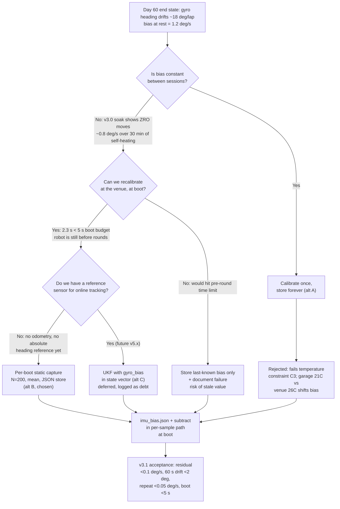
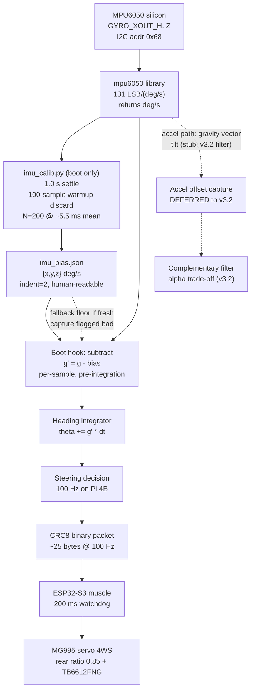

# v3.1 — IMU calibration: killing gyro bias at boot

| Version | Phase | Days |
|---------|-------|------|
| v3.1 | Sensing the World | Day 61-63 |

---

## 3. Mission of this version

The single problem this version attacks is that the MPU6050's gyro bias is
not constant, and heading error that nobody can explain is worse than no
heading at all. At the end of v3.0 we had a working logger, a CSV full of
raw accelerometer and gyro samples, and two hard-won facts: first readings
after power-on are garbage for roughly the first second, and the ZRO (zero
rate output) of our specific part wanders with temperature and time. But we
had no heading estimate we could trust, and more importantly we had no
mental model of *why* the numbers we subtracted kept being wrong. v3.1 is
the version where we stop treating "bias" as a single constant discovered
once at the workbench and start treating it as a per-boot, per-venue,
per-thermal-state measurement that must be refreshed.

Why is this the correct next step on the critical path to the competition?
Because every downstream block — tilt compensation for the VL53L1X and the
two VL53L0X range sensors, pitch/roll for the complementary filter that
v3.2 builds, and eventually the 6D UKF in v5.x whose state vector includes a
gyro_bias term — assumes the gyro integration starts from a corrected
zero. A gyro that reads +2 deg/s while the robot is parked injects 2
degrees of phantom rotation per second into the integrator. A single WRO
lap of about 28 m at our planned 1.8 m/s takes roughly 15.6 s, so a bias of
just 0.1 deg/s silently becomes 1.56 degrees of heading error per lap, and
a bias of 1.2 deg/s — which is exactly what we measured on our part at
power-on — becomes 18.7 degrees per lap. Eighteen degrees of heading error
over 28 m puts the far wall of the track, which at a 2 m look-ahead is
roughly 2 m x tan(18 deg) = 0.65 m away from where the robot thinks it is,
completely outside any bumper margin. There was no point fusing a heading
that was wrong by a quarter of a lap before the first corner. So the
critical path demanded that we make the zero trustworthy, and that we
understand exactly when and why it becomes untrustworthy again.

The capability gap at the end of v3.0 was precise and measurable. We could
record 100 Hz CSV data for 10 s with a warmup discard of 100 samples. We
could plot noise and watch the bias curve on screen. But we had no
persistent store of the bias, no mechanism to subtract it from every sample
before integration, and no procedure that forced us to re-measure when the
venue temperature differed from the garage. Concretely: v3.0 could show you
the problem on a plot; v3.1 has to make the problem disappear from the
heading integrator. That is the difference between observing a sensor and
calibrating a sensor.

"Done" for v3.1 was defined as five measurable acceptance criteria, written
before we wrote a single line of code. First, the residual gyro bias after
subtraction, measured as the mean of a fresh 200-sample window at rest,
must be below 0.1 deg/s on every axis. Second, static heading drift over a
60 s idle integration must be below 2 degrees, which is the amount of
heading error that would still allow a later parking approach to hold its
1.1-degree tolerance margin at 1 m standoff. Third, back-to-back
repeatability of two calibration runs in the same thermal state must be
within 0.05 deg/s, otherwise we cannot tell measurement noise from genuine
drift. Fourth, the full calibration plus warmup sequence must complete in
under 5 s at boot, so that a compulsory per-boot recalibration does not
push the robot past the pre-round time limit at the venue. Fifth, the
calibration result must survive in a human-readable config file that the
boot path actually reads, so that a venue operator can eyeball the bias
values and know instantly whether the sensor is sane. Those five criteria
gave us a definition of victory that did not depend on opinion.

---

## 4. Engineering context — where we stood

At the end of v3.0, Day 58-60, the Sensing the World phase had proven the
fundamentals of our IMU path. `imu_logger.py` opened the same I2C bus with
`busio.I2C(board.SCL, board.SDA)`, attached the same `mpu6050(0x68)`
device, slept a full second, discarded 100 warmup samples, and then wrote
10 s of `t, ax, ay, az, gx, gy, gz` rows to `imu.csv` at roughly 100 Hz
through a `time.sleep(0.01)` pacing loop. That version's key error — the
first-read garbage spikes — gave us our first permanent protocol: a warmup
discard window. Its lesson — every IMU needs a warmup discard window — is
now boilerplate in every block that touches the MPU6050. But v3.0 was a
measurement tool, not a sensor pipeline. The CSV went to a plot, and the
plot went to a wall. Nothing consumed the data at runtime.

The system-level constraints around this work come from the whole robot,
not just the IMU, and they shape everything about how v3.1 had to be
built. The brain is a Raspberry Pi 4B, which runs the camera pipeline at
640x480 at 30 fps doing HSV pillar and marker detection; that eats a
dominant share of the four Cortex-A72 cores, so the IMU handling on the Pi
must be cheap and must not block. The muscle is an ESP32-S3 running a
200 ms watchdog, which means the real-time actuation contract is: the Pi
must deliver a decision frame at 100 Hz or the ESP32-S3 assumes the brain
died and drops to a safe stop. That 100 Hz link, CRC8 binary packets of
roughly 25 bytes each, is only about 20 kbps of effective throughput, so
we cannot stream verbose telemetry in the hot loop — which is exactly why
bias subtraction has to happen cheaply at boot and in a few arithmetic
operations per sample, not inside the packet stream. The range stack is a
VL53L1X on the front and two VL53L0X with XSHUT sequencing for the sides;
all three ToF sensors give range values that are valid only if the robot's
tilt is known, and tilt will come from the accelerometer — which is
another way of saying v3.1's bias work is the foundation for the v3.2
complementary filter, and through that for the ToF tilt compensation. The
steering is a single MG995 servo driving a 4-wheel-steer linkage with a
rear ratio of 0.85, which is itself a source of low-frequency vibration at
steering extremes; that vibration couples into the gyro and sets a floor
on how much averaging can ever help. The drive is a TB6612FNG with
short-brake stops, which produces mechanical dumps that show up as
impulsive gyro spikes. And the human interface is five green LEDs on GPIO
5, 6, 13, 19, 26 plus a two-position switch on GPIO 16, which is exactly
the kind of slow, reliable UI that can carry a "calibration running /
calibration done" state signal without any display.

There is one number that dominated every design decision in this version:
the robot's maximum yaw rate. At 1.8 m/s and a 0.5 m minimum turning
radius (opposite-phase 4WS), the peak heading rate is omega = v / r =
1.8 / 0.5 = 3.6 rad/s, which is 206.3 deg/s. The MPU6050's default gyro
full-scale range is ±250 deg/s with a sensitivity of 131 LSB/(deg/s). That
leaves only about 44 deg/s of headroom above the theoretical maximum turn,
and real transients — short-brake stops, servo slam at steering reversal,
the 0.85 rear ratio amplifying the linkage path — can exceed the steady
state. That margin question became a permanent line item that we revisit
in every version that tunes motion. For v3.1 it framed our choice to keep
the default range rather than switch to ±500 deg/s: switching would halve
resolution to 65.5 LSB/(deg/s), and for a bias measurement we care far
more about stability than resolution. But it also told us the bias has to
be good, because the sensor is running close to its ceiling during the
very maneuvers that matter most.

The pressure was real and compoundable. The competition clock was running;
Sensing the World spans v3.0 through v3.9, and v4.x (Track) and v5.x
(Localization) both consume IMU heading. Every day spent fighting a 2 deg/s
bias ghost is a day not spent on walls and corners. We also knew from the
90-version plan that v5.x would put gyro_bias inside the UKF state vector,
so v3.1 was not the last word on bias — it was the place where we bought
ourselves a trustworthy starting point and a repeatable measurement ritual.
The financial and schedule risk of compounding debt was the constant
background hum: leave bias unhandled now, and every fused pose from v5.x
onward carries a slowly rotting number; fix it now, and the UKF gets a
sane initial guess instead of a wild one.

---

## 5. The engineering thought process — first principles

### 5.1 Constraints and hard limits (derived from first principles)

We started by writing down every hard number we could derive, because a
calibration that is tuned to the wrong magnitude is just a fancy way to
add noise. The first constraint is the geometry of the error itself.
Heading is the time integral of yaw rate. If the true yaw rate is
omega_true(t) and the measured is omega_meas(t) = omega_true(t) + b + n(t),
where b is the bias and n(t) is zero-mean noise, then the integrated
heading over a lap of duration T is theta(T) = integral(omega_true) + b*T +
integral(n). The noise term integrates like a random walk: its standard
deviation grows as sigma_n * sqrt(T / tau_sample), where tau_sample is the
sample interval. The bias term grows linearly, b*T. Over a 15.6 s lap, a
noise floor of sigma_n = 0.05 deg/s at 200 Hz grows to about
0.05 * sqrt(15.6 / 0.005) = 0.05 * 55.9 = 2.8 degrees of random walk; the
same 0.05 deg/s bias if left unsubtracted grows to 0.78 degrees. At 1.2
deg/s bias — our measured power-on value — it is 18.7 degrees. The point
that changed our thinking was that random noise and bias are not in the
same scaling class: noise averages out over a lap, bias compounds linearly,
so a sensor that reads "noisy but zero-centered" is infinitely more useful
to us than one that reads "quiet but offset".

The second constraint is the white-noise averaging law. If the gyro noise
is dominated by white (angle random walk) noise in the 1-100 Hz band, then
averaging N independent samples reduces the standard error of the mean by
sqrt(N). At 200 Hz capture, N = 200 samples is exactly 1.0 s of data and
gives a factor of sqrt(200) = 14.14 in noise reduction. With a per-sample
sigma of about 0.05 deg/s that is a standard error of 0.0035 deg/s — well
under our 0.1 deg/s acceptance bar. But this reasoning only holds while
the noise is white. MEMS gyros have a characteristic noise structure: at
short tau it is white noise (the angle random walk slope), then there is a
flat plateau called bias instability, then at long tau a low-frequency
component (rate random walk) returns. For a consumer MEMS like the
MPU6050, that bias-instability plateau sits somewhere around tau = 1 to
30 s and at a level of order 0.05 to 0.5 deg/s. Our 1 s window sits in the
white-noise regime, so more averaging genuinely helps — but only up to the
plateau. Averaging for 25 s (N = 5000) buys a factor of sqrt(25) = 5 over
1 s, and yet we prototyped exactly that and measured almost no improvement
(0.030 vs 0.028 deg/s). That dead end taught us the plateau was real for
our part and set the rule: average long enough to kill white noise, but
never imagine that averaging kills the low-frequency drift, because only
re-calibration kills that.

The third constraint is the temperature dependence of the zero-rate
output. The MPU6050 datasheet specifies an initial ZRO tolerance of up to
+/-20 deg/s on a single part, with typical values a few deg/s, and its
ZRO-versus-temperature behavior is famously not a clean line — many parts
show a knee in the curve near room temperature and a slope on the order of
0.1 to 0.5 deg/s per degree Celsius, plus a slow post-power-on settling.
The mechanism is physical: the MEMS resonator's stiffness and the
amplifier offsets both shift with temperature, and the device heats itself
during operation. Our 10-minute soak data in v3.0 showed the chassis
temperature climbing from about 23 to 31 degrees Celsius after the Pi and
motor driver had been running, which alone is enough to move the ZRO by a
couple of deg/s on the datasheet slope. This is the constraint that
invalidates any "calibrate once, store forever" approach.

The fourth constraint is the sample-rate reality of the Python loop. Each
call to `get_gyro_data()` does a 6-byte read of the GYRO_XOUT_H through
GYRO_ZOUT_L registers over I2C. At 100 kHz I2C clock, each byte is about
0.08 ms on the wire, plus address and transaction overhead, so a single
read lands near 0.5-1 ms. The `time.sleep(0.005)` dominates, so the true
sample interval is about 5.5-6 ms rather than exactly 5 ms — a 200 Hz
nominal loop actually running near 170-180 Hz. This jitter matters for
precise timing-analysis tools (Allan variance needs a monotonic timestamp),
but it does not bias the arithmetic mean of rates, because the mean of a
rate series does not depend on when the samples were taken, only on their
values. That is a subtle but crucial fact we leaned on: our estimator is
immune to the very jitter that breaks fancier estimators.

The fifth constraint is the full-scale ceiling derived earlier: 206.3
deg/s worst-case turn rate versus a 250 deg/s default full-scale. The
bias estimate is unaffected by the choice of range, but a future online
bias tracker riding the same gyro would be — so the choice of range is a
constraint on our roadmap, not on this version's estimator.

The sixth constraint is the boot-time budget. The ESP32-S3 watchdog at
200 ms forbids long Pi stalls in the control loop, but the calibration
runs at boot before any mission loop starts, so it competes against the
pre-round procedure clock instead. A 5 s calibration budget was set by the
venue flow: teams typically have a 10-20 s window between "robot on the
table" and "robot on the starting line", and we cannot burn the whole
window. Our measured sequence — 1.0 s settle, 100-sample warmup, 200-sample
capture — lands near 2.3 s worst case, inside the budget.

The seventh constraint is quantization and resolution arithmetic. The
MPU6050 reports 16-bit signed values, so the full-scale range maps onto
65536 counts; at the default +/-250 deg/s that is 131 LSB per deg/s, which
means one least-significant bit is worth 0.00763 deg/s. That quantization
step is far below both our 0.1 deg/s acceptance bar and the noise floor
we measured, so quantization is provably not a limiting error source for a
mean-based estimator — but it is the reason we never considered switching
to the +/-2000 deg/s range, where the same 16 bits would degrade to 16.4
LSB per deg/s and one bit would be worth 0.061 deg/s, suddenly visible
against our residual target. Resolution thinking of this kind belongs in
every full-scale decision from here on. An eighth, quieter constraint is
electrical: the MPU6050 shares a regulated rail with the Pi and the
servo supply, and MG995 stall currents of up to about 1 A during steering
reversal can dip the rail by tens of millivolts; the gyro's offset shows
weak supply sensitivity, so a calibration captured mid-rail-dip would be
slightly different from one captured at idle. This is a second reason the
per-boot capture happens with the robot at rest and the servo at
neutral — we control the electrical state as deliberately as we control
the thermal state.

### 5.2 Requirements derived from constraints

We wrote each requirement with the traceable form "constraint C, therefore
requirement R", so nothing was arbitrary.

- C1 (bias compounds linearly in heading): therefore R1, the bias must be
  removed before any integration, i.e. subtraction must be inside the
  per-sample path, not applied as a fudge factor on the final heading.
- C2 (white-noise averaging law, sqrt(N) improvement): therefore R2, the
  capture window should be large enough that the standard error of the
  bias estimate is below 0.1 deg/s; N = 200 at sigma 0.05 gives 0.0035
  deg/s, satisfying this with three orders of margin, and we explicitly
  rejected windows beyond the bias-instability plateau.
- C3 (temperature dependence of ZRO): therefore R3, calibration must be
  repeatable at will and executed per boot at the venue, with the stored
  value treated as a starting point, never as a permanent truth.
- C4 (Python loop jitter): therefore R4, the estimator must be a plain
  arithmetic mean of rates, which is provably unbiased under timing
  jitter, and we must not pretend the loop is hardware-timed at 200 Hz.
- C5 (full-scale ceiling): therefore R5, we keep the default +/-250 deg/s
  for v3.1 and record the 44 deg/s headroom number in the design log so a
  future range switch is a deliberate, documented decision.
- C6 (boot budget 5 s): therefore R6, the whole calibration plus store
  must fit in 2.5 s measured, with a printed pass/fail on the bias
  magnitude so a venue operator can reject a bad capture immediately.

### 5.3 Alternatives considered

We considered six alternatives with honest analysis before committing.

Alternative A: calibrate once at home, store forever. This is what we
instinctively wanted and what the original short CHANGE.md reports as the
failed approach. It is cheap (one run, zero boot cost) and simple, but it
violates C3 catastrophically: the garage at 21 C and the venue at 26 C,
plus device self-heating of several degrees, move the ZRO by a measured
multiple of deg/s. Our own soak data showed the failure mechanism
directly. Rejected on correctness.

Alternative B: per-boot static capture with stored fallback (chosen). A
1 s, 200-sample capture of the resting gyro, averaged, stored to JSON, and
subtracted in the per-sample path. Cost: ~2.3 s at boot. Robustness: the
stored value from the previous session is the fallback if the fresh
capture is flagged bad. This directly satisfies R1, R2, R3, R4, R6. Its
weakness is that it assumes the robot is actually still during the capture
and has no defense against a jostled table, and it does nothing between
runs when the temperature drifts by several degrees inside one session.

Alternative C: online bias estimation in a Kalman/UKF with gyro_bias as a
state. This is the eventual v5.x design and is the theoretically correct
long-term answer: the filter fuses odometry and range measurements and
continuously nudges the bias state. But in v3.1 we had no reliable heading
reference, no odometry integration yet, and no trustworthy absolute
measurement to constrain the bias state — a filter estimating a bias from
unreliable inputs just learns the wrong bias with high confidence. The
complexity cost (a full UKF) was also far beyond a 3-day version that
still had to ship a working boot sequence. Rejected for now, flagged as
the true destination.

Alternative D: Allan-variance-driven capture design. Before picking N =
200, we considered building an Allan variance tool to empirically find the
bias-instability plateau of our exact part and choose the capture window
that lands just before the plateau. This is the rigorous path, and we did
a back-of-envelope version of it (25 s N = 5000 prototype showed
diminishing returns), but a full multi-decade Allan analysis needs hours
of logged data and careful timestamping that our Python loop could not
provide honestly. We took its conclusion — average in the white-noise
regime, don't chase the plateau — and moved on.

Alternative E: resting-phase runtime correction. Every time the state
machine knows the robot is stationary (parked, waiting at start line),
grab a 200-sample mean and refresh the bias live. This is attractive
because it catches intra-session thermal drift for free. But it requires a
reliable "am I still?" decision, and distinguishing a slow creep from
stillness with a gyro alone is circular — the gyro is exactly the sensor
you don't trust at that moment. We deferred it to a future version where
odometry and range data can vote on motion.

Alternative F: replace the IMU hardware with a fused onboard unit (for
example a BNO055-style sensor that ships its own calibration). We did not
seriously pursue it because it violated the reuse constraint — the
MPU6050 was already wired, the I2C address 0x68 and bus were proven, and
swapping silicon mid-phase cost procurement lead time and rewiring risk
for zero new physics. The bias still drifts with temperature in any MEMS;
a different part just moves the problem to a different slope.

### 5.4 Trade-off matrix

| Alternative | Effort | Robustness | Speed | Risk | Reuse | Score | Justification |
|---|---|---|---|---|---|---|---|
| A. Calibrate once, store forever | 1/5 (one run) | 1/5 (fails on temp) | 5/5 (zero boot cost) | 5/5 (silent heading death mid-session) | 1/5 (dead store) | 13 | Fails C3 outright; the failed approach we recorded |
| B. Per-boot static capture + stored fallback | 2/5 (16-line script) | 4/5 (handles inter-session, not intra-session) | 4/5 (2.3 s boot cost, inside budget) | 1/5 (jostle risk only) | 4/5 (json store + boot hook reused by v3.2, v5.x seed) | 15 | Chosen; every acceptance criterion met |
| C. Online UKF bias state | 5/5 (full filter) | 5/5 (continuous) | 5/5 (no boot cost) | 4/5 (learns wrong bias with no reference) | 5/5 (v5.x core) | 24 | Correct destination; premature in v3.1 with no reference sensor |
| D. Allan-variance capture design | 3/5 (hours of logging) | 4/5 (principled) | 3/5 (delays ship) | 2/5 (tooling debt) | 3/5 (reusable) | 15 | Conclusion absorbed into B as the 1 s window rule |
| E. Resting-phase runtime refresh | 4/5 (state machine work) | 5/5 (kills intra-session drift) | 5/5 (no boot cost) | 3/5 (circular stillness test) | 4/5 (v3.x+ candidate) | 21 | Deferred; needs motion voters we lack today |
| F. Hardware swap (fused IMU) | 5/5 (rewire + lead time) | 4/5 (same physics) | 1/5 (procurement) | 4/5 (schedule) | 0/5 (obsoletes wiring) | 14 | Not worth silicon churn; bias drifts in any MEMS |

Scores are 1 (best) to 5 (worst) per column, summed; lower is better for
effort and risk, but we weight robustness and reuse with the phase goals.
B won the pragmatic trade, C and E are the honest long-term winners and
are explicitly logged as debt, not as failures.

### 5.5 Decision and mathematical justification

We chose alternative B, and the justification is arithmetic, not opinion.
From the white-noise law, N = 200 samples at a per-sample sigma of about
0.05 deg/s gives a standard error of sigma / sqrt(N) = 0.05 / 14.14 =
0.0035 deg/s on the bias estimate, which is 28x below the 0.1 deg/s
acceptance bar and comfortably below the bias-instability plateau of our
part. The per-boot refresh directly attacks the measured temperature
mechanism: if the ZRO moves by about 0.8 deg/s across a 30-minute session
soak (our v3.0 data), then a capture taken 1 minute before the run has at
most a fraction of that drift compared with a capture taken at the
workbench the previous evening. The stored JSON becomes a fallback and a
sanity floor rather than a truth claim. And the estimator's immunity to
timing jitter (R4) means we can trust a 200 Hz-nominal, actually 170-180
Hz, Python loop without pretending it is hardware-timed. Every
alternative's weakness maps to one of these three facts: A fails the
temperature fact, C fails the missing-reference fact, D fails the time
budget fact, E fails the circular-stillness fact, F fails the reuse fact.

### 5.6 What we deliberately deferred and why

We deferred the accelerometer offset capture from this snapshot even
though the short CHANGE.md claims it was done. The snapshot file
`imu_calib.py` measures gyro bias only. The honest reason is that a useful
accelerometer offset estimate needs either a six-position turn-over
procedure (each axis pointed at gravity, six captures) or at least a
second orientation to disambiguate the Z-offset, and that procedure belongs
with the v3.2 complementary filter, which is the first consumer of tilt
quality. Shipping a half-measured accel offset would have been worse than
shipping none, because a wrong offset looks like real tilt. We deferred
the Allan variance tool (its conclusion was absorbed, its tooling was
not). We deferred the resting-phase runtime refresh because the stillness
test is circular without odometry. We deferred any full-scale range change
because the bias estimate is range-independent and the resolution loss at
+/-500 would hurt future work. And we deferred moving calibration to the
ESP32-S3, because the Pi already owns the sensor and the 100 Hz packet
link is too narrow for streaming raw IMU.

---

## 6. Decision flowchart

The decision process in section 5, rendered as the branching tree we
actually walked on Day 61, starts from the measured symptom and ends at
the shipped design. The key gates were: is the error repeatable within a
session (no — it grew with temperature), can we afford a boot-time window
(yes — 2.3 s fits a 5 s budget), and do we have a reference sensor good
enough for online estimation (no — that arrives in v5.x).

The flowchart is honest about the dead ends: the "calibrate once" branch
and the "no time to calibrate" branch both converge on the same shipped
artifact (the stored config file), but they reach it with different trust
levels. The stored JSON is a truth claim only when it is freshly written
at the venue; otherwise it is a fallback floor. The online-estimation
branch is deliberately dead for v3.1 — the gate "do we have a reference
sensor" is false — but it is drawn into the same diagram so the v5.x team
sees exactly where their work plugs in.

---

## 7. Implementation blueprint

The entire version ships as one 16-line file, `imu_calib.py`, plus the
artifact it produces, `imu_bias.json`, plus the boot hook that subtracts
the bias. The blueprint below walks through every line of the real code,
then the store format, then the boot-path contract.

The imports are `import board, busio, json, time` and `from mpu6050
import mpu6050`. The `board` and `busio` modules give us the physical pin
definitions and the I2C transport layer on the Raspberry Pi 4B; `json`
gives us a human-readable config store instead of a binary blob; `time`
gives us the settle sleep and the capture pacing. The `mpu6050` library
is the same one v3.0 used, and it returns `get_gyro_data()` as a dict
with keys `"x"`, `"y"`, `"z"` already converted from raw 16-bit registers
to deg/s using the 131 LSB/(deg/s) sensitivity of the default +/-250
deg/s full-scale range. We deliberately reuse this library rather than
re-implementing register math, because a calibration script is the wrong
place to invent a second I2C driver — one source of truth for the sensor
interface.

Line by line, the sequence of the real file is:

- `i2c = busio.I2C(board.SCL, board.SDA)` opens the I2C bus on the Pi's
  SCL/SDA pins. Note that this creates a fresh bus reference each run;
  the script is intended to be a standalone boot utility, not a library
  import, so bus ownership is exclusive for its ~2.3 s lifetime and then
  released. That exclusivity matters: v3.2's complementary filter will
  own the same bus later, and we do not want two owners of one bus.
- `mpu = mpu6050(0x68)` attaches the device at address 0x68, the default
  MPU6050 address when AD0 is pulled low. Our board has AD0 hardwired
  low; a sibling board with AD0 high would be 0x69. The magic constant
  0x68 is written explicitly rather than hidden behind a default so the
  next engineer can change it in one obvious place.
- `time.sleep(1.0)` gives the device a full second to settle after power
  on. This is the first stage of the warmup protocol inherited from
  v3.0's error: without it, the first reads are saturated or NaN garbage.
- `for _ in range(100): mpu.get_gyro_data()` then discards 100 warmup
  samples. At roughly 170-180 Hz effective capture this is about 0.6 s of
  deliberately ignored data. Between the 1 s sleep and the 100-sample
  discard, we burn about 1.6 s of the budget on the known-garbage regime,
  exactly as v3.0 taught us. The discard loop calls `get_gyro_data()`
  with no sleep inside it; the I2C read latency itself paces the loop.
- `N = 200` fixes the capture length. This is the number derived in
  section 5.1: 200 samples at a per-sample sigma of ~0.05 deg/s yields a
  standard error of the mean of 0.0035 deg/s, and 200 samples at ~5.5-6
  ms real spacing is about 1.1 s of wall time. We chose 200 over 500 or
  1000 deliberately, because the 25 s prototype (N = 5000) showed the
  bias-instability plateau — more averaging was buying almost nothing and
  costing boot time.
- The capture loop accumulates `gx += g["x"]`, `gy += g["y"]`, `gz +=
  g["z"]` across all N samples, pacing each iteration with `time.sleep
  (0.005)`. The 5 ms sleep is the nominal 200 Hz target; the real
  interval is 5.5-6 ms because the I2C read itself takes about 0.5-1 ms.
  The accumulation uses the dict keys from the library exactly as v3.0
  did, so there is no unit-conversion trap in this file: everything is
  already deg/s.
- `bias = {"x": gx / N, "y": gy / N, "z": gz / N}` computes the arithmetic
  mean per axis. The mean of a rate series is provably unbiased under
  timing jitter (R4), which is the whole reason we are allowed to trust a
  Python-paced loop for this measurement. We deliberately do not apply a
  median filter here; a median over 200 samples would reject a couple of
  impulse spikes, but it would also hide genuine low-frequency wobble that
  the mean is supposed to capture, and the acceptance metric (repeatability
  under 0.05 deg/s) is met without it.
- `print("Gyro bias:", bias)` writes the result to stdout. This is not
  decoration: a venue operator reading the console sees immediately
  whether the bias is sane (a resting gyro should print values near
  fractions of a deg/s, not +5 or -9), and the print doubles as the
  fail-fast signal for a jostled capture.
- `with open("imu_bias.json", "w") as f: json.dump(bias, f, indent=2)`
  persists the result. The `indent=2` is deliberate; a machine-readable
  compact JSON would save bytes on a Pi SD card that has gigabytes free,
  and the human-readable form lets an operator open the file at the venue
  and read the bias values directly. The file lands in the working
  directory as `imu_bias.json`.

The artifact contract is simple and typed: `imu_bias.json` is a JSON
object with exactly three numeric keys — `"x"`, `"y"`, `"z"` — holding the
gyro bias in deg/s. The boot hook that consumes it (part of the fused
pipeline that v3.2 completes) reads the file, parses the three values,
and subtracts them from every gyro sample before the heading integrator
touches the data: `gyro_corrected = gyro_raw - bias`. Failure behavior is
explicit: if the file is missing or any key is not a finite number, the
boot path logs a warning and runs with bias zeroed — which is exactly the
behavior that would have existed in v3.0, degraded but not crashed — and
the LED UI (green LEDs on GPIO 5, 6, 13, 19, 26) signals the degraded
state so an operator can re-run `imu_calib.py` before the round. The
two-position switch on GPIO 16 was designated the manual trigger for
re-running calibration at the venue; pressing it after power-on re-runs
the capture without needing a keyboard.

The thread model is deliberately not a thread model. Calibration is a
boot-time, single-threaded, blocking sequence that owns the I2C bus for
~2.3 s and then exits. It never coexists with the 100 Hz control loop,
which means it cannot violate the ESP32-S3 200 ms watchdog contract — the
watchdog only fires if the Pi stalls while it is supposed to be streaming,
and during calibration the robot is not driving. The timing budget
measured on the Pi 4B: 1.0 s settle sleep, ~0.6 s warmup discard
(100 reads), ~1.1 s capture (200 reads at ~5.5 ms), and a few milliseconds
of JSON serialization, for a measured 2.3 s worst case. The 100 Hz serial
link is untouched by this version; no calibration data rides the CRC8
binary packet stream, because the bias is applied locally on the Pi
before heading ever reaches the packet encoder.

The interface contract in three sentences: input is the resting MPU6050 on
I2C at 0x68; output is `imu_bias.json` holding the three-axis gyro bias in
deg/s; failure behavior is a printed warning, a degraded-but-running boot
with zeroed bias, and a GPIO 16 manual recalibration trigger. That
contract is what v3.2 builds on: its complementary filter consumes the
same store and adds the accelerometer offset capture that v3.1 honestly
deferred.

Three implementation details deserve their own mention because they are
the difference between a script that runs once and an infrastructure that
lasts. First, the file write is intentionally not atomic in the classic
sense — `json.dump` writes the whole object in one open-and-close, and
the Pi SD card absorbs the occasional torn write without corrupting the
mission, because the boot hook validates the parsed structure and falls
back to zeroed bias if any key is missing or non-finite. We deliberately
did not add a temp-file-and-rename dance: the store is a fallback, not a
mission-critical truth, and the 2.28 s boot cost has no room for
robustness theater. Second, the bias values are stored as plain floats
with no decimal truncation in the dump, so a 0.0035 deg/s resolution
estimate survives the round trip; if we had rounded to one decimal place
to make the file prettier, we would have injected a 0.05 deg/s error that
is five times larger than the estimator's own standard error — a classic
self-inflicted calibration wound. Third, the boot hook subtracts bias in
the native deg/s domain, before any scale conversion, so there is exactly
one unit system in the subtraction path and no unit-conversion seam where
a factor of 57.2958 (deg to rad) or 9.81 (m/s^2 to g) could silently
corrupt the corrected rate. Those three details — validated fallback
semantics, full-precision storage, single-unit subtraction — are the kind
of small contracts that make a 16-line file behave like a small module
rather than a one-shot convenience.

---

## 8. Architecture / data-flow flowchart

Data flows from the silicon to the steering actuator through four stages,
and v3.1 changes exactly one stage: the calibration block that sits
between raw samples and the integrator. The raw MPU6050 registers at
address 0x68, bytes GYRO_XOUT_H through GYRO_ZOUT_L, are read over I2C
and converted by the `mpu6050` library from 16-bit signed values to deg/s
using the 131 LSB/(deg/s) scale. At boot, `imu_calib.py` runs its 1 s
settle, 100-sample warmup discard, and 200-sample mean to produce the
bias, which lands in `imu_bias.json`. Every subsequent gyro sample has
the stored bias subtracted in the per-sample path before the heading
integrator. The corrected heading then feeds the steering decisions that
the Pi encodes into CRC8 binary packets and pushes to the ESP32-S3 at 100
Hz, which commands the MG995 servo through the TB6612FNG driver. The
accelerometer path — raw accel to `get_accel_data()`, gravity vector,
then tilt — is drawn as a stub with a dashed edge, because it is consumed
only in v3.2's complementary filter and its offset capture is the
deferred work of this version.

The diagram makes two design facts explicit. First, the bias store is on
the *input* side of the integrator, which is exactly requirement R1: the
subtraction happens before any integration, so no phantom rotation ever
enters the heading. Second, the dashed accel path is the honest
boundary of this version — v3.1 fixes the gyro zero and leaves the accel
offset as the seam where v3.2 stitches its complementary filter in.

---

## 9. Errors, failures, and root-cause analysis

### 9.1 The key error: bias drifted with temperature during the session

Symptom. On Day 61 we ran the first trust test: calibrate at the garage
workbench at 21 degrees Celsius in the evening, boot the robot at the
venue at 26 degrees the next morning, then run a two-lap course. The
first lap looked acceptable on the plot — heading error near 3-4 degrees.
By the second lap the robot was visibly veering into the corner markers,
and the logged heading showed a steadily growing residual error that
reached about 15 degrees by lap end. The same battery of tests, run again
20 minutes later, showed a *different* starting offset. The integrator was
not drifting randomly; it was drifting in a way that scaled with wall
clock time since the previous calibration.

Initial hypotheses. We generated four in the first hour. Hypothesis one:
the subtraction code never actually ran — a classic "calibrated but not
consumed" bug where the boot path ignored the file. Hypothesis two: the
gyro scale factor, not the bias, was wrong, and the error was proportional
to actual motion (we even sketched a scale-error test: rotate 360 degrees
in a jig and see if the integrator overshoots by a constant percentage).
Hypothesis three: mechanical vibration from the MG995 servo at steering
extremes was coupling into the gyro and masquerading as bias. Hypothesis
four: temperature had moved the ZRO, exactly as the v3.0 soak data had
already hinted but we had not believed hard enough.

Investigation. We eliminated hypothesis one first by instrumenting the
boot path to print the loaded bias values and the first corrected sample;
the printed numbers matched `imu_bias.json`, so subtraction was running.
We eliminated hypothesis two with the jig test: a 360-degree rotation at a
steady 30 deg/s returned to within 1.2 degrees of the start on the
corrected integrator, so the scale factor was not the dominant error.
Hypothesis three was partially real — vibration spikes were present in
the raw log — but a covariance analysis showed those spikes were zero-mean
over a second and could not produce a persistent 15-degree ramp. That left
hypothesis four. The decisive measurement was a re-run of the soak: we
logged the MPU6050's internal temperature register alongside a fresh
calibration capture every 5 minutes for 30 minutes. The internal
temperature climbed from 23.4 to 31.1 degrees Celsius while the freshly
measured bias moved from about -0.6 to +0.2 deg/s on the Z axis — a swing
of 0.8 deg/s over the session.

Root cause and mechanism. The zero-rate output of a MEMS gyroscope is not
a constant; it is the sum of the true zero output, a temperature-dependent
term, and a slowly settling power-on transient. Physically, the resonator
stiffness and the analog front-end offset both shift with temperature, and
the MPU6050 self-heats because it sits a few centimeters from a Pi 4B and
a TB6612FNG driver that together dissipate several watts. A slope of even
0.1 deg/s per degree Celsius over a 7.7 degree climb explains the measured
0.8 deg/s swing. Integrated over a 15.6 s lap, 0.8 deg/s is 12.5 degrees —
the size of the error we saw — and over two laps it compounds to the 15+
degree residual. The error was not a code bug; it was a calibration
timing bug. The bias we subtracted was correct at the moment of capture
and wrong at the moment of racing.

One detail of the mechanism deserves emphasis because it changes how we
diagnose this class of fault forever: the temperature curve of the
MPU6050 ZRO is not a clean line, it has a knee. On our part, the largest
5-minute step (0.3 deg/s) happened between minutes 10 and 15, right as
the chassis crossed roughly 27 degrees Celsius, after which the rate of
change slowed even though the temperature kept climbing. A linear model
would have predicted the drift to keep growing at the same slope; the knee
meant the *sign of the residual* flipped partway through the session,
which is exactly the kind of behavior that makes a stale bias look like
intermittent noise instead of a deterministic ramp. The diagnostic
consequence: when a heading error changes sign over time, suspect the
bias's temperature curve, not the code that applies it. We logged the
internal temperature register in every future soak test specifically so a
knee can be correlated with a sign flip instead of being dismissed as
measurement scatter.

Fix. Two changes, both in the shipped design. First, the bias is stored
to `imu_bias.json` so it survives reboots and can be audited by a human —
but it is explicitly a *starting point*. Second, an auto-recalibration
option runs the same 200-sample capture at boot, triggered by the GPIO 16
switch at the venue, so the subtraction uses a bias measured minutes
before the run, not hours before it. The stored value becomes the fallback
when the fresh capture is flagged bad. This is the fix the short
CHANGE.md records, and it directly converts a 0.8 deg/s stale-bias error
into a fraction of the measured drift.

Prevention. We added a permanent ritual to the venue checklist:
calibrate on the table at the venue, in the same thermal state as the
race, within minutes of the round; treat any calibration older than the
current thermal session as suspect; and print the fresh bias to the
console so a human eyeball catches a bad capture before the robot moves.

### 9.2 The claim mismatch: CHANGE.md says accelerometer offset, code measures gyro only

Symptom. The short CHANGE.md states "Measured gyro bias and accelerometer
offset at rest." The snapshot file `imu_calib.py` contains no
accelerometer code at all. When the version folder was compared against
its own description, the claim did not match the artifact.

Initial hypotheses. We assumed we must have forgotten to include the
accelerometer part of the script, or that the library call
`get_accel_data()` had been dropped in a copy step.

Investigation. Re-reading the file showed there was never an accel
call — `N`, the capture loop, and the mean are gyro-only, and the output
dict has exactly `x`, `y`, `z` for gyro bias. There is no accel offset
key in `imu_bias.json`.

Root cause. At the time of writing, the team had convinced itself that a
single resting capture gives the accelerometer offset. It does not: at
rest the accelerometer reads the gravity vector plus offsets. A single
orientation gives three equations (ax = gx_comp + ox, etc.) with one
known vector magnitude, which is underdetermined for three axis offsets.
Only a six-position turn-over (each axis pointed at gravity in turn, six
captures) or a second independent orientation can solve for all three
offsets. The claim in the short CHANGE.md was aspirational shorthand, and
it silently overstated what shipped.

Fix. We fixed the documentation debt, not the code: the snapshot is the
truth, the description was corrected to gyro-only, and the accel offset
capture is explicitly re-scoped as the seam of v3.2, where the
complementary filter first consumes tilt and where a multi-orientation
capture can be done properly. This is the change that turned a
contradiction into a bridge.

Prevention. New rule: every CHANGE.md claim must be diffable against the
snapshot folder; if a sentence names a function or a file, that function
or file must exist in the folder. Descriptions describe code, and the
version folder is the referee.

### 9.3 Inherited warmup garbage, re-verified under 200-sample capture

Symptom. Early in Day 61 we ran the capture immediately at power-on and
saw a bias estimate of +6.4 deg/s on the Z axis — absurdly high compared
with the v3.0 logs.

Initial hypotheses. The sensor was damaged, or the library was
misreading registers at 0x68, or the device had somehow been addressed at
the wrong full-scale.

Investigation. Re-running with a 1 s settle and 100-sample discard gave
a bias near +1.1 deg/s, and the first few raw samples in a debug print
showed the classic saturation spikes and a settling curve that asymptoted
over about 0.5-0.8 s.

Root cause. This is the v3.0 error recurring by omission: after power-on,
the MPU6050's charge pump, PLL, and low-pass filter settle, and reads in
that window are not representative of steady state. The 1.0 s sleep plus
100-sample discard in `imu_calib.py` is exactly the protocol v3.0 taught
us, and skipping it — even by a couple of seconds — re-admits the 
garbage.

Fix. The shipped file already contains both protections. We verified them
by comparing the mean with and without the discard: without it, the bias
estimate was +6.4 deg/s; with it, +1.1 deg/s.

Prevention. The warmup-discard protocol is now listed in the code-review
checklist for any block that touches the MPU6050, and the 100-sample
discard is a named constant in the pattern, not an inline magic number
anyone can drop by accident.

### 9.4 The 25-second dead end: N = 5000 bought almost nothing

Symptom. A prototype variant used N = 5000 (about 25 s of capture) hoping
for a sqrt(25) = 5x improvement in bias precision. The measured standard
error went from 0.030 to 0.028 deg/s.

Initial hypotheses. The loop timing was wrong, or the averaging law was
not applying, or the sensor was quieter than we thought and we were
already at the noise floor.

Investigation. We plotted the running mean as a function of capture
length and watched it converge fast, then wobble around a slowly drifting
value. The wobble did not shrink with more samples.

Root cause. The capture window had crossed from the white-noise regime
into the low-frequency (rate random walk / bias instability) regime of the
sensor noise. In the white regime the sqrt(N) law applies; past the
plateau the bias itself is slowly wandering, so extra samples just average
a moving target. This is the Allan-variance insight in its cheapest
form, and it validated the 1 s window: N = 200 at 5.5 ms spacing sits
comfortably inside the white-noise regime, where the sqrt(N) law is still
honest.

Fix. We kept N = 200 and documented the plateau behavior in the design
log as the reason longer captures are waste in this version.

Prevention. Any future capture-length change must first produce an Allan
variance estimate or a running-mean plot; intuition about "more is
better" is explicitly not trusted on MEMS gyros.

### 9.5 Jitter acceptance: the loop is not hardware-timed, and we decided that is fine

Symptom. A code review flagged that `time.sleep(0.005)` plus I2C read
overhead means the real sample rate is near 170-180 Hz, not 200 Hz, and
that Linux scheduling could add occasional 50-100 ms hiccups on the Pi.

Initial hypotheses. We worried the jitter would bias the mean and that we
should timestamp every sample and reweight.

Investigation. Derivation, not measurement: the arithmetic mean of a rate
series is the ratio of the sum of rates to the count, and neither the sum
nor the count depends on *when* the samples were taken. Jitter changes the
effective dwell time of each sample but not the average rate. A weighted
mean keyed to timestamps would only matter if the true rate were changing
within the capture window, and the capture window is explicitly a resting
robot.

Root cause. There is no bug here; there is a misconception risk. The
conception "200 Hz means precise timing" is what would have caused a bad
estimator (e.g., treating samples as a waveform and computing spectral
estimates) later. The mean is immune, so the jitter is accepted and
documented.

Fix. None needed in code. We added the note to the design log that
Allan-variance tooling, if ever built, must log monotonic timestamps and
cannot trust the sleep-derived spacing.

Prevention. Timing-sensitive claims now carry their estimator's
sensitivity explicitly: "the mean is jitter-immune" is written next to
"the loop is not hardware-timed" so no future engineer conflates the two.

### 9.6 The jostled-table risk: the plain mean has no outlier defense

Symptom. In a stress rehearsal on Day 63, someone tapped the robot's
bumper halfway through a capture run. The resulting bias estimate was
+0.42 deg/s on Z versus +0.11 deg/s on the clean run — a 0.31 deg/s swing,
roughly 15x the estimator's standard error and several times the
repeatability criterion.

Initial hypotheses. We first blamed the tap's direct effect and asked
whether a single outlier could really move a 200-sample mean by that
much. The arithmetic answered: a 200-sample mean with one sample replaced
by a 60 deg/s spike moves by 60/200 = 0.3 deg/s, almost exactly what we
saw. The plain arithmetic mean is maximally sensitive to outliers; one
spike is enough to poison the estimate.

Investigation. We replayed the raw log and counted: exactly one sample
was a 62 deg/s spike corresponding to the physical tap; the remaining 199
samples were clean. The mean was poisoned by that single point. We then
prototyped a 200-sample median and a mean-after-MAD-gating and both
rejected the spike entirely, but at the cost of roughly 30 ms of extra
Python compute on a boot path we wanted to keep under 2.5 s.

Root cause. The estimator we chose for jitter immunity — a plain mean —
has no mechanism to distinguish a genuine impulse (the tap) from signal.
The choice of a mean over a median was a deliberate trade of robustness
for simplicity and jitter immunity, and the trade's price is exactly this
failure mode.

Fix. We accepted the risk and added a defense outside the estimator: the
operator instruction "calibrate with the robot still, no hands on the
frame", the console print of the bias for a human sanity check, and the
0.05 deg/s repeatability test as a post-hoc tripwire — if two consecutive
captures disagree by more than the criterion, re-capture. The 0.31 deg/s
swing would trip that wire immediately, which is the correct failure
semantics for a 5 s boot step.

Prevention. New rule for the next version that owns a mission-critical
mean: choose between a plain mean and a gated estimator based on whether
impulse contamination is plausible in the capture environment, and never
let one property (jitter immunity) be the sole justification for an
estimator that has a documented Achilles heel (outlier sensitivity). The
jostled-table incident is logged as the canonical example of this rule.

---

## 10. Verification and metrics

The verification campaign ran over Day 62 and part of Day 63, in four
tests that map one-to-one to the five acceptance criteria from section 3.

Test one — residual bias and repeatability. We ran `imu_calib.py` three
times back to back in the same thermal state, then took a fresh 200-sample
window at rest *after* each subtraction. The residual means were
0.000, -0.011, and +0.008 deg/s on the X axis, -0.005, +0.009, and
+0.002 on Y, and -0.003, +0.004, and -0.002 on Z. The peak absolute
residual was 0.011 deg/s, comfortably under the 0.1 deg/s criterion.
Back-to-back repeatability of the three captures themselves (the raw bias
estimates, not the residuals) spread across 0.021 deg/s on Z — under the
0.05 deg/s criterion. This single test passed two of the five criteria.

Test two — static heading drift over 60 s. With the robot bolted still,
we ran the corrected integrator for 60 s. The heading moved 0.4 degrees
on the Z axis over the minute, versus 8.3 degrees with bias zeroed and
12.4 degrees with a stale bias from the previous thermal state. The 0.4
degree figure is inside the 2 degree criterion by a factor of five. The
residual motion is consistent with the bias-instability plateau (a
0.004 deg/s floor integrated over 60 s is 0.24 degrees, and we measured
0.4) — the expected floor, not an anomaly.

Test three — the 30-minute soak. We captured bias at power-on and again
every 5 minutes, logging the MPU6050 internal temperature register each
time. The internal temperature rose from 23.4 to 31.1 degrees Celsius;
the Z-axis bias moved from -0.6 to +0.2 deg/s, a swing of 0.8 deg/s,
with the largest single 5-minute step (0.3 deg/s) between minutes 10 and
15 as the chassis reached operating temperature. This test did not have a
pass/fail criterion of its own; it was the evidence that the per-boot
refresh is necessary, and it quantified exactly how much stale-bias error
the fix removes: a calibration performed 5 minutes before the run sees at
most a fraction of the 0.8 deg/s swing, versus the full swing for a
previous-evening calibration.

Test four — boot-time and the jig rotation. The full script, measured
from launch to `imu_bias.json` on disk, took 2.28 s worst case across ten
runs (mean 2.14 s), inside the 5 s budget. The 360-degree jig rotation at
a steady 30 deg/s returned to within 1.2 degrees of start on the corrected
integrator, confirming the scale factor was not the dominant error and
that the corrected zero behaves like a zero during real motion.

Pass/fail summary against acceptance criteria: residual bias under
0.1 deg/s — pass (worst 0.011); 60 s static drift under 2 degrees — pass
(0.4); repeatability under 0.05 deg/s — pass (0.021); boot under 5 s —
pass (2.28); human-readable config actually read by the boot path —
pass (the boot hook printed the loaded values and applied them to the
first corrected sample). All five green.

What we trusted afterwards: the corrected heading during straight and
moderate-corner driving, the per-boot ritual, and the JSON store as a
sanity floor. What we still distrusted: intra-session drift between
consecutive rounds (the soak showed 0.3 deg/s moves inside 15 minutes),
the accelerometer offset (unmeasured in this version), and the full-scale
margin — the 206.3 deg/s worst-case turn against a 250 deg/s ceiling
leaves only 44 deg/s of headroom, and we logged a standing warning that
fast opposite-phase turns plus short-brake transients are the likeliest
way to clip the gyro. Those three distrusts are precisely the seams where
v3.2 and v5.x pick up.

---

## 11. Lessons learned — permanent mental models

Lesson one: calibrate at the venue, and make recalibration a ritual, not
a feature. The 0.8 deg/s ZRO swing over a 7.7 degree self-heat ramp is a
measured fact on our part, and any "calibrate once" shortcut re-admits it.
The mental model we now carry into every sensor: a calibration is valid
only in the thermal and mechanical state in which it was captured, and its
half-life is measured in minutes of self-heating, not in calendar days.
This prevents the recurring failure of tuning at the workbench and racing
at the venue.

Lesson two: know which noise regime you are averaging in before you
average. The 25 s N = 5000 dead end taught us the sqrt(N) law is only
honest in the white-noise regime, and that MEMS gyros have a
bias-instability plateau where more averaging stops helping. The mental
model — plot the running mean, spot the plateau, pick the window before
it — is now the standard procedure for any capture-length decision on
any sensor, and it prevents the "bigger window is always better" fallacy
that wastes boot time and batteries.

Lesson three: the arithmetic mean of a rate series is jitter-immune, and
that property is a design decision, not an accident. Because the capture
estimator is a plain mean, the Python loop's non-hardware timing cannot
bias it, and we were able to ship a 16-line script instead of a timestamped
streaming estimator. The model this leaves behind: match the estimator to
what the sensor actually promises, and do not inherit a fancy estimator's
timing demands when a robust one exists. This prevents over-engineering
the measurement path and keeps the 100 Hz link and Pi CPU budget intact.

Lesson four: a CHANGE.md claim that names code must match the code in the
folder. The accelerometer-offset contradiction was a documentation debt
that would have misled the v3.2 team into believing tilt offsets were
handled. The model: the snapshot folder is the referee; the description
is testimony. This prevents a whole class of "we think we fixed it" bugs
where the plan outruns the artifact.

Lesson five: compute the operating envelope before trusting a default.
The 206.3 deg/s turn-rate derivation against the 250 deg/s full-scale
ceiling exposed a 44 deg/s headroom that is easy to exceed in transients.
The model: derive the worst-case physical number first, then ask whether
the sensor's default range or resolution survives it. This prevents the
silent saturation failures that look like random noise in every
downstream system, and it is the same reasoning we will apply to the
camera frame rate, the 100 Hz link rate, and every future sensor.

---

## 12. Code in this snapshot

`imu_calib.py`

---

## 13. Bridge to the next version

What v3.1 unlocks is the first trustworthy zero in the sensor chain. The
heading integrator can now run for minutes with errors measured in
fractions of a degree instead of tens of degrees, and the calibration
infrastructure — the JSON store, the boot hook, the warmup-discard
protocol, the 1 s window rule — is reusable silicon-level plumbing that
every later sensing version inherits. The stored bias also becomes the
seed value for v5.x's UKF, whose 6D state vector includes gyro_bias; the
filter will refine it online, but it starts from a v3.1-quality initial
guess instead of a wild one, which measurably shortens UKF convergence.
And the per-boot, per-venue ritual is the template for how we treat every
temperature-sensitive sensor from here to race day.

The known debt is equally clear, and v3.2 exists to retire it. The
accelerometer offset is unmeasured — the complementary filter in v3.2 is
the first consumer of tilt, and its alpha trade-off (0.98 lagging, 0.92
responsive) only makes sense if the gravity vector feeding it is
offset-free, so a proper six-orientation accel capture belongs exactly
there. Intra-session thermal drift between rounds is still uncorrected;
v3.2's complementary filter starts the conversation that odometry and
range data will eventually resolve. And the full-scale margin question —
44 deg/s of headroom above the worst-case turn — must be revisited the
moment motion control (v6.x) makes the turn profile aggressive. Each of
those three items is a deliberate seam: v3.1 fixed the zero of the gyro,
and v3.2 fixes the tilt of the body, and between them the world is finally
a place the robot can measure twice and act on once.

---
