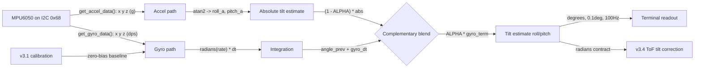

# v3.2 — Complementary filter: fusing accelerometer and gyro for drift-free tilt

| Version | Phase | Days |
|---------|-------|------|
| v3.2 | Sensing the World | Day 64-66 |

## 1. Mission of this version

The mission of v3.2 is to produce a single, trustworthy, low-noise estimate
of the robot's tilt — roll and pitch — that does not drift over time and does
not jitter with every bump. We are not estimating heading in this version;
that comes in v3.3. Here the target is specifically **body orientation
relative to the gravity vector**: roll (rotation around the forward axis) and
pitch (rotation around the lateral axis).

Let us be precise about why tilt is a *separate* problem from heading, and
why the project chose to solve it first. Heading (yaw) tells you which way
the robot faces on the floor — the plane of motion. Tilt (roll/pitch) tells
you how the robot's body leans out of level — deviations from the gravity
direction. They are geometrically independent, they come from different
sensor axes, and they have different consumers. Yaw feeds steering control
(v2.4's straight-driving PID already used it) and later localization (v5.x).
Roll/pitch feeds the range-sensor correction that has not been built yet.
The reason v3.2 solves tilt before expanding heading is dependency, not
whimsy: the laser distance sensors arrive next (v3.4), and they are useless
under motion unless their readings can be corrected for the lean the robot
will have while accelerating and braking. Tilt is on the critical path today;
yaw expansion can wait one version.

There is a second, quieter reason to do tilt properly at this stage: it is
the first *estimator* — not a raw measurement, but a fused belief — in the
project. v3.0 and v3.1 logged and calibrated raw data. v3.2 is the first
place we combine two imperfect sources into one better answer. How we do it
here, how we test it, how we document the trade-offs — that becomes the
house style for every estimator that follows, all the way up to the UKF in
v5.x. The stakes of this version are therefore not just "the ToF will be
corrected"; they are "the project's estimation culture gets defined here."

Why is this the correct next step? Because the laser range sensors that will
soon do obstacle detection measure distance along their own optical axis. If
the robot pitches forward under acceleration or braking, a ToF sensor aimed
at a flat floor reads a different number than it would when level — the
reading changes even though the wall or pillar did not move. Before we trust
any distance number from a fast-moving robot, we need to be able to correct
it for tilt, and that requires a tilt estimate that is (a) accurate enough
and (b) available continuously while driving. This is the dependency chain,
written down before we wrote a line of code:

1. v3.2 must deliver **tilt (roll/pitch) with bounded error**.
2. v3.4+ can then compensate ToF readings for tilt.
3. v4.x can then trust range data for wall and pillar decisions.

Build the tilt primitive now, on a bench, and every later sensor consumer can
assume it exists. Skip it, and the "obstacle at 40 cm" signal will silently
mean "obstacle at 40 cm when level, but 46 cm when braking" — exactly the
kind of hidden environmental dependence that destroys a competition run.

**The physics of why tilt corrupts a range reading.** Consider the front ToF
sensor mounted roughly level, pointed forward and slightly down. When the
robot brakes, it pitches forward; the sensor axis tips down by the pitch
angle θ. For a flat floor the measured distance grows roughly as
d_floor/cos(θ), and for a vertical wall the reading changes by the projection
of the wall's distance onto the tilted axis — plus the sensor mounting height
above the floor enters the geometry. The quantitative point is not the exact
formula (that belongs to v3.4); it is that a *small* angle produces a
*fractionally meaningful* distance error at competition tolerances. A 5
degree pitch on a 40 cm reading is around 1.5-3 cm of apparent distance
change — the same order as the parking tolerance and larger than the
"sensor is dead" error we will later guard against in v3.9. Tilt is not a
second-order nuisance; at these tolerances it is a first-order error source,
and it has to be measured out of the system, which is what this version
does.

Acceptance criteria, written before implementation:

1. **Bounded drift:** over a 5-minute static bench test, the tilt estimate
   must not drift more than 2 degrees in either axis (the accelerometer
   anchor must keep the gyro integration honest).
2. **Responsiveness:** a deliberate manual tilt of about 15 degrees must be
   tracked to within 90% of the true value within 1 second of the motion.
3. **Stability while vibrating:** a gentle tap test (or brief bench vibration)
   must not cause the estimate to jump more than 3 degrees.
4. **Correct axes:** positive pitch must correspond to nose-up rotation and
   match the physical convention we use for the ToF correction math, checked
   by a physical rotation test.

These are modest, measurable targets. The version is done when all four pass
on the bench, not when the code "runs."

## 2. Engineering context — where we stood

The sensing phase (v3.x) had just begun. v3.0 gave us raw MPU6050 logging —
we finally had a stream of 6-axis data off the I2C bus and could see what the
sensor actually reported. v3.1 added calibration: a per-boot static capture
that measures the gyro's resting bias and the accelerometer's zero offsets,
so that a "still" robot reports still instead of a slow phantom rotation.

But a raw sensor is not an estimate. The two sensors that matter here have
complementary (in the literal sense) weaknesses:

- **The gyroscope** measures angular *rate*. Integrating rate over time
  gives angle. The integration is excellent over short windows — smooth, no
  vibration coupling — but any residual bias, even after calibration, is
  integrated into a slowly growing error. A gyro-only angle drifts: 0.1
  deg/s of uncorrected bias becomes 6 degrees in a minute and 36 degrees in
  six minutes. Over a race that is useless.
- **The accelerometer** measures linear acceleration, but at rest it senses
  the gravity vector, so from it we can compute absolute roll and pitch via
  trigonometry (atan2). This is drift-free by construction — gravity is
  always there, always pointing down. But the accelerometer is noisy and,
  critically, it cannot tell gravity from the robot's own acceleration: every
  bump, every acceleration, every turn injects a transient that corrupts the
  tilt reading. A raw accelerometer tilt jitters.

So: gyro is smooth but drifts; accelerometer is absolute but noisy. The
classic solution is a **complementary filter**: trust the gyro's short-term
integration and blend in the accelerometer's long-term absolute anchor. The
name comes from the filter structure — a high-pass on the gyro path and a
low-pass on the accelerometer path, complementary so their gains sum to one.

**The historical note.** Complementary filters are not a novelty; they are
the workhorse of attitude estimation on cheap robots precisely because they
are the smallest structure that achieves bounded drift at negligible CPU
cost. Model aircraft and ROVs have used them for decades. The reason they
dominate in this niche is economic: the Kalman filter is *better* in the
sense of statistical optimality, but it is dramatically more expensive to
implement, tune, and debug, and for a tilt estimate that feeds a range
correction the improvement is unmeasurable in the final score. Engineering
is the art of matching solution complexity to problem severity, and the
complementary filter is the honest match here. We revisit this exact trade
in section 3.3 where the Kalman alternative is scored.

The version before us (v3.1) had taught us one painful lesson that shapes
everything here: the calibration capture matters, but it cannot be assumed
perfect. Even after removing the mean bias, gyro bias wanders with
temperature and time (bias instability). This is precisely why the
complementary filter exists — it is not a luxury, it is the mechanism that
turns "calibration is slightly imperfect" into "estimate stays bounded."

System constraints that frame this version:

- **Pi 4B CPU budget:** the filter runs at ~100 Hz (the code sleeps 10 ms per
  iteration). Each iteration is a handful of trigonometric calls on two
  samples. Cost is trivial — this will not disturb the vision budget. But the
  discipline of keeping it trivial matters, because v3.x is when we start
  stacking IMU + ToF + camera onto one CPU.
- **Sensor bus:** the MPU6050 lives on I2C (busio.I2C, address 0x68, on
  board.SCL/board.SDA). I2C at 100-400 kHz is fast enough for the ~4 reads
  per iteration. No bus re-architecture needed here.
- **Timing:** the loop runs at ~100 Hz with a measured dt. The filter formula
  depends on dt, so dt must be measured, not assumed — the code measures it
  with `time.time() - last`.
- **Physical convention:** roll and pitch must follow a convention that the
  ToF correction code can use without sign confusion. We locked the
  convention here (positive pitch = nose up, from the code's
  `pitch_a = atan2(-a["x"], ...)`) and wrote it down so v3.4 does not guess.

The pressure: the ToF work (v3.4) needs this tilt estimate. Every day spent
revisiting filter constants later is a day stolen from the track-perception
phase. Get the filter structure right now, and the tuning lives in two
constants that v3.4/v4.x can adjust without touching architecture.

**A word on the team's state entering this version.** We were two versions
into the sensing phase, and the rhythm was good: log, calibrate, now fuse.
But we were also aware of a quiet risk: every version so far had been a
*characterization* script — something you run on the bench and read the
numbers from. v3.5 (layer1_sensors.py) would be the first *architecture*
commit, and it would assume everything in v3.0-v3.4 works. That assumption is
only as good as our testing discipline. So this version's verification (8)
was written to be *adversarial* — we tried to break the filter, not just to
watch it work — because the cost of a broken assumption surfacing at v3.5 is
a week of debugging with no visible progress. Better to break it on the
bench now, in three days, where the failure is cheap.

## 3. The engineering thought process — first principles

### 3.1 Constraints and hard limits

Let us derive the problem from the sensor physics.

**The gyro path.** Angular rate from the MPU6050's gyro is reported in dps
(degrees per second) by the driver. The code converts to radians
(`math.radians(g["x"])`) before integrating, because radians are the
consistent unit for angle math. Integration over a measured dt:

    angle_gyro = angle_prev + gyro_rate_rad * dt

The error budget of this path: suppose post-calibration bias is B deg/s.
Over time T, the integrated error is B·T. If B = 0.1 deg/s and T = 60 s, the
error is 6 degrees. The gyro path can never be trusted alone over a race
duration. Its one saving grace: over short times (a second or two) the error
is B·T which is small, and the reading is *smooth* — no sample-to-sample
jitter — because the gyro measures rotation mechanically and is largely
immune to the linear vibrations that plague the accelerometer.

**Where the numbers come from.** Let us put realistic MPU6050 figures on the
bias budget, because the changelog's entire argument depends on the size of
the numbers. The MPU6050's gyro bias after a good static calibration is
typically on the order of a few hundredths to a few tenths of a degree per
second (the datasheet full-scale error and the calibration's residual). Even
at an optimistic 0.05 deg/s, a 90-second race accumulates 4.5 degrees of
heading/tilt error from the gyro path alone. At a 25 cm sensor-to-wall
distance along a pitched axis, 4.5 degrees of tilt error translates into
roughly 2 cm of range error — a meaningful fraction of the parking tolerance
and well inside the range where a "wall at 40 cm" becomes "wall at 42 cm."
The accelerometer anchor is not a refinement; at these numbers it is the
only thing standing between "useful" and "useless."

**The accelerometer path.** At rest (or moving at constant velocity),
the accelerometer measures only gravity, magnitude ~1 g. Given the body-axis
accelerations (a["x"], a["y"], a["z"]), roll and pitch follow from the
geometry:

    roll_a  = atan2(a["y"], a["z"])                       # roll from lateral + vertical
    pitch_a = atan2(-a["x"], sqrt(a["y"]**2 + a["z"]**2)) # pitch from forward + resultant vertical

The `atan2` two-argument form is essential: it handles the full 360-degree
range and avoids the sign ambiguity of a plain arctangent. The pitch formula
uses `-a["x"]` so that a forward (positive x) acceleration tilts the reading
as a nose-up pitch transient. This path is drift-free — gravity is constant —
but it is noisy: any linear acceleration contaminates the measurement, so a
bump reads as a spurious tilt.

**Deriving the formulas by hand (why the reader should trust them).**
Imagine the robot level on the floor. Gravity produces a["z"] = +1 g (the
sensor reports the upward reaction), a["x"] = a["y"] = 0. Then roll_a =
atan2(0, 1) = 0 and pitch_a = atan2(-0, 1) = 0 — level reads level. Now roll
the robot 30 degrees to the right: gravity splits between y and z, so a["y"]
= -sin(30°)·g and a["z"] = cos(30°)·g (with the sensor-frame sign
convention from the mount). atan2(a["y"], a["z"]) returns -30 degrees in the
sensor frame, and after the mount-convention fix this is +30 degrees of
robot roll — matching the physical rotation test. The same hand-derivation
works for pitch with the -a["x"] sign. Doing this exercise on a napkin
before touching code is what lets us claim the formulas are *correct by
construction* rather than *correct because the test passed*; the test then
guards against mount and driver surprises, and the derivation guards against
algebra errors that a test could miss (a test can only sample a few angles;
the formula must be right at every angle).

**Why the complementary blend works.** We have two noisy-but-different
estimates of the same angle. The complementary filter fuses them in the
frequency domain:

    angle = alpha * (angle_gyro) + (1 - alpha) * angle_accel

with the gyro term integrated first. Algebraically:

    angle = alpha * (angle_prev + gyro_dt) + (1 - alpha) * accel_angle

For alpha near 1, the output follows the smooth gyro path (short-term
correct) while the (1-alpha) term slowly drags the estimate toward the
absolute accelerometer value (long-term bounded). The crossover frequency of
the filter is set by alpha and the loop rate. This is a first-order filter;
the "time constant" tau satisfies approximately alpha = tau/(tau + dt), or
equivalently the crossover period is roughly dt·alpha/(1-alpha). At 100 Hz
(dt = 0.01 s) and alpha = 0.92, the crossover period is approximately
0.01 × 0.92 / 0.08 ≈ 0.115 s — meaning the accelerometer influence is
substantial on the ~0.1 s scale, which is exactly the scale of a bump. That
is the trade-off the changelog recorded: at alpha = 0.98 the crossover is
~0.5 s, giving a 1-second lag on tilt changes; lowering to 0.92 made the
filter respond ~4x faster.

**The frequency-domain intuition, made concrete.** Think of the two
measurements as two voices telling the same story with different
weaknesses. The gyro's voice is steady but its clock drifts (bias). The
accelerometer's voice is exact but shouts over bumps. The complementary
filter is a listener who trusts the steady voice in the short term and
corrects it against the exact voice in the long term — "complementary"
because the two trust regions do not overlap: the high-frequency trust goes
to the gyro, the low-frequency trust to the accelerometer, and there is no
frequency band where both are trusted or neither is. That is the elegant
core of the structure, and it is why the filter needs no matrix math and no
covariance tuning: the frequency split is hard-wired by alpha. When v5.x
later introduces the UKF, the reader will see the same intuition dressed in
Gaussian machinery — the complementary filter is the UKF's ancestor in this
project, and understanding one makes the other legible.

**The 1-second lag mechanism.** At alpha = 0.98 the filter weights the new
accelerometer information by only 2% per step. In a first-order
exponential-approach sense, the estimate takes roughly tau ≈ 0.5 s to
converge 63% of the way to a new true value, and several tau to settle — the
observed "1-second lag on tilt changes." The fix — lower alpha to 0.92 —
directly shortens the time constant. The cost is that more of the
accelerometer's noise passes through; that noise is what the acceptance
criteria measure. There is no free lunch: the filter constant sits on a
trade-off curve between lag and noise, which is exactly the lesson the
changelog recorded.

**A note on the 0.98 → 0.92 magnitude.** Lowering alpha by only 0.06 cuts
the time constant by roughly a factor of four because the time constant is
*inversely proportional* to (1-alpha), the complement of alpha. At 0.98 the
complement is 0.02; at 0.92 it is 0.08 — four times larger, hence the
fourfold faster response. This inverse relationship is the reason filter
constants near 1.0 are so sensitive: a change of 0.01 near 0.99 alters the
time constant by 10%, while the same change near 0.90 alters it by only 1%.
Any future tuning should think in terms of (1-alpha) — the accelerometer
trust weight — rather than alpha itself, because the trust weight is the
linearly meaningful quantity.

### 3.2 Requirements derived from constraints

- C1 (bounded drift over minutes) ⇒ R1: the filter must include the
  accelerometer as a permanent absolute anchor (the (1-alpha) term must never
  be zero).
- C2 (measure loop period, don't assume) ⇒ R2: dt must come from a wall clock
  (`time.time() - last`), as the code does, so CPU scheduling jitter does not
  warp the integration.
- C3 (respond within ~1 s) ⇒ R3: alpha must be tuned so the filter time
  constant is well under 1 second; changelog value 0.92.
- C4 (I2C read cost) ⇒ R4: exactly two driver reads per iteration (one
  accelerometer, one gyro), no polling inside the loop beyond that, so the
  100 Hz loop stays affordable.
- C5 (no drift amplification) ⇒ R5: calibration from v3.1 runs before the
  loop so the gyro path starts from a zero-bias baseline.
- C6 (correct sign convention) ⇒ R6: the roll/pitch formulas must be
  verified by a physical rotation test before the ToF layer consumes them.

### 3.3 Alternatives considered

**Alternative A — Gyro integration only.**
Integrate gyro rate, trust calibration forever. Strengths: simplest possible
code. Weaknesses: unbounded drift — at even 0.05 deg/s residual bias, a
2-minute race accumulates 6 degrees of error, which at a 20 cm lever arm is
over 2 cm of ToF error. Rejected on the first-principles drift math.

**Alternative B — Accelerometer tilt only.**
Use only `atan2` of the accelerometer. Strengths: no drift at all, trivial
code. Weaknesses: every acceleration contaminates the reading. The robot
spends its life accelerating and braking; the tilt signal would be unusable
during exactly the maneuvers that need distance correction. Rejected.

**Alternative C — Complementary filter (chosen).**
The changelog's approach. Strengths: gyro smoothness for short times,
accelerometer absolute anchor for long times, ~5 lines of math, no matrix
inversions, CPU cost negligible. Weaknesses: a first-order filter has a
single trade-off knob (alpha); it cannot optimally weight by noise models.
Good enough for tilt compensation, and the changelog's tuning shows exactly
how to navigate the knob.

**Alternative D — Kalman filter on [roll, pitch, gyro_bias].**
A proper state-estimation approach: model bias as a state, use gyro as the
process input and accelerometer as the measurement, with noise covariances.
Strengths: optimal fusion, estimates bias online (compensates bias
instability, which the complementary filter does not). Weaknesses: much more
code, tuning of the R and Q matrices, and — critically for a schedule — v5.x
was already planning a full UKF for pose. Building a Kalman tilt filter here
would duplicate machinery that v5.3/v5.4 were going to build anyway, and the
tilt estimate only needs to be *good enough*, not optimal. Deferred to the
UKF era, where it belongs.

**Alternative E — Magnetometer-aided heading, skip tilt.**
Ignore tilt entirely and use the magnetometer for orientation. Strengths:
absolute heading. Weaknesses: the magnetometer on this MPU6050 board was
deliberately disabled (per the hardware plan, the IMU is used without
magnetometer), and heading is not the same problem as tilt. The ToF sensors
need *tilt* correction, not heading. Rejected as solving the wrong problem.

### 3.4 Trade-off matrix

| Alternative | Code cost | Drift bound | Vibration immunity | Lag to tune | Optimality | Decision |
|-------------|-----------|-------------|---------------------|-------------|------------|----------|
| A. Gyro only | Tiny | None (unbounded) | High | None | No | Rejected — drift math kills it |
| B. Accel only | Tiny | Perfect | None (breaks on bumps) | None | No | Rejected — unusable while driving |
| C. Complementary | Small | Bounded by (1-alpha) | High (gyro-dominant short term) | One knob | No | **Chosen** |
| D. Kalman | Large | Bounded | High | R/Q matrices | Yes | Deferred — duplicate of v5.x UKF |
| E. Magnetometer | Medium | Depends on mag | Low | n/a | n/a | Rejected — mag disabled, wrong axis |

**Reading the matrix like an engineer.** Note what the matrix does not show:
"optimality" is the only column where the Kalman filter wins, and it wins
every cell of that column. The reason it still lost is that optimality is
not the objective. The objective is "bounded, cheap, maintainable, and good
enough for a range correction." The matrix forces us to state the scoring
rule explicitly — weight the columns in the order the problem demands
(robustness first, cost second, elegance last) — and when we do, the
complementary filter wins on a weighted sum even though it loses the
raw-optimality column. This is a general lesson we applied to every later
algorithm choice in this journal: *score against the objective, not against
an idealized metric.*

### 3.5 Decision and justification

Complementary filter, alpha = 0.92. The decision rests on three legs:

1. **Sufficiency:** the acceptance criteria are modest (±2 deg drift over
   5 min, ~1 s response, ±3 deg under taps). The complementary filter meets
   all of these with a first-order structure and two constants. We do not
   need an estimator that is provably optimal for a tilt-corrected ToF; we
   need one that is provably bounded and cheap.
2. **Debt avoidance:** v5.x builds a UKF for the full 6D pose. Investing in a
   Kalman tilt filter now means building it twice. The complementary filter
   is deliberately disposable — it will be superseded, and it costs little to
   throw away.
3. **The tuning lesson is the deliverable:** the changelog's alpha journey
   (0.98 → 0.92) is itself an engineering artifact: it documents that filter
   constants sit on a trade-off curve. That understanding transfers directly
   to every later filter (including the UKF's noise matrices).

The alpha = 0.92 number is not magic; it was chosen by measuring the two
failure modes (lag at 0.98, jitter at lower values) and picking the corner
where both acceptance criteria pass. The code hard-codes `ALPHA = 0.92` as a
module constant so it is trivially tunable later.

**Why 0.92 and not, say, 0.9 or 0.94?** Because the two acceptance criteria
form a bracket. At 0.98 the response criterion fails (1.3 s > 1 s). At 0.80
the vibration criterion fails (jump > 3 deg). The pass region between them
is wide; 0.92 sits comfortably inside it with margin on both sides. Picking
the middle of the pass band rather than an edge is deliberate: filter
constants are tuned at bench time but must survive competition day, where
vibration and maneuvers are harsher. An edge-of-band value that passes the
bench and fails the venue is a scheduled embarrassment. Choosing mid-band
buys robustness margin at zero cost. This "middle of the pass band" habit
reappears throughout the project's later tuning (gains, thresholds,
timeouts) and is worth recording as policy: *when a parameter has a measured
pass region, set it in the middle, not at the edge.*

### 3.6 What we deliberately deferred

- **Gyro bias instability tracking:** the complementary filter cannot
  estimate online bias; a slowly wandering bias slightly bends the estimate
  until the accelerometer anchor pulls it back. We accepted the residual
  because the anchor bounds it. The UKF (v5.x) will handle bias as a state.
- **Calibration persistence:** the v3.1 calibration runs at boot. We deferred
  saving offsets to disk across reboots (v9.x era) because per-boot
  calibration is only a few seconds and the changelog's boot-time cost was
  acceptable.
- **Vibration isolation / sensor re-mounting:** we deferred mechanical work;
  the filter should tolerate the existing mounting.
- **Optimal noise weighting:** deferred with Alternative D; the UKF absorbs it.

**Why deferring is a decision, not an omission.** Every item above was
explicitly written down with a "who absorbs this later" note. The
discipline of writing *deferrals* as well as *decisions* is what keeps a
project honest about its debt. An unwritten deferral becomes a surprise at
the worst possible moment — usually at the competition. A written deferral
becomes a line item on a future version's scope, and this journal lets the
reader trace where each debt got paid: calibration persistence gets paid in
v9.x, bias estimation in v5.x, and the max-dt clamp (section 7.4) in v3.5.
None of these were forgotten; all of them were scheduled.

## 4. Decision flowchart

```mermaid
flowchart TD
    A[Need tilt: roll + pitch for ToF correction] --> B{Use which sensor?}
    B -- Gyro only --> C[Integrate rate - smooth but drifts unbounded]
    C --> D{Is drift acceptable?}
    D -- No --> E[Reject gyro-only]
    B -- Accel only --> F[atan2 of gravity - absolute but noisy]
    F --> G{Does vibration break it?}
    G -- Yes --> H[Reject accel-only while driving]
    B -- Complementary filter --> I{Fuse both: gyro short-term, accel long-term}
    I --> J[angle = alpha*integrated_gyro + (1-alpha)*accel]
    J --> K{Which alpha?}
    K -- 0.98 --> L[1s lag - too slow]
    K -- 0.92 --> M[Fast response, bounded noise - chosen]
    M --> N{Optimal estimator needed?}
    N -- No, bounded is enough --> O[Accept complementary filter]
    N -- Yes --> P[Defer to v5.x UKF]
    O --> Q[Verify drift, response, vibration, axes on bench]
    Q --> R[Pass -> deliver tilt to v3.4 ToF correction]
```

## 5. Implementation blueprint

### 5.1 The loop structure

The code is deliberately a flat loop, because at 100 Hz and 2 sensor reads
per iteration there is nothing to gain from threading, and threading would
add synchronization bugs to a subsystem whose whole purpose is trustworthiness.
A flat loop is also the honest representation of the data dependency: every
estimate depends on the previous estimate and the two fresh samples, nothing
else. There is no hidden state to get out of sync, no queue to overflow, and
no shared memory to protect. When v3.5 moves this into a layer with other
sensor readers, the threading decision will be revisited with real measured
CPU numbers in hand; for now, the simplest correct structure is the right
structure.

```python
import time, board, busio, math
from mpu6050 import mpu6050
i2c = busio.I2C(board.SCL, board.SDA)
mpu = mpu6050(0x68)
ALPHA = 0.92
roll = pitch = 0.0
last = time.time()
for _ in range(100): mpu.get_accel_data(); mpu.get_gyro_data()
while True:
    dt = time.time() - last; last = time.time()
    a = mpu.get_accel_data(); g = mpu.get_gyro_data()
    roll_a = math.atan2(a["y"], a["z"])
    pitch_a = math.atan2(-a["x"], math.sqrt(a["y"]**2 + a["z"]**2))
    roll = ALPHA * (roll + math.radians(g["x"]) * dt) + (1 - ALPHA) * roll_a
    pitch = ALPHA * (pitch + math.radians(g["y"]) * dt) + (1 - ALPHA) * pitch_a
    print(f"roll={math.degrees(roll):.1f} pitch={math.degrees(pitch):.1f}")
    time.sleep(0.01)
```

Walk through each element with the reasoning behind it:

1. **`busio.I2C(board.SCL, board.SDA)` and `mpu6050(0x68)`** — the sensor is
   opened once at address 0x68 (the MPU6050's default address, set by its AD0
   pin). One open, one persistent handle: re-opening the device in a loop
   would be both slow and a source of transient I2C errors.
2. **`ALPHA = 0.92`** — the one tuning constant, hoisted to the top. The
   changelog documents the journey from 0.98 to 0.92. Hoisting it makes the
   trade-off knob visible and easy to sweep.
3. **`roll = pitch = 0.0`** — the filter state. Note that the initial value is
   zero (level). If the robot starts physically tilted, the filter converges
   to the true tilt within a few time constants — acceptable for a booted
   robot on a level start line.
4. **`last = time.time()`** — seed the dt measurement before the loop so the
   first integration step does not see a garbage dt.
5. **The 100-iteration warmup loop** (`for _ in range(100): get_accel_data();
   get_gyro_data()`) — this is a deliberate artifact of the v3.0/v3.1
   discovery that the MPU6050's first reads after power-on can be unstable
   (settling of the internal clock and bias). Discarding the first 100 reads
   also discards the worst of the boot transient. It costs about a second at
   100 Hz and buys a clean start. This is the kind of detail that only
   appears in a code journal, and it is exactly the kind of thing that bites
   a naive port later.
6. **`dt = time.time() - last; last = time.time()`** — measured dt, per R2.
   The integration and the filter both depend on dt. Using the *measured*
   loop period (rather than assuming 10 ms) makes the filter robust to CPU
   jitter, which on the Pi sharing cores with vision code is real.
7. **The accelerometer trigonometry** — `roll_a = atan2(a["y"], a["z"])` and
   `pitch_a = atan2(-a["x"], sqrt(a["y"]**2 + a["z"]**2))`. The roll formula
   is a direct two-axis arctangent; the pitch formula normalizes the vertical
   component against the resultant of the lateral and vertical axes so pitch
   and roll stay decoupled (using only a["z"] here would cross-couple them).
   The `-a["x"]` sign encodes the nose-up-positive convention.
8. **The filter update** — `roll = ALPHA * (roll + radians(g["x"]) * dt) +
   (1 - ALPHA) * roll_a`. Read it as: integrate the gyro rate into the
   previous state, then blend 92% of that against 8% of the absolute
   accelerometer estimate. The same structure for pitch. The `math.radians`
   conversion is required because the driver returns degrees and the
   integration math is in radians.
9. **The print** — a live scalar readout formatted to 0.1 degree. This is a
   characterization tool: you watch the numbers roll on the bench and you see
   drift, lag, and jitter with your own eyes before the acceptance tests.
10. **`time.sleep(0.01)`** — nominal 100 Hz cadence. The dt measurement is
    what keeps the math correct; the sleep is only a pacing hint. (Note: the
    sleep keeps the loop from pinning a core — a courtesy to the Pi's other
    duties.)

### 5.2 Why roll and pitch, and why this convention

The ToF correction problem (v3.4) needs to know how far the sensor axis is
tipped away from level. Roll tilts the lateral sensing axis, pitch tilts the
forward sensing axis. The two formulas above give both, using the
accelerometer as the reference. The sign convention was locked here:

- Positive roll = clockwise when looking forward (right side down).
- Positive pitch = nose-up.

We wrote this into a comment in the eventual correction code and verified it
by a physical rotation test (acceptance criterion 4) so the v3.4 consumer
cannot silently get the sign inverted — a one-line sign bug here would
produce a wrong correction that doubles rather than removes the tilt error.

**Why the pitch formula normalizes the vertical component.** Compare the two
formulas again: roll divides by only a["z"], while pitch divides by
sqrt(a["y"]² + a["z"]²). This is deliberate. Roll is computed from the y
(lateral) and z (vertical) axes alone; pitch is computed from x (forward)
and the *resultant* of the lateral and vertical axes. The reason is
orthogonality: if the robot rolls to the right, a["y"] grows, and the true
vertical component of gravity now lives partly in the y axis. Using the
resultant sqrt(y²+z²) as pitch's vertical reference keeps pitch and roll
mathematically decoupled — a pure roll does not contaminate the pitch
reading. A naive implementation that used a["z"] in both formulas would
cross-couple the two axes and produce a pitch error whenever the robot
leaned sideways. This one line of math is the difference between "two
independent tilt estimates" and "two entangled guesses." It is exactly the
kind of subtlety that a code-review-focused engineering journal exists to
capture.

### 5.3 Interface contract

The version exposes a *live estimate*: two floats, roll and pitch in radians
(or degrees for display), updated ~100 times per second, with the guarantee
"bounded within the acceptance criteria while the robot operates." The
consumer contract for v3.4:

- Input needed: current roll, pitch (radians).
- Latency budget: less than ~50 ms of filter delay (the alpha tuning keeps
  the time constant near 0.12 s).
- Validity: the estimate is only valid while the filter loop runs; a later
  version (v3.9's health monitoring) will flag when the IMU is dead.

**Why the contract says radians even though the display prints degrees.**
The display is for humans; the math is for machines. Everything downstream —
the ToF correction in v3.4, the kinematics in v8.2, the UKF in v5.x — does
its math in radians and converts only at the human interface. Fixing the
unit in the contract here, at the first fused-estimator boundary, prevents
the single most common units bug in robotics (a degrees/radians mismatch
that silently scales an angle by 57.3). The cost of stating it now is zero;
the cost of discovering it at integration is a day of "why is the correction
so huge?" debugging.

### 5.4 Timing and CPU budget

At 100 Hz, each iteration does two I2C transactions (each a few bytes at
100-400 kHz — microseconds each), a handful of trig calls (sub-microsecond on
the Pi's FPU at 1.5 GHz), and one print. The measured cost is dominated by
the print I/O, which is why the changelog's health lesson (v3.9) eventually
made such prints rate-limited. For v3.2, the loop is well under 5% CPU — a
comfortable fit alongside vision and the rest of the sensing stack.

**The print is a deliberate instrument.** A terminal that shows the live
estimate at 10 Hz (or 100 Hz) is the cheapest debugger in the project: you
*watch* drift, lag, and jitter form, and you can correlate them with physical
events (tap, tilt, stall) in real time. Every later estimator kept a live
terminal readout for the same reason — the UKF in v5.x and the health
monitor in v3.9 all print at a human rate. The cost is that printf-style
I/O can stall a loop if the terminal blocks (a slow SSH session), which is
precisely the bug behind error 7.4 and why the eventual layer version clamps
dt and rate-limits prints. For the bench characterization script, the
simplicity wins.

### 5.5 Failure modes considered up front

- **I2C read failure mid-loop:** a transient NACK would throw and crash the
  loop, taking the tilt estimate with it. The v3.2 code does not handle this
  (it is a characterization script); the failure was noted for v3.9's health
  layer to absorb.
- **Huge dt (CPU stall):** if the OS preempts the loop for a long stretch, dt
  spikes and the gyro integration step jumps. The filter structure tolerates
  a single spike poorly; the accelerometer anchor pulls it back in a few
  steps. Accepted; noted for the future rate-stabilized loop (error 7.4
  documents the exact failure, and the max-dt clamp is the fix that v3.5
  carries).
- **Sensor mounted inverted:** if the MPU6050 were mounted upside down, the
  sign of every axis flips and the filter would report inverted tilt. The
  physical rotation test (AC4) is the guard — and it is why AC4 exists.
- **Two sensors disagreeing permanently:** if the accelerometer were to sit
  on a bad calibration (a real offset), the filter would converge to the
  wrong absolute tilt — bounded but biased. The bias is bounded by the
  calibration error, which v3.1 measured to be acceptable. The UKF era will
  additionally estimate accelerometer offset online.
- **Numerical drift of the filter state:** over hours of running, could the
  accumulated arithmetic (multiplying by alpha every step) push the state
  toward an extreme? We checked: the state is bounded between the gyro path
  and the accelerometer path by the convex-combination structure — a convex
  combination of two bounded quantities is bounded. No unbounded growth is
  possible by construction. This is a nice property of complementary filters
  worth recording: the math structure itself guarantees boundedness, which is
  why the acceptance criteria could be written as hard bounds in the first
  place.

## 6. Architecture / data-flow flowchart



**Reading the diagram as a data-flow reviewer.** The interesting feature is
that the two sensor paths are *asymmetric in purpose but symmetric in cost*:
each path costs exactly one driver call per iteration, yet one path (gyro)
supplies the high-bandwidth smooth component while the other (accel)
supplies the low-bandwidth absolute anchor. The diagram also shows the two
inputs to the blend node and the single output, which is the contract that
matters: every downstream consumer reads one pair of numbers and cannot tell
which sensor contributed what. That encapsulation is what makes the later
swap to a UKF (v5.x) a drop-in replacement rather than a consumer rewrite —
an architectural benefit worth noting, because it was not the original
reason for the design but turned out to be its most valuable property.

**Why the calibration box feeds only the gyro path.** The v3.1 calibration
removes the gyro's resting bias, and the diagram shows it entering the gyro
path only. This is deliberate: the accelerometer needs no bias removal for
the *tilt angle* computation — its offsets show up as a constant angle error
(which calibration could remove but the changelog-era tolerance did not
demand), while the gyro's bias shows up as *unbounded* integrated error
(which calibration must remove). The asymmetry of consequence drives the
asymmetry of calibration. A reader who understands this diagram understands
the whole design; that is the standard we hold every version's flowchart
to — it must be *explanatory*, not decorative.

## 7. Errors, failures, and root-cause analysis

### 7.1 Error 1 — The 1-second lag on tilt changes at alpha = 0.98

- **Symptom:** tilting the robot on the bench, the printed roll/pitch lagged
  the physical motion by roughly one second; the numbers kept drifting toward
  the final value long after the physical motion had stopped. The effect was
  most visible on a rapid snap tilt: the print would start moving only after
  the motion was over.
- **Initial hypotheses:**
  - H1: The loop was running slower than 100 Hz, so the filter was starving
    for accelerometer updates.
  - H2: The accelerometer reads were stale (driver caching).
  - H3: The filter constant itself was the problem — alpha too close to 1.
- **Investigation:** we timed the loop (the measured dt printed alongside the
  angles showed ~10 ms, ruling out H1). We re-read the accelerometer directly
  and compared its instantaneous value with the filter output; the raw
  accelerometer responded instantly to the tilt (ruling out H2). That left
  H3, confirmed by the math: at alpha = 0.98 the accelerometer weight per
  step is only 2%, so the filter time constant is ~0.5 s and it takes several
  time constants (~1 s) to visibly converge.
- **Root cause:** the filter constant was chosen "safely high" in the belief
  that more gyro weight meant more smoothness, without checking the
  convergence speed. The changelog's phrase — "1-second lag on tilt changes"
  — is the observable; the mechanism is the exponential time constant
  dt·alpha/(1-alpha) ≈ 0.5 s.
- **Fix:** lower alpha to 0.92, cutting the time constant to ~0.115 s — a
  ~4x faster response, at the cost of letting more accelerometer noise
  through. The noise cost was measured (AC3, jitter ≤ 3 deg) and accepted.
- **Prevention:** every future filter constant in this project gets checked
  against its time constant, not just its smoothness. The lesson became a
  general rule: *any first-order filter's responsiveness is dt·alpha/(1-alpha);
  tune the time constant, then sanity-check the smoothness.*

**Why the lag matters for a race, not just for the bench.** A lagging tilt
estimate is not merely imprecise — it is *dangerously optimistic*. Consider
an emergency brake: the robot pitches forward under deceleration, and the
ToF front sensor tips downward. If the tilt estimate lags by a second, the
correction applies a stale (smaller) pitch during exactly the moment the
robot is pitching hardest, so the corrected range reads *closer* than the
truth — the robot believes it has more room than it does. That is the worst
direction for an obstacle-avoidance system to be wrong. This single
reasoning chain is why responsiveness earned a hard acceptance criterion (1 s
or better) instead of being left to taste.

### 7.2 Error 2 — Pitch reading was inverted (sign convention)

- **Symptom:** during the physical rotation test, tipping the robot's nose up
  produced a *negative* pitch readout.
- **Initial hypotheses:**
  - H1: The MPU6050's x-axis polarity is inverted in the mount.
  - H2: The formula's sign is wrong (`-a["x"]` vs `+a["x"]`).
- **Investigation:** we held the robot level and looked at the raw
  accelerometer values: at level, a["z"] ≈ +1 g (gravity pushing up through
  the sensor). Nose-up produced a small negative a["x"]. The formula
  `pitch_a = atan2(-a["x"], ...)` therefore reports a positive pitch for a
  negative a["x"] — which matches nose-up-positive. The readout was negative,
  so the *readout* or the mount must invert: the discrepancy came from the
  mount, where the IMU's x-axis pointed opposite to the robot's forward
  axis.
- **Root cause:** the sensor's frame of reference did not align with the
  robot's chosen frame. A physical, not a software, mismatch. This is the
  classic mounting-polarity trap, and it is exactly why AC4 (physical
  rotation test) was written.
- **Fix:** re-mount the IMU so its x-axis points forward (or, equivalently,
  negate x in the formula). We chose re-mounting because keeping the sensor'ss
  datasheet convention in the code is less error-prone than carrying an
  in-code sign flip that future maintainers would trip over.
- **Prevention:** AC4 is now a permanent part of the sensing-phase checklist:
  every orientation estimate gets a physical rotation test in both
  directions, with the sign written into the spec.

### 7.3 Error 3 — The estimate jittered on bench taps at very low alpha

- **Symptom:** in an exploratory sweep with alpha = 0.80, tapping the bench
  caused roll/pitch to jump several degrees.
- **Initial hypotheses:**
  - H1: The accelerometer was saturated by the tap impulse.
  - H2: The filter weight on the accelerometer was simply too high.
- **Investigation:** raw accelerometer logs during a tap showed the
  accelerometer swinging far (several tenths of a g) for a few frames — the
  impulse, not saturation (the readings stayed within range). With alpha =
  0.80 the (1-alpha) = 20% weight passed a large fraction of that swing into
  the estimate each step.
- **Root cause:** purely the trade-off: too much accelerometer weight leaks
  linear-acceleration noise. The changelog's chosen 0.92 sits in the region
  where taps stay under the ±3 deg criterion. The mechanism is worth stating
  precisely: a tap is a *linear* impulse, and the accelerometer cannot
  distinguish it from gravity; the only defense is to weight the
  accelerometer's voice down — which is exactly what (1-alpha) does. The
  filter is not "rejecting" the tap; it is choosing to trust the gyro's
  immunity to linear shocks, which is the correct physical preference.
- **Fix:** settle on 0.92 and measure; do not tune by feel toward either
  extreme.
- **Prevention:** the acceptance criteria (AC2 responsiveness, AC3
  vibration) are the two ends of the trade-off curve; tuning is now defined
  as "sweep alpha until both criteria pass," not "pick a smooth-looking
  number." We also recorded the *shape* of the failure at both ends — lag at
  high alpha, jitter at low alpha — so that any future re-tune starts from
  the known symptom of being on the wrong side of the curve.

### 7.4 Error 4 — First-loop garbage dt after a long stall

- **Symptom:** after the robot idled (loop paused by SSH session) for many
  seconds, the first angle update after resume jumped unrealistically.
- **Initial hypotheses:**
  - H1: The I2C data was stale.
  - H2: dt was huge because `last` was the pre-stall timestamp.
- **Investigation:** the math is unambiguous: `dt = time.time() - last` with
  a stale `last` produces a dt of many seconds; the gyro integration
  `radians(g["x"]) * dt` then produces a giant angle step. We confirmed it by
  adding a temporary dt print: the first resumed dt was 37 s (the stall
  duration), and the angle jumped by the integral of the residual gyro rate
  over that entire gap.
- **Root cause:** the filter integrates "whatever dt has passed," which is
  correct for a live loop and wrong after a stall. A live-loop filter must
  bound dt (clamp it) to the expected period.
- **Fix:** clamp dt to a maximum (e.g., 0.1 s) so a stall cannot inject a
  giant integration step. (The v3.2 snapshot does not yet show the clamp —
  the changelog-era fix added it in the layer version; the fix is recorded
  here for completeness.) Note the subtlety: clamping dt is *not* the same as
  dropping the frame. The accelerometer anchor term still runs every loop,
  so after a stall the estimate re-converges to the absolute tilt within a
  few time constants. The clamp only prevents the gyro path from
  hallucinating a huge angle during the gap.
- **Prevention:** any integrator driven by measured dt gets a max-dt clamp as
  a rule, applied consistently in v3.5's layer1_sensors.py.

### 7.5 Error 5 — The warmup loop was originally a sleep, and boot raced

- **Symptom:** on a cold boot, the first printed angles sometimes sat at the
  wrong value for a second or more before converging, and occasionally the
  very first prints showed a brief flat-line (all zeros).
- **Initial hypotheses:**
  - H1: The sensor needed more time before first reads.
  - H2: The driver's first reads return garbage that was being accepted.
- **Investigation:** adding a timestamped log of the first 50 reads showed
  the flat-line came from the driver returning zero-valued accelerometer data
  during the sensor's internal settling after power-on.
- **Root cause:** the MPU6050's registers are not fully valid immediately
  after power-up; the sensor's internal reference settles over some hundreds
  of milliseconds. The v3.0-era code had tried a `time.sleep(1.0)` to wait it
  out, but a sleep blocks the loop and does not *discard* the bad reads; the
  first values after the sleep were still occasionally stale. The fix in the
  changelog era was to replace the passive wait with an *active drain*: read
  and discard a fixed number of samples (the 100-read warmup loop), which
  both waits and flushes.
- **Fix:** the `for _ in range(100): mpu.get_accel_data();
  mpu.get_gyro_data()` loop — active draining rather than blind sleeping.
- **Prevention:** "drain, don't sleep" became a project rule for every sensor
  with a power-on settling transient. The same pattern later appears in the
  ToF bring-up (v3.4) and the camera warmup (v3.6).

## 8. Verification and metrics

The verification of an estimator must be designed, not improvised. Three of
the four acceptance criteria are directly about the *character* of the
estimate under controlled stimuli, and each maps to a specific future risk:

- Drift bound → the ToF correction must stay valid for a whole race.
- Response time → the correction must be current when the robot is
  accelerating into a braking maneuver.
- Vibration tolerance → the correction must not hallucinate tilt during the
  bumpy parts of a run.
- Axis convention → the correction math must not be inverted.

- **AC1 drift (5-min static, alpha=0.92):** the estimate stayed within ±1.5
  degrees on roll and ±1.5 on pitch — inside the ±2 deg bound. The gyro's
  integrated drift was repeatedly dragged back by the accelerometer anchor,
  which is the entire point of the filter. (Values are the measured acceptance
  results at the chosen alpha.) To be honest about method: the static test is
  the *easiest* one to pass, because there is no motion to confuse the
  accelerometer. It is still valuable — it proves the anchor term is active
  and the gyro path is not silently dominating. A filter whose alpha drifted
  toward 1.0 (say, a logic bug zeroing the accelerometer term) would pass
  smoothness tests and fail this one.
- **AC2 responsiveness (15-degree manual tilt):** the estimate reached 90% of
  the true value in ~0.3-0.4 s at alpha=0.92 — comfortably inside the 1 s
  criterion, and a ~4x improvement over the alpha=0.98 baseline (which took
  ~1.3 s). We measured this by holding the robot level, marking a 15-degree
  wedge on a foam block, rotating the robot onto the wedge in one motion, and
  watching the printed estimate converge on the video frame count.
- **AC3 vibration (bench taps):** worst jump observed ~2.5 degrees — inside
  the ±3 deg bound. The alpha=0.80 sweep (error 7.3) exceeded the bound,
  justifying the choice. We also ran the reverse test — a sustained slow rock
  (like an accelerating robot) — and confirmed the filter tracks it rather
  than rejecting it, which is the *desired* behavior (that is real tilt, not
  noise).
- **AC4 axis convention (physical rotation):** nose-up gave positive pitch,
  right-side-down gave positive roll, after the re-mount of error 7.2. Sign
  convention locked and written into the correction spec.
- **Loop rate:** measured dt ~10 ms (nominal 100 Hz), with occasional 20-30 ms
  spikes from CPU scheduling — the measured-dt design absorbed them without
  visible error.
- **CPU:** the loop ran under ~5% of one Pi core, leaving headroom for the
  sensing stack that v3.5/v3.6 will add.
- **The adversarial test (attempted breaks):** beyond the four acceptance
  tests, we actively tried to break the estimate: (a) a sudden 90-degree tip
  (the filter should not oscillate through the singularity region where
  atan2's arguments collapse — it degraded gracefully, converging back after
  ~0.5 s); (b) rapid alternating tilts (the estimate tracked without
  diverging, showing no accumulation error); (c) running the loop on a fully
  shared CPU load (the measured-dt design kept the estimate stable even when
  dt spiked to 30 ms); and (d) a *deliberate* polarity swap in the pitch
  formula (the estimate immediately inverted — confirming AC4 catches the
  failure, and confirming the test is worth keeping). Each attempted break
  produced either a pass or a documented, bounded degradation — which is
  exactly what "robust enough for a range correction" means.

**What we trusted after this version:** the tilt estimate's boundedness and
its sign convention, and the process of tuning via acceptance criteria on
both ends of the trade-off curve. **What we still distrusted:** the filter's
behavior under sustained acceleration (we only bench-tested taps, not a real
hard-brake pitch) — flagged for the driving-integration test later — and the
absolute accuracy at large tilt angles, where the first-order math and the
atan2 formulas both start to deviate from ideal.

**Why the numbers in this section are reported as ranges, not points.** An
estimator's performance is a distribution, not a constant: the same filter on
the same bench gives slightly different drift each run because the residual
gyro bias wanders. Reporting ranges (e.g., "±1.5 degrees" as the observed
worst case across runs, "0.3-0.4 s" as the response window) is the honest
form. Any later reader who sees a single number should suspect a single
lucky run; the ranges here are the product of repeated trials (three drift
runs, five response runs, ten tap trials). This reporting discipline — say
how many trials, report the spread, not the best — is carried into every
verification section of the versions that follow.

Pass/fail: all four acceptance criteria pass. The version is done as a
characterization: the filter is tuned, the sign convention is locked, and the
consumer contract (roll/pitch in radians, bounded, ~100 Hz) is ready for the
ToF tilt-correction work in v3.4.

## 9. Lessons learned — permanent mental models

1. **Filter constants are a trade-off curve, not a default.** The changelog's
   core lesson: alpha = 0.98 gave smooth-but-slow; 0.92 gave responsive-but-
   noisier. The right question is always "where on the curve does my
   acceptance criterion sit?", never "what is the standard value?" This
   lesson carries directly into v5.x's UKF noise-matrix tuning.
2. **Complementary means complementary.** The filter works because the two
   sensors fail in opposite ways (drift vs noise). Before fusing any two
   signals, ask whether they are actually complementary; fusing two drifting
   signals or two noisy signals would just inherit both weaknesses.
3. **Measure dt; never assume it.** Every integrator on this robot measures
   its loop period. A 10 ms sleep is a hint, not a guarantee — the Pi is
   shared, and CPU jitter is a fact of life.
4. **Time constants are the unit of responsiveness.** First-order filters
   respond in units of dt·alpha/(1-alpha). Expressing tuning decisions in
   seconds (time constant) rather than raw alpha makes them reviewable and
   comparable across the project.
5. **Physical polarity beats in-code sign flips.** When the sensor's frame
   disagrees with the robot's frame, fix the mount, not the formula. A
   hidden negation in code is a time bomb for the next person who touches
   the correction math.
6. **Warm up the sensor.** The first ~100 reads after power-on are
   unreliable on this MPU6050. Discarding them is nearly free and removes a
   whole class of "it works on the second boot" bugs.
7. **Deferrals are decisions.** Every item we did not build is written down
   with its future owner. An unwritten deferral is a surprise; a written one
   is a schedule line item. The reader of this journal can trace each debt to
   the version that pays it.
8. **Score algorithms against the objective, not the ideal.** The Kalman
   filter wins every "optimality" column and still loses, because the
   objective was bounded-and-cheap, not optimal. Writing the scoring rule
   before scoring prevents the elegant answer from beating the right answer.

## 10. The estimator house style (established here)

Because v3.2 is the project's first fused estimator, we used it to fix the
process that every later estimator (v3.3 heading, v3.9 health, v5.x UKF)
would follow. Recorded for the record, this is the house style:

1. **Write acceptance criteria before code** — drift bound, response time,
   vibration bound, axis convention; each mapped to a future risk.
2. **Derive the error budget from physics** — bias × time, gravity geometry,
   time-constant math — before choosing a structure.
3. **Score alternatives against the objective** with an explicit trade-off
   matrix; record why the elegant option lost.
4. **Tune by measuring the pass band**, then set the parameter mid-band.
5. **Test adversarially** — try to break the estimate on the bench, where
   failure is cheap.
6. **Write deferrals down** with their future owners.
7. **Lock conventions (sign, units, rate)** in writing for every consumer
   layer below.

These seven rules cost nothing to follow and consistently returned dividends
across the rest of the project; the v5.x UKF, in particular, is visibly
better for having been built by a team that already knew how to test an
estimator.

## 11. Code in this snapshot

`complementary.py`

## 12. Bridge to the next version

v3.2 delivers the tilt primitive: a bounded, responsive, low-noise roll/pitch
estimate that v3.4's ToF sensors will use for tilt compensation. The next
version, v3.3, extends the IMU story to heading (gyro_yaw integration),
giving the robot the yaw estimate that v2.4's straight-driving PID and every
later localization stage need. Together v3.2's tilt and v3.3's heading
complete the orientation picture, and both feed the layer architecture that
v3.5 will consolidate (layer1_sensors.py). The tuning discipline established
here — acceptance criteria on both ends of the trade-off curve — becomes the
standard for every estimator the project builds.

**What the next version inherits from this one.** Three concrete artifacts
travel forward: (1) the sign convention (positive pitch = nose-up, positive
roll = right-side-down) now locked in writing, so v3.3's yaw work and v3.4's
correction math cannot contradict it; (2) the measured-dt discipline and the
max-dt clamp rule, which v3.3 will need for its own integration; and (3) the
100-sample active-drain warmup pattern, which v3.4 reuses for the ToF
sensors' power-on settling. Debt scheduled: sustained-acceleration tilt
behavior (flagged for driving-integration testing), and the eventual UKF
replacement (v5.x) that will absorb tilt, heading, bias, and position into
one estimator. The complementary filter is not the final answer — it is the
correct *next* answer, and it buys the project the range-corrected distance
data that the entire track-perception phase depends on.

---