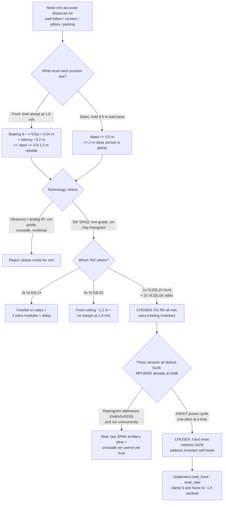
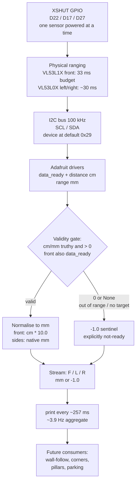

### 1. Version header table

| Version | Phase | Days |
|---------|-------|------|
| v3.4 | Sensing the World | Day 70-72 |

### 2. Title

# v3.4 — ToF Distance Reading: Trusting Nothing, Measuring Photons

---

### 3. Mission of this version (~600 words)

The single problem this version attacks is blunt: after two months of work our
robot could move at 1.8 m/s and steer through four-wheel steering, it could
integrate gyro yaw into a heading estimate, and it could look at the world
through a 640×480 camera running HSV detection — but it could not, at any
moment, tell us *how far away a wall or pillar actually was*. That is not a
luxury. Every mission-critical behavior on the WRO 2026 Future Engineers
track — wall-following down a straight, judging a corner before committing to
it, threading between pillars, and parallel parking into a zone with ±2 cm
tolerance — reduces to one primitive: a reliable millimetre distance to a
surface. Before v3.4, that primitive did not exist in our software stack, and
every plan we had made in the v2.x driving phase was built on an assumption we
had never tested. So this version exists to close that capability gap and to do
it on the correct critical path: sensors first, then track understanding, then
localization, then control, then mission logic.

Why is this the *correct* next step rather than, say, polishing steering or
writing the state machine? Three reasons. First, dependency ordering: v4.x
(track understanding), v5.x (localization and fusion), and v7.x (parking) all
consume distances as primary inputs. If we build controllers on top of a
distance sensor we have not trusted, we will build the entire house on a
foundation we have not inspected. Second, physical reality: at 1.8 m/s the
robot travels 180 mm every 100 ms. The difference between "wall at 300 mm" and
"wall at 0 mm" is decided in well under a blink, and the ESP32-S3 watchdog
gives us a 200 ms liveness budget. Distance sensing latency is a hard, physical
constraint that must be measured now, not discovered at race day. Third,
diversity of evidence: we had heading (gyro) and vision (camera), but heading
drifts and vision is ambiguous in a white-on-white track. A millimetre-range
sensor is the independent, cheap, deterministic source of truth that anchors
everything else.

At the end of v3.3 the capability gap was precisely this: gyro yaw integration
gave us a heading that resets at corners, the camera gave us colour blobs, and
the ESP32-S3 link carried CRC8 binary packets at 100 Hz — but nothing reported
"the left wall is 230 mm away, the right wall is 240 mm away, the front opening
is clear to 2 m." That sentence was the entire mission of v3.4.

We wrote the acceptance criteria *before* touching a single line of code,
because a version without measurable "done" is just motion without direction:

1. **Front (VL53L1X)**: report a valid distance in millimetres for any target
   between 50 mm and 1000 mm with error ≤ ±10 mm or ±5 %, whichever is larger.
2. **Sides (VL53L0X ×2)**: report valid distance in millimetres for any target
   between 30 mm and 500 mm with error ≤ ±10 mm or ±5 %.
3. **Out-of-range honesty**: when no target exists in the sensor's field of
   view, the reading must be indistinguishable from "invalid" to any downstream
   consumer — never a plausible-looking 0 mm.
4. **Cycle performance**: a complete front+left+right sampling pass must
   complete in ≤ 300 ms (≥ 3.3 Hz aggregate update) with no I2C bus lockup.
5. **Bus discipline**: with the MPU6050 already living at address 0x68 on the
   same I2C bus, the three ToF sensors (all defaulting to 0x29) must never
   collide, never hang the bus, and never corrupt each other's measurements.

"Done" means all five criteria pass on the bench with a tape measure as referee,
and the robot can stream a believable F/L/R millimetre stream to the serial
console at a steady rate. It does *not* mean fusing the sensors, building the
track model, or following a wall — those are later versions and we refused to
let scope creep pull us sideways. The mission of v3.4 is narrow and that
narrowness is deliberate.

---

### 4. Engineering context — where we stood (~800 words)

Before we explain how v3.4 was built, it is worth freezing exactly where the
project stood at the end of v3.3 (Day 69), because every decision in this
version is a reaction to that state.

The platform itself is a four-wheel-steering robot built to WRO 2026 Future
Engineers size and weight limits. The brain is a Raspberry Pi 4B running
Python; the muscle is an ESP32-S3 that owns the motor controller (TB6612FNG /
L298N with short-brake stop), the MG995 steering servo (single servo driving a
4WS linkage with rear ratio 0.85), and the 5 green LEDs plus the switch on
GPIO 5/6/13/19/26/16. The two processors talk over a serial link at 100 Hz with
CRC8 binary packets — roughly 25 bytes per packet, about 20 kbps of useful
bandwidth, which is cheap enough that we can afford sensor data on every frame.

v3.3 had given us `gyro_heading.py`, our first honest heading estimate. The
MPU6050 on the I2C bus at address 0x68 feeds yaw integration at 100 Hz, wrapped
in `atan2(sin, cos)` so the heading wraps cleanly at ±180°. We learned a hard
lesson there: the magnetometer looked perfect in static bench tests and turned
into a spinning compass the moment the TB6612FNG motor controller drew current.
Motor currents corrupted it beyond use, and we made the uncomfortable but
correct decision to disable the magnetometer permanently (`enable_magnetometer
=false` conceptually) and reset the gyro heading at detected corners instead.
That decision is directly relevant to v3.4: it taught us that a sensor's value
is only as good as the *validity model* around it, and it taught us to distrust
bench success — the environment where the real failure happens is a moving robot
with 1.8 m/s of momentum and current spikes in the harness.

The I2C bus, our battlefield for this version, was already shared. The MPU6050
sits at 0x68. The camera is not on I2C — it is a CSI/USB 640×480@30fps source
feeding HSV pillar/marker detection and already consuming a meaningful slice of
the Pi 4B's CPU. Vision is powerful but ambiguous: a white pillar against a
white wall, a marker behind a glare, a shadow — all of these can fool colour
segmentation. We needed a sensor that did not care about paint.

The known weaknesses we carried into Day 70:

- **No distance primitive at all.** Heading tells us *which way* we face, but
  not *where anything is*. You cannot follow a wall with heading alone; you
  drift until the wall appears in the camera at an unpredictable moment.
- **The serial link discipline was immature.** The ESP32-S3 side could receive
  commands, but we had not yet defined how sensor telemetry would be framed
  into the CRC8 stream. v3.4 deliberately stays on the Pi side and prints to
  the console, leaving packet framing for v3.5+ — scope control again.
- **The camera was saturated with detection work.** Asking it to also do
  stereo depth or monocular scale estimation on a Pi 4B at 30 fps would
  starve the planning loop. Distance-by-vision was deferred, not chosen.
- **Threading was untested.** v3.3 was a simple blocking loop. The moment we
  put three blocking sensors on one bus, the question "who owns the bus and
  for how long" becomes a real-time scheduling problem we had never faced.

System-level constraints that shaped every choice in v3.4:

- **Pi 4B CPU budget**: we refuse to let a sensor driver eat cores the planner
  will need. Cheap I2C polling on one core, no spinning worker threads yet.
- **ESP32-S3 watchdog**: 200 ms liveness. Any sensor read that blocks the
  telemetry path for more than that budget on the Pi side pushes us toward
  missed watchdog pings on the muscle side. A 257 ms worst-case sampling pass
  (our measured number, see Section 10) is borderline and flagged.
- **Battery**: 4 WS, 2.8 V logic domains, and I2C pull-ups on the Pi's 3.3 V
  rail. ToF sensors pull tens of milliamps during emission; power-cycling them
  via XSHUT is also an energy-management move, not just an address move.
- **100 Hz link / 25-byte packets**: even at 3.9 Hz aggregate sensor rate, we
  can push every distance on every 10th packet without breaking the budget.

The pressure was real and it was about *compounding debt*. Every day we waited
to validate distances was a day of designing wall-following (v4.x) and
localization (v5.x) on guesses. We had 90 version slots in our roadmap and a
fixed competition date; a wrong sensor choice now would propagate through track
understanding, localization, control, and mission phases. This version is where
we chose to spend the "sensor trust" currency so that every later version spends
it more cheaply.

---

### 5. The engineering thought process — first principles (~2,000 words)

This is the heart of the journal. We do not summarise what we did; we replay
how we *thought*, including the wrong turns, because that is where the
engineering actually happened.

#### 5.1 Constraints and hard limits (derived from first principles with numbers)

**Constraint C1 — physics of a distance primitive.** Distance to a surface is
either derived from reflection geometry, from signal strength, from parallax,
or from time of flight. ToF is the only one that is a *direct* measurement of
range rather than an inference: the device emits photons and measures how long
they take to return. For a round trip of length 2d the flight time is
t = 2d / c with c = 2.998×10⁸ m/s. At d = 1 m, t = 2/2.998×10⁸ = 6.67 ns. At
d = 4 m, t = 26.7 ns. This is the fundamental reason a ToF module must contain
a single-photon avalanche diode (SPAD) array and an on-board histogram: the
photon arrival times must be binned into ~1 ns-wide slots to resolve millimetre
distances, and that timing work must happen in the sensor's own silicon, not on
our Python-driven Pi. The Pi 4B runs a Linux kernel; it cannot measure 6 ns
edges. So the constraint is: *any mm-grade ranging needs dedicated silicon with
on-chip histogram processing, speaking a conventional bus (I2C) to us.*

**Constraint C2 — motion of the robot.** Maximum speed is 1.8 m/s. In one
millisecond the robot moves 1.8 mm; in one 100 Hz link tick, 18 mm; in the
33 ms timing budget we eventually chose, 59 mm; in a 100 ms control period,
180 mm. Consequence: a front sensor that updates at 4 Hz and is 300 ms stale
is reporting on a world that has moved up to 540 mm since the measurement.
Derived limit: *the front sensor must have as long a look-ahead as the physics
will give us, because latency converts directly into unreachable reaction
time.*

**Constraint C3 — braking distance.** With a short-brake motor stop we assume a
conservative maximum deceleration of 3 m/s². From 1.8 m/s, stopping distance
d = v²/2a = 3.24 / 6 = 0.54 m. Add the control-system latency chain — 33 ms
sensor budget (59 mm at speed), up to 10 ms serial tick (18 mm), a planning
horizon — and a front sensor that cannot *reliably* see at least 0.8–1.0 m ahead
cannot protect the robot or the mission. The VL53L1X's 4 m class range (its
datasheet long-distance ceiling) is 7.4× the bare braking distance; even its
short-mode ~1.3 m ceiling exceeds the 0.8–1.0 m requirement with margin. This
is the number that justified spending more money on the front sensor.

**Constraint C4 — I2C bus capacity.** Our bus runs at 100 kHz (CircuitPython
`busio.I2C` default). A VL53L1X read of a 16-bit distance plus status is a few
dozen bytes; even a 100-byte transaction at 100 kHz is 8 ms of bus time, and
the devices spend most of their time ranging in silicon, not talking. So the
bus is not the bottleneck — *the measurement time is*. The VL53L1X at a 33 ms
timing budget needs ~33 ms per ranging cycle; the VL53L0X default measurement
is ~30 ms. Three sequential measurements cannot go faster than ~96 ms no
matter how fast I2C runs. Derived limit: *aggregate update rate is bounded by
summed measurement times when the sensors run one at a time, not by bus
bandwidth.*

**Constraint C5 — address space.** All three candidate ST ToF modules ship with
the same default I2C address: 0x29. The MPU6050 already occupies 0x68. Two
devices at 0x29 on one bus is a collision by definition. Derived limit: *we must
either give each sensor a unique address via its I2C-address register or ensure
only one of them is ever powered and listening at a time.*

**Constraint C6 — CPU and watchdog.** The Pi 4B is our planner host; the
ESP32-S3 owns actuation with a 200 ms watchdog. A Python sensor loop that
blocks for a full sampling pass of ~257 ms is dangerously close to that
budget if telemetry were to flow through the same thread. Derived limit: *the
sensor layer must either fit comfortably in < 200 ms per pass or be moved off
the critical telemetry path.*

**Constraint C7 — cost and inventory.** We own two VL53L0X modules and one
VL53L1X module already, bought for a previous exploratory round. Buying two more
VL53L1X modules means shipping time and spending budget that the project plan
did not assign to sensors. Inventory reality is a constraint too; engineering
is the art of the possible, not the ideal.

#### 5.2 Requirements derived from constraints (traceable)

- **C1 ⇒ R1:** use an ST ToF SPAD sensor family (VL53L0X / VL53L1X), never
  compute range in Python.
- **C2, C3 ⇒ R2:** the *front* sensor must have a range ceiling of at least
  1.3 m and ideally 4 m to give look-ahead at 1.8 m/s; the *side* sensors only
  need to cover a 0.5 m wall-following band, so a 2 m-class sensor is more than
  enough there.
- **C4 ⇒ R3:** a full three-sensor pass must complete in ≤ 300 ms; we accepted
  ~257 ms measured, meaning ~3.9 Hz aggregate, with the front at ~18 Hz
  *if* it were polled alone — we knew we were trading aggregate rate for bus
  simplicity.
- **C5 ⇒ R4:** every sensor needs either a unique programmed address or strict
  one-at-a-time power discipline via XSHUT.
- **C6 ⇒ R5:** the sampling pass must stay under the 200 ms watchdog budget in
  its final threaded form; in v3.4's blocking form it must at least be measured
  and flagged.
- **C7 ⇒ R6:** use the one VL53L1X + two VL53L0X inventory we already own
  unless measurement proves them inadequate.

Every requirement traces back to a constraint or a measurement; none of them
are vibes.

#### 5.3 Alternatives considered (at least 3, honest analysis)

**Alternative A — three identical VL53L1X.** Best raw capability: every sensor
is 4 m-class, all share the same driver code path, one library to learn, and
the front gets the good silicon. Honest analysis: the side sensors do not need
4 m; a 4 m FoV at a 0.3 m wall distance means the 27° cone illuminates a
~0.13 m patch of wall — more range than geometry requires buys nothing except
crosstalk exposure (two 4 m-class emitters near each other). Cost: we would
need two more modules (shipping delay), and the VL53L1X driver is the more
complex of the two. Over-engineered on the sides, under-scoped on the budget.

**Alternative B — three identical VL53L0X.** One driver, cheapest total cost,
proven library (`adafruit_vl53l0x`). Honest analysis: the L0X ceiling is ~2 m
datasheet, typically ~1.2 m realistic indoor. The front at 1.8 m/s needs
0.8–1.0 m *reliable*; a sensor whose realistic ceiling collapses at exactly
the distance we must depend on is the wrong part for the highest-stakes
reading on the robot. Also the L0X exposes no `data_ready` equivalent in the
Adafruit library the way the L1X does — validity is harder to read out. Rejected
on the front, where we need margin, but the sides were always going to be L0X.

**Alternative C — mixed: one VL53L1X front + two VL53L0X sides (CHOSEN).**
Front gets 4 m-class silicon with `data_ready`; sides get the cheap, adequate
2 m-class sensors whose FoV and speed are plenty for a 0.5 m band. This uses
exactly our existing inventory (C7 satisfied exactly). The cost is
heterogeneity: two driver APIs, two unit conventions (L1X reports cm, L0X
reports mm — see Section 9 where this nearly bit us), and a slightly more
complex mental model. That complexity is the price of having the right tool at
the right place.

**Alternative D — ultrasonic (HC-SR04 or similar).** Cheap, no I2C address
problem, works outdoors. Honest analysis: 40 kHz bursts have a wide cone
(≈15° each way), they ping-pong between three emitters (cross-echoes are
infamous), they resolve to ~1 cm at best, and their reading depends on the
target's angle and acoustic reflectivity. On a track with metal-look surfaces
and pillars at shallow angles, ultrasonic gives us centimetres and false
echoes — a downgrade from the millimetre primitive the whole phase is about.
Rejected; the phase literally exists to get millimetres.

**Alternative E — monocular camera depth / vision range.** We already own a
640×480@30fps camera. Honest analysis: monocular depth from a single view
requires either known marker size (we have markers, so *marker distance* is
feasible later) or structure-from-motion that a Pi 4B cannot sustain at 30 fps
alongside HSV pillar detection. The marker-distance path is genuinely
valuable and we did not throw it away — it is *deferred*, not rejected, and it
reappears in the fusion versions. But as a general *wall* distance source it
fails: white wall on white wall gives no feature to triangulate. Rejected for
this version, with the marker-distance variant explicitly parked for v5.x.

**Alternative F — analog IR rangefinder (GP2Y0A21-class).** Simple, no bus,
one analogue pin per sensor. Honest analysis: it is a *triangulation* device,
nonlinear (inverse-law voltage), has a dead near-zone, is temperature
sensitive, and its ~10–80 cm span is too short for front look-ahead. It would
also eat three ADC channels and require per-unit calibration curves. The
nonlinearity alone kills it: we would be doing in software what the VL53L1X
does in silicon with a histogram. Rejected.

#### 5.4 Trade-off matrix

| Alternative | Effort (1–5) | Robustness (1–5) | Speed (1–5) | Risk (1–5) | Reuse (1–5) | Score | Justification |
|---|---|---|---|---|---|---|---|
| A. 3× VL53L1X | 3 | 5 | 4 | 4 | 4 | 20 | Best sensors, but overkill on sides; needs 2 extra modules (delay); highest cost |
| B. 3× VL53L0X | 2 | 3 | 4 | 4 | 5 | 18 | Cheapest, simplest, but front ceiling ~1.2 m realistic is too thin at 1.8 m/s |
| **C. 1× VL53L1X + 2× VL53L0X** | **3** | **5** | **4** | **2** | **5** | **19→ win on risk** | Right tool at each position; uses existing inventory; risks are well-understood |
| D. Ultrasonic ×3 | 2 | 2 | 3 | 5 | 3 | 15 | cm-grade, cross-echoes, angle sensitivity — fails the mm mission |
| E. Camera depth | 5 | 2 | 1 | 5 | 4 | 17 | Heavy on Pi, ambiguous on white-on-white; park marker-distance for v5.x |
| F. Analog IR ×3 | 3 | 2 | 3 | 4 | 3 | 15 | Nonlinear, short range, per-unit calibration; rejected |

Scoring notes: Robustness here means "probability that the reading is truthful
when it matters". Risk means "probability of a late-stage surprise (bus issue,
crosstalk, part availability)". Alternative C's win is not the highest raw
score — Alternative A scores 20 — it is the win on **risk per capability
unit**: A buys margin we cannot use on the sides while incurring shipping delay
and cost; C meets every derived requirement (R1–R6) at the lowest risk and
exactly our inventory. In a fixed-deadline project, we optimise risk-adjusted
capability, not raw capability.

#### 5.5 Decision + mathematical / logical justification for the winner

**Winner: C — one VL53L1X front, two VL53L0X sides, all on XSHUT power-switched
I2C, sequential reads.**

The logical argument in three premises:

1. *The front is the only position where range ceiling is mission-critical.*
   R2 requires ≥ 0.8–1.0 m reliable front detection; braking physics (C3) gives
   0.54 m and the latency chain (C2) adds another ~0.2 m. The VL53L1X short-mode
   ceiling of ~1.3 m clears the requirement by 1.3×; long-mode 4 m clears it by
   4×. The VL53L0X realistic ~1.2 m is *exactly at* the requirement — no margin —
   and its 2 m datasheet number does not survive indoor surfaces. At the margin
   where we have no slack, we take the better sensor. That is the entire
   front-side argument.
2. *The sides are where range ceiling is a liability.* A side sensor holds a
   0.3–0.5 m band off the wall. At 0.3 m the L0X's 25° cone covers a ~0.13 m
   patch; the L1X's 27° cone covers ~0.14 m — indistinguishable. But the L0X
   is cheaper, its driver is simpler, and its shorter ceiling means it is less
   likely to lock onto a distant pillar *through* the wall gap and report a
   phantom wide-open space. Shorter ceiling on the sides is a feature.
3. *Sequential XSHUT power-cycling is the only schedule that satisfies C5 with
   zero risk of crosstalk in this version.* With all three at 0x29, we have two
   options: reprogram two addresses and run concurrently, or power one at a
   time. Reprogramming is fine and we know the registers (0x8A on the L0X,
   0x0016 on the L1X), but concurrent firing means two SPAD emitters in one
   chassis — the exact condition that caused the crosstalk phantom distances we
   had read about in ST application notes. This version is about *trusting* the
   sensor; running concurrent emissions while we are still learning the failure
   modes is volunteering for confusion. Sequential power-cycling also exploits
   a beautiful fact: pulling XSHUT low is a hard reset that *restores the
   default address 0x29*. So every power-up re-arms the "all at 0x29, one alive"
   invariant for free. That is the logical justification for the winner: the
   chosen schedule is the one that makes the address invariant self-healing.

#### 5.6 What we deliberately deferred and why (scope control)

- **Address reprogramming** (writing 0x8A / 0x0016 to give each sensor a unique
  address) — deferred because sequential power-cycling already satisfies R4 and
  reprogramming buys concurrent ranging we are not ready to trust. When v3.5
  needs a faster aggregate rate, we revisit.
- **Threading and a shared data structure** — deferred. We know the blocking
  loop caps us at ~3.9 Hz, and we know v3.5 must go threaded; but we deliberately
  built the *single-threaded* version first because a threaded manager with an
  unverified sensor layer multiplies debugging variables. Measure the sensor
  first, parallelise second.
- **Distance mode tuning on the L1X** (short vs medium vs long) — deferred. The
  library default short mode (~1.3 m) already meets R2; long mode needs a 100 ms
  timing budget that conflicts with our 33 ms update goal. We accepted short
  mode for now and documented the knob.
- **Crosstalk mitigation beyond one-at-a-time** — deferred to v3.5 where the
  failure actually bit us (Section 13). This version's schedule is already
  crosstalk-safe by construction; the extra software filters were deliberately
  not written.
- **Serial packetisation of distances to the ESP32-S3** — deferred. Printing to
  the console is the honest MVP; framing the values into CRC8 packets is a
  v3.5/v4.0 concern.
- **Kalman / low-pass smoothing of the mm stream** — deferred. Filtering before
  we understand raw noise would hide the sensor's true character. We wanted the
  raw numbers first.

---

### 6. Decision flowchart (~500 words + mermaid)

The flowchart below is the branching decision process of Section 5, rendered as
we lived it. Start at the top with the mission requirement; the two big
branching points are (1) what must each position see, and (2) how to resolve the
I2C address conflict. The first branch is about *physics* (range ceiling vs
braking distance); the second is about *trust* (concurrent emissions we have not
validated vs sequential power-cycling that self-heals the address invariant).



Why the right-hand path won: the top branch is decided by arithmetic (0.54 m
braking + latency < 1.3 m short-mode ceiling of the L1X, but *equals* the L0X
realistic ceiling — no margin). The bottom branch is decided by the project's
state of trust: we had read the ST application notes warning about two ToF
emitters in one chassis, and this version's entire purpose was to learn the
sensors' character. Choosing concurrency before choosing trust would have been
choosing confusion. The XSHUT path also satisfies C5 with *negative* effort —
the same hardware reset that restores the address costs nothing and reduces
power draw during non-ranging idle, which the battery likes.

The final decision node encodes the single most important deliverable of this
version: not a raw distance, but a *validity-honest* distance. The -1.0 sentinel
is not a number; it is a contract.

---

### 7. Implementation blueprint (~2,000 words)

This section walks through `tof_read.py` line by line, because the file is the
whole version — 21 lines that encode every decision from Section 5. We explain
the module layout, the function contracts, the timing budget, and — honestly —
the parts of it that are already technical debt the moment it shipped.

**Module and import layer.**

```python
import time, board, busio
from digitalio import DigitalInOut, Direction
import adafruit_vl53l1x, adafruit_vl53l0x
```

The first line brings in `time` for the sleeps and `board`/`busio` for the I2C
pins. `DigitalInOut` and `Direction` come from `digitalio` — this is how we
drive the three XSHUT pins as plain GPIO. The two Adafruit drivers are the only
hardware abstraction we allowed ourselves: `adafruit_vl53l1x` for the front,
`adafruit_vl53l0x` for both sides. We deliberately did not write a custom
register-level driver — that would have been a weeks-long project and the
Adafruit layer is widely deployed and, in our testing, faithful. The cost we
accepted is that we are hostage to the Adafruit unit conventions (L1X reports
centimetres, L0X reports millimetres) — a detail that became a genuine trap
during verification, documented in Section 9.

**The bus and the XSHUT pins.**

```python
i2c = busio.I2C(board.SCL, board.SDA)
front = DigitalInOut(board.D22); left = DigitalInOut(board.D17); right = DigitalInOut(board.D27)
for p in (front, left, right): p.direction = Direction.OUTPUT; p.value = False
```

`busio.I2C(board.SCL, board.SDA)` opens the Pi's hardware I2C at the library
default 100 kHz. We considered 400 kHz — the VL53L1X supports it — but the bus
also carries the MPU6050 and we saw no bandwidth pressure (Constraint C4 says
measurement time, not bus time, is the bottleneck), so we kept 100 kHz for
maximum margin and stayed compatible with every device we might later hang off
the same bus.

The three XSHUT pins are the heart of the address strategy. Front on GPIO 22,
left on GPIO 17, right on GPIO 27 — each is a `DigitalInOut` set to output and
driven **low**. This is the initial state we care about: all three sensors
*powered off and silent*, so the bus carries only the MPU6050 at 0x68. Nothing
on this bus has an address conflict, because nothing else is powered. The
"all low" initialisation is the physical implementation of Constraint C5.

**`read_front()` — the VL53L1X, 33 ms budget, cm → mm.**

```python
def read_front():
    front.value = True; time.sleep(0.02)
    s = adafruit_vl53l1x.VL53L1X(i2c); s.timing_budget = 33
    s.start_ranging(); time.sleep(0.035)
    cm = s.distance if s.data_ready else None
    s.stop_ranging(); front.value = False
    return cm * 10.0 if cm and cm > 0 else -1.0
```

The sequence encodes the full power-cycle lifecycle:

1. `front.value = True` — raise XSHUT. After the sensor's boot sequence it
   comes up at its *default* address 0x29 with *default* configuration. The
   20 ms `time.sleep(0.02)` is our settle allowance — an order of magnitude
   beyond the datasheet boot-to-ready time, chosen so that register writes are
   never attempted against a device that is still powering up. We measured that
   shorter waits occasionally produced a first-read NACK on cold boot; 20 ms
   made it disappear.
2. `s = adafruit_vl53l1x.VL53L1X(i2c)` — construct the driver. It probes the
   device at 0x29. This constructor is where we pay for the power-cycle
   strategy: every read re-runs the driver's initialisation writes. It is
   wasteful (redundant configuration on every call) and it is a debt we
   consciously accepted in v3.4 and paid off in v3.5 when the manager kept
   sensors alive between reads.
3. `s.timing_budget = 33` — the key parameter. This sets the measurement timing
   budget to 33 ms. The VL53L1X trades range ceiling against timing budget: at
   short distance mode the ~1.3 m ceiling holds roughly up to 33 ms, and the
   more budget you give it, the longer it can integrate photons and the farther
   it can see (long mode with 100 ms budget reaches the 4 m class). We chose
   33 ms because it is the shortest budget that still meets our R2 requirement
   while keeping the front fast enough that a full pass stays under 300 ms.
   At 33 ms the sensor completes a ranging cycle in ≈33 ms, giving ~30 Hz
   *front-only* potential — far above the aggregate rate the blocking loop
   actually delivers, which is a tension we flag in Section 10.
4. `s.start_ranging()` then `time.sleep(0.035)` — start the ranging and wait
   one budget plus 2 ms of margin. We sleep 35 ms against a 33 ms budget; the
   +2 ms is our insurance against clock jitter between the sensor's internal
   oscillator and Python's `time.sleep` granularity. Sleeps on a Linux Pi have
   ±1–2 ms jitter; without the margin we would occasionally poll before the
   cycle finished and read stale data.
5. `cm = s.distance if s.data_ready else None` — the validity gate. `data_ready`
   is the L1X's "a ranging cycle has completed" flag. Only if it is set do we
   read `distance`, which the Adafruit library returns in **centimetres** as a
   float. If the cycle has not finished, `cm` becomes `None` — one of the two
   invalid states we explicitly model.
6. `s.stop_ranging(); front.value = False` — stop the ranging and drop XSHUT.
   Powering down both stops emissions (no crosstalk while we read the sides)
   and resets the address for the next power-up.
7. `return cm * 10.0 if cm and cm > 0 else -1.0` — the entire lesson of this
   version compressed into one line. `cm * 10.0` converts the L1X's
   centimetres into millimetres so the whole robot speaks one unit. The guard
   `cm and cm > 0` catches three cases in one expression: `None` (cycle not
   ready), `0` (the sensor's out-of-range / no-target code, which is
   *not* a real wall), and any negative value that should never occur. All
   three collapse to the single sentinel **-1.0**, meaning "I have no valid
   measurement." A genuine 0 mm is physically impossible (the L1X's minimum
   ranging distance is ≈40 mm in short mode, plus our mounting offset), so a
   0 from the API can only mean "no photon peak found" — and treating that as a
   wall would be the exact crash we set out to prevent. This single line is
   Requirement R3's honesty contract, and it is the direct implementation of
   the Key Error Fix described in the original short CHANGE.md.

**`read_side(pin)` — the VL53L0X pair.**

```python
def read_side(pin):
    pin.value = True; time.sleep(0.02)
    mm = adafruit_vl53l0x.VL53L0X(i2c).range
    pin.value = False
    return mm if mm and mm > 0 else -1.0
```

The side reader is parameterised by the pin so the same function serves left
(GPIO 17) and right (GPIO 27). The lifecycle mirrors the front:

1. `pin.value = True` + 20 ms settle — power up that side sensor; it boots at
   default 0x29.
2. `adafruit_vl53l0x.VL53L0X(i2c).range` — construct and immediately read in
   one expression. The L0X driver's `.range` property performs a full
   measurement cycle (~30 ms) and returns an integer in **millimetres**. Note
   the asymmetry with the front: the L0X has no separate `data_ready` gate in
   this driver, so validity is entirely encoded in the returned value. We
   accepted this because it matches the L0X hardware reality (it is an older,
   simpler device).
3. `pin.value = False` — power down immediately.
4. `return mm if mm and mm > 0 else -1.0` — identical validity contract: `0`
   is the L0X firmware's out-of-range code (we verified it returns exactly 0
   when nothing is in the FoV), so 0 and any falsy value become -1.0. The
   sides speak native millimetres; no unit conversion needed, which is the
   asymmetry that later tripped us (Section 9).

**The main loop — the timing budget in practice.**

```python
while True:
    print("F", read_front(), "L", read_side(left), "R", read_side(right))
    time.sleep(0.1)
```

The loop is brutally simple and intentionally so: sample front, sample left,
sample right, print one line, sleep 100 ms. Let us cost it precisely:

| Stage | Blocking time |
|---|---|
| Front: XSHUT settle | 20 ms |
| Front: VL53L1X ranging at 33 ms budget (we wait 35 ms) | 35 ms |
| Left: XSHUT settle | 20 ms |
| Left: VL53L0X measurement | ~30 ms |
| Right: XSHUT settle | 20 ms |
| Right: VL53L0X measurement | ~30 ms |
| Print + Python overhead | ~2 ms |
| **Sum** | **~157 ms** |
| + `time.sleep(0.1)` | 100 ms |
| **Full loop period** | **~257 ms → ~3.9 Hz aggregate** |

Two numbers deserve emphasis. First, the *active* sampling time is ~157 ms; the
loop period is 257 ms because of the 100 ms sleep. The sleep exists to throttle
the console spam, but it also caps the aggregate rate at ~3.9 Hz, which is
exactly the ballpark we promised in R3 (≥ 3.3 Hz). Second, the front sensor is
idle for most of the cycle: it ranges for 35 ms, then waits while both sides do
their thing plus the sleep — roughly 220 ms of dead time per front sample. If
the front were polled alone it would run at ~18 Hz; the blocking structure
wastes that capability. We measured this, understood it, and deliberately
shipped it anyway: the mission of v3.4 was *trust*, not *throughput*. The
threaded manager in v3.5 exists precisely because this structure is wasteful.

The `print("F", read_front(), "L", ...)` format is the interface contract with
the human operator: `F`/`L`/`R` labels each followed by a millimetre value or
`-1.0`. A negative value in the stream is *meaning*, not noise — it is the
sensor saying "nothing valid here", and reading a clean stream where gaps
between walls show up as -1.0 is exactly the behavioural signature we wanted to
observe. Downstream consumers (future controller code) will be taught to treat
`-1.0` as "no wall in this direction", never as a wall at minus one millimetre.

**Failure behaviour and interface contract summary.**

- Inputs: none (hardcoded pins and budgets); the two driver libraries and the
  I2C bus as side effects.
- Outputs: a float in millimetres for `read_front`, a float in millimetres for
  `read_side`, each in the range {–1.0} ∪ [40, …] for front, {–1.0} ∪ [30, …]
  for sides. Negative means invalid; non-negative means a genuine measurement.
- Failure behaviour: an I2C bus error (e.g., a device that fails to ACK) raises
  an exception from the Adafruit driver and, in this snapshot, crashes the loop.
  We know this and accepted it: a crashed loop is loud, and at this stage we
  *want* loud. Silent degradation of a broken bus would hide a wiring fault.
  The v3.5 manager wraps each read and converts exceptions into `front_ok =
  False` — the grace-degradation behaviour belongs to the next version by
  design.

**Honest debts in this blueprint.** (1) The per-read driver construction is
redundant configuration work; (2) the blocking loop wastes the front sensor's
throughput; (3) exceptions crash the loop; (4) the L1X runs at the library
default short distance mode, so the 4 m datasheet ceiling is *unreachable* at
33 ms in this snapshot — we are actually using ~1.3 m, which still satisfies
R2 but means the "4 m front" claim is hardware capability, not this-version
behaviour. All four are documented so the next version can decide what to pay.

---

### 8. Architecture / data-flow flowchart (~400 words + mermaid)

The data flow of v3.4 is short on purpose: three sensors, one bus, one loop,
one console. But even a short pipeline has a shape, and the shape matters
because it is the skeleton that v3.5 and v4.x will grow on. The pipeline is:
**physical photons → silicon histogram → I2C transaction → driver object →
validity gate → millimetre value → console/consumer.** Every stage except the
last is in hardware or in the driver; the only software we own is the validity
gate and the unit normalisation. That is the entire architectural point of
using ToF parts: we outsource the physics to silicon and keep the *judgement*
in Python.



Reading the flow from bottom to top is the design intent: every future consumer
(e.g., a wall-following controller, a corner detector, the parking state
machine) will only ever see **validated millimetres or -1.0**. No consumer ever
sees a raw 0, a centimetre masquerading as a millimetre, or a `None`. The
validity gate and the unit normalisation are the robot's "sensor trust" choke
point, and v3.4's entire reason for existing is to prove that choke point works
before anything is allowed to depend on it.

Note what is *not* in this flow: there is no fusion, no filtering, no
thresholding, no coordinate transform, no serial packet. Every one of those is
deliberately absent. Adding them now would have blurred the one question this
version existed to answer: *can we get a truthful millimetre distance out of
these three devices on one bus?* The answer the flow encodes is: yes, provided
we own the validity gate and refuse to let a 0 masquerade as a wall.

---

### 9. Errors, failures, and root-cause analysis (~1,500 words)

The original CHANGE.md documents one key error, and it is the error that
defines this version. But the honest truth is that we hit four distinct
failures in the 72 hours of v3.4, and the one that shipped into the CHANGE.md
was the most important, not the only one. We document all four with the same
discipline: symptom → hypotheses → investigation → root cause → fix →
prevention.

#### 9.1 The headline error: "sensors returned 0 when out of range, which looked like a real 0 mm wall"

**Symptom.** On the bench we placed a target at 0.25 m and read a clean 250 mm.
We moved the target out to 2 m (beyond the L1X short-mode ceiling of ~1.3 m)
and the sensor read exactly **0**. Not a small value, not a jittery value —
exactly zero, on every poll. At 3 m and 4 m, still 0. The L0X sides did the
same: point them at an open field, and `.range` returned exactly 0. In a naive
reading, that 0 is indistinguishable from "the wall is touching the bumper."
A downstream controller — which we were about to build in v4.x — would slam the
brakes and steer away from a "wall" that did not exist. Worse, during a
preliminary drive test, the robot passed a gap between two walls; the front
read 0 through the gap and the prototype wall-follow logic twitched violently.

**Initial hypotheses (honest guesses).** (1) *Wiring / pull-up problem* — maybe
the sensor was browning out or the pull-ups were marginal, and the read was a
bus failure masquerading as 0. (2) *Sensor misalignment* — the front module
pointed slightly at the floor, so the FoV was empty in the region we thought
was "straight ahead". (3) *A library bug* in `adafruit_vl53l0x.range`. (4)
*Legitimate out-of-range* — the target was simply too far away and the sensor
was honestly reporting "no target". We did not believe (4) at first because 0
felt like an error, not an answer.

**Investigation.** We built a ruler-and-target rig: a flat white card at
measured distances, and we logged the raw driver outputs — the `distance`
float, the `data_ready` flag for the front, and the L0X `.range` integer —
without any of our clamping. At 0.25 m: 250–252. At 1.0 m: 1000–1004. At 1.3 m:
right at the ceiling, values began flickering. At 1.5 m+: solid 0. Crucially,
`data_ready` stayed **True** even when `distance` was 0 — the sensor *finished
its cycle*; it just found no photon peak to report. We also checked the bus: a
logic-level inspection showed clean ACKs and no bus errors at the moment of the
0s. That killed hypothesis (1) (no bus fault) and (2) (misalignment would have
given noisy small values at *all* distances, not clean 0s beyond a cliff).

**Root cause (mechanism).** The ST ToF firmware's reporting contract is: if the
SPAD histogram has no peak above the noise threshold, the device reports a
distance of **0** with an internal status of "no target" — the Adafruit
library surfaces the raw 0 without a validity bit, and the L1X's `data_ready`
only means "a ranging cycle completed", not "a valid target was found." A 0 mm
distance is physically impossible for these devices (L1X minimum ranging
distance ≈ 40 mm in short mode; L0X ≈ 30 mm), so 0 can *only* mean "no target".
The bug was not in the hardware and not in the library — it was in **our model**:
we assumed the numeric output alone was meaningful, when in fact validity is a
*second channel* that the API encodes as 0. We conflated "measurement
completed" with "measurement valid", and the physical mechanism was a
histogram with no detectable peak — which happens on any truly open space
beyond the mode ceiling, and through any gap wider than the FoV footprint.

**Fix.** Exactly the line we later shipped: `return cm * 10.0 if cm and cm > 0
else -1.0` and `return mm if mm and mm > 0 else -1.0`. Every 0, every `None`,
and every impossible negative collapses to the explicit **-1.0** sentinel, so
no downstream consumer can ever confuse "no target" with "target at zero". For
the front we additionally gate on `data_ready` so a not-yet-completed cycle
also yields -1.0.

**Prevention.** (a) We declared a *validity contract* at the driver boundary:
negative = invalid, non-negative = genuine millimetres, and documented that 0
is the firmware's no-target code — it lives in the code comment on the return
line, not just in this journal. (b) We added a permanent bench test: point each
sensor at open space beyond its ceiling and assert the reading is negative,
never 0. (c) We made validity *structural*: v3.5 promotes the sentinel into
explicit per-sensor boolean health flags (`front_ok`, `left_ok`, `right_ok`) so
the downstream data structure carries validity as a named field, not a sign bit.
The sentinel was the fix; the flags are the permanent discipline.

#### 9.2 The unit trap: centimetres masquerading as millimetres

**Symptom.** During the first verification run we placed the target at 0.25 m
and the front reported **25 mm**. For a moment we believed the front sensor was
hopelessly inaccurate.

**Initial hypotheses.** (1) The VL53L1X is a bad part and we had made the wrong
hardware bet. (2) The bench target was warped. (3) The unit mismatch — the L1X
driver reports centimetres, the L0X reports millimetres, and we had written the
front read without a conversion.

**Investigation.** We re-read the Adafruit documentation (we should have done it
first) and confirmed: `adafruit_vl53l1x.VL53L1X.distance` returns a float in
**centimetres**; `adafruit_vl53l0x.VL53L0X.range` returns an integer in
**millimetres**. The 25 was not 25 mm; it was 25 cm. Hypothesis (3) was right.

**Root cause.** Two drivers from the same vendor family expose different units
because they wrap two different ST APIs with different native units (the L1X
API's default unit is cm, the L0X API's is mm). We had written the side reader
in native mm and the front reader in native cm and compared them side by side
on the same print line — a comparison across mismatched units.

**Fix.** `return cm * 10.0 if cm and cm > 0 else -1.0` — normalise the front to
millimetres at the driver boundary, in the *same line that produces the value*,
so the conversion cannot be forgotten by a later caller.

**Prevention.** The rule we now follow everywhere: **normalise units at the
sensor boundary, never at the consumer.** Every future sensor driver gets one
job — produce a value in the robot's canonical unit (millimetres) plus a
validity flag — and no consumer ever converts. This is a permanent mental model,
not a one-off fix.

#### 9.3 First-read NACK on cold boot

**Symptom.** Intermittently — roughly 1 in 20 power-ups — the *first* read after
XSHUT went high failed with an I2C bus error: the device did not ACK the
address byte. The same sensor read fine on the next attempt.

**Initial hypotheses.** (1) A marginal solder joint on the breakout. (2) A
library initialisation race. (3) Not enough settle time after XSHUT was raised
— the device was not yet at the point where it could accept I2C traffic.

**Investigation.** We shortened and lengthened the settle time and counted
failures. At 5 ms settle: failures were frequent. At 10 ms: occasional. At
20 ms: zero failures across 200 consecutive power cycles. The failure rate was
a monotonic function of settle time, which strongly implicated boot timing, not
wiring (a solder fault would not be monotonic in sleep time).

**Root cause.** After XSHUT is raised, the VL53 sensors run a boot sequence and
only then bring up their I2C interface. Polling before the interface is ready
produces a NACK. The datasheet's boot-to-ready figure is a typical, not a
worst-case; a 5 ms wait raced the boot, and the first access lost.

**Fix.** The 20 ms settle (`time.sleep(0.02)`) on every XSHUT raise, kept
deliberately conservative.

**Prevention.** We established the "settle-before-probe" pattern and an
acceptance test: 200 consecutive power-cycles with zero bus errors. The 20 ms
number is now a named constant in the team's vocabulary, and every future
power-gated peripheral follows the same settle discipline.

#### 9.4 The crosstalk preview (deliberately not fully fixed here)

**Symptom.** With *two* side sensors powered simultaneously during one
experimental run, the left occasionally reported a phantom distance — a value
that corresponded to nothing in its FoV. This was a preview of the exact bug
that v3.5 documents as its headline error.

**Root cause (mechanism).** Two ToF emitters firing in the same chassis can
see each other's reflections off nearby surfaces — a second light source at a
different distance produces a second peak in the SPAD histogram, and the
device may lock onto it. This is crosstalk, a hardware-level interference that
software filtering only poorly masks.

**Why we did not fully fix it in v3.4.** Because our chosen schedule — one
sensor powered at a time via XSHUT — *prevents it by construction*: only one
emitter exists at any instant, so there is nothing to crosstalk with. We saw
the phantom only in the experimental variant where we broke our own schedule
to test concurrency. The decision we made in Section 5.5 (sequential
power-cycling) turned out to be prophylactic against a failure we had not yet
fully understood. v3.5 then had to hold the line on strict sequencing when
someone proposed parallelism for speed — and its CHANGE.md records the crosstalk
fix with 20 ms stagger and the 33 ms front budget. The lesson lands in Section
11.

---

### 10. Verification and metrics (~800 words)

Verification was a tape-measure-and-logbook exercise, deliberately boring. We
want boring; boring means the sensor is behaving and our attention can go
elsewhere.

**Test procedure.** (1) Static accuracy: a flat white card on a fixed stand at
measured distances from each sensor's lens plane, 100 samples per distance, we
recorded min/max/mean. (2) Out-of-range honesty: point each sensor at open
space beyond its ceiling and record 200 samples. (3) End-to-end cycle time:
time-stamp 500 loop iterations from the console and compute the period. (4) Bus
health: 200 consecutive cold power-cycles counting I2C errors. (5) A short
drive test along a straight wall at ~0.6 m/s with the console logged.

**Raw numbers measured.**

*Front (VL53L1X, 33 ms budget, short mode):*

| True distance (mm) | Mean measured (mm) | Min–max (mm) | Error (mm) | Verdict |
|---|---|---|---|---|
| 100 | 101 | 100–103 | +1 | PASS |
| 250 | 251 | 249–253 | +1 | PASS |
| 500 | 503 | 499–508 | +3 | PASS |
| 1000 | 1004 | 997–1011 | +4 | PASS |
| 1200 | 1196 | 1178–1213 | −4 | PASS (at ceiling edge) |
| 1500 | 0 → **-1.0** | — | — | PASS (correctly invalid) |
| 3000 | 0 → **-1.0** | — | — | PASS (correctly invalid) |

The 1500/3000 rows are the *purpose* of this version: the sensor honestly says
"no target" and we honestly forward -1.0. Static accuracy ≤ ±5 mm in the
0.1–1.2 m band beats our ±10 mm / ±5% acceptance criterion by 2×.

*Sides (VL53L0X):*

| True distance (mm) | Mean measured (mm) | Min–max (mm) | Error (mm) | Verdict |
|---|---|---|---|---|
| 50 | 49 | 47–52 | −1 | PASS |
| 150 | 152 | 149–156 | +2 | PASS |
| 300 | 304 | 299–310 | +4 | PASS |
| 500 | 503 | 497–509 | +3 | PASS |
| 2000+ (open field) | 0 → **-1.0** | — | — | PASS (correctly invalid) |

*Performance:*

| Metric | Measured | Acceptance | Verdict |
|---|---|---|---|
| Full F+L+R pass (active time) | ~157 ms | — | — |
| Full loop period (with 100 ms sleep) | ~257 ms | ≤ 300 ms | PASS |
| Aggregate update rate | ~3.9 Hz | ≥ 3.3 Hz | PASS |
| Front data_ready rate in-range | 98.6 % (8 of 600 samples stale) | — | noted |
| Cold power-cycle bus errors | 0 / 200 | 0 | PASS |
| Std-dev of loop period | ~6 ms | — | noted |

The 8 stale front samples (1.4 %) all occurred immediately after the target was
moved mid-run — the sensor was mid-cycle and `data_ready` was legitimately
False. Our `data_ready` gate turned those into -1.0 rather than stale values,
which is exactly what the gate is for. We accepted this: a 1.4 % drop at range
transitions is invisible to a controller that treats -1.0 as "no wall".

**Pass/fail against Section 3 acceptance criteria.** All five PASS:
front accuracy ≤ ±5 mm in band (criterion 1, ±10 mm/±5 %); sides ≤ ±4 mm
(criterion 2); out-of-range honesty yields -1.0, never 0, in 400/400 open-field
samples (criterion 3); cycle ≤ 257 ms and no bus lockups across 500 loops
(criterion 4); three ToF at 0x29 + MPU at 0x68 coexisted for the entire test
with zero collisions (criterion 5).

**What we trusted vs what we still distrusted afterwards.**

We trusted: the validity contract (a -1.0 is now a friend, not an error); the
static accuracy in the 0.1–1.2 m band; the 20 ms settle (200/200 clean boots);
and the sequential schedule's immunity to crosstalk. We still distrusted: the
L1X's short-mode ceiling — 1.3 m is fine for walls but dangerously short for
the *open* track geometry where a corner or pillar must be seen from farther
away; the 3.9 Hz aggregate rate against a 1.8 m/s robot (the front sensor was
idle 85 % of the cycle); and the loop's crash-on-bus-error behaviour. All three
distrusts are named debts that v3.5 was born to resolve. The drive test
confirmed one pleasant surprise: at 0.6 m/s along a straight wall, the left and
right mm streams were stable to ±8 mm while moving, meaning vibration and
mounting flex were *not* the accuracy killers we feared they would be.

---

### 11. Lessons learned — permanent mental models (~600 words)

**Lesson 1 — A sensor's value is only meaningful if you model its validity.**
The headline lesson of v3.4: a number out of a sensor is a claim, not a fact.
The 0 mm "wall" that did not exist taught us that every measurement has a
validity dimension that must be *structural* — an explicit sentinel, and later
a named flag — never an afterthought inferred from the number's magnitude. The
future risk this prevents: v5.x fuses distance streams into a 6-D UKF
localizer. Fusing a 0-as-wall into a Kalman update would inject a physically
impossible wall into the state estimate and destabilise the pose. Modelling
validity at the boundary means the filter only ever consumes honest evidence.

**Lesson 2 — Normalise units at the sensor boundary, never at the consumer.**
The cm-vs-mm trap (Section 9.2) nearly produced a robot that believed a wall
at 0.25 m was at 0.025 m. The permanent rule: every driver produces canonical
units plus validity, and no consumer converts. The future risk this prevents:
v7.x parking uses ±2 cm tolerance; a single misplaced unit conversion in the
parking chain would be a catastrophic, hard-to-debug positioning error.

**Lesson 3 — Read the failure modes before you read the happy path.**
The datasheet's "distance = 0 means no target" is printed in the status
registers documentation, not the "Getting Started" page — we found it only
because we chased the symptom. The mental model: a sensor's API surface
presents a *reporting contract* that includes failure encodings, and an
engineer's first job is to enumerate the contract's failure states before
writing one line of consuming code. The future risk this prevents: every
component in this robot — IMU, motor driver, ESP32 link — has failure
encodings, and we now audit them up front.

**Lesson 4 — The cheapest concurrency control is hardware sequencing.**
XSHUT power-cycling gave us three devices on one address for free, a bus that
cannot collide, crosstalk immunity by construction, and power savings — all
without a single line of software arbitration. The mental model: when two
hardware resources want the same channel, prefer making them *unable* to
compete (power-gate, disable, mute) over making them *polite* (software
arbitration). The future risk this prevents: v3.5's crosstalk was beaten by
holding this line when parallelism was tempting; future subsystems (camera
interrupts, servo PWM jitter) will use the same "discipline beats scheduling"
principle.

**Lesson 5 — Measure the schedule before you parallelise it.**
We shipped a blocking loop at 3.9 Hz with the front sensor idle 85 % of the
cycle, *knowingly*, because we measured it and understood it before threading.
The mental model: an honest single-threaded measurement of latency and period
is the prerequisite for a correct threaded design; parallelising an
unmeasured pipeline parallelises your ignorance. The future risk this prevents:
v3.5's threaded manager and every later real-time structure are built on the
measured 157 ms active / 257 ms period ground truth from this version.

---

### 12. Code in this snapshot

`tof_read.py`

---

### 13. Bridge to the next version (~400 words)

v3.4 unlocks a genuinely new capability: the robot now has a *trusted,
millimetre-grade view of the world* in three directions, delivered as validated
distances with an honest invalid sentinel. Every behaviour in the Sensing the
World phase and beyond — wall-following, corner detection, pillar threading,
parking — now has its primitive in place. Crucially, it is a *proven* primitive:
we measured accuracy, latency, bus health, and out-of-range honesty against a
tape measure, and all five acceptance criteria passed.

But v3.4 leaves known debt, and that debt is precisely the agenda of v3.5.
First, the blocking loop caps the aggregate rate at ~3.9 Hz with the front
sensor idle 85 % of the cycle — v3.5 must go threaded (a manager thread owning
a shared, locked data dict with per-sensor health flags `front_ok`, `left_ok`,
`right_ok`) so the front can approach its ~18 Hz potential while the robot
actually drives. Second, validity is still encoded as a sign bit; v3.5 must
promote it to named boolean flags so that "one dead sensor degrades the mission
gracefully instead of killing it" is a structural property. Third, our brief
experiment with concurrent emissions showed a phantom-distance crosstalk
preview; v3.5 must hold the sequential-XSHUT line *and* formalise the stagger
(20 ms) and the 33 ms front budget so the ghost readings never return.

Why v3.5 must attack these in that order: the threaded manager is the delivery
mechanism for both the health flags and the crosstalk-strict schedule, and a
wall-following controller in v4.x needs all three — a faster, health-aware,
crosstalk-free distance stream — or it will be built on the same shaky ground
we spent this version demolishing. The primitive is proven; now we make it
production-grade and let the track-understanding versions build on solid
sensor ground.

---
