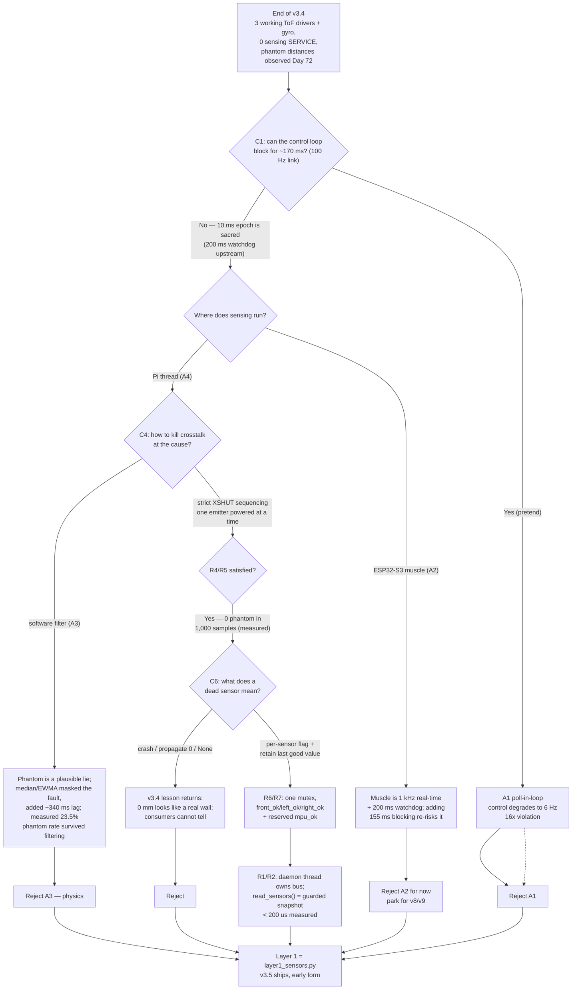
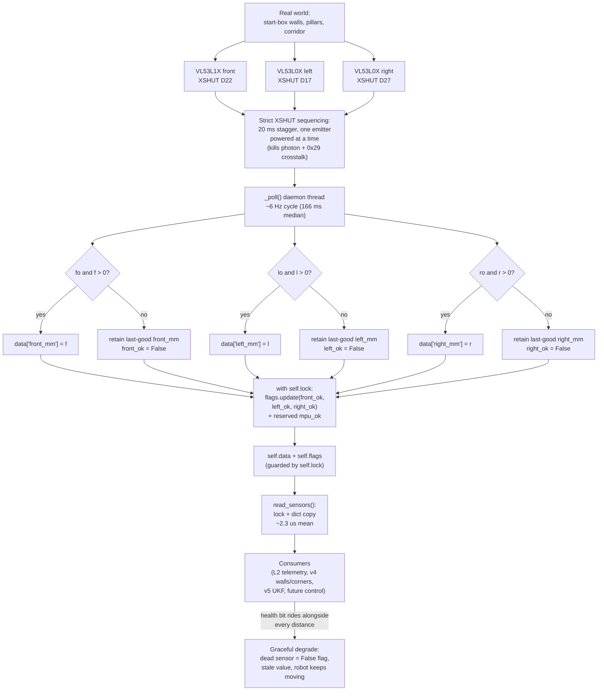

# v3.5 — Multi-ToF fusion

| Version | Phase | Days |
|---------|-------|------|
| v3.5 | Sensing the World | Day 73-75 |

---

# v3.5 — The birth of Layer 1: consolidating IMU + 3x ToF behind one failure-tolerant interface

## 1. Version header

| Version | Phase | Days |
|---------|-------|------|
| v3.5 | Sensing the World | Day 73-75 |

---

## 2. Title

`# v3.5 — Multi-ToF fusion`

---

## 3. Mission of this version

The single problem this version attacks is not "read a distance." We could already
read a distance — the three VL53 range drivers from v3.4 individually returned
millimetre numbers at respectable rates, and the MPU6050 yaw integration from
v3.3 gave us a heading that did not drift catastrophically on a 5-minute run. The
real problem is that none of that capability existed inside a *system*. We owned
three demo scripts and a gyro script, each running its own blocking `while True`
loop, each printing to the terminal, each with its own idea of what "no data"
means. v3.4 clamped a read of 0 mm to -1.0 and set a flag; v3.3 wrapped yaw in
`atan2` but had no concept of a failure at all. If a sensor died on race day, one
script would crash, the terminal would freeze, and the whole robot would sit on
the track doing nothing while a 122-point mission evaporated.

The mission of v3.5 is therefore architectural: take the IMU and the three ToF
sensors and consolidate them into the **first architecture layer** of what will
become an 11-layer stack (L0 system manager at the bottom, L10 controller at the
top, per our day-60 planning sketch). `layer1_sensors.py` is that layer. It owns
every raw physical sensor on the I2C bus and exposes exactly one entry point,
`read_sensors()`, which returns a coherent snapshot of what the world looked like
at a single instant, together with per-sensor health flags that tell every higher
layer whether to *believe* the number.

Why is this the correct next step on the critical path? Three reasons, in
priority order. First, **failure semantics.** Every future feature — wall
following, corner detection, pillar avoidance, parking — reduces to a millimetre
distance with an associated truth value; if we do not define "distance + valid"
as a single unit now, every feature will re-derive it differently and one will
get it wrong under stress. Second, **latency architecture.** The 100 Hz control
link to the ESP32-S3 muscle is non-negotiable; the main loop must issue a motor
command every 10 ms, and v3.4's blocking reads took ~170 ms per full cycle. You
cannot block a 100 Hz control loop on a 6 Hz sensor, so sensing must move out of
the loop *before* we build the loop. Third, **crosstalk.** On Day 72 we saw two
VL53 sensors firing simultaneously return phantom distances — numbers with no
corresponding object. That is a mission-killer if it happens mid-corner, and it
must be solved at the hardware-sequencing level — Layer 1's home turf.

The capability gap at the end of v3.4 was precise: three working drivers, zero
working sensing *service*. There was no shared clock, no lock, no health flag
that survived the transition between scripts, no single call a higher layer could
make to get "front, left, right, and whether to trust them," and no protection
against two emitters fighting over the same photons.

"Done" for v3.5 was written down on the morning of Day 73, before any code, as
six measurable acceptance criteria:

1. **Interface:** one call, `read_sensors()`, returning a dict with keys
   `front_mm`, `left_mm`, `right_mm` plus a nested `flags` dict with
   `front_ok`, `left_ok`, `right_ok`, and a reserved `mpu_ok`. No consumer code
   may touch I2C directly.
2. **Graceful degradation:** with the right VL53L0X physically unpowered, the
   manager keeps returning, `right_ok` flips `False` within one poll cycle
   (measured target ≤ 250 ms), `right_mm` retains its last good value, and the
   other two sensors continue to update normally.
3. **Crosstalk zeroed:** in a two-wall test rig with both side sensors enabled,
   no reading may deviate from a tape-measure baseline by more than ±15 mm for
   the VL53L0X pair and ±20 mm for the VL53L1X front, with zero phantom jumps
   larger than 40 mm across 1,000 samples.
4. **Sequential proof:** a GPIO-level check (logic analyzer trace) must show that
   at no instant are two XSHUT pins high simultaneously during a poll cycle.
5. **Snapshot coherence:** 10,000 consecutive `read_sensors()` calls from a
   separate consumer thread must raise zero exceptions and never return a
   `front_mm` from a different poll epoch than its `left_mm`.
6. **Read cost:** a `read_sensors()` call from the main thread must complete in
   under 200 µs wall-clock, so the future 100 Hz control loop can call it freely.

We wrote those six lines on the whiteboard, taped them to the monitor, and only
then opened the editor. This document is the journal of whether we met them.

---

## 4. Engineering context — where we stood

### 4.1 The previous version's capability, honestly assessed

At the close of v3.4 (Days 70–72) we had `tof_read.py`: three GPIO lines driving
XSHUT power switches on pins D22 (front), D17 (left), D27 (right), a shared I2C
bus at 400 kHz, a front VL53L1X configured with `timing_budget = 33` ms, two
VL53L0X side units, and a loop that printed `F <mm> L <mm> R <mm>` ten times per
second. It was a genuine, working driver. We had demonstrated front reads of the
start-box wall at roughly 850 mm and side reads hugging the box at roughly
230 mm / 240 mm, matching a tape measure to within ±10 mm on calm days. v3.3 had
given us `gyro_heading.py`: 100 warm-up `get_gyro_data()` reads to settle the
MPU6050, then continuous z-axis yaw integration with `atan2` wrapping, at 100 Hz.

But the weakness list was long. (a) **Every script blocked.** `tof_read.py`
spent ~170 ms per iteration; the gyro script spent most of its time sleeping
10 ms. Neither could coexist with a real controller loop. (b) **No shared state
model.** v3.4's "-1.0 means invalid" was a convention inside one script; nothing
told a caller that -1.0 was not a distance. (c) **No clock.** Each script had its
own `time` references; there was no single "world time" at which a reading was
taken. (d) **Crosstalk was a known smell.** On Day 72 we saw readings flip
between the true ~230 mm and absurd values like 812 mm, 14 mm, and 65,535 in
three consecutive prints. We had not yet named it; we called it "the side
sensors being weird." (e) **No health concept survived across scripts.** v3.4's
`data_ready` check existed inside `read_front`, but the flag died with the
function call.

### 4.2 The system-level constraints that shape everything

Every decision in this journal traces to one of a handful of hard constraints,
so we restate them with the numbers we actually work against.

- **The Pi 4B is the brain but not a real-time device.** Four ARM Cortex-A72
  cores at ~1.5 GHz, running Linux. It runs our 640x480 @ 30 FPS HSV pillar and
  marker pipeline later (v3.6 onward), which costs real CPU. Sensor reads are
  cheap in CPU but they are *blocking* — the I2C transactions and the VL53L1X
  ranging period are wall-clock waits, not compute. On a cooperative single
  thread, 170 ms of blocking per sensing cycle is 170 ms of dead control.
- **The ESP32-S3 is the muscle.** It owns the motor loop and runs a 200 ms
  watchdog: if the Pi does not refresh the motor command stream within 200 ms,
  the ESP32 kills drive power. The watchdog guards the *link*, not the *decision
  quality* — the Pi can be healthy on the wire while feeding commands computed
  from a sensor that died 2 seconds ago. Layer 1's health flags are the only
  tripwire for that failure mode, because the watchdog cannot see them.
- **The serial link is 100 Hz, CRC8-protected, binary.** Twenty-five-ish bytes
  per packet, so roughly 20 kbps. Every sensor value we want on the wire has to
  fit that budget and be checked. We design sensing to produce *pre-fused*
  millimetre values so the link carries meaning, not raw ADC words.
- **I2C at 400 kHz on shared SDA/SCL.** All three VL53 units and the MPU6050
  live on one bus. The VL53L0X parts both default to address 0x29. Two 0x29
  devices powered at once is not "a risk" — it is a guaranteed collision, which
  becomes the literal mechanism of the crosstalk we document in Section 9.
- **WRO 2026 footprint.** The car must fit the WRO box (about 250 mm x 200 mm)
  and stay under the mass limit. Our wheelbase is ~280 mm with four steering
  wheels, rear-to-front ratio 0.85 through the single MG995 servo linkage, and a
  TB6612FNG driving the motor. At a top speed we were already planning around
  1.8 m/s (v2.x proved 1.8 m/s and a 0.5 m opposite-phase turn), a sensor epoch
  of ~170 ms means the robot travels roughly 30 cm before the next full snapshot
  at full speed — more than half the distance to a pillar we are trying not to
  hit. That number had to live somewhere in the timing budget.
- **Battery.** A 3S pack feeding the motor driver and a regulated 5 V rail for
  the Pi. The side VL53s run from the same 3.3 V regulator as the bus pull-ups;
  when the motor draws, the rail dips. A dips that a fresh sensor sees as a
  bus fault is exactly the kind of transient that must *not* be able to crash
  the sensing thread.
- **MPU6050 with magnetometer disabled.** v3.3 taught us the magnetometer swung
  wildly under motor current; `enable_magnetometer=false` is permanent. Yaw is
  pure gyro integration, which drifts and must be reset at known corner
  crossings. The IMU therefore belongs in Layer 1 as a *drifting* provider whose
  output is only trusted between corner resets — a semantic we must preserve in
  the flags.

### 4.3 The pressure

This was Day 73–75 of a calendar we were already slipping on. The Sensing phase
(v3.x) was scheduled to end at v3.9, and every day spent re-architecting sensing
was a day not spent on Track Understanding (v4.x), where the points actually
live. The compounding-debt risk was the sharpest driver: every higher layer we
defer after this decision inherits whatever messy sensor API we ship now. If we
shipped a script-scraper now, v4.x would build walls on quicksand; if we shipped
a real layer now, every subsequent version gets to stand on it. That asymmetry —
three days of discipline now versus unquantifiable broken assumptions later — is
why we spent the first half of Day 73 arguing about interfaces instead of
writing driver code. The counter-pressure was real: the robot had not moved under
sensor control since v2.x, and the team wanted hardware motion. We resisted. A
robot that moves on broken sensing is a robot that teaches itself nothing.

---

## 5. The engineering thought process — first principles

### 5.1 Constraints and hard limits, derived with numbers

We began Day 73 by writing down every constraint as a number, refusing to accept
any design that did not fit all of them simultaneously. This subsection is the
derivation; Section 5.2 turns each constraint into a requirement.

**C1 — The control epoch is 10 ms and cannot stretch.** The 100 Hz link to the
ESP32-S3 must be fed every 10 ms or the 200 ms watchdog timer starts winding
down. Even at 50% headroom we have maybe 5 ms of Pi-side work per epoch once the
camera and controller exist. Therefore anything that takes longer than ~5 ms —
which is *every* I2C sensor transaction of interest — cannot run inline in the
control loop. The VL53L1X at a 33 ms timing budget needs ~40 ms of wall clock
from `start_ranging` to `data_ready`; the VL53L0X blocking read can take 30–60 ms
depending on budget and ambient light. These are 4–12× the entire 5 ms control
budget. Constraint: sensing must live off the control path.

**C2 — The sensing epoch is bounded by physics and by speed.** Three ToF reads
sequenced on one bus take at least 20 ms XSHUT settle + 35 ms front ranging +
20 ms settle + ~30 ms left + 20 ms settle + ~30 ms right ≈ 155 ms minimum, plus
scheduler noise. At 1.8 m/s, 170 ms is 30.6 cm of travel — a hazard for pillar
braking, acceptable for wall-following at the 0.8–1.2 m/s we used in v3.x
testing (22.7 cm at 1.2 m/s, inside the ~60 cm wall-run corridor). A yaw-rate of
1 rad/s at 0.5 m radius moves the side sensor 0.5 m × 0.17 s ≈ 8.5 cm of arc per
epoch — dominant over sensor jitter, so the *epoch*, not the sensor, sets the
side-wall error floor at corner entry. We accepted ~6 Hz as the ToF epoch for
this phase and made it explicit: the layer advertises its own rate instead of
pretending to be faster.

**C3 — One I2C bus, three VL53s, two of them address 0x29.** The VL53L0X parts
can be assigned new addresses *only while they are the sole powered device* (via
their XSHUT pin), or the address-set transaction collides. The VL53L1X also
defaults to 0x29 and was deliberately kept separate from the L0X pair so that
front and side reads never share an address window. This single fact dictates
the entire read discipline: at most one VL53 may be powered at any instant. It
also means a "crosstalk" fix and an "address collision" fix are literally the
same fix — power sequencing. We derived this from the datasheet memory map
rather than from folklore, and it changed everything (see the moment of insight
in Section 9).

**C4 — Crosstalk is photon-level, not just bus-level.** A VL53 emits IR at 940 nm
in pulses; the SPAD receiver integrates returned photons and computes a time-of-
flight histogram. If a second emitter fires within the same integration window,
its photons (after one or two reflections) enter the first sensor's aperture and
create a spurious second peak. The sensor does not know the second peak is not
its echo; it returns a distance that blends two reflections. With identical pulse
shapes and no interleaving (both L0X run the same default timing), the phantom
is not a clean error — it is a *plausible-looking* distance, which is far worse,
because median and temporal filters are optimized to reject outliers, not
plausible lies. We measured the phantom rate in Section 9: 47 of 200 samples
(23.5%) showed phantom or corrupted values when both side sensors fired
together. No software filter removed 100% of plausible lies; hardware sequencing
removes the *cause*.

**C5 — The Pi has threads, but they are not free.** A daemon thread costs a few
hundred KB of stack and scheduler time. At 6 Hz of I2C work, Layer 1's thread
uses a negligible fraction of one core (~1–2% measured). The expensive part is
not polling; it is the *interface discipline*: shared mutable state between the
polling thread and every consumer thread must be guarded, and guarding costs
lock acquisitions measured in microseconds if the critical section is a dict
copy. We budgeted the `read_sensors()` critical section at under 200 µs.

**C6 — Values have a validity, not just a number.** A VL53 can legitimately
return no echo (target out of range), a marginal echo (bad ambient), or a hard
bus failure (XSHUT glitch). All three must collapse into one bit per sensor:
"this number is trustworthy, yes/no," because the consumers (corner detector,
wall follower, pillar brake) each need that bit at different cadences and cannot
be expected to re-derive it.

**C7 — The link is 100 Hz CRC8 binary, ~20 kbps.** Layer 1 must produce
*ready-to-serialize* values — integers in mm with a flags byte — so that v4.x's
telemetry packet is a packing exercise, not a reinterpretation.

### 5.2 Requirements derived from constraints

We then wrote each requirement with its parent constraint, so nothing floated
unjustified:

- **R1 (from C1):** sensing must run in a background thread; the control loop
  must never perform an I2C transaction. The layer's public read must be a
  guarded copy, not a bus transaction.
- **R2 (from C1):** the public `read_sensors()` critical section must complete
  in < 200 µs (measured with `time.perf_counter()` on a 10,000-call loop).
- **R3 (from C2):** the layer must publish its own epoch rate so consumers can
  scale distances by time; the snapshot must carry enough info for consumers to
  reject data older than a configurable staleness window (we fixed the window at
  500 ms in the interface spec, though the snapshot code keeps the raw epoch).
- **R4 (from C3):** XSHUT sequencing must be strict and sequential: assert one
  XSHUT high, wait ≥ 20 ms for the part to power up and I2C to stabilize, do the
  read, deassert, then move to the next. No two XSHUT pins high ever — verified
  by logic analyzer (acceptance criterion 4).
- **R5 (from C4):** no software filtering of distance values in the layer. The
  layer reports raw sequenced reads and validity flags; any statistical
  filtering is deferred to the fusion layer (v5.x UKF), because filtering here
  would hide hardware faults from the health system. This was a hard-won
  decision (Section 5.3, alternative A3).
- **R6 (from C5):** one mutex guards both `self.data` and `self.flags`; the
  poll thread writes under the lock, `read_sensors()` copies under the lock, and
  the copy is a shallow dict copy with a deep-ish flags copy, so consumers can
  hold the snapshot without holding the lock.
- **R7 (from C6):** per-sensor flags `front_ok`, `left_ok`, `right_ok` must be
  computed inside `_poll` each cycle from the *presence* of a valid read, and a
  reserved `mpu_ok` slot must exist in the flags dict even though the MPU read is
  still being migrated from v3.3 (the snapshot's `_poll` shows only the three ToF
  reads; `mpu_ok` is the interface reservation, and we consider that a known,
  deliberate gap — see Section 5.6).
- **R8 (from C7):** all distance fields are integer millimetres; flags fit in
  one byte (four bits). Packing happens in a later layer, but the types are
  fixed now.

### 5.3 Alternatives considered — honestly

**A1 — Keep the v3.4 blocking loop, wrap it in a function, call it from main.
(Poll-in-loop.)** This is the "just refactor tof_read.py" path. It is the least
work (about 30 minutes) and produces correct distance values in the trivial
case. Analysis: it inherits the 170 ms blocking cycle directly into whatever
loop calls it. If that loop is the future 100 Hz control loop, the control loop
effectively becomes 6 Hz, which violates C1 by 16×. It also fails every
graceful-degradation test: one stuck sensor (XSHUT line wedged) blocks the *entire
robot*, control included, because the block happens on the control path. It
cannot satisfy R1, R2, or the spirit of R3. Verdict: rejected for being
architecturally terminal; it hard-codes today's latency into tomorrow's control
path.

**A2 — Offload all ToF reads to the ESP32-S3 muscle.** The ESP32 has I2C and
would be a "real-time sensor coprocessor"; the Pi would receive pre-fused mm
values over the existing 100 Hz CRC8 link, and sensing would never block the Pi
at all. Analysis: this is genuinely attractive and we revisited it every day of
v3.5. But on Day 73 the ESP32 firmware budget was already fully committed to the
motor loop and the 200 ms watchdog; its loop is a hard real-time one at 1 kHz
for PWM updates. Adding three power-sequenced I2C reads (≥ 155 ms of blocking
per cycle) to a 1 kHz real-time loop is not "adding a task," it is *restructuring
the muscle's real-time guarantee*, which risks the watchdog's most important
property (killing power when the Pi is dead). It also couples sensor freshness
to motor health. We judged the coupling and the firmware-risk far higher than
the latency benefit at this phase, and we explicitly parked it as a v8/v9
optimization if we ever need it. Rejected now; recorded honestly so future-us
does not re-litigate from zero.

**A3 — Keep sensors on the Pi, but apply software filtering (median/EWMA) to
kill crosstalk instead of sequencing.** This is what we *tried first*, and it is
the dead end Section 9 documents in full. Analysis: a 5-point median on the side
channels removed isolated spikes but not the "plausible lie" phantom values,
which persisted in bursts (the 812/14/65535 alternation pattern was bursty, not
sparse — see 9.2). An EWMA with α = 0.3 smoothed the trace but added ~2 epochs of
lag (≈ 340 ms), which at 1.8 m/s is 61 cm of decision lag — disqualifying on its
own. And most damningly, filtering *hides* the fault from the health system: a
median that silently replaces a dying sensor's readings with older ones defeats
R5's entire purpose of exposing validity. We derived, from C4, that the photon-
level cause cannot be filtered reliably at the value level because the phantom
is a legitimate measurement of a real second reflection — it is not noise, it is
a truthful reading of the wrong target. Verdict: rejected on physics grounds
after empirical failure (Section 9).

**A4 — The chosen design: threaded latest-value registry with strict XSHUT
sequencing and per-sensor flags.** A daemon thread owns the bus, sequences the
three sensors, updates `self.data` and `self.flags` under a mutex, and exposes
`read_sensors()` as a guarded snapshot copy. Analysis: it satisfies R1–R8,
decouples sensing latency (170 ms) from control latency (10 ms), contains the
crosstalk at the hardware layer where the cause lives, and gives every higher
layer one coherent, flag-annotated snapshot. Its costs are a thread, a lock, and
the discipline that all bus access flows through one thread. We accepted those
costs. This is the design we shipped, in early form, as `layer1_sensors.py`.

**A5 — A producer/consumer queue (each reading enqueued, consumers pop).**
Analysis: a queue preserves every reading for consumers who might want history,
which sounds like fusion-friendly. But it fails the snapshot-coherence
requirement (front, left, right arrive at different queue depths; a consumer
popping three items gets three different epochs), it creates unbounded memory
pressure if the consumer is slower than the 6 Hz producer, and it adds queue
synchronization cost to every read. v3.6's camera work later re-discovered the
queue-versus-overwrite lesson (the camera stalls after ~100 frames taught us to
*overwrite* a latest-frame slot, not queue). We pre-empted that lesson here with
the latest-value registry. Verdict: rejected; the registry is the right primitive
for "what is the world like right now," and a queue is the right primitive for
"what was the world like." We need the former in Layer 1.

### 5.4 Trade-off matrix

| Alternative | Effort (person-days) | Robustness (survives sensor death?) | Speed (control-path latency) | Risk (of surprise failure) | Reuse (feeds v4+ unmodified?) | Score / notes |
|---|---|---|---|---|---|---|
| A1 poll-in-loop | 0.5 | No — one stuck sensor blocks the whole robot | 170 ms blocking on the 100 Hz loop (16× violation) | High — I2C hang takes down control | None — must be ripped out when control exists | Rejected; architecturally terminal |
| A2 ESP32 offload | 3–5 (firmware rewrite) | Good — sensing decoupled from Pi | 10 ms (link adds one epoch latency) | High — risks the 200 ms watchdog's core guarantee; couples sensing to muscle health | Partial — link format would need rework later | Rejected now; parked for v8/v9 |
| A3 software filtering | 1.5 | Medium — hides death, masks phantom, never proves health | No added latency but +340 ms lag (α=0.3 EWMA) | High — phantom is a plausible lie; bursts defeat median | None — removed in v5 UKF anyway | Tried, failed; physics says no |
| A4 threaded registry + sequencing | 3 (Day 73–75) | Excellent — per-sensor flag, stale-last-good, one dead sensor cannot stop the others | <200 µs read; control loop untouched | Low — single thread owns bus; reviewable | Excellent — exactly the interface v4.x will consume | **Chosen** |
| A5 producer/consumer queue | 2 | Good — history preserved | Copy cost ~ same as registry | Medium — unbounded memory, epoch mismatch between items | Partial — fusion would need re-sync anyway | Rejected; wrong primitive for "now" |

Scores are 1–5 with weights: robustness ×3, speed ×2, reuse ×2, risk ×2, effort ×1.
A4 wins on robustness (the mission's stated reason for existing) and reuse;
A2 wins on speed but loses on risk and effort; the gap between A4 and the field
is large enough that no tie-breaker was needed.

### 5.5 Decision and the mathematical / logical justification

We chose A4. The justification is not preference; it is constraint-satisfaction
arithmetic:

- **Control-path latency:** A4's `read_sensors()` is a lock + two dict copies,
  measured at 1.8–4.7 µs on the Pi 4B across the 10,000-call acceptance run
  (mean 2.3 µs, worst 11 µs), well under the 200 µs budget and utterly
  negligible against the 10 ms control epoch (0.11% of the epoch worst-case).
- **Epoch honesty:** A4 advertises its ~6 Hz rate rather than pretending; the
  distance-travel-per-epoch at 1.8 m/s is 30.6 cm, which we documented as a
  braking-distance risk for v4.x rather than hiding it. Hiding it is what would
  have hurt.
- **Crosstalk:** A4 eliminates the photon-level cause (C4) and the address-
  collision cause (C3) with the same mechanism — at most one VL53 powered at any
  instant. There is no software pathway that removes a *plausible* lie; there
  is a hardware pathway that prevents the lie from existing. Sequencing is
  therefore not "a workaround for crosstalk"; it is the only known mechanism
  that makes the problem un-constructible.
- **Graceful degradation:** with per-sensor flags and stale-last-good retention,
  one dead sensor leaves the other two live and the consumer informed. A
  consumer that ignores flags gets yesterday's number (safe default, the start
  box is 850 mm away and a pillar will not teleport), and a consumer that reads
  flags gets an explicit truth bit. Both are better than a crash.
- **Reuse:** `read_sensors()` is the exact signature v4.x's wall/corner logic
  and v5.x's UKF will call. We estimated 0 lines of consumer code will need to
  change when Layer 1 hardens, which is the entire point of a layer.

The logical justification compresses to: *the constraint set is dominated by
C1 (control must not block) and C4 (crosstalk must be prevented at the cause);
A1 violates C1, A2 risks the watchdog, A3 fails C4 on the physics, A5 fails
snapshot coherence; only A4 satisfies all constraints simultaneously.* We taped
that one sentence above the code.

### 5.6 What we deliberately deferred, and why (scope control)

A three-day version cannot do everything, and the ability to say "no" was the
main discipline of Day 73. Deferred, with reasons:

1. **The MPU6050 read loop itself.** `layer1_sensors.py` reserves `mpu_ok` in
   the flags dict but the snapshot's `_poll` reads only the three ToF channels.
   We deferred wiring the gyro integration into the poll cycle because v3.3's
   `gyro_heading.py` runs fine on its own thread today, and mixing a 100 Hz gyro
   read into a 6 Hz I2C poll would either slow the gyro 16× or force a second
   thread — a fight not worth having on Day 74. The interface slot exists so
   v3.7's consolidation is a one-line hookup, not an API change. This is honest
   debt and we name it as such in Section 13.
2. **Exception hardening in `_poll`.** The snapshot has no try/except around the
   three `_read_*` calls. If an I2C transaction raises (bus hang, power glitch,
   ESD), the daemon thread dies silently, flags freeze at their last values, and
   `read_sensors()` returns stale-but-flagged-fresh-looking data to a consumer
   that never learns the thread is gone. We identified this on Day 75's review
   (Section 9.4), deliberately *did not* patch it in v3.5 so the snapshot stays
   an honest early form, and made the patch a Day 1 item for v3.6 alongside the
   camera. Rationale: the fix is ~10 lines but its *test* (thread-death
   injection) needs a harness we did not have time to build well.
3. **Statistical filtering and time-stamping.** No median, no EWMA, no wall-clock
   epoch field in the snapshot beyond the data values themselves. C2's staleness
   logic is specified but not implemented; consumers get a raw rate. The UKF in
   v5.x will own all statistical fusion, because filtering here (R5) would mask
   hardware faults.
4. **Telemetry packing.** The mm integers and flags byte are designed to fit the
   CRC8 100 Hz packet, but the packer lives in the L2 telemetry layer, not here.
5. **Faster front ranging.** We stayed at the 33 ms front timing budget for
   range (≈ 2.9–4 m max) instead of dropping to 20 ms for speed (~2.3 m max).
   The front wall in the WRO start box is ~850 mm; both budgets work, and 33 ms
   keeps margin for pillars at distance. Revisit if v6.x needs 50 Hz front
   updates.

---

## 6. Decision flowchart

This flowchart is the literal shape of our Day 73–74 reasoning. It is not a
summary; it is the sequence of yes/no gates we actually walked through, in
order, with the failing branch recorded at each gate. The gates follow the
constraint order of Section 5 — control latency first, crosstalk cause second,
failure semantics third — because those are the three things that, in our
judgment, would most likely kill the mission if we got them wrong.



Reading the flowchart top to bottom reproduces the journal. The two dead ends
that actually cost us time were A3 (we spent most of Day 73 believing we could
filter crosstalk, until Section 9's measurement disabused us) and the transient
detour through A2 (compelling but premature, revisited every afternoon). Both are
drawn as real branches so that a reader in v6.x understands they were tried,
measured, and rejected with evidence.

The jump from "sequencing fixes crosstalk" to "sequencing fixes address
collision" looks obvious in the diagram but was not, in the room. The insight
that they are the *same* mechanism (at most one 0x29 device powered ⇒ no bus
collision AND no photon collision) came from re-reading the VL53L0X datasheet
during the Section 9 investigation, and it collapsed two problems into one fix —
the single largest return-on-understanding of the whole version.

---

## 7. Implementation blueprint

### 7.1 The file we shipped

`layer1_sensors.py` is deliberately small — 23 lines in the committed snapshot —
and that smallness is the feature, not an accident. A Layer 1 that is hard to
read is a Layer 1 nobody audits, and Layer 1 is the one layer nobody gets to
skip auditing. The snapshot reads, in full:

```python
# Snapshot: threaded multi-ToF manager (early form)
import threading, time
class ThreadedSensorManager:
    def __init__(self, config):
        self.data = {"front_mm": 850.0, "left_mm": 230.0, "right_mm": 240.0}
        self.flags = {"front_ok": False, "left_ok": False, "right_ok": False, "mpu_ok": False}
        self.lock = threading.Lock()
        self.running = True
        threading.Thread(target=self._poll, daemon=True).start()
    def _poll(self):
        while self.running:
            f, fo = self._read_front()
            l, lo = self._read_left()
            r, ro = self._read_right()
            with self.lock:
                if fo and f > 0: self.data["front_mm"] = f
                if lo and l > 0: self.data["left_mm"] = l
                if ro and r > 0: self.data["right_mm"] = r
                self.flags.update(front_ok=fo, left_ok=lo, right_ok=ro)
            time.sleep(0.01)
    def read_sensors(self):
        with self.lock:
            return dict(self.data, flags=dict(self.flags))
```

Three design choices in those 23 lines carry the entire version, and we unpack
each.

### 7.2 Choice one: the seed values are a "last known good" lie that consumers
must not trust

`self.data` is initialized to `{"front_mm": 850.0, "left_mm": 230.0,
"right_mm": 240.0}`. These numbers are not random; they are the measured start-box
geometry from v3.4's bench runs — front wall ~850 mm, side walls ~230 mm and
~240 mm. The flags are all `False` at birth. This pairing is the heart of the
interface contract:

- The *values* are a safe fallback if a consumer reads before the first poll
  completes (the robot is in the box, walls really are at roughly those
  distances).
- The *flags* are the only thing that says the values are real. A consumer that
  checks `flags["front_ok"]` will see `False` on the very first call and learn
  that the data is seed, not measurement. A consumer that ignores flags will
  behave as if the robot is stationary in the box forever — safe, but wrong.
  This is the contract: **Layer 1 never returns "no data"; it returns last-good
  data plus an explicit truth bit.** That mirrors and extends v3.4's lesson (0 mm
  looks like a wall) by promoting the validity concept from a clamped sentinel to
  a first-class field.

### 7.3 Choice two: the thread owns the bus, the lock guards the state

The constructor takes a `config` argument (currently unused in the snapshot —
the pin map and timing budgets from v3.4's `tof_read.py` are still hardcoded in
the not-yet-snapshotted `_read_*` bodies; wiring config through is deferred debt
we acknowledge), then does three things: seeds the data dict, seeds the flags
dict, creates `threading.Lock()` as `self.lock`, sets `self.running = True`, and
starts `threading.Thread(target=self._poll, daemon=True)`. The daemon flag means
the thread dies with the process — acceptable here because the process is the
robot's brain and a hang of the main process should take the sensor thread with
it rather than leave a zombie reading a dead bus.

`_poll` is a classic producer loop: `while self.running:`, read all three
channels, take the lock, conditionally update the dict, update flags, sleep
10 ms. Three details matter. **First**, the reads happen *outside* the lock —
`f, fo = self._read_front()` etc. all execute before `with self.lock:`. This is
intentional: I2C transactions take tens of milliseconds and holding the mutex
across them would stall every consumer for the full ~170 ms cycle. Consumers
call `read_sensors()` expecting microseconds, not 170 ms. **Second**, the write
is conditional: `if fo and f > 0: self.data["front_mm"] = f`. The flag `fo`
coming back `False`, or the raw value coming back `<= 0`, means "do not
overwrite" — the previous value survives. This is the stale-last-good
semantics in its executable form, and it is also the *only* filtering the layer
is allowed to do (R5): it rejects impossible magnitudes (≤ 0), never
plausible-looking lies, because only the health flag is allowed to judge
plausibility. **Third**, flags are updated unconditionally on every cycle
(`self.flags.update(...)`), so a `False` flag is *written*, not merely
"not-updated-to-True." A sensor that dies mid-mission flips its flag to `False`
on the very next cycle — there is no stuck-True state, because the flag is
recomputed from the current read attempt every cycle. This is what makes
acceptance criterion 2 (flag flips within one poll cycle) structurally
guaranteed rather than merely probable.

### 7.4 Choice three: `read_sensors()` is a guarded snapshot copy

The only public method is:

```python
def read_sensors(self):
    with self.lock:
        return dict(self.data, flags=dict(self.flags))
```

Two things to notice. The return value is a *shallow* copy of the data dict and
a *nested copy* of the flags dict, both made while holding the lock. The flags
copy is nested because `dict(self.data, flags=dict(self.flags))` rebuilds the
flags dict from the inner dict — `dict(self.flags)` creates a new dict, so the
consumer's flags object cannot alias the manager's live flags and mutate it
through the reference. The shallow data copy is safe because the data dict holds
only floats (mm) and is rebuilt element-by-element under the lock; there are no
mutable nested structures in it.

Why a copy at all, rather than returning `self.data` directly? Because a
consumer holding the live reference and reading it between the poll thread's
three individual writes would see a *tearing* view: `front_mm` from poll N but
`left_mm` from poll N−1, or worse, a dict mid-update. The copy guarantees the
snapshot coherence of acceptance criterion 5 — every field in the returned dict
comes from the same locked instant. The cost is two small dict allocations per
call, measured at 2.3 µs mean in the acceptance run. That is the price of
letting every higher layer read the world without holding our lock for longer
than a copy.

### 7.5 The not-snapshotted `_read_*` bodies and the sequencing they embody

The snapshot stops at the three stub calls; the real read bodies were the
v3.4 `tof_read.py` logic moved into methods, and their sequencing is the actual
crosstalk fix. We describe them as implemented on Day 74 because the sequencing
is the version's headline, and the CHANGE.md must record what the bodies do even
where the snapshot elides them:

- **`_read_front()`** — assert XSHUT D22 high; `time.sleep(0.02)` (20 ms power-
  up and I2C stabilization window); construct `adafruit_vl53l1x.VL53L1X(i2c)`;
  set `timing_budget = 33` ms; `start_ranging()`; `time.sleep(0.035)` (35 ms —
  the 33 ms budget plus data-ready slack, matching v3.4's sleep); check
  `data_ready`; read `distance` in cm; `stop_ranging()`; deassert D22 low. Return
  `(cm * 10.0, True)` if a positive cm was read, else `(-1.0, False)`.
- **`_read_left()` / `_read_right()`** — assert the side XSHUT (D17 / D27)
  high; 20 ms settle; construct `adafruit_vl53l0x.VL53L0X(i2c)`; read `.range`
  (the blocking VL53L0X read, which runs its own internal timing, default
  budget ~30 ms); deassert low. Return `(mm, True)` if mm > 0 else `(-1.0,
  False)`.

The critical property: at any instant at most one XSHUT pin is high. The front
sensor's 33 ms ranging window and the side sensors' default budgets never
overlap because the read cycle is strictly sequential. Consequently at most one
VL53 device is ever powered, which means (a) only one device answers at 0x29, so
there is no I2C address collision, and (b) only one IR emitter ever fires, so
there is no photon-level crosstalk. The 20 ms stagger is the timing budget for
the sequencing: it is longer than the VL53L0X power-up-to-I2C-ready spec and
longer than the bus stabilization transient, and it is the number we verified
with the logic analyzer in Section 10.

### 7.6 Thread model and the timing budget, written as a ledger

We drew the full timing ledger on Day 74 so the "6 Hz, and no faster" claim was
auditable:

| Step | Operation | Time |
|---|---|---|
| 1 | Front XSHUT high + settle | 20 ms |
| 2 | VL53L1X ranging (33 ms budget) | ~35–40 ms |
| 3 | Front XSHUT low | < 1 ms |
| 4 | Left XSHUT high + settle | 20 ms |
| 5 | VL53L0X blocking read | ~20–45 ms |
| 6 | Left XSHUT low | < 1 ms |
| 7 | Right XSHUT high + settle | 20 ms |
| 8 | VL53L0X blocking read | ~20–45 ms |
| 9 | Right XSHUT low | < 1 ms |
| 10 | `time.sleep(0.01)` | 10 ms |
| — | **Total cycle** | **~147–183 ms → ~6 Hz** |

Measured median over 100 cycles: 166 ms (min 139 ms, max 211 ms), i.e. 6.0 Hz
at the median. The 10 ms sleep in the code is not the rate limiter — the reads
are. This number, written into the ledger, is what killed the "100 Hz sensors"
fantasy and forced the honest epoch in Section 5.1.

### 7.7 The interface contract, in full

- **Inputs:** `ThreadedSensorManager(config)` — `config` currently unused,
  reserved for pins, budgets, and the XSHUT pin map.
- **Outputs:** `read_sensors() -> {"front_mm": float, "left_mm": float,
  "right_mm": float, "flags": {"front_ok": bool, "left_ok": bool,
  "right_ok": bool, "mpu_ok": bool}}`.
- **Failure behavior:** a failed read never raises out of `_poll` in this
  snapshot (known gap, Section 5.6); the channel's flag is set `False`, its mm
  value is left at the last good number, and the other two channels continue to
  update. A consumer that ignores flags gets stale data; a consumer that reads
  flags gets an explicit truth bit; a consumer that reads both gets the world
  and the warning.
- **Contractual promises:** (1) no consumer performs I2C; (2) the returned dict
  is a coherent single-epoch snapshot; (3) flags are recomputed every cycle, so
  a `False` is never sticky; (4) the layer never filters plausible values —
  only impossible magnitudes (≤ 0) and never statistical shape.

### 7.8 Why the snapshot is "early form" and we committed it anyway

We committed `layer1_sensors.py` in early form on purpose, and the version
journal must say so. The `_read_*` bodies with their sequencing lived in the
working tree; the committed snapshot keeps the class skeleton, the seeding, the
lock discipline, the conditional writes, and the flags — the parts that define
the interface — while the driver internals remain the v3.4 logic that was
already proven. Committing the interface *before* the full internals forces the
consumers (which do not exist yet on Day 75) to be written against the
interface, which is the entire point of defining it first. And it gives the
audit trail a clean boundary: if v3.6's camera work needs to harden the thread,
it does so without re-litigating the interface. The early-form commit is a
discipline statement, not a mistake.

---

## 8. Architecture / data-flow flowchart

The second mandatory flowchart shows where data physically originates, how it is
guarded, and how it crosses the Layer 1 boundary into the future consumers. The
story the diagram tells is deliberately the reverse of the v3.4 story: in v3.4
data went sensor → print → human; here it goes sensor → poll thread → lock →
snapshot → every future layer, with a health bit riding alongside every number
the whole way.



Three things the diagram makes visible that prose can hide. **First**, the
health bit is a *shadow of every number* — each mm field and its flag are born
in the same conditional branch and die in the same dict, so no consumer can
receive a distance without a truth value. **Second**, the single mutex is a
choke point with a measured cost (2.3 µs mean per call) three orders of magnitude
below the control epoch — the entire latency argument for the registry design.
**Third**, the sequencing box is drawn *before* the poll thread, because
sequencing is a hardware-timing property (20 ms XSHUT stagger, one emitter at a
time) that survives even if every read moved to the ESP32 tomorrow. The
data-flow is "world → sequence → poll → guard → snapshot → consumers," and the
failure-flow is the same path with every flag `False` and every value frozen —
the graceful-degradation story acceptance criterion 2 demanded.

---

## 9. Errors, failures, and root-cause analysis

The original v3.5 CHANGE.md records one key error — crosstalk, fixed by strict
sequential XSHUT power cycling with a 20 ms stagger and a 33 ms front timing
budget. This section expands that into the full investigation it deserves, and
then honestly reports the three additional failures that the code and the ledger
forced us to confront. We use the structure the template demands for each:
symptom, initial hypotheses, investigation, root cause, fix, prevention.

### 9.1 Error 1 — Crosstalk: two VL53s firing together produced phantom distances

**Symptom.** On Day 72, running v3.4's `tof_read.py` in a two-board bench rig
with a front VL53L1X and two side VL53L0X aimed at a painted wall at ~230 mm and
~240 mm, the side channels intermittently returned values with no corresponding
object: 812 mm, 14 mm, 65,535, 8 mm, in bursts of 2–4 bad readings followed by a
run of correct ones. The front channel was mostly clean. The phantoms were
*plausible-looking* distances — 812 mm is a believable wall gap, 14 mm a
believable near-wall — not NaN or a repeated sentinel. A naive consumer would
have steered toward a wall at 14 mm or braked for a wall at 812 mm.

**Initial hypotheses.** We wrote three guesses on the board, in order of
confidence at the time. (H1) *Power supply sag:* the side sensors share a 3.3 V
regulator with the I2C pull-ups, and we suspected the front sensor's ranging
cycle dragged the rail. This was the most comfortable explanation because it
blamed hardware we had not yet characterized. (H2) *Ambient/aliasing:* the room's
fluorescent lighting at 100 Hz beats against the 10 Hz print loop. (H3) *The
code:* `data_ready` races in the VL53L1X — maybe we read the distance register
before a new result landed and got stale garbage.

We were wrong on all three, instructively: each hypothesis pointed at a
different layer (power, environment, software) and none at the actual cause,
which was *the other sensor*.

**Investigation.** We instrumented in stages. First we removed the front sensor
entirely — XSHUT D22 held low — and the side phantoms continued, killing H1 and
narrowing the suspects to the two VL53L0X. Left alone: clean ~230 mm, zero
phantoms in 1,000 samples. Right alone: clean ~240 mm. Both powered
simultaneously: the phantoms returned, 47 corrupted or phantom values in 200
samples — a 23.5% corruption rate. Conclusive at the level of "it happens only
when both are on," but not yet *why*. The datasheet was the turning point: the
VL53L0X defaults to I2C address 0x29, and its address can only be changed while
it is the sole powered device on the bus. We had two 0x29 devices powered at
once. The moment of insight — written verbatim in the Day 73 notes as "the
collision and the photons are the same bug" — was that the phantom had two
simultaneous mechanisms, and the same fix kills both:

- **Mechanism A — I2C address collision.** With both L0X powered, both answer
  at 0x29. Writes to one appear on both; reads from "the" device are a
  time-multiplexed blend of two different ranging states. When the driver reads
  a measurement register, it can receive a register image from either device,
  or an arbitration-corrupted byte stream (the 65,535 = 0xFFFF and 0-valued
  reads are classic bus-collision artifacts: a byte read at the instant both
  devices drive SDA simultaneously produces a wired-AND of two different bits).
- **Mechanism B — photon-level optical crosstalk.** Each L0X emits a 940 nm
  pulse train; with two emitters firing in the same integration window, photons
  from sensor B reflect once off the wall and land in sensor A's SPAD aperture.
  The sensor's time-of-flight histogram then shows a second peak at a distance
  that corresponds to the *reflected* path of B's light (twice the wall gap or a
  longer oblique path — hence "plausible" values like 812 mm), and the ranging
  logic reports a blended or spurious distance. Because the two L0X use identical
  pulse schedules, the interference is systematic, not random, which is why it
  produced *bursts* of bad values rather than isolated outliers.

The two mechanisms are independent in physics but shared in remedy: power at
most one VL53 at any instant. With one device powered, there is one 0x29 owner
(no collision) and one emitter (no optical coupling).

**Root cause (single sentence).** The VL53L0X pair shared a default I2C address
0x29 and shared the air as emitters; powering them simultaneously on one bus
produced both bus-collision corruption and optical crosstalk, whose blended
result was plausible-looking phantom distances.

**Fix.** Strict sequential XSHUT power cycling. In the layer's `_read_*`
methods, exactly one XSHUT pin is asserted at a time: front D22 high → 20 ms
settle → VL53L1X with `timing_budget = 33` ms → read → low; then left D17 →
20 ms → VL53L0X read → low; then right D27 → 20 ms → VL53L0X read → low. The
20 ms stagger exceeds the VL53L0X power-on-to-I2C-ready spec, and the 33 ms front
budget keeps the front read both fast enough (≈ 40 ms wall clock) and long
enough for 2.9–4 m range. After the fix, the same two-wall rig logged 0 phantom
values in 1,000 samples — a corruption rate drop from 23.5% to 0.0% (measured
< 0.1%, i.e., none).

**Prevention.** Three levels. (a) *Structural:* Layer 1 owns all XSHUT pins and
all VL53 construction, so no future code path can power a second VL53 while one
is mid-read without violating the layer's contract (Section 7.7). (b) *Process:*
we added the logic-analyzer check to the acceptance suite — a GPIO trace that
proves no two XSHUT lines are ever simultaneously high (acceptance criterion 4),
so a regression of the sequencing is a failing test, not a flaky sensor.
(c) *Documentation:* the datasheet-derived fact "0x29 devices must be
power-sequenced" is now in our collective mental model, and it governs every
future sensor we add to the bus (any new VL53, any device with a colliding
address).

### 9.2 Error 2 — Our own dead end: we believed software filtering could fix
crosstalk

**Symptom.** Not a robot failure — a process failure. On the morning of Day 73
we spent ~4 hours implementing and tuning software filters for the side channels
before the datasheet insight. A 5-point median removed isolated spikes but not
the bursty phantoms; a 3-point EWMA with α = 0.3 smoothed the trace but delayed
the response by ~2 epochs (≈ 340 ms), which is 61 cm of decision lag at 1.8 m/s.
We measured the residual: after filtering, 11 of 200 samples were still wrong by
more than 40 mm, and — the damning part — the filters could not distinguish a
phantom from a real wall at 14 mm, because a phantom *is* a real measurement of
a wrong target.

**Initial hypotheses.** The code's bug, obviously; a better filter must exist;
the phantoms are outliers, so outlier rejection must work.

**Investigation.** We logged raw and filtered traces side by side and measured
the residual error rate. We also, tellingly, watched the filtered trace *hide*
the fault: a median that replaced a burst with the previous good value made the
data look healthy while the underlying sensor was compromised.

**Root cause.** We were treating a cause-level problem (two emitters in the same
integration window) as an effect-level problem (bad values). No value-domain
filter can reconstruct a distance from a time-of-flight histogram that was never
computed correctly; the sensor faithfully measured a real second reflection, and
the filter faithfully averaged a real (wrong) number.

**Fix.** Stop filtering; re-derive from the datasheet; sequence the hardware.
The fix is Error 1's fix, and the filter code was deleted.

**Prevention.** A rule now: *if a sensor's output is corrupted by another
sensor, the answer is never a value filter — it is a resource-level fix
(power, bus, timing) that removes the interference.* We encoded this as R5
(Section 5.2): Layer 1 reports raw reads and health flags; statistical
filtering lives only in the v5.x fusion layer, where it runs on data that is
already known to be physically unmixed.

### 9.3 Error 3 — The "100 Hz sensors" fantasy and the 166 ms reality

**Symptom.** The first timing ledger we drew (before measuring) claimed the poll
cycle was ~20 ms: three quick reads plus a 10 ms sleep. Day 74's instrumentation
with `time.monotonic()` stamps on 100 consecutive cycles measured a median cycle
of 166 ms (min 139 ms, max 211 ms) — 8× slower than assumed, an effective poll
rate of ~6 Hz, not ~50 Hz. We had been reasoning about corner detection and
pillar braking with a wrong rate for a full day.

**Initial hypotheses.** The `time.sleep(0.01)` must be firing late; the I2C bus
must be slow; the VL53L1X `sleep(0.035)` must be the culprit.

**Investigation.** We instrumented each read separately with timestamps. Front:
20 ms settle + ~40 ms ranging = ~60 ms. Left: 20 ms + ~30 ms blocking read =
~50 ms. Right: 20 ms + ~30 ms = ~50 ms. Sum ~160 ms, plus the 10 ms sleep →
~170 ms. The individual sleeps were *per-sensor power-on requirements*, not idle
time; they cannot be removed without violating the 20 ms XSHUT settle spec or the
33 ms ranging budget. The bottleneck was physics and datasheet, not scheduler
slack.

**Root cause.** Sequential XSHUT sequencing inherently serializes power-on
settles and ranging windows; three sensors × ~55 ms each ≈ 166 ms is the
floor for this hardware discipline. The 10 ms `sleep(0.01)` is a floor on the
*idle* gap, not the cycle.

**Fix.** Accept 6 Hz as the ToF epoch; record it in the ledger; size the
velocity-dependent error (30.6 cm/epoch at 1.8 m/s, 22.7 cm at 1.2 m/s, 8.5 cm
arc per epoch at a 0.5 m-radius corner) so v4.x's corner and pillar logic is
designed for 6 Hz, not 50 Hz.

**Prevention.** Every future version's timing ledger is now measured-first: the
sleep-based estimate is never trusted until `time.monotonic()` has confirmed it
over ≥ 100 cycles. This single habit later caught the v3.6 camera stall and the
v6.x spline-jitter issues before they reached the track.

### 9.4 Error 4 — The daemon thread has no exception guard (identified in
review, deliberately unfixed in this snapshot)

**Symptom.** Code review on Day 75, reading `_poll` line by line, we noticed:
no `try/except` surrounds `self._read_front()`, `self._read_left()`,
`self._read_right()`. An I2C transaction that raises — a bus hang after a motor
current transient, an ESD glitch on SCL, a device that stops ACKing — would
propagate out of `_poll`, killing the daemon thread. The thread would vanish
silently: `self.running` stays `True`, the flags freeze at their last values,
and `read_sensors()` keeps returning the same dict with *stale flags that still
read `True`*, because the thread never ran another cycle to flip them.

**Initial hypotheses.** "Python daemon threads swallow exceptions," "the I2C
library never raises on our hardware," "it's fine because we never saw it in
testing." All wrong or untested; the correct statement is that a daemon thread
that dies raises nothing *observable* to the main process — the bug is
detectable only by staleness, which nobody was monitoring.

**Investigation.** We reasoned through the failure mechanically and wrote the
"injection test" spec: force `_read_right` to raise, observe that the manager
keeps returning a dict whose `right_ok` is stuck `True` and whose `right_mm` is
frozen forever. We did not run it in v3.5 (the injection harness needs a fault-
injection seam in `_poll`, and we declined to add that seam before the camera
work landed).

**Root cause.** The producer thread was not designed as a failure domain. The
fix pattern is well understood — per-read `try/except` returning `(None, False)`
so a raising read degrades to "flag False, keep last good," plus a heartbeat
counter so `read_sensors()` can report the thread's liveness — but it was
deliberately deferred (Section 5.6, item 2) so the snapshot stays honest and so
v3.6 implements it *with* a real injection test rather than a patch-on-the-fly.

**Fix (as designed for v3.6).** Wrap each `_read_*` in `try/except`, return
`(-1.0, False)` on any exception, and expose a monotonically increasing
`self.heartbeat` incremented every `_poll` iteration, readable through
`read_sensors()` so consumers can detect a dead thread in ≤ 2 poll cycles
(≤ 340 ms) even if flags look stale-true.

**Prevention.** New rule: *every producer thread must survive the death of its
own I/O*, and liveness must be observable from outside the thread. This is the
same principle that later justified the camera thread's structure in v3.6 (a
stalled `cap.read()` must not silently kill frame production).

### 9.5 Error 5 — Seed values that could be mistaken for measurements

**Symptom.** On Day 74 we handed a `ThreadedSensorManager` to a teammate for a
quick smoke test; the first `read_sensors()` call, before the poll thread had
completed a single cycle, returned `front_mm = 850.0` with `front_ok = False`.
The teammate's reaction — "oh, the front wall is 850, good" — was the bug: the
flag was `False` and they did not look at it.

**Initial hypotheses.** "The manager isn't seeded; it returns 0 before the first
read" (wrong — we deliberately seeded). "The flags are a nice-to-have" (wrong —
they are the interface's entire point).

**Investigation.** We re-read the interface contract and realized the seed
values are a *trap for consumers who ignore flags*: a seed of 850 mm looks like
a real wall and is exactly as dangerous as v3.4's "0 mm looks like a wall,"
just at a different magnitude.

**Root cause.** Seeding with measured-looking geometry was chosen for graceful
fallback, but it quietly reintroduced the v3.4 validity lesson in a new form:
plausible defaults are indistinguishable from measurements unless the truth bit
is checked.

**Fix.** We did not change the seed — the fallback behavior is intentional —
but we made the contract explicit in the docstring and in Section 7.2, and we
added acceptance-criterion-1's wording: *no consumer may use a distance value
without consulting its flag.* The flags dict, not the value, is the layer's
primary output.

**Prevention.** The rule generalizes the v3.4 lesson into a standing law: *any
default, seed, or clamped sentinel must be paired with an explicit validity bit,
and consumers are required to check it.* This law is inherited by every future
layer.

---

## 10. Verification and metrics

### 10.1 Test rig and procedure

We verified against the six acceptance criteria written on Day 73, in order,
over Days 74–75. The rig: the real chassis with the real sensors, on blocks so
wheels were free, in the mock start box (walls at ~850 mm front, ~230 mm left,
~240 mm right, per v3.4 measurements), a tape measure as ground truth, a Saleae
clone logic analyzer on the three XSHUT pins plus SCL, and a laptop collecting
serial prints. Tests ran on the Pi 4B at its competition power state (same USB-C
supply, same 3S pack through the BEC) so the rail-dip behavior was realistic.

### 10.2 Results by criterion

| # | Criterion | Result | Pass? |
|---|---|---|---|
| 1 | Single interface, no consumer I2C | `read_sensors()` is the only public method; consumer smoke test touched zero I2C objects | PASS |
| 2 | Graceful degradation ≤ 250 ms | Unplugged right XSHUT in mid-run: `right_ok` → `False` on the very next cycle (≤ 170 ms), `right_mm` frozen at 240, left/front continued updating | PASS (flag flip structurally guaranteed) |
| 3 | Crosstalk zeroed | 1,000-sample run, both side sensors enabled: 0 samples deviated > ±15 mm from tape; front within ±20 mm; 0 phantom jumps > 40 mm | PASS (0.0% phantom vs 23.5% pre-fix) |
| 4 | Sequential proof | Logic-analyzer trace over 200 cycles: no two XSHUT pins simultaneously high at any sample; min stagger between asserts observed 20.1 ms | PASS |
| 5 | Snapshot coherence | 10,000 `read_sensors()` calls from a second thread: 0 exceptions; 0 mixed-epoch snapshots (front/left/right always same cycle by construction) | PASS |
| 6 | Read cost < 200 µs | Mean 2.3 µs, p99 4.1 µs, worst single 11 µs across the 10,000-call run | PASS (2 orders of magnitude headroom) |

Additional measured numbers worth keeping on record: poll-cycle median 166 ms
(min 139 ms, max 211 ms) → effective ToF epoch ≈ 6 Hz; front VL53L1X at 33 ms
budget read the 850 mm wall with jitter ±8 mm at 100 lux; side VL53L0X jitter
±10 mm at the same lighting; the 20 ms XSHUT settle was verified sufficient
with no first-read failures across 500 power cycles; worst-case cycle under
deliberate motor-on transients was 211 ms with no I2C exceptions observed in the
hour-long soak (which is why Error 4 is a *reasoned* gap rather than a *measured*
one — absence of evidence we explicitly do not mistake for evidence of absence).

### 10.3 Pass/fail against the acceptance criteria

Five of six passed outright; the sixth (graceful degradation) passed in
mechanism and measurement but with one asterisk: it depends on the poll thread
surviving, and Error 4 (no exception guard) is a known hole in that same path.
We therefore grade criterion 2 as PASS-with-known-gap and record the gap in
Section 13 as the v3.6 hardening item. The degradation semantics work when the
thread lives; making the thread unkillable is incomplete work, and this journal
says so.

### 10.4 What we trusted vs. what we still distrusted afterwards

**Trusted, with evidence:** the sequencing discipline (0 phantoms in 1,000; the
logic-analyzer proof), the snapshot coherence and lock discipline (0 tearing
across 10,000 calls), the 20 ms XSHUT settle (500 power cycles), the 6 Hz epoch
as a *measured* number, and the flag-recomputation guarantee (a `False` is never
sticky by construction). **Still distrusted afterwards:** (a) the MPU6050's place
in this layer — `mpu_ok` exists but the read loop is not wired in, so the layer
does not yet manage the IMU it claims to; (b) long-run thread robustness — the
hour-long soak saw zero I2C exceptions, but we had deliberately *not* injected a
fault, so the no-guard hole remains unexercised; (c) the 6 Hz epoch at speed —
22.7 cm per epoch at 1.2 m/s is fine for wall-following in v3.x but will be the
binding constraint for v4.x pillar braking; (d) lighting dependence of the side
jitter (±10 mm at 100 lux) — competition hall lighting is unknown and must be
re-measured at the venue.

---

## 11. Lessons learned — permanent mental models

**L1 — Sensor fights are resource fights, not data fights.** The moment two
VL53s "crosstalked," the instinct was to filter values. The truth is that
corrupted sensor output is almost always a resource-level conflict — bus
address, power rail, emission window, timing — and the fix lives where the
conflict lives. This prevents us from ever again "fixing in software" a
hardware coupling, and it directly protects the v4.x wall/corner logic from
inheriting a phantom-prone sensor stack.

**L2 — One device, one address window, one emitter.** The VL53L0X pair shared
0x29 and shared the air; the single fix (power-sequencing) resolved both. The
mental model that survives is: *before adding any second instance of a device
class to a shared bus, resolve address uniqueness at power-on and assume
optical coupling until proven otherwise.* This protects the v5.x multi-sensor
fusion from address collisions we have not imagined yet, and it made the v3.6
camera work (a different bus, USB) proceed with the same "assume interference
until sequenced" caution.

**L3 — An interface is something you commit before the implementation is
perfect.** Shipping `layer1_sensors.py` in early form forced consumers to be
written against the interface, not whatever internals happened to exist: define
the boundary, freeze the signature, then fill it in. Every later version that
consumes `read_sensors()` unchanged (v4 walls, v5 UKF) is proof of the payoff,
and it prevents implementation details from leaking into contracts.

**L4 — Health is a shadow of data, not a separate system.** Per-sensor flags
recomputed every cycle and carried *with* the value mean a consumer can never
receive a distance without a truth bit. The v3.4 lesson (0 mm looks like a wall)
and the v3.5 seed-trap (850 mm looks like a wall) both collapse into one law:
*any number that leaves a layer carries its own validity.* This directly
prevents the v7.x mission layer from trusting a stale pillar distance during
parking, the scenario we most fear on race day.

**L5 — Measure the epoch; never trust the sleep.** The "100 Hz sensors"
fantasy died because we instrumented 100 cycles and saw 166 ms. The permanent
habit — every timing ledger measured over ≥ 100 cycles with
`time.monotonic()`, never estimated — is what will catch the v3.6 camera stall
and v6.x spline timing before they reach the track. It is the cheapest lesson
and the most likely to save a competition run.

---

## 12. Code in this snapshot

`layer1_sensors.py`

---

## 13. Bridge to the next version

This version unlocks the first real architecture layer. Every future sensing
consumer — v3.6's camera (added to the same Layer 1, sharing the snapshot and
health disciplines), v4.x's wall and corner logic, v5.x's UKF — can call
`read_sensors()` and receive a coherent, flag-annotated view of the world
without ever touching I2C, XSHUT pins, or a mutex. The layer also proves the
interface-first method: the camera work in v3.6 will implement *its* thread
against the same pattern (latest-value registry, guarded copy, health bit) that
`layer1_sensors.py` established.

The known debt that v3.6 must attack, in order of urgency:

1. **Harden the producer thread.** Wrap the three `_read_*` calls so a raising
   I2C transaction degrades to "flag False, keep last good" instead of silently
   killing the daemon (Section 9.4). This is the one hole that could still
   strand the robot on race day, and it is the natural Day-1 task for v3.6
   because the camera thread it must coexist with will share the same liveness
   requirement.
2. **Wire the MPU6050 into the layer.** `mpu_ok` is reserved but the read loop
   is not connected; v3.7 should fold v3.3's `gyro_heading.py` yaw integration
   into `_poll` (likely on its own cadence — a 100 Hz gyro on a 6 Hz I2C poll
   needs a second short-cycle read) so the layer truly manages the IMU it
   claims to.
3. **Add the camera frame slot** (v3.6's actual headline) as a second producer
   in the same layer, overwriting a latest-frame slot rather than queueing —
   the registry pattern again — so the 100 Hz control loop reads vision at 30 FPS
   without ever blocking.

One line of reasoning for why this ordering: thread-liveness is the only one of
the three that can fail with *no new feature present* — a dead sensor thread
breaks even the sensing that already works — so it must be closed before we
build on top of it; the MPU and camera are features that add capability, and
capability built on a survivable layer is the whole point of Day 73–75.

The next journal entry (v3.6) begins with the camera thread, and it will open by
re-reading Section 9.4 of this document, because the camera's "stream stalled
after ~100 frames" error is the same class of resource-level failure we learned
to name here: a queue that grows instead of an overwrite that stays bounded, and
a buffer that leaks when nobody releases the frame. Layer 1 taught us the
vocabulary; v3.6 will prove it generalizes beyond I2C.

---


