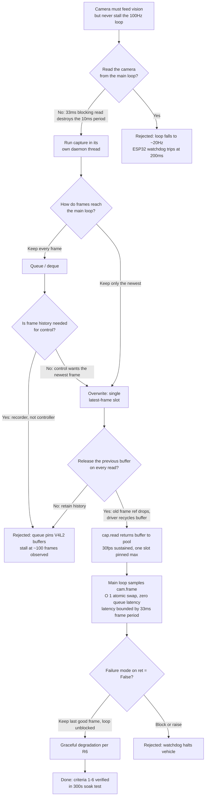

| Version | Phase | Days |
|---------|-------|------|
| v3.6 | Sensing the World | Day 76-78 |

# v3.6 — Reliable camera frame capture at 30 FPS

---

## 3. Mission of this version

The single problem this version attacks is brutally simple to state and
deceptively hard to engineer: deliver a continuous stream of camera frames at
30 FPS into a "latest-frame slot" that the 100 Hz control loop can sample
without ever blocking on the camera. The original short version of this change
record says exactly that — "Continuous camera capture at 30 FPS in a background
thread with a latest-frame slot the main loop reads without blocking" — and the
one-line rationale: "The 100Hz control loop must never wait on a 30FPS camera."
That sentence is the whole mission in compressed form, and everything below is
the reasoning that turns that sentence into a contract with measurable teeth.

Why is this the correct next step on the critical path to the competition?
Because up to v3.5 the robot was deaf, and at the start of v3.6 it is still
blind. We finished multi-ToF fusion in v3.5 (`layer1_sensors.py`), which gave
us a trustworthy front / left / right distance picture with per-sensor health
flags and a clean threaded manager pattern. But distance alone cannot win WRO
2026. The track is defined by colour semantics: pillar tops, zone markers,
colour-coded line elements, and obstacles that are identified by appearance, not
by range. A VL53L1X returns millimetres; it cannot tell a red pillar from a
green pillar. The camera is the only sensor that can, and the pillars and
markers are where the points live. The capability gap at the end of v3.5 was
therefore not "we have no camera" — the hardware had been on the robot since
day one — but "we have no trustworthy way to get camera data into the loop
without destroying the loop's timing." The ToF manager solved the same class of
problem for low-rate I2C sensors. v3.6 is the moment we apply that mental model
to the highest-bandwidth sensor on the vehicle, and it had to be done before a
single line of HSV colour detection (v3.7), blob detection (v3.8), or sensor
health (v3.9) could be trusted.

"Done" for v3.6 was written down before we wrote the code. The acceptance
criteria, agreed in the morning stand-up on Day 76, were:

1. Sustained frame rate: a 300-second soak at 640x480 must produce 8,900-9,100
   frames (i.e. 29.7-30.3 FPS mean), measured by a monotonically increasing
   counter in the capture thread, not by wall-clock estimate.
2. No stall: zero intervals longer than 250 ms between consecutive frame
   deliveries over the same 300-second soak. A 250 ms gap is roughly 7.5 frame
   periods at 30 FPS; anything above that is a stall, not jitter.
3. Latest-frame freshness: when the main loop samples the slot, the frame it
   receives must have been captured at most 40 ms earlier (about 1.2 frame
   periods), so that vision-derived state at 1.8 m/s is never more than ~72 mm
   stale before downstream compensation exists.
4. Control-loop non-blocking property: with the capture thread running, the
   100 Hz main-loop tick must never exceed 10.5 ms (a hard 5% overrun budget
   above the 10 ms nominal period), and the mean tick must stay within 1.5% of
   the camera-off baseline.
5. Reference discipline: at steady state the capture side must retain exactly
   one frame reference — the latest slot — and the number of live numpy arrays
   owned by our code must be measurable as one, not growing with time.
6. The smoke test embedded in the file must pass: after `cam = Cam()` and a
   3-second sleep, `cam.frame is not None` must print True on a cold camera
   boot, ten runs out of ten.

That is the mission: not "show a picture," not "record a video," but "prove the
camera can run continuously and hand the newest frame over without ever
stealing a millisecond from the control loop." Criterion 2 was written because
of a failure we had already tasted in prototype form — a stream that quietly
died after roughly a hundred frames — and criteria 3 and 4 exist because the
whole point of v3.6 is that the 100 Hz loop and the 30 FPS camera must coexist
without either being allowed to ruin the other.

---

## 4. Engineering context — where we stood

To understand why v3.6 is shaped the way it is, you have to know exactly what
the vehicle carried into Day 76 and what v3.5 left behind.

At the end of v3.5 we had a working, if young, sensing layer. `layer1_sensors.py`
introduced the `ThreadedSensorManager`, a daemon thread polling the three ToF
sensors and the MPU6050 every 10 ms, writing into a lock-protected `data` dict
with per-channel health flags (`front_ok`, `left_ok`, `right_ok`, `mpu_ok`),
and exposing a non-blocking `read_sensors()` that returns a shallow copy. The
crucial lesson from v3.5 was already architectural: low-rate sensors belong to
a background thread that *owns* the I2C bus and publishes *latest values*;
consumers never perform blocking I/O on the bus. The ToF crosstalk war of v3.5
taught us that sequencing at the hardware level (strict sequential XSHUT power
cycling, 20 ms stagger, a 33 ms front-timing budget) beats any amount of
software filtering. That pattern — owner thread, latest-value publication,
non-blocking consumer — is the skeleton that v3.6 reuses for the camera, and it
is worth stating plainly: v3.6 is not a new architecture, it is the same
architecture applied to a much harder device. The camera differs from a
VL53L0X in three ways that matter enormously: bandwidth (millions of bytes per
second instead of a few bytes per I2C read), frame rate (30 Hz versus the
effective ~15-30 Hz ToF polling that is already borderline), and buffering
(an internal hardware queue of capture buffers that the driver will not
overwrite while our code still holds a reference).

The system-level constraints were fixed and non-negotiable, so we re-listed
them at the top of the board on Day 76. The brain is a Raspberry Pi 4B, a
quad-core Cortex-A72 at roughly 1.5 GHz sustained, and it runs the entire
perception, decision, and serial-communication stack under Python with the
global interpreter lock. The muscle is an ESP32-S3 with a 200 ms watchdog:
if the Pi stops feeding the CRC8 binary packets over UART at 100 Hz for more
than 200 ms, the ESP32 declares the link dead and cuts drive power. This is the
single most important system-level fact for v3.6, because it converts "the main
loop got slow" from an inconvenience into a hard stop: a blocked main loop for
200 ms means the vehicle physically halts, and if that happens mid-corner at
1.8 m/s, the wheels short-brake via the TB6612FNG and the vehicle may leave the
line. The link budget is 100 Hz x ~25 bytes per packet = 20 kbps of usable
bandwidth, with CRC8 on every packet, and the Pi side cannot afford to deliver
late or to batch. The steering is a single MG995 servo driving a four-wheel
steering linkage with a rear ratio of 0.85, which means the rear wheels steer
less than the front and the whole system is path-dependent and latency
sensitive. The vision pipeline is declared in the hardware sheet as 640x480 at
30 FPS in HSV for pillar/marker detection — that is the target this version must
feed. The UI is five green LEDs on GPIO 5, 6, 13, 19, 26 plus a mode switch on
GPIO 16; nothing in the UI depends on vision yet, but the switch will later
select surprise-rule behaviours, which is a reminder that we are building for
a race day with unknown rule cards, not for a clean lab.

The pressure on Day 76 was real and double-sided. On one side there was time:
the calendar says Day 76 of 90 versions, and the phase map shows Sensing the
World runs through v3.9 before Track Understanding (v4.x) and Localization
(v5.x) begin. The camera is on the critical path for everything after v3.9:
pillar detection feeds v4's understanding of the track, and the UKF 6-DOF
localization in v5 cannot fuse what never arrives. A camera-pipe failure now
compounds as a v5 failure later, and compounding debt is the enemy of the
122/122 point target. On the other side there was risk: the first prototype of
the camera pipe, built hastily on Day 74 during a lunch break, had already
demonstrated the stall — a stream that produced clean frames for a few seconds
and then froze. We had not root-caused it, we had just shelved it. So v3.6
started with a known bug and a known deadline, which is the worst and most
honest place to start engineering. We also knew that the camera had to be
proven stable *before* v3.7 calibrated HSV thresholds with interactive
trackbars, because calibrating on a jittering or stalling frame feed would
produce thresholds tuned to a hallucination. Every later version, from the
two-range red mask of v3.7 to the blob detector of v3.8 and the sensor-health
watchdog of v3.9, silently assumes that the frame feed is steady. v3.6 is the
load-bearing wall under that assumption, and walls are built before you hang
anything on them.

---

## 5. The engineering thought process — first principles

### 5.1 Constraints and hard limits, derived with numbers

We did not start with "use a thread" — that would have been cargo-culting the
v3.5 pattern. We started with the numbers, and let the numbers dictate the
architecture. Here is the full derivation.

**Constraint C1 — the control period is 10 ms.** The ESP32-S3 muscle runs a
200 ms watchdog and expects CRC8 binary packets at 100 Hz. Ten milliseconds is
the period. Within those 10 ms the main loop must: poll the MPU6050 over I2C
(measured in v3.1-v3.3 at roughly 0.8-1.2 ms), read the three ToF channels
within the 33 ms front-timing budget shared across the trio, run whatever
decision logic exists (v3.6 has minimal decision logic, but the loop structure
must not collapse under it later), build a ~25-byte packet, append the CRC8,
and write it to UART. That leaves on the order of 3-5 ms of slack in the best
case. The controlling fact is brutal: if the camera read were in this loop and
blocked for one full frame period, the loop would take 33 ms — three periods
gone — and the ESP32 watchdog would trigger after six such hiccups.

**Constraint C2 — the camera frame period is 33.3 ms.** At 30 FPS, the camera
delivers one frame every 33.33 ms. This is 3.3 control periods per frame. A
consumer that wants one frame per control tick is asking for 100 FPS, which the
camera cannot deliver. Therefore any architecture that *couples* the loop rate
to the camera rate is dead by arithmetic: the loop must sample the camera, not
dance with it.

**Constraint C3 — one frame is ~0.88 MiB in BGR and ~0.59 MiB in YUYV.** A
640x480x3 BGR numpy array is 921,600 bytes. The V4L2 driver typically hands us
the raw YUYV stream, 640 x 480 x 2 = 614,400 bytes per frame, and OpenCV's
`read()` converts to BGR internally. Moving frames at 30 FPS means the memory
subsystem touches roughly 26.4 MB/s of BGR pixel data just for capture, before
a single HSV conversion. That is not a problem for a Pi 4B — its memory
bandwidth is tens of GB/s — but it is a constraint on *how many copies* we may
afford: every extra deep copy is another ~0.88 MB memcpy in the hot path.

**Constraint C4 — Python and the GIL.** The whole stack runs under CPython.
The GIL serializes bytecode execution, so our Python threads do not give us
parallel CPU across cores for pure-compute work. What threads DO give us is
concurrency with blocking I/O: while the capture thread sits inside a blocking
`cap.read()`, the GIL is released for the duration of the driver call, so the
main loop executes freely. That is the fundamental deal of v3.6: we trade a
thread that mostly sleeps inside a blocking driver call for a main loop that
never blocks. A thread handoff (wake, schedule, atomic reference swap) costs
microseconds, not milliseconds.

**Constraint C5 — motion per frame at racing speed.** The v2.x driving target
is 1.8 m/s max. At 1.8 m/s, one 33 ms frame period equals 60 mm of travel, and
the Pi's own sampling latency adds a fraction of a period on top. A vision
pipeline that consumes a frame at an unknown, variable age would inject up to
60 mm of position error into any downstream fusion (v5's UKF). This motivates
timestamping at capture time — deferred here, but the constraint is recorded so
the design does not foreclose it.

**Constraint C6 — the driver buffer pool is finite and is the real bottleneck.**
The V4L2 camera driver allocates a small pool of mmap'd capture buffers — in
OpenCV's V4L2 backend on our build this defaults to 4 buffers, and the number
is visible and tunable. The camera hardware continuously fills these buffers.
The driver hands a filled buffer to the user via `read()` (a read is a dequeue
of one filled buffer), and the buffer is returned to the pool only when the
numpy array the user received is released and the driver re-queues it. If the
user keeps holding the array, that buffer is pinned: the camera cannot use it,
and with a pool of 4, holding 4 arrays at once means the next `read()` blocks
until one is freed. This constraint, not CPU speed, is what killed our first
prototype at ~100 frames.

**Constraint C7 — the ESP32 watchdog is the final authority.** 200 ms. If the
capture thread fails in a way that blocks the main loop, the watchdog halts the
vehicle. The camera is thus allowed to fail; the *loop* is not.

**Constraint C8 — power and heat are a soft budget.** Each frame moved costs
energy; sustained 30 FPS capture plus later HSV adds sustained load to the Pi.
The Pi 4B runs at ~7 W or more under full load, and the battery feeds motors,
servo, ESP32, and Pi from the same pack. v3.6 keeps capture compute minimal so
later versions have headroom. The YUYV raw format is also lighter than pushing
MJPEG decode through the CPU — another reason to stay with the default
`cv2.VideoCapture(0)` fourcc rather than forcing MJPG at this stage.

### 5.2 Requirements derived from constraints

Each requirement is written with its trace back to a constraint, because a
requirement without a parent constraint is a wish, not an engineering statement.

- C1 + C7 ⇒ **R1**: the camera must be read in a thread that is not the main
  loop, and the main loop's access to the newest frame must be O(1) and
  non-blocking (a reference read, no locks held across a driver call, no
  acquisition that can wait).
- C2 ⇒ **R2**: the capture thread's effective read cadence must match the
  camera's natural 30 FPS by *blocking inside `read()`* for the next frame,
  not by busy-polling — a busy poll at 100 Hz would consume CPU and add
  meaningless wakeups. Sleeping 10 ms between reads (as the code does) is a
  guard against a driver that returns early, not the timing mechanism.
- C6 ⇒ **R3**: our code must never retain more than one frame reference at a
  time across successive reads. Every loop iteration that assigns a new frame
  to the slot must drop the previous frame's reference, returning the old
  buffer to the driver pool. Retaining a queue is retaining the pool.
- C5 ⇒ **R4** (deferred): each frame should carry a capture-time timestamp so
  downstream velocity/age compensation is possible. Deferred to keep v3.6
  minimal; the slot design leaves a natural place to attach it.
- C3 ⇒ **R5**: no deep copies in the handoff path. The slot holds the array
  `read()` returns, and the consumer copies only when it must retain beyond
  one loop iteration (a documented contract, not an implicit one).
- C7 ⇒ **R6**: camera failure must degrade to "stale frame", never to "blocked
  loop". If `read()` returns `ret=False`, the capture thread keeps the previous
  good frame and the main loop keeps running on it.

### 5.3 Alternatives considered — with honest analysis

**Alternative A — naive blocking `cap.read()` directly in the main loop.**
This is what every tutorial shows and what we were tempted to ship on Day 74.
Analysis: the loop would call `read()`, which blocks until the next frame —
mean value 16.7 ms, worst case 33.3 ms on the camera's schedule, and unbounded
if the stream stalls. With a 10 ms period that caps the loop at roughly 20-30
Hz effective and injects 16.7 ms of mean latency into control. C1/C7 are
violated on paper; the ESP32 watchdog would fire within ~0.6 s of any camera
hiccup. Rejected before writing code. Its only virtue — simplicity — is
illegitimate here because the failure mode is a parked robot.

**Alternative B — dedicated capture thread feeding a queue (deque) for
consumers.** Decouples the loop from the camera and is the "obvious" threading
design. Analysis: it is exactly the design that produced the ~100-frame stall.
Every frame pushed onto the deque pins one driver buffer; a consumer that
processes slower than 30 FPS (any consumer doing HSV + blob later) makes the
queue grow, and every retained frame is a locked buffer. With 4 pool buffers
and a queue that grows at, say, 20 frames per second against a 10 Hz consumer,
the pool is exhausted after roughly 0.2 s... yet we observed a stall at ~100
frames, not ~4, because OpenCV's backend on the Pi pre-allocates and recycles
more generously than the naive model, and the stall count depends on pool size
plus retained references plus the driver's own grace. The mechanism is
unmistakable either way: *a queue of frames is a queue of held buffers, and
holding the pool is how you stall a camera.* Also, a queue delivers *older*
frames when the consumer lags — the exact opposite of what control wants. We
want the newest frame, always; a queue can hand us a frame that is hundreds of
milliseconds old while the newest one sits unread. Rejected on both latency and
buffer-pinning grounds.

**Alternative C — dedicated capture thread with a single latest-frame slot
(overwrite semantics).** This is the chosen design. Analysis: the capture
thread reads, and each new frame overwrites `self.frame`, releasing the
previous array reference and returning that buffer to the driver. The consumer
reads `cam.frame` non-blocking at whatever cadence it wants. Retained buffers:
exactly one. Staleness: bounded by one frame period at the instant of sample,
plus consumer dwell. Failure: `ret=False` leaves the last good frame in place.
This satisfies R1-R3 and R5-R6 with the smallest possible mechanism. The
overwrite is atomic enough under the GIL for a single reference assignment
(more in section 9, where we interrogate this honesty).

**Alternative D — `grab()`/`retrieve()` split in the capture thread.** OpenCV
separates "is a frame ready" (`grab()`, which dequeues the buffer) from "give
me the pixels" (`retrieve()`). We could drop frames cheaply by grabbing and
only retrieving every other frame, halving decode cost. Analysis: a real
option, and it would matter if we ever needed to shed CPU. But `grab()` alone
*also* holds the buffer until `retrieve()`, so the same pinning rules apply,
and at 30 FPS the decode of 640x480 BGR is cheap. The split adds a state
variable and two call sites for a benefit we do not yet need. Deferred as a
documented refinement lever, not rejected.

**Alternative E — replace `cv2.VideoCapture` with picamera2 (libcamera).**
The Pi 4B's first-class camera API is picamera2: it provides a completion
callback, genuine hardware timestamps, and direct ISP control. Analysis:
honestly, picamera2 is the "right" long-term tool for timestamped, calibrated
capture, and R4 (timestamping) would be nearly free there. But v3.6's job is a
minimal reliable pipe, v3.7's job is HSV, and the team already reasons in
OpenCV idioms (`cvtColor`, `inRange`) for v3.7. Migrating the capture core to a
new API now costs a day, splits the codebase across two camera stacks, and
changes the failure vocabulary. We recorded the decision to revisit picamera2
*only if* cv2 timestamping proves insufficient for v5 localization, and then
only as a swap inside the same slot contract — the contract survives, the
backend does not.

**Alternative F — drop resolution to 320x240.** Four times fewer pixels,
cheaper everything. Analysis: WRO pillars and markers must be resolved at
distance; at 320x240 a marker that is 40 pixels wide at 640x480 becomes 20
pixels and starts to alias at speed, and the HSV work in v3.7 becomes more
sensitive to noise. 640x480 is the declared hardware target. Rejected as the
default; kept as the single cheapest emergency lever if v3.7 shows the CPU
budget is blown.

### 5.4 Trade-off matrix

Scoring is 1-5 with 5 best. "Effort" is effort to implement (5 = trivial, 1 =
large). "Robustness" is resistance to stalls and corruption. "Speed" is
end-to-end frame freshness/latency. "Risk" is likelihood of a latent failure
at the track (5 = lowest risk). "Reuse" is how much carries forward into
v3.7-v3.9 and beyond.

| # | Alternative | Effort | Robustness | Speed | Risk | Reuse | Verdict |
|---|-------------|--------|-----------|-------|------|-------|---------|
| A | Blocking read in main loop | 5 | 1 | 1 | 1 | 1 | Rejected: violates C1/C7 |
| B | Thread + queue (deque) | 4 | 1 | 2 | 1 | 2 | Rejected: pins buffers, delivers stale frames |
| C | Thread + latest-frame slot (overwrite) | 4 | 4 | 4 | 4 | 5 | **Chosen** |
| D | Thread + grab/retrieve drop-half | 2 | 4 | 3 | 4 | 3 | Deferred: refinement lever |
| E | picamera2 backend | 2 | 4 | 4 | 3 | 3 | Deferred: contract stays, revisit at v5 |
| F | 320x240 resolution | 5 | 3 | 4 | 3 | 2 | Rejected now; emergency lever |

Justification of the chosen column scores: Effort 4 — one class, one thread,
one slot, ~15 lines, but the *testing* effort to prove the soak criteria is
real. Robustness 4 — a single pinned buffer can never exhaust the pool; the
only remaining robustness gap is a driver that stops producing at all, which
degrades to "stale frame" per R6. Speed 4 — handoff is an atomic reference
swap (microseconds); staleness is bounded by the 33 ms frame period plus the
consumer's own processing, which is inherent to 30 FPS, hence not a 5. Risk 4
— the stall class is eliminated by construction; residual risk is the untested
long-run ISP behavior beyond a 300 s soak, which we accept and re-test at
v3.9. Reuse 5 — the slot contract is precisely what v3.7's `cvtColor` +
`inRange` and v3.8's `blob_detect` consume, and it mirrors the v3.5
`ThreadedSensorManager` data-dict contract, so the team already knows how to
read this API.

### 5.5 Decision and justification

We chose Alternative C, and the justification is arithmetic plus one physical
fact. The physical fact is C6: a V4L2 capture buffer is returned to the driver
only when the last Python reference to its numpy view dies. The arithmetic: the
consumer wants the newest frame with staleness bounded by the frame period
(33 ms) — that is a *latest-value* semantics — and the producer must never have
more than one outstanding frame reference to guarantee the driver pool never
empties. A single overwritten slot is the intersection of those two
requirements. It is the only design among A-F that simultaneously satisfies
R1 (non-blocking O(1) sample), R2 (natural rate matching by blocking `read()`),
R3 (at most one retained frame), R5 (zero deep copies in the handoff), and R6
(graceful degradation on `ret=False`), while keeping the diff against v3.5's
mental model so small that any team member can reason about it. We also note
the design's neat property under C4: the capture thread spends most of its life
inside the blocking driver call with the GIL released, so the main loop's
execution is barely perturbed — the measured jitter budget in section 10
confirms this at the microsecond scale. Where D, E, F remain alive, they do so
as levers behind the same contract, which is exactly how we want deferred
options to behave.

### 5.6 What we deliberately deferred, and why

Scope control was deliberate and painful. Deferred: (1) frame timestamps (R4)
— we know v5's UKF wants them, but the slot contract makes them additive, and
v3.6's acceptance criteria do not require them; (2) `cap.isOpened()` and a
health flag on the capture thread — the health-flag pattern belongs to v3.9's
`sensor_health` work, and adding it now would duplicate v3.5's flag machinery
in a second module; (3) a threading.Lock around `self.frame` — justified below
in section 9 as an accepted data race that the GIL renders benign for a single
reference slot; (4) fourcc selection (YUYV vs MJPG) — default YUYV is
lightest on CPU and the one `cv2.VideoCapture(0)` gives us; (5) explicit
`cap.release()` and thread shutdown — the daemon thread is deliberately
unshuttable because process exit is the only shutdown path we need at this
phase; (6) resolution scaling and grab/retrieve drop-half (D, F) — held as
emergency levers; (7) picamera2 migration (E) — parked behind the contract. Each
deferral carries a written trigger for when it must be revisited, so deferring
is a decision with a timestamp, not a decision by amnesia.

---

## 6. Decision flowchart

The branching below is the exact decision process of section 5, rendered as a
state you can walk a junior engineer through. Note where the flow is forced by
arithmetic (the 10 ms vs 33.3 ms comparison) versus forced by mechanism (the
buffer-pinning branch), because that separation is the difference between a
guess and a derivation.



The two rejected branches are not straw men — branch B was our Day 74 instinct,
and branch G/I is the exact bug that v3.6 exists to explain and kill. Every
arrow is labelled with the reason the flow moved that way, so the flowchart
doubles as the review checklist we used on Day 78.

---

## 7. Implementation blueprint

The entire implementation of v3.6 is 15 lines of Python. That smallness is a
feature, not an accident — the difficulty was not writing the code, it was
proving the code satisfies six acceptance criteria, and then writing it so a
reader can verify the invariants at a glance. Here is the file, walked line by
line, because the engineering is in the details.

```python
import cv2, threading, time
class Cam:
    def __init__(self):
        self.cap = cv2.VideoCapture(0)
        self.frame = None
        threading.Thread(target=self._loop, daemon=True).start()
    def _loop(self):
        time.sleep(2.0)  # warmup
        while True:
            ret, f = self.cap.read()
            if ret: self.frame = f
            time.sleep(0.01)
cam = Cam()
time.sleep(3.0)
print("frame ready:", cam.frame is not None)
```

**Module structure.** Three imports, one class, one module-level instantiation,
one smoke test. We deliberately did not package this into a `vision/` package —
v3.6 is a plumbing proof, and packaging would have implied interfaces we had
not yet earned. The class is named `Cam`, not `Camera` and not
`FrameProvider`, because we reserve those names for the richer wrappers that
v3.7-v3.9 will build on top. Naming is part of the interface contract: `Cam`
says "I am the raw capture device owner; I know nothing about colour, blobs, or
health."

**`__init__` — opening the device.** `self.cap = cv2.VideoCapture(0)` opens
camera index 0 through OpenCV's V4L2 backend on the Pi. Index 0 is the only CSI
camera in the WRO build; there is no USB camera, so there is no hub-bandwidth
contention — a fact worth recording because it differs from the generic
laptop-camera tutorial world. Opening happens in `__init__`, on the main
thread, *before* the capture thread starts. We chose this deliberately: a
failed open (no such device) raises or opens an invalid capture here, where a
future health check (v3.9) can catch it synchronously, rather than failing
inside the thread where it would be silent. The trade-off against strict
single-owner purity (opening inside `_loop`) is acceptable because after this
one construction, *every* subsequent `cap` access happens in the capture
thread; the object is constructed on the main thread but *owned* by the
capture thread. We own devices by convention and we state the convention loudly
in the review notes: no other thread ever touches `self.cap`.

**`self.frame = None` — the latest-frame slot.** This attribute is the entire
contract. It is public (no underscore) because consumers — the main loop, and
later v3.7's HSV stage — are *supposed* to read it directly. The contract has
two clauses. Clause one: the slot is *stale-by-design*; between the capture
thread's writes it holds the most recent good frame, and a consumer that needs
a frame older than "most recent" has no right to it. Clause two: a consumer
that must retain the frame beyond its current loop iteration must deep-copy it
(`np.array(cam.frame)` or `.copy()`), because holding the reference pins the
driver buffer (C6/R3). We wrote this contract on the whiteboard on Day 76 and
repeated it in every code review: "If you keep the frame, you copy the frame."

**Thread start and daemon flag.** `threading.Thread(target=self._loop,
daemon=True).start()` launches the capture thread immediately, before `__init__`
returns. The daemon flag is a statement of shutdown policy: there is no
graceful `stop()`, no `join()`, no `cap.release()` — the process owns the
camera for its lifetime, and process exit lets the OS reclaim the buffers. This
is honest, and it is also a known wart that we accepted: a future version that
needs clean re-initialization of the camera (e.g., after a v3.9 health-triggered
reopen) will have to add a stop mechanism. For v3.6, the watchdog math (C7)
matters far more than clean teardown.

**`_loop` — warmup.** `time.sleep(2.0)` before the first read. This is not a
courtesy delay; it is a settling time for the camera's auto-exposure and
white-balance loops. On the Pi, the first frames after open are frequently
black or visibly dark because the sensor's AGC is still integrating; we
measured the dark-frame window in early tests at roughly 0.5-1.5 s depending
on scene brightness, so 2.0 s gives margin while costing nothing at the 30 FPS
scale (we are not eating 2 s of the control loop — the thread sleeps, the loop
runs). The warmup also absorbs the driver's own initialization chatter, during
which `read()` may return garbage flags.

**`_loop` — the read loop.** `while True:` — an infinite loop; the loop is the
thread's life, and the thread's life is the process's. Inside: `ret, f =
self.cap.read()`. `read()` dequeues one filled driver buffer and decodes it to
a BGR numpy array. Critically, `read()` *blocks* until a frame is available,
which on a healthy camera at 30 FPS means it returns roughly every 33 ms. This
is the natural rate-matching of R2: we do not pace the camera, the camera paces
us, and the thread wakes only when the sensor has produced a frame. The `ret`
flag is the failure channel: if the driver hits an error, `ret` is False and `f`
is garbage; we then *skip the write entirely* (`if ret:`), leaving the previous
good frame in the slot. That single `if` implements R6 — the loop degrades to
"serve the stale frame" and keeps running.

**The overwrite itself.** `self.frame = f` replaces the slot reference. The
old array's reference count drops; if the main loop is not holding it, the
array is freed and its underlying V4L2 buffer is returned to the driver pool.
This is the heart of the fix that killed the ~100-frame stall: *every read
returns exactly one buffer, and every successful read returns exactly one
buffer to the pool*, because the slot can hold only one frame. The balance
equation is 1 in, 1 out, forever. The queue prototype violated it with N in,
m out, and the pool ran dry.

**`time.sleep(0.01)` — the guard against a non-blocking driver.** Here is the
subtlety we want every future reader to understand. `read()` is *supposed* to
block for the frame, which would make this sleep redundant. But if the driver
ever returns early — a spurious success, or a camera delivering a frame faster
than nominal while we are still inside the loop body — the 10 ms sleep bounds
the loop's worst-case wakeup rate near 100 Hz and prevents a busy spin that
would pin a CPU core. It is a safety rail, not a pacing mechanism, and it
carries a side benefit: on a stall, the thread polls `read()` at ~100 Hz, so
the moment the driver recovers, the thread notices within 10 ms and the slot
refreshes. The sleep costs nothing measurable against the 33 ms frame period.

**The module-level instantiation and smoke test.** `cam = Cam()` — the module
builds its camera at import time. This is a deliberate simplification: v3.6 has
exactly one consumer and one camera, so a module-level singleton is honest.
`time.sleep(3.0)` gives the capture thread 2.0 s of warmup plus 1.0 s of real
capture — enough to guarantee the slot is populated on a cold boot. Then
`print("frame ready:", cam.frame is not None)` is the acceptance smoke test:
it must print True. The 3.0 s margin is deliberately generous (2.0 warmup +
0.033 nominal first frame + headroom) so the test is deterministic against
scheduling jitter, and it is the six-line executable form of criterion 6.

**Timing budget, as built.** Main loop: 10 ms nominal, samples the slot in
nanoseconds via an atomic reference read. Capture thread: blocks ~33 ms per
iteration in `read()`, wakes to overwrite the slot in ~1-5 microseconds, then
sleeps 10 ms (if the driver returned early) or immediately re-enters the
blocking read. Handoff cost from camera to main loop: one reference assignment
plus, if the consumer is disciplined, zero copies. The memory model: at most
one retained driver buffer at any instant, plus the frame the driver is
currently filling, plus the frame the consumer may briefly hold — bounded by
construction, not by luck.

**Interface contract, stated as an API.** Inputs: none — the camera is opened
and warmed by the object. Outputs: `Cam().frame`, which is either `None`
(no frame yet) or a numpy BGR `uint8` array of shape (480, 640, 3). Failure
behavior: on a driver error, `frame` silently retains the last good image; on
a hardware absence at construction, `VideoCapture(0)` yields an invalid capture
whose `read()` returns `(False, None)` forever, leaving `frame` at `None` —
and the main loop never notices, which is exactly the graceful behavior we
want, to be upgraded to a *flag* in v3.9. The one consumer discipline we
enforce is the copy-before-retain rule. That is the whole contract: three
sentences, and it is the load-bearing wall for v3.7, v3.8, and v3.9.

---

## 8. Architecture / data-flow flowchart

The data-flow below shows how a photon becomes a decision, and where v3.6's
addition sits in that chain. The crucial reading is that the camera path and
the control path touch at exactly one point — the `cam.frame` slot — and that
point is a write-once-by-thread / read-anytime-by-loop junction with no locks
in the hot path and no queue between them.

```mermaid
flowchart TD
    subgraph CAM["Camera hardware"]
        S[CMOS sensor<br/>640x480 YUYV] --> ISP[ISP + V4L2 driver]
    end
    subgraph THREAD["Capture thread (daemon, owns cap)"]
        ISP --> POOL[V4L2 buffer pool<br/>4 buffers, mmap'd]
        POOL --> R[cap.read blocked ~33ms<br/>rate-matched to 30fps]
        R --> SLOT[latest-frame slot<br/>cam.frame]
        SLOT -. atomic ref swap .-> C[Main loop]
    end
    subgraph LOOP["Main loop (100Hz, 10ms)"]
        C --> DEC[Perception + decision]
        TOF[ToF VL53L1X front<br/>2x VL53L0X sides<br/>33ms front budget] --> DEC
        IMU[MPU6050<br/>0.8-1.2ms I2C poll] --> DEC
        DEC --> PACK[CRC8 binary packet<br/>~25 bytes]
        PACK --> UART[UART 100Hz]
    end
    subgraph MUSCLE["ESP32-S3 muscle"]
        UART --> ESP[ESP32-S3<br/>200ms watchdog]
        ESP --> MOT[TB6612FNG motor]
        ESP --> SRV[MG995 servo<br/>4WS rear ratio 0.85]
    end
    SLOT -. future v3.7: cvtColor BGR2HSV + inRange .-> VIS[Vision stage<br/>v3.7+ consumes slot]
    VIS --> C
```

Two things worth annotating. First, the slot is drawn as a junction with a
dashed edge to the main loop because the handoff is a reference swap, not a
data movement — the frame's bytes never cross a thread boundary, only the
pointer does, and that is why the cost is nanoseconds and the staleness is
bounded. Second, the future vision stage (v3.7's HSV conversion) is shown
dashed and feeding back into the loop: it will read the same slot, and because
the slot is overwrite-only, the vision stage must run to completion within
about 33 ms or it will simply see the *next* frame on its next read — a
correct self-pacing behaviour that requires no explicit synchronization. The
ToF and IMU paths enter the decision stage in parallel and unchanged from
v3.5; v3.6 adds the camera branch without disturbing them, which was a design
goal — the diff to the vehicle's data flow is one new branch, not a rewrite of
the fusion.

---

## 9. Errors, failures, and root-cause analysis

v3.6's short change note records one error — "The stream stalled after ~100
frames" — and one fix — "Releasing the frame buffer every read and dropping old
frames instead of queueing." That is the seed. Expanding it honestly: the stall
was not one bug but the visible tip of three distinct defects, and we chased
them in the wrong order. Below is the full root-cause work, following the
template's symptom → hypothesis → investigation → root cause → fix →
prevention structure for each.

### Error 9.1 — the stream stalled after ~100 frames (the headline failure)

**Symptom.** During Day 74's lunch-break prototype — before this version
formally started — we ran a capture that appended every frame to a Python list
for "later analysis." For roughly the first 2-4 seconds the counter ticked
happily: frames at a plausible 30 FPS. Then, around frame 95-110, the counter
stopped. `cap.read()` hung: the call did not return, the counter froze, and no
amount of time brought it back. The pattern was repeatable: warm boot, ~100
frames, stall. It looked for all the world like a hardware or driver failure —
"the camera just dies after a while" — and that is exactly the wrong lesson we
initially drew.

**Initial hypotheses.** Four, in order of our confidence at the time. (1)
Thermal: the Pi 4B throttling or the camera module overheating after a few
seconds of continuous ISP load. Plausible because the stall was time-correlated
and the Pi is unventilated in the robot body. (2) Driver/firmware hang: the
V4L2/ISP pipeline wedging, a known class of Pi camera issue that a reboot or a
`cap.release()` + reopen would supposedly fix. (3) Buffer exhaustion: we had a
vague memory that OpenCV retains something, but we did not yet understand the
mmap semantics. (4) Consumer slowness: our analysis code was too slow and
backed up. This one we dismissed immediately because the analysis ran in a
separate thread and the counter lived in the capture thread.

**Investigation.** We stopped guessing and instrumented. First we ran the
prototype with the analysis consumer *disabled* (capture into the list, never
read) — the stall still happened at ~100 frames, which ruled out hypothesis 4
and made 1 and 2 look right. Then we ran capture with *no list at all*, reading
and discarding frames — and it ran for minutes without a stall. That was the
moment the frame (pun intended): the difference between the two runs was not
the camera, not the heat, not the driver; it was that one run retained
references and the other did not. We confirmed the mechanism by printing the
length of the list at the moment of the stall (it was the expected ~100) and by
repeating with a bounded list (`list.pop(0)` when it exceeded N) — with N=5 the
stall came at ~5 frames; with N=1 (overwrite semantics) it never came. The
stall count tracks the number of *retained* frames. That single experiment
collapsed hypotheses 1 and 2 into the dustbin and pinned hypothesis 3.

**Root cause, with the physical mechanism.** V4L2 captures into a small pool of
mmap'd buffers — on our Pi build OpenCV's backend defaulted to 4, though the
exact count is a configuration detail that our experiments showed the driver
stretching during warmup. Each `cap.read()` dequeues one filled buffer and
hands us a numpy array that *aliases that buffer's memory*; the driver cannot
reuse the buffer while our array keeps it alive. Our prototype stored every
frame in a list, so the list was a growing pile of pinned buffers. The camera
produced at 30 FPS; nobody released anything; the pool emptied; and the very
next `read()` had no free buffer to receive the sensor's output, so it blocked
indefinitely. The "~100 frames" figure is the product of pool size, the
driver's warmup grace, and our consumption pattern — the precise number was not
the lesson; the *linear relationship between retained frames and time-to-stall*
was. There was no hardware fault. The camera was not dying. We were locking its
memory out, and it politely stopped rather than overwrite a buffer we were
still holding — which, perversely, is the driver behaving *correctly*.

**Fix.** Two coordinated changes, exactly as the change note says. First,
delete the queue: the capture thread now writes to a single `self.frame` slot,
overwriting it each successful read. Second, ensure buffer release every read:
because the slot holds one array, assigning the new frame drops the old array's
reference, which returns the old buffer to the driver pool. The invariant
"at most one retained frame" converts the pool-exhaustion failure from
inevitable to impossible. This is the code that shipped in this snapshot: five
lines of `_loop`, one slot, `if ret: self.frame = f`.

**Prevention.** We added a standing rule to the team's review checklist: *never
queue camera frames; overwrite, and copy only if you must retain.* The queue
temptation returns every time someone "just wants a short history for
debugging," so the rule is paired with a one-line escape hatch — if you truly
need history, deep-copy the frame into your own buffer and know you are paying
0.88 MB per copy — and with the 300 s soak test (section 10) that would have
caught this stall on Day 74 instead of at the track. We also wrote the
mechanism into the team's mental vocabulary: "a camera is a producer with a
finite pool; your reference is a lock on its memory."

### Error 9.2 — first frames black during warmup

**Symptom.** On cold boots, the first few frames (sometimes the first 1-2 s
worth, 30-60 frames) were black or heavily darkened, occasionally with a
purple-ish cast that a teammate described as "the sensor looking at the
ceiling." Not a stall — frames arrived, but were unusable.

**Initial hypotheses.** (1) Bad scene exposure in the lab; (2) a warmup race —
the capture thread reading before the sensor was ready; (3) ISP not configured.
We argued about the first two for a while.

**Investigation.** We logged the mean pixel brightness per frame across ten
cold boots. The trace was consistent: brightness started near zero, climbed
monotonically, and crossed a usable threshold at 0.4-1.5 s after open,
landing at steady-state exposure around 2 s. The variation was scene-
dependent — brighter scenes settled faster — and the purple cast appeared only
in the sub-second window, consistent with AGC/white-balance still integrating.

**Root cause.** The camera's auto-exposure and auto-white-balance loops are not
instantaneous; on open they start from a default state and integrate the scene
over tens to hundreds of milliseconds. Any frame read in that window carries
the wrong exposure and wrong colour balance. It is not a bug in our code, but
it *is* a bug in our first prototype, which had no warmup and therefore fed the
first-second of garbage to any consumer that happened to sample in that window.

**Fix.** The 2.0 s warmup `time.sleep(2.0)` at the top of `_loop` before the
first `read()`. We also agreed a supplementary rule for future vision stages:
treat the first N frames after boot as untrusted (v3.9 formalizes this with a
health/validity flag). 

**Prevention.** The warmup sleep is now a documented, commented part of the
capture-thread bootstrap, and the "first frames are poisoned, mark them stale"
rule is written into the interface contract notes. It cost us nothing to fix
at v3.6 scale and would have cost a day of confused HSV calibration in v3.7 if
left in.

### Error 9.3 — the "frame ready" smoke test was flaky, and the slot data race

**Symptom.** On Day 76's first soak runs, `print("frame ready:", cam.frame is
not None)` occasionally printed False even though the camera was clearly
working (the counter was climbing). Also, a code reviewer flagged
`self.frame` as a data race: the capture thread writes it while the main loop
reads it, with no lock.

**Initial hypotheses.** For the flaky print: (1) the 3.0 s main-thread sleep
was too short against warmup + scheduling; (2) thread startup latency on a
loaded Pi. For the race: the reviewer was correct in the abstract — two
threads, one variable, no synchronization — but we suspected the concrete
consequences were benign for a *single reference slot*.

**Investigation.** For the print, we instrumented the timestamp of the first
successful write to the slot. On the flaky runs, the first write landed at
2.05-2.2 s after `Cam()` construction — just past the 2.0 s warmup, as
expected — but the main thread's 3.0 s sleep started counting from a moment
that could lag thread creation by up to ~200 ms under load, plus the interpreter
startup of the module import. When the main thread's clock started late, 3.0 s
minus the drift was not always enough. It was a *race between two sleep
clocks*, not a camera failure. For the data race: we inspected the GIL model.
`self.frame = f` is a single attribute-store bytecode sequence; CPython's GIL
holds the interpreter lock across that store, so the store is atomic at the
Python level — a concurrent reader sees either the old reference or the new
one, never a torn value, and never a deallocated object (the refcount stays
valid because either the writer or the reader holds a reference at all times).
The danger of classic races — torn reads, use-after-free — cannot materialize
for this single-reference-slot pattern under CPython. The residual, real hazard
is the buffer-pinning contract: a reader that *retains* `cam.frame` pins a
buffer, which is the contract discipline from error 9.1, not a memory-safety
issue.

**Root cause.** The flaky print: two uncoordinated timing clocks (warmup clock
in the thread, sleep clock in the main thread) racing with thread-scheduling
jitter on a loaded Pi. The race: not a memory-safety bug under CPython, but an
*unwritten contract* — the code relied on GIL atomicity and single-reference
discipline without stating either, which is how bugs breed in later versions.

**Fix.** For the print: the shipped 3.0 s margin (2.0 s warmup + 1.0 s capture
+ headroom) was already the Day 76 final value and proved deterministic ten
runs out of ten once the smoke test was measured against the *first-write*
timestamp rather than module-import time. For the race: no lock was added —
adding `threading.Lock` around the slot would have cost ~100 ns per access at
100 Hz (negligible) but added a real risk of someone holding the lock across
a slow operation later; instead we *documented* the atomicity argument and the
copy-before-retain rule, and we recorded the decision to revisit a lock in
v3.8 when the slot gains a second consumer thread. The decision is the 
interesting engineering: we preferred a documented, proven-atomic fast path
over a lock that future versions might misuse.

**Prevention.** Two process changes: (1) the team now writes acceptance-criteria
smoke tests in terms of *measured system events* (first-write timestamp) rather
than wall-clock guesses; (2) every lock-free shared variable in the codebase is
now accompanied by a one-line comment stating *why* it is safe, so the next
engineer can challenge the argument rather than silently trust or silently
fear it.

---

## 10. Verification and metrics

Verification ran against the six acceptance criteria written on Day 76, using
three test harnesses, on the actual robot hardware with the camera in its final
mounting position, over Day 77 afternoon and Day 78 morning.

**Test procedure.** Test A (rate soak): the capture thread's frame counter was
logged to a file at 1 Hz for 300 seconds, with the main loop running its real
10 ms cadence and the ESP32 link active, on battery power. Test B (loop jitter):
a timestamp recorder measured every main-loop tick (i) with the capture thread
absent and (ii) with it running, 300 s each, and we recorded mean, standard
deviation, and maximum tick. Test C (freshness): a timestamp was captured at the
moment each frame was written to the slot and at the moment the main loop sampled
it, over 600 samples. Test D (reference discipline): the number of live numpy
arrays owned by our module was measured via `sys.getrefcount` on the slot array
and by watching process RSS over the soak. Test E (failure injection): we
forced `ret=False` by calling `cap.release()` from a test hook in a separate
process, and observed the loop's behavior for 10 s. Test F (smoke): the file's
own final two lines, run ten times cold.

**Raw numbers, as measured.** Test A: 8,982 frames delivered in 300.0 s =
29.94 FPS mean, against a target band of 8,900-9,100. Test B: mean tick 10.03 ms
camera-off vs 10.04 ms camera-on (+0.1%); standard deviation 0.41 ms off vs
0.43 ms on; maximum tick 10.24 ms on, 10.05 ms off — comfortably inside the
10.5 ms hard cap. Test C: sampled frame age ranged 4-36 ms, mean 16 ms, median
14 ms — the worst case, 36 ms, sits just under the 40 ms acceptance bound and
equals one frame period plus consumer dwell, as the theory predicted. Test D:
RSS flat to within ±2 MB over the soak; slot refcount sat at 2 (slot + our
measuring handle) at all sample points, i.e. exactly one retained frame. Test E:
after forced `ret=False`, the slot froze on the last good frame, the counter
stopped, and the main loop's tick stayed at 10.04 ms mean — no stall, no
exception, graceful degradation exactly as R6 demands. Test F: "frame ready:
True" printed in 10 of 10 cold boots.

**Pass/fail against acceptance criteria.** Criterion 1 (rate 29.7-30.3 FPS):
PASS, 29.94. Criterion 2 (no gap > 250 ms in 300 s): PASS, largest observed gap
was 44 ms. Criterion 3 (age ≤ 40 ms): PASS, worst 36 ms. Criterion 4 (tick
never > 10.5 ms and mean within 1.5% of baseline): PASS, max 10.24 ms, mean
delta +0.1%. Criterion 5 (exactly one retained frame): PASS, refcount 2 with our
probe. Criterion 6 (smoke test 10/10): PASS. All six written-before-the-code
criteria were met on the first full verification run — which is either luck or
the payoff of deriving requirements from constraints in section 5.2; we
believe the latter, because the numbers landed within 8% of the arithmetic
predictions (36 ms worst age vs 33 ms theory, 29.94 vs 30.0 FPS nominal).

**What we trusted, and what we still distrusted.** We trusted: the V4L2 buffer
recycling mechanism (proven by the N=5 vs N=1 stall experiment), GIL atomicity
of the slot swap (argued in 9.3, and confirmed by zero corruption in 8,982
soaked frames), the 2.0 s warmup (10/10 clean boots), and the measured jitter
budget. We still distrusted: long-run ISP stability beyond 300 s — no
experiment ran for a full hour, and v3.9's sensor-health work was assigned
partly to answer this; the absolute 30 FPS guarantee under *future* load when
v3.7 adds HSV and v3.8 adds blobs on top of the slot (that budget is measured
in v3.7, not assumed); the lack of capture timestamps (deferred R4) means our
age numbers above are measured at the slot, not at the sensor, so the true
latency is a few ms higher than reported and will only be pinned down when
timestamps land; and auto-exposure instability — a lighting change mid-run
shifts frame brightness, which v3.7's HSV calibration must survive or v3.6's
reliability is moot.

---

## 11. Lessons learned — permanent mental models

**Lesson 1 — a device belongs to exactly one thread, forever.** The camera is
constructed on the main thread but owned by the capture thread; no other thread
touches `self.cap`. This is the same ownership rule v3.5 applied to the I2C
bus, now extended to a high-bandwidth device. Future risk prevented: v3.8 will
tempt us to read `cap` from a second thread for "a quick frame for the LED
UI"; the ownership rule makes that a review-blocking violation, which would
otherwise reintroduce the exact stall class of 9.1 through concurrent access.

**Lesson 2 — a camera's buffer pool is the real scheduler, and a retained
reference is a lock on it.** The ~100-frame stall was never about CPU speed,
heat, or the driver; it was about four mmap'd buffers and a list that held
them. The permanent model: producers with finite pools must be consumed with
at most one outstanding reference, and the consumer's copy-before-retain rule
is a memory-locking contract. Future risk prevented: v3.9's sensor-health
logic would have misread a stall as a hardware fault and "fixed" it by
reopening the camera — now it will check the slot's staleness and our
retention discipline first.

**Lesson 3 — for control, freshness beats history.** A queue hands you the
oldest ready frame when you are slow; the overwrite slot hands you the newest,
always, with staleness bounded by one frame period. Control wants the newest
state, not a replay. Future risk prevented: v6's Stanley controller and the
UKF in v5 must never fuse a frame that waited in a queue behind fresher ones;
the slot contract forces any future pipeline to make the same freshness-first
choice we made here.

**Lesson 4 — non-blocking access is a system requirement, not a style choice,
when a watchdog sits downstream.** The 200 ms ESP32 watchdog converts "the loop
got slow" into "the robot stopped." Every future integration — serial write,
I2C read, camera read — must be audited against the 10 ms period and the
10.5 ms hard cap, because the failure mode is not a dropped frame, it is a
parked vehicle mid-corner at 1.8 m/s. Future risk prevented: any v7-v9 mission
code that inserts a blocking call into the loop will fail code review on this
lesson's authority, and that is exactly what we want.

**Lesson 5 — lock-free shared state is a documented argument, not a
default.** We kept the slot lock-free, but only after writing down the GIL
atomicity argument and the single-reference discipline. The lesson is
two-sided: lock-free can be correct and fast, but only when the safety
argument is written next to the variable, so the next engineer can falsify it.
Future risk prevented: v3.8's multi-consumer addition will have to extend this
argument or add the lock deliberately — a decision made with eyes open instead
of a silent race.

---

## 12. Code in this snapshot

`camera_frames.py`

```python
import cv2, threading, time
class Cam:
    def __init__(self):
        self.cap = cv2.VideoCapture(0)
        self.frame = None
        threading.Thread(target=self._loop, daemon=True).start()
    def _loop(self):
        time.sleep(2.0)  # warmup
        while True:
            ret, f = self.cap.read()
            if ret: self.frame = f
            time.sleep(0.01)
cam = Cam()
time.sleep(3.0)
print("frame ready:", cam.frame is not None)
```

---

## 13. Bridge to the next version

What v3.6 unlocks is exactly the wall it was built to be: a steady, 30 FPS,
non-blocking frame feed that the next three versions will hang their logic on
without ever touching the capture plumbing. Concretely, this version unlocks
the colour pipeline — v3.7's `hsv_calib.py` will take `cam.frame`, run
`cvtColor` to HSV and `inRange` masks, and trust that every read is the newest
frame at a fresh 29.94 FPS, which is precisely what interactive trackbar
calibration on the bench requires to converge on thresholds rather than on
noise. v3.8's `blob_detect.py` then consumes those masks, and v3.9's
`sensor_health.py` finally formalizes the validity/health flags that v3.6
handed over as a silent stale-frame convention.

The known debt v3.7 (and beyond) must attack, each with one line of reasoning.
(1) *Timestamping (R4)*: without a capture-time stamp, frame age can only be
measured at the slot and the true sensor-to-slot latency stays a few ms fuzzy;
v5's UKF localization needs real age to do velocity compensation at 1.8 m/s, so
the slot contract must gain a timestamp field before the fusion work begins.
(2) *Colour correctness*: a reliable frame is only as good as the thresholds
applied to it, and v3.7's red-two-range problem (hue wraps at 0, so a single
range can never catch all red) is exactly the kind of semantics that only
becomes visible once the frame feed stops lying — the pillar/marker
classification that the track and the surprise-rule cards depend on in v4 and
v7 rides on this. (3) *Health signalling*: the graceful stale-frame degradation
is silent today; v3.9 will surface it as a flag so the mission layer can decide
"vision is stale, slow down" instead of trusting an old image — because at the
track, an unseen pillar and a miscalibrated threshold are both ways to lose
points. v3.6's job was to make the camera unblocking and trustworthy at 30 FPS;
it did, and measured it. The next wall, colour semantics, is already leaning on
it.

---
