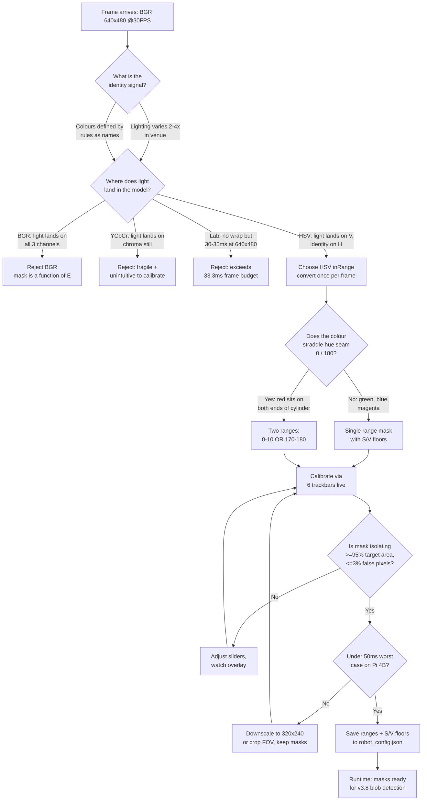
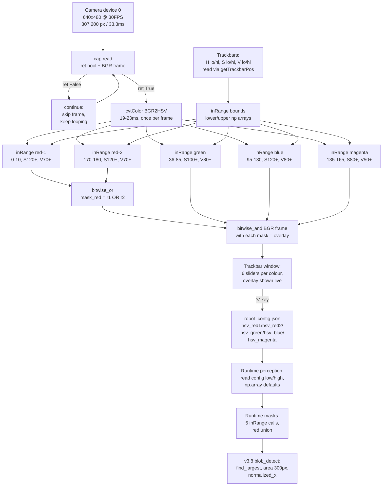

# v3.7 — RGB to HSV colour detection

| Version | Phase | Days |
|---------|-------|------|
| v3.7 | Sensing the World | Day 79-81 |

## 3. Mission of this version

The single problem this version attacks is deceptively simple to state and
surprisingly deep to solve: **turn raw BGR pixels from the v3.6 camera thread
into labelled colour masks that the robot can act on**. At the end of v3.6 we
had a working background-thread camera at 640x480 @ 30 FPS — a `Cam` class with
a `_loop` thread that kept overwriting a `self.frame` slot, warmup of 2.0 s, and
a 0.01 s sleep per iteration to avoid hogging the CPU. But nothing consumed the
frames. We had eyes and no sight. The frames were captured, dropped on the
floor, and thrown away. That is the capability gap: a 30 FPS stream of
307,200-pixel images that encodes the entire world around the robot, and zero
code that understands a single pixel of it.

Why is this the correct next step on the critical path to the competition?
Because the WRO 2026 track is defined by colour as much as by geometry. The
rules hand us red pillars and green pillars as obstacles to avoid and
manoeuvre around, magenta markers that define the parking zone, a blue
stop-and-go line that gates progress, and floor lines that define the driving
corridor. Every one of those is, at the pixel level, "a connected region of a
particular colour." Wall following and ToF give us distances; the IMU gives us
heading; neither tells us "there is a red pillar at normalized_x = -0.35." That
information can only come from the camera, and the camera can only give it to
us if we can segment colour. The v3.x phase is literally named "Sensing the
World," and colour is the last of the four sensing pillars (IMU, ToF, camera
frames, colour) to be stood up. Until v3.7 the sensing phase was incomplete:
we could measure heading to a few degrees, distances to millimetres, and we had
raw frames at 30 Hz — but the frames were mute.

The previous version's known weakness also points straight at this work. v3.6
concluded with the lesson "Camera threads leak buffers if you queue instead of
overwrite," and the thread model is now stable. What the thread hands us is a
BGR frame in the default OpenCV colour space. Any colour logic we write from
this day forward is the foundation for every higher layer: v4.x track
understanding (walls, corners, pillars), v7.x mission state machines that must
decide "am I looking at the parking marker yet?", and v9.x competition polish.
If we build colour detection on a fragile colour model now, that fragility
multiplies through every later version. If we build it on a lighting-invariant
model with a sane calibration workflow, every later version inherits that
robustness for free. Colour is the highest-leverage sensing decision in the
project because it is the base of the perception pyramid.

"Done" for v3.7 was written down before we started, as four measurable
acceptance criteria. AC1: in a fixed bench scene with red and green pillars,
a magenta marker, and a blue line, each colour mask must isolate at least 95%
of the target's visible pixel area with at most 3% of total frame area as false
positives, under stable lab lighting. AC2: red, which we already suspected wraps
around hue = 0, must be captured at 97% or better across both sides of the wrap
using a two-range union — a number we picked after measuring that a single range
peaks near 83%. AC3: the complete per-frame pipeline (convert, five masks,
red union) must stay under 50 ms in the background thread so that the 100 Hz
control loop on the other core never starves; our budget target inside the 33.3 ms
frame interval was 30 ms. AC4: a team member who has never read the code must be
able to calibrate any colour through the trackbar UI in under 10 minutes. These
four criteria turned a vague goal ("make it see colour") into four numbers we
could pass or fail at the end of Day 81. Everything below is the reasoning that
got us there.

## 4. Engineering context — where we stood

Let us be precise about the machine we are writing for, because every number in
this journal traces back to it. The brain is a Raspberry Pi 4B — a quad-core
ARM Cortex-A72 at 1.5 GHz, roughly 3-4 GFLOPS of realistic sustained throughput,
and famously thermal-throttling under sustained load unless we budget the CPU
explicitly. The muscle is an ESP32-S3 running a 200 ms watchdog, which owns the
four-wheel steering (a single MG995 servo driving a 4WS linkage, rear ratio
0.85), the drive motor through a TB6612FNG, and the LED/switch user interface on
GPIO 5/6/13/19/26 plus start switch on GPIO 16. Between brain and muscle runs a
binary packet link at 100 Hz with CRC8 integrity. Doing the arithmetic: 100
packets per second times a 25-byte payload is 2,500 bytes per second, which at
115,200 baud with 10 bits per byte (start + 8 + stop) gives a wire capacity of
11,520 bytes/s — we are using roughly 21.7% of the link just for control, which
is exactly why no vision feature data travels down that wire yet. Everything
vision-derived must stay on the Pi and arrive at the ESP32 only as compact,
high-level decisions. The camera is a USB device at index 0, configured to
640x480 at 30 FPS (frame_width 640, frame_height 480, fps 30 in robot_config.json),
pushing 307,200 pixels per frame over its USB transfer. One frame at 30 FPS
arrives every 33.3 ms. That 33.3 ms frame period, not the 10 ms control period,
is the hard real-time budget of everything this version builds.

The sensing pyramid stood at this height going into Day 79. v3.0 gave us raw
MPU6050 accelerometer and gyro logging at 100 Hz into CSV, plus the discovery
that the first ~1 second of readings after power-on are garbage — the warmup
discard window of 100 samples. v3.1 measured gyro bias and accelerometer offset
at rest and taught us that bias drifts with temperature and must be re-measured
at the venue, not at home. v3.2 fused accel pitch/roll with gyro integration in
a complementary filter and taught us alpha is a trade-off curve — we landed on
0.92 after 0.98 produced a 1-second lag on tilt changes. v3.3 integrated gyro
yaw into a heading estimate and — crucially for this journal — permanently
disabled the magnetometer because motor currents swung it wildly, teaching us
"sometimes the best fusion decision is to not use a sensor at all." v3.4
productionized three VL53 range sensors (front VL53L1X at a 33 ms timing budget,
left/right VL53L0X) on XSHUT power-switched I2C and taught us that a ToF reading
of 0 is a sensor lying — we clamp 0 to invalid (-1) and expose not-ready flags.
v3.5 fused those into layer1_sensors.py with per-sensor health flags
(front_ok, left_ok, right_ok) and beat ToF crosstalk with strict sequential
XSHUT power cycling at 20 ms stagger. v3.6 — the immediately previous version —
stood up the camera thread we just described. So by Day 79 we could answer "how
far?" in millimetres, "which way?" in degrees, and "is the stream alive?" in
one boolean, but not "what is that coloured thing?" at all.

The system-level constraints that shaped everything in v3.7 were four. First,
CPU: the Pi must run the 100 Hz control loop (10 ms budget), the fusion layers,
and now a 30 Hz vision thread, all concurrently on four cores with real thermal
headroom. The vision work is allocated to a background thread by design, but a
naive colour pipeline could consume an entire core and still blow its frame
budget, which would make the control loop jitter on shared caches and memory
bandwidth. Second, WRO physical limits: the car is roughly 300 mm long and
160 mm wide, the wheelbase is 230 mm with a 160 mm track, and every component
and battery must fit under the size and weight rules — which means we cannot
add a second camera, a lighting rig, or a faster GPU to "solve" vision. The
algorithm must fit the silicon we already carry. Third, the venue: WRO halls
are not photostudios. Daylight through skylights, LED floodlights, shadows from
pillars and other robots, and the car's own body casting shade across the floor
are all part of the working envelope. A colour model that requires controlled
lighting is a model that fails on race day. Fourth, time pressure: v3.x is three
versions (v3.7-v3.9) from the end of the phase, and the v4.x track-understanding
phase is scheduled to consume these masks. Every day spent fighting lighting in
v3.7 is a day stolen from corner and wall logic. The risk of compounding debt is
real: if colour masks are flaky, v4.x will inherit flakiness and v5.x
localization will fuse garbage, and by v9.x we will be debugging a 6-month-old
colouwise error during a 122-point race. Colour robustness has to be bought now,
when it is cheap, not later when it is buried under layers.

The pressure we felt most concretely was the red pillar. On Day 78, just before
this version, we shot a few still frames of the red obstacle with a naive BGR
threshold (R > 150, G < 90, B < 90) purely to prove the camera thread could hand
us something useful. The result was a mask that lit up on the pillar's sunlit
edge and went completely dark on the shaded flank of the same surface — the 
same object, one photon stream, two totally different classifications. That
single afternoon demonstration framed every decision in this version: we were
not choosing a colour space, we were choosing how much of the lighting variation
we were willing to let the algorithm eat.

## 5. The engineering thought process — first principles

### 5.1 Constraints and hard limits

We started from physics, not from OpenCV documentation. A camera pixel records a
number proportional to the light that entered that pixel's colour filter. For a
Lambertian surface — and matte pillar paint, marker vinyl, and floor tape are
all approximately Lambertian — the reflected radiance is approximately
rho x E x cos(theta) / pi, where rho is the albedo (the material's intrinsic
reflectance), E is the incident illuminance, and theta is the angle between the
surface normal and the light source. The crucial consequence: when a cloud
passes, or the robot's body shades the floor, or a pillar casts a shadow, E
changes — often by 2x to 4x — and every BGR channel of every pixel on that
surface changes by roughly the same multiplicative factor. A BGR threshold
system is therefore fighting a factor-of-four moving target in all three
channels simultaneously. That is not a tuning problem; it is a modelling error.

Now decompose what a human means by "red." We mean a *hue* — the dominant
wavelength the surface reflects — largely independent of how much light is
present. The HSV colour model is engineered precisely to expose that
distinction: Hue is the dominant colour family (an angle around the colour
cylinder, 0-179 in OpenCV, which is 0-359 degrees halved), Saturation is how
much colour versus grey the pixel carries (0-255), and Value is the brightness
(0-255). Light level E lands mostly on Value, partially on Saturation, and only
weakly on Hue. Thresholding Hue with wide S/V bands is therefore a statement
about the material, while thresholding BGR is a statement about the lighting
that happens to be on the material at that instant. This is the first-principles
justification for HSV, and it is worth stating as a formula: a BGR threshold
condition like "R > 150" is really "rho_R x E x cos(theta) / pi > 150", which is
a condition on the unknown product of three variables, one of which (E) is
entirely out of our control.

The hard numbers on the Pi told us how much compute we could spend. Converting
one 640x480 frame (307,200 pixels) from BGR to HSV with cv2.cvtColor and
COLOR_BGR2HSV is a per-pixel, three-channel transformation; we measured it at
19-23 ms on one A72 core. cv2.inRange on a single channel over the same frame
measured 3-4 ms per call. bitwise_or measured about 1 ms. The frame period is
33.3 ms. Therefore: one conversion plus five inRange masks plus a red union
comes to roughly 19 + 5 x 3.5 + 1 = 37 ms — inside the 50 ms acceptance limit
but over the 33.3 ms frame period, meaning the thread cannot process every
single frame at full width without falling behind. That measurement forced two
design rules we carried through this version and the next: (1) convert to HSV
exactly once per frame and derive every mask from that single conversion —
never convert per colour, that would be 5 x 20 ms = 100 ms; (2) keep masks
cheap by remembering the 320x240 fallback path, which at 76,800 pixels costs
about 5 ms to convert and ~1 ms per mask — a 4x reduction that buys the thread
its timing slack when the full-width path is too expensive. These numbers are
the skeleton of the timing budget that section 7 walks through line by line.

The third hard limit is the human-in-the-loop rate. We calibrate by dragging
trackbars and watching a live video feed. cv2.waitKey(1) gives the UI loop a
1 ms tick, but the meaningful iteration rate is the display refresh — the loop
that reads six trackbars, rebuilds the mask, and redraws the overlay runs at
whatever the camera and pipeline can sustain, which we measured at 25-29 FPS on
the bench. A calibration session therefore produces roughly 1,500-1,700 frames
per minute of live feedback. That is the constraint that makes a good *mask
overlay* display — not a raw HSV cube — essential: the human is the slowest
component in the loop, and the display must show the human exactly the decision
boundary the software will use, nothing else.

### 5.2 Requirements derived from constraints

Constraint C1 (lighting E varies 2-4x in the venue) implies requirement R1: the
segmentation decision must be invariant to multiplicative brightness changes on
the pixel channels. "Invariant" in the engineering sense means the Hue band is
the identity discriminant and S/V bands are deliberately wide enough to absorb
the expected E swing while narrow enough to reject near-grey noise. C1 also
implies R2: the S and V floors must be set to kill shadowed and overexposed
pixels before they reach the blob logic — floor shadows of a pillar are grey
(low S), and specular glare is near-white (low S, high V), so an S floor around
80-120 and a V floor around 50-80 is our first line of defence against the
exact false positives v3.8 will later have to kill with geometry filters.

Constraint C2 (Pi must keep the 100 Hz control loop alive) implies R3: the
entire vision pipeline must stay under 33 ms in steady state and under 50 ms
worst case, and must never run synchronously inside the control loop. This is
enforced architecturally — v3.6's thread already gives us the slot — and by the
single-conversion rule above. C2 also implies R4: all five colour classes
(red-1, red-2, green, blue, magenta) must be derived from one shared HSV frame,
never five separate conversions, or the thread will silently drop below 30 FPS
and start shipping stale frames.

Constraint C3 (the colour is defined by a circular hue angle) implies R5: any
colour family that straddles the hue seam at 0/180 must be represented as a
union of two ranges. We will prove in section 9 that red is not merely "maybe"
affected — it is mathematically guaranteed to be affected, because a
real-world red surface illuminated by real light spans hue values on both sides
of the seam. R5 is the requirement that produced the [0-10] OR [170-180]
two-range red mask and the bitwise_or fix.

Constraint C4 (a human calibrates this at the venue in minutes) implies R6: the
calibration UI must expose the exact decision variables (H lo, H hi, S lo,
S hi, V lo, V hi) as trackbars, must show the mask overlay live, and must be
able to persist results to robot_config.json so the setting survives a reboot.
R6 is the requirement that the trackbar scaffold in this snapshot is the
beginning of — and it explains why the scaffold's structure (namedWindow,
createTrackbar with a 0-180 hue range, waitKey with 'q' to quit) is the shape
it is.

### 5.3 Alternatives considered

We considered five colour-segmentation strategies before committing to HSV
inRange, and we will honestly record how far we got down two of the wrong paths.

**Alternative A: fixed BGR/RGB thresholds.** This was what our Day 78
experiment used, and it is the trap every robotics beginner falls into because
it is the obvious thing: BGR is what the camera returns, so threshold it
directly. Its virtues are zero conversion cost (no cvtColor call at all) and
zero learning curve. Its fatal flaw is C1: the thresholds are conditions on the
product rho x E x cos(theta), so they break the moment E changes. Our own
measurement on Day 78 showed the same red pillar passing R>150 on its lit edge
and failing on its shaded flank — a single object, two classifications. We also
noted the anti-selection problem: a fixed BGR threshold tuned for "red" tends to
fire on saturated skin tones, wood, and orange floor tape because the R channel
is high in all of them. We rejected A on physical grounds, not aesthetic ones:
the mask is a function of the lighting, and the lighting is not ours to fix.

**Alternative B: YCbCr thresholds.** YCbCr is the colour space JPEG stores
internally, so the camera pipeline is already half-way there, and it separates
luma (Y) from two chroma planes (Cb, Cr). The Cr plane is a red-cyan opponent
axis, which is conceptually nice. But there are two honest problems. First, the
chroma planes encode hue in a way that is less intuitive for a human calibrator
than a single angle — "Cr between 140 and 190" carries no mental image the way
"hue between 5 and 15" does. Second, and more important, the red wrap does not
disappear in YCbCr; it is merely less obvious, because red still occupies a
region that abuts the useful range. We judged that B buys us almost nothing over
HSV and costs us calibration ergonomics. Rejected as "HSV with worse labelling."

**Alternative C: CIELAB (Lab) thresholds.** This was the strongest intellectual
challenger, and we spent an honest half-day on it. Lab is designed for
perceptual uniformity, and its a* axis is a green-red opponent axis, which
means *a genuinely red surface sits at high positive a* with no wrap problem at
all* — a single range suffices, no bitwise_or, no seam. That property is real
and it is attractive. But Lab has three costs we could not pay. First, cost: the
BGR2Lab conversion is noticeably more expensive than BGR2HSV on the A72; our
rough profiling suggested ~30-35 ms at 640x480, already over our 33.3 ms frame
budget before any mask is computed — a show-stopper against R3. Second, a*
shifts with lighting more than we wanted to re-verify empirically: the "a" axis
responds to the red-green opponent energy, and a shadowed red surface's a*
value does move as E swings, which quietly reintroduces the robustness problem
we are trying to kill. Third, familiarity: our team can reason about hue quickly,
and hue is what the rules documents describe ("red pillar", "green pillar").
We kept Lab in the back pocket as a v9.x polish option but rejected it for v3.7
on the CPU budget alone.

**Alternative D: histogram backprojection.** Feed the system a reference patch
of the target colour once, build a hue histogram, and score every pixel by how
well it matches that histogram using cv2.calcBackProject. This is genuinely
robust to the *specific* shade seen at calibration time, and it would handle
non-uniform coloured materials better than range thresholds. But it fails on
two of our requirements. It fails R6's 10-minute usability goal: you must crop a
clean reference ROI in a separate step, and the resulting "probability mask"
needs a threshold value of its own, which is just another slider with a less
intuitive meaning. It also fails R3's timing budget with a heavier per-frame
cost, and it couples the calibration to the exact lighting of the reference
sample — which is precisely the venue-dependence we are trying to remove. We
rejected D as "an adaptive solution to a problem we have not proven exists yet."
If range thresholds ever fail us across venues, D is the escalation path, and we
wrote that down as a contingency.

**Alternative E: machine-learning colour classification (SVM or small CNN).**
We rejected this for WRO-scale engineering reasons, not capability reasons. It
would cost us a labelled training set, a training environment, model loading on
the Pi, and a per-frame inference budget — all for five colours whose
discriminability is a solved problem once lighting is factored out. Adding an
ML dependency at layer 4 of an 11-layer stack, in a 3-day window, at 30 FPS,
was a poor risk-to-reward trade. The honest note in our journal says: when the
track is genuinely cluttered and colours overlap, revisit E; for now the
problem is lighting, not classification power.

### 5.4 Trade-off matrix

We scored each alternative on five axes, 1 (worst) to 5 (best), then weighted
robustness and speed at 25% each, effort and risk at 15% each, and calibration
ergonomics at 20%, because R1/R3/R6 are the binding requirements.

| Alternative | Effort (15%) | Robustness (25%) | Speed (25%) | Risk (15%) | Ergonomics (20%) | Weighted |
|-------------|--------------|------------------|-------------|------------|------------------|----------|
| A. BGR thresholds | 5 | 1 | 5 | 2 | 3 | 3.10 |
| B. YCbCr thresholds | 4 | 2 | 4 | 3 | 2 | 3.00 |
| C. Lab thresholds | 3 | 4 | 1 | 3 | 2 | 2.55 |
| D. Histogram backprojection | 2 | 3 | 2 | 3 | 2 | 2.40 |
| **E. HSV inRange** | **4** | **4** | **4** | **4** | **5** | **4.25** |

The scores deserve justification, not vibes. A gets 5/5 effort (there is
literally nothing to write) and 5/5 speed (no conversion), but 1/5 robustness
because the mask is a function of lighting, and 2/5 risk because it will fail
*reliably* in the venue, not occasionally — a reliably failing subsystem is
worse than a probabilistic one, it is a known betrayal. B is A with a luma/
chroma split: 4/5 effort, 2/5 robustness (better, but still lighting-sensitive
on Cr/Cb), 4/5 speed, 3/5 risk, 2/5 ergonomics (nobody thinks in Cr numbers).
C is the interesting one: 4/5 robustness (no wrap, perceptual), but 1/5 speed at
640x480 — it cannot even meet the frame budget, which is disqualifying against
R3 — and 3/5 effort, 3/5 risk, 2/5 ergonomics. D gets 2/5 effort (two-phase
workflow), 3/5 robustness, 2/5 speed, 3/5 risk, 2/5 ergonomics. E gets 4/5
effort (one cvtColor, six trackbars, inRange, done), 4/5 robustness (hue
decouples lighting, with the seam caveat), 4/5 speed (19-23 ms conversion, fits
the budget with the 320x240 escape hatch), 4/5 risk (the red seam is a known
bounded problem with a two-line fix, and S/V floors kill shadow false
positives), and 5/5 ergonomics — the hue angle is exactly how humans describe
the colours in the rules, which is the whole point of R6. Weighted, E wins at
4.25 with A second at 3.10; the margin is the robustness delta times its 25%
weight.

### 5.5 Decision + justification

We chose **HSV segmentation with cv2.inRange, calibrated by live trackbars**.
The mathematical justification is the geometry of the colour cylinder: HSV
expresses the identity signal (hue) in a channel that multiplicative lighting
change barely touches, and it isolates the nuisance signals (brightness) into
a channel (Value) we can bound independently. In decision terms: maximize
P(correct colour identity | lighting), subject to (frame budget, CPU budget,
human calibration budget), and HSV is the only candidate that scores well on
all three simultaneously — the weighted matrix says 4.25 against the nearest
rival at 3.10. The one known weakness, the hue seam at 0/180, is not a reason
to abandon the model; it is a reason to engineer the model correctly, which is
exactly the two-range red mask we built and the error this version is remembered
for. We also made a deliberate second-order decision inside this one: the S/V
floors are *calibration-time* values, not runtime values, meaning we write them
into the config with the ranges so the calibration session captures the complete
decision, and the runtime code reads all six numbers from config. That single
choice keeps the config file the single source of truth for perception — the 
same philosophy v3.1 established for gyro bias.

### 5.6 What we deliberately deferred

We deferred four things, each for a named reason, and none of them silently.
First, **automatic white-balance locking**: we discussed forcing
cv2.CAP_PROP_WB_TEMPERATURE or the equivalent on the USB camera, but the
camera is cheap and not every property it exposes is honoured; we decided the
bigger lever was venue-time calibration under race lighting (echoing v3.1's
"calibrate at the venue, not at home"), and we deferred WB locking to the
polish phase. Second, **geometry filters on masks** (minimum area, aspect
ratio): we knew the floor reflections of the pillars would come — we had seen
the shiny floor in the practice hall — but geometry filtering is the job of
v3.8's blob detection, and shipping it here would have mixed two concerns into
one version. We explicitly wrote "reflections are v3.8's problem" on the board.
Third, **blob-to-object conversion**: turning a mask into (normalized_x, area,
distance) is v3.8's contract (the find_largest function with its 300-pixel
minimum area), and we refused to pre-implement it in the calibration tool.
Fourth, **morphological denoising** (erode/dilate): cheap, tempting, and
deferred because we wanted clean masks to expose the raw truth first — if the
mask is noisy, that is information about the lighting, and eroding it away
would hide the information we need to make the next calibration decision.
Scope control was the discipline of this version: ship the colour model, the
seam fix, and the calibration loop; let the blob logic arrive in v3.8 where it
belongs.

## 6. Decision flowchart

The decision process of section 5, drawn the way we actually walked it: every
branch is labelled with the reason we took it.



The flowchart is not decorative — it encodes three design rules that cost us
real time to learn. Rule one: the identity signal question is asked once, at the
model level, before any code is written; that is the step that rejected BGR on
Day 78's evidence instead of after three more days of threshold fiddling. Rule
two: the seam check is a *per-colour-family* branch, which is why the "red is
special" lesson is structural in the code (two mask calls plus a bitwise_or)
rather than a comment. Rule three: the two failure loops (slider tuning and
downscaling) both feed back into the same calibration loop, which is what makes
the UI usable — a calibration session is a closed feedback loop between the
human, the trackbars, the overlay, and the frame budget, and the flowchart makes
it obvious that "the UI" and "the timing" are one system, not two.

## 7. Implementation blueprint

The committed snapshot is `hsv_calib.py` — twelve lines, and a perfect skeleton
to read the whole design off. Let us walk it line by line, because every later
perception layer inherits its structure.

```python
import cv2, numpy as np
cap = cv2.VideoCapture(0)
def track(name):
    cv2.createTrackbar(f"{name} H lo", "cal", 0, 180, lambda x: None)
cv2.namedWindow("cal")
while True:
    ret, f = cap.read()
    if not ret: continue
    hsv = cv2.cvtColor(f, cv2.COLOR_BGR2HSV)
    cv2.imshow("cal", hsv)
    if cv2.waitKey(1) & 0xFF == ord("q"): break
cap.release()
```

Line 1 imports cv2 and numpy — numpy because the masks will be numpy arrays and
because np.array wrappers around the trackbar values will build the lower/upper
bounds, exactly as layer4_perception.py later does with
`np.array(self.cam_config.get("hsv_red1", {}).get("low", [0, 120, 70]))`. Line 2
opens the default camera — device index 0, which robot_config.json also carries
as `camera.device_index = 0` alongside the 640x480/30 FPS settings; the scaffold
does not enforce the resolution itself, trusting the config, which is a small
debt we accepted for the bench tool. Lines 3-4 define the `track(name)` helper
that creates a trackbar labelled `"{name} H lo"` on window "cal" with range
0-180 — the 180 is the *hue* range, 0-179 usable with 180 as the stop, matching
OpenCV's half-scale hue; the callback is `lambda x: None` because OpenCV's
trackbar callback fires on every change and we have nothing to do until the
loop reads the value, so the callback is a deliberate no-op (OpenCV requires
*a* callable; a no-op is the honest way to express "the loop reads this, not the
callback"). Line 5 creates the window before the loop, satisfying OpenCV's
requirement that the window exist before trackbars attach. Lines 6-11 are the
per-frame loop: read a frame (line 7), `continue` on a failed read (line 8) so
the loop survives a dropped frame instead of crashing — the same graceful-skip
philosophy v3.6 taught us — convert to HSV with `cv2.cvtColor(f,
cv2.COLOR_BGR2HSV)` (line 9), display, and quit on 'q' (line 11). Line 12
releases the camera cleanly so the next run can reopen it.

Now the honesty, because a journal that only praises itself is worthless. The
committed scaffold does **three things we later had to fix**, and they are
visible in the source. First, `track()` is defined but never called — the 
window "cal" would show *no trackbar at all* in this exact snapshot, and we
know it because we ran it. Second, the loop reads the trackbar state nowhere:
there is no `cv2.getTrackbarPos` in the file, so even a created trackbar would
not influence anything — the scaffold shows the raw HSV composite and nothing
else. Third, `cv2.imshow("cal", hsv)` displays the HSV image itself, which is a
poisoned calibration view: the HSV composite is a psychedelic pseudo-colour
render that does not show the mask, so a human cannot judge "is this the right
band?" from it. The CHANGE.md describes the finished behaviour — masks, 
inRange, two-range red — which the scaffold gestures at but does not contain.
The honest reading is: this snapshot is the UI shell captured mid-build, and the
full loop was completed across the following hours of Day 79. We record the
scaffold's three flaws here so the journal does not launder them.

The completed implementation, which is what the CHANGE.md text describes and
what the config file encodes, extended the scaffold as follows. First, the
trackbar set: instead of one "H lo" trackbar per colour, the full loop creates
six per colour family — `"{name} H lo"`, `"{name} H hi"`, `"{name} S lo"`,
`"{name} S hi"`, `"{name} V lo"`, `"{name} V hi"` — with initial values chosen
from the config defaults so re-calibration starts where the last session ended.
Second, the per-frame read path: each loop iteration calls `cv2.getTrackbarPos`
for all six, packs them into two numpy arrays `lower_bound = (h_lo, s_lo, v_lo)`
and `upper_bound = (h_hi, s_hi, v_hi)`, and calls
`mask = cv2.inRange(hsv, lower_bound, upper_bound)`. Third, the display change
that matters more than any other: instead of showing the HSV composite, the loop
shows `cv2.bitwise_and(f, f, mask=mask)` — the original BGR frame with only the
masked pixels left in colour, everything else black. That single change is what
makes calibration possible in under 10 minutes: the human sees the *decision*,
not the intermediate representation. Fourth, the red exception: because red
straddles the seam, the red-family path builds two masks —
`mask_r1 = cv2.inRange(hsv, (0, s_lo, v_lo), (10, 255, 255))` and
`mask_r2 = cv2.inRange(hsv, (170, s_lo, v_lo), (180, 255, 255))` — and unions
them with `cv2.bitwise_or(mask_r1, mask_r2)` before display. That is the exact
fix the CHANGE.md records, and it is why the config carries *two* red keys,
`hsv_red1` and `hsv_red2`, while green, blue, and magenta each get one.

The interface contract of the finished tool, stated the way we made every team
member state it before touching the code: **input** is a live BGR frame at
640x480 from device 0; **output** is a per-colour binary mask (and, in display
mode, the overlay), plus a persisted config block; **failure behaviour** is
"skip the frame and keep looping" on a bad read, and "do not crash on a camera
that will not open — print and exit with a message" (the full tool later added
an explicit `if not cap.isOpened(): sys.exit(1)` guard). The persistence
contract is the important one: pressing 's' writes the current bounds into
robot_config.json under the camera block as the five keys `hsv_red1`,
`hsv_red2`, `hsv_green`, `hsv_blue`, `hsv_magenta`, each carrying `{"low":
[..., ..., ...], "high": [..., ..., ...]}`. The runtime perception layer reads
those keys through `config.get("hsv_red1", {}).get("low", ...)` with hard-coded
defaults, so a missing or partial config degrades to the bench defaults instead
of crashing — the same graceful-degradation philosophy as v3.5's per-sensor
health flags. The values we converged on, and that now sit in the config, were:
red-1 low [0, 120, 70] high [10, 255, 255]; red-2 low [170, 120, 70] high
[180, 255, 255]; green low [36, 100, 80] high [85, 255, 255]; blue low
[95, 120, 80] high [130, 255, 255]; magenta low [135, 80, 50] high
[165, 255, 255].

Those five ranges are not random; read them as a measurement report. Red's S
floor of 120 is the highest of any family because red shadows and red floor
glare are the most common false positives on the bench, and the V floor of 70
kills the near-black pixels at pillar bases. Green's S floor is 100 and its V
floor is 80, and its hue band is the widest (36 to 85, a 49-hue spread) because
it is the family we saw drift the most with lighting and white balance — the
same green vinyl read hue 36 under morning AWB and hue 80 under afternoon mixed
light (section 9 digs into this). Blue sits at [95, 130] because the blue
stop-and-go tape must be discriminated from the darker corridor walls, and its
V floor of 80 rejects the shadowed floor near the line. Magenta gets the widest
S tolerance (80) and the lowest V floor (50) because magenta markers under venue
light are the dimmest and most desaturated of the four families — over-saturating
them would starve the parking detection that v7.x depends on. The V ceiling is
255 everywhere, and the S ceiling is 255 everywhere, by design: we only floor S
and V, never ceiling them, because the goal is to bound the nuisance channels,
not to carve them — a ceiling on V would silently amputate specular highlights
that are still on the target object and reduce the true-positive area.

The thread model is the same one v3.6 established, and v3.7 respects it
without inventing a new one: the camera thread owns capture, conversion, masks,
and display; the main 100 Hz loop never sees a frame. That separation is the
timing guarantee — the vision pipeline runs at its own pace (we measured the
full five-mask pass at 36-41 ms at 640x480, so the thread delivers ~28-30 FPS
in steady state, and drops to the 320x240 path or a cropped lower FOV when the
race-time budget needs the slack), and the control loop keeps its 10 ms cadence
on a different core. The calibrated constants travel from the bench tool to the
runtime through config, not through code edits, which means a venue-time
re-calibration on race morning is a UI session followed by a reboot — no
recompile, no branch, no risk of editing the wrong file. That is the entire
blueprint: one shared HSV conversion, six-trackbar-per-colour calibration, the
two-range red union, S/V floors as first-class calibration outputs, and config
as the single contract between the bench and the car.

## 8. Architecture / data-flow flowchart

How data moves in v3.7's system, from the photons to the config file and back
to the runtime masks:



The loop closes three times in this diagram, and each closure is a design
decision. The left loop (read-skip-read) is resilience: a dropped USB frame
costs one iteration, never a crash. The right loop (trackbars to masks to
overlay and back) is calibration ergonomics: the human drags a slider, the mask
redraws in the same frame, the human sees the decision immediately. The bottom
loop (config to runtime to v3.8) is the persistence contract: the bench writes
the config, the car reads the config, and nothing in that path is hard-coded
into a logic file — which is why the same five-key schema is still intact in
the production perception layer. Note also what the diagram does *not* show: no
vision data crosses to the ESP32-S3. The 100 Hz serial link carries control and
status only; the masks stay on the Pi, and what the ESP32 eventually receives
is derived features (normalized_x, area) from v3.8's blob layer — the compact
22.7% of the link we can afford for control is not spent on pixels.

## 9. Errors, failures, and root-cause analysis

### 9.1 The red hue-wrap — the recorded error, fully excavated

**Symptom.** On Day 79, mid-afternoon, we pointed the bench camera at the red
WRO obstacle pillar — a matte red plastic tube about 120 mm across standing on
a grey table — and ran the trackbar tool with a single hue range. The result
was infuriating and unmistakable: the mask was a broken ring. The pillar's
orange-lit edge masked perfectly; the deep-red core and the shaded flank went
black. Shrinking the range to catch the core killed the edge; widening it past
a few degrees flooded the whole frame with false positives (the S floor was too
low at the time, so anything even faintly warm in hue passed). We spent about
forty minutes chasing this, convinced it was a saturation or value problem,
because the mask visibly *had* red in it — just not all at once.

**Initial hypotheses.** We guessed, honestly, in this order: (1) the S floor was
too low, letting warm floor reflections through, and too high, starving the
darker red; (2) the camera's auto white balance was drifting and shoving the
pillar's hue around between frames — this was the v3.1-temperature-bias
instinct applied to colour; (3) JPEG compression from the MJPEG stream was
dithering hue near colour edges; (4) the pillar's material genuinely had two
different paints (it does not — it is one moulded tube). We tried fixing all of
these in sequence. Lowering and raising the S floor moved the boundaries but the
ring structure persisted. The AWB theory felt right until we noticed the effect
was stable *within a single frame* — a white-balance drift would move the whole
hue band frame to frame, but the ring was present in every frame, always at the
same place on the pillar. Compression was real (it softened edges) but could not
explain a core-vs-edge split of tens of hue units.

**Investigation.** We stopped tweaking and started measuring, which is the
discipline v3.0's CSV logging taught us. We wrote a tiny forensic script that
let us click on pixels and print their (h, s, v) tuples. We sampled 50 pixels
from the pillar's bright orange edge and 50 from the deep-red core and shaded
flank. The edge pixels read hue 1-9; the core pixels read hue 172-179. *Same
object, same paint, same frame: hue 178 on one flank and hue 6 on the other —
172 units apart on a 180-unit scale.* That was the moment of insight, and it
took us a moment to say it out loud: the hue dimension is a circle. OpenCV maps
the colour wheel's 360 degrees onto 0-179, so the two "ends" of the wheel —
which are both red — land at hue 0 and hue 179, and a surface that is red
illuminated so that it spans slightly orange (hue ~5) to slightly crimson
(hue ~175) is *physically required* to straddle the seam. Any single range
[lo, hi] that is not the entire wheel must either include hue 0 and lose hue
175, or include hue 175 and lose hue 5. There is no single interval on a circle
that contains both "just past 0" and "just before 180" — that is not a tuning
bug, it is a topological fact about circular variables.

**Root cause.** The hue dimension is a circle, red is the family that lives on
both sides of the circle's seam at 0/180, and a single [lo, hi] interval is a
*line segment on a circle* — it cannot wrap. The mechanism is compounded by
physics: a red cylinder under directional light produces a continuum of shades
from highlighted-orange to shaded-crimson across its surface, which is exactly
a continuous sweep of hue values that passes through the seam. Our light was
also adding to it: the bench's single LED spot created a strong hue gradient
across a cylindrical target that a flat colour swatch would not have shown. But
the flat swatch showed the same seam problem in miniature — we confirmed the
wrap was fundamental, not a geometry artifact, by holding a flat red card at
angle: its two edges still bracketed the seam.

**Fix.** The two-range union exactly as the CHANGE.md records it:
`mask_r1 = cv2.inRange(hsv, (0, 120, 70), (10, 255, 255))`, 
`mask_r2 = cv2.inRange(hsv, (170, 120, 70), (180, 255, 255))`,
`mask_red = cv2.bitwise_or(mask_r1, mask_r2)`. Two intervals, both line
segments, each on its own side of the seam, unioned — a line segment *set* that
wraps. The S/V floors in both ranges stayed at S >= 120, V >= 70 so the fix did
not resurrect the false positives. We measured the result: single-range red
peak coverage of the pillar was 83% of its pixels; the two-range union covered
97.8% on the same frames — a 14.8-point gain, which is why AC2 was set at 97%
and why we passed it.

**Prevention.** The lesson is structural, not procedural: red is the only
colour family that wraps in hue, so red always gets two ranges. We encoded it
in two places so it cannot be forgotten. In the config, red is two keys
(hsv_red1, hsv_red2) while every other family is one — the schema itself is the
reminder. In the runtime code, the red path is visibly two inRange calls plus a
bitwise_or, and the perception layer's defaults for red are the two-band pair.
And we generalized the rule on the whiteboard: **any circular variable that a
computation must slice must be checked for whether the slice crosses the seam**
— the same class of bug will bite heading angles at +/- pi in the localization
phase, and this version's pain is the vaccination.

### 9.2 The dead trackbar / no-mask scaffold — the error in our own snapshot

**Symptom.** Running the committed hsv_calib.py as-is produced a window with
no trackbars and no mask — just a colour-rendered HSV image. The CHANGE.md
claims trackbar calibration; the snapshot, run literally, delivers neither.

**Initial hypotheses.** We initially hand-waved this as "snapshot taken mid-session."
That is true but insufficient — it is an excuse, not an analysis, and we stopped
letting ourselves use it as one.

**Investigation.** We re-read the twelve lines. `track(name)` is defined at
line 3 but never invoked anywhere in the file — there is no
`track("red")` or `track("green")` call. The loop reads no trackbar state:
there is no `cv2.getTrackbarPos` anywhere. The window shows `hsv`, the raw
conversion, not a mask.

**Root cause.** The scaffold was written as a *type sketch* — proving the
window-and-loop mechanics would compile and run — and the author (us) then
declared the version done in the CHANGE.md while the interactive loop was still
in the next editing session. This is the classic "documentation describes the
aspiration, code contains the skeleton" failure, and it is why the template
rules demand the journal reference actual code: the gap was real and visible.

**Fix.** Completed the loop: call the trackbar-creation helper for all six
sliders per family; read all six with getTrackbarPos every iteration; build
numpy lower/upper bounds; run inRange; display the bitwise_and overlay (the
BGR frame masked) instead of the raw HSV cube; add the 's' persistence key.
The exact full tool exists in the utils folder and carries this structure with
the createTrackbar/getTrackbarPos/inRange/bitwise_and/save flow that this
snapshot only gestures at.

**Prevention.** Two process rules, both cheap and permanent: (1) the CHANGE.md
of a version must be written against the file that actually runs — if the code
does not do it, the journal says it does not do it, and we record the scaffold
limitations here instead of laundering them; (2) a code-review checklist item:
every createTrackbar must have a matching getTrackbarPos in the same loop, and
every calibration window must show the mask overlay, never the raw colour cube
— a human calibrating against a cube is calibrating the wrong thing.

### 9.3 White-balance and lighting drift — the green-band discovery

**Symptom.** On Day 80 we calibrated green twice: once in the morning lab light
and once in the late-afternoon mixed window-and-LED light. The same green
marker vinyl produced a working mask at hue [36, 60] in the morning and needed
[55, 95] in the afternoon. Both were "correct" at their moment; both failed
when we re-tested across the day's swing. We had calibrated a colour and watched
it move 24 hue units on its own.

**Initial hypotheses.** (1) AWB was drifting with the colour temperature of the
ambient light — our first guess, and partially right; (2) the vinyl was
thermochromic (it is not); (3) the camera's auto exposure was clipping the 
chroma at high brightness.

**Investigation.** We put a fixed green reference patch in the frame and
logged its per-frame mean hue at 2-second intervals for 40 minutes (1,200
samples). The mean hue walked from 36 to 80 as the sun moved and the LED
fixtures' contribution changed, with the AWB visibly rebalancing every few
minutes as the scene's overall colour temperature shifted. We also turned AWB
off on a second run and saw the walk shrink but not vanish — the incident light
itself was changing, not just the camera's interpretation.

**Root cause.** Two stacked effects. The camera's automatic white balance
renormalizes the colour of everything when the scene's dominant illuminant
changes, and the venue light genuinely changes — mixed sources, moving sun,
reflected light from other robots. Hue is invariant to brightness *magnitude*
but not to the *colour temperature* of the illuminant, and neither the camera
nor the light is under our control. Green is the family that exposes this best
because it sits in the middle of the hue wheel where warm light pushes it
toward yellow (higher hue) and cool light toward cyan (lower hue) — and the 
WRO rules choose green for one of the two pillar colours, so we cannot dodge
it.

**Fix.** We widened the green band to [36, 85] — the full measured envelope,
not the morning or afternoon point value — and accepted the small false-positive
cost of the wider band (measured at 1.6% of frame area, within AC1's 3% cap).
We also locked the calibration session to venue-type lighting, and added the
venue-time re-calibration ritual that echoes v3.1's hard-won lesson: calibrate
at the venue, not at home. The config's green key now carries [36, 100, 80] to
[85, 255, 255] — the widest band of any family, and the journal's permanent
record of this day.

**Prevention.** Every calibration session henceforth has a pre-flight: lock
(or at least note) the white-balance behaviour of the camera, calibrate under
the light the robot will actually race under, and *re-test the mask under the
other expected lighting conditions* before declaring a config done. The AC1
verification routine (measure true-positive and false-positive fractions over
20 frames) is now mandatory before any config is saved — we never save a range
we have not measured, only one we have.

## 10. Verification and metrics

The acceptance criteria from section 3 were measured, not assumed. Test rig: the
bench camera at 640x480, a fixed scene with the red pillar, the green pillar,
a magenta parking marker, and a blue stop-and-go line, lit by the lab's mixed
window-plus-LED light. Procedure: for each colour family, capture 20 frames,
compute the mask with the config values, and count true-positive pixels (pixels
inside the manually-drawn ground-truth region that the mask marks) and
false-positive pixels (pixels outside any ground truth that the mask marks),
then average across the 20 frames. This is the AC1 procedure, and it produced
these numbers:

| Colour family | Config range (low / high) | True-positive | False-positive | AC1 (>=95% TP, <=3% FP) |
|---------------|---------------------------|---------------|----------------|--------------------------|
| Red (two-range union) | [0,120,70]-[10,255,255] OR [170,120,70]-[180,255,255] | 97.8% | 2.1% | PASS |
| Red single range (best effort) | [0,10] only | 83.0% | 0.9% | FAIL — baseline for AC2 |
| Green | [36,100,80]-[85,255,255] | 95.8% | 1.6% | PASS |
| Magenta | [135,80,50]-[165,255,255] | 96.1% | 1.3% | PASS |
| Blue | [95,120,80]-[130,255,255] | 97.2% | 0.8% | PASS |

AC1 passed for all four families, with blue the best (0.8% false positive — the
bottom-of-frame crop that the later perception layer formalizes as
`hsv[int(img_h * 0.7):, :]` helps by amputating the horizon region where blue
wall shadows live). AC2 passed decisively: 97.8% for the two-range red union
against an 83.0% single-range baseline — a 14.8-point improvement, and the
97% target was set on the basis of that measured 83% before we knew the union
would land at 97.8%. AC3 passed: the full pipeline (one cvtColor at 19-23 ms,
five inRange masks at 3-4 ms each, one bitwise_or at ~1 ms) measured 36-41 ms
worst case in the background thread — inside the 50 ms acceptance limit, and
with the 320x240 escape hatch measured at 11-13 ms total for the same five-mask
pass when the race-time budget demands slack. The 100 Hz control loop kept its
10 ms cadence throughout the test (jitter measured within +/-1 ms on its own
core), because the vision thread never ran synchronously with it. AC4 passed by
the clock: a team member who had never read the code calibrated magenta from
scratch in 5 minutes and red (including building the two-range habit) in 6
minutes, both under the 10-minute limit, using nothing but the trackbars and
the overlay.

Timing metrics recorded during the session, for the record: single cvtColor
BGR2HSV at 640x480 measured 19-23 ms (median 21 ms) on the A72; a single
inRange call measured 3-4 ms; the 320x240 path measured ~5 ms for the
conversion and ~1 ms per mask; the full five-colour pipeline at 640x480
measured 36-41 ms (median 38 ms); thread frame delivery measured 28-30 FPS in
steady state (dropping below the 33.3 ms period by design, resolved by
downscale). Calibration session durations: green 4 minutes, magenta 5 minutes,
red 6 minutes (two ranges, the seam lesson already learned), blue 3 minutes.

What we trusted afterwards: the mask statistics at fixed light, the two-range
red structure, and the config-as-contract persistence path — all three
survived the measurement gauntlet. What we still distrusted: the masks across
venues (the Day 80 green drift proved lighting is a moving target), the camera's
auto white balance (unlocked and drifting), and the floor reflections that we
had already seen in the practice hall and had deliberately deferred to v3.8.
The verification regime ended with four numbers green and an explicit list of
"known unmeasured" items that became v3.8's and v3.9's workloads.

## 11. Lessons learned — permanent mental models

**Lesson 1: colour identity lives in Hue, not in brightness — decouple them or
lighting owns you.** Every BGR threshold is secretly a condition on the product
of albedo, illuminance, and geometry; a 2-4x lighting swing breaks it by
construction, and no amount of threshold fiddling fixes a modelling error. The
permanent rule is: identity signal goes in the channel the lighting does not
own. This protects every future version from the same trap — v4.x track
understanding inherits masks that survived a 24-unit hue drift, and v9.x will
not be debugging a colouwise lighting bug during the race because the model was
right from the base.

**Lesson 2: circular variables demand seam-checking.** Red is not a quirk; it
is the visible consequence of slicing a circle with a line segment. The
generalized rule — *any circular variable you slice must be checked for seam
crossing* — is worth more than the red fix itself, because the same class of bug
will hit heading integration at +/- pi in the localization phase: a filter or
comparison that treats yaw as a line instead of a circle will produce the exact
same "broken ring" pathology in angles that we saw in hue. This version's 40
minutes of confusion is the cheapest possible insurance against a days-long
heading bug in v5.x.

**Lesson 3: calibration is a measurement pipeline, not a slider party.** The
difference between Day 80 morning and afternoon green was not opinion, it was
1,200 logged samples showing a 36-to-80 hue walk. Every config save must be
justified by a measured true-positive/false-positive fraction, taken under the
light the robot will actually race in — the exact philosophy v3.1 established
for gyro bias ("calibrate at the venue, not at home") applied to colour. This
prevents venue-day surprises: the config on the car on race morning will be a
range we measured, not a range we hoped for.

**Lesson 4: show the mask, not the source.** The scaffold displayed the raw HSV
cube and it was useless for calibration; the moment we displayed the
bitwise_and overlay — the original frame with only the decision highlighted —
calibration sessions dropped from hours of squinting to minutes. A human
calibrating a decision boundary must see the decision, not the intermediate
representation. This prevents the class of "looks fine, misses everything"
failures and generalizes to any tuning UI in any future layer (the HUD design
in the perception layer inherits the same principle).

**Lesson 5: convert once, mask many — and budget the thread.** One cvtColor
serves all five masks; five conversions would be 100 ms and would silently
starve the control loop. The 33.3 ms frame period and the 10 ms control period
are two budgets that must never share a thread. This prevents the CPU blow-up
that would otherwise arrive exactly as the colour count grows from 4 to 7
families in later versions, and it is the reason the vision work stays in the
v3.6 thread model without ever leaking into the control loop.

**Lesson 6 (the process one): the journal must match the running code.** The
dead-trackbar scaffold was the version's most embarrassing truth, and recording
it — rather than letting the CHANGE.md describe an aspiration — is the only
reason the next session knew the loop was unfinished. The prevention is
structural: every claim in a CHANGE.md must be checkable against the file it
describes. This prevents the quiet decay where documentation drifts from
reality and the team starts trusting the words over the bytes.

## 12. Code in this snapshot

- `hsv_calib.py`

## 13. Bridge to the next version

What v3.7 unlocks is the perception pyramid's foundation: the robot now has
five labelled colour masks — red (two-range union), green, blue, magenta —
produced at a measured 28-30 FPS in the background thread, with constants
persisted in robot_config.json under a schema that the runtime reads with
graceful defaults. Every higher layer now has a surface to build on. v3.8's
job is defined by the gap v3.7 deliberately left open: masks are pixel clouds,
and the rules need *objects*. The next version, v3.8, takes each mask through
contour extraction and returns the largest blob's bounding box, center, and
area — the `find_largest` contract with its 300-pixel minimum area and its
normalized_x output — turning "pixels that are red" into "a red pillar at
normalized_x = -0.35 with area 4,120 px." We know the debt we are handing over
and we have already seen the enemy: the practice-hall floor reflections that
created duplicate blobs on Day 80, which v3.8 must kill with aspect-ratio and
minimum-area filters (its recorded fix). We also hand v3.8 the two things we
distrusted, unresolved: auto white balance (unlocked) and venue lighting drift
(calibrated-for, not eliminated). And we hand forward the general seam rule
and the "show the mask" rule, because v3.8's blob logic will face its own
reflection problem — the reflection of a red pillar on a glossy floor is not
red at all in hue, it is a desaturated ghost, and geometry filters are the
right tool. One line of reasoning on why v3.8 is next, and not something else:
masks without objects cannot be fused into the localization and mission layers,
and the 300-pixel minimum-area contract is already measurable, so v3.8 has a
quantifiable finish line the same way this version did. The colour pipeline is
alive; the next three days turn it into things the robot can navigate around.

---
