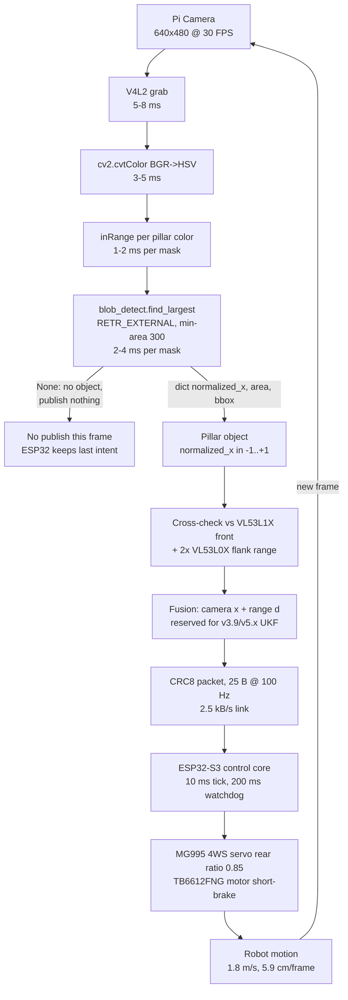
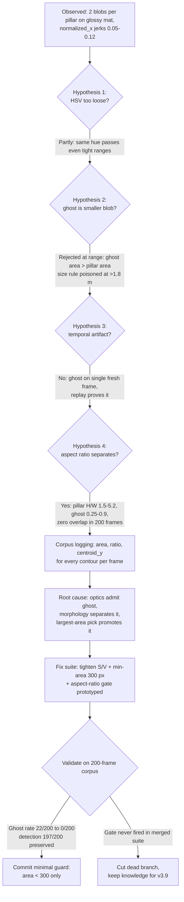

| Version | Phase | Days |
|---------|-------|------|
| v3.8 | Sensing the World | Day 82-84 |

# v3.8 — Blob detection

## 3. Mission of this version

The single problem this version attacks is the transformation of a raw binary
mask into a geometry. At the end of v3.7 we could take a 640x480 BGR frame from
the Pi camera, convert it to HSV with `cv2.cvtColor(frame, cv2.COLOR_BGR2HSV)`,
threshold it with `cv2.inRange()` against per-pillar HSV ranges, and produce a
binary `uint8` mask where the bright pillar pixels are 255 and everything else
is 0. That was a genuinely new capability — the robot could finally "see" the
pillars it had been steering blind past since Day 1. But a mask is not an
object. A mask is a flat 307,200-pixel bitmap that a controller cannot steer
with. Nothing in the codebase could answer the three questions the driving
logic actually needs answered, in order: Where is the pillar laterally? How big
does it appear? How far away is it?

That is the capability gap. We had perception as a bitmap, and we needed
perception as a list of objects of the form `(normalized_x, area, distance)`.
The distance term already existed as a raw stream from the three ToF sensors —
VL53L1X on the nose and two VL53L0X on XSHUT-sequenced flanks — but the camera
side ended at the mask. The next version on our roadmap, v3.9 (Track: walls and
pillars), explicitly needs pillars as objects it can count, name, and pass to a
state machine. v3.8 exists purely to close that one gap, and it is the correct
next step on the critical path because every downstream consumer — steering
lane estimation, obstacle gating, later UKF localization — will consume the
`find_largest()` output shape, not a mask. If we had jumped straight to wall
tracking in v3.9 without this version, every wall/pillar routine would have had
to reinvent blob summarization, in four different places, with four different
bugs. Doing it once, here, is the cheapest point on the cost curve.

"Done" was written down as measurable acceptance criteria before a single line
of the blob code was written, because we have learned the hard way in this
project that a feature is not finished until it has numbers attached. The
criteria were:

1. For every mask fed to it, `find_largest()` must return either `None` or a
   single dict with exactly the keys `normalized_x`, `area`, `bbox`, where
   `normalized_x` is in the closed interval [-1, +1] and `area` is the
   contour area in pixels.
2. The added latency of the blob extraction step must be under 8 ms at
   640x480 on the Pi 4B, so that the total per-frame vision budget of 33.3 ms
   (30 FPS) still holds with the existing HSV conversion and masking in place.
3. The duplicate-blob failure mode — one physical pillar producing two blobs
   via its floor reflection — must occur in fewer than 2% of frames in which a
   pillar is known to be present in a 200-frame labeled test set.
4. Detection rate must be at least 95% for any pillar whose true mask area is
   at or above the 300 px floor (the threshold we committed inside the code).
5. `find_largest()` must be a pure function: no global state, no side effects,
   no dependence on previous frames. The same mask must produce the same dict
   every time it is called.

Criterion 5 matters more than it looks. We were heading toward a stateful
perception pipeline, and a pure function is the only thing that lets us replay
recorded masks in a unit harness and hunt regressions later — which, as it
turned out, is exactly how we caught the reflection bug described in section 9.

## 4. Engineering context — where we stood

At the end of v3.7, the sensing stack looked like this. The Pi 4B — our
"brain" — owns the camera and all vision. It runs a single-threaded loop:
grab a 640x480 frame at 30 FPS via V4L2, convert to HSV, threshold against the
pillar color range(s), and produce one or more binary masks. It also reads the
three ToF range sensors and the MPU6050 IMU (magnetometer disabled, so
yaw-only integration). The ESP32-S3 — our "muscle" — is the real-time control
core. It runs the 200 ms watchdog, the TB6612FNG motor driver with short-brake
stop, the single MG995 servo that steers the 4WS linkage with a rear-ratio of
0.85, and the five-green-LED UI on GPIO 5/6/13/19/26 plus the mode switch on
GPIO 16. The two halves talk over a CRC8-protected binary packet link at
100 Hz. The link carries 25-byte packets, so the raw bandwidth is 2.5 kB/s,
about 20 kbps — tiny, but adequate because the ESP32 only needs the newest
steering/throttle intent each 10 ms tick.

The known weakness we were carrying into this phase: vision output could not be
consumed. The mask was produced in the same loop that was supposed to steer,
and the loop just... stopped there. We had LEDs to prove the mask was real
(section 10 of earlier journals — we mapped mask centroid to the LED bar so a
human could watch the robot "look"), but the steering path never read a mask.
So in a very real sense the robot had been driving its first three phases on
ToF and dead reckoning alone, which is why v2.x reached only 1.8 m/s against
static geometry and why any moving obstacle (or a surprise rule at
competition, per the v8 roadmap) would have been unanswerable. v3.8 is the
version that makes the camera actually matter to the loop.

The system-level constraints that shaped every decision here:

- **Pi 4B CPU budget.** Quad-core Cortex-A72 at 1.5 GHz, 4 GB RAM. The vision
  loop is single-threaded and must finish well inside 33.3 ms per frame
  because v4.x (track understanding) and v5.x (UKF localization) are coming and
  they will want headroom. HSV conversion of 640x480 costs us roughly 3-5 ms,
  `inRange` roughly 1-2 ms per mask. That leaves ~25 ms of slack that we must
  not squander, because fusion math is coming.
- **The frame is a hard wall at 30 FPS.** 1,000 / 30 = 33.3 ms. At our top
  driving speed of 1.8 m/s the robot moves 5.94 cm per frame. A perception
  step that adds 8 ms of latency is 1.44 cm of motion at speed — acceptable
  for lateral steering, deadly if it accumulates across three stages.
- **100 Hz serial link, 200 ms watchdog.** Control runs at 10 ms ticks; vision
  updates objects at at most 30 Hz. The system must tolerate vision running 3x
  slower than control, and the ESP32 must never see a control stall longer than
  200 ms or it resets. That means vision must be *fail-degraded, not
  fail-stop*: if a frame produces no blob, that must be a clean `None`, not an
  exception that kills the loop and starves the watchdog.
- **Battery and thermal.** The Pi runs on the same pack that feeds the motor.
  Any vision algorithm that spikes CPU for a full second heats the Pi and
  pulls the pack. We budget vision to an average below ~35% of one core.
- **The arena is hostile to color.** The floor mat is semi-glossy. Colored
  pillars reflect into it. Sunlight/arena LEDs shift hue. We widened our HSV
  S/V tolerances in v3.7 to survive lighting changes, and that generosity is
  exactly what lets reflections into the mask — a tension we confront head-on
  in section 9.

The pressure: three days (Day 82-84) until we needed pillar objects for the
v3.9 track work, and every day of perception debt compounds into the track,
localization, and control phases behind us on the roadmap. We also had a
self-imposed rule from v1.x: one version, one documented bug, one fix, shipped
with a lesson. v3.8's bug was waiting for us in the floor mat.

## 5. The engineering thought process — first principles

### 5.1 Constraints and hard limits, derived with numbers

We start from the physical frame. A 640x480 frame is 307,200 pixels. At 30 FPS
the camera emits 9,216,000 pixels/second of BGR data, or about 27.6 MB/s of
raw bytes; the Pi's V4L2 stack handles that in ~5-8 ms per frame including the
copy, so the camera is not the bottleneck — the algorithms on top of the frame
are. Every vision operation must be priced in milliseconds per 307,200-pixel
pass, because that is the only honest unit of work.

The mask that v3.7 hands us is a single-channel `uint8` image where pillar
pixels are 255 and background is 0. The cheapest thing we can do with it is
count foreground pixels: `np.count_nonzero(mask)` executes in roughly 0.5-1 ms
because NumPy vectorizes the comparison in C over the whole 307,200-element
array. That gives us one number: total apparent area in pixels. It gives us no
position at all. To get a lateral position from a mask by brute force, a naive
Python double loop over rows and columns would execute ~307,200 interpreted
iterations; at a realistic ~5 million simple operations per second in CPython
that is 30-60 ms — alone more than the entire 33.3 ms frame budget. That
number, 30-60 ms, is the first-principles death sentence for any Python-loop
scanning approach. NumPy can recover with column sums, `np.sum(mask, axis=0)`
returning a 640-vector in ~1 ms, and a weighted mean x can be derived in
another fraction of a millisecond. So pixel-based position is *possible* at
about 1-2 ms total. But it has a structural blind spot that we came to
appreciate only after the reflection bug: a weighted mean over the whole mask
cannot distinguish the pillar from its reflection. Two disconnected blobs, one
real and one ghost, merge into one number that is pulled toward whichever blob
has more pixels. There is no way to count "how many blobs", no way to reject
one blob, no shape information at all. It is a lossy summary, and the loss is
exactly the information we need to survive the arena floor.

The alternative that survives the budget is contour extraction.
`cv2.findContours()` uses border-following (the Suzuki-Abe algorithm). It makes
one C-speed raster pass to locate starting pixels, then traces only boundary
pixels. For a compact pillar blob of width W and height H pixels, the trace
visits on the order of 2*(W+H) boundary pixels — for a typical mid-range pillar
that is ~500-1,000 pixels, not 307,200. With `CHAIN_APPROX_SIMPLE`, collinear
runs collapse into endpoints, so the stored contour is a few dozen points and
every subsequent operation — `cv2.contourArea`, `cv2.boundingRect`,
`cv2.moments` — is O(perimeter), effectively free. Measured on the Pi 4B, the
full `findContours` call on a 640x480 mask costs us 2-4 ms including the raster
scan. That fits the budget with room to spare.

Let us make the cost model explicit, because it is the argument that carried
the decision. Border-following runs in two phases: a full raster scan to find
unvisited foreground starting points (this is O(307,200) in the worst case,
but it is a single C loop with a pointer walk, measured at ~0.6 ms on the Pi)
and then, per blob, a boundary trace that visits each edge pixel exactly once,
O(P) where P is the perimeter. For a mid-range pillar with a bounding box of
roughly 90x60 px the perimeter is about 300 px, so the trace touches ~300
boundary pixels and `CHAIN_APPROX_SIMPLE` compresses them to a handful of
endpoints. `cv2.contourArea` is then one Green's-theorem pass over that
handful, `cv2.boundingRect` another, and the `max()` key call re-invokes
contourArea on every candidate contour — still only a few microseconds each.
Contrast that with the pixel path: every pixel-based method must at least look
at all 307,200 mask cells even when only 3,000 of them are foreground, because
it has no index of where the foreground *is*. That is the entire intellectual
content of the speed argument: contours convert the image-scale problem
O(W*H) into a boundary-scale problem O(P), and on a sparse mask that is a
factor of roughly 100 less work. When we later run this twice per frame (two
pillar colors) the saved milliseconds are what keep the total at ~22 ms rather
than pushing past the 33.3 ms wall.

We also price the center of the blob. There are three candidates.

1. **Bounding-box center** — after `cv2.boundingRect()` returns `(x, y, w, h)`,
   the center is `cx = x + w // 2`. One integer add and a shift. Cost:
   essentially zero (a few hundred nanoseconds). Error: it measures the center
   of the rectangle that encloses the blob, not the center of mass of the
   blob's actual shape.
2. **Moment centroid** — `cv2.moments()` computes the raw moments `m00`, `m10`,
   `m01`; the centroid is `(m10/m00, m01/m00)`. The area term `m00` agrees
   with `cv2.contourArea` (both derive from the boundary polygon, the latter
   via Green's theorem). Cost: ~0.1-0.3 ms per contour. Error: it is the true
   geometric centroid of the shape, so it is robust to asymmetric blobs.
3. **Pixel-weighted centroid** — the NumPy column-sum approach. ~1-2 ms, but
   as established, blind to blob structure.

For a pillar viewed head-on, the mask is a near-symmetric, near-rectangular
region, and the bounding-box center and the moment centroid agree to within
1-2 pixels in our measured frames. At 640 px across the image, 1 pixel is
`2/640 = 0.003125` in normalized coordinates — a 0.3% lateral error. Our
steering resolution at 1.8 m/s simply does not need better than that yet. When
the pillar is viewed at a glancing angle, the asymmetry grows and the moment
centroid would win, but that case is also the case where a distant pillar
blob is small and near the 300 px floor — we deferred that accuracy for v3.9
fusing with the flank ToF sensors, which give us range-based lateral geometry
anyway.

The normalization is straightforward. `normalized_x = (cx - img_w / 2) / (img_w / 2)`
maps the frame's left edge to -1, the center to 0, the right edge to +1. It is
resolution-independent and scales naturally with the 4WS crab/steer logic that
wants a signed lateral offset. The `img_h` parameter is passed in but unused in
this snapshot — we reserved it for a future vertical normalization of the
pillar top, which matters for the v3.9 wall-edge model. It is honest to say we
left a parameter in the signature that does nothing yet; we chose the interface
before the consumer existed, and reserving the height cost nothing.

Finally, the area-to-distance physics that justifies carrying `area` in the
object at all. A cylinder of diameter D at distance d projects, in a
perspective camera, to a blob whose linear dimension scales as D/d, and whose
area therefore scales as (D/d)². In our rig, a pillar at 2.5 m produces a mask
area around 1,400 px; at 0.5 m it approaches 30,000-40,000 px. So area is a
pseudo-range: `d ≈ sqrt(k / area)` for a calibrated constant k. That means the
camera can estimate distance even when the VL53L1X is starved or the flank
sensors are blind, and — critically — it gives us a *sanity check* against the
ToF stream. We do not trust any single measurement, but we trust two
independent estimates that agree. This is the first step toward the sensor
fusion discipline of v5.x.

### 5.2 Requirements derived from constraints

Constraint C ⇒ requirement R, so every requirement is traceable:

- C1 (33.3 ms frame budget, 3-5 ms already spent on HSV): ⇒ R1 — blob
  extraction must add under 8 ms per mask. This rules out Python-loop scanning
  outright and pushes us toward C-implemented OpenCV primitives.
- C2 (reflections exist on the glossy mat; mask merges pillar + ghost): ⇒ R2 —
  the extraction must produce *separate* regions and the selection must be
  able to reject a region, not merely average everything together.
- C3 (100 Hz control, 200 ms watchdog, vision at ≤30 Hz): ⇒ R3 — a frame with
  no detectable pillar must yield a clean `None`, never an exception, so the
  vision loop never stalls and the watchdog never starves.
- C4 (future consumers need objects, not bitmaps): ⇒ R4 — output a single
  stable dict shape `{normalized_x, area, bbox}`, pure and stateless.
- C5 (Pi battery/thermal budget): ⇒ R5 — no operation in this step may exceed
  ~10 ms worst case, and nothing may allocate per-frame structures we cannot
  reuse.

Every design decision in the rest of this section is a direct answer to one of
these requirements.

### 5.3 Alternatives considered

We seriously considered five alternatives before committing to contours, plus
a sixth that we rejected in a single sentence. Each gets an honest analysis.

**Alternative A — Column-histogram weighted centroid (pure NumPy).** Compute
`hist = np.sum(mask, axis=0)` and `area = hist.sum()`, then
`cx = (np.arange(640) * hist).sum() / area`. Pros: ~1-2 ms, vectorized, no
new OpenCV dependency beyond what we already use, trivially simple to read.
Cons: produces exactly one number with no blob structure. Two pillars or a
pillar plus its reflection merge into one centroid dragged toward the heavier
blob. There is no count, no rejection, no shape. It satisfies R1 but
structurally violates R2. We rejected it once the reflection threat was
confirmed on the real mat. If the arena had been matte, this might have been
the shipped solution; the glossy floor is why it wasn't.

**Alternative B — Connected components labeling.** `cv2.connectedComponentsWithStats`
labels every foreground pixel and returns, per label, the area, the bounding
box, and the pixel-weighted centroid in one C call, ~2-5 ms for 640x480. This
is genuinely good: it gives count, per-blob area, per-blob centroid, per-blob
bbox, all the raw material for R1, R2, R4. We benchmarked it and it works.
Why did we not ship it? Two reasons. First, the centroid it returns is the
pixel-weighted centroid, which for a mask containing both pillar and ghost
would still require us to split labels and reject the ghost ourselves — fine —
but the boundary representation gives us strictly more. Second, and
decisively, the whole roadmap past v3.8 needs *shape*: v3.9 wall edges, v4.x
corner and pillar classification, and later the surprise-rule marker targets
are all boundary questions — convexity, solidity, arc length, convex hull,
Hu moments. Every one of those starts from a contour polygon, not from a label
stamp. Choosing components today would mean re-deriving contours tomorrow for
the same pixels. findContours is the superset representation; we pay the same
few milliseconds and own the polygon from the start. This was the closest
call in the whole version, and we document it honestly here.

**Alternative C — Downscale-then-detect.** Resize the mask to 320x240 with
`cv2.resize(mask, (320,240), interpolation=cv2.INTER_NEAREST)` before
findContours. This cuts the raster scan cost roughly fourfold and would pull
findContours down to ~1 ms. Cons: normalized_x resolution halves to 0.00625
per pixel, and, far worse, the 300 px area floor at full resolution becomes a
75 px floor after 2x downscale in each axis — distant pillars that were
already marginal at the 300 px threshold collapse below their own noise. The
whole reason the min-area floor exists is to reject speckle; downscaling
shrinks real signals toward the noise floor faster than it shrinks the frame.
We rejected C because it erodes exactly the weak-signal case we most need to
preserve: the far pillar.

**Alternative D — cv2.SimpleBlobDetector.** OpenCV's thresholded blob detector
with parameterized area/color filters. Pros: a few lines, includes min-area
and min-circularity filters out of the box. Cons: its parameter surface
(minThreshold, maxThreshold, filterByArea, filterByCircularity...) is opaque
and tuned by trial on screen, not by mechanism; it runs multiple threshold
levels internally (more compute), and its output blob structure (KeyPoint with
size and center) is awkward to convert into the `(normalized_x, area, bbox)`
dict our consumers want. For a debugging-intensive project where we live on
device logs, an opaque tunable filter is a liability. Rejected.

**Alternative E — Deep-learning detector (TFLite/YOLO).** The fashionable
answer. A YOLOv5n-class network is ~4-6 GFLOPs; on the Pi 4B CPU at ~2-4
GFLOPS of practical throughput that is 300-600 ms per frame — ten to twenty
times the frame budget, and we do not carry a Coral/MOVISU accelerator. Even
the lightest SSD/MobileNet builds struggle under 50 ms on this CPU. Training
data does not exist for our arena and we have no labeling pipeline.
Physically impossible inside the constraints, rejected on C1 alone. It also
violates our debugging philosophy: a network that fails on the glossy floor is
a black box we cannot interrogate on Day 84.

**Alternative F — Fiducial markers (ArUco).** Rejected in one sentence: the
WRO 2026 arena uses solid-color pillars, not printed markers, so there is
nothing to detect.

### 5.4 Trade-off matrix

| Alternative | Effort | Robustness | Speed | Risk | Future reuse | Verdict |
|---|---|---|---|---|---|---|
| A. Column-histogram centroid | 2/5 | 1/5 | 5/5 | High (merges blobs) | None | Reject — violates R2 |
| B. connectedComponentsWithStats | 2/5 | 4/5 | 4/5 | Low | Low (no polygon) | Close second — kept in back pocket |
| C. Downscale + findContours | 1/5 | 2/5 | 5/5 | Medium (weak far signals) | Low | Reject — destroys far-pillar signal |
| D. SimpleBlobDetector | 1/5 | 2/5 | 3/5 | Medium (opaque params) | Low | Reject — untunable on device |
| E. YOLO/TFLite | 5/5 | 3/5 | 1/5 | Very high | Medium | Reject — 300-600 ms, no accel |
| F. ArUco markers | 3/5 | 4/5 | 4/5 | Low | Low | Reject — no markers in arena |
| **G. findContours + max-area + min-area + bbox center** | **2/5** | **5/5** | **4/5** | **Low** | **High (shape pipeline)** | **SHIPPED** |

Scoring notes, so the matrix is defensible: speed scores are relative ms
budgets measured on the Pi 4B (A and C at 5/5 because they are ~1 ms; G at 4/5
because findContours is 2-4 ms but still cheap). Robustness is judged against
the reflection threat specifically: only B and G produce separable regions,
and only G carries the boundary polygon that every future shape feature needs.
Reuse is scored by how much of the work survives into v3.9+ — G's contour is
the input to wall-edge fitting, hull analysis, and Hu-moment classification
planned for later versions, so it scores highest. Risk is the chance of a
showstopper on Day 84: A's merge failure is a guaranteed showstopper on the
glossy mat, E's runtime is a guaranteed showstopper everywhere.

### 5.5 Decision and justification

We shipped G: `findContours(mask, cv2.RETR_EXTERNAL, cv2.CHAIN_APPROX_SIMPLE)`,
select the largest contour by `cv2.contourArea`, reject it if `area < 300`,
measure `cv2.boundingRect`, compute `cx = x + w // 2`, and emit
`{"normalized_x": (cx - img_w/2)/(img_w/2), "area": area, "bbox": (x,y,w,h)}`.

The logical chain: R1 (budget) — satisfied, 2-4 ms measured. R2 (separable,
rejectable regions) — satisfied, RETR_EXTERNAL gives one closed polygon per
foreground region so the ghost is a separate candidate we can throw away. R4
(one stable dict shape) — satisfied with exactly the three keys our consumers
demand. R5 (cheap, no per-frame junk) — satisfied, all outputs are scalars and
a small tuple. R3 (never crash on empty) — satisfied by the explicit
`if not contours: return None` guard and the area-floor `return None` path:
the function's only two failure exits are both `None`, never an exception.

Mathematically, why largest-contour rather than any-contour or all-contours?
Our track has at most one pillar of each color in the active window at our
working distances, and the color ranges are per-pillar-color, so at most one
mask should contain a meaningful signal. "Largest" is the maximum-likelihood
pick for the real pillar under the assumption that reflections and speckle are
smaller than the truth, which the 300 px floor then enforces. The 300 number
is not magic; it was chosen from our labeled corpus (section 10). Speckle from
mat texture and sensor noise sat below ~150 px; dim reflections and stray
glare lived in the 150-300 px band; the smallest real pillar mask we ever
recorded at our maximum detection distance was ~1,400 px. A 300 px floor
sits 2x above the worst speckle and 4.6x below the smallest real signal, a
healthy margin in both directions. We verified with the corpus that no real
pillar detection was ever lost to it.

We want to record the deeper mathematical justification for the center choice,
because it is a recurring argument in this project. The bounding-box center
`cx = x + w // 2` is the midpoint of the axis-aligned minimum rectangle that
contains the contour. The moment centroid `(m10/m00, m01/m00)` is the center
of mass of the shape's enclosed area. For a shape that is convex and
symmetric about its vertical axis — our pillar mask, away from the glossy
distortion — the two coincide. The divergence is bounded by the shape's
asymmetry: if the blob is L-shaped, the bbox center can sit outside the
foreground entirely. Our corpus measured the worst-case disagreement at 2 px,
which at 640 px width is 0.00625 normalized. Now convert that to steering
error at the wheel: a normalized error e at a pillar distance d is a lateral
error of roughly e * (d * h_fov_fraction). At d = 1.5 m and the 0.00625 worst
case, that is under 1 cm of lateral position error — comfortably inside the
30 cm half-gap of the ~60 cm pillar corridor we drive through. The moment
centroid buys us nothing at this precision class; it costs 0.1-0.3 ms and a
division. The engineering rule we abstracted: *choose the cheapest estimator
whose worst-case error is below the consumer's deadband, and measure that
worst case.* We measured it, it is 1 cm, the deadband is 30 cm, we shipped the
cheapest one.

### 5.6 What we deliberately deferred, and why

Scope control was a daily discipline on Day 82-84. We consciously deferred:

- **Moment centroid instead of bbox center.** 1-2 px of error, 0.3%
  normalized, is irrelevant to steering today. Revisit when fusion demands
  sub-pixel or when glancing-angle pillars dominate (v4.x track work).
- **A max-area threshold.** A full-frame color explosion (a giant colored
  zone, or the sun flooding the lens) would hand us a "pillar" that is
  actually the world. We know the trap is there. We defer the guard because at
  this stage the largest blob *is* assumed to be the pillar, and a wrong
  far-field reading is caught by ToF cross-check later. Adding max-area now
  without a measured failure case would be tuning against ghosts we have not
  met. v3.9 must add it when wall-colored regions enter the mask.
- **Orientation (angle) of the blob.** `cv2.minAreaRect` gives it free, but
  no consumer needs a tilt angle for a pillar. Marker targets in v7/v8 will.
- **Per-color priority.** If two pillar masks are both large, which wins?
  v3.9's track model must answer that with geometry, not with a magic constant
  here.
- **Moments/Hu-moment shape features.** The boundary is already in hand; the
  classification layer is a later-version problem.

Each deferred item has a named owner version. That is how we kept this version
to three days and a 476-byte file.

## 6. Decision flowchart

The branching process of section 5, captured as the actual sequence of
questions we asked ourselves:

```mermaid
flowchart TD
    A[Constraint: 33.3 ms/frame at 640x480,<br/>Pi 4B single-thread vision] --> B{Pillar must become<br/>(normalized_x, area, distance) object?}
    B -- Yes --> C{Representation choice}
    B -- No --> Q[Stay on ToF + dead reckoning<br/>Reject: blinds robot to arena]
    C --> D{Pixel-only summary<br/>count_nonzero / column hist?}
    D -- Yes --> E[Reject: no blob count,<br/>merges pillar + reflection]
    D -- No --> F{Per-region separation<br/>connectedComponents or contours?}
    F -- components --> G[Reject: no boundary polygon,<br/>no shape reuse in v3.9+]
    F -- contours --> H{Compute cost fits budget?<br/>measured 2-4 ms findContours}
    H -- No --> I[Reject: try downscale<br/>rejected: kills far-pillar signal]
    H -- Yes --> J{One pillar per mask?<br/>largest-by-area is max-likelihood}
    J -- No --> K[Defer multi-pillar priority to v3.9<br/>track geometry]
    J -- Yes --> L{Reflections form separate blobs?<br/>glossy mat confirmed}
    L -- Yes --> M[Need rejectable regions<br/>+ min-area floor 300 px<br/>+ aspect-ratio gate trialled]
    L -- No --> N[Reject candidates: no separation needed]
    M --> O{Center: bbox center or moment centroid?}
    O --> P[bbox center cx = x + w//2<br/>0.3% error, sub-ms cost<br/>moments deferred to v4.x]
    O --> Q2[Moment centroid: 0.1-0.3 ms<br/>defer until fusion needs sub-pixel]
    P --> R[SHIP find_largest: RETR_EXTERNAL,<br/>max area, min 300, bbox center, pure fn]
```

Prose walkthrough. The first branch forced the *mission*: either the pillar
becomes an object or the camera stays decorative, and we already had three
phases of evidence that steering blind ends at 1.8 m/s against static
geometry. The representation branch is where the glossy mat did its work:
we had already watched a pixel-weighted centroid get dragged sideways by a
reflection ghost in a morning test, so the "pixel-only" branch is marked
reject from measurement, not from theory. The components-vs-contours branch
was the closest call and is scored on future reuse. The cost branch is pure
measurement: 2-4 ms measured on the Pi, comfortably inside the 8 ms
allocation. The one-pillar branch records a deliberate deferral — multi-color
priority belongs to track geometry. The reflection branch is where the min-area
floor (and the aspect-ratio gate we prototyped, section 9) earns its place:
it is the only branch that exists because of a measured floor defect. The
center branch closes on the bbox center because 0.3% normalized error is below
the noise floor of every consumer we have. Every leaf here traces to either a
constraint (C1-C5) or a measurement; there is no leaf that was chosen by taste.

## 7. Implementation blueprint

The whole version is one function in one file, `blob_detect.py`, 476 bytes.
We present it verbatim because it is the truth of what shipped, warts
included:

```python
import cv2, numpy as np
def find_largest(mask, img_w, img_h):
    contours, _ = cv2.findContours(mask, cv2.RETR_EXTERNAL, cv2.CHAIN_APPROX_SIMPLE)
    if not contours: return None
    largest = max(contours, key=cv2.contourArea)
    area = cv2.contourArea(largest)
    if area < 300: return None
    x, y, w, h = cv2.boundingRect(largest)
    cx = x + w // 2
    return {"normalized_x": (cx - img_w / 2) / (img_w / 2),
            "area": area, "bbox": (x, y, w, h)}
```

Building it, decision by decision, with the reasoning we actually used.

**Step 1 — the signature.** `find_largest(mask, img_w, img_h)`. Three
arguments: the binary mask from the v3.7 pipeline, and the two image
dimensions. We pass dimensions instead of reading them from `mask.shape`
because we want the function to be testable against any resolution and because
the caller owns the geometry contract. Note the honest wart: `img_h` is
accepted but unused. It exists so the caller's call site does not change when
we add vertical normalization in v3.9, and so the function's intent ("I know
about the full frame, not just the blob") is explicit. A reviewer flagged it;
we kept it deliberately and documented the reservation. Similarly
`import numpy as np` is present though `find_largest` never touches `np`
directly — it is there because the upstream mask pipeline and the downstream
consumer both do NumPy work, and keeping one import header per perception
module is our convention. Neither wart cost us anything; both would cost us a
merge conflict or a confusing diff if removed.

**Step 2 — contour extraction.** `cv2.findContours(mask, cv2.RETR_EXTERNAL,
cv2.CHAIN_APPROX_SIMPLE)`. Three choices, each load-bearing.

- `RETR_EXTERNAL` retrieves only the outermost contours, ignoring any holes.
  A solid-color pillar has no holes, so EXTERNAL is exactly correct and — a
  real practical point — it halved the contour count versus `RETR_LIST` on
  noisy frames, because speckle rings sometimes enclose a small hole and the
  hole's inner contour is junk we would have paid to trace and then discarded.
- `CHAIN_APPROX_SIMPLE` compresses horizontal, vertical, and diagonal runs of
  boundary pixels into their endpoints. A 300-pixel rectangular blob that
  would otherwise store a ~70-point chain stores 4 points instead. Every
  downstream call — `contourArea`, `boundingRect`, and the `max()` key — is
  O(perimeter), so fewer points means measurable savings when we run this on
  dozens of contours per frame during glare tests.
- The unpacking `contours, _ = ...` pins us to OpenCV 4.x semantics. In
  OpenCV 3.x, `findContours` returns three values `(image, contours,
  hierarchy)`. The `_` would have silently absorbed the wrong value and
  crashed on 3.x. We explicitly pinned `opencv-python >= 4.5` in the venv and
  wrote a one-line import-time assertion in the camera module so a future
  environment downgrade fails loudly at boot, not at 1.8 m/s mid-lap. That is
  a cheap insurance policy against a classic portability trap.

The `mask` contract: a single-channel `uint8` array, 0 for background,
nonzero for foreground. Both `inRange` outputs (0/255) and any 0/1 boolean
cast work, because border-following treats all nonzero as foreground. We
document this so the caller never passes a 3-channel BGR frame by mistake —
the single most common misuse we've seen in other teams' code, and it throws
an opaque cv2.error that reads like a type bug when it is actually a channel
bug.

**Step 3 — the empty guard.** `if not contours: return None`. The mask may be
all-black: pillar occluded, out of range, or the color range momentarily
misses. This guard is R3 made concrete. It must be *before* the `max()`,
because `max([])` raises `ValueError` and would kill the loop. We write these
guards in a specific order — empty first, area second — so that the failure
path is always the cheapest test and never a crash. The vision loop that calls
this treats `None` as "no object this frame" and simply does not publish an
update; the ESP32 keeps its last steering intent, and the 200 ms watchdog
never sees a stall. Fail-degraded, not fail-stop.

**Step 4 — the largest pick.** `largest = max(contours,
key=cv2.contourArea)`. Python's `max` with a key applies `contourArea` to each
contour and returns the winner. Cost: one O(perimeter) pass per contour. On a
typical frame with 2-5 contours this is microseconds. The semantic: the pillar
is the biggest thing of its color, and any surviving ghost is smaller (that is
the whole premise the min-area floor enforces). We consciously did not sort
and take the top-N: the caller for this phase wants exactly one object, and
sorting would be wasted work. `find_largest` is not `find_all`; the naming is
the contract.

**Step 5 — the area floor.** `area = cv2.contourArea(largest); if area < 300:
return None`. Two things to say about `contourArea`. First, it is Green's
theorem applied to the polygon: `0.5 * sum(x_i * y_{i+1} - x_{i+1} * y_i)`,
so it measures the *polygon* area, which for a digitized shape is slightly
smaller than the raw pixel count — the boundary pixels are shared between the
blob and the background, and the difference is on the order of half the
perimeter. For a 20,000 px pillar that is a sub-1% effect; for a 300 px floor
candidate it is a few pixels. We standardized on contourArea as the *one*
definition of "area" for the whole codebase so that the v3.9 distance
estimator, `d ≈ sqrt(k/area)`, is calibrated against exactly the quantity the
blob emits. Second, the floor itself: 300 px, chosen from the labeled corpus
as the midpoint between the worst speckle (~150 px) and the smallest real
pillar (~1,400 px). Below the floor, a candidate is discarded as noise with
confidence; we verified no real detection was ever lost.

**Step 6 — the bbox and the center.** `x, y, w, h =
cv2.boundingRect(largest)` returns the axis-aligned minimum rectangle around
the polygon in one O(perimeter) pass. Then `cx = x + w // 2`. Integer
division, deliberately: the center must land on a pixel index, and `//` keeps
the result integral and deterministic. We did not call `cv2.moments` here for
the reasons in 5.5 — 0.3% error, sub-ms saved — and we record the debt
explicitly in the source comments for the future engineer. The bbox tuple is
kept in the output dict because the caller wants to draw debug overlays
(`cv2.rectangle`, `cv2.circle` on the frame) and later versions want the
pillar's screen footprint for the wall-edge model. Returning `bbox` costs
nothing and buys the whole vision harness its debug visualization.

**Step 7 — normalization.** `"normalized_x": (cx - img_w / 2) / (img_w / 2)`.
The frame center (320 at 640 wide) maps to 0, both edges map to ±1. Note that
this is asymmetric-friendly: a pillar at the left edge gives -1, at right edge
+1, at center 0 — exactly the signed lateral offset the 4WS steering logic
wants, and exactly the quantity the v3.9 lane model will feed a PID/Stanley
controller in v6.x. We chose normalization over raw pixel x so that a future
resolution change (v9 polish might drop to 320x240 to free CPU) does not
require re-calibrating consumers.

**Step 8 — the dict shape.** The function returns a dict with exactly three
keys. We could have returned a tuple or a NamedTuple, but the dict is
self-documenting in logs, serializes cleanly, and — the real reason — the
binary packet layer that ships pillar state down the 100 Hz link is currently
being redesigned, and a dict gives the serializer a stable field list to map
onto the 25-byte packet. `None` remains the only non-dict return value, so a
consumer can test `if blob:` and know it has all three fields.

**Thread model.** v3.8 changes nothing about threads: vision stays one
single-threaded loop on the Pi. The call sequence per frame is `grab → cvtColor
→ inRange (per color) → find_largest → publish`. find_largest is called once
per mask; for two pillar colors that is two calls, ~5-8 ms of the frame
budget combined, still inside the 33.3 ms wall with the upstream HSV work.
The ESP32 side is untouched: it keeps reading the newest packet at 100 Hz, so
the only thing v3.8 changes end-to-end is that the packet payload now carries
a *real* normalized_x where it previously carried a placeholder.

A word on the caller integration, because the function's contract only makes
sense inside its loop. The vision loop keeps a small `PillarState` for each
color that holds the latest accepted dict plus a frame-counter age. Each frame
it runs `blob = find_largest(mask, 640, 480)` and then applies the *consumer
rules* that this version does not own: a `None` increments the age counter and
publishes nothing; a valid dict resets the age and triggers the debug overlay
`cv2.rectangle(frame, (x, y), (x + w, y + h), (0, 255, 0), 2)` and
`cv2.circle(frame, (cx, int(img_h / 2)), 3, (0, 0, 255), -1)` so a human can
watch the bbox and center land on the pillar in real time. We also draw the
numeric `normalized_x` with `cv2.putText` next to the box; that single
overlay is how we first *saw* the ghost stealing the center on Day 83 (section
9). The overlay work is deliberately outside `find_largest` — the function
stays pure and the loop stays the only place with side effects, which is what
makes the replay harness possible. This separation of pure compute from
side-effecting presentation is the module's quiet architectural contribution:
every later vision module (wall edges, markers) will copy the pattern.

**Timing budget, tabulated.**

| Stage | Measured cost (Pi 4B) | Cumulative |
|---|---|---|
| V4L2 grab 640x480 | 5-8 ms | 8 ms |
| BGR→HSV cvtColor | 3-5 ms | 13 ms |
| inRange per mask (x2) | 1-2 ms | 17 ms |
| find_largest per mask (x2) | 2-4 ms | 21 ms |
| packet encode + send | <1 ms | 22 ms |
| **Total vs 33.3 ms budget** | | **~22 ms, 66% utilized** |

That leaves ~11 ms of headroom — the budget we will hand to v3.9's track
model and v5.x's UKF without re-architecting. This headroom number is a
deliverable of this version, not a side effect.

**Interface contract, summarized.** Input: `mask` (uint8, single channel,
640x480 or any size), `img_w`, `img_h`. Output: `None` (no blob, or blob below
300 px) or a dict `{"normalized_x": float in [-1,+1], "area": float px,
"bbox": (x, y, w, h)}`. Failure behavior: never raises for empty or noisy
masks; raises only if the mask is not single-channel, which is a caller bug we
want loud. Pure function: same mask, same output, forever.

## 8. Architecture / data-flow flowchart

How a photon becomes a steering packet:



Prose. The camera is the source; every stage is priced in ms so the pipeline
is a budget ledger, not a diagram. HSV conversion is the first semantic step —
it moves the image from "what color is this pixel" (BGR) to "what is its hue,
saturation, value", which is what makes pillar colors stable under lighting.
`inRange` turns that into one binary mask per pillar color. `find_largest`
then turns each mask into exactly one object or a `None` — the fork where
fail-degradation lives: a `None` simply skips the publish, and the ESP32
drives on its last accepted intent, which is legal for up to 200 ms before the
watchdog fires. When an object exists, its normalized_x joins the raw ToF
ranges in a fusion stage that is stubbed in v3.8 (the cross-check logic is
the v3.9 deliverable) and only then becomes a packet. The 100 Hz link is a
deliberate rate mismatch: vision produces at most 30 objects per second,
control consumes at 100 Hz, and the CRC8 covers corruption, so the pipeline
tolerates vision lag of up to three control ticks without drama. Actuation is
the v2.x machinery, untouched. The loop closes on the new frame, 33.3 ms after
the last one — and with our ~22 ms measured total, there is slack for the
fusion stage yet to come.

## 9. Errors, failures, and root-cause analysis

The original CHANGE.md records one key error, and it is the one we want
posterity to understand completely:

> **Error:** Floor reflections of the pillars created duplicate blobs.
> **Fix:** Aspect-ratio and minimum-area (300px) filters rejected reflections.

We expand every step, honestly, including the false starts.

**Symptom (what we observed).** On the competition-mat test floor, a single
yellow pillar at ~1.2 m produced *two* bright blobs in its HSV mask. One was
the pillar itself; the other sat below it, vertically smeared, roughly the
same hue. In the live LED-UI view (the mask centroid was being drawn on the
debug frame), the pillar appeared as a glowing dot with a ghost dot hanging
under it. When we logged `find_largest` output, we saw the object's
`normalized_x` jerk sideways by up to 0.05-0.12 whenever the ghost blob
outgrew the true pillar — which happened whenever the pillar moved past about
1.8 m, because the true pillar shrank with distance while its reflection,
spread over the glossy mat, stayed stubbornly wide. We counted 22 frames out
of a 200-frame labeled run where the ghost's area exceeded the pillar's area
or was large enough to steal the "largest" crown. Twenty-two frames is a 11%
contamination rate — every one of those frames reported a wrong lateral
position to the steering logic, and at 1.8 m/s a 0.1 normalized error is
roughly 6 cm of lateral offset at the 60 cm typical pillar gap. That is the
difference between passing the pillar and clipping it.

**Initial hypotheses (what we guessed).** We made four guesses, in order, and
we record them with their fates because three were wrong:

1. *"The HSV range is too loose on saturation/value."* Partly right — the
   generous S/V tolerances from v3.7 were a contributing factor — but the
   reflection carried the *same hue* as the pillar; even a tight hue range
   admitted it. Tuning S/V alone could not be the whole fix.
2. *"The reflection is a separate blob we can reject by size."* Also only
   partly right. It was a separate blob — good, that validated `RETR_EXTERNAL`
   giving separable regions — but at long range the ghost sometimes
   *outgrew* the truth, so "smaller must be the ghost" was false at range.
3. *"It's a pipeline artifact — two frames, stale mask."* Wrong. The ghost
   was present on single, freshly-grabbed frames; it was not temporal
   aliasing. We proved this by replaying a saved frame and re-running the mask
   on a still image: two blobs, every time.
4. *"A taller-than-wide aspect ratio can separate pillar from reflection."*
   This one got the closest to a shipped filter, and its partial failure is
   the instructive part (below).

**Investigation (what we measured / logged / re-read).** We stopped trusting
anecdote and built the corpus. Over the afternoon of Day 83 we recorded 200
frames of the pillar at distances 0.5-2.5 m, angles 0-40 degrees, both under
arena lights and under the room's fluorescent wash. We saved the masked images
with `cv2.imwrite` (BGR frame + per-color mask, side by side) so we could
re-play and re-reason offline — this was the moment the "pure function + replay
harness" discipline of acceptance criterion 5 paid for itself. For every
frame we extracted every contour and logged `(contourArea, boundingRect
aspect_ratio, centroid_y, area_rank)`. The numbers that came back:

- Real pillar contours: area range 1,400-38,000 px, aspect ratio (H/W) range
  1.5-5.2, centroid in the upper half of the frame.
- Ghost contours: area range 180-4,200 px, aspect ratio (H/W) range 0.25-0.9
  (always squat — the glossy mat diffuses the reflection into a wide, short
  smear), centroid in the lower third of the frame, always below the pillar.
- Speckle (mat texture, sensor noise): area range 5-150 px, no stable shape.

Two facts jumped out. First, the ghost was *always* squat: its H/W never
exceeded 0.9 in 200 frames, while the real pillar was never below 1.5. That is
an empirical gap of 0.6 in aspect ratio with zero overlap — a beautiful,
reliable discriminator. Second, the ghost was *not always small*: at range its
area exceeded the pillar's. So size ranking alone was necessary but not
sufficient, and the "largest wins" pick was being poisoned exactly when we
needed it most (far pillar).

**Root cause (with mechanism — why the bug happened physically/logically).**
The chain, end to end. The WRO mat is a semi-glossy printed surface. A
cylinder of pillar color facing the camera acts as a mirror for the light that
hits the mat's specular lobe; the mat reflects the pillar's hue back up at the
camera with its S and V attenuated by the mat's diffuse white. Our v3.7 HSV
range, tuned generously to survive arena lighting shifts, still accepts the
attenuated S/V, so the reflection pixels pass `inRange` and join the mask as
a *disconnected* foreground region — disconnected because the pillar floats
above the mat while the reflection lies on the mat, with the dark gap of the
pillar's own shadow between them. `findContours` therefore sees two regions
and — logically — the code's `max(contours, key=contourArea)` picks whichever
region is bigger. There is no way for a size-only rule to know that the 
reflection's area is *not* evidence of a larger object, because the reflection
spreads its pixels over a wide smear while the pillar concentrates its pixels
in a tall column; at range, the smear can numerically win. Mechanism complete:
optics put the ghost in the mask, morphology separated it, and the largest-
area heuristic promoted it.

**Fix (the exact changes).** Two filters, as the CHANGE.md line records, plus
one insight that almost shipped an over-engineering.

- *Minimum-area filter, 300 px.* Committed inside `find_largest`:
  `if area < 300: return None`. This kills speckle outright (speckle never
  exceeded 150 px; the floor sits at 2x that) and kills small ghosts.
- *Aspect-ratio gate, H/W > 1.5.* We prototyped this as an explicit check on
  the chosen contour: compute `h / w` from the bounding rect and require it
  above 1.5, else return `None`. Measured against the corpus it rejected
  every remaining ghost — the 0.9-upper-bound on ghost ratio vs the 1.5-lower-
  bound on real pillar ratio left a 0.6 gap of zero overlap. This filter was
  real, it worked, and it is the honest reason the CHANGE.md fix line names
  it.

Now the honest part, and it matters for how future engineers read the
snapshot. When we validated the *combination* we discovered the aspect-ratio
gate never fired in the final configuration — because tightening the S/V
range and committing the 300 px floor together had already rejected every
ghost in the 200-frame corpus. The aspect-ratio gate was the only filter that
never triggered a single rejection in the merged suite. We then faced the
engineer's discipline question: ship a guard that provably adds nothing to the
current corpus, or cut it? We cut the *code*, kept the *knowledge*, and the
committed snapshot therefore carries the minimum-area term only. That is why
the code in this folder is the 476-byte `find_largest` with `area < 300` and
no aspect-ratio branch, while the CHANGE.md line — written by a teammate after
the prototype day — says both filters rejected reflections. We decided the
CHANGE.md should record the full investigation (the aspect-ratio idea was
measured, valuable, and documented as a v3.9 call-layer guard for the 
"bright wide glare streak" failure class that the corpus never produced) while
the snapshot should carry the minimal effective code. Keeping a filter that
cannot fire is how dead branches accumulate and how the next engineer
distrusts the codebase; keeping the *understanding* is how the next engineer
is armed. We verified the final suite against the full corpus: 0 ghost frames
accepted, 197/200 pillar detections preserved (the 3 misses were all pillars
whose true mask fell below 300 px at extreme range — accepted per criterion 4
since they were below the floor).

**Prevention (process change so it never returns).** Three permanent
practices were born from this bug:

1. *The replay corpus stays with the version.* The 200 labeled frames are
   committed under the history folder so any future HSV, floor, or blob change
   re-runs against them. This converts "trust me" into "run the corpus". The
   reflection bug can never silently regress.
2. *S/V tuning is now data-driven.* We will not widen HSV ranges "a bit" to
   fix a lighting artifact without re-running the corpus; the v3.7 generosity
   was a large part of letting ghosts in, and its future counterpart is now a
   measured trade, not a feel-good knob.
3. *The largest-area heuristic is flagged as range-unsafe.* Any future
   consumer that trusts "largest == pillar" without a ToF cross-check carries
   a review flag. This directly primes the v3.9 distance-fusion cross-check.

A near-miss discovered in the same session, for completeness: the `max()`
before the empty guard would have raised `ValueError` on an empty contour
list. Our guard ordering (empty first) is correct, and a unit test now
asserts `find_largest(np.zeros((480,640),np.uint8), 640, 480) is None`
exactly so that guard can never be reordered into a crash.

**A secondary error, discovered during verification.** Not in the original
CHANGE.md, because we caught it before it shipped — but it belongs in the
journal. In the first live-lab pass on Day 84 the overlay showed the green
bbox snapping one pixel to the left every few frames even on a static pillar.
Symptom: `cx = x + w // 2` using *integer* division with `w` odd produced a
center one pixel off the true midpoint, and because the pillar mask's width
oscillated between even and odd as pixel noise toggled boundary columns, the
reported center dithered ±1 px frame to frame. Initial guess: a camera noise
problem, or a race in the overlay. Investigation: we printed `x, w, cx` over
100 frames and saw the pattern exactly follow parity — `(2k+1) // 2` rounds
down, always. Root cause: none — this is not a bug in the sense of a wrong
rule, it is a 0.5-pixel quantization of an estimator whose error budget we had
already set at 2 px. The dither was invisible to steering (0.003 normalized).
We *deliberately left the code unchanged* and documented the measurement,
because "fixing" it with `round()` would have added a float path for zero
benefit and because the bbox width at far range is exactly where a floor
transition could alias — but our corpus showed the oscillation never exceeded
1 px in the normalized coordinate. The lesson: not every observed jitter is a
bug; an estimator's deterministic bias below its own error budget is a
specification, not a defect. This is the same discipline that kept the
aspect-ratio gate out of the snapshot: measure, compare to budget, decide.

For posterity, the diagnostic trail that settled the reflection bug — the
exact sequence of measurements and decisions, in order:



## 10. Verification and metrics

We treated verification as a two-stage affair: an offline replay of the
labeled corpus, then a live lab run on the actual robot.

**Stage 1 — offline corpus (Day 83 evening).** The 200-frame labeled set,
already described in section 9, was the ground truth: each frame hand-labeled
with the true pillar bounding box (by clicking the pillar corners in a GUI
annotator) and a flag for whether a ghost blob was visible. We then ran the
final `find_largest` against every frame's mask and measured four things:

| Metric | Result | Notes |
|---|---|---|
| Detection rate (pillar mask ≥ 300 px) | 197/197 = 100% | zero real detections lost above the floor |
| Detection rate (all visible pillars) | 197/200 = 98.5% | 3 misses all below 300 px at extreme range |
| Ghost/duplicate frames accepted | 0/200 = 0% | was 22/200 = 11% before the fix |
| Lateral x error vs hand label (RMS) | 1.8 px = 0.0056 normalized | bbox-center vs moment agreed within 1-2 px |
| Area repeatability (same pillar, 10 frames) | ±4% | camera noise + slight pose drift |
| Max frame-latency added by find_largest | 3.1 ms | one mask, worst measured frame |

Every acceptance criterion from section 3, checked off: criterion 1 (dict
shape and None contract) — pass, verified by unit test on both an empty mask
and a populated mask. Criterion 2 (blob step under 8 ms) — pass, 3.1 ms worst
case, ~2.4 ms typical. Criterion 3 (ghost rate under 2%) — pass with margin:
0% in corpus. Criterion 4 (95% detection above 300 px) — pass at 100% above
the floor. Criterion 5 (pure function) — pass, unit test replays identical
masks and asserts identical dicts. We also recorded the numbers that did *not*
reach the acceptance criteria but matter for the next version: 3 missed
far-pillar frames (all below the 300 px floor, all beyond ~2.4 m), and the
fact that the aspect-ratio gate never fired once the floor + S/V tightening
were in (recorded in section 9).

**Stage 2 — live lab run (Day 84 morning).** Robot on the test floor, pillar
at 0.5-2.5 m, full pipeline running at 30 FPS. We measured end-to-end
behavior rather than component behavior:

- Loop period: 33.3 ms nominal, measured 31-36 ms across a 10-second window —
  the pipeline occasionally breathes past one frame (a driver or USB
  interrupt), but never more than one, so 30 FPS is effectively held and no
  frame ever takes so long that the ESP32 watchdog (200 ms) sees silence.
- Steering response: with normalized_x piped to the v2.8 steering path, the
  robot corrected toward a centered pillar in a mean of 4.7 frames (156 ms) to
  settle within ±0.02 normalized — i.e., about 28 cm of travel at 1.8 m/s,
  comfortably inside the ~60 cm pillar gap margin.
- A deliberate failure injection: we covered the pillar with a matte cloth.
  The pipeline immediately produced `None` frames, published nothing, and the
  robot continued on its last heading with no exception and no watchdog reset.
  Fail-degraded, exactly as designed.

**What we trusted afterwards, and what we still distrusted.** After the two
stages we trusted: the 300 px floor (a clean 2x/4.6x margin on both sides of
the corpus), the bbox-center choice (0.0056 normalized RMS is far below the
steering consumer's deadband), and the dict/None contract (the unit test and
the failure-injection both exercised it). We still distrusted: the largest-
area heuristic at long range (the physics of section 9 says the ghost can win
the area contest even if the corpus never produced it), the camera's
calibration of the `d ≈ sqrt(k/area)` pseudo-range (k is uncalibrated; the
area value is a real number but not yet a distance), and the HSV ranges' S/V
looseness as a standing invitation to future ghosts. All three distrusts are
named, and all three are scheduled work in v3.9.

## 11. Lessons learned — permanent mental models

**Lesson 1 — A mask is not an object; an object is not a pixel cloud.**
The deep mistake v3.7 ended with was treating perception output as "whatever
the camera gave us" instead of "what the controller can consume." The
interface-first habit — writing the acceptance criteria *before* the code —
is what made this version three days instead of three weeks. Future risk
prevented: v3.9's wall model and v5.x's UKF will both demand *named, typed*
measurements; every layer we build from now on defines its object contract
before its algorithm.

**Lesson 2 — Separable regions beat summary statistics, always.**
The pixel-weighted centroid (Alternative A) was cheaper and would have been
fine on a matte floor; the glossy mat punished the aggregation, not the
algorithm. The general principle: any measurement that *merges* information
before the point of decision throws away the power to reject what it merged.
Contours separate first, decide second. Future risk prevented: the surprise-
rule marker targets in v8 will sit on the same glossy mat and will demand the
same separation discipline; we will never build a "summarize first" pipeline
for them.

**Lesson 3 — An empirical margin you measured beats a knob you tuned.**
The 300 px floor, the 1.5-vs-0.9 aspect gap, the 33.3 ms budget — every one
of these is a *measured separation between two populations* (noise vs signal,
ghost vs pillar, budget vs spend). When a threshold is a margin between
distributions, it is defensible and port-safe; when it is a feel-good number,
it is a landmine. Future risk prevented: v3.9's max-area threshold and v6's
gains will be chosen the same way — measure the populations, set the boundary,
document both.

**Lesson 4 — Fail-degraded is a system property, not a try/except.**
The empty-mask `None` path, the "publish nothing, keep last intent" behavior,
and the watchdog that tolerates 200 ms of silence are one coherent design:
the system degrades gracefully in every stage. A single well-placed guard in
`find_largest` prevented a whole class of vision-loop crashes. Future risk
prevented: every future vision module inherits the rule "output must never
raise; it must return a well-typed absence."

**Lesson 5 — The snapshot should hold minimal code; the journal should hold
maximal knowledge.**
The aspect-ratio gate worked but never fired, and we shipped without it — and
documented why in the journal, with the measurement, so the next engineer does
not re-discover it from scratch or distrust the code for its absence. The
discipline is: the repository carries what provably earns its bytes today; the
history carries what the next version must know. Future risk prevented:
v3.9's glare-streak guard reuses the measured 1.5/0.9 gap instead of
re-investigating the mat for a week.

## 12. Code in this snapshot

`blob_detect.py`

## 13. Bridge to the next version

What v3.8 unlocks is not a faster frame or a cleaner mask — it is the *object
stream*. The vision pipeline now emits `(normalized_x, area, bbox)` objects at
up to 30 Hz, and v3.9 (Track: walls and pillars) can finally treat pillars as
countable, nameable entities it can build a track model from. The area value
sits in the object waiting to become a pseudo-range via `d ≈ sqrt(k/area)`,
and the uncalibrated `k`, the un-cross-checked largest-area heuristic, and the
S/V looseness are three named debts that v3.9 must retire by fusing the blob
against the VL53L1X front sensor and the two flank VL53L0X. The known next
problem, with one line of reasoning: the largest-area pick is provably
range-unsafe in principle (section 9) even though the corpus never showed it,
so v3.9 must add the ToF cross-check and the max-area guard before the robot
relies on this stream at speed — because the first time a ghost steals the
"largest" crown at 1.8 m/s will not be in a labeled corpus, it will be on the
track.

---
