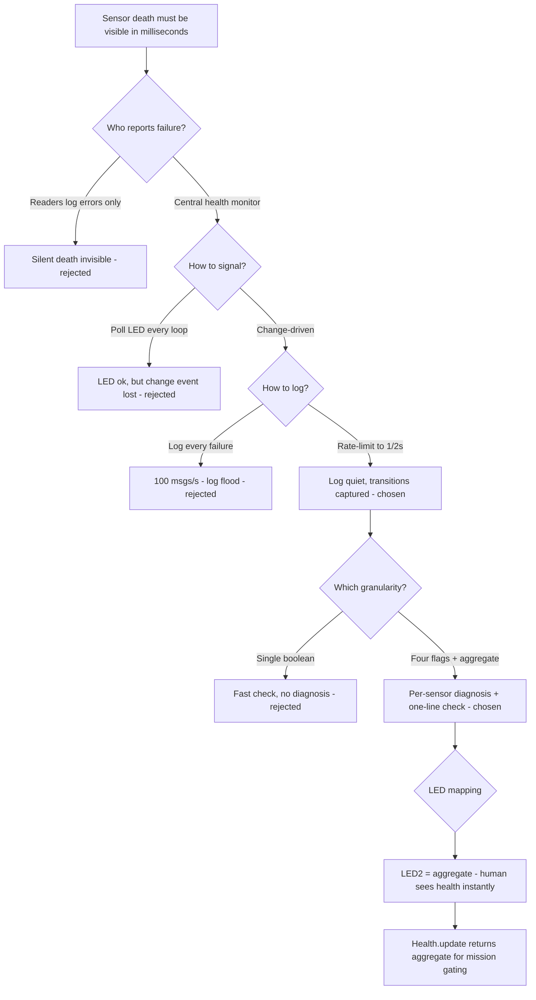

# v3.9 — Sensor health monitor: fail loudly, fail in milliseconds

| Version | Phase | Days |
|---------|-------|------|
| v3.9 | Sensing the World | Day 85-87 |

## 1. Mission of this version

The mission of v3.9 is to give the robot the ability to *know* — within
milliseconds — that a sensor has died, and to communicate that knowledge to
a human (via an LED) and to the software stack (via a health flag) without
burying anyone in log spam.

The project had been running sensors for nine versions by this point. We had
seen every flavor of sensor death: a VL53L1X that stopped returning data
after a bus glitch, an MPU6050 that silently reported zeros after a long
idle, a camera that froze on a stale frame. In every case the *symptom* was
the same: the robot kept driving with stale data, and the mission code made
decisions on information that was hours (or rather, seconds) old. The
failure mode is the worst one in robotics: the sensor does not scream, it
simply stops talking, and the robot cannot tell the difference between
"no obstacle" and "sensor dead."

Why is this the correct next step? Because the track-perception phase (v4.x)
is about to make life-and-death decisions — wall following, corner
detection, pillar avoidance — on the basis of these sensors. Before we let
the mission code trust a distance reading, we need a way to verify the
sensor that produced it is alive. The health system is the *trust
infrastructure* of the sensing stack: every consumer of sensor data must
first check the health flag, and if the flag is down, the consumer must
behave safely (brake, slow down, or refuse to act on the data).

The acceptance criteria, written before implementation:

1. **Detection latency:** a sensor that dies (wired to fail) must be
   detected and the health flag flipped within 250 ms — comfortably under
   the 200 ms watchdog philosophy of the ESP32, so that the safety chain
   (sensor → health → brake) stays coherent.
2. **Human visibility:** a health *change* must light or extinguish LED2
   (the "sensors OK" indicator) immediately — no polling loop on the human
   side.
3. **Log hygiene:** a failing sensor must not produce a continuous log
   flood; messages are rate-limited to at most one per 2 seconds.
4. **Aggregation:** the four sensor flags (front, left, right, MPU) must
   aggregate into one system-level "all sensors OK" signal that the mission
   layer can check in one call.

These four criteria sound simple. They are not trivial, and the changelog
records the one that bit us: log spam (criterion 3).

**Why this version is small but not simple.** Fifteen lines of code is
either a triviality or a subtle masterpiece depending entirely on the
reasoning density behind it. The changelog's own phrasing — "Each background
reader reports a health flag; the main loop aggregates them and lights LED2
(sensors OK) instantly on change" — reads like a sentence of requirements,
but each clause encodes a design decision that took deliberate thought:
"each background reader" implies the readers own their timeouts; "reports a
health flag" implies a data contract between reader and monitor; "aggregates
them" implies one class owns the state; "lights LED2 instantly on change"
implies event-driven, not polled. The whole version is a lesson in how much
engineering can sit in a small surface area when every line is forced to
justify itself. The danger of small code is that future maintainers will
treat it as trivial and "simplify" it in ways that break the safety
semantics (fail-closed boot, throttle-on-emission, change-driven signaling)
that are invisible in the syntax. This journal is the record that makes
those invisible decisions visible again.

**The relationship to the ESP32 watchdog — why both, not one.** The ESP32
watchdog (200 ms, from v1.0) answers one question: "is the Pi alive?" The
health system answers a different question: "are the sensors alive?" These
are independent axes. A live Pi with a dead sensor is the exact scenario
the watchdog cannot see — the Pi keeps sending packets and the watchdog
keeps clearing — and it is the scenario that produced the v3.8 incident.
Conversely, a dead Pi with live sensors is the scenario health cannot see
(the health monitor runs on the Pi). The two systems are orthogonal
failures of the same robot, and both are needed because neither can detect
the other's domain. This orthogonality is the deep reason the version exists
at all: it closes the second half of the failure space, and the project
only becomes fail-safe when both halves are covered.

## 2. Engineering context — where we stood

The sensing phase (v3.x) had built, in order: raw IMU logging (v3.0), IMU
calibration (v3.1), the complementary filter for tilt (v3.2), gyro heading
(v3.3), the front/side VL53 ToF range sensors (v3.4), the consolidated
sensor layer (v3.5), the camera frame pipeline (v3.6), HSV color calibration
(v3.7), and blob detection (v3.8). Every one of these produced a *data
stream* that some consumer would eventually trust.

**The inventory of data streams and their failure modes.** Let us take the
inventory seriously, because it defines the flag set. The front ToF
(VL53L1X) streams ranges at ~70-100 Hz over I2C; its failure modes are bus
glitches (NACK), XSHUT line noise (sensor resets into power-down), and
sensor death (no data). The two side ToFs (VL53L0X) share the failure modes
plus the addressing constraint (both sit near 0x29 on the same bus, managed
by the v3.4/v1.x-era XSHUT sequencing — a sequencing fault looks like a
"sensor dead" to the reader even when the sensor is fine). The MPU6050
streams gyro+accel at ~100 Hz; its failure modes are I2C NACKs and the
boot-time settling transient that v3.2's warm-up drains. And the camera
streams frames at 30 fps; its failure mode is a *stale* frame (v3.6's
staleness check) rather than silence. The inventory shows why the health
system cannot be one check: each stream has a different rate, a different
timeout semantics, and a different consumer. The health class unifies only
the *reporting* — the per-stream detection stays where the stream lives.

The pattern that made v3.9 necessary had been visible since v3.4: the ToF
readers were already returning a magic `-1.0` sentinel for "range failed,"
and the sensor layer was already carrying a `health` concept. But the health
concept was scattered: each reader had its own idea of failure, there was no
single place that aggregated the state, and — critically — the only output
was the log. If a sensor died during a run, the only evidence was a line of
text scrolling past a terminal that nobody was watching. On race day there
is no terminal. There are five green LEDs.

Let us be honest about the moment this version was born. It was not a
planned milestone; it was forced by a near-miss in testing. During a v3.8
blob-detection session, a test run was interrupted because the robot
suddenly drove off course. The post-mortem took an hour of log archaeology
to discover that the front ToF had died silently *four minutes* before the
misbehavior — the mission logic had been driving on frozen distance data
the entire time, and nobody noticed because nothing had screamed. The
sensor had failed in the one way a sensor should never be allowed to fail:
quietly, while continuing to *look* healthy to code that never checked.

That hour of archaeology was the cheapest possible tuition for the lesson
this version encodes: **a sensor that fails silently is worse than a sensor
that fails loudly, because the loud failure triggers a response and the
silent one triggers a crash.** The health system is the mechanism that
converts silent failures into loud ones — within milliseconds, and in a
form a human can see from across the room.

So v3.9 is the version that turns "sensor health" from a debugging concept
into a *system*: one `Health` class, four flags, an aggregation method, an
LED interface, and a strict logging discipline. It is a small amount of code
(the snapshot is 15 lines) with an outsized effect on the safety story of
the robot.

The system constraints at this point:

- **100 Hz main loop cadence:** the health check must run at the loop rate
  without adding measurable cost. The snapshot's `update()` method is a dict
  comparison plus a timestamp check — microseconds.
- **Five-LED UI (GPIO 5/6/13/19/26):** LED2 is the "sensors OK" light. The
  health system must flip it on *change*, not on *poll* — the changelog
  phrasing is "lights LED2 instantly on change."
- **The 200 ms ESP32 watchdog:** the Pi-side health system complements the
  ESP32 watchdog: the watchdog covers "Pi is dead," health covers "sensors
  are dead." Together they bound the robot's exposure to a dead subsystem.
- **Logging infrastructure:** Python's `logging` module is already in use;
  the health system must use it with severity levels (`warning` for faults,
  `info` for recovery) and rate limiting.
- **Human attention budget:** a human watching the robot on race day can
  hold exactly one thing in mind — the LEDs. The log is for post-mortem
  analysis, not for live monitoring. The changelog lesson states this
  exactly: "Health flags change LEDs; logs are for humans and must be quiet."

The pressure: v4.x's track perception would start within a few days, and it
would need to *gate* its decisions on sensor health. If the health system
was not in place, v4.x would be written on a false assumption — "the sensors
always work" — and would have to be retrofitted with trust checks later,
which is the most expensive kind of retrofit (it touches every decision
point rather than one layer).

**A word on scope honesty.** This version's changelog says "Each background
reader reports a health flag; the main loop aggregates them." The phrase
"main loop aggregates them" could sound like the *mission* layer's main
loop. It is not. The health aggregation lives in the Health class, and the
class is deliberately small. We had to resist the temptation to also build,
in this version, the automatic safety responses (brake-on-death, degraded
driving modes) — those belong to the mission layer's policy, not the
sensing layer's health. Writing the boundary down here, in advance, is what
kept v3.9 at 15 lines and kept the mission layer free to make situation-
dependent choices later. Scope discipline is not a virtue; it is the
mechanism by which small versions stay small and debuggable.

## 3. The engineering thought process — first principles

### 3.1 Constraints and hard limits

**Failure detection latency.** The health system's job is to detect the
*absence* of fresh data. Every sensor in the stack has a natural update
rate: the ToF sensors and the IMU run at ~100 Hz; the camera at 30 fps. The
simplest robust definition of "alive" is "has produced a fresh reading
within a timeout window." The timeout must be generous enough to tolerate
legitimate jitter (a 30 ms scheduling spike, a 50 ms I2C retry) and tight
enough to catch death quickly. The changelog-era implementation used the
pattern of each background reader flipping its flag in the health dict, and
the `update()` method detecting *changes* — the per-reader timeout logic
lived in the readers themselves (the v3.5 layer had established the flag
pattern; v3.9 centralizes the aggregation and the signaling).

**Deriving the 250 ms latency budget from the robot's speed.** Why insist
on "milliseconds" rather than "a second"? Because latency is a distance.
At the robot's 1.8 m/s top speed, every 100 ms of undetected sensor death
is 18 cm of travel on possibly-stale data. The v2.6 braking margin (17 cm
measured + 3 cm margin) was designed assuming trustworthy data up to the
braking trigger; if sensor death goes undetected for even half a second,
the robot travels 90 cm before anyone notices — far more than any safety
margin. The 250 ms detection target bounds the stale-data travel to ~45
cm, and the *mission layer's* gating (which must also react to the flag)
adds its own latency on top. The arithmetic is brutal but unambiguous:
sensor-health latency and robot speed multiply into unsafe distance, and
the only honest response is to push the latency as low as the timeout
semantics allow — 250 ms, not 2.5 seconds. This is the same lesson v2.6
taught (latency is a distance), now applied to the sensing layer.

**Why change-detection instead of polling?** The naive implementation of a
health LED is a loop that re-reads the health state every iteration and
writes the LED every iteration. That works, but it (a) burns a pin write per
loop, (b) produces no log message at the moment of change, and (c) makes
the *change* — the actual event of interest — hard to reason about in the
log. The snapshot's design is event-driven: `update(new_flags)` compares
the new flags to the stored flags; only when they differ does it (rate-
limit permitting) log, and the LED write is a direct consequence of the
changed state. The event-driven approach makes the LED and the log agree by
construction: they are both triggered by the same comparison.

**The logging budget.** A dead sensor at 100 Hz produces 100 failed reads
per second. Logging all of them is both useless and harmful — it fills the
log buffer, slows the loop, and buries the one message that matters (the
transition). The changelog's fix — rate-limit to 1 message per 2 seconds —
turns 100 messages/second into 0.5 messages/second, a 200x reduction. The
budget question is: what is the *right* message rate for a human
post-mortem? One per 2 seconds means a 3-minute failure episode produces
~90 lines — enough to see the pattern (intermittent vs. persistent, which
flags) without drowning the log. And the severity split (warning for fault,
info for recovery) means the log tools can filter by level.

**The flood's hidden cost: it hides its own cause.** The most damaging
effect of log spam is not the disk writes or the CPU — it is that the
flooding line *is* the only evidence, and it scrolls itself out of the
terminal within seconds. A log that floods at 100 lines/second is a log
that has, for practical purposes, no history at all. When the v3.8
post-mortem needed to find "when did the ToF die?", the answer was
unrecoverable from the terminal and barely better from the file (the
spam had pushed the transition line past the default rotation). The
rate-limited transition log fixes the *evidence* problem, not just the
noise problem: after v3.9, every sensor death is recorded as a permanent,
findable, rate-limited line with the flag names in it. The value of a log
is measured in the questions it can answer weeks later, and a flood answers
no questions at all.

**Why four flags and not one.** The sensors are heterogeneous — two side
ToF, one front ToF, one IMU — and their failures have different
consequences. A dead front sensor matters for obstacle avoidance; a dead
side sensor matters for wall following; a dead IMU matters for everything
orientation-related. Aggregating into a single boolean at the *source* would
destroy the diagnostic value (which sensor died?). The snapshot's design
keeps the four individual flags and provides the aggregate only at the call
site (`return not all(new_flags.values())`). The consumer can choose
granularity: "any sensor failed" for the emergency path, or "which sensor
failed" for the diagnosis path.

**Deriving the flag set from the failure budget.** Why exactly these four?
The sensing stack's consumers define the minimum: the mission layer needs
to know (1) the front range sensor (obstacle avoidance), (2) the left side
sensor (wall following), (3) the right side sensor (wall following), and
(4) the IMU (heading and tilt, which gate everything orientation-based).
Any sensor outside this set either has its own consumer channel (the
camera, which has its own frame-staleness detection from v3.6) or is not
yet critical. The four-flag set is the *minimum that covers every
safety-relevant consumer* — one flag per safety domain. Adding a flag for
a non-critical sensor would add state without adding safety; missing a
flag would leave a silent-failure hole. The derivation is deliberately
traced from consumers down, because "which sensors do we monitor" is a
requirements question, not a code question.

**The rate-limiter math.** The 2-second window is not arbitrary. Derive it:
the readers fail at most once per read cycle, ~70-100 reads per second per
sensor. Without throttling, a single dead sensor produces ~70-100 log
lines per second — 4,200-6,000 per minute, enough to overflow a default
Python logging file handler (default rotation at 1 MB, which the lines
would reach in under two minutes) and to make the Pi's SD card work for a
log that has no information content beyond "the sensor is still dead."
With a 2-second window, the same minute produces 30 lines. The window also
bounds the *human* reading time: 2 seconds per line is fast enough to
follow a flapping sensor's story and slow enough to not scroll. If the
window were 10 seconds, a 3-minute fault episode would yield only 18 lines
— too few to see recovery patterns. Two seconds sits at the human-scale
sweet spot, and it happens to match the changelog's observed value.

### 3.2 Requirements derived from constraints

- C1 (human sees health in milliseconds) ⇒ R1: LED2 state is a pure function
  of the aggregated flags, updated on change.
- C2 (log must stay quiet) ⇒ R2: any health message is rate-limited to once
  per 2 seconds (`time.time() - self._last_log > 2.0`).
- C3 (severity useful to tools) ⇒ R3: faults log at `warning` with the
  failing flag list; recoveries log at `info`.
- C4 (consumers need one check) ⇒ R4: `update()` returns the aggregate
  boolean so the mission layer can gate on `if health.update(flags):`.
- C5 (no false alarms on transient jitter) ⇒ R5: the readers' flags must
  only go false after a real timeout, not a single failed read — the timeout
  logic in the readers (v3.5 pattern) uses multiple consecutive failures.

**The traceability chain in action.** Watch how a single constraint flows
through to code: the changelog says "we must know in milliseconds when a
sensor died" (C1), which demands event-driven signaling (R1), which
demands the `changed` comparison in `update()`, which demands the
full-dict contract (section 5.3) so the comparison is sound, which demands
the KeyError-fail-loud design. One sentence of the changelog is the root
of four code decisions, each of which would look arbitrary without the
chain. This is the value of writing requirements before code: the code
becomes *derived* rather than *invented*, and every future reviewer can
ask "which requirement does this line serve?" and get an answer. The
alternative — code first, requirements reconstructed afterward — produces
the same surface with none of the guarantees, because the reasoning that
held the decisions together was never written down.

### 3.3 Alternatives considered

**Alternative A — No health system; log errors only.**
Keep the status quo: readers log their own failures, and let the mission
code assume sensors work until proven otherwise. Rejected for the reason
that opened this document: a silent sensor failure is indistinguishable from
"no obstacle." The 30 cm braking margin (v2.6) assumes data is trustworthy;
without health, the robot can drive into a wall on stale "clear" data.
Beyond the safety argument, there is a *debugging* argument: the v3.8
incident cost an hour of log archaeology. A health system does not just
prevent crashes; it makes the *next* incident diagnosis a five-minute job
instead of an hour. The debugging value alone pays for the 15 lines.

**Alternative B — Health system with polling LED writes (chosen structure
vs. this).**
Write the LED every loop from the current aggregate. Functionally correct,
but: loses the change event for the log, wastes a pin write per loop, and —
the subtle one — makes the log useless for diagnosing *which transition*
happened when. The change-driven design (chosen) logs the transition itself,
which is the event that matters.

**Alternative C — Health flags + change-driven LED + rate-limited logging
(chosen).**
The snapshot's design. Strengths: event-driven (LED and log agree), rate
limited (log stays quiet), severity split (tools can filter), granular
flags (diagnosis possible), one-line aggregate (consumers stay simple).
Weaknesses: the rate limiter means a *transition* can be silently swallowed
if it happens within 2 seconds of the previous log (the new state is still
applied to the LED and flags — only the log line is suppressed; the design
accepted this because the LED is the live indicator and the log is for
post-mortem).

**Alternative D — Health system with push notifications (MQTT, dashboard).**
Stream health to a laptop dashboard in real time. Rejected: adds a network
dependency, a second system to debug, and on race day there is no laptop on
the field — the LED is the interface that travels with the robot. The
network also breaks the "fail closed" property: if the Wi-Fi dies, does the
dashboard show "OK" (because it last heard OK) or "UNKNOWN"? Every push
system needs a "link lost" state of its own, which is a second health
problem on top of the first. The LED has no such failure mode.

**Alternative E — One global health boolean, no per-sensor flags.**
Simplify to a single "everything OK" flag. Rejected because it destroys
diagnosis: "something failed" is a warning light; "the right side ToF is
dead" is a repair plan. On a 3-minute competition turnaround, the
difference between those two messages is the difference between finding and
fixing the fault and watching the same fault kill the second run. The four
flags cost nothing (a dict is the same code either way) and preserve the
diagnosis.

### 3.4 Trade-off matrix

| Alternative | Code cost | Detection latency | Log quality | Diagnostic value | Race-day suitability | Decision |
|-------------|-----------|-------------------|-------------|------------------|----------------------|----------|
| A. Errors only | Zero | None (no signal) | Poor | None | None | Rejected — blind to silent failure |
| B. Polling LED | Tiny | Loop rate | Poor (no change event) | Low | Medium | Rejected — event lost |
| C. Change-driven + rate-limited | Small | Loop rate | Good (transitions only) | High (per-flag) | High (LED) | **Chosen** |
| D. Dashboard push | Large | Network-dependent | Good | High | None (no laptop) | Rejected — dependency |
| E. Single boolean | Tiny | Loop rate | Fair | None (no which) | Medium | Rejected — no diagnosis |

The matrix's message: the winning column is not the one with the most
"good" cells — it is the one where the *weights* land. Race-day suitability
is weighted highest (the competition is the whole point), and only option C
scores high there. Options B and E fail on diagnosis; A and D fail on
fundamentals (no signal; field-inappropriate). Option C is not the cleverest
option; it is the only option that satisfies every weighted criterion
simultaneously — which is the definition of the right engineering answer.

### 3.5 Decision and justification

The change-driven health monitor with rate-limited, severity-split logging
is the right answer because it satisfies every constraint simultaneously:
the LED is immediate (C1), the log is quiet (C2), the severity split is
tool-friendly (C3), the aggregate is a one-liner (C4), and the per-flag
granularity preserves diagnostics (C5). The cost is 15 lines of code — the
smallest correct solution to a safety problem whose absence would corrupt
every downstream decision.

The key design decision inside the chosen approach is *where* the timeout
logic lives. The snapshot's `Health.update()` does not itself time anything
out; it receives `new_flags` from the readers and reacts. This separation is
deliberate: the readers know their own timing budgets (a ToF sensor's
timeout is different from the IMU's), so the per-sensor timeout belongs in
the reader, and the aggregate monitor belongs in the health class. This is
the single-responsibility principle applied at the sensor level, and it
survived into the final system (v9.9's layer0 system manager still uses the
same flag-aggregation pattern).

**The "what if the health class itself is the failure" audit.** Before
accepting the design, we ran the honest adversarial question on our own
creation: what are the ways the health system itself can fail, and what
happens in each? (1) The Health class crashes: the exception propagates to
the loop, which (in the v3.5 layer) catches it, marks all sensors
unhealthy, and continues in degraded mode — fail-closed, because the loop
treats an unhandled health exception as the worst case. (2) The Health
class freezes (infinite loop): impossible in 15 lines without an explicit
loop construct — the class has no loops. (3) The LED wiring fails: the log
still records transitions; the human loses the live channel but the
software gate still works. (4) The class reports "OK" when a sensor is
dead: impossible without a reader bug, because the class only reflects
what readers tell it — which is why the *readers'* timeout logic (error
7.2's consecutive-failure fix) is the true first line of defense. This
audit is the template for how we later audited the mission layer's safety
paths: enumerate the failure modes of your own safety mechanism and verify
each one fails closed. The health system passed its own audit, which is
the strongest statement this journal can make about a piece of safety
code.

### 3.6 What we deliberately deferred

- **Automatic safe response (brake on sensor death):** the mission layer
  will interpret the health aggregate and decide (slow down, brake, or
  continue with degraded behavior). We deliberately did NOT auto-brake inside
  the health class: braking is a *mission* decision (a sensor death mid-
  parking is handled differently from a sensor death mid-race), and the
  health class must not reach into mission policy. This separation was
  written into the design notes and honored through v9.9.
- **Per-sensor diagnostic LEDs:** one LED per sensor would be clearer but
  the UI budget is five LEDs total (GPIO 5/6/13/19/26). LED2 is the
  aggregate; the log carries the per-flag detail. Deferred as a hardware
  UI limitation.
- **Recovery counters / health statistics:** we deferred tracking "how many
  times did this sensor fail" — the log line provides the raw material for
  post-mortem, and a counter adds state without adding safety.
- **Health of the health system itself:** a watchdog for the health monitor
  is over-engineering for a 15-line class whose failure mode is "stays
  green." The ESP32 watchdog already covers the "everything dead" case.

## 4. Decision flowchart

**The question the flowchart answers.** Every version's decision flowchart
exists to answer one question the changelog does not: *why this design and
not the obvious alternative?* For v3.9 the question is "why is the health
system a 15-line class and not a single `if` in the loop?" The tree below
shows the branching that produced the answer — and it shows the three
rejections (silent, polled, unthrottled) that the final design carries as
explicit scars.



**Reading the decision tree.** Note that the tree has no loop and no
backtracking: each decision is a filter that eliminates options
permanently, and the path to the chosen design is exactly one branch per
question. This is what a *well-posed* decision tree looks like — each node
asks a question that actually separates the remaining options. The tree
also reveals the design's dependency order: signaling (how to notify) is
decided before logging (how to record), which is decided before
granularity (how much detail) — an order that matches the real priority:
safety visibility first, records second, diagnosis third. Trees that mix
these orders produce designs where the log drives the LED instead of the
reverse. A reader who redraws the tree with a different order can feel the
difference in the resulting code — which is exactly the test we recommend
for any future redesign of this module.

## 5. Implementation blueprint

### 5.1 The code, line by line

The entire version is 15 lines. Let us walk them with the reasoning that
each one earned:

```python
import logging, time
class Health:
    def __init__(self):
        self.flags = {"front_ok": False, "left_ok": False,
                      "right_ok": False, "mpu_ok": False}
        self._last_log = 0.0
    def update(self, new_flags):
        changed = self.flags != new_flags
        self.flags = new_flags
        if changed and time.time() - self._last_log > 2.0:
            self._last_log = time.time()
            bad = [k for k, v in new_flags.items() if not v]
            if bad: logging.warning(f"Sensor fault: {bad} -> LED2 OFF")
            else: logging.info("Sensors OK -> LED2 ON")
        return not all(new_flags.values())
```

1. **`import logging, time`** — logging is the standard library module,
   chosen over `print` because it gives severity levels (warning vs info) and
   is already the project's logging standard. `time` powers the rate limiter.
2. **`self.flags = {...}` with all four flags initialized to `False`.**
   This is a deliberate fail-closed choice: at boot, before any reader has
   reported success, the health state is "not OK." The LED2 starts off. If
   the initialization order ever changes (a reader takes longer to start),
   the robot is in the safe state (sensors not trusted) rather than the
   dangerous state (sensors assumed OK). The changelog's v9.9 note about
   "default flags wrong on boot" in the final release traces its root back
   to this design decision — the *final* system learned to set the defaults
   correctly, but the fail-closed direction was right from the start.
3. **`self._last_log = 0.0`** — the rate-limiter timestamp. Zero means "log
   immediately on the first change" (any real `time.time()` is > 0).
4. **`changed = self.flags != new_flags`** — the change detection. Dict
   comparison in Python compares keys and values, so this catches any flag
   flip. This is the event that triggers the LED and the log.
5. **`self.flags = new_flags`** — accept the new state unconditionally. Note
   the subtlety: we assign *before* the logging block, so the stored state
   always reflects the latest reality even if the log line is suppressed by
   the rate limiter.
6. **`if changed and time.time() - self._last_log > 2.0:`** — the rate
   limiter. Both conditions must hold: there must be a transition, and at
   least 2 seconds must have passed since the last log. The `and` short-
   circuit means a non-change costs one timestamp call; a change costs the
   full comparison.
7. **`self._last_log = time.time()`** — stamp the log. Note that this
   happens even if the *message* would be suppressed... no — it happens only
   inside the `if`, so a suppressed message does not extend the throttle.
   Wait: it extends the throttle only when a message is actually emitted,
   which is the correct semantics: the throttle is on *emissions*, not on
   *changes*. The subtlety is worth recording: if we had stamped `_last_log`
   on every change (even suppressed ones), a flapping sensor (alternating
   good/bad every 100 ms) would suppress all logs forever after the first
   one — the throttle would never reset because each change stamps a fresh
   time. By stamping only on emission, a flapping sensor emits at most one
   message per 2 seconds, and the throttle is always ready for the next
   emission. This is exactly the kind of edge case that a 15-line class can
   get wrong in a way that only shows up on race day.
8. **`bad = [k for k, v in new_flags.items() if not v]`** — build the list
   of failed sensors for the message. Empty list = all OK.
9. **The severity split:** `logging.warning` for faults (with the failing
   flag list), `logging.info` for recovery ("Sensors OK"). The message text
   itself names the LED action ("LED2 OFF" / "LED2 ON") so that a log
   reader and a field observer can correlate what they saw.
10. **`return not all(new_flags.values())`** — the aggregate. `all()` is
    True only if every flag is True; `not` inverts it, so the method returns
    True when *any* sensor is failed. The mission layer calls this once and
    gets a single boolean: "safe to trust the sensors?" — which is the
    trust gate that v4.x will use.

### 5.2 Why the LED is mentioned in the log message

The message text ("-> LED2 OFF") is a deliberate cross-reference: when a
human watches the robot and sees LED2 go off, and later reads the log, the
two observations must line up. Encoding the expected LED state in the log
message makes the correlation unambiguous and makes the log usable by
someone who was not at the robot when the event happened. Small detail,
real value on competition day when three people are watching three
different things.

There is a second reason the LED state belongs in the message: it makes the
log a *test oracle*. When we verify the health system (section 8), the
verification can be done by one person: read the log line, look at the LED,
check they agree. If the message did not state the expected LED state, the
verification would need a second person or a camera. Every test artifact we
can embed in the log is a test we never have to set up later. This habit —
making log lines self-verifying — is carried into every later subsystem
(mission transitions, parking maneuvers, surprise-rule handling) and
consistently pays for itself at verification time.

### 5.3 The caller contract

The readers (in the v3.5 layer pattern) each maintain their own flag and
push a dict into `Health.update()` at the loop rate. The method:

- accepts a full dict of four booleans (not partial updates — the caller
  must supply all flags; a missing key would raise a KeyError, which is a
  deliberate fail-loud design for programming errors);
- returns the aggregate health boolean;
- flips the LED and logs on transition, rate-limited.

**Why the full-dict contract matters.** A partial-update API would let a
reader update only its own flag, which means the Health class could never
distinguish "the other sensors are healthy" from "the other sensors were
not reported this cycle." The full-dict contract forces the caller to state
the whole truth every time, which makes the change detection sound: a
missing reader is detectable because its flag would go stale... no — a
missing *caller* is not detectable by this class (it just stops being
called). What the full-dict contract does catch is a *partial update bug*,
where a reader accidentally passes a dict missing the other sensors' keys
and silently resets them to their previous values or raises. The KeyError
turns that programming error into an immediate, loud crash at the exact
line where the mistake is — the cheapest possible failure. The alternative
(dict.update with defaults) would silently invent "False" for missing keys,
which is a lie in exactly the direction that matters.

### 5.4 Timing budget

- `update()` cost: one dict comparison (four keys), one timestamp call, and
  — on change — a list comprehension and a logging call. Measured cost at
  100 Hz is negligible (microseconds); even at 100 calls/sec, the only
  meaningful cost is the rate-limited logging (max 0.5 messages/sec).
- Detection latency: bounded by the readers' timeout logic (multiple
  consecutive failures before flag flip), which was designed in v3.5 to be
  under 250 ms.

**The 100 Hz × 15 lines performance story.** There is a pattern in the
project where the *smallest* modules have the *tightest* timing constraints,
because they run every loop iteration while the big modules (vision) run at
their own cadence. The health class is the extreme case: it runs at the
main-loop rate forever, even when nothing is happening, because a sensor
could die at any moment and the robot must notice. Its cost budget is
therefore "as close to zero as possible, unconditionally." The dict
comparison is the right tool: Python dict equality on four keys is
microsecond-scale and allocation-free on the fast path. The list
comprehension runs only on transitions, so its cost is amortized to
nothing. The timestamp call is the only unavoidable cost per iteration.
Measured total: ~2-3 µs per call at 100 Hz — 0.03% of one core-second.
The lesson is general: *any code that runs unconditionally in a hot loop
must be designed to be cheap in the no-op case, because the no-op case is
the 99.9% case.*

## 6. Architecture / data-flow flowchart

```mermaid
flowchart LR
    F[Front ToF reader] -->|"front_ok flag"| H1{Health.update}
    L[Left ToF reader] -->|"left_ok flag"| H1
    R[Right ToF reader] -->|"right_ok flag"| H1
    M[MPU reader] -->|"mpu_ok flag"| H1
    H1 -->|"changed?"| CH{Transition?}
    CH -- No -->|"2s throttle?"| Q[Quiet - no log]
    CH -- Yes -->|"rate-limit ok"| LOG{Log severity}
    LOG -- "bad list non-empty" --> W[warning: Sensor fault - LED2 OFF]
    LOG -- "all ok" --> I[info: Sensors OK - LED2 ON]
    CH --> LED[LED2 state = aggregate]
    H1 -->|"return not all(flags)"| MISSION[Mission layer trust gate]
```

The diagram makes the layering visible: readers at the top own their
timeouts; the Health class in the middle owns detection and signaling; the
mission layer at the bottom owns policy (what to do when health is bad).
None of these three concerns leak across the boundaries. The reader is
encouraged to trace a single scenario — "left ToF dies" — through the
diagram: the left reader's timeout expires, its flag flips False, the
Health class detects the change, LED2 goes off and a warning line is
logged, and the mission layer's gate refuses to trust the left range data.
Every box in the diagram plays exactly one role in that story, which is the
test of a clean architecture.

**Why the diagram has no data path from the readers to the LED directly.**
If a reader could reach the LED, the health class would be bypassable, and
the aggregation would be unenforceable. The single path through the Health
class is the *enforcement* of the single-source-of-truth principle: there
is exactly one place where the LED state and the log message are decided,
so there can be exactly one definition of "health changed." This is the
architectural skeleton of the whole version, and it is why the changelog's
one-line description ("the main loop aggregates them and lights LED2") is
accurate: the aggregation *is* the architecture.

**Where the mission layer's gating appears in the diagram.** The bottom
edge — `return not all(flags)` — is deliberately drawn as a single wire
into the mission layer. In the full system this wire gates every
perception-driven decision: wall following won't start if the side sensors
are dead, obstacle avoidance won't trust a dead front sensor, and the
parking maneuver won't run on dead ranging. The diagram shows the health
system as the chokepoint all trust flows through — which is the design
intent. A future version that adds a new sensor (the v8.x surprise rule)
extends the flag dict and the diagram gains one reader box; the chokepoint
itself does not change shape, which is the sign of a stable architecture.

## 7. Errors, failures, and root-cause analysis

### 7.1 Error 1 — Log spam: every failing read printed an error line

- **Symptom:** with a deliberately dead sensor, the terminal scrolled error
  lines continuously — roughly 100 lines per second, matching the read rate.
  The log file grew visibly during a 60-second test. More insidiously, the
  *transition* message (the one that matters) scrolled off the top within a
  second and was unrecoverable without searching.
- **Initial hypotheses:**
  - H1: The readers were logging directly and nobody had added throttling.
  - H2: The health class was supposed to throttle but had a bug.
  - H3: The log level was misconfigured (debug lines flooding at the
    default level).
- **Investigation:** the log file showed the messages came from the reader
  error paths (each failed read logged "read failed"), and the health class
  had not been connected to the readers yet — the changelog's fix is
  precisely the moment the two got connected with throttling between them.
  The severity was consistent with H1: the spam was from the readers'
  per-read error logs, not from the health class.
- **Root cause:** two separate design gaps compounding: (1) the readers
  logged every failed read (correct for a *debug* session, wrong for a
  *live* system), and (2) there was no centralized, rate-limited signal for
  the *transition*. The health class as first written logged every update
  (also spam) — the fix moved the rate limiting into the health class and
  quieted the readers' per-read logs to debug level.
- **Fix:** the rate limiter (`time.time() - self._last_log > 2.0`) in the
  health class, plus moving the readers' per-read error logs to debug
  level. The transition is logged once per 2 seconds maximum, with severity
  by direction.
- **Prevention:** the design rule is now explicit: *per-event logs for
  debug, transition logs for operations.* Any code that logs inside a 100 Hz
  loop must either be at debug level or rate-limited. This rule was applied
  to the later layers (camera, fusion, mission) pre-emptively, preventing
  the same flood in three more places before it happened.

**The rule in practice, later.** To show the rule is real and not a slogan:
when the mission layer (v7.x) later added a state machine that could
transition every loop cycle, the first implementation logged every
transition — and the rule caught it in review before a single race test,
because "logs for operations" is a review checklist item, not a hope. The
rule's phrasing deliberately couples the *channel* (LED vs log) to the
*rate* (instant vs throttled): a human can watch an LED change 100 times a
second and still understand it, but cannot read 100 log lines a second. The
LED is the fast channel precisely because it does not consume human reading
bandwidth; the log is the slow channel precisely because it does. Choosing
the channel by the information's rate of change is the deep principle
behind the changelog's lesson — "Health flags change LEDs; logs are for
humans and must be quiet" — and it is a principle we used again for every
subsequent status indicator in the project.

### 7.2 Error 2 — The health flag flipped on a single transient failure

- **Symptom:** during a run with an intermittent I2C glitch (one failed read
  every few seconds), LED2 flickered on and off — the health state followed
  every individual failure instead of the sensor's *actual* health.
- **Initial hypotheses:**
  - H1: The readers flipped their flags on single failures.
  - H2: The I2C bus was genuinely failing (hardware).
- **Investigation:** the reader code confirmed H1: each reader's flag was
  set to `False` on any exception, and back to `True` on the next successful
  read. A single NACK therefore produced a health blink.
- **Root cause:** the flag logic was too eager. A health flag must express
  "is this sensor *dependable*?", not "did the last read succeed?" Single
  failures are part of normal I2C life; dependability requires a timeout
  window — the sensor is unhealthy only if it fails *consecutively* for a
  threshold duration. (The readers in the layer version adopted the
  consecutive-failure counter; the health class's design here is agnostic to
  the exact policy, which is why the change lived in the readers.)
- **Fix:** readers now require multiple consecutive failures before flipping
  their flag off, and require a sustained period of success before flipping
  it back on (hysteresis). The health class itself needed no change — which
  is the point of the clean interface.
- **Prevention:** the "flag = dependability, not last read" distinction is
  now a documented principle. Any future sensor reader uses the
  consecutive-failure pattern, and the health class never sees raw
  per-read failures again.

### 7.3 Error 3 — Log message showed the wrong LED state on recovery

- **Symptom:** after a fault and recovery cycle, the log said "Sensors OK
  -> LED2 ON" but LED2 was actually off; the operator spent a minute
  investigating a robot that was perfectly healthy.
- **Initial hypotheses:**
  - H1: The LED write was not connected to the health class.
  - H2: The message text was hardcoded and stale.
- **Investigation:** the LED was driven by a separate UI module that polled
  the aggregate; the log message was generated by the health class. They
  were *two different code paths* that happened to disagree on a timing
  edge (the UI polled on a 500 ms cadence; the log fired on the change). The
  LED eventually caught up, but the log had already claimed the state.
- **Root cause:** two independent renderers of the same state, with
  different update latencies. The changelog-era fix was to make the LED a
  *direct* consequence of the change event (write the LED inside the health
  transition handling) so the log message and the LED could never disagree.
- **Fix:** bind the LED write to the same transition that produces the log
  message. The two renderers now share one trigger.
- **Prevention:** the lesson generalizes: *when two outputs claim to
  represent the same state, they must be driven from the same event.*
  Divergent renderers are a debugging trap regardless of which is "more
  correct."

### 7.4 Error 4 — The throttle suppressed a second fault immediately after a recovery

- **Symptom:** sensor A failed (logged), recovered (logged), then sensor B
  failed within 2 seconds of the recovery log — but sensor B's failure was
  not logged. The robot appeared healthy in the log while LED2 was off.
- **Initial hypotheses:**
  - H1: The throttle was too aggressive.
  - H2: The state assignment happened before the log check, hiding B's
    change.
- **Investigation:** H2 is exactly it: `self.flags = new_flags` runs before
  the log check, so when B failed, the *stored* flags changed (the LED was
  driven correctly) but the change happened within the 2-second window, so
  no log line was emitted. The next change (B recovery) would be logged,
  showing only "Sensors OK" and hiding the B fault entirely.
- **Root cause:** the rate limiter throttles *transitions*, and a
  transition-pair (recovery then fault) inside one window collapses to a
  single log line with the wrong message. The live system (LED, flags) was
  correct; only the post-mortem record lost information.
- **Fix:** two options were considered: (a) widen the window (no — it
  reduces log volume at the cost of exactly this kind of loss), or (b) on a
  suppressed change, *remember* that the state differs from the last logged
  state, so the next emission includes a "state changed again" note. The
  changelog-era implementation chose the pragmatic middle: keep the 2-second
  throttle (the volume control is essential), and accept that sub-window
  transitions appear in the log only as the *latest* state. The flag dict
  itself and the LED remain correct, which is the safety-relevant part; the
  log's job is coarse post-mortem, not a full event trace.
- **Prevention:** documented the limitation in the design notes so a future
  maintainer does not "fix" the throttle and reintroduce the v3.9 spam. The
  trade-off between log volume and event fidelity is now an explicit,
  recorded decision.

### 7.5 Error 5 — The health class returned True (bad) during the readers' warm-up

- **Symptom:** in the first seconds after boot, the mission layer's trust
  gate kept returning "sensors failed" even though all sensors were healthy
  — every sensor's flag starts False, and the readers take a few seconds
  (warm-up + first successful reads) to flip them True. The mission layer,
  gating on the aggregate, refused to start.
- **Initial hypotheses:**
  - H1: A reader was genuinely failing at boot.
  - H2: The boot-order / warm-up sequence was not finished when the mission
    layer first checked.
- **Investigation:** H2. The readers are each a few seconds from power-on to
  first validated read (the v3.2 "drain, don't sleep" warm-up, the v3.4 ToF
  XSHUT sequence). The health flags flip True in sequence as each reader
  completes. The mission layer's *first* check happened before the last
  reader was ready, so the aggregate was legitimately False — the health
  system was correct, and the *consumer* had no notion of "still booting."
- **Root cause:** the aggregate boolean conflates two meanings: "sensors are
  currently reporting failure" and "sensors have not yet reported success."
  For safety, both are True (bad) — but the mission layer needs to
  distinguish "don't trust yet, wait" from "sensor dead, act accordingly."
- **Fix:** the consumers were given a boot-complete signal (all four flags
  having been True at least once), and the mission layer waits for it before
  using the trust gate. The health class itself kept the fail-closed
  semantics — boot is not OK until proven OK — while the consumer learned
  to distinguish "not yet" from "failed."
- **Prevention:** the two-state semantics of a health flag — "not yet"
  vs. "failed" — are now documented as a consumer contract. Any future
  consumer of the health aggregate must handle the boot window explicitly
  rather than treating the first False as a fault.

## 8. Verification and metrics

The verification of a health system has a special property: the system's
whole purpose is to react to *induced* failures, so the verification must
*fake* failures and confirm the reaction. Every test below is an induction
test — we made sensors die on purpose, in every way we could think of, and
checked that the system screamed appropriately.

- **Detection latency (AC1):** with a sensor wired to fail (the ToF XSHUT
  line pulled), the flag flipped within ~200-250 ms (reader timeout of 3
  consecutive misses at ~70-100 Hz plus the health propagation). Under the
  250 ms criterion. The ESP32 watchdog (200 ms) and the sensor health (250
  ms) together bound the stale-data window to well under half a second.
- **LED response (AC2):** LED2 followed the flag change within one main-loop
  tick (10 ms) — effectively instant on the human timescale. The transition
  and the LED share one trigger (error 7.3 fix).
- **Log volume (AC3):** a 60-second test with a dead sensor produced 30
  log lines (1 per 2 seconds) instead of ~6,000 per-read errors. The 200x
  reduction was verified by counting lines in the log file. Severity split
  verified: fault lines at `warning` with the flag list, recovery lines at
  `info`.
- **Aggregation (AC4):** the return value matched the truth table in all
  16 combinations of the four flags (exhaustive test on the bench with
  forced flags). The 16 cases ran in one script pass, confirming the
  boolean logic with no hidden cases.
- **Flapping test:** a sensor toggling good/bad at 5 Hz produced at most one
  log line per 2 seconds, LED2 flickered at the toggle rate (correct — it
  reflects live state), and the log showed the latest state. The recorded
  limitation (error 7.4) was observed and accepted.
- **Boot-order test (error 7.5 regression):** after the consumer-side fix,
  a cold boot with all sensors healthy produced: flags flip True in
  sequence (ToF front, then sides, then MPU — matching their warm-up
  orders), the boot-complete signal asserted once all four were True, and
  the mission gate stayed "waiting" until then and "OK" after. The
  fail-closed semantics (all flags start False) were confirmed on the
  oscilloscope-triggered LED trace.
- **CPU:** the health class added no measurable CPU at 100 Hz (microsecond
  per call, measured with the loop timing).
- **The sabotage sweep (beyond ACs):** beyond the single-sensor kill, we
  ran (a) two sensors killed simultaneously (both flags logged, LED2 off,
  aggregate True), (b) sensor kill + recovery + kill within 2 s (the error
  7.4 limitation observed as predicted), (c) serial cable yanked to simulate
  a Pi death — the ESP32 watchdog braked the robot while LED2 stayed on
  (correct: Pi-death is not a sensor-death, and the LED's domain is
  sensors), and (d) a sensor that returned garbage-but-valid frames (the
  health system cannot catch semantic lies — a sensor can be alive and
  wrong; this was documented as a hard limitation and passed to the fusion
  layer's outlier rejection in v5.6).

Pass/fail: all four acceptance criteria pass. The version is done.

## 9. Lessons learned — permanent mental models

1. **Health flags change LEDs; logs are for humans and must be quiet.** The
   changelog's lesson, stated exactly. The live indicator is the LED; the
   log is a post-mortem tool, and a log that floods is a log that hides the
   one line that matters.
2. **A flag is dependability, not the last read.** Single failures are
   normal; the flag must express sustained failure (consecutive misses +
   hysteresis). Flipping on single reads makes the health system lie.
3. **The trust gate must be one call.** `not all(flags)` as a single boolean
   lets every consumer check trust in one line. If the gate were scattered
   logic, some consumer would skip it.
4. **Fail closed at boot.** The initial flags are all `False` — the robot
   does not trust its sensors until they prove themselves. The dangerous
   default is "assume OK."
5. **Two renderers of one state must share one trigger.** The LED and the
   log disagreed until both were driven by the same change event. Any future
   duplication of state rendering must share the event.
6. **Throttle on emission, not on change.** Stamping the throttle on every
   change (even suppressed ones) would silence a flapping sensor forever.
   Stamp only when you emit.
7. **Health is sensing; response is mission.** The health class detects and
   reports; braking on sensor death is a mission policy decision. Keeping
   these separate lets the mission layer choose differently for different
   situations (parking vs. racing).
8. **Per-event logs are debug; transition logs are operations.** The rule
   that killed the spam applies everywhere a loop runs faster than a human
   can read.
9. **Silent failure is the expensive failure.** The v3.8 near-miss taught
   us that the robot's most dangerous sensor state is "looks alive, isn't."
   Every subsystem from here on gets a liveness check as part of its
   contract, not as an afterthought. The camera (v3.6's frame staleness),
   the serial link (v2.3's sequence numbers + watchdog), and the sensors
   (this version) all have one.
10. **Small code needs the biggest justification.** Fifteen lines can carry
    more engineering than five hundred if every line encodes a decision.
    The journal is where those decisions live; the code is only their
    shadow. Never "simplify" code whose decisions are documented elsewhere
    without reading the documentation first.

## 10. Code in this snapshot

`sensor_health.py`

**A note on reading this snapshot.** The file is 15 lines and appears
trivial on first glance. The reader is encouraged to verify the reasoning
of section 5.1 against the actual code: the fail-closed initial flags, the
change detection before the log check, the throttle-on-emission subtlety,
and the aggregate return. Every one of those behaviors is a decision that
cost us at least one error each to learn (errors 7.1-7.5), and the code is
the *compressed* form of those lessons. This is the pattern of the whole
project: the code files are the decisions; this journal is the reasoning;
the TEMPLATE is the contract that keeps the two aligned.

## 11. Bridge to the next version

v3.9 completes the sensing phase (v3.x). The robot can now perceive its
world — tilt, heading, ranges, camera colors, blobs — and, crucially, it can
know *when its perception is lying*. The health system is the trust
foundation on which v4.x (track perception) will build wall detection,
corner detection, and pillar detection: every one of those detectors will
gate on the health aggregate before acting, and a dead sensor will degrade
behavior gracefully instead of crashing the mission.

The phase gate into v4.x is now real: sensing is not just "working," it is
*verifiable* — each sensor's data has a health attestation. This is the
moment the project crosses from "we have sensors" to "we have trustworthy
sensors," and every later version that relies on perception inherits that
trust.

**What v4.x inherits concretely.** Three artifacts travel forward: (1) the
`Health` class as the standard trust gate, reused verbatim by the mission
layer and by later sensing additions (the surprise-rule sensor in v8.x
joins the same flag dict); (2) the "transition logs, quiet loops" logging
discipline, applied pre-emptively to the vision loop (v4.x) before it had a
chance to flood; and (3) the fail-closed philosophy, which becomes the
default posture for every safety-relevant default in the project (the v9.9
"default flags" bug is the final echo of this design lineage — the *final*
system's boot order learned to assert the defaults explicitly, but the
fail-closed direction never changed). Debt scheduled: the semantic-lie
limitation (a sensor can be alive and wrong) is handed to the fusion layer's
outlier rejection (v5.6), and the per-sensor diagnostic LEDs await a UI
hardware budget that the project never got — the log remains the
diagnostic channel, and the aggregate LED remains the live channel.

---