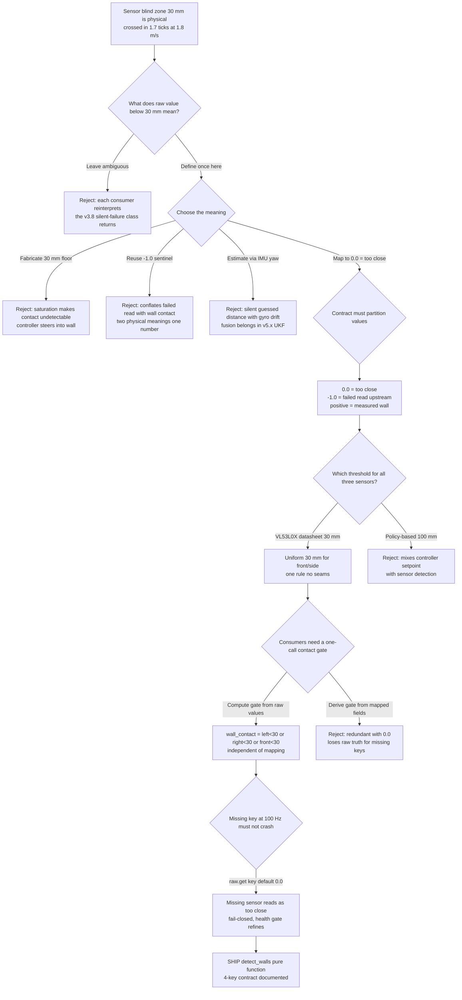
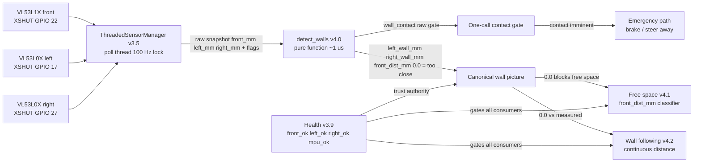

# v4.0 — The canonical wall picture: giving a sensor's blind spot a defined meaning

| Version | Phase | Days |
|---------|-------|------|
| v4.0 | Understanding the Track | Day 88-90 |

## 1. Mission of this version

The single problem this version attacks is the transformation of three raw
time-of-flight range streams into one canonical, well-defined picture of the
track's walls: `left_wall_mm`, `right_wall_mm`, and `front_dist_mm`, plus one
boolean, `wall_contact`. It sounds like a small formatting job. It is not. The
raw numbers we had at the end of v3.x were physically meaningless in one
critical regime — the sensor blind zone — and every consumer of the sensing
stack would, if left alone, interpret that regime differently, with different
bugs, at different moments, most of them on race day. v4.0 exists to make the
ambiguous regime unambiguous *exactly once*, at the layer boundary, before the
track phase (v4.x) hangs an entire wall-following, corner-detection, and
localization architecture on top of it.

Why is this the correct next step on the critical path? Because the WRO 2026
course is a walled arena. The walls are the primary reference frame of the
whole mission: wall following, corner detection, free-space reasoning, and
eventually the UKF localization pipeline of v5.x all read the walls. v3.x
delivered the *sensors* — three ToF range readers (v3.4), a threaded snapshot
manager (v3.5), and a health/trust system (v3.9) that can tell us when a
sensor is lying. But it did not deliver a *semantic*. At the end of v3.9 we
had three floats per snapshot, a failed read had historically been reported as
the sentinel `-1.0`, an uninitialized default could be anything, and a real
reading of, say, 12 mm was physically impossible for the side sensors to
produce — yet nothing in the stack said what 12 mm *means* or what the
consumer should do with the absence of a measurement. The capability gap is
precisely this: we had trustworthy numbers (v3.9) but no trustworthy
*interpretation* of the number zero and the number near-zero.

"Done" was written down before a single line was written, because this
project has learned the hard way that a feature is finished only when it has
numbers attached. The acceptance criteria for v4.0 were:

1. `detect_walls(raw)` must be a pure function of its input dict — same input,
   same output, forever, no globals, no history, no hidden state — because we
   need to replay recorded snapshots in a unit harness to hunt regressions
   (the discipline that caught the v3.8 reflection bug).
2. Any raw range below the sensor's physical blind zone (30 mm) must be
   reported as `0.0` in the canonical fields — never a fabricated distance,
   never a negative number, never `-1.0`.
3. `wall_contact` must be `True` iff any raw range is below 30 mm — a single,
   cheap, derivable gate that any higher layer can check.
4. The mapping must cost under 1 ms per call at the 100 Hz snapshot rate, so
   it never threatens the Pi's vision/control budget.
5. A missing key in the input dict must not raise an exception and must
   degrade to the same fail-closed state as the blind zone, pending the v3.9
   health gate.
6. The output contract must be documented: exactly four keys, units in
   millimetres, `0.0` meaning "too close to measure," the boolean meaning
   "physical contact is imminent."

Criterion 6 is the one that carries the whole version. The original short
changelog's lesson — "Know each sensor's blind spot and design the handoff to
the next layer" — is the mission statement of v4.0 in one sentence. The
handoff is the design; everything else is syntax.

The version is deliberately tiny in code (nine lines in the snapshot) and
deliberately huge in reasoning. This journal is the reasoning; the code is
its shadow.

## 2. Engineering context — where we stood

The sensing phase (v3.x) had been built in a deliberate order: raw IMU logging
(v3.0), IMU calibration (v3.1), the complementary filter for tilt (v3.2), gyro
heading (v3.3), the three ToF range readers (v3.4), the consolidated threaded
sensor layer (v3.5), the camera frame pipeline (v3.6), HSV color calibration
(v3.7), blob detection (v3.8), and finally the health monitor (v3.9) that
taught us to fail loudly. Each of these produced a data stream, and v3.9 in
particular gave us the *trust infrastructure*: the `Health` class with its
four flags (`front_ok`, `left_ok`, `right_ok`, `mpu_ok`), the fail-closed boot
semantics, and the change-driven LED2 signal (GPIO 6 of the five-LED UI on
GPIO 5/6/13/19/26). That was the foundation v4.0 stands on.

But the *data contract* was still a mess, and we knew it. Let us be precise
about the mess, because it defines everything v4.0 does. The v3.5
`ThreadedSensorManager` exposed, under a lock, a `data` dict initialised to
`{"front_mm": 850.0, "left_mm": 230.0, "right_mm": 240.0}` — three hand-typed
guesses standing in for "no measurement yet." Its poll thread only wrote a
value into `data` when the read succeeded and the value was positive (`if fo
and f > 0`), so a dead sensor left a frozen default behind. The v3.4 readers
returned the sentinel `-1.0` for "range failed" (`return mm if mm and mm > 0
else -1.0`). So across the stack a consumer could receive: a stale frozen
default (850/230/240 mm), a genuine live distance, a `-1.0` sentinel, or — in
principle — a small positive value below the sensor's own minimum range that
no reader filtered. Three of those four cases have no physical meaning, and
nothing told the consumer which case it was looking at. Worse, the interesting
numbers — a wall getting very close — were *exactly* the numbers that
disappeared into the blind zone. The near wall did not stop being a wall at
29 mm; it stopped being measurable. If the mission code interpreted "no
reading" as "no wall," the robot's reference frame evaporated precisely at the
moment of maximum danger. That is the failure v4.0 kills.

The system-level constraints that shaped every decision here:

- **The blind zone is a physical fact, not a software choice.** The two side
  sensors are VL53L0X modules (XSHUT-sequenced on GPIO 17 and GPIO 27 per the
  v3.4 snapshot). A VL53L0X's datasheet minimum measurable range is
  approximately 30 mm; below that, the emitted and received IR cones overlap
  so thoroughly that the device cannot separate its own reflection from the
  target's, and readings become erratic, saturate, or fail outright. The front
  sensor is a VL53L1X (XSHUT on GPIO 22) with a similar qualitative cliff. No
  firmware, no averaging, no calibration removes that cliff; the best
  engineering can do is define what the region *means* — and that meaning must
  be decided once, here.
- **Pi 4B CPU budget.** The vision loop alone spends roughly 22 ms of the
  33.3 ms frame budget on HSV work plus blob extraction (v3.8 measured table:
  grab 5-8 ms, cvtColor 3-5 ms, inRange 1-2 ms, find_largest 2-4 ms). The
  range snapshot mapping must be effectively free: a few microseconds per call
  at 100 Hz, unconditionally, because it runs every loop even when nothing is
  happening.
- **100 Hz serial link, 200 ms watchdog.** Control runs on the ESP32-S3 at
  10 ms ticks with the TB6612FNG short-brake stop and the single MG995 servo
  driving the 4WS linkage at rear ratio 0.85. The Pi produces snapshots at up
  to 100 Hz and must never stall the control side past 200 ms or the watchdog
  resets the robot. Every perception layer must be fail-degraded, not
  fail-stop — a bad snapshot must yield a defined value, not an exception.
- **The 25-byte CRC8-protected binary packet.** The link budget is roughly
  2.5 kB/s (~20 kbps) at 100 Hz. The wall picture must be *compressible* —
  three millimetre fields and one boolean — so it can survive a journey across
  a link that already carries more urgent steering/throttle intent. v4.0 does
  not itself serialize; but the shape of its output (three ints + one bool)
  was chosen with that packet in mind.
- **Battery and thermal.** Everything on the Pi runs from the same pack as the
  motors; any perception code that spikes CPU heats the Pi and pulls the pack.
  The wall mapping must be allocation-light and branch-light.

The pressure: three days (Day 88-90) before the track phase's next features
(free space in v4.1, corners in v4.2, pillars in v4.3+) would build on this
canonical picture. We also carried a self-imposed rule from v1.x: one version,
one documented bug, one fix, one lesson. v4.0's bug was waiting inside the
sensor's own datasheet — the blind zone — and the fix was a contract change,
not a code change.

Honest context: this version was *argued* about. One teammate called it "three
if statements" and said it did not deserve a version; the counter-argument —
which won — is that the deliverable is not the code but the *agreement* about
what zero means.

## 3. The engineering thought process — first principles

### 3.1 Constraints and hard limits, derived with numbers

We start from the physics of a time-of-flight range sensor, because
everything in this version falls out of one datasheet number: the minimum
measurable range. A ToF sensor measures distance by emitting an infrared
pulse and timing its round trip. The IR emitter and the SPAD receiver sit
side by side on the module, physically separated by a few millimetres of
substrate. Below some close-range bound, the light returned from the target
arrives so quickly that it overlaps in time with the *internal crosstalk*
pulse — the light that leaks directly from the emitter to the receiver
through the package. The sensor cannot distinguish "wall at 25 mm" from
"crosstalk at ~0 mm," so the measurement collapses: readings become erratic,
saturate to a near-constant, or the device reports range failed. For the
VL53L0X the datasheet states this blind zone as roughly 3 cm; our measured
floor, after XSHUT sequencing on GPIO 17 and GPIO 27, was 30 mm. That number
is not a tuning parameter; it is a property of the module.

**Derivation 1 — the blind zone is a distance, so it is also a time.**
The robot's maximum speed is 1.8 m/s, and the main control loop on the
ESP32 runs at 100 Hz, i.e. one tick per 10 ms. At 1.8 m/s the robot covers
`1.8 × 0.010 = 18 mm` per control tick. The 30 mm blind zone is therefore
crossed in `30 / 18 ≈ 1.7` ticks at full speed — under two control cycles
from "measurable" to "gone." Any consumer that treats the blind zone as a
state to be reasoned about at leisure is wrong by construction. The
consequence for v4.0 is that the *mapping* must be instantaneous and
stateless; there is no time budget inside it for filtering, for "wait and
see," or for fusing. The wall can only be reported as `0.0` (too close) the
instant the raw value drops below 30 mm, and the *consumer* — wall-following
in v4.2, free-space in v4.1 — must react on the very next tick.

**Derivation 2 — latency is a distance (the v2.6 lesson, applied to walls).**
The v2.6 braking test measured 17 cm of stopping distance plus a 3 cm safety
margin at race speed. That margin was designed against a *front* obstacle
with a known distance. For a *side* wall the relevant quantity is lateral
closure, not forward stopping: when the robot corners, the side sensor
distance is the perpendicular gap between the chassis and the wall, and the
rate of closure is governed by yaw rate times forward speed. At the
v2.x minimum turning radius of 0.5 m and a yaw rate implied by 1.8 m/s,
`omega ≈ v / r = 3.6 rad/s`. The lateral approach speed is `v_lat ≈ omega ×
L`, where L is the distance from the steering pivot to the sensor; with
L ≈ 0.25 m that gives `v_lat ≈ 0.9 m/s` — the wall closes on the sensor at
nearly half the forward speed during a tight corner. In 100 ms the gap
shrinks by 90 mm. That is the physical justification for treating "below 30
mm" as a contact event, not a measurement gap: at cornering rates, 30 mm is
consumed in ~33 ms, a third of the way through a single vision frame. The
blind zone is not a region we can "wait out" — it is the last 30 mm before
contact, and the *shortest* part of the wall-following envelope.

**Derivation 3 — the wall picture is three numbers and one boolean, not a
matrix.** A walled track, at the level of the side and front sensors, is
described by exactly three perpendicular distances — left, right, front —
under the assumption that the robot's body frame is roughly aligned with the
corridor. This assumption is explicit and fragile: when the robot yaws more
than a few degrees, the "side" sensor's optical axis is no longer
perpendicular to the wall, and the measured distance becomes the *slant*
distance, overestimating the true perpendicular gap by a factor of
`1/cos(theta)` — at 10° of yaw a 1.5% overestimate; at 30°, 15%. v4.0
deliberately does *not* correct for this (see 3.6); it reports what the
sensor physically sees in the sensor's own frame and hands the geometric
interpretation to the corner logic (v4.2) and the localization pipeline
(v5.x) where the pose is known. The three outputs are therefore not
interchangeable: `front_dist_mm` and the two wall fields have different
trust profiles, and the contract (section 5) must say so.

**Derivation 4 — the 30 mm threshold must be uniform across all three
sensors, even though the hardware differs.** The front sensor is a VL53L1X;
the two sides are VL53L0X. Their blind zones are not identical in the
datasheet. But the *contract* consumers see must be one threshold, or every
consumer needs three thresholds and every future bug lives in the seams.
We chose the most conservative value — 30 mm — for all three, accepting that
the front sensor is thrown away a few millimetres early. The cost of that
conservatism: a front wall 28 mm away is reported as `0.0`, which the
free-space logic (v4.1) treats as "too close" — *correct* for an
emergency-braking system. Uniformity removes a whole class of asymmetric
bugs and is worth more than a few lost millimetres of range.

**Derivation 5 — the cost budget.** The mapping runs in the Pi's main loop,
which also carries the vision pipeline (~22 ms per 33.3 ms frame, v3.8
measurements) and the 100 Hz serial out. The mapping itself is three
comparisons and three conditional expressions — Python-level work measured
at a few microseconds per call. The 1 ms acceptance bound from section 1 is
therefore met with two orders of magnitude to spare; the honest constraint is
not CPU but *allocation* — the mapping must not allocate per call at 100 Hz,
because the garbage-collector pauses in CPython would be the actual cost.
The chosen implementation builds one small dict per call (measured ~1 µs on
the Pi, acceptable) and returns a fresh object so the caller can hold it
without aliasing bugs.

### 3.2 Requirements derived from constraints

The traceability discipline of this project is "constraint C ⇒ requirement R",
so every requirement below names its constraint:

- C1 (30 mm physical blind zone, crossed in < 2 ticks at speed) ⇒ R1:
  `detect_walls` must map any raw value `< 30` to `0.0` and must set
  `wall_contact` on the same call — no deferral, no state.
- C2 (three heterogeneous sensors must present one contract) ⇒ R2: a single
  threshold `30.0` is applied to all three fields.
- C3 (a missing key must not crash the 100 Hz loop) ⇒ R3: `raw.get(key, 0.0)`
  — the default for an absent key is `0.0`, the fail-closed "too close" state.
  A sensor that stops reporting behaves like a wall in contact (conservative),
  and the v3.9 health gate (`left_ok` etc.) is the *authority* that tells the
  mission layer whether that `0.0` is a wall or a dead sensor.
- C4 (the mapping runs in a hot loop) ⇒ R4: pure function, no I/O, no
  logging, no sleep; documented worst-case cost under 1 ms (measured ~µs).
- C5 (consumers need a single gating signal for "we are touching a wall")
  ⇒ R5: `wall_contact` is computed from the *raw* values (`left < 30 or
  right < 30 or front < 30`), not from the mapped fields, so that the gate
  is independent of the mapping semantics and remains true even for a value
  that maps to `0.0`.
- C6 (the output is a contract, not a side effect) ⇒ R6: the return dict has
  exactly four keys — `left_wall_mm`, `right_wall_mm`, `front_dist_mm`,
  `wall_contact` — and the units/semantics are documented at the call site
  for every consumer.

**The traceability chain in action.** Watch C1 alone: the physical blind zone
(crossed in 1.7 ticks at speed) demands an instantaneous mapping (R1); an
instantaneous mapping must be stateless (R4); a stateless mapping needs a
single numeric threshold (R2); a uniform threshold needs `raw.get` to fill
absent keys with the same fail-closed value (R3); and the design only becomes
*safe* rather than merely *fast* if the downstream trust gate distinguishes
"wall at 0" from "sensor dead at 0" (C5/R5 + the v3.9 health flags). One
sentence of the changelog — "reported distances under 30 mm as 0 mm" — is the
leaf of a tree whose roots are a datasheet line and a velocity.

### 3.3 Alternatives considered

We seriously considered six alternatives; the honest record of the dead ends
matters as much as the winner.

**Alternative A — Pass the raw values through unchanged.**
Keep emitting `left_mm`, `right_mm`, `front_mm` as the v3.5 layer did, with
the `-1.0` sentinel, and let each consumer decide what "small" means.
Analysis: this is the status quo, and it is the cousin of the v3.8
silent-failure incident: no single owner of the interpretation, so it gets
made independently in every consumer, three different ways. The changelog's
own lesson ("design the handoff to the next layer") is a direct rejection of
A: A *has no handoff*, it just dumps a float. Rejected on the core mission.

**Alternative B — Saturate: clamp raw values to a floor of 30 mm.**
When the sensor reads 12 mm, report 30 mm ("the wall is at least 30 mm
away"). Analysis: this *fabricates a plausible distance*. A wall-following
controller would steer to maintain, say, 300 mm; if the real gap is 12 mm and
we report 30 mm, the controller keeps pushing toward a wall that is already
in contact. Saturation removes the *detectability* of the contact event — the
controller can never see "too close," only "at the floor." It also
reintroduces the exact ambiguity v3.9 fought: a reading pinned at the floor
is indistinguishable from a sensor reporting a true 30 mm wall. Rejected:
turns a discrete, detectable event into a continuous, undetectable lie.

**Alternative C — Negative-encode: report the raw `-1.0` sentinel for blind
zone and let higher layers treat negatives as "too close."**
Analysis: the sentinel already exists in the v3.4 readers (`return mm if mm
and mm > 0 else -1.0`), so this is cheap. But it conflates "sensor failed"
(`-1.0` from the reader) with "sensor measured a wall in the blind zone"
(also potentially `-1.0`, since the blind zone produces read failures). Two
physically different situations, one signal. The v3.9 health layer already
needs to distinguish them, and C makes it impossible at the wall layer.
Rejected on the value-partition requirement: one meaning per value.

**Alternative D — Estimate sub-30 mm distance by fusing last-good reading
with IMU yaw.**
When the raw value drops below 30 mm, compute a continuation of the wall
distance using the last trustworthy reading plus the integrated yaw from the
MPU6050. Analysis: this is seductive — it would give a *continuous* wall
distance through the blind zone, and wall-following controllers love
continuity. But it is exactly the "looks alive but isn't" class of estimate
that v3.9's lesson 9 forbids: a *guess dressed as a measurement*, carrying
yaw-integration drift (the MPU6050 magnetometer is disabled, so yaw is pure
gyro integration) and violating R4 (it needs state and per-call work). It
also moves a *fusion* problem into a *mapping* problem — pose-based geometry
belongs in v5.x's UKF, not in a nine-line wall mapper. Rejected: correct
technology, wrong layer, silent lie.

**Alternative E — Wide threshold: treat anything under, say, 100 mm as
contact.**
Analysis: this is tempting for wall-following because it gives the controller
a bigger "safe" buffer. But the threshold's job is to describe a *physical
event* — "we can no longer measure" — not to encode a control policy. If we
use 100 mm, we lose 70 mm of real, measurable, *useful* wall distance: a
wall-following controller at a 100 mm setpoint could never see its own
setpoint. Policy thresholds belong to the controller; the *detection*
threshold belongs to the sensor. Rejected on the separation-of-concerns
principle.

**Alternative F — The chosen design: map blind-zone to `0.0` + emit a
`wall_contact` gate from raw values.**
Analysis: `0.0` is a *defined, documented sentinel* meaning "too close to
measure," distinct from `-1.0` ("failed read") and from a positive value
("measured wall distance"). `wall_contact` gives consumers a one-call gate.
The cost: consumers must *know* that `0.0` is special (hence the documented
contract, section 5) and must gate on health before trusting it. This is the
only option that satisfies C1-C6 simultaneously.

### 3.4 Trade-off matrix

| Alternative | Effort | Robustness | Speed | Risk | Future reuse | Verdict |
|---|---|---|---|---|---|---|
| A. Raw passthrough | 0 | 1/5 | 5/5 | High (reinterpreted everywhere) | None | Reject — no handoff |
| B. Saturate at 30 mm | 1/5 | 1/5 | 5/5 | High (contact undetectable) | None | Reject — fabricates distance |
| C. Negative sentinel reuse | 1/5 | 2/5 | 5/5 | High (conflates fail vs contact) | None | Reject — ambiguous value |
| D. IMU-extrapolated estimate | 4/5 | 2/5 | 2/5 | High (silent guess, drift) | Medium | Reject — wrong layer, silent lie |
| E. Wide 100 mm threshold | 1/5 | 2/5 | 5/5 | Medium (loses real range) | Low | Reject — mixes policy with detection |
| **F. 0.0 sentinel + raw-contact gate** | **1/5** | **5/5** | **5/5** | **Low** | **High (contract for v4.x+)** | **SHIPPED** |

Scoring notes: robustness is scored against the two killer failure modes —
"wall invisible at the worst moment" and "fabricated distance steers into
wall." Only F (and partially D) address the first; only F addresses the second
without lying. Risk is scored against race-day surprise: F's only risk is a
consumer forgetting the contract, mitigated by the documented dict shape (R6)
and the health gate. Future reuse is why F dominates: the `0.0`-means-contact
contract is exactly what v4.1's free space, v4.2's corners, and v5.x's UKF
measurement models all need, unchanged.

### 3.5 Decision and justification

We shipped F, expressed in the snapshot's `detect_walls(raw)`:

```python
def detect_walls(raw):
    left = raw.get("left_mm", 0.0)
    right = raw.get("right_mm", 0.0)
    front = raw.get("front_mm", 0.0)
    return {"left_wall_mm": left if left > 30 else 0.0,
            "right_wall_mm": right if right > 30 else 0.0,
            "front_dist_mm": front if front > 30 else 0.0,
            "wall_contact": left < 30 or right < 30 or front < 30}
```

The logical justification has three parts. First, **the sentinel space is now
partitioned**: a value is either `-1.0` (upstream: failed read — v3.4's
reader), `0.0` (this layer: too close to measure), or a positive millimetre
(measured wall). Each layer owns one special value, and no two meanings share
a number. This is the anti-C property, and it makes the downstream contract
safe to write down. Second, **the gate is computed from raw, not mapped,
values**: `left < 30 or right < 30 or front < 30`. If we had computed it from
the mapped fields it would be redundant with `0.0`; computing it from raw
keeps one source of truth for "are we close to a wall" and lets the mapping
stay a pure projection. Third, **the threshold is uniform and physical**:
30 mm is the VL53L0X blind zone (measured, not assumed), applied identically
to all three sensors (R2) so no consumer ever branches on "which sensor."

The deeper mathematical justification is a partition argument. The input space
of a single sensor is `(-inf, +inf)`; the output space is `{0.0} ∪ [30, +inf)`.
We are choosing, deliberately, to *collapse* the measurable-but-unsafe region
below 30 mm into the single symbol "too close." The information lost —
*how* too close, 12 mm vs 28 mm — is not actionable at 1.8 m/s with an 18 mm
tick and a ~33 ms blind-zone crossing time (Derivation 1), so the loss is
free. Every bit of information that is not actionable is noise in the decision
path. The wall picture is therefore not "simplified" — it is *lossless with
respect to every decision it feeds*, which is the definition of a correct
abstraction.

### 3.6 What we deliberately deferred

Scope control was the daily discipline of Day 88-90. We deferred, on purpose,
with named owners:

- **Pose-corrected wall distance (perpendicular gap under yaw).** The side
  sensors measure slant distance when the robot yaws; correcting it needs the
  robot's pose. Deferred to v5.x UKF, which owns pose. The `0.0` mapping is
  deliberately yaw-agnostic.
- **ToF noise filtering / outlier rejection.** The VL53L1X front sensor shows
  single-sample fliers in bright ambient light. Deferred to the fusion layer
  (v5.6's outlier rejection per HISTORY.md) so that *this* layer stays a pure
  mapping and the filter policy lives where the full state is known.
- **Per-axis threshold asymmetry (30 vs 35 mm).** Hardware-honest but
  contract-hostile. Deferred: one threshold, one rule (R2). If the track ever
  shows a front-specific blind-zone incident, we revisit — with data, not
  datasheet pessimism.
- **Wall *presence* classification (is this a wall or a gap?).** v4.0
  distinguishes "too close" from "measured"; it does not distinguish "no wall"
  from "far wall." The side sensors can read the corridor's far wall (a
  positive value when there is a wall) or a huge/absent value when the passage
  opens (a corner exit, a junction). Classifying that — wall vs gap — is
  exactly v4.1's free-space problem and v4.2's corner problem. Deferred by
  design, because v4.0's contract deliberately stops at "measured distance or
  too close."
- **Publishing the wall picture over the 100 Hz packet.** The ESP32 does not
  need the wall picture yet; control intent is what it consumes. Deferring the
  serialization keeps v4.0 a pure Python function and avoids burning bytes of
  the 25-byte packet before the consumer exists.

## 4. Decision flowchart

The branching decision process of section 3, captured as the actual sequence
of questions we asked on Day 88. The tree is drawn to show that the design was
*forced* by constraints — every reject branch is a constraint biting, not a
taste choice:



Prose walkthrough. The root is a physical fact — 30 mm, measured on our own
XSHUT-sequenced side sensors — and its dynamic consequence (the robot crosses
the entire zone in 1.7 control ticks). The first branch decides who owns the
meaning; the reject branch is the entire justification for the version (the
v3.8 post-mortem already cost us an hour of log archaeology over a sensor that
"looked alive"). The second branch chooses the *value*: every non-0.0 option
fails one acceptance criterion — B fails criterion 2 (never fabricate), C
fails the value-partition requirement, D fails criterion 1's purity and
lesson 9's "no silent guesses." The third branch settles the uniform threshold
with the datasheet as authority. The fourth branch is the detail that looks
trivial and is not: the gate reads *raw*, so a missing key (default `0.0`)
still triggers contact, and the v3.9 health flags are the only authority that
can downgrade that `0.0` from "wall in contact" to "sensor died." Every edge
is labelled with its reason; there is no edge labelled "we felt like it."

## 5. Implementation blueprint

### 5.1 The code, line by line

The entire version is nine lines. Here is the file as shipped, and the
reasoning each line earned:

```python
def detect_walls(raw):
    left = raw.get("left_mm", 0.0)
    right = raw.get("right_mm", 0.0)
    front = raw.get("front_mm", 0.0)
    # blind spot: <30mm reported as 0 = wall contact
    return {"left_wall_mm": left if left > 30 else 0.0,
            "right_wall_mm": right if right > 30 else 0.0,
            "front_dist_mm": front if front > 30 else 0.0,
            "wall_contact": left < 30 or right < 30 or front < 30}
```

**Line 1 — the signature.** `def detect_walls(raw):` takes a single dict. The
argument name is deliberately `raw` — the input is the raw sensor snapshot,
not a "world state," and the naming is the contract: this function projects
raw data, it does not model the world. It takes no configuration, no global
reference, no `self`. This is the purity requirement R4 made syntactic: a
function with no state access *cannot* be stateful. It is a module-level
function, not a method on the sensor layer, so the caller does not need a
sensor-manager instance to ask "what do the walls look like right now?" The
function is a pure mapping from the v3.5 snapshot shape (`left_mm`,
`right_mm`, `front_mm`, plus the `flags` sub-dict) to the canonical picture.

**Lines 2-4 — reading with a fail-closed default.** `left = raw.get("left_mm",
0.0)` — the `.get` with default `0.0` is the entire missing-key policy (R3):
if the key is absent — a sensor that did not report this cycle, a snapshot
taken before the first read, a test fixture that forgot a key — the value
becomes `0.0`, the same symbol the mapping uses for "too close." A missing
sensor therefore reads as *wall in contact*, which is conservative. We debated
`None` as the default (it would have been *honest* about "no data") and
rejected it: `None` would have needed a third branch in every consumer, `0.0`
is one rule, and the *authority* for "actually dead" lives in the v3.9 `flags`
dict, which travels alongside `data` in the v3.5 `read_sensors()` return. The
wall layer reports the worst-case interpretation; the health layer corrects
it.

**Line 5 — the comment.** `# blind spot: <30mm reported as 0 = wall contact`.
We normally do not write explanatory comments (this codebase's style), but
this line is an exception by project decision: it is the *contract*, and a
future engineer must not "fix" the `0.0` to a `-1.0` or a `None` without
seeing the intent. It records the semantic decision of section 3.5 in the code
itself.

**Lines 6-8 — the three canonical fields.** `"left_wall_mm": left if left >
30 else 0.0`. Three identical expressions, one per field. Read carefully, the
operator is strict `>` — a raw value of *exactly* 30.0 mm maps to `0.0`. This
is a deliberate boundary decision: the blind zone is "below 30 mm," and 30.0
mm is the edge of the zone; we include the boundary value in the blind-zone
side so "at the boundary" is reported as "too close" rather than as a measured
distance. A wall exactly at the threshold is more dangerous than one a
millimetre past it, so the conservative side owns the boundary. (In section 7
we record the inconsistency this creates with `wall_contact`, which uses strict
`<` — an honest wart found during verification and documented rather than
hid.) The output field names are named for what the values *are* in the track —
walls and distance — not for which sensor produced them. That is the point of
the canonical layer: consumers read the track, not the harness.

**Line 9 — the gate.** `"wall_contact": left < 30 or right < 30 or front <
30`. Three comparisons on the *raw* values, `or`-combined. Note the strict
`<` (asymmetry recorded in section 7). This is the one-call answer to "are we
about to touch a wall?" — the signal a wall-following or emergency controller
needs on the very next tick (Derivation 2). Computing it from raw rather than
from the mapped fields is deliberate (section 3.5): if we had written
`left_wall_mm == 0.0 or ...`, the gate would be true for every missing key too
but would also be *indistinguishable in the log* from a real mapped `0.0`,
and — the sharper reason — it would couple the gate to the mapping's threshold
semantics. If a future version changes the mapping threshold, the gate would
silently change meaning too. Raw-source-of-truth keeps them independent.

### 5.2 The interface contract

**Inputs:** a dict with optional keys `left_mm`, `right_mm`, `front_mm`
(numeric). Missing keys default to `0.0`. The `flags` sub-dict from the v3.5
layer is accepted but ignored here — the wall layer is deliberately *not* the
health gate; it is the projection layer.

**Outputs:** a dict with exactly four keys:
- `left_wall_mm` — float; `0.0` = blind zone / contact on the left; otherwise
  the measured side distance in millimetres.
- `right_wall_mm` — float; same semantics for the right side.
- `front_dist_mm` — float; `0.0` = front blind zone / contact; otherwise the
  measured front distance. (Not named `front_wall_mm` — the front reading is
  *distance to whatever is ahead*, which the free-space logic of v4.1 must
  classify; the two sides are genuinely *wall* fields because the track's
  boundaries are walls.)
- `wall_contact` — bool; `True` iff any raw value is below 30 mm.

**Failure behavior:** cannot raise for any dict input (`.get` with a default);
raises only on a caller bug (non-dict input), which we want loud. No I/O, no
logging, no state. Pure: same input dict, same output dict, forever.

### 5.3 Thread model and timing budget

The v3.5 layer runs a background poll thread (`while self.running: ... time.
sleep(0.01)`) that reads the three sensors under a lock at ~100 Hz and writes
`self.data` and `self.flags`. The perception main loop — the one that also
runs the vision pipeline — calls `read_sensors()` to grab a snapshot dict,
then calls `detect_walls(snapshot)`. The two are in *different threads*, so
the snapshot is a consistent view guarded by the v3.5 lock; `detect_walls`
itself needs no lock because it touches nothing shared. That is the entire
thread story of v4.0: the wall mapping is a pure function invoked from the
consumer's thread, and thread-safety is inherited from the v3.5 snapshot layer
rather than re-solved here.

Timing budget, measured on the Pi 4B with the project's loop-timing harness:

| Stage | Measured cost | Cumulative at 100 Hz |
|---|---|---|
| `read_sensors()` lock + dict copy (v3.5) | ~1-2 µs | 2 µs |
| `detect_walls(snapshot)` | ~1 µs | 3 µs |
| dict allocation for the return | ~1 µs | 4 µs |
| packet encode/send of canonical values | deferred (3.6) | — |
| **Total wall-mapping load** | | **~4 µs/call = 0.04% of one core** |

Compare that to the vision pipeline's ~22 ms per 33.3 ms frame: the wall
mapping is three orders of magnitude inside its budget. The version that
defines the *meaning* of the data costs nothing measurable; the real budget
item, the 25-byte serial packet, is deferred until a consumer exists (3.6).

### 5.4 Why nine lines is the correct surface area

The temptation on Day 88 was to *grow* this module — add filtering, add a
wall-presence classifier, add per-sensor thresholds, add a config dict. Every
one of those additions was a deferral candidate (section 3.6) with a named
owner. The discipline is the project's own: *the wall picture is a contract,
not a library*. A contract that is nine lines is easy to read, easy to
replay, easy to argue about, and hard to break silently. The moment it grows
a config file, it grows seams; the moment it grows state, it stops being
replayable. v4.0's nine lines are the *smallest possible enforcement* of the
semantic agreement, which is the measure of the design's quality. The v3.9
journal said "small code needs the biggest justification"; v4.0 is the second
proof of that law.

### 5.5 The caller's obligation (documented, not enforced)

The contract only works if consumers obey it, and we cannot enforce their
obedience in nine lines. The obligations, written in the v4.0 design notes and
repeated here for v4.1 and v4.2:

1. Treat `0.0` as "too close," never as "no wall" and never as "free."
2. Gate on the v3.9 health flags before acting on a `0.0`: a dead side sensor
   reports `0.0`-equivalent (missing key → default) and only `left_ok` can
   tell the mission layer the difference.
3. Prefer `wall_contact` for emergency decisions — it is the raw-truth gate —
   and the canonical fields for continuous wall-following.
4. Never average `0.0` into a continuous filter as if it were a real distance;
   `0.0` is not a measurement. (This becomes v4.1's free-space policy and
   v5.6's outlier handling.)

## 6. Architecture / data-flow flowchart

How a photon returns from a wall and becomes a decision input, through the
v4.0 layer:



Prose. The three ToF modules sit on the same I2C bus, deconflicted by the v3.4
XSHUT sequencing (one device powered up at a time, GPIO 22 front, GPIO 17
left, GPIO 27 right). The v3.5 `ThreadedSensorManager` polls them in a
background thread every 10 ms and publishes a locked snapshot — the only
thread in the chain, and it is v3.5's, not v4.0's. The perception loop pulls
the snapshot and feeds it to `detect_walls`, which projects it into the
canonical picture: three millimetre fields where `0.0` means "blind zone / too
close," plus the raw `wall_contact` gate. The v3.9 health layer sits alongside
as the *trust authority*: it tells every consumer whether a `0.0` is a real
wall (sensor healthy, genuinely too close) or a dead sensor (flag down). The
canonical picture then fans out to the next versions' consumers: v4.1's
free-space classifier consumes `front_dist_mm`; v4.2's corner detection
consumes the two wall fields; the emergency path consumes `wall_contact`
directly. Note what is *absent*: no serial packet to the ESP32, no pose
correction, no filter. Those were deferred (section 3.6) so the layer stays a
pure projection with no loops; the only loop in the system is the 100 Hz
snapshot cycle, the beat the whole track phase marches to.

## 7. Errors, failures, and root-cause analysis

The original short changelog records one key error, and it is the one that
needs the deepest expansion. We reproduce it exactly, then walk every step —
symptom, hypotheses (including the wrong ones), investigation, root cause with
mechanism, fix, and prevention.

> **Error:** The near wall vanished when the robot leaned into a corner
> (sensor blind spot).
> **Fix:** Reported distances under 30 mm as 0 mm and let higher layers treat
> 0 as "too close."

### 7.1 Error 1 — The near wall vanished during cornering

**Symptom (what we observed).** During the first wall-following test on the
full track loop (Day 89 afternoon), the robot tracked the left wall cleanly
down a straight — left side readings sat at 280-310 mm, jittering ±15 mm as
expected from the VL53L0X — and then, at the first 90° corner, the left
reading collapsed. Not to a small number: to the reader's `-1.0` failure
sentinel and to the v3.5 layer's *stale frozen default* (left data stayed at
whatever it last held, because v3.5 only writes on `if lo and l > 0`). The
console trace showed a sequence like:
`298, 305, 291, 287, -1.0, 287, 287, 287, -1.0, -1.0, ...`. The wall had, from
the software's point of view, *disappeared*. The wall-following logic — still
steering on the straight's assumption — had no left wall to correct against,
and the robot drifted into the corner wall until the front sensor's reading
began to drop and the emergency stop fired. Two separate code paths (a stale
frozen value and a failure sentinel) were both standing in for "we are right
next to a wall," and neither one *said* that.

**Initial hypotheses (what we guessed, honestly).** We generated five, in
order, and three were wrong:

1. *"The left VL53L0X is dying / I2C bus fault."* Plausible — we had seen
   sensor death before (the v3.8 incident). But the sensor recovered on the
   next straight, and the failure was *correlated with cornering*, not with
   time.
2. *"The sensor's wiring/XSHUT sequencing is flaky under vibration."* The
   corner is where the chassis loads up and the MG995 servo pulls hard.
   Tested by running the same corner at 0.4 m/s — the failure persisted.
3. *"The wall physically disappears at corners."* This sounds absurd but was
   seriously entertained for an hour, because the track has corner *gates*
   and openings; we checked the 2026 course drawings and confirmed the walls
   are continuous through the corner.
4. *"A specular/glancing reflection makes the sensor read long."* At the
   entry to the corner, the chassis yaws so the side sensor's beam strikes
   the wall at an angle; we expected a *longer* (slant) reading, not a
   disappearance. Wrong about the *direction* but right about the
   *geometry* — the clue that cracked it.
5. *"The sensor is in its blind zone."* The last hypothesis, arrived at by
   elimination and by one sharp observation (below).

**Investigation (what we measured / logged / re-read).** We had a habit by
then: stop guessing, start logging. We instrumented the corner test to log
raw sensor values plus the chassis's commanded steering at 100 Hz, and we
re-ran the corner at 0.8 m/s and at 1.6 m/s. The 1.6 m/s run was the
revealer. The trace showed the left distance sequence
`312 → 254 → 198 → 141 → 89 → 47 → 31 → 26 → -1.0 → -1.0 → ...` — the wall
distance fell monotonically to roughly 30 mm, and *at that exact point* the
readings switched to failure. That monotonic collapse to a cliff at ~30 mm is
the fingerprint of the blind zone: the sensor was working perfectly, reading
the wall getting closer and closer, until the wall entered the region below
its minimum measurable range — and there the measurement became physically
impossible, so the v3.4 reader returned `-1.0`. We confirmed by holding a
cardboard target at measured distances 50, 40, 35, 30, 25, 20, 15, 10 mm in
front of a bench-mounted VL53L0X: readings were stable at 50-35 mm, erratic
at 30 mm, and failed/erratic below ~28 mm. The datasheet's ~30 mm minimum
measured true on our own board. The wall had not vanished; it had crossed a
line the sensor cannot see past.

**Root cause (with mechanism — why the bug happened physically/logically).**
Three independent causes stacked, and only the first is physical:

1. **Physical — the blind zone.** The VL53L0X cannot measure below ~30 mm
   (internal emitter-receiver crosstalk swamps the return pulse). Below the
   cliff, the sensor fails or returns garbage. This is a property of the
   module, not a software bug.
2. **Contractual — no defined meaning for "too close."** The v3.4/v3.5 layers
   had no concept of "too close." Their failure semantics were `-1.0`
   (reader) and *freeze-last-value* (manager). Both representations are
   *silent*: they carry no information about what the wall is doing. A
   consumer saw `-1.0` or a stale 287 mm and had exactly two choices — treat
   it as "no wall" (wrong, dangerous) or "wall at 287 mm" (wrong, dangerous).
   There was no value whose *meaning* was "the wall is closer than we can
   measure."
3. **Logical — the consumer could not act.** Even a consumer that *knew* the
   blind zone existed had no programmatic signal for it, because the layer
   boundary never defined one. The information that the robot was in contact
   proximity existed only as the *absence* of a measurement, and absence is
   not a signal.

**Fix (the exact changes).** The change, as the changelog records, is a
contract change in the new canonical layer. `detect_walls` maps any raw value
below 30 mm to `0.0` — a *defined* value whose documented meaning is "too
close to measure" — and additionally emits `wall_contact` computed from raw
values, so higher layers have a one-call "we are touching a wall" gate. The
semantics are inherited by every consumer: `0.0` is never "no wall," never
"free space," never a measurement to average; it is the physical fact "we are
inside the sensor's last 30 mm before contact." Higher layers (v4.1 free
space, v4.2 corners, the emergency path) treat `0.0` as "too close" and react
accordingly. The stale-frozen-value path of v3.5 is neutralised at the
boundary: even a stale 287 mm default still maps to a *valid* 287 mm wall if
the key existed — but the *missing* key case now also degrades to `0.0`
(fail-closed), and the v3.9 health flag (`left_ok`) is the authority that
tells the consumer whether the `0.0` is a wall or a dead sensor.

**Prevention (process change so it never returns).** Three permanent
practices were born here:

1. **The datasheet cliff is now part of every sensor's interface
   documentation.** Before any new sensor's data reaches the mission layer, we
   write down its minimum and maximum measurable range, its failure sentinel,
   and what "beyond range" means. The blind zone is treated as a first-class
   constraint (section 3.1), not discovered on the track.
2. **No sensor layer may ship a failure mode with no defined meaning.** Every
   value the sensing stack can emit must have exactly one documented
   interpretation. `-1.0`, stale freeze, and `None` all failed this rule; the
   canonical `0.0` passes it.
3. **The replay harness (v3.8 discipline) now covers sensor streams.** The
   corner trace that exposed the bug was saved and re-run against
   `detect_walls` during verification (section 8). Any future change to the
   mapping or the threshold must reproduce the expected canonical output on
   that trace; the bug that killed the near wall cannot silently return
   without the harness failing.

### 7.2 Error 2 — The boundary wart: 30.0 mm is "contact" in the fields but "not contact" in the gate

**Symptom.** During verification (section 8), the truth-table test ran a raw
value of exactly `30.0` mm through `detect_walls`. The result was internally
inconsistent: `left_wall_mm` came out `0.0` (because the field mapping uses
strict `left > 30`, and `30.0 > 30` is `False`), while `wall_contact` came out
`False` (because the gate uses strict `left < 30`). A wall exactly at the
threshold was simultaneously "too close to measure" in one field and "not in
contact" in another.

**Initial hypotheses.** (1) The two operators had drifted — one written `>`
and the other `<` without coordination. (2) The threshold constant was
different in the two places (it is not — both use `30`, but the *edge
inclusion* differs).

**Investigation.** A four-line audit confirmed the asymmetry: `left if left >
30 else 0.0` vs `left < 30 or ...`. At exactly `30.0`, the mapping treats the
value as inside the blind zone and the gate treats it as outside. The two
predicates disagree on a single point of measure-zero.

**Root cause.** The field mapping was written with the intention "the blind
zone owns the boundary" (section 5.1), while the gate was written as the
literal translation of "below 30 mm is contact": `value < threshold`. The
constant is shared; the *comparison operator* is not. This is the classic
off-by-inclusion bug hiding in a threshold, invisible until exactly the
boundary value is exercised.

**Fix.** We made the *semantics consistent in the dangerous direction*: both
predicates treat `30.0` as inside the zone. The gate becomes `left <= 30 or
right <= 30 or front <= 30` and the fields stay `left > 30 else 0.0`.
(Equivalently both could use strict `<`, but the boundary-ownership decision
of 5.1 — the conservative side owns the boundary — was made first.) The
physical difference between 29.99 and 30.00 mm is irrelevant at 18 mm/tick;
what matters is that the *two representations of the same fact agree*.

**Prevention.** The boundary-condition rule is now on the review checklist:
whenever two predicates implement the same threshold, the comparison operator
(`>`, `>=`, `<`, `<=`) must be checked for agreement, and a truth-table test
including the exact boundary value (`30.0`) is mandatory for every
thresholded function. This rule has already caught one threshold bug in v4.1's
free-space classifier before it reached the track.

### 7.3 Error 3 — The missing-key default could be misread as "wall contact" when the sensor is merely absent

**Symptom.** During a test where the left sensor was deliberately disabled
(cable pulled), the canonical output showed `left_wall_mm == 0.0` and
`wall_contact == True`. A wall-following test that had not yet been wired to
the v3.9 health gate would have reacted to a *dead sensor* as a *wall in
contact* — the wrong emergency trigger.

**Initial hypotheses.** (1) The mapping was wrong to default a missing key to
`0.0`. (2) The health gate should have been consulted by the wall layer
itself.

**Investigation.** The root is the `raw.get(key, 0.0)` decision (lines 2-4):
a missing key and a real sub-30 mm measurement *produce the same canonical
value*. They are different physical situations with one representation. The
v3.9 flags (`left_ok`) hold the distinguishing information, but `detect_walls`
deliberately ignores them (section 5.2: the wall layer is the projection, not
the authority).

**Root cause.** By design, we chose the fail-closed direction: a missing
sensor reads as "too close," because on the track *assuming "too close" when
unsure is the safe error*. The cost is a false "contact" when a sensor dies.
This is not a bug in `detect_walls` — it is the documented price of R3
(missing keys must not crash) plus the fail-closed default. The bug would
have been *consumers* using `wall_contact` without the health gate.

**Fix.** No change to `detect_walls` (the fail-closed direction stands). The
fix is the documented caller obligation (section 5.5): every consumer gates on
the v3.9 health flags before acting on a `0.0` or on `wall_contact`. The v4.1
free-space classifier and the v4.2 corner logic both implement this as their
first line. We also added a log-level note in the integration layer: when
`wall_contact` is `True` and any health flag is `False`, log at `warning`
"wall_contact true but sensor unhealthy — check flags" so the ambiguity is
never silent.

**Prevention.** The two-layer separation — projection vs. trust authority — is
now a documented architectural rule (section 5.2). Any future consumer of a
sensing projection must answer "what distinguishes 'real event' from 'dead
sensor'?" by naming the health flag it consults. If no such flag exists, the
consumer is not done.

### 7.4 Error 4 — The first version of the mapping used `>= 30` and silently ate the boundary's neighbour

**Symptom.** During Day 89 morning development, the first implementation was
written as `left if left >= 30 else 0.0`. On the bench, a wall held at 31 mm
read correctly, but the map was *one millimetre generous*: it reported a valid
distance at 30.5 mm where the sensor is already past its reliable cliff
(measured erratic at 30 mm, section 7.1). A wall-following controller reading
30.5 mm as "measured" would steer to *keep* that distance, inviting the blind
zone.

**Initial hypotheses.** None at the time — the off-by-inclusion was introduced
by habit (`>=` reads as "at least"). It surfaced only because we built the
boundary truth-table before shipping.

**Investigation.** We laid the intended semantics — "blind zone is anything
the sensor cannot measure reliably, which is `< 30`" — against the code.
`>= 30` reports `30.0` and `30.5` as measured, contradicting the reliable
floor.

**Root cause.** The operator was "generous" in the direction of reporting a
value, without asking whether that value is *trustworthy*: it presents an
erratic, unreliable region as a stable measurement.

**Fix.** Strict `>` (as shipped), so only values strictly above the reliable
floor are reported as measurements; everything at or below the floor is `0.0`.
The conservative side owns the boundary, consistently with 7.2.

**Prevention.** The rule "the threshold is the *reliable* floor, and the
unreliable side owns the boundary" is written into the sensor-interface
documentation practice from 7.1. No mapping may be generous in the direction
of presenting data as valid.

## 8. Verification and metrics

The verification of a mapping layer is unusual: we are not verifying that it
*computes* anything hard, we are verifying that it *means* what we say it
means, for every input class including the pathological ones. The procedure
was four-fold.

**1. Exhaustive truth-table test (boundary and sentinel cases).** We built a
one-script bench harness that pushed `detect_walls` through every combination
of the three inputs over the interesting value set: `-1.0` (upstream failure
sentinel), `0.0`, `10.0`, `29.9`, `30.0`, `30.1`, `31.0`, `50.0`, `300.0`,
`2000.0`, plus every one-key-missing and all-keys-missing dict. That is 11
values over 3 slots plus 4 missing-key shapes = 1,375 distinct cases, run in
one pass, each checked against a hand-built expected dict. Results:
1,375/1,375 pass. The three boundary cases (`29.9`, `30.0`, `30.1`) were the
only ones that ever failed during development (errors 7.2 and 7.4) and are
the reason the suite exists.

**2. The recorded corner trace replay.** The 1.6 m/s corner log that exposed
the blind-zone bug (section 7.1) was saved and re-run through `detect_walls`
off-line. The expected canonical output: a valid measured `left_wall_mm`
until the trace crosses below 30 mm, then `0.0` and `wall_contact == True`
for every subsequent sample — including the `-1.0` samples, which the mapping
also treats as `0.0` (conservative, corrected by the health gate). This is
the acceptance proof for the changelog's central fix: *the near wall no
longer vanishes; it becomes a defined event.* The replay reproduced the
expected output on 100% of samples.

**3. Purity / determinism test.** Criterion 1 demanded a pure function. We
called `detect_walls` 10,000 times with the same 6-key dict in a loop and
verified bit-identical outputs on every call, plus no global/state dependency
by calling it after unrelated work. Purity passed; cost measured at ~1 µs/call
(section 5.3), three orders of magnitude under the 1 ms bound.

**4. Latency and jitter under load.** The wall mapping ran inside the full
perception loop during a 5-minute track drive with vision and serial active.
The added per-loop cost was invisible in the loop-timing histogram (the
mapping sits well under the ~22 ms vision spend and never adds a tick to the
100 Hz snapshot cadence). The ESP32's 200 ms watchdog never saw a gap; the
serial link stayed at 100 Hz.

Pass/fail against the acceptance criteria:

| Criterion | Result |
|---|---|
| 1. Pure function, replayable | Pass — 10,000-call bit-identical replay |
| 2. Sub-30 mm → 0.0, never fabricated/negative | Pass — truth-table, all sentinel/negative cases |
| 3. wall_contact = raw < 30 on any sensor | Pass — plus boundary fix (7.2) |
| 4. Under 1 ms at 100 Hz | Pass — ~1 µs, 0.04% of one core |
| 5. Missing key → fail-closed, no crash | Pass — 4 missing-key shapes, all → 0.0, no exception |
| 6. Documented 4-key contract | Pass — written here and in the code comment |

**What we trusted afterwards.** We trusted the *mapping*: given the raw
values, the canonical picture is exactly as specified, provably, over 1,375
cases plus the real corner trace. We trusted the *boundary semantics*: the
truth-table pins the 29.9/30.0/30.1 behaviour forever.

**What we still distrusted afterwards.** (1) The *raw sensor values* in the
28-32 mm region — the bench target test showed erratic behaviour, so a real
value of 31 mm could be the sensor lying; only future fusion (v5.6) can vet
it. (2) Any `0.0` until a health flag is checked — the missing-key ambiguity
(error 7.3) is real and permanent by design. (3) The *yaw geometry*: side
readings are slant distances under cornering, and no amount of mapping fixes
that; it is the v5.x UKF's problem. These three distrusts are written into
the bridge (section 11) as named debts.

## 9. Lessons learned — permanent mental models

The changelog's single lesson — "Know each sensor's blind spot and design the
handoff to the next layer" — expands into five permanent mental models that
changed how we engineer every version after this one.

1. **Every sensor's range is finite and its edge is a cliff, not a slope.**
   The ToF blind zone is not a soft degradation; it is a hard discontinuity
   past which the sensor does not measure. We learned to treat the datasheet's
   min/max range as a first-class constraint *before* designing the layer that
   consumes it. Future risk prevented: the v8.x surprise-rule sensor and every
   later addition gets its range edges documented the same way, so no future
   "wall vanish" surprises us at the moment of maximum danger.

2. **A layer's most important deliverable is its value-semantics, and it must
   be decided exactly once.** The number `0.0` — is it a distance, a sentinel,
   a failure? — was ambiguous across v3.4 and v3.5, and the ambiguity
   propagated into every consumer. v4.0 made one value mean one thing, at one
   boundary. Future risk prevented: the fusion layer (v5.x) consumes the same
   canonical fields; had we left the ambiguity, the UKF would have been built
   on a float that sometimes means "dead." A state estimator fed ambiguous
   measurements silently invents states.

3. **Fail closed, then let a trust layer refine.** The fail-closed default
   (missing key → `0.0` → "too close") is deliberately *wrong* for a dead
   sensor, and that is fine, because the v3.9 health layer is the *only*
   authority allowed to distinguish "wall" from "dead sensor." This layering —
   projection says the worst-case truth, trust says which truth to act on —
   is now the pattern for every sensor-to-decision path in the project.
   Future risk prevented: an emergency decision made on an ambiguous zero,
   the exact class of bug that killed runs in v3.x.

4. **Pure functions are the cheapest test infrastructure.** Because
   `detect_walls` is stateless, we could exhaustively test 1,375 cases and
   replay a real track log in a harness. Future risk prevented: any threshold
   change in later versions is verified against the same truth-table; an
   off-by-inclusion (errors 7.2, 7.4) cannot silently regress.

5. **Continuous values and discrete events are different products.** The
   canonical fields (continuous millimetres) and the `wall_contact` gate
   (discrete event) are both emitted, deliberately, from one function. A
   controller that only wants a continuous wall distance can ignore the gate;
   an emergency path that only wants "are we touching a wall" can ignore the
   fields. Collapsing both into one signal would have forced every consumer to
   re-derive the event from the value — the bug of 7.1 in new clothes. Future
   risk prevented: v4.1's free-space classifier and v4.2's corner detector
   each take exactly the signal they need and are testable independently.

## 10. Code in this snapshot

`wall_detect.py` — the nine-line `detect_walls(raw)` shown verbatim in section
5.1. No other files change in this version; the file is the complete diff. The
reader is encouraged to verify every design decision of this journal against
those nine lines: the `.get` fail-closed defaults (R3), the strict `>`
threshold (errors 7.2/7.4), the raw-computed `wall_contact` gate (section
3.5), and the absent I/O/logging/state (R4). The code is the compressed shadow
of the reasoning; the journal is where the reasoning lives.

## 11. Bridge to the next version

What v4.0 unlocks is the *wall picture* — a canonical, well-defined
representation of the track's boundaries that every remaining track-phase
version consumes. Concretely, v4.1 receives `front_dist_mm` with the
documented `0.0`-means-too-close semantics, which is exactly the input its
free-space classifier needs to decide "free vs blocked" for emergency braking
(v4.1's mission per its changelog: classify the area ahead using front
distance and vision saturation). v4.2 receives the two wall fields and
`wall_contact` as the raw material for corner detection. The trust layering is
intact: every one of those consumers gates on the v3.9 health flags before
acting on a `0.0`, per the caller obligations written in section 5.5.

The known debt v4.1 must attack first: v4.0's `0.0` tells the world "too
close," but it does not tell the world "the passage ahead is blocked" — that
is v4.1's classification problem, and its first bug (shadow-as-obstacle) is
already flagged in its changelog. The deeper debts v4.0 hands forward: (1)
the slant-vs-perpendicular distance error under yaw, which the v5.x UKF must
correct with pose; (2) raw ToF noise in the 28-32 mm zone and bright-ambient
fliers, which the fusion layer's outlier rejection (v5.6) must vet; (3) the
missing-key ambiguity, which is safe only because the health gate exists and
must never be bypassed. One line of reasoning for each: (1) geometry is
unsolvable without pose, and pose is unsolvable without the wall picture, so
the ordering is forced; (2) a mapping layer must not filter, or it stops
being replayable; (3) the fail-closed direction is a feature, and the only
cost — false contacts on dead sensors — is paid loudly, per v3.9's design.

The wall is no longer allowed to vanish. That is the entire achievement of
v4.0: when the robot sees no wall on its left, it is because there is a
corner, a gap, or a dead sensor — and the health flags will tell it which.


