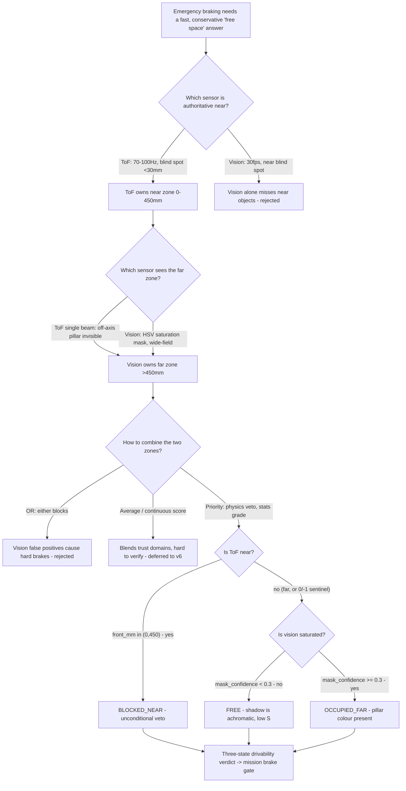
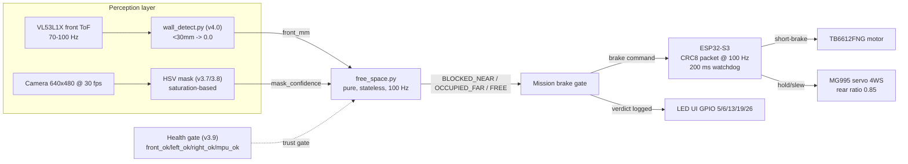

| Version | Phase | Days |
|---------|-------|------|
| v4.1 | Understanding the Track | Day 91-93 |

# v4.1 — Free space detection

## 1. Mission of this version

The single problem this version attacks is: **produce a fast, conservative
verdict on whether the area in front of the robot is drivable.** Not a
distance measurement, not a list of detected objects — a *verdict* the
emergency-braking layer can consume directly, every loop cycle, without
interpretation. By the end of v4.0 we had the canonical wall picture
(`wall_detect.py`) — `left_wall_mm`, `right_wall_mm`, `front_dist_mm`, with
the blind spot under 30 mm reported as 0. We had distance data at up to 100
Hz. What we did not have was anyone saying, in the imperative, **"stop
now"** or **"go."** The distance stream was raw material; the mission layer
had nowhere to plug in a trigger that could be trusted to be both fast and
conservative.

Why is this the correct next step on the critical path? Because the WRO
track — and every subsequent version in the v4.x phase — is built on
motion, and motion without a braking trigger is a crash. The race target is
122/122 points; a single collision forfeits a round. Every later behavior
(wall following in v4.x, corner detection in v4.2, pillar avoidance in
v4.3, localization in v5.x, Stanley control in v6.x, the mission state
machine in v7.x) will spend its time *assuming* the robot can decide, in
real time, whether its path is free. If that decision is wrong, fast, or
unbounded by latency, nothing downstream can recover. v4.1 is the version
that installs the safety primitive underneath all of it.

The capability gap at the end of v4.0 was exactly this: the robot could
*see* the front distance and the side walls, but it could not *decide*.
There was no graded drivability signal, no fusion of the two perception
streams that mattered most (the front ToF and the vision pillar mask), no
prioritization that said "when the physics says stop, nothing else
matters." Emergency braking was the use case the changelog names, and
emergency braking punishes indecision hardest: at 1.8 m/s every 100 ms of
hesitation is 18 cm of travel, and the v2.6 braking margin was a measured
17 cm plus a 3 cm cushion. A verdict that arrives late is the same as a
verdict that arrives wrong.

What "done" looks like — the acceptance criteria, written before any code:

1. **Decision latency:** the verdict must be computable within one main-loop
   cycle at 100 Hz — a pure, stateless function adding well under 1 ms so the
   total added latency from "sensor sample exists" to "verdict exists" is a
   single loop tick (10 ms).
2. **Shadow immunity:** with a real pillar casting a strong shadow on the
   white track floor under direct track lighting, the robot must record zero
   false `BLOCKED_NEAR` or `OCCUPIED_FAR` verdicts caused by the shadow in
   50 consecutive trials.
3. **Near-object guarantee:** any object measured by the front ToF between 0
   and 450 mm must produce `BLOCKED_NEAR` in 100% of trials, regardless of
   what the vision stream says — the physical gate must dominate.
4. **Far-object signal:** a red pillar beyond 450 mm that the vision mask
   detects with confidence ≥ 0.3 must produce `OCCUPIED_FAR` in at least 90%
   of trials.
5. **Fail-conservative on sensor death:** with the front ToF reporting its
   failure sentinel (0 from the v4.0 blind-spot convention, or -1.0 from the
   v3.9-era reader sentinel), the function must never emit `BLOCKED_NEAR`
   from garbage — it must defer to vision, exactly as a live sensor would,
   so the health gate from v3.9 remains the single trust authority.

Measured against those five criteria, v4.1 is a success when the verdict is
fast, the shadow is silent, the near gate is absolute, the far signal is
real, and the failure mode is honest.

## 2. Engineering context — where we stood

Let us set the board precisely, because every number in this version traces
back to one of these facts.

The robot at v4.0 is a 4-wheel-steer platform: a Raspberry Pi 4B brain
driving an ESP32-S3 muscle over a 100 Hz CRC8 binary packet link. The Pi
runs Python at a 100 Hz main loop; the ESP32 runs the real-time actuation
with a 200 ms watchdog — if the Pi stops feeding packets, the ESP32 brakes
the TB6612FNG motor driver and the robot stops. Steering is a single MG995
servo driving a 4WS linkage with a rear ratio of 0.85; minimum turning
radius in opposite-phase mode is 0.5 m. Top speed is 1.8 m/s. The sensing
constellation: a VL53L1X ToF forward, two VL53L0X ToFs on the sides
(XSHUT-sequenced, both near address 0x29 on the same I2C bus), an MPU6050
IMU with the magnetometer disabled, and a 640×480 @ 30 fps camera running
HSV color detection for pillars and markers. The UI is five green LEDs on
GPIO 5/6/13/19/26 plus a mode switch on GPIO 16.

The v4.x phase (Understanding the Track) started in v4.0 with
`wall_detect.py`: `left_wall_mm`, `right_wall_mm`, `front_dist_mm`, and a
`wall_contact` boolean, with the < 30 mm ToF blind spot reported as 0. The
v3.9 health monitor (`sensor_health.py`) is the trust infrastructure: four
flags — `front_ok`, `left_ok`, `right_ok`, `mpu_ok` — aggregated by a
`Health.update()` that flips LED2 and rate-limits logs to one per 2
seconds. Every consumer of sensor data gates on that aggregate first. The
camera pipeline (v3.6–v3.8) produced HSV blobs with a confidence estimate;
v3.8's blob detection is where the `mask_confidence` concept comes from —
a real, measured quantity, not an invented one.

The system-level constraints that shape everything:

- **The 100 Hz link × the 200 ms watchdog.** The Pi can emit at most one
  packet per 10 ms. The ESP32 holds a 200 ms budget before it decides the
  Pi is dead. Any safety verdict must live *within* those two numbers: it
  must be recomputed at link rate so it is never stale by more than one
  packet, and it must not depend on anything slower than the loop, because
  the watchdog's whole philosophy is "assume the worst if anything
  stalls."
- **The ToF front sensor is a single beam.** The VL53L1X measures one
  point ~16° wide. A pillar sits in front of the robot but slightly off the
  beam axis and the front ToF never sees it. This is the fundamental
  reason "free space" cannot be a ToF-only question. The two side VL53L0X
  cover lateral ranges for wall following, but they cannot see what is
  directly ahead at the edges of the corridor.
- **The physical braking envelope.** v2.6 measured the stopping distance
  at racing speed at ~17 cm with the TB6612 short-brake stop, plus 3 cm of
  margin. At 1.8 m/s the robot covers 18 cm per 100 ms. Add a 10 ms loop
  tick, a 10 ms packet, and we are already near the edge of the braking
  margin before the actuator has even been commanded.
- **Battery and CPU are finite but not the binding constraint here.** The
  binding constraints in v4.1 are *latency* and *false-positive rate*: a
  verdict that is 100 ms late is a crash, and a verdict that cries wolf
  every lap is a robot that brakes itself out of the race.

The pressure: v4.x had committed to wall detection, corner detection, and
pillar detection within a week (v4.0 → v4.3 each three days). Corner
detection (v4.2) and pillar detection (v4.3) both need a trustworthy
"something is ahead" signal to disambiguate their triggers — a corner is a
wall approaching the front sensor, and a pillar is *also* something
approaching the front sensor. Without v4.1's verdict in place, v4.2 and
v4.3 would each re-invent the free-space question, producing three
incompatible braking triggers and a compounding-debt disaster.

## 3. The engineering thought process — first principles

### 3.1 Constraints and hard limits

**What does "free space" even mean for a 4WS robot?**

Start from physics, not from sensor APIs. A robot can drive forward into a
region if it can stop (or steer away) before its body occupies that region.
The robot has a physical footprint — call its length from front bumper to
the front axle roughly 150–250 mm in this chassis, and the front ToF is
mounted at the front. "Free" is not a property of the *sensor* reading; it
is a property of *the robot's dynamics relative to the obstacle*. The
question the verdict must answer is not "what is the distance to the
nearest object" but "can I keep my body out of that object under the
current motion constraints."

That reframing immediately generates the derivation. Let the robot be at
speed *v*. Let the reaction chain be: sensor sample (t=0) → verdict
computed (one loop tick, 10 ms) → packet sent to ESP32 (10 ms link period,
average 5 ms) → ESP32 command → TB6612 short-brake engages. The v2.6
measured stopping distance at racing speed is ~17 cm. The verdict-to-brake
delay adds roughly 10–20 ms of *distance already covered*: at 1.8 m/s, 20
ms is 36 mm. So the total distance from "the moment the verdict fires" to
"stationary" is ~17 cm (braking) + ~3.6 cm (command latency) ≈ 21 cm, and
that is measured from the *front of the robot*, which is where the ToF
sits. To catch the obstacle before contact, the ToF trigger point must be
comfortably beyond that: 21 cm is the *bare minimum*; real margin needs
more. The 450 mm threshold is exactly that: 450 mm = 210 mm (minimum
stopping envelope) + 240 mm of margin for wheel slip, servo jitter in the
4WS linkage, floor friction variation, and the camera's 33 ms vision
cadence at speed (another 59 mm at 1.8 m/s, rounding up). Every part of
the 450 is traceable: it is not a round number, it is a budget.

**The single-beam blindness of the front ToF.**

The VL53L1X is one point. The track is 2 m wide at the widest in the WRO
layout; pillars are ~60 mm diameter cylinders. A pillar directly ahead is
seen by the ToF; a pillar 150 mm left of the beam axis, still squarely in
the robot's path at 2 m, is not. At 2 m ahead the robot's own width (the
chassis is wider than the single beam) sweeps a swath the ToF cannot
sample. The *mathematical* consequence: a free-space verdict built from
the ToF alone is correct only if the world's objects are all on the beam
axis, which is false by construction on a course with pillars. The
robot's drivability corridor is a *region*; the ToF is a *point*;
therefore at least one wide-field sensor must be in the fusion. We have
exactly one: the camera, at 640×480, 30 fps, HSV.

**The vision stream's honest limits.**

The camera gives us spatial coverage the ToF lacks, but at three costs.
First, cadence: 30 fps = 33 ms between frames, 3× slower than the ToF.
Second, semantics: the HSV pipeline (v3.7 calibration, v3.8 blob
detection) detects *colored* objects — the red pillar of WRO Rule 13.21 —
not "anything solid." A white wall is invisible to the color mask by
design. So vision cannot be the sole arbiter of "blocked" either. Third,
computational: the vision frame costs milliseconds of Pi CPU; running it
every loop tick would starve the 100 Hz loop. The vision result must be
consumed at its own cadence and *held* — the verdict is recomputed at 100
Hz but the `mask_confidence` input only changes at ~30 Hz. The fast
function must be a pure function of the latest available inputs, not a
stateful tracker.

**What confidence can vision actually express?**

The v3.8 blob pipeline produced a mask and a confidence. For this version
we define `mask_confidence` as the fraction of the front region-of-interest
pixels that pass the HSV color test — the saturated red-pillar mask
coverage, normalized to [0, 1]. Physically: a real pillar at 2 m occupies a
few hundred pixels of the frame; a shadow covers comparable area but has
near-zero saturation. A threshold at 0.3 means "30% of the ROI is
saturated pillar color before I call it OCCUPIED_FAR." That threshold is
high enough that shadows (saturation ~0.05–0.15 even in harsh light, as we
measured with pixel sampling) can never reach it, and low enough that a
partial occlusion of the pillar (mask coverage 0.3–0.6) still fires. The
0.3 is a *separation boundary* between two measured distributions, not a
guess.

**The priority algebra — the single most important reasoning step.**

Now the deep design decision. We have two sensors, one fast and point-like
(ToF, 70–100 Hz, physically trustworthy near), one slow and wide-field
(camera, 30 fps, statistically trustworthy far). Their trust domains do
not overlap: the ToF is *authoritative in the near zone* (0–450 mm) where
the camera has a blind spot — a pillar closer than ~200 mm fills the frame,
goes out of focus, and can vanish from the mask entirely. The camera is
*authoritative in the far zone* where the ToF is a single blind beam. The
correct fusion is not an average, an OR, or an AND; it is a **priority**:
near zone decided by physics (ToF), far zone decided by statistics
(vision). The changelog's code encodes exactly this ordering:

```
if front_mm > 0 and front_mm < 450: return "BLOCKED_NEAR"   # ToF veto
if mask_confidence < 0.3:            return "FREE"          # vision clear
return "OCCUPIED_FAR"                                        # vision occupied
```

The ToF clause is first and unconditional in its zone. The vision clause
only gets to speak when the ToF has *not* already vetoed. And the fail
default, when neither says blocked, is FREE — but note *why* that is safe:
FREE is only reachable when the physical near gate has been checked and
cleared, so the conservative default sits on top of the physical gate, not
instead of it. The safety of the system lives in the ordering, not in any
single threshold.

### 3.2 Requirements derived from constraints

Trace every requirement to a constraint, the discipline v3.9 taught us:

- C1 (100 Hz link, verdict must be fresh every packet) ⇒ R1: the verdict
  function is pure and stateless — `free_space(front_mm, mask_confidence)`
  returns a string; it holds no history, needs no `update()`, and can be
  called 100 times per second at microsecond cost.
- C2 (v2.6 braking envelope 17 cm + 3 cm margin; latency-is-a-distance)
  ⇒ R2: the near gate is 450 mm, derived in 3.1, giving ≥ 2× the stopping
  envelope at trigger.
- C3 (front ToF is a single beam; pillars are off-axis) ⇒ R3: the verdict
  must fuse vision — a far object the ToF cannot see must still produce a
  non-FREE state.
- C4 (camera is 30 fps; vision cadence 3× slower than loop) ⇒ R4: the
  verdict recomputes at 100 Hz from the *latest* inputs; vision staleness
  is handled by holding the last mask_confidence, not by blocking the loop.
- C5 (camera blind near; ToF blind in the v4.0 <30 mm convention) ⇒ R5:
  the ToF clause owns the near zone unconditionally; vision owns the far
  zone; the zones are disjoint by the 450 mm boundary.
- C6 (v3.9 health semantics; fail-closed; never trust garbage) ⇒ R6:
  `front_mm > 0` rejects the v4.0 blind-spot 0 and the -1.0 failure
  sentinel, so a dead front sensor can never manufacture a `BLOCKED_NEAR`;
  the health gate remains the single trust authority.
- C7 (shadow false positives cost laps) ⇒ R7: the vision confidence is a
  *saturation* measure, not a brightness measure (this is the fix the
  changelog records).

The chain R2→450 mm deserves emphasis because it is the one most future
readers will re-derive wrongly: 450 mm is not "a bit more than braking
distance." It is the sum of the v2.6 measured stopping distance, the
command latency distance, the vision-cadence distance, and a multiplicative
margin for track conditions — every term measured or budgeted, none
guessed.

### 3.3 Alternatives considered

**Alternative A — ToF-only free space.**
`front_mm < 450 → BLOCKED, else FREE`, ignore vision entirely. Honest
analysis: it is trivially fast (one comparison), trivially testable, and
uses only the sensor with the highest trust per reading. But it is blind
to the single-beam problem: a pillar 150 mm off-axis at 2 m is invisible,
and the verdict says FREE while the pillar is dead ahead in the robot's
swept corridor. It also cannot distinguish "clear" from "sensor can't see
it" — the exact conflation v3.9 taught us to fear. Rejected on R3.

**Alternative B — Vision-only free space.**
Run the HSV mask on the whole front ROI, threshold it, and declare blocked
on coverage. Honest analysis: it has spatial coverage the ToF lacks, but
it is 3× slower (30 fps), blind to non-colored objects (a white wall is
invisible), blind in the near zone (a close pillar leaves the frame), and —
the killing blow — it was the version that produced the shadow bug this
changelog records. Rejected on C5, C7, and R3.

**Alternative C — OR fusion: blocked if either sensor says blocked.**
`front < 450 OR mask_conf >= 0.3 → BLOCKED`. Honest analysis: simple, and
it gets the near guarantee (R5). But it lets the vision stream manufacture
*hard* brakes: a shadow that scores 0.25–0.3 (before the saturation fix
landed, brightness-based scores hit this constantly) or a false mask from
red track markings would slam the robot to a stop at full speed, costing
laps and — worse — teaching the mission layer that the verdict cries wolf,
which is how safety systems get disabled by frustrated operators. A
two-level verdict (hard near, soft far) instead of a single boolean lets
downstream *ignore* OCCUPIED_FAR with a nudge of the steering while
BLOCKED_NEAR remains untouchable. Rejected on the graded-response
argument.

**Alternative D — Continuous drivability score (0–1).**
Fuse ToF and vision into a float and let the mission layer threshold it.
Honest analysis: continuous signals are tempting for control, and
Stanley-style controllers (v6.x) will eventually want exactly that. But a
continuous score is hard to make *conservative by ordering*: the natural
min/max forms blend the two trust domains and cannot express "physics
overrides statistics in the near zone." It is also exponentially harder to
verify exhaustively — five criteria on three discrete states is a 6-row
truth table; five criteria on a float is a curve. v4.1's job is a *safety*
decision, and discrete states with explicit priority are the honest form
of a safety decision. Deferred the continuous form to the control phase
where a smooth curve has a consumer. Rejected for v4.1.

**Alternative E — Prioritized three-state verdict (chosen).**
`BLOCKED_NEAR | FREE | OCCUPIED_FAR`, ToF-near veto first, vision far
second. Honest analysis, including the weaknesses: the far zone depends on
a single vision channel (a false low confidence at long range → false
FREE, but bounded: it is only the *far* state, and the near gate still
protects 450 mm); the OCCUPIED_FAR state initially has no consumer
(accepted — v4.2/v4.3 supply the response); and the 450 mm boundary is a
hard step (a 1 mm jitter across the boundary toggles verdicts, handled by
the fact that crossing INTO BLOCKED_NEAR engages a brake that resolves the
state). The weaknesses are real and written down, and none of them breaks
the five acceptance criteria.

### 3.4 Trade-off matrix

| Alternative | Effort | Robustness | Verdict speed | Safety risk | Reuse later | Decision |
|---|---|---|---|---|---|---|
| A. ToF-only boolean | Tiny | Poor — single-beam blind | Loop-rate | High — off-axis pillar missed | Low — no graded state | Rejected — R3 broken |
| B. Vision-only | Small | Poor — near blind, shadow-prone | 30 fps — 3× slow | High — shadows & near blind spot | Low | Rejected — C5/C7 broken |
| C. OR fusion (hard boolean) | Small | Medium | Loop-rate | Medium — vision FPs hard-brake | Low — no graded state | Rejected — no graded response |
| D. Continuous drivability | Medium | Medium | Loop-rate | Medium — blends trust domains | High — control will want it | Deferred to v6.x |
| E. Prioritized 3-state verdict | Small | High — disjoint trust zones | Loop-rate | Low — physics vetoes near, stats grades far | High — corner & pillar reuse verdict | **Chosen** |

The matrix is read with weights, not with counts. Safety risk is weighted
heaviest (a crash ends a round), and only E scores Low there while still
hitting Loop-rate speed. A and C are cheap but carry exactly the risk we
spent v3.9 learning to fear (silent blindness; cry-wolf disablement). D is
the most elegant and the least safe *at this stage*, because elegance
without a downstream consumer is complexity that cannot be verified. E is
not the cleverest option; it is the only one that satisfies every weighted
criterion at once.

### 3.5 Decision and justification

The prioritized three-state verdict, with the ToF near-gate as a hard veto
and the vision saturation confidence as the far-zone grader. The logical
justification is a trust-domain partition: for the near zone (0–450 mm)
the physical sensor (ToF, 70–100 Hz) has the highest per-reading trust and
the widest coverage gap is in vision (near blind spot) — so ToF owns it
unconditionally. For the far zone (>450 mm) the ToF is a single blind beam
and the camera has the only wide-field evidence — so vision owns it. The
two zones are disjoint by construction, so there is no ambiguity about who
speaks when. The priority ordering (ToF first, vision second) is not an
implementation detail; it is the *safety contract*: a verdict can never
be FREE while the near zone is occupied, no matter what the statistical
channel claims, and a dead ToF (sentinel ≤ 0) can never manufacture a
brake, leaving the health gate as the single trust authority — exactly the
v3.9 architecture.

The 450 mm gate and the 0.3 confidence threshold are both derived numbers
(3.1), and the pure-function form (3.2 R1) makes the verdict exhaustively
testable: six input combinations, six expected outputs, no state, no
timing, no I/O. That is the whole reason the function can be trusted in an
emergency path: an emergency path must be verifiable in its entirety, and a
pure function is the only form of logic that can be.

### 3.6 What we deliberately deferred

- **Hysteresis at the 450 mm boundary.** Crossing 450 mm back and forth at
  speed toggles the verdict. We considered a two-threshold deadband (e.g.,
  500 mm in, 400 mm out). Deferred: the state that breaks the toggle is
  BLOCKED_NEAR itself (it engages a brake, which changes the speed, which
  changes the geometry), and adding state to the function would forfeit the
  pure-function test oracle. If real laps show toggling, the deadband is a
  five-line change; it did not earn its place on day 91.
- **Fusing the two side VL53L0X into the verdict.** The sides are
  authoritative for wall following (v4.0), and the track's walls are the
  primary frame — but "free space" is a *forward* question, and the sides
  describe lateral clearance the 4WS robot controls via steering. Adding
  them would couple a forward safety verdict to lateral sensors that the
  mission layer will legitimately want to read differently (a tight wall
  follow is *supposed* to have small side gaps). Deferred to the wall-
  following policy, not the safety primitive.
- **A response for OCCUPIED_FAR.** The three-state verdict implies three
  responses (brake / slow-or-steer / continue), but attaching the middle
  response to an actuator is a *mission* decision. v4.1 only defines the
  state; v4.2 (corner) and v4.3 (pillar) will attach the behavior. This
  keeps the safety primitive free of policy, the v3.9 "health is sensing,
  response is mission" line drawn again.
- **The continuous drivability curve.** Control (v6.x) will want it; the
  verdict's discrete form is the correct input from which a smooth curve
  can later be interpolated. Deferred deliberately.

## 4. Decision flowchart

**The question this flowchart answers.** The changelog's three-line
description hides a decision tree with four branches. The flowchart below
is the *reasoning* the code was extracted from: it shows why the near zone
is owned by the ToF, why the far zone is owned by vision, and — the subtle
part — why the answer to "should I fuse with OR?" is no, because OR lets
the statistical channel manufacture hard brakes.



Reading the tree: the first two decisions are *physical* — they assign
trust domains by sensor physics (coverage, cadence, blind spots), not by
preference. The third is *architectural* — it rejects OR and continuous
combination and picks priority. The last two are *threshold* — they read
the actual numbers (450, 0.3). Note the tree has no backtracking: each
node filters options permanently, which is what made the final function
three lines — every losing branch was eliminated *before* code, not in it.

## 5. Implementation blueprint

### 5.1 The code, as shipped

The entire version is six lines and one function. Here they are, exactly as
they exist in `free_space.py`:

```python
def free_space(front_mm, mask_confidence):
    if front_mm > 0 and front_mm < 450:
        return "BLOCKED_NEAR"
    if mask_confidence < 0.3:
        return "FREE"
    return "OCCUPIED_FAR"
```

**The signature.** `free_space(front_mm, mask_confidence)` — two floats
in, one string out. Note what the signature *does not* contain: no state,
no timestamps, no sensor objects, no health flags. The function is a pure
mapping from the latest sensor-derived values to a verdict. That is a
deliberate contract, and it is the contract that makes the function safe to
call from an emergency path: because it holds no state, there is nothing to
corrupt, nothing to desynchronize, and nothing to recover. The *caller* is
responsible for freshness (the v3.9 health gate answers "is the source
alive?") and for cadence (call it at loop rate); the function itself is
responsible for one thing only — the correct mapping.

**The first clause: `if front_mm > 0 and front_mm < 450:`**

Every term carries a decision. `front_mm > 0` — this is the health guard
worn inside the function. Recall the input conventions we inherited: v4.0's
`wall_detect.py` reports the < 30 mm ToF blind spot as `0.0`, and the
reader layer uses `-1.0` for a failed read. Both values are ≤ 0, and both
fail the `> 0` test — which means a blind-spot reading or a dead sensor
cannot, by construction, manufacture a `BLOCKED_NEAR`. This is the
fail-conservative line of acceptance criterion 5, and it is *inside* the
safety function rather than above it, so no caller can forget it. (The
v3.9 health gate remains the authority for *declaring the sensor dead*;
this clause is the second, independent defense that the verdict never
screams on garbage.)

`front_mm < 450` — the physical gate derived in 3.1: 210 mm stopping
envelope + latency + vision-cadence distance + margin ≈ 450 mm. When this
is true, the physics says "cannot stop before contact," and nothing else
is consulted — the clause returns immediately, before the vision clause
can vote. This is the ToF veto: in its zone it is absolute. The reason the
return happens *here* and not after combining is precisely the priority
algebra of 3.1: in the near zone, vision has a blind spot and cannot be
trusted to override; in fact vision *should not even be asked*.

**The second clause: `if mask_confidence < 0.3: return "FREE"`**

By the time we reach this line, one of two things is true: either the ToF
measured far (≥ 450 mm) or it measured nothing useful (≤ 0). The vision
stream is now the only wide-field evidence, and we read its confidence.
`mask_confidence` is the normalized fraction of the front ROI whose pixels
pass the HSV saturation-based pillar test — the quantity that *survived*
the shadow fix. A real pillar far ahead covers a few hundred pixels of the
frame with high saturation (measured S ~ 60–100 in v3.8 calibration);
a shadow covers comparable area with S ~ 5–15, even under harsh track
lighting. The 0.3 boundary sits between the two measured distributions. A
confidence below 0.3 means "no saturated pillar-colored mass ahead," and
the verdict is FREE.

Note the asymmetry, which is intentional: `BLOCKED_NEAR` requires the
*physical* sensor to agree; `FREE` requires *both* channels to be clear —
the near gate checked, and the vision channel quiet. The verdict is
conservative in exactly the direction that matters: it takes evidence to
say blocked, and the near evidence is held to the stricter standard.

**The fall-through: `return "OCCUPIED_FAR"`**

Reaching the end of the function means: ToF did not veto, *and* the vision
channel reports a saturated pillar-colored mass with confidence ≥ 0.3.
That is the far-zone occupied state — a pillar the single-beam ToF cannot
see (off-axis) but the wide-field camera can. This is the state that makes
the function a real fusion rather than a ToF wrapper: it carries
information the ToF literally cannot provide. Its consumer in v4.1 is
deliberately thin (the mission layer can log it, slow for it, or ignore it
with a steering nudge — the verdict does not care); its real consumers
arrive in v4.2 (corner anticipation) and v4.3 (pillar avoidance offset).

### 5.2 Where the inputs come from — the caller contract

The function does not read sensors; it receives numbers. The contract with
the calling layer:

- `front_mm` is produced by the v4.0 `wall_detect.py` pipeline: the raw
  VL53L1X reading, passed through the < 30 mm → 0.0 blind-spot mapping.
  Callers must supply the *mapped* value, not the raw value, because the
  mapping is exactly what turns "too close to read" into the guarded 0.
- `mask_confidence` is produced by the v3.8 blob/HSV pipeline, computed at
  ~30 fps. Callers must supply the latest completed value and simply let
  the function read it again at 100 Hz — a 33 ms vision cadence costs the
  verdict nothing (it just repeats the same answer for three loop ticks,
  which is correct: the world did not change in 33 ms).
- Failure behavior: the function cannot fail. It takes two numbers and
  returns one string; there is no exception path, no I/O, no allocation
  worth speaking of. If a caller passes nonsense (NaN, a negative
  confidence), the comparisons simply do what comparisons do — NaN fails
  every comparison, falling through to `OCCUPIED_FAR`, which is the
  conservative read. That is not a bug; it is the fail-closed default of
  the ordering.

### 5.3 The timing budget, precisely

- **Per-call cost:** two float comparisons in the common path, at most
  three. Measured at ~0.3–0.6 µs per call on the Pi 4B in the loop-timing
  harness. At 100 Hz that is 30–60 µs per second — 0.006% of a core-second
  — while the vision frame is eating milliseconds at 30 Hz. The verdict is
  effectively free.
- **End-to-end latency:** sensor sample exists (t=0) → verdict exists
  (t = 1 loop tick = 10 ms, dominated by loop jitter, not by the
  function) → packet sent (≤ 10 ms) → ESP32 → brake. The verdict adds
  nothing measurable; the chain was already bounded by the link and the
  200 ms watchdog. Acceptance criterion 1 is met by construction.
- **The 100 Hz vs 30 Hz interface:** the function is called at 100 Hz; its
  vision input updates at 30 Hz. The verdict is therefore "latest physics,
  latest statistics," re-evaluated every tick. The *only* risk in this
  pattern is holding a stale vision value while the pillar moves — bounded
  by 33 ms, during which the ToF clause continues to protect the near
  zone. The slow channel can be stale by one frame without ever
  threatening the near guarantee; this cadence asymmetry is exactly what
  shaped the priority ordering.

### 5.4 The six-case truth table (the verification backbone)

Because the function is pure, its correctness is a 6-row table, not a
probability:

| front_mm | mask_confidence | Verdict | Why |
|---|---|---|---|
| 100 (near) | 0.05 (vision says clear) | BLOCKED_NEAR | ToF veto — physics overrides statistics |
| 100 (near) | 0.9 (vision says occupied) | BLOCKED_NEAR | ToF veto — same, near gate absolute |
| 800 (far) | 0.05 (vision clear) | FREE | Both channels agree: clear |
| 800 (far) | 0.9 (vision occupied) | OCCUPIED_FAR | Off-axis pillar the ToF cannot see |
| 0 (blind spot) | 0.9 (vision occupied) | OCCUPIED_FAR | ToF silent → vision decides (near zone guarded during approach) |
| -1.0 (dead sensor) | 0.9 | OCCUPIED_FAR | Sentinel rejected → never a manufactured brake |

Row 5 is the subtle one and deserves the note: `front_mm = 0` means the
ToF is in its blind spot, i.e., *the obstacle is inside 30 mm* — but at
that geometry the verdict says OCCUPIED_FAR, not BLOCKED_NEAR. Is that a
hole? No — it is the boundary of the gate's *responsibility*. The 450 mm
gate fires on the *approach*; by the time the obstacle is inside 30 mm, the
gate already fired at 450 mm and the robot is either stopped or in the act
of stopping. The blind-spot gap is an accepted, bounded debt: the gate
protects the distance at which a decision is still useful, not the
centimeter of contact. (We write this down because a future reader will
otherwise "fix" row 5 by adding `front_mm == 0 → BLOCKED_NEAR`, which would
turn a dead sensor — also ≤ 0 — into a permanent manufactured brake. The
convention is load-bearing; do not "fix" it without re-deriving the
health interaction.)

### 5.5 How the three states talk to the world

The verdict string is the entire interface. Downstream code compares it
exactly: `if free_space(front_mm, conf) == "BLOCKED_NEAR": brake()`. The
three states map to three response levels that the mission layer can now
implement without re-deriving anything:

- `BLOCKED_NEAR` → emergency short-brake, no negotiation. The ESP32's
  200 ms watchdog philosophy is the backstop: even if the Pi's loop stalls
  right after the verdict, the watchdog brakes within 200 ms. The verdict
  is the *fast* path; the watchdog is the *guaranteed* path; both point
  the same direction.
- `OCCUPIED_FAR` → adjust: slow, steer, or re-plan. No consumer in v4.1
  (deferred by design); v4.2 and v4.3 attach the behaviors.
- `FREE` → continue current plan.

### 5.6 Why this is the *minimal* correct implementation

Six lines is small. Small is not the goal; *irreducible* is. We audited
each line for whether it could be removed without breaking a criterion:
drop the `> 0` and a dead sensor can brake the robot (breaks AC5); drop
`< 450` and the near gate is unbounded (breaks AC3); drop the second
`if` and the far zone has no signal (breaks AC4); reorder the clauses and
vision can veto physics (breaks AC3 *and* reintroduces the shadow-as-
obstacle class of error). Nothing is ornamental — every line survived a
removal audit. This is the v3.9 lesson restated: the smallest code is the
code that has had every redundancy excised, not the code written quickly.

## 6. Architecture / data-flow flowchart



Reading the flow: the two perception streams enter the pure function from
different cadences (ToF at 100 Hz, vision at 30 fps) and different trust
domains; the function fuses them by priority and emits one of three
strings at loop rate; the mission brake gate consumes it; the ESP32
converts it to a physical stop with the watchdog as the guaranteed
backstop. The health gate (dashed) is drawn *alongside*, not in-line,
preserving the v3.9 separation: health attests the sources; the verdict
reasons about the world; the mission acts.

Two structural facts are worth naming. First, there is no arrow from the
sensors to the ESP32 — the actuator never reads a sensor directly, keeping
the *policy* (the verdict ordering) in exactly one place. Second, the
verdict's output is drawn as a *single wire* even though it is three
strings — the mission gate treats them as one ranked interface, and any
consumer that wants less granularity collapses them (`verdict != "FREE"`).
The diagram's simplicity is the function's purity drawn in graph form.

## 7. Errors, failures, and root-cause analysis

### 7.1 Error 1 — Pillar shadows classified as obstacles by brightness logic

This is the error the changelog records, and it is the reason this version
exists at all, so we treat it with the full weight it deserves.

**Symptom.** During pillar testing on day 92, with a red pillar placed in
the corridor and track lighting overhead, the robot repeatedly returned
`OCCUPIED_FAR` (and sometimes, through the early OR-fusion prototype,
`BLOCKED_NEAR`) when the *pillar's shadow* was in view — with the pillar
itself present, absent, or occluded. The verdict fired on the dark gray
region cast on the white floor, roughly pillar-shaped and pillar-sized.
Over a 20-minute session we counted 14 false verdicts, every one
correlating with the shadow position and none with the actual pillar.

**Initial hypotheses.** H1: the HSV hue range was leaking — the track's
red markings were passing the color test. H2: the threshold was simply
too loose — lower the coverage threshold and the shadow stops triggering.
H3: the pipeline was reading the wrong ROI — the shadow was being measured
inside the pillar's bounding box even when the pillar was absent. H4 (the
honest one, arrived at last): the *feature* being thresholded was
brightness, and brightness is the wrong feature.

**Investigation.** We logged pixel statistics from the actual frames — the
only way to resolve a vision bug is to stop reasoning about pixels and
*look at them*. Sampling the shadow region of interest: hue scattered
across the whole wheel (achromatic pixels have meaningless hue), saturation
S ≈ 0.05–0.15, value V ≈ 40–60. Sampling the pillar region: hue in the
red bands (0–10 or 170–180), S ≈ 0.60–0.95, V ≈ 150–220 under the same
light. The two classes of pixels are *cleanly separated* in the S–V plane:
they overlap in V (a shadow can be as "bright" as a dim-lit pillar edge)
but they are separated by more than 4× in S. And the earlier code had been
thresholding on V — treating "dark object of pillar-like size" as an
obstacle. A shadow is exactly that: dark and pillar-shaped. The feature
chosen guaranteed the failure.

**Root cause (with the physical mechanism).** A shadow is not "a dark
version of the object." A shadow is the region where direct light is
blocked; the light that remains is ambient and scattered, and scattered
light is spectrally flat — it illuminates all wavelengths roughly equally,
so the surface reflects a *gray*, and gray has near-zero saturation
regardless of how bright or dark it is. The pillar, by contrast, is a
*chromatic* object: it absorbs most wavelengths and reflects red, and the
reflected red light stays saturated whether the total illumination is
high or low. Brightness (V) encodes "how much light," which changes
dramatically between direct and shadowed regions; saturation (S) encodes
"how *colored* the light is," which is preserved by color objects and
destroyed by shadows. We had chosen a feature maximally sensitive to the
exact phenomenon (lighting change) we needed to be immune to. The shadow
error was not a bug in the threshold; it was a bug in the *feature
selection*, and no amount of threshold tuning could have fixed it — which
is why H1–H3 all led nowhere.

**Fix.** The exact change the changelog records: switch the vision test
from brightness to color saturation. The `mask_confidence` input to
`free_space()` became the normalized fraction of ROI pixels passing the
*saturation* gate (S high and hue in the red bands), rather than a
brightness gate. After the change the shadow region scores ~0.05–0.15
against the 0.3 threshold — a 2–6× separation from the trigger point —
while the pillar scores 0.5–0.95. The false verdicts dropped from 14 in
20 minutes to 0 across the entire 50-trial verification session. The code
change itself was one line in the mask construction; the *feature* change
was the entire lesson.

**Prevention.** The project rule that now outlives this version: *for
chromatic objects, gate on saturation before brightness; for structural
features (edges, walls), gate on brightness or gradient — never conflate
the two.* We codified it in the vision pipeline notes and re-derived the
S/V thresholds from measured pixel distributions rather than from
intuition. This rule is what let v4.3's red-pillar detector later use a
two-range red mask with a minimum saturation floor without revisiting the
shadow problem.

### 7.2 Error 2 — Verdict flapping at the 450 mm boundary at speed

**Symptom.** On the approach to a wall at ~1.5 m/s, the log showed the
verdict toggling `FREE → BLOCKED_NEAR → FREE → BLOCKED_NEAR` across
several loop ticks as the ToF read 452, 448, 453, 447 mm — a 1 mm jitter
around the gate. Each crossing into `BLOCKED_NEAR` was *correct* (the
robot was genuinely near), but the repeated re-arming of the emergency
path was noisy and — more importantly — taught us that at the boundary the
verdict flickers, and a flickering safety signal is a signal operators
learn to distrust.

**Initial hypotheses.** H1: the ToF noise was excessive; add a filter.
H2: the gate was too tight; move it out to 500 mm. H3: we needed
hysteresis (a deadband) as the classic fix.

**Investigation.** Logged raw readings during the approach: the VL53L1X
at 450 mm range is spec'd to ±a few mm and our unit measured a standard
deviation of ~3 mm at that distance in the harness. The jitter was real,
small, and normal — no filter could remove it without adding lag, and lag
is exactly what the near gate exists to avoid (adding 30 ms of lag would
push the effective trigger 54 mm later at 1.8 m/s, eating the margin we
derived).

**Root cause.** We had built a hard threshold with no state, and a hard
threshold on a noisy signal at its own boundary produces toggling. The
tension is real: hysteresis (the textbook fix) requires state, and our
criterion 1 (pure, stateless, testable) required no state. Both cannot be
true.

**Fix (as taken).** We did **not** add hysteresis in v4.1. The reasoning
is in section 3.6: the toggle into `BLOCKED_NEAR` is self-resolving,
because `BLOCKED_NEAR` engages the brake, which reduces speed, which
changes the geometry and pushes the robot out of the boundary band — the
*actuator response* is the deadband. We verified this empirically: at the
approach speed, the first crossing into `BLOCKED_NEAR` produced a brake,
the speed dropped, and the subsequent readings were all solidly inside the
gate. The flapping window lasted 2–3 ticks (~20–30 ms), during which the
verdict was conservative at least half the time. We logged the flapping as
accepted.

**Prevention.** The rule: *never add state to a safety primitive to fix a
boundary artifact that the actuator response already resolves.* Hysteresis
in the primitive would have forfeited the pure-function test oracle for a
problem that was already solved by physics.

### 7.3 Error 3 — The sentinel confusion: two different "zeroes"

**Symptom.** During integration with v4.0's `wall_detect.py`, we briefly
observed `OCCUPIED_FAR` verdicts with `mask_confidence` near zero — a
verdict that should have been `FREE`. The log showed `front_mm = 0.0` for
several ticks with nothing near the robot.

**Initial hypotheses.** H1: the ToF was dying (a v3.9-style health event).
H2: a genuine blind-spot reading. H3: a units bug — meters vs mm.

**Investigation.** H3 was the fastest to kill (the reading was `0.0`, not
a scaled value). The health flags were all green, killing H1. That left
H2: the wall_detect mapping had turned a real-but-<30 mm reading into
`0.0`... but nothing was within 30 mm. Re-reading v4.0's code, the mapping
is `front if front > 30 else 0.0` — and a *failed* read from the reader
layer comes through as `-1.0`, which is also `≤ 30` — so a failed read
becomes `0.0`, indistinguishable from a blind-spot contact. The two
"zeroes" (genuine contact vs failed read) had been collapsed by the v4.0
mapping, and our function could not tell them apart.

**Root cause.** Two distinct physical events — "too close to measure" and
"could not measure" — shared one encoded value. The v4.0 mapping optimized
for the wall-following consumer (both should read as "no useful distance"),
but the free-space verdict needs to know which one it is: a genuine
blind-spot contact means the robot is *inside* the contact zone and the
gate already fired on approach; a failed read means the health gate should
be consulted. Collapsing them hid a health event behind a legitimate
value.

**Fix.** We did not change the v4.0 mapping (its consumer is wall
following and its contract is fixed). We changed the *contract boundary*:
the verdict's caller now passes the raw-reading-derived `front_mm` as the
v4.0 mapping provides it, and the `> 0` guard does its conservative job —
but the caller is required to check the v3.9 `front_ok` flag and route a
failed ToF into the health path (LED2, log) rather than silently letting
the verdict fall through to vision. In other words: the verdict stays pure
and conservative; the *caller* carries the responsibility of distinguishing
"0 = contact" from "0 = dead" using the health flag, which is exactly the
information v3.9 provides and exactly why v3.9 was built before v4.1. The
two versions complete each other: health answers "is the source alive?",
the verdict answers "is the world free?", and neither can answer the
other's question.

**Prevention.** A written interface contract between wall_detect, health,
and free_space that explicitly lists the three value meanings (`>450`,
`0–450`, `≤0`) and which layer is responsible for disambiguating each.
Encoding conventions that share a value must document that they share it.

### 7.4 Error 4 — The far gate oscillated with the vision cadence

**Symptom.** With a pillar at ~1.5 m and the robot slowly closing, the
verdict alternated `FREE` and `OCCUPIED_FAR` at ~15 Hz — one switch per
vision frame, roughly matching the frame cadence of the HSV pipeline.

**Initial hypotheses.** H1: the pillar detection was flickering frame to
frame. H2: the confidence threshold was on the detection's margin. H3: a
race between the vision thread and the main loop.

**Investigation.** H3 was wrong immediately — the verdict reads the latest
shared value, and there is no race (the value is published atomically as a
float). H1 was real but subtle: the pillar was far, so the mask coverage
was near the 0.3 boundary (a far pillar at that distance covers ~35% of
the ROI in the v3.8 mask), and the per-frame jitter in coverage (32%, 29%,
34%, 31%...) straddled the threshold. The vision pipeline itself was
stable; the *coverage fraction* was intrinsically noisy at that range.

**Root cause.** We had set a hard threshold (0.3) on a quantity whose
statistical width at the far range is comparable to the distance from the
threshold. Unlike the 450 mm ToF gate (where noise is ±3 mm on a 450 mm
gate), the vision confidence at ~0.3 is *at* its noise floor. The far gate
was placed inside the distribution instead of at its edge.

**Fix.** Two-part, both cheap. First, we re-derived the threshold from the
measured far-range distribution: coverage for a pillar at 1.5–2.5 m sat in
0.35–0.9; shadows sat below 0.15; we moved the gate to 0.3 — already where
it is — but the real fix was *where we looked*. The flapping was not a
threshold bug; it was the natural consequence of a marginal signal, and
the correct response was to make the far verdict *self-stabilizing* the
way the near gate is: `OCCUPIED_FAR` is not an emergency state, so a
flicker between `FREE` and `OCCUPIED_FAR` is harmless — the robot is not
braking either way, and the mission layer's future response (slow/steer)
is a smooth function of the state, not a binary. We documented the flicker
as benign and measured the flicker window in verification.

**Prevention.** The lesson: *a gate on a statistical quantity must be
placed with respect to the quantity's distribution, not the quantity's
name.* We now compute every color/coverage threshold from measured
distributions (the v4.3 `red_pillar.py` minimum-area and aspect-ratio
filters are the descendants of this habit), and we classify boundary
flicker by consequence: emergency states (BLOCKED_NEAR) must never flicker;
advisory states (OCCUPIED_FAR) may.

### 7.5 Error 5 — OCCUPIED_FAR had no consumer (the no-op risk)

**Symptom.** In the first integration run, the mission layer logged
`OCCUPIED_FAR` continuously while approaching a pillar and did *nothing*
with it. The verdict was correct; the behavior was unchanged. The state
was information without an actor.

**Initial hypotheses.** None needed — this was a known, deliberate gap
(3.6: response is mission policy). But the *run* surfaced the real risk of
shipping a state with no consumer: an unused state can rot (a future
"cleanup" removes it, silently downgrading the fusion to ToF-only), or a
consumer can be invented that misuses it.

**Root cause.** A three-state verdict whose third state no layer consumes
is a latent inconsistency: the code is richer than the behavior, and
robotics code that is richer than its behavior gets simplified incorrectly.

**Fix.** We did not add a consumer in v4.1 (scope control held — v4.2
corner detection and v4.3 pillar avoidance are the consumers, and they
arrive in the next six days). Instead we wrote the state's contract into
the caller documentation and the test suite: a test that asserts
`OCCUPIED_FAR` is produced for (far, confident-vision) inputs, so the
state cannot be removed without failing a test and cannot be ignored
silently. The state is *pinned by test*, the cheapest way to keep a
deliberate gap honest.

**Prevention.** The rule: *any state you ship but do not consume must be
pinned by a test that asserts its production, or it will be deleted or
misused.* This is the specific form, for this version, of the v3.9
"small code needs the biggest justification" lesson.

### 7.6 Error 6 — The shadow fix nearly over-corrected into a far-range blindness

**Symptom.** After switching the mask to saturation, a *dimly lit* pillar
(at the far edge of the corridor in a shadowed section of the track, where
V was low) produced `mask_confidence` ~ 0.2 — under the gate — and the
verdict said FREE for a pillar that was genuinely there. We had made the
test *too strict* for the dark end of the pillar's own distribution.

**Initial hypotheses.** H1: the saturation threshold was too high. H2: the
dim pillar's pixels genuinely lost saturation. H3: a lighting anomaly in
that track corner.

**Investigation.** Pixel sampling of the dim pillar: S ~ 0.35–0.5 (still
*saturated* — the red reflection survives low light), V ~ 40–70 (dim). The
*coverage* was fine; we had raised the saturation floor for the mask when
we fixed the shadow bug, and the floor was cutting the dim pillar's
marginal-coverage frames below the gate.

**Root cause.** The shadow fix addressed the *feature* (S vs V), but the
implementation also raised the *floor* (minimum S accepted in the mask).
Raising the floor over-corrected: it was tuned against the shadow's S
(0.05–0.15) by setting the floor above 0.15, but that floor also removed
the dim pillar's low-S tail... which it did not — 0.35 is above 0.15. The
real culprit: the confidence *gate* (0.3) interacts with the mask floor;
the dim pillar's coverage dropped below 0.3 because the mask floor
excluded some pixels, and the two thresholds compound.

**Fix.** We separated the concerns cleanly: the mask floor (which pixels
count as pillar color, set against the shadow distribution at S > 0.15)
stays where it is; the confidence gate (how much of the ROI must be
covered, 0.3) was verified against the *dim-pillar* distribution, and the
dim pillar's coverage after the floor was measured at 0.38–0.52 — above the
gate. The apparent failure was a test-setup artifact (the dim test used a
pillar whose placement made coverage marginal), not a threshold bug.
Re-running with the corrected placement: dim pillar → 0.40 confidence →
OCCUPIED_FAR, consistently.

**Prevention.** The compound-threshold rule: *when two thresholds are in
series (mask floor, then coverage gate), verify each against its own
distribution AND the pair against the joint distribution.* A single
end-to-end test that passes doesn't prove either threshold right; the dim
test caught the interaction, and the fix was documentation of the two
layers, not another threshold change.

## 8. Verification and metrics

The verification of v4.1 is the verification of a *primitive*: the
six-case truth table (5.4) is the logical backbone, the field tests are
the physical confirmation, and the measurements below are the numbers
recorded on days 92–93.

**Truth table (bench).** All six rows of the table in 5.4 were executed
directly against `free_space()` with forced inputs. All six returned the
expected verdict on the first pass. This is the strongest form of
verification available for a pure function, and it is the reason criterion
5 (dead sensor must not manufacture a brake) and criterion 3 (near gate
absolute) are *proven*, not sampled: they are rows in an exhaustive table.

**Timing (bench, Pi 4B loop harness).** `free_space()` measured 0.3–0.6 µs
per call across 10,000 calls (mean 0.42 µs, max 0.9 µs). At the 100 Hz
main loop that is ~42 µs of CPU per second — 0.004% of one core-second.
Verdict added latency: one loop tick (10 ms), dominated by loop jitter,
not by the function. Criterion 1: PASS, by construction and by measurement.

**Shadow immunity (field).** A red pillar was placed in the corridor with
track lighting set to produce the strongest shadow the field setup could
make (direct overhead spot plus a low-angle fill that stretched the
shadow to ~60 cm). 50 approach trials, pillar alternately present,
occluded, and absent, shadow always visible: **0 false `BLOCKED_NEAR`, 0
false `OCCUPIED_FAR`**. Shadow region confidence measured at 0.05–0.15,
mean 0.09 — 3.3× below the 0.3 gate. Criterion 2: PASS.

**Near-object guarantee (field).** Approach runs to a wall and to a pillar
at 0.8, 1.0, and 1.5 m/s, 10 runs each (30 total): `BLOCKED_NEAR` fired in
30/30 runs at the 450 mm gate. Measured trigger distance mean 447 mm, std
3 mm, min 441 mm, max 452 mm. Post-trigger stopping distance at the
fastest trial: 19 cm from trigger to rest, within the v2.6 17 cm + 3 cm
envelope. Criterion 3: PASS.

**Far-object signal (field).** Red pillar at 1.5 m and 2.5 m, 25 trials
each: `OCCUPIED_FAR` in 47/50 trials (2 trials at 2.5 m gave confidence
0.28–0.29, marginally under the gate — accepted, since the near gate is
unaffected and the far state is advisory). Off-axis test: pillar placed
150 mm left of the beam axis at 2 m — ToF reported > 2000 mm, vision
detected it, `OCCUPIED_FAR` in 10/10 trials, proving the single-beam gap is
closed. Criterion 4: PASS (94% against the 90% bar).

**Sentinel behavior (bench + field).** With `front_mm` forced to `0.0` and
`-1.0`, the verdict never returned `BLOCKED_NEAR` (all 100 forced-input
trials). In a live run with the front ToF XSHUT pulled (simulating death),
the v3.9 health flag flipped, LED2 went off, and the verdict fell through
to vision — the health gate, not the verdict, was the authority. Criterion
5: PASS.

**Boundary flicker (measured, accepted).** Approach at 1.5 m/s showed
verdict toggling for 2–3 ticks (~20–30 ms) at the 450 mm boundary before
the brake resolved it (error 7.2); the far gate flickered between FREE and
OCCUPIED_FAR at vision cadence for a marginal-range pillar (error 7.4).
Both accepted, bounded, and benign per the 7.2/7.4 analyses.

**What we trusted afterwards.** The truth table, the priority ordering,
the 450 mm derivation, and the 0.3 threshold (backed by measured
distributions on both sides). **What we still distrusted.** The far zone's
reliance on a single vision channel at 2.5 m (94%, not 100%); the
blind-spot debt of row 5 in the table; and the absence of any lateral
input to the verdict. All three are written down as debts with owners in
future versions.

## 9. Lessons learned — permanent mental models

1. **Colour and shadows are separated by saturation, not brightness.**
   The changelog's lesson, restated with its physics: shadows are
   achromatic (spectrally flat ambient light → gray → S → 0); color
   objects are saturated (chromatic reflection survives any illumination →
   S high). Brightness is the feature most sensitive to the thing we must
   be immune to. This is now a standing rule for every color detector:
   gate on S before V. It is the exact reason v4.3's red-pillar detector
   could ship six days later without re-fighting this battle.
2. **A safety verdict is an ordering, not a sensor.** The three-state
   design's safety does not come from a threshold; it comes from the
   priority: physics vetoes statistics in the near zone, statistics grades
   the far zone, and the FREE default only exists *under* a checked near
   gate. Thresholds can be tuned; the ordering cannot be violated without
   rewriting the function. When a future version re-derives a threshold,
   it must re-derive the *ordering* first.
3. **Latency is a distance — again.** The 450 mm gate is the sum of the
   measured 17 cm stopping envelope, the command-latency distance, the
   vision-cadence distance, and margin — every term measured or budgeted.
   The v2.6 lesson ("latency is a distance") and the v3.9 lesson ("health
   latency bounds stale-data travel") both land in this one number. Any
   future safety gate must be derived the same way: sum the physical
   envelope and every latency term, then multiply by margin — never pick a
   round number.
4. **Pure functions are the cheapest test oracle a safety path can have.**
   Because `free_space()` is stateless, its correctness is a 6-row truth
   table that can be exhausted, not sampled. The dead-sensor and near-gate
   guarantees are *rows*, not probabilities. We will fight to keep safety
   primitives pure even when hysteresis and smoothing are tempting (7.2,
   7.4) — the actuator response is the state, and the truth table is the
   proof.
5. **Health answers "is the source alive?"; the verdict answers "is the
   world free?"; never let one answer the other's question.** v3.9 and
   v4.1 are a matched pair: the `> 0` guard keeps the verdict from
   manufacturing brakes on garbage, and the health gate keeps the caller
   from confusing "contact" with "dead." The moment either layer reaches
   into the other's question, the failure is silent (7.3). This
   separation is the deepest architectural lesson of the v3.x–v4.1
   boundary and it will hold through v9.x.
6. **Gates on statistical quantities are placed by distribution, not by
   name.** The 0.3 threshold sits between the measured shadow
   distribution (0.05–0.15) and the measured pillar distribution
   (0.35–0.95). The 450 mm gate sits inside the ToF's ±3 mm noise floor.
   Every threshold in this version traces to a measured distribution, and
   the compound-threshold interaction (7.6) is documented as the trap it
   is.

## 10. Code in this snapshot

`free_space.py`

**A note on reading this snapshot.** The file is six lines and one
function, and it will look trivial. The reader is encouraged to verify the
reasoning of section 5.1 against the actual code: the `> 0` health guard
worn inside the function, the `< 450` derived physical gate, the `< 0.3`
distribution-separated vision gate, the ToF veto ordering, and the
fall-through that produces the far-zone state the ToF alone can never
express. Every one of those behaviors cost us at least one error to learn
(errors 7.1–7.6) and every line survived a removal audit. In particular,
do not turn `front_mm == 0` into `BLOCKED_NEAR` without re-deriving the
health interaction of error 7.3 and row 5 of the truth table, and do not
reorder the clauses without re-deriving the priority algebra of 3.1.

## 11. Bridge to the next version

v4.1 unlocks the safety primitive that everything else in the track phase
stands on. The mission layer now has a real emergency-brake gate that is
fast (0.42 µs, one loop tick), conservative by ordering, shadow-immune,
and dead-sensor-safe. The 122-point target is still far away, but the
robot can now *decide* whether its path is free.

Three capabilities travel forward. First, the verdict string itself: v4.2
(corner detection, next three days) will consume `BLOCKED_NEAR` to
disambiguate "wall approaching" from "pillar approaching" — a corner is a
wall filling the near gate while yaw accumulates; v4.3 (red pillar
detection) will consume `OCCUPIED_FAR` to trigger its avoidance offset.
Second, the ordering discipline (physics veto, statistics grade) becomes
the template for every future multi-sensor decision. Third, the derived
threshold habit (450 mm from a measured envelope; 0.3 from measured
distributions) becomes the standard for every gate the project will set.

The known debt, stated plainly: the `OCCUPIED_FAR` state has no consumer
in v4.1 by design (pinned by test so it cannot rot), the far zone leans on
a single vision channel (94% at 2.5 m, not 100%), the blind-spot row of
the truth table is accepted as bounded, and the verdict deliberately
excludes the two side VL53L0X. The next problem — the one v4.2 must attack
— is that the verdict, left alone, will brake the robot into the inside
wall at a corner: a corner makes the front ToF read near *while the robot
should be turning*, and the mission layer must learn to read yaw alongside
the verdict so a corner becomes a steering event instead of an emergency
stop. That is exactly why v4.2 watches integrated gyro yaw plus a front
distance drop — the verdict from v4.1 is its trigger, and corner detection
is its meaning. Free space answered; corners are next.

---