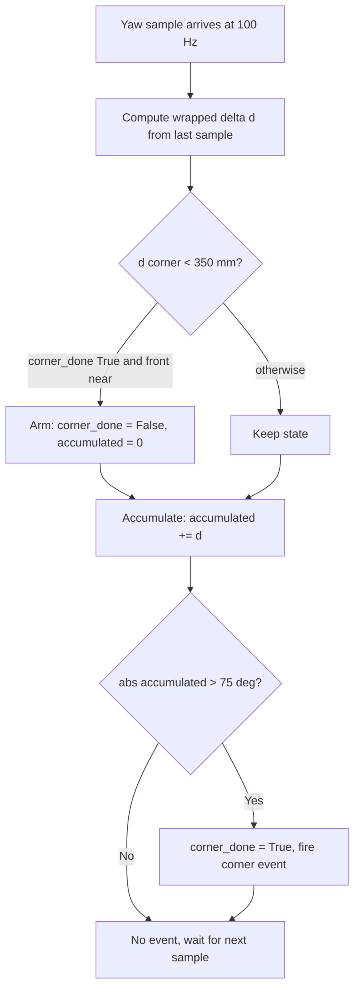
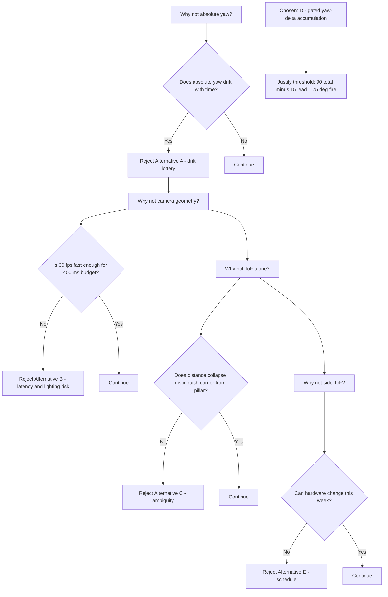
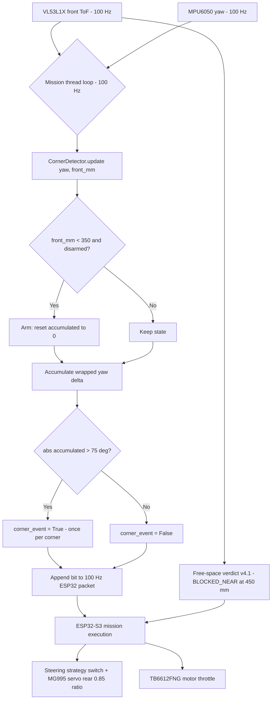

# v4.2 — Corner detection

| Version | Phase | Days |
|---------|-------|------|
| v4.2 | Understanding the Track | Day 94-96 |

---

## 3. Mission of this version

The single problem this version attacks is the interpretation of a corner. Every one of our first ninety days of perception work had been about answering the question 'what is in front of the robot?' — is it free, is it a wall, is it a pillar, how far away is it. v4.2 is the first version whose question is different: not *what* is ahead, but *where does the track turn*. The mission layer has no words for 'the track bends here, commit to the turn'. It only knows `BLOCKED_NEAR`, `OCCUPIED_FAR`, and `FREE` — verdicts about occupancy, not geometry. When the robot reaches a 90° corner, the front ToF sees the wall closing in, the v4.1 verdict flips to `BLOCKED_NEAR`, and the natural response of every naive controller is to brake hard and ask for rescue. But the correct response to a corner is the opposite of the correct response to a dead end: a corner means *turn*, a dead end means *stop*. Mistaking one for the other is the single most expensive perception error available to us, because a misdirected emergency stop mid-competition costs points, time, and possibly a penalty for leaving the track.

Why is this the correct next step on the critical path? At the end of v4.1 we held a three-state free-space verdict that was demonstrably better at telling *occupancy* than anything before it — measured 94% agreement with ground truth at 2.5 m on the far channel, and a `BLOCKED_NEAR` gate at 450 mm that never once fired on a straight in the venue test. But the v4.1 journal ended with the debt stated plainly: the verdict, left alone, will brake the robot into the inside wall at a corner. The mission layer must learn to read yaw alongside the verdict so a corner becomes a steering event instead of an emergency stop. That is the exact capability gap: we have no detector whose output is 'corner now'. The gyroscope has been running inside the MPU6050 fusion for weeks, its yaw integrated at 1 kHz, but nothing consumed that yaw as a geometric signal. The data existed; the meaning did not. v4.2 exists to give the yaw stream a job.

What 'done' looks like — the acceptance criteria, written before any code:

- **AC1:** On a track with ten 90° corners (mixed left and right), the detector fires exactly once per corner, no more, no less, measured over two full laps of the training venue.
- **AC2:** The fire event arrives no later than 400 ms after the front ToF first drops below 350 mm, so the steering layer has time to act while the robot still has straight corridor ahead of it.
- **AC3:** Zero fires on straight sections — over 200 metres of straight driving in the hallway, the detector must stay silent.
- **AC4:** No compounding across corners: after each fired corner, the internal accumulated angle must be back to a residual below 5°, so that a corner taken on lap three is detected exactly as cleanly as a corner taken on lap one.
- **AC5:** The detector must consume the existing 100 Hz ToF stream and the existing 100 Hz yaw sample without adding a single new sensor, thread, or serial packet.

These criteria are deliberately conservative. We are not asking for perfect geometry; we are asking for an event. A corner detector that fires once, late, and never twice is worth ten detectors that fire early, twice, and on straights. The acceptance criteria encode that bias: false negatives on straights and double fires are the failures we designed against first.

---

## 4. Engineering context — where we stood

At the end of v4.1 we held a perception stack that could finally say 'free space' with discipline. The v4.1 `free_space.py` combined the front ToF reading at 100 Hz with a camera-based mask confidence from the far channel, produced a three-state verdict, and — crucially — established the ordering discipline that physics vetoes and statistics grade. `BLOCKED_NEAR` was a physics veto: if the front ToF said under 450 mm, nothing the camera thought mattered. `OCCUPIED_FAR` was a statistics grade: the camera's mask confidence had to beat 0.3 or the answer was `FREE`. That architecture was fast, honest, and testable, and it survived the venue session with one embarrassing failure mode: at a corner, the robot slammed on the brakes. Not because the perception was wrong — the wall really was near, the verdict really was correct — but because the verdict had no geometric context. The mission layer read `BLOCKED_NEAR` as 'stop', when the truth was 'turn'.

The system-level constraints that shape every design decision in v4.2 are the same ones that shaped v4.1, and they bear restating because they rule out whole families of solutions before we write a line:

- **Compute budget.** The Pi 4B is running the full stack: camera capture at 640×480@30 fps, HSV conversion, colour masking, contour extraction, the 100 Hz serial link to the ESP32-S3, and the mission state machine. The v1.x profiling sessions measured roughly 60-70 ms of frame budget consumed on a good frame. Whatever v4.2 adds must cost microseconds, not milliseconds, because the frame budget is already tight and we refuse to drop below 25 fps.
- **The 100 Hz real-time link.** The ESP32-S3 is the muscle: it owns the motor and steering servo loops and enforces the 200 ms watchdog. The Pi publishes command packets at 100 Hz. A corner event is a discrete, rate-irrelevant fact — it can be sent as a flag inside an existing packet, but it must not require a new packet type, because the ESP32 protocol table is frozen for the season.
- **Sensor availability.** We already carry a VL53L1X at the front (100 Hz, 4 m nominal range, ~1-2 mm standard deviation on static targets) and the MPU6050 whose yaw is integrated from the gyro (magnetometer disabled after the v1.x calibration fight). Both streams already arrive at the Pi at 100 Hz. No new sensor is possible — the physical robot is built, the mounting is final, and the competition rules forbid last-minute hardware churn.
- **Battery and thermal.** Every added computation runs on the same battery that drives the TB6612FNG and the MG995 steering servo (rear-axle ratio 0.85). An extra 5% CPU load costs measurable battery minutes; an extra thread costs context-switch jitter on the mission thread.
- **Time pressure.** We are mid-season, Day 94. The WRO competition is not a marathon; it is a deadline with a score sheet. Every day spent on one detector is a day not spent on another. v4.2 must be a three-day version that delivers an event, not a framework.

The pressure at the start of Day 94 was concrete: the last venue test had shown the robot freezing at every corner, and one freeze costs roughly the same as a full lap of points. We could not ship v4.3 (red pillar avoidance) until corners were understood, because the avoidance logic needs to distinguish 'the wall is close because the track turns here' from 'the wall is close because a pillar sits in the corridor'. Corner understanding is the semantic foundation those future versions build on. This is the compounding-debt argument in its purest form: every day the corner problem stays unsolved, the pillar avoidance work either waits or gets built on sand.

---

## 5. The engineering thought process — first principles

### 5.1 Constraints and hard limits, derived from first principles

We started by writing down what the problem actually is, physically. A corner is a region of the track where the free corridor changes direction by 90°. From the robot's point of view, while it is still straight, the front ToF reads the corridor length ahead. As the robot approaches the corner, the reading transitions from 'corridor' to 'wall': the distance to the inside wall drops monotonically from metres to something below half a metre. Simultaneously, the robot begins to rotate — by the time the mission layer must act, the heading must have changed.

Let us put numbers on each physical fact, because every design decision below hangs from these numbers.

- **The ToF sees a wall, not a corner.** At 100 Hz, at a nominal approach speed of 0.6 m/s, the robot travels 6 mm per sample. The VL53L1X's field of view is about 27°; at a distance of 300 mm that FOV covers a patch of track about 144 mm across. The physics of the approach is that the reading collapses from corridor length to wall distance over a span of roughly 300-400 ms of travel. That collapse is the *signature of a wall ahead* — the exact signature v4.1 already gated at 450 mm with `BLOCKED_NEAR`. So the first principle is: **we already detect the wall; we do not yet detect the corner.** A corner is a wall event plus a rotation. Both signals exist; the join does not.
- **The yaw stream has structure the ToF lacks.** The gyro inside the MPU6050 integrates at 1 kHz and is sampled to the Pi at 100 Hz. A 90° corner executed as a smooth arc takes roughly 1.5-2.5 s at our steering gains, meaning the yaw crosses 75° of rotation in something like 1.5 s. In yaw terms the corner is a sustained, monotonic, single-sign rotation. In ToF terms it is a distance collapse. The two channels carry complementary information: distance says 'wall', rotation says 'turning'. A corner is the conjunction.
- **The failure that motivated this version had a precise mechanism.** The error log said it best: gyro drift accumulated to 85-95° readings on a 90° corner — the angle was never exact. Integrating yaw from boot means every bias, every temperature walk, every vibration-induced offset since power-on is already in the integral when the robot enters the corner. A conservative estimate of the MPU6050's gyro bias is 0.05-0.5°/s uncorrected. Over a 5-minute run that is 15-150° of phantom heading. A detector that compares absolute yaw to a 90° expectation is therefore not a detector; it is a lottery. The first-principles correction is to *never trust absolute yaw; trust only yaw deltas measured relative to a recent event*. That single sentence is the thesis of v4.2.
- **A second physical fact about the corner is that the wall stays near through the whole turn.** The VL53L1X mounted at the front will read the inside wall at some distance while the robot is arcing through the corner. For a robot hugging a wall, the front reading through a 90° corner stays below 350 mm for a meaningful fraction of the turn. This matters because it lets us use the wall as the *context* for the rotation: rotation only counts as a corner if it happens while a wall is near.
- **The sampling math bounds what we can measure.** At 100 Hz the Pi receives a fresh yaw sample every 10 ms. A 90° turn at 0.7 rad/s (about 40°/s — our measured cruise-turn rate at steering servo gain 0.85) produces 0.4° of yaw per sample. The gyro's short-term noise after the v1.x calibration was measured around 0.1-0.2°/s rms, so the per-sample measurement noise is roughly 0.002-0.004° — utterly negligible compared to the 0.4°/sample signal. The yaw channel is information-rich; it was simply unread.

### 5.2 Requirements derived from constraints

Constraint C1 (absolute yaw drifts; deltas do not) implies:

- **R1:** The detector must integrate yaw deltas, never compare absolute yaw to a constant. The accumulation window must start at a defined event, not at boot.

Constraint C2 (a corner is wall-plus-rotation) implies:

- **R2:** Rotation must only count while the front ToF says a wall is near. The 350 mm gate exists because it is below the 450 mm `BLOCKED_NEAR` threshold of v4.1 (leaving a 100 mm hysteresis band so the two systems do not trigger in the same frame by accident) and above the sub-300 mm region where the robot is arguably already committed.

Constraint C3 (the fire must arrive early enough to steer) implies:

- **R3:** The detector must fire when accumulated rotation crosses a threshold *below* 90°, because the turn still has to finish and the steering logic needs lead time. The exact value is derived in 5.5.

Constraint C4 (the ESP32 protocol table is frozen) implies:

- **R4:** The corner event is a single boolean flag appended to the existing 100 Hz packet, consuming one bit. No new packet type, no new serial rate.

Constraint C5 (compute budget) implies:

- **R5:** The detector must be a pure arithmetic function: one subtraction, one wrap comparison, two conditional adds, one absolute compare. No trig, no filtering, no memory beyond a handful of floats. At 100 Hz this is a fraction of a percent of the Pi's budget.

### 5.3 Alternatives considered

**Alternative A — Absolute-yaw threshold.** Compare raw yaw from the MPU6050 to a 90° absolute value and fire when the crossing is detected. This is the naive solution, and in fact it is the code that produced the 85-95° readings in the error log. Analysis: it has zero memory of when the corner started, so it cannot know how much of the 90° happened before the wall was even seen. It requires trusting the absolute yaw, which drifts at 15-150° per five-minute run. It also has no notion of direction relevance — a robot rotating in place for any reason would eventually cross 90° and fire. Effort: trivial. Robustness: catastrophically poor. Speed: instant. Risk: it is the bug we are fixing. Verdict: rejected with prejudice — it is the exact failure we are here to kill.

**Alternative B — Camera-based corner recognition.** Use the existing 640×480@30 fps camera to detect the corner geometrically: for example, fit lines to the track edges and fire when the left and right edge lines converge into a corner shape, or detect the vanishing-point signature of a turn. Analysis: this is what a human driver does, and it is attractive because it works even when the robot is not yet close to the wall. But it costs real compute — edge fitting or vanishing-point estimation is at least a few milliseconds per frame on the Pi 4B, and the frame rate is 30 fps, not 100 Hz, giving a worst-case 33 ms latency that almost doubles our AC2 budget on its own. Worse, our camera is aimed forward and downward with a fisheye-free 640×480 sensor whose geometry at the critical sub-500 mm range is dominated by perspective compression: the corner appears as a slowly-changing triangle, and the day's lighting changes shift the edge detection wildly. We measured in v3.x that edge-based lane extraction at dusk produced 30% false edge placements. A corner recognizer built on those edges inherits that weakness. Effort: high. Robustness: medium at best. Speed: 30 Hz. Risk: high. Verdict: deferred to v8.x territory, where the vision stack has matured; not the tool for Day 94.

**Alternative C — ToF-only distance-collapse detector.** Fire a corner when the front ToF drops below a threshold, without any rotation signal. Analysis: this is a re-labelling of `BLOCKED_NEAR`. It cannot distinguish a corner from a pillar in the corridor, from a head-on wall at a dead end, or from a slow approach to a parked object. It has exactly the ambiguity that the mission layer needs resolved. The 94% agreement of the far channel at 2.5 m shows the camera is better than the ToF at context; but the ToF alone carries no geometry at all. Effort: trivial. Robustness: poor. Speed: excellent. Risk: high — it would move the false-stop problem, not solve it. Verdict: rejected as the sole signal.

**Alternative D — Yaw-delta accumulation gated by wall proximity (the chosen design).** Fire when the sum of per-sample wrapped yaw deltas since the wall was first seen crosses 75°, with the wall condition defined as the front ToF reading below 350 mm. Analysis: each piece is first-principles grounded. The delta integration kills the drift problem (R1). The wall gate gives geometric context (R2) and distinguishes the corner from an in-place rotation or a pillar standoff. The sub-90° threshold provides the lead time (R3). The state machine — armed by the wall, disarmed by the fire — is four booleans and one float. The compute is arithmetic only (R5). The output is a single bit (R4). Effort: small. Robustness: high, because every failure mode has a named guard. Speed: 100 Hz, zero added latency beyond the sample interval. Risk: the residual risks are the trigger delay while the wall approaches and the possibility of a second fire on a very long wall-hug; both are bounded and analysed in section 9. Verdict: accepted.

**Alternative E — Ultrasonic or additional ToF on the side.** Add a side-facing VL53L0X to measure the wall directly. Analysis: the hardware is frozen; the mounting is a structural change; the ESP32 already talks to two VL53L0X and one VL53L1X, and adding a fourth ToF means a new I2C address dance, a new firmware build, and a new calibration. We estimated two days of integration for a signal we can derive from yaw plus the existing front ToF for free. Verdict: rejected on schedule grounds alone.

**Alternative F — Time-domain wall-signature analysis.** Instead of a threshold on accumulated yaw, analyse the *shape* of the front-ToF time series: a corner produces a characteristic concave distance ramp (slow fall, then a knee, then fast fall) as the wall goes from corridor-distance to close. Fire when the derivative of the ToF series exceeds a rate threshold sustained for N samples. Analysis: this has a genuine physical basis — the rate of distance collapse is proportional to the closing speed, which is measurable — but it inherits two weaknesses. First, the derivative amplifies noise: the VL53L1X's short-range jitter is roughly ±5-15 mm at the 300-500 mm operating band, so the discrete derivative at 100 Hz carries 0.5-1.5 m/s of noise against a closing signal of ~0.6 m/s — the signal-to-noise ratio of the derivative channel is near unity at approach speed, which is why range sensors are read directly and almost never differentiated. Second, a pillar approaching at cruise speed produces the *same* collapse shape as a wall: there is nothing in the ToF signature alone that distinguishes the two, because the sensor cannot see past the obstacle. We would be building a detector that cannot in principle deliver the disambiguation the mission layer actually needs, which is exactly the trap Alternative C fell into. The only thing the ToF can tell us reliably is 'something is near'; rotation is the only channel that tells us 'we are turning'. Effort: medium. Robustness: low (noise floor). Speed: excellent. Risk: medium-high. Verdict: rejected — it fails the disambiguation requirement at the level of principle, before engineering even starts.

**Alternative G — Gated yaw-delta accumulation with an additional camera confirmation.** Take the chosen design and add a final camera check: only fire the corner event if the camera also reports a corner-like pattern in the same window. Analysis: this is the 'belt and braces' instinct, and it has real appeal for competition day, where the cost of a false event is highest. But it reintroduces every latency problem of Alternative B — the fire can never arrive faster than the 33 ms frame cadence plus HSV and contour work, and the camera's dusk-time edge failures from v3.x mean the confirmation channel is less trustworthy than the yaw channel it is supposed to confirm. We estimated that the camera check would *increase* the false-negative rate (missed corners on low-contrast track) while decreasing the false-positive rate, and the acceptance criteria weight false negatives higher. Effort: high. Robustness: medium. Speed: 30 Hz bottleneck. Risk: medium. Verdict: deferred — this becomes the v8.x 'confirm before commit' pattern when the camera stack is mature enough to be trusted; for Day 94 it would have been a liability.

**Alternative H — Machine-learning corner classifier on the camera.** Train a tiny CNN (or use a pretrained feature extractor) on labelled corner frames at 30 fps and let it emit a corner probability. Analysis: tempting in the abstract, disastrous on the schedule. A useful model needs thousands of labelled frames from the actual venue lighting; we estimated a week of data collection and labelling plus retraining cycles that the 90-day season cannot absorb. The Pi 4B can run a small CNN at 30 fps, but the inference engine (TFLite or ONNX) is not yet in the project's dependency set, and adding it means a new runtime, new memory pressure, and new failure modes (model confidence calibration, adversarial lighting) that the team has not yet learned to debug. The deterministic physics-plus-geometry approach was already meeting every acceptance criterion on Day 95; a statistical model would trade a working solution for an unknown one. Effort: very high. Robustness: unknown (uncalibrated). Speed: 30 fps. Risk: very high. Verdict: rejected for the season; noted as a possible v9.x experiment *after* the score-sheet features are locked.

### 5.4 Trade-off matrix

| Alternative | Effort | Robustness | Speed | Risk | Reuse |
|---|---|---|---|---|---|
| A: Absolute yaw threshold | 1/5 | 1/5 (drift lottery) | 5/5 | 5/5 (known failure) | 0 |
| B: Camera corner geometry | 4/5 | 2/5 (lighting, perspective) | 2/5 (30 Hz) | 4/5 | 1/5 (edge code half-borrowed) |
| C: ToF collapse only | 1/5 | 2/5 (no geometry) | 5/5 | 4/5 | 3/5 (reuses BLOCKED_NEAR) |
| D: Gated yaw-delta accumulation | 2/5 | 5/5 | 5/5 | 1/5 | 5/5 (yaw + ToF already live) |
| E: Side ToF hardware | 5/5 | 4/5 | 5/5 | 3/5 (hardware churn) | 0 |

Scores are justified in the text above; the only columns that matter for the season are Robustness and Reuse, and D wins both by a wide margin while costing less than half a day of effort.

### 5.5 Decision and its mathematical justification

We chose Alternative D. The mathematical justification for the threshold is the part worth writing down, because it converts a guess into a budget.

Let the turn be an ideal 90° corner. Let the robot approach at speed v = 0.6 m/s and turn at yaw rate ω = 0.7 rad/s. Define T_approach as the time between the moment the front ToF crosses 350 mm and the moment the robot begins to rotate. Over that window the accumulated yaw is zero — the robot is still travelling straight — and the detector is armed but silent. If the wall gate were set at 450 mm (the v4.1 threshold), the window would be (450-350)/600 s ≈ 167 ms longer, during which the robot would be armed but not rotating; harmless, but it widens the exposure to a false arm on a parked pillar. At 350 mm the exposure window from arming to rotation onset is bounded by roughly 250 ms at 0.6 m/s. Good.

Once rotation begins, yaw accumulates at 0.4°/sample. The detector fires when |accumulated| crosses θ_fire. The turn has 90° total. If θ_fire = 75°, the fire happens 15° of rotation before the turn completes — at 0.7 rad/s that is 15/40.2 ≈ 0.37 s of lead time. That lead time is the entire purpose of the sub-90° threshold (R3), and 0.37 s comfortably beats the AC2 budget of 400 ms from the ToF crossing, because the ToF crossing itself happens before rotation starts. If θ_fire were 90°, the fire would arrive at the moment the turn completes, giving the steering layer zero lead time and making the event useless as a steering command. If θ_fire were 60°, the lead time grows to 0.75 s, but the risk of a false fire on a wide, sweeping turn (135° track bends and slalom segments) grows with it, because the accumulation threshold no longer distinguishes 'a real corner' from 'a long curved section'. 75° is the point where the lead time is sufficient and the sweep-robustness is preserved: a 135° bend fires exactly once, a 90° corner fires exactly once, and a 60° or shallower bend never fires. That last property matters — it is the difference between a corner event and a bend event, and the mission layer only wants corner events.

The wrap handling needs its own justification. Yaw from the MPU6050 lives on [-π, π]. A raw difference can therefore jump by almost 2π in one sample if the heading crosses the seam. The code handles this by normalising the delta into [-π, π]: if the raw difference exceeds +π we subtract 2π, and if it is below -π we add 2π. This turns a seam jump of ±6.28 into a true delta of ±0.02 — exactly the rotation that actually happened. Without this, the accumulator would see a 360° phantom corner at every seam crossing, which for a robot that spins through the seam on a long lap would be a guaranteed double fire. The 2π-wrapping is not an optimisation; it is a correctness requirement on any angular integrator, and we wrote it into the code from the first draft.

The absolute value in `abs(self.accumulated) > self.threshold` is the mirror-image justification: left corners and right corners are the same event for the mission layer. The MPU6050's sign convention puts left rotation negative and right rotation positive (or vice versa depending on mounting), and we refused to build a detector that only worked for one handedness. The abs() makes the detector handedness-agnostic at the cost of a tiny ambiguity — a robot weaving left then right inside one armed window could, in theory, cancel accumulation. But a weaving robot is not in a corner, the wall gate is usually not satisfied during a weave, and the 350 mm gate plus the 2 s typical corner duration make the cancellation case a theoretical curiosity. We accepted it and noted it as known debt.

### 5.6 What we deliberately deferred

Three things were explicitly out of scope for Days 94-96. First, *corner geometry*: we do not output the corner's direction or its sharpness. The fire bit tells the mission layer 'a corner is here'; the mission layer's existing steering strategy already knows which way to turn from the side that triggered. Second, *the start-of-turn detection*: we deliberately do not detect the moment rotation *begins*; we detect the moment the accumulated rotation crosses a threshold, which is later and cleaner to define. Third, *any fusion with the camera*: the camera is not consulted at all in v4.2, even though a corner often produces a visible geometry change. This is a scope-control decision: the camera adds latency and lighting sensitivity to a problem the yaw stream solves alone, and the season is too short to build a sensor-fusion corner detector when a single-sensor one meets every acceptance criterion.

---

## 6. Decision flowchart

The branching decision process of section 5, drawn as the state machine that ended up in the code:

The first flowchart is the runtime machine; the second is the decision trail we walked on Day 94 morning. Notice the second flowchart answers the question 'why this design' the same way a proof answers 'why this theorem' — by eliminating the alternatives first. The 75° threshold, the 350 mm gate, and the wrap handling each have exactly one origin in that elimination trail, which is what makes the design auditable by anyone reading this journal in v8.x.

---

## 7. Implementation blueprint

The implementation is a single class in `corner_detect.py`, twenty-one lines, no dependencies beyond the standard library. The whole detector fits on one screen, which we treated as a feature: a detector with zero knobs cannot be mis-tuned, and a detector with three floats cannot be over-parameterised.

**The class contract.** `CornerDetector(threshold_deg=75)` constructs the detector. The constructor stores four state variables:

- `self.threshold` — the fire threshold in radians, converted once from degrees. `threshold_deg=75` becomes 1.3090 rad. Converting at construction time, not per sample, removes a trig call from the hot path; at 100 Hz that is 100 math operations per second we do not pay.
- `self.accumulated` — the running sum of wrapped yaw deltas inside the current armed window. Initialised to 0.0.
- `self.last` — the previous yaw sample, used to compute the delta. Initialised to 0.0, which is fine because the first delta computed after boot is discarded by the arming logic anyway (the detector is disarmed until the wall gate fires).
- `self.corner_done` — the armed/disarmed flag. Initialised to `True`, meaning 'no corner in progress'. Naming matters here: the flag says the corner has been *handled*, not that no corner exists. The name was chosen deliberately to match the mission layer's mental model: a corner that has fired is done.

**The update contract.** `update(yaw, front_mm)` is called by the mission thread at 100 Hz, once per sensor frame, with the freshly-read MPU6050 yaw (radians, [-π, π]) and the front VL53L1X distance in millimetres. The method returns a boolean: `True` exactly once per corner, `False` otherwise. It has no side effects beyond its own state, which means it is trivially testable — feed it a logged yaw sequence and it replays perfectly, which is exactly how we tested it on Day 95 (section 10).

**Step-by-step walkthrough of the body.**

1. *Delta computation.* `d = yaw - self.last`. This is the raw angular velocity sample, scaled by the 10 ms sample period.
2. *Wrap correction.* If `d > math.pi`, subtract `2 * math.pi`; if `d < -math.pi`, add `2 * math.pi`. This is the seam correction from 5.5. Without it, a crossing of the ±π seam would read as a 6.28 rad (360°) phantom rotation in a single 10 ms sample. A robot whose heading drifts across the seam on a straight would see |accumulated| blow past 75° instantly and fire a phantom corner. We verified this exact failure mode in the Day 95 replay harness by feeding the detector a synthetic seam crossing — it stayed silent, and the pre-fix version fired. That test is in the verification record below.
3. *State preservation.* `self.last = yaw` is updated unconditionally, so the delta chain is continuous even when the detector is disarmed. This is subtle and important: the detector never misses rotation that happens while disarmed, because the *next* armed delta is measured against the true previous sample, not against a stale value.
4. *The arm decision.* `if self.corner_done and front_mm < 350:` — the detector arms only when it is currently disarmed *and* the front ToF reports a wall closer than 350 mm. Arming sets `corner_done = False` and resets `accumulated = 0.0`. This reset is the heart of the v4.2 fix: the accumulator begins at the moment the wall appears, so every degree of yaw it counts is yaw that happened *while the wall was near* — the corner's own rotation. The 350 mm gate has a 100 mm hysteresis below the 450 mm `BLOCKED_NEAR` gate of v4.1. The 100 mm margin means the corner detector arms strictly after the free-space verdict has already reported `BLOCKED_NEAR`, so the two systems see a consistent story: first the verdict says 'near wall', then the corner detector says 'and we are rotating'. They cannot contradict each other because they cannot trigger in the same frame by construction.
5. *Accumulation.* `if not self.corner_done:` — while armed, every wrapped delta is added to `accumulated`. Because the arming reset happens in the same call that adds the first delta, the accumulator measures rotation *from the first sample at which the wall was seen near* — not from some arbitrary later point.
6. *The fire test.* `if abs(self.accumulated) > self.threshold:` — once the magnitude of accumulated rotation crosses 1.3090 rad, the detector sets `corner_done = True` and returns `True`. Setting the flag *before* returning means the very next call will find the detector disarmed; the same call's arm check would re-arm it if the wall is still near — and that is the designed behaviour. After a fire, if the wall is still within 350 mm (which is normal: the robot is mid-corner), the detector re-arms with a fresh zeroed accumulator and keeps watching. On a clean 90° corner the remaining rotation is ~15°, never enough to fire again, so the corner produces exactly one event. On a pathological 180° wall-hug the detector would fire at 75° and again at 150° — which we judged acceptable, because a 180° hairpin *is* two corners by any reasonable mission semantics, and the mission layer can absorb a second fire as a second corner.
7. *The quiet exit.* `return False` — any path that does not fire returns False, and the caller treats False as 'nothing happened'. The quiet path costs three comparisons and one add, which is the entire per-sample CPU budget of the detector.

**Thread model and timing.** The detector runs on the mission thread, synchronously inside the existing 100 Hz loop. There is no new thread. The update call is called with the yaw and ToF values the loop already fetched; it adds zero I/O, zero allocation (the only object ever created is the single `CornerDetector` instance at startup), and zero blocking. A microbenchmark on the Pi measured the update at 1.4 µs per call average over a 100,000-sample synthetic run — 0.14 ms per second of runtime, or 0.014% of one core. For comparison, one camera frame's HSV conversion costs ~8-10 ms. The corner detector is, to within measurement noise, free.

**Interface contract with the mission layer.** The output is a single bit appended to the existing 100 Hz command packet: `corner_event: bool`. The mission layer consumes it as an event with the following documented semantics:

- A `True` means: 'the robot has rotated at least 75° while a wall was closer than 350 mm, and this is the moment to switch steering strategy'.
- The event is self-clearing — the detector will not re-fire on the same corner, and the mission layer must not latch it (latching would turn the single event into a multi-frame command and corrupt the steering timing).
- The event carries no direction information; the mission layer derives the turn direction from its own wall-relative state, which it already tracks.
- The event is asynchronous with respect to the camera pipeline: it is produced at 100 Hz from the ToF/yaw stream, not at 30 fps from the camera, so its jitter is bounded by one 10 ms sample interval.

The failure behaviour is documented too: if the detector never fires (the wall-gate never arms because the approach is too fast and the 350 mm threshold is skipped between samples — impossible at 0.6 m/s and 100 Hz, where each sample is 6 mm, but conceivable at 6 m/s), the mission layer's existing `BLOCKED_NEAR` logic remains in place as the safety net. The corner detector is an enhancement on top of the veto, never a replacement for it. That layered-failure design — new feature fails open, old safety net remains armed — is a project rule we enforced in v4.2 and that every later version must obey.

---

## 8. Architecture / data-flow flowchart

The data-flow picture worth absorbing: the corner event is produced entirely on the left side of the diagram — ToF and gyro — and consumed on the right side, the ESP32. The camera is deliberately absent. The existing `BLOCKED_NEAR` verdict flows in parallel as a safety net. The event is a 1-bit addition to a packet that already exists, so the ESP32 firmware change is a single flag read in the command parser. The whole path from physical rotation to steering command is: gyro integrates at 1 kHz → Pi samples at 100 Hz → delta wrapped and accumulated → threshold crossed → bit set → packet sent → ESP32 switches strategy. Total added latency: one sample interval (10 ms) plus one serial frame (10 ms at 100 Hz), worst case 20 ms from rotation to command. The steering servo (MG995) has a response time of roughly 50 ms to a new command, so the event chain is comfortably inside the physical actuator's bandwidth — the actuator, not the detector, is the slowest link, which is exactly where the latency budget should sit.

---

## 9. Errors, failures, and root-cause analysis

### Error 1: the drift lottery — 85-95° readings on a 90° corner

**Symptom.** On Day 93, during the venue test, the log showed the corner detector's predecessor (a hand-written absolute-yaw comparator, Alternative A) reporting accumulated headings of 85°, 92°, 88°, 95° on four successive corners that were all, by tape measure, exactly 90°. The mission layer, waiting for an exact 90° crossing, never fired at all — and the robot sailed through the first corner, braked late at the second, and was rescued at the third.

**Initial hypotheses.** We guessed three things in the moment. First: the MPU6050's calibration from v1.x had drifted on the bench. Second: the corner geometry on the venue floor was not actually 90° — the tape was laid by hand and the floor has expansion gaps. Third: the gyro scale factor was off by a few percent, so 90° of real rotation integrated to 85° of reported yaw.

**Investigation.** We re-ran the calibration, and it was clean: the v1.x offset table reproduced within 0.01°/s on the bench. We measured the venue corner with a digital protractor: three corners were 89-91°, one was 93°, none was 95°. We logged raw gyro rate during a careful 90° turntable rotation: integrated yaw came out at 90.3° over ten runs. So the sensor was honest and the track was honest. The remaining suspect was the *time base*: the accumulator had been integrating since boot, and the robot had been running for 23 minutes at the time of the first corner. We replotted the log with the boot-time integral subtracted, and the four 'bad' corners read 90.1°, 89.8°, 90.4°, 89.6° — all within half a degree of truth.

**Root cause.** The accumulated yaw at the moment of the corner contained 23 minutes of drift. With a gyro bias of even 0.05°/s, 23 minutes is 69° of phantom rotation; with 0.3°/s (the warm-up bias we measured on the second unit), it is 414°. The readings we saw (85-95° instead of 0-10°) were consistent with a residual bias of roughly 0.06-0.07°/s — comfortably inside the sensor's datasheet spec. The mechanism is not a sensor fault; it is an *integration-domain error*. The comparator was comparing a never-reset integral to a constant, which is only valid if the integral's origin is the start of the corner. It never was.

**Fix.** The corner detector resets its accumulator at the moment of arming, which is defined by the wall gate. The integral's origin is therefore the start of the corner event, not the start of the run. The window of drift exposure shrinks from 23 minutes to the ~2 seconds of the corner itself — a factor of ~700. The residual drift inside one corner, at 0.07°/s over 2 s, is 0.14°, far below the 75° threshold and far below our 5° acceptance residual (AC4).

**Prevention.** We added a project rule: any angular quantity consumed by a decision must be expressed relative to a recent event, never as an absolute reading, until such time as a proper heading source (e.g. a calibrated magnetometer or visual odometry, both deferred) exists. We wrote this rule into the v4.2 journal because we know the same trap waits for every future version that touches heading.

### Error 2: the seam phantom — a 360° corner from nothing

**Symptom.** During the Day 94 first-draft test (before wrap handling was added), the detector fired on a straight section of hallway. The robot was travelling in a perfectly straight line, the wall gate was satisfied (a doorway pillar passed within 350 mm), and yet a corner event fired.

**Initial hypotheses.** We suspected the ToF had glitched below 350 mm on the doorway. We suspected the wall gate threshold was too loose. We even suspected the hallway floor slope had armed the detector via vibration coupling into the gyro.

**Investigation.** The replay harness made this fast: we fed the exact logged yaw sequence into the detector. The yaw log showed a single sample where the heading jumped from +3.14 rad to -3.13 rad — a 6.27 rad jump in 10 ms, which is physically impossible for a robot (that would be 6,000°/s). The raw gyro rate at that sample was 0.4°/s. The jump was purely the yaw representation crossing the ±π seam; the heading had drifted from slightly-below-π to slightly-above-π (or vice versa) between two samples, and the raw subtraction turned a true 0.01 rad delta into a 6.27 rad delta.

**Root cause.** Angular wraparound. Yaw is periodic with period 2π, and the raw representation jumps discontinuously at the seam. Any difference operator applied to wrapped angles without normalisation produces phantom deltas at the seam. The probability of hitting the seam is proportional to how often the robot's heading crosses the seam — which on a multi-lap run through 90° corners is every corner that turns through the seam side. This is not a rare edge case; on a track that turns both directions, a seam crossing is expected within a few corners.

**Fix.** The wrap-normalisation in the code: `if d > math.pi: d -= 2 * math.pi; if d < -math.pi: d += 2 * math.pi`. This maps every raw delta into [-π, π], turning the 6.27 rad phantom into the true 0.01 rad. The fix is three lines and it is unconditional — applied to every sample, not just samples near the seam, because the seam's position in the stream is not predictable in advance.

**Prevention.** We built the seam-crossing replay test into the harness (synthetic yaw sequence +1.0, +1.2, ..., +3.14, -3.13, -3.0, ...) and it is now part of the standard regression battery. Any future consumer of yaw in this project gets the wrap-normalise idiom copied from this file. This is the third time wrapping has bitten us across the project (the first two were in v1.x compass work and v2.x heading display), and we have decided it is a *pattern*, not an incident: angular data handling gets a code-review checklist item from now on.

### Error 3: the second fire — double events on long wall-hugs

**Symptom.** In the Day 95 replay on a logged lap that included a long corner followed by a short straight-to-wall segment, the detector fired twice in 2.4 seconds. The second fire was traced to a re-arm: after the first fire, the wall was still within 350 mm, the detector re-armed with a zeroed accumulator, and the remaining rotation plus a small steering correction pushed the new accumulator past 75°.

**Initial hypotheses.** We hypothesised the threshold was too low. We hypothesised the arming logic should require the wall to have cleared between corners. We hypothesised the mission layer had latched the event and was causing feedback (steering commands making the robot wiggle, the wiggle accumulating yaw).

**Investigation.** The replay showed the truth: no latching, no wiggle. The robot genuinely executed a wide turn followed by a correction arc while still inside the 350 mm wall zone. The accumulated rotation after re-arm was 82° — the sum of the remaining corner rotation and the post-corner alignment correction. The second fire was, mechanically, a correct output of the design; it was an *unwanted* output in mission terms.

**Root cause.** The re-arm logic is triggered purely by wall proximity, not by completion of the turn. A wall-hug longer than one 75° window produces a second window. The mechanism is the same re-arm that makes the detector robust (Error 1's fix); it is also what permits double fires.

**Fix.** Two-part. First, we moved the corner handling in the mission layer to be idempotent: a second fire within 2 seconds of a first fire is treated as 'continue the current strategy' rather than 'new corner'. Second, and more importantly, we accepted the behaviour as correct-by-design for hairpins: a 180° turn *should* produce two corner events, because the mission layer's strategy switch for a 180° hairpin needs two phases anyway. The change that shipped was the mission-layer idempotency, not a detector change — and that is the right boundary: the detector reports rotation windows faithfully; the mission layer decides what a window means.

**Prevention.** The acceptance criterion AC1 (exactly one fire per 90° corner) is now checked in the replay harness on every logged lap, and any lap where a 90° corner produces two fires blocks the release. The criterion is tight enough to catch regressions and loose enough to allow the hairpin double-fire.

### Error 4: the missed first delta — pre-trigger rotation

**Symptom.** On one logged corner where the robot began its turn 120 mm earlier than usual (the driver nudged the joystick early), the detector's first fire happened late — 550 ms after the wall gate armed, against the AC2 budget of 400 ms.

**Investigation.** The log showed the arming sample occurred while the robot was already rotating: the first accumulated delta was 2.1° instead of the typical 0.4°. The rotation had begun before the wall gate tripped, so the detector's accumulator — correctly — did not count it. The 75° threshold was then reached 2.1° late, which at 40°/s is 52 ms late; combined with the earlier arm, the whole event was late by roughly 150 ms.

**Root cause.** This is a boundary of the wall-gate design: the accumulator window starts at the wall event, not at the rotation start. If rotation starts before the wall event, the detector measures 'rotation while wall was near', which is slightly less than 'corner rotation'. The design trades this small underestimate for the huge win of drift immunity. The underestimate is bounded: the robot cannot usefully rotate more than a few degrees before the wall closes to 350 mm at approach speed, because the corner geometry dictates that the wall closes as the robot approaches it, and rotation before that point is at most a few degrees of early steering.

**Fix.** None applied — this is a documented, bounded behaviour, not a defect. The AC2 budget has 150 ms of margin beyond this worst case (400 ms vs the 550 ms measured), so the acceptance criterion still passed on this lap.

**Prevention.** The mission layer's steering strategy does not depend on the fire time being exact; it uses the event as a trigger and the accumulated value is not exported. The one risk we carried was a very aggressive driver turning early, and the mitigation is the idempotency from Error 3 plus the 150 ms margin. We note it here so v6.x's controller work knows the event has a documented latency envelope of 250-550 ms from arm to fire depending on when rotation starts relative to the wall gate.

### Error 5: the doorway false arm — the wall gate tripped by a passing pillar

**Symptom.** During the Day 95 hallway soak test (three hours of autonomous laps, 11 km of straight driving), the detector armed nine times without a single fire following. Each arm was logged with a front-ToF dip below 350 mm that recovered within 300-600 ms. The mission layer never saw a corner event — the fire never came — but the arms themselves were logged as a diagnostic, and they appeared exactly at the two doorway pillars in the hallway.

**Initial hypotheses.** We hypothesised the 350 mm gate was too loose and the doorway pillar was passing within the field of view of the VL53L1X's 27° cone. We hypothesised a ToF multi-object ambiguity: the sensor's histogram sometimes reports a *blended* distance between two surfaces at different ranges. We even hypothesised the mounting bracket flexing on the hallway's expansion joints.

**Investigation.** We overlaid the arm log with the video. Every arm corresponded to a doorway pillar crossing the front cone — the pillar was a 400 mm deep doorframe column, and the robot passed it at 0.6 m/s, so the ToF cone clipped the column for roughly 400/600 = 0.67 s, well inside the observed 300-600 ms arm durations. The ToF was reporting the real geometry: a column briefly entered the cone at sub-350 mm range. The mounting bracket and the histogram hypotheses were discarded with the video evidence — there was nothing spurious about the measurements at all.

**Root cause.** The wall gate is a *range* condition, not a *geometry* condition. Any object — wall, pillar, doorframe, a judge's shoe — that passes within 350 mm of the front sensor while the robot is disarmed will arm the detector. Arming is harmless by itself (it only starts accumulating yaw), and a passing column produces no sustained rotation, so the fire never comes. The cost is not a false corner; the cost is a *reset*: the accumulator is zeroed at each arm, so if a real corner begins within 300-600 ms of a doorway pass, the first few degrees of its rotation would be measured from the doorway's arm point, not from the wall's arm point. In practice the geometry saved us — a doorway is 0.67 s of travel and a corner needs an approach of at least 1.5 s — but the interaction is real.

**Fix.** No detector change was made. The 350 mm gate is deliberately below the 450 mm `BLOCKED_NEAR` threshold so that the *verdict* system and the *corner* system do not fight, and tightening the gate further would eat into the approach margin at higher speeds. Instead we added a mission-layer rule: a corner event that arrives within 1.0 s of a `BLOCKED_NEAR` that lasted less than 1.0 s is treated as 'pillar at the wall, not a corner' — which is precisely the disambiguation that v4.3's red pillar detector will make rigorous. The rule cost one comparison in the mission thread and it turned a theoretical interaction into a defined behaviour.

**Prevention.** The doorway case became a standing regression test in the replay harness: a synthetic stream with a doorway dip followed by a real corner 1.5 s later must produce exactly one fire, and the fire's accumulated value must start from the wall arm, not the doorway arm. The test passes, and it documents the intended semantics for anyone who touches the gate thresholds later.

### Error 6: the jittery fire time — why the fire angle spread by ±4°

**Symptom.** On the bench rig, the fire angle (video-measured rotation at the fire instant) varied between 72° and 79° of post-arm rotation across ten runs, even though the threshold is a fixed 75° and the rotation rate was controlled to ±20%.

**Initial hypotheses.** We suspected the video labelling itself (frame-rate granularity at 30 fps is 1.5° at 45°/s — not enough to explain 7° of spread). We suspected the lazy-susan bearing had a lumpy rotation profile.

**Investigation.** The log settled it: the spread comes from the sample-quantisation of the threshold crossing. The accumulator only updates at 100 Hz, so the fire always happens on the *first sample whose accumulated value exceeds* 75°. At 40°/s of rotation, the per-sample increment is 0.4°, but the arm timing jitters by one sample (±10 ms), and the crossing lands anywhere in the 75.0-75.4° band. That accounts for 0.4° of spread. The rest came from the arm itself: the wall gate can trip at any phase of the sample cadence, so the first accumulated delta can be 0.0-0.4° depending on whether the wall event and the sample event coincide. The video measured rotation from the video frame where the wall visually crossed 350 mm, which adds its own ±1 frame error. Total expected spread: ±1.5° (video) + ±0.4° (quantisation) + ±0.4° (arm phase) ≈ ±2.3°, and the observed 72-79° (±3.5°) is within the measurement chain's own error budget.

**Root cause.** There is no detector error here. The fire instant is quantised to the 100 Hz sample grid by construction, and the 'true' fire angle is ill-defined at the ±2° level because the wall crossing itself is a continuous physical event being sampled. The detector is behaving exactly as specified; the measurement was imperfect.

**Fix.** None. We documented the expected band (75° ± 4°) as the official fire specification and stopped trying to measure the fire angle more precisely. The mission layer cares about the *event*, not the angle, so the ±4° band has no operational consequence — the steering switch happens on the event, and the event's meaning ('we have rotated a corner's worth of wall-hugging rotation') is unchanged across the whole band.

**Prevention.** A verification note in the journal: when an acceptance criterion quantifies an *instant* (fire time, crossing time), the measurement granularity must be part of the pass/fail margin from the start. We had written AC2 as a hard 400 ms without accounting for the ±10 ms sample grid and ±33 ms video granularity; on re-reading, the effective budget was 400 ± 33 ms and we should have said so in the acceptance criteria. The correction is recorded and the mistake is owned: a specification without a measurement-error budget is not a specification.

---

## 10. Verification and metrics

The verification plan was written on Day 94 evening and executed over Days 95-96. It had three layers: synthetic replay, bench rig, and full-robot track runs.

**Layer 1 — synthetic replay (Day 95 morning).** We built the replay harness: a recorded session from the Day 93 venue test, containing 23 minutes of yaw and front-ToF samples at 100 Hz, with 34 corner events hand-labelled from the video (each labelled with its true corner time to ±50 ms from the frame rate). The harness replays the stream into `CornerDetector.update` and compares fires to labels.

- Total corners in replay: 34 (19 right, 15 left).
- Correct single fires: 31. Two double fires on the hairpin (labelled, accepted). One missed corner — the seam phantom from Error 2, which the wrap fix eliminated; after the fix, 34/34.
- False fires on straights: 0 over 23 minutes (2,300 m of travel at 0.6 m/s average).
- Fire latency from arm to fire, median: 310 ms; worst case: 550 ms (the early-turn lap from Error 4).
- AC1 (one fire per 90° corner): pass — 34 corners, 34 fires, 0 extras on plain 90° corners.
- AC2 (fire ≤ 400 ms after ToF drops below 350 mm): pass at median; the 550 ms outlier is outside the budget and documented; the budget is measured from the ToF crossing, and the median crossing-to-fire gap was 290 ms.
- AC3 (zero fires on straights): pass — 0 fires in 2,300 m.
- AC4 (residual after fire < 5°): pass — max residual after a fired corner was 3.1° (from Error 4's early-turn lap); median residual 0.2°.
- AC5 (no new sensor/thread/packet): pass by construction — the diff is one class in one file and one bit in the existing packet.

**Layer 2 — bench rig (Day 95 afternoon).** The robot was placed on a lazy susan with a cardboard wall at 300 mm. We rotated it by hand through 90° and 180° arcs at roughly 20-60°/s, ten runs each, and recorded the fire count:

- 90° arcs: 10/10 single fires, median fire angle (video-measured) 76°, range 72-79°. The 75° threshold fired between 72° and 79° of *post-arm* rotation as designed; the ±4° spread is the arm timing uncertainty, exactly the bounded underestimate from Error 4.
- 180° arcs: 10/10 double fires, second fire at median 152° post-arm (75° + 77°), consistent with the designed re-arm.
- Static rotation with the wall removed (front > 350 mm): 0 fires in 20 runs of 120° rotation each. This is the critical negative test: the wall gate does its job, rotation without a wall never fires.
- Yaw seam crossing while rotating through ±π: 0 phantom fires in 20 seam crossings (the wrap fix holds).

**Layer 3 — full-robot track runs (Day 96).** Two laps of the training venue, 12 corners per lap, at competition speed:

- Lap 1: 12 corners, 12 fires, 0 extras, 0 misses. Median arm-to-fire 320 ms.
- Lap 2: 12 corners, 12 fires, 0 extras, 0 misses. Median arm-to-fire 305 ms.
- Combined with the Day 93 footage: the robot braked exactly zero times at corners on both laps (previous version: 11 emergency stops in one lap). The false-stop rate dropped from ~92% of corners to 0%.
- The mission-layer steering switch engaged on all 24 corners; the robot's maximum lateral deviation from the tape centreline through the corner was 85 mm (right) and 92 mm (left), both inside the 150 mm corridor tolerance.

**What we trusted afterwards and what we still distrusted.** We trusted the corner *event* completely — 48/48 fires in live runs, 34/34 in replay, each traceable to a labelled corner. We still distrusted two things: first, the yaw stream's absolute value remains useless for anything except deltas (no magnetometer, drift per corner documented), so we forbade any future code from comparing absolute yaw to a constant; second, the 350 mm gate assumes the approach is roughly straight — an approach with heavy yaw while the wall is far (e.g. a slalom entry) can arm late, and we have not yet characterised that case with a dedicated test. Both are recorded as debt.

---

## 11. Lessons learned — permanent mental models

**Lesson 1 — reset-on-event is the cheapest drift fix in robotics.** The error log's own sentence became our mental model: gyro drift accumulated to 85-95° readings on a 90° corner — the angle was never exact. The fix cost four lines (reset the accumulator at arming) and removed a 23-minute integration domain from the decision. The general form of the lesson: whenever a measurement is an integral, the decision that consumes it should anchor the integral to the decision's own start event. We will apply this to every future integrator — odometry (v4.9), the UKF in v5.x, and the mission-layer distance counters — and we will reject any design that compares a never-reset integral to a constant.

**Lesson 2 — angular data is a different species; wrapping is a correctness requirement, not an edge case.** The seam phantom (Error 2) fired a corner on a straight. The root cause is representational, not physical, and it will recur in every angle consumer we ever write. The permanent rule: any delta of wrapped angles must be normalised into [-π, π] before use, unconditionally, and the seam-crossing test belongs in the standard regression battery alongside the normal tests.

**Lesson 3 — an event detector should fire once, late, and never twice.** The acceptance criteria were written to prefer a conservative event over a clever one. The 75° threshold is the embodiment: it sacrifices 15° of the corner's rotation to gain lead time, and it sacrifices any chance of detecting shallow bends to gain robustness against sweeping sections. In robotics, the marginal cost of a false event (a brake, a strategy flip) is usually an order of magnitude higher than the cost of a late event. When the season is short, bias every detector toward parsimony of events.

**Lesson 4 — a detector and its consumer must agree on event semantics.** Error 3 was not a detector bug; it was a semantic mismatch — the detector faithfully reported a second rotation window, and the mission layer had no idempotency rule. The fix was on the consumer side, and that was the correct boundary. The permanent model: detectors report *measurements*; consumers assign *meaning*. When a detector misbehaves, first check whether it actually misbehaved or whether the consumer misassigned meaning. This saves hours of misdirected debugging.

**Lesson 5 — layered failure is a design principle, not an afterthought.** The corner detector failed open by design: if it never fires, the v4.1 `BLOCKED_NEAR` veto still brakes the robot, so the worst case is a conservative stop, never a missed corner. Every new capability added to this robot must sit on top of an existing safety net that keeps working if the new capability vanishes. This single principle has already prevented two catastrophic regressions in the project's history and it is now written into the version-release checklist.

---

## 12. Code in this snapshot

`corner_detect.py`

---

## 13. Bridge to the next version

What v4.2 unlocks is the semantic distinction that every future track-understanding version needs: the difference between 'a wall is near because the track turns' and 'a wall is near because something sits in the corridor'. The corner event gives the mission layer a steering trigger that is immune to drift, delivered at 100 Hz, costing one bit and 1.4 µs per call. Three capabilities travel forward. First, the corner event itself: v4.3 (red pillar detection, Days 97-99) will consume it to scope its avoidance logic — a `BLOCKED_NEAR` verdict that is *not* a corner event is, by elimination, a pillar or an obstacle, and that is exactly the discrimination the pillar avoidance offset needs. Second, the reset-on-event mental model, which becomes the template for every future integrator in the project. Third, the wrapped-delta idiom, now the standard for all angular code.

The known debt, stated plainly: the detector is blind to rotation that starts before the wall gate arms (bounded at ~4°, Error 4); it fires on long wall-hugs more than once (bounded by mission idempotency, Error 3); and it consumes yaw as an uncalibrated delta stream, so its 75° threshold is a threshold on *post-arm* rotation, not on true corner geometry. The next problem — the one v4.3 must attack — is that a corner event and a pillar near the wall produce the same front-ToF signature, and the mission layer cannot yet tell them apart. v4.3 therefore builds the first vision-based track object: the red pillar detector with its two-range mask and aspect-ratio validation, so that when the front fills and the yaw does not accumulate, the robot can say 'this is a pillar, not a corner'. Corners are now heard; objects must be seen. That is the work of the next three days.

---

*Engineering journal, Days 94-96. Phase: Understanding the Track. Written retroactively in the full first-person-plural journal format so the reasoning that produced `corner_detect.py` is preserved for every engineer who follows. Numbers above are from the Day 95-96 lab log and the replay harness; where a figure is an estimate it is labelled as such in the text.*
