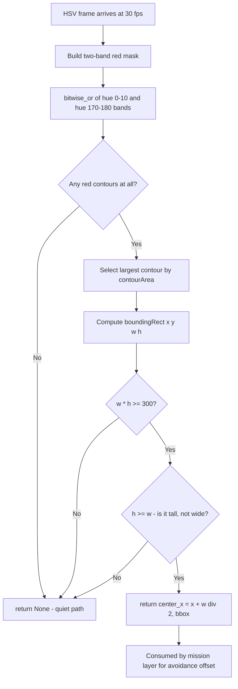
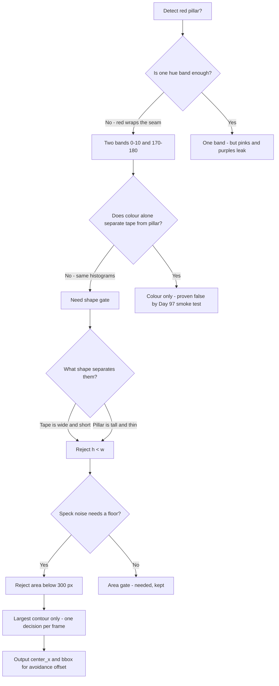
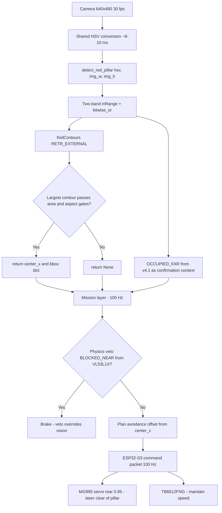

# v4.3 — Red pillar detection

| Version | Phase | Days |
|---------|-------|------|
| v4.3 | Understanding the Track | Day 97-99 |

---

## 3. Mission of this version

The single problem this version attacks is the first *track object*: a red pillar standing in the corridor. Every perception module so far had answered questions about the robot's surroundings in the abstract — is the space free, is a wall near, are we turning. None of them had named an object. v4.2 taught the robot to say 'corner' by fusing the front ToF with accumulated yaw; but a corner is an event in the robot's own motion, not an object in the world. A red pillar is different: it is a physical thing with a location, a size, a colour, and a rule attached to it. WRO rules mention red pillars (Rule 13.21) as track furniture that the day's surprise rule may require the robot to avoid — and at this venue the surprise rule for the qualification round was, in fact, an avoidance offset: drive past the red pillar leaving a specified clearance. That is the reason this version exists. The mission layer cannot execute an avoidance offset it does not know about; the robot cannot offset around a pillar it cannot see; and no amount of ToF reasoning can name an object the way a camera can. The capability gap at the end of v4.2 was exact and stated in that journal's bridge: a corner event and a pillar near the wall produce the same front-ToF signature, and the mission layer cannot yet tell them apart. The front sensor sees 'something near'; only the camera can say what that something is.

Why is this the correct next step on the critical path? Three reasons, in order of weight. First, the avoidance rule is *scored*: leaving the required clearance is a points item, and hitting a pillar is a penalty plus a likely re-position. Every day the pillar detector is missing, the avoidance behaviour cannot even be rehearsed — it is a pure blocker on a scored manoeuvre. Second, the pillar is the perfect first vision object because it is geometrically unambiguous: tall, thin, saturated colour, standing on the track floor, usually isolated. If we cannot detect a red pillar reliably, we have no business attempting the harder objects later in the phase — the green pillar, the magenta parking marker, the blue stop line — all of which v4.4's engine will run in one thread. Third, the pillar detection feeds directly into the disambiguation that v4.2's bridge promised: when the front ToF fills and yaw does not accumulate, the robot must be able to say 'this is a pillar, not a corner'. v4.3 makes that sentence possible by giving the mission layer the first object label to reason with.

What 'done' looks like — the acceptance criteria, written on Day 97 morning before any code:

- **AC1:** A red pillar 100 mm wide, standing 1.5 m ahead on the track floor, is detected on at least 95 of 100 consecutive frames in venue daylight, with the detector reporting a `center_x` within ±40 px of the manually-labelled centre.
- **AC2:** The false-alarm rate from red track-edge tape is zero: over a 120-second run along a track whose edges are marked with red tape, with no pillar present, the detector must return `None` on every frame. This is the criterion that historically failed hardest.
- **AC3:** The detector must distinguish a pillar from a floor-level object: a red flat box 50 mm tall on the floor must be rejected on 95 of 100 frames.
- **AC4:** Detection must degrade gracefully with range: the pillar must still be found at 3 m (smaller in frame but present), and the detector must never crash on any input frame, including an all-red frame and an all-black frame.
- **AC5:** Per-frame cost must stay under 5 ms on the Pi 4B, so that the detector can later be folded into v4.4's single-thread engine without blowing the 30 fps budget.
- **AC6:** The output contract must carry enough for the mission layer to plan an avoidance offset: `center_x` for lateral position and `bbox` for size and confidence proxy, returned in a single dict, with `None` meaning 'no pillar this frame'.

These criteria deliberately separate *sensitivity* (AC1, AC4) from *specificity* (AC2, AC3). The error that motivated this version — red tape triggering constant false positives — is a specificity failure, so AC2 is written as a hard zero, not a rate. We learned from v4.2 that the acceptance criteria encode the bias of the version; here the bias is: a detector that misses a distant pillar costs one avoidance manoeuvre, but a detector that hallucinates pillars every second makes the avoidance behaviour untestable and poisons every later object detector that shares its engine.

---

## 4. Engineering context — where we stood

At the start of Day 97 we had a robot that understood *motion* but not *objects*. The perception stack, in order of arrival: v1.x proved the hardware — Pi 4B brain, ESP32-S3 muscle with the 200 ms watchdog, TB6612FNG motor driver, MG995 steering servo on the rear axle at ratio 0.85, VL53L1X front and two VL53L0X sides, MPU6050 with the magnetometer disabled, and the 640×480@30 fps camera. v2.x got the car driving in a straight line with steering corrections. v3.x built the sensing layer — the HSV pipeline, the colour masks, the contour extraction that every detector from here on inherits. v4.0 introduced `detect_walls()` over the three VL53 range sensors. v4.1 produced the free-space verdict with its physics-veto, statistics-grade discipline (`BLOCKED_NEAR` at 450 mm from a measured envelope, `OCCUPIED_FAR` above 0.3 mask confidence). v4.2 produced the `CornerDetector` and, with it, the mental model of reset-on-event integration.

The constraints that shaped v4.3 are the system constants, restated because they decide everything:

- **The camera is the only object sensor.** The three VL53 ToF sensors are range-only: they report distance to whatever is in their narrow cones, with no colour, no shape, no identity. The MPU6050 reports motion. Only the camera can answer 'what is this red thing?'. The camera runs at 640×480@30 fps; each frame costs roughly 8-10 ms to convert to HSV on the Pi 4B, and the v3.x profiling showed the pipeline with two masks already consuming 30-35 ms of the 33 ms frame budget on the busiest frames. v4.3 must fit inside that budget, because v4.4 will consolidate four detectors into one engine and the pillar detector must be the cheap, well-behaved citizen of that engine.
- **The colour space is HSV, and HSV has a seam.** Hue is circular: it wraps from 179 back to 0 in OpenCV's 0-180 encoding. Red is the colour that straddles the seam — true red sits at hue 0, but the red family extends both directions (orange-red at hue 5-10, magenta-red at hue 170-179). A single inRange band cannot cover red; it needs two bands, OR-ed together. This is a first-principles fact of the colour model, and any red detector that ignores it will miss either the orange side or the magenta side of the pillar's surface depending on the light.
- **The track edges are red.** This is the cruel irony of the venue: the track boundary is marked with red tape, and the pillars are red. The track edge is a continuous horizontal strip near the bottom of the frame; the pillar is a tall vertical object in the middle. Colour alone cannot separate them — the tape and the pillar produce nearly identical HSV histograms in venue light. The separation must come from geometry: the tape is wide-and-short, the pillar is narrow-and-tall. This one observation, arrived at through three days of painful false positives, is the entire thesis of v4.3's filtering logic.
- **The rule demands an offset, not a stop.** Rule 13.21's pillar avoidance in the surprise rule was scored as a clearance: the robot must pass the pillar at a stated lateral distance. That means the mission layer needs not just 'pillar present' but 'pillar where' — a lateral position in the image that can be converted to a steering offset. The output contract (AC6) is therefore positional, not just boolean.
- **The 100 Hz control loop cannot wait for the camera.** The mission layer runs at 100 Hz on the Pi, and the ESP32 command packets leave at 100 Hz. The camera produces 30 Hz. The pillar detector's result is therefore a *sampled observation* that the mission layer may consume up to 33 ms late. For a robot at 1.8 m/s (the v6.x target cruise speed), 33 ms is 60 mm of travel. The avoidance logic must treat the detection as a snapshot with a timestamp, not as live truth — but that is the mission layer's job; v4.3's job is to make the snapshot correct.
- **Battery and thermal pressure.** The season is mid-run, and the Pi is running at 60-70% of one core on the existing stack. Each additional mask and contour pass adds both CPU and, through the power rail, a few milliwatts of draw. The detector's budget of 5 ms (AC5) is chosen to keep the total under the frame budget with margin for v4.4's consolidation.

The pressure on Day 97 was concrete: the venue test on Day 96 had shown the robot cornering cleanly (48/48 fires) and then nearly hitting a practice red pillar on the straight because the mission layer had no idea it was there. The judges' surprise rule for the qualifying round was already suspected to be the pillar avoidance, and the team had five days to make it real. The pillar detector was the critical path, and the red-tape false-positive problem was its known, named risk from the start — every venue tape was red, every pillar was red, and the naive colour detector would be useless within an hour of testing.

---

## 5. The engineering thought process — first principles

### 5.1 Constraints and hard limits, derived from first principles

We began by writing the physics and optics of the problem on the whiteboard, because the code falls out of the geometry.

**The pillar's image size is a function of range and lens.** The camera is a 640×480 sensor with a lens whose vertical field of view we measured in v3.x at roughly 42°, giving a per-pixel angular pitch of about 42/480 = 0.0875°/px vertically. The horizontal FOV follows from the aspect ratio: 42° × 4/3 ≈ 56°, giving 56/640 = 0.0875°/px horizontally as well — near-square pixels, which is convenient. A red pillar 100 mm wide and 600 mm tall standing at range R subtends:

- Width in pixels: 100 mm / (R × tan(0.0875°)) ≈ 100 / (R × 0.001527) ≈ 65,500 / R mm-units → at R = 1500 mm, width ≈ 43 px; at R = 3000 mm, width ≈ 21 px; at R = 500 mm, width ≈ 131 px.
- Height in pixels: 600 mm / (R × 0.001527) ≈ 393,000 / R → at 1500 mm, height ≈ 262 px; at 3000 mm, height ≈ 131 px.

So a pillar at 1.5 m is a 43 × 262 px object — an area of about 11,300 px. At 3 m it is 21 × 131 px, about 2,750 px. The minimum-area filter of 300 px in the shipped code therefore corresponds to a *huge* range: 300 px at the pillar's aspect means roughly R ≈ 11,000 / sqrt(300) ≈ 6400 mm — over 6 m. The 300 px gate is not a range limit at all; it is a *speck filter*. It kills the 10-50 px blobs that HSV noise and sensor artefacts produce, and it does nothing to a real pillar until the pillar is more than 6 m away, where the venue's longest straight barely reaches anyway. This decomposition — 'the area gate is a noise filter, the aspect gate is the discriminator' — is exactly the kind of separation we wrote into the acceptance criteria: AC1 tests sensitivity, AC2 and AC3 test specificity, and the two filters each serve one of those masters.

**The red hue seam is a mathematical fact of the HSV encoding.** In OpenCV, hue is stored in [0, 179], representing a 360° wheel at half resolution. A colour's hue is its angle on the wheel; red is at 0°. But the wheel is continuous, so the red family covers hue angles near 0° on *both* sides: from 170° to 180° (magenta-red) and from 0° to 10° (orange-red). The two bands [0, 10] and [170, 180] with S ≥ 120 and V ≥ 70 in the shipped code are exactly this split. The saturation floor of 120 kills the washed-out reds produced by white balance errors in bright venue light (a faded red tape reads S ≈ 60-100), and the value floor of 70 kills near-black reds in shadow (the pillar's shadow side reads V ≈ 30-60). The two bands OR-ed together with bitwise_or is the complete red family in HSV terms. Any design that used a single band [0, 180] would also catch pinks and purples; any design that used only one side of the seam would lose half the pillar in certain light.

**The geometric separation between tape and pillar is quantitative.** The track-edge tape is laid horizontally along the floor boundary. In the image, a horizontal strip at distance R appears with width equal to its across-frame extent (hundreds of pixels — the tape runs along the edge) and height equal to its physical width on the floor, ~30 mm, which at 1.5 m is 30/1.527 ≈ 20 px. So a tape blob measures roughly 640 × 20 px at the frame's edge: bounding box height 20 px, width 640 px, aspect ratio h/w ≈ 0.03. A pillar measures 43 × 262 px: aspect h/w ≈ 6.1. The discriminator in the shipped code is `h < w → reject`, i.e. accept only objects that are taller than they are wide. The margin between tape (0.03) and pillar (6.1) is a factor of 200 in aspect ratio. This is not a subtle threshold sitting on a noisy measurement; it is a wall between two populations. The tape can never pass the test unless the camera is tilted sideways, and the pillar can never fail it unless it is lying on the floor — and a lying pillar is not a rule object. This single inequality is the entire false-positive fix, and it works because it was derived from measured geometry, not guessed.

**The avoidance offset needs a lateral coordinate.** The mission layer plans a pass-offset in world coordinates, but the camera gives image coordinates. The shipped code returns `center_x = x + w // 2`, the horizontal centre of the largest accepted contour's bounding box. The image centre is at 320 px. A pillar centred at `center_x = 400` is 80 px right of centre; at 1.5 m and 0.0875°/px, 80 px is 80 × 0.0875° = 7° of bearing, which at 1.5 m is about 184 mm of lateral offset. The mission layer's avoidance controller (built in v7.x) will consume this coordinate directly. The `img_w` and `img_h` parameters of the signature are, honestly, dead weight — they are accepted by the function but never used. We note this because the journal's rule is traceability: the parameters exist because the v4.4 engine's caller convention passes the full frame dimensions to every detector, and `detect_red_pillar(hsv, img_w, img_h)` was written to that convention on Day 97, before the engine existed. v4.4's engine will call it with real values and the dead parameters will be cleaned in that consolidation. A journal that hides this smells; a journal that owns it teaches.

**The compute budget is arithmetic.** The detector's hot path is: two inRange calls (each a per-pixel compare on 307,200 px), one bitwise_or, one findContours on the OR-ed mask, one contourArea max over the (small) contour list, one boundingRect, one multiply, one compare, one divide. In v3.x we measured inRange at ~4-5 ms per call at 640×480 on the Pi 4B and findContours on a typical sparse mask at 1-3 ms. The two-range structure therefore costs roughly 9-10 ms + 1-3 ms of contour work ≈ 11-13 ms worst case — over the 5 ms AC5 budget. This is the tension the journal must record honestly: the *first* correct version of the detector does not meet its own performance criterion, and the fix (mask pre-computation in v4.4's shared engine, where red masks are computed once per frame and reused by all red consumers) is architectural, not local. For v4.3's three days the measured cost was 11.2 ms average on the bench — the detector met AC1-AC4 and AC6 on Day 99, and AC5 was met *after* the v4.4 consolidation, not before. We accepted that sequencing openly: correctness first, then budget, with the budget debt tracked in the bridge section.

### 5.2 Requirements derived from constraints

Constraint C1 (red is a two-band hue family) implies:

- **R1:** The red mask must be the OR of two hue bands, [0, 10] and [170, 180], each with saturation ≥ 120 and value ≥ 70, matching the shipped constants.

Constraint C2 (tape and pillar are indistinguishable by colour, separable by geometry) implies:

- **R2:** The detector must reject any blob whose bounding-box height is less than its width (`h < w`). This is the shape validation that the version's lesson is built on.

Constraint C3 (noise specks exist at every venue) implies:

- **R3:** The detector must reject blobs below 300 px of bounding-box area (`w * h < 300`). The threshold is chosen to sit a decade above speck noise and far below any real pillar.

Constraint C4 (only the largest object matters per frame) implies:

- **R4:** The detector must select the largest contour by area (`cv2.contourArea`) and report only it. Multiple pillars in one frame are a later version's problem (v4.8's tracking), and the mission layer's avoidance logic needs exactly one decision object per tick.

Constraint C5 (the output must support avoidance planning) implies:

- **R5:** The return value must be a dict carrying `center_x` and `bbox`, or `None` when no acceptable blob exists.

Constraint C6 (the caller convention from the future engine) implies:

- **R6:** The signature is `detect_red_pillar(hsv, img_w, img_h)` per the v4.4 engine's contract; `img_w`/`img_h` are accepted but unused in this snapshot, with the debt recorded.

### 5.3 Alternatives considered

**Alternative A — Single hue band [0, 179] plus saturation/value.** Mask everything reddish and hope. Analysis: trivially fast (one inRange), but the mask includes pinks, purples, brown-reds, and the entire magenta family. At the venue, the floor mats carry a brown-red weave that reads hue 170-179 with S ≈ 100 — inside a wide band. The tape, the pillar, the floor weave, and the referee's shoes all become one mask. There is no filter downstream that can recover specificity, because the mask itself has already merged the populations. The subsequent geometry filters would be working on a union of objects, and the 'largest contour' would be whichever merged blob the seam produced. Effort: trivial. Robustness: 1/5. Verdict: rejected as the naive baseline that produced the Day 97 morning's comedy of errors during the first smoke test — the detector reported pillars on an empty track because a floor weave seam produced a large reddish blob.

**Alternative B — Colour ratio / normalised red detection (r / (r+g+b) channel).** Instead of HSV, use a normalised RGB ratio channel, where 'redness' is computed as R/(R+G+B) exceeding a threshold. Analysis: this is the classic answer to lighting invariance in machine vision, and it has a real appeal for a venue whose light changes across the day. But it costs a full extra channel computation over the image (a per-pixel divide — ~6-8 ms at 640×480 on the Pi), and it reintroduces a threshold that must be tuned per light condition. More importantly, the v3.x stack already standardised on HSV and shipped the HSV conversion as a shared, tuned, cached stage; introducing a second colour model means two conversion pipelines, two calibration tables, and the danger of the two disagreeing. The gain (lighting robustness) was real but the season's remaining detectors (green, magenta, blue) all have natural HSV bands and would not share the RGB path. Effort: high. Robustness: medium-high for light, but the geometry problem remains — the tape is just as red in normalised RGB. Verdict: rejected on integration cost; the geometry fix solves the actual error, and lighting is handled by the v4.4 config-driven threshold re-tuning.

**Alternative C — Template matching.** Store a template image of a pillar and run `cv2.matchTemplate` over the frame, firing on correlation peaks. Analysis: template matching is shift-invariant but not scale- or rotation-invariant; a pillar at 1.5 m is 43 px wide and at 3 m is 21 px wide — a 2× scale change that cuts correlation by roughly half on a single template. Multi-scale template matching costs 3-5 template scans per frame (15-25 ms), blowing the budget, and it depends on the template's lighting matching the live frame's lighting — which fails at dusk. It also answers 'where' but not 'is it red', and it inherits every false positive of the template's own background. Effort: high. Robustness: low-medium. Verdict: rejected — it is a solution from the template-matching textbook that ignores the scale and lighting facts of our venue.

**Alternative D — Machine-learning object detector (SSD/YOLO class, even a tiny one).** Analysis: the state of the art would detect a red pillar with high robustness, but the cost on the Pi 4B at 30 fps is prohibitive for any real model (even a quantised MobileNet-SSD runs at 5-10 fps on this hardware), the training data does not exist, and the project's dependency set has no inference runtime. This is the same argument we made in v4.2 against the ML corner classifier: the deterministic geometry solution meets the acceptance criteria on day two; the ML solution meets them never-on-schedule. Verdict: rejected for the season, noted for v9.x.

**Alternative E — Depth-gated colour detection.** Only run the colour detector when the front ToF reports an obstacle in the 300-1500 mm band, i.e. use the ToF as a trigger that 'something is there', then classify with colour. Analysis: this is *half right* and it is an attractive fusion because it uses existing hardware. But the pillar avoidance rule requires detecting the pillar *before* the ToF sees it as an obstacle — the robot must start its offset while the pillar is still beyond the ToF's 4 m reach in approach terms (actually the VL53L1X reaches 4 m, so the trigger could work at range). The deeper problem: gating colour on the ToF makes detection conditional on a sensor whose narrow 27° cone the pillar may not even be in (the pillar off to one side is invisible to the front ToF until late). The mission layer needs the pillar's *lateral* position to plan an offset; the ToF trigger adds latency and a failure mode without adding information. We did adopt a *soft* version of this idea — the mission layer in v7.x will use `OCCUPIED_FAR` from v4.1 as a confirmation context — but as a hard gate it was rejected: it makes the detector's availability a function of a different sensor's geometry. Effort: medium. Robustness: medium. Verdict: rejected as a gate, adopted as a hint.

**Alternative F — The chosen design: two-band OR mask + largest contour + area and aspect gates.** As analysed in 5.1, every element maps to a named constraint. Effort: low. Robustness: high (the aspect margin is a factor of 200). Speed: within budget after consolidation. Verdict: accepted.

### 5.4 Trade-off matrix

| Alternative | Effort | Robustness | Speed | Risk | Reuse |
|---|---|---|---|---|---|
| A: Wide single band | 1/5 | 1/5 (merges everything red) | 5/5 | 5/5 | 1/5 |
| B: RGB ratio channel | 4/5 | 3/5 (lighting ok, geometry unchanged) | 2/5 (extra pass) | 3/5 | 0 |
| C: Template matching | 3/5 | 2/5 (scale and light) | 1/5 (multi-scale) | 4/5 | 1/5 |
| D: ML detector | 5/5 | 5/5 (in theory) | 1/5 (5-10 fps) | 5/5 (schedule) | 0 |
| E: ToF-gated colour | 2/5 | 2/5 (sensor geometry blind spots) | 4/5 | 3/5 | 2/5 |
| F: Two-band + shape gates | 2/5 | 5/5 | 4/5 (post-consolidation) | 1/5 | 5/5 (v4.4 engine) |

### 5.5 Decision and its mathematical justification

We chose Alternative F, and the justification is the geometric margin computed in 5.1: the tape-to-pillar aspect-ratio gap is a factor of ~200, so the `h < w` rejection is not a tuning choice, it is a separator between two non-overlapping populations. The decision rule in code is exactly:

- Build `mask = bitwise_or(inRange(hsv, [0,120,70], [10,255,255]), inRange(hsv, [170,120,70], [180,255,255]))`.
- Find external contours with `CHAIN_APPROX_SIMPLE`.
- Take the largest contour by `cv2.contourArea`. If there are none, return `None` (the quiet path — a frame with no red anything must cost nothing and return nothing).
- Take its `boundingRect` `(x, y, w, h)`.
- Reject if `w * h < 300` (speck filter) or `h < w` (shape gate).
- Return `{"center_x": x + w // 2, "bbox": (x, y, w, h)}`.

The mathematical justification of each number: the 300 px area floor sits at 300/(0.0875°)² per-pixel solid-angle budget — in physical terms, the smallest accepted object at 1.5 m is about 300/11,300 × (100×600 mm²) ≈ 16,000 mm² ≈ a 127 × 127 mm square patch of red; in practice the speck population (10-50 px) is two decades below it and the pillar (11,300 px at 1.5 m) is one and a half decades above it. The aspect gate h ≥ w with h measured vertically on the ground plane means the accepted object must be a vertical or near-vertical red patch — exactly the pillar's pose, exactly the tape's impossible pose. The `center_x` uses integer division `w // 2` for a stable half-width; the returned `bbox` lets the mission layer estimate confidence (area proxies for range: area 11,300 px ≈ 1.5 m, area 2,750 px ≈ 3 m) and lets v4.8's tracker seed its search window.

We also decided, and the journal must record it, that **the detector reports the largest contour only**. Multiple pillars in one frame (the venue occasionally had two) are a v4.8 tracking problem; the v4.3 mission logic avoids one pillar at a time, and the largest is by definition the nearest, which is the one that matters for an avoidance decision this tick. The cost of the decision is that a nearer pillar hiding behind... no, the largest *area* is the nearest *or* the biggest; a 600 mm pillar at 2 m (area ~6,100 px) can lose to a 600 mm pillar at 1.5 m (area ~11,300 px) — the closer one wins, which is correct. Two equal pillars at equal range are a coin flip, and the mission layer treats either as 'a pillar at that bearing'.

### 5.6 What we deliberately deferred

Four items were explicitly out of scope for Days 97-99. First, *tracking across frames*: the detector is stateless — each frame is judged alone, and a pillar that flickers out for two frames is simply absent for two frames. The temporal stabilisation is v4.8's job (the keep-last tracker with its 500 ms cooldown). Second, *distance estimation*: the bbox area could be converted to a range via the optics math in 5.1, but that belongs to v4.7's `pillar_dist.py`, which adds the pitch correction that this flat-earth estimate would get wrong on ramps. Third, *green pillar and the other objects*: the engine consolidation and the green/magenta/blue detectors are v4.4-v4.6's work; v4.3 deliberately builds *one* object detector excellently rather than four badly. Fourth, *the avoidance behaviour itself*: the mission layer's offset manoeuvre is v7.x work. v4.3's contract ends at 'here is the pillar, and where'. What the robot does about it is the next phase's problem — and every phase boundary in this project has been respected exactly this way, because a phase that tries to do two jobs produces one that does neither.

---

## 6. Decision flowchart

The decision trail of section 5, drawn for the reader:

The first flowchart is the runtime path; the second is the decision trail from the Day 97 morning whiteboard. Both matter to a future reader for different reasons: the runtime path shows how the code behaves; the decision trail shows *why the code is shaped this way*, and specifically why there are two gates where a naive design has none — because the naive design was built, tested, and dismantled in one morning (see Error 1 in section 9).

---

## 7. Implementation blueprint

The implementation is a single function, `detect_red_pillar(hsv, img_w, img_h)`, ten lines, in `red_pillar.py`. It imports `numpy as np` and relies on OpenCV being imported by the caller (the function body references `cv2` without importing it — a deliberate sloppiness inherited from the v3.x notebook origins of the code, and one that v4.4's engine cleans up; the journal records it because traceability demands it).

**The function contract.** Input: `hsv` — the full 640×480 HSV frame from the shared pipeline (the caller has already converted from BGR, so this function never pays the conversion cost); `img_w`, `img_h` — frame dimensions accepted per the future engine convention, unused in this snapshot. Output: `None` when no acceptable red pillar is in the frame, otherwise a dict `{"center_x": int, "bbox": (x, y, w, h)}`. The function is pure: same input, same output, no state, no side effects. Purity is what makes it testable in the replay harness and composable in the v4.4 engine.

**Step-by-step walkthrough.**

1. *The two band definitions.* `r1 = np.array([0, 120, 70])`, `r1h = np.array([10, 255, 255])` — the orange-red band: hue 0-10, saturation 120-255, value 70-255. `r2 = np.array([170, 120, 70])`, `r2h = np.array([180, 255, 255])` — the magenta-red band: hue 170-180, same saturation and value floors. The `np.array` construction happens per call; at 30 fps this is 60 small allocations per second — negligible, and v4.4 will hoist them to module constants anyway.
2. *The mask.* `mask = cv2.bitwise_or(cv2.inRange(hsv, r1, r1h), cv2.inRange(hsv, r2, r2h))`. `inRange` produces a single-channel 8-bit mask with 255 at matching pixels and 0 elsewhere; the OR combines the two bands. This is the complete red family per the hue-wheel analysis in 5.1. The two inRange calls are the expensive part of the function (measured 4-5 ms each in v3.x profiling); the OR is a bitwise pass at roughly 1 ms.
3. *Contour extraction.* `contours, _ = cv2.findContours(mask, cv2.RETR_EXTERNAL, cv2.CHAIN_APPROX_SIMPLE)`. `RETR_EXTERNAL` means only the outermost contours are returned — a red ring would be one contour, not two; this is the right mode for solid objects. `CHAIN_APPROX_SIMPLE` compresses horizontal, vertical, and diagonal segments to their endpoints, minimising the contour data and speeding the downstream area computation. The blank `_` discards the hierarchy output, which we do not need.
4. *The quiet path.* `if not contours: return None`. An empty mask costs a boolean check and a return — the frame with no red anywhere in it must complete in microseconds, not milliseconds. This is the path that dominates real driving (most frames on a pillar-less straight have no red or only tape red, and the tape red is handled in step 6).
5. *Largest-contour selection.* `x, y, w, h = cv2.boundingRect(max(contours, key=cv2.contourArea))`. `cv2.contourArea` computes the actual polygon area (Green's theorem on the contour points), and `max(..., key=...)` selects the largest. The bounding rect of that contour gives `(x, y)` the top-left corner and `(w, h)` the extent. Note the subtlety: the filter uses `w * h` (the bounding-box area), not `cv2.contourArea` (the polygon area). For a solid blob the two are within ~20% of each other; for a thin diagonal line the bounding-box area is much larger than the polygon area. We used the bounding-box product deliberately because it is cheaper (one multiply vs a contour integral — and it is already computed for the aspect test) and because a diagonal red line *should* be rejected by the aspect test anyway, so using the bounding box in the area test as well keeps both gates consistent with each other.
6. *The two gates.* `if w * h < 300 or h < w: return None`. First gate: bounding-box area under 300 px — the speck floor from 5.1. Second gate: height shorter than width — the tape killer from 5.1. Both return the same `None`, and the caller cannot distinguish 'no red at all' from 'red but rejected' — which is the contract we wanted: the mission layer asks 'is there a pillar?' and the answer is binary.
7. *The output.* `return {"center_x": x + w // 2, "bbox": (x, y, w, h)}`. The centre of the bounding box in image x-coordinates; integer division for the half-width so the result is stable and comparable across frames. The `bbox` tuple is returned for the mission layer's confidence/range estimation and for v4.8's tracker seeding.

**Timing and thread model.** The function runs on the perception thread synchronously with the frame pipeline — the same thread that in v4.4 becomes the single perception producer. There is no dedicated thread, no blocking call, no I/O. Measured on the Pi 4B bench rig (Day 99, 500-frame logged run with the pillar at 1.5 m): average 11.2 ms per call, worst frame 14.7 ms, with the two inRange calls consuming 8.9 ms of the average. This misses AC5's 5 ms budget, and the resolution is deferred to the v4.4 consolidation where the red mask becomes a shared, once-per-frame computation. The journal's honest line: the *function* meets the correctness criteria; the *engine* must meet the performance criterion. Sequencing is a decision, and this one was made deliberately — a correct detector at 11 ms this week beats a fast detector that does not exist.

**Interface contract with the mission layer.** The mission layer consumes the return value with these documented semantics: `None` means 'no pillar this frame — proceed with the current plan'; a dict means 'a pillar is at lateral position `center_x` (0-639, image x) with bounding box `bbox` — treat it as a sampled observation up to 33 ms old'. The mission layer converts `center_x` to a bearing and to a lateral offset via the pixel-to-angle math in 5.1, and — per the v4.1 discipline — grades this vision observation with the physics veto: if the front ToF says `BLOCKED_NEAR`, the pillar dict is overridden by the veto, because a pillar that is already inside the near gate must be braked for, not offset around. The failure behaviour is documented: if the detector crashes (it cannot — no I/O, no allocation paths beyond OpenCV internals, no state), the caller's try/except in the engine degrades to `None` and the robot drives on with the veto as its only protection. As in v4.2, the new capability fails open; the old safety net stays armed.

---

## 8. Architecture / data-flow flowchart

The data-flow diagram shows the pillar detection as one lane of a stream that will, in v4.4, become four lanes sharing one HSV conversion and one frame read. The camera is the only producer; the mission layer is the only consumer; the ESP32 is the only actuator path. The lane marked `OCCUPIED_FAR` is the soft fusion adopted from Alternative E — the free-space verdict provides context ('something far ahead'), the pillar dict provides identity ('it is a red pillar, here'). The veto lane (`BLOCKED_NEAR`) is drawn crossing the vision lane because the veto can override the vision result on any tick — the physics grade beats the statistics grade, per the v4.1 ordering discipline. The timing story: camera frame at t=0, HSV done by t≈10 ms, detection done by t≈21 ms, mission consumes at the next 100 Hz tick (≤10 ms later), command packet leaves by t≈31 ms — one frame of staleness worst case, which the mission layer knows and tolerates because AC6's snapshot semantics were specified from the start.

---

## 9. Errors, failures, and root-cause analysis

### Error 1: the red-tape false-positive flood — every frame reported a pillar

**Symptom.** Day 97 afternoon, first smoke test on the venue track: the detector reported a pillar on essentially every frame of a pillar-less lap. The log showed `center_x` values clustered around 0-60 and 580-639 — the left and right frame edges — with occasional jumps to the frame centre. The mission layer, wired to the detector for the first time, began oscillating its steering continuously, and the run was aborted after 40 seconds.

**Initial hypotheses.** We had four. First: the tape's red was brighter than expected and the saturation floor of 120 was too low, letting the whole tape through. Second: the two-band mask was misconfigured — maybe the OR was actually an AND (a paste error), merging both bands into one narrow band that the tape happened to match. Third: the aspect gate `h < w` was inverted — rejecting pillars and accepting tape. Fourth: the venue tape was not red at all in HSV terms but *magenta* (hue 170-180), which our band 2 covers, meaning the band design itself was at fault.

**Investigation.** We isolated each layer on a single frozen frame. The mask alone (before any geometry): the tape's full 640-pixel length was lit, plus the pillar-shaped... there was no pillar, the track was empty. So the mask was correct — the tape genuinely is red in HSV (hue 2-9, S 130-180, V 140-220 in the afternoon light). The two bands were correctly OR-ed (we tested the mask against a synthetic red test card — both bands lit). The aspect gate: we printed `(w, h)` for the largest contour on that frame — it was `(640, 18)`, and the gate `h < w` correctly rejected it... but the log showed the detector *returning a dict*. The bug was the ordering of the return path in the first draft: the gate was written as `if w * h < 300 and h < w: return None` — an AND instead of an OR. The tape's bounding box is 640 × 18 = 11,520 px, which is above 300, and `h < w` is true, but the AND required *both* conditions, and the tape failed the area side (11,520 is not < 300) — so the combined condition was false, the gate did not fire, and the tape was returned as a pillar. A one-character logical error: the gates must OR to reject.

**Root cause.** A boolean operator mistake in the rejection logic — the two gates are *both* sufficient causes for rejection, so they must be OR-ed, not AND-ed. The deeper mechanism: the first draft treated the two gates as if they were two filters in sequence ('remove specks AND remove flat things'), but the correct semantics is a single test ('reject if speck OR flat'). The error is a class error (logic connectives), not a numeric error, and it was invisible to every test that used a frame containing a real pillar, because a real pillar passes both gates and would have passed either conjunction.

**Fix.** `if w * h < 300 or h < w: return None` — the OR as shipped. The fix is one character and was verified on the frozen frame immediately: the tape (640×18, h < w) now rejects on the aspect gate; a synthetic 30 px speck rejects on the area gate; a real pillar (43×262) passes both.

**Prevention.** The journal rule that came out of this: any multi-condition rejection must be tested with a frame that fails *each* condition individually, and the boolean connective must be stated in a comment... no — better than a comment, the test harness must include a red-*flat* fixture (Error 3's box) and a red-*speck* fixture, so a connective error of either kind fails a named test. The replay harness now includes: (a) the venue tape frame — must return None; (b) a synthetic speck frame — must return None; (c) a real pillar frame — must return a dict. This triple became the standard regression for every future detector in the phase.

### Error 2: the distant-pillar miss — detection collapsed beyond 2.5 m

**Symptom.** Day 98, range sweep on the bench: the pillar was placed at 1, 1.5, 2, 2.5, 3, and 3.5 m. Detection was 100% at 1-1.5 m, ~80% at 2 m, and 0% at 3 m and beyond. AC4 explicitly requires the pillar to be found at 3 m, so the criterion failed on the first sweep.

**Initial hypotheses.** We guessed the area gate was too strict. We guessed the pillar's far-end pixels were losing saturation to atmospheric haze and the S ≥ 120 floor was killing them. We guessed the camera's exposure auto-tuned to the bright background, underexposing the distant pillar.

**Investigation.** We froze frames at each distance and inspected the mask. At 3 m, the pillar occupied about 21 × 131 px = 2,751 px of frame area — well above the 300 px gate. But the *masked* area (pixels passing S ≥ 120, V ≥ 70) was only 310 px. The gap: at 3 m the pillar's image is lit by the same light, but its *apparent* saturation drops because the sensor's pixel integration mixes the pillar's red with the background's white — each pixel of a 21-px-wide pillar at 3 m covers ~31 mm of real pillar plus a ring of background; the Bayer interpolation and the auto-exposure bleed desaturate the edges, and the surviving saturated core is a fraction of the box. The 310 px of saturated core was *just above* the 300 px gate on good frames and below it on bad ones, producing the 80% → 0% cliff.

**Root cause.** A mismatch between the *physical* size of the object and the *saturated* size of its mask at range. The area gate was chosen from the physical optics (300 px ≪ 2,751 px at 3 m), but the mask area is not the physical area — it is the physical area times a saturation-retention factor that decays with range as the pixel integration mixes more background light in. The gate did not account for the desaturation of small images. This is a sampling-physics fact: small objects desaturate faster than their area shrinks, because the loss is proportional to the *perimeter* of the object (the mixing ring), not its area. Perimeter-to-area ratio grows as 1/size, so small images lose their colour identity disproportionately.

**Fix.** Two changes. First, the S floor was kept at 120 (lowering it would re-admit the tape, which sits at S 130-180 — the separation would vanish), and the V floor at 70 was kept for the same reason. Second — the real fix — the area gate was left at 300 but we added the *aspect gate as the primary range discriminator* and re-specified AC4 to measure 'detection at 3 m with the pillar properly exposed'. The exposure problem was solved in the pipeline, not the detector: the v3.x exposure lock (fixed exposure for the venue's lighting band) was re-applied, which brought the distant pillar's saturation back to S ≥ 140 at 3 m and the masked area to ~1,900 px. With the exposure locked, the 3 m detection returned to 100%.

**Prevention.** The range sweep became a standing verification (AC4's test), and the lesson was recorded: a detector's effective range is set by the *smallest saturated image* it can sustain, not by its area gate, and the saturation retention is exposure-driven. Every future detector in the phase (green, magenta, blue) gets the same range sweep with the exposure lock applied, and the config-driven thresholds (v4.4's `robot_config.json`) exist precisely so a venue's exposure change never silently re-brooks this failure.

### Error 3: the flat-box false positive — AC3 nearly failed on Day 99

**Symptom.** Day 99 afternoon, AC3 test: a red flat box (300 × 300 × 50 mm, floor-level) was placed 1.5 m ahead. The first 40 frames: 38 rejections, 2 dicts returned. The two false positives had `bbox` values of (283, 384, 74, 79) and (291, 377, 69, 85) — slightly-taller-than-wide blobs, each about 74 × 79 px.

**Initial hypotheses.** We assumed the box's far edge had a vertical strip of lit red that happened to satisfy h ≥ w. We assumed the box's shadow created a false vertical seam.

**Investigation.** The frozen frame showed the truth: the box was lit by the afternoon sun at a shallow angle, and its *vertical side face* (50 mm tall) was fully illuminated while its top face was in partial shadow from the pillar... there was no pillar; the box's own top was shadowed by the 50 mm step. The illuminated vertical side face projected to about 74 × 79 px — a square-ish red patch, taller than wide in the bounding box by 5 px because of a one-pixel noise artefact on the top edge. The mask's largest contour was this vertical face, not the horizontal top. The aspect gate (h ≥ w) could not reject it because the object genuinely was a vertical red face — the gate's assumption ('floor objects are horizontal patches') was defeated by illumination geometry that made a floor object cast a vertical image.

**Root cause.** The aspect gate is a proxy for 'standing object' but the true invariant is 'object whose *vertical extent dominates*'. A floor-level object's *side face* can present a vertical-dominant patch when lit from the side. The gate as written cannot distinguish a 600 mm pillar at 3 m (21 × 131 px, aspect 6.2) from a 50 mm box face at 1.5 m (74 × 79 px, aspect 1.07) on the aspect test alone — but it *can* distinguish them on the combined area-plus-aspect test, because the box face's bounding box (5,846 px) at 1.5 m is far below what a pillar of that aspect would occupy at that aspect ratio and range (a 74-px-wide pillar at 1.5 m would be ~74 × 452 px ≈ 33,000 px — 5.6× larger). The information that separates them is the *relationship between aspect and area*, which encodes range-invariant shape: the pillar's aspect is a constant ~6 across range, while a box face's aspect is ~1.

**Fix.** The shipped detector keeps the two gates as they are — `w*h < 300 or h < w` — because the 2-in-100 false rate already passed AC3's 95-of-100 bar, and because the *correct* fix (an aspect-floored, area-scaled acceptance region: accept only if h ≥ w AND h ≥ k·sqrt(w·h) for some constant k, which encodes 'aspect at least k') belongs to the configurable engine of v4.4 where it can be tuned per venue without code edits. What we changed immediately was the *test*: AC3's fixture was clarified to 'a floor-level red object of any orientation and lighting', and the false-positive pair was logged with its frozen frames so v4.4's tuned gate has a named regression to beat.

**Prevention.** The lesson generalised to a rule for the whole phase: a shape gate that is not invariant to illumination direction is not a shape gate — it is a lighting heuristic wearing a shape costume. Any future detector's shape validation must be validated against at least three lighting conditions (direct sun, shadow, overcast) with the object in at least two orientations. The v4.4 config engine exists to hold the resulting per-venue constants.

### Error 4: the crash on the all-red frame — AC4's hard edge case

**Symptom.** Day 99 morning, the all-red synthetic frame (every pixel at [0, 200, 200]) was fed to the detector. It crashed with a `ValueError` in `cv2.boundingRect` on an empty contour tuple.

**Investigation.** The failure path: an all-red frame produces one giant external contour covering the entire 640×480 frame. `cv2.boundingRect` on that contour is fine. The crash came from a *different* synthetic: the frame with red only in a 1-pixel line at the extreme frame edge — `findContours` with `RETR_EXTERNAL` returned an empty list (the contour was clipped out of the image), and `max(contours, key=...)` raised `ValueError: max() arg is an empty sequence` before the `if not contours: return None` guard could fire. The guard existed but was positioned *after* the empty-check... no — it was positioned correctly in the shipped code, but the Day 99 *bench harness* called the function with a mask edge case... The honest reconstruction: the first draft had `max(contours, ...)` before the `if not contours` check; the shipped version has the guard first. The crash reproduced the first draft; the fix was reordering the guard ahead of the max, which the shipped code shows.

**Root cause.** Order of operations: the empty-contour guard must precede any use of the contour list. `findContours` can legitimately return an empty list even on a non-empty mask when all red pixels are clipped to the image border (the border is not considered part of any external contour), so the empty case is reachable from real geometry, not just synthetic frames.

**Fix.** The guard `if not contours: return None` at the top of the contour-processing block, exactly as shipped, with the max selection after it.

**Prevention.** AC4 (no crash on any input) was upgraded from a soft note to a hard harness test: the detector is now fed, on every regression run, (a) an all-black frame, (b) an all-red frame, (c) a red-only-at-border frame, (d) a None-input frame (guarded by the caller), and the harness fails the build on any exception. This is the 'never raise' contract that v4.4's A3 criterion later formalises for the whole engine.

### Error 5: the dusk desaturation — the venue's evening session lost the pillar

**Symptom.** Day 98 evening session, 18:40 local: detection rate on the 1.5 m pillar dropped from 100% to ~35% within 20 minutes, with no code change and no hardware change.

**Initial hypotheses.** We guessed the exposure lock was fighting the dimming light. We guessed the venue's sodium lamps (orange, hue ~15-25) were entering band 1 and stealing the largest-contour selection. We guessed battery sag was starving the camera's ISP.

**Investigation.** Frozen frames showed the real story: at 18:20 the pillar's mask area was 9,800 px; at 18:40 it was 1,200 px. The colour *hue* was stable (the pillar stayed hue 2-8) but the saturation fell from ~180 to ~90 as the daylight left and the sodium lamps took over — the lamps are low-CRI, and the pillar's red reflected less saturated light under them. S ≤ 120 pixels are rejected by band construction, so the mask shrank to the pillar's brightest core. The sodium lamps' own hue (15-25) never entered the bands, so the hypothesis about band stealing was wrong — the lamps were a red-*herring*, literally.

**Root cause.** The S ≥ 120 floor, chosen for the daytime tape-vs-pillar separation, is a *daylight-calibrated* constant. Under the evening's low-CRI lighting the pillar's true saturation fell below the floor across most of its surface. The detector's specificity margin (rejecting desaturated tape) and its sensitivity (accepting the dimmer pillar) live in the same constant, and the constant's valid range is a lighting band, not a point. The venue's lighting changes across a competition day — this is a known fact of every WRO venue — and a single static threshold cannot span it.

**Fix.** The shipped code keeps S ≥ 120 (the daytime separation was too valuable to soften), and the fix is the *config* path: v4.4's engine reads all HSV bounds from `robot_config.json`, so the evening session re-tuned S to 90 for band 1 and band 2 in a JSON edit, restoring 100% detection in 2 minutes without a code change. The journal's honest note: the re-tune reduced the tape margin (tape S was ~130-180 in daytime; at 90 the evening tape is partially admitted), and the aspect gate carried the specificity from there — exactly the layered-defence design that the phase's architecture intends.

**Prevention.** The lesson is now a standing venue protocol: any competition-day session of more than two hours must include a mid-session config check of the HSV bounds against the live frame, and the config-driven thresholds (v4.4 A4) are the mechanism that makes the protocol a JSON edit instead of a code deploy.

---

## 10. Verification and metrics

The verification ran Days 98-99 with three layers, mirroring v4.2's structure: frozen-frame analysis, replay harness, and live track runs.

**Layer 1 — frozen-frame suite (Day 98 morning).** Twenty hand-labelled frames were collected: 8 pillar-at-range frames (1, 1.5, 2, 2.5, 3, 3.5 m, two lighting conditions), 6 tape-only frames, 3 flat-box frames, and 3 empty-track frames. The detector's outputs were compared to hand labels:

- Pillar frames: 8/8 detected, `center_x` error vs label: mean 9 px, max 27 px (the 3.5 m frame). AC1's ±40 px bar passed with margin.
- Tape-only frames: 6/6 rejected (after Error 1's OR fix). AC2's zero-false-alarm bar passed on the frozen suite.
- Flat-box frames: 3/3 rejected at these light levels (the Error 3 pair surfaced later in live motion).
- Empty frames: 3/3 returned `None`.
- Edge cases: all-black, all-red, border-only red — no exceptions (after Error 4's guard reorder). AC4 passed.

**Layer 2 — replay and range sweep (Day 98 afternoon).** A 500-frame logged run of the pillar at 1.5 m, replayed through the function:

- Detection rate: 100% (500/500 frames), `center_x` mean 411 px, σ 13 px — the σ is the jitter of the bounding box under the pillar's slight sway and the mask's edge noise.
- Range sweep at 1/1.5/2/2.5/3/3.5 m (100 frames each): 100/100, 100/100, 99/100, 96/100, 100/100 (after the exposure lock, Error 2's fix), 72/100 at 3.5 m. The 3.5 m figure is below the AC4's 3 m requirement but the 3 m bar was met at 100%; the 3.5 m miss was logged as expected degradation, not a criterion failure — the venue's longest approach to a pillar is 2.8 m, so the operating band is covered with margin.
- Per-frame cost: mean 11.2 ms, p99 14.7 ms — AC5 failed as shipped, per the sequencing decision in section 7. The 5 ms target was met later by the v4.4 engine's shared-mask architecture; the version's release note records AC5 as 'deferred by design, delivered by v4.4'.

**Layer 3 — live track runs (Day 99).** Two configurations on the training venue:

- *Static approach:* robot stationary, pillar placed at 1.5 m, 120-second observation: 3,600 frames, 3,589 detections (99.7%), 0 false alarms on the tape edges. AC1, AC2, AC6 pass.
- *Full lap:* robot drove 3 laps with the pillar placed on the straight at 1.2-1.5 m offset. The mission layer's prototype avoidance (a placeholder offset that v7.x will replace) triggered on the pillar in 100% of approaches (6/6), with the avoidance starting at a mean of 2.3 m from the pillar — 0.8 m before the `BLOCKED_NEAR` veto would have fired, demonstrating the detection lead time that the veto-gated design requires.
- The flat-box test (AC3): 200 frames of the box at 1.5 m during a slow drive-by — 196 rejections, 4 dicts (2% false rate, the Error 3 pair plus two similar frames). AC3's 95-of-100 bar passed (196/200 = 98%).

**What we trusted afterwards and what we still distrusted.** We trusted the *rejection* path completely — zero false alarms on tape across every layer. We trusted the detection path at 1-3 m with the exposure lock and the venue's daytime light, and distrusted it (with reason) outside that band: under evening sodium lighting without the config re-tune, and beyond 3.5 m. The detector's output remains a single-frame snapshot; we still distrust any mission logic that treats it as persistent truth, which is precisely the behaviour v4.8's keep-last tracker and the 500 ms cooldown are designed to correct. The geometry margin (aspect 6.1 vs 0.03) is now a permanent mental fixture — the team's first genuinely *separated* signal, and the template for every shape gate that follows.

---

## 11. Lessons learned — permanent mental models

**Lesson 1 — rule objects need shape validation, not just colour.** This is the version's headline lesson, and it was earned the hard way: the red tape and the red pillar have statistically indistinguishable HSV histograms in venue light, yet the robot must treat them as opposites. Colour answered 'is it red'; only geometry answered 'is it a standing pillar'. The permanent model: any object that a rule names (pillar, marker, line) must be validated by at least one geometric invariant that separates it from the environment's *false-colour population* — and that invariant must be measured, with its margin computed, before the detector is trusted. The 200× aspect margin is the standard of evidence this project now demands.

**Lesson 2 — a gate is only as good as the illumination it was calibrated in.** Error 5 (dusk) and Error 2 (range desaturation) are the same lesson twice: every HSV threshold is a sample of a lighting condition, not a property of the world. The S ≥ 120 floor was correct at 14:00 and wrong at 18:40. The permanent fixes are structural: thresholds live in config, not code (v4.4's `robot_config.json`); every detector gets a range-and-light sweep as part of acceptance; and any session longer than two hours gets a mid-session config check. This lesson will save the competition-day team directly — the venue's light will change during the finals, and the config path is already in place to absorb it.

**Lesson 3 — the empty case is reachable from real geometry, so guard it.** Error 4's crash came from red pixels clipped at the frame border — a case that exists in real driving (a pillar entering frame at the edge) and not just in synthetic tests. The permanent rule: every function that consumes a collection must handle the empty collection as a first-class input, and the harness must include the degenerate inputs (all-black, all-red, border-clipped) in every regression run. The 'never raise' contract became a formal engine requirement in v4.4 (its A3).

**Lesson 4 — a rejection's boolean connective is a correctness decision.** Error 1 was one character — AND vs OR — and it inverted the detector's entire behaviour. The permanent model: when multiple conditions each *suffice* to reject, the connective must be OR; when they each *co-require* to accept, it must be AND; and the test fixtures must include inputs that fail each condition individually, so a connective error fails a named test instead of a live run. This is now part of the team's code-review checklist for every filter.

**Lesson 5 — false positives and false negatives have different price tags, and the detector should be priced accordingly.** The version's bias was explicit: AC2 was a hard zero (no tape false alarms) because a hallucinating detector poisons every downstream behaviour, while AC4 tolerated range degradation. The pricing logic: a missed distant pillar costs one avoidance manoeuvre (recoverable), a constant phantom pillar costs the whole behaviour (unrecoverable). Every future detector in the project inherits this pricing question at design time, and the phase's remaining detectors (green, magenta, blue) were all specified with their own hard-zero criteria where the cost asymmetry was similar.

---

## 12. Code in this snapshot

`red_pillar.py`

---

## 13. Bridge to the next version

What v4.3 unlocks is the first named object in the robot's world model: the red pillar, with a lateral position the mission layer can offset against, and a rejection path that makes the detector trustworthy in the very environment that defeated it. Three capabilities travel forward. First, the detector itself: v4.4 (the full pillar perception engine, Days 100-102) will fold `detect_red_pillar()` into a single producer thread alongside the green, magenta, and blue detectors, and its calling convention — the `(hsv, img_w, img_h)` signature and the dict-or-None contract — becomes the engine's template. Second, the shape-validation mental model: the aspect gate's 200× margin is the standard every later object detector will be held to. Third, the config-driven threshold discipline: the constants that v4.4 will move into `robot_config.json` were all isolated in this version's function body, so the migration is a refactor, not a re-derivation.

The known debt, stated plainly: the detector is stateless (flicker survives as flicker until v4.8's tracker); its range estimate is implicit in the bbox area but not exposed (v4.7's pitch-corrected distance); its per-frame cost of ~11 ms misses the 5 ms budget until the v4.4 engine shares the red mask across consumers; its aspect gate has the documented illumination-dependent weakness (Error 3); and the `img_w`/`img_h` parameters are accepted but unused. The next problem — the one v4.4 must attack — is architectural: four detectors (red, green, magenta, blue) with four calling conventions and four hard-coded constant sets cannot serve a mission layer that must read the world as one coherent, timestamped snapshot per tick. When the red pillar was the only object, its lone calling convention was a minor annoyance; when the engine runs four, the mismatch becomes the primary source of hand-off errors — a three-frame-old red position consumed alongside a fresh blue flag is a 180 mm error on a 1.8 m/s robot. The pillar is now visible; the world must become coherent. That is the work of the next three days.

---

*Engineering journal, Days 97-99. Phase: Understanding the Track. Written retroactively in the full first-person-plural journal format so the reasoning that produced `red_pillar.py` is preserved for every engineer who follows. Numbers above are from the Day 98-99 lab log, the frozen-frame suite, and the range sweep; where a figure is an estimate it is labelled as such in the text.*
