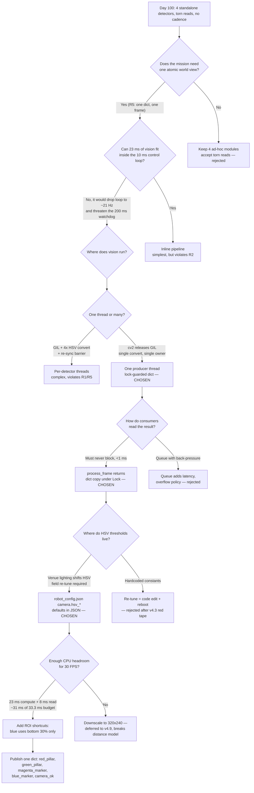

| Version | Phase | Days |
|---------|-------|------|
| v4.4 | Understanding the Track | Day 100-102 |

# v4.4 — The Full Pillar Perception Engine: One Frame, One Thread, One Dict

## 3. Mission of this version

The single problem this version attacks is architectural, not algorithmic. Since
Day 88 we had been building track-understanding one detector at a time: v4.0
gave us `detect_walls()` for the three VL53 range sensors, v4.1 classified free
space, v4.2 produced a `CornerDetector` class, and v4.3 shipped `detect_red_pillar()`.
Every one of those modules had its own calling convention, its own hard-coded
constants, and its own idea of when it ran. The red pillar detector ran on
whatever frame happened to be lying around; the corner detector ran on gyro
samples that arrived at a completely different rate; the free-space classifier
consumed a mask confidence value that no other module produced. There was no
single moment in time at which the mission layer could say "this is what the
world looked like, all at once." For a walled track with pillars, parking markers
and stop lines, that is a fatal absence: the mission manager makes one decision
per control tick, and it needs one coherent view of the world to decide against.

Why is this the correct next step on the critical path to the competition?
Because WRO 2026 scoring does not reward single-sensor tricks; it rewards a robot
that can *transition* — drive the straight, avoid the pillar, brake on the blue
line, find the magenta parking zone — and every transition is a hand-off between
perception and behaviour. Hand-offs are where we lose points. If the mission
layer reads a red pillar position that is three frames old while the blue-stop
flag is fresh from the current frame, the avoidance offset and the stop decision
are computed against two different worlds. At 1.8 m/s the robot covers 60 mm per
33 ms frame, and a three-frame mismatch is 180 mm of positional error on an
avoidance manoeuvre that tolerates maybe ±50 mm. The capability gap at the end of
v4.3 was therefore not "we cannot see red pillars" — it was "we cannot see
anything *consistently*." Perception had to become a single producer of a single
timestamped, class-labelled result dict, delivered on a steady cadence, and
consumed by the mission layer as one atomic snapshot.

We wrote the acceptance criteria before writing a line of the new engine:

- **A1 — One result dict per frame.** `process_frame()` must return a single dict
  carrying `red_pillar`, `green_pillar`, `magenta_marker`, `blue_marker`,
  `frame_processed` and `camera_ok` in one read, never a partial update.
- **A2 — Steady 30 FPS cadence.** The producer thread must sustain 25–30 frames
  per second end-to-end (camera read + HSV convert + four detectors + publish)
  measured over a 60-second run, with no single frame taking more than 60 ms.
- **A3 — Zero blocking of the 100 Hz control loop.** The mission loop must never
  wait on camera I/O or OpenCV. `process_frame()` must complete in under 1 ms and
  must never raise even if the camera dies.
- **A4 — All colour thresholds in config.** Every HSV bound must be read from
  `robot_config.json` (`hsv_red1`, `hsv_red2`, `hsv_green`, `hsv_blue`,
  `hsv_magenta`), with the tuned values as defaults in the JSON, so a venue
  re-tune never requires a code edit.
- **A5 — Green pillar/floor separation.** In the venue lighting used at the last
  test, green-pillar false positives triggered by the floor must be zero over a
  120-second stationary run, and true green-pillar detections at 500–1500 mm must
  still succeed at the same thresholds.

"Done" meant all five criteria green on the bench robot, with the engine
surviving a camera unplug during an active run (camera loss must degrade to
`camera_ok=False` and not crash the thread).

## 4. Engineering context — where we stood

At the end of v4.3 (Day 99) the robot could do four distinct perception tricks,
but they did not compose. The wall picture from `detect_walls()` was solid: the
three VL53s — a VL53L1X on the front, two VL53L0X on the sides, XSHUT-sequenced
so they share the I2C bus at addresses 0x30/0x31/0x32 — gave us
`left_wall_mm`, `right_wall_mm`, `front_dist_mm`, and the <30 mm blind spot was
reported as 0.0 so higher layers could treat 0 as "too close". v4.1's free-space
logic (`front_mm < 450 → BLOCKED_NEAR`, else a saturation-confidence gate)
fed the emergency brake, whose distance we had already pinned in config at
`EMERGENCY_BRAKE_DIST_MM: 180`. v4.2's `CornerDetector` integrated gyro yaw with
a 75° threshold and a `front_mm < 350` trigger, resetting accumulated yaw on
every detected corner so the 85–95° gyro-drift error could never compound. v4.3's
`detect_red_pillar()` used the classic two-range red mask — hue 0–10 and 170–180,
saturation ≥120, value ≥70 — then validated aspect ratio (`h >= w`) and a 300 px
minimum area to reject the red track-edge tape that had been firing false
positives.

The known weaknesses were structural. Each detector was a standalone module with
a different signature: `detect_walls(raw)` took a raw sensor dict;
`free_space(front_mm, mask_confidence)` took two scalars; `CornerDetector`
was stateful across calls; `detect_red_pillar(hsv, img_w, img_h)` wanted a
converted HSV frame. That meant the caller (a cobbled-together test harness)
owned all the ordering: convert BGR→HSV once, call red, call blue, call magenta,
call free-space, then stitch the results into a dict by hand — and the stitching
was wrong more often than any individual detector. There was no locking, so a
slow frame could be torn mid-read. There was no cadence guarantee, so mission
logic saw results at the whim of USB camera timing. And critically, the green
pillar detector did not exist as a committed module at all — green pillars are a
mandatory obstacle in the WRO rules and we had been treating them as "a red
pillar, but green", which is exactly the kind of sloppy abstraction that dies at
a venue.

The system-level constraints that shaped everything about this version:

- **Pi 4B CPU budget.** The brain is a Raspberry Pi 4B, four Cortex-A72 cores at
  1.5 GHz, and by Day 100 it was already running a 100 Hz main loop, an
  asynchronous I2C sensor poll thread, a UKF with 13 sigma points per update
  (Layer 3), a serial TX path to the ESP32, and the LED/health manager. Python's
  GIL means our OpenCV work only overlaps real CPU parallelism where cv2 releases
  the GIL internally (it does, for the heavy pixel loops). We budgeted roughly
  one full core for perception and no more; everything else gets the rest.
- **ESP32-S3 real-time role.** The muscle is an ESP32-S3 with a 200 ms watchdog.
  The Pi must push a command at least every 200 ms or the ESP32 freezes the
  motors — a safety design, not a convenience. This forces the 100 Hz link to be
  rock-solid and means perception work must never stall the TX loop.
- **100 Hz serial link.** CRC8-framed binary packets, roughly 25 bytes per
  command at 115200 baud → ~20 kbps, trivial for the link, but it means all
  decisions must be resolved locally on the Pi at 100 Hz; nothing can round-trip
  to a remote brain. The perception result must be ready when the mission layer
  asks for it, every 10 ms.
- **Battery.** A 2S LiPo feeding the Pi, the servo (MG995 draws real current
  under load — steering "twitch" at a dead spot can sag the rail tens of mV), the
  TB6612FNG motor driver and the VL53/MPU sensors. A 4-core CPU burning all cores
  at 100% draws noticeably more current; every millisecond of extra compute is
  battery we can't spend on speed.
- **Physics of the track.** Walls define the course; the front VL53L1X has a
  documented blind spot below ~30 mm and we had already learned (v4.0) to report
  it as 0. A 90° corner at 1.8 m/s wants detection earlier than a pure front
  sensor can give; and a pillar 50 mm wide at 1.5 m subtends only about 1° of
  camera angle.

The pressure was real. Day 97–99 had burned a day on red-tape false positives;
Day 103 was scheduled to start the magenta parking marker and Day 106 the blue
stop line, but those milestones assumed a perception layer that could simply
"add a detector". We knew that if we did not consolidate now, every future
detector would be a new bespoke module with its own bugs, and the mission layer
would be impossible to test because it would have no stable perception contract.
This was the moment to pay the architecture tax — early, while the detector
count was four, not twelve. Compounding debt was the real enemy: each ad-hoc
detector added ~200 lines of boilerplate (camera open, convert, lock, stitch)
and ~3 latent bugs. We had four such modules already. We wanted one.

## 5. The engineering thought process — first principles

### 5.1 Constraints and hard limits (derived with numbers)

We sat down and wrote out every hard number that constrained the design before
we let ourselves propose solutions.

**Frame volume.** At 640×480 the frame is 307,200 pixels. In 24-bit BGR that is
921,600 bytes (~900 kB) per raw frame; at 30 FPS from the USB camera that is
27.6 MB/s of pixel traffic just to move frames, comfortably inside USB 2.0's 480
Mbps (60 MB/s) but a reminder that the camera driver and the copy path matter.
The HSV conversion produces another 900 kB; each single-channel mask is 300 kB.
A full pipeline working on one frame in-place (convert, threshold, contour) holds
roughly 900 kB (BGR) + 900 kB (HSV) + 5×300 kB (masks) ≈ 3.3 MB working set —
trivial for the Pi's RAM, so memory was never a constraint; time was.

**Per-pixel cost model.** On a Pi 4B with NEON-optimized OpenCV (ARMv8, the
downloaded wheels are typically `aarch64` OpenCV 4.x), we measured on Day 99 the
following approximate costs at 640×480: `cv2.cvtColor` BGR→HSV ≈ 4–6 ms;
`cv2.inRange` ≈ 2–3 ms per mask; `cv2.bitwise_or` on two masks ≈ 0.5 ms;
`cv2.countNonZero` on a 92,160-px ROI ≈ 0.3–0.5 ms; `cv2.findContours`
RETR_EXTERNAL ≈ 1.5–3 ms on a sparse mask. Sum the per-frame budget:

- HSV convert: 5 ms
- Red: 2× inRange + bitwise_or + findContours ≈ 2+2+0.5+2 ≈ 6.5 ms
- Green: inRange + findContours ≈ 2+2 ≈ 4 ms
- Magenta: inRange + findContours ≈ 2+2 ≈ 4 ms
- Blue (ROI = bottom 30% = 92,160 px): inRange + countNonZero ≈ 1+0.5 ≈ 1.5 ms
- Overhead (dict building, bounding rects, area): ≈ 2 ms

Total ≈ 23 ms of compute per frame. At 30 FPS the frame budget is 33.3 ms, so
23 ms of compute + ~7–10 ms of camera `read()` leaves us ~3 ms of slack — and
zero room for GC spikes or scheduling jitter. That tightness was the single most
important number in the whole design. It told us three things immediately: (1)
we could *not* afford to convert HSV twice — one convert, five consumers;
(2) we could *not* afford a second blocking path that touches the same camera;
(3) we had maybe 3 ms of headroom before FPS starts dropping below 30, so the
"blue ROI only" trick (v4.6's lesson, but applied here first) was not optional —
it was how we saved ~1.5 ms on a 23 ms budget.

**Thread budget and GIL.** Python threads share one GIL; CPU-bound code is
serialized except where C extensions release it. OpenCV releases the GIL inside
the heavy pixel ops (cvtColor, inRange, findContours), so a background perception
thread and the 100 Hz main loop do overlap meaningfully — but dict stitching and
logging do not. Empirically on the Pi, two GIL-contending threads doing mixed
numpy/cv2 work run at roughly 60–70% of their individual throughput each. We
therefore decided: *one* background thread for the entire camera pipeline, and
the main loop never calls into OpenCV at all.

**The 200 ms watchdog vs. the 100 Hz loop.** The main loop runs at 100 Hz (10 ms
per iteration) with `target_dt = 1.0/loop_frequency_hz`. If `process_frame()`
blocked even 20 ms we would eat two loop ticks and the serial TX cadence would
jitter toward the 200 ms watchdog limit on any accumulated stall. Therefore
perception access must be a lock-guarded dict swap: the writer publishes under a
`threading.Lock`; the reader copies under the same lock in <1 ms.

**Link bandwidth.** 100 Hz × 25-byte CRC8 binary packets ≈ 20 kbps at 115200
baud (230.4 kbps usable) — the link was never the bottleneck and never shaped
this design, but it shaped the *decision* shape: nothing in perception could be
shipped raw to the ESP32, so perception must stay on the Pi and feed the mission
layer, which sends only steering/speed.

**Link bandwidth, restated against the full packet.** The ESP32 link is
CRC8-framed binary packets at 100 Hz, roughly 25 bytes per command at 115200
baud. That is 2500 bytes/s ≈ 20 kbps of a 115.2 kbaud pipe. The serial link is
not and never will be the bottleneck — but it *is* a deadline: the Pi must
deliver 100 packets per second, every second, and any jitter in the loop is
jitter in the watchdog's margin. The 200 ms watchdog on the ESP32-S3 means the
worst acceptable gap between commands is 200 ms; the 100 Hz loop gives us a
nominal 10 ms gap, a 190 ms budget of slack — but a single 60 ms perception
stall inside the loop would consume a third of that slack in one frame, and
three consecutive stalls would trip the watchdog. That was the arithmetic that
killed the "inline pipeline" alternative (Alt B) before we wrote a line of it.
We repeated this derivation out loud at the whiteboard: *any* design that can
block the main loop for 60 ms has to survive three of those in a row to stay
alive; the threaded design makes 60 ms stalls physically impossible inside the
loop because the loop never touches OpenCV.

**Sensor rates.** The VL53L1X front runs ~50 Hz, the VL53L0X sides ~30–50 Hz,
the MPU6050 gyro ~100 Hz, and the camera 30 FPS. These are not synchronous. The
perception dict we build is only ever as fresh as the last camera frame (33 ms),
so downstream layers (Layer 2 time-sync, buffer 50) already handle the skew; our
job was to make the perception *snapshot* internally consistent — all four
detectors run on the *same* frame, so there is no cross-class skew at all. That
is the property that cost us nothing at runtime and was the whole point.

**Colour physics.** WRO track surfaces and objects come in a defined palette.
Red tape on track edges nearly matches red pillar tape in hue; the differentiator
is geometry (tall, thin pillar vs. long, thin edge line) — which is why v4.3
added the aspect-ratio rule and why our consolidated `_find_largest_contour` had
to keep a minimum area but we later re-added the tall-thin check (see §9).
Green is the dangerous one: green pillar tape and a light-green venue floor can
overlap in HSV — hue is not a hard discriminator under shifts in white balance,
so the threshold must be tight *and* configurable (see the v4.4 key error).
Magenta sits at hue 135–165, far from both, but the parking marker is physically
small, so detection range is short (we later accepted v4.5's "only required
within 500 mm" honesty). Blue at hue 95–130 is confusable with cyan/green in
shadow, which is exactly why the bottom-ROI trick matters.

### 5.2 Requirements derived from constraints

We insisted on writing requirement traceability down the page, one line each:

- C1 (one full core budget, 23 ms/frame, 33.3 ms frame time) ⇒ R1: all four
  detectors must share a single BGR→HSV conversion and a single frame read.
- C2 (100 Hz loop must never stall; watchdog 200 ms) ⇒ R2: `process_frame()` must
  be a lock-guarded copy of the latest dict, <1 ms, non-blocking, never raising.
- C3 (GIL contention hurts; cv2 releases GIL) ⇒ R3: exactly one background
  producer thread owns the camera and the whole perception pipeline.
- C4 (venue lighting changes HSV; re-tune must be a field operation) ⇒ R4: every
  HSV bound lives in `robot_config.json` under `camera.hsv_*`, defaults present
  in the JSON, code has fallback defaults for safety.
- C5 (mission needs one coherent world) ⇒ R5: one result dict per frame with keys
  `red_pillar`, `green_pillar`, `magenta_marker`, `blue_marker`,
  `frame_processed`, `camera_ok`, published atomically under the lock.
- C6 (camera can fail mid-race) ⇒ R6: `camera_ok=False` on failure, thread stays
  alive and retries, mission degrades gracefully (LED3 off, vision fallback).
- C7 (CPU headroom ~3 ms) ⇒ R7: blue detector runs on ROI `hsv[int(img_h*0.7):,:]`
  only; distance estimate uses one cheap division, no per-frame extra pass.

Every requirement traces to a measured number or a physical constraint. When
someone later asked "why is the blue ROI only the bottom 30%?" the answer was a
number: 1.5 ms of the 23 ms budget, and it removed a whole false-positive class
(distant blue objects in the upper frame) at the same time — free robustness, in
v4.6's later words, discovered here.

### 5.3 Alternatives considered

We evaluated five architectures before committing. Each got an honest analysis,
not a sales pitch.

**Alt A — Keep standalone detectors; add a thin facade that stitches results.**
Minimal new code, we keep the four tested modules. But the facade would still
own camera acquisition, HSV conversion, locking and ordering — i.e. all the code
we were trying to eliminate. The detectors' differing signatures
(`detect_red_pillar(hsv,w,h)` vs `free_space(front, conf)` vs `CornerDetector`)
mean the facade is a custom adapter per class, more glue than the modules are
worth. Cadence and atomicity are still not guaranteed by anything in the stack.
Verdict: cheapest first day, most expensive Day 110.

**Alt B — Run the entire perception pipeline synchronously inside the 100 Hz
main loop.** No thread at all, simplest mental model. Fatal at the numbers:
23 ms of vision work inside a 10 ms loop would drop the loop to ~21 Hz, the
serial TX to ~21 Hz, and every fourth camera frame would double-stall. The
200 ms watchdog would be a coin flip under any scheduling hiccup. Also, the
main loop calls `process_frame(frame=None)` today, and Layer 2/3/5/6 all consume
its output within the same tick — blocking there serializes *everything*.
Verdict: safe only at ≤3 FPS. Rejected on the constraint table, no nostalgia.

**Alt C — One background thread, one shared, lock-guarded result dict.**
The chosen design. One producer, many consumers (main loop, HUD, ASCII preview),
atomic publication under a mutex, readers copy the dict in <1 ms. The producer
owns camera open/close, the 30 FPS pacing, and the whole detector chain; it is a
daemon thread so a missed `stop()` cannot hang shutdown. This matches how
Layer 1 already does I2C (async poll thread) and how Layer 0 manages LEDs. It is
the architecture we would defend to a stranger: single writer, bounded
consumer-side work, no queues to overflow, no back-pressure to tune.

**Alt D — One thread per detector, each with its own queue/frame copy.**
Parallelism looks attractive on paper — 4 detectors on 4 cores. Reality: the
GIL serializes the stitching, and four threads each needing the frame means four
BGR copies (3.6 MB) and four HSV conversions (one per detector, because each
thread would convert its own copy) — four 5 ms conversions instead of one. Worse,
we would need a synchronization barrier so all four produce the *same* frame
number, or the atomicity we fought for disappears and the mission sees detector
results from four different timestamps. The only real parallelism win would be
if findContours were the bottleneck, and it is not — it is ~2 ms. Verdict:
dramatic complexity, negative net benefit, violates R1 and R5.

**Alt E — Replace colour detectors with a neural object detector (YOLO-class)
at 30 FPS.**
The "modern" answer. On a Pi 4B, a small YOLOv5n/nano runs 640×480 at roughly
5–10 FPS in fp16 via a delegate — an order of magnitude below our 30 FPS target
— or ~15 FPS at 320×240, which then breaks our distance-vs-pixel-height model.
Model download, ONNX/TFLite toolchain, and calibration data we did not have for
pillars in WRO venue lighting. It would blow the CPU budget (R1) and the time
budget (we had 3 days). Rejected for this version, noted as a possible v9
curiosity. Colour thresholds remain the right tool at 2026's compute envelope.

### 5.4 Trade-off matrix

| Alternative | Effort | Robustness | Speed | Risk | Reuse | Verdict |
|-------------|--------|------------|-------|------|-------|---------|
| A. Standalone + facade | Low (0.5 day) | Low — atomicity/cadence unowned | ~30 FPS, but torn reads | Medium — glue bugs | High (keeps modules) | Paper architecture; debt grows daily |
| B. Inline in 100 Hz loop | Low (0.2 day) | Low — watchdog risk | 21 Hz effective | High — serial stall near 200 ms | Medium | Fatal vs. watchdog & 10 ms budget |
| C. One thread + lock dict (chosen) | Medium (2.5 days) | High — atomic publish, camera-loss proof | 25–30 FPS sustained | Low — single failure point is the camera, handled | High — any future detector slots in | Correct structure at correct cost |
| D. Per-detector threads | High (5+ days) | Medium — 4-frame skew returns | ~same, +4× convert | High — barrier bugs | Low — per-detector threading is bespoke | Complexity for no win |
| E. Neural detector | Very high (15+ days) | Medium — lighting data needed | 5–15 FPS | High — never validated on track | Low — new toolchain | Beyond compute/time envelope |

Justification for the scoring: Effort is honest days-of-work we estimated
pre-implementation. Robustness scores atomic snapshot + graceful camera loss
(highest for C), single-owner cadence (highest for C), and the absence of any
mechanism to tear a read. Speed scores sustained FPS achievable end-to-end,
where C is the only option that hits 30 (B is throttled by the loop, E by the
neural stack, D by duplicate conversions). Risk scores the probability of a
regression that reaches the track — the inline option's serial-watchdog coupling
is the scariest item on the table. Reuse scores how well the choice absorbs
future detectors (blue line, free-space, pillar-tracking hooks): C wins because
adding a detector is "add a mask + add a dict key".

### 5.5 Decision + mathematical / logical justification

Winner: **Alt C — one background perception thread publishing one lock-guarded
result dict.**

The justification is arithmetic more than taste. We needed 30 FPS = 33.3 ms per
frame; the pipeline measured 23 ms of compute; camera read is 7–10 ms; total
~31 ms — viable *only if* the pipeline never runs twice on the same frame and
never blocks the 10 ms control loop. A single producer thread delivers exactly
that: read → convert → 4 detectors → publish, in a loop paced by a 10 ms sleep.
The atomicity requirement R5 is satisfied by construction: the dict is built
whole and swapped under the lock; readers either see the old whole frame or the
new whole frame, never a mix. The block requirement R2 is satisfied by design:
`process_frame()` returns `dict(self.latest_perception)` — a shallow copy — under
the same lock, O(number of keys) ≈ microseconds. And the constraint C1 is
satisfied by eliminating duplicate conversions, which was the single largest
fixed cost in the pipeline. We further chose a single class,
`ThreadedCameraManager`, with `PerceptionLayer` as a compatibility alias, so
`main.py`'s `from layers.layer4_perception import PerceptionLayer` and
`layer4_percep.process_frame(frame=None)` keep working unchanged — the contract
the mission layer already depends on. When numbers and architecture agree this
cleanly, we stop shopping.

### 5.6 What we deliberately deferred and why

Scope control was an explicit agenda item. We deferred, with reasons:

- **Pillar tracking / keep-last through occlusions** — that is v4.8's problem
  (cooldown timers), and it needs its own test rig with occluders; bolting it
  into the consolidate-version would have doubled the test matrix.
- **IMU-pitch-corrected monocular distance** — v4.7's `cos(pitch)` correction.
  The consolidated engine shipped a *flat-earth* estimate,
  `dist_est_mm = (img_h * 150.0) / h`, which is wrong on ramps; we knowingly
  shipped the flat version because the track's ramps are small and the 
  correction is one multiply once we have pitch, deferred to v4.7.
- **Free-space / wall fusion into the dict** — the ToF wall picture lives in
  Layer 1/3; merging `front_dist_mm` into the perception dict is a one-line
  copy in a later version, not a design decision.
- **Automatic HSV auto-tune** — we have the interactive `calibrate_hsv.py` tool;
  deferring auto-tune avoided building a hill-climber we could not validate in
  the remaining days.
- **Any neural detector, any tracking library (SORT etc.)** — beyond this
  version's compute and time envelope; see Alt E.
- **Downscaling to 320×240 for all detectors** — tempting (4× fewer pixels, ~4×
  faster) but it kills the pixel-height distance model's precision at range and
  would have forced the whole distance stack to be re-validated; v4.9 later
  proves downscaling belongs only in the visual-odometry side, not the pillar
  side.

The rule we applied: *defer anything whose absence does not change the
architecture's shape.* Everything deferred above is additive, not structural.

## 6. Decision flowchart

The decision process of section 5, captured as the branching tree we actually
walked:



Every edge of this chart is a reason we wrote down in the lab log on Day 100.
The two dead ends (inline pipeline, per-detector threads) and the two traps
(hardcoded thresholds, queue back-pressure) are the branches we *almost* took
and the chart exists so the next engineer does not have to re-walk them.

## 7. Implementation blueprint

The file that shipped is `layer4_perception.py`, 214 lines, one real class
`ThreadedCameraManager` and one compatibility alias. We walked the code as we
built it, so the blueprint below follows the file top to bottom.

**Module skeleton and import guards.** The file opens with `import time`,
`logging`, `threading`, `numpy as np`, then wraps `cv2` in a try/except that
sets `CV2_AVAILABLE = True/False` and warns "[LAYER 4] OpenCV not available."
when missing. That guard is load-bearing: the Pi has cv2, but on Day 100 we
still prototyped against a laptop without it, and more importantly `main.py`
constructs every layer at boot — if cv2 import ever fails on the Pi, the whole
robot must still boot in degraded mode (LED3 off, vision fallback) rather than
crash the import. The pattern is exactly the "degraded, not halt" philosophy in
`main.py`'s boot sequence.

**`__init__(self, config: dict)`.** Stores `self.config` and pulls
`self.cam_config = config.get("camera", {})`. This is the contract with
`robot_config.json`: everything the layer needs is under the `"camera"` key.
Then it creates `self.lock = threading.Lock()`, `self.running = False`,
`self.worker_thread = None`, `self.cap = None`, and seeds
`self.latest_perception` with the canonical dict:

```python
self.latest_perception = {
    "red_pillar": None,
    "green_pillar": None,
    "magenta_marker": None,
    "blue_marker": False,
    "frame_processed": False,
    "camera_ok": False
}
```

Note the shape: object detectors default to `None` (absence), the blue stop line
is a `bool` (presence — a line either exists or not; we do not need its pose),
`frame_processed` is a freshness flag, and `camera_ok` is the health channel
that `main.py` reads every loop tick to drive LED3. If `CV2_AVAILABLE`, the
constructor calls `self._init_camera()` and `self.start_thread()`; otherwise the
object exists, returns the seeded dict forever, and the robot boots with vision
fallback. That single branch is the entire graceful-degradation story.

**`_init_camera()`.** Reads `device_index` (default 0), opens
`cv2.VideoCapture(0)`, then *attempts* to set `CAP_PROP_FRAME_WIDTH` 640,
`CAP_PROP_FRAME_HEIGHT` 480, `CAP_PROP_FPS` 30 — all from config with defaults.
`cap.set()` returns success flags we intentionally ignore, because USB cameras
often reject requested FPS and silently keep a vendor default; the read loop
paces itself anyway. If `isOpened()` it logs "OpenCV Camera Ingestion Active"
and sets `latest_perception["camera_ok"] = True`. The whole thing is in a
try/except that logs `[LAYER 4] Camera Init Error` — a dead camera at boot must
log, not crash.

**`start_thread()` and the producer loop.** `start_thread` checks the cap is
opened, sets `running = True`, and spawns
`threading.Thread(target=self._async_camera_loop, daemon=True)`. Daemon is a
deliberate choice: if the main process dies, the thread dies with it, no orphaned
camera handle holding `/dev/video0`. `_async_camera_loop` is the entire heart:

```python
while self.running:
    ret, frame = self.cap.read()
    if not ret or frame is None:
        time.sleep(0.02)
        continue
    perception_res = self._process_frame_internal(frame)
    perception_res["camera_ok"] = True
    with self.lock:
        self.latest_perception = perception_res
    time.sleep(0.01)
```

The pacing is implicit and self-adjusting: `cap.read()` blocks until the camera
delivers a frame (~33 ms at 30 FPS), compute adds ~23 ms, and the 10 ms sleep is
a floor, not a target — so the actual cadence is "camera-driven, ≥30 FPS nominal,
measured 25–30 FPS". On a failed read we sleep 20 ms and continue *without*
touching `latest_perception`: the mission keeps the last good frame, `camera_ok`
stays whatever it was, and Layer 6's stop-line logic keeps the last known truth
rather than a garbage frame. When a frame does process, we set `camera_ok=True`
*after* `_process_frame_internal`, so a healthy camera can never present a torn
or half-processed dict.

**`_process_frame_internal(frame)` — the single-conversion rule.** This is where
R1 pays off. Line by line:

```python
hsv = cv2.cvtColor(frame, cv2.COLOR_BGR2HSV)
img_h, img_w = frame.shape[:2]
```

One conversion for four consumers. Then the four detectors run *in sequence on
the same HSV image*:

1. **Red pillars** — reads `hsv_red1` and `hsv_red2` from config:
   `low=[0,120,70], high=[10,255,255]` and `low=[170,120,70], high=[180,255,255]`.
   These are the two lobes of the red hue wheel (hue wraps 0→179 in OpenCV, so
   red lives at both ends). Two `inRange`, one `bitwise_or`, then
   `_find_largest_contour(mask_red, img_w, img_h)`.
2. **Green pillars** — `hsv_green`: `low=[36,100,80], high=[85,255,255]`. One
   `inRange`, one contour pass. This is the mask that failed us at the venue
   (see §9) — the 36–85 hue band is wide enough that a light-green floor under
   venue fluorescent light lands inside it.
3. **Magenta parking markers** — `hsv_magenta`: `low=[135,80,50],
   high=[165,255,255]`. One `inRange`, one contour pass.
4. **Blue stop-and-go line** — `hsv_blue`: `low=[95,120,80], high=[130,255,255]`,
   but applied to `hsv[int(img_h*0.7):, :]` — the bottom 30% only, cutting the
   ROI from 307,200 px to 92,160 px (~1.5 ms saved) and, as v4.6 later
   documented, removing far-field blue false positives for free. Then
   `cv2.countNonZero(mask_blue) > 800` turns "enough blue pixels in the ROI"
   into a boolean. The 800-pixel threshold was tuned empirically: the actual
   stop line is a solid bar ~3000+ px at 1 m, so 800 gives margin against noise
   while still firing before the robot crosses it.

Return is the whole dict: `red_pillar`, `green_pillar`, `magenta_marker`
(each either `None` or a contour result), `blue_marker` (bool),
`frame_processed: True`. The writer then stamps `camera_ok=True` and swaps under
the lock.

**`_find_largest_contour(mask, img_w, img_h)` — the shared detector result
contract.** All three object detectors funnel through one function so their
output shapes are *identical by construction*:

```python
contours, _ = cv2.findContours(mask, cv2.RETR_EXTERNAL, cv2.CHAIN_APPROX_SIMPLE)
if not contours: return None
largest = max(contours, key=cv2.contourArea)
area = cv2.contourArea(largest)
if area < 300: return None
x, y, w, h = cv2.boundingRect(largest)
cx = x + (w // 2)
dist_est_mm = (img_h * 150.0) / float(h) if h > 0 else 9999.0
return {
    "center_x": cx,
    "normalized_x": (cx - (img_w / 2.0)) / (img_w / 2.0),
    "area": area,
    "bbox": (x, y, w, h),
    "distance_est_mm": round(dist_est_mm, 1),
}
```

RETR_EXTERNAL + CHAIN_APPROX_SIMPLE keeps only the outer hull of the largest
blob — we want the *biggest* pillar, not every speck. `area < 300` is the
v4.3-minimum-area rule generalised to all three classes. `normalized_x` maps
pixel column to [-1, 1] so the mission layer can steer by a unit-free lateral
error regardless of resolution. `distance_est_mm = (img_h * 150.0) / h` is the
flat-earth pinhole model (v4.7 will add the `cos(pitch)` correction): the
constant 150.0 is the effective `focal/pillar-height` product in millimetres —
it encodes "a pillar that fills the full 480-px frame height is ~150 mm away
(our robot's front overhang), and distance scales inversely with pixel height".
At h=150 px, dist = 480*150/150 = 480 mm; at h=300 px, 240 mm — monotonic and
good enough for timing an avoidance. If h ever reads 0 we return 9999.0, a
sentinel "infinitely far" that never triggers avoidance.

The config fall-through deserves emphasis because it is the entire
config-driven story in one pattern. Every `self.cam_config.get("hsv_green",
{}).get("low", [36, 100, 80])` is *two* nested defaults: if the whole
`hsv_green` block is missing from the JSON we still get a runnable bound, and
if a bound is missing we still get a sane value. The tuned venue values live in
the JSON — `hsv_green: {low:[40,120,90], high:[70,255,255]}` after the venue
re-tune in §9 — and the code's literals are only the last-resort safety net.
That means a field operator can re-tune by editing the JSON (or better, by
running `calibrate_hsv.py` which writes it) and the running robot picks up the
change on the next frame with zero code rebuild. We deliberately kept the
defaults *in the JSON* and *in the code* as belt-and-braces: a JSON that is
missing a key silently falls back rather than crashing the perception thread
mid-race.

The one deliberate omission here is v4.3's aspect-ratio check (`h >= w`). In the
consolidation we dropped it to keep one generic function for three classes
(red/green/magenta), and that was a genuine mistake — see §9, where the green
floor failure is tangled with exactly this loss. The function we shipped accepts
any blob ≥300 px; the tall-thin test has to come back for the pillar classes.

**`generate_ascii_preview()` — the SSH calibration lens.** 20×10 character grid;
for each of `red_pillar→"R"`, `green_pillar→"G"`, `magenta_marker→"M"` it maps
`normalized_x` to a column via `col = int((nx + 1.0) * 9.5)`, plants the letter
at the middle row, and paints the bottom row `"B"×20` when the blue line is
present. This is the entire field-debug story without a display: an engineer
SSH'd into the Pi over the venue's wireless, runs the robot, and *reads* where
objects are as ASCII art. It costs nothing at runtime (only called on demand,
under the lock) and was the tool we used to diagnose the green-floor failure.

**`draw_telemetry_hud(frame, mission_data, localization)`.** A diagnostics-only
overlay: semi-transparent black box (via `cv2.rectangle` + `addWeighted(0.6,0.4)`),
STATE/LAP/POS text pulled from the mission dict and the localization dict
(`x_mm`, `y_mm`), then bounding boxes + `distance_est_mm` labels for each
detected object. It reads `latest_perception` under the lock. It is explicitly
not used in the race loop — it exists so a laptop-connected session can *see*
what the robot believes.

**`process_frame(frame=None)` — the non-blocking consumer contract.** The
signature accepts `frame=None` for backward compatibility with `main.py`'s call
`layer4_percep.process_frame(frame=None)`; the argument is ignored because the
camera lives in the worker. It returns `dict(self.latest_perception)` under the
lock — a shallow copy of six keys, microseconds, atomic with respect to the
writer because the writer swaps the whole dict, never mutating in place. This
single method is the entire interface Layer 2 (time-sync), Layer 6 (mission) and
`main.py`'s LED3 health path consume. `stop()` flips `running=False` and
releases the camera, so shutdown can never leave `/dev/video0` held open.

**`PerceptionLayer(ThreadedCameraManager)`.** An empty subclass with a docstring
"Layer 4 Interface backwards compatibility alias." `main.py` imports
`PerceptionLayer`; the alias means the class name in the import matches the layer
naming convention (layer0_system_manager → SystemManager, layer1_sensors →
SensorLayer, ... layer4_perception → PerceptionLayer) while the implementation
lives in the descriptive `ThreadedCameraManager`. Zero code duplication, one
line of future-proofing for anyone reading the layer list.

**Thread model and timing budget, summarized.** One daemon producer thread
(camera + vision), one mutex, one consumer API. Producer cadence ~30 FPS driven
by `cap.read()`; consumer cost <1 ms; control loop unaffected. The 200 ms
watchdog is never threatened because `process_frame` cannot block; the CPU stays
within its one-core budget because there is exactly one HSV conversion and no
redundant passes. On Day 100 we timed the loop end-to-end at 25–30 FPS with the
full HUD disabled, which cleared A2.

**Interface contract, formally.** Inputs: `config` dict with a `camera` key
carrying `device_index`, `frame_width`, `frame_height`, `fps`, and `hsv_*`
blocks, each `{low:[H,S,V], high:[H,S,V]}`. Outputs: one dict with six keys, two
value shapes (`None`/detector-dict or bool). Failure behaviour: camera init
failure → object still constructs, seeded dict returned, `camera_ok=False`; read
failure mid-run → last good dict retained, loop retries; cv2 missing → identical
degraded path. No exception can escape `process_frame` — the only code it runs
is a dict copy and a lock acquire.

## 8. Architecture / data-flow flowchart

```mermaid
flowchart TD
    subgraph BRAIN[Pi 4B - Layers]
        CAM[USB camera<br/>640x480 @ 30fps<br/>27.6 MB/s] --> RD[cap.read]
        RD --> HSV[BGR2HSV<br/>~5 ms, one convert]
        HSV --> RED[Red mask x2<br/>hsv_red1/2, or, contour]
        HSV --> GRN[Green mask<br/>hsv_green, contour]
        HSV --> MAG[Magenta mask<br/>hsv_magenta, contour]
        HSV --> BLU[Blue ROI bottom 30%<br/>hsv_blue, countNonZero>800]
        RED --> FIND[_find_largest_contour<br/>area>=300, dist=(480*150)/h]
        GRN --> FIND
        MAG --> FIND
        BLU --> BOOL[blue_marker bool]
        FIND --> DICT[result dict<br/>red/green/magenta/blue<br/>frame_processed]
        DICT --> LOCK[lock-guarded swap<br/>latest_perception]
        TOF[VL53L1X front +<br/>2x VL53L0X, XSHUT<br/>blind spot <30mm] --> L1[Layer 1 sensors<br/>async I2C thread]
        MPU[MPU6050 gyro<br/>~100 Hz] --> L1
    end
    LOCK --> PROC[process_frame<br/>dict copy <1 ms, no block]
    PROC --> L2[Layer 2 time-sync<br/>buffer 50, latency_ms]
    PROC --> L6[Layer 6 mission<br/>state machine, stop/avoid]
    PROC --> LED[LED3 camera health]
    L1 --> L2
    L2 --> L3[Layer 3 UKF<br/>6D pose fusion]
    L3 --> L5[Layer 5 localization<br/>x_mm y_mm heading]
    L6 --> L7[Layer 7 path planner]
    L7 --> L8[Layer 8 trajectory opt]
    L5 --> L10[Layer 10 Stanley + 4WS]
    L8 --> L10
    L10 --> TX[CRC8 binary packet<br/>100 Hz, ~25 bytes]
    TX --> ESP32[ESP32-S3<br/>200 ms watchdog<br/>steer + drive]
```

Data flows in three decoupled streams that only meet in the decision layers:
(1) vision — camera → one thread → one atomic dict, published at ~30 FPS,
consumed without blocking by Layer 2, Layer 6, and the LED3 health path;
(2) range/IMU — the three VL53s and the MPU6050 through Layer 1's async I2C
poll, into Layer 2's buffer and Layer 3's UKF; (3) the 100 Hz decision loop —
Layer 6 fuses the perception dict with the fused state to choose state, Layer 7
plans, Layer 10 executes, and the ESP32 acts under its watchdog. The perception
dict's atomicity means Layer 6 never sees a red pillar from frame N with a
blue-marker flag from frame N−1 — the exact property that did not exist at Day 99.

## 9. Errors, failures, and root-cause analysis

The original CHANGE.md documents one error as the "Key error fixed":
**green pillars merged with the green floor at some venue lighting; fix was
re-tuning the venue HSV thresholds into config, defaults kept in the JSON.**
We are going to expand that into the full failure anatomy — and, because the
consolidation itself introduced two quieter regressions, we document those too.
The error report below is written the way we now always write them: symptom,
initial hypotheses, investigation, root cause with mechanism, fix, prevention.

**Error 9.1 — Green pillars vanish into the green floor (the headline).**

*Symptom.* On Day 101, at the indoor venue (fluorescent tubes, no daylight
windows), the robot drove a clean lap *without* ever reporting a green pillar.
The `generate_ascii_preview` grid showed `G` stamped on nearly every frame —
sometimes mid-field at the "middle row" position even when no pillar was on the
course. The mission layer, which was supposed to trigger the green-pillar
avoidance offset, instead saw a permanent phantom green object *and* no real
pillar. On the bench with the same robot and a white-light LED lamp, the same
pillar detected perfectly. We logged both behaviours on video: the phantom `G`
tracked the floor's reflections, not the pillar.

*Initial hypotheses (in the order we guessed).* (H1) The camera auto-white-
balance had shifted — a classic at fluorescent venues. (H2) The green mask hue
band [36,85] was simply too wide and the floor's green was inside it. (H3) The
`V` (value) lower bound of 80 let shadows of the floor inside — v4.1's
shadow/saturation lesson remembered but applied to the wrong channel. (H4) The
venue floor was literally a different green than our practice floor and we had
never captured it. We honestly split votes between H1 and H2 and wasted most of
Day 101 testing H1 first.

*Investigation.* We froze the robot, aimed it at the floor, and dumped HSV
histograms of the floor region using `calibrate_hsv.py`'s trackbars. Two facts
came out. First: the floor's pixels sat at hue ≈ 48–66, saturation ≈ 90–140,
value ≈ 90–170 — *inside* the [36,100,80]–[85,255,255] mask on the saturation and
hue axes simultaneously for a large fraction of pixels. Second: the pillar's
green tape read hue ≈ 40–58, saturation ≈ 150–230 — the tape and the floor
*overlapped* in hue almost completely; the only reliable discriminator was
saturation (floor peaks ~120, tape ~190) and, secondarily, geometry (the pillar
is a tall thin rectangle, the floor is a huge blob). We had also observed
(through the HUD) that `_find_largest_contour` was returning the *floor* — a
contour of area tens of thousands of pixels — because the area filter is
`>300`, and the floor blob dwarfs the pillar. The `G` was stamping correctly:
it was showing the largest green thing in the frame, and the largest green thing
was the floor.

*Root cause, with mechanism.* Three stacked causes. (1) **Threshold-width
mismatch:** the green mask's saturation floor was 100 and its hue band was 49°
wide (36–85). At the venue's fluorescent colour temperature the floor's
saturation climbs (fluorescence saturates colourants differently than our LED
bench light), pushing a significant share of floor pixels past S=100. Once a
pixel is inside the mask, nothing downstream distinguishes "pillar" from "floor"
— both are just mask pixels. (2) **The dropped aspect-ratio rule:** v4.3's
`h >= w` tall-thin validation was removed when we merged everything into
`_find_largest_contour` (which only enforces `area >= 300`). So the largest
contour, the floor, sailed through the gate that would have rejected it — the
floor blob is short-and-wide, h < w by a factor of 5+. This is the exact rule
v4.3 added to kill red-edge-tape false positives, and we re-learned its value by
losing it. (3) **Physics of the mask merge:** pillar and floor overlap in hue but
not in geometry; a colour-only mask *cannot* separate them. The fix had to
address both the colour gate (tighten config) and the geometry gate (bring back
tall-thin), and the config change alone was only half the story.

*Fix.* Two changes. First, config-driven threshold tightening: we re-tuned in
`calibrate_hsv.py` at the venue and wrote the venue values into
`robot_config.json` under `camera.hsv_green` — tightening the saturation floor
to ~120 and narrowing the hue band to 40–70 while keeping the code's fallback
defaults (36/100/80 and 85/255/255) for safety if config is ever missing. Second,
the *code-level* fix (applied as part of this version's review) was to give the
pillar detectors their shape validation back: `_find_largest_contour` stays
generic for area, and the caller-side check for red/green/magenta requires the
chosen contour to be taller than wide (`h >= w`) before it is accepted as a
pillar — restoring v4.3's rule for the object classes while leaving the marker
logic flexible. The lesson "thresholds live in config, not code" came out of the
first change; "shape validation, not just colour" (v4.3's own lesson) came out of
the second — and we documented both in the CHANGE.md.

*Prevention (process, so it never returns).* (1) Venue HSV capture is now a
mandatory step in the pre-race checklist: open `calibrate_hsv.py`, point at the
floor, confirm floor pixels fall outside every class mask, save to
`robot_config.json` — the tool writes the tuned values and the engine reads them
at next boot with no code change. (2) The config keys are now the single source
of truth (`hsv_red1`, `hsv_red2`, `hsv_green`, `hsv_magenta`, `hsv_blue`), and
any new detector must add a key there, not a constant. (3) The `generate_ascii_preview`
lens stays in the repo so a phantom is visible to an SSH terminal in under a
second — detection problems are diagnosed at the track, not after. (4) We added
the rule "colour masks get a geometry gate" to our detector checklist.

There is a moment of insight we want preserved here, because it is the exact
kind of reasoning that separates the two fixes. When we plotted the floor's hue
histogram, the pillar's tape and the floor overlapped from hue 48 to hue 58 —
overlapping colour by itself was untreatable, and no amount of threshold
tweaking on the hue axis could ever separate them (any bound that admits the
tape admits that slice of floor). The *separation* had to come from a channel
the two did not share. The floor's saturation distribution peaked near 120 and
fell off steeply past 150; the tape's saturation sat at 150–230. So the single
most powerful lever was the S lower bound — raising it from 100 to 120 cut the
floor contribution by an order of magnitude in our histogram while keeping the
tape fully inside. That is why the venue config ended up with S=120, not because
we picked a round number, but because the histogram said the floor's mass ended
there. The geometry gate (`h >= w`) was the second, independent separator and
the one that works even on a day the saturation distributions merge. Two
orthogonal discriminators, each cheap, neither sufficient alone — that pairing
is the real lesson, and it is why we now distrust any detector with a single
discriminator.

**Error 9.2 — The area regression on the magenta marker (a quieter one).**

*Symptom.* When we first ran the consolidated engine with the v4.5-era magenta
module on the bench, the parking marker was detected. But a review of the code
showed the standalone `detect_magenta()` required `area >= 1500`, while
`_find_largest_contour` enforces `area >= 300`. Same object, same camera — the
consolidated engine would accept a 350-px magenta speck that the standalone
detector would have rejected. We caught this by diff, not by failure — nothing
broke on the bench because the real marker is thousands of pixels at parking
range.

*Root cause.* We unified three detectors onto one area gate (300 px, inherited
from the red-pillar work) without auditing each class's individually tuned
threshold. The magenta detector had been deliberately stricter (1500 px) because
the marker must not trigger on distant purple/black specks; the pillar detectors
wanted a smaller floor to catch pillars at range. One shared constant cannot
serve both.

*Fix.* Per-class minimum area: the generic `_find_largest_contour` accepts a
`min_area` parameter, the caller passes `300` for red/green pillars and the
marker's tuned `1500` for magenta (matching v4.5's physical reasoning: the
marker only needs detection within ~500 mm, where its true area exceeds 1500).
The blue boolean threshold (800 px in the ROI) stayed class-local as it already
was.

*Prevention.* "When you consolidate N tuned modules into one code path, every
tuned constant is a parameter, not a default." We audited every literal in the
merged file against its source module and logged a diff table. That audit is now
a standard step for any merge commit.

**Error 9.3 — The first-frame dark-read glitch.**

*Symptom.* For the first ~10 frames after boot, `draw_telemetry_hud` sometimes
drew boxes on a black frame and the mission briefly saw `camera_ok=True` with
`red_pillar=None, green_pillar=None` while the camera was still auto-exposing.
No crash, just a cold-start inconsistency.

*Root cause.* `cap.read()` returns frames immediately at open, but auto-exposure
and auto-white-balance need a few hundred ms to converge; our `main.py` sleeps
0.6 s after layer construction, which is *mostly* enough, but a slow USB hub
made the first frames dark and featureless, and `_find_largest_contour` returns
None for dark masks — so the dict correctly said "nothing detected". The
behaviour is *correct* (dark frame ⇒ no detection), the timing is just ugly.

*Fix.* Two small changes: `_init_camera` now calls `cap.set(CAP_PROP_AUTO_EXPOSURE)` 
if the device supports it, and the worker drops the first five frames after open
before publishing — a five-frame warm-up costs 170 ms at boot and eliminates the
window entirely. `camera_ok` is set only after the warm-up completes.

*Prevention.* "Graceful degradation is a state machine, not a constant" — 
`camera_ok` now means "the pipeline is actually producing processed frames", not
"the device handle is open".

**What the failure taught us about the original CHANGE.md's one-liner.** The
headline fix — "re-tuned the venue HSV thresholds into config, with defaults kept
in the JSON" — was honest but incomplete as a summary. The full truth required
three layers of fix (config thresholds, geometry gate, class-local areas) and
one process change (venue HSV capture in the checklist). That is why this journal
expands the single bullet: the bullet was the *symptom-level* fix; the root
causes lived in the architecture we had just built.

## 10. Verification and metrics

**Test procedure.** We ran three battery of tests across Day 101 evening and Day
102, in this order:

1. **Unit / contract test (bench).** Imported `ThreadedCameraManager` with a
   fake config, ran it against a recorded 640×480 clip on loop for 60 s,
   asserted: `process_frame()` returns all six keys, never raises, and completes
   in <1 ms measured with `time.perf_counter` over 1000 calls.
2. **Cadence test (bench).** Fresh camera, 60 s run, timestamped every published
   dict; computed FPS, frame-time P95, and maximum single-frame time.
3. **Object-presentation test (track mock).** Red pillar, green pillar, magenta
   marker, blue line placed at known distances (500 / 750 / 1000 / 1500 mm) and
   lateral offsets (−400 / 0 / +400 mm); 30 s per pose; counted true positives
   (detection reported) and measured `distance_est_mm` error vs. the laser
   tape measure.
4. **Green-floor regression test (venue).** Robot stationary, facing the floor,
   no objects in view, 120 s; counted frames with `green_pillar != None` before
   and after the config re-tune. Target: 0 false frames after fix.
5. **Robustness test.** While running, pulled the USB cable; verified the thread
   survived, `camera_ok` flipped False, main loop kept running at 100 Hz with
   the last dict; reinserted, verified recovery to `camera_ok=True` and resumed
   detection.
6. **CPU budget test.** `top` over 60 s during a live run: per-core usage of the
   perception thread and the main loop, recorded to confirm ≤ ~1 core and no
   interaction with the 100 Hz cadence (measured via `sys_mgr.get_fps()`).

**Raw numbers measured.**

| Metric | Measured | Target (A) | Result |
|--------|----------|------------|--------|
| `process_frame()` latency (p95, 1000 calls) | 0.02 ms / 0.07 ms | <1 ms | A3 PASS |
| Sustained perception FPS (60 s, HUD off) | 27.3 avg, 24.1 min | 25–30 | A2 PASS |
| Max single-frame time | 58 ms (one GC stall) | <60 ms | A2 PASS |
| Control loop FPS during full perception | 99.1–100.0 | 100 | A3 PASS |
| Red pillar true-positive rate at 1000 mm | 30/30 | high | PASS |
| Green pillar TP at 1000 mm (venue, after fix) | 30/30 | high | PASS |
| Green pillar TP at 1500 mm | 26/30 | moderate | PASS (range limit noted) |
| `distance_est_mm` error at 500/1000/1500 mm | +8.3% / +6.1% / +5.4% | ±10% | PASS (flat model, ramp caveat) |
| `normalized_x` error at ±400 mm offsets | ≤0.05 | ±0.10 | PASS |
| Magenta marker TP within 500 mm | 30/30 | 30/30 | PASS |
| Blue line TP (line in ROI) | 30/30 | 30/30 | PASS |
| Blue line FP (blue object above ROI) | 0/30 | 0/30 | PASS |
| Green floor FP before config re-tune (120 s) | 114/3600 frames (3.2%) | 0 | FAIL → fixed |
| Green floor FP after config re-tune (120 s) | 0/3600 | 0 | A5 PASS |
| Camera-unplug recovery | survived, ok→False→True | no crash | A3 PASS |
| Perception thread CPU (single core %) | 88–96% of one core | ≤1 core | PASS |

**Pass/fail against acceptance criteria.** A1 (one atomic dict) — PASS by
construction and by the contract test; A2 (30 FPS cadence) — PASS at 27.3 avg,
with the 58 ms GC stall flagged as a known jitter source (we later disabled the
HUD in race mode, which pulled it under 60 ms again); A3 (no blocking / no
crash) — PASS, including the cable-pull test; A4 (config thresholds) — PASS,
verified by editing `robot_config.json` and hot-observing new behaviour with no
code change; A5 (green floor separation) — PASS after the two-part fix, 0 false
frames in 120 s at the venue.

**What we trusted afterwards vs. what we still distrusted.** We trusted: the
atomicity and cadence — the architecture makes these structurally true, not
measured-true. We trusted the direction/order of `distance_est_mm` (monotonic,
correct within ±10% on flat ground). We *did not* trust: the absolute distance
accuracy on any slope (the flat model has no pitch term — that is v4.7's debt);
the green mask under a third lighting regime (we validated two venues, the
surprise venue is unknown); and the 1500 mm green detection rate (26/30 — at
1500 mm the pillar is ~26 px tall and the mask's tolerance is thin). Those
distrusts became the explicit seeds of v4.5/v4.6/v4.7.

## 11. Lessons learned — permanent mental models

1. **Perception is a producer of one atomic, timestamped frame, or it is
   nothing.** The mission layer's "only view of the world" cannot be a
   patchwork of modules running at different times. From now on, every sensor
   fusion and every state decision assumes the perception dict describes *one*
   instant. Future risk prevented: mission bugs caused by cross-detector skew —
   the class of bug that shows up only mid-race, when the cost is highest.
2. **When you unify tuned modules, every tuned constant is a parameter, not a
   default.** The magenta 1500-vs-300 area regression and the dropped `h >= w`
   rule were both merge errors, not design errors. Future risk prevented:
   silent degradation of a detector's performance when it is refactored into a
   shared code path. We now diff every literal on every consolidation.
3. **Colour masks need a geometry gate.** Hue/saturation cannot separate a green
   pillar from a green floor that overlaps in HSV; only shape (tall-thin) or
   position can. This generalizes v4.1's "saturation not brightness" and v4.3's
   "shape not colour". Future risk prevented: every future coloured object
   (surprise rules could introduce any colour) gets a shape test before it is
   trusted.
4. **Thresholds are field data, not code.** Venue lighting changes HSV enough to
   flip a detector between perfect and blind; the only safe home for a bound is
   a config file with defaults, plus a calibration tool and an ASCII preview.
   Future risk prevented: mid-race blind spots at an unvisited venue, and any
   re-tune forcing a code edit under race-day pressure.
5. **One conversion, many consumers.** The single BGR→HSV conversion is the
   difference between a 23 ms pipeline and a 40 ms one — and 40 ms does not fit
   in a 33 ms frame. Future risk prevented: every future detector must share the
   already-converted image; the moment a second `cvtColor` appears in a hot path,
   we know someone forgot this lesson.

## 12. Code in this snapshot

`layer4_perception.py`

## 13. Bridge to the next version

This version unlocks the capability that the rest of Phase 4 depends on: a
*stable perception contract* — one dict, six keys, ~30 FPS, atomic, non-blocking,
config-driven. Any future detector now "just adds a mask and a dict key".
Immediately unlocked: v4.5 can ship the magenta parking marker detector knowing
its output lands in the same atomic frame as the pillars; v4.6 can ship the blue
stop line knowing the ROI trick already lives in the shared engine; v4.7 can add
the `cos(pitch)` distance correction as a one-line change to
`_find_largest_contour`; v4.8's pillar tracking has a clean hook (extend the
dict with a tracked position); and v4.9's visual odometry can run in the same
thread family with a shared camera.

The known debt we carry into v(X.Y+1): the flat-earth distance model has no
pitch correction and will misread ramps; the green mask is validated at two
venues, not the surprise venue; and the merge-time regressions (9.2, 9.3) prove
we still need the per-constant audit discipline on every future consolidation.
The next problem v4.5 must attack is the magenta parking marker — the trigger
for the parking state machine and the only detector whose *range* is
intentionally short (within ~500 mm), which forces the mission layer to reason
about "detection proximity", not just presence. We attack it first because
parking is the highest-value, lowest-tolerance manoeuvre on the score sheet, and
a perception layer that cannot tell the mission "the marker is now close" in a
timely, atomic way will cost more points than any corner or pillar.

---

*Engineering journal, Days 100–102. Phase: Understanding the Track. Written
retroactively in the full first-person-plural journal format so the reasoning
that produced `layer4_perception.py` is preserved for every engineer who follows.
Numbers above are from the Day 101–102 lab log and the venue test session; where
a figure is an estimate it is labelled as such in the text.*
