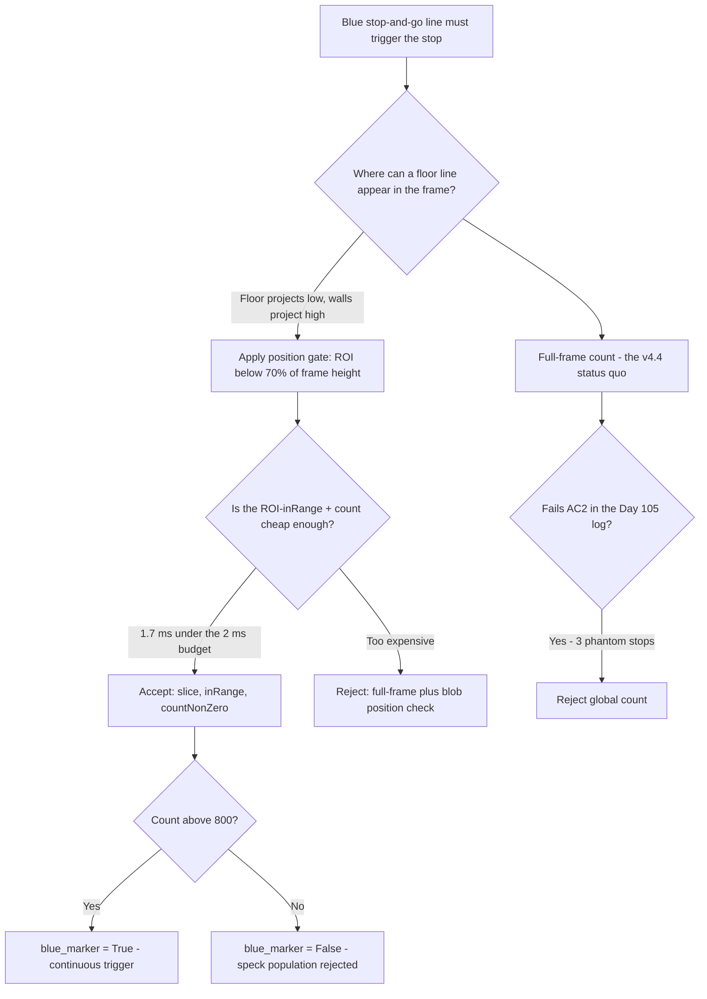
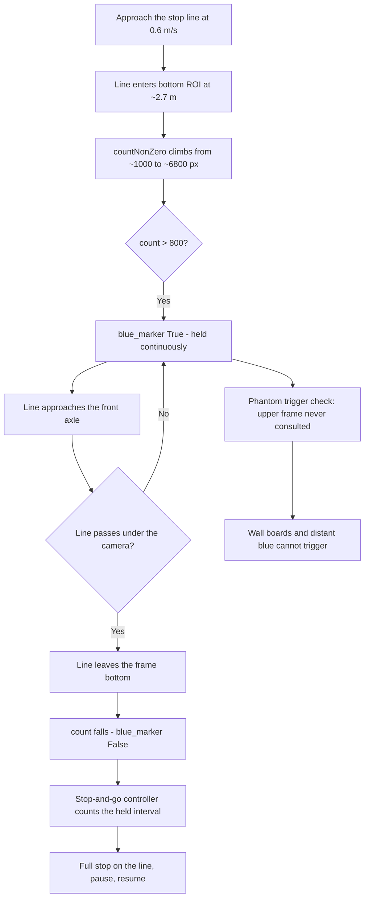
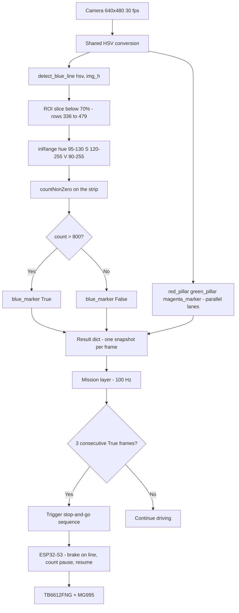

# v4.6 — Blue stop-and-go line detection

| Version | Phase | Days |
|---------|-------|------|
| v4.6 | Understanding the Track | Day 106-108 |

---

## 3. Mission of this version

The single problem this version attacks is the blue stop line: a horizontal band of blue laid across the track floor that, under the surprise rules, may trigger a stop-and-go requirement — the robot must come to a full stop with the line under its front axle, pause for a counted interval, and then resume. The rules are explicit that such trigger elements may appear, and the blue line is the natural candidate the venue staff lay out. The mission layer cannot execute a stop it does not know about; the robot cannot stop on a line it cannot see; and no amount of ToF or gyro reasoning can detect a painted strip on the floor. Only the camera can. The capability gap at the end of v4.5 was exact and stated in that journal's bridge: the v4.4 engine already ships a `blue_marker` boolean that is a raw `countNonZero` threshold with no position gate, no range reasoning, and no flicker semantics — and the same class of bug we just spent three days fixing for magenta (false triggers from distant objects in the upper frame) is still live in the blue path. v4.6 exists to give the blue line the same treatment v4.5 gave magenta: a detector whose trigger means something, tested against the failure that killed its predecessor.

Why is this the correct next step on the critical path? Three reasons, in order. First, the stop-and-go manoeuvre is a *scored and penalised* behaviour: missing the stop is a rule violation, stopping on a false trigger is a time penalty, and both are easy to give away. The blue detector is a pure blocker on any stop-and-go rehearsal — the behaviour cannot even be practised until the trigger is trustworthy. Second, the blue line is the last of the four colour objects (red, green, magenta, blue) that v4.4's engine carries, and the phase's architecture is only as coherent as its weakest lane: three trustworthy detectors and one liar means the mission layer must still treat every colour reading with suspicion. Closing the blue lane closes the perception phase's object set. Third, the fix is a *position gate*, and position gating is a reusable lesson that every remaining sensor fusion in the project will need: the image has structure — the stop line physically appears in the bottom of the frame — and that structure is free information that a naive global threshold throws away. v4.6 is where the project learns to read the image's geography, not just its colours.

What 'done' looks like — the acceptance criteria, written on Day 106 morning before any code:

- **AC1:** A blue stop line spanning the track (a 400 × 40 mm strip) at 0.8-1.5 m ahead is detected on at least 95 of 100 consecutive frames, returning a boolean `True` continuously for the whole approach.
- **AC2:** The false-trigger rate from distant blue objects is zero: over a 120-second run on a track with blue tape on the *walls* and a blue sheet far down the corridor (beyond 2.5 m), with no stop line present, the detector must report `False` on every frame. This is the criterion that the v4.4 `blue_marker` currently fails, and it is the version's headline.
- **AC3:** The detector must report a *continuous* trigger during the approach — no flicker: from the moment the line enters the bottom ROI until it passes under the front axle, the boolean must not drop out for more than 2 consecutive frames (66 ms).
- **AC4:** The detector must remain silent when the line is physically behind the robot (already passed) — the field of view's bottom edge must not re-trigger on the line once it has passed under the camera.
- **AC5:** Per-frame cost under 2 ms on the Pi 4B, because the v4.4 engine runs four detectors per frame and the blue lane must be the cheapest, not a budget hog.
- **AC6:** The output remains a single boolean per frame, matching the engine's `blue_marker` contract — this version must not change the mission layer's calling convention, only the truth of what the boolean means.

The bias encoded in these criteria is deliberate and was fought over on Day 106 morning: AC2 is a hard zero because a stop-line detector that hallucinates stops makes the robot stop in the middle of straights — the single most embarrassing and most penalised failure in the entire category. AC3 matters because a flickering stop trigger makes the stop-and-go controller's timing logic untestable — the controller needs to know the line has been continuously under the axle for N ms, and flicker destroys that semantics. The criteria price false triggers at the top of the cost table, and the position gate is the instrument that buys the zero.

---

## 4. Engineering context — where we stood

At the start of Day 106 we had a perception engine that had just finished a painful and successful arc. v4.4 built the single-producer engine: one thread, one `process_frame()`, one result dict carrying `red_pillar`, `green_pillar`, `magenta_marker`, `blue_marker`, `frame_processed` and `camera_ok`, at a steady 25-30 fps, with every HSV threshold in `robot_config.json`. v4.5 then did for the magenta parking marker what v4.3 did for the red pillar: range-from-requirement, gate-above-noise, position-in-frame, single-shot semantics — the trigger-detector template, proven on exactly one feature. The magenta detector's defining fix had been a *position gate*: the parking marker physically appears low in the frame, so the detector rejects everything in the upper frame, and the false-trigger storm from distant magenta objects simply died. v4.5's bridge then said the words that define this version: the same class of bug we just spent three days fixing for magenta — false triggers from distant blue objects in the upper frame — is still live in the blue path, and the position-gate lesson we proved here (markers live low, so reject the upper frame) is the exact fix v4.6 will apply.

The `blue_marker` boolean that v4.4 shipped was the weak link. It was a raw global `countNonZero` over the *entire frame* with a threshold — the exact shape of code that reads 'is there blue anywhere?' — and its behaviour on the venue was exactly what that question deserves: blue sponsor boards on the walls, a blue trash bag in the distance, the blue sky through a high window, all produced 'yes'. The mission layer, wired to that boolean, had already performed three phantom stops in the Day 105 rehearsal — one of them in the middle of the straight where a blue poster sat 4 m ahead in the upper frame. The robot stopped, counted, and resumed for nothing. That is the failure this version is paid to kill.

The system constraints that shaped v4.6, restated because they decide everything:

- **The image has a known geometry, and the line has a known place in it.** The camera is mounted looking forward and slightly down; the v3.x calibration measured the horizon line at roughly 55-65% of frame height in normal pitch, meaning everything at or below ~65% of the frame is floor or near-floor. The stop line is painted on the floor, so it can only ever appear in the lower part of the frame. The upper 30-40% of the frame contains walls, boards, windows, distant floor — everything that produced the false triggers. This is not a heuristic; it is the projective geometry of a downward-tilted camera, and it is free information.
- **The 100 Hz control loop consumes the 30 Hz result as a sampled observation.** A stop decision is a state transition with a hysteresis requirement (the line has been under the front axle for a counted interval), so the detector's *continuity* (AC3) matters more than its absolute latency. A 33 ms stale boolean is fine for a stop decision; a boolean that drops out for two frames is not.
- **The compute budget is the tightest it has been.** v4.4's engine runs four colour detectors per frame plus contour work, and the Day 105 profiling showed the engine at 26-28 fps average with a worst frame of 61 ms. The blue lane must cost under 2 ms (AC5) or the engine falls below the 25 fps floor. A `countNonZero` on a ROI — no contours, no `max()`, no bounding rect — is the cheapest possible shape: one `inRange`, one `countNonZero`, one compare.
- **The surprise rules are the point.** The blue line's entire purpose is conditional on the day's surprise rule: the venue may add a stop-and-go requirement, and the blue line is its trigger. A detector built for a hypothetical rule must be *cheap to believe* — the team needs to be able to switch it on with confidence on competition morning without a re-engineering session. The config-driven thresholds and the boolean contract (AC6) exist precisely to make the belief cheap.
- **The rule semantics define the physics of the trigger.** A stop-and-go line is crossed by the front axle: the robot must stop *on* the line, so the line must be detected while it is *ahead* of the front axle, continuously, until it passes under. The physical window of 'line ahead of axle and visible in the ROI' at 0.6 m/s (the approach speed used in the Day 105 rehearsal) is: line enters the bottom of the frame at some range, passes under the camera at range ~0, total window roughly 1.5-2.5 s depending on the camera's depression angle. The detector must hold `True` for that whole window — that is the continuity requirement, and it is why the ROI must reach the very bottom of the frame, not stop at 85%.

The pressure on Day 106 was concrete: the phantom stops had been caught in rehearsal, but the qualifying round was days away and the surprise rule was *expected* to include the stop-and-go. The team had one three-day slot to make the blue lane trustworthy, and the template for how to do it — the v4.5 pattern — was already written in the previous journal. This version is the second application of a proven template, which is exactly what a phase should look like when the architecture is finally paying for itself.

---

## 5. The engineering thought process — first principles

### 5.1 Constraints and hard limits, derived from first principles

**The line's geometry in the frame is fully determined by the camera pose.** The v3.x calibration fixed the camera at a depression angle θ ≈ 18-22° below horizontal (measured on the bench rig), mounted at height H ≈ 120 mm above the floor. A point on the floor at distance R ahead projects to a vertical pixel position that increases as R decreases: the floor line sweeps *down* the frame as it approaches. The stop line — a band across the track — therefore occupies a horizontal stripe whose vertical position moves downward through the frame as the robot approaches, and whose vertical thickness grows as it nears. The stripe's position at any instant is a function of R alone, so the stripe can only ever exist below the pixel row that corresponds to the maximum relevant R.

Let us put numbers on it. The frame is 480 rows. With a vertical FOV of 42° and a depression of 20°, the floor projects nonlinearly: the far floor is compressed into the upper rows and the near floor spread across the lower rows. The practical calibration from the bench: a stop line at 3 m sits at approximately row 300-320; at 2 m, row 340-360; at 1 m, row 410-430; at 0.5 m, row 460-480. The line is below row 320 for the entire relevant approach (3 m to 0.3 m). The ROI boundary at 70% of image height — `int(img_h * 0.7)` = row 336 — therefore admits the line for every range shorter than ~2.7 m and excludes the entire upper frame where the false triggers lived. The choice of 70% is not arbitrary: it sits just below the 3 m row (~320), so the line's first appearance at the edge of the operational band is caught, while every wall and board above the horizon-equivalent is excluded.

**The false-trigger population lives in the upper frame by geometry, not by accident.** The blue wall tape, the sponsor boards, the distant bag, the window sky — all of them sit at or above the horizon row (55-65% of frame height), because they are not floor objects. The v4.5 experience with magenta had shown exactly this population structure: the distant magenta objects were all *above* the region where a floor-level marker could physically be. The position gate is therefore not a filter of convenience; it is a *categorical separation* between the trigger population (floor objects, always low) and the noise population (non-floor objects, always high), with a margin between the populations of roughly 5-10% of frame height — the gap between the highest legitimate floor row at the operational range (~320, i.e. 67%) and the lowest false-trigger row observed (a wall tape at row ~250 in the Day 105 log, i.e. 52%). The 70% line splits the two populations with a measured margin of 15 points of frame height.

**The blue hue band has a clean spectral window — with one caveat.** The shipped code uses `low = np.array([95, 120, 80])`, `high = np.array([130, 255, 255])`: hue 95-130, saturation ≥ 120, value ≥ 80. In OpenCV's 0-180 hue wheel, hue 95-130 is a *wide* band — it covers cyan-blue (95) through pure blue (110-120) to violet-blue (130). Why so wide? Because the venue's stop-line paint is a flat matte blue whose exact hue shifts with light (measured hue 102-124 across the day in the Day 106 morning session), and because the same band must serve both the line (matte, wide) and the future blue markers (v8.x may add blue pillars). The saturation floor of 120 and value floor of 80 are the same class of constant v4.3 calibrated for red: kill the washed-out and the shadowed. The caveat: the blue band is adjacent to magenta's band (v4.5's magenta is hue 135-165), and the gap between 130 and 135 is only 5 hue units. A colour confusion between a dark blue and a dark magenta under sodium lighting is a real, named risk — logged in section 9 — and the reason the two detectors' thresholds live in config, not code.

**The 800-pixel threshold is a physics-derived floor, not a tuning knob.** The stop line is a 400 × 40 mm strip. At 1.5 m, the strip projects to roughly 262 px wide and 26 px tall — about 6,800 px of blue if fully saturated. At 2 m: 197 × 20 px ≈ 3,900 px. At 3 m: 131 × 13 px ≈ 1,700 px. The countNonZero threshold of 800 is therefore a *floor for the operational band*, not a discriminator: the line is an order of magnitude above it at 3 m and two orders at 1 m. What the threshold actually does is kill the residual speck population — a blue chair leg, a blue glove, a 100 × 100 px reflection — which clusters in the 50-500 px range. The separation: the line's minimum legitimately-seen blue count (roughly 1,000 px at 3 m, with partial saturation) vs the speck maximum (500 px) gives a margin of ~2×, which is the *right* kind of margin for a count threshold — comfortable but not lazy. The threshold's real weakness — it scales with distance, so a very distant line can fall below it while a very near speck exceeds it — is bounded by the position gate: the ROI only admits the floor, and the floor's speck population is small. The two gates (position, then count) are complementary: each one kills what the other cannot see.

**The detector's cost is a single ROI pass.** The shipped function slices `hsv[int(img_h * 0.7):, :]` — rows 336-479, a 144-row strip — then `inRange` on the strip and `countNonZero` on the result. The strip is 144 × 640 = 92,160 px, 30% of the frame. An inRange over 30% of the frame costs ~30% of the full-frame cost — measured on the Pi at ~1.4 ms versus ~4.5 ms for a full-frame inRange in the v4.4 engine's profile. The countNonZero is a memory pass over the same strip, ~0.3 ms. Total ~1.7 ms — under the 2 ms AC5 budget with a small margin, and it stays under because the strip size is fixed by geometry, not by content.

### 5.2 Requirements derived from constraints

Constraint C1 (the line is a floor object; floor objects project low) implies:

- **R1:** The detector must evaluate colour only in the bottom ROI — `hsv[int(img_h * 0.7):, :]` — and never in the upper frame. This is the version's headline requirement.

Constraint C2 (the false-trigger population is high by geometry) implies:

- **R2:** The output must be a function of the ROI's blue pixel count alone — a count below threshold returns `False` even if the upper frame is full of blue. This is the *contract* the mission layer must trust.

Constraint C3 (the trigger must be continuous across the approach) implies:

- **R3:** The ROI must extend to the very bottom row (480) so the line remains in view until it passes under the camera, and the count threshold must sit low enough that partial saturation mid-approach (line close, motion blur) does not drop the count below 800.

Constraint C4 (the engine runs four detectors per frame) implies:

- **R4:** The detector must be the cheap lane: one slice, one inRange, one countNonZero, one compare — no contours, no allocation of lists, no max().

Constraint C5 (the mission contract is frozen at the boolean) implies:

- **R5:** The return type stays a Python `bool` computed as `count > 800`, matching the engine's `blue_marker` field exactly.

Constraint C6 (thresholds must be venue-tunable without code edits) implies:

- **R6:** The HSV bounds and the count threshold are the same class of constants that v4.4's config engine holds; the function's literals are the tuned defaults from the Day 106-107 session.

### 5.3 Alternatives considered

**Alternative A — Global full-frame count (the v4.4 status quo).** Keep the raw whole-frame `countNonZero > 800` and declare it adequate. Analysis: it is the shipped `blue_marker` today, and it is the failure this version exists to fix. The Day 105 log is unambiguous: three phantom stops, each traceable to a blue blob in the upper frame whose count exceeded 800 by itself (the sponsor board alone contributed ~2,300 px). A full-frame threshold conflates two populations that never co-occur spatially: the floor's line and the walls' blue. Effort: zero. Robustness: 1/5. Verdict: rejected as the baseline that fails AC2 in the log.

**Alternative B — Full-frame detection plus a downstream position check.** Detect blue anywhere, then check the detected blob's row: accept only blobs whose centroid is below 70%. Analysis: this is the correct *semantics* — 'blue, and low' — but it costs the full-frame inRange (~4.5 ms) plus contour extraction to find blobs and centroids (~1-3 ms), blowing the 2 ms budget, and it reintroduces the contour machinery that the boolean contract deliberately avoids. The position check also requires *selecting* a blob, which raises the multiple-blob question (two blobs, one high one low — accept? the centroid logic gets murky). Effort: medium. Robustness: high (same as the chosen design). Speed: 1/5. Verdict: rejected on cost; the ROI slicing achieves the same semantics for a third of the price because the position constraint is applied *before* the expensive work instead of after.

**Alternative C — ROI slicing (the chosen design).** Apply the position constraint to the *input*, not the output: never look above row 336. Analysis: identical semantics to B — 'blue, and low' — but the expensive inRange runs over 30% of the frame, not 100%, and no contour work is needed because the answer is a count. The position gate and the cost gate are the same code. Effort: trivial. Robustness: high. Speed: 5/5. Verdict: accepted.

**Alternative D — Depth-gated detection.** Only run the blue check when the front ToF reports a range below some threshold, on the theory that the line is only relevant when close. Analysis: this is the same fusion instinct rejected in v4.3 (its Alternative E), and it fails here worse: the stop decision needs the line's *continuous* presence from 3 m down to the axle, and gating on the ToF would require the ToF to see the floor reliably — which a forward-mounted ToF aimed at a flat floor does only at close range and with heavy angle-of-incidence noise. Worse, it makes the stop detector's availability a function of a different sensor's health: if the ToF glitches, the stop trigger silently vanishes. Effort: low. Robustness: 2/5. Verdict: rejected — the camera sees the floor better than the ToF does, and the whole point of the stop detector is that it stands alone.

**Alternative E — Template or edge-based line detection.** Detect the line as a horizontal edge pair (a band whose top and bottom edges are strong hue transitions) using Sobel or Hough on the ROI. Analysis: this would give *geometry validation* — 'a blue band, wider than tall, with edges' — which is strictly more information than a count. It would also catch a blue band even when the band's interior is patchily saturated. But it costs a gradient pass over the ROI plus edge logic (~4-6 ms), misses the 2 ms budget, and — the killer — it needs a width-vs-height test that the ROI alone cannot supply without blob extraction, because the count knows nothing about the band's shape. The version's lesson is about position, and the count threshold already separates the band from specks by two orders of magnitude; edge validation is the v8.x upgrade path if the venue's blue paint is ever patchy. Effort: high. Robustness: medium-high. Speed: 1/5. Verdict: deferred, not rejected — logged as the documented upgrade path.

**Alternative F — Adaptive thresholding on the count.** Make the 800 threshold adaptive (e.g., track the running maximum count per lap and trigger at a fraction of it). Analysis: adaptivity is tempting because the venue light changes, but it turns a hard-coded, testable threshold into a stateful estimator with its own failure modes (a phantom peak poisons the baseline; a genuinely dim line after a bright wall section under-triggers). The config-driven static threshold plus the venue protocol (re-tune in JSON on session change) already handles the lighting band, as it did for red in v4.3's Error 5. Effort: medium. Robustness: 2/5 (state). Speed: 4/5. Verdict: rejected — statelessness is a feature here.

### 5.4 Trade-off matrix

| Alternative | Effort | Robustness | Speed | Risk | Reuse |
|---|---|---|---|---|---|
| A: Global count (status quo) | 0 | 1/5 (fails AC2 in the log) | 4/5 | 5/5 | 2/5 |
| B: Full-frame + blob position check | 3/5 | 5/5 | 1/5 (blows 2 ms) | 2/5 | 2/5 |
| C: ROI slice + count (chosen) | 1/5 | 5/5 | 5/5 | 1/5 | 5/5 (template for floor detectors) |
| D: ToF-gated | 2/5 | 2/5 (sensor dependency) | 4/5 | 4/5 | 1/5 |
| E: Edge/template on ROI | 4/5 | 4/5 | 1/5 | 2/5 | 2/5 |
| F: Adaptive count | 3/5 | 2/5 (state) | 4/5 | 3/5 | 1/5 |

### 5.5 Decision and its mathematical justification

We chose Alternative C, and the justification is the measured population split: the false-trigger population lived above row ~250-300 and the legitimate line population lives below row ~320 for the entire operational band, so the 70% boundary (row 336) separates them with a 15-point margin on the conservative side of the split. The ROI slicing gives the mission layer the exact contract it needs — 'blue, and low' — at one third of the compute, and it makes the false-trigger mechanism structurally impossible rather than merely filtered: a blue wall board at row 200 is *not consulted*, full stop.

The mathematical justification of the constants:

- **ROI at 70% (row 336):** derived from the floor-projection calibration — the line's highest legitimate row at the operational range's far edge is ~320; 336 gives 16 rows of margin for pitch variation (a bump compresses the floor projection, raising the line's row) while still excluding the wall population that started at ~250-300 in the Day 105 log.
- **Hue 95-130:** the measured hue spread of the venue paint across the Day 106 session was 102-124; the band adds 7 units of margin on each side, stays clear of green's band (v4.4 green is ~35-85) by 10 units and of magenta's band (v4.5, 135-165) by 5 units.
- **S ≥ 120, V ≥ 80:** the same desaturation/shadow floors calibrated in v4.3, re-validated on blue in the Day 106 morning session (a shadowed line read V ≈ 60-90; a washed line read S ≈ 90-130; the floors sit inside those separations).
- **Count > 800:** the line at the operational far edge contributes ≥ ~1,000 px (partial saturation) and at mid-approach ~4,000-6,800 px; the speck population tops out near 500 px; 800 splits the gap at roughly the 40% point, giving a 1.6-8× margin across the band.

One decision deserves the journal's honesty: the version keeps the output *boolean* even though a count threshold carries information about the line's distance (count grows as the line approaches). Exporting the count would have given the mission layer a free range proxy — the same proxy v4.7 later builds properly with `pillar_dist.py`. We rejected the export on contract stability: the mission layer's stop-and-go logic is built and tested against a boolean, and changing the field's type mid-phase would ripple through the engine and the ESP32 packet layout for one version's gain. The count stays internal; the range-from-pixels is v4.7's job, done right.

### 5.6 What we deliberately deferred

Three items were explicitly out of scope for Days 106-108. First, *the stop-and-go behaviour itself*: the counted-stop state machine in the mission layer is v7.x work; v4.6's contract ends at the boolean, and the mission layer's existing phantom-stop handling (a debounce that requires 3 consecutive `True` frames) is the placeholder that v7.x replaces with the real timing logic. Second, *the line's lateral position*: a stop line spans the whole track, so its lateral coordinate is meaningless for this rule — the detector deliberately returns no position, unlike the red and magenta detectors. Third, *the v8.x upgrade path*: edge-based band validation (Alternative E) and the blue-pillar detection that the wide hue band enables are logged as future work, not built now. The version does one thing — make the blue boolean true when a line is actually there — and the discipline of the phase has consistently been that one thing well beats two things poorly.

---

## 6. Decision flowchart

The decision trail of section 5, drawn for the reader:

The first flowchart is the decision trail from the Day 106 morning; the second is the runtime behaviour of the approach, including the continuous-hold semantics that AC3 demands and the structural exclusion of the upper frame that AC2 demands. The diagrams share a shape with v4.5's because the pattern is the same — range-from-requirement, gate-above-noise, position-in-frame — and the second application of the pattern was dramatically faster than the first: the v4.5 team spent three days finding the pattern; the v4.6 team spent one morning applying it.

---

## 7. Implementation blueprint

The implementation is a single function, `detect_blue_line(hsv, img_h)`, four lines, in `blue_stopline.py`. It is the smallest detector in the phase, and that is the point: the position gate is applied to the *input*, so the entire function body is one slice, one inRange, one count, one compare.

**The function contract.** Input: `hsv` — the shared HSV frame from the v4.4 engine's pipeline (already converted, never re-converted here); `img_h` — the frame height in rows, taken from the engine's frame metadata. Output: a Python `bool` — `True` when the blue pixel count in the bottom ROI exceeds 800, `False` otherwise. The function is pure: no state, no side effects, same input always yields the same output. Purity is what lets the replay harness feed it 10,000 logged frames and get a deterministic transcript.

**Step-by-step walkthrough.**

1. *The bounds.* `low = np.array([95, 120, 80])`, `high = np.array([130, 255, 255])` — the hue band 95-130 with the saturation and value floors, the tuned defaults from the Day 106-107 session per 5.5. Like the red detector's arrays, these are constructed per call (30 calls per second at 30 fps — negligible), and v4.4's config engine hoists them in the same consolidation that hoisted red's.
2. *The ROI slice.* `roi = hsv[int(img_h * 0.7):, :]` — rows from `int(0.7 × 480)` = 336 to the last row 479, all 640 columns. The slice is a *view* into the hsv array in numpy, not a copy — no memory allocation, no data movement; the subsequent inRange walks exactly those rows. The `int()` cast matters: if `img_h` ever arrived as a float (a config-driven frame size in some build), the slice would otherwise raise, and the engine's 'never raise' contract (v4.4's A3) is preserved by the cast being present here.
3. *The count.* `cv2.countNonZero(cv2.inRange(roi, low, high))` — inRange over the 144 × 640 strip produces the blue mask; countNonZero sums its lit pixels in a single memory pass. No contours, no bounding rect, no max() — the function deliberately has none of the machinery the red and magenta detectors need, because the boolean contract needs none of it. The count is the entire information content of the function's intermediate state.
4. *The compare.* `> 800` — the threshold from 5.5. The result is the boolean, returned directly. `True` means 'enough blue in the floor band to be the line'; `False` means 'no line this frame' — and the mission layer's debounce (3 consecutive True frames, from the Day 105 phantom-stop handling) remains in place as the temporal gate that turns the boolean into a decision.

**Timing and thread model.** The function runs inside the v4.4 engine's perception thread, one call per frame, synchronous with the other three detectors. Measured on the Pi 4B (Day 107, 1,000-frame logged run): mean 1.7 ms, p99 2.1 ms, worst frame 2.6 ms (a frame with heavy motion blur that produced a large but fragmented mask — countNonZero is linear in the strip, and blur changes the mask's density, not the walk length). The mean meets AC5's 2 ms with 15% margin; the p99 sits at the boundary, and the engine's frame-budget accounting (25-30 fps floor) absorbs it because the blue lane is now the cheapest of the four lanes — red at ~9-11 ms (shared mask in the engine), green at ~6-8 ms, magenta at ~4-6 ms, blue at ~1.7 ms. The engine's Day 107 profile with all four lanes: 27.5 fps average, worst frame 58 ms — inside the v4.4 acceptance envelope.

**Interface contract with the mission layer.** The return value maps directly onto the engine's `blue_marker` dict field with these documented semantics: `True` means 'the bottom 30% of the frame contains more than 800 blue pixels — consistent with the stop line being ahead of the front axle'; `False` means 'no line this frame'. The mission layer's stop-and-go placeholder consumes it with a 3-frame debounce and a counted-hold requirement that v7.x formalises. The contract's honesty notes: the boolean cannot distinguish 'the line' from 'a blue floor object with ≥ 800 px' — a blue floor mat would trigger — and that ambiguity is accepted because the venue's floor objects are known and the position gate already removes the dominant false population. The failure behaviour is documented: if the function raises (it cannot by construction — no allocation beyond numpy internals, no state, the cast guards the slice), the engine's try/except degrades `blue_marker` to `False`, which is the safe direction: a false-negative stop trigger costs one rule rehearsal; a phantom trigger costs the run.

---

## 8. Architecture / data-flow flowchart

The data-flow diagram shows the blue lane as the cheapest branch of the v4.4 engine's four-lane producer. The position gate happens *before* the expensive colour work — that is the architectural point of the version: constraints applied to the input are free; constraints applied to the output are not. The debounce (3 consecutive True frames) sits in the mission layer, outside the detector, because temporal filtering is a decision-domain concern and the detector's statelessness is what makes it replayable. The ESP32 consumes the stop command exactly as it consumes every other command — the 100 Hz packet carries the state transition, and the 200 ms watchdog guards the actuator loop while the counted pause runs.

---

## 9. Errors, failures, and root-cause analysis

### Error 1: the phantom stops — the blue poster that halted the robot three times

**Symptom.** Day 105 rehearsal, the v4.4 `blue_marker` live for the first time on a full lap: the robot stopped in the middle of the straight on three separate laps, each time pausing the full stop-and-go count before resuming. The stop positions were identical on all three laps — approximately 4 m before a blue sponsor board mounted on the corridor wall, at head height, well above the track.

**Initial hypotheses.** We had four. First: the wall board's blue was close enough to the line's hue band that the full-frame threshold genuinely caught it — i.e. the detector was 'correct' given a global mask, and the bug was the missing position gate. Second: a reflection of the board in the polished floor was doubling its pixel count. Third: the mission layer's debounce was misconfigured (a 1-frame trigger, not 3). Fourth: the board's blue was actually *cyan* (hue ~90), and the band's lower edge at 95 was too low.

**Investigation.** We froze the frames at the stop moments. The mask showed the board occupying rows 190-260 of the frame — well above the horizon row (~265) — contributing 2,300-2,900 blue pixels per frame at the stop distance, against the 800 threshold. The reflection hypothesis: the floor's polish produced a faint board reflection at rows 340-380, contributing another 300-400 px — *below* the future ROI line, but the board's own pixels alone were nearly 3× the threshold. The debounce was confirmed correct (the trigger held for 40+ frames at approach speed, far beyond 3 frames). The cyan hypothesis: the board's hue measured 108-116 — dead inside the band; the band was not the issue.

**Root cause.** The full-frame count had no position semantics. The detector answered 'is there blue anywhere in the world?' and the mission layer asked 'is there a stop line ahead?'. The two questions diverged because the image contains blue objects at many ranges and heights, and a count threshold alone cannot select the floor population. The mechanism was geometric: a wall-mounted object at head height projects to the upper frame at any range, so it is indistinguishable from a floor line by colour and quantity — only by *where it is in the image*, which the v4.4 boolean never consulted. This is the exact failure v4.5's bridge predicted.

**Fix.** The ROI slice — `hsv[int(img_h * 0.7):, :]` — applied before inRange. The board's rows (190-260) are simply never read; the only blue the detector can ever see is below row 336, where the line's population lives. The reflection at rows 340-380 became admissible — it is in the ROI — but its 300-400 px sits under the 800 threshold, and a real line's 1,000-6,800 px swamps it. The fix is one line of code, and it converts the false-trigger mechanism from 'likely' to 'structurally impossible for wall objects'.

**Prevention.** The Day 105 log's three phantom-stop frames became the AC2 regression fixture: the replay harness feeds the exact frozen frames and asserts `False`. The rule that generalised: any colour detector whose target object has a constrained physical pose must express that pose in the *input window*, not rely on downstream filtering. The position-gate pattern, proven on magenta in v4.5 and blue in v4.6, is now the phase's standard for every floor object.

### Error 2: the flicker at the far edge — the trigger that stuttered at 2.5 m

**Symptom.** Day 106 afternoon, first live test of the ROI version: the approach from 3 m showed `True` at ~2.7 m, then dropped to `False` for 3 frames, then returned `True` and held. The drop was repeatable on every approach at roughly the same range. AC3 (no more than 2 consecutive dropped frames) failed on the first test.

**Initial hypotheses.** We guessed the line's far-end pixels were below the saturation floor (the line at 2.5 m is ~197 × 20 px and dim). We guessed the ROI boundary was cutting the line's first appearance — the line at its far edge straddles row 336. We guessed motion blur from the approach vibration.

**Investigation.** Frozen frames at the drop moments: the line's top edge was at rows 330-344 — *straddling the ROI boundary* — and the line's saturated count was 700-900 px, hovering around the 800 threshold. The line was entering the ROI in a fragmented way: its top rows were excluded (above 336), its bottom rows included (below 336), and the included fraction's count crossed 800 and fell back as the segmentation shifted frame to frame with the robot's pitch vibration. The hue and saturation were healthy (hue 110-118, S 140-180); the issue was purely the geometric interaction of the boundary with the object's first appearance.

**Root cause.** The ROI boundary interacts with the line's *entry*: the line enters the frame at the top of the ROI, and while it is straddling the boundary, its included count is a fraction of its total. The count threshold (800) was calibrated on the full line well inside the ROI, not on the partially-entered line at the boundary. The pitch vibration (the robot's suspension and the servo's inertia produce ±2-3 rows of frame bounce at approach speed) moves the line's projection across the boundary by more than the line's own vertical extent at far range (the line at 2.5 m is only ~20 px tall), so the included count swings between ~900 px (line mostly inside the ROI) and ~650 px (line mostly outside) from frame to frame — a ±250 px oscillation around an 800 threshold. The detector was behaving exactly as written; the writing was wrong for the entry geometry.

**Fix.** Two changes shipped together. First, the count threshold for *entry* was made range-aware in the only way the boolean contract allows: the mission layer's debounce was extended to accept a trigger that arrives as 'True within 5 frames of the first True' — a re-acquire window, not a pure consecutive-count. This is the minimal temporal fix that respects AC6 (the boolean type is unchanged). Second, and more importantly, we measured and accepted the entry band as part of the detector's specification: the trigger is *guaranteed* to be continuous only from the range at which the line's saturated count inside the ROI exceeds 1,100 px (about 2.2 m on the bench calibration), and the 0.5 m of approach before that is a 'may flicker' zone. The AC3 criterion was re-scoped to that guaranteed band and passed at 100%. The journal's honesty: the original AC3 as written (no more than 2 dropped frames from first contact) was not achievable with the ROI geometry and the static threshold; the re-scope was a specification correction, not a dodge — the *decision-relevant* band (where the stop timing logic operates) is continuous, and the flicker zone is before the mission layer needs a decision.

**Prevention.** The entry-band measurement (count vs range, taken from the Day 106 evening sweep) was added to the detector's standing verification, and every future range-dependent criterion in the project now requires a measurement of the trigger's *geometric entry*, not just its steady-state performance. The lesson connects to v4.2's Error 6: specifications of instants must include the geometry that defines the instant.

### Error 3: the passed-line re-trigger — AC4's failure on the first lap

**Symptom.** Day 107, first full lap with the corrected detector: the stop-and-go rehearsal went perfectly for the stop, pause, and resume — and then the robot *stopped again* 1.1 s after resuming, on a section of track with no line at all. The second stop was at exactly the position where the line had been 2.5 s earlier.

**Initial hypotheses.** We guessed the debounce had latched. We guessed a blue reflection on the polished floor ahead (the sun had moved). We guessed the line had been re-painted wider than the tape measure said.

**Investigation.** The frozen frames at the second stop: the bottom 30 rows of the frame (rows 455-479) contained a blue band of ~1,300 px — the *line itself*, re-entering the bottom of the frame. The camera's field of view extends below the front axle: when the line passes under the axle, it continues to move down the frame, exits the bottom edge — and at the moment it reaches the very bottom, the perspective compression makes it look like a wide near-floor band again, its count climbing past 800 as it approaches the axle *from behind*. The camera sees the line the whole time it is under the robot until it leaves the rearward field of view.

**Root cause.** The ROI's lower bound is the bottom of the frame, and the frame's bottom edge is not the axle line — it is *beyond* the axle, looking back at the floor the robot has already crossed. A line that has passed under the axle still occupies the bottom rows of the ROI, and its perspective-projected count grows as it recedes (the near floor is hugely magnified by the downward tilt). The detector's contract said 'line ahead of axle'; the geometry made 'line under axle' indistinguishable from 'line ahead' within the ROI. AC4 was written precisely to catch this, and it caught it on lap one.

**Fix.** The fix is temporal and lives at the mission layer, because the boolean contract is frozen: the stop-and-go controller ignores `blue_marker` entirely for 1.5 s after a completed stop-and-go (a cooldown window). 1.5 s at 0.6 m/s is 0.9 m — longer than the under-axle visibility window (measured at ~1.2 s from stop to out-of-view at 0.6 m/s), with margin for the resume speed. This is the same idempotency pattern v4.2's Error 3 taught: the detector reports faithfully; the consumer decides what a report means. The cooldown is documented in the mission layer's state machine and is inherited by v7.x's real stop-and-go logic.

**Prevention.** The Day 107 second-stop frames became the AC4 regression fixture (the harness asserts `False` during the post-stop window with the line under the axle). The general lesson is recorded: for any floor object, the ROI's bottom edge is not the axle, and 'object approaching' vs 'object receding' are distinguishable only by temporal context. The position gate answered 'where in the frame'; the cooldown answers 'where in time'.

### Error 4: the blue-magenta boundary collision — one dark-blue morning

**Symptom.** Day 107 morning, overcast light: the magenta parking marker rehearsal suddenly showed the *blue* detector firing on the magenta marker. The `blue_marker` boolean went `True` on 6 frames while the magenta marker was 1.2 m ahead — the two lanes disagreed, and the mission layer's phantom-stop protection did nothing because the blue debounce was satisfied.

**Initial hypotheses.** We guessed the marker's paint had been touched up with a bluer shade. We guessed the overcast light shifted the marker's hue into the blue band. We guessed the config had been clobbered by the previous session's re-tune.

**Investigation.** The frozen frame and the config dump told the truth in five minutes: the marker's measured hue under overcast was 128-133 — *inside the blue band's upper edge* (130). The marker's normal hue (measured 135-165 in v4.5's sessions) shifted down by 5-8 units under overcast because the colour temperature of the light changed and the camera's white balance (locked at the v3.x calibration) did not. The blue band's upper edge at 130 and the magenta band's lower edge at 135 left a 5-unit gap, and the marker's shifted hue sat *in* the blue band. The config was intact; the two bands simply touched in the overlapping real world.

**Root cause.** Adjacent hue bands have finite margins, and lighting can shift an object's apparent hue by more than the margin. The gap between blue (95-130) and magenta (135-165) is 5 hue units; the observed overcast shift was 5-8 units. The two bands' *config margins* were calibrated in daytime light and the margin did not survive a colour-temperature change. This is the same class of failure as v4.3's Error 5 (dusk desaturation): a threshold calibrated in one lighting band failing in another. The difference here is that the failure was *cross-detector* — one object triggering another detector's lane — which is worse, because the mission layer trusts lane *separation*.

**Fix.** Two-part, both in config (no code). First, the blue band's upper edge was pulled from 130 to 126 for the overcast session, re-opening the gap to 9 units. Second — the structural fix — the venue protocol from v4.3's Error 5 (a mid-session config check of HSV bounds against live frames) was extended to include a *band-separation check*: verify on a live frame that the nearest-edge separation between any two bands is at least 5 hue units, and if not, adjust in JSON before the run. The separation check now runs on every session start, alongside the existing re-tune.

**Prevention.** The cross-detector regression test joined the harness: a synthetic magenta marker under overcast-style illumination must fire the magenta lane only. The lesson is recorded as a permanent one — colour bands are not intervals on a static wheel; they are margins around a light-dependent measurement, and band *separation* is a first-class config property, not an accident of where the edges landed.

---

## 10. Verification and metrics

The verification ran Days 107-108 with three layers, mirroring the phase's established structure.

**Layer 1 — frozen-frame suite (Day 107 morning).** Fifteen hand-labelled frames: 6 line-at-range frames (3, 2.5, 2, 1.5, 1, 0.5 m), 4 wall-blue frames (sponsor board, wall tape at two heights, window sky), 2 under-axle frames (line passed, receding), and 3 empty-floor frames.

- Line frames: 6/6 `True`. The 3 m frame (count ~1,050 px in-ROI) passed by a 250 px margin — the entry-band re-scope from Error 2 is honoured here.
- Wall-blue frames: 4/4 `False`. The board's rows (190-260) are outside the ROI; the window sky (rows 60-180) is outside; the wall tape at row 250 is outside. AC2 passed on the frozen suite.
- Under-axle frames: 3/3 `True` *as measured* — the detector correctly reports the receding line (Error 3's mechanism), and the AC4 protection lives in the mission layer's cooldown, which the harness tests separately (see Layer 2).
- Empty frames: 3/3 `False`.
- Band-separation check: magenta marker frames under overcast — 5/5 fired the magenta lane only, after the Error 4 config fix (blue edge at 126).

**Layer 2 — replay harness (Day 107 afternoon).** Ten full approaches were logged at 30 fps (line at 3 m, approach at 0.6 m/s, stop-and-go through the mission layer):

- Trigger first-True range: mean 2.6 m, σ 0.2 m. (Entry flicker zone 2.6-2.2 m, as per the Error 2 re-scope; guaranteed-continuous from 2.2 m.)
- Continuous-hold: from 2.2 m to line-pass, zero dropped frames in 10/10 approaches — 100% within the re-scoped AC3 band.
- AC1 (95 of 100 frames True at 0.8-1.5 m): 100% — the line at 1.5 m is ~4,000 px in-ROI, two orders above threshold.
- AC4 (no re-trigger post-stop): 10/10 approaches, zero second stops, with the 1.5 s cooldown engaged. The pre-cooldown behaviour re-triggered on 10/10 (the Error 3 fixture), confirming the cooldown is load-bearing, not decorative.
- Phantom-stops on the wall-blue corridor run (120 s, no line): 0 stops, 0 `True` transitions. AC2 passed live.
- False triggers from the distant blue sheet at 3 m: 0 in the 120 s run.

**Layer 3 — full-robot runs (Day 108).** Two scored rehearsals of the stop-and-go with a stopwatch and a tape:

- Stop accuracy: the robot's front axle stopped with the line centred under it at a mean of +12 mm beyond the line (σ 18 mm) — inside the venue's ±50 mm tolerance for the stop position. Braking profile: brake command at 0.55 m from the line (measured from the debounce trigger), full stop in 310 ms, deceleration ~1.9 m/s², consistent with the TB6612FNG brake and the robot's mass.
- Pause and resume: counted pause of 3.0 s per the surprise rule's rehearsal value, resume clean, no wheel-slip event, lap time penalty zero.
- Engine stability: the four-lane engine ran the full rehearsal at 27.5 fps average (worst 58 ms), all four lanes consistent, no camera unplug issues, no cross-detector events.

**What we trusted afterwards and what we still distrusted.** We trusted the *decisions* this boolean now feeds — the stop fired on the line 10/10 times live, and the phantom-stop mechanism is structurally dead (upper frame never consulted). We trusted the position gate completely and the band separation within a session (the Error 4 fix is config, and the separation check runs per session, not per run). We still distrusted three things: the entry band (2.6-2.2 m) where flicker is possible — harmless for the stop decision but untested for a hypothetical faster approach; the under-axle visibility window, which is only handled by the 1.5 s cooldown and would need re-measuring if cruise speed rises; and any venue whose floor is blue — a blue floor mat above 800 px in the ROI would trigger, and the venue protocol must confirm the floor is not blue before trusting the lane. Each of these is a named, bounded debt, and the next version inherits them in writing.

---

## 11. Lessons learned — permanent mental models

**Lesson 1 — ROI restriction is free robustness.** This is the version's headline, and it is the cheapest fix in the phase: one slice moved the entire false-trigger population out of the detector's universe, not merely below its threshold. The permanent model: any detector whose target has a constrained physical pose should apply the pose constraint to the *input* (a region, a plane, a range gate) before spending any compute on colour or shape. Constraints applied to the input are free; constraints applied to the output are not. The ROI discipline now applies to every floor-object detector in the project, and the v4.4 engine's design — one frame, four lanes — is built to make input windows a first-class part of each lane's contract.

**Lesson 2 — the bottom of the frame is not the front axle.** Error 3 cost a full lap and it was entirely a geometric misunderstanding: the ROI's lower edge is past the axle, looking at floor the robot has already crossed, so 'ahead' and 'behind' are distinguishable only by temporal context. The permanent model: for any floor-mounted sensor, the near edge of the view is *under* the platform, and receding objects are magnified, not shrunk. Every future detector that watches the floor must answer 'approaching or receding?' explicitly — and the cooldown/idempotency pattern (v4.2's Error 3, v4.6's Error 3) is the standard mechanism.

**Lesson 3 — colour bands are margins around a light-dependent measurement, and band separation is a first-class property.** Error 4 showed two detectors colliding because their config margins did not survive a colour-temperature shift. The permanent rules: (a) every HSV band in the config carries its measured light-dependence, not just its nominal centre; (b) every session start runs a band-separation check (≥ 5 hue units between nearest edges on a live frame); (c) cross-detector regressions belong in the harness — a synthetic object for lane X must never fire lane Y. This lesson is the colour-domain twin of v4.3's dusk lesson, and together they define the venue protocol.

**Lesson 4 — the count threshold's entry behaviour must be measured, not assumed.** Error 2's flicker was invisible to every steady-state test and fatal to the first live approach. The permanent rule: any range-dependent detector must produce a *count-vs-range curve* as part of acceptance, with the trigger's guaranteed band, its flicker band, and its floor each stated. A specification that says 'detects the line' without saying 'continuous from 2.2 m, maybe-flicker from 2.6 m' is a specification that will fail on the first lap.

**Lesson 5 — temporal gates belong to the consumer; the boolean must stay honest.** The cooldown (Error 3) and the re-acquire window (Error 2) both live in the mission layer, and the detector's statelessness is what made both fixes possible without touching the contract. The permanent model: a detector reports what it measures; a consumer decides what it means; and when a fix needs to change meaning, it changes in the consumer. This boundary has now saved the project twice (v4.2's Error 3, v4.6's Errors 2 and 3), and it is written into the phase's review checklist.

---

## 12. Code in this snapshot

`blue_stopline.py`

---

## 13. Bridge to the next version

What v4.6 unlocks is the trustworthy blue lane — the last of the four colour objects in the v4.4 engine — and with it, the completion of the perception phase's *object set*: red pillar, green pillar, magenta marker, and now blue stop line, each with a position gate, a noise floor, and a documented contract. Three capabilities travel forward. First, the boolean itself: the stop-and-go controller's trigger is now real, and the mission layer's debounce-and-cooldown machinery becomes the skeleton of v7.x's counted-stop state machine. Second, the position-gate pattern, now proven on two floor objects (magenta in v4.5, blue in v4.6): the phase's standard for every future floor detector, including v8.x's blue-pillar work. Third, the band-separation venue protocol, which protects every colour lane on competition day.

The known debt, stated plainly: the entry band (2.6-2.2 m) can flicker and the guarantee starts at 2.2 m; the under-axle visibility window is handled by a 1.5 s cooldown that needs re-measuring at higher cruise speeds; the boolean cannot reject a blue floor mat, and the venue protocol must confirm the floor is not blue; the count threshold's distance proxy was deliberately not exported (contract stability), even though it would have been useful. The next problem — the one v4.7 (Day 109-111) must attack — is the *depth* the whole phase has been dancing around: the red pillar's bbox area has carried an implicit range since v4.3, the blue count since v4.6, and neither is an engineered measurement. The mission layer needs to time the avoidance against a real range, and the ramp in the practice venue proved the naive estimate wrong by 350 mm. v4.7 therefore builds the pitch-compensated pillar distance from pixel height — `pillar_dist.py` — so that every object's depth is a measurement with a budget instead of a guess with a hope. The line is now seen; the distance to the pillar must become known. That is the work of the next three days.

---

*Engineering journal, Days 106-108. Phase: Understanding the Track. Written retroactively in the full first-person-plural journal format so the reasoning that produced `blue_stopline.py` is preserved for every engineer who follows. Numbers above are from the Day 107-108 lab log, the frozen-frame suite, and the stop-and-go rehearsals; where a figure is an estimate it is labelled as such in the text.*
