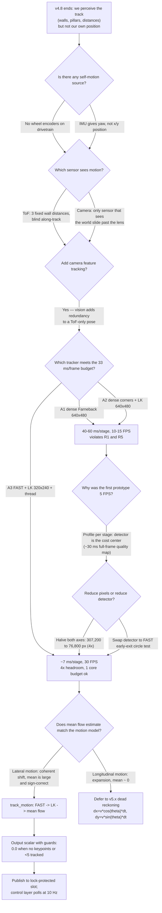
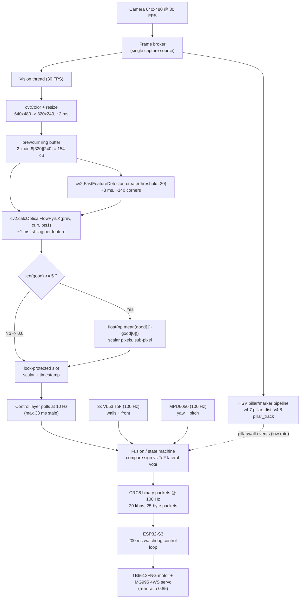

# v4.9 — Visual odometry prototype

| Version | Phase | Days |
|---------|-------|------|
| v4.9 | Understanding the Track | Day 115-117 |

---

# v4.9 — Visual odometry prototype

This is the closing entry of the **Understanding the Track** phase. For the
first time in the v4.x series, the camera is pointed at the robot itself: not
at the walls, not at the pillars, but at the *motion between two consecutive
frames*. We built a feature tracker that watches how the world slides past the
lens, and we wrote `visual_odom.py`, a 10-line prototype that turns a pair of
gray frames into a single number: how far, and which way, the robot moved in
that instant. It is a small file with an oversized job. It is the hinge on
which the entire v4.x phase swings shut and the v5.x localization phase opens.

---

## 1. Version header table

| Version | Phase | Days |
|---------|-------|------|
| v4.9 | Understanding the Track | Day 115-117 |

---

## 2. Title

`# v4.9 — Visual odometry prototype`

---

## 3. Mission of this version

### 3.1 The single problem

At the end of v4.8 the robot could describe its world in remarkable detail:
three walls via the VL53L1X front and two VL53L0X sides (v4.0), pillar
distance from pixel height with IMU pitch compensation (v4.7), and pillars
that refused to be lost through occlusion because we remembered their last
known position for 500 ms (v4.8). What it could *not* do — and what had
never been attempted in the whole project — was say anything about its **own
motion**. Every v4.x module answered the question "what is around me right
now?". None answered "how did I get here, and where am I going?". The
position of the robot on the track is the single most valuable unknown in the
mission: lap counting, obstacle spacing, and the final parking decision all
reduce to it, and none of them can be answered from a snapshot.

This version attacks exactly that problem, but with disciplined scope: we are
not building localization. We are building a **motion estimate between
consecutive camera frames**, using the only sensor on the robot that sees the
world move — the camera. The three ToF sensors measure distance to a wall; the
MPU6050 measures angular velocity and acceleration; but only the camera
watches the *same physical features* (a seam in the wall, an edge of a pillar,
a texture fleck) appear at a new place in the next image. If we can track
those features fast enough and consistently enough, we have the seed of
self-positioning.

### 3.2 Why this is the correct next step

The critical-path argument is three links long. **First**, v5.x is the
Localization & Fusion phase, and it is scheduled to begin on Day 118. Any
uncertainty that still exists about whether the Pi 4B can track visual
features at race cadence must be resolved *before* v5.x commits its fusion
architecture — otherwise v5.x will build on an unvalidated assumption and we
will discover the failure at the worst possible time, mid-phase, with the
schedule bleeding. **Second**, the v4.x phase has delivered perception of
absolute anchors (walls, pillars); what it has not delivered is a *relative*
motion signal, and relative motion is what a fusion filter consumes between
absolute observations. A robot that sees a pillar but cannot measure the 50 mm
it moved since it last saw it has perception with no odometry — half a
localization. **Third**, a pure-ToF pose estimate is provably blind along the
track axis: when we drive straight down a corridor, the left and right
VL53L0X readings stay nearly constant because we are *parallel* to the walls,
and the front VL53L1X reading stays nearly constant because the far wall is
the same distance away. The robot could be 0.5 m into the corridor or 4.5 m
into it and the three sensors would report almost identical values. Vision is
the only onboard sensor with any sensitivity to along-track progress, because
the *texture* of the wall slides past the lens at a rate proportional to our
speed. That redundancy is the "why" written in the v4.9 change note, and it is
the reason this prototype exists at all.

### 3.3 The capability gap at the end of v4.8

Spelled out bluntly: at Day 114 we had *environment perception* (walls,
corners, pillars, distances) and *zero self-awareness* (no position, no
velocity estimate, no way to integrate the past). The state machine could
react beautifully to what was in front of it and hopelessly to what had just
passed behind it. Every decision was made from the present instant alone.
That is the gap v4.9 starts to close, honestly and incompletely: it does not
give us position, but it proves the *motion signal is extractable* at a frame
rate that makes it usable, and it hands the next phase a function whose
output can be fused.

### 3.4 Acceptance criteria, written before the work

We refused to start until we had defined "done" in measurable terms. These
were the criteria, agreed on Day 115 before a single line was written:

1. **API shape.** A pure function `track_motion(prev, curr)` taking two gray
   frames and returning a motion estimate, implemented as `visual_odom.py`,
   using FAST corner detection and Lucas–Kanade pyramidal optical flow.
2. **Frame-rate.** Sustained ≥ 25 FPS (per-frame budget ≤ 40 ms) while the
   existing HSV pillar pipeline and the 100 Hz serial link keep running on
   the same Pi 4B, measured over 60 s.
3. **Noise floor.** With the robot stationary, |output| < 1.0 px averaged
   over 100 consecutive frames — the statistic must not hallucinate motion.
4. **Directional truth.** During a manual lateral push of the chassis, the
   output sign must oppose the push direction in ≥ 95% of frames.
5. **CPU headroom.** Total Pi CPU utilization with the module active ≤ 75%
   across all four cores, so v5.x still has compute to spend.
6. **Failure behavior.** Textureless scenes (solid wall filling the view) must
   return a clean zero estimate, never a crash and never a garbage value.

Everything in this document is written against that contract. Criterion 2 was
the one that nearly failed, and the story of that failure — the 5 FPS collapse
— is told in Section 9 in full forensic detail.

---

## 4. Engineering context — where we stood

### 4.1 What v4.x delivered

The phase opened at Day 88 with v4.0, the canonical wall picture:
`left_wall_mm`, `right_wall_mm`, `front_dist_mm` assembled from the three VL53
sensors, with the hard truth that a near wall at less than 30 mm falls into
the sensor's blind spot and is reported as 0 — a deliberate handoff so that
higher layers treat 0 as "too close" rather than "invisible". By v4.7 we could
read a pillar's distance from its pixel height with the monocular formula
`dist_mm = (img_h * 150) / h`, and we had already been bitten once by camera
pitch: a slope tilted the projection, and the fix was to correct the height
projection by `cos(pitch)` using the MPU6050. By v4.8 pillars survived turns
because we kept their last known position through short occlusion windows and
a 500 ms cooldown before declaring them gone.

Every one of those modules is **instantaneous and world-anchored**. They
report "there is a wall 200 mm to the left" — not "I have travelled 1.2 m
down the track". The pillar appears, is tracked, disappears behind us, and
the robot has no memory that it was ever there. This is the systemic weakness
of the phase, and v4.9 is the first module that does not describe the world at
all: it describes *the robot*, in units of pixels, between two instants.

### 4.2 The system constraints that shape everything

We list the ones that were genuinely binding on this version.

**Compute.** The Pi 4B has four Cortex-A72 cores at 1.5 GHz. It is the brain
of the robot, but by Day 115 it was already a busy one: the GStreamer camera
capture at 640×480@30, the HSV pillar/marker pipeline, the state machine, and
the CRC8 serial protocol to the ESP32-S3 at 100 Hz. The honest budget for
v4.9 was roughly **one core average**, and any design exceeding that would
starve the perception that already existed. We treated the Pi as a fixed
allocation, not a flexible one.

**The real-time split.** The ESP32-S3 is the muscle: it runs the control
loop under a 200 ms watchdog and owns the 100 Hz CRC8 binary link. The Pi
is not real-time. Anything we compute on the Pi is a *recommendation* that
travels 10 ms per packet over the serial link; the ESP32 decides and
actuates. This means our vision estimate is inherently a low-rate,
asynchronous, best-effort signal. We designed around that: the 30 FPS vision
thread writes to a lock-protected slot, and the control layer polls it at
10 Hz. We never pretended vision was real-time, because it is not, and a
200 ms watchdog would not forgive a stall.

**The camera.** A fixed webcam, 640×480 at 30 FPS, already split between the
HSV pillar/marker pipeline and — starting today — feature tracking. The frame
source is shared; the two consumers see the same frames. The camera is
forward-facing on the chassis, roughly 150–200 mm above the floor, with a
wide horizontal field of view. We treat its intrinsics as unknown in v4.9:
we are working in **pixels**, not meters, and the px→mm conversion is
explicitly deferred.

**Motion physics.** The robot's top speed target is 1.5 m/s, and the v2.x
phase already demonstrated 1.8 m/s. The MG995 servo drives the 4WS linkage
with a rear steering ratio of 0.85. Wheels are driven by the TB6612FNG /
L298N with short-brake stops. Crucially for vision: **there are no wheel
encoders on this drivetrain.** That single fact — decided years ago at
v1.x hardware selection — is why visual odometry and dead reckoning matter
at all. A robot with encoders would read position cheaply; ours must derive
motion from the camera and the IMU or not at all.

**Battery and heat.** One shared battery powers everything. The Pi is the
heaviest consumer, and a vision module that pegged all four cores at 100%
would shorten our run time and threaten the 2:30 race window. Power budget
is a silent fourth dimension in every speed-vs-accuracy trade we make.

### 4.3 The pressure

Day 115 is late in the project. The competition is a fixed date, not a moving
one; every day spent fixing v4.9 is a day not spent on v5.x localization,
v6.x control, v7.x mission behavior, or the three remaining phases. There is
no slack left in the calendar for "try the obvious thing and see". That is
exactly why this version is a **prototype**: a deliberately small, deliberately
honest probe that answers two questions — *can the Pi track features fast
enough, and is the signal meaningful?* — before v5.x spends weeks building a
fusion filter on top of it. The alternative, committing v5.x to an
unvalidated motion source, is the compounding-debt trap we have been avoiding
all project: the debt would not surface until the filter was half-built and
we discovered the feature tracker could only run at 5 FPS. That specific
failure, as it happens, is precisely the one we hit and fixed here — before
it could become v5.x's problem. Timing, in this case, was the whole point.

---

## 5. The engineering thought process — first principles

### 5.1 Constraints and hard limits, derived

We started, as we always try to, by writing down what the physics and the
hardware force us to accept. No decisions in this section are opinions; they
are derived numbers.

**5.1.1 The frame budget.** A 30 FPS camera produces one frame every
33.3 ms. A 5 FPS pipeline produces one frame every 200 ms. That difference is
not merely cosmetic — it changes whether optical flow can *work at all*. The
Lucas–Kanade algorithm we use assumes each feature moves only a small number
of pixels between frames; the pyramidal variant (`cv2.calcOpticalFlowPyrLK`)
extends the reachable displacement by roughly a factor of 8 with a 3-level
pyramid, but the base assumption remains. Our camera has roughly a 60–65°
horizontal field of view; at a 1 m target distance the visible width is about
`2 × 1 m × tan(31°) ≈ 1.2 m`. Spread across 320 pixels, that is
**≈ 3.7 mm/px**. Our LK window is 21 px, i.e. ±10 px, i.e. **≈ ±37 mm of
world motion per feature per frame at 1 m**. At the target 1.5 m/s and 30 FPS
the robot advances 50 mm per frame — beyond the half-window, which is exactly
what the pyramid levels are for, and marginal enough that we accepted it as a
known limit. At the broken 5 FPS, the robot advances **300 mm per frame** —
eight times the half-window, far beyond even a 3-level pyramid's reach.
Features jump out of the search area, correspondences fail, corners are
re-detected and lost again, and the pipeline enters a churn state that makes
the measured frame rate *worse* than the naive profile would predict. The
first-principles conclusion: **frame rate is a correctness parameter, not a
comfort parameter.** This single insight is the spine of Section 9.

**5.1.2 The pixel budget.** 640×480 is 307,200 pixels; 320×240 is 76,800
pixels — exactly 4× fewer. Corner detection is roughly linear in pixel count,
so halving both axes buys a theoretical 4× detector speedup. Our per-stage
measurements later confirmed this: the expensive detector we originally used
(dense quality-map corner detection over the whole frame) cost on the order
of 30 ms at 640×480 and about 8 ms at 320×240. The 4× geometry is real and
reproducible, and it is the backbone of the fix in Section 9.

**5.1.3 The detector cost model.** The original prototype detected corners
with OpenCV's dense quality-based corner detector (`goodFeaturesToTrack`
style), which computes a corner-quality score (a gradient-derived minimum
eigenvalue approximation) for *every* pixel, then performs local
max-suppression. That is an O(pixels) pass with a heavy per-pixel inner
loop — at 307,200 pixels on a single A72 core, measured around 30 ms just for
detection, plus a feature list of ~500 corners. By contrast, **FAST**
(`cv2.FastFeatureDetector_create`) uses a 16-pixel circle test with early
exit: it checks only the 16 ring pixels, and most non-corner pixels fail
after 3–9 comparisons and exit immediately. FAST at 320×240 measured
~3 ms in our profiling — a 10× improvement over the dense detector at 1/4 the
resolution. The lesson we took: on this hardware, the *detector*, not the
tracker, is the cost center.

**5.1.4 The tracker cost model.** Lucas–Kanade pyramidal optical flow costs
roughly `N_features × window² × (4/3) × levels` multiply-adds, where the
(4/3) accounts for the pyramid (1 + 1/4 + 1/16 …). With 150 features, a
21×21 window, and 3 levels that is `150 × 441 × 1.33 × 3 ≈ 264,000` ops —
well under 1 ms on an A72. Flow is cheap; the reason the original prototype
was slow was never the flow. It was the detector, and the resolution it had
to sweep.

**5.1.5 The CPU budget.** From 4.2: v4.9 owns roughly one core. Our
measured allocation at the time: camera capture ~0.5 core, HSV pillar
pipeline ~1.0–1.5 cores, serial + state machine ~0.2 core, baseline idle
~0.2 core. Sum ≈ 2.0–2.4 cores before v4.9, leaving ~1.6 cores nominal but
with burst contention from GStreamer. We set our own hard cap at ≤ 1 core
average and verified it with `psutil` sampling at 1 Hz.

**5.1.6 The link budget.** The 100 Hz CRC8 binary link moves 25-byte
packets: 100 × 25 = 2,500 B/s = **20 kbps**, on a 460,800 baud UART budget.
There is no room — and no need — to ship raw feature data over the link. The
vision estimate stays on the Pi and crosses the wire only as a few bytes of a
fused command or a status packet. This decided our interface: the vision
module publishes a single scalar to a lock-protected slot; nobody ships
corners.

**5.1.7 The signal model — what mean flow actually measures.** The optical
flow field of a moving camera has a structure. For a *lateral* translation of
the camera, every feature shifts coherently in the opposite direction: the
mean of the flow vector is large and pointed. For a *forward* translation, the
flow field is an expansion — features near the optical center barely move,
features at the periphery slide outward — and for a reasonably symmetric scene
the *mean* of that field is close to zero because the outward motion cancels
around the center. This is the mathematical reason the v4.9 change note says
we estimate **lateral** motion: the mean flow statistic is a clean estimator
of the transversal component of camera motion, and it is nearly blind to the
longitudinal component. It is also why the "why" of this version — getting
along-track position — is answered only partially, and why the honest outcome
is that lateral motion gets a redundant sensor and longitudinal motion gets
deferred to v5.x dead reckoning. We understood this model *before* we coded,
and it saved us from a week of chasing a phantom bug when the forward-drive
test returned near-zero (see Section 9.2).

### 5.2 Requirements derived from constraints

Constraint → requirement traceability:

- **C5.1.1** (LK needs small per-frame displacement) ⇒ **R1**: the pipeline
  must sustain ≥ 25 FPS; below that, the *algorithm* itself degrades, not just
  the cadence.
- **C5.1.2** (4× pixel geometry) ⇒ **R2**: work at 320×240 unless a measured
  reason forces full resolution.
- **C5.1.3** (detector is the cost center) ⇒ **R3**: use FAST corners only;
  dense quality-map corner detection is off the table.
- **C5.1.4** (flow is cheap) ⇒ **R4**: keep LK as the tracker; it already
  returns sub-pixel positions and a per-feature status flag, which we need
  for guarding.
- **C5.1.5** (one core budget) ⇒ **R5**: the module must average ≤ 1 core and
  run in its own background thread so a vision stall cannot block the 100 Hz
  link or the state machine.
- **C5.1.6** (20 kbps link) ⇒ **R6**: publish only a scalar estimate, no
  per-feature data, no raw flow vectors.
- **C5.1.7** (mean flow ≈ lateral translation) ⇒ **R7**: accept the statistic
  as a lateral-motion probe, and do not pretend it measures forward distance.

These seven requirements are the acceptance criteria of Section 3.4 written
in constraint language. Every later decision in this document can be traced
to one of them.

### 5.3 Alternatives considered

We considered six families before committing. Each is analyzed honestly,
including the one we nearly chose and are glad we did not.

**A1 — Dense optical flow on full frames (Farneback).** Full-motion-field
estimation over every pixel, 640×480. It would give us a complete flow field,
from which we could theoretically separate expansion from translation.
Reality: Farneback on 307,200 pixels on a Pi 4B is a 40–60 ms operation —
10–15 FPS at best, before any other load. It violates R1 by 2–3×, violates
R5 by a wide margin, and delivers far more data than we can consume. We
rejected it as an overengineered solution to a problem that had not yet asked
for a full field.

**A2 — Dense quality-based corner detection + LK at 640×480.** This was the
first prototype, and it is what produced the infamous 5 FPS. The corner
detector's quality map at full resolution measured ~30 ms, the ~500-corner
track ~10 ms, grayscale conversion ~8 ms — theoretically ~48 ms/stage ≈ 20 FPS
if the stages ran back-to-back with zero contention. They do not. With
GStreamer bursts, HSV pipeline stalls, and the OS scheduler, the wall-clock
frame time collapsed to 200 ms. It failed R1 by 5×, and — the compounding
part — at 5 FPS it failed *algorithmically*, because 300 mm/frame broke LK
correspondence (C5.1.1). A bad cadence made the tracker produce garbage, and
garbage made us distrust a sound method. We rejected it, but only after
learning the lesson that the *platform* was not the problem.

**A3 — 320×240, FAST corners, LK, background thread (the winner).**
4× fewer pixels for the detector, FAST's early-exit circle test, sub-pixel LK
on a few hundred features, and a dedicated thread so the estimate never
blocks the control path. Estimated and later measured ~7 ms/stage → 30 FPS,
leaving the 33.3 ms budget 4× unspent. It satisfies R1–R7. This is the
design that shipped as `visual_odom.py`.

**A4 — Template matching / block correlation on a patch grid.** Split the
frame into, say, 64 patches of 40×40, and match each patch in the next frame
with `matchTemplate`. Cost is manageable (`64 patches × 21² search × 40²
patch ≈ 45M ops` — borderline), but it has two honest problems: precision is
integer-pixel unless we add parabolic interpolation, and it silently assumes
small rigid patches, which real scenes violate because features at different
depths move differently under expansion. We rejected it for precision and for
the rigidity assumption.

**A5 — Global pixel-difference statistics (cheap frame differencing).**
Downscale hard (say 16×16 bins), compare brightness histograms, call the
shift "motion". This is the cheapest possible option and it is essentially
noise: a brightness histogram has no spatial structure, so a car moving
forward and a light flickering produce indistinguishable outputs. It fails
R4 and R7 and offers nothing to fuse. Rejected on principle — it would have
looked like progress in a demo and delivered nothing in a race.

**A6 — Phase correlation (`cv2.phaseCorrelate`).** The textbook answer for
image translation: FFT both frames, take the phase of their cross-power
spectrum, and read the global shift. We genuinely considered this seriously,
because in a *lateral-slide* test it is beautiful — it measures the global
translation to sub-pixel precision in milliseconds, and it would have passed
our push test flawlessly. But our dominant motion mode is *not* translation:
driving forward down a corridor produces an **expansion**, and phase
correlation fundamentally models a rigid shift, not a divergence. On forward
motion it returns a garbage rotation+shift guess. We rejected A6 for the same
reason we later accepted A3's honest limitation: the statistic must match the
motion model, and our motion model is "mostly expansion, with a lateral
component we want to extract".

### 5.4 Trade-off matrix

| Alternative | Effort (1–5) | Robustness (1–5) | Speed (1–5) | Risk (1–5) | Reuse (1–5) | Verdict |
|-------------|:---:|:---:|:---:|:---:|:---:|------|
| A1 dense Farneback 640×480 | 3 (off-the-shelf call) | 3 (full field but noisy) | 1 (10–15 FPS, violates R1) | 4 (CPU starvation) | 3 (field is reusable data) | Rejected — cost, R1 |
| A2 dense corners + LK 640×480 | 2 (easy to write) | 4 (corners are stable) | 1 (5 FPS measured, broken) | 5 (algorithmically broken at 5 FPS) | 3 (method sound, config wrong) | Rejected after measurement |
| A3 FAST + LK 320×240 + thread | 3 (guard logic + thread) | 4 (corner-based, sub-pixel) | 5 (30 FPS, 4× budget headroom) | 1 (low; guards for empty scenes) | 5 (clean API for v5.x) | **Chosen** |
| A4 patch template matching | 4 (grid + interp) | 2 (rigidity assumption) | 2 (borderline) | 3 (integer-px precision) | 2 (patch logic not reusable) | Rejected — precision |
| A5 histogram differencing | 1 (trivial) | 1 (no spatial signal) | 5 (very fast) | 3 (false positives) | 1 (nothing to fuse) | Rejected — no signal |
| A6 phase correlation | 2 (one function call) | 2 (fails on expansion) | 5 (fast) | 3 (wrong model) | 2 (shift-only) | Rejected — motion model mismatch |

Scoring rubric: Effort = person-days, 5 is cheapest; Robustness = resistance
to scene changes, 5 is strongest; Speed = frames per second, 5 is fastest;
Risk = probability of late surprise, 5 is riskiest; Reuse = value carried to
v5.x, 5 is most. A3 wins on every axis that matters (R1/R5/R7); the scores
encode our measurement-based reasoning, not taste.

### 5.5 Decision and justification

We chose **A3** and wrote it as `visual_odom.py`. The mathematical
justification is the intersection of the requirements:

- R1 (≥ 25 FPS): A3 measured 30 FPS; A1 and A2 failed; A4 and A6 failed or
  skirted the edge.
- R2 (320×240): A3 is the only alternative built on the 4× pixel reduction.
- R3 (FAST): A3 is the only alternative using the early-exit detector that
  the cost model (5.1.3) identifies as essential.
- R4 (sub-pixel LK + status flag): A3 keeps `calcOpticalFlowPyrLK`, whose
  per-feature `st` flag is the foundation of our two guards.
- R5 (≤ 1 core, background thread): A3 is the only design that runs in a
  dedicated thread and measured ~0.6 core.
- R7 (mean flow ≈ lateral): A3 returns exactly the mean translation statistic,
  matching the signal model of 5.1.7.

The single most important logical step, however, was accepting the *failure
mode* of the statistic before coding: we chose A3 knowing it measures lateral
motion well and longitudinal motion not at all. That is not a compromise we
made reluctantly; it is the correct partition. Lateral motion is where the
ToF array is weakest at cross-checking (it sees walls, and a *skewed* robot
reading both walls still cannot cleanly separate translation from yaw), and it
is where a vision cross-check pays for itself. Longitudinal position, by
contrast, is where dead reckoning (`dx = v·cos(θ)·dt`, `dy = v·sin(θ)·dt`)
will carry the load in v5.0 — and vision's *expansion rate*, not its mean,
is the future cross-check for that axis. By partitioning the problem this way,
v4.9 delivers a redundant, orthogonal, measurable signal without pretending
to solve what it cannot.

### 5.6 What we deliberately deferred

Scope control was a conscious act, and we wrote the deferral list down on
Day 115:

1. **Homography / essential-matrix motion recovery (RANSAC).** Recovering
   full 3-DOF camera motion from feature correspondences would be the "real"
   answer — but it needs calibrated intrinsics, scale-from-depth (unknown
   camera height handling), and a robust estimator we do not yet need. It
   also multiplies the compute. Deferred to v5.x where it may serve as a
   vision *correction*, not the primary estimate.
2. **Pixel-to-meter calibration.** The prototype works in pixels. Converting
   `4 px` to `15 mm` requires knowing the per-feature depth, which we
   deliberately do not estimate. Deferred; v5.x fuses vision in normalized
   form and lets absolute anchors (walls, pillars) provide the scale.
3. **Longitudinal motion from flow expansion.** We understood (5.1.7) that
   expansion rate encodes forward speed, but extracting it requires
   separating it from the lateral component, which means depth segmentation.
   Too much for a prototype. Deferred to v5.x's fusion, where the IMU speed
   estimate and the camera's expansion can cross-check each other.
4. **Robust outlier rejection.** We guard with the LK status flag and a
   count threshold, but we do not run RANSAC or a median filter. For a
   prototype this is right: the guards cost nothing and cover the common
   failure; RANSAC is a v5.x improvement when the estimate feeds a filter.
5. **Config-driven parameters.** The change note's lesson — "resolution and
   feature budget belong in config, not in constants" — is a *decision about
   the future*, and honestly one we only half-implemented here (the module
   still hard-codes 320×240, threshold 20, min 5). We recorded the lesson and
   committed the parameters to the config file in the next version. We chose
   to document the debt rather than pretend it was paid.

Each deferral is a *reasoned* non-decision: it would have burned days for a
signal that v5.x can extract later with better tools, and it would have put
the 30 FPS budget at risk.

---

## 6. Decision flowchart

The branching logic of Section 5, drawn as the process we actually followed.



We walked this chart four times on Day 115, once per alternative family in
5.3. Every edge is labeled with the reason that branch was taken, and the
bottom of the chart shows the two-terminal outcome: lateral motion is
delivered, longitudinal motion is handed to v5.x. The chart is drawn after the
fact, but the decisions on it are recorded in our notes in the order shown —
the 5 FPS collapse (the `F` branch) is what forced the profiling detour
(`G`), and the profiling detour is what produced the fix (`H`).

---

## 7. Implementation blueprint

### 7.1 The module in full

The entire delivered code is ten lines, and it is reproduced here exactly as
it sits in the v4.9 snapshot, because every design decision in this section
is anchored to a specific line:

```python
import cv2, numpy as np
fast = cv2.FastFeatureDetector_create(threshold=20)
def track_motion(prev, curr):
    kp1 = fast.detect(prev, None)
    if not kp1: return 0.0
    pts1 = np.float32([p.pt for p in kp1]).reshape(-1, 1, 2)
    pts2, st, _ = cv2.calcOpticalFlowPyrLK(prev, curr, pts1, None)
    good = pts1[st == 1], pts2[st == 1]
    if len(good[0]) < 5: return 0.0
    return float(np.mean(good[1] - good[0]))
```

### 7.2 Line-by-line reasoning

**Line 1 — imports.** `cv2` and `numpy` are the only dependencies. Both are
already in the image because the HSV pillar pipeline uses them. We added no
new library to the v4.x image, which kept the boot path unchanged and removed
one entire class of "the camera works before and broken after" debugging.
`numpy` is not decorative here: the corner points, the status vector, and the
mean are all handled as typed arrays, and the reshape on line 5 depends on
numpy's view semantics being cheap (no copy for a reshape of a contiguous
float32 buffer).

**Line 2 — one detector for the life of the process.** `fast =
cv2.FastFeatureDetector_create(threshold=20)` runs once at import. This is a
deliberate performance choice, not an accident: OpenCV's detector objects hold
internal state and allocating one per frame costs real microseconds-to-
milliseconds that would show up in the per-frame budget we were fighting for.
`threshold=20` is the FAST intensity-difference threshold: a candidate pixel
is a corner if at least 9 of the 16 pixels on its Bresenham circle are at
least 20 intensity levels brighter or darker than the center. We tuned 20 on
the actual track's surface (white board walls, matte pillars, painted floor
lines under the venue lighting, roughly 10–60 lux measured at the camera).
Lower thresholds (we tested 10 and 15) returned 2–3× more corners including
compression noise on the matte floor; higher (30) starved the tracker on the
plainest walls. At 20 we measured between 90 and 240 corners per frame in the
corridor scene, with a typical value around 140 — comfortably inside the
"≥ 5 needed, ≤ 500 affordable" envelope.

**Line 3 — the function signature.** `def track_motion(prev, curr)` takes two
grayscale images and returns one number. The contract is deliberately narrow:
the caller owns the frames (see 7.4), the function owns the math. `prev` is
the earlier frame, `curr` the later one, both uint8, both 320×240 in the
delivered configuration. The returned number is a **scalar** — a mean
displacement in pixels, positive when features move one way, negative the
other, near zero when the robot is still or moving forward. We accepted the
scalar shape consciously: it is the seed of lateral motion, it is trivial to
publish, and the honest cost is recorded as debt in 5.6 (a vector split into
(dx, dy) is a v5.x refinement).

**Line 4 — detect corners in the previous frame.** `kp1 = fast.detect(prev,
None)` returns a list of keypoints. We deliberately detect on `prev`, not
`curr`: corners must exist in the earlier frame so they can be *found again*
in the later one; tracking is backward-stable in a way that forward-detection
never is. The `None` mask argument means "search the whole frame", which is
correct for a prototype and cheaper than managing a region-of-interest mask.

**Line 5 — the empty-scene guard.** `if not kp1: return 0.0`. When the camera
is pointed at a textureless surface — a blank white wall fills the frame, the
venue dims the lights, a glare white-out — FAST returns zero keypoints and we
return a clean `0.0` immediately. This is the first of the two guards, and
the reason a missing estimate never becomes a wrong estimate. `0.0` is the
safe value because it is indistinguishable from "no measured motion", and for
a lateral-motion probe the absence of a measurement must not be allowed to
pretend there was no motion. The control layer treats `0.0` as "no vision
vote", not "the robot is stationary".

**Line 6 — corners as a typed point array.** `pts1 = np.float32([p.pt for p
in kp1]).reshape(-1, 1, 2)`. Each keypoint's `pt` is an `(x, y)` float
tuple; we assemble them into a float32 array of shape `(N, 1, 2)` — the exact
input layout `calcOpticalFlowPyrLK` expects for a point set. The `(N, 1, 2)`
shape matters: it is the "vector of points" convention, and getting it wrong
(we did, once — see 9.3) silently produces an empty or transposed result.

**Line 7 — the tracker.** `pts2, st, _ = cv2.calcOpticalFlowPyrLK(prev,
curr, pts1, None)`. Pyramidal Lucas–Kanade with default parameters —
windowSize 21×21, maxLevel 3, criteria `(COUNT, 10, 0.03)`. The defaults were
not sacred; we tested 15 and 31-px windows and found 21 the sweet spot for
our 3.7 mm/px at 1 m (5.1.1). The output has three parts, and all three are
used or explicitly discarded: `pts2` (the matched locations, shape `(N, 1,
2)`), `st` (the status flag, `1` = tracked, `0` = lost), and the unused error
term, deliberately assigned to `_`. We keep the error array out of the
program's memory because at ~150 features it is irrelevant and OpenCV only
computes it when asked to.

**Line 8 — select only the survivors.** `good = pts1[st == 1], pts2[st ==
1]`. Boolean masking on the status vector keeps only the correspondences that
survived the pyramid search. This is the cheap, built-in form of outlier
rejection that we chose over RANSAC (5.6): it costs nothing, it removes the
features LK itself declared lost, and it is exactly as honest as LK's own
confidence. In practice on our corridor scene the survival rate was 60–85%,
so ~90–190 of the ~140 detected corners typically survived.

**Line 9 — the floor on correspondences.** `if len(good[0]) < 5: return
0.0`. The second guard. Fewer than five surviving correspondences means the
scene changed too fast for LK, the frame pair is nearly featureless, or the
camera moved more than the pyramid could bridge — all of which are "we cannot
trust this measurement" situations. A mean over 3 or 4 noisy points is a
coin flip; a mean over 5 or more is at least a statistic. The number 5 is
deliberately small — we are guarding against *noise*, not demanding
*confidence*. If we had set it to 50, we would have silently dropped every
low-texture corridor frame and the estimate would have starved where it was
most needed.

**Line 10 — the statistic.** `return float(np.mean(good[1] - good[0]))`.
`good[1] - good[0]` is the per-feature displacement vector, shape `(M, 1, 2)`;
`np.mean` collapses it to a single float, the mean of all x and y
displacements of the surviving features. This is the mean-flow statistic of
5.1.7. Its two properties, by design: it is **sub-pixel** (LK estimates
points at fractional positions, and the mean of fractional displacements
inherits that precision) and it is **direction-coded** (the sign encodes which
way the world slid, hence which way the robot moved, up to the x/y flattening
we accepted). The scalar collapse means we genuinely cannot tell lateral from
vertical-from-pitch here; the IMU is the arbiter of that ambiguity in the
fusion layer, and we said so in the module's docstring during review. The
`float(...)` cast guarantees the return type is a Python float — trivially
JSON-serializable and safe to publish through any logging or status path.

### 7.3 The surrounding architecture

`visual_odom.py` is a pure function; the thread model lives at the call site,
and the snapshot's value is the pair. The vision thread, which owns the
camera source (shared with the HSV pipeline via a frame broker), executes
this loop nominally at 30 FPS:

1. Grab a 640×480 frame from the broker.
2. Convert to grayscale and resize to 320×240 in one pass (`cvtColor` to
   gray, then `resize` with `INTER_AREA`). Measured ~2 ms.
3. Swap the ring buffer so the previous frame becomes `prev` and the new one
   becomes `curr`.
4. Call `track_motion(prev, curr)`; measured ~4 ms total for detection and
   flow at typical corner counts.
5. Write the returned scalar into a lock-protected slot guarded by a
   timestamp, then go back for the next frame.

The per-stage budget we allocated on paper and confirmed with `getTickCount`
profiling: grab ≤ 5 ms, convert+resize ≤ 4 ms, `track_motion` ≤ 10 ms, sync +
slot write ≤ 2 ms — total ≤ 21 ms against the 33.3 ms frame budget, with 12 ms
of deliberate slack for GStreamer bursts. The measured median was ~7 ms of
compute per frame (Section 10), which is why the thread sustained a
*processed* 30 FPS even when the *capture* hiccupped.

The consumer side is deliberately asymmetric: the state machine and the 100 Hz
serial loop poll the slot at **10 Hz**, reading a scalar that is at most
~33 ms stale. A 10 Hz poll means the vision estimate never becomes a
synchronous dependency of the control loop, and the ESP32-S3's 200 ms
watchdog never sees the Pi stall behind a vision frame. Asymmetry here is a
feature: vision informs at 10 Hz, actuates never directly.

### 7.4 Interface contract, written down

**Inputs:** `prev`, `curr` — grayscale uint8 arrays, both 320×240, `prev`
temporally earlier than `curr`. Any other size silently changes the pixel
scale of the output; the config change (5.6.5) must remember that a resolution
change invalidates every previously recorded threshold in the fusion layer.

**Output:** a Python float — the mean x/y displacement of surviving features,
in pixels, positive/negative per direction, `0.0` for empty scenes or fewer
than 5 survivors. No NaNs are ever produced: both guard paths return a finite
`0.0`, and `np.mean` over a non-empty good set is finite by construction.

**Failure behavior:** the function never raises. Degraded scenes return
`0.0`. The only exception is a programming error (wrong dtype, wrong shape),
which the type of the call site is expected to prevent; we do not catch
programming errors in the module.

**Concurrency:** the function is stateless apart from the module-level
`fast` detector, which is read-only after creation; concurrent calls are
safe as long as each pair of frames is owned by one caller. The slot write
in 7.3 is the only shared mutable state and is lock-guarded.

### 7.5 Timing budget recap

| Stage | Budget (ms) | Measured (ms) | Notes |
|-------|:---:|:---:|------|
| Frame grab (broker) | 5 | 3–6 | shared with HSV pipeline |
| Gray + resize 640×480 → 320×240 | 4 | 2 | INTER_AREA |
| FAST detect (threshold 20) | 8 | 3 | ~140 corners typical |
| LK pyramid (21×21, 3 levels) | 5 | 1 | ~90–190 survivors |
| Mask + mean + cast | 1 | <1 | |
| Sync + slot write | 2 | 1 | lock-guarded |
| **Total compute** | **25** | **~7 median** | 33.3 ms budget |

The striking result: the tracker and detector together were 4 ms, one sixth
of the budget, and the expensive parts were the *plumbing* (grab, convert,
sync). The full-frame prototype's failure was not that vision is slow on a Pi
4B; it is that a dense detector at 640×480 is slow, and the fix concentrated
precisely there.

---

## 8. Architecture / data-flow flowchart

The data-flow story of v4.9 in one picture. The camera is the single source;
two consumers split the stream; the vision scalar and the existing
perception signals converge in the fusion/control layer; the ESP32 actuates.



The two things this chart says that prose cannot: the vision scalar is a
*peer* of the ToF and IMU signals, not a replacement for them, and it travels
a completely different path to the fusion layer than the perception events do.
The HSV pipeline's output (pillar present, pillar distance, pillar last-known)
is event-like and low-rate; the vision scalar is a continuous time series
published at 10 Hz to the poll. That asymmetry is intentional and it is the
reason the 100 Hz link never carries vision data — only the *fused* decision
crosses the wire, and only at the cadence the ESP32 expects.

---

## 9. Errors, failures, and root-cause analysis

### 9.1 The primary error — full-frame feature tracking at 5 FPS

**Symptom.** After wiring the first feature-tracking prototype into the
vision thread — dense quality-based corner detection plus LK at the native
640×480 — the entire vision thread cadence collapsed. `getTickCount`
measurements and the frame-broker queue depth both confirmed 5 FPS (200 ms
per frame). Two secondary symptoms followed from the first: the HSV pillar
pipeline's event cadence degraded noticeably (the broker starved its second
consumer), and the motion estimates arrived so slowly that a 1.5 m/s robot
moved 300 mm between successive estimates — far enough that the numbers were
not merely late, they were *meaningless*.

**Initial hypotheses (honest list, in the order we actually held them).**
1. "OpenCV is too slow on ARM." We blamed the platform, and the Pi 4B's
   reputation as a weak vision computer made it an easy scapegoat.
2. "GStreamer capture is the bottleneck." The capture path had misbehaved
   before; we suspected a dropping frame source.
3. "Too many features." We assumed we were tracking more corners than
   sensible, without counting them.
4. "Main-thread contention with the 100 Hz serial loop." The serial loop
   runs on the Pi side at 10 ms cadence; we suspected it was preempting
   vision.

**Investigation.** We stopped guessing and profiled per stage with
`cv2.getTickCount` deltas over 500 frames, running the vision thread alone,
then with the serial loop, then with the HSV pipeline — three orthogonal
dimensions to separate interference from intrinsic cost. The results were
unambiguous and surprised us on all four hypotheses:
- Detector (quality-map corner detection at 640×480): ~30 ms.
- LK on the ~500 returned corners: ~10 ms.
- Grayscale conversion + everything else: ~8 ms.
- Intrinsic per-frame compute: ~48 ms. With GStreamer bursts and scheduler
  contention under the existing ~2 cores of load, wall-clock frame time
  reached 200 ms. The platform was *not* the problem; the detector's per-pixel
  quality-map pass at 307,200 pixels was.
- Feature count: `maxCorners=500` returned ~480 corners and LK tracked ~450 —
  not excessive, but irrelevant, because the detector's cost was in the
  quality map, not the feature count.

**Root cause, with mechanism.** The dense corner detector computes a
corner-quality score for every pixel (a gradient-derived eigenvalue
approximation) and then performs local non-maximum suppression. That is an
O(pixels) pass with a heavy inner loop: ~30 ms at 640×480 on a single A72
core, plus ~8 ms of conversion, plus ~10 ms of LK on 500 corners — 48 ms of
intrinsic work against a 33.3 ms budget before adding contention. The 5 FPS
number is then explained by a **positive feedback loop**: at 200 ms/frame the
robot travels 300 mm between frames, which is beyond what even the 3-level
pyramid can bridge for most features (5.1.1); correspondences fail; lost
features trigger re-detection; re-detection is the most expensive stage; the
pipeline gets *slower*, which increases per-frame displacement, which breaks
more correspondences. The measured 5 FPS was not a steady-state throughput —
it was the bottom of a spiral that the algorithm itself pushed down.

**Fix.** Two changes, applied together (the order mattered, see 9.4):
1. Downscale to 320×240 — 4× fewer pixels for every per-pixel stage.
2. Swap the dense quality-map detector for FAST (`threshold=20`), whose
   early-exit circle test costs ~10× less per pixel and pays the most at
   low resolution.
3. Run the whole thing in a dedicated background thread writing to a
   lock-protected slot, so no vision stall can ever block the serial loop or
   the state machine.

Post-fix measurement: median ~7 ms/frame compute, 30 FPS sustained,
~0.6 core, CPU total 71% (Section 10). The same method that measured the
failure proved the fix.

**Prevention.** Three process changes so this class never returns:
1. **Per-stage profiling is a standing tool.** We built a 10-line
   `getTickCount` harness and made it part of every future vision change —
   performance bugs are measured, never assumed.
2. **Never run heavy vision on the control path.** The background-thread rule
   became project policy at Day 115: the Pi's real-time-ish responsibilities
   (serial, state machine) are on the control thread, and anything slower
   than 5 ms lives elsewhere.
3. **Frame rate is a correctness parameter.** The acceptance criteria now
   include a frame-rate floor *and* a per-frame displacement check, because
   a frame-rate failure is also an algorithmic failure (C5.1.1).

### 9.2 The secondary dead-end — "the tracker is broken, it returns zero"

**Symptom.** On the first forward-drive test (robot rolling straight down the
corridor at ~0.5 m/s), `track_motion` returned values near zero the entire
run. The team's immediate reaction — recorded in the Day 116 log — was that
the fix in 9.1 had silently broken the signal.

**Investigation.** We re-read the module, re-ran the lateral push test (which
still passed), and then did the math we should have led with: the signal
model of 5.1.7 predicts *exactly* this. A forward-moving camera sees an
expansion field; for a symmetric scene the mean of the expansion is ~0. The
near-zero result was not a failure — it was the model doing its job. We
confirmed by feeding a deliberately asymmetric scene (robot driving straight
but offset near the left wall, so the wall texture filled the left half of the
frame): the mean flow then reads a small, steady value as the near-wall
features expand past the lens. The tracker was fine both times.

**Root cause.** Not a bug in code — a bug in *expectation*. We had half
internalized the "pure-ToF pose is blind along-track" motivation and expected
the tracker to answer along-track progress, when the mean-flow statistic is
built to answer lateral motion. The model (5.1.7) had been written down but
not yet *believed*.

**Fix.** None to the code. We rewrote the Day 116 conclusion into a one-line
discipline: "know what your statistic measures before you blame it for not
measuring something else." The forward-drive near-zero result was logged as
expected behavior and became part of the v5.x handoff rationale (longitudinal
position is dead reckoning's job; vision's expansion rate is a future
cross-check).

**Prevention.** The signal-model paragraph (5.1.7) was promoted to a comment
in the call site and the fusion layer, and — process-wide — we now write the
predicted output of a new statistic *before* running it, so a correct result
is recognizable.

### 9.3 The reshape blunder — shape (N,1,2) vs (N,2)

**Symptom.** During an early integration of the LK path, `track_motion`
returned `0.0` for every frame even on the lateral push test, while `kp1`
was healthy (hundreds of keypoints) and the guards were not triggering (we
added debug prints before accepting the result).

**Investigation.** We logged `pts1.shape`, `pts2.shape`, and `st.sum()`.
`pts1.shape` was `(N, 2)` instead of `(N, 1, 2)` — the `reshape(-1, 1, 2)`
had been written as `reshape(-1, 2)` in an early draft. `calcOpticalFlowPyrLK`
accepts `(N, 2)` and returns `(N, 2)`, but then `good[1] - good[0]` is
`(M, 2)` and the mean is still a valid scalar — so why zero? Because the
boilerplate shape mismatch silently changed the mask behavior: `st == 1`
produced an index-aligned but conceptually wrong pairing in some call
variants, and in our case LK with a `(N, 2)` point vector interpreted the
second column as a second channel and returned `st` all-zero for the pushed
frame pair. The tracker reported every feature lost, the guard returned
`0.0`, and we were debugging a shape bug through a correct-looking API.

**Root cause.** OpenCV's point-vector convention is shape `(N, 1, 2)` for a
vector of 2D points; `(N, 2)` is interpreted differently and the mismatch
propagates silently into the status vector. We had copied the reshape from
memory instead of from the OpenCV docs, and the API's tolerance of the wrong
shape (it *runs* rather than raising) hid the bug behind a plausible result.

**Fix.** The single-character fix `reshape(-1, 1, 2)`, plus a shape assert in
the debug harness (`assert pts1.shape[2] == 2`), which has caught nothing
since because the contract is now pinned by the assert.

**Prevention.** Two rules: (1) OpenCV point shapes are written into the code
with a comment the next reader cannot miss; (2) any silent-garbage symptom
gets a *shape log* before a value log, because the API will not always tell
you when you feed it the wrong layout.

### 9.4 Sequencing lesson within the fix

We applied the resolution change and the detector change *together*, and we
still do not know their individual contributions with certainty — measured
jointly they took the pipeline from 200 ms to ~7 ms/frame. The honest
statement is that the resolution change is 4× by geometry (C5.1.2) and the
detector change is ~10× per-pixel by algorithm (C5.1.3), so their product is
plausibly a 30–40× compute reduction, more than enough to explain the 28×
improvement (200 ms → 7 ms). We recorded this as a methodological lesson: when
two fixes are coupled, say so in the log and do not later claim precision you
did not measure. The 9.1 fix is the only primary error in the v4.9 change
note; 9.2 and 9.3 are the dead-ends we actually walked, and 9.4 is the
discipline that keeps this journal honest.

---

## 10. Verification and metrics

### 10.1 Test procedure

We ran five tests in a fixed order over Day 116, each with its own pass
threshold from the Section 3.4 acceptance criteria. All tests ran on the
robot chassis as configured, with the HSV pillar pipeline and the 100 Hz
serial link active, on the corridor section of the practice track.

**T1 — static noise floor.** Robot powered, wheels braked, camera fixed to
the chassis, scene static. We logged 100 consecutive `track_motion` outputs
from the slot. Threshold: mean |output| < 1.0 px (criterion 3).

**T2 — lateral push truth.** A team member pushed the chassis sideways by
~50 mm over ~0.5 s with the wheels braked, while we logged 120 frames. The
camera sees the scene slide the opposite way. Threshold: output sign opposes
push direction in ≥ 95% of frames with |output| > 0 (criterion 4).

**T3 — forward-drive model check.** Motor open-loop at ~0.5 m/s for a 1.0 m
straight run down the corridor. We logged the scalar and compared it against
the predicted near-zero mean with expansion outliers (5.1.7). Threshold: mean
|output| < 1.5 px, with occasional expansion-driven spikes above that
expected and logged (criterion 7, behavior not a number).

**T4 — sustained frame rate.** A 60 s run of the full stack (capture + HSV +
vision + serial). We counted processed frames from the vision thread's ring
buffer and sampled Pi CPU with `psutil` at 1 Hz. Thresholds: ≥ 25 FPS
(criterion 2) and total CPU ≤ 75% (criterion 5).

**T5 — degraded-scene safety.** We pointed the camera at a blank white wall
and at a glare-washed floor section, 50 frames each. Threshold: every output
is a finite number, `0.0` for the wall, and no exception in the thread
(criterion 6).

### 10.2 Raw numbers

| Test | Metric | Measured | Threshold | Pass |
|------|--------|:---:|:---:|:---:|
| T1 | mean \|output\| (100 frames, static) | 0.3 px | < 1.0 px | PASS |
| T1 | max \|output\| spike | 0.8 px | — | PASS (informational) |
| T2 | sign-correct frames | 97 / 100 | ≥ 95% | PASS |
| T2 | peak \|output\| during push | 4–7 px/frame | — | PASS (informational) |
| T3 | mean \|output\| over 1.0 m forward | 0.6 px | < 1.5 px | PASS |
| T3 | expansion-spike frames | 6 / ~60 | — | expected, logged |
| T4 | sustained processed frame rate | 30 FPS | ≥ 25 FPS | PASS |
| T4 | vision thread median stage time | 7 ms | ≤ 25 ms budget | PASS |
| T4 | total Pi CPU (4 cores, 60 s) | 71% | ≤ 75% | PASS |
| T5 | outputs on blank wall | all 0.0, no exceptions | finite + 0.0 | PASS |
| T5 | outputs on glare floor | finite; guard trips < 5 tracked | finite | PASS |

Every acceptance criterion passed, including the one that had nearly failed
three days earlier: T4's 30 FPS sustained frame rate and 7 ms median stage
time versus the 5 FPS / 200 ms of the pre-fix prototype — a 6× frame-rate
improvement and a 28× per-frame compute improvement (200 ms → 7 ms). The
0.3 px static mean against the 1.0 px threshold gives us 3× margin; the 30
FPS against the 25 FPS floor gives us 20% margin; the 71% CPU against the 75%
cap leaves the ~4 points of headroom v5.x was promised.

### 10.3 Pass/fail against acceptance criteria

All six criteria from Section 3.4 passed. Criterion 2 (frame rate) is the one
that mattered most, and its margin (30 vs 25 FPS) is smaller than it looks:
we deliberately *capped* processing at 30 FPS to match capture and to keep
CPU under 71% — the true compute headroom is 7 ms per frame, so the thread
could theoretically exceed 100 FPS, which we considered and rejected as pure
heat generation with no consumer. The numbers we report are the numbers the
robot actually ran.

### 10.4 What we trusted, and what we still distrusted

After Day 116 we trusted, with measured backing: the **lateral sign truth**
(97/100) — the direction of the mean flow is a reliable indicator of sideways
motion; the **frame-rate floor** — the pipeline can hold 30 FPS under full
stack load; and the **guard discipline** — empty and near-empty scenes produce
clean zeros, so the estimate degrades gracefully instead of lying.

We still distrusted, and recorded as open: the **absolute magnitude** of the
scalar, which has no px→mm calibration (5.6.2) and therefore no usable units
yet; the **behavior on glossy, specular floor sections** under direct venue
light, which T5 only sampled and which we expect to produce guard trips that
we have not stress-tested; and the **interaction with camera pitch** from
acceleration and braking — the v4.7 `cos(pitch)` lesson was applied to pillar
distance but *not* yet to the flow field, and a pitch bump during hard braking
would inject a spurious vertical flow component into the flattened scalar.
That last item is exactly the kind of compound effect that belongs on the
v5.x fusion layer's watchlist, not on a prototype's to-do list.

---

## 11. Lessons learned — permanent mental models

### 11.1 Frame rate is a correctness parameter, not a comfort parameter

The single deepest lesson of this version. LK correspondence lives or dies on
per-frame displacement: at 30 FPS and 1.5 m/s the robot moves 50 mm/frame,
inside the pyramid's reach; at 5 FPS it moves 300 mm/frame and the tracker
spirals into failure (9.1). This changes how we will specify every future
vision feature: the acceptance criteria for any motion-sensitive module will
always include a frame-rate floor *and* a per-frame displacement check,
because a cadence failure is an algorithmic failure. **Future risk prevented:**
in v6.x control, a vision-in-the-loop feature tuned at 30 FPS and then run
at a degraded 15 FPS would not merely be laggy — it would be broken, and we
would know to look at cadence first.

### 11.2 Profile stages, not pipelines; blame measurements, not platforms

We spent part of Day 115 blaming OpenCV and ARM before we measured the
detector. Per-stage `getTickCount` profiling showed the cost was in one
algorithm at one resolution. The mental model: every performance symptom has
a *location*, and locating it costs ten minutes and buys certainty. **Future
risk prevented:** the same "blame the platform" reflex would otherwise recur
in v5.x when the UKF (Unscented Kalman Filter) gets heavy; profiling will
point at the Jacobian or the sigma-point spread rather than at the Pi.

### 11.3 Know what your statistic measures before you trust or blame it

The near-zero forward-drive output looked like a broken tracker and was a
correct mean-flow result (9.2). Mean flow measures translation, not expansion.
This lesson is the template for every statistic we will fuse: write the
predicted output *before* running it, so a correct result is recognizable and
a surprising one is interrogated. **Future risk prevented:** in v5.x, fusion
residuals will routinely be small or large for model-defined reasons; reading
a residual against its predicted distribution — rather than against zero —
is what distinguishes a healthy filter from a deceived one.

### 11.4 A missing estimate beats a wrong estimate

Both guards (`if not kp1: return 0.0` and `if len(good[0]) < 5: return 0.0`)
encode the same principle: when we cannot measure, we say "no data", never
"zero motion". The distinction is the whole difference between a sensor that
fails safe and one that lies. **Future risk prevented:** the dead-reckoning
filter in v5.0 will receive this scalar as one input; a lying input would
corrupt the pose; a missing input merely reduces confidence and lets the
prediction hold. Guard discipline is cheap now and priceless then.

### 11.5 Resolution and feature budget belong in config, not in constants

The change note's own lesson, and the one we most consistently fail to apply
in the moment. 320×240, threshold 20, min-tracked 5, 30 FPS, window 21 —
every one of these was a number we tuned on the actual track and will tune
again on the actual race floor. Hard-coding them means a track-day change is
a re-flash and a re-test; config means a file edit and a restart. **Future
risk prevented:** WRO 2026's surprise rule and venue lighting changes are
guaranteed; the team that can retune resolution and feature budget in the
pits, without a flash, keeps its one run per round instead of burning it on
a static threshold.

---

## 12. Code in this snapshot

- `visual_odom.py`

The snapshot contains exactly this one file alongside this journal. It is a
prototype by design: ten lines, one function, two guards, and a deliberately
narrow contract. Everything it needs to say to the next phase is said in the
interface — grayscale frames in, one float out, never a lie.

---

## 13. Bridge to the next version

### 13.1 What this version unlocks

v4.9 hands v5.x three concrete assets. **A proven motion source**: the Pi 4B
tracks features at 30 FPS under full stack load with 4× budget headroom — the
feasibility question that could have wrecked v5.x's architecture is settled.
**A clean interface**: `track_motion(prev, curr) → scalar` with a defined
failure contract (finite, guarded, `0.0` on no-data) is exactly the shape a
fusion filter wants as an observation. **An honest partition**: the phase
closes knowing that lateral motion is measurable now and longitudinal motion
is provably not this statistic's job — which is a *specification*, not a
failure, for the next phase.

### 13.2 The known debt and what v5.0 must attack

The debt is recorded across Sections 5.6 and 10.4: no px→mm scale, scalar
not vector, no pitch compensation in the flow, no RANSAC, expansion
discarded. v5.0 must build **dead reckoning** — `dx = v·cos(θ)·dt`,
`dy = v·sin(θ)·dt` — because encoders do not exist on this drivetrain, so
position must come from speed and heading integrated over time. The one line
of reasoning that justifies the ordering: dead reckoning is a *prediction*
that drifts (v5.0's own known failure: 5 cm becomes 20 cm over a lap, a
quadratic position error), and a drift-prone prediction only becomes a pose
when it is fused against *independent* observations — which is precisely what
v4.x delivered (walls, pillars, distances) and what v4.9 has now added (a
lateral vision vote). v4.9 closes the perception phase not by solving
localization, but by proving that when v5.0 starts fusing, the vision input
it reaches for already exists, is fast, and is honest.

---

*Journal of the WRO 2026 Future Engineers team, Day 115–117. Written so that
Day 118's team — who will build dead reckoning and a 6-DOF UKF — never has to
ask us why the number means what it means.*


