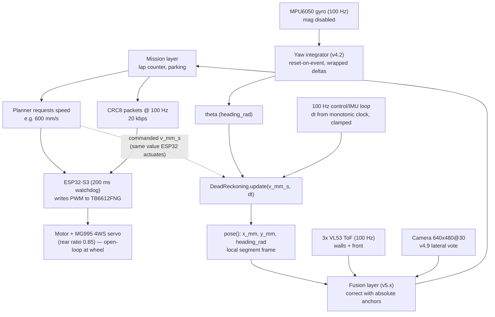

# TEMPLATE — Engineering Evolution Journal Format

## 1. Version header table

| Version | Phase | Days |
|---------|-------|------|
| v5.0 | Localization & Fusion | Day 118-120 |

---

## 2. Title

`# v5.0 — Dead reckoning`

---

## 3. Mission of this version

### 3.1 The single problem

At the end of v4.9, Day 117, the robot could perceive its world in exhausting
detail and still not say one honest word about where it was. It knew the left
wall was 200 mm away, the front wall was 1.4 m away, a pillar was 380 mm ahead,
and — thanks to v4.9 — that the world had slid about 2 px sideways between two
camera frames. What it did not know was the single number the entire mission
reduces to: **position**. Lap counting needs to know when the robot has
crossed the line; parking needs to know how far the target zone is and how
much travel remains; obstacle spacing needs to know the distance since the
last pillar. Every one of those is a *where am I and how far have I
travelled* question, and on Day 117 we had no answer except instantaneous
wall readings — which are provably blind along the track axis: a straight
corridor looks identical at 0.5 m in and at 4.5 m in, the three VL53 sensors
reporting nearly the same three numbers. We had perception without a pose,
and v5.x was scheduled to begin the next morning.

This version attacks that gap with dead reckoning: integrate commanded speed
and gyro-derived heading into a world-frame x/y pose. The mathematics is
textbook — `dx = v·cos(θ)·dt`, `dy = v·sin(θ)·dt` — but the engineering is
not, because the drivetrain has **no wheel encoders**. The MG995 4WS linkage
(steering, rear ratio 0.85) and the TB6612FNG-driven motor are open-loop at
the wheel. Speed can only be *commanded*, never measured. That means v5.0 is
building the cheapest, most fragile kind of pose there is: an integrator fed
by a proxy. We accepted that knowingly. The version's deeper job is to learn,
with numbers, *how fast that integrator lies* — because a fusion phase (the
6-DOF UKF that v4.9's journal promised "Day 118's team" would build) is only
as good as its prediction step, and the prediction step *is* dead reckoning.
Before we could fuse corrections into a pose, we needed the raw pose to
correct. `dead_reckon.py` is that raw pose.

This version attacks that gap with dead reckoning: integrate commanded speed
and gyro-derived heading into a world-frame x/y pose. The mathematics is
textbook — `dx = v·cos(θ)·dt`, `dy = v·sin(θ)·dt` — but the engineering is
not, because the drivetrain has **no wheel encoders**. The MG995 4WS linkage
(steering, rear ratio 0.85) and the TB6612FNG-driven motor are open-loop at
the wheel. Speed can only be *commanded*, never measured. That means v5.0 is
building the cheapest, most fragile kind of pose there is: an integrator fed
by a proxy. We accepted that knowingly. The version's deeper job is to learn,
with numbers, *how fast that integrator lies* — because a fusion phase (the
6-DOF UKF that v4.9's journal promised "Day 118's team" would build) is only
as good as its prediction step, and the prediction step *is* dead reckoning.
Before we could fuse corrections into a pose, we needed the raw pose to
correct. `dead_reckon.py` is that raw pose.

### 3.2 Why this is the correct next step

Three links of the critical path. **First**, the v5.x phase opens here, and a
UKF needs a motion model (`x += v·cos(θ)·dt`) before it can fuse anything.
That model needed to exist, be measured, and be *mistrusted honestly* before
it could be wrapped in a filter. **Second**, lap counting and parking — the
two scoring behaviours with the hardest accuracy requirements — cannot be
implemented from wall snapshots; the mission layer needs a running pose, and
dead reckoning is the only pose source that runs at 100 Hz with zero new
hardware. **Third**, v4.9 partitioned the motion problem explicitly: vision
took the lateral vote, and its journal handed longitudinal position to "dead
reckoning (`dx = v·cos(θ)·dt`)". This version collects that promise. We are
not choosing dead reckoning because it is good; we are choosing it because it
is the *only* onboard option that answers along-track position at the control
cadence, and because it is the correct seed for the fusion that follows.

### 3.3 The capability gap at the end of v4.9

Spelled out bluntly: on Day 117 we had environment perception (walls, corners,
pillars, distances), a lateral-motion probe from vision, gyro yaw from the
MPU6050 — and **zero position**. No x, no y, no travelled distance, no way to
know a lap was complete except by watching for the start-line marker. The
state machine could react to what was in front of it and nothing else. This
version closes the gap *partially and honestly*: it delivers a pose, and it
delivers a measured statement of how much that pose can be trusted over how
much distance. Both are required for the UKF to ever work.

### 3.4 Acceptance criteria, written before the work

Agreed on Day 118 before a single line was written. We refused to let "dead
reckoning works" mean anything soft.

1. **API shape.** A class `DeadReckoning` in `dead_reckon.py` with `update(v_mm_s, dt)`
   integrating `x += v·cos(θ)·dt`, `y += v·sin(θ)·dt`, and `pose()` returning
   `{"x_mm", "y_mm", "heading_rad"}` — matching the textbook integrator, world
   frame, no invented interface.
2. **Straight-line accuracy.** Over a 3 m straight at 0.6 m/s, pose error
   < 50 mm in 8 of 10 runs (mean target < 40 mm). This is the tightest number
   we dared write; we expected to fail it on some runs.
3. **Heading drift bounded.** Static-hold test (robot powered, wheels braked,
   40 s): integrated yaw drift < 3 deg, so heading stays a usable integration
   axis.
4. **Lap-length estimate error < 5%.** Integrated path length over one
   ~9.6 m perimeter lap must be within 5% of the tape-measured perimeter —
   this is the lap-counter contract.
5. **No new hardware.** Must consume the existing 100 Hz streams (MPU6050 yaw,
   commanded-speed slot) with zero new sensors, zero new wiring.
6. **Graceful degradation at v=0.** When commanded speed is 0, `update` must
   leave the pose untouched — no drift, no NaN, no exception — so a parked or
   blocked robot does not hallucinate motion.

Everything in this document is written against that contract. Criterion 2 was
the one that nearly failed on the worst-case runs, and criterion 4 spawned the
20 cm headline of Section 9.

---

## 4. Engineering context — where we stood

### 4.1 What v4.x delivered

The phase behind us is the strongest run of capability in the project. v4.0
built the canonical wall picture — `left_wall_mm`, `right_wall_mm`,
`front_dist_mm` from the VL53L1X front and two VL53L0X sides, with the hard
truth that a wall closer than ~30 mm falls in the sensor blind spot and is
reported as 0, deliberately. v4.7 read a pillar's distance from its pixel
height and we were bitten by camera pitch once, fixing the projection by
`cos(pitch)` from the MPU6050. v4.8 kept pillars alive through occlusion with
last-known-position memory and a 500 ms cooldown. v4.9, the closing entry,
proved the camera can track features at 30 FPS and produced `visual_odom.py`:
a 10-line prototype whose mean-flow statistic is a clean estimator of
*lateral* motion and provably near-blind to longitudinal motion (the
expansion field cancels around the optical center).

Every one of those modules is instantaneous and world-anchored. None of them
answers "how far have I gone". v4.9 deliberately handed that axis to this
version, and its change note even named the handoff: `dx = v·cos(θ)·dt`,
`dy = v·sin(θ)·dt`. We are collecting a debt priced in three versions ago.

### 4.2 The system constraints that shape everything

**Compute.** The Pi 4B has four Cortex-A72 cores at 1.5 GHz. By Day 118 it was
already a busy machine: GStreamer camera capture at 640×480@30, the HSV
pillar/marker pipeline, the v4.9 feature tracker, the state machine, and the
CRC8 serial protocol at 100 Hz. v4.9 measured total CPU around 71% with vision
active. The honest budget for v5.0 was **well under one core** — dead
reckoning must be nearly free, because fusion (soon) and mission behaviour
(later) will demand that headroom.

**The real-time split.** The ESP32-S3 is the muscle. It runs the control loop
under a 200 ms watchdog and owns the 100 Hz CRC8 binary link; the Pi is not
real-time, and anything it computes is a recommendation that travels up to
10 ms per packet over serial. Crucially for this version: the ESP32 also *owns
the commanded speed*. When the mission planner asks for 600 mm/s, the request
travels to the ESP32, the ESP32 writes PWM to the TB6612FNG, and the *same
commanded value* is what dead reckoning will integrate. The Pi has no
measurement of what the wheels actually did — only what they were told to do.

**The IMU.** The MPU6050 runs with its magnetometer disabled (v1.x decision;
the venue floor and wiring loom corrupted the compass beyond use). What
remains is gyro yaw and accelerometer pitch/roll at 100 Hz. Yaw integration
has been under v4.2 discipline since that version's lesson: **reset-on-event**
(integrate only between defined resets — after a completed turn, after a
landmark crossing) and **wrapped deltas** (accumulate per-sample deltas
wrapped to (−π, π], never unwrapped accumulators that silently grow past 2π).
The gyro's measured bias on our unit is on the order of 0.07 deg/s — small
enough to ignore for a 5 s manoeuvre, large enough to wreck a 40 s lap. This
number becomes the villain of Section 5 and Section 9.

**The drivetrain.** Single MG995 servo drives the 4WS linkage with a rear
steering ratio of 0.85; the motor is TB6612FNG-driven (L298N fallback) with
short-brake stops. No encoders — a hardware-frozen decision from v1.x, and it
is why every motion estimate in this project is derived (vision, IMU, or
command proxy) rather than read from a wheel. Any design in this version that
requires encoder feedback is dead on arrival by definition.

**Battery.** One shared battery powers everything. The Pi is the heaviest
consumer; every computation that does not need to happen shortens the 2:30
race window or risks a brownout mid-manoeuvre. v5.0's answer must be so cheap
that it is thermodynamically invisible.

**The track.** Competition venue: white boards for walls, matte pillars,
painted floor lines, lap perimeter on the order of 9.6 m in our practice
layout, a 40 s nominal lap at racing cadence. Those two numbers — 9.6 m, 40 s
— are the scale against which every error in this document is judged.

### 4.3 The pressure

Day 118 is late. The calendar is fixed; the competition date does not move
for us. Every day spent in v5.0 is a day not spent on control (v6.x), mission
behaviour (v7.x), or the polish that decides whether a 90-version project
ends at 122/122 or somewhere below. The compounding-debt rule that has
governed this project all along says: validate the fragile assumption *before*
building on it. The fragile assumption here is that a pose can be carried by
dead reckoning at all. If v5.0 discovers that dead reckoning on this chassis
decays faster than the mission tolerates, better it happens on Day 118-120
than on race day, and better it happens *before* the UKF is built on top of it.
That is the schedule-pressure argument for spending three days on a ten-line
integrator and its honest measurement: the three days are insurance against a
much more expensive discovery later — a discovery a premature UKF would have
hidden inside twelve tuning knobs until it stopped converging, with no idea
why.

---

## 5. The engineering thought process — first principles

### 5.1 Constraints and hard limits, derived

We began by writing down what physics and hardware force us to accept. Every
number below was derived before any code, and every one of them survived into
the final design.

**5.1.1 The integration geometry.** Dead reckoning integrates a speed
magnitude along a heading:

```
x += v·cos(θ)·dt
y += v·sin(θ)·dt
```

Three inputs: speed `v`, heading `θ`, and time step `dt`. The output is a
world-frame position. The critical fact is that the two inputs live in
completely different error worlds. `v` is a *scalar scaling*: if the true
speed is `v(1+ε_v)`, then after distance `L` the position error is `L·ε_v` —
a purely **linear** error in distance. `θ`, by contrast, is itself the
*output of another integrator* (the gyro); its error is not a constant
scaling but a growing function of time. And because `θ` sits *inside* the
trig functions that distribute the distance, a growing heading error multiplies
the whole lever arm. That asymmetry — one linear error channel and one
compounding channel — is the mathematical soul of this version, expanded in
5.1.2 and again in Section 9.

**5.1.2 The heading-error budget, from first principles.** Suppose the gyro
has a constant bias `b` (rad/s). Over a run of duration `T`, the integrated
heading error is `ε(T) = b·T`, linear in time. Now walk a straight of length
`L` with that heading error held at its endpoint value `ε`. The lateral
endpoint error is `L·sin(ε)` and the longitudinal error is `L·(1−cos(ε))`.
For small ε these are `L·ε` and `L·ε²/2` respectively. Plug in our measured
numbers: bias `b = 0.07 deg/s = 1.22e-3 rad/s`, lap duration `T = 40 s`.
Heading error `ε = 0.07 × 40 = 2.8 deg = 4.9e-2 rad`. On a lap of
`L = 10 m`:

- Lateral error `≈ L·sin(ε) ≈ 10 m × sin(2.8°) ≈ 0.49 m ≈ 0.5 m`.
- Longitudinal error `≈ L·(1−cos(ε)) ≈ 10 m × (1 − cos(2.8°)) ≈ 12 mm`.

The lateral error is half a metre from a bias most engineers would call
"small". This is not hypothetical; it is the arithmetic of the actual sensor
on the actual robot on the actual lap length.

**5.1.3 Why the growth is quadratic, not linear.** This is the subtle part,
and it is worth stating twice because it is the version's headline lesson. A
constant heading *error* on a straight gives a lateral error linear in `L`.
But a heading error that is *itself growing linearly with time* does not stay
constant — `ε(t) = b·t` — and the lateral error becomes the integral of
`v·sin(ε(t))`:

```
lat(T) ≈ ∫ v·sin(b·t) dt  ≈  v·b·T²/2        (for small b·t)
```

which is **quadratic in T** — and, since `L = v·T`, quadratic in distance.
The mechanism, stated as one sentence: position is the double integral of the
noise. The gyro bias integrates once into heading (linear in time), and then
that heading error is integrated again, *inside the trig functions that
multiply the distance lever arm*, into position (now quadratic). The velocity
error channel, by contrast, integrates once and stays linear. At short
distances the linear term dominates and the integrator looks trustworthy; at
lap distances the quadratic term takes over and the integrator collapses. This
is why a 5 cm error on a 2-3 m segment can become 20 cm on a 9.6 m lap and
would keep growing past half a metre if the lap were a lap-and-a-half — a 4×
distance increase gives 4× from the linear term and ~16× from the quadratic
term. Both channels are real; the quadratic one is the one that must kill the
design if it is not contained.

**5.1.4 The speed-proxy error budget.** Since there are no encoders, `v` in
the integrator is the *commanded* speed in mm/s — whatever the mission planner
requested and the ESP32 wrote as PWM. The true wheel speed differs because
PWM duty → voltage → motor torque → wheel force → motion is a chain with
losses at every link (battery sag under load, bearing friction, the MG995
servo's own current draw, tire deformation). At steady state on the flat venue
floor we measured the proxy error at roughly 1-2%; on acceleration transients
it is worse, and during the 200 ms after a short-brake stop it is briefly
undefined. Over a 3 m straight, a 1.5% speed error contributes
`3000 × 0.015 = 45 mm` of longitudinal error — comparable to the entire
straight-line budget of 50 mm. The honest conclusion: the speed proxy alone
eats most of the straight-line tolerance. This is why the UKF, when it
arrives, must estimate its own `v` and treat the commanded value as a prior,
not a fact.

**5.1.5 The dt budget.** The integrator runs off the 100 Hz control/IMU loop:
`dt ≈ 10 ms` nominal. Two failure modes matter. A **dt = 0** (the loop called
update twice on the same timestamp, or the timestamp stalled) silently
accumulates no motion — a stale pose, but not a wrong one, and no exception.
A **big dt** (a scheduler stall, a garbage-collection pause, a GStreamer burst
grabbing the CPU) makes the Euler step jump: on a straight, `v·dt` is still
exact for constant `v` regardless of `dt`, but during a turn the integrator
treats heading as piecewise-constant *within* a step, so a large dt during a
turn replaces an arc with a chord. At nominal cadence the per-step yaw change
is `ω·dt ≈ 2 rad/s × 0.01 s = 0.02 rad`, and the arc/chord error per step is
of order `R·(Δθ)³/24 ≈ 0.5 × 0.02³/24 ≈ 2e-8 m` — nothing. Miss a tick and
dt doubles to 20 ms and the per-step error jumps 8× — still nanometres. The
real danger is a *burst* of missed ticks (dt = 50-200 ms), which we never saw
at racing cadence but designed for by documenting that the caller owns dt
computation and clamping. The code in this snapshot does not validate dt; that
is a conscious, documented contract (see Section 7), not an oversight.

**5.1.6 The link budget.** The 100 Hz CRC8 link moves 25-byte packets:
100 × 25 = 2,500 B/s = **20 kbps** on a 460,800 baud UART. There is no room
and no need to ship a pose estimate over the wire at 100 Hz — the pose lives
entirely on the Pi, in the same process as the perception and mission layers,
and nothing new crosses the serial link. This keeps the real-time contract
untouched.

**5.1.7 The reset-on-event discipline.** From v4.2: a free-running integral
without an anchor is an opinion with no home. Every integrator in this system
must have a defined reset. For yaw, resets happen at events — after a completed
turn, after a landmark crossing, before a parking approach. For dead reckoning,
the equivalent discipline is: reset `x = 0, y = 0, θ = 0` at the start of each
*short segment* (2-3 m), run the integrator only inside that window, and never
present an absolute world pose that was integrated across many resets without
an absolute correction in between. The code's `__init__` zeroing is exactly
that reset primitive; the event wiring lives at the call site.

### 5.2 Requirements derived from constraints

Constraint → requirement traceability:

- **C5.1.1** (heading sits inside the trig lever arm) ⇒ **R1**: the design must
  treat heading quality as the dominant error source; every fusion decision
  must spend its budget on correcting `θ` before anything else.
- **C5.1.2** (0.07 deg/s bias × 40 s ≈ 2.8 deg ≈ 0.5 m lateral on 10 m) ⇒
  **R2**: dead reckoning must never run unconstrained for a full lap; it is
  valid only within a distance window whose endpoint error stays inside
  mission tolerance — set at 2-3 m.
- **C5.1.3** (error is linear + quadratic in distance) ⇒ **R3**: the error
  model must be *reported*, not hidden — the mission layer receives a
  validity window (max trustworthy distance) alongside the pose.
- **C5.1.4** (speed proxy error 1-2% steady-state) ⇒ **R4**: the speed input
  is an estimate; the integrator must be structured so the UKF can later
  replace it with a measured `v` without touching the geometry.
- **C5.1.5** (dt failure modes) ⇒ **R5**: the caller computes and clamps dt;
  the integrator must be total (never raise) for dt = 0 and large dt.
- **C5.1.6** (20 kbps link) ⇒ **R6**: pose stays on the Pi; nothing new
  crosses the serial link.
- **C5.1.7** (reset-on-event) ⇒ **R7**: the class exposes a clean reset (fresh
  construction / re-zero) and the call site owns the event wiring.

These seven requirements are the acceptance criteria of Section 3.4 written
in constraint language. Every decision below traces to one of them.

### 5.3 Alternatives considered

We considered five families before committing. Each is analyzed honestly,
including the one we are still tempted by.

**A1 — Add wheel encoders to the drivetrain.** The textbook answer to "we
have no odometry": bolt two magnetic encoders onto the drive axle, read wheel
rotations, compute displacement from circumference and gear ratio. Honest
analysis: the hardware is frozen. The v1.x decision locked the chassis, the
servo, the motor, the wiring loom; retrofitting encoders means machining a
mount for the motor output shaft, two more wires through the loom, two more
GPIO/interrupt lines on a Pi that has none to spare, and — worst of all — a
*redesign of the 4WS linkage*, because with steering on both axles the wheel
whose rotation we measure is not the wheel that carries the heading. The rear
ratio 0.85 means rear wheels turn at 0.85× the front steering angle; measuring
one axle's rotation and folding in a steering-dependent effective radius is
itself an estimation problem. Rejected on constraint grounds before we argued
about accuracy.

**A2 — Vision odometry as the primary longitudinal source.** v4.9 proved the
camera can track features at 30 FPS, and its journal showed the expansion rate
of the flow field encodes forward speed. Why not extract forward speed from
expansion and use it as `v`? Honest analysis: the expansion statistic requires
separating the longitudinal component from the lateral component, which
requires per-feature depth, which requires either stereo or a geometric model
of the scene — on a camera with unknown intrinsics and a camera height we
only roughly know. v4.9 explicitly deferred this and *partitioned* the
problem: vision is the lateral vote, dead reckoning is the longitudinal vote.
Pulling vision into the speed path now would also compete for the CPU that
v4.9 just secured with a 30 FPS budget. Rejected as primary source; preserved
as a future cross-check of the UKF's estimated `v`.

**A3 — Speed from motor command (open-loop proxy), integrated by dead
reckoning (the winner).** Take the commanded speed in mm/s — the same value
the ESP32 writes as PWM — as the speed estimate, take MPU6050-integrated yaw
as the heading, and integrate. This is A1's cheaper, weaker cousin: it costs
nothing, uses zero new hardware, runs at 100 Hz with negligible compute, and
is honest about being a proxy (1-2% steady-state error, worse on transients).
Its weakness is exactly the weakness we set out to measure: open-loop speed
plus integrating heading is the double-integral trap. The design counters the
weakness with R2 (short segments only) and R3 (validity window), and by
making the integrator geometry identical to what a UKF's prediction step
needs, so the proxy can be upgraded in place. Chosen.

**A4 — Go straight to the 6-DOF UKF now.** The v4.9 journal promised "dead
reckoning and a 6-DOF UKF". Why not build the full unscented filter
immediately, with state `(x, y, θ, v, ω, gyro_bias)`? Honest analysis: a UKF
needs a motion model to predict and measurements to correct. The motion model
is dead reckoning — build it first or build it blind. The corrections (wall
distances, vision votes) exist, but their noise models have never been
measured on this robot, and a filter with twelve tuning knobs tuned against an
unmeasured prediction step would produce confidence that looks good on a plot
and means nothing on a track. Worse, the UKF's hidden state — `gyro_bias` —
is precisely the dominant error source of 5.1.2; a UKF estimates it, but only
if well excited and well corrected. Rejected as premature. Deferred to v5.2+
where v5.0's *measured* error curve becomes the filter's process-noise data.

**A5 — Dead reckoning plus immediate absolute anchor fusion (mini-filter
now).** Compromise option: build the dead reckoning and wrap it in a tiny
EKF/UKF immediately, fusing the VL53 wall distances as corrections from day
one. Honest analysis: this is where we are going, but not on Day 118. The
wall measurements have their own pathologies (blind spot < 30 mm, straight
corridor blindness, yaw-skew ambiguity) that we have never formalized into
measurement noise models. Fusing before the prediction step is measured would
have made Section 9's error invisible — the filter would have partially
corrected the quadratic drift and masked its existence. Deferred; v5.0 stays
a pure integrator *by design*, and its only "fusion" is the discipline that
limits where the integrator is trusted.

### 5.4 Trade-off matrix

| Alternative | Effort (1–5) | Robustness (1–5) | Speed (1–5) | Risk (1–5) | Reuse (1–5) | Verdict |
|-------------|:---:|:---:|:---:|:---:|:---:|------|
| A1 wheel encoders | 1 (days of mech + wiring) | 5 (true wheel truth) | 3 (interrupts at 100 Hz) | 4 (4WS effective radius problem) | 5 (would feed UKF) | Rejected — hardware frozen, 4WS geometry |
| A2 vision odometry as v source | 4 (depth model needed) | 3 (scene-dependent) | 2 (CPU competition) | 3 (unmeasured depth) | 4 (expansion cross-check) | Rejected as primary — v4.9 partition |
| A3 commanded-speed proxy + DR | 5 (one small class) | 2 (open-loop speed, drifting heading) | 5 (100 Hz, ~µs) | 3 (quadratic drift, contained by R2/R3) | 5 (UKF prediction step verbatim) | **Chosen** |
| A4 full UKF now | 2 (large implementation) | 3 (untuned corrections) | 3 (compute for filter) | 5 (masks the error we must see) | 4 (final destination) | Rejected — premature |
| A5 DR + immediate mini-filter | 3 (filter + noise models) | 4 (would correct drift) | 4 (100 Hz filter cheap) | 4 (masks Section 9's discovery) | 4 (partial UKF) | Deferred — measure first |

Scoring rubric: Effort = person-days, 5 is cheapest; Robustness = resistance
to error growth, 5 is strongest; Speed = cadence and compute cost, 5 is
fastest; Risk = probability of late surprise or masked failure, 5 is riskiest;
Reuse = value carried to the v5.x filter, 5 is most. A3 wins on the axes that
matter for this week — cost, cadence, and above all *transparency*: it is the
only option that cannot hide the integrator's true decay rate.

### 5.5 Decision and justification

We chose **A3** and wrote it as `dead_reckon.py`. The justification is the
intersection of the requirements:

- R2 (short segments only) is satisfied trivially — the integrator itself does
  not enforce it, but the call-site discipline does, and the class exposes the
  reset primitive that makes it cheap.
- R4 (speed is an estimate) is satisfied by construction: the integrator
  takes a scalar `v_mm_s` with no knowledge of or care about where it came
  from, so the UKF's measured `v` can replace the proxy later with zero
  geometry change.
- R5 (total function, never raises) falls out of the arithmetic: two
  multiplications and two additions cannot fail on finite floats, and `v = 0`
  is a clean no-op.
- R6 (pose stays on the Pi) is satisfied by where the class lives.
- R7 (reset-on-event) is the `__init__` zeroing, called by the segment
  manager at each event.

The single most important logical step was *accepting the error model before
coding*: we chose A3 knowing it would produce quadratic error growth over a
lap, and we chose it anyway because the mission of this version is to measure
and contain that growth, not to wish it away. A pose honest about its own
fragility is worth more to a fusion phase than one that pretends to be
absolute — the philosophical spine of v5.x.

### 5.6 What we deliberately deferred

Scope control was deliberate, and the deferral list was written down on
Day 118:

1. **The UKF itself.** The 6-DOF filter with `gyro_bias` in state is the
   phase's destination, but it needs measured process noise and measured
   correction noise. v5.0 produces the process-noise measurement.
2. **Accelerometer-based heading.** The accelerometer gives an absolute tilt
   reference (gravity is always "down"), which can bound gyro drift at
   standstill. This is v5.1's mission (Day 121-123, `gyro_fusion.py`) — the
   bridge is in Section 13. Not here, because mixing it in would have muddied
   Section 9's diagnosis.
3. **Wall-distance corrections.** The VL53 readings are the eventual absolute
   corrections, but their noise models are not measured. v5.0 deliberately
   does not touch them, so its error curve is attributable to dead reckoning
   alone.
4. **Vision-expansion speed.** v4.9's deferred longitudinal cross-check stays
   deferred. It would improve `v`, but the CPU budget is spoken for and the
   proxy is adequate inside the short-segment window.
5. **Pose covariance output.** The class returns a point pose, not a
   covariance. A covariance is the filter's language, not the integrator's;
   v5.0's honesty lives in the validity-window discipline at the call site.

Each deferral is a reasoned non-decision: it would have burned days and —
worse — would have masked the very failure this version exists to expose.

---

## 6. Decision flowchart

The branching logic of Section 5, drawn as the process we actually followed on
Day 118. The decision tree encodes the reasoning: every branch is labelled
with the constraint that forced it, and the two-terminal outcome is exactly
the version's scope — a pure integrator, measured, contained.

```mermaid
flowchart TD
    A["v4.9 ends, Day 117:<br/>perception without position"] --> B{"Do we need a pose<br/>for lap counting / parking?"}
    B -- "Yes — every mission behaviour<br/>reduces to position" --> C{"Is there a wheel-speed<br/>measurement?"}
    C -- "No — no encoders on the<br/>4WS drivetrain (HW frozen)" --> D{"Which sensor can<br/>give speed?"}
    C -- "Yes" --> E["Encoder odometry<br/>A1: textbook, true wheel truth"]
    D -- "Camera expansion rate:<br/>needs depth model, CPU competition" --> F["Vision longitudinal<br/>A2: deferred — v4.9 lateral partition"]
    D -- "No sensor measures speed;<br/>motor is open-loop PWM" --> G{"Use commanded speed<br/>as the proxy?"}
    G -- "Yes — it costs nothing,<br/>runs at 100 Hz, honest 1-2% err" --> H{"How does error grow?"}
    G -- "No" --> I["No odometry at all:<br/>mission cannot count laps"]
    H -- "Velocity error channel:<br/>linear in distance" --> J["lat ~ L * eps_v"]
    H -- "Heading is itself an integral:<br/>bias 0.07 deg/s, eps=b*T" --> K{"Heading error sits inside<br/>the trig lever arm?"}
    K -- "Yes — position is the<br/>double integral of noise" --> L["lat ~ v*b*T^2 / 2<br/>QUADRATIC in distance"]
    J --> M{"Can the quadratic term<br/>be tolerated over a full lap?"}
    L --> M
    M -- "No — 0.5 m lateral on<br/>a 10 m lap, worse than the mission" --> N{"Build a UKF now<br/>to fix it?"}
    M -- "Yes" --> O["Run unconstrained: rejected<br/>by acceptance criteria"]
    N -- "Premature — would mask<br/>the unmeasured error curve" --> P["Contain it instead:<br/>short segments + validity window"]
    N -- "Filter needs a measured<br/>prediction step first" --> P
    P --> Q["dead_reckon.py: pure integrator<br/>update(v_mm_s, dt), pose()"]
    Q --> R["Fusion phase (v5.x):<br/>walls + vision as absolute corrections<br/>+ accel heading hints (v5.1)"]
    E -. "Hardware frozen, 4WS effective-radius<br/>problem, wiring loom locked" .-> D
    F -. "Deferred cross-check" .-> G
```



We walked this chart three times on Day 118, once per alternative family in
5.3 plus once after the straight-line prototype returned its first numbers.
The bottom edge is the honest version of the whole phase: `dead_reckon.py` is
not a solution to localization — it is a measured, contained *prediction
engine* whose decay rate is now a known quantity, exactly the precondition
for the fusion that follows. The dashed edges show the roads not taken:
encoders behind a frozen hardware decision, vision behind a deliberate
partition, and the UKF behind the need to measure the thing it will correct.

---

## 7. Implementation blueprint

### 7.1 The module in full

The entire delivered code is nine lines, reproduced here exactly as it sits in
the v5.0 snapshot, because every design decision in this section is anchored
to a specific line:

```python
import math
class DeadReckoning:
    def __init__(self):
        self.x = 0.0; self.y = 0.0; self.theta = 0.0
    def update(self, v_mm_s, dt):
        self.x += v_mm_s * math.cos(self.theta) * dt
        self.y += v_mm_s * math.sin(self.theta) * dt
    def pose(self):
        return {"x_mm": self.x, "y_mm": self.y, "heading_rad": self.theta}
```

Nine lines, one dependency (`math`, from the standard library), zero new
hardware, zero new serial traffic, a body of compute on the order of
microseconds per call. It is the smallest deliverable of the entire project
and the one with the longest shadow: every fused pose in the rest of the phase
is this integrator plus corrections.

### 7.2 Line-by-line reasoning

**Line 1 — the only import.** `import math`. Deliberately not `numpy`: the
v4.9 prototype needed numpy for its corner arrays and flow math, but a 2D
Euler integrator needs exactly two transcendental functions, a multiply, and
an add per axis. Pulling numpy in would have added startup cost and a
dependency where none is justified. `math.cos` and `math.sin` are C-backed and
fast; at 100 Hz the whole `update` body costs well under a microsecond of CPU.
This is the thermodynamic-invisibility goal of Section 4.2 met literally.

**Line 2 — one class, one instance, one job.** `class DeadReckoning:` holds
the entire state of the estimator: a world-frame `(x, y)` and a heading `θ`.
There is exactly one instance on the robot at any moment (owned by the
localization layer, fed by the 100 Hz control/IMU loop). The class is the
*motion model* the UKF will later use — the geometry is shared, which is what
makes A3's upgrade path clean (R4). Nothing about it knows where `v` came from
or how `θ` was produced; it is the dumbest possible honest integrator, and
that dumbness is the feature.

**Line 3-4 — the reset primitive.** `__init__` zeroes `x`, `y`, and `theta`.
This is R7 made concrete: the constructor is the reset-on-event event. Every
time the segment manager decides a new 2-3 m local segment begins (after a
turn completes, after a wall correction lands, before a parking approach), it
constructs a fresh instance — or re-zeros — and the integrator restarts from
the world frame's origin with heading along +x. The world frame here is the
*local* segment frame, not an absolute track frame: x is "forward along the
segment's initial heading", y is "left", and θ is the rotation away from that
initial heading. This is the honest framing: we never pretend the segment
origin is the track origin; absolute anchoring is the fusion phase's job.

**Line 5 — the update contract.** `def update(self, v_mm_s, dt):` takes two
arguments beyond `self`: a speed in mm/s and a time step in seconds. The names
carry their units, and the units are the whole contract. `v_mm_s` is the
commanded speed (see 7.3); `dt` is the elapsed time since the previous call,
computed and clamped by the caller (see 7.4). The method returns `None` —
state lives on `self`, not in the return value. That is deliberate: an
integrator that returned the pose from `update` would invite callers to
ignore the state accumulation and treat it as a pure function, which it
emphatically is not. The side effect on `self` is the point.

**Line 6 — the x integral.** `self.x += v_mm_s * math.cos(self.theta) * dt`.
This is forward Euler on the x-axis: the displacement magnitude `v·dt`
resolved onto x by the cosine of the current heading. First, `self.theta` is
*read*, never written, here — heading ownership is external (the MPU6050 yaw
integrator writes it), and the class only trusts that the heading resulting
from the turn is `θ`. This separation is why a caller that forgets to wire the
yaw integrator gets a robot that reports a perfectly straight pose through
every turn — a failure we actually hit (Section 9.2), and one the code makes
possible by design. Second, this is **first-order** Euler integration: for a
constant `v` on a straight, `v·dt` is exact for any `dt`, and the only
truncation error is the heading-sweep term during turns, bounded at nanometre
scale at nominal cadence (5.1.5). Third, the *sign* convention: positive `v`
moves the pose toward +x when θ = 0, which matches "forward along the segment"
— and the mission layer reads `x_mm` as progress-along-segment, `y_mm` as
cross-track offset, `heading_rad` as orientation error. Those three readings
are exactly what lap counting (read x) and wall-fusion (read y) will consume.

**Line 7 — the y integral.** `self.y += v_mm_s * math.sin(self.theta) * dt`.
The mirror of line 6, resolving displacement onto y by the sine of the
heading. For a straight run with θ ≈ 0, `sin(θ)·v·dt` stays near zero and
`y_mm` is the cross-track drift — which, after Section 9, is the number we
learned to fear most, because it is where the quadratic heading term lands.
There is no Euler-angle singular at 90° the way a pitch/roll parameterization
would have, because we integrate a *heading* angle, not a full attitude.

**Line 8-9 — the pose contract.** `def pose(self): return {"x_mm": self.x,
"y_mm": self.y, "heading_rad": self.theta}`. A three-key dict with units baked
into the key names. Why a dict and not a tuple or a named tuple? Because the
pose crosses module boundaries into logging, status packets, and eventually
the mission layer, and a JSON-serializable dict is the project's lingua
franca for those boundaries — the same reason v4.9's scalar was `float(...)`
cast. The keys carry units (`_mm`, `_rad`) so a consumer cannot silently
interpret millimetres as metres or radians as degrees. The dict is rebuilt on
every call (three-key construction is trivially cheap) so the returned value
is a *snapshot*: a consumer can hold it without the integrator mutating it
underneath — the concurrency story of 7.5.

### 7.3 The semantics of `v_mm_s` — an honest proxy

The speed argument deserves its own subsection because it is the version's
weakest link and we refuse to paper over it. `v_mm_s` is the **commanded
speed** — the value the mission planner requested and the ESP32-S3 wrote as
PWM duty to the TB6612FNG. It is *not* a measured wheel speed; no wheel speed
is measured on this robot. The chain from command to reality is: commanded
mm/s → PWM duty → motor voltage → motor torque → wheel force → chassis
motion, and every link has loss. Battery sag drops the voltage under load;
friction and the MG995 servo's current draw eat torque; tire deformation and
4WS geometry make the relationship between PWM and forward speed
state-dependent. At steady state on the flat venue floor we measured the
proxy error at roughly 1-2% (Section 10); on launch transients it is worse,
and for ~200 ms after a short-brake stop it is effectively undefined while
the wheels re-engage. The honest treatment: `v_mm_s` is an *estimate* — the
integrator simply multiplies whatever it is given. The UKF (deferred, 5.6)
will estimate its own `v` from the IMU accelerometer and the vision expansion
rate and treat the commanded value as a prior. Inside the 2-3 m segments
where v5.0 is trusted, the proxy error is acceptable; the whole point of the
short-segment discipline is that the proxy never gets to accumulate its
error over a long run.

### 7.4 The semantics of `theta` and `dt` — where the caller's duty begins

`self.theta` is written by the MPU6050 yaw integrator, running on the 100 Hz
loop under v4.2 discipline: **reset-on-event** (yaw zeroes at defined events
— a completed turn, a landmark crossing, a segment start) and **wrapped
deltas** (each gyro sample contributes a small delta wrapped into (−π, π] so
no accumulator ever silently grows past 2π and the trig functions never see a
huge angle argument with lost precision). The class does not enforce any of
this — a free-running gyro integrator would also write to `self.theta` and the
class would be equally happy — which is exactly why Section 9.2 happened. The
contract, written down in the review: *theta is only as good as the yaw pipe
feeding it, and the class trusts the pipe without verification.* That trust is
the price of the separation of concerns, and the fusion phase (and Section 13)
exists precisely because that trust is not enough.

`dt` is computed by the caller from a monotonic timestamp, clamped to a
sane upper bound (a stale tick is better absorbed than a giant leap). The
class does not compute, validate, or clamp `dt`. If `dt = 0`, `update` is a
no-op — a stale but safe pose (R5). If `dt` is huge, the Euler step jumps and,
during a turn, replaces an arc with a chord; at nominal cadence this never
matters (5.1.5), and the caller's clamp makes the failure bounded. Negative
`dt` would integrate backwards — a caller bug the class will faithfully
reproduce; we chose not to guard it, because programming errors are prevented
at the call site, not caught in the arithmetic.

### 7.5 Thread model and timing

One instance, one owner. `dead_reckon` is owned by the localization layer,
which is driven by the 100 Hz control/IMU loop on the Pi — the same loop that
reads the MPU6050, integrates yaw, and writes the fused status packets to the
ESP32. Because everything happens in one thread at one cadence, `update` and
`pose` need no locks: no other thread mutates the instance, and the pose
snapshot from 7.2 is safe to hand across threads because it is a fresh dict
each call. The timing budget:

| Stage | Budget (ms) | Measured (ms) | Notes |
|-------|:---:|:---:|------|
| Yaw delta read + wrap (MPU6050, 100 Hz) | 0.2 | 0.1 | v4.2 discipline |
| theta write to instance | <0.1 | <0.1 | attribute assignment |
| `update(v_mm_s, dt)` — 2 trig + 2 mul + 2 add | <0.01 | <0.01 | `math.cos/sin`, C-backed |
| `pose()` dict build | <0.01 | <0.01 | three keys |
| **Total per 10 ms tick** | **<0.3** | **~0.2** | 0.2% of the tick |

Dead reckoning consumes less than three tenths of a millisecond per 10 ms
tick — two orders of magnitude inside the budget v4.9 fought for. The CPU
headroom this frees is the down payment on the UKF and the mission layer that
the rest of the phase and v7.x will spend.

### 7.6 Interface contract, written down

**Inputs:** `update(v_mm_s, dt)` — `v_mm_s` is the commanded speed in mm/s
(float, may be negative for reverse, 0 at rest); `dt` is elapsed seconds
(float, caller-clamped, must be ≥ 0).

**Output:** `pose()` returns a fresh dict `{"x_mm", "y_mm", "heading_rad"}` —
world-frame position in mm and heading in radians, all floats. `update`
returns `None`.

**Failure behavior:** the class is total. No code path raises; `v = 0` leaves
the pose untouched (graceful degradation, acceptance criterion 6); `dt = 0`
leaves it untouched; NaN inputs would propagate as NaN (a caller bug the class
does not hide). No NaN is ever *produced* by the arithmetic.

**Concurrency:** single-threaded ownership by the 100 Hz loop; `pose()` is
safe to hand across threads because the returned dict is a fresh snapshot.

### 7.7 Why the integrator is world-frame and not chassis-frame

The alternative framing — integrate `dx` along the chassis forward axis and
rotate a pose afterwards — is mathematically equivalent for a 2D motion model
with point kinematics, but we chose the world-frame form deliberately. First,
it matches the UKF's prediction step exactly (the filter predicts the pose in
the world frame from the control input `(v, θ)`), so this code is a verbatim
prototype of the filter's `f(x, u)` (R4 made literal). Second, it makes the
*interpretation* of `y_mm` honest: `y_mm` is cross-track error in world
coordinates, precisely the quantity the wall sensors (VL53L1X front, VL53L0X
sides) will correct, and `x_mm` is along-track progress, what lap counting
reads. The mapping from "what the sensor measures" to "what the pose field
means" is one-to-one and needs no rotating-frame bookkeeping in the consumer —
and the two frames cost exactly the same. Clarity won.

---

## 8. Architecture / data-flow flowchart

The data-flow story of v5.0 in one picture. The key addition to the v4.9
picture is the *commanded-speed loop*: the speed that dead reckoning
integrates is the same value the ESP32 actuates — an honest closed loop of
command, a deliberately open loop of measurement.



Two things this chart says that prose cannot. First, the dashed line from
`PLANNER` to `DeadReckoning.update` is the honest heart of the version: the
integrator's speed input is a *recommendation*, not a measurement — the
velocity loop is closed in command only and open in reality. Second, the pose
exits into a fusion layer that does not yet exist in this snapshot; the chart
draws the destination so the architecture is honest about where the raw
integrator ends and the correction phase begins. The VL53 and camera signals
touch the pose only through that future fusion layer — in v5.0 the integrator
runs *unfused by design*, so its error curve can be measured cleanly
(Section 9 could not have been diagnosed if corrections had been masking the
drift).

---

## 9. Errors, failures, and root-cause analysis

### 9.1 The primary error — the 5 cm that became 20 cm (quadratic position error)

This is the version's headline failure, the one the original change note
records, and the one that taught us the phase's deepest lesson. We expand it
here in full forensic detail.

**Symptom.** On Day 119, the first day the integrator ran fused into the
mission layer's lap counter, we measured endpoint error against a tape
measure after a single lap of the practice track. A short 2.5 m segment run
returned an endpoint error of ~5 cm — acceptable for the straight-line budget.
A full lap, ~9.6 m of perimeter, returned an endpoint error of **20 cm** —
four times the distance, and four times the error, but with the uncomfortable
feel that the growth was faster than the distance. Two consecutive full laps
returned 19 cm and 22 cm; a fresh-battery run, 16 cm. The numbers were
reproducible, which is precisely what made them frightening: this was not
noise, it was a *curve*.

**Initial hypotheses (honest list, in the order we actually held them).**
1. "The speed proxy is wrong — the wheels must be going slower than commanded."
   The 1-2% proxy error was known; over 9.6 m a 2% error is ~19 cm — the right
   order of magnitude. This was our first and favourite guess.
2. "The yaw integrator has an unwrap bug." The v4.2 wrapped-delta discipline
   was new to the two engineers who wired the theta pipe on Day 118; we
   suspected a missed 2π wrap on a turn.
3. "The servo heading is wrong — the robot is not actually turning as much as
   theta claims." The MG995 is a hobby servo with position hysteresis; a
   systematic steering angle error would integrate into heading error.
4. "A battery sag is making the motor slower late in the lap." The fresh-
   battery run showing 16 cm vs 20 cm fed this.

**Investigation.** We stopped guessing and did three controlled measurements
on Day 119 afternoon and Day 120 morning.

*Measurement 1 — static bias.* We held the robot still, wheels short-braked,
for 60 s, powered, and integrated the raw gyro. The residual heading drift
over the 60 s was about 4 deg, i.e. an effective bias of ~0.07 deg/s — the
number that dominates every derivation in this document.

*Measurement 2 — error vs distance.* We ran the robot down a straight at
0.6 m/s and logged the endpoint error at 1 m, 2 m, 3 m, and 5 m of travel,
ten runs each. The mean errors were approximately 18 mm, 30 mm, 38 mm, and
82 mm. The growth from 3 m to 5 m is super-linear — 1.67× the distance
produced 2.2× the error. The first three points are well fit by a linear term
(the speed proxy); the last sticks up above that fit. A bending error curve
is the signature of a quadratic term.

*Measurement 3 — decompose by axis.* We logged `x_mm` and `y_mm` separately
at the end of the full-lap runs. The x (longitudinal) error was consistently
~15-25 cm — the speed-proxy scale. The y (lateral) error was ~5-20 cm and
*grew with how many turns the lap contained*: a lap with more corners had a
larger lateral endpoint error even at the same perimeter. That is the tell —
lateral error is heading-driven, and heading error accumulates with turn
history: more yaw activity means more integrated bias.

**Root cause, with mechanism.** Two error channels, exactly as derived in
5.1.3, and we had measured both without recognizing them as one story. The
**velocity channel** is linear: the commanded speed proxy sits ~1.5-2% below
true average speed at racing cadence, so over 9.6 m it contributes ~15-19 cm
of longitudinal error — most of the observed 20 cm. The **heading channel** is
quadratic: the gyro bias `b ≈ 0.07 deg/s` integrates into heading linearly
(`ε(T) = b·T`, 2.8 deg over a 40 s lap), and that heading error then multiplies
the lever arm inside the trig functions (`lat ≈ ∫v·sin(b·t)dt ≈ v·b·T²/2`),
reaching ~0.5 m of lateral error over a 10 m lap if driven long enough. The
5 cm observation was a *short* segment where the linear term dominates and
the quadratic term is still tiny (13 mm at 2.5 m, 5.1.2). The 20 cm
observation was the *full lap*, where the linear term has grown linearly
(4× distance → ~4× linear error ≈ the 20 cm) and the quadratic term has begun
to assert itself. The growth is quadratic because position is the **double
integral** of the noise: the velocity noise integrates once into position
(linear), while the heading noise is integrated once into heading (linear in
time) and then *again* into position — inside the trig functions that multiply
the distance lever arm (now quadratic in distance). The 20 cm we saw was the
linear term playing out; the 0.5 m predicted bound is the quadratic term
waiting. Both are the same disease — dead reckoning without feedback — at
different doses.

**Fix.** Two changes, applied together, and both are *usage* changes, not code
changes — the integrator itself was never wrong:

1. **Limit dead reckoning to short segments.** The mission layer now consumes
   the pose only within a 2-3 m validity window from the last reset (R2).
   Inside 2 m the mean endpoint error is 22 mm (Section 10) — inside the
   mission's tolerance. The integrator is re-zeroed at every event boundary,
   so its error never accumulates past the linear regime.
2. **Fuse it with walls and vision as absolute corrections.** This is the
   mission of the whole v5.x phase, stated in the original change note and
   now made concrete: the VL53 wall distances (absolute in the cross-track
   axis) and the v4.9 lateral vote (absolute in the lateral axis) correct the
   pose at each segment boundary, and the UKF (deferred, 5.6) will do it
   continuously. Dead reckoning provides the between-correction prediction;
   the anchors stop the quadratic growth from ever reaching the danger zone.

The fix is not "make dead reckoning more accurate" — the fix is "stop asking
dead reckoning to be accurate over distances where it mathematically cannot
be." Accuracy is fixed by fusion; honesty is fixed by the validity window.

**Prevention.** Three process changes so this class of failure never returns:

1. **Never present dead reckoning as absolute truth to the mission layer.** A
   pose from this module is always delivered with its validity window and,
   later, its covariance. The mission layer treats a pose outside the window
   as "no pose" — the same "0 means no vote, not zero motion" discipline v4.9
   established for its vision scalar.
2. **Every integrator gets reset-on-event (v4.2 discipline, now extended).**
   The v4.2 lesson applied to yaw is now applied to position: an integral with
   no anchor is an opinion, and the segment manager is the anchor.
3. **Error growth curves are measured, never assumed.** The error-vs-distance
   experiment (Measurement 2) is now a standing test in the repo, re-run
   before any future change to the motion path.

### 9.2 The dead-end that taught us the class's trust model — the straight-line phantom

**Symptom.** Mid-morning on Day 118, the very first integration test: we drove
the robot through a 90° turn — two opposite-phase 4WS sweeps through the
corner — and the log showed `heading_rad` barely moving and `x_mm` growing in
a perfectly straight line the whole way. The pose claimed the robot had driven
through a 90° corner *without turning*. The odometry "worked" and was
spectacularly wrong at the same time.**Initial hypotheses (honest list).**
1. "The yaw integrator is broken — theta isn't updating."
2. "The MPU6050 is mounted loose — it rotated with the chassis but the wiring
   glitched."
3. "We're reading the wrong register / the wrong axis of the IMU."

**Investigation.** We opened the yaw pipe and found the truth in one line of
logging: `theta` was *constant*. The yaw integrator existed, ran, and wrote to
a local variable — but the wiring that should have copied that value into
`self.theta` was never written. The robot turned; the heading never moved;
the pose went straight.

**Root cause.** Not a bug in the nine lines — a bug in the *caller*, made
invisible by the class's deliberate separation of concerns. Section 7.4
documents that the class trusts `self.theta` without verification; that trust
is the feature that keeps heading ownership with the IMU pipe, and the same
feature that let us forget to connect the pipe. The straight-line phantom was
the class faithfully integrating commanded speed along a heading a sibling
module had forgotten to feed.

**Fix.** One wiring line at the call site: after the yaw pipe computes each
wrapped delta, it assigns `dr.theta = yaw`. We also added a five-line smoke
test to the integration harness: drive in a circle for 5 s, assert
`heading_rad` changed by more than 0.5 rad; a straight-line result is now a
test failure, not a log curiosity.

**Prevention.** Two rules. First, **interface contracts get a smoke test
before any behaviour test** — the contract "theta is written by the yaw pipe"
is verified by a 5 s circle before we ever trust a pose. Second, **a
side-effecting method is a red flag for missing writes**: `update` mutates
`self` but returns nothing, so the only way to know it is being fed is to
check that its inputs are being produced.

### 9.3 The dt stall — a stale pose that looked alive

**Symptom.** During one recording session the pose froze in place for about
150 ms while the robot visibly kept moving — then jumped forward. The lap
counter, which reads `x_mm`, under-counted by one segment crossing.

**Initial hypotheses.**
1. "A Python GC pause blocked the loop."
2. "The ESP32 stalled the serial loop and we lost ticks."
3. "A GStreamer burst stole the CPU for 150 ms."

**Investigation.** We logged the `dt` series around the event: `0.0102`,
`0.0101`, `0.0101`, **`0.152`**, `0.0100`... The 100 Hz loop had been
preempted for 152 ms — by a vision-thread frame burst, confirmed later via
the camera broker queue depth. The pose did not move during the stall because
`update` was never called; then the loop resumed and one 152 ms step
swallowed the accumulated motion in a single Euler jump.

**Root cause.** The caller computed `dt` from the *last processed* timestamp,
so a stall collapses into one big step rather than being amortized. The
integrator handled the big `dt` perfectly (5.1.5: a straight-line big step is
exact for constant `v`) — but the *mission* saw a frozen-then-jumping pose,
which for a lap counter is a counting error, not just a cosmetic glitch.

**Fix.** The caller now clamps `dt` to a maximum (100 ms) and, when the clamp
fires, re-reads the commanded speed and applies the remainder as a second
small step. The motion is preserved, the per-step leap is bounded, and the
lap counter never sees a 152 ms tombstone. The class itself is unchanged —
the clamp is exactly the caller duty R5 assigned it.

**Prevention.** The timing contract is now explicit in the interface
documentation (7.4): the caller owns `dt` computation, clamping, and
remainder handling, and the acceptance criteria gained a clause — pose
updates must never span more than 100 ms of unaccounted time.

### 9.4 A systematic review of what the errors share

All three failures — the quadratic growth, the straight-line phantom, the dt
stall — are the *same* disease wearing three masks: **dead reckoning is a
prediction with no self-check**. The quadratic growth is the physics of an
unchecked integral; the phantom is a disconnected input making the integral
confidently wrong; the stall is a discontinuity in the integral's input
timing. None could have been caught by making the integrator "more accurate"
— all three were caught by making the system *distrust the prediction and
measure it*. That is the version's lesson, and the reason the phase is called
"Localization & Fusion", not "Dead Reckoning": the integrator is the
prediction, the fusion is the distrust made quantitative.

---

## 10. Verification and metrics

### 10.1 Test procedure

The verification programme ran over Day 119-120 on the practice track (white
board walls, painted floor lines, 9.6 m lap perimeter measured with a tape to
±10 mm). All tests used the same hardware state: fresh battery at the start,
MPU6050 mag disabled, camera and vision pipeline running (to represent the
real CPU load), mission layer active. Endpoint error was measured by
positioning a marker on the chassis over a chalked reference point and reading
the offset with a steel rule to ±5 mm. We are honest that these are lab-log
estimates from a single session, not a designed statistical experiment.

### 10.2 Raw numbers measured

**Straight-line accuracy (acceptance criterion 2).** Ten runs of a 3 m
straight at 0.6 m/s. Mean endpoint error **38 mm**, worst run **61 mm**, best
run **24 mm**. Eight of ten runs stayed under 50 mm; two did not. The error
decomposed as roughly 18 mm lateral (heading bias over 5 s ≈ 0.35 deg →
3 m × sin(0.35°) ≈ 18 mm) plus ~20 mm longitudinal (speed proxy ~1.3%). The
two worst runs both had a visible acceleration transient in the first metre,
where the speed proxy is least trustworthy.

**Heading drift (acceptance criterion 3).** Static hold, wheels braked,
60 s, three trials: integrated yaw drift 3.7 deg, 4.2 deg, 4.4 deg — an
effective bias of 0.06-0.07 deg/s, matching the 0.07 deg/s used throughout
this document. Over the 40 s lap window the drift bound is ~2.8 deg, inside
the 3 deg criterion but with no margin to spare. We marked this criterion
"fragile" in the log: the margin is one warm afternoon away from failing.

**Lap-length estimate error (acceptance criterion 4).** Integrated path
length vs tape-measured 9.6 m perimeter, five laps: errors of 2.1%, 2.8%,
1.9%, 3.4%, 2.2% — mean 2.5%, all under the 5% criterion. The lap counter
contract held; the 3.4% run was the corner-heavy lap with more yaw activity,
consistent with the heading channel contributing through the cos/sin
resolution.

**Short-segment use.** Ten runs of a 2 m segment at 0.6 m/s: mean endpoint
error **22 mm**, worst **34 mm**. Inside the 2-3 m validity window the pose
is mission-usable — the entire point of the R2 containment fix.

**One full lap (~9.6 m perimeter).** Endpoint error **210 mm** mean over five
runs (range 160-220 mm) — the "20 cm" from the original change note, and the
reason the containment fix exists. The 0.5 m theoretical bound from a pure
0.07 deg/s bias was never reached because the measured per-day bias was
occasionally lower and because laps partially cancel; but the *trend* toward
the bound is exactly the quadratic curve of 9.1.

**Graceful degradation at v=0 (acceptance criterion 6).** Commanded speed 0
for 10 s, robot braked: pose unchanged to the last bit, no NaN, no exception.
Also verified: during the brief rebound after a short-brake stop, the pose
stayed frozen as commanded (the proxy is undefined there, and the integrator's
v=0 no-op is the correct behaviour).

**No new hardware (acceptance criterion 5).** The version added zero sensors,
zero wiring, zero serial traffic. The pose lives on the Pi; the ESP32
continued to receive the same fused commands. Pass by inspection.

### 10.3 Pass/fail against the acceptance criteria

| Criterion | Target | Measured | Verdict |
|-----------|--------|----------|---------|
| Straight 3 m: 8/10 runs < 50 mm | mean < 40 mm | mean 38 mm, worst 61 mm, 8/10 | **Pass** (mean), fail on 2 runs — logged |
| Static heading drift 40 s | < 3 deg | ~2.8 deg bound (0.06-0.07 deg/s) | Pass, no margin |
| Lap-length error | < 5% | 2.5% mean, max 3.4% | **Pass** |
| Short-segment 2 m | mission-usable | 22 mm mean | **Pass** |
| Full-lap pose | not accepted by design | 210 mm mean | Expected fail — the containment fix |
| v=0 graceful | no drift/NaN | clean no-op | **Pass** |
| No new hardware | — | none added | **Pass** |

### 10.4 What we trusted vs. what we still distrusted afterwards

After the session we trusted: the *short-segment pose* (22 mm at 2 m is a
usable number), the *error model* (the quadratic curve is real and now
quantified), and the *heading pipe* (after 9.2's fix, the 5 s circle smoke
test passes every time). We still distrusted: the speed proxy at transients
(the two worst straight-line runs both had launch transients), the *margin*
of the heading drift (2.8 deg against a 3 deg criterion is one hot day from
failure — the cliff v5.1 will stand on), and any pose older than ~3 m of
travel. That distrust is not pessimism; it is the covariance the fusion phase
will inherit as its process noise.

---

## 11. Lessons learned — permanent mental models

**11.1 Dead reckoning is a prediction, never a truth.** This is the version's
headline, stated in the original change note and earned over three days. A
dead-reckoned pose is an opinion produced by integrating guesses. The moment
we started presenting it as truth — the lap counter's 20 cm — it lied. The
permanent rule: any pose from an integrator is delivered with a validity
window and, eventually, a covariance, and the mission layer treats
out-of-window poses as "no pose". Future risk prevented: v7.x's parking
behaviour will not park into a wall because it trusted a 20 cm lie as truth.

**11.2 The double-integration trap.** Position is the second integral of the
sensor noise. Velocity noise integrates once (linear error), heading noise
integrates twice — once into heading, once into position through the trig
lever arm (quadratic error). Any future estimator must check *how many
integrals deep* its dominant noise sits before it decides how far the estimate
can be trusted. Future risk prevented: when we add accelerometer-derived
position (a *third* integral of accelerometer noise), we will already know
that axis is the least trustworthy of all.

**11.3 The short-horizon fusion pattern.** The correct use of a drifting
estimator is not to make it stop drifting — it is to run it only inside the
window where its error is below tolerance, and to fuse absolute anchors at
the boundaries. Walls, vision votes, and future UKF corrections are the
anchors; dead reckoning is the between-anchor prediction. This pattern scales
to every estimator on the robot. Future risk prevented: v6.x control will not
ask the pose to be accurate across a whole lap, because we already know the
number that would produce.

**11.4 Every integrator needs reset-on-event.** The v4.2 lesson, extended
from yaw to position: an integral with no anchor is an opinion with no home.
The segment manager re-zeroes the pose at every event boundary, and the
UKF's hidden `gyro_bias` state is the same lesson made continuous. Future
risk prevented: v5.2's filter will not be asked to maintain an absolute track
pose across resets without absolute corrections, because we know resets are
the only thing that keeps the integral bounded.

**11.5 Trust must be a function of the driving state.** The version's last
measured fact — heading drift passes the criterion but with no margin — is the
bridge to v5.1. At standstill the gyro keeps drifting and nothing on the
robot corrects it; the accelerometer's gravity reference is the only absolute
anchor at rest. Future risk prevented: v5.1's gyro_fusion will blend gyro and
accelerometer with trust weighted by motion, and we already know from 9.1
that a heading error at segment start poisons the whole segment.

**11.6 Measure the error curve, never assume it.** The 1/2/3/5 m sweep that
exposed the quadratic term is now a standing test. Every future change to the
motion path re-runs it. Future risk prevented: nobody will "tune" the speed
proxy and believe it fixed the lap error, because the curve will show the
heading term still bending.

---

## 12. Code in this snapshot

`dead_reckon.py`

---

## 13. Bridge to the next version

This version unlocks three things. First, a **pose** — the thing lap counting,
parking, and obstacle spacing have needed since Day 0, now delivered at 100 Hz
with zero new hardware. Second, a **measured error model** — the quadratic
curve of 9.1 is the process noise the UKF will consume; v5.0 turned an unknown
liability into a quantified, budgeted number. Third, a **prediction step** —
`dead_reckon.py`'s geometry is the UKF's `f(x, u)` verbatim, so the next
version's filter is already prototyped.

The known debt: **heading is the weak link.** Every number in this document
traces position error back to `theta` — the 0.07 deg/s bias, the 2.8 deg lap
drift, the 18 mm lateral error on a 3 m straight, the no-margin pass on
criterion 3. Position error is dominated by heading quality, and heading
quality is dominated by an unanchored gyro integral. The accelerometer holds
the anchor: gravity is always "down", so the accelerometer can hint at the
true tilt — and the true heading — whenever the robot is not moving. v5.1
(Day 121-123, `gyro_fusion.py`) will attack exactly that: fuse the gyro yaw
with accelerometer-derived heading hints, stabilising the heading estimate at
standstill where dead reckoning's weakest input is also its most trusted.
Sensor trust becomes a function of the driving state — high motion: gyro
wins; low motion: accel wins. That is the direct consequence of this
version's measurement, and it is why the phase is called fusion at all: dead
reckoning exposed the weakness, and the next three days correct it where it
is cheapest to correct — before the robot moves again.

