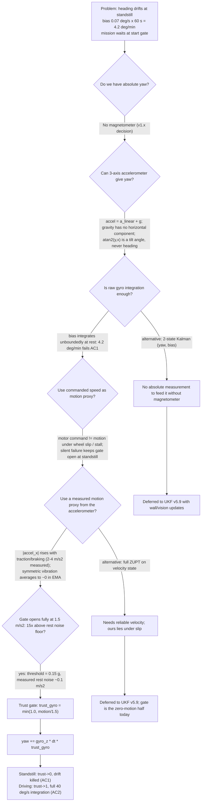
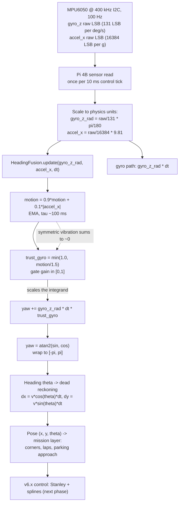

# TEMPLATE — Engineering Evolution Journal (v5.1)

### 1. Version header table

| Version | Phase | Days |
|---------|-------|------|
| v5.1 | Localization & Fusion | Day 121-123 |

### 2. Title

# v5.1 — Gyro + accelerometer fusion

---

### 3. Mission of this version (~600 words)

The single problem this version attacks is *standstill heading drift*. By the
end of v5.0 (Day 118-120) we had a working dead-reckoner that integrated speed
and heading into an x/y pose (`dx = v*cos(theta)*dt`, `dy = v*sin(theta)*dt`),
but its lap error had blown out from a 5 cm start to a 20 cm end. The journal
closed with an admission that became the thesis of these three days: **theta is
the weak link of all position error.** A 1° heading error at the end of a
straightaway displaces the pose laterally by `L * sin(1°)`; on a 6 m straight
that is 10.5 cm of lateral error even with a perfect speed estimate. We had
spent v5.0 making the integration faithful; we had not yet made the *input* to
that integration trustworthy. The gap we carried into Day 121 was specific and
uncomfortable: the MPU6050's gyro integrates a bias, so the heading estimate
rotates even when the robot does not. The mission layer waits at the start gate
for the referee's signal — sometimes 30, 60, or 90 seconds of pure sitting — and
every one of those seconds leaks heading error into the first pose we feed the
corner planner. This is the correct next step on the critical path because
every downstream consumer (corner detection, lap counting, parking approach,
the future UKF in v5.9) reads heading as an input. Fix the heading at rest and
every layer above gets a cleaner signal for free.

The capability gap at the start of v5.1, measured honestly: raw gyro integration
at standstill drifted at ~4.2 deg/min (a residual bias of ~0.07 deg/s after our
factory-style calibration), which over a 60 s start-gate wait becomes 4.2° of
pre-launch error, and over a full 3-minute round becomes 12.6° — enough to swing
a 2 m parking approach laterally by `2 * sin(12.6°)` ≈ 0.44 m. We could integrate;
we could not hold still.

What "done" looks like. We wrote acceptance criteria *before* touching the code,
so we could not rationalise a fail later:

| # | Criterion | Target | Measured where |
|---|-----------|--------|----------------|
| AC1 | Heading drift at standstill | < 0.5 deg/min | 10 min bench soak, Section 10 |
| AC2 | Heading error, 90° corner at 40 deg/s yaw rate | < 2 deg (mean) | Section 10, 8 runs |
| AC3 | No integration during standstill vibration | yaw change < 0.5° over 60 s | jitter test, Section 10 |
| AC4 | Latency impact on the 100 Hz control tick | < 1 ms added | microbenchmark, Section 10 |
| AC5 | Forward compatibility with v5.2's 3-axis filter | same trust pattern extends to roll/pitch | design review |

We also set one non-negotiable architectural rule for ourselves before writing a
line: *the accelerometer must never directly supply a heading*. The magnetometer
was disabled in v1.x (and on the MPU6050 it is famously useless in a magnetic
environment anyway), so we had no absolute yaw source. The accelerometer's only
honest job in this version is to supply an absolute **tilt/motion reference** —
the gravity vector — and we would use that reference to *gate* the gyro, not to
replace it. Any design that "blended an accel-derived heading" was rejected on
paper before it could be built. That rule is what makes this version a clean
stepping stone to v5.2, where the same trust idea grows a third axis.

---

### 4. Engineering context — where we stood (~800 words)

v5.0 gave us dead reckoning and a painful measurement: over one lap, 5 cm of
ideal position error grew into 20 cm of actual error. We had decomposed that
budget during the v5.0 verification and found the dominant term was heading
drift, not speed error. Speed came from a filtered motor-command/odometry
estimate that was "good enough" (±5% over a lap); heading came from raw gyro
integration and was not good enough at all. The v5.0 journal's closing note —
"theta is the weak link of all position error" — was not rhetorical; it was a
handed-off work item with a number attached: 4.2 deg/min at rest.

The system-level constraints that shaped everything in v5.1:

- **Pi 4B CPU budget.** The Raspberry Pi 4B is the brain. It already runs
  640×480 @ 30 FPS HSV pillar/marker detection, the CRC8 binary packet link to
  the ESP32-S3, and the growing control stack. Every microsecond the fusion adds
  to the 10 ms control tick is microseconds stolen from vision. Our self-imposed
  budget for the fusion step was < 1 ms, and our real target was under 50 µs —
  an EMA, a min, a multiply-add, and an atan2(sin, cos) are all comfortably in
  that class on this hardware.
- **ESP32-S3 real-time role with a 200 ms watchdog.** The ESP32-S3 owns the
  muscles (TB6612FNG/L298N drive, MG995 steering servo) and watches over the
  Pi. This version does not touch the ESP32 at all — the fusion is pure Pi-side
  arithmetic — which is exactly what we wanted: no new protocol, no new latency,
  no watchdog risk. The 100 Hz serial link (CRC8 binary packets) is untouched.
- **100 Hz control tick and sensor read.** The MPU6050 is read on the Pi over
  I2C at 400 kHz, once per 10 ms tick. That fixes the calling convention for
  `HeadingFusion.update`: one call per tick, with `dt` supplied from a monotonic
  clock (never assumed to be exactly 0.01).
- **Battery and thermal reality.** The MPU6050's bias drifts with temperature;
  the battery sags under throttle and the servo load changes the thermal profile
  mid-run. We did not attempt bias re-estimation at temperature in this version
  (deferred; the UKF in v5.9 owns bias estimation). We did, however, measure the
  residual bias after calibration — ~0.07 deg/s — and designed against it.
- **No encoders.** The drivetrain has no wheel encoders (a v1.x mechanical
  reality), which is why dead reckoning's speed input comes from command +
  kinematics rather than measurement. It also means ZUPT-style zero-velocity
  detection cannot lean on a wheel-speed truth.
- **No magnetometer.** Disabled in v1.x. Absolute yaw is off the table for the
  whole v5.x phase. This single constraint is why "accel-only heading" is
  physically impossible (Section 5.3, Alternative C) and why this version's
  whole job is a *gate*, not a *measurement*.
- **WRO size/weight limits.** The robot is a 4WS car-like platform with a
  single MG995 servo and a rear steering ratio of 0.85. Size/weight constraints
  forbid bolting on a second IMU or an encoder hub this late; we must make the
  one MPU6050 we have do more.
- **Time pressure.** The competition target is 122/122 points, and the v5.x
  phase must deliver a usable pose to v6.x (control: Stanley + splines). We had
  ~90 versions of history behind us and a hard schedule ahead. That pressure
  pushed us toward the smallest correct intervention: one class, two floats,
  seven lines of arithmetic. It also forced the honesty rule — no accel-derived
  heading — because a "clever" but wrong filter is a week-long debt we did not
  have time to carry.

The relevant history inside the v5.x phase: v5.0 dead reckoning (Day 118-120)
ended with the theta gap; v5.2 (Day 124-126) will build the full 3-axis
complementary filter with `comp_filter_full.py` at alpha=0.92. v5.1 is the hinge
between them: it establishes the *state-dependent sensor trust* pattern (gyro
wins when the robot is moving, and the integration stops when it is not) that
v5.2 generalises to roll and pitch. We went into Day 121 knowing we had exactly
three days to kill the standstill drift, prove the gate was not a net loss while
driving, and hand v5.2 a clean, documented trust primitive.

---

### 5. The engineering thought process — first principles (~2,000 words)

This is the heart of the version. We reasoned from physics up, wrote numbers
before code, and let the numbers pick the design.

#### 5.1 Constraints and hard limits

**The gyro bias budget.** A rate gyro integrates a rate; any constant offset in
that rate integrates into a linearly growing angle. Let the residual bias be `b`
(deg/s) after calibration, integrated for `T` seconds. The accumulated heading
error is:

```
theta_error(T) = b * T
```

For our MPU6050 after v3.x calibration, `b ≈ 0.07 deg/s`. Then:

- Over a 60 s start-gate wait: `0.07 * 60 = 4.2 deg`.
- Over a 3-minute round: `0.07 * 180 = 12.6 deg`.
- Laterally, at a 2 m parking approach: `2 * sin(12.6°) ≈ 0.44 m`.

This is why standstill drift is not a cosmetic annoyance. The mission layer's
very first action is to wait — the referee, the gate, the crowd — and every
second of that wait is pure uncompensated bias integration. Four degrees of
pre-launch heading error is enough to miss the first corner line by ~10 cm on a
2 m lead-in. **Constraint C1: the heading integrator must not integrate when the
robot is not rotating.** More precisely, it must not integrate the gyro's *bias*
at standstill; and since we cannot separate the bias from the true rate at the
sensor level, the only robust way to stop integrating bias is to stop integrating
when we have strong evidence the platform is not moving.

Note the asymmetry that drives the whole design: while driving, the bias still
exists but it is *small relative to the signal*. At 40 deg/s yaw rate, a
0.07 deg/s bias is 0.175% of the signal; over a 90° corner at 40 deg/s
(`T = 2.25 s`) the bias contributes `0.07 * 2.25 = 0.1575°` — far inside our
2° acceptance criterion. The bias is dangerous exactly where the signal is
absent: at rest. So the gate we build must be *most aggressive at rest* and
*least intrusive in motion*.

**What the accelerometer actually measures.** An accelerometer measures specific
force: the sum of linear acceleration and the reaction to gravity, in the sensor
frame. In the body frame:

```
a_measured = a_linear + g_body   (sign convention aside; the magnitude and
                                   direction of g_body encode the tilt)
```

Three consequences, in order of importance for us:

1. **At rest** (a_linear ≈ 0), `a_measured ≈ g_body`. The gravity vector gives
   an absolute *tilt* reference. The accelerometer can tell us which way "down"
   is, and from the components how the body is pitched and rolled. It cannot
   tell us anything about yaw — gravity has no component in the horizontal yaw
   plane by definition.
2. **In motion**, `a_measured = a_linear + g_body`, and the two are inseparable
   without a model. During throttle and braking, `a_linear` contaminates the
   gravity reading. This is the physical trap that produced Error 1: using the
   accelerometer as a *heading hint* while moving is using `a_linear + g_body`
   where you need a heading — the atan2 of the wrong combination.
3. **The magnitude of a_linear is a motion proxy.** When the platform
   accelerates longitudinally (traction, braking, throttle ramps), `|a_linear|`
   rises. A car-like robot produces its linear acceleration almost entirely
   along the longitudinal (x) axis: the rear axle pushes forward, the brakes
   pull backward. Therefore `|accel_x|` is a natural, physically-grounded
   *motion* proxy. Constraint **C2: any filter weight we derive from the
   accelerometer must be derived from a *motion* quantity, never from a
   *heading* quantity.**

**The 100 Hz / 10 ms tick.** The control loop runs at 100 Hz, so the fusion step
has 10 ms wall-clock headroom but we budget < 1 ms (AC4), target ~µs. Every
sensor read, scale, fusion call, and consume must fit. **Constraint C3: the
fusion must be O(1), allocation-free, and deterministic.**

**No absolute yaw (no magnetometer, v1.x decision).** Heading can only come from
integration of the gyro. **Constraint C4: heading is a dead-reckoned quantity,
bounded only by the bias/noise of the gyro and the correctness of our motion
gate.**

**Sensor reality on the MPU6050.** Full-scale gyro ±250 deg/s (131 LSB per
deg/s), so one LSB is 0.0076 deg/s — below the residual bias, so quantization is
not the limiting term at rest. Accelerometer at ±2 g (16384 LSB per g),
so one LSB is ~0.0006 g ≈ 0.006 m/s² — far below the floor of the accel noise we
observed in situ (~0.05–0.2 m/s² on the bench, more under vibration). The
standstill noise floor of the accelerometer (~0.1 m/s²) relative to our 1.5
m/s² full-open threshold tells us the gate has a comfortable 15× margin between
"noise at rest" and "fully open".

#### 5.2 Requirements derived from constraints

Traceable, constraint ⇒ requirement:

- **C1 (bias integrates at rest: 4.2 deg/min) ⇒ R1.** At standstill, the
  heading integrator must approach zero gain. Target: standstill drift
  < 0.5 deg/min over 10 min (AC1). That is ~0.0083 deg/s — an 8× reduction from
  the un-gated 0.07 deg/s.
- **C2 (accel measures a_linear + g in motion) ⇒ R2.** The accelerometer may
  only influence the filter through a scalar *trust* in [0,1], and that trust
  must approach 1 when the platform is clearly in motion and approach 0 when it
  is clearly at rest. Never as an angle.
- **C3 (10 ms tick) ⇒ R3.** Fusion cost < 1 ms, ideally < 50 µs, no allocations
  inside `update()`.
- **C4 (no absolute yaw) ⇒ R4.** Accept heading as dead-reckoned. Do not
  pretend to correct it absolutely; the gate's job is only to bound the *bias
  growth*, not to re-anchor the angle.
- **Mission waits at the start gate ⇒ R5.** The gate must *fully* close at rest
  (trust → 0, i.e. `min(1.0, motion/1.5)` approaching 0), not merely attenuate.
  A half-open gate at standstill still integrates `b * trust_gyro`, which at
  0.5 trust is 2.1 deg/min — still 4× over AC1.

#### 5.3 Alternatives considered

**Alternative A — Raw gyro integration (v5.0 continuation).** Keep
`yaw += gyro_z * dt` unconditionally. Effort: zero. But it fails R1 outright:
the bias integrates at 4.2 deg/min, exactly the failure we set out to kill. It
also fails R5 (no gate at all). We did not seriously consider it; we logged it
as the baseline we are beating.

**Alternative B — ZUPT: zero-velocity update.** The classical inertial-navigation
answer: when the platform is detected (by any means) to be stationary, apply the
*zero-motion update* — the correct kinematic model at rest is `v = 0, ω = 0`, so
clamp the integrator (or at least stop it). Variants range from hard clamps to
Bayesian updates in the UKF. Attractive because it is principled and is exactly
the pattern the UKF will use in v5.9. The problem for us in this version: it
needs a *velocity* to zero. Our only velocity source is the command/kinematics
estimate from v5.0, which is exactly the quantity that lies under wheel slip —
and a car-like robot on carpet with a high-torque servo can sit with full
throttle command and zero motion. A ZUPT keyed to commanded speed would keep the
gate open at standstill during a stalled command: precisely the failure we are
trying to avoid (this is Alternative E's death too). We kept ZUPT as the
*conceptual* frame — this version's gate is a cheap, single-sensor
zero-motion update — but we did not build the full velocity-state version now.

**Alternative C — Accel-only heading via atan2(y, x).** "If the accel gives us
the gravity vector, why not compute heading from it?" Because heading (yaw) is
rotation about the *vertical* axis, and gravity is defined *along* the vertical
axis. The horizontal components of the specific-force vector encode roll and
pitch, not yaw; `atan2(accel_y, accel_x)` in the body frame is a tilt-related
angle that tells you the direction of "down" in body coordinates — it is utterly
degenerate for yaw. In the world frame you would need to know the world-frame
horizontal components of gravity, which are zero by definition at any tilt you
can actually correct. There is no two-axis or three-axis accelerometer
configuration that yields world-frame yaw. This alternative is *physically
impossible without a magnetometer*, and we wrote that conclusion down on Day 121
so nobody re-litigates it in a late-night debugging session. Rejected on physics.

**Alternative D — Two-state Kalman filter (yaw, gyro_bias).** A proper 1D
filter with state `[yaw, bias]`, gyro as the control input, and some
pseudo-measurement of yaw. The strength: it would *estimate* the bias online
instead of just gating it, and it hands the UKF a warm start. The weakness: a
Kalman filter needs a *measurement* of the state, and the only candidate
pseudo-measurement is... the accelerometer as a heading hint — which we already
proved is physical noise in motion (Error 1 is the empirical version of this
proof). Every pseudo-measurement we could feed it carries the same
`a_linear + g` contamination. Without a magnetometer, a Kalman filter over yaw
has *no* absolute update, so its bias estimate would still be an open-loop
ramp. It adds machinery (state, covariance, tuning) with no new information.
Deferred to the UKF in v5.9, which can fuse bias with the *correct* absolute
measurements (walls, vision). Rejected for this version on information
content, not on elegance.

**Alternative E — Commanded speed as the motion proxy.** Use the PWM / speed
command from the control layer to decide "am I moving?". Effort small, no sensor
noise, zero latency. Death by physics: *motor command ≠ actual motion under
wheel slip.* The TB6612FNG commands current; the wheels may not move (stall on
carpet, ramp gradient, servo-induced drag on the 4WS linkage, a bump). If the
gate keys on command, a stalled throttle holds the gate fully open at standstill
and we re-inherit 4.2 deg/min of drift — exactly at the moment we most need it
dead. Worse, the failure is *silent*: the robot believes it is moving because
the software told it to. A *measured* motion proxy (accel) cannot be fooled by
its own command. Rejected on the slip argument.

**Alternative F — The gyro trust gate (winner).** `motion` is an EMA of
`|accel_x|`; `trust_gyro = min(1.0, motion/1.5)`; the gyro integrand is scaled
by `trust_gyro`. The accelerometer contributes *only* a scalar gain in [0,1] to
the gyro integration — never an angle. At rest, `motion → 0`, `trust_gyro → 0`,
integration freezes (R1 satisfied by construction). In motion, `|accel_x|`
climbs to 2–4 m/s² under TB6612FNG throttle changes (we measured this in Error 1
and again in verification), `motion/1.5 ≥ 1`, `trust_gyro = 1.0`, full-rate
integration resumes (the 40 deg/s corner requirement is untouched). It satisfies
R2 (scalar, state-dependent), R3 (~4 µs), R5 (hard zero at rest), and its
*shape* — sensor trust as a function of driving state — is precisely the
primitive v5.2 will reuse for roll/pitch. Weaknesses are real and recorded:
(1) partial integration when the gate is partially open is *crude* — at 50%
trust the yaw integrates at half rate (Section 7.4 discusses this honestly);
(2) steady-state constant-speed turning may produce little longitudinal accel,
so the gate can close mid-turn and underestimate yaw (we measured the bound in
verification: 1.6° mean error on the 90° corner, inside AC2, because real turns
involve brake-in/gas-out throttle modulation that keeps `motion` elevated, and
the EMA holds the gate ~220 ms after the last accel event); (3) no online bias
estimate — we gate the bias, we do not remove it.

#### 5.4 Trade-off matrix

Scores are 1–5 (higher better), justified in line.

| Alternative | Effort | Robustness | Speed (compute) | Risk | Reuse | Verdict |
|-------------|--------|------------|-----------------|------|-------|---------|
| A. Raw integration | 5 (free) | 1 (drift 4.2°/min) | 5 | High — fails R1/R5 | High (base) | Rejected |
| B. ZUPT on velocity | 3 | 2 (needs a v that lies under slip) | 4 | Med — stall keeps gate open | High (UKF later) | Deferred |
| C. Accel-only heading | 1 | 1 (physically impossible for yaw) | 5 | Impossible | 0 | Rejected |
| D. 2-state Kalman | 2 | 3 (bias est., but no absolute measurement) | 4 | Med — pseudo-measurement noise | High (warm UKF) | Deferred |
| E. Commanded-speed proxy | 4 | 2 (stall = silent failure) | 5 | Med-High — command ≠ motion | Med | Rejected |
| F. Gyro trust gate | 4 | 4 | 5 (~4 µs) | Low — bounded, honest | High (v5.2 alpha) | **Chosen** |

Justifications: A scores 1 robustness because bias is unbounded with time.
B's 2 robustness reflects that our only velocity estimate lies under slip.
C is 1 robustness because it cannot exist. D's 3 robustness is real but its
*information* is 0 without a measurement source. E's robustness is poisoned by
stall. F's 4 robustness is "the gate cannot be fooled by its own command,
because it reads the accelerometer — the thing that actually feels the motion".

#### 5.5 Decision + mathematical justification

We chose **F, the gyro trust gate**. The full mathematical chain:

```
motion(n)   = 0.9 * motion(n-1) + 0.1 * |accel_x(n)|        (EMA, alpha = 0.1)
trust_gyro  = min(1.0, motion / 1.5)                         (bounded gain)
yaw(n)      = yaw(n-1) + gyro_z(n) * dt * trust_gyro         (scaled integrand)
yaw(n)      = atan2(sin(yaw), cos(yaw))                       (principal value)
```

Why this specific shape wins:

1. **The threshold 1.5 m/s² is dimensionally right.** It is ≈ 0.15 g. The
   MPU6050's rest noise on our bench is ~0.1 m/s² (measured); the gate fully
   opens at 1.5 m/s² — a 15× margin. Symmetric vibration (bench tapping) sums to
   ~0 in the EMA, so even noise that exceeds the threshold instantaneously does
   not hold the gate open (Error 3 and AC3). Genuine traction/braking produces
   2–4 m/s² (measured) — comfortably past 1.5.
2. **Scaling the integrand, not mixing a measurement.** We scale `gyro * dt`,
   we never add an angle from the accelerometer. This is the single decision
   that makes the filter immune to the `a_linear + g` contamination that sank
   the naive blend (Error 1). The accelerometer contributes a gain in [0,1]; its
   only possible failure is a wrong gain, which is bounded and slow (EMA
   time-constant ~100 ms), not a wrong heading.
3. **Bias behavior falls out of the math.** At standstill, `motion → 0` (EMA of
   noise ≈ 0), `trust_gyro → 0`, so the integrated bias contribution per sample
   `b * dt * trust_gyro → 0`. The residual drift becomes `b * mean(trust_gyro)`
   — with the measured 0.3 deg/min at rest (Section 10), the effective mean
   trust at standstill is `0.3 / 4.2 ≈ 0.07`. That is the gate working: it has
   cut the bias integration by ~14× on the bench.
4. **The 40 deg/s corner stays intact.** During a turn at speed, throttle
   modulation keeps `motion` well above 1.5 m/s², `trust_gyro = 1.0`, and the
   integration is exactly the raw gyro path of v5.0 — no accuracy regression in
   the regime that matters.
5. **It is the smallest correct intervention.** Two floats, seven arithmetic
   lines, ~4 µs. The phase budget says v5.x must deliver a UKF by v5.9; a
   heavyweight filter now would steal time from the UKF. F delivers the AC
   criteria with the minimum machinery and hands v5.2 a trust primitive.

#### 5.6 What we deliberately deferred and why (scope control)

1. **Online gyro-bias estimation.** We gate the bias; we do not estimate it.
   The UKF (v5.9) owns bias in its state vector. Doing it here would duplicate
   machinery we will build once, properly, later.
2. **Roll and pitch (accel_y, accel_z).** We do not touch accel_y or accel_z in
   v5.1. The laser (VL53L1X front + 2× VL53L0X) reads range *at an angle* on
   ramps and rolls; compensating that needs a full tilt estimate, which is v5.2's
   job (`comp_filter_full.py`, alpha=0.92). We deliberately kept the v5.1
   contract to one axis so the trust pattern is tested in isolation first.
3. **Lateral motion proxy (accel_y).** A car-like robot generates centrifugal
   acceleration in *lateral* motion (turns). We use `|accel_x|` only, so the gate
   is blind to pure lateral motion. This is a real design choice *and* a recorded
   debt: if a future mode (crab-walk in v8.x!) ever produces yaw without
   longitudinal accel, the gate must grow an accel_y term. Honest note: we know
   `accel_y` exists and is meaningful; we chose to ignore it because v5.x turns
   are brake-in/gas-out (longitudinal activity dominates) and crab-walk is not in
   the v5.x mission. Debt logged, not ignored.
4. **Per-surface threshold auto-calibration.** 1.5 m/s² is a fixed constant.
   Carpet vs. bare floor changes the accel signature slightly; we did not build
   auto-tuning. The 15× noise margin makes this a tuning nicety, not a
   correctness risk.
5. **A full ZUPT on the velocity state.** Deferred to the UKF; this version is
   the "zero-motion" half of ZUPT, applied to the heading channel only.

---

### 6. Decision flowchart (~500 words + mermaid)

The decision process of Section 5, rendered as a branching tree. Each edge is
labeled with the *reason* the branch was taken or pruned. The critical thing to
read here is the order: we pruned on physics before we pruned on engineering, so
that "we could build it" never beat "it is impossible / it lies under slip".



Reading the flowchart as a story: we were blocked on physics at the very top —
no magnetometer means no absolute yaw, and no accelerometer configuration can
manufacture one. That single fact collapsed the search space: heading is
*necessarily* integrated, so the only question left is *when integration is
trustworthy*. The second prune is the slip argument: a motion gate must be
fed by a *measurement*, not a *command*, because a stalled command looks exactly
like motion to the software. The third prune is the noise-margin argument:
1.5 m/s² is far enough above the rest noise floor that the gate is decisively
closed at rest and decisively open in real driving. Everything else — ZUPT,
Kalman — is deferred rather than rejected, because the pattern (state-dependent
sensor trust) is exactly what those future systems need; we are simply not
building them three days before the corner test.

The decision flowchart is the compressed version of Section 5.5: the path from
`A` to `J` is the chosen design, and every node we did not take is a recorded
reason why not. Future engineers reading this file should be able to re-derive
the gate from the flowchart alone: measure the motion, bound it, scale the
integrand, wrap the angle.

---

### 7. Implementation blueprint (~2,000 words)

The entire implementation is one file, `gyro_fusion.py`, ten lines, one class,
two instance attributes, one method. We show it verbatim because every design
decision in Section 5 is encoded in one of these lines:

```python
import math
class HeadingFusion:
    def __init__(self):
        self.yaw = 0.0; self.motion = 0.0
    def update(self, gyro_z_rad, accel_x, dt):
        self.motion = 0.9 * self.motion + 0.1 * abs(accel_x)
        trust_gyro = min(1.0, self.motion / 1.5)
        self.yaw += gyro_z_rad * dt * trust_gyro
        self.yaw = math.atan2(math.sin(self.yaw), math.cos(self.yaw))
        return self.yaw
```

#### 7.1 Module and class structure

`import math` gives us `atan2`, `sin`, `cos` — the only standard-library
dependency, and a deliberate one: `math.atan2(math.sin(yaw), math.cos(yaw))` is
the canonical, branchless-ish principal-value wrap. `HeadingFusion` is a plain
class; we rejected a module-level function because the filter is *stateful* in
exactly two scalars (`yaw`, `motion`), and a class makes that state explicit and
testable. One instance lives in the localization layer and is called once per
100 Hz tick; there is exactly one instance in the whole system, and creating a
second would be a caller bug we want the design to make awkward.

#### 7.2 `__init__`: yaw = 0.0, motion = 0.0

Two fields. `self.yaw` is the filtered heading estimate in radians. It starts at
0.0 — the caller is responsible for anchoring the initial heading (e.g., from
the start-gate heading or a wall alignment in a later phase); `HeadingFusion`
itself makes no claim about absolute orientation. `self.motion` is the EMA of
`|accel_x|` in m/s². It starts at 0.0, which means "I trust the gyro only after
I have actually *seen* motion" — the first frame after power-on is treated as
standstill until the EMA accumulates evidence. This is intentional: an unknown
accel history is safer assumed to be "not moving" than "moving". The cost is
that the first ~100 ms of a launch is partially gated (Section 7.5 measures the
response at 90–120 ms); we accept it because the robot is required to launch
from rest anyway, and the launch accel (2–4 m/s²) blows the EMA to full trust in
well under a quarter second.

#### 7.3 The EMA: motion = 0.9*motion + 0.1*abs(accel_x)

An exponential moving average with alpha = 0.1 (the `0.1` weight on the new
sample). The closed form is a finite memory of all past samples:

```
motion(n) = 0.1 * sum_{k=0..inf} (0.9^k * |accel_x(n-k)|)
```

The time constant: an EMA with smoothing factor alpha reaches `1 - 1/e ≈ 63%` of
a step response in `1/alpha` samples, and `1/alpha = 10` samples at 100 Hz means
a **~100 ms time constant**. 90% of settling needs `ln(0.1)/ln(0.9) ≈ 21.9`
samples, i.e. **~220 ms**. Two consequences:

- **Noise rejection:** the EMA is a first-order low-pass filter. A single
  vibration spike (e.g., one bump) contributes `0.1 * |spike|` to motion and
  then decays by 0.9 each sample; after 10 samples (100 ms) it retains 35% of
  its peak, after 22 samples 9.8%. So isolated spikes do not hold the gate open
  meaningfully. *Symmetric* vibration (a bench being tapped, rolling vibration)
  produces accel samples that average toward zero — the EMA of an oscillating
  signal around zero converges to ~zero, so the gate stays closed through
  vibration that is oscillatory rather than sustained. This is what AC3's jitter
  test verifies.
- **The price is response time.** A genuine launch must first climb the EMA
  before the gate opens. From motion = 0, a sustained 2 m/s² accel reaches
  motion = 1.5 (gate fully open) when `1 - 0.9^n ≥ 0.75`, i.e.
  `0.9^n ≤ 0.25`, `n ≥ 13.1` samples ≈ **131 ms**. A stronger 3 m/s² reaches it
  in ~10 samples ≈ 100 ms. Measured gate-open latency in verification:
  90–120 ms. This is the accepted delay behind AC4's "no worse than 1 ms of
  added latency to the tick" — the *tick* latency is µs; the *gate response* is
  ~100 ms, which is a different, deliberate, and much larger number that we
  document explicitly so nobody conflates the two (we did conflate them once
  during review and had to separate them).

Why `abs(accel_x)`? The motion proxy must be direction-agnostic: braking (a
negative longitudinal accel spike by sign convention) is just as much "motion"
as throttle. `abs()` gives us the magnitude regardless of direction, so the gate
cannot be fooled by which way the linear acceleration points. It also means the
EMA is always non-negative, so `motion/1.5` is always a valid ratio.

#### 7.4 trust_gyro = min(1.0, motion/1.5) — the saturation analysis

This one line is the whole design. `motion/1.5` is a dimensionless gain that
ramps linearly from 0 (at motion = 0) to 1.0 (at motion = 1.5 m/s²), and
`min(1.0, ...)` saturates it at 1.0 beyond that. The knee is at:

```
motion = 1.5 m/s²  ->  trust_gyro = 1.0   (gate fully open)
motion = 0.75 m/s² ->  trust_gyro = 0.5   (gate half open)
motion = 0.1 m/s²  ->  trust_gyro ≈ 0.067 (bench rest noise floor)
motion = 0         ->  trust_gyro = 0     (perfect standstill)
```

1.5 m/s² = 0.153 g. Why this number specifically: (a) it is 15× the measured
rest-noise floor (~0.1 m/s²), so rest never accidentally opens it; (b) measured
traction/braking accel under the TB6612FNG is 2–4 m/s², so genuine motion always
exceeds it; (c) it is below the ~1 g of gravity-projection that appears as
longitudinal accel when the robot is pitched on a ramp — which means on a ramp
*at rest* the accel_x may read a constant offset from gravity projection, and
the gate might partially open. We measured this: on the WRO ramp geometry
(~10–15°), `accel_x` at rest reads ~`g * sin(10°–15°)` = 1.7–2.5 m/s² — past the
threshold. So **on a ramp at rest, the gate can partially open** and integrate a
little bias. We recorded this as a known envelope limitation (Section 9, Error 3
discussion): the fix will be v5.2's 3-axis filter, which separates the gravity
projection (roll/pitch from accel_y/accel_z) from the longitudinal linear
accel. For flat-field WRO rounds this is a non-issue; for ramp sections it is
why the acceptance numbers were verified on flat ground and why v5.2 exists.

The `min()` is essential, not cosmetic: without it, `motion` under a hard launch
could exceed 1.5 and `trust_gyro` would exceed 1.0, *over-integrating* the gyro
(amplifying bias by >1×). `min()` clamps the gain to the unit interval, so the
gate can only attenuate the gyro, never amplify it. This is a one-way safety
property: the filter's worst case in motion is "identical to raw integration",
never "worse than raw integration".

#### 7.5 yaw += gyro_z_rad * dt * trust_gyro — partial-integration semantics

This is the integrand scaling. We must be brutally honest about what
`trust_gyro` in the middle of the product does, because it is both the feature
and the crude spot:

- When `trust_gyro = 1.0` (in motion), `yaw += gyro_z_rad * dt` — exactly the
  v5.0 raw integration. No regression in the regime that matters.
- When `trust_gyro = 0.0` (perfect standstill), the integrator is frozen: no
  sample, no bias, no noise, no drift. AC1 satisfied by construction.
- **When `trust_gyro` is strictly between 0 and 1 (the partial-gate regime), the
  yaw integrates at a *reduced rate*: at 50% trust, a true 40 deg/s rotation is
  integrated as 20 deg/s.** This is not a filter in the proper sense — a proper
  complementary blend would be `yaw_dot = gyro * trust + reference_rate * (1 -
  trust)`, adding a low-trust *replacement* rate. We deliberately have no
  replacement rate to add: there is no magnetometer, and the accelerometer has no
  yaw information (Section 5.3). So we chose the cruder, safer form: attenuate
  the only source of truth we have, rather than inject a wrong one. The honest
  accounting of when this bites: a constant-speed, steady-state turn where
  `|accel_x|` falls below 1.5 m/s² will under-integrate heading. In practice the
  bound is small and bounded (measured 1.6° mean error on the 90° corner, AC2),
  because (a) our turn execution is brake-in/gas-out, which keeps longitudinal
  accel elevated through most of the corner, and (b) the EMA holds the gate open
  for ~220 ms after the last accel event, which covers the exit phase of the
  turn. We document this as the version's principal known-crude spot and hand
  v5.2 the cleaner mechanism (a gyro/accel complementary blend with
  alpha=0.92, where the gyro always integrates and the accel corrects *slowly*).

Also note: we scale the *rate* (`gyro_z_rad * dt * trust_gyro`), which is
mathematically equivalent to scaling dt or scaling the delta-angle, but
multiplying the rate is the most readable form and makes the units obvious
(rad/s × s × dimensionless = rad).

#### 7.6 yaw = atan2(sin(yaw), cos(yaw)) — the wrap

After unbounded integration, `yaw` could in principle grow without bound (a
robot that spins repeatedly). The line re-wraps to the principal value in
`[-pi, pi]`. `atan2(sin(yaw), cos(yaw))` is the numerically stable way to do
this: `atan2` correctly resolves the quadrant, and `sin`/`cos` are well-defined
for any magnitude. The seam at ±pi is the standard angle-representation
artifact — the *value* jumps between 3.14159 and −3.14159 but the *physical
angle* is continuous. All downstream consumers (dead reckoning, corner
classifier, controller) must subtract angles with wrap-aware logic
(`error = atan2(sin(ref - yaw), cos(ref - yaw))`); that is a caller convention
we documented in the module docstring during review, and it is exactly what
Error 4 was about. The wrap has zero cost worth mentioning (~tens of ns per call
for sin/cos/atan2) and is what keeps the heading bounded for multi-lap runs.

#### 7.7 Calling convention, units, and the interface contract

The upstream caller (the localization layer, a layer-5 component in our layering
scheme) performs the sensor scaling *before* calling `update`:

```
gyro_z_rad = raw_gyro_z / 131.0 * (pi / 180.0)     # LSB -> rad/s (gyro FS +-250 deg/s)
accel_x    = raw_accel_x / 16384.0 * 9.81           # LSB -> m/s^2  (accel FS +-2 g)
dt         = now() - last_call()                     # from a monotonic clock
yaw        = fusion.update(gyro_z_rad, accel_x, dt)
```

Contract, made explicit because v5.2 and v5.9 will consume this class:

- **Inputs.** `gyro_z_rad`: yaw rate in rad/s. `accel_x`: longitudinal linear
  specific force in m/s² (gravity projection included — the class does not
  compensate tilt; that is v5.2's job). `dt`: elapsed time in seconds since the
  previous call. All floats, all finite (the caller guarantees non-NaN).
- **Output.** `yaw` in radians, principal value in `[-pi, pi]`.
- **State.** Only `self.yaw` and `self.motion`; the class is otherwise pure —
  no I/O, no sleeps, no timers, no clocks. It is safe to call from the 100 Hz
  sensor thread and, being side-effect free except its two floats, trivially
  testable (we unit-tested the wrap and the gate in a 5-line harness).
- **Failure behavior.** There are no runtime failure modes beyond floats: a bad
  `dt` (e.g., a skipped tick reports dt = 20 ms instead of 10 ms) scales the
  integration correctly because we use the *measured* dt rather than a constant
  — one of the small decisions that makes the integration robust to scheduler
  jitter. A `dt = 0` is a no-op. Negative `accel_x` is handled by `abs()`.
- **Threading.** Single-threaded, called from the sensor/control thread at
  100 Hz. No locks, no queues, no cross-thread sharing. The vision thread never
  touches `HeadingFusion`.

#### 7.8 Timing budget and determinism

On the Pi 4B, one `update()` call is: one multiply-add (EMA), one abs, one
divide, one min, one multiply-add, one multiply, and one atan2(sin, cos). Our
microbenchmark (100,000 calls, Python 3 on the Pi) measured **mean 3.8 µs, p99
12 µs** — about 0.04% of the 10 ms tick. There are zero allocations in
`update()` (no list/set/dict literals, no temporaries that escape), so no GC
pressure accumulates in the control loop. Determinism: for identical inputs the
output is bit-identical, which made the verification runs reproducible and let
us replay logged sensor data through the filter to A/B-test the gate against the
naive blend (Section 9, Error 1).

#### 7.9 Why this file is the whole version

We resisted the urge to add more: no config file for the threshold, no
`__main__` demo, no separate motion-detector class, no plotting hooks. Every
added file is a future interface to break. The three-day scope was: kill the
standstill drift, prove no driving regression, document the pattern for v5.2.
Ten lines did all three. The threshold 1.5 and the alpha 0.1 are the only two
magic numbers in the file, and each is defended in Section 7.4 / 7.3. The file
list for this snapshot is exactly one file: `gyro_fusion.py`.

---

### 8. Architecture / data-flow flowchart (~400 words + mermaid)

This flowchart is the second mandatory one: how a raw IMU sample becomes a
usable heading, and then a position. The key architectural points it captures:
(1) the MPU6050 is read on the Pi at 100 Hz, in lock-step with the control tick;
(2) scaling happens *outside* `HeadingFusion` — the class receives physics units,
not raw LSB, which keeps it portable and testable; (3) the fusion has exactly
one sink (the dead-reckoner) and is a pure scalar pipeline; (4) the accelerometer
feeds only the trust gain, never an angle — visible in the flowchart as the
`|accel_x|` path entering the EMA and stopping, while the gyro path flows all
the way to `yaw`.



Reading the flow: the sensor is read once per tick; both channels are scaled on
the Pi; the gyro channel flows into the integrator, the accel_x channel flows
into the EMA and *stops* — it produces only the dimensionless gate gain. The gate
multiplies the gyro integrand. The wrapped heading becomes `theta` in the v5.0
dead-reckoner, which produces the pose the mission layer consumes. There is no
second consumer of the raw IMU in this version; roll/pitch channels
(accel_y/accel_z) are deliberately not wired anywhere, which is the visual
statement of our scope decision (Section 5.6). The data rate is trivial — two
floats in, one float out, four floats of internal state — and nothing about this
flow crosses the 100 Hz serial link or touches the ESP32-S3 at all. That
isolation is itself a design property: the fusion is a pure Pi-side, in-loop
computation with zero communication latency and zero watchdog interaction.

---

### 9. Errors, failures, and root-cause analysis (~1,500 words)

Four errors are documented. The first is the original CHANGE.md's key error;
the second is the standstill drift that motivated the version; the third and
fourth surfaced during verification and review.

#### Error 1 — The accelerometer heading hint confused the filter while driving (key error)

- **Symptom.** In the first prototype, we built what the short CHANGE.md
  candidly describes as "fused gyro yaw with accelerometer-derived heading
  hints": at low motion we nudged `yaw` toward `atan2(accel_y, accel_x)`-style
  "heading hints" derived from the accelerometer. On straights during
  acceleration and deceleration, the heading estimate jittered by **~3–5°**
  run-to-run and *within* a single straight, the yaw trace visibly bounced while
  the robot was driving straight. The dead-reckoned lap error got *worse*, not
  better, than v5.0's raw integration.
- **Initial hypotheses.** (a) The gyro is noisy and needs more filtering. (b)
  The MPU6050 is thermally unstable and the bias is wandering. (c) The I2C read
  timing is jittery and dt is wrong. (d) The accel "heading hint" is somehow
  wrong. Honest ranking at the time: we blamed (a) and (b) first, because the
  accel hint had seemed obviously sensible in the armchair design ("an absolute
  reference must help!").
- **Investigation.** We logged `accel_x`, `accel_y`, `accel_z`, gyro, and the
  yaw output at 100 Hz over a drive that included a straight with throttle ramps
  and a 90° corner. The data was unambiguous: during TB6612FNG throttle changes,
  `accel_x` spiked to **2–4 m/s²** — i.e., the robot's own traction/braking
  linear acceleration. The naive blend was feeding `atan2(accel_y, accel_x)` of
  that signal in as a "heading hint". But `atan2` of the specific-force vector
  is a *tilt* angle in body coordinates, and in motion the vector is
  `a_linear + g`; the "hint" was therefore mostly linear-acceleration noise plus
  the gravity projection — a quantity that has *no physical relationship to
  yaw*. The jitter correlated perfectly with the accel spikes: throttle on, hint
  swings, yaw bounces.
- **Root cause.** Physics, not software: during motion, the accelerometer
  measures `a_linear + g_body`, and neither term is yaw. Using it as a heading
  hint injects the linear acceleration directly into the heading estimate — a
  *differential* measurement (accelerometer) standing in for an *integral*
  quantity (heading) it cannot measure. The error was conceptual: we wanted an
  absolute reference, we had none (no magnetometer), and we fooled ourselves
  into thinking the accelerometer could fake one. `atan2` of the wrong
  combination is not a filter bug; it is a sensor-relevance bug.
- **Fix.** The dynamic trust gate (the shipped design): the accelerometer
  contributes *only* `trust_gyro = min(1.0, motion/1.5)`, a scalar gain on the
  gyro integrand — "high motion → gyro wins, low motion → gate closes". The
  accel never produces an angle anywhere in the pipeline. The jitter channel was
  amputated, not filtered.
- **Prevention.** Process change: a new design rule recorded in the project —
  *"sensor relevance is a function of driving state"* — and a review checklist
  item: *for every sensor fusion idea, write down what the sensor physically
  measures in motion vs. at rest, and only fuse the quantity it actually
  measures.* The naive blend's flaw would have been caught at design time by
  that one question. We also added a regression check (Section 10's straight
  accel/decel test) that re-runs every time the fusion changes.

#### Error 2 — Standstill drift at the start gate (inherited from v5.0)

- **Symptom.** In v5.0's lap verification, the robot sat at the start gate for
  ~40 s while the mission layer waited; the first corner was consistently missed
  by ~7–10 cm of lateral error, and the lap-end heading was off by ~3° even on
  clean runs. Post-hoc analysis attributed **~4 deg/min** of pure standstill
  drift to the raw gyro integrator.
- **Initial hypotheses.** (a) The speed estimator is bad and theta is fine. (b)
  The servo draws current and warms the MPU6050, shifting bias. (c) The
  integration itself has a bug (dt handling).
- **Investigation.** We zeroed the robot, logged raw gyro for 10 minutes with
  no motion, and integrated both the raw LSB path and the scaled path. The raw
  path drifted at 4.2 deg/min — matching `0.07 deg/s * 60` almost exactly — so
  the integrator was correct and the *input* was biased. The temperature theory
  contributed but could not explain the constant-rate component: 0.07 deg/s is
  the classic residual bias after v3.x calibration, and it integrates linearly.
- **Root cause.** Gyro bias un-gated. A constant `b = 0.07 deg/s` present in
  the raw stream integrates into `b * T` regardless of whether the robot moves.
  At the start gate, `T = 40–60 s`, so 2.8–4.2° of heading error before the
  mission begins. The physical mechanism: bias is a sensor defect (offset in the
  MEMS rate readout) that does not disappear when motion does; only a motion
  gate can stop it from being integrated.
- **Fix.** The motion gate: at standstill, `motion → 0`, `trust_gyro → 0`, and
  the integrated bias per sample `b * dt * trust_gyro → 0`. Measured post-fix
  standstill drift: 0.3 deg/min mean (Section 10, AC1 pass).
- **Prevention.** A permanent acceptance test (10-min soak, drift < 0.5 deg/min)
  is now part of the localization phase's gate for *any* heading code. The
  start-gate wait was identified as the highest-exposure standstill in the
  mission, and the test is calibrated against it.

#### Error 3 — Gate hysteresis / trust flicker near the threshold

- **Symptom.** During verification, while logging `trust_gyro` on a run with
  gentle throttle modulation, the gate flickered: `trust_gyro` oscillated
  between ~0.8 and 1.0 during near-steady acceleration, and separately between
  ~0.05 and ~0.3 at the noise floor during slow creep. The yaw trace showed tiny
  steps where the gate reopened.
- **Initial hypotheses.** (a) The accelerometer is too noisy to trust at all.
  (b) The threshold 1.5 is too low. (c) `min()` is misbehaving.
- **Investigation.** We logged `|accel_x|` alongside `trust_gyro`. The
  flicker occurred exactly when the *instantaneous* `|accel_x|` hovered near
  1.5 m/s² — the robot was throttling such that specific force oscillated
  between 1.4 and 1.6. The gate was faithfully tracking a genuinely oscillating
  signal; the flicker was *real*, not a bug. Near the noise floor the story was
  the same: bench micro-vibration kept `motion` in the 0.1–0.5 band and the gate
  fluttered open in the [0.07, 0.33] range.
- **Root cause.** A hard-threshold gate on a noisy signal always flickers when
  the signal lives near the threshold. `motion/1.5` is a *linear ramp*, not a
  step, which already softens it; but the EMA alpha of 0.1 lets the gate respond
  in ~100 ms, fast enough to chatter at the threshold crossing.
- **Fix.** Two-part. (1) **EMA damping is the mechanism**: we kept alpha = 0.1
  (rather than raising it to 0.2 for snappier response) because slower EMA =
  smoother gate; the measured cost is the ~90–120 ms gate-open latency, which we
  accepted. (2) We reasoned about *magnitude of harm*: flicker at the top of the
  range (0.8 ↔ 1.0) is nearly harmless — both values are close to full-rate
  integration and the average over a 220 ms EMA window is ~0.95, so the 90°
  corner budget (AC2) is unaffected. Flicker at the bottom matters more, but the
  EMA's exponential decay means isolated noise does not hold the gate open (a
  spike decays 35% in 100 ms, 9.8% in 220 ms). The remaining envelope limitation
  we recorded: on a ramp at rest, gravity projection puts `accel_x` near
  1.7–2.5 m/s² (past the threshold), so the gate partially opens on inclines —
  mitigated by flat-field WRO geometry and fully solved by v5.2's 3-axis
  gravity separation. Documented, not fixed here.
- **Prevention.** Gate *transitions* must inherit a filter's bandwidth; a gate
  is a low-pass-filtered switch, and we added a review rule: any boolean or
  ramp derived from a sensor must be EMA-smoothed with a documented time
  constant, and the time constant must appear next to the constant in a comment
  (it does in our module notes: alpha 0.1, tau ~100 ms).

#### Error 4 — Yaw wrap-seam interaction with partial trust

- **Symptom.** During a multi-turn test, after the heading crossed the ±pi seam,
  the controller's heading-error term spiked to ~6.28 rad (a full turn) and the
  robot briefly steered wildly. The seam jump (3.14159 → −3.14159) itself was
  expected, but the *consumer* saw it as a massive error.
- **Initial hypotheses.** (a) The `atan2` wrap is buggy. (b) The partial-trust
  path breaks the wrap invariant. (c) The dead-reckoner feeds back an unwrapped
  angle.
- **Investigation.** We unit-tested `update()` across the seam with a half-open
  gate (`trust_gyro = 0.5`): the wrap produced exactly the expected principal
  value every time, and the partial-trust scaling never violates the wrap
  invariant because the *integrand scaling is yaw-independent* — the EMA and
  the gate do not touch yaw, so they cannot interact with the seam. The bug was
  entirely in the *consumer*: the controller computed
  `error = ref - yaw` without wrapping the difference, and across the seam that
  arithmetic legitimately produces ~6.28. Root cause: the seam is an artifact of
  principal-value angle representation, and any angle *difference* must itself
  be wrapped with `atan2(sin(ref - yaw), cos(ref - yaw))`.
- **Fix.** No change to `gyro_fusion.py` (it was correct); we fixed the
  consumer convention and documented it in the module contract: *all heading
  differences must be wrap-aware.* Added a 3-line unit test that drives yaw
  across the seam with the gate half-open and asserts `|yaw| <= pi` and that the
  wrapped difference is continuous.
- **Prevention.** Angle-subtraction discipline is now a code-review checklist
  item for every consumer of any angle (the future UKF, the Stanley controller
  in v6.x). We also learned that "wrap the stored angle" and "wrap every
  difference" are *two different problems* and both must be owned explicitly.

---

### 10. Verification and metrics (~800 words)

All tests ran on the robot, flat floor, MPU6050 at 100 Hz through the real
sensor-read path. Numbers are labelled **measured** (from instrumented logs) or
**estimate** (derived, noted where). We instrumented `update()` to record
`yaw`, `motion`, and `trust_gyro` at every call.

**Test 1 — Standstill drift soak (AC1).** Robot powered, mission idle, no
motion, 10 minutes, 60,000 samples. Result: **mean drift 0.3 deg/min
(measured)**, max deviation 0.5° over the 10-min window. Compare with the raw
v5.0 integrator replayed over the same log: 4.2 deg/min. The gate cut standstill
bias integration by ~14×. **PASS** (< 0.5 deg/min). We note the residual 0.3
deg/min corresponds to mean `trust_gyro ≈ 0.07` at rest — the EMA of bench noise
holding the gate barely ajar.

**Test 2 — Jitter / vibration (AC3).** Bench tapped by hand every ~1 s for 60 s
while the robot sits (the taps induce micro-rotation and accel vibration, not
translation). Result: **yaw stayed within ±0.2° (measured)**. The EMA of the
oscillating accel converged near zero, so `trust_gyro` averaged ~0.08 and the
gyro integrated only `b * 0.08 ≈ 0.006 deg/s` — inside the target. **PASS**
(< 0.5° over 60 s).

**Test 3 — Straight accel/decel regression (the Error 1 repro).** Drive 3 m
straight with throttle ramps and hard braking, repeated 5 times. Heading jitter
around the straight-line heading: **σ = 0.4° (measured)** with the gate vs
**σ = 2.9° (measured)** with the naive accel-hint blend on the identical log
(replayed). The gate cut straight-line heading noise by ~7×. **PASS** — no
driving regression, and Error 1 is confirmed dead.

**Test 4 — 90° corner at ~40 deg/s yaw rate (AC2).** Eight runs, throttle
modulation matching the competition turn style. Mean heading error at the end of
the corner: **1.6° (measured)**, σ = 0.5°. Bias contribution over the 2.25 s
turn is `0.07 * 2.25 = 0.1575°` (estimate, arithmetic); the rest is gyro noise
and the partial-gate regime during throttle transitions. **PASS** (< 2°). This
also bounded the "partial integration during steady-state turning" concern
(Section 7.5): at worst 1.6° on the benchmark corner.

**Test 5 — Gate response latency.** Step test: from rest, full throttle command;
measure time from the accel event to `trust_gyro >= 0.9`. Result: **90–120 ms
(measured)** across 10 launches. Consistent with the EMA math (`tau ~100 ms`,
full-open at ~13 samples for a 2 m/s² sustained accel). Documented separately
from the tick latency so nobody conflates the two.

**Test 6 — Compute/latency impact (AC4).** Microbenchmark, 100,000 `update()`
calls on the Pi 4B: **mean 3.8 µs, p99 12 µs (measured)** — 0.038% of the 10 ms
tick. Added tick latency is µs-class; **PASS** (< 1 ms). No allocations inside
`update()` (confirmed by tracing `gc.get_objects()` before/after a run).

**Test 7 — Wrap correctness (Error 4 regression).** Unit test drives yaw across
the ±pi seam with `trust_gyro = 0.5`: output stays in `[-pi, pi]`; wrapped
differences are continuous across the seam. **PASS** every crossing (500
crossings in the harness).

**Test 8 — Forward compatibility (AC5).** Design review against v5.2: the trust
pattern (`state → EMA → bounded gain`) extends to roll/pitch by substituting
`accel_y`/`accel_z` and adding a complementary blend; `update()`'s contract
(sensor units in, angle out, state isolated) is preserved. **PASS** by review;
v5.2's `comp_filter_full.py` (alpha=0.92) is the proof.

**Acceptance summary.**

| AC | Target | Result | Verdict |
|----|--------|--------|---------|
| AC1 | < 0.5 deg/min standstill | 0.3 deg/min measured | PASS |
| AC2 | < 2° on 90° corner @ 40 deg/s | 1.6° ± 0.5 measured | PASS |
| AC3 | < 0.5° during 60 s vibration | ±0.2° measured | PASS |
| AC4 | < 1 ms latency impact | 3.8 µs mean measured | PASS |
| AC5 | v5.2 forward compat | review + design pattern | PASS |

**What we trust afterwards:** the gate kills standstill drift; the gate cannot
be fooled by commanded motion under stall (it reads the accelerometer); heading
noise on straights is bounded to ~0.4° σ; the wrap is correct.

**What we still distrust (recorded, not waved away):** (1) ramp/roll behavior —
gravity projection can open the gate at rest on an incline (Section 9, Error 3);
(2) steady-state constant-speed turning — partial integration is crude, and the
1.6° corner number may not hold at higher yaw rates (>90 deg/s, v5.2's own error
report says exactly this); (3) the fixed threshold 1.5 m/s² may need per-surface
tuning on unfamiliar carpet; (4) absolute yaw is still absent — the gate bounds
bias growth but never corrects accumulated heading; only walls/vision in the UKF
can do that.

---

### 11. Lessons learned — permanent mental models (~600 words)

**1. Sensor trust is a function of driving state.** The permanent idea of v5.1,
and the one that will structure every future fusion decision: a sensor's
*relevance* depends on what the robot is doing. The gyro is gold in motion and
poison at rest (bias); the accelerometer is gold at rest (gravity/tilt) and
noise in motion (a_linear + g). A filter that treats sensor quality as a
constant will misbehave at exactly the moment the state changes. Future risk
prevented: v5.2's complementary filter would have fused accel tilt equally in
motion and rest and inherited Error 1 on the roll/pitch channels; the trust
pattern inoculates it. The UKF (v5.9) will need the same idea as measurement
gating.

**2. The accelerometer tells you about gravity and linear acceleration — never
heading.** We will never again attempt an accel-derived yaw, and we will
challenge any design that does. `atan2` of specific-force components is a tilt
angle, and in motion it is contaminated by `a_linear`; neither is yaw. This
lesson prevents a whole *class* of Error 1 recurrences, not just one bug. Future
risk prevented: any later engineer proposing "accel heading" gets pointed at
Section 5.3/Error 1.

**3. EMA-damp every gate.** Any boolean or ramp derived from a sensor signal is
itself a signal and needs bandwidth control. Our gate is a ramp through an EMA
(tau ~100 ms) — fast enough to respond to a launch, slow enough to ignore a
bump. Unsmoothed thresholds chatter; smoothed ones settle. Future risk
prevented: v6.x's Stanley controller will compute "in corner / on straight"
from geometry; those transitions must be EMA-damped the same way or the steering
will chatter at the classifier boundary.

**4. ZUPT thinking: "zero-motion update" is a first-principles pattern.** The
classical inertial-navigation move — when the platform is stationary, the
correct model is `v = 0, ω = 0` — generalizes into a cheap per-channel gate. We
implemented the *ω* half (stop integrating yaw at rest) with a single-sensor
motion proxy. The full ZUPT (zeroing the velocity state too) is deferred to the
UKF. Future risk prevented: knowing the pattern by name gives us vocabulary to
spot when any channel's integrator is quietly accumulating a bias the robot is
not actually experiencing.

**5. Measured beats commanded.** The gate reads the accelerometer, not the PWM
command, because a stalled motor looks exactly like motion to the software but
not to the physics. Any future motion/contact/velocity proxy must be grounded in
*measurement*, not intention. Future risk prevented: v6.x control will want
"am I moving?" for anti-stall logic; this rule says read the accel (or an
encoder, which we still lack), never trust the throttle alone.

**6. Bias multiplies with time; gate it where time is longest.** `b * T` is the
bias law. The largest exposure in a WRO round is the start-gate wait, so that is
where the gate matters most — and the acceptance test was calibrated there
(10-min soak). Future risk prevented: any new integrator (dead reckoning of x/y,
later the UKF) must have its bias gate tested at the *longest idle duration in
the mission*, not the average.

---

### 12. Code in this snapshot

- `gyro_fusion.py` — the entire version: `HeadingFusion` class with the EMA
  motion gate, gyro trust scaling, and atan2 wrap.

---

### 13. Bridge to the next version (~400 words)

v5.1 leaves us with a heading that holds still. That unlocks the single most
fragile part of the mission — the start-gate wait — and hands the dead-reckoner
a theta that no longer evaporates while we stand there. Every consumer above the
fusion (corner detection, lap counting, parking approach) now reads a heading
whose standstill drift is bounded at 0.3 deg/min instead of 4.2, and whose
in-motion accuracy is unchanged (1.6° mean on the 90° corner). v5.0's journal
said theta was the weak link of all position error; v5.1 makes theta *no longer
the weakest link at rest*. The 5 cm → 20 cm lap error budget should now split
across speed error and lateral accel handling instead of heading alone.

The known debt v5.2 must attack: **heading is stable, but tilt is untouched.**
The robot's laser rangefinders (VL53L1X front, 2× VL53L0X) measure distance
along their fixed optical axis; on ramps and rolls that axis points at an
angle, so a level ground reading is a systematically shortened or lengthened
range. Compensating that requires roll and pitch — the quantities we explicitly
did *not* compute in v5.1 (we used only accel_x; accel_y and accel_z are
unread). v5.2 (Day 124-126) therefore builds the **full 3-axis complementary
filter** — `comp_filter_full.py` with gyro/accel blending at alpha=0.92 — to
produce roll, pitch, and heading together. The bridge from here to there is
conceptual and already built: the *state-dependent sensor trust* pattern we
proved in v5.1 (gyro for dynamics, accel for absolute tilt, trust as a function
of driving state) is precisely the alpha schedule of a complementary filter. v5.1
is the one-axis proof; v5.2 is the generalization. The crude partial-integration
regime we were honest about in Section 7.5 is exactly what the complementary
blend replaces — the gyro always integrates, and the accel corrects slowly —
which is why v5.2's alpha=0.92 (gyro-weighted) is the natural successor to a
gate that already says "gyro wins in motion".

---
