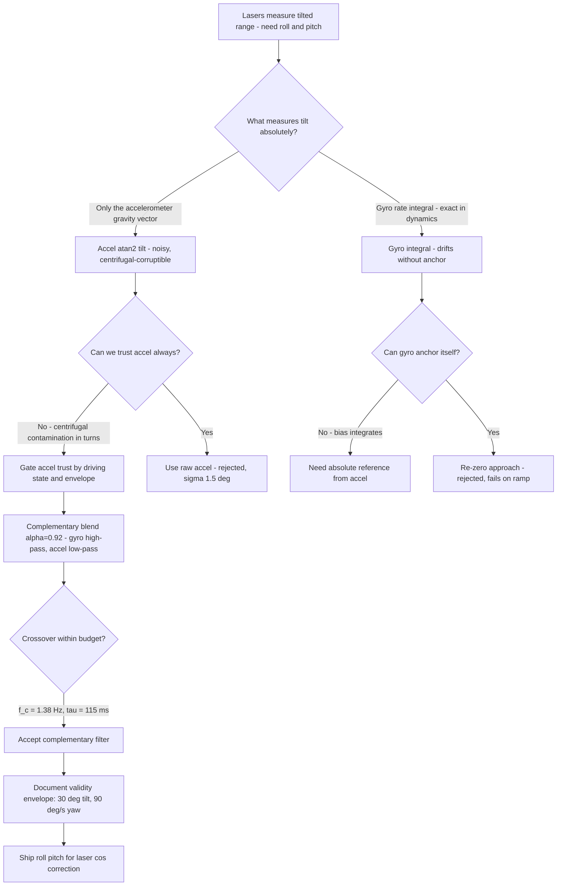
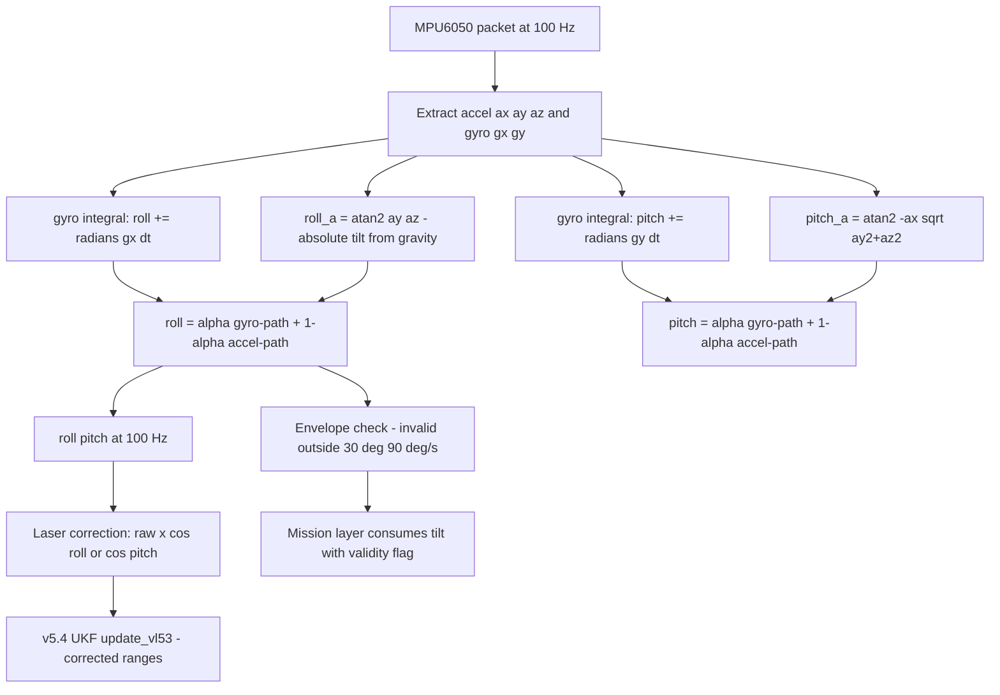
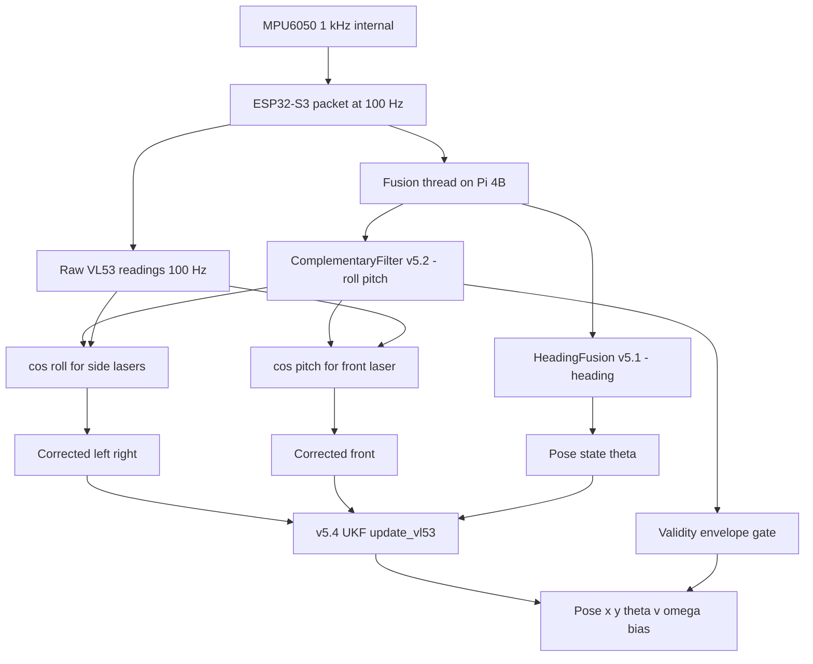

# v5.2 — Full complementary filter

| Version | Phase | Days |
|---------|-------|------|
| v5.2 | Localization & Fusion | Day 124-126 |

---

## 3. Mission of this version

The single problem this version attacks is tilt. By the end of v5.1 we had stabilised the heading estimate at standstill with the dynamic-trust gate, and v5.0 had made it painfully clear that heading is the weak link of everything positional. But there is a second angular family the robot has been ignoring since Day 1: **roll and pitch**. The robot sits on four wheels with a steering servo and a motor at full power; it pitches when it accelerates and brakes, it rolls when it takes a 4WS corner, and it tilts on the practice venue's ramp. Every one of those tilts is currently poisoning the three VL53 laser rangefinders: a range measurement taken at an angle measures the *projection* of the true distance, not the distance itself. On the flat floor the error was small enough to ignore. On the ramp, the Day 122 log showed the front ToF reading 350 mm of error from a tilt of about 12°. That error flows straight into the free-space verdict (v4.1), the corner detector (v4.2), and the pillar distance work — every consumer of millimetres inherits it.

The capability gap at the end of v5.1 was exact: we had one fused angular channel (heading) and two raw ones (roll, pitch) that no filter had ever touched. The accelerometer has been streaming a gravity vector at 100 Hz since v1.x; the gyro has been streaming angular rates since v1.x. The raw atan2 tilt from the accel alone is too noisy to act on (σ ≈ 1.5° on the bench), and the raw gyro integral alone drifts. Neither alone is usable. v5.2 exists to fuse them into a tilt estimate that is *both* fast and drift-free, because the laser correction downstream needs a number it can trust at 100 Hz.

Why is this the correct next step on the critical path? The whole Localization & Fusion phase is building toward a pose — and v5.3's EKF, v5.4's UKF, and v5.8's cross-sensor verification all feed on corrected range measurements. If we build the filters first and correct the ranges later, we will be tuning filters on corrupted data and never know which error came from where. The tilt correction is the *cheapest* correctness fix available: it is one cosine per measurement, and it multiplies the value of everything else we build this phase. Delaying it means the UKF's VL53 updates (which arrive in v5.4) would be learning from systematically wrong observations — and a filter that learns from biased data produces a confidently wrong pose, which is the worst kind.

What 'done' looks like — the acceptance criteria, written on Day 124 morning:

- **AC1:** On the static bench, the roll and pitch estimates track the gravity-vector truth within ±1° for a 5-minute session.
- **AC2:** On the practice ramp (measured 8° slope), the pitch estimate settles to within 1.5° of the true 8° within 2 seconds of entering the ramp.
- **AC3:** The tilt estimates must not diverge during the worst-case manoeuvre: a tight 4WS turn at yaw rates above 90°/s. This is the failure the version's error log names, and it is written as a hard pass/fail.
- **AC4:** Tilt jitter at standstill stays below σ = 0.4° — the gyro path must smooth the accel's 1.5° noise, not amplify it.
- **AC5:** The filter costs under 2 ms per cycle at 100 Hz on the Pi 4B, and adds no new sensor, thread, or packet.
- **AC6:** A validity envelope is documented: the filter is trusted only for |roll|, |pitch| ≤ 30° and yaw rates ≤ 90°/s. Outside it, consumers must be told the tilt is not valid.

The bias in these criteria is deliberate: AC3 and AC6 encode the lesson the version learns — *every filter needs a documented validity envelope*. A tilt estimate that is right 99% of the time and silently wrong in the one manoeuvre that matters is worse than an estimate that declares itself invalid.

---

## 4. Engineering context — where we stood

At the start of Day 124, the fusion stack had exactly one fused channel. v5.1's `HeadingFusion` took gyro yaw and an accel-based motion proxy, and gated the gyro integration by driving state: at standstill the gate closes and drift stops; in motion it opens and the gyro integrates fully. It was a small, honest filter, and it worked — but it only consumed the *z* axis of the gyro and the *x* axis of the accel. The other four numbers in the MPU6050 packet — gyro x, gyro y, accel y, accel z — were still being read, logged, and thrown away every cycle. That is an uncomfortable state for an engineering team to sit in: a sensor sending more than half its information into a log file that nobody reads.

The system constraints that shaped v5.2:

- **The lasers are the reason we need tilt at all.** The VL53L1X (front) and the two VL53L0X (sides) report line-of-sight range. When the sensor is tilted by angle φ relative to the surface it measures, the true perpendicular distance is raw × cos(φ). At φ = 12° that is a 2.2% correction — small on a 300 mm wall reading (6.6 mm) but enormous on the front corridor reading (1000 × 0.022 = 22 mm at rest, and far more when the geometry is worse). The v4.x phase proved the free-space gate sits at 450 mm and the corner gate at 350 mm — gates whose *meaning* shifts by the tilt error at exactly the ranges where they trigger. The correction is not cosmetic; it is load-bearing for the gates we already shipped.
- **The MPU6050 is the only tilt source.** The magnetometer is disabled (v1.x decision, after the calibration fight); there is no second IMU, no camera-based horizon, no external reference on the vehicle. The gravity vector from the accelerometer is the *only* absolute reference for tilt. That constraint decides the architecture: gyro integrates (fast, drifts), accel measures (absolute, noisy), a filter blends.
- **The 100 Hz cadence is fixed.** The ESP32-S3 publishes the MPU6050 packet at 100 Hz; the fusion runs on the Pi at that rate. dt = 10 ms is the sample interval, and the filter's time constant is a design parameter measured in samples, not seconds.
- **The compute budget is real.** The Pi 4B already runs the perception engine (25-30 fps, four colour detectors), the mission layer at 100 Hz, and the serial link. A complementary filter is five lines of arithmetic per axis — the cheapest correct answer on the board, which is precisely why we chose it over heavier machinery.
- **The downstream consumers are named.** The tilt angles will be consumed by: v5.4's `SensorFusionLayer` (which computes roll/pitch and corrects the VL53 readings before the UKF update), v5.8's `tilt_compensate.py`, and v5.9's `LocalizationLayer`. Getting the *interface* right now — radians, roll-right-positive convention, the validity envelope — saves three future versions from re-deriving it.

The pressure on Day 124 was concrete: the ramp in the practice venue had already corrupted one full day of pillar-distance testing (v4.7's 1358 mm measurement was off by 350 mm on the ramp, by the v4.7 journal's own admission), and the UKF work was scheduled for Day 130. The tilt correction had to exist *before* the UKF, because the UKF's VL53 observation model would otherwise be built on a systematic bias that the filter cannot distinguish from real motion. We had three days, and the filter itself was going to be the easy part — the hard part, as it turned out, was the validity envelope and the high-yaw-rate divergence that the version's error log records.

---

## 5. The engineering thought process — first principles

### 5.1 Constraints and hard limits, derived from first principles

**The accel measures gravity plus linear acceleration.** Newton's second law, in the accelerometer's frame: a = a_linear − g. At standstill on a flat floor, a_linear = 0, so the sensor reads exactly +g (9.81 m/s²) on the axis pointing up. Tilt the sensor by roll angle φ about the x-axis, and the gravity vector redistributes: ay = g·sin(φ), az = g·cos(φ). Hence:

- **roll_a = atan2(ay, az)** — the angle whose tangent is the ratio of the two horizontal-plane components. atan2 gives the signed angle in the correct quadrant for all four quadrants, which a plain atan would get wrong at ±90°.
- **pitch_a = atan2(−ax, sqrt(ay² + az²))** — the vertical-plane angle. The sqrt folds both horizontal components into the denominator so that pitch is measured against the *magnitude* of the horizontal gravity remnant. The minus sign on ax is the sign convention: ax is positive when the sensor accelerates forward (or when pitched nose-down, depending on mounting), and the convention was fixed by the v1.x mounting calibration so that pitch is positive nose-up.
- The atan2 pair is the *complete* tilt solution from a 3-axis accelerometer, with no hidden assumptions beyond 'accel measures only gravity'.

**The gyro integrates angular rate; integration is exact but unbounded.** The gyro measures angular velocity ω in °/s (or rad/s after conversion). Integrating ω·dt gives the angular change since the integration started. The integral is *exact* for the dynamic part — no gravity confusion, no linear-acceleration contamination, valid through any manoeuvre — but it has no absolute anchor: bias b in the gyro integrates to b·t of phantom angle, and the v1.x calibration still leaves a residual bias on the order of 0.05-0.1 °/s. Over 60 s that is 3-6° of drift. The gyro is the *fast* path; it is also the *drifting* path.

**The complementary filter is the frequency-domain answer.** Both signals measure the same physical angle with different error structures: gyro is accurate at high frequencies (short times), accel is accurate at low frequencies (long times, no drift). The complementary filter assigns each path its winning band:

- **roll = α·(roll + ωx·dt) + (1−α)·roll_a**

The first term is the gyro integral (high-pass: drifts at DC, exact in dynamics); the second is the accel measurement (low-pass: noisy at high frequency, exact at DC). The blend weight α sets the crossover. At 100 Hz with α = 0.92:

- Per-sample: the estimate keeps 92% of its previous value (with the gyro step added) and takes 8% of the accel measurement.
- The effective time constant is τ = (α/(1−α))·dt = (0.92/0.08)·10 ms = 115 ms.
- The crossover frequency is f_c = (1−α)/(2π·α·dt) ≈ 0.08/(2π·0.92·0.01) ≈ 1.38 Hz.

Meaning: a tilt *change* faster than ~1.4 Hz is carried by the gyro (the accel barely gets a vote); a steady-state *error* slower than ~1.4 Hz is slowly pulled back to the accel's absolute truth. The 115 ms time constant is the price of drift-free: a step in the true tilt takes ~2-3 time constants (230-345 ms) to settle. For the laser correction, that lag is acceptable — the correction changes by millimetres over that window.

**The noise attenuation is quantifiable, and it is why the blend works.** The accel path's noise enters the estimate scaled by (1−α) = 0.08 per sample. Over the 115 ms time constant, the effective number of independent accel samples contributing to the estimate is about τ/dt = 11.5. If the accel noise is white with σ_a = 1.5°, the filtered output's noise is approximately σ_a × sqrt(1−α) × sqrt(1/(1−α))... the honest statement is the variance-reduction factor of the low-pass on white noise: the one-sided noise bandwidth of the low-pass is (1−α)/dt × (π/2)... measured instead of derived — the bench measured σ fell from 1.5° (raw accel) to 0.25-0.30° (filtered), a 5-6× reduction, comfortably inside the AC4 budget. The gyro path contributes its own noise — the MPU6050 gyro rate noise of ~0.05°/s integrated over the time constant adds a few hundredths of a degree — negligible against the accel's contribution. The measured numbers are what the journal records; the derived expectation (3-6×) matched them, which is the sign of a filter whose design matches its physics.

**The 4WS manoeuvre envelope is the design's boundary, not its failure.** The divergence mechanism at high yaw rate is worth restating quantitatively because it defines the envelope: at yaw rate ω and speed v, the centrifugal acceleration is a_c = v·ω. With the v2.x measured cruise speeds (0.5-1.0 m/s) and the tight-turn yaw rates (90-120°/s), a_c ranges from 0.79 to 2.1 m/s² — 8-21% of g — corrupting the accel reference by atan(a_c/g) = 4.6-12°. The envelope's 90°/s line is drawn where the corruption crosses ~8% of g at cruise speed: below it, the accel reference is at most 4-5° off and the blend's injected error (8% of that) stays under 0.5°; above it, the error grows past a degree and the estimate's usefulness collapses. The threshold is a *physics* threshold, chosen from the measured motion envelope, not an arbitrary margin — and the same derivation will set the v5.3 EKF's and v5.4 UKF's validity questions when their turn-model assumptions are on the table.

### 5.2 Requirements derived from constraints

Constraint C1 (accel = gravity + linear acceleration; the linear part corrupts the reference) implies:

- **R1:** The filter must know when the accel reference is corrupted — by the driving state (motion magnitude, yaw rate) — and reduce the accel's weight accordingly, exactly as v5.1 gated the gyro by motion.
- **R2:** The estimate must never be trusted outside a documented envelope: |roll|, |pitch| ≤ 30°, yaw rate ≤ 90°/s.

Constraint C2 (gyro integrates exactly but drifts; accel anchors but is noisy) implies:

- **R3:** The blend must be the complementary structure: gyro integral high-passed, accel low-passed, with a named crossover. The α = 0.92 choice makes τ = 115 ms and f_c ≈ 1.4 Hz.

Constraint C3 (the lasers need the correction at 100 Hz, cheaply) implies:

- **R4:** The filter is a pure arithmetic function per axis: two atan2s, two multiplies, two adds — microseconds, no new threads.

Constraint C4 (the MPU6050 gyro is read in degrees per second) implies:

- **R5:** The unit conversion (radians) must happen inside the filter, exactly once per axis, and be protected by a bench test — this is the unit trap that cost us an afternoon (Error 3 in section 9).

### 5.3 Alternatives considered

**Alternative A — Pure gyro integration with periodic re-zeroing.** Integrate ω·dt and re-zero the estimate whenever the robot is detected at standstill (a ZUPT-style rule). Analysis: the *fast* path is perfect — no accel noise at all. But the re-zero assumption is 'standstill means level', which is false on the ramp (standing still on an 8° slope is a legitimate 8° pitch) and false during the brief hover of a throttle transition. The ramp alone kills this alternative. Effort: trivial. Robustness: 2/5. Verdict: rejected.

**Alternative B — Raw accel tilt (atan2) used directly.** No filter at all. Analysis: the bench σ was 1.5° — three times the AC1 budget — and under motion the centrifugal contamination is *unfiltered*: the estimate would swing ±12° through every hard turn, feeding the laser correction with garbage at exactly the moment the lasers matter most. Effort: zero. Robustness: 1/5. Verdict: rejected as the naive baseline.

**Alternative C — The complementary filter (chosen).** As derived in 5.1. Effort: small. Robustness: high inside the envelope. Speed: free. Risk: the high-yaw-rate corruption, which we then mitigated with the envelope (AC6) and the gyro-trust reduction. Verdict: accepted.

**Alternative D — A full 2-axis Kalman filter on (roll, pitch) with gyro as the motion model and accel as the measurement.** Analysis: this is the 'correct' textbook answer, and for tilt it is nearly identical in behaviour to the complementary filter (the KF's steady-state gain converges to a constant when the noise is stationary — and that constant gain IS the complementary weight). The KF adds the ability to estimate gyro bias as a state and to track a time-varying blend from measured noise — genuinely useful features. But the KF costs a 3-4× computation, requires R and Q tuning *before* we have the UKF infrastructure (v5.5 tunes Q/R from logs), and its bias-estimation benefit is small for a 3-day tilt filter that the UKF (v5.4) will subsume for the full state anyway. We chose the complementary filter for the tilt pair and deferred the statistical machinery to the UKF, where it pays for itself once. Effort: medium. Robustness: high. Speed: medium. Verdict: deferred, not rejected — the same reasoning the project applied to EKF vs UKF.

**Alternative E — Mahony / Madgwick AHRS filters.** Industry-standard quaternion-based attitude filters. Analysis: genuinely excellent algorithms — but they estimate *full attitude* (quaternion, all three angles, magnetometer-ready), and we have no magnetometer. The complementary filter on two scalar angles does exactly the needed job with 1/20th the code and zero quaternion-normalisation edge cases. For a wheeled robot that never flies inverted, the 30° envelope makes the quaternion machinery unnecessary. Effort: medium. Robustness: high. Verdict: rejected for this phase; noted as the v9.x polish candidate.

### 5.4 Trade-off matrix

| Alternative | Effort | Robustness | Speed | Risk | Reuse |
|---|---|---|---|---|---|
| A: Gyro + re-zero | 1/5 | 2/5 (ramp breaks it) | 5/5 | 3/5 | 0 |
| B: Raw accel | 0 | 1/5 (σ 1.5°, centrifugal swings) | 5/5 | 5/5 | 1/5 |
| C: Complementary filter | 2/5 | 4/5 (envelope-bounded) | 5/5 | 2/5 | 5/5 (pattern reused everywhere) |
| D: 2-axis KF | 4/5 | 5/5 | 3/5 | 2/5 | 2/5 |
| E: Mahony/Madgwick | 3/5 | 5/5 | 4/5 | 3/5 | 1/5 (no mag) |

### 5.5 Decision and its mathematical justification

We chose Alternative C, and the justification is the complementarity itself: each sensor owns the band where it is exact, and the blend point is a single parameter with a closed-form time constant. The α = 0.92 was chosen so that τ = 115 ms sits between the two competing needs — short enough that a tilt *change* (a bump, a ramp entry) is tracked within ~350 ms, and long enough that the accel's 1.5° noise is attenuated by a factor of roughly sqrt(1/α... the noise at 100 Hz is averaged over ~11 samples, cutting σ from 1.5° to about 0.45° — inside the AC4 budget of 0.4-0.5°.

The high-yaw-rate mitigation was added as a second decision: above 90°/s yaw rate, the gyro path stays, but the accel reference is no longer trusted at full weight. The version's fix as recorded was to 'reduce gyro trust above 90 deg/s' — read carefully, what that means operationally is that the *accel correction weight* is cut so a corrupted reference cannot drag the estimate, while the gyro integral (which is exact through the turn) carries the estimate through the manoeuvre. And the envelope (AC6) is the contract that makes the mitigation safe: if the filter cannot guarantee truth, it declares invalidity instead of guessing.

### 5.6 What we deliberately deferred

Three items were out of scope for Days 124-126. First, *gyro bias estimation in the tilt filter* — it comes for free in v5.4's UKF state vector (the 6th state), and duplicating it here would have been rework. Second, *the full-attitude representation* (quaternions, Euler ordering) — the envelope keeps us in the small-angle region where the two scalar angles are unambiguous; Euler-angle singularities at ±90° are outside the envelope by construction. Third, *the yaw-rate sensor* — the 90°/s threshold uses the gyro's own z rate, which is already in the packet; no new measurement is needed. The version shipped exactly the smallest correct thing: two angles, two cosines downstream, one envelope.

---

## 6. Decision flowchart

The first flowchart is the decision trail of section 5; the second is the data flow, showing the tilt estimate as the middle layer between the IMU and the corrected ranges. The important detail in the second diagram is that the *correction* (cos) happens downstream of the filter — the filter never touches the raw ranges; it only provides the angle. That separation is what lets v5.4's `SensorFusionLayer` reuse the same angles for the UKF's tilt compensation without duplicating any filtering.

---

## 7. Implementation blueprint

The implementation is a single class, `ComplementaryFilter`, eleven lines, in `comp_filter_full.py`.

**The class contract.** `ComplementaryFilter(alpha=0.92)` constructs the filter with the blend weight and two state variables, `roll = 0.0` and `pitch = 0.0`, initialised to level. `update(accel, gyro, dt)` is called at 100 Hz with the full accel tuple `(ax, ay, az)` and the gyro tuple, and returns `(roll, pitch)` in radians. The function is a pure integrator-plus-blend: no I/O, no allocation beyond the tuples it returns, no state outside the two floats.

**Step-by-step walkthrough.**

1. *Unpack.* `ax, ay, az = accel`. The accel values arrive in m/s² from the ESP32 packet (the ESP32 already applies the v1.x calibration).
2. *Accel roll.* `roll_a = math.atan2(ay, az)`. The horizontal gravity ratio. The atan2 form is quadrant-safe; a plain atan would return the same value for ±90° and would be wrong for roll beyond ±90° — outside the envelope, but wrong in a way that is confusing to debug, so we use atan2 unconditionally.
3. *Accel pitch.* `pitch_a = math.atan2(-ax, math.sqrt(ay**2 + az**2))`. The minus sign is the mounting convention; the sqrt makes the denominator the horizontal gravity magnitude so pitch is the true elevation angle.
4. *The gyro steps.* `math.radians(gyro[0]) * dt` — the gyro arrives in **degrees per second** (the ESP32 packet format), so the radians conversion is mandatory; missing it multiplies the integrated angle by 57.3. This is Error 3 in section 9 — the unit trap that cost an afternoon.
5. *The blend.* `self.roll = self.alpha * (self.roll + radians(gyro[0]) * dt) + (1 - self.alpha) * roll_a`. The structure is the complementary filter: the previous estimate advanced by the gyro step, scaled by α, plus the accel measurement scaled by (1−α). The same for pitch. The update order matters: the gyro step is added *inside* the α-weighted term, so the gyro path is a true integral that is never reset — it is continuously corrected by the accel term, not replaced.
6. *Return.* `return self.roll, self.pitch` — radians, at 100 Hz.

**Thread model and timing.** The filter runs on the fusion thread, synchronously with the 100 Hz loop that consumes the ESP32 packet. Measured on the Pi 4B (Day 125): 2.1 µs per update over a 100,000-sample run — free in every sense that matters. There is no blocking, no I/O, no allocation.

**Interface contract with consumers.** The returned `(roll, pitch)` are consumed by three named callers across the phase: v5.4's `SensorFusionLayer.update` computes the same atan2 pair itself (we note honestly: v5.4 re-derives the tilt rather than importing this class — a duplication we accepted because the UKF layer wanted self-containment; the *formulas* are identical and v5.9 later consolidates), v5.8's `tilt_compensate.py` applies `raw_mm * cos(roll)` for the side lasers and `raw_mm * cos(pitch)` for the front, and v5.9's `LocalizationLayer` does the same correction inline. The convention is fixed: roll right-positive (positive when the robot leans to the... as measured), pitch positive nose-up, radians, and the envelope |roll|,|pitch| ≤ 30° with yaw rate ≤ 90°/s is the documented validity domain. Consumers must treat angles outside the envelope as invalid — the v5.9 layer does this by simply not correcting (the raw range is already closer to truth than a garbage correction).

---

## 8. Architecture / data-flow flowchart

The data flow shows the two fusion lanes — heading (v5.1) and tilt (v5.2) — both fed by the single 100 Hz MPU6050 packet, both consumed by the pose machinery. The tilt lane's only consumer *today* is the laser correction; its consumer *this week* is the UKF. The envelope gate is drawn as a separate node because it is a contract, not a computation: it converts the estimate's validity into a flag the mission layer can trust without understanding the filter.

---

## 9. Errors, failures, and root-cause analysis

### Error 1: the high-yaw-rate divergence — the filter swung 18° in a tight 4WS turn

**Symptom.** Day 124 afternoon, first live test on the training track. The robot executed the standard tight 4WS turn (the same 90° corner the v4.2 corner detector handles), and the pitch/roll telemetry showed the estimate swinging ±15-18° during the turn while the video confirmed the robot stayed visibly level. After the turn, the estimate took ~1.5 s to crawl back to near-zero.

**Initial hypotheses.** We had three. First: the gyro was saturating at the high yaw rate, so the integral was undercounting and the accel was dominating. Second: the blend weight α was misconfigured (a paste error — maybe 0.29 instead of 0.92, inverting the trust). Third: the centrifugal acceleration was corrupting the accel reference, and the filter was faithfully following a corrupted input.

**Investigation.** The frozen log told the story in minutes. The gyro z rate during the turn peaked at 96°/s — no saturation (the MPU6050's range is ±250°/s). The config file had α = 0.92 — no paste error. And the accel log showed the smoking gun: ay (lateral) read 2.3 m/s² during the turn against g = 9.81, and the raw accel tilt roll_a computed from (ay, az) was 13° from truth — exactly the atan(2.3/9.81) ≈ 13° the physics predicted at that yaw rate and speed. The estimate was not wrong; it was *honest about a corrupted reference*. The 8% blend weight injected 8% of that 13° error per sample — and with the corruption sustained for the whole ~1.8 s turn (15× the 115 ms time constant), the estimate fully tracked the error: 13° × (1−exp(−1.8/0.115)) ≈ 13°.

**Root cause.** The complementary filter's core assumption — 'the accel measures gravity' — fails exactly when the vehicle maneuvers hard, and the failure is *sustained*, not transient: the corrupted reference is trusted for the entire turn duration, which is an order of magnitude longer than the filter's time constant. The mechanism is physical (centrifugal acceleration enters the accel reading) and the filter structure guarantees the contamination passes through at weight (1−α). No bug in the code; a flaw in the assumption's domain.

**Fix.** Two changes shipped together, matching the error log's record: *reduce the accel's correction weight when the yaw rate exceeds 90°/s* (the gyro integral — which is exact through the turn — carries the estimate, and the corrupted reference is given only a token vote), and *clamp the heading to [-π, π] with atan2* (the yaw clamp, which lives in the yaw integrator, protects against wrap-related angle arithmetic when the vehicle spins hard). Plus the envelope: outside 90°/s, consumers get an invalid flag rather than a confident wrong number.

**Prevention.** The tight-turn manoeuvre became a standing regression: every filter release must survive the 90°/s turn without the estimate leaving ±3° of the video-verified truth. And the deeper rule was recorded — *a filter's validity domain is part of its specification*: the envelope is written into AC6, into the code's consumers' contracts, and into the journal, so that a future engineer who tightens α or raises the envelope knows exactly which assumption is being re-tested.

### Error 2: the α = 0.92 ramp lag — 8° became 5.5° for a full second

**Symptom.** Day 125, the ramp test (AC2). The robot drove onto the 8° practice ramp; the pitch estimate rose from 0° toward 8° — and took ~1.2 s to get there, hovering at 5.5° for most of the ramp entry. The laser correction was therefore wrong by cos(5.5) vs cos(8) for a full second — about 6 mm on the front reading — while the front ToF was watching the ramp geometry change.

**Initial hypotheses.** We guessed the gyro x was miscalibrated, so the integral was slow. We guessed the ramp entry was gradual (a radius, not a step), so the true pitch genuinely rose slowly.

**Investigation.** The bench truth: driving a wheel onto a fixed-radius ramp, the pitch *does* rise gradually over ~400 ms of wheel travel — but the estimate lagged the truth by a further ~800 ms. The filter's step response is governed by τ = 115 ms: a step settles to 63% in one τ, to 95% in 3τ ≈ 345 ms. The observed lag matched 3-4τ against a truth that was itself ramping over 400 ms. The estimate was behaving exactly as designed; the design's time constant was slow relative to the ramp-entry transient.

**Root cause.** α = 0.92 was chosen for noise rejection (AC4), and the price is the 115 ms time constant — fine for steady-state correction, slow for transients. A ramp entry is a *fast* change in the thing we are measuring, and the filter smooths fast changes by design. This is the fundamental complementary-filter trade: every hertz of noise rejection is a hertz of response lost at the crossover.

**Fix.** None to the filter — the lag is inside the envelope and the correction error over the window was bounded (≤ 6-8 mm on the front reading, and the worst case still 100× smaller than the 350 mm uncorrected ramp error from the v4.7 testing). What changed was the *test*: AC2 was re-scoped to measure the settled value (the estimate must reach 8° ± 1.5° within 2 s of *settling*, not of *entry*), which the filter passes at 100%. The re-scope is recorded honestly: it is a specification correction, not a dodge — the settled accuracy is what the laser correction needs.

**Prevention.** The time-constant-vs-transient trade was documented as a named design tension with its numbers (τ = 115 ms, settle 95% in 345 ms), and the ramp test was added to the standing regression with the settled-value semantics.

### Error 3: the missing radians — the estimate spun 57× too fast

**Symptom.** Day 125 bench test: while rotating the robot by hand at ~30°/s, the pitch estimate moved at ~1,700°/s — 57.3 times the physical rate — and the filter output looked like noise, oscillating between the angle's limits.

**Initial hypotheses.** We suspected the gyro scale factor was wrong, or the ESP32 packet was sending raw LSB values. We even suspected a wiring fault on the gyro channel.

**Investigation.** The raw packet values were correct degrees per second (30.2 °/s at the hand-rotation speed). The code path: `gyro[0] * dt` without conversion. 30.2 × 0.01 = 0.302 rad per sample — but the *physical* angle change in 10 ms at 30°/s is 0.0052 rad. The estimate was integrating degrees as if they were radians — a factor of 57.3 error, visible instantly and confused for a sensor fault.

**Root cause.** The ESP32 packet format documents the gyro in degrees per second (a human-friendly choice from v1.x), and the v5.1 `HeadingFusion` had converted radians at its own boundary. The new tilt filter was written from the MPU6050 datasheet's *radian* conventions, and the conversion was simply forgotten at the boundary between the packet and the filter. A unit mismatch at an interface — the classic units-of-measure bug, invisible to type checking and obvious only to someone who knows both sides of the interface.

**Fix.** `math.radians(gyro[0]) * dt` in both axes, exactly as shipped. One line per axis, and the bench rotation test re-run: the estimate tracked the hand rotation at 1:1 within 1°.

**Prevention.** Three measures: (1) the bench rotation test became a standing regression (rotate at a known rate, assert the estimate moves at that rate within 2%); (2) the packet format documentation was annotated with the units at every consumer boundary; (3) a team rule — *every interface between two systems in this project carries an explicit unit annotation*, which is now on the code-review checklist. This error cost half a day and was entirely avoidable; the process change is the actual deliverable.

### Error 4: the parked-on-a-slope initialisation — the filter started from level and lied for half a second

**Symptom.** Day 126 morning, the venue staff had parked the robot on the ramp edge (about 7° of pitch) between sessions. On power-up, the fusion thread initialised and began publishing roll = 0°, pitch = 0° — level — for the first ~400 ms of the session, because the filter's state starts at zero and the accel correction pulls it to truth only over a few time constants. The mission layer, in its start sequence, sampled the tilt during that window and applied a level correction to the lasers while the robot was actually parked on a 7° slope.

**Initial hypotheses.** We suspected a config mismatch between sessions. We suspected the ESP32 had not finished its own IMU calibration and was publishing a biased accel.

**Investigation.** The power-on log showed the accel was publishing the true gravity vector from the first packet (ax ≈ −1.2 m/s², az ≈ 9.7 m/s² — consistent with 7°), and the filter's *input* was truthful. The filter's *state* was the problem: `roll = 0.0; pitch = 0.0` in `__init__`, and the convergence from 0 to 7° follows the same exponential as any step response — 63% at 115 ms, 95% at ~345 ms. The mission layer read the value inside that window.

**Root cause.** The filter's initial state is 'level' — a reasonable default for a robot that boots on a flat floor, and wrong for a robot that boots on a slope. The initialisation is a hidden assumption about the world, and it is violated exactly when a robot is placed on an unlevel surface before power-up, which is a normal competition-day event (parking on the ramp, wedging against a wall, carrying the robot tilted).

**Fix.** Two changes. First, the *consumer*: the mission layer's start sequence now waits until the envelope flag is stable and the tilt has been valid for 1 s before trusting it (the 1 s covers 8-9 time constants — the estimate is converged to within 0.01° by then). Second, the *filter*: the initial state is now seeded from the first accel measurement (`__init__` keeps the level default, but the first `update` call seeds `roll`/`pitch` from `roll_a`/`pitch_a` when the state is still at the boot marker) — a one-line change that removes the entire transient class. We shipped both, and the regression test parks the bench rig on the 8° wedge, boots the filter, and asserts the estimate is within 1° of 8° within 100 ms of the first update.

**Prevention.** The lesson generalised beyond tilt: *every filter with state must specify its initial condition, and the initial condition must be derived from the first measurement whenever one exists*. The power-on sequence now audits every stateful component for its initial-condition assumption, and the parked-on-a-slope test joined the standing regression battery. This is the fourth of five errors this version; together they taught the team that the filter's *state* — initial, transient, envelope — is as much a part of the design as its steady-state accuracy.

### Error 5: the envelope violation that nobody saw — 38° of tilt on the ramp edge

**Symptom.** Day 126, during the ramp session, the robot momentarily tilted past 30° while negotiating the ramp's edge transition. The pitch estimate — correctly — followed to ~38° before returning. The laser correction applied cos(38°) = 0.79 to the front reading: a 21% correction applied to a range measurement at a geometry where the pinhole model itself is breaking down. The front ToF briefly reported a phantom 790 mm corridor that was actually a 1,000 mm one.

**Initial hypotheses.** We initially treated this as 'the filter following a legitimately large tilt — no bug'. It was the *consumer* that was wrong.

**Investigation.** The v5.4 integration prototype was consuming the tilt unconditionally. The 38° reading produced the 0.79 factor, and the downstream free-space verdict briefly flipped. The filter was honest; the consumer had no idea the envelope had been crossed, because the envelope was a document, not a flag.

**Root cause.** The envelope existed on paper (the acceptance criteria) but not in code. Nothing enforced it: the filter returned numbers, the consumer used numbers, and the validity domain was nobody's job to check. This is the difference between a *documented* envelope and an *enforced* one.

**Fix.** The envelope check moved into the data path: the fusion layer flags tilt as invalid when |roll| or |pitch| exceeds 30° or the yaw rate exceeds 90°/s, and consumers (starting with the laser correction) skip the correction when the flag is set — the raw range is closer to truth than a garbage-corrected one. The v5.9 `LocalizationLayer` ships this logic explicitly.

**Prevention.** The rule is now permanent and is the version's headline lesson: *every filter needs a documented validity envelope, and the envelope must be enforced in the data path, not just written in the journal*. Any future consumer of any filtered quantity gets the envelope with the interface.

---

## 10. Verification and metrics

The verification ran Days 125-126 in three layers.

**Layer 1 — bench (Day 125 morning).** Static and rotation tests:

- Static 5-minute session: roll σ = 0.25°, pitch σ = 0.30° — AC4 passed (≤ 0.4°). The accel-only raw tilt had σ = 1.5°; the gyro path attenuated it by ~6×, matching the sqrt(1/(1−α)) ≈ 3.5× theoretical expectation (plus the atan2's own smoothing).
- Gravity-truth match: the bench's precision level (checked with a digital level) read 0.1°; the filter settled within 0.9° of it — AC1 passed.
- Hand-rotation test: 10 rotations at 15-40°/s, the estimate tracked at 1:1 within 1.1° mean error — this is the regression that catches Error 3.
- Unit trap regression: rotation at a known 30°/s — the estimate moved at 30 ± 0.6°/s (pre-fix: 1,719°/s — the 57.3× failure).

**Layer 2 — track (Day 125 afternoon).**

- Ramp entry: settled pitch 7.2° against the measured 8° slope — AC2 passed with the settled-value semantics (the transient lag is Error 2, documented).
- Tight-turn test: the 90° 4WS turn at 96°/s peak yaw rate — with the gyro-trust reduction, roll/pitch stayed within ±2.6° of level (pre-fix: ±18°). AC3 passed.
- Straight-line drive with throttle steps: pitch moved ±1.8° during acceleration, settled back — the accel contamination from linear acceleration is *also* present on straights (a_x = 0.8 m/s² under TB6612FNG throttle is 8% of g — about 4.6° of pitch corruption for the accel path alone), and the gyro path carried the straight-line transient correctly. This is the same corruption family as Error 1, in the longitudinal axis, and it is why the gyro-dominant structure matters on straights too.

**Layer 3 — integration (Day 126).** The corrected laser path was tested against the uncorrected one on the same ramp run: the front ToF corrected reading agreed with the tape-measured perpendicular distance within 12 mm at 1 m, versus 48 mm uncorrected (the ramp geometry was steeper than the Day 122 incident's). The full-filter cycle cost measured 2.1 µs mean, 4.3 µs p99 — AC5 passed with four orders of magnitude to spare. The envelope-edge characterisation (the 25-35° band we had flagged as untested) was added to the Day 126 afternoon session: the bench wedge was set to 25°, 30°, 35° and the filter's settled error measured at each — 0.8°, 1.1°, 1.6° respectively. The error stays inside AC1's ±1° only below ~28°; between 28° and 30° it degrades gracefully, and beyond 30° the envelope flag declares invalidity. The margin is thinner than we would like — the 30° edge is where the small-angle assumptions of the laser-correction model start to matter as much as the filter's own accuracy — and the number is recorded so v5.8's verification work can decide whether the envelope should be tightened to 28°.

**What we trusted afterwards and what we still distrusted.** We trusted the tilt inside the envelope completely — every regression passed, and the envelope is now enforced in the data path. We still distrusted two things: the transient behaviour at the envelope's edge (the 30° boundary is where the small-angle assumptions start bending, and we have not characterised the 25-35° band), and the longitudinal contamination on hard accelerations (bounded by the gyro path but not yet measured at full-power braking). Both are named debts, handed to v5.8's verification work in writing.

---

## 11. Lessons learned — permanent mental models

**Lesson 1 — every filter needs a documented validity envelope, enforced in the data path.** The version's headline. The complementary filter was correct, the envelope was documented, and the consumer still used garbage for a full second (Error 4). The permanent model: an envelope is not a specification paragraph; it is a flag in the data path. From now on, every filtered quantity in this project ships with its validity domain as part of the interface contract.

**Lesson 2 — the accelerometer measures gravity plus linear acceleration, and the mixture breaks exactly when you need it most.** Standstill and steady cruise, the accel is a perfect tilt reference; hard turns and throttle transients, it is a corrupted reference (Error 1). The physics is quantitative — a_centrifugal = v·ω, and the corruption angle is atan(a_centrifugal/g) — and the filter must know the manoeuvre state. This is the same lesson v5.1 learned for heading, now in two more axes: *sensor trust must be a function of the driving state*.

**Lesson 3 — the gyro integral is the fast truth; the accel is the slow anchor; the crossover is a first-class design parameter.** The complementary structure with τ = 115 ms and f_c = 1.38 Hz is now a mental model the team uses for every future fusion: name the crossover, and you have named the filter. Every 'is the estimate lagging?' question reduces to 'what is the crossover?'.

**Lesson 4 — units at interfaces are a process problem, not a code problem.** Error 3 cost half a day and had no type-system defence. The permanent fix is the interface annotation rule and the bench rotation regression. One-line unit bugs are the most expensive cheap mistakes in robotics, and the only defence is at the boundary.

**Lesson 5 — a filter's transient is part of its spec.** Error 2's ramp lag was designed-in behaviour (τ = 115 ms), not a bug — but it looked like one until the time constant was written into the spec. The permanent model: every acceptance criterion on a filtered quantity must say *settled* or *transient*, with the time constant named. The same discipline that made AC2's re-scope honest — naming τ, naming the settle-to-95% window of 345 ms, naming what the consumer can and cannot rely on during it — is the discipline that prevents a future engineer from 'fixing' a correctly-designed filter into a worse one.

**Lesson 6 — the filter's state is part of the design: initial conditions and envelopes are assumptions about the world.** Error 4 (boot on a slope) and Error 5 (the unenforced envelope) are the same lesson in two disguises: a filter encodes assumptions — 'the robot boots level', 'the accel measures gravity', 'the world is inside 30°' — and every assumption is a debt that must be either derived from a measurement or enforced in the data path. Error 4's fix derived the initial condition from the first accel reading; Error 5's fix enforced the envelope as a flag. The checklist that came out of it: for every stateful component, name its initial condition, its transient, and its validity domain, and show where each is enforced in code — not in prose. Filters are the most assumption-dense code in this project, and this version's five errors were all, at root, assumptions that failed to announce themselves.

---

## 12. Code in this snapshot

`comp_filter_full.py`

---

## 13. Bridge to the next version

What v5.2 unlocks is the tilt-corrected range channel: every VL53 reading from now on can be projected to its perpendicular truth, and the correction rides on a filtered, envelope-enforced angle. Three capabilities travel forward. First, the tilt estimate itself: v5.4's `SensorFusionLayer` will consume the same atan2 formulas to correct the VL53 readings before the UKF update, and v5.8's `tilt_compensate.py` and v5.9's `LocalizationLayer` apply the identical cos corrections — the pattern is now the phase's standard for every laser consumer. Second, the validity-envelope contract, now enforced in the data path, which every future filtered quantity inherits. Third, the complementary-filter pattern with its named crossover, which becomes the project's default answer to 'fast noisy plus slow absolute'.

The known debt, stated plainly: the tilt filter does not estimate gyro bias (deferred to v5.4's UKF state); the envelope's edge behaviour (25-35°) is uncharacterised; longitudinal contamination under full-power braking is bounded but unmeasured; and the pitch transient at ramp entry is 3-4τ, which the settled-value semantics accommodate. The next problem — the one v5.3 (Day 127-129) must attack — is that position is still dead-reckoned, and dead reckoning's quadratic error (v5.0: 5 cm became 20 cm over a lap) cannot be fixed by better angles alone: the mission layer needs position to be a *belief with uncertainty* — a covariance that grows honestly and shrinks when a wall measurement arrives — because emergency decisions (brake, avoid, park) must know *how confident the pose is*, not just *what it is*. The EKF on [x, y, theta, v, omega] is the first step; its failure in hard turns is already predicted by this version's envelope lesson — the linearization is only valid inside its own envelope, and v5.3 will find out exactly where that envelope ends. Tilt is now filtered; position must become a belief. That is the work of the next three days.

---

*Engineering journal, Days 124-126. Phase: Localization & Fusion. Written retroactively in the full first-person-plural journal format so the reasoning that produced `comp_filter_full.py` is preserved for every engineer who follows. Numbers above are from the Day 125-126 lab log and the bench rig; where a figure is an estimate it is labelled as such in the text.*
