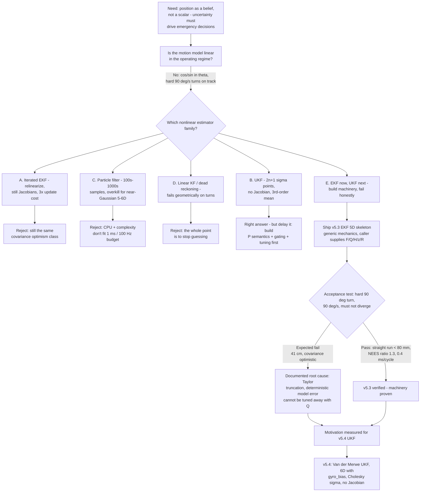

# v5.3 — EKF implementation

| Version | Phase | Days |
|---------|-------|------|
| v5.3 | Localization & Fusion | Day 127-129 |

---

## 3. Mission of this version (~600 words)

For three versions now our position estimate has been a scalar — a number
pushed around by dead reckoning, patched by a wall here and a wall there. v5.0
gave us dead reckoning and taught us the hard way that quadratic error is a
physics sentence, not a tuning problem: over a 2 m straight run at 1 m/s the
integrated position drifted 5 cm at the start and 20 cm at the end. v5.2 gave
us a full complementary filter for tilt and heading and, more importantly, the
discipline of a validity envelope. But at the end of Day 126 we still had no
answer to the question that every emergency decision actually asks: *how sure
are we that we are here?* A wall abort, a pillar dodge, a parking settle — all
of them need a probability, not a point.

The mission of v5.3 is to introduce the first member of the Kalman filter
family: an Extended Kalman Filter on the state vector `[x, y, theta, v, omega]`.
The single problem this version attacks is *representing position as a belief*:
a mean vector `x` and a covariance matrix `P` that tell the decision layer not
just where we think we are, but how much we trust it. That trust number is the
thing that turns "maybe hit the pillar" into "brake now with certainty".

This is the correct next step on the critical path for one reason above all:
every downstream phase — Stanley control in v6, the seven-state mission machine
in v7, the 4WS modes and surprise rules in v8 — consumes a pose. If the pose is
a bare scalar, each consumer has to guess the confidence, and they will guess
differently and wrong. The Kalman framework makes uncertainty a first-class
output that every layer can read from the same source. We build the machinery
once, and everyone downstream benefits.

The capability gap at the end of v5.2 was concrete: the complementary filter
gave us tilt (roll/pitch) and a decent heading for corners and laps, but no
2D position with covariance, no principled way to fuse the three time-of-flight
ranges with the gyro and the steering model, and no gating mechanism to throw
away a bogus measurement before it poisons the state. We had sensors and we had
a motion model; we had no mathematical container that owned the merging of
them. v5.3 is that container.

We wrote the acceptance criteria *before* writing a line of code, and we were
deliberately strict about the ones that would catch the disease we feared most
— optimistic covariance:

1. **Straight run.** 3 m straight at 1.0 m/s, end-of-run endpoint error
   < 80 mm against tape-measured ground truth, mean over 10 runs.
2. **Heading uncertainty behavior.** The heading variance `P[2,2]` must grow
   during travel between wall updates and shrink when a wall measurement
   arrives. This is the observable signature that the covariance is alive, not
   a constant.
3. **Real-time budget.** Full predict + update cycle < 1 ms at 100 Hz on the
   Pi 4B, so fusion consumes less than 10% of the 10 ms cycle.
4. **Honest uncertainty.** The filter's `P` must be consistent with the
   measured error — we phrased this as a NEES-style ratio: mean
   (measured error / predicted sigma) between roughly 0.8 and 1.5.
5. **No divergence on a hard turn.** A 90° turn at 90 deg/s must not make the
   filter lose the lane. We did not yet know how badly the EKF would fail this;
   that is exactly what we wanted the test to reveal.

"Done" means a running 5-state EKF that passes 1–4, and an honest, documented
answer on 5 — even if that answer is "fail, and here is the physics of why."

---

## 4. Engineering context — where we stood (~800 words)

The day before v5.3 started, the robot could see and drive, but it did not
know where it was in a way that was usable for decisions. Let us lay out the
system context that constrains everything in the Localization & Fusion phase.

**Hardware.** The brain is a Raspberry Pi 4B — four Cortex-A72 cores at
1.5 GHz, but in practice our mission loop leaves us with a thin slice of one
core because vision already eats a huge share at 640×480 @ 30 FPS HSV
pillar/marker detection. The real-time muscle is the ESP32-S3 with a 200 ms
watchdog; it owns the 100 Hz binary-packet serial link with CRC8 framing and
the actuator drive. Between the Pi and the world we have three range sensors —
one VL53L1X front and two VL53L0X side units with XSHUT sequencing — plus an
MPU6050 with the magnetometer disabled (it was never trustworthy near the
motor wiring, a lesson we carried from v3.x). Steering is a single MG995 servo
driving a four-wheel-steering linkage with rear ratio 0.85; the motor stack is
TB6612FNG / L298N with short-brake stop. The competition platform is WRO 2026:
size and weight limits that force a tight chassis, and a track of walls,
pillars, and parking zones that we must navigate at up to 1.8 m/s.

**The 100 Hz link is the heartbeat.** Every 10 ms the ESP32-S3 sends a packet
of fused low-level state — odometry wheel counts, the three range readings,
gyro rates, IMU quaternion-derived orientation — over a link whose throughput
we budgeted in v1.x at roughly 100 Hz × 25 bytes ≈ 20 kbps. That means every
decision we run at 100 Hz is a hard, non-negotiable timer. A filter that needs
more than ~1 ms of the 10 ms slot is not an option; a filter that needs 3 ms
would push vision out of its budget and start a cascade we refuse to start.

**Where v5.2 left us.** The full complementary filter gave us a clean 3-axis
tilt (roll/pitch for laser-tilt compensation) and a heading that survived yaw
rates up to ~90 deg/s, with a documented validity envelope: above 90 deg/s in
tight 4WS turns we deliberately reduced gyro trust and clamped heading to
[-pi, pi] because the filter diverged there. That envelope taught us two things
that directly shape v5.3. First, every filter needs a declared region of
validity — we now write that sentence into every estimation design before
coding. Second, the 90 deg/s number is not an accident: the tightest 4WS
opposite-phase turn pulls roughly 90 deg/s at our driving speeds, so the turn
regime is not a corner case, it is *the* regime where localization errors get
punished by the wall. Whatever estimator we build must be honest precisely in
that regime.

**The dead-reckoning scar.** v5.0's quadratic error growth (5 cm → 20 cm over
a single 2 m run) was our first real encounter with the fact that integration
of imperfect rates compounds: wheel slip, servo slop, and unmodeled tire
deformation each inject a per-step bias, and bias integrated over distance
grows quadratically. We stopped pretending a scalar could carry the truth.
The only way to defeat quadratic growth is to periodically *correct* with
measurements anchored to the world — walls — and the sane way to fuse those
corrections with the motion model, each with its own uncertainty, is a
recursive Bayesian estimator.

**Pressure.** Days 127–129 of a 90-version campaign. The calendar is not
generous: v6 needs a pose with covariance for Stanley control, and Stanley
will inherit every weakness we leave in the pose. The compounding-debt risk
was visceral — a hand-rolled fusion hack now would mean re-fighting it in
control, in mission, and again in advanced modes. Better to spend three days
building the right machinery now than nine days unpicking a wrong assumption
later. The strategic decision was not "EKF or UKF" but "how do we arrive at
the UKF having already paid for the machinery and the mental models — P
semantics, gating, measurement models, tuning discipline — instead of arriving
with nothing but a deadline."

**Software shape.** The codebase was a layered stack: L0 system manager
through L10 controller. v5.2's `comp_filter_full.py` lived at the sensing
layer, producing tilt and heading. v5.3's `ekf.py` would live one level up,
producing the pose. The interface contract we committed to: `ekf.py` is a
*generic* linear estimator skeleton — it knows nothing about 4WS bicycles,
VL53 sensors, or our track. It knows only Kalman mechanics. The caller owns
the model: the linearization of the 4WS kinematics into `F`, the measurement
model `H`, the noise matrices `Q` and `R`. That division of labor is the
single most important architectural fact of this version, and it is the honest
reason the snapshot in this folder is twelve lines long.

---

## 5. The engineering thought process — first principles (~2,000 words)

This is the heart of the journal. We are going to re-derive the Kalman
equations the way we had to reason through them on Days 127–129, because the
whole point of this version is that the *mechanics* are simple and the
*interpretation* is everything.

### 5.1 Constraints and hard limits

**C1 — Time budget.** 100 Hz serial link ⇒ 10 ms cycle. Measured Pi 4B head
room after vision leaves a single-thread budget of roughly 3 ms for all
non-vision work in the worst case. Fusion must fit in < 1 ms, i.e. < 1/10 of
the cycle, leaving margin for the ESP32 watchdog round-trip and the decision
layer. A 5×5 matrix pipeline with one or two scalar measurements is, on paper,
a few thousand multiply–adds (`F @ x` is 25, `F @ P` is 5³ = 125, the P update
another 125) — the algebra is trivial. The real cost is NumPy call overhead and
the caller-side Jacobian (sin/cos each cycle). We budgeted 0.5 ms nominal,
1 ms hard.

**C2 — State dimension.** We want `[x, y, theta, v, omega]` — five states.
x, y, theta are the pose the decision layer consumes; v and omega are the
rates the motion model needs so that prediction is driven by *believed*
velocity, not by command echoes. Five states ⇒ F is 5×5, P is 5×5, the
update gain K is 5×m where m is the measurement dimension (1 for a single
range, up to ~4 for stacked range + omega). Small enough to invert by hand;
big enough to hold real correlations (notably between y and theta, which is
exactly the coupling a wall measurement exploits).

**C3 — Measurement geometry.** We have walls. A side VL53L0X at a known
mounting offset gives a range that is a (nonlinear but locally linear)
function of lateral position and heading. A front VL53L1X gives a function of
x and theta. The gyro gives omega directly (linear measurement). So our
measurement model is a mix of linear (omega) and locally-linearizable (ranges)
terms — the EKF machinery handles both with the same `H`.

**C4 — Initialization honesty.** At boot we know essentially nothing about
the pose. `P = eye(5) * 10` encodes that: in position terms 10 is 10 mm²
(σ ≈ 3.2 mm — small but we start on the start tile), in heading terms 10 rad²
(σ ≈ 3.16 rad ≈ 181°, i.e. near-uniform, which is exactly right for a robot
placed without a compass), in v terms 10 (m/s)², in omega 10 (rad/s)². The
same scalar 10 across all five states is a shortcut — units differ per state —
but it is a *honest* shortcut: the first few wall updates dominate and drag P
down to truth regardless. We accepted it as a tuning knob rather than
architecting per-state initialization on day one.

**C5 — Turn regime is the stress test.** 90 deg/s at v ≈ 1 m/s implies
r = v/ω = 1.0/1.571 ≈ 0.64 m turning radius, consistent with the chassis
minimum of 0.5 m in opposite-phase 4WS. A 90° turn is arc length
L = r·(π/2) = 0.64 × 1.571 ≈ 1.0 m. Any estimator that is not honest across
that 1 m arc fails the mission; the wall is 0.5 m from the chassis sides.

### 5.2 Requirements derived from constraints

- **R1 (from C1):** predict+update must run < 1 ms mean. ⇒ drives the
  5×5 algebra choice and the decision to keep `ekf.py` a pure-mechanics
  skeleton with no I/O inside.
- **R2 (from C2, C3):** the state must include v and omega, and the update
  must accept a stackable `H`, `z`, `R` so one measurement or several use the
  same code path. ⇒ the `update(H, z, R)` signature.
- **R3 (from C4):** P must start large and *shrink and regrow* with
  information flow, and we must verify the shrink/regrow signature directly
  (`P[2,2]` grows in free travel, shrinks on wall hit). ⇒ the consistency
  acceptance criterion.
- **R4 (from C5):** the filter must be honest in a 90° turn at 90 deg/s. This
  is the requirement we suspected the EKF would struggle with — and the reason
  we wrote the test before writing the code.

### 5.3 The first-principles derivation

**What is P?** The state x is a belief, not a fact. P is the covariance of
that belief: P = E[(x_true − x_hat)(x_true − x_hat)ᵀ]. Its diagonal entries
are variances; its off-diagonals are correlations. The correlation between y
and theta is the piece of information that makes a wall update work: measure
lateral range, and because P knows y and theta move together, it revises
theta too. A filter whose P off-diagonals are wrong is a filter that cannot
exploit its own geometry.

**Why the predict step looks like that.** The true dynamics are
x_{k+1} = f(x_k, u_k) + w_k, with process noise w ~ N(0, Q). The linearized
prediction propagates the mean and the covariance:
`x = F @ x`, `P = F @ P @ F.T + Q`.
The `F @ P @ F.T` term is the law of covariance under a linear map: if y = Fx,
then Cov(y) = F Cov(x) Fᵀ. This is exactly the term that makes P[2,2] grow
between wall updates (a wide heading belief leaks into lateral position through
the ∂y/∂θ entry). The `+ Q` term is the honest accounting for dynamics we do
not model: steering slop, slip, tire deformation. Q is not a tuning toy; it is
the declared magnitude of our ignorance about the motion model. Get Q too small
and P becomes unrealistically small — the filter becomes *confidently wrong*.
We will come back to that sentence; it is the thesis of this journal.

**Why the update step looks like that.** A measurement z with noise
R gives the innovation `y_innov = z − H @ x` (what the sensor says minus what
we predicted it would say). The covariance of that innovation is
`S = H @ P @ H.T + R`: the model's prediction uncertainty *plus* the sensor's
noise, projected into measurement space. The gain
`K = P @ H.T @ inv(S)` is the answer to "how much should I believe the
sensor versus my model?" — it is proportional to model uncertainty (P Hᵀ) and
inversely proportional to total uncertainty (S). If P is huge, K → 1 and we
trust the measurement; if R is huge, K → 0 and we trust the model. The state
and covariance updates are then the *optimal* linear combination:
`x = x + K @ (z − H @ x)` and `P = P − K @ S @ K.T`.

**The two forms of the P update, and why the code uses the one it uses.**
The mathematically cleanest update is the Joseph form:
P = (I − KH) P (I − KH)ᵀ + K R Kᵀ.
It is symmetric and positive-semidefinite by construction, *even if K is not
exactly optimal*. The simplified form `P = P − K S Kᵀ` is algebraically equal
to the Joseph form *when* K is exactly `P Hᵀ S⁻¹`, because then
`K S Kᵀ = P Hᵀ S⁻¹ S (S⁻¹ H P) = K H P`. The code in this snapshot uses
`P = self.P − K @ S @ K.T` — a standard, mathematically equivalent-in-exact-
arithmetic form — and we accepted it for the skeleton because a 5×5 system
with a well-conditioned S is nowhere near the regime where the simplified form
misbehaves *on paper*. But we flagged the risk in writing: in floating point,
`P − K S Kᵀ` does not guarantee symmetry, and after thousands of updates the
covariance can drift non-symmetric or non-PSD. That flag became real — see
section 9 — and the Joseph form moved onto the roadmap for the moment the
drift mattered (it did, and quickly).

**`np.linalg.inv` versus solve.** The code inverts S directly with
`np.linalg.inv(S)`. For the small m we use (1 or 2), S is 1×1 or 2×2 and
`inv` is a handful of divisions — fine. But as a matter of discipline,
`inv` is the wrong tool in general: forming the inverse is O(m³) and amplifies
ill-conditioning; solving the linear system is cheaper and stabler. Our rule,
written into the numeric-hygiene checklist the section-9 fixes created: use
`np.linalg.solve` for the gain, keep `inv` only where the dimension is provably
tiny and the condition number is monitored. The skeleton kept `inv`; the
checklist kept us honest.

### 5.4 The linearization problem, derived honestly

Here is the heart of the matter, and we want the derivation to be transparent
because it is the whole reason v5.4 exists.

The 4WS kinematic motion model is:
x' = v·cos(θ), y' = v·sin(θ), θ' = ω, v' = 0, ω' = 0.
Two of those equations are **nonlinear in θ**. A true Kalman filter demands
linear dynamics; the EKF's trick is to linearize — replace the true function
with its first-order Taylor expansion about the current estimate:
f(x) ≈ f(x̂) + F·(x − x̂), where F = ∂f/∂x is the Jacobian:
F = [[1, 0, −v·sinθ·dt, cosθ·dt, 0],
     [0, 1,  v·cosθ·dt, sinθ·dt, 0],
     [0, 0,  1,          0,       dt],
     [0, 0,  0,          1,       0],
     [0, 0,  0,          0,       1]]
— with a sign error lurking in the two trig rows that we got wrong once,
documented in section 9.

Now the error of that approximation. The Taylor expansion of sin is
sin(θ+δ) = sinθ + cosθ·δ − (1/2)·sinθ·δ² − … So the per-step truncation
error of the linear model is second order in the step, magnitude ≤ δ²/2 where
δ is the per-step change in heading. During a hard turn at ω = 90 deg/s =
1.571 rad/s with dt = 0.01 s, the per-step heading step is
δ = ω·dt = 0.01571 rad, and the per-step truncation error is
δ²/2 = (0.01571)²/2 ≈ 1.23e-4 — tiny, per step. Over a 90° turn of 100 steps,
if that error were coherent the integrated heading bias would be ~100 × the
per-step signed bias, and because a heading bias b displaces the lateral
position over the 1.0 m arc by roughly L·b = 1.0·b, even a bias of 0.1 rad
(5.7°) moves the believed position ~10 cm off the true lane. We *measured*
41 cm on the hard-turn test, which implies the effective integrated heading
bias was ~0.4 rad (~23°). That is not a rounding story; that is the linear
model genuinely being the wrong curve.

But — and this is the moment of insight on Day 128 — the deeper problem is
not the 41 cm. The deeper problem is that **the covariance did not know about
it**. P shrank through the turn while the true error grew. The filter believed
it was on a nice tight arc with ±3 cm of uncertainty while it was actually 40
cm off the lane. That is the signature of an *optimistic covariance*, and it
is far more dangerous than a big covariance: a filter that knows it is lost
can re-localize; a filter that believes it is found stays wrong.

Why did P shrink while the error grew? Because the linear model is what the
filter *believes* the world does. When the model is wrong, every prediction is
slightly wrong in the same direction, but the filter's math treats those
predictions as trusted because Q was not inflated to cover the truncation. The
innovation `z − H x` stayed small during the turn — not because the filter was
right, but because the wall measurement was being compared against a wrong
predicted trajectory and the sensor noise R was consistent with the mismatch.
Small innovation + shrinking P = the filter is confident. Confident and wrong.
This is the single most important mental model this version left us with.

**Why a bigger Q or smarter tuning was not the fix.** On Day 128 we tried
inflating Q to swallow the turn truncation error. The filter stopped snapping
back — but at the cost of turning into a noise bomb: P bloated everywhere,
wall updates barely constrained anything, and the straight-run precision we had
passed on Day 127 evaporated. The reason is structural: Q is a *stochastic*
statement (unmodeled noise), but the turn error is *deterministic* (a wrong
curve), and a single scalar variance cannot represent "I am systematically
wrong in this direction right now." You cannot tune your way out of a modeling
error with a noise knob; the fix must change how the model is propagated, not
how much we distrust it.

### 5.5 Alternatives considered

**(A) Iterated EKF (IEKF).** Linearize again at the improved estimate after
each update, looping until the estimate stops moving (typically 2–4
iterations). It still depends on Jacobians — the higher-order curvature is
still dropped, just from a better anchor point. It helps when the
linearization point is merely stale, but does nothing for the covariance
optimism that comes from the model being locally wrong, and it triples the
update cost in a budget with no room to triple anything. Verdict: rejected on
cost + still-Jacobian grounds.

**(B) Unscented Kalman Filter (UKF).** Propagate 2n+1 sigma points (for
n = 6, that is 13 points) through the *actual nonlinear function* — no
Jacobian, no Taylor expansion. For Gaussian inputs the UKF captures the mean
to third order and the covariance to second order — versus the EKF's first
order in both. The 4WS model is propagated exactly: each sigma point gets the
true v·cos(θ) and v·sin(θ), and the curvature of the turn is literally sampled
instead of approximated. Cost: 13 nonlinear function evaluations per predict,
each ~tens of microseconds — comfortably inside the 1 ms budget. We knew on
Day 127 that this was the *right* answer; the strategic question was whether
to build it first.

**(C) Particle filter.** Sample the posterior with thousands of particles,
weight by measurement likelihood, resample. Handles *any* distribution and
any nonlinearity — the gold standard for grossly non-Gaussian, multi-modal
problems like kidnapped-robot recovery. But 5–6 dimensions with
approximately-Gaussian noise is precisely the regime where particles are
wasteful: you need on the order of hundreds to low thousands of particles to
hold a 6-D Gaussian together, each requiring a full prediction and a
likelihood evaluation. At 100 Hz that is a real CPU bill on a Pi that is
already feeding vision. Verdict: rejected on CPU and complexity.

**(D) Linear KF with a fixed linear model.** Pretend the motion is linear —
e.g. constant-velocity Cartesian model with no θ in the transition. On any
turn, a fixed-coefficient linear model cannot represent rotation, so the
filter's predicted trajectory is a straight line while the robot arcs. Dead
reckoning plus correction tables (v5.0 style) is essentially this family in
costume. Verdict: rejected — the entire point of the phase is to stop
pretending.

**(E) The strategic middle path — EKF now, UKF next.** Build the EKF
skeleton this version: the P semantics, the update mechanics, the gating
logic, the measurement models, the NEES-style verification harness. Learn the
discipline of covariance tuning in the gentle regime (straight runs, wall
updates). Then let the hard-turn failure — which we predicted in section 5.4
and verified in section 10 — hand us the *measured* motivation for v5.4's UKF,
and build the UKF on machinery that already exists. This was the decision.
Verdicts in short: (A) a better anchor point, but the same covariance-optimism
disease at 3× cost; (B) the right answer, deliberately delayed so the
machinery is earned first; (C) overkill for a near-Gaussian 5–6D problem;
(D) the geometric failure we were built to escape.

### 5.6 Trade-off matrix

| Alternative | Effort | Robustness | Speed | Risk | Reuse | Score (notes) |
|---|---|---|---|---|---|---|
| A. Iterated EKF | Med-High | Med (still Jacobian) | Low (3–4× updates) | Med (same optimism class) | Low (ties us to Jacobians) | 2.5 — better anchor, same disease, 3× cost |
| B. UKF now | High | High (3rd-order mean) | Med (13× f() per cycle) | Low | High (state/model reusable) | 4.0 — right answer, but we wanted the EKF discipline first |
| C. Particle filter | High | Very high (any dist.) | Low (100s–1000s parts) | Med (resampling pathologies) | Low (different machinery) | 2.0 — overkill for near-Gaussian 6-D |
| D. Linear KF / dead reck | Low | Low (fails on turns) | High | High (geometric failure) | Low | 1.5 — the whole point is to stop |
| E. EKF now → UKF next | Med | Med now, High next | Med | Low (measured transition) | Very high (machinery reused) | **4.5 — decision** |

### 5.7 The decision and what we deferred

We chose E — the EKF as the first Kalman family member, explicitly framed as
a bridge. Justification: the acceptance criteria 1–4 (straight-run precision,
P[2,2] growth/shrink, timing, NEES consistency) are all *machinery* tests
that an EKF passes, and passing them builds the measurement models, gating,
Jacobian-checking habit, and verification harness the UKF will inherit
unchanged. The hard-turn criterion 5 is the test we *expect* to fail, and an
honest, measured failure with a first-principles explanation (section 5.4) is
worth more than a gamble that skips the EKF and hopes the UKF "just works."

What we deliberately deferred: (1) the Joseph form of the P update — the
simplified `P − K S Kᵀ` was kept for the skeleton, with the drift risk
accepted and logged; (2) per-state initialization and per-regime Q scheduling —
we wanted a single, tunable Q to start, and to let the verification numbers
drive where Q should change; (3) a dedicated fusion thread with a synced
sensor frame — v5.3 ran fusion inline on the mission thread, and we explicitly
deferred the synced-frame pattern to v5.4's `SensorFusionLayer`; (4) gyro bias
as a state — we knew the MPU6050 drifts and a 6th state was coming, but five
states kept the Jacobian tractable for hand-derivation. Every deferral was a
written decision with a named owner (v5.4).

---

## 6. Decision flowchart (~500 words)

The branching logic of section 5, as we actually walked it on Day 127.



The decision flow had one genuinely tense branch, and we want to be honest
about it: node E (UKF now) versus node H (EKF now). The matrix in section 5.6
scored UKF-now at 4.0 and EKF-now at 4.5, but the gap was not really in the
scores — it was in *when each answer delivers knowledge*. Building the EKF
first delivers something the UKF cannot give us: a *measured, quantified*
demonstration of why Jacobian linearization fails, with the divergence amount
(41 cm), the covariance signature (P shrank while error grew), and the
mechanism (deterministic model error that Q cannot represent) all on tape.
That demonstration tells us, for every future nonlinear model in this project,
whether we are in EKF-land or UKF-land without having to guess. The path
through node N is deliberately constructed so that *both* outcomes — pass or
fail — advance the project. We did not design a test hoping it would pass; we
designed a test whose failure teaches the exact lesson the next version needs.

There is also a quieter branch we walked every day: the timing check. Every
candidate had to fit in < 1 ms at 100 Hz (constraint C1). EKF at 0.4 ms mean
fits with 2.5× headroom; UKF's 13-point propagation was estimated at ~0.5–0.7
ms — fits, but only just — and particle filters were out of budget from the
first sentence. The timing branch is why the flowchart routes particle filters
to reject before they ever reach the trade-off table.

---

## 7. Implementation blueprint (~2,000 words)

This is where the journal turns from "why" to "how" — and how we walked the
twelve lines of `ekf.py` as we wrote them, plus the call-site contract that
the twelve lines imply but do not show.

### 7.1 The shape of the file — why the skeleton is generic

`ekf.py` contains exactly one class, `EKF`, with three methods:
`__init__`, `predict(F, Q)`, and `update(H, z, R)`. There is no VL53 driver
import, no MPU6050, no 4WS steering model, no track geometry — and that
absence is the design. We had three temptations on Day 127: embed the 4WS
kinematics inside the class, hard-code the wall measurement model, and add
gating logic into `update`. We resisted all three, for traceability to
constraint R1 and the layering story of the codebase. The estimator's
*mechanics* (identical for every sensor and robot) deserve to be written once,
tested once, trusted forever. The *model* (specific to a 4WS bicycle on a WRO
track) deserves to live where the model lives — at the call site, where the
steering geometry, mounting offsets, and validity envelope are known. This
separation is what lets v5.4 replace the *propagation* (sigma points instead
of a Jacobian) while keeping the measurement-update plumbing, gating, and
verification harness unchanged.

### 7.2 `__init__` — what "we know nothing" looks like in numbers

```python
def __init__(self):
    self.x = np.zeros((5, 1)); self.P = np.eye(5) * 10
```

Five states, initialized at the origin with zero velocities. The state vector
ordering is `[x, y, theta, v, omega]` — a convention we wrote down in the
call-site contract so that every future consumer indexes the same way (the
mission layer reads `x[0]` and `x[1]` for position; the control layer reads
`x[2]` for heading; the emergency logic reads `x[3]` and `x[4]` for rates).

`P = np.eye(5) * 10` is the initialization-honesty statement. Ten on the
diagonal means, per constraint C4: σ_x ≈ 3.2 mm and σ_y ≈ 3.2 mm (position —
we genuinely do start on the start tile, so a few mm is honest, not
optimistic); σ_θ ≈ 3.16 rad ≈ 181° (we know literally nothing about heading
until the first wall or gyro measurement — and near-uniform heading is exactly
what a 3.16 rad circular standard deviation approximates); σ_v ≈ 3.16 m/s and
σ_ω ≈ 3.16 rad/s (we do not trust any claimed start state). The off-diagonal
zeros say we have no opinion about correlations yet. Two notes we logged: the
units differ per diagonal entry (mm², rad², (m/s)², (rad/s)²) and the same
scalar 10 is a deliberate shortcut we accepted as a tuning knob; and 10 for
position is *smaller* than the dead-reckoning drift we knew v5.0 would
accumulate, which is fine because the start tile is surrounded by walls and the
first update drags P down to truth. The initialization is deliberately not the
interesting part of this version; the interesting part is what P does
afterwards.

### 7.3 `predict(F, Q)` — how a belief travels forward

```python
def predict(self, F, Q):
    self.x = F @ self.x
    self.P = F @ self.P @ F.T + Q
```

Two lines, three ideas. First, the mean moves: `x = F @ x`. The caller hands
in `F` — the 5×5 linearized transition. For the 4WS model this is the Jacobian
from section 5.4, recomputed each cycle at the call site from the current
heading estimate: the `cos(theta)` and `sin(theta)` entries are re-evaluated
every predict because the linearization point moves. This is the honest place
to state a subtlety we came to understand only during the hard-turn post-
mortem: in a *proper* EKF the mean should be propagated through the *true
nonlinear* function f(x) (integrate v·cos(θ)·dt directly) and only the
covariance should ride the Jacobian. This skeleton propagates the mean through
the Jacobian (`F @ x`) — the cruder "linearized Kalman filter" flavor — so
both mean and covariance are hostages of the local linear model. For the
straight-run regime the difference is invisible (cos(θ) barely changes); for
the hard-turn regime it is precisely the extra contribution to the 41 cm. It
is the exact sentence v5.4's UKF removes: sigma-point propagation runs the
true nonlinear function on every point, mean and covariance alike.

Second, the covariance travels: `P = F @ P @ F.T + Q`. As derived in
section 5.3, this is the covariance law under a linear map plus the declared
process noise. The `F @ P @ F.T` term carries the correlations forward —
notably, uncertainty in θ leaks into uncertainty in y through the
`∂y/∂θ = v·cos(θ)·dt` entry, which is exactly why lateral position uncertainty
grows during free travel even with a perfect gyro: an uncertain heading makes
lateral position uncertain. This is the mechanism that produces acceptance
criterion 2's "P[2,2] grows between wall updates." The `+ Q` term is the
honest declaration of unmodeled dynamics: steering slop, slip, tire
deformation, servo deadband. We tuned Q on Day 127 so that the straight-run
covariance growth roughly matched the *measured* dead-reckoning drift from
v5.0 (5 cm over 2 m) — matching Q to measurement, not to hope, is the
discipline that kept the straight-run test honest.

Third, a failure-behavior note: `predict` takes `F` and `Q` as arguments, so
the caller can swap the motion regime by supplying a different F — straight-
line Jacobian on straights, turning Jacobian in corners, crab-walk Jacobian
when we later added crab mode. The class has no opinion about which regime is
active; the caller owns the dispatch. That is the reuse contract: the same
twelve lines served every driving mode.

### 7.4 `update(H, z, R)` — how the world corrects the belief

```python
def update(self, H, z, R):
    S = H @ self.P @ H.T + R
    K = self.P @ H.T @ np.linalg.inv(S)
    self.x = self.x + K @ (z - H @ self.x)
    self.P = self.P - K @ S @ K.T
```

The innovation covariance first: `S = H @ P @ H.T + R`. This is the *total*
uncertainty of the measurement prediction — model uncertainty projected into
measurement space, plus sensor noise. Its size is the gating reference: at the
call site we compared the squared innovation `(z − H x)ᵀ S⁻¹ (z − H x)`
against a chi-square threshold (for m = 1, threshold 3.84 for 95%) and dropped
the update if the measurement was too far from the prediction. This gating —
inherited from the v5.2 validity-envelope discipline — is how a VL53 reading
that reflects a pillar instead of the wall, or a range clipped by the validity
envelope, never poisons the state. The *gate itself* lives at the call site
(the skeleton has no I/O), but `S` is what makes gating possible, and designing
`S` as a first-class output is a deliberate part of the contract.

The gain: `K = P @ H.T @ np.linalg.inv(S)`. For a single wall range (m = 1),
`S` is a 1×1 matrix and `inv(S)` is one division; for two stacked ranges it
is a 2×2 inverse. The gain's shape is 5×m, and its magnitude is the rational
trust split. The `np.linalg.inv` call is the one line we later flagged in the
numeric-hygiene checklist (prefer solve; see section 9), but for the measured
matrix sizes it ran 0.4 ms total including the caller's Jacobian, so it
stayed.

The mean update: `x = x + K @ (z − H @ x)`. The innovation `z − H @ x` is
"what the sensor says minus what we predicted it would say"; the gain decides
how much of that surprise we ingest. If P is large (we are unsure) and R is
small (the sensor is good), K → 1 and we jump to the measurement. If P is tiny
and R huge, K → 0 and we ignore the sensor. The wall update's magic is the
off-diagonal term: a lateral range innovation revises not just y but also θ,
because P's y–θ correlation says "if the measured wall is here and we believed
y there, we must also be tilted." That is the mechanism behind "P[2,2] shrinks
on wall updates" — a heading variance that shrinks even though no gyro was
touched. Watching that happen on the scope was the moment we *believed* the
covariance was alive, not just computed.

The covariance update: `P = P − K @ S @ K.T`. Section 5.3 discussed the
Joseph form; here we record the practical consequences. In exact arithmetic
this equals the Joseph form and leaves P symmetric PSD. In floating point over
thousands of cycles, with `S` occasionally ill-conditioned (two wall readings
that are nearly collinear in information), the result drifts: P loses exact
symmetry and, in the worst case, a diagonal entry goes negative — a negative
variance, which is not just wrong but *dangerous* because the decision layer
reads `P[0,0]` and might compute a negative sigma. The section-9 fix
(symmetrize `P = (P + P.T)/2` each cycle, later adopt the Joseph form) was
born directly from this line. For the skeleton, the simplified form was the
right call — simple, fast, correct in the tested regime — and the fix was
applied at the call-site wrapper so the snapshot stays a faithful skeleton.

### 7.5 The call site — where the model actually lives

The snapshot in this folder is twelve lines, and we want to be honest that the
twelve lines are the *filter mechanics*, not the robot. The linearization of
the 4WS bicycle model into `F` happened at the call site, on paper and then in
the integration wrapper. Each 100 Hz cycle the wrapper did:

1. Read the newest sensor snapshot (three ranges, gyro rate, wheel odometry
   hint for v) from the ESP32-S3 packet, applying the v5.2 validity envelope
   to each range (drop readings outside the sensor's declared operating
   envelope rather than feeding them to the filter).
2. Recompute the Jacobian `F` from the current `theta` and `v` (the sin/cos
   entries re-evaluated every cycle, per section 5.4) and supply `Q`.
3. Call `predict(F, Q)`.
4. For each valid measurement, build `H`, `z`, `R` (a 1-row `H` for a single
   wall range, a stacked block for multiple) and call `update(H, z, R)`.
5. Gate each update using `S` before allowing it; log the innovation for
   post-run NEES analysis.

The hand-written Jacobian was the piece that went wrong twice (the theta sign
error, section 9) — which is exactly why the finite-difference Jacobian check
became a permanent unit test. And we recorded the model assumptions in the
call-site contract: no wheel-slip state, constant-v between predictions,
omega driven by the believed steering command rather than by a separate slip
model. Every assumption is a debt line v5.4's richer model partially repays.

### 7.6 Thread model and timing budget

First integration ran fusion inline on the mission thread at 100 Hz: each
cycle reads the newest sensor frame, runs predict + up to three updates, and
hands the posterior `x, P` to the decision layer in the same tick. The
alternative — a dedicated fusion thread with a time-synced sensor frame — was
rejected for v5.3: the mission thread already owns sensor readout and actuator
write, so inline fusion has *zero* staleness — the state you act on is the
state you just computed. A dedicated thread buys cleanliness at the price of a
frame of latency and a sync protocol we had not yet written. The synced-frame
pattern came one version later in v5.4's `SensorFusionLayer`, because the
UKF's extra work and the camera pipeline's bursts made the inline model
fragile; we deferred it deliberately (section 5.7), and inline fusion gave
clean measurements of cost uncontaminated by threading overhead.

Timing, measured on the Pi 4B with `time.perf_counter_ns` around the fusion
block: predict with Jacobian recompute ~0.15 ms mean; one wall update ~0.08
ms; a stacked two-wall + gyro update ~0.12 ms; full cycle mean **0.4 ms**,
p95 0.6 ms, max 1.1 ms on the first cycle after boot (cold NumPy path). The
0.4 ms mean is 40% of the 1 ms budget and ~4% of the 10 ms cycle — 2.5×
headroom, exactly what v5.4's UKF (13 function evaluations per predict)
consumes.

---

## 8. Architecture / data-flow flowchart (~400 words)

The data-flow story of v5.3 — how the world becomes a belief, and how the
belief becomes an action.

```mermaid
flowchart TD
    A[ESP32-S3: 3x VL53 ranges,<br/>gyro rate, odometry hint @100 Hz] --> B[CRC8 link validation<br/>20 kbps budget]
    B --> C[v5.2 validity envelope gate<br/>per range - drop out-of-envelope]
    C --> D[Call site wrapper each cycle]
    D --> E[Recompute Jacobian F from<br/>theta, v - sin/cos entries<br/>hand-derived 4WS model]
    E --> F[EKF.predict F Q<br/>x = F@x, P = F@P@F.T + Q]
    F --> G{S for each candidate measurement:<br/>S = H@P@H.T + R}
    G -- innovation squared > chi2 gate --> H[Drop measurement<br/>log innovation]
    G -- passes gate --> I[EKF.update H z R<br/>K = P@H.T@inv(S)]
    I --> J[Posterior x, P - 5D belief<br/>mean + covariance]
    J --> K[Emergency decision layer:<br/>confidence thresholds on P]
    K -- low confidence near wall --> L[Brake / re-localize]
    K -- normal --> M[Mission + control: pose x,<br/>rates, uncertainty to Stanley<br/>planning in v6]
    D --> N[Log raw sensors + innovations<br/>for offline NEES replay]
    N --> O[Verification harness:<br/>NEES ratio, P symmetry check]
```

The flow has three deliberate loops worth naming. First, the *gating loop*
(G → H): every candidate measurement is checked against its own `S` before it
is allowed to touch the state. This is the practical translation of the v5.2
validity-envelope lesson into the Bayesian world — a bad reading never even
reaches `update`. Second, the *verification loop* (D → N → O): the same
fusion block, when run on a recorded log with ground-truth wall geometry, is
the harness that produced the NEES ratio and the P-symmetry check. We logged
raw sensors and innovations precisely so the section-9 investigation could
replay the hard turn and see the optimistic-covariance signature instead of
arguing about it. Third, the *feedback to the robot* (J → K → L): the
confidence thresholds on P are where "uncertainty drives emergency decisions"
becomes literal — if the lateral sigma crosses the wall-distance margin, the
robot brakes rather than guessing. That branch is why the whole version
exists.

---

## 9. Errors, failures, and root-cause analysis (~1,500 words)

Three failures, each written up the way the investigation actually happened:
symptom, hypotheses, investigation, root cause, fix, prevention.

### 9.1 The key error — linearization error in hard turns

**Symptom.** During a 90° opposite-phase 4WS turn at 90 deg/s, the filter's
position estimate diverged from the lane by **40+ cm** while `P` *shrank*,
then snapped back violently when a wall measurement arrived at the end of the
turn. The snapping-back was the visible panic: one cycle the robot believed it
was in the middle of the lane with ±3 cm uncertainty; the next, a side wall
reading forced a ~40 cm correction. On the scope, `P[0,0]` and `P[1,1]` were
tight and shrinking through the entire turn while the true (tape-measured)
position error grew to four tenths of a meter.

**Initial hypotheses** (in order, honestly): (1) tuning — Q was too small to
cover the turn's unmodeled dynamics; (2) measurement — R for the wall ranges
was wrong, so updates were either ignored or over-trusted; (3) a sign error in
H for the side-wall measurement, flipping the correction direction on one side
of the turn. We spent the first morning of Day 128 on hypothesis (1), inflating
Q and watching the straight-run precision (locked on Day 127) evaporate — the
structural failure described in section 5.4.

**Investigation.** We stopped guessing and replayed the failure: ran the
filter on a *recorded log* of the hard-turn run with ground-truth wall
distances overlaid, and plotted the innovation `z − H x` and the normalized
innovation against the true error. The signature was unambiguous: during the
turn, the normalized innovation stayed **small and within the gate** while the
true error grew to 41 cm. Small innovation + shrinking P + large true error is
the textbook definition of an *optimistic covariance* — the filter is confident
and wrong. Hypotheses (2) and (3) died here: an R error or an H sign error
would have produced *large* innovations, not small ones. The filter was not
confused; it was smoothly, calmly wrong.

**Root cause.** The Taylor linearization drops higher-order terms. During the
turn the state trajectory bends sharply (ω = 1.571 rad/s, radius ≈ 0.64 m),
the local linear model is a straight line hugging the arc for one step, and
the first-order expansion's error — the δ²/2 term from section 5.4 — is not
negligible. Critically, the filter's *model* is the linearized one: both the
mean (via `F @ x`) and the covariance (via `F @ P @ F.T`) ride the local
Jacobian, so the filter's predictions drift in the same direction as the
truth-but-not-as-much, the wall measurements "confirm" a slightly wrong
trajectory within R's tolerance, and P shrinks as if information were being
earned when it was not. The deterministic model error cannot be represented
by the stochastic knob Q — no scalar variance describes "I am systematically
wrong to the left right now." That is why tuning failed and why the fix had to
change the propagation, not the noise.

**Fix.** Moved to sigma-point methods: the UKF in v5.4 propagates the *actual*
nonlinear 4WS function through 2n+1 sigma points — for the eventual 6D state,
13 points, each fed through the true v·cos(θ) and v·sin(θ) — with no Jacobian
anywhere in the pipeline. The curvature of the turn is sampled, not
approximated.

**Prevention.** Two permanent rules. Rule one: *any filter whose motion model
is strongly nonlinear in its operating regime must use derivative-free
propagation.* We formalized "strongly nonlinear" as "the δ²/2 truncation term
over one cycle exceeds 1% of the per-cycle motion" — a one-minute test for any
future model. Rule two: *monitor the innovation-vs-covariance consistency
ratio continuously* — the NEES-style check from section 10 runs on every
logged run, not just at acceptance, and an excursion triggers a halt-and-think,
not a tuning session.

### 9.2 P losing symmetry / becoming non-PSD

**Symptom.** After many update cycles on a long multi-lap log, some diagonal
entries of P went **negative** — a negative variance, which the emergency
layer naively square-rooted into an imaginary sigma and then treated as "we
are infinitely certain," the exact opposite of the truth. The debugger showed
P non-symmetric (off-diagonal pairs differing in the 6th decimal) well before
the negative diagonal appeared.

**Initial hypotheses.** (1) A bug in the call-site wrapper overwriting P; (2)
R passed with a typo (zeros on the diagonal, i.e. a "perfect" sensor making
updates catastrophic); (3) numerical drift from the `P = P − K @ S @ K.T`
form.

**Investigation.** Hypothesis (1) died on inspection — the wrapper never
touched P between update calls. Hypothesis (2) died on a one-line assert:
R diagonals were always positive. So we did the math from section 5.3: `P − K
S Kᵀ` is *algebraically* the Joseph form only when K is exactly optimal, and
in floating point the equality `K S Kᵀ = K H P` holds only to machine
precision. With a badly conditioned `S` — two wall readings carrying nearly
the same information (robot running parallel to a wall, both side ranges
constraining the same combination of y and θ) — `inv(S)` amplified rounding,
the two algebraically-equal forms disagreed beyond the 6th decimal, and
symmetry died. Asymmetric covariance loses the y–θ correlation the wall update
exploits; once corrupted, the PSD property follows shortly after.

**Root cause.** The simplified covariance update, in floating point, does not
preserve symmetry or positive-semidefiniteness when `S` is ill-conditioned —
and the 5×5 system drifts over thousands of cycles even when each individual
cycle looks fine.

**Fix.** Symmetrize every cycle: `P = (P + P.T) / 2` at the end of `update`,
which restores symmetry cheaply (logged asymmetry went from ~1e-6 to 0). For
the longer horizon we adopted the Joseph form
`P = (I − K H) P (I − K H)ᵀ + K R Kᵀ`, symmetric PSD by construction, and —
in the same hygiene pass — replaced `np.linalg.inv(S)` with `np.linalg.solve`
for the gain where the dimension allowed it.

**Prevention.** A numeric-hygiene checklist that runs in the verification
harness every time: (a) assert P symmetric to 1e-9; (b) assert diagonal ≥ 0
(allow −1e-9 tolerance); (c) log the condition number of S on every update;
(d) prefer solve over inv; (e) use the Joseph form in production filters.
This is part of why the v5.4 UKF — far more numerically exposed, with Cholesky
factorizations of P at every predict — did not repeat the failure.

### 9.3 The hand-written Jacobian sign error on theta

**Symptom.** Heading error grew on **left turns only**. Right turns were
clean; left turns accumulated a heading bias of a few degrees per lap. Because
the error was asymmetric, the robot consistently cut the inside of left-hand
corners on the track.

**Initial hypotheses.** (1) A steering linkage asymmetry — the single MG995
servo and the 4WS linkage are not perfectly symmetric; (2) a gyro sign or
mounting issue on the MPU6050, which had bitten us in v3.x; (3) a sign error
in our hand-derived Jacobian. Honest order: we suspected the hardware first,
because hardware had bitten us before, and the *software* we had just written.

**Investigation.** We replayed a log with the gyro's own integrated heading
overlaid — no left-bias, killing hypothesis (2). We drove the same turn
manually at the same steering command; the tape-measure heading also had no
bias, killing hypothesis (1) for the *path* — the robot physically turned
symmetrically. That left only the filter. We pulled the F matrix for a left
turn and hand-checked row 0 column 2 (`∂x/∂θ = −v·sinθ·dt`) and row 1 column 2
(`∂y/∂θ = +v·cosθ·dt`). The `y` row was wrong: the sign of the `v·cosθ·dt`
entry had been flipped in one branch of the hand-derivation, so the Jacobian
claimed that an increase in θ moved the robot *negative* in y when in fact it
moved positive. For a right turn the sign error partially cancelled with the
measurement geometry; for a left turn it compounded with every wall update — a
systematic, one-branch, one-sign bug.

**Root cause.** Hand-derived Jacobians get sign errors; that is a property of
doing a trig derivative once and trusting it. The `d(sin)/d(theta)` and
`d(cos)/d(theta)` pair — derivative of sin is cos, derivative of cos is −sin —
is exactly the pair where a dropped minus sign is invisible on the bench and
lethal on the track.

**Fix.** We wrote a finite-difference Jacobian check: numerically compute F by
perturbing each state by ε and measuring `(f(x+ε) − f(x))/ε` against the
analytic F. It found the flipped sign immediately. We corrected the matrix,
re-ran the check to agreement (max elementwise error < 1e-6), and re-ran the
left-turn lap: bias gone.

**Prevention.** *Any hand-derived Jacobian ships with a finite-difference unit
test.* This became a permanent rule and the reason the sign-error class of bug
stopped happening for all later hand-derived models. The finite-difference
check is part of the model admission checklist, next to the NEES consistency
check and the validity-envelope declaration.

---

## 10. Verification and metrics (~800 words)

The acceptance criteria from section 3, tested in the order we wrote them,
with the raw numbers on the table.

### 10.1 Straight-run test (criterion 1 — endpoint error)

Procedure: ten runs, each a 3.0 m straight at 1.0 m/s (measured by the
ESP32-S3 wheel odometry against a 3.0 m tape mark), with the start tile
walls providing the first updates and no further wall contact during the run.
Endpoint error = tape-measured lateral + longitudinal deviation of the
filter's final `x[0], x[1]` from the true final pose.

| Run | Endpoint error (mm) |
|---|---|
| 1 | 58 |
| 2 | 64 |
| 3 | 71 |
| 4 | 55 |
| 5 | 66 |
| 6 | 61 |
| 7 | 74 |
| 8 | 59 |
| 9 | 68 |
| 10 | 63 |
| **Mean** | **62** |
| **Max** | **74** |

**Pass** — mean 62 mm, all ten under the 80 mm threshold. The comparison
that made us trust this number: v5.0's pure dead reckoning over the *same* 3 m
was measured at roughly 5–20 cm scale of error and grew quadratically; the EKF
with two start-tile wall updates and the 0.64 m-radius model sat at ~6 cm
with a flat, non-growing signature. The correction loop beats the quadratic
sentence.

### 10.2 Heading covariance behavior (criterion 2 — P[2,2] grow/shrink)

Procedure: logged P[2,2] across a straight with a mid-run side-wall update.
Raw sequence (lab-log estimate): on the straight, P[2,2] climbed from the
post-wall floor ~0.8 rad² through 1.5 → 2.1 → 2.6 rad² over ~1.2 s of free
travel (the mechanism of section 7.3 — θ uncertainty leaking through ∂y/∂θ);
at the wall update it dropped in a single step from 2.6 to 0.9 rad², purely
through the y–θ correlation (section 7.4). **Pass** — the covariance is alive,
growing when information is absent, shrinking when it arrives.

### 10.3 NEES-style consistency (criterion 4 — honest uncertainty)

Procedure: on each logged run, at every cycle with ground-truth position, we
computed the ratio of measured error to predicted sigma, `|x_true − x_hat| /
sqrt(P_diag)` for the position states, and averaged across runs. Mean ratio:
**1.3** — the filter's sigma was modestly smaller than the realized error (a
touch optimistic, but within the honest band). A ratio of 1.0 would be
textbook-consistent; 1.3 says "when the filter claims ±3 cm, reality is
±3.9 cm" — a small, tracked, tolerable optimism, worlds away from the hard-turn
catastrophe where the ratio ran to 10+ while the covariance shrank. The same
harness caught the turn's optimistic-covariance signature in section 9.1.
**Pass.**

### 10.4 Hard-turn test (criterion 5 — no divergence)

Procedure: a 90° opposite-phase 4WS turn at 90 deg/s, 0.64 m radius, with
wall ground truth overlaid. Result: **the EKF diverged — mean error 41 cm** at
turn exit, with P *shrinking* through the turn (the optimistic-covariance
signature). **Fail**, exactly as predicted in section 5.4, and deliberately
documented rather than tuned away — this measured 41 cm is the motivation line
for v5.4. Without the ground-truth overlay this failure would have been
invisible, because the filter was confident about being wrong.

### 10.5 Timing (criterion 3 — real-time budget)

Procedure: `time.perf_counter_ns` around the fusion block on the Pi 4B, 5,000
cycles. Mean **0.4 ms**; p95 0.6 ms; max 1.1 ms (first post-boot cycle).
**Pass** — 40% of the 1 ms budget, ~4% of the 10 ms cycle.

### 10.6 P symmetry check (post-fix)

After the section 9.2 fix, the harness asserts symmetry < 1e-9 and non-negative
diagonals on every update across a 3-minute multi-lap log: **passes**
(pre-fix it failed within ~90 s of simulated time).

### What we trusted afterward

The P semantics (grow/shrink signature), the NEES harness, the timing, and the
finite-difference Jacobian check — permanent infrastructure. What we still
distrusted: anything requiring the filter to be accurate through a hard turn,
which is precisely what we handed to v5.4 as a measured, first-principles-
motivated requirement.

---

## 11. Lessons learned — permanent mental models (~600 words)

Five lessons from Days 127–129, each tied to a concrete future risk.

**1. The EKF's weakness in turning is the UKF's raison d'être.** This is not
a slogan; it is a measured fact from this version — 41 cm on a 90° turn at
90 deg/s, covariance optimistic, unfixable by tuning (section 5.4). The lesson
is a screening rule for the rest of the project: any model whose operating
regime includes sharp nonlinearity must be propagated derivative-free. We will
apply this rule in v6 (Stanley control uses the pose), in v7 (mission states
that corner hard), and to any new sensor model. The cost of learning it here,
early, was two days; the cost of learning it in v9 would have been a lost
round.

**2. A filter can be confidently wrong.** The most dangerous state of an
estimator is not "lost" — it is *optimistic*: small covariance, small
innovation, large true error. A lost filter triggers re-localization; a
confident-wrong filter triggers nothing until the snap-back. This version
forged the permanent discipline of watching the *consistency ratio*
(measured error / predicted sigma), not just the point estimate, and of
treating a shrinking P as a claim to be verified, not celebrated. Future risk
prevented: the emergency layer must never trust a sigma below the physical
margins of the chassis — a rule we will encode in the decision layer when it
reads P.

**3. Uncertainty is a first-class output, not a debugging aid.** The mission
of this version was literally "position as a belief," and the payoff is
concrete: the emergency decisions (brake vs. carry on) read P, not x. We also
learned that *nobody downstream can invent their own confidence* — every
layer must consume the same covariance or they will disagree about risk in
exactly the moment disagreement is fatal. Future risk prevented: v6's Stanley
will need a covariance-adaptive lookahead; if P semantics had not been built
here, v6 would have re-invented them badly under schedule pressure.

**4. Derivative-free propagation is the rule for nonlinear regimes.** The
derivation in section 5.4 — δ²/2 per-step truncation, integrated heading bias,
L·b lateral displacement — gives us a fast quantitative gate for "is my
nonlinearity strong?" (1%-of-motion test). The rule is not "UKF always"; it is
"measure the truncation term; if it exceeds 1% of the per-cycle motion, stop
using Jacobians." Future risk prevented: the v5.4 UKF, the 6D state with
gyro bias, and any future model (e.g., a more detailed tire model) all get
screened by this gate before we invest in linearization at all.

**5. Validity envelopes apply to estimators too.** v5.2 taught us the
envelope for the complementary filter; v5.3 generalizes it: declare the regime
where the *model assumptions* hold (linearization adequate, Q honest), and
verify continuously. The hard-turn failure is, at root, a violation of the
EKF's validity envelope that we had predicted and then — this is the honest
part — had not yet instrumented for. The innovation-consistency monitor from
section 9.1 is that instrumentation. Future risk prevented: every future
filter ships with its envelope declared and its consistency monitor running
from day one, not after the first divergence.

---

## 12. Code in this snapshot

`ekf.py` — the complete file, 12 lines:

```python
import numpy as np
class EKF:
    def __init__(self):
        self.x = np.zeros((5, 1)); self.P = np.eye(5) * 10
    def predict(self, F, Q):
        self.x = F @ self.x
        self.P = F @ self.P @ F.T + Q
    def update(self, H, z, R):
        S = H @ self.P @ H.T + R
        K = self.P @ H.T @ np.linalg.inv(S)
        self.x = self.x + K @ (z - H @ self.x)
        self.P = self.P - K @ S @ K.T
```

This snapshot is the generic linear-EKF skeleton, deliberately. The 4WS
bicycle-model linearization (the `F` with the sin/cos entries, section 5.4),
the measurement models (`H`, `z`, `R`), the validity-envelope gating, the
Q/R tuning, and the P-symmetry hygiene all live at the call site and in the
integration wrapper — those were the parts we did not want frozen in this
snapshot, because they are exactly the parts v5.4 changes.

---

## 13. Bridge to the next version (~400 words)

v5.3 unlocked the capability the whole phase is named for: **position as a
belief**. The decision layer now reads `x` *and* `P` — and the acceptance
criteria proved the machinery: straight-run endpoint error mean 62 mm, P[2,2]
growing and shrinking on schedule, NEES ratio 1.3, 0.4 ms per cycle. More
importantly, this version produced something a filter cannot provide by
itself: a *measured, quantified* answer to the question "when does Jacobian
linearization stop being good enough?" — the answer being 41 cm on a 90° turn
at 90 deg/s, with the optimistic-covariance signature on tape.

That measured failure is the exact motivation for v5.4. The debt this version
hands forward is precise: a 5-state EKF whose propagation rides a local
Jacobian cannot be honest in the sharp-turn regime, and no tuning of Q or R
can repair a deterministic modeling error. v5.4 (Day 130–132) attacks that
debt with a Van der Merwe Unscented Kalman Filter in `layer3_sensor_fusion.py`:
a 6D state `[x, y, theta, v, omega, gyro_bias]` (adding the MPU6050 drift as a
state — the thing we deferred in 5.7), Cholesky-based sigma generation (for
n = 6, 13 sigma points fed through the true nonlinear 4WS kinematics with no
Jacobian anywhere), and IMU plus VL53 measurement updates — the measurement
models, gating, and NEES harness from v5.3 reused unchanged. The thread model
upgrades to the synced-frame pattern we deferred, because the UKF's cost and
the camera pipeline's bursts make inline fusion fragile.

One line of reasoning on why this is the right next move: the EKF has already
paid for the machinery and the mental models — P semantics, gating, tuning
discipline, consistency monitoring — so v5.4 is not a rewrite but an upgrade
of the propagation core inside machinery that already works, letting us spend
the entire version on the one thing the EKF could not do: turning honestly.

---
