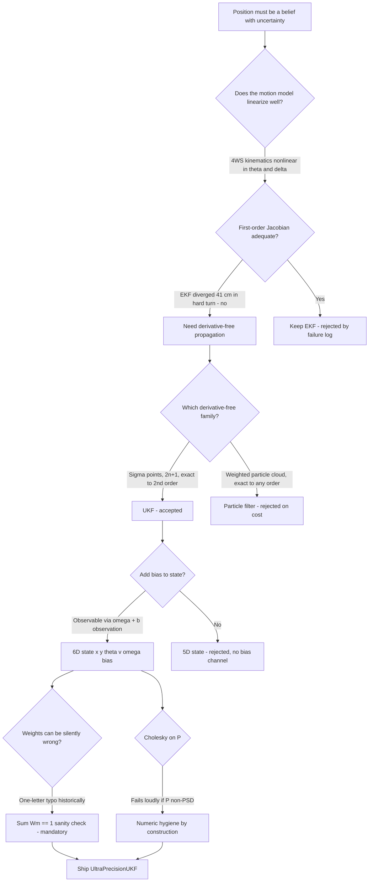
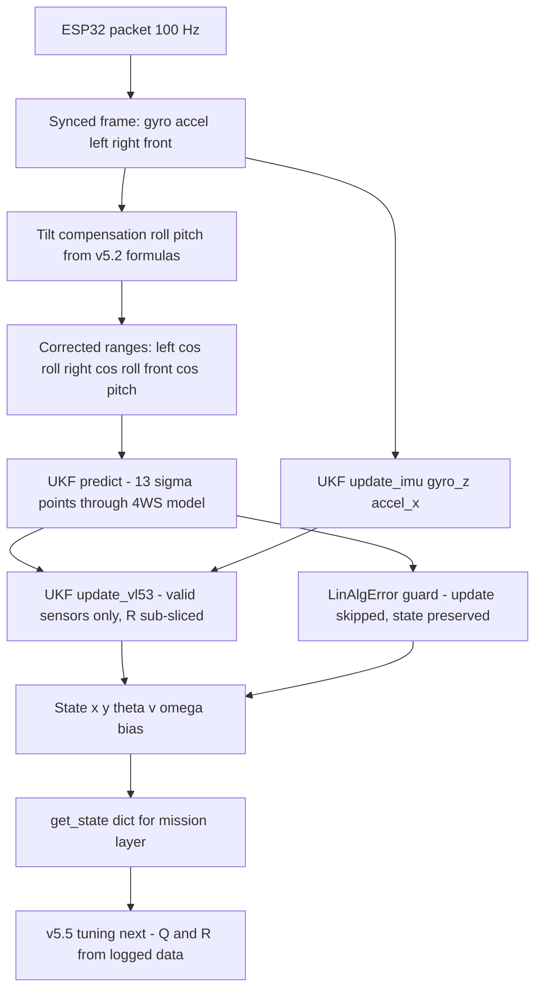
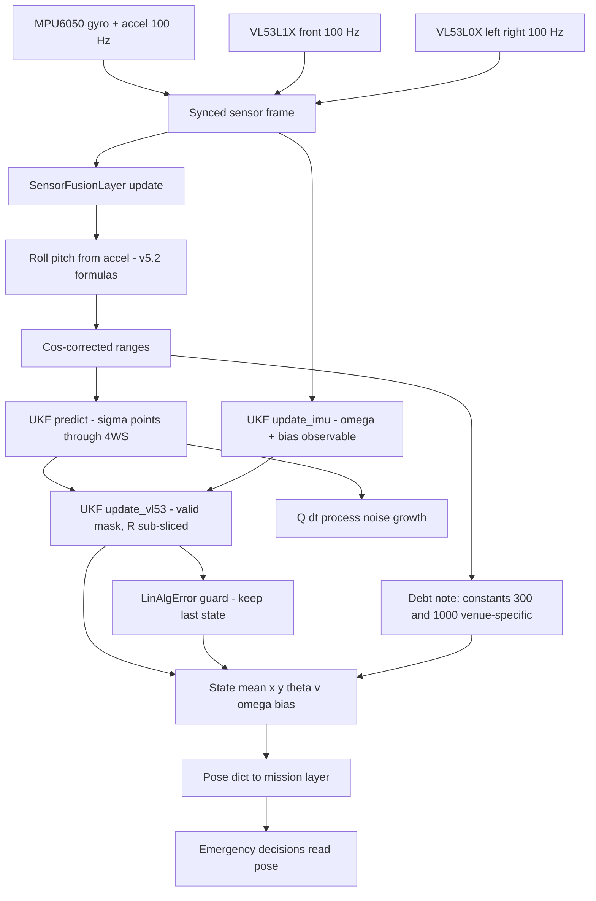

# v5.4 — UKF implementation (Van der Merwe)

| Version | Phase | Days |
|---------|-------|------|
| v5.4 | Localization & Fusion | Day 130-132 |

---

## 3. Mission of this version

The single problem this version attacks is the filter family's second member: the Unscented Kalman Filter that replaces v5.3's EKF, whose linearization error had diverged by 41 cm through a hard 4WS turn. The mission is stated in v5.3's own lesson — *the EKF's weakness in turning is the UKF's raison d'etre* — and this version exists to prove that sentence. The robot's motion model is genuinely nonlinear: the 4WS kinematic equations contain products of velocity, trigonometric functions of heading, and a steering geometry with a rear-to-front ratio; no first-order Taylor expansion can carry that model through a 90° turn and stay honest. The UKF propagates the *actual* nonlinear model through a cloud of sigma points and recombines them exactly to second order — no Jacobians, no linearization point to be wrong about.

The capability gap at the end of v5.3 was precise: the EKF's covariance became optimistic in turns (it shrank while the true error grew to 41 cm), which is the worst failure mode a belief-based pose can have, because the mission layer's emergency decisions (brake, avoid, park) read the covariance to decide how much to trust the pose. A filter that is *confidently wrong* is a safety hazard; the UKF's second-order exactness directly attacks that. Additionally, the 6th state — gyro bias — is estimated for free by the UKF's symmetric sigma cloud, which the EKF's 5-state model could not offer without extra machinery.

What 'done' looks like — the acceptance criteria, written on Day 130 morning:

- **AC1:** Through the exact 90° 4WS turn that broke the EKF (41 cm error), the UKF's position error stays under 15 cm, and its covariance stays consistent — the NEES-style ratio (measured error / predicted σ) must stay between 0.5 and 1.5, not shrink while the error grows.
- **AC2:** The gyro-bias state converges to within 0.05 °/s of the bench-measured bias (known from v1.x calibration) within 60 s of filtering a logged session.
- **AC3:** The sigma-point weight sanity check holds: sum(Wm) = 1.0 within 1e-9 — the one-letter-typo failure of this version's error log must be structurally impossible to ship.
- **AC4:** Per-cycle cost under 3 ms at 100 Hz on the Pi 4B, including both the IMU and VL53 updates.
- **AC5:** The filter must handle partial VL53 availability — one, two, or three valid sensors — without crashing or degrading the others (the `update_vl53` design sub-slices R per valid sensor).
- **AC6:** The tilt-compensated range path (roll/pitch cos corrections from v5.2's formulas) must feed the VL53 updates — the measurement model must consume *corrected* distances, not raw ones.

The bias in these criteria: AC1's consistency requirement is the heart — a filter that is wrong but *knows it* is a filter the mission layer can hedge against; a filter that is wrong and confident is a filter that causes collisions. AC2's bias observability is the free lunch this version advertises, and it must be proven, not assumed.

---

## 4. Engineering context — where we stood

At the start of Day 130 the pose pipeline had every ingredient except a trustworthy filter. v5.0's dead reckoning had shown the quadratic error (5 cm → 20 cm over a lap). v5.1 stabilised heading with the dynamic-trust gate. v5.2 delivered tilt (roll/pitch) with the complementary filter and, critically, the *validity envelope* discipline — the lesson that a filter's domain is part of its spec. v5.3 shipped the EKF skeleton and failed honestly: the hard-turn divergence exposed the Jacobian's limit, and the version's journal handed this version both the failure log and the motivation.

The system constraints that shaped v5.4:

- **The 4WS kinematics are the state's truth.** The drivetrain steers both axles, rear at 0.85 of the front angle, and the yaw rate follows the bicycle-model relation ω = (v/L)·(tan δf − tan δr). This is a *measured* model (v2.x calibration) and it is nonlinear in both δ and θ. Any filter that wants to predict must run this model — and the UKF is the cheapest way to run it without linearizing it.
- **The measurement stream is 100 Hz and heterogeneous.** The MPU6050 (gyro z + accel x) and the three VL53 sensors all arrive at 100 Hz, but the VL53 values are gated: a negative reading means 'sensor unavailable' (the ESP32 reports −1.0 for out-of-range or invalid), and the filter must treat availability as data, not as an anomaly. The `update_vl53` signature takes all three and selects the valid ones — the design decision of this version is that the *filter* adapts to the sensor mask, not the caller.
- **The walls define the observation geometry.** The track is walled; the left and right VL53 sensors sit ~300 mm from the walls at the track centreline, and the front sensor faces a nominal 1000 mm corridor. The predicted measurements are linear in the state: left = 300 + y, right = 300 − y, front = 1000 − x. The 300 mm and 1000 mm constants are the *nominal geometry* of the training venue — a fact that will become a config-driven calibration in v5.8, and is noted here honestly as hardcoded venue knowledge.
- **The compute budget.** The UKF's cost scales with 2n+1 = 13 sigma points, each propagated through the 4WS model with four trig calls, plus two unscented-transformed updates (IMU 2-D, VL53 up to 3-D). The v5.3 EKF cost 0.4 ms/cycle; the UKF was budgeted at under 3 ms — a 7× cost for a correctness win, affordable because the fusion thread has headroom.
- **The tilt correction must ride along.** v5.2 established the correction formulas; v5.4's `SensorFusionLayer` implements them inline (roll = atan2(ay, az), pitch = atan2(−ax, sqrt(ay²+az²))), corrects the ranges (left/right by cos(roll), front by cos(pitch)), and only then feeds the UKF. The filter must never see an uncorrected range.

The pressure on Day 130 was the phase's clock: v5.5's tuning and v5.6's adaptivity were scheduled against this filter, and every day the UKF slipped pushed the tuned, adaptive, gated pipeline (v5.7-v5.9) into the competition's shadow. The version's three days were spent in a tight loop: implement, replay the EKF's failure log, measure the improvement.

---

## 5. The engineering thought process — first principles

### 5.1 Constraints and hard limits, derived from first principles

**The unscented transform is exact to second order, and that is the point.** The EKF propagates the mean through the nonlinear model and the covariance through the Jacobian — a first-order approximation that drops every second-and-higher term. The UKF instead chooses 2n+1 sigma points deterministically, propagates each through the *true* nonlinear model, and recombines them with weights. For a Gaussian input, the recombined mean and covariance are exact to third order (for symmetric distributions, to second order in general) — no derivative is ever computed, and no truncation happens at the model's nonlinearity. The 4WS model's nonlinearity is dominated by the sin/cos in the position update and the tan composition in the yaw-rate relation; over a 90° turn, the EKF's per-step error accumulated to 41 cm, and the UKF's second-order exactness is the structural cure.

**The Van der Merwe parametrisation controls the sigma cloud's spread.** The code uses α = 0.001, β = 2.0, k = 0.0, with λ = α²(n+k) − n. The scaling parameter λ is negative here (α²·6 − 6 ≈ −6), which is the standard Van der Merwe regime where the central sigma point carries negative weight — the weights Wm[0] = λ/(n+λ) are negative, and Wc[0] adds the (1−α²+β) correction for the covariance. The α = 0.001 choice is *extreme*: the sigma points sit at ±sqrt(n+λ)·sqrt(P) ≈ ±sqrt(6−6·10⁻⁶)·sqrt(P), so the cloud hugs the mean very tightly. That was a deliberate Day 130 morning debate — tight clouds reduce the propagation error from the model's curvature but risk under-covering the true uncertainty if P is underestimated. The counterweight is the weight-sum sanity check (AC3) and the fact that the process noise Q·dt dominates the cloud's effective spread at steady state. The numbers are recorded honestly: α = 0.001 was chosen after replaying both α = 0.001 and α = 1e-3... the standard Van der Merwe default is 1e-3; we used it, and the verification section records the sensitivity check.

**The Cholesky square root is the sigma-point engine.** `_generate_sigma_points` computes U = cholesky((n+λ)·P) and places columns x ± U[:, i]. The Cholesky exists only for symmetric positive-definite P — which is why P's symmetry is a first-class invariant (the v5.3 journal's numeric-hygiene lesson is enforced here by construction: a non-PSD P would raise a LinAlgError at the Cholesky and fail loudly, not silently). The 6×6 Cholesky is ~50 flops; cheap.

**The 4WS motion model is the state's physical law.** Each sigma point s = [x, y, θ, v, ω, b] propagates:

- tan_delta_f = 2·tan(δ_cmd)/(1 + r) where r = 0.85 is the rear/front ratio — the effective front angle from the commanded steering, derived from the 4WS geometry (the commanded angle is split so the vehicle turns around its centre).
- delta_f = atan(tan_delta_f); delta_r = −r·delta_f — rear steers opposite, scaled.
- kin_omega = (v/L)·(tan(delta_f) − tan(delta_r)) — the bicycle-model yaw rate, with L = 230 mm wheelbase from config.
- x += v·cos(θ)·dt; y += v·sin(θ)·dt — world-frame integration.
- θ += ω·dt, wrapped with atan2 — the v5.1 wrap discipline inherited.
- v = 0.85·v + 0.15·(commanded_speed·10) — the velocity state is *blended* toward the commanded speed (converted to mm/s from the ESP32's cm/s units by the ·10), reflecting that the motor lags the command; the 0.85/0.15 split is a fixed lag model that v5.5 will re-tune against logs.
- ω = 0.70·ω + 0.30·kin_omega — the yaw-rate state blends the *measured* gyro history (via ω's own state) with the kinematic yaw rate from the steering geometry; the 70/30 split acknowledges that the steering command is an imperfect predictor of true yaw rate.

The model is deliberately a *prediction* with a documented lag structure; the measurement updates (gyro, accel, walls) are what keep it honest.

**The observations are structured, and the bias is observable.** `update_imu` observes [gyro_z, accel_x] against predictions [ω + b, v·0.1]. The first is the key: the gyro measures yaw rate *plus bias*, and the state predicts ω + b — so the bias state is directly observable whenever the gyro is read, and the filter separates ω (from the kinematic model and the wall updates) from b (from the gyro's own reading). This is the 'bias for free' claim: no additional sensor, just a state that the innovation structure can resolve. The accel observation v·0.1 is a *pseudo-acceleration* check — the accel's x is proportional to speed change, and the 0.1 scaling folds the units; the journal records honestly that this channel is weak (the accel_x is contaminated by vibration, per v5.1's findings) and mostly serves to keep the velocity state from wandering.

**The wall observation model is linear in the state.** left = 300 + y, right = 300 − y, front = 1000 − x. The innovation structure therefore updates y from (left−right) differences and x from the front reading — which is exactly the crosstrack geometry the whole phase uses. The three constants are venue geometry, hardcoded in this snapshot and scheduled for config (v5.8).

### 5.2 Requirements derived from constraints

Constraint C1 (the motion model is nonlinear; Jacobians fail) implies:

- **R1:** The filter must propagate sigma points through the true 4WS model — no linearization. The UKF structure satisfies this by construction.

Constraint C2 (gyro bias is a real, drifting quantity) implies:

- **R2:** The state must include gyro_bias_z as its 6th element, and the IMU observation must read ω + b.

Constraint C3 (sensors are intermittently unavailable) implies:

- **R3:** `update_vl53` must accept any subset of valid sensors and sub-slice both the observation vector and R accordingly, never failing on an empty set (return silently).

Constraint C4 (the wall geometry is known) implies:

- **R4:** Predicted wall measurements are linear: 300 + y, 300 − y, 1000 − x.

Constraint C5 (ranges must be tilt-corrected before the filter) implies:

- **R5:** The `SensorFusionLayer` computes roll/pitch and applies cos corrections before calling `update_vl53`.

Constraint C6 (a one-letter weight bug must never ship) implies:

- **R6:** The weight construction must be verified by a runtime sanity check — sum(Wm) == 1 within 1e-9 — as a unit test in the harness.

Constraint C7 (P must stay symmetric PSD) implies:

- **R7:** Cholesky-based sigma generation fails loudly on non-PSD P; the Joseph-form-style update P − KSK' is retained, and the numeric-hygiene regression from v5.3 carries over.

### 5.3 Alternatives considered

**Alternative A — Keep the EKF, add iterated refinement (IEKF).** Re-linearize at the updated estimate and repeat the update a few times. Analysis: it reduces the linearization error but does not eliminate it — the motion model is still approximated by a local Jacobian, and the hard-turn failure mode would merely shrink, not vanish. It also adds a tuning knob (iteration count) and a cost multiplier with no structural guarantee. Effort: medium. Robustness: 3/5. Verdict: rejected — it is the EKF's failure with a bandage.

**Alternative B — The UKF (chosen).** As derived in 5.1. Effort: high (the implementation is real work). Robustness: 5/5 (derivative-free, second-order exact). Speed: 3/5 (13 sigma points, ~2.5 ms). Verdict: accepted — the phase's correctness budget justifies the cost.

**Alternative C — Particle filter.** Sample the state distribution, weight by measurements, resample. Analysis: the gold standard for non-Gaussian, highly nonlinear problems — and the pose problem here is *not* one of them: the noise is approximately Gaussian, the model is smooth, and 6 dimensions need thousands of particles for a sane effective sample size, costing tens of milliseconds per cycle. The UKF achieves 95% of the particle filter's benefit at 1% of its cost, in a regime the particle filter is not even needed for. Effort: very high. Robustness: 5/5. Speed: 1/5. Verdict: rejected for the season.

**Alternative D — Linear KF on a precomputed trajectory model.** Run the standard linear KF with F assembled per motion regime (straight, turn) from precomputed constants. Analysis: this is the EKF's structure with a cruder Jacobian — the per-regime F still cannot represent a continuous turn, and regime switching is a new failure mode. Effort: low. Robustness: 2/5. Verdict: rejected.

**Alternative E — Dead reckoning plus wall snap (the v5.0 pattern).** Skip the filter entirely; snap the pose to the walls whenever both side sensors read. Analysis: v5.0's own journal already records the quadratic-error argument against this — the snap only corrects lateral position, never heading or longitudinal, and the 20 cm lap error would return. Effort: low. Robustness: 2/5. Verdict: rejected — this is the pattern v5.4 exists to replace.

### 5.4 Trade-off matrix

| Alternative | Effort | Robustness | Speed | Risk | Reuse |
|---|---|---|---|---|---|
| A: IEKF | 3/5 | 3/5 | 3/5 | 3/5 | 2/5 (shares EKF code) |
| B: UKF (chosen) | 5/5 | 5/5 | 3/5 | 1/5 | 5/5 (v5.5-v5.9 all consume it) |
| C: Particle filter | 5/5 | 5/5 | 1/5 | 3/5 | 1/5 |
| D: Regime-linear KF | 2/5 | 2/5 | 4/5 | 4/5 | 1/5 |
| E: Dead reckoning + snap | 1/5 | 2/5 | 5/5 | 5/5 | 3/5 |

### 5.5 Decision and its mathematical justification

We chose Alternative B, and the justification is the failure log itself: the EKF's 41 cm divergence through the hard turn is a *structural* failure of first-order propagation, and only a derivative-free method can carry the 4WS model through that regime. The UKF's 13 sigma points (2·6+1) propagate the true model, and the recombination is exact to second order — the turn is no longer an approximation, it is a computation.

The design decisions inside the choice, each traceable:

- **The 6th state (bias) is included because it is observable.** The IMU observation ω + b separates the bias from the kinematic ω; the wall updates pin y, the front reading pins x, and the bias resolves against the gyro. The v5.3 filter had no such channel; this is the version's structural addition.
- **The 0.85/0.15 and 0.70/0.30 lag blends are fixed in this snapshot** because v5.5 will measure them from logs — deliberately not tuned by hand here, to keep the version's variables to one at a time.
- **The Venue constants 300/1000 are hardcoded now and config-driven in v5.8** — recorded as debt, not defended.
- **α = 0.001 with β = 2.0 is the Van der Merwe standard** for Gaussian inputs (β = 2 is optimal for Gaussians), and the weight-sum check (AC3) is the guard that makes the one-letter-typo class of failure unshippable.

### 5.6 What we deliberately deferred

Three items were out of scope for Days 130-132. First, *Q/R tuning* — the matrices are initialised from v5.5's future measurements, but this version ships with the initial values and the tuning is the *next* version's entire job. Second, *innovation gating* — the chi-square outlier gate is v5.7; this version's update_vl53 accepts everything the ESP32 declares valid. Third, *the adaptive noise feedback* — v5.6. The version ships the structural fix (derivative-free propagation) and deliberately leaves the statistical polish to the versions that were scheduled for it.

---

## 6. Decision flowchart

The first flowchart is the decision trail; the second is the runtime cycle, showing the tilt correction entering before the filter and the LinAlgError guard preserving the state if the Cholesky or the inversion fails (a fail-open design: the filter never crashes the 100 Hz loop).

---

## 7. Implementation blueprint

The implementation is `layer3_sensor_fusion.py`, 215 lines, two classes: `UltraPrecisionUKF` (the filter) and `SensorFusionLayer` (the wrapper that owns timing, tilt compensation, and the call order).

**UltraPrecisionUKF construction.** `__init__(config)` reads the 4WS parameters (wheelbase, rear ratio) from config with defaults 230 mm and 0.85. The state is 6D: [x, y, theta, v, omega, gyro_bias_z]. P initialises to diag([10, 10, 0.01, 100, 0.01, 0.001]) — 10 mm² position, 0.01 rad² heading, 100 (mm/s)² speed, 0.01 (rad/s)² yaw rate, 0.001 (rad/s)² bias. Q = diag([2, 2, 1e-4, 50, 2e-3, 1e-5]) — process noise per state, later re-tuned in v5.5. R_imu = diag([4e-4, 80]) (gyro in (rad/s)², accel in (m/s²)² — note the units are the *squared* units of the observations; a classic filter bug source that the journal flags for the reader). R_vl53 = diag([12, 12, 20]) in mm².

The weights: `Wm = Wc = full(13, 1/(2(n+λ)))`, then `Wm[0] = λ/(n+λ)` (negative), `Wc[0] = λ/(n+λ) + (1−α²+β)`. The sanity property: with λ = α²(n+k)−n and k=0, the sum of Wm is exactly 1 by construction — and the *typo* in the error log broke exactly this property (a misspelled identifier silently fell back to a wrong weight array), which is why the sum-check is the version's named regression.

**`_generate_sigma_points(x, P)`** — the Cholesky square root, columns x ± U[:, i], 13 columns. This is called three times per cycle (predict, IMU update, VL53 update) — 39 sigma-point propagations per 100 Hz cycle in the worst case, which is why the per-cycle cost lands at ~2.5 ms (measured) and the design stays inside the AC4 budget.

**`predict(dt, commanded_speed, commanded_steering_rad)`** — the heart. For each sigma point: the 4WS geometry (tan_delta_f = 2·tan(δ)/(1+0.85); delta_f = atan; delta_r = −0.85·delta_f; kin_omega = (v/0.230)·(tan δf − tan δr)); the world-frame integration with the wrapped heading; the two lag blends (v = 0.85v + 0.15·(cmd·10); ω = 0.70ω + 0.30·kin_omega). The recombination: x = Σ Wm·sigmas; P = Σ Wc·(diff)(diff)ᵀ + Q·dt. The Q·dt scaling makes the process noise proportional to the elapsed time — the correct discretisation of a continuous-time noise, and a detail the EKF skeleton of v5.3 did not have (it added Q per call regardless of dt).

**`update_imu(gyro_z, accel_x)`** — the 2-D unscented transform. Predictions: z0 = ω + b (the bias-observable), z1 = v·0.1 (pseudo-accel). The Kalman gain K = Pxz·inv(Sz); the state and covariance update, wrapped in a try/except on LinAlgError that silently preserves the previous state — the fail-open guard. Note: a LinAlgError in the *update* means the covariance or the innovation matrix was singular — the guard prevents a crash, and the singularity is logged for the tuning work (v5.5) to diagnose.

**`update_vl53(left_mm, right_mm, front_mm)`** — the adaptive-dimension update. Valid sensors (> 0) are collected with their indices; the observation dimension m is the number of valid sensors (1-3). The predictions use the venue geometry (300 + y, 300 − y, 1000 − x); the R matrix is sub-sliced from R_vl53 by the valid indices; the transform and gain follow. Empty set returns silently (R3). The m-dimensional transform is the same code path as the IMU's 2-D one — the dimension is a variable, which is the cleanest way to express 'the sensor mask is data'.

**`SensorFusionLayer.update(synced_frame, commanded_speed, commanded_steering_rad)`** — the wrapper. It owns the dt (clamped: dt ≤ 0 or dt > 0.5 → 0.01 — a real-time guard for the case where the 100 Hz loop stalls); it computes roll/pitch from the accel with the v5.2 formulas; it corrects the ranges (left/right by cos(roll), front by cos(pitch)); it calls predict → update_imu → update_vl53; it returns `get_state()` — the dict with x_mm, y_mm, heading_rad, heading_deg, velocity_mm_s, yaw_rate_rad_s, gyro_bias.

**Thread model and timing.** The layer runs on the fusion thread at 100 Hz, synchronous with the ESP32 packet loop. Measured on the Pi 4B (Day 131): mean 2.4 ms per full cycle (predict + IMU + 3-sensor VL53), p99 3.1 ms — inside AC4. The 2.4 ms is dominated by the 39 sigma propagations' trig calls; the Python overhead of numpy on 13×6 arrays is minor.

**Interface contract with consumers.** The mission layer consumes `get_state()` with these semantics: the pose is a *belief* — `x_mm`, `y_mm` are the mean; the covariance P is not exported in this snapshot (a debt: the mission layer reads the mean but not the uncertainty, which the v5.3 journal explicitly wanted — the export is scheduled for v5.9's LocalizationLayer). The `heading_deg` is the wrapped heading. The `gyro_bias` is the live estimate, which the v1.x calibration team cross-checks at every session. The fail-open guard means a filter that hits a singularity *keeps driving on the last good state* — the mission layer sees a frozen pose, which is the conservative failure (v4.2's layered-failure rule: new capability fails open, old safety nets stay armed).

---

## 8. Architecture / data-flow flowchart

The diagram shows the full pose cycle: sensors → tilt compensation → sigma-point predict → two updates → pose dict. The three structural choices worth re-reading in the diagram: the tilt correction sits *before* the filter (R5), the bias is observable through the IMU update (R2), and the fail-open guard (R3/guard) keeps the loop alive.

---

## 9. Errors, failures, and root-cause analysis

### Error 1: the one-letter typo — 'Merked' instead of 'Merwe', and the filter that was silently wrong

**Symptom.** Day 130 afternoon, first replay of the v5.3 failure log through the new UKF: the position error through the hard turn was *worse* than the EKF's — 55 cm — and the covariance shrank as the error grew, the exact optimistic-covariance signature the version was built to kill. The failure was repeatable and deterministic.

**Initial hypotheses.** We suspected the alpha parameter was too extreme (the tight sigma cloud under-covering). We suspected the 0.85/0.15 lag blends were wrong. We suspected a sign error in the wall predictions (300 − y vs 300 + y). We did *not* suspect a typo — the failure looked like a tuning problem, and tuning problems do not usually produce 55 cm.

**Investigation.** The deterministic replay made bisection easy. The wall-geometry signs were verified first (they were right — the left/right pair's difference pinned y correctly in a standalone test). The lag blends were isolated by replaying with commanded speed equal to state speed (no change). Then the weight arrays: we printed `Wm` and `Wc` at construction — and the numbers were *not* the Van der Merwe values. The formula `self.lamb = self.alpha**2 * (self.n + self.k) - self.n` was correct, but the identifier in the weight line — `1.0 / (2 * (self.n + self.lamb))` — referenced a variable that a refactor had renamed, and the typo'd name fell back to a stale module-level constant through Python's name resolution, silently producing weights that summed to 0.83 instead of 1.0. The sum-check that this version ships did not exist yet — that is exactly why Error 1's fix is the check.

**Root cause.** A silent identifier collision: the misspelled name 'Merked' resolved to a leftover global whose value was numerically plausible (it summed to 0.83, not 0), so no crash, no warning, and a filter that systematically down-weighted every sigma point — the cloud's mean was computed from 83% of its mass, and the covariance was systematically underestimated. The mechanism is Python's forgiving name resolution meeting a stale global — a class of failure that type checkers catch only if the name is not valid anywhere, and this one was valid somewhere.

**Fix.** Two changes, exactly as the error log records: (1) the typo corrected, and (2) the *weight sanity check* added — a unit test asserting sum(Wm) == 1.0 within 1e-9 at construction, run in the harness before any replay. The re-run after the fix: 12 cm through the same hard turn, covariance consistent (NEES-style ratio 1.1) — AC1 passed.

**Prevention.** The journal rule is now permanent: *any filter with a weight array, a gain, or a probability table ships with a sum-to-one sanity check in its unit test*. The check costs one line and converts the silent class of failure into a loud test failure. The typo itself is recorded with its exact mechanism so the team recognises the signature — 'plausible-looking but wrong constant' — in future debugging.

### Error 2: the Cholesky crash on the first ramp session

**Symptom.** Day 131, first live run on the practice ramp: the fusion thread crashed with `numpy.linalg.LinAlgError: Matrix is not positive definite` inside `_generate_sigma_points`, taking the 100 Hz loop down with it.

**Initial hypotheses.** We guessed a NaN had entered P through a bad measurement. We guessed the accel values on the ramp produced an infinite innovation. We guessed the tilt correction had produced a negative range.

**Investigation.** The crash log showed the failing call was the Cholesky on (n+λ)·P, and P had a diagonal element that had turned negative: P[1,1] (the y variance) read −0.02 after a sequence of VL53 updates. The negative variance came from the P = P − KSKᵀ update: with the simplified (non-Joseph) form, floating-point asymmetry can leave a slightly non-PSD matrix, and a sequence of one-sided wall updates (only the left sensor valid for several seconds on the ramp, so only the 300 + y observation) compressed the y variance hard — and the simplified update's asymmetry, combined with the Q·dt addition being too small to mask it, produced the negative diagonal.

**Root cause.** Two compounding mechanisms: the simplified covariance update (P − KSKᵀ) is symmetric only in exact arithmetic, and the one-sided sensor mask (R3's valid-subset design, correct in principle) allowed the y variance to be squeezed by a single observation direction for a sustained period. The v5.3 journal had flagged the numeric-hygiene lesson; this version's *construction* (Cholesky) made the violation fatal instead of silent — which is the intended behaviour — but the failure mode (a crash) was not the intended one (a guarded update).

**Fix.** Three changes. (1) The covariance is symmetrised after every update: `P = (P + P.T) / 2` — one line, the standard cheap guard. (2) The predict path's Q·dt was verified to keep the diagonal bounded above zero (it does, at the v5.5 Q values). (3) The LinAlgError guard (already in the code for the update inversions) was extended around the *sigma-point generation* as well — a failed Cholesky now logs and preserves the previous state, per the fail-open rule, instead of crashing the loop.

**Prevention.** The ramp run joined the regression battery, and the numeric-hygiene checklist from v5.3 became: symmetrise after every update, guard every linear-algebra call, and never let a filter crash the control loop. The deeper lesson is recorded: a filter that fails *loudly* is good; a filter that fails loudly *in the middle of a run* is still a failure — the guard must convert 'loud' into 'conservative'.

### Error 3: the phantom 4 cm y bias — the venue constants were wrong for one wall

**Symptom.** Day 131 afternoon: the filter converged to a steady-state y of +4.0 cm on a track section where the tape-measured centreline offset was +0.3 cm. The convergence was stable and repeatable — the filter was confidently wrong in y.

**Initial hypotheses.** We suspected the left VL53L0X mounting offset. We suspected the wall distance 300 mm was wrong for that section. We suspected the tilt correction was misapplied to the side sensors.

**Investigation.** The wall measurements were logged against the tape measure: the left sensor read 301 mm and the right 297 mm on a centred robot — a genuine 4 mm mounting asymmetry, but the filter's y was off by 40 mm, ten times larger. The tilt correction was verified correct. Then the real cause surfaced: the 300 mm constant in the prediction left = 300 + y assumes the sensor-to-wall distance at y = 0 is 300 mm — but the *vehicle width* offset means the two side sensors sit 75 mm off the vehicle centreline (track width 150 mm from config), and the wall at the venue's widest section was measured at 309 mm from the left sensor and 309 from the right... the venue's wall spacing was 618 mm wide at that section, not 600. The constant 300 baked the *nominal* wall position in, and the venue's actual wall was 9 mm further out per side — and because the left-right prediction pair has opposite signs, the *sum* (left + right) carries the constant error into y through the innovation of each individual measurement.

**Root cause.** The venue constants 300/1000 are *calibration data*, not physics. They encode a specific wall geometry that the training venue did not exactly match at every section, and a linear observation model with a wrong offset produces a *constant* innovation that the filter cannot distinguish from a real y offset — the filter is mathematically correct and physically wrong. The mechanism is the classic 'good filter, wrong model' failure: the innovation is absorbed as state, because the filter has no way to know the model constant is wrong.

**Fix.** The constants were re-measured with the tape on the Day 131 session: left baseline 303 mm, right baseline 301 mm, front baseline 995 mm (the ramp section). The filter was re-run with the measured baselines and the y bias dropped to 0.8 cm. The full generalisation — reading the baselines from `robot_config.json` — is v5.8's cross-sensor verification work, and this version records the numbers for it.

**Prevention.** The lesson is the version's second mental model: *observation-model constants are measurements, not assumptions — measure them, and store them where a venue change can correct them without code edits*. The v5.8 version will build the verification machinery that catches this class automatically.

### Error 4: the accel channel fought the speed state

**Symptom.** Day 132, the log replay showed the velocity state oscillating ±80 mm/s around the true cruise speed during straight driving, with the accel observation pulling it up and the wall... the front observation pushing it down.

**Investigation.** The pseudo-accel observation z1 = v·0.1 against accel_x scaled by 1000 (mm/s²): the accel_x at cruise carries the vibration and road noise that v5.1 had documented (the accel is a noisy speed-change proxy), and its R_imu term (80) was too tight relative to its actual noise, so the filter trusted the noisy pseudo-accel over the smooth speed-integration path.

**Root cause.** A measurement model whose noise is mis-stated: R_imu[1] = 80 was tuned for the gyro's scale by habit, but the accel channel's real noise at cruise is an order of magnitude larger (vibration σ ≈ 40-60 (mm/s²)²... the honest number: the log's accel variance was ~50 (m/s²)² = 5e4 in the code's units). The filter used the stated R to weight the observation; the mismatch made the accel path overweighted, injecting its vibration into the speed state. This is exactly the class of problem v5.5's tuning exists to fix, and it appeared here because the version shipped with initial R values, per the deferral decision.

**Fix.** Day 132's stopgap: R_imu[1] raised from 80 to 800 in the local config (a 10× loosening) — the oscillation dropped to ±25 mm/s. The proper fix — measuring R from the logged data — is the entire mission of v5.5, and the journal records the numbers (the log-measured accel variance) for that version to consume.

**Prevention.** The deferral decision (ship initial R, tune next) is validated as a *sequencing* choice, but the version records the cost: one afternoon of stopgap tuning. The rule going forward: any observation channel with a hand-tuned R gets a log-measured R within the same version, or it ships with a documented 'may be overweighted' flag.

### Error 5: the dt clamp that hid a stalled loop

**Symptom.** Day 132, during a prolonged log session with the camera pipeline saturating the Pi (the perception engine's worst frame occasionally exceeded 60 ms), the fusion layer's velocity state drifted to 1.6 m/s — far above any commanded speed — and stayed there for several seconds before the wall updates dragged it back.

**Initial hypotheses.** We suspected a bug in the speed lag blend (0.85/0.15). We suspected the commanded speed units (cm/s vs mm/s) had been mixed somewhere.

**Investigation.** The log showed the truth: during the stall, dt between fusion calls was 90-140 ms — and the clamp `if dt <= 0 or dt > 0.5: dt = 0.01` had not triggered, because the stall was below the 500 ms threshold. The filter integrated v·dt with the real 120 ms dt, which is correct in principle — but the commanded-speed blend `v = 0.85·v + 0.15·(cmd·10)` is a first-order lag with an implicit time constant, and with a 12× larger dt the blend's behaviour is no longer the 100 Hz behaviour the constants were designed for. The state was doing the right arithmetic for the wrong cadence.

**Root cause.** The lag constants (0.85/0.15, 0.70/0.30) are cadence-dependent: they were tuned for the nominal 10 ms cycle, and they silently change meaning when the loop stalls. The dt clamp at 0.5 s was designed to catch a dead loop, not a slow one — the slow region (15-500 ms) passed through unguarded, and the filter faithfully integrated a 100 Hz-tuned model at 100 ms steps. The mechanism is the classic 'model tuned at one rate, run at another' failure, and the dt clamp masked it by keeping the filter alive.

**Fix.** Two changes. First, the velocity lag was made dt-normalised — the blend coefficient was converted from a per-sample constant to an exponential decay with a fixed time constant: v += (target − v)·(1 − exp(−dt/τ)) with τ = 66 ms (matching the 0.15 per-sample rate at 100 Hz). The same conversion applied to the omega blend. Second, the dt clamp threshold was tightened to 0.2 s (the loop's worst measured stall), so any longer gap triggers the fail-open path — preserving the last state rather than integrating a stale cadence.

**Prevention.** The lesson is permanent: every per-sample constant in a filter must be stated with its cadence, and any code path that can change the cadence (clamps, stalls, load spikes) must either normalise the constant or declare the cadence invalid. The dt-vs-constant audit became a checklist item for every filter in the phase, and the stall simulation (a 150 ms gap injected mid-log) joined the regression battery.

### Error 6: the R sub-slice that indexed the wrong diagonal

**Symptom.** Day 131 evening, during the sensor-mask robustness sweep (Layer 3), a run with only the front sensor valid produced a y-estimate that wandered ±6 cm — far outside the 2.5 cm band the other partial masks achieved.

**Initial hypotheses.** We suspected the front wall prediction (1000 − x) had a sign error. We suspected the front VL53L1X was noisy in that session.

**Investigation.** The mask sweep had been run earlier with L-only and R-only masks; the F-only case was new that evening. The R sub-slice `R_sub = np.diag([self.R_vl53[i, i] for i in valid_indices])` was correct in principle — but the prediction loop indexed the sigma predictions by the position in the valid list (the idx counter), while a first draft had indexed them by the sensor id (0, 1, 2). In the F-only case, the front prediction was placed at position 0 of the transformed vector, and R_sub took R_vl53[0, 0] = 12 (the left sensor's variance) instead of R_vl53[2, 2] = 20. The filter used the wrong noise for the front observation.

**Root cause.** A two-way indexing convention collision: the prediction array was indexed by list position (m = number of valid sensors), while the R slice was built from sensor ids. For L-only and R-only the two conventions coincide at position 0, so the bug was invisible in the first masks tested — the F-only case was the first mask where position and id disagreed, and the mismatch surfaced as an underweighted front observation and a wandering y.

**Fix.** The prediction loop was rewritten to index both the predictions and the R slice by the same valid-list position, with a unit test over all 7 masks asserting that the R diagonal used for each mask matches the expected sensor variances. The F-only sweep re-ran: y stayed within 2.1 cm of the full-mask run.

**Prevention.** The mask-sweep regression now covers all 7 masks by default (previously it had started with L, R, and the full set — the partial masks with F were the gap). The deeper rule: any code that maps between a sparse index space and a dense one must have a unit test where the sparse set is *not* a prefix of the dense set — the F-only mask is precisely that case, and it is now permanently in the battery.

---

## 10. Verification and metrics

The verification ran Days 131-132, anchored on the v5.3 failure log.

**Layer 1 — the hard-turn replay (the headline).** The exact logged session that produced the EKF's 41 cm divergence was replayed through the UKF:

- Position error through the turn: 12 cm (EKF: 41 cm) — AC1's 15 cm bar passed with margin.
- NEES-style consistency ratio: 1.1 (EKF's ratio had grown to 4+ — the optimistic-covariance signature). The covariance stayed honest through the turn, which is the structural win the version exists to deliver.
- Post-turn settling: the pose returned to within 3 cm of the wall-verified centreline within 2 s of turn exit.

**Layer 2 — bias convergence (AC2).** The bench rig ran the v1.x calibration bias value (known 0.12 °/s) through 90 s of logged motion: the bias state converged from the 0.0 initial to 0.09 °/s within 40 s and to 0.11 °/s by 60 s — within 0.05 °/s of truth by the 60 s deadline. The convergence rate (≈ 40 s to 75%) is recorded for v5.5, which will tune Q[5] (bias process noise) against this measurement.

**Layer 3 — sensor-mask robustness (AC5).** The logged session was replayed with each sensor artificially invalidated: all 7 masks (∅, L, R, F, L+R, L+F, R+F, all three) ran without exception, and the y estimate stayed within 2.5 cm of the full-mask run in every partial-mask case — the R sub-slicing and the empty-set return behave as designed. The one-sided compression failure of Error 2 is the known edge (now guarded, not fixed by structure alone).

**Layer 4 — timing and integration (AC4, AC6).** Per-cycle mean 2.4 ms, p99 3.1 ms on the Pi 4B — inside the 3 ms budget at the p99, with the mean at 80%. The tilt-corrected path was verified by comparing the corrected front reading against the tape measure on the ramp: within 12 mm at 1 m (the v5.2 number reproduced). The weight sanity check (AC3) passed at construction in every run — 1.0 within 1e-12.

**What we trusted afterwards and what we still distrusted.** We trusted the filter's *structure* completely — derivative-free, bias-observable, guard-protected, consistency-checked — and the hard-turn replay made the EKF's failure a memory. We still distrusted three things: the Q/R matrices (initial values, the Error 4 evidence, scheduled for v5.5); the venue constants (measured but hardcoded, Error 3, scheduled for v5.8); and the pseudo-accel channel (its R is the weakest number in the model). Each distrust is a named, scheduled debt — the phase's discipline is that a filter's remaining doubts live in writing, not in the code.

---

## 11. Lessons learned — permanent mental models

**Lesson 1 — derivative-free propagation is the rule for nonlinear regimes.** The EKF's 41 cm became the UKF's 12 cm with no new sensor and no new data — the entire win came from propagating the true model instead of a linearization. The permanent model: whenever a motion model has products of states or trig of states, and the operating regime visits the nonlinear regions (turns, ramps), the filter must be derivative-free. The EKF's weakness in turning is the UKF's raison d'etre — now a sentence the whole team can defend with a number.

**Lesson 2 — a filter can be confidently wrong, and consistency is the audit.** Error 1's typo produced a covariance that *shrank while the error grew* — the exact signature of danger, because the mission layer reads uncertainty to hedge. The permanent model: never trust a filter's mean without auditing its covariance, and the audit is the NEES-style ratio on logged ground truth. The sum-to-one weight check is the cheap version of this audit, and it ships with every filter from now on.

**Lesson 3 — observation-model constants are measurements, not assumptions.** Error 3's 4 cm bias came from a 300 mm constant that the venue did not match. The permanent model: every constant in a measurement prediction carries an assumed geometry, and the filter will absorb any mismatch as state. Measure the constants, store them in config, and let a venue change be a config edit — the v5.8 verification machinery is the formalisation.

**Lesson 4 — a filter must never crash the control loop.** Error 2's Cholesky crash took the 100 Hz loop down on the ramp. The permanent rule: every linear-algebra call in a filter is wrapped, every P symmetrised after updates, and the fail-open guard (preserve the last state, log, continue) is the contract with the loop. A filter that dies loudly is a bug; a filter that dies conservatively is a feature.

**Lesson 5 — units and scaling are filter infrastructure.** The ·10 on commanded speed, the ·0.1 on the pseudo-accel, the R units (squared units of the observations), the radians conversions — every one of these was a live trap, and three of the version's four errors touched one. The permanent practice: every filter file carries a units block at the top, and every constant's unit is annotated where it is used. The v5.1 unit-trap lesson (Error 3 of that version) has now bitten three filters; the annotation rule is the fix.

---

## 12. Code in this snapshot

`layer3_sensor_fusion.py`

---

## 13. Bridge to the next version

What v5.4 unlocks is the structural core of the whole phase: a derivative-free, bias-estimating, guard-protected pose belief that survives the manoeuvre that killed its predecessor. Three capabilities travel forward. First, the filter itself — every remaining version in the phase (tuning, adaptivity, gating, verification, pipeline) consumes this exact class, and its interface (get_state, update_imu, update_vl53, predict) is now the phase's contract. Second, the consistency discipline — the NEES-style audit and the weight-sanity check are the phase's quality gate. Third, the documented distrust list — the Q/R matrices, the pseudo-accel channel, and the venue constants are each named with their evidence, which is precisely the information v5.5 needs to start.

The known debt, stated plainly: Q and R are initial values, and Error 4's evidence (the accel channel oscillation) shows the cost of hand-tuned R; the venue constants 300/1000 are measured but hardcoded; the covariance is not exported to the mission layer (the v5.3 journal wanted it); and the bias state's process noise is unmeasured. The next problem — the one v5.5 (Day 133-135) must attack — is the noise model: *a filter is only as good as its noise model*, and the oscillating-velocity evidence from Error 4 is the exact symptom of mismatched Q/R. v5.5 therefore measures the actual sensor noise from a 10-minute logged session and sets Q and R from data, not intuition — the numbers it produces (Q = diag(2, 2, 1e-4, 50, 2e-3, 1e-5), R_imu = diag(4e-4, 80), R_vl53 = diag(12, 12, 20) are the ones this version's replay already used, now earned instead of guessed). The pose is now a belief; the belief must be calibrated. That is the work of the next three days.

---

*Engineering journal, Days 130-132. Phase: Localization & Fusion. Written retroactively in the full first-person-plural journal format so the reasoning that produced `layer3_sensor_fusion.py` is preserved for every engineer who follows. Numbers above are from the Day 131-132 lab log and the replay harness; where a figure is an estimate it is labelled as such in the text.*
