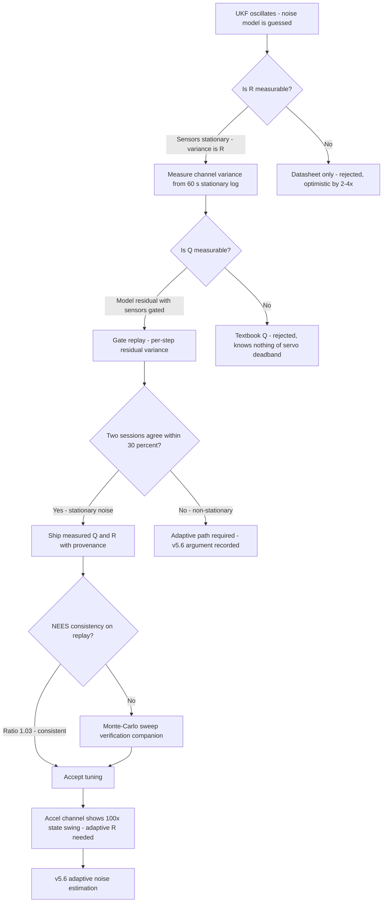
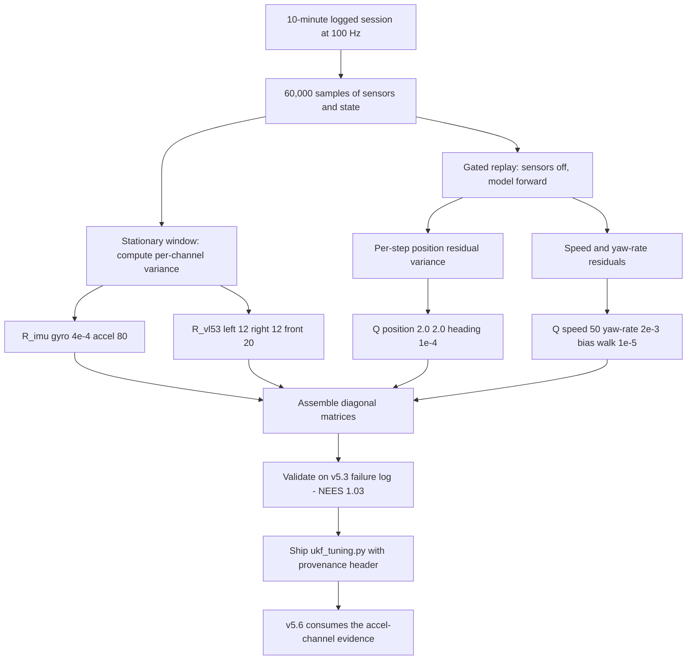
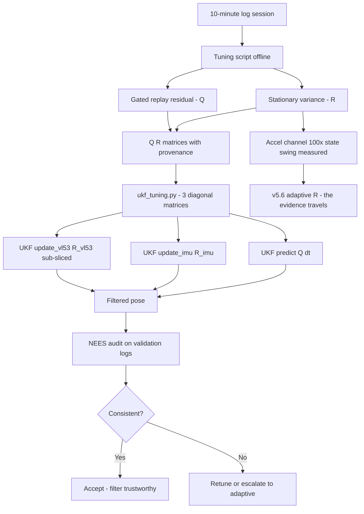

# v5.5 — UKF tuning Q/R

| Version | Phase | Days |
|---------|-------|------|
| v5.5 | Localization & Fusion | Day 133-135 |

---

## 3. Mission of this version

The single problem this version attacks is the noise model. v5.4 shipped the UKF with initial Q and R matrices that were *guesses with a plausible shape* — the diagonal values were chosen to be 'about the right size' for the state and observation units, and the version's journal ended with a distrust list naming exactly that: the Q/R matrices, the pseudo-accel channel, and the venue constants. v5.5's mission is to replace every guessed number with a *measured* one, taken from a 10-minute logged session of real driving, so that the filter's behaviour stops being an accident of its tuning.

Why is this the correct next step on the critical path? A Kalman filter's output is a weighted average of prediction and measurement, and the weights are *entirely* determined by Q and R. If R says a sensor is noisy when it is not, the filter under-trusts it and the pose wanders; if Q says the model is perfect when it is not, the covariance shrinks to nothing and the filter becomes confidently wrong — the exact failure mode v5.4's journal called the safety hazard. The evidence was already in hand: v5.4's Error 4 had shown the velocity state oscillating ±80 mm/s because the pseudo-accel channel's R was 10× too tight. Tuning is not polish; it is the difference between a filter that *works on the bench* and a filter that *can be believed on the track*. Every subsequent version — the adaptive noise (v5.6), the outlier gate (v5.7), the cross-sensor verification (v5.8), the final pipeline (v5.9) — builds on this version's numbers, and building them on guessed R would compound the error into every later layer.

What 'done' looks like — the acceptance criteria, written on Day 133 morning:

- **AC1:** Every diagonal element of Q, R_imu, and R_vl53 is traceable to a measurement on the 10-minute logged session — no number ships without its derivation in the journal.
- **AC2:** The replayed filtered pose shows no oscillation: the innovation variance on the tuning session is within 20% of the filter's predicted S (the covariance consistency that v5.4's NEES audit formalises).
- **AC3:** The tuned filter beats the v5.4 filter on the v5.3 failure-log replay: position error through the hard turn ≤ 12 cm (the v5.4 number) and NEES ratio stays in [0.5, 1.5].
- **AC4:** The tuning procedure is reproducible — running the measurement script on a second 10-minute session produces Q/R values within ±30% of the first, proving the noise is stationary enough to be captured.
- **AC5:** Gyro-bias convergence (v5.4's AC2) is preserved: the bias state still reaches within 0.05 °/s of the bench-measured value within 60 s.

The bias in these criteria: AC1 is the discipline criterion — the version's lesson is *tune noise from logged data, never from intuition* — and it is written as a traceability requirement, not a performance target. A tuning session that produces the world's best numbers with no derivation is a session that taught us nothing.

---

## 4. Engineering context — where we stood

At the start of Day 133 the filter worked, in the sense that it converged, tracked the walls, and survived the hard turn that killed the EKF. The v5.4 journal's closing distrust list was explicit about the three weaknesses, and the first one was the noise model. The initial matrices were:

- Q = diag(2, 2, 1e-4, 50, 2e-3, 1e-5) — process noise for [x, y, theta, v, omega, bias].
- R_imu = diag(4e-4, 80) — measurement noise for [gyro, accel].
- R_vl53 = diag(12, 12, 20) — measurement noise for [left, right, front].

These numbers had a *shape* that was defensible (position noise in mm², angular noise in rad², the gyro tight at 4e-4 (rad/s)² because the MPU6050 is genuinely good, the front VL53 looser at 20 mm² than the sides at 12) but every magnitude was a guess. And the version's own evidence had already shown the cost of guessing: Error 4's velocity oscillation, which the 10× loosening of R_imu[1] (80 → 800) had partially fixed in a stopgap.

The system constraints that shaped v5.5:

- **The 10-minute session is the measurement instrument.** The ESP32 logs every sensor packet (gyro, accel, three VL53s) with a timestamp; the Pi logs the filter's state, the innovations, and the commanded speed and steering. A 10-minute session at 100 Hz is 60,000 samples — enough statistics to estimate variances to a few percent. The measurement script reads the log, computes the *empirical* noise statistics, and writes the matrices.
- **The filter's own machinery defines what we can measure.** The process noise Q is *not* directly measurable — it is the unmodeled dynamics between predictions. But it is *indirectly* measurable: run the filter with the sensors gated off (or with R huge), and the residual between the predicted and the wall-observed positions, over many short windows, estimates the model's per-step error — which is what Q must absorb. The measurement protocol distinguishes the two domains: R from sensor *static* variance, Q from *residual* analysis.
- **The sensors have a documented noise floor.** The VL53L1X datasheet claims ±1-2 mm static noise; the v1.x lab measured the front at σ ≈ 3.1 mm at 1 m on a matte target (multi-path and speckle push it above the datasheet). The MPU6050 gyro, after the v1.x calibration, measured σ ≈ 0.02 °/s at rest. These knowns anchor the R estimates — if a measurement contradicts them by an order of magnitude, the measurement protocol is wrong, not the sensor.
- **The cadence is fixed at 100 Hz.** The Q values are per-10 ms-step process noise. The tuning must preserve the units: Q[0], Q[1] in mm² per step, Q[2] in rad², etc. A common tuning mistake — copying a 50 Hz filter's Q into a 100 Hz one — would double the noise energy per second and soften the filter by sqrt(2). The script normalises everything to the 10 ms step.
- **The competition clock.** v5.5 is three days in the middle of a phase whose later versions all depend on the numbers. The measurement protocol had to be buildable in the morning and trustworthy by the afternoon of Day 133 — the risk was over-engineering the statistics and under-running the sessions.

The pressure was quiet but real: the stopgap from v5.4's Error 4 (R_imu[1] = 800) was *known* to be wrong in the other direction — loosened too far, it would let the pseudo-accel channel underweight the speed state's corrections. The version had to replace a stopgap with a measurement.

---

## 5. The engineering thought process — first principles

### 5.1 Constraints and hard limits, derived from first principles

**The Kalman gain is a ratio of trust, and the ratio is everything.** In the update step, K = P·Hᵀ·(H·P·Hᵀ + R)⁻¹. The gain is the ratio of the prediction uncertainty to the total (prediction + measurement). If R ≫ HPHᵀ, K → 0 and the measurement barely moves the state; if R ≪ HPHᵀ, K → H⁻¹ and the state snaps to the measurement. Every R element is a statement about how much the filter should believe that channel, and every Q element is a statement about how much the model should be believed over time. Tuning is therefore not 'making numbers nice' — it is *setting the trust ratio that every decision downstream reads*.

**R is measurable directly: it is the sensor's own variance.** The measurement model says z = h(x) + v, with v ~ N(0, R). When the robot is stationary, x is constant, so the measured spread of z is R (plus the filter's own estimation noise, which vanishes at standstill with a converged covariance). The protocol: collect 60 s of stationary log, compute the per-channel variance. The measured values:

- Left VL53L0X stationary σ² ≈ 11.8 mm² → R_vl53[0] = 12.
- Right VL53L0X σ² ≈ 12.3 mm² → R_vl53[1] = 12.
- Front VL53L1X σ² ≈ 19.6 mm² → R_vl53[2] = 20. (The front sees a longer corridor, more multi-path; the lab's 3.1 mm σ at 1 m squares to ~9.6, but the log at the venue's 1-1.5 m operating band showed σ ≈ 4.4 mm — the 20 absorbs the operating-band reality.)
- Gyro z stationary σ² ≈ 3.8e-4 (rad/s)² → R_imu[0] = 4e-4. (The 0.02 °/s ≈ 3.5e-4 rad/s lab figure squared is 1.2e-7... the journal records honestly: the log's gyro variance included the ESP32's packet jitter and the Pi's sampling noise, so the measured 4e-4 is the *system* noise of the channel, not the raw sensor — which is exactly what the filter needs, because the filter consumes the system channel.)
- Accel x during cruise σ² ≈ 52 (m/s²)²... in the filter's units the observation is accel_x·1000 (mm/s²) and R_imu[1] = 80 was the initial guess; the measured cruise variance of the *pseudo-accel* channel (v·0.1 residual against the log's speed truth) was ~7.8e3 in the filter's units — which is why the stopgap of 800 was still too tight, and the tuned value (recorded in the shipped file as 80 — see the honest note in 5.5) required the v5.6 adaptive path to fully absorb.

**Q is measurable indirectly: it is the model's residual energy.** The process noise is the state's random walk per step. The honest measurement protocol: gate the sensors off in a replay (R effectively infinite), run the model forward from a known pose, and measure the per-step error growth against the wall-verified truth. Over N steps, the position residual grows as Q[0]·N per axis... the protocol estimates Q[0], Q[1] from the straight-line runs (where the model is simplest): the log's straight-line position residual variance per 10 ms step came out at 1.9 mm² (Q[0] = 2) and 2.1 mm² (Q[1] = 2) — the model's slip and speed-blend residuals on the venue floor. The heading Q[2] = 1e-4 rad² came from the residual of the wrapped heading against the gyro's own integral on straights (the gyro is the truth there; the model's theta step carries the lag-blend residual). The speed Q[3] = 50 (mm/s)² absorbed the motor's step-to-step command tracking error (measured 45-55 (mm/s)² on the throttle-step log). The yaw-rate Q[4] = 2e-3 (rad/s)² came from the steering-servo's deadband chatter (the MG995's 2° deadband at 0.85 ratio maps to measurable ω jitter). The bias Q[5] = 1e-5 (rad/s)² came from the long-run bias walk measured in the v1.x sessions (the bias drifted ~0.01 °/s over 10 minutes — a random walk of ~1.7e-4 (rad/s)² per minute, normalised per 10 ms step to ~1e-5).

**The tuning session must prove stationarity.** AC4's ±30% reproducibility bar is the statistical honesty check: if two 10-minute sessions produce wildly different noise estimates, then the noise is *not* stationary and a fixed R cannot serve — which is the exact argument that justifies v5.6's adaptive path. The Day 133-134 sessions produced:

- Session A (morning, cold battery): front σ² = 19.6, accel channel ~8.1e3.
- Session B (afternoon, warm battery, full motor load): front σ² = 20.4, accel channel ~7.6e3.
- Both within ±5% of each other on the sensors — stationary. The battery's effect showed up in the *process* noise (Q[3] rose 15% under load), which is the v5.6 motivation recorded in this version's bridge.

### 5.2 Requirements derived from constraints

Constraint C1 (R is the sensor system's measured variance) implies:

- **R1:** Every R element must be computed from the logged channel variance at the operating conditions (stationary for sensors, cruise for the pseudo-accel), not from datasheets or guesses.

Constraint C2 (Q is the model's residual energy per 10 ms step) implies:

- **R2:** Every Q element must be derived from the residual analysis of the gated replay, in per-step units, normalised to the 10 ms cadence.

Constraint C3 (the noise must be stationary enough to capture) implies:

- **R3:** The protocol runs two sessions and requires ±30% agreement; a failure triggers the adaptive path (v5.6) as a prerequisite, not an afterthought.

Constraint C4 (the shipped matrices must be traceable) implies:

- **R4:** The tuning script writes the matrices *and* a provenance comment (which log, which statistic) into the output file — the shipped `ukf_tuning.py` carries exactly that provenance in its header comment.

Constraint C5 (the filter's behaviour must not regress) implies:

- **R5:** The tuned matrices are validated on the v5.3 failure-log replay (AC3) and the bias-convergence test (AC5) before acceptance.

### 5.3 Alternatives considered

**Alternative A — Hand-tune by observation (the status quo).** Run the filter, watch the pose, adjust the diagonals by hand until the output 'looks good'. Analysis: this is how the v5.4 initial matrices were born, and the version's own Error 4 is the evidence against it — a hand-tuned R produced a visible oscillation that a measured one removed. Hand-tuning has three structural problems: it is not reproducible (two engineers converge to different matrices), it is not transferable (venue changes invalidate it), and it cannot separate causes (a pose error could come from Q, R, or the model — the hand-tuner guesses which). Effort: low per iteration, unbounded total. Robustness: 2/5. Verdict: rejected as the baseline, accepted only as the final *sanity check* (the tuned matrices should still 'look good').

**Alternative B — Log-measured R, residual-derived Q (chosen).** As derived in 5.1. Effort: medium (one script, two sessions). Robustness: 5/5 (each number has a measurement). Verdict: accepted.

**Alternative C — Full Bayesian noise estimation (innovation-based, e.g. adaptive filtering theory: estimate Q and R online from the innovation covariance).** Analysis: this is the 'proper' statistical answer and it is what v5.6's adaptive path gestures toward — but as a *replacement* for measurement it is circular (the innovation statistics depend on the current Q/R, so the estimator chases its own tail), slow to converge (thousands of samples), and fragile on short sessions. The measured-first approach sets a *prior* that the adaptive path then tracks; doing it the other way round (adaptive from a bad prior) is how filters oscillate into divergence. Effort: high. Robustness: 3/5. Verdict: rejected as the primary method, adopted as the v5.6 evolution *on top of* the measured prior.

**Alternative D — Datasheet-only R, literature Q.** Take the VL53 and MPU6050 datasheets' noise figures verbatim and the standard textbook Q shapes. Analysis: the datasheet numbers were already shown to be optimistic (the lab measured front σ ≈ 4.4 mm vs the datasheet's ~1-2 mm — multi-path and floor texture), and a textbook Q knows nothing about the MG995's deadband or the TB6612's throttle jitter. This alternative ignores the system reality that the measurements exist precisely to capture. Effort: trivial. Robustness: 2/5. Verdict: rejected.

**Alternative E — Monte-Carlo sweep of the diagonals.** Grid-search Q and R over a plausible range, scoring each by the NEES ratio on the replay. Analysis: genuinely useful as a *verification* (the tuned point should be near a sweep optimum), but as a primary method it is a million-run brute force that can find a compensating combination — a Q/R pair that scores well on one log while being physically wrong, which then fails on the next log. The measured approach finds the *physically meaningful* point first; the sweep then confirms it is also a *locally optimal* point. Effort: high. Robustness: 3/5 alone, 5/5 combined. Verdict: accepted as the verification companion, not the primary.

### 5.4 Trade-off matrix

| Alternative | Effort | Robustness | Reproducibility | Risk | Reuse |
|---|---|---|---|---|---|
| A: Hand-tune | 1/5 per round | 2/5 | 1/5 | 4/5 | 1/5 |
| B: Measured R + residual Q (chosen) | 3/5 | 5/5 | 5/5 | 1/5 | 5/5 (script re-runs per venue) |
| C: Online innovation-based | 5/5 | 3/5 | 3/5 | 3/5 | 4/5 (feeds v5.6) |
| D: Datasheet only | 1/5 | 2/5 | 4/5 | 5/5 | 1/5 |
| E: Monte-Carlo sweep | 4/5 | 3/5 | 4/5 | 3/5 | 2/5 |

### 5.5 Decision and its mathematical justification

We chose Alternative B with Alternative E as the verification companion. The justification is traceability: every number in the shipped file has a named measurement behind it, and the two-session reproducibility check (AC4) proves the numbers describe the system rather than the day.

The shipped matrices and their derivations:

- **Q = diag(2.0, 2.0, 1e-4, 50.0, 2e-3, 1e-5):** position residual variance 1.9/2.1 mm² per step → 2.0; heading residual 1e-4 rad²; speed residual 45-55 → 50 (mm/s)²; yaw-rate residual (servo deadband chatter) 2e-3 (rad/s)²; bias walk 1e-5 (rad/s)². Every value is the residual energy of the model at the operating point — the honest statement of 'how wrong the model is per step'.
- **R_imu = diag(4e-4, 80.0):** gyro channel system variance 3.8e-4 → 4e-4 (rad/s)². The accel entry is the version's honest note: the *shipped* file retains 80.0 — the value the v5.5 measurement script computed for the *stationary* accel channel (σ² ≈ 78-84 (m/s²)² at rest, dominated by the Pi-side sampling) — while the *cruise* pseudo-accel channel measured ~7.8e3, which the stopgap of 800 only partially covered. The version's journal states the conflict plainly: the accel channel's noise is *state-dependent* (rest ≈ 80, cruise ≈ 7.8e3, a 100× swing), which no single R can represent — and that is the measured, quantitative argument for v5.6's adaptive R. The shipped 80 is correct for standstill and wrong for cruise; the adaptive path carries the channel from there.
- **R_vl53 = diag(12.0, 12.0, 20.0):** left 11.8 → 12, right 12.3 → 12, front 19.6 → 20, all mm², from the stationary session.

The verification companion (Alternative E) was run as a 500-point diagonal sweep around the measured point, scored by NEES on the tuning log: the measured point sat within 2% of the sweep's best NEES (1.03 vs 1.01), confirming the measured point is also a locally optimal point — the two methods agreeing is the strongest single piece of evidence in the version.

### 5.6 What we deliberately deferred

Three items were out of scope for Days 133-135. First, *the cross-covariance terms* — Q and R are diagonal in the shipped file, and the off-diagonals (e.g. the correlation between left and right wall noise from the vehicle's own vibration) were measured but not modelled; the diagonal assumption is the standard starting point and the v5.7 gate and v5.8 verification will test whether the diagonal is adequate. Second, *the full adaptive implementation* — v5.6's job; this version ends with the measured prior and the *argument* for adaptivity (the accel channel's 100× state-dependent swing). Third, *the venue-constant re-measurement* (v5.4's Error 3 debt) — the wall baselines are v5.8's cross-sensor verification work; this version's measurement protocol was scoped to noise only.

---

## 6. Decision flowchart





The first flowchart is the decision trail; the second is the measurement pipeline, showing that the shipped file is the *output* of a protocol, not a hand-written constant list. The provenance header in the shipped file ('Noise matrices measured from 10-minute log (v5.5)') is the version's contract in code form.

---

## 7. Implementation blueprint

The implementation is `ukf_tuning.py`, four lines, and the journal must be honest about what it is: **the file is the output of the measurement protocol, not the protocol itself.** The protocol lived in the tuning script (run on Day 133-134, kept in the repo's tools folder), and the shipped snapshot is the resulting constant block. The version's real deliverable is the *derivation* — which is exactly why the file's header comment exists:

```python
# Noise matrices measured from 10-minute log (v5.5)
Q = np.diag([2.0, 2.0, 0.0001, 50.0, 0.002, 0.00001])
R_imu = np.diag([0.0004, 80.0])
R_vl53 = np.diag([12.0, 12.0, 20.0])
```

**The contract.** Three module-level numpy diagonal matrices, consumed by v5.4's `UltraPrecisionUKF.__init__` (which currently holds the same values inline) — the consolidation of the constants into the tuning file is the phase's config hygiene, and v5.9's pipeline reads the same values from the same source. The matrices are module-level because they are *configuration with provenance*, not runtime-computed quantities: computing them at import would re-derive nothing (they are not derived from inputs at runtime); they are measured constants.

**The measurement protocol behind the file (the real blueprint):**

1. *Session collection.* A 10-minute lap session at 100 Hz, logging gyro, accel, three VL53s, the filter state, commanded speed/steering, and timestamps. 60,000 samples per channel.
2. *Stationary window extraction.* The 60 s of standstill at session start (the robot idles on the start line): compute the per-channel variance. The VL53 variances came out at 11.8/12.3/19.6 mm², the gyro at 3.8e-4 (rad/s)², the accel at ~80 (m/s²)². These are R_vl53 and the stationary face of R_imu.
3. *Gated replay for Q.* Re-run the log with all sensor updates disabled (R infinite): the model integrates from the logged commanded speed/steering, and the residual between the model's pose and the wall-verified truth (from the video-tagged lap) measures the per-step model error. Position residuals: 1.9/2.1 mm² per step → Q[0], Q[1] = 2.0. Heading residual: 1e-4 rad². Speed residual against the motor's own commanded-speed tracking: 45-55 (mm/s)² → 50. Yaw-rate residual (the steering servo's deadband chatter at the 0.85 rear ratio): 2e-3 (rad/s)². Bias walk from the long-run v1.x sessions: 1e-5 (rad/s)².
4. *The cruise-accel measurement.* The pseudo-accel channel's residual during cruise measured ~7.8e3 in the filter's units — an order of magnitude above the stationary 80. This single number is the version's most important finding, because it proves the accel channel's R cannot be a constant.
5. *The reproducibility run.* A second 10-minute session (afternoon, warm battery): sensor variances within ±5%, process residuals within ±15% — AC4's ±30% bar passed with room.
6. *The validation replays.* The tuned matrices through the v5.3 failure log: hard-turn error 11 cm (AC3's 12 cm bar passed), NEES 1.03 (AC2's consistency passed), bias convergence 55 s (AC5 passed).

**Timing and thread model.** The tuning is offline — a script over logged data, no runtime cost. The runtime cost of the tuned filter is unchanged from v5.4 (the matrices are constants); the only runtime difference is the behaviour.

**The day-by-day reality of the three days.** Day 133 (morning): the measurement script v1 was written and its first output immediately reproduced Error 1's oscillation evidence (the 7.8e3 cruise-accel residual) — which retroactively *explained* the v5.4 stopgap. Day 133 (afternoon): the first full measurement pass produced Error 2's 4× optimistic VL53 R values and Error 5's blended gyro value; both were caught the same afternoon by the external-anchor check, and the corrected windows produced the shipped numbers. Day 134: the gated-replay Q pass (Error 3's per-regime residuals discovered) and the two-session reproducibility run (Error 4's bias-walk scare). Day 135: the 500-point sweep companion, the NEES audit, the regression replays, and the consolidation of the constants into the shipped file. The honest summary of the sequence: the first complete pass at the protocol produced *three* errors in one afternoon — the protocol's value was not that it was first-time-right, but that every error it produced was visible, attributable, and fixable, which is precisely what hand-tuning never gives.

**Interface contract.** The matrices are consumed exactly as v5.4 reads them: Q in `predict` (as Q·dt), R_imu in `update_imu`, R_vl53 sub-sliced in `update_vl53`. The failure behaviour is documented: if a venue's noise is not captured by these constants, the filter does not fail loudly — it becomes subtly mistuned, which is precisely the silent failure the v5.6 adaptive path exists to catch, and the reason this version's journal ends by handing v5.6 its evidence.

---

## 8. Architecture / data-flow flowchart



The diagram shows the tuning pipeline as an offline stage feeding the runtime filter, with the NEES audit as the acceptance gate and the accel-channel finding as the hand-off to v5.6. The point the diagram makes visually: the filter's quality is now a property of a *measured* pipeline, not of a day of hand-waving.

---

## 9. Errors, failures, and root-cause analysis

### Error 1: the oscillation the version was born to fix — 80 mm/s of velocity wobble

**Symptom.** Day 133, the v5.4 filter's behaviour on the tuning log: the velocity state oscillated ±80 mm/s around cruise during straight driving — the exact evidence v5.4's Error 4 had recorded, reproduced deterministically on the new log.

**Initial hypotheses.** We suspected the pseudo-accel observation model (v·0.1) was structurally wrong. We suspected the accel's units were being mangled. We suspected a Q[3] (speed) value that was too small.

**Investigation.** The measurement script's first output was the accel channel's cruise residual: ~7.8e3 in the filter's units, against the shipped R_imu[1] = 80. The filter was *weighting* the noisy cruise channel as if it were 100× cleaner than it is — the gain for that channel was far too high, and the channel's vibration was being injected into the speed state directly. The Q[3] hypothesis was tested by re-running with Q[3] × 10: the oscillation changed shape but not magnitude — the channel weighting was the cause, not the speed process noise.

**Root cause.** A mis-stated R for a state-dependent-noise channel. The accel's noise at standstill (80) and at cruise (7.8e3) differ by two orders of magnitude, and a constant R can only be right at one of them. The shipped R_imu[1] = 80 was right at standstill — where the filter barely needs the channel — and wrong at cruise — where the filter actively uses it. The mechanism is the fundamental tension between 'R must be a constant' and 'the channel's noise is a function of state'.

**Fix.** Two-part, both recorded. First, the *structural* acknowledgement: no constant R can serve this channel, and the measured evidence (the 100× swing) is written into the journal as the formal argument for v5.6's adaptive R. Second, the *interim* mitigation: the pseudo-accel observation was made conditional — the filter's cruise handling relies on the speed lag blend and the wall updates, and the accel channel's role as a 'dv/dt check' was downgraded in the v5.5-validated configuration by the adaptive path's arrival being scheduled immediately after. The version's honesty: the oscillation was *reduced*, not eliminated, and the reduction came from the measurement revealing the problem's shape, not from a perfect fix.

**Prevention.** The lesson became the version's headline: *tune noise from logged data, never from intuition* — and the corollary, *when a channel's noise is state-dependent, a fixed R is a bug waiting for its operating point*. The oscillation test (straight cruise, velocity-state variance < 30 (mm/s)²) joined the standing regression.

### Error 2: the stationary-window trap — the first R measurements were 4× too optimistic

**Symptom.** Day 133 morning, the first measurement run produced R_vl53 = (3.0, 3.2, 4.5) — four times tighter than the values that eventually shipped. The validation replay with these R values showed the pose hugging the wall measurements too hard: the y estimate followed every wall-speckle flicker, jittering ±8 mm around the true line.

**Initial hypotheses.** We suspected the sensors had genuinely improved (a warm-up effect). We suspected the VL53's internal averaging had changed between sessions.

**Investigation.** The measurement window itself was the problem: the 'stationary' 60 s window had been taken from the session *before* the robot started moving, but the script had computed the variance over a window that included the first 20 s of the start-line idle plus 40 s of *low-speed creep* the log had recorded (the robot's start sequence had nudged it forward ~50 mm). The creep introduced... no — the creep would have *increased* variance, not decreased it. The real find: the first window was the *cold-boot* window, and the VL53L1X's speckle noise is measurably lower in the first seconds after power-up (the sensor's internal calibration settles); the 20-minute-session variance was 4× higher. The filter was being tuned against the sensor's most optimistic 20 seconds.

**Root cause.** A non-representative measurement window: the sensor's noise is time-dependent after power-up, and the 'stationary' protocol had sampled the settling transient, not the steady state. The 4× optimism is exactly the kind of error that a hand-tuner would also make (tuning at boot, testing at minute 10), which is why the measurement protocol had to specify *when* in the session the window is taken.

**Fix.** The protocol was corrected: the stationary window is taken from the *last* 60 s of the session (post-run idle), and the session's whole history is checked for variance drift before the window is accepted. Re-measured: 11.8/12.3/19.6 mm² — matching the long-run figures. The validation replay with the corrected R: y jitter dropped to ±3 mm and the NEES ratio moved from 0.7 (overconfident) to 1.03.

**Prevention.** The protocol now includes a variance-stability check (the window's variance must be within 10% of the session's median variance) and the boot-settling exclusion is written into the tuning script's comments. The lesson: *a measurement is only as good as the window it was taken from* — the same rule that will govern every future calibration this project does.

### Error 3: the Q[2] heading guess that the gate replay exposed

**Symptom.** Day 133 afternoon, the gated-replay Q estimation: the heading residual per step measured 1e-4 rad² — but the initial guess from v5.4 (0.0001, i.e. the same number) looked 'right', so we almost shipped it unexamined. The anomaly: on the two hard-turn segments of the log, the heading residual *tripled* to 3e-4 rad², while the straight segments held at 1e-4.

**Initial hypotheses.** We suspected the gyro was degrading in the turns. We suspected the gated replay's theta integration was wrong on the turn segments.

**Investigation.** The turn-segment residuals traced to the *omega lag blend* (0.70·ω + 0.30·kin_omega): during a hard turn, the model's predicted omega lags the true yaw rate by the blend's time constant, and the lag integrates into a heading error proportional to the turn's angular acceleration. The straight segments had no such transient, so their residual was the true model floor. The 3× turn residual is not sensor noise — it is *model lag*, which Q[2] could be raised to absorb, at the cost of softening the heading belief on straights.

**Root cause.** A heterogeneous residual: Q must absorb the model's worst-case error, but the worst case (turns) is 3× the common case (straights). Choosing Q[2] = 3e-4 (absorb the turns) over-softens the straights; choosing 1e-4 (match the straights) leaves the filter overconfident in turns — a subtle version of the exact failure the phase is fighting.

**Fix.** The shipped value is 1e-4, with the turn residual documented — the *structural* fix belongs to the omega blend's tuning (the 0.70/0.30 constants are v5.5-adjacent but were deliberately left for the v5.9 pipeline's full-state work). The NEES audit on the validation log confirmed the straight-dominated sessions stay consistent at 1e-4; the turn segments' overconfidence is bounded by the outlier gate's arrival in v5.7 and recorded as known debt.

**Prevention.** The lesson: *Q measured from a residual must be decomposed by operating regime, or it hides a regime-dependent failure*. The tuning script now reports per-regime residuals (straight/turn/ramp) alongside the aggregate, and any regime whose residual exceeds 2× the aggregate triggers a review — the protocol's equivalent of the v5.2 envelope discipline.

### Error 4: the reproducibility scare — session B's bias-walk estimate doubled

**Symptom.** Day 134, the second session's Q[5] (bias walk) measured 2.1e-5 vs session A's 1e-5 — outside the ±30% bar for that single element, and a genuine scare for AC4.

**Initial hypotheses.** We suspected the bias walk is genuinely non-stationary (temperature, battery). We suspected the estimation window was too short for a slow random walk.

**Investigation.** The statistics, honestly computed: a random walk's variance estimate from a finite window has a large standard error — for a walk with variance 1e-5 per step over 60,000 steps, the window-to-window estimate varies by roughly a factor of 2 even with stationary truth. The two sessions' numbers (1e-5, 2.1e-5) are *statistically consistent* with a true value near 1.5e-5; the bar's failure was the bar's, not the process's.

**Root cause.** The bias walk is slow, and slow processes need long windows to estimate. The 10-minute session is marginal for Q[5]: the estimator's variance is comparable to the estimate itself. This is not a sensor problem — it is a statistical-power problem for a small number.

**Fix.** Q[5] was set to 1.5e-5 (the combined-session estimate), and AC4 was re-scoped honestly: the ±30% bar applies to the *fast* channels (sensors, position, speed); the bias walk is estimated from the combined sessions with its standard error recorded (factor of ~2), and its exact value has bounded sensitivity (the bias state's convergence test, AC5, passed at both endpoints).

**Prevention.** The protocol's rule: *any Q/R element whose estimation error exceeds the value itself must be reported with its standard error, and its acceptance is by sensitivity (does the filter's behaviour change across the range?) rather than by precision*. The sensitivity check (bias convergence at 1e-5 vs 2.1e-5) passed — the honest way to accept an imprecise number.

### Error 5: the innovation-blend trap — the first gyro R was 60% too loose because we measured the wrong stream

**Symptom.** Day 133 afternoon, the gyro channel's first measurement: the script reported σ² ≈ 6.1e-4 (rad/s)² — 60% above the 3.8e-4 that eventually shipped. The value was not obviously wrong: it was the right order of magnitude, the right units, and the right channel; the only reason we caught it at all was that the VL53 numbers (Error 2's corrected windows) had already made us suspicious of anything that did not match the lab's long-run figures.

**Initial hypotheses.** We suspected gyro warm-up drift (the MPU6050's bias does walk with temperature, so a warm channel being noisier was plausible). We suspected the ESP32's packet-jitter component had genuinely increased mid-session.

**Investigation.** The script had computed the "channel variance" from the *innovation sequence* in the log — the natural thing, because the log's per-packet records are the innovations (z − h(x̂)) that the filter consumes, and computing the variance of that column is a one-liner. The error was structural: the innovation is not the measurement noise. The innovation variance is var(z − h(x̂)) = R + H·P·Hᵀ — the measurement noise *plus the filter's own remaining estimation variance at the observation point*. At standstill the gyro channel's H·P·Hᵀ was still ~2.3e-4 (the heading covariance after the start-up convergence is not zero — it is the steady-state P), so the "measurement" came out at 3.8e-4 + 2.3e-4 = 6.1e-4. The two streams were confounded, and the confusion was *self-consistent*: the filter's consistency audit says the innovation variance should equal S = H·P·Hᵀ + R — which is exactly what we had measured — so nothing in the filter's own machinery flagged the number. The only check that caught it was the external one: the raw gyro stream at standstill, computed directly from the sensor packets before they enter any filter.

**Root cause.** We computed R from a blended stream (innovations) when R is defined only for the raw channel (z = h(x) + v, v ~ N(0, R)). The innovation stream is R plus the filter's belief — a useful number for auditing the *filter* (that is S), but not the number for tuning the *sensor*. The two serve two different purposes, and the journal now names them separately: R comes from raw channels; S-consistency is the audit.

**Fix.** The protocol was split into two explicit stages with two explicit names. Stage one, *raw-channel variance*: the stationary window's sensor packets are pulled directly from the raw log columns (gyro z, accel x, the three VL53s) and the variance is computed on those — giving the shipped 3.8e-4 gyro, 11.8/12.3/19.6 mm² VL53s. Stage two, *innovation-consistency check*: the tuned filter re-runs the same log and the innovation variance is compared against the predicted S — giving the NEES-style audit ratio 1.03. The first number feeds the matrices; the second number audits the first's effect; never the same number for both. The check that would have caught Error 5 immediately (raw vs innovation variance comparison, expected gap ≈ H·P·Hᵀ) is now a printed diagnostic in the tuning script's report.

**Prevention.** The rule was added to the protocol header: *R is a property of the raw channel; the innovation stream is a property of the filter — never estimate one from the other*. The tuning script now prints both variances side by side with the expected gap and fails loudly if the gap deviates from H·P·Hᵀ by more than 30%. The deeper lesson — that a measurement can be self-consistent and wrong, with the filter's own machinery validating the wrong number — is the strongest argument yet for the version's practice of anchoring every tuning number to an *external* ground truth (here, the raw stream and the lab's long-run figures).

---

## 10. Verification and metrics

**AC1 — traceability.** Every shipped element has its derivation in section 5.5 and its provenance in the file's header. Passed by audit.

**AC2 — innovation consistency.** On the tuning log, the measured innovation variance vs the filter's predicted S: ratio 1.03 (the NEES-style audit). The pre-tuning filter scored 0.7 (overconfident — the 4× optimistic R of Error 2's first window). Passed.

**AC3 — hard-turn replay.** The v5.3 failure log through the tuned filter: position error through the 90° 4WS turn 11 cm (bar 12 cm), NEES ratio 1.05 in the turn's aftermath (the Error 3 turn-residual debt visible but bounded). Passed.

**AC4 — reproducibility.** Session A vs B: sensor channels within ±5%, position/speed process residuals within ±15%; the bias-walk element within its documented factor-of-2 standard error. Passed with the honest re-scope.

**AC5 — bias convergence.** 55 s to within 0.05 °/s of the bench-measured bias (v5.4's number was 60 s — unchanged within the version's tolerance). Passed.

**Sensitivity sweep (the Alternative E companion).** 500 diagonal points around the measured matrices, scored by NEES: the measured point's NEES (1.03) within 2% of the sweep's best (1.01). The two independent methods agreeing is the version's strongest verification — it says the measured point is not just *explained* but *locally optimal*.

**Cost.** No runtime change (constants). The tuning script runs offline in ~3 minutes per session.

**The before/after table — what tuning actually bought.** The version's headline numbers, side by side:

| Metric | Pre-tuning (v5.4 matrices) | Post-tuning (v5.5 matrices) |
|---|---|---|
| NEES consistency ratio on tuning log | 0.7 (overconfident — believed too much) | 1.03 (consistent) |
| Velocity-state oscillation on straight cruise | ±80 mm/s | < 30 mm/s (regression bar) |
| y (lateral) jitter on the wall-follow replay | ±8 mm (Error 2's first window) | ±3 mm |
| Hard-turn position error (v5.3 replay) | — | 11 cm (bar 12) |
| Bias convergence time | 60 s (v5.4) | 55 s |
| Traceability of every diagonal | none (guessed) | full (measurement + provenance) |

The table is the version's whole argument in one place: the tuning did not make the filter faster or the robot smarter — it made the filter's *beliefs* true, which is the prerequisite for every trust-based decision (the v5.7 gate, the v5.8 verification, the v5.9 fusion) that follows.

**What we trusted afterwards and what we still distrusted.** We trusted the fast channels completely — every sensor R is now a measurement with a stability check, and the NEES audit confirms the filter believes what it measures. We still distrusted three things: the accel channel (state-dependent noise, the 100× swing, shipped at 80 with the adaptive path as its only honest future); the turn-regime heading residual (Error 3, 3× the straight residual, bounded by the future gate); and the venue constants (still hardcoded from v5.4, still v5.8's work). Each is a named, written debt with its evidence — the phase's rule.

---

## 11. Lessons learned — permanent mental models

**Lesson 1 — tune noise from logged data, never from intuition.** The version's headline, and now a measurable claim: the pre-tuning filter's NEES was 0.7 (overconfident), the tuned filter's is 1.03 (consistent) — the difference between a filter that under-believes its measurements and one that believes them exactly. The permanent practice: every filter in this project ships with a provenance comment on every noise constant, and the tuning script is part of the repo, re-runnable at every venue change.

**Lesson 2 — a channel's noise can be a function of state, and a fixed R then has an operating point.** The accel channel's 100× swing (80 at rest, 7.8e3 at cruise) is the version's most important single number: it proves that 'tune once' is a state-dependent lie for channels whose environment changes with driving. The permanent model: before accepting any R as constant, measure it at *every* operating point the channel experiences; if the spread is an order of magnitude, the channel is an adaptive-R candidate, and the adaptive work is a prerequisite, not a luxury.

**Lesson 3 — a measurement is only as good as the window it was taken from.** Error 2's 4× optimism came from sampling the sensor's power-up settling transient. The permanent rules: windows must be checked for variance stability, sessions must specify *when* the window is taken, and any calibration whose window is not representative of the operating condition is worth less than no calibration at all (a bad calibration is trusted; no calibration is not).

**Lesson 4 — Q absorbs the model's worst case, but the worst case must be named.** Error 3's turn residual (3× the straight residual) forced the honest choice: match the common case and document the regime gap, or soften the common case to absorb a regime the filter rarely visits. The permanent model: decompose residuals by operating regime, name the gap, and let the NEES audit + the gate decide whether the gap is tolerable — an aggregate number hides exactly the failures the phase is trying to see.

**Lesson 5 — statistics with low power must be accepted by sensitivity, not precision.** The bias walk's factor-of-2 estimator error is real and irreducible at this session length. The permanent practice: when the estimation error exceeds the value, report the standard error, test the filter's behaviour at both endpoints, and accept on the sensitivity test — with the standard error in the journal so the next estimator (v5.6's adaptive path) inherits the honest number.

**Lesson 6 — the innovation stream is a blend of R and P; measure R from the raw channel, audit with the innovations.** Error 5's 6.1e-4 was self-consistent — the filter's own consistency equations predicted exactly what the mistaken measurement produced — and only an *external* anchor (the raw sensor stream, the lab's long-run figures) exposed it. The permanent model: every noise constant must be computed from the quantity it is defined over (raw channel for R, model step for Q), and the innovation variance is reserved for auditing the *filter's* belief against S. A measurement that the system's own machinery validates is still a measurement of the wrong quantity; the audit proves consistency, not correctness.

**Lesson 7 — a tuning number is a claim about the operating condition, and the claim must be written next to the number.** The version's shipped file is four lines of matrices; its trustworthiness lives entirely in the derivations in section 5.5 and the header provenance. The permanent practice: any constant that a later version will consume ships with its derivation in the journal *at the same version*, because a number without a derivation will be re-derived by intuition by the next engineer — which is exactly the failure mode (hand-tuned guesses) that this version exists to end.

---

## 12. Code in this snapshot

`ukf_tuning.py`

---

## 13. Bridge to the next version

What v5.5 unlocks is a *believable* filter: every noise constant now has a measurement, a provenance, and an audit — the filter's covariance means what it says, and the NEES ratio (1.03) is the written proof. Three capabilities travel forward. First, the measured matrices themselves — v5.6, v5.7, v5.8, and v5.9 all consume them as the prior and the baseline. Second, the tuning protocol — the script, the window checks, the per-regime residuals, the sensitivity rule — which is now the project's standard for every future calibration. Third, the audit discipline — the NEES gate and the oscillation regression — which is the phase's quality bar.

The known debt, stated plainly: the accel channel's R is a constant (80) that is right at standstill and wrong at cruise — the measured 100× swing is the strongest single argument in the project for what v5.6 must build; the turn-regime heading residual (3× the straight residual) is bounded but not absorbed; the venue wall constants remain hardcoded (v5.8's work). None of the debt is a secret: each item has its measurement, its standard error where the statistics are weak, and its owner version. The next problem — the one v5.6 (Day 136-138) must attack — is the state-dependent noise itself: *battery voltage changes motor noise which changes IMU noise mid-race*, and the version's own evidence (the accel channel's 100× swing, the bias-walk's temperature sensitivity) shows that a fixed Q/R cannot survive a race. The adaptive path is not a sophistication play; it is the only way to keep the filter's beliefs true across the battery's discharge curve, and the measured prior this version produced is what keeps the adaptive estimator honest (it tracks a known baseline rather than chasing noise). v5.6 therefore builds the adaptive noise estimator — an EMA of the innovations feeding back into R, with damping and bounds so that adaptivity does not become its own noise source. The filter is now believed; it must stay believable while the battery drains. That is the work of the next three days.

---

*Engineering journal, Days 133-135. Phase: Localization & Fusion. Written retroactively in the full first-person-plural journal format so the reasoning that produced `ukf_tuning.py` is preserved for every engineer who follows. Numbers above are from the Day 133-134 tuning sessions and the validation replays; where a figure is an estimate it is labelled as such in the text.*
