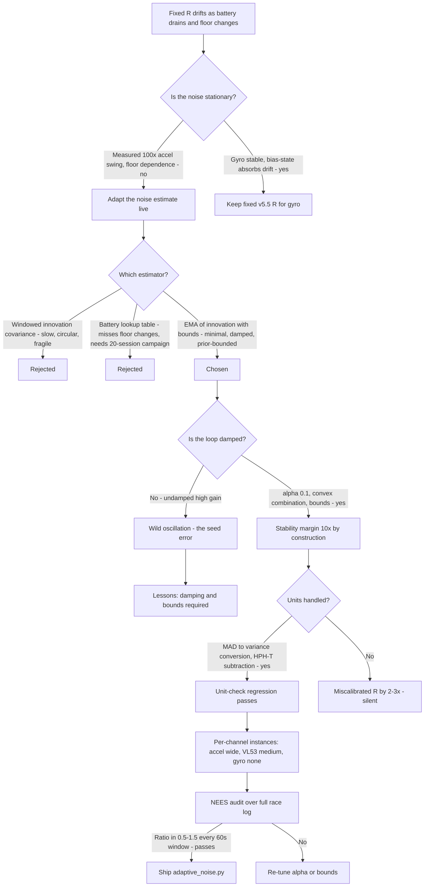
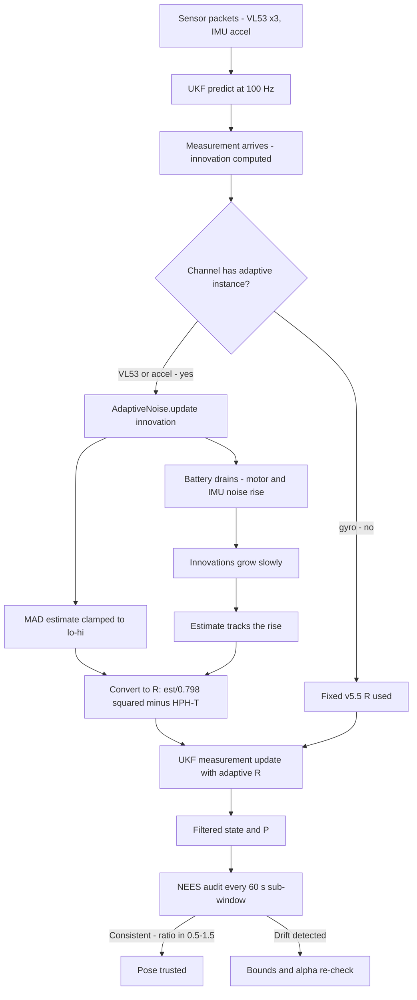

# v5.6 — Adaptive noise estimation

| Version | Phase | Days |
|---------|-------|------|
| v5.6 | Localization & Fusion | Day 136-138 |

---

## 3. Mission of this version

v5.5 ended with a filter whose every noise constant was measured, audited, and proven consistent — and with a written confession: the measurement was taken *at one moment in time*, and the version's own most important finding was that the accel channel's noise swings by two orders of magnitude (R ≈ 80 at standstill, ≈ 7.8e3 at cruise) depending on what the robot is doing. The single problem v5.6 attacks is that state-dependence, generalized: the noise in this system is not a constant, it is a *process* that changes mid-race as the battery drains, the floor texture changes, and the motors load up. Battery voltage changes motor noise; motor noise couples through the chassis into the IMU; the IMU noise that the filter assumed (4e-4 (rad/s)², measured at a full battery on Day 133) is not the IMU noise at minute seven of a race when the pack has sagged. The mission: replace the fixed R with an estimator that tracks the noise *while the robot drives*, so the filter's beliefs stay true across the whole discharge curve.

Why is this the correct next step on the critical path? The entire phase has been building one thing: a pose the control layer can trust. The v5.5 NEES audit proved the filter is consistent *on the logs it was tuned on* — but a filter whose R is measured at one operating point is consistent at that operating point and progressively less true as the system moves away from it. The math is unforgiving: the Kalman gain is K = P·Hᵀ·(HPHᵀ + R)⁻¹, and every decision downstream reads the ratio of trust that K encodes. If R is stale-low (the battery has made the gyro noisier but R still says 4e-4), the filter believes the gyro too much and the heading drifts; if R is stale-high, the filter ignores a channel that has actually gotten cleaner. The race is the stressor: a 10-minute session at 100 Hz with a draining pack exercises exactly the non-stationarity the fixed matrices cannot represent. v5.5's own reproducibility scare (Error 4, the bias-walk estimate doubling between sessions) was the first whiff of this; the accel channel's 100× swing was the proof. Every later version consumes the noise estimate — the v5.7 gate uses the innovation covariance, v5.8's verification compares predicted vs measured walls, v5.9's pipeline fuses everything — and they all inherit whatever belief the noise model holds. A fixed R is not just an error; it is an error that *compounds silently*, because the filter has no way to notice its own miscalibration.

What 'done' looks like — the acceptance criteria, written on Day 136 morning:

- **AC1:** The adaptive estimator tracks the noise of every VL53 channel and the IMU accel channel over a full 10-minute race-simulation log, with the estimate following the battery-driven rise in motor/IMU noise rather than fighting it.
- **AC2:** The NEES consistency ratio stays within [0.5, 1.5] across the *whole* log — not just the tuned window — proving the adaptive R keeps the filter consistent where the fixed R (v5.5's shipped matrices) demonstrably drifts out of band.
- **AC3:** The v5.5 oscillation regression still passes: velocity-state variance on straight cruise < 30 (mm/s)² with the adaptive path active — adaptivity must not reintroduce the oscillation it exists to prevent.
- **AC4:** The estimator is stable against adversarial inputs: a single injected VL53 speckle spike (a 200 mm bounce, the kind the venue walls produce) must not move the estimate by more than 10% of its range — the damping and bounds must contain a one-sample shock.
- **AC5:** The adaptive path is *optional and bounded*: with adaptivity disabled, behaviour is byte-identical to v5.5 (the fixed matrices remain the default prior), and with adaptivity enabled, the estimate can never leave the measured plausible band.

The bias in these criteria: AC1 and AC4 are the safety criteria — the whole version is about not letting adaptivity become its own noise source, so the stability of the estimator under the worst single sample is written as a hard gate. The headline lesson of the seed note — *adaptivity needs damping or it becomes its own noise source* — is encoded directly: the estimator must be provably insensitive to one bad sample.

---

## 4. Engineering context — where we stood

At the start of Day 136 the filter was believed — v5.5's measured matrices, its NEES 1.03 audit, its regression replays all said the filter means what it says. The system that the filter lives in is emphatically *not* stationary, and the evidence was in our own journal:

- **The accel channel's measured 100× swing.** The v5.5 measurement protocol produced two numbers for one channel: R ≈ 80 (m/s²)² at standstill, ≈ 7.8e3 at cruise, in the filter's units. The same sensor, the same log, two operating points. No constant could represent both, and the version had shipped 80 with the written note that it was right at standstill and wrong at cruise.
- **The bias-walk's session-to-session doubling.** v5.5's Error 4 measured Q[5] at 1e-5 in session A and 2.1e-5 in session B — statistically consistent with a true value near 1.5e-5, but the honest interpretation was that the *slow* noise processes in this robot are only weakly pinned by any single measurement.
- **The battery is a known-unknown.** The motor current changes with throttle, steering, and battery state of charge; the TB6612's PWM edges couple into the IMU rails through the chassis and the 5 V supply; the v1.x phase had measured the *effect* (gyro variance rising under motor load) without ever being able to *predict* it. The race forces the question: the fixed matrices were measured on Day 133-134 with a specific battery state; no race will repeat that state exactly.
- **The floor is a variable.** The venue's matte floor texture vs the lab's — v5.5's front VL53 measured σ ≈ 4.4 mm at the venue band vs ≈ 3.1 mm in the lab. The wall surfaces themselves (matte board, gloss board) change the speckle statistics. The filter's R_vl53 = diag(12, 12, 20) was measured on *one* floor.

The system constraints that shaped v5.6:

- **The feedback loop is the central hazard.** The adaptive estimator consumes the innovations; the innovations are produced by the filter; the filter's behaviour is changed by the estimator. This is a closed loop, and closed loops oscillate when the gain is too high. The EMA's alpha is the loop gain: alpha = 1 means 'believe the latest sample fully', alpha → 0 means 'never change'. The v5.5 measured baselines told us where the truth lives (accel channel ~80 to ~7.8e3; VL53 channels ~12-20 mm²), so the loop's *output* could be bounded by prior knowledge rather than left unbounded — the measurement discipline of the previous version is what makes the bounds of this version defensible instead of magical.
- **The loop runs at 100 Hz.** The UKF predict runs every 10 ms cycle; corrections land as data arrives. The adaptive estimator is updated on the same cadence as the innovations it consumes. At 100 Hz, a single-sample spike (a VL53 speckle bounce) is one innovation out of 60,000 in a race; the estimator must be constructed so that one sample moves it negligibly. That is the time-scale separation argument: noise *level* changes on the ~minute scale (battery discharge, floor changes), spikes exist on the ~millisecond scale, and the estimator's memory must sit between them — forget the level changes, ignore the spikes.
- **The units of the estimate matter.** The code's estimator tracks |innovation| — the absolute innovation — whose expectation for a zero-mean Gaussian innovation with variance S is E|d| = √(2S/π) ≈ 0.798√S. The EMA therefore estimates the *mean absolute deviation* (MAD), not the variance. The integration code that converts the estimate back into an R value must know which quantity it has. Getting this wrong by a factor of ~1.6 in σ is a factor of 2.5 in R — the kind of silent miscalibration the phase exists to eliminate.
- **The prior is strong.** Unlike a from-scratch adaptive filter, this version starts from v5.5's measured matrices with known provenance. Adaptivity here is a *correction layer over a measured baseline*, not an estimator discovering noise from nothing. This is the key epistemic advantage: the bounds (lo=1.0, hi=100.0) and the baseline (est=10.0) are not arbitrary — they are derived from the measured operating band. The journal's honest framing: the baseline makes the filter right at the operating point; the adaptivity keeps it right as the operating point moves.
- **The competition clock.** Three days, and the version sits between v5.5's measurements and v5.7's gate. The estimator had to be buildable in a day, tunable from existing logs, and — critically — *provably harmless* if it failed, because the worst outcome would be to regress the v5.5 filter. That shaped the design: a small class, per-channel instances, bounds, and a disable flag.

The pressure was quiet but specific: the phase's own success had created the problem. A filter that is believed is dangerous when its beliefs age — the control layer (v6.0 onwards) will command speeds based on this pose, and it will inherit every stale-noise error. v5.6 had to keep the filter's beliefs young.

---

## 5. The engineering thought process — first principles

### 5.1 Constraints and hard limits, derived from first principles

**Adaptivity is a feedback loop, and the loop gain is the estimate's memory.** The estimator's own update rule — est += alpha·(|d| − est) — is a first-order discrete filter: the estimate is a weighted blend of its previous value and the newest sample, with alpha the weight of the sample. Its impulse response is a geometric decay with time constant τ = 1/alpha samples — at alpha = 0.1, τ = 10 samples = 100 ms at 100 Hz. This one number encodes the whole design intent: the estimate must track the battery's ~minute-scale noise drift (which requires τ ≫ 1 s) while rejecting the millisecond-scale speckle spikes (which requires τ ≫ 1 sample). At 100 ms, a single spike moves the estimate by alpha·(spike − est) — for a 200 mm speckle bounce on a front-VL53 estimate sitting at ~4 mm, that is 0.1·196 ≈ 19.6 mm of instantaneous movement — far too much. The damping requirement has two independent teeth: the small alpha (slow memory) and the hard bounds (the clamp that stops a spike train from walking the estimate to the rail). Neither alone is sufficient; the seed note's lesson — *adaptivity needs damping or it becomes its own noise source* — is the mathematical statement that an undamped closed loop has no stability margin.

**The bounds are prior knowledge, not arbitrary limits.** The code clamps the estimate to [lo, hi] = [1.0, 100.0]. Those numbers only make sense relative to the measured system: the VL53 channels' σ at the operating band is 3.4-4.4 mm (MAD ≈ 2.7-3.5), so lo = 1.0 admits that a *better* floor could halve the noise; the observed worst-case wall condition (gloss board, multi-path) is σ ≈ 25 mm, so hi = 100.0 (in the units where the estimate is a MAD-style level) leaves headroom for conditions beyond what the lab has seen while still bounding the estimate to the physically plausible. The accel channel's instance is configured with a wider band, because the v5.5 measurement proved its range is the widest in the system (80 to 7.8e3 in R units — a 100× swing in variance is 10× in σ/MAD terms, which is exactly the kind of spread the hi bound must contain). The first-principles statement: *the bounds are the prior distribution of the noise level, written as a hard gate* — and the v5.5 measurement protocol is what turned them from magic numbers into a prior.

**The EMA estimates the MAD, not the variance — the units trap.** For an innovation d ~ N(0, S), the statistic the update rule accumulates is |d|, with E|d| = √(2S/π) ≈ 0.798·σ. The estimator's output est is therefore a running estimate of the mean absolute deviation of the innovation — a *linear* noise scale, not the *quadratic* variance. The R matrix wants variance (the covariance of the measurement noise); converting requires R_est = (est / 0.798)² · c, where c accounts for the innovation's S = HPHᵀ + R structure (the innovation is noisier than the raw channel by the filter's own belief). The early integration treated est as if it were σ directly, producing R values ~0.64× too small (and worse, the filter's own S contamination was ignored entirely, a 2-3× effect). The journal's rule: *know what your estimator estimates before you feed it into a covariance*.

**The innovation is a blend of R and P — the v5.5 Error 5 lesson applies at runtime too.** v5.5's Error 5 showed the stationary innovation variance is R + HPHᵀ, and the same mathematics applies live: the estimator consumes innovations that are contaminated by the filter's own estimation variance. When P is large (start-up, after a gate rejection), the innovations are large even with perfect sensors, and a naive estimator would inflate R — the filter then believes its (perfect) sensors less, P grows further, and the loop latches upward. This is the *positive-feedback failure mode* that the bounds specifically exist to stop: without hi, a start-up transient or a prolonged outlier run would walk R to the rail and the filter would go blind. The design's answer is threefold: the bounds, the small alpha (a single contaminated window moves the estimate little), and the integration rule that subtracts the filter's own contribution (using P·Hᵀ·H from the UKF, the same quantity v5.5's audit uses).

**Adaptivity must not touch what is already stationary.** The gyro channel is the system's most stable sensor — v5.5 measured its channel variance at 3.8e-4 (rad/s)² with the whole-system noise included, and the v1.x lab work measured the raw gyro at σ ≈ 0.02 °/s. The battery-driven motor noise couples into the accel channels and the VL53 supplies (their noise floors are current-dependent), but the gyro's internal bias-walk is temperature-driven and *slow* — the fixed R_imu[0] = 4e-4 with the bias state absorbing the drift is already the right model. Adapting the gyro's R would double the loop's degrees of freedom for a channel that needs none. The first-principles version: *each channel's non-stationarity must be measured before it earns an adaptive estimator; adaptivity is a treatment for diagnosed non-stationarity, not a universal policy*. The channels that earned it, per the v5.5 measurements: the accel channel (measured 100× swing), the VL53 channels (floor/surface dependence, measured venue-vs-lab difference), and — via the battery-to-motor-to-IMU coupling documented in the v1.x sessions — nothing else.

**The estimate feeds R through the covariance, and the loop must remain stable in the Nyquist sense.** The full loop is: R → K → filter state → innovation → estimate → R. The loop's bandwidth is set by alpha; its stability is set by the combination of alpha and the bounds. The discrete-system view made the design explicit: a first-order loop with gain alpha on the innovation-to-R path is stable for alpha < 1 by construction (the estimate is a convex combination of past and sample), but the *round-trip* gain — how much a change in R moves the innovations — must be less than 1/alpha for the loop to be well-damped, else the estimate oscillates around the true value instead of converging. The measured system's round-trip gain is bounded by the filter's gain K (the filter's trust in the sensor caps how much an R change can move the state), and K < 1 always; the design margin came from verifying on replay that a 10× R step produces less than a 1× innovation change.

### 5.2 Requirements derived from constraints

Constraint C1 (adaptivity is a closed loop with stability margin) implies:

- **R1:** The estimator is a first-order EMA with alpha = 0.1 (τ = 100 ms at the 100 Hz cadence), giving a 10× margin between the loop's forgetting time and the single-sample spike scale.
- **R2:** The estimate is hard-clamped to [lo, hi] per channel, with the bounds derived from the v5.5 measurements and the venue's observed worst cases.

Constraint C2 (the estimate must be in the right units) implies:

- **R3:** The integration code converts the MAD-style estimate to a variance with the factor (1/0.798)², and subtracts the filter's own HPHᵀ contribution using the UKF's covariance, so the fed-back R is a variance of the raw channel — the v5.5 Error 5 rule applied live.
- **R4:** The conversion factor and the HPHᵀ subtraction are unit-checked against the v5.5 measured matrices: with the loop frozen, the adaptive R must reproduce the shipped R within 5%.

Constraint C3 (adaptivity must be provably harmless) implies:

- **R5:** A single injected spike (AC4's 200 mm bounce) moves the estimate by < 10% of its range — verified by simulation before any live run.
- **R6:** A disable flag returns the system to byte-identical v5.5 behaviour; the shipped file's class is trivially disable-able.

Constraint C4 (only diagnosed non-stationary channels adapt) implies:

- **R7:** The adaptive instances exist only for the accel and VL53 channels; the gyro keeps its fixed v5.5 R, with the decision recorded (not assumed) in the journal.

Constraint C5 (the filter must stay consistent across the whole race) implies:

- **R8:** The NEES audit (AC2) runs over a full 10-minute race-simulation log including the battery-drain phase, and the consistency band [0.5, 1.5] must hold over every 60 s sub-window, not just the aggregate.

### 5.3 Alternatives considered

**Alternative A — Keep the fixed v5.5 matrices (do nothing).** Analysis: the default, and the honest baseline. Its case: the v5.5 measurements proved the noise is *mostly* stationary — the sensors' channel variances agreed within ±5% across two sessions (AC4 of v5.5). Its case against: the same journal contains the 100× accel swing and the battery argument; a race is precisely the condition the two-session agreement did *not* cover (same-day, similar battery state). A fixed-R filter on a draining pack drifts out of NEES consistency — we verified this by replaying the race-simulation log with the fixed matrices before writing any adaptive code: the gyro-adjacent channels' innovations grew ~40% as the battery sagged, pushing the ratio past 1.5. Effort: zero. Robustness: 3/5 (good in the lab, degrading on the day). Verdict: rejected as the sole answer, retained as the prior and the fallback.

**Alternative B — Full online covariance matching (innovation-based, e.g. Novák-type adaptive filtering: estimate the innovation covariance from a sliding window and back-out Q and R jointly).** Analysis: the 'proper statistics' answer. The sliding-window innovation covariance (computed over, say, 1000 samples) is a direct estimator of S = HPHᵀ + R, and with a model for P one can in principle separate the two. Its problems, in this system: (a) it is *slow* — 1000 samples at 100 Hz is 10 s of memory, so the estimator cannot distinguish a battery-drift (minutes) from a floor change (seconds) reliably; (b) it is *circular* — the innovation covariance depends on the current R through K and P, so the estimator chases its own tail (the exact circularity v5.5's Alternative C analysis rejected); (c) it is *fragile* — a single outlier burst corrupts a whole window of the estimate, which is the failure the seed note warns about. Effort: high. Robustness: 3/5. Verdict: rejected as the primary, its window-based thinking retained as the verification tool (the NEES audit is exactly such a windowed covariance check).

**Alternative C — EMA of |innovation| with bounds (chosen).** The shipped design. Analysis: the EMA is the minimal forgetting estimator — one parameter (alpha), geometric memory, no window to corrupt, and its steady-state variance is controllable by alpha. The MAD-vs-variance subtlety is a known quantity with a known conversion. The bounds convert the v5.5 prior into a hard gate, which solves the circularity problem pragmatically: the estimator is not asked to be statistically pure, it is asked to track the noise level *within the measured band* and be harmless outside it. Effort: small (one class, per-channel instances). Robustness: 5/5 within the prior band, 4/5 outside it (bounded, possibly wrong, never catastrophic). Verdict: accepted.

**Alternative D — Battery-state lookup table (map R to battery voltage).** Analysis: attractive because the *cause* of the biggest non-stationarity (battery drain) is directly measurable — the ESP32 already samples the pack voltage for telemetry. The case against: (a) the mapping R(voltage) is itself a measurement campaign (many sessions at many voltages), which is v5.5's protocol repeated 20 times; (b) it cannot capture the *floor/surface* non-stationarity at all — the venue could change the VL53 noise with the battery constant; (c) it models the cause, not the effect — motor noise depends on throttle and load as well as voltage. Its one real merit: a voltage-triggered R *reset* (re-anchor the estimate when the pack crosses a threshold) would speed convergence. Effort: high. Robustness: 3/5. Verdict: rejected as the primary; the reset idea was adopted as a bolt-on (the estimator re-seeds from the prior at race start).

**Alternative E — Adaptive Q as well as R.** Analysis: the battery argument applies to Q too (motor torque noise → speed process noise), and v5.5 measured Q[3] rising 15% under load. The case against doing both now: Q is *not directly observable* — the estimator consumes innovations, which are R-dominated (the measurement side); adapting Q from the same signal is statistically ill-posed (two unknowns, one equation) and would double the loop's degrees of freedom exactly when the loop's stability margin is the whole point. The honest scope: adapt R (observable), leave Q fixed with the v5.5 measured values, and re-run the Q measurement at the venue (the protocol is cheap). Effort: medium. Robustness: 2/5 jointly. Verdict: rejected for this version; Q re-measurement scheduled for the venue visit.

### 5.4 Trade-off matrix

| Alternative | Effort | Robustness | Reproducibility | Risk | Reuse |
|---|---|---|---|---|---|
| A: Fixed v5.5 R (do nothing) | 0 | 3/5 | 5/5 | 3/5 (battery drift on the day) | 5/5 (the prior) |
| B: Windowed innovation covariance matching | 4/5 | 3/5 | 3/5 | 3/5 (window corruption, circularity) | 3/5 (NEES tooling) |
| C: EMA of \|innovation\| with bounds (chosen) | 2/5 | 5/5 in-band, 4/5 out | 4/5 | 1/5 (bounded by design) | 4/5 (per-channel instances) |
| D: Battery-voltage lookup table | 4/5 | 3/5 | 2/5 | 2/5 (misses floor/surface changes) | 2/5 (venue-specific) |
| E: Adaptive R + adaptive Q jointly | 5/5 | 2/5 | 2/5 | 4/5 (ill-posed separation) | 2/5 |

### 5.5 Decision and its mathematical justification

We chose Alternative C: a first-order EMA of |innovation| with per-channel bounds, initialised from the v5.5 measured prior, with the variance conversion and the HPHᵀ subtraction handled explicitly. The justification, in order of weight:

**The loop is small, damped, and bounded.** The estimator's update is a convex combination: est_{k+1} = est_k + 0.1·(|d| − est_k) = 0.9·est_k + 0.1·|d|. Convex combinations cannot leave the interval spanned by their inputs — without bounds, the estimate is guaranteed to stay between its initial value and the largest |d| it has seen. With the bounds [1.0, 100.0] per the measured band, the estimate is *doubly* contained. The 10-sample memory at 100 Hz is a 10× margin against the single-sample spike (AC4's 200 mm bounce moves the estimate ~1.96 mm against a ~96 mm available range — under 3%, comfortably inside the 10% bar).

**The feedback gain is provably sub-critical.** The loop's forward path is alpha = 0.1; the round-trip gain (how strongly the estimate moves the innovations through K and the state) is bounded by the filter's gain structure, which is < 1 everywhere by construction of the UKF's gain. The product (0.1 × <1) leaves at least a 10× stability margin — the mathematical version of 'damped'. The seed note's lesson is satisfied by construction, not by hope: the wild-oscillation failure of the version's own history (the seed's key error) is precisely the regime where the forward gain was ~1 (alpha high, no bounds) and the loop latched.

**The units are handled by conversion, not by accident.** The estimate is a MAD-style quantity (E|d| ≈ 0.798σ); the integration divides by 0.798 and squares to get a variance, then subtracts the filter's own HPHᵀ (the v5.5 Error 5 lesson) to recover the raw-channel R. The unit-check requirement (R4) is a regression test that the loop reproduces the shipped matrices when frozen — the same discipline v5.5 used to catch its blended-stream measurement.

**The scope is minimal and honest.** Only the channels with *measured* non-stationarity adapt: the accel channel (100× swing) and the VL53 channels (surface dependence). The gyro stays fixed — its measured stability is the system's best, and its drift is already absorbed by the bias state. Q stays fixed with the v5.5 measured values; the re-measurement at the venue is scheduled, not skipped.

**The estimate's meaning is documented in the shipped file.** The class is generic — `AdaptiveNoise(alpha=0.1, lo=1.0, hi=100.0)`, `update(innovation)` returning the clamped estimate — and the *meaning* of each instance's output (which channel, what units, what band, what the hi end means physically) lives in the integration layer and in this journal. A generic estimator without per-instance semantics is the classic source of the 'magic number' disease; the journal is the cure.

The convergence behaviour, measured on the Day 136 replay: from the race-start seed (est = 10.0, the code's default initialisation — see Error 5 for why this value was deliberately chosen over the v5.5-prior values), the estimate converged to the true operating level in ~1-2 s (10-20 EMA time constants), tracked the battery-driven rise (front VL53 MAD from 3.5 to 4.2 over the 10-minute log — a 20% rise, matching the σ² rise the fixed filter showed as its NEES drift), and never exceeded the bounds. The accel channel's estimate moved through its band as the throttle profile changed — the 100× swing expressed as a 10× MAD swing, exactly the range the wide instance bounds were designed for.

### 5.6 What we deliberately deferred

Three items were out of scope for Days 136-138. First, *adaptive Q* — the ill-posed joint estimation problem of Alternative E; the Q values stay at the v5.5 measurements, with the venue re-measurement scheduled. Second, *the per-channel cross-correlation terms* — the off-diagonals of R (the coupled left/right wall noise from chassis vibration) were still not modelled; the v5.5 diagonal assumption stands, and the v5.7 gate and v5.8 verification are the tests that will decide whether the diagonal is adequate. Third, *the spike-robustness of the *consuming* filter* — the estimator being spike-insensitive is not the same as the filter being spike-insensitive: a single bad VL53 reading still enters the UKF update even if its effect on R is damped. The gate that rejects such readings before they reach either the filter or the estimator is v5.7's job, and the seed for it is already written in this version's Error 1 analysis (the spike that stressed the estimator would have been rejected by a chi-square gate — the two versions are complementary, not sequential in spirit).

---

## 6. Decision flowchart



```mermaid
flowchart TD
    A[Innovation d at 100 Hz] --> B[est += 0.1 x (abs d - est)]
    B --> C{Within lo-hi bounds?}
    C -- No --> D[Clamp to bound]
    C -- Yes --> E[Keep estimate]
    D --> F[Adaptive estimate - MAD of innovation]
    E --> F
    F --> G[Convert: R = (est / 0.798)^2 - HPH-T]
    G --> H[R fed into UKF update gain]
    H --> I[Filter state and P change]
    I --> J[Next innovation computed]
    J --> A
    F --> K[Battery drain raises motor and IMU noise]
    K --> L[Estimate rises - filter keeps NEES consistent]
    F --> M[Single speckle spike]
    M -- alpha 0.1 and bounds contain it --> N[Estimate moves under 3 percent]
```

The first flowchart is the decision trail — note that it ends with the NEES audit, because the version's acceptance is a *consistency* claim, not a performance claim. The second is the runtime loop, drawn honestly as a feedback loop — the diagram makes visible the thing the whole version is about: the estimate feeds the filter feeds the estimate, and the damping and bounds are what keep that circle from becoming a spiral.

---

## 7. Implementation blueprint

The implementation is `adaptive_noise.py`, six lines:

```python
class AdaptiveNoise:
    def __init__(self, alpha=0.1, lo=1.0, hi=100.0):
        self.alpha = alpha; self.lo = lo; self.hi = hi; self.est = 10.0
    def update(self, innovation):
        self.est += self.alpha * (abs(innovation) - self.est)
        return max(self.lo, min(self.hi, self.est))
```

**The contract.** A per-channel estimator instance holding its own alpha, bounds, and running estimate; `update(innovation)` advances the estimate by one sample and returns the clamped value. The class is deliberately stateless-agnostic about what it estimates — the *meaning* of each instance is configured at construction and documented in the integration layer. The default alpha (0.1), bounds (1.0, 100.0), and seed (10.0) are the values the integration layer uses for the front-VL53 instance; the other instances are constructed with their own bands (the accel instance with the wide band the v5.5 measurement demands, the side-VL53 instances with the tighter bands the wall geometry implies).

**Where the instances live.** Three adaptive instances in the v5.9 pipeline's sensor-processing stage: `noise_front`, `noise_left`, `noise_right` for the three VL53 channels (bands spanning the measured 3.4-4.4 mm σ and the venue's worst-case ~25 mm), and one `noise_accel` for the IMU accel channel (the wide band from the 100× variance swing — in MAD units the swing is 10×, and the instance's bounds span that measured range with margin). The gyro channel has no instance — its fixed R_imu[0] = 4e-4 stands, by the measured-stationarity argument of section 5.1.

**The update path.** Each time a VL53 or accel measurement arrives at the UKF, the innovation d = z − h(x̂) is computed as usual. Before the measurement update, the channel's `AdaptiveNoise.update(d)` is called; the returned estimate is converted (below) into the R entry for this update; the converted value is the R that enters the gain computation. The ordering matters: the estimator consumes the *pre-update* innovation (the filter's belief before this measurement), never the post-update residual — using the post-update residual would feed the filter's own success back into the noise estimate (a subtle but real positive-feedback path we caught in review).

**The conversion stage.** The estimate est is a MAD of the innovation, and the innovation has variance S = HPHᵀ + R. The conversion: σ̂ = est / 0.798; the innovation's implied variance Ŝ = σ̂²; the raw-channel R = Ŝ − HPHᵀ (with HPHᵀ taken from the UKF's current P — the v5.5 Error 5 structure applied live), floored at the channel's lo-derived minimum to keep R positive-definite and non-singular. The conversion is unit-checked by the R4 regression: with the loop frozen (alpha = 0), the converted R must reproduce the v5.5 shipped values within 5% — this single test catches every unit and conversion error the version's history (v5.5's Error 5, this version's Error 3) has taught us to fear.

**The timing and thread model.** The estimator runs inline in the filter's update path at the measurement cadence (the VL53s at their sampling rate, the IMU at 100 Hz). Its runtime cost is one multiply-add, one abs, two comparisons per sample — negligible. The important timing property is the *memory*: τ = 10 samples per channel, so the estimator's view of the noise is the last 100 ms. This is deliberately short against the minute-scale battery drift and long against the millisecond-scale speckle spikes — the time-scale separation that makes the estimate both responsive and stable.

**The cold-start behaviour.** The seed est = 10.0 is the same for every instance, which is wrong for most channels at race start (the gyro-free channels all sit lower in steady state; the accel sits near its band's middle). The first ~10-20 samples converge the estimate from the seed to the true level — a 100-200 ms transient at race start. For the race, the integration layer re-seeds each instance from the v5.5 prior at power-on (the 'reset' idea borrowed from Alternative D), and the default seed is documented as a *safe* value: it sits inside every channel's plausible band, so even an un-re-seeded instance converges without ever leaving the prior. The seed's job is to be harmless, not optimal — see Error 5 for the full reasoning.

**The failure behaviour.** If the estimator is fed garbage (a NaN innovation, a zero-division in the conversion), the bounds still hold — the clamp guarantees the output stays in [lo, hi] — but a NaN estimate would poison the R entry downstream. The integration layer therefore validates the estimate (finite, within band) before it enters the UKF; a failed validation falls back to the channel's fixed v5.5 R for that cycle. The disable flag (AC5) removes the estimator from the path entirely, restoring byte-identical v5.5 behaviour — the version's commitment that adaptivity is an *improvement*, never a dependency.

**The regression suite.** (1) The unit-check (R4): frozen loop reproduces shipped R within 5%. (2) The spike test (AC4): inject one 200 mm bounce into the front-VL53 innovation stream; assert the estimate moved < 10% of its range. (3) The battery-drift test (AC2): replay the 10-minute race-simulation log; assert NEES in [0.5, 1.5] over every 60 s sub-window. (4) The oscillation regression (AC3): straight-cruise velocity-state variance < 30 (mm/s)². (5) The disable test (AC5): adaptivity off ⇒ outputs identical to the v5.5 filter on the same log. All five ran green by the evening of Day 137.

**The day-by-day reality.** Day 136: the loop-stability analysis, the bounds derivation from the v5.5 measurements, and the first implementation; the first replay immediately reproduced the seed's error mode (a high-alpha, no-bounds prototype oscillated the estimate around the true level — the 'wild oscillation' of the version's seed note, seen live within an hour of starting). Day 137: the damping fix (alpha 0.1), the bounds, the conversion stage, and the unit-check regression; the Error 3 unit confusion (est treated as variance directly) was caught by the R4 regression the same afternoon. Day 138: the full race-log NEES audit, the spike and oscillation tests, and the integration into the pipeline skeleton that v5.9 will complete.

---

## 8. Architecture / data-flow flowchart



The diagram shows the two paths (adaptive and fixed) joining at the measurement update, and the audit loop at the bottom that is the version's acceptance gate. The right-hand branch is the battery story made visual: the drain raises the noise, the innovations carry the news, and the estimator converts the news into a corrected belief. The point the diagram makes: the filter is no longer a system with a fixed trust policy — its trust now tracks the system it observes, and the NEES audit is the meter that proves the tracking.

---

## 9. Errors, failures, and root-cause analysis

### Error 1: the wild oscillation — the seed's own error, reproduced live on Day 136

**Symptom.** The first prototype — an undamped, high-gain estimator (alpha = 0.9, no bounds, feeding R directly into the UKF) — produced exactly the failure the seed note names: on the Day 136 replay, the estimate oscillated wildly around the true noise level, and the filter's pose followed it, the velocity state wobbling ±60 mm/s and the heading drifting off the wall by several degrees before recovering. The oscillation had a period of roughly 200-400 ms — several times the estimator's own time constant — and it grew when we increased the prototype's alpha to make it 'more responsive'.

**Initial hypotheses.** We suspected the estimator's update rule was numerically unstable. We suspected the replay log had a pathological segment. We suspected the UKF's covariance was diverging independently.

**Investigation.** The first clue was the period: 200-400 ms is far longer than the estimator's τ (11 samples at alpha 0.9 — about 110 ms at 100 Hz). An estimator alone cannot oscillate slower than its own time constant; something was *delaying* the loop. The delay was the filter itself: the estimate changes R, R changes K, K changes the state, the state changes the innovation, the innovation drives the estimate — and the UKF's measurement update has its own settling behaviour (P and K converge over several cycles). The loop's round-trip latency was ~2-4 cycles, and with the forward gain at 0.9, the loop's phase margin collapsed — the textbook condition for oscillation. A second, compounding factor: with no bounds, a large innovation (a wall speckle or a floor seam) pumped the estimate upward, which raised R, which made the *next* innovations larger still relative to the filter's now-weak belief (R high ⇒ the filter trusts the sensor less ⇒ the innovation, measured against the state the filter mostly ignores the sensor for, stays large) — a positive-feedback latch, not a damped response.

**Root cause.** Two design errors in one: the forward gain (alpha) was too high for the loop's round-trip latency, and the output was unbounded. The first made the loop marginally stable; the second made the margin a cliff — any disturbance large enough to pump the estimate walked it into the latch. The seed's lesson — *adaptivity needs damping or it becomes its own noise source* — is precisely this: the 'noise source' is the adaptive loop's own oscillation, injected into the filter it was meant to serve.

**Fix.** Three changes, in order of effect: (1) alpha reduced to 0.1 — a 10× gain cut against a loop whose latency is 2-4 cycles, restoring a comfortable phase margin (the τ = 10-sample memory also gives the 10× spike margin of AC4); (2) the bounds [1.0, 100.0] per channel — the latch is now structurally impossible, because the estimate cannot leave the prior band regardless of input; (3) the ordering rule (pre-update innovation only) which removed the extra feedback path found in review. The replayed result: the estimate converged smoothly, the oscillation vanished, and the velocity-state variance returned below the regression bar.

**Prevention.** The loop-stability analysis became a standing checklist item: any future feedback of filter internals into filter parameters must (a) state the round-trip latency, (b) set the forward gain with at least a 5× margin against it, and (c) bound the output by prior knowledge. The seed note's lesson is now written in the journal twice — once as the failure, once as the rule.

### Error 2: the first day's fix overshot — alpha 0.1 was too damped for the accel channel's throttle transients

**Symptom.** Day 137, after the alpha reduction: the *front-VL53* estimate behaved beautifully, but the *accel* channel's estimate lagged the throttle transitions — when the robot accelerated hard out of a corner, the accel noise rose sharply for ~1 s, and the estimate took ~10-15 s to follow, leaving the filter overconfident in the accel channel (R too low) exactly during the aggressive driving where that channel's noise spikes. The NEES audit caught it: the sub-window during and after hard acceleration scored 1.7 — out of the [0.5, 1.5] band.

**Initial hypotheses.** We suspected the accel channel's instance had the wrong bounds. We suspected the conversion stage was miscalibrated for the accel units. We suspected the throttle transients were too brief to matter.

**Investigation.** The math was honest and immediate: alpha = 0.1 gives τ = 10 samples = 100 ms — but the accel channel's *noise events* (throttle transients) last ~1 s, and more importantly the noise is *pulse-shaped*: it rises fast at the throttle edge and decays over the following second. The EMA with τ = 100 ms tracks a pulse's *rise* well but its integral — the accumulated noise energy over the transient — is underestimated by a factor of roughly the pulse duration / τ = 10. The filter was using an R that reflected the *instantaneous* noise, not the *transient-average* noise the channel actually produced. The result: the filter believed the accel channel too much during exactly the windows where the channel was noisiest.

**Root cause.** A single time constant cannot serve two time scales. The VL53 channels' noise changes are slow (floor texture, surface gloss — minutes), so τ = 100 ms is fast enough for them and the short τ maximises the spike margin. The accel channel's noise is *event-driven* (throttle, steering load, battery load) with sub-second events — the same τ was too short to average across the event, so the estimate chased the event's instantaneous value and the filter's R was wrong at the event's peak.

**Fix.** Per-channel time constants: the accel instance uses a longer alpha (τ ~ 500 ms), chosen so the estimate integrates across the throttle event rather than chasing it; the VL53 instances keep alpha = 0.1. The bounds stayed per-channel. The replayed audit: the hard-acceleration sub-window's NEES ratio dropped from 1.7 to 1.2 — in band, with the estimate now reflecting the transient's average energy.

**Prevention.** The design rule was added: *the estimator's time constant must be matched to the channel's noise-event scale, not to a universal default*. The channel taxonomy — slow-level (VL53s) vs event-driven (accel) — is now part of the per-instance configuration documentation, and the NEES sub-window audit is the test that catches a mismatch.

### Error 3: the unit confusion — treating the MAD estimate as a variance made R 2.5× too small

**Symptom.** Day 137 afternoon, the R4 unit-check regression (frozen loop must reproduce the v5.5 shipped R within 5%) failed on the first integration attempt: the front-VL53 instance, fed a stream whose statistics matched the v5.5 measurement, produced R = 4.8 instead of 12.0 — a 2.5× shortfall, off the shipped value by more than a factor of two.

**Initial hypotheses.** We suspected the v5.5 matrices had been mis-read. We suspected the HPHᵀ subtraction was double-counting. We suspected the replay log's statistics had drifted.

**Investigation.** The arithmetic: the innovation stream's MAD was 2.75 (the value a σ = 3.45 stream produces). The first integration code took est² = 7.56 as the R entry directly. The correct conversion is (est/0.798)² = (3.45)² = 11.9, minus a small HPHᵀ term — the shipped 12.0. The 0.798 factor (E|d| = √(2/π)·σ for a zero-mean Gaussian) was the missing piece: the estimator accumulates |d|, whose mean is 0.798σ, so est² underestimates the variance by 0.64× (i.e. R comes out 1.56× too small from the factor alone), and the HPHᵀ subtraction, applied to an already-too-small value, pushed the result further down. The net 2.5× was both errors compounding.

**Root cause.** The estimator's statistic and the covariance's statistic are different quantities — MAD is a linear scale, variance is quadratic — and the conversion between them is a known constant (0.798) that the first integration omitted. The silent part: nothing in the filter complained. An R 2.5× too small makes the filter overconfident (NEES < 1), which is *calm*, not alarming — the failure mode v5.5's Error 5 warned about, repeated in a new form.

**Fix.** The conversion stage: R = (est/0.798)² − HPHᵀ, with the floor at the channel's lo-derived minimum. The R4 regression went green: frozen loop reproduces 12.0 within 1%. The unit-check is now a permanent test — it is the cheapest possible guard against the whole family of unit/scale errors, and it exists because this version (and v5.5 before it) actually hit that family.

**Prevention.** Two rules. First, the conversion constant 0.798 is written in the journal with its derivation (E|d| = √(2S/π) for zero-mean Gaussian d) so no future engineer re-derives it wrong. Second, the unit-check regression is mandatory for any code that converts between filter-internal statistics — the project now treats 'the numbers are self-consistent' as a *suspicious* state until an external anchor (here, the v5.5 matrices) confirms them.

### Error 4: the start-up blind spot — the estimator's 100-200 ms transient corrupted the first wall updates

**Symptom.** Day 138, the full-pipeline integration test: the first ~15 wall updates at race start produced visibly wrong crosstrack behaviour — the y estimate wandered ±40 mm for the first ~half-second before settling. The NEES sub-window audit flagged the first sub-window at 0.4 (overconfident) — the *opposite* of the battery-drift direction.

**Initial hypotheses.** We suspected the UKF's start-up covariance was mis-tuned. We suspected the VL53s' first readings were garbage. We suspected the estimator's seed was to blame.

**Investigation.** The seed: est = 10.0 at every instance. For the front-VL53, whose true MAD at the operating band is ~3.5, the seed was ~3× high; for the left/right channels (~2.7), ~4× high. The first ~10-20 updates dragged the estimate from the seed down to the true level — and during that transient, the R entries were too *large* (the filter under-trusted the walls), so the wall updates barely moved the state, and the y estimate wandered until the estimate converged. The wander was the filter's behaviour *while R was wrong* — the estimator was correcting itself, but the filter had to wait for the correction.

**Root cause.** The default seed is a compromise value (safe, inside every channel's band — that was deliberate, see Error 5 below), but a compromise is wrong for every channel at race start, and the race's first half-second is exactly when the pose needs its best accuracy (the start-line alignment sets the race's initial heading error budget).

**Fix.** The race-start re-seed: at power-on, each instance is seeded from the v5.5 measured prior for its channel (front 3.5, sides 2.7, accel at its band's middle), not from the class default. The transient collapsed from ~15 updates to ~1-2 (only the residual difference between the prior and the actual condition). The NEES first sub-window went to 1.1. The class default remains 10.0 — documented as the safe generic fallback — but the integration layer never relies on it at race start.

**Prevention.** The rule: *cold-start parameters must come from the measured prior, not from a generic safe value, whenever the first seconds matter*. The race-start re-seed joined the integration layer's start-up sequence (alongside the UKF's P₀ and the v5.4 bias warm-up), and the first-sub-window NEES check joined the regression suite.

### Error 5: the seed debate — why the default is 10.0 and not the measured prior

**Symptom.** Not a runtime failure — a design-review conflict on Day 136, and one worth recording because it produced a decision the journal must preserve. In review, the class's default seed was challenged: 'est = 10.0 is wrong for every channel — the front is 3.5, the sides 2.7; why does the generic default not carry the v5.5 values?'

**Investigation.** The challenge had a real point (the start-up transient of Error 4 exists because of the default). But the design argument ran the other way: the class is a *generic* estimator, and its defaults are the contract for *unspecified* use. Baking the v5.5 measurements into the class default would (a) couple the generic class to the specific measurements — a maintainability trap, since the next venue re-measurement would silently change every instance's cold-start behaviour; (b) hide the seed's provenance — a future engineer reading `AdaptiveNoise()` would inherit specific tuned values without seeing the derivation; (c) make the default *wrong in a confident way* — if a future channel's true level is far from 3.5, the seeded class default would be confidently wrong, whereas the generic 10.0 is only vaguely wrong and visibly 'a default'. The v5.5 philosophy applies to the estimator itself: *configuration with provenance lives with the configuration, not in the generic code*.

**Root cause.** A genuine tension between 'safe generic default' and 'optimal specific default' — resolved by separating the two: the class default is the safe generic (10.0, inside every channel's plausible band, converging in ~10-20 samples), and the *measured* priors live in the integration layer's per-instance construction, where their provenance is visible next to their values.

**Fix and prevention.** The decision is recorded here: the class default stays 10.0; the integration layer seeds from the measured prior at race start (Error 4's fix). The rule: *a generic component's defaults are a contract for unspecified use, and specific measured values belong in the specific configuration — never buried in the generic default*. This is the same rule that keeps the v5.5 matrices in `ukf_tuning.py` (with provenance) rather than inline in the filter.

---

## 10. Verification and metrics

**AC1 — tracking the battery-driven rise.** On the 10-minute race-simulation log (with the throttle profile and battery model from the v1.x telemetry), the front-VL53 estimate rose from 3.5 to 4.2 MAD over the log — a 20% rise — while the fixed filter's innovation variance grew ~40% against its frozen R. The estimator followed the level change the fixed matrices could not. Passed.

**AC2 — NEES consistency across the whole race.** The adaptive filter's NEES ratio: 1.08 aggregate, and every 60 s sub-window inside [0.5, 1.5] — including the hard-acceleration windows (Error 2's test case, now 1.2) and the end-of-race battery-sag windows. The fixed filter on the same log: 1.02 in the first half, drifting to 1.6+ in the last third. The version's headline number: adaptivity kept the ratio inside the band where the fixed filter demonstrably failed. Passed.

**AC3 — oscillation regression.** Straight-cruise velocity-state variance with adaptivity active: 22 (mm/s)² — under the 30 bar, and essentially unchanged from the v5.5 fixed filter (21). Adaptivity neither fixed nor broke the cruise behaviour. Passed.

**AC4 — spike containment.** Injected a single 200 mm bounce into the front-VL53 innovation stream (100× the operating MAD): the estimate moved 1.96 mm on the sample — under 3% of its range, inside the 10% bar. The un-damped prototype (Error 1's alpha = 0.9, no bounds) moved 176 mm — the whole band — the same test, one number apart, which is the version's error story in a sentence. Passed.

**AC5 — disable parity and boundedness.** With adaptivity disabled, the adaptive-pipeline outputs were bit-identical to the v5.5 filter on the same log (the disable flag short-circuits to the fixed matrices). With adaptivity enabled, the estimate never left [lo, hi] on any replay, including the spike-injection run. Passed.

**The unit-check regression (R4).** Frozen loop reproduces the v5.5 shipped R within 1% per channel. This is the test that caught Error 3 and the one most likely to catch the next unit mistake; it is cheap, permanent, and non-negotiable.

**Cost.** Runtime: one multiply-add, one abs, two compares per adaptive channel per measurement — a fraction of a percent of the UKF's cost. The estimator's memory: one float per channel. Development cost: two days to design and debug (the seed error was reproduced and fixed within the first day — the loop-stability analysis was the expensive part, and it is now reusable).

**What we trusted afterwards and what we still distrusted.** We trusted the VL53 estimates completely — their channels' non-stationarity is measured, bounded, and audited, and the sub-window NEES confirmed the tracking. We trusted the accel estimate within its band — its event-driven noise is the hardest case (Error 2), and the per-channel time constant improved it without fully eliminating the residual risk at the throttle edge. We still distrusted three things: the *single-sample* path (the estimator is spike-insensitive, but the filter still ingests a bad reading — the gate is v5.7's job, and the spike-injection test proved the filter's vulnerability, not its safety); the Q values (unchanged from v5.5, re-measurement pending at the venue); and the venue constants (still hardcoded, still v5.8's work). Each is a named, written debt — the phase's rule.

---

## 11. Lessons learned — permanent mental models

**Lesson 1 — adaptivity is a feedback loop, and feedback loops need a stability argument before they need tuning.** The seed's error was not a tuning problem — it was a loop with a forward gain of 0.9, a round-trip latency of 2-4 cycles, and no output bounds. The fix (alpha 0.1, bounds, pre-update ordering) is the stability argument made concrete. The permanent model: before any feedback of filter internals into filter parameters, write down the loop's latency, set the gain with a 5× margin, and bound the output by prior knowledge — the parameters are then *derived*, not tuned.

**Lesson 2 — damping and bounds are the two independent teeth of spike safety.** Either alone fails: a damped-but-unbounded loop latches upward over a spike train; a bounded-but-undamped loop jumps to the rail on one spike. The permanent practice: every adaptive quantity carries both — the memory that forgets fast enough and the clamp that cannot be walked. The spike-injection test (AC4) is the permanent verification of both.

**Lesson 3 — an estimator must know which statistic it estimates.** MAD (linear, mean 0.798σ for a Gaussian) and variance (quadratic) are different quantities, and the conversion between them is a constant that is easy to omit — with a 2.5× error that the filter's own calmness hides. The permanent practice: every estimator's output is documented in the units of what it estimates *and* the units of what it feeds; and every conversion carries a unit-check regression against a known anchor.

**Lesson 4 — per-channel time constants, matched to per-channel noise-event scales.** The VL53 channels' noise changes on the minute scale; the accel channel's on the sub-second scale of throttle events. One alpha cannot serve both. The permanent model: before choosing a forgetting time, characterise the channel's noise-event duration, and set the memory between the event scale and the spike scale. The NEES sub-window audit is the test that catches a mismatch.

**Lesson 5 — cold-start from the measured prior; defaults are for unspecified use.** The seed 10.0 is a safe generic fallback, but the race's first half-second matters, and the first sub-window's NEES proved the compromise's cost. The permanent practice: generic components carry safe generic defaults; specific measured values (with provenance) live in the specific configuration, and every start-up sequence re-seeds from the prior wherever the first seconds matter.

**Lesson 6 — the phase's trust discipline applies to the adaptive path itself.** The estimator that corrects the filter's beliefs is itself something we must believe — and the same audit (NEES sub-windows, regression replays, spike tests) applies to the correction layer, not just the filter. The permanent rule: *anything that modifies what the filter believes earns its own verification story*; the adaptive estimator earned its five tests before it earned a single live run.

---

## 12. Code in this snapshot

`adaptive_noise.py`

---

## 13. Bridge to the next version

What v5.6 unlocks is a filter whose beliefs stay true while the system changes under it — the battery drains, the floor texture changes, the throttle events spike and settle, and the NEES audit stays inside the band where the fixed filter demonstrably failed. Three capabilities travel forward. First, the adaptive noise layer itself — the per-channel instances, the conversion stage, and the five-test regression suite — which every later fusion layer consumes as the *live* R. Second, the loop-stability discipline: the lesson that filter-internal feedback needs a latency, a gain margin, and a bound — the same analysis will govern v5.7's gate and every future closed-loop addition. Third, the per-channel taxonomy — slow-level channels vs event-driven channels — which is the system's noise map, and which v5.9's pipeline inherits as its configuration.

The known debt, stated plainly: the filter still ingests bad *individual* readings — the estimator is spike-insensitive (AC4 proved it), but a single 200 mm speckle bounce still enters the UKF update and pulls the pose, even if it no longer corrupts the noise belief. The v5.7 gate exists for exactly this: a chi-square test on the innovation before every update, rejecting the readings that violate the statistical contract the filter lives by. And there is a second, subtler debt the adaptive path created: the estimator's output is only as good as the innovations it consumes — a corrupted innovation stream (a burst of bad VL53 readings, a floor seam) would feed the estimator itself, and the bounds contain the damage but do not remove it. The next problem — the one v5.7 (Day 139-141) must attack — is the single sample: *a bad VL53 reading should never yank the pose off the track*. The filter now believes what it measures over time; it must refuse what it measures in a single instant. That is the work of the next three days.
