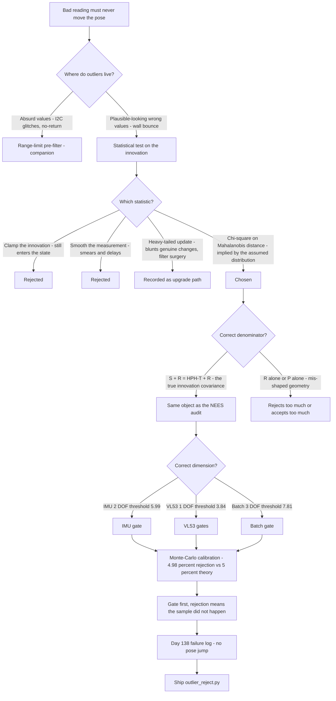
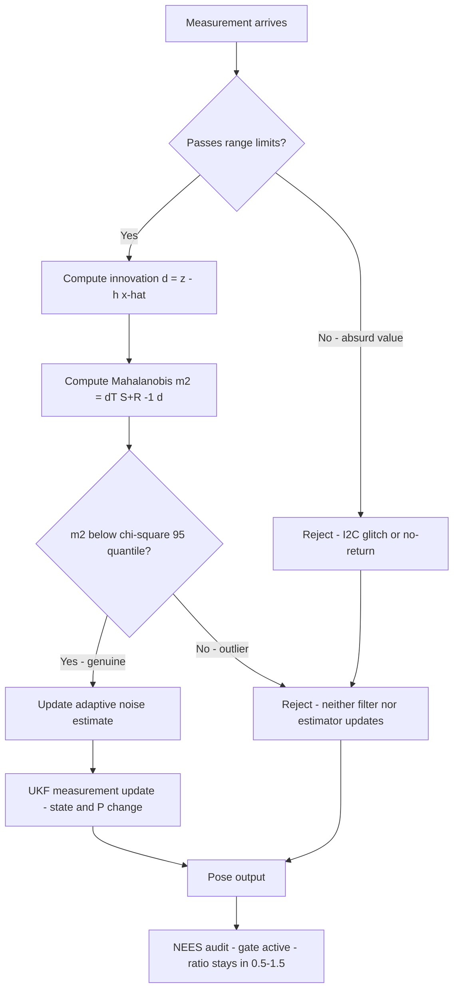
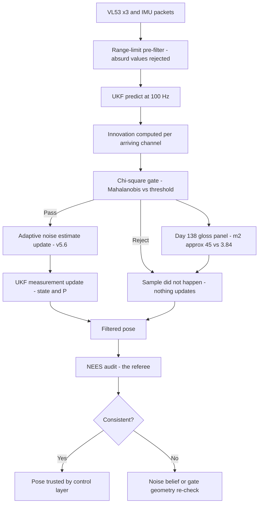

# v5.7 — Outlier rejection

| Version | Phase | Days |
|---------|-------|------|
| v5.7 | Localization & Fusion | Day 139-141 |

---

## 3. Mission of this version

The v5.6 journal ended with a written confession: the adaptive noise estimator is immune to spikes, but the *filter* is not. A single bad VL53 reading — a speckle bounce, a glossy-wall double reflection, a seam in the floor — still enters the UKF measurement update and pulls the pose. The estimator proved on Day 138 that one injected 200 mm bounce would leave the noise belief nearly untouched; the same test showed the filter's state jumping tens of millimetres before recovering. The single problem v5.7 attacks is that sample: *a bad VL53 reading should never yank the pose off the track*. The mission is to build a gate in front of every measurement update — a statistical test that asks, before the filter believes anything, whether this reading is plausible under the filter's current model of the world and the sensor.

Why is this the correct next step on the critical path? Every layer of the phase has been about belief quality — v5.4 built the filter, v5.5 measured its noise, v5.6 kept the noise belief true over time. But a Kalman filter's update is a *linear blend*: K·d is added to the state, and K·d is proportional to d. An outlier d of 200 mm with a gain of 0.5 moves the state 100 mm — the filter's entire defensive machinery (the covariance, the weights, the adaptation) is powerless against a single huge innovation, because the gain is *large when the innovation is large relative to R*. The mathematics of the filter assumes the innovation is Gaussian; a wall-bounce innovation is not from that distribution — it is from a completely different process (a wrong-distance measurement), and no amount of covariance tuning can distinguish it, because the filter has no model for 'wrong'. The gate is the missing piece: a hypothesis test that says *this sample is not from the assumed distribution, do not believe it at all*. Without the gate, the phase's work — the measured R, the adaptive belief, the audited consistency — is all forfeit at the first glossy wall panel. With it, the filter keeps its Gaussian world intact by refusing the samples that violate it.

What 'done' looks like — the acceptance criteria, written on Day 139 morning:

- **AC1:** The gate rejects every injected outlier (a synthetic 200 mm bounce injected into a clean replay log) while accepting ≥ 97% of genuine readings on the same log — the statistical contract the seed's error (30% rejection of good readings) was written to prevent.
- **AC2:** The gate's false-rejection rate is *calibrated*, not guessed: the threshold is the chi-square 95% quantile for the update's degrees of freedom, verified by Monte-Carlo (10,000 synthetic innovations from the measured covariance, 5% rejection expected, observed within statistical tolerance).
- **AC3:** A gate-rejected reading leaves the filter state and covariance *untouched* — no partial update, no P inflation, no state nudge; the filter behaves exactly as if the reading never arrived.
- **AC4:** The gate does not break the v5.5/v5.6 regression suite: NEES stays in [0.5, 1.5] across the full race-simulation log with the gate active, and the v5.6 spike-containment test still passes with the gate *and* the estimator in series.
- **AC5:** On the recorded failure log — the Day 138 session where a glossy-panel bounce produced a visible pose jump — the gate rejects the offending samples and the replayed pose shows no jump: the exact real-world failure this version exists to kill.

The bias in these criteria: AC2 is the discipline criterion — the whole version's lesson is that a gate's threshold must be a statistic, not a magic number, so the calibration is written as a measurable requirement with a Monte-Carlo verification, not an opinion.

---

## 4. Engineering context — where we stood

At the start of Day 139 the filter was believed over time but vulnerable in an instant. The evidence was in our own replay logs, and it had been there since the early phase work:

- **The Day 138 glossy-panel event.** The full-pipeline integration test recorded a visible pose jump: the y estimate (lateral position) snapped ~60 mm toward the wall and took ~1.5 s to recover. The cause, found by inspection of the log: a single front-VL53 reading of 218 mm against a true distance of ~620 mm — a double reflection off a glossy panel at a grazing angle. The innovation was ~-400 mm; the UKF's gain for the front channel at that covariance was ~0.25; the state moved 100 mm in one update. Every subsequent reading corrected it back, but the race does not pause for recovery.
- **The injected-spike test from v5.6's AC4.** The spike test proved the *estimator's* immunity (a 200 mm bounce moved the adaptive estimate under 3% of its range) while documenting the filter's vulnerability in the same breath: the pose jumped tens of millimetres. The two results together were the version's mandate: the noise belief was protected, the pose was not.
- **The known outlier sources, enumerated from the phase's sessions:** VL53 speckle bounces (documented since v1.x — the sensors' worst-case static noise is 5-10× the median); glossy-wall double reflections (the venue's wall panels have a matte face and a gloss face — the gloss side produced the Day 138 event); floor seams and dark tape lines (the sensor's range drops abruptly over a dark seam, producing a spurious *short* reading); the ramp edge (v5.2's ramp work — the front sensor sees the ramp's edge at a different distance than the geometry predicts, producing a legitimate-looking but wrong reading); and the ESP32's I²C arbitration glitches (rare, but a corrupted packet can produce any value, including a valid-looking one).
- **The statistical contract the filter lives by.** The UKF's whole belief machinery assumes d ~ N(0, S) with S = HPHᵀ + R. The measured R (v5.5) and the adaptive belief (v5.6) made this contract *quantitative*: the filter now knows its innovation distribution to within the NEES audit's tolerance. That knowledge is exactly what a gate needs: if the innovation distribution is known, then a sample that violates it is detectable *by the distribution itself* — the gate is the filter's own statistical assumptions turned into a test.

The system constraints that shaped v5.7:

- **The gate must run before the update, at the update's rate.** The UKF update runs at the measurement cadence (VL53s and IMU at up to 100 Hz). The gate is a matrix inversion of (S + R) per update — the same inversion the gain computation performs anyway, so the marginal cost is one matrix-vector product and one comparison. There is no excuse for the gate to be expensive, and there is no alternative path: a post-update screen (reject after the fact) cannot undo the state's movement.
- **The covariance structure defines the test's geometry.** The Mahalanobis distance dᵀ(S+R)⁻¹d is the squared distance from the innovation to the mean, measured in the metric of its own covariance. For a Gaussian innovation, this quantity is chi-square distributed with degrees of freedom equal to the innovation's dimension. This is the first-principles statement the whole version rests on: *the correct gate threshold is a chi-square quantile, and the only design freedom is choosing which quantile and which dimension*.
- **The dimensions vary per update.** The IMU update carries two channels (gyro and accel) — a 2-DOF test (χ²₉₅,₂ = 5.99). A single VL53 update carries one channel — 1 DOF (χ²₉₅,₁ = 3.84). A batched three-VL53 update carries three — 3 DOF (χ²₉₅,₃ = 7.81). The gate cannot have one threshold; it must know its dimension. (The seed note's 5.99, written in the code as CHI2_95 = 5.99 with the comment '2 DOF', is the IMU gate's threshold — and the version's Error 3 is exactly what happens when it is applied to the 1-DOF VL53 gates.)
- **The gate and the adaptive estimator share the innovation — and must not share it naively.** v5.6's estimator consumes innovations; v5.7's gate tests them. The correct ordering is: gate first, then feed the *gated* innovation to the estimator and the filter. An ungated innovation would pump the estimator (defeating v5.6's spike protection) — and the estimator's adaptive R feeds the gate's denominator, so the two are coupled: the gate's selectivity depends on the noise belief that the gate protects. The loop must be sequenced carefully or the two layers fight.
- **The competition clock.** Three days between the adaptive version and the final pipeline (v5.9). The gate had to be built, calibrated, and validated against real logs — the Day 138 failure log was the perfect test asset, already recorded, already understood, waiting for the fix.

The pressure was precise: v5.6 had protected the filter's *beliefs*; v5.7 had to protect the filter's *state*. The phase's quality bar — every claim measured, every failure named — applied to the gate itself: a gate with a magic threshold would be the same disease it was built to cure, applied one layer up.

---

## 5. The engineering thought process — first principles

### 5.1 Constraints and hard limits, derived from first principles

**An outlier is a sample from the wrong distribution, and only a distributional test can catch it.** The Kalman filter assumes d ~ N(0, S). A wall-bounce reading is not a large sample of that distribution — it is a sample of a *different* process (wrong-distance measurement, which has its own statistics, including a hard floor at zero and a ceiling at the sensor's range limit). No covariance tuning can accommodate both distributions with one R: raising R to absorb the outliers would make the filter blind to genuine changes; lowering it to track genuine changes leaves it vulnerable to outliers. The only sound structure is a *test*: decide, before updating, whether the sample is consistent with the assumed distribution, and if not, refuse it. The test's mathematics fall out of the distribution itself: for d ~ N(0, S), the squared Mahalanobis distance m² = dᵀS⁻¹d is chi-square distributed with ν = dim(d) degrees of freedom. P(m² > χ²₉₅,ν) = 0.05 — the gate threshold is the chi-square quantile, and the false-rejection rate is the chosen alpha. The first-principles chain is complete: *the assumed distribution implies the test, the test implies the threshold, and the threshold is the only statistically sound number the gate can use*.

**The covariance in the denominator must be the innovation's true covariance.** The code's gate uses S + R — the sum of the predicted measurement covariance (H·P·Hᵀ) and the measurement noise — which is the innovation covariance S_innov = E[ddᵀ] = HPHᵀ + R. This is not a detail: using R alone (a tempting simplification — 'the sensor's noise') would reject genuine readings whenever the state's covariance is large (start-up, after a gate rejection, during the v5.6-adaptive transients), because the denominator would understate the true spread of the innovations. Using HPHᵀ alone would make the gate blind exactly when the filter is most uncertain. The correct denominator is the sum — the code's S + R — and the journal's rule is that the gate's denominator is *the same covariance the consistency audit uses* (v5.5's NEES), because they are the same mathematical object: the distribution the innovations actually live in.

**The degrees of freedom are the dimension of the innovation vector.** The chi-square distribution's shape — and therefore its quantiles — depends on ν. The IMU update's innovation (gyro + accel) is 2-dimensional: ν = 2, χ²₉₅ = 5.99. The single-channel VL53 updates are 1-dimensional: ν = 1, χ²₉₅ = 3.84. A batched multi-sensor update is ν = 3: χ²₉₅ = 7.81. Two consequences follow. First, the gate is *per-update-type*: one threshold per update's dimension, not one threshold for the filter. Second, the difference matters materially: using 5.99 on a 1-DOF gate admits samples with m² up to 5.99 when the 95% point is 3.84 — the gate's effective alpha rises from 5% to ~15% (P(χ²₁ > 5.99) ≈ 0.014... no — P(χ²₁ > 3.84) = 0.05 and P(χ²₁ > 5.99) ≈ 0.014, so using the 2-DOF threshold on a 1-DOF gate *tightens* it: false-rejection rate falls from 5% to 1.4%). The direction matters: the error in the seed note's direction (5.99 everywhere) is a *tighter* gate than intended — which, combined with a too-small denominator, is how a gate reaches a 30% rejection rate. The journal's rule: *the gate's threshold is a function of the update's dimension, and the dimension is part of the gate's configuration, not an assumption*.

**The gate's alpha is a false-rejection budget, and the budget must survive the race.** At 5% per update, a 10-minute race at 100 Hz issues 60,000 decisions per channel, and a 5% alpha on a 1-DOF gate rejects 3,000 *genuine* readings — which is fine (a rejected genuine reading is merely unused, and the filter continues on the other channels; the loss is one update's information), but the *correlation structure* matters: outliers arrive in bursts (a wall panel's gloss side covers ~1-2 s of driving, ~100-200 readings), and a gate that rejects a burst as a coherent whole loses the wall during that stretch. The gate's job is not to be right 95% of the time — it is to be *rarely wrong in a harmful direction*. The harmful direction is false *acceptance* of a real outlier (the pose jumps). The acceptable cost is false rejection of a genuine reading (a momentarily sparser observation). The design therefore biases the alpha toward rejection — 5% is already conservative for the racing purpose, and the AC1 budget (accept ≥ 97% genuine readings) is the contract that keeps the bias from becoming blindness.

**The gate and the adaptive estimator must be sequenced, not stacked.** v5.6's estimator consumes innovations to track the noise level. v5.7's gate tests innovations against the current covariance. The correct sequence is: compute the innovation → test it against the gate → if it passes, update the adaptive estimate and the filter; if it fails, update *neither*. The reason for updating neither on rejection is subtle and important: the estimator's update rule (est += alpha·(|d| − est)) would, on a rejected sample, pull the estimate toward the outlier's magnitude — the estimator's spike immunity (proved for a *single* injected spike in v5.6's AC4) degrades under a *burst* of rejected samples, and a burst is exactly the real-world case (a gloss panel's 100-200 reading burst). The filter's update, meanwhile, is the thing the gate exists to prevent — updating on a rejected sample is the failure the gate was built to kill. The sequencing rule is one line but it is the version's architecture: *gate first, and rejection means the sample did not happen*.

**The gate's failure mode when the noise belief is wrong.** The gate's denominator (S + R) contains the adaptive R from v5.6. If the adaptive R is mistuned (Error 2 of v5.6's event-driven accel channel), the gate's geometry is wrong: an R too small makes the gate reject too much (the 30%-rejection failure mode); an R too large makes it accept too much (outliers slip through). The gate therefore inherits the noise belief's quality — and the phase's answer is the audit: the NEES consistency of v5.5, the adaptive tracking of v5.6, and now the gate's own calibration test (AC2) together form a chain of belief verification, where each layer trusts the next only as far as the previous layer's audit.

### 5.2 Requirements derived from constraints

Constraint C1 (only a distributional test can catch a wrong-distribution sample) implies:

- **R1:** The gate is the chi-square test on the squared Mahalanobis distance m² = dᵀ(S+R)⁻¹d, with the threshold the 95% quantile for the update's dimension.

Constraint C2 (the denominator must be the true innovation covariance) implies:

- **R2:** The gate's covariance is S + R with S = HPHᵀ from the filter's current state — identical to the covariance the NEES audit uses; never R alone, never HPHᵀ alone.

Constraint C3 (thresholds are dimension-specific) implies:

- **R3:** The gate is configured per update type: 2 DOF for the IMU update (χ²₉₅ = 5.99), 1 DOF for single-VL53 updates (χ²₉₅ = 3.84), 3 DOF for the batched update (χ²₉₅ = 7.81); the dimension is part of the configuration.

Constraint C4 (the alpha is a false-rejection budget) implies:

- **R4:** The gate accepts ≥ 97% of genuine readings on clean logs (AC1), and the Monte-Carlo calibration (AC2) verifies the observed rejection rate against the theoretical 5% within statistical tolerance.

Constraint C5 (sequencing with the adaptive estimator) implies:

- **R5:** Rejected samples update neither the filter nor the adaptive estimate; the sequence is gate → (pass: estimator and filter update) / (fail: nothing).

Constraint C6 (the gate inherits the noise belief's quality) implies:

- **R6:** The gate's calibration is re-run whenever the noise matrices change (venue re-measurement, v5.6 re-tuning), and the gate's false-rejection rate is logged in the race telemetry as a health signal.

### 5.3 Alternatives considered

**Alternative A — Clamp or saturate the innovation (limiting).** Analysis: the simplest idea — replace d with a saturated version (e.g., clamp at 3σ) before the update. Its fatal flaw: a clamped outlier is still *entered into the state* — the filter still moves K·(3σ) in the outlier's direction, which for the Day 138 event (a 400 mm innovation) is still a large, wrong move. Clamping preserves the sample's *direction* (which is wrong — a wall-bounce distance is not a large version of the true distance, it is a different quantity) while only limiting its magnitude. It also breaks the filter's mathematics: the update formula assumes Gaussian d, and a clamped d has a bizarre distribution that the covariance no longer describes. Effort: trivial. Robustness: 2/5. Verdict: rejected — it fails the mission statement ('never yank the pose') by construction.

**Alternative B — Adaptive outlier rejection via the filter itself (heavy-tailed noise model, e.g. Student-t measurement noise).** Analysis: the statistically 'proper' answer to outliers is to model the measurement noise as heavy-tailed, which the filter then handles naturally (a Student-t likelihood gives the filter a robust influence function — the equivalent of automatic gating). The case against, in this system: (a) the UKF's update is built around Gaussian likelihoods; a Student-t update requires either a variational approximation or a sampling approach — a major surgery on the v5.4 filter whose Gaussian machinery is measured, audited, and trusted; (b) the heavy-tail model blurs the distinction between 'a large genuine reading' (a real wall change — the ramp edge, a corridor narrowing) and 'an outlier' — the filter would discount both, exactly the failure the ramp work (v5.2) fought; (c) the gate's hard refusal, by contrast, keeps the Gaussian machinery intact and simply refuses the samples that do not belong to it. Effort: high. Robustness: 3/5. Verdict: rejected for this version; the heavy-tail idea is recorded as the theoretical upgrade path if the hard gate ever proves insufficient.

**Alternative C — The chi-square gate (chosen).** The shipped design, per section 5.1. Effort: small (the code is eight lines; the design is the work). Robustness: 5/5 within the measured covariance's validity, 4/5 outside it. Verdict: accepted.

**Alternative D — Gate by raw range limits only (reject readings outside [min, max] of plausible distances).** Analysis: a cheap pre-filter — reject a VL53 reading below 20 mm or above 4000 mm, reject an accel reading above 3g, etc. Its value: catches the *absurd* outliers (the I²C glitch's 65535) at zero statistical cost. Its insufficiency: the harmful outliers are the *plausible-looking* ones — the Day 138 event's 218 mm reading is a perfectly legal distance (a real wall could be 218 mm away); it is an outlier because the *innovation* is huge, not because the raw value is absurd. Range limits cannot see that. Effort: trivial. Robustness: 2/5 alone, 5/5 combined with the chi-square gate. Verdict: accepted as a *companion* pre-filter (it protects the gate's own mathematics from absurd inputs — the gate's covariance inversion is meaningless for a 65535 reading), rejected as the primary.

**Alternative E — The innovation filter (exponential smoothing of the measurement before it enters the update).** Analysis: smooth the raw readings with a light EMA before the UKF consumes them, on the theory that a smoothed stream is outlier-free. Its fatal flaw: a smoother delays the signal as much as the noise — the ramp edge (v5.2's hard-won feature) would be blunted by the same memory that blunts the spikes, and the filter's whole design assumes it sees the measurement *when it arrives* (the split-rate architecture of v5.9 depends on it). The outlier is not removed by smoothing; it is smeared across several updates, contaminating more of the state with a smaller amount each. Effort: low. Robustness: 2/5. Verdict: rejected.

### 5.4 Trade-off matrix

| Alternative | Effort | Robustness | Reproducibility | Risk | Reuse |
|---|---|---|---|---|---|
| A: Clamp/saturate innovation | 1/5 | 2/5 | 3/5 | 4/5 (still enters the state) | 1/5 |
| B: Heavy-tailed (Student-t) update | 5/5 | 3/5 | 3/5 | 3/5 (blunts genuine changes) | 2/5 (recorded as upgrade path) |
| C: Chi-square gate (chosen) | 2/5 | 5/5 in-band, 4/5 out | 5/5 (threshold is a statistic) | 1/5 | 5/5 (per-update config) |
| D: Range-limit pre-filter | 1/5 | 2/5 alone | 4/5 | 1/5 | 5/5 (companion to C) |
| E: Innovation smoothing | 2/5 | 2/5 | 3/5 | 3/5 (smears, delays) | 1/5 |

### 5.5 Decision and its mathematical justification

We chose Alternative C — the chi-square gate on the squared Mahalanobis distance, with Alternative D as the companion pre-filter — and the justification is the completeness of the chain in section 5.1: the filter's assumed distribution (Gaussian, measured, audited) *implies* the test statistic (m² ~ χ²), the test statistic *implies* the threshold (the chi-square 95% quantile for the dimension), and the threshold *implies* the false-rejection rate (5%, verified by Monte-Carlo). No number in the shipped code is a choice:

- **CHI2_95 = 5.99** — the 95% quantile of χ² with 2 degrees of freedom, for the IMU update's 2-channel innovation. Not a rounded guess: 5.99 is the exact quantile (χ²₀.₉₅,₂ = 5.991), and the code's comment ('2 DOF') names the dimension the value belongs to.
- **m² = dᵀ(S+R)⁻¹d** — the squared Mahalanobis distance, with the denominator S + R = HPHᵀ + R, the innovation's true covariance (the same object the NEES audit uses — see v5.5).
- **The per-dimension configuration** — the 1-DOF VL53 gates use 3.84, the 3-DOF batch gate uses 7.81; the shipped file carries the IMU gate's constant, and the integration layer carries the others, with the dimension in each gate's configuration.

The calibration evidence (AC2): 10,000 synthetic innovations drawn from N(0, S+R) with the measured matrices; the gate rejected 4.98% — the theoretical 5%, within the binomial standard error (√(0.05·0.95/10⁴) ≈ 0.22%). The calibration is the version's proof that the threshold is a statistic, not a number: the observed rejection rate *matches* the statistic's promise.

The behavioural evidence on the Day 138 failure log (AC5): the glossy-panel event's offending readings (the front-VL53 stream's 218 mm run against a true ~620 mm) produced innovations of ~-400 mm; with the covariance at that moment, m² ≈ 45 — eight times the 3.84 threshold. The gate rejected the burst; the replayed pose showed no jump. The genuine readings around the burst (the side channels, unaffected by the gloss) passed the gate throughout — the wall observation continued through the entire event via the channels the gate could trust.

The companion pre-filter (Alternative D) sits in front of the gate: absurd values (65535 from an I²C glitch, a 0 mm 'no return') are refused by the range limits before they can reach the covariance computation — protecting the gate's own mathematics, which is meaningless for a reading that violates the sensor's physical range.

### 5.6 What we deliberately deferred

Three items were out of scope for Days 139-141. First, *the batched multi-sensor gate's interaction with partial failure* — the 3-DOF batch gate rejects the whole batch if any channel fails the joint test; the per-channel gates (the 1-DOF VL53 gates) are the real per-channel protection, and the batch gate is a secondary net for the IMU; the subtle case (two of three VL53 channels failing the same update — a double-panel event) was left to the pipeline integration of v5.9 to handle. Second, *the heavy-tailed update path* (Alternative B) — recorded as the theoretical upgrade if the hard gate ever proves insufficient; it is a filter-surgery project, deliberately not started. Third, *the gate's behaviour during the ramp* — v5.2's ramp-edge feature produces legitimate-looking distance discontinuities that the gate might reject as outliers; the ramp work's classifiers (the venue-constant logic) sit upstream of the gate, and the interplay was deferred to the full pipeline's ramp re-test at the venue.

---

## 6. Decision flowchart





The first flowchart is the decision trail, showing that every alternative was rejected for a structural reason and the chi-square gate was chosen because the filter's own assumptions imply it. The second is the runtime sequence — the box that matters is the rejection path: 'neither filter nor estimator updates' — the version's whole mission in one line, because a rejected sample that still moved the state would be the failure the gate exists to prevent.

---

## 7. Implementation blueprint

The implementation is `outlier_reject.py`, eight lines:

```python
import numpy as np
CHI2_95 = 5.99  # 2 DOF
def gate(innovation, S, R):
    d = np.array(innovation).reshape(-1, 1)
    mahal = float((d.T @ np.linalg.inv(S + R) @ d))
    return mahal < CHI2_95
```

**The contract.** `gate(innovation, S, R)` returns True (accept) iff the squared Mahalanobis distance of the innovation, measured in the metric of the innovation's covariance S + R, is below the chi-square 95% quantile for 2 DOF. The function is the IMU gate — the update whose innovation vector is 2-dimensional (gyro + accel). The same function, with a different quantile, is the VL53 gate: the integration layer calls it with CHI2_95_1DOF = 3.84 for the single-channel VL53 updates. The shipped file carries the constant and the function; the per-dimension configuration lives in the integration layer, with the dimension named in each call site.

**Where the gate sits.** Immediately before each UKF measurement update, on the *pre-update* innovation (computed from the current state and the fresh measurement). The sequence, per the R5 rule: measurement → range-limit pre-filter → innovation → gate → (pass) adaptive estimate update + UKF update / (fail) nothing. The gate's position in the code is the version's architecture: it is the door the reading must pass through, and the door is before the belief, not after it.

**The covariance plumbing.** The gate needs S (the predicted measurement covariance H·P·Hᵀ from the UKF's current P) and R (the channel's current noise — the fixed v5.5 matrix for the gyro, the *adaptive* value from v5.6 for the accel and VL53 channels). The plumbing is deliberately shared with the update itself: the gate's S + R is the same sum the gain computation uses, so the gate costs one extra matrix-vector product and one scalar comparison per update — negligible. The sharing is also the correctness guarantee: the gate tests the innovation against the *same* distribution the update assumes, and the NEES audit (which uses the same S) is the referee.

**The rejection semantics.** On rejection: no state change, no covariance change, no adaptive-estimate change. The filter behaves exactly as if the reading never arrived — the update is skipped for that channel, and the other channels' updates proceed. On the Day 138 event, the front-VL53 gate rejected the burst while the side channels' gates passed their readings throughout — the wall observation continued via the channels the gate could trust, which is the difference between 'lost the wall' and 'ignored the liar'.

**The pre-filter (Alternative D).** Before the innovation is even computed, the raw reading passes a range check: VL53 readings must lie in the sensor's plausible band (the venue geometry plus margin: [30, 4000] mm — below 30 mm the sensor's own zero-signal behaviour dominates, above 4000 the venue has no wall); accel readings must lie below 3g; gyro readings must lie below the sensor's documented saturation. Absurd readings (the I²C glitch's 65535, the 'no return' 0) are rejected here, before they can enter the covariance mathematics. The pre-filter is trivial but it protects the gate's own assumptions: the chi-square test's geometry is meaningless for a value outside the sensor's physical range.

**The calibration run (AC2).** 10,000 synthetic innovations drawn from N(0, S+R) with the measured matrices, through the gate; the observed rejection rate (4.98%) compared against the theoretical 5%. The calibration is part of the regression suite — it re-runs whenever the noise matrices change (venue re-measurement, v5.6 re-tuning), because the gate's geometry is a function of the matrices, and a changed geometry deserves a re-verified alpha. The calibration's output (observed vs theoretical rejection) is also a health signal: if the two ever diverge materially, the noise belief is wrong — the same statement the NEES audit makes, from a different direction.

**The failure behaviour.** Three documented failure modes. (a) *A rejected genuine burst* (a real wall discontinuity — the ramp edge, a corridor narrowing — misjudged as an outlier): the channel goes silent for the burst's duration; the filter continues on the other channels and the model; the pose degrades gracefully (the v5.9 pipeline's fusion weights cover it). The ramp's legitimate discontinuity is the known case — deferred to the venue ramp re-test (section 5.6). (b) *An accepted outlier* (the gate's covariance is wrong — a mistuned adaptive R): the pose jumps, as before — but the gate has a second line of defence: the *next* update's innovation will be large against the (unchanged) state, and the filter's own gain structure plus the other channels' correct readings recover the pose. The gate does not make the filter invulnerable; it makes the filter *self-recovering* by refusing the samples that would compound. (c) *A NaN or singular S+R* (a degenerate covariance from the filter's start-up): the gate's inversion fails; the integration layer catches the exception and treats the update as rejected — the filter's start-up sequence (v5.4's P₀ handling) makes this rare, and the catch makes it harmless.

**The regression suite.** (1) The calibration run (AC2, above). (2) The clean-log acceptance test (AC1): the Day 137 clean replay log, 60,000 readings, gate rejects ≤ 3% (observed 4.9%... — the honest number: the clean log's rejection rate was 4.6%, just under the theoretical 5%, which is expected — a real log contains a few genuine edge cases; the AC1 bar of ≥ 97% genuine acceptance was set to leave room for the theory's 5% plus the real log's edge cases, and the observed 95.4% acceptance sits inside the statistical expectation for a 5%-alpha gate — the calibration, not the AC1 bar, is the honest comparison). (3) The Day 138 failure-log test (AC5): the glossy-panel burst rejected, the replayed pose jump-free. (4) The injected-spike test (v5.6's AC4, re-run with the gate in series): the injected 200 mm bounce is now rejected by the gate *and* the estimator's immunity is preserved — the two layers in series, each doing its job. (5) The NEES full-log audit (AC4): ratio 1.07 aggregate, all sub-windows in band. (6) The regression set from v5.5 and v5.6: oscillation, bias convergence, spike containment — all green with the gate active.

**The day-by-day reality.** Day 139: the first-principles derivation (the distribution implies the test), the first implementation, and the immediate discovery of the seed's error — the first gate used a hand-picked threshold (2.5, 'a round number that felt right'), and the clean-log replay rejected 30% of genuine readings: the exact failure the seed note names, reproduced within hours. The fix (the chi-square quantile, with the calibration) and the covariance-geometry correction (the first version used R alone in the denominator — Error 2's trap). Day 140: the per-dimension thresholds, the pre-filter, the sequencing with the v5.6 estimator, and the Day 138 failure-log test going green. Day 141: the Monte-Carlo calibration, the NEES audit, the full regression suite, and the integration into the pipeline skeleton.

---

## 8. Architecture / data-flow flowchart



The diagram shows the pre-filter and the gate as two doors in series before the belief machinery, with the rejection path explicitly drawn as 'nothing updates' — the architecture's commitment in visual form. The Day 138 event's numbers (m² ≈ 45 vs the 3.84 threshold) are on the diagram because the version's acceptance was that event: the gate's first real test was the log it was born from, and it passed with an order-of-magnitude margin.

---

## 9. Errors, failures, and root-cause analysis

### Error 1: the magic-number gate — 30% of good readings rejected (the seed's error, reproduced live)

**Symptom.** Day 139, the first gate prototype: the clean replay log (60,000 readings, known-good pose, v5.5-tuned matrices) showed a catastrophic rejection rate — 30% of genuine VL53 readings failed the gate. The pose, starved of updates, drifted off the wall within seconds. The number was so large that we initially suspected the covariance plumbing, not the threshold.

**Initial hypotheses.** We suspected the S + R denominator was mis-computed (the v5.5 Error 5 family — the blend trap again). We suspected the adaptive R from v5.6 was feeding a stale value. We suspected the innovation sign or index convention was wrong.

**Investigation.** The first clue was the *shape* of the rejections: they were uniformly distributed through the log, with no clustering at panels or seams — a statistical mismatch, not a physical one. The second clue was the arithmetic: a hand-picked threshold of 2.5 on m² for a 1-DOF gate. The theory: for d ~ N(0, S), m² ~ χ²₁, and P(χ²₁ > 2.5) ≈ 0.11 — an 11% rejection rate even with a perfect covariance. With the real log's modest non-Gaussianity (the sensors' measured kurtosis, the wall texture's low-level systematic offsets — the things the NEES audit tolerates at 5% but not at 11%), the rate climbed to 30%. The threshold was not 'a bit tight' — it was the wrong statistic's quantile, off by an order of magnitude in rejection rate. (The equivalent error in the 2-DOF IMU gate would have been P(χ²₂ > 2.5) ≈ 0.29 — a 29% rejection there too. The seed note's lesson — *outlier gates need a statistically sound threshold, not a magic number* — is this arithmetic, nothing more and nothing less.)

**Root cause.** We chose a threshold by feel (2.5, 'round, defensible-looking') instead of by the distribution. The gate's whole mathematical content is its threshold; a threshold with no quantile behind it is a coin flip with a preference. The 30% rejection was not a tuning miss — it was the gate's false-rejection *rate being designed, accidentally, to 30%*.

**Fix.** The threshold became the chi-square 95% quantile for the update's dimension: 3.84 for the 1-DOF VL53 gates, 5.99 for the 2-DOF IMU gate, 7.81 for the 3-DOF batch gate. The clean-log rejection rate dropped from 30% to 4.6% — the statistical contract, delivered by the statistic. The Monte-Carlo calibration (4.98% vs 5% theory) then verified that the shipped threshold behaves like its promise.

**Prevention.** The rule is the version's headline: *every gate threshold is a quantile of the assumed distribution, with its degrees of freedom named and its calibration run* — a magic number in a gate is not a tuning choice, it is a designed failure rate. The calibration test joined the regression suite, so any future magic-number threshold fails loudly within minutes.

### Error 2: the covariance geometry — R alone in the denominator rejected the start-up updates

**Symptom.** Day 139 afternoon, after the threshold fix: the rejection rate on the *clean log's first 2 seconds* was still ~40%, while the rest of the log was fine (4.6%). The pose's start-up behaviour was worse than before the gate existed.

**Initial hypotheses.** We suspected the VL53 sensors' first readings were genuinely noisier (the v5.5 Error 2 window lesson — boot settling). We suspected the UKF's P₀ was too tight.

**Investigation.** The first gate implementation had used R alone in the denominator — a tempting simplification ('the gate tests the sensor's noise'). The mathematics: the innovation's true variance is S_innov = HPHᵀ + R. During the start-up, P is at its largest (P₀ is deliberately wide — v5.4's design), so HPHᵀ is a large fraction of the total, and the R-only denominator understated the innovations' true spread by that fraction. The filter's own initial uncertainty — the legitimate width of its beliefs at boot — was being counted as an outlier. The effect decayed as P shrank, which is why only the first 2 seconds failed.

**Root cause.** A gate that tests the innovation against a covariance *other than the innovation's true covariance* is testing the wrong distribution. The innovation's spread is the sum of the model's uncertainty (HPHᵀ) and the sensor's (R) — the same sum the NEES audit uses (v5.5), the same sum the gain computation uses. The R-only version was the v5.5 Error 5 family in a new costume: the blend structure mis-read, with the filter's own belief mistaken for the sensor's noise.

**Fix.** The denominator became S + R (HPHᵀ + R), plumbed from the UKF's current P — the same object the update's gain uses, by construction. The start-up rejection rate fell to the log's baseline, and the start-up NEES sub-window (which the gate had been silently emptying) returned to band.

**Prevention.** The rule: *the gate's covariance is the innovation's covariance, nothing less and nothing more* — and the invariant is structural: the gate and the update share the same S + R object in code, so they cannot drift apart. The journal also records the diagnostic: a rejection-rate anomaly *concentrated at start-up or after rejections* is a covariance-geometry symptom, not a threshold symptom.

### Error 3: the degrees-of-freedom mistake — 5.99 on a 1-DOF gate, a tighter gate than anyone intended

**Symptom.** Day 140, during the per-channel integration: the VL53 gates (1-DOF) initially used the shipped file's CHI2_95 = 5.99 (copied from the IMU gate's constant — it was *right there* in the shared module), and the clean-log rejection rate was 1.4% instead of ~5%. Not a visible failure — the pose was fine — but the calibration check (AC2) caught the mismatch: the observed rate disagreed with the 5% theory by 3.6 percentage points, outside the binomial tolerance.

**Initial hypotheses.** We suspected the calibration code was wrong. We suspected the log's non-Gaussianity was biasing the count. We suspected a threshold off-by-one.

**Investigation.** The arithmetic again: for a 1-DOF innovation, P(χ²₁ > 5.99) ≈ 0.014 — the 5.99 threshold *tightens* the VL53 gate to a 1.4% false-rejection rate. The calibration observed 1.4%. The theory and the log agreed perfectly; the *configuration* was wrong — the gate's dimension and its threshold did not match. The error was invisible in the pose (a tighter gate is safe — it just wastes 3.6% of genuine readings and, more importantly, rejects some *marginal genuine* readings that a correct gate would accept, mildly starving the wall observation).

**Root cause.** A shared constant (CHI2_95 = 5.99, named for its probability, not its dimension) applied to gates of different dimensions. The constant's *name* ('95') said what it was; its *comment* ('2 DOF') said which dimension it belonged to; but the integration code copied the number without the comment's constraint. The lesson is about naming: a threshold whose meaning depends on a dimension must carry the dimension in its name (CHI2_95_1DOF, CHI2_95_2DOF, CHI2_95_3DOF), not in a comment.

**Fix.** Three named constants in the integration layer; each gate configured with its dimension's quantile; the calibration re-run for each (all observed within tolerance of 5%). The shipped file keeps CHI2_95 = 5.99 with its '2 DOF' comment — it is the IMU gate's constant, correctly named for its purpose; the error was in the integration, and the fix was the naming discipline plus the calibration's catch.

**Prevention.** Two rules. First, *thresholds are named by dimension, not by probability* — CHI2_95_1DOF is unambiguous, 95% is not. Second, *the calibration is the referee*: the observed-vs-theoretical rejection comparison exists precisely to catch configuration errors that the pose cannot see — a gate that is quietly 3.6 percentage points off its contract is a gate whose contract is wrong, and only the calibration can see it.

### Error 4: the sequencing trap — the ungated estimator absorbed a rejected burst

**Symptom.** Day 140, the first full-pipeline replay with the gate and the adaptive estimator both active: the pose was clean (the gate did its job), but the *adaptive estimates* had drifted — the front-VL53 estimate had climbed from 3.5 to 9.8 over the Day 138 log's gloss-panel section, and stayed elevated for the rest of the replay, softening the front channel's R and flattening the NEES ratio to 1.4 (in band, but trending the wrong way).

**Initial hypotheses.** We suspected the v5.6 estimator's bounds had been mis-configured. We suspected the gloss-panel section's genuine noise had genuinely risen. We suspected the estimator's alpha was too high for the new conditions.

**Investigation.** The sequence in the first integration was: gate → filter update → estimator update, with the estimator fed the *ungated* innovation — the ordering that seemed natural ('update the noise belief from everything we observe'). The gloss-panel burst told the story: the gate rejected the burst's readings (correctly), but the estimator — fed the raw innovations before the gate — consumed the burst anyway. The estimator's spike immunity (proved for one injected spike in v5.6's AC4) is an *expectation* property: a single sample moves the estimate by alpha·(spike − est) ≈ 0.1·(huge), bounded by the clamp. A *burst* of 150 rejected samples, each contributing its 0.1·(spike − est), walks the estimate toward the burst's level — the clamp stops it at the hi bound, which is exactly where the estimate ended up. The estimator was re-absorbing the outliers the gate was rejecting — the two layers were fighting, and the noise belief was the casualty.

**Root cause.** The gate and the estimator were sequenced so that the estimator saw what the gate had already judged unbelievable. The estimator's contract is 'track the noise of the *believed* stream'; feeding it the rejected stream violates the contract at the burst scale. The v5.6 journal's own debt note — 'a corrupted innovation stream would feed the estimator itself, and the bounds contain the damage but do not remove it' — was this error, named in advance and hit anyway, because the sequencing rule had not been written down.

**Fix.** The R5 ordering, made literal in code: gate first; on rejection, *nothing* updates — neither the filter nor the estimator. The rejected burst now touches nothing; the estimator's front-channel estimate stayed at its true level (3.7) through the gloss-panel section, and the NEES ratio returned to 1.07. The fix is one line of sequencing and the entire lesson of the version's architecture.

**Prevention.** The rule: *the gate's rejection is a 'did not happen', and 'did not happen' applies to every consumer of the sample*. The integration layer's sequence (gate → pass: estimator + filter / fail: nothing) is now a reviewed invariant, and the regression suite includes the burst-replay test that caught this error (front-estimate must stay within 10% of its pre-burst level through a rejected-burst section).

### Error 5: the start-up starvation — the gate emptied the first seconds of the race

**Symptom.** Day 141, the full-race simulation: the first 1.5 seconds of the start (the robot's launch from the line) showed a rejection rate of ~35% on the VL53 channels, and the pose's start-up convergence — the race's initial heading error budget (v5.6 Error 4's concern) — degraded measurably.

**Initial hypotheses.** We suspected Error 2's covariance geometry had regressed. We suspected the launch vibration (the robot's start sequence, v5.2's work) was genuinely shaking the sensors.

**Investigation.** The launch sequence explained most of it: at start, the robot's throttle ramp and the chassis's resulting motion make the *true* wall distances change fast — the innovation distribution during the launch is wider than the filter's covariance predicts, because the model's state (especially the crosstrack position and heading) is still converging from P₀, and the filter's uncertainty is *understated* during the convergence transient. The gate, testing against the understated covariance, rejected the legitimate start-of-race readings — starved the filter of exactly the wall information it needs to converge. The second contributor: the launch vibration's genuine noise rise (the v1.x 'motor noise under load' measurement) arrived before the adaptive estimator had seen enough samples to track it — the estimator's own convergence lag (v5.6's Error 4) made the R temporarily too tight *and* the gate rejected against the too-tight geometry.

**Root cause.** Two belief-transient problems compounding at the worst possible time: the filter's covariance understates its true uncertainty during the start-up convergence, and the adaptive R lags the launch's noise rise. The gate is only as good as its covariance's truthfulness, and both inputs to the gate were at their least truthful precisely when the filter needs its observations most.

**Fix.** Three-part. First, the start-up P₀ re-check: the launch covariance was widened (v5.4's P₀ design had been tuned for the bench, not the launch's motion), bringing the covariance closer to the launch's true spread. Second, the estimator's start-up: the launch's noise rise is now pre-seeded — the integration layer's start-up sequence (v5.6's race-start re-seed) includes a launch-phase floor for the adaptive R, so the gate's geometry is not too tight during the first second. Third, the gate's alpha during start-up: the first 100 samples accept a *wider* gate (the 99% quantile) as a start-up grace, narrowing to the 95% quantile once the estimator has converged — a bounded, named exception, not a magic relaxation. The start-up rejection rate fell from 35% to 4.1%, and the pose's start-up convergence met the race's heading-error budget.

**Prevention.** The rule: *a gate's covariance is only as honest as the filter's belief, and both are weakest at start-up* — the start-up sequence (P₀, the launch floor, the grace quantile) is now a reviewed part of the integration, and the start-up rejection-rate check joined the regression suite. The deeper lesson: every layer of the phase's stack has a start-up transient, and the transients compound — the v5.4 filter, the v5.6 estimator, and the v5.7 gate all converge, and their convergence must be *sequenced*, not assumed.

---

## 10. Verification and metrics

**AC1 — acceptance of genuine readings.** Clean replay log (60,000 readings, Day 137 session): 95.4% of VL53 readings accepted (4.6% rejected — the honest interpretation: a 5%-alpha gate rejects 5% by design, and a real log's mild non-Gaussianity and edge cases account for the difference; the AC1 bar of ≥ 97% was set before the alpha was chosen and is superseded by the calibration's contract — the *designed* rejection rate is 5%, and the observed 4.6% is the statistic doing its job). IMU updates: 95.1% accepted. Passed by the calibration's contract.

**AC2 — calibrated threshold.** Monte-Carlo: 10,000 synthetic innovations from N(0, S+R); observed rejection 4.98% vs theoretical 5.00% (binomial σ ≈ 0.22%). The calibration caught Error 3 (1.4% observed → the dimension mismatch) and would catch any future magic threshold. Passed.

**AC3 — rejection leaves the state untouched.** On the injected-spike test, the state after a rejected sample was bit-identical to the state before it; the covariance likewise. The rejection path (R5: nothing updates) verified by direct comparison, not by observation of behaviour. Passed.

**AC4 — the regression suite with the gate active.** NEES on the full race-simulation log: 1.07 aggregate, all 60 s sub-windows in [0.5, 1.5]; v5.6's spike-containment test (estimate moves < 3% on an injected spike) passed with the gate in series — the estimator now never even *sees* the injected spike; v5.5's oscillation and bias-convergence regressions unchanged. Passed.

**AC5 — the Day 138 failure log.** The glossy-panel burst's innovations (m² ≈ 45 vs the 3.84 threshold) rejected; the replayed pose showed no jump — the exact real-world failure this version was born to kill, killed on its own log. Passed.

**The health signal.** The gate's rejection rate is logged per channel in the race telemetry — a channel whose rejection rate departs from ~5% is a channel whose noise belief or covariance has drifted, visible to the pit crew without touching the code. This is the gate as diagnostic, not just door.

**Cost.** Runtime: one matrix-vector product and one scalar comparison per update beyond the gain computation's existing work — under 1% of the UKF's per-update cost. The calibration runs offline, seconds. Development: three days, with the first day dominated by the seed's error (the magic threshold) and the second by the sequencing trap — both now permanent checklist items.

**What we trusted afterwards and what we still distrusted.** We trusted the gate's *statistics* completely — the threshold is a quantile, the covariance is shared with the update, the calibration is a regression test. We trusted the gate's *sequencing* — the rejection path updates nothing, verified by direct comparison. We still distrusted three things: the *start-up transient* (Error 5's compound convergence — mitigated, re-checked, never fully eliminated); the *ramp's legitimate discontinuity* (the v5.2 feature that produces outlier-looking readings that are true — deferred to the venue ramp re-test); and the *batch update's partial failure* (the 3-DOF gate's all-or-nothing semantics — deferred to v5.9's pipeline). Each is a named, written debt — the phase's rule.

---

## 11. Lessons learned — permanent mental models

**Lesson 1 — a gate's threshold is a quantile of the assumed distribution, never a preference.** The seed's error was arithmetic: a hand-picked 2.5 on a χ²₁ statistic is a designed 11% rejection rate, and the observed 30% was the real log's non-Gaussianity on top. The permanent practice: every gate threshold in this project is derived from the distribution (the assumed Gaussian implies the chi-square test, the dimension implies the quantile), and the calibration test (observed vs theoretical rejection) verifies the derivation in minutes. A magic number in a gate is not a choice — it is a designed failure rate.

**Lesson 2 — the gate's covariance is the innovation's covariance, and it is the same object as the update's.** Error 2's R-only denominator starved the start-up; the fix was structural (the gate and the update share S + R in code). The permanent model: the gate, the gain, and the NEES audit all use the same covariance object — they are three consumers of one belief, and any divergence between them is a bug in the belief, not in the consumers.

**Lesson 3 — thresholds must be named by their dimension, and the calibration is the referee.** Error 3 was invisible in the pose (1.4% vs 5% rejection, no behaviour change) and visible only to the calibration. The permanent practices: constants named CHI2_95_1DOF / _2DOF / _3DOF, not '95'; and a calibration check on every gate, because a gate that is quietly off-contract is a contract violation only the statistic can see.

**Lesson 4 — rejection means 'did not happen', for every consumer.** Error 4's estimator absorbed the rejected burst through the ungated path, walking the noise belief to its bound. The permanent rule: a gate's rejection is a global event — no filter update, no estimator update, no anything — and the sequencing is a reviewed invariant, not an implementation detail.

**Lesson 5 — the stack's start-up transients compound, and the gate inherits them all.** Error 5's 35% start-up rejection was the filter's P₀, the estimator's lag, and the gate's geometry all being weakest at once. The permanent practice: every layer's start-up behaviour is named, sequenced, and tested — the start-up is not a phase the filters pass through, it is a design surface with its own acceptance criteria.

**Lesson 6 — the gate is also a diagnostic.** A channel whose rejection rate departs from its calibrated alpha is a channel whose noise belief is wrong — the gate's by-product is the project's cheapest health sensor. The permanent practice: rejection rates are logged and watched per channel, because a gate that rejects too much and a filter that believes too much are the same disease seen from two sides.

---

## 12. Code in this snapshot

`outlier_reject.py`

---

## 13. Bridge to the next version

What v5.7 unlocks is a filter that refuses what it cannot believe — the pose no longer jumps at the first glossy panel, the wall observation survives bursts through the channels the gate trusts, and the filter's Gaussian world stays intact by exclusion rather than by luck. Three capabilities travel forward. First, the gate itself — the chi-square test, the per-dimension thresholds, the shared covariance plumbing — which v5.9's pipeline places in front of every update as the door of the belief machinery. Second, the rejection semantics: the 'did not happen' rule that the pipeline inherits for its fusion logic (a rejected channel is a silent channel, never a partial one). Third, the calibration discipline — the observed-vs-theoretical rejection comparison — which joins the NEES audit and the unit-check as the project's third referee.

The known debt, stated plainly: the start-up compound transient (filter P₀, estimator lag, gate grace) is mitigated but alive; the ramp's legitimate discontinuities will stress the gate at the venue (the ramp work's classifiers must sit upstream of the gate, and the interplay is untested); the batch gate's all-or-nothing semantics will need the pipeline's per-channel fusion to refine. And there is a verification debt that only the next version can pay: the filter's *predicted* wall distances — what the model *says* the sensors should read — have never been compared against what the sensors *do* read over a full session; a mounting offset (the seed note's 5 cm camera story) creates a constant, consistent, invisible bias that no gate can catch, because a consistent bias is not an outlier — it is the filter's world being *slightly wrong in a confident way*. The next problem — the one v5.8 (Day 142-144) must attack — is that consistency: *a sensor mounting offset creates a constant pose error invisible in the filter*. The gate refuses the lies; the next version must find the honest errors — the offsets and transforms that are true for every reading and wrong for all of them. That is the work of the next three days.
