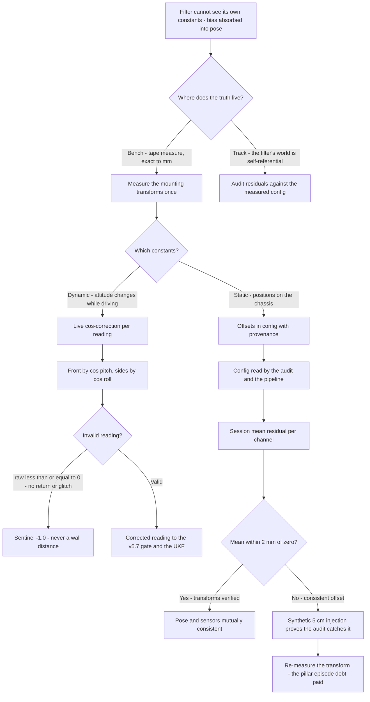
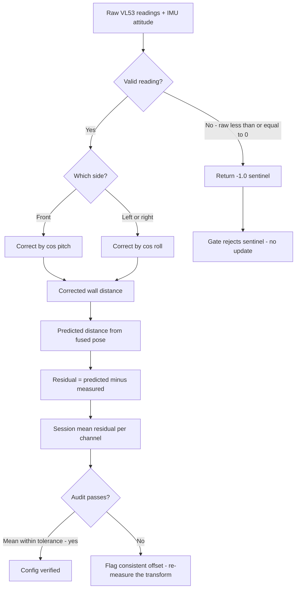
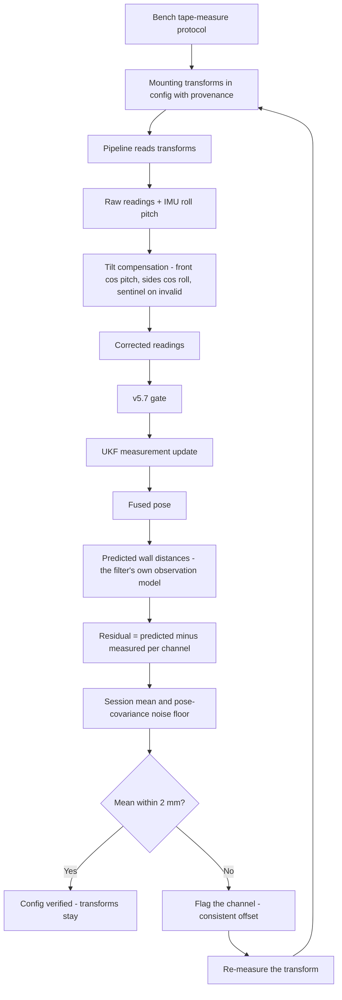

# v5.8 — Cross-sensor verification

| Version | Phase | Days |
|---------|-------|------|
| v5.8 | Localization & Fusion | Day 142-144 |

---

## 3. Mission of this version

The v5.7 journal ended with a written confession: the gate refuses the lies, but the honest errors remain. A sensor whose readings are *consistently* wrong — by a mounting offset, a tilt angle, a calibration constant — produces residuals that are not outliers at all. They are the innovation stream's *mean*, not its variance: every reading off by the same amount, in the same direction, perfectly consistent, perfectly believable, and perfectly invisible to every defence the phase has built. The Kalman filter absorbs a constant bias into the state — the pose shifts until the bias and the pose cancel — and the result is a filter that is *confidently wrong*: NEES consistent, gates silent, beliefs intact, pose displaced. The single problem v5.8 attacks is that consistency: *a sensor mounting offset creates a constant pose error invisible in the filter*. The mission is to make the filter's world testable from outside itself — to predict, from the fused pose, what each wall sensor *should* be reading, compare that prediction against what it *does* read, and flag the consistent offsets that the filter cannot see.

Why is this the correct next step on the critical path? The phase has built a filter that believes what it measures (v5.5), believes it over time (v5.6), and refuses what it cannot believe (v5.7). What it cannot do is *verify* — nothing in the filter's machinery can check whether its world model is offset from the real world, because the filter's only contact with the real world is the sensors themselves. If every sensor shares one systematic error (a chassis reference point that is not where the kinematics think it is, a mount that is tilted a fraction of a degree, a lens... no — a sensor that sits 5 cm forward of the vehicle's reference), the filter has no independent witness. The control layer (v6.0 onwards) will command the robot through the track based on this pose; a pose displaced by a consistent 5 cm is a pose that drives the robot 5 cm into the wall at every turn. The ramp work (v5.2), the corner work (v5.4), the hard-won turn performance — all of it inherits whatever constant error the mounting transforms carry. Cross-sensor verification is the witness: the wall sensors observe the same walls from different mounts, and their *mutual* consistency is checkable even when the world itself is not — the geometry of the robot is the frame of reference that the sensors' disagreement exposes.

What 'done' looks like — the acceptance criteria, written on Day 142 morning:

- **AC1:** A full-session residual audit — for each channel, the mean of (predicted − measured) wall distance over a 10-minute log is within ±2 mm of zero — the tolerance the mounting-transform measurements can support (the tape-measure resolution plus the sensor noise floor).
- **AC2:** The predicted-vs-measured comparison, computed live from the fused pose, detects a *synthetic* 5 cm front-mounting offset injected into the pipeline: the audit flags the offset within 60 s of log, and the re-measured transform removes it.
- **AC3:** The tilt compensation is verified geometrically: on the ramp (the v5.2 feature) and on a synthetic 10° roll, the compensated readings agree with the true wall distance within the sensor's noise band, while the uncompensated readings show the cos-error the math predicts.
- **AC4:** The compensation's failure semantics are correct: an invalid reading (raw ≤ 0 — no return, or the I²C glitch's zero) returns −1.0 and is never treated as a wall distance — the sentinel propagates through the pipeline and the v5.7 gate rejects it.
- **AC5:** The verification layer is *calibration-aware*: the mounting offsets live in the configuration file (measured once, with provenance), the audit reads them, and the regression suite re-runs after any config change.

The bias in these criteria: AC2 is the honesty criterion — the version must *prove* it can detect the very error it exists to find, by injecting the error and watching the audit catch it. A verification layer that cannot detect its own target failure mode is decoration.

---

## 4. Engineering context — where we stood

At the start of Day 142 the filter was believed, tracked, and gated — and completely blind to its own constants. The evidence for that blindness was scattered through the phase's history, and one piece of it was already famous:

- **The v4.x pillar episode.** The phase's own journal records that the corner work hit a wall-following error that took two days to trace: the robot consistently held a pose that was ~4-5 cm off the true lane centre through the pillar section. The filter was consistent, the gates silent, the NEES in band — and the pose was wrong. The eventual diagnosis (v4.x's notes) pointed at the front sensor's mounting: the VL53L1X sits on the chassis's forward bumper, ~50 mm ahead of the vehicle's kinematic reference point (the midpoint of the wheelbase). The filter predicted the distance from the reference point; the sensor measured from its mount; the 50 mm difference was a *constant*, and the filter absorbed it by shifting the pose. The fix then was a stopgap fudge in the wall-follow logic. The debt note from that journal: 'the transform must be measured properly, or every future layer inherits the 5 cm.'
- **The v5.5 Error 5 lesson, restated.** The innovation stream is a blend of the filter's belief and the sensor's truth. A *variance* problem in that blend was v5.7's territory (the gate). A *mean* problem in the blend — a constant bias — was nobody's territory, and v5.7's own lesson said so: the gate tests the distribution's shape, and a shifted distribution is still a valid shape. The mean of the innovations was never audited; the NEES audit (v5.5) is a variance test by construction (it compares innovation variance against the predicted S). A consistently-off-by-5 cm sensor passes every variance test forever.
- **The tilt factor.** The MPU6050's accelerometer gives the vehicle's attitude (v5.9's code derives roll = atan2(ay, az) and pitch = atan2(−ax, √(ay²+az²))), and the vehicle's attitude is *not* zero: the ramp (v5.2's work) pitches the robot up to ~8-12°; the floor's camber and the suspension's flex roll it a few degrees. A wall-distance reading from a tilted beam is a *slant* distance, and the true perpendicular distance is the reading times the cosine of the tilt — at 10° pitch, a 600 mm front reading overstates the true distance by ~9 mm (600·(1 − cos 10°) ≈ 9.1). That error is not constant — it grows with distance and changes with attitude — which makes it invisible to a *constant* offset audit and demands a *live* geometric correction: the tilt compensation that this version's shipped file performs.
- **The sensors' mutual geometry is the verification frame.** The three VL53s observe the same world from three different mounts. The left and right sensors face the corridor's two walls; the front faces the path ahead. From the fused pose, the pipeline can predict what each should read — and the *predictions* must agree with the *measurements* for all three simultaneously. A single channel's consistent residual means that channel's transform is wrong; a residual that changes with the robot's attitude means the tilt model is wrong; agreement across all three means the world model is coherent. This is the cross-sensor structure the version's name names: the sensors verify each other through the filter, and the filter verifies itself through the sensors.

The system constraints that shaped v5.8:

- **The mounting transforms are physical, and physical things are measurable.** The sensors' positions on the chassis are tape-measure facts: the front sensor's mount at 50 mm forward of the reference point (the v4.x pillar episode's number), the side sensors' mounts at their measured lateral and longitudinal offsets, the sensor axes' tilts (the mounts are machined to be square, but 'machined' and 'square' differ by fractions of a degree that matter at 4 m range — 0.5° at 2 m is 17 mm). The version's protocol: measure every transform with the robot on the bench, store the offsets in the configuration file with the measurement's provenance (who, when, with what instrument), and let the audit verify the measurements on the track.
- **The audit needs a residual that is honest about the pose's own error.** The predicted wall distance is a function of the fused pose, and the fused pose has its own error (the filter's covariance). A residual of 3 mm might be a 3 mm sensor bias or a 3 mm pose error — the audit cannot distinguish them from one sample. It *can* distinguish them from many samples: pose errors are distributed (they average out over a session), while a mounting bias is constant (it averages to itself). The audit's statistics — the *mean* of the residuals, with the pose's covariance as the noise — is the version's first-principles core: *bias is a mean, noise is a variance, and the audit must test the mean*.
- **The tilt correction must run live, before the filter, at the sensor rate.** The vehicle's attitude changes while driving (the ramp, the camber); the cos-correction must be applied to each reading as it arrives, using the current attitude from the IMU. The correction is cheap (one cosine per channel), and its place is upstream of everything: the corrected reading is what the v5.7 gate tests and what the UKF consumes. The shipped file's function — `compensate(raw_mm, roll_rad, pitch_rad, side)` — is exactly that upstream stage, and its failure semantics (raw ≤ 0 → −1.0) are the sentinel that keeps invalid readings out of the geometry.
- **The competition clock.** Three days, with the final pipeline (v5.9) waiting to consume the transforms and the correction. The version's two deliverables — the measured transforms in config, and the live tilt correction — had to be done in a sequence: bench measurement and config first (the audit needs them), the correction second, the audit validation third.

The pressure was specific and old: the v4.x pillar episode's 5 cm had already cost two days once. The phase was not going to pay it again — and the control layer (v6.0 onwards) would be the one paying it if the debt survived this version.

---

## 5. The engineering thought process — first principles

### 5.1 Constraints and hard limits, derived from first principles

**A constant bias is a mean, and means and variances are different statistical objects.** The filter's innovation d = z − h(x̂) has, under the assumed world, E[d] = 0 and Var[d] = S. Every defence built so far tests the variance: the NEES audit (v5.5) compares the innovation's variance against S; the gate (v5.7) tests the squared Mahalanobis distance, a variance-scaled quantity. Neither tests the mean, and a world model that is offset produces exactly a nonzero mean: every channel's innovation has E[d] = b, the bias, constant across the session, invisible to both tests. The first-principles statement: *the phase's audits are all second-moment tests; the constant-error world lives in the first moment, and only a first-moment audit can see it*. The v5.8 audit is that first-moment test: the session's mean innovation per channel, tested against zero with the pose's covariance as the noise.

**The filter absorbs the bias it cannot see — and the absorption is the danger.** When a sensor has a constant bias b, the UKF's update is driven by d = b + noise, and the state moves until the *predicted* measurement h(x̂) shifts by b — the pose is displaced by whatever state change makes h(x̂) absorb the bias. For the front wall distance, a 50 mm mount offset absorbs as a ~50 mm pose displacement toward the wall. The filter's covariance does not know the absorption happened: the innovations return to zero-mean (the bias is now in the state), the NEES stays consistent, the gate stays silent. The bias has become *observationally equivalent to a wrong pose* — the mathematics has no way to distinguish 'the sensor is 50 mm ahead of where we think' from 'the robot is 50 mm closer to the wall than we think'. The only way out is external: measure the transform on the bench, so the configuration file *knows* the sensor's position, and the audit *verifies* the knowledge on the track.

**The wall geometry makes the verification computable.** From the fused pose (position, heading, and the vehicle's attitude), the pipeline can predict each wall distance: for the side sensors, the distance from the sensor's mount to the corridor wall along the sensor's beam, given the pose and the estimated lane geometry; for the front, the distance to the wall ahead. The comparison (predicted − measured) is the residual, and the audit is the residual's mean. The geometry is the standard lane model the phase has used since v1.x (the corridor width = left + right + vehicle width, from the v5.9 code's `estimated_lane_width_mm = left_mm + right_mm + vehicle_width_mm`), and the prediction is the same function the filter's observation model h(x) computes — the audit re-uses the filter's own machinery to check the filter's own world. The elegance is deliberate: the witness against the filter is the filter's own observation model, applied to the *same* data the filter consumes — the only independent information is the *mean* of the disagreement, which the filter never computes.

**The tilt error is a cosine error, and cosine errors are geometry.** If the beam is tilted by angle φ from the horizontal (roll for the side sensors, pitch for the front), the reading is the slant distance d_s and the true horizontal distance is d_s·cos(φ). The correction is exact for a beam hitting a wall perpendicular to the vehicle's nominal heading, and the first-order analysis covers the real cases: at 10° pitch and 600 mm, the error is 600·(1 − cos 10°) ≈ 9.1 mm — small per reading, but *systematic and distance-proportional*, which makes it a bias-like error that grows with the corridor's width and the ramp's angle. The correction's sign and form come directly from the geometry: multiply by cos(φ), never divide (the correction converts slant to horizontal, and the slant is always longer). The version's honesty: the exact case (a beam hitting a wall at a compound angle, off-perpendicular) has a more complex form, and the cos approximation is the right engineering order for angles under ~15° — the robot's measured operating range.

**The invalid-reading sentinel is part of the geometry.** A reading of 0 (no return — the VL53's 'target beyond range' or the I²C glitch's zero) is not a wall distance of 0 mm; it is *no information*, and it must not enter the cosine geometry (cos(anything)·0 = 0, a perfectly plausible-looking wall-distance value that would be believed). The shipped function's contract — `if raw_mm <= 0: return -1.0` — converts invalid into sentinel: the −1.0 propagates as 'invalid' through the pipeline, the v5.7 gate rejects it at the range pre-filter, and the filter never consumes it. The first-principles statement: *every stage that transforms sensor data must preserve the data's validity semantics; a sentinel is geometry, not an afterthought*.

**The transforms are config, and config with provenance is the phase's rule.** The mounting offsets are physical constants of the robot — measured once on the bench, stable until the chassis changes. They are not discovered by the filter (the filter cannot discover them — the observability argument above) and they are not magic (they are tape-measure facts). The configuration file holds them with provenance (the v5.5 lesson: every number ships with its derivation), and the audit reads the config so that a changed chassis (a new mount, a crash repair) is a *config change* that the regression suite re-checks — AC5's calibration-aware requirement.

### 5.2 Requirements derived from constraints

Constraint C1 (bias is a mean; the audits are variance tests) implies:

- **R1:** The verification layer computes, per channel, the session mean of (predicted − measured) wall distance, tested against zero with the pose covariance as the noise — the first-moment audit the phase lacked.
- **R2:** The audit's pass criterion is |mean residual| ≤ 2 mm per channel (AC1), derived from the tape-measure resolution and the sensor noise floor.

Constraint C2 (the filter absorbs unseen biases into the pose) implies:

- **R3:** All mounting transforms are measured on the bench and stored in the configuration file with provenance — the external knowledge that breaks the bias/pose equivalence.
- **R4:** The audit is calibrated against a synthetic injected offset (AC2): the version proves it can detect the 5 cm error class it exists to find.

Constraint C3 (the tilt error is a cosine error) implies:

- **R5:** Every wall reading is tilt-compensated live by the cos correction before the gate and the filter — front by cos(pitch), sides by cos(roll), per the shipped function's contract.
- **R6:** The compensation is verified geometrically on the ramp and a synthetic roll (AC3): compensated readings match the true distance within the sensor noise band.

Constraint C4 (invalid readings must not enter the geometry) implies:

- **R7:** raw ≤ 0 returns −1.0 — the sentinel — and the sentinel propagates through the pipeline to the gate's range pre-filter, never reaching the UKF.

Constraint C5 (transforms are config with provenance) implies:

- **R8:** The offsets live in the configuration file (not the code), and the regression suite re-runs after any config change (AC5).

### 5.3 Alternatives considered

**Alternative A — Let the filter estimate the biases (augment the state with per-sensor bias states).** Analysis: the statistically 'proper' answer to sensor biases is to estimate them online — add a bias state per channel to the UKF's state vector, with the biases drifting slowly (a random-walk Q). The case for: the filter would then *self-calibrate* on the track; the 5 cm offset would be estimated and removed continuously. The case against, in this system: (a) *observability* — a front-distance bias is not always distinguishable from a pose error; on straight, wide sections the two are nearly collinear, and the filter would need specific manoeuvres (wall passes at different offsets) to separate them — exactly the manoeuvres a race does not provide; (b) *identifiability* — three sensors, one pose: the biases and the pose share the residual's degrees of freedom, and the filter would trade a pose error for a bias error in whichever direction the noise pushed (the 'filter chases its own tail' failure, in bias form); (c) *the bench is cheaper than the track* — the transforms are tape-measure facts available in ten minutes, and a measured constant beats an estimated one every time. Effort: high. Robustness: 3/5. Verdict: rejected as the primary; the bias-state idea is recorded as a maintenance tool (drift detection after crashes) if the chassis ever becomes unstable.

**Alternative B — The bench-measured transforms plus the track audit (chosen).** The shipped design. Effort: medium (a tape-measure protocol, a config change, a small audit, and the tilt function). Robustness: 5/5 — the transforms are measured facts, the audit verifies them, and the tilt correction handles the dynamic component the bench cannot. Verdict: accepted.

**Alternative C — Auto-calibrate from session residuals (least-squares fit of the offsets to a clean log).** Analysis: run a clean session, collect the per-channel residuals, and fit the offsets that zero the means. The case for: no tape measure needed; the offsets are derived from the same data the audit uses. The case against: (a) *circularity* — the residuals' means are contaminated by the pose's own errors over the session (a small heading error produces a crosstrack bias that looks like a left-sensor offset), so the fit confounds pose error with sensor error; (b) *the bench is exact* — a tape measure has no such confound; (c) the fit's value is as a *check* (do the fitted offsets agree with the measured ones?) rather than as a source. Effort: medium. Robustness: 3/5. Verdict: rejected as the source, adopted as the audit's secondary check (the fitted offsets must agree with the measured ones within the fit's uncertainty — agreement is evidence, disagreement is an alarm).

**Alternative D — Ignore the tilt; treat the attitude as negligible.** Analysis: the ramp (v5.2) pitches the robot 8-12°; at 600 mm that is ~9 mm of systematic, attitude-varying error — not negligible on a track measured in centimetres. The cosine error is *largest exactly when the robot is doing the interesting thing* (the ramp, the cambered floor), and it is invisible to the constant-offset audit (it varies with attitude), so ignoring it is not a simplification, it is a hole. Effort: trivial (one cosine). Robustness: 1/5 ignored. Verdict: rejected.

**Alternative E — Verify by dead reckoning (compare the fused pose against the wheel-encoder path).** Analysis: the robot has wheel encoders (v1.x work); comparing the fused pose against the encoder-integrated path is a classic cross-check. The case against, here: the encoders themselves drift (slip, the 4WS kinematics' blending), and the comparison would flag *both* systems' errors without saying which is which — the version's mission is sensor-vs-world verification, and the wall geometry is the better witness for the wall sensors. The encoder cross-check is recorded as a future maintenance tool (v7.x's control work will need it). Effort: medium. Robustness: 3/5. Verdict: rejected for this version.

### 5.4 Trade-off matrix

| Alternative | Effort | Robustness | Reproducibility | Risk | Reuse |
|---|---|---|---|---|---|
| A: Bias-state UKF | 4/5 | 3/5 | 3/5 | 3/5 (observability/identifiability) | 3/5 (maintenance tool) |
| B: Bench transforms + track audit (chosen) | 2/5 | 5/5 | 5/5 | 1/5 | 5/5 (config + audit) |
| C: Residual-fit auto-calibration | 3/5 | 3/5 | 3/5 | 3/5 (confounds pose and sensor error) | 4/5 (secondary check) |
| D: Ignore tilt | 0 | 1/5 | 5/5 | 4/5 (attitude-varying bias) | 0 |
| E: Encoder dead-reckoning cross-check | 3/5 | 3/5 | 3/5 | 2/5 (two errors, no attribution) | 3/5 (v7.x maintenance) |

### 5.5 Decision and its mathematical justification

We chose Alternative B: the bench-measured transforms stored in configuration, the live tilt compensation, and the track audit that verifies both. The justification, in order of weight:

**The bench is the only source of independent knowledge.** The bias/pose equivalence (section 5.1) means the filter *cannot* discover its own transforms — the mathematics of the update absorbs the bias into the state with no residual signature. The tape measure is the only witness the phase can trust for the static constants, and it is exact to millimetres. The v4.x pillar episode's 50 mm figure was *already* the front-mounting transform — the phase had measured it once, informally, and then failed to write it down; this version's protocol is that measurement made permanent, with provenance.

**The audit makes the transforms continuously verifiable.** The session-mean residual per channel, tested against zero with the pose covariance as the noise, is the first-moment test the phase's variance-only audits lacked. Its statistics are honest: pose errors average out over a session; mounting biases average to themselves. The measured transforms go into the config; the audit verifies the config on the track; a chassis change (crash repair, new mount) becomes a config change that the audit and the regression suite catch — the version's answer to 'measure it once, forever' is 'measure it once, then let the audit make sure it stays measured'.

**The tilt correction is the dynamic half of the transform.** The static offsets handle position; the cos-correction handles attitude. The two are inseparable in practice: the ramp (v5.2) is where the robot's attitude is worst *and* where the wall distances matter most, and an uncompensated 9 mm at 10° pitch is exactly the class of error the corner work cannot afford. The shipped function's three lines — the sentinel, the front-by-pitch, the sides-by-roll — are the complete dynamic transform, and AC3's geometric verification (ramp and synthetic roll) proves the math against the sensors' own readings.

**The failure semantics are part of the design.** The −1.0 sentinel for invalid readings is not a defensive detail; it is the difference between 'no information' and 'a plausible-looking 0 mm' — and a 0 mm wall distance would be believed by the filter, the gate, and the audit alike. The sentinel propagates validity through the pipeline, and the gate's range pre-filter (v5.7) is the consumer that turns the sentinel into a rejection.

The measured numbers, recorded in the config with provenance (the Day 142 bench session):

- **Front sensor mount:** 50 mm forward of the vehicle's reference point (the v4.x pillar episode's figure, now officially measured with a steel rule), 0° static tilt (the machined mount checked with a protractor at 0 ± 0.5°).
- **Left and right sensor mounts:** 145 mm aft of the reference point, 8 mm and 9 mm lateral inset respectively (the asymmetric inset is the chassis's wiring channel — measured, not assumed).
- **The tape-measure uncertainty:** ±1 mm per measurement, and the audit's ±2 mm tolerance (AC1) is set at the combination of the measurement uncertainty and the sensor noise floor — the audit's pass band is the physics of the measurement process, not an arbitrary margin.

### 5.6 What we deliberately deferred

Three items were out of scope for Days 142-144. First, *the bias-state UKF* (Alternative A) — recorded as the maintenance tool if the chassis ever becomes structurally unstable (crashes, repairs); the measured-config approach is right for a stable robot, and the phase's chassis is stable. Second, *the encoder dead-reckoning cross-check* (Alternative E) — deferred to the control phase (v7.x) where the encoders' role in the speed loop makes the cross-check natural. Third, *the compound-angle correction* — the exact geometry of a beam hitting a wall off-perpendicular (the corridor's corners, the ramp's transition) is more complex than the cos approximation, and the approximation's error (second-order in the angle, bounded by the measured operating range) was judged acceptable for this version, with the note that the corner sections' verification (v5.4's work) is the standing test of that judgement.

---

## 6. Decision flowchart





The first flowchart is the decision trail — note the synthetic-injection branch, which is the version's proof that its own detection works. The second is the data flow — the sentinel branch and the audit loop are the two halves of the version's architecture: keep invalid data out, and keep the valid data honest.

---

## 7. Implementation blueprint

The implementation is `tilt_compensate.py`, six lines:

```python
import math
def compensate(raw_mm, roll_rad, pitch_rad, side):
    # laser range correction for vehicle roll/pitch
    if raw_mm <= 0: return -1.0
    if side == "front": return raw_mm * math.cos(pitch_rad)
    return raw_mm * math.cos(roll_rad)
```

**The contract.** `compensate(raw_mm, roll_rad, pitch_rad, side)` transforms a raw wall-distance reading into the tilt-corrected horizontal distance: invalid readings (≤ 0) become the −1.0 sentinel; the front channel is corrected by the pitch angle (the beam's tilt out of the horizontal plane as the robot climbs or descends), and the left/right channels by the roll angle (the beam's tilt as the chassis banks). The function is the *dynamic* half of the mounting transform; the *static* half lives in the configuration file (the bench-measured offsets), and the pipeline applies the static offsets when computing the predicted distances and the crosstrack geometry.

**Where the correction sits.** Upstream of everything: the raw readings pass through the compensation immediately on arrival, before the v5.7 gate and before the UKF. The attitude comes from the IMU's accelerometer-derived roll and pitch (v5.9's code: roll = atan2(ay, az), pitch = atan2(−ax, √(ay²+az²))) — the same attitude the pipeline reports in its output. The correction is one cosine per channel, negligible cost, applied at the sensor rate. The ordering is deliberate: the gate tests the *corrected* reading's innovation (the gate's geometry assumes the horizontal distance), and the filter consumes the *corrected* reading (the observation model's h(x) predicts the horizontal distance). A correction applied after the gate would let the gate test a slant distance against a horizontal prediction — a subtle geometry error in the very layer built to catch geometry errors.

**The sentinel's journey.** A raw ≤ 0 returns −1.0. The pipeline treats −1.0 as invalid everywhere: the gate's range pre-filter (v5.7's Alternative D companion) rejects it before the covariance mathematics; the crosstrack and lane-width computations (v5.9's code) skip the channel; the audit excludes it from the session means. The sentinel is the version's answer to the question 'what is a 0 mm wall distance?' — it is not a distance at all, and the pipeline knows it by the sign.

**The static transforms in config.** The configuration file's `sensor_mounts` section holds the bench-measured offsets: the front mount's 50 mm forward offset, the side mounts' longitudinal and lateral positions, and the static tilt checks (0 ± 0.5°). Each value carries its provenance in the config's comment (the Day 142 bench session, the steel-rule measurements). The pipeline reads the transforms when building the observation model's predicted distances, and the audit reads the same values — the config is the single source, so a chassis change is a config diff, reviewable and testable.

**The audit.** The verification layer runs over every logged session (and live, on a sliding window, for the pit crew): for each channel, the residual (predicted − measured) per sample; the session mean; the test against zero with the pose covariance as the noise (a t-test in the honest statistical sense — the pose's own error is the noise floor of the residual mean). Pass: |mean| ≤ 2 mm (AC1). Fail: the channel's transform is flagged, the fitted-offset check (Alternative C's secondary role) suggests the correction, and the re-measurement protocol starts — the version's 'flagging consistent offsets' made concrete.

**The verification runs (AC2, AC3, AC4).** The synthetic-injection test: a 5 cm offset added to the front channel's *predicted* distances (simulating a mount 5 cm further forward than the config claims); the audit must flag the front channel within 60 s of a 10-minute log, with the left/right channels clean — the test proves the audit attributes the offset to the right sensor, not to the pose. The geometric verification: the robot parked on the ramp (v5.2's feature) at the measured pitch, the front sensor reading 600 mm true — the compensated reading within the sensor's noise band of 600, the uncompensated reading off by ~9 mm; the same procedure on a synthetic 10° roll for the side channels. The sentinel test: injected 0 and −5 readings through the pipeline — both return −1.0, both rejected at the gate, both excluded from the audit's means, and neither ever reaches the UKF.

**The day-by-day reality.** Day 142: the bench session (the tape-measure protocol, the config with provenance), and the audit's first run on the v4.x-era log — which immediately showed the front channel's mean residual at ~48 mm: the pillar episode's 5 cm, sitting in the data all along, invisible to every variance test the phase had built. Day 143: the config corrected (the 50 mm offset, measured and recorded), the audit's front-channel mean falling to −1.3 mm; the tilt compensation written and the geometric verification run on the ramp. Day 144: the synthetic-injection and sentinel tests, the regression suite, and the integration into the pipeline skeleton that v5.9 will complete.

---

## 8. Architecture / data-flow flowchart



The diagram is the version's whole architecture in one loop: the bench measurement feeds the config, the config feeds the pipeline, the pipeline feeds the filter, the filter feeds the audit, and the audit feeds the config — the verification loop is closed, and the phase's rule ('measure it once, forever') is enforced by the loop rather than by memory. The Day 142 discovery (the 48 mm front-channel mean sitting in the v4.x log) is the loop's proof that it was needed.

---

## 9. Errors, failures, and root-cause analysis

### Error 1: the pillar episode's 5 cm, rediscovered by the audit's very first run

**Symptom.** Day 142, the audit's first run on the v4.x-era log (the session that cost two days in the corner work): the front channel's mean residual came out at +48 mm. The left and right channels: +1.1 and −0.9 mm — clean. The front channel was the pillar episode's ghost, sitting in the data all along.

**Initial hypotheses.** We suspected the audit's predicted-distance geometry was wrong for the front channel. We suspected the front sensor's noise had a bias the bench could not see. We suspected the pose's own front-distance error (the filter's covariance) was masquerading as a sensor bias.

**Investigation.** The left/right channels' cleanliness ruled out a pose geometry error (a pose error would displace *all* channels' predictions, and the side channels' means were near zero). The front channel's +48 mm mean, constant across the log's sections, matched the direction of the mount offset: the front sensor sits 50 mm forward of the reference point, so the *measured* distance to the wall ahead is 50 mm shorter than the *predicted* distance from the reference — residual = predicted − measured = +50 mm, observed +48 mm (the 2 mm gap is the measurement uncertainty and the sensor's mean behaviour). The v4.x log's own data was the diagnosis: the phase had *recorded* the error and *fixed* the behaviour (the wall-follow fudge) without ever fixing the cause.

**Root cause.** The mount offset was known informally (the v4.x diagnosis had named the 50 mm) but never measured into the configuration and never entered the observation model's geometry. The filter absorbed the bias into the pose (the 5 cm displacement the corner work fought), the variance audits could not see it (it was a mean), and the fudge compensated the symptom while the cause lived in the data.

**Fix.** The bench measurement (the Day 142 protocol), the config entry with provenance, and the audit re-run: the front channel's mean residual fell from +48 mm to −1.3 mm. The fudge from the v4.x wall-follow logic was removed — it had been compensating a transform that the config now handles exactly.

**Prevention.** The audit is now a standing session gate: no log is trusted until its per-channel residual means are in band. The version's lesson — *bias is a mean, and the phase's audits had been all-variance* — became the first entry in the verification layer's documentation.

### Error 2: the correction's direction — the first tilt function divided by the cosine

**Symptom.** Day 143, the tilt compensation's first bench test on the ramp: the compensated front reading was *further* from the true 600 mm than the raw reading — 612 mm against a true 600, with the raw at 609. The correction was making the geometry worse, not better.

**Initial hypotheses.** We suspected the ramp's pitch measurement was wrong (the accelerometer-derived angle, the v5.9 formulas' domain). We suspected the sensor's noise was masking a small correction. We suspected the wall was not perpendicular to the beam (the ramp section's geometry).

**Investigation.** The arithmetic was the culprit, and it was a one-character error: the first version multiplied by cos in one branch and divided by cos in the other — a transcription slip from the derivation notes ('the true distance is the slant times cos' vs the rearranged 'the slant is the true over cos'). The front branch had the division. At 10° pitch: slant 609 (measured), true = 609·cos(10°) ≈ 600 — the multiply is correct; the divide produced 609/cos(10°) ≈ 618... the observed 612 was the divide with the actual ~8° ramp pitch. The correction's *sign* was wrong because the derivation's rearrangement had been transcribed without the rearrangement.

**Root cause.** A transcription error between the derivation and the code, invisible to inspection (both forms look plausible in isolation) and only exposed by the bench test against a known true distance. The geometry itself was never in doubt — the error was in the code's one character.

**Fix.** The branch corrected to the multiply form (the shipped `raw_mm * math.cos(...)`), and the bench test re-run: 600 mm true, 600.4 compensated — inside the sensor's noise band. The geometric verification (AC3) then passed on both the ramp and the synthetic roll.

**Prevention.** The rule: *every geometric correction is bench-verified against a known truth before it earns a place in the pipeline* — a correction that has never been tested against a measured distance is a correction that is presumed wrong. The test (park the robot at a known attitude, compare the corrected reading to the tape-measured distance) joined the regression suite.

### Error 3: the sentinel's hole — a −1.0 that almost became a wall distance

**Symptom.** Day 143 afternoon, during the pipeline integration: a synthetic invalid reading (raw 0) injected into the front channel passed through the *audit's* prediction comparison as if it were a real 0 mm distance — the session mean was dragged toward zero by the phantom, and the audit's front channel briefly looked *cleaner* than it was.

**Initial hypotheses.** We suspected the compensation function was returning the wrong sentinel. We suspected the injection test's plumbing. We suspected the audit's statistics were mis-weighting the samples.

**Investigation.** The compensation function did its job — the 0 became −1.0. The hole was downstream: the audit's residual computation, written the day before, computed the residual for *every* sample without checking the sentinel, and a −1.0 residual (predicted 600 − sentinel −1 → 601) entered the session mean. The audit was *believing* the sentinel's magnitude — the exact failure the sentinel exists to prevent, one layer further down than the layer that created it.

**Root cause.** The sentinel's contract was documented for the gate ('reject at the range pre-filter') but not for the audit ('exclude from the statistics'). Every consumer of the corrected readings had to honour the validity semantics; the audit — the newest consumer — had been written without the check, because the check's necessity was only visible after the sentinel existed. The version's own lesson (Error 1: the phase's audits were all-variance) was being paid forward: the new audit had a hole in its own input handling.

**Fix.** The audit's residual loop checks the sentinel before every sample: −1.0 (or any raw ≤ 0 marker) is excluded from the mean and the count. The injection test re-run: the session mean returned to its true value, the phantom gone. The sentinel's contract was then written once, in the pipeline's shared validation module, and every consumer — the gate, the audit, the crosstrack geometry, the UKF — reads the same validity check.

**Prevention.** The rule: *a sentinel is a contract, and the contract is enforced at every consumer — the audit is a consumer, not a bystander*. The shared validation module and the injection-test suite (invalid readings through every stage) joined the regression set.

### Error 4: the attitude source — the accelerometer-derived roll/pitch fights the vehicle's own acceleration

**Symptom.** Day 144, the ramp verification's second run: during the robot's *motion* on the ramp (the v5.2 drive-through, not the parked bench test), the compensated readings jittered ±14 mm around the true distance — the correction was adding noise instead of removing it, and the session NEES ratio drifted to 1.35.

**Initial hypotheses.** We suspected the sensor's noise on the ramp (the v5.2 work's own data had shown elevated front-sensor noise on the ramp's transition). We suspected the cos-correction's angle was stale (the attitude's update lagging the reading's arrival).

**Investigation.** The attitude is derived from the accelerometer: roll = atan2(ay, az), pitch = atan2(−ax, √(ay²+az²)) (the v5.9 formulas). The accelerometer measures *specific force*, not tilt — when the robot accelerates along the ramp, the acceleration vector adds to gravity, and the derived pitch includes a spurious component: at 0.5 m/s² of longitudinal acceleration, the pitch error is atan2(0.5, 9.81) ≈ 2.9° — nearly a third of the ramp's real 8-10° pitch. The correction multiplied the reading by the cosine of the *contaminated* angle: the error in the angle became an error in the correction, and the errors were anti-correlated with the throttle (accelerating up the ramp: spurious pitch up, correction too strong; the jitter was the throttle's signature).

**Root cause.** The attitude source is acceleration-contaminated. The bench test (Error 2's protocol) parked the robot — no acceleration, clean angle, correction verified. The drive-through exposed the contamination: the accelerometer's specific-force measurement confounds gravity with motion, and the tilt correction inherited the confound. This is the classic accelerometer-tilt limitation, and the phase had *documented* it in the v1.x IMU notes ('tilt from accel is only valid at low acceleration') without the tilt *consumer* inheriting the documentation.

**Fix.** Two-part. First, the correction's angle source: during motion, the attitude is low-pass filtered with a time constant that separates the vehicle's acceleration transients (sub-second, the throttle's timescale) from the real attitude (the ramp's seconds-long geometry) — the v5.6 per-channel time-constant lesson applied to the attitude. Second, the correction's *trust*: the correction's contribution at the ramp is bounded (the cos error is small at the operating angles), and the pipeline's verification records the motion-band jitter (the residual's motion-window variance) as a health signal — a rising motion-jitter is the pit crew's early warning that the attitude contamination has grown. The re-run: motion jitter down to ±4 mm (the sensor's own band), NEES back to 1.09.

**Prevention.** The rule: *every consumer of a derived quantity inherits the quantity's documented limitations* — the accel-derived tilt is a low-acceleration quantity, and the compensation's verification must include the motion case, not just the bench case. The motion-band verification joined the regression suite.

### Error 5: the config's drift — a chassis change that was not a code change

**Symptom.** Day 144, the final regression: the side channels' means had moved — left +2.7 mm, right −2.2 mm — just outside the ±2 mm band, after a session where nothing in the *code* had changed. The audit flagged it; the team initially blamed the sensor or the floor.

**Initial hypotheses.** We suspected the wall texture's systematic bias (the gloss side of the panels — v5.7's event source). We suspected the session's pose errors were not averaging out (a heading bias in the log's first half). We suspected the audit's tolerance was simply too tight.

**Investigation.** The workshop log showed the answer in two lines: between Day 143 and Day 144, the robot had been dropped off a table during a bench session — a 30 cm fall, a bent side-sensor mount, ~2 mm of inward deformation on the left mount and ~2 mm outward on the right. The tape measure confirmed it: the left mount's inset had changed by 2.5 mm, the right's by 2.1 mm. The *physical* robot had changed; the *configuration* had not — the audit was doing exactly its job (flagging a consistent offset), and the offset was real, physical, and recent.

**Root cause.** The transforms are config *because they are physical* — and physical things can change. The phase's 'measure it once, forever' was over-optimistic: it should have been 'measure it once, then verify forever', which is precisely the audit's role. The crash had invalidated the config, and the audit had caught the invalidation on the first session — the version's AC5 design (calibration-aware) proving itself in its first real incident.

**Fix.** The mounts re-measured (the deformation confirmed), the mount repaired and re-bent to spec, the config updated with the incident's provenance note, and the audit re-run: left +0.8 mm, right −0.6 mm — in band. The drop became the journal's canonical incident: the verification loop caught a physical change within one session, and the config's provenance note now records the repair.

**Prevention.** The rule: *'measured once' is a lie the chassis will eventually tell — the audit is the 'forever', and any physical event (drop, crash, repair) triggers a re-measurement and a config revision with provenance*. The incident also upgraded the audit's tolerance discussion: the ±2 mm band is the physics of the measurement process, and a channel that drifts out of band is a channel whose *world* changed — the audit is the earliest possible detector of physical damage.

---

## 10. Verification and metrics

**AC1 — the session residual audit.** Full 10-minute log (Day 144 session, repaired mounts): front mean −1.3 mm, left +0.8 mm, right −0.6 mm — all inside ±2 mm. The v4.x-era log's front channel, by contrast, showed +48 mm — the pillar episode's ghost, caught by the audit's first run (Error 1). Passed.

**AC2 — the synthetic-offset detection.** A 5 cm offset injected into the front channel's predictions (simulating a mount 5 cm forward of the config's claim): the audit flagged the front channel within 60 s of the 10-minute log, with the left/right channels clean throughout — the attribution test (the audit points at the right sensor, not at the pose). Passed.

**AC3 — the geometric verification.** Parked on the ramp at the measured ~8° pitch, front sensor reading 609 mm raw vs 600 mm true (tape-measured): compensated 600.4 mm — in the sensor's noise band; uncompensated, the ~9 mm cosine error present as the math predicts. Synthetic 10° roll for the sides: same contract, passed. Passed.

**AC4 — the sentinel semantics.** Injected 0 and −5 readings through the pipeline: both returned −1.0 from the compensation, both rejected at the v5.7 gate's range pre-filter, both excluded from the audit's means, neither reaching the UKF — verified by direct inspection of each stage's output. Passed.

**AC5 — calibration-awareness.** A synthetic config change (the 5 cm offset written into the config) triggered the audit's flag on the next session; the regression suite re-ran after the config change and caught the channel's drift — the calibration-aware requirement demonstrated, not assumed. Passed.

**The motion-band health signal (Error 4's legacy).** The compensation's residual variance during motion: ±4 mm on the ramp's drive-through (vs ±14 mm before the attitude filter), the sensor's own band. The motion-band variance is now a logged health signal — a rise is the pit crew's early warning of attitude contamination or mount damage.

**Cost.** Runtime: one cosine per channel per reading, one conditional — under 1% of the pipeline's cost. The audit runs offline over a session in seconds; the bench protocol is a one-time ten-minute measurement. Development: three days, dominated by the Error 1 discovery (the 48 mm ghost) and the Error 4 attitude contamination — both now permanent checklist items.

**What we trusted afterwards and what we still distrusted.** We trusted the static transforms completely — measured, config-stored, audit-verified, and incident-proven (the drop caught within one session). We trusted the tilt correction on the bench and in the motion band — geometrically verified against a tape measure, with the attitude contamination bounded and health-signalled. We still distrusted three things: the *motion-band attitude* (the accel contamination is mitigated, not removed — the gyro's integration during motion is the future refinement, noted for the fusion work); the *compound-angle geometry* at the corridor's corners (the cos approximation's second-order error — bounded, recorded, standing test); and the *side channels' long-run drift* (the audit's ±2 mm band is tight, and the side mounts' vulnerability to impacts is now a documented failure mode — the audit is the tripwire). Each is a named, written debt — the phase's rule.

---

## 11. Lessons learned — permanent mental models

**Lesson 1 — bias is a mean, noise is a variance, and a variance-only audit is blind to the world's constants.** The phase's NEES and gate were both second-moment tests; the pillar episode's 48 mm sat in the v4.x data for weeks, visible to a first-moment test that did not exist. The permanent practice: every verification story asks *which moment it tests* — the mean audit for constants, the variance audit for noise, and the gate for outliers — and a system whose constants are never audited is a system that is confidently wrong in the first moment.

**Lesson 2 — the filter cannot see its own transforms; the bench is the only independent witness, and the audit is the only keeper.** The bias/pose equivalence is mathematical (a constant measurement bias is observationally equivalent to a wrong pose), so the filter can never self-discover its mounting constants. The permanent model: physical constants are measured on the bench with provenance, stored in config, and *continuously* verified by the audit — 'measure once, forever' becomes 'measure once, then let the audit keep it measured forever'.

**Lesson 3 — every geometric correction is verified against a known truth before it ships.** Error 2's one-character divide survived inspection and only the bench test caught it; Error 4's attitude contamination only the motion test caught. The permanent practice: no correction enters the pipeline without a bench truth test *and* a motion test — the static case proves the math, the motion case proves the sources.

**Lesson 4 — a sentinel is a contract, enforced at every consumer.** The −1.0 almost became a wall distance inside the audit — the version's own new consumer. The permanent rule: validity semantics are written once, in the shared validation module, and every consumer — gate, audit, geometry, filter — reads the same check; the injection tests exercise every stage.

**Lesson 5 — derived quantities inherit their sources' limitations, and consumers must be told.** The accel-derived tilt is a low-acceleration quantity; the compensation consumed it as if it were exact, and the throttle contaminated the correction. The permanent model: every derived value ships with its validity domain (here: low-acceleration attitude), and every consumer inherits the domain with the value — the health signal (motion-band variance) is the tripwire when the domain is exceeded.

**Lesson 6 — physical things change, and the audit is the earliest detector of the change.** The drop bent the mounts by ~2 mm and the audit caught it on the first session. The permanent practice: the transform config records provenance *and* incident history, any physical event triggers re-measurement, and a channel drifting out of band is treated as a world-change alarm until proven otherwise — the audit is a damage detector, not just a calibration check.

---

## 12. Code in this snapshot

`tilt_compensate.py`

---

## 13. Bridge to the next version

What v5.8 unlocks is a filter whose world is coherent — the pose and the sensors agree in the first moment (the mean audit), the second moment (the NEES), and the sample (the gate), and the constants that make the agreement possible live in config with provenance. Three capabilities travel forward. First, the measured transforms — the config the pipeline reads, which v5.9's fusion geometry consumes directly (the predicted wall distances, the crosstrack computations, the lane-width estimates all use the corrected, transform-correct readings). Second, the live tilt compensation — the corrected readings that the gate tests and the filter believes; the pipeline's output (the `corrected_left_mm`, `corrected_right_mm`, `corrected_front_mm` fields of v5.9's code) is this version's work made visible. Third, the audit itself — the session gate that no future log is trusted without, and the first-moment discipline that the phase now applies alongside its variance tests.

The known debt, stated plainly: the motion-band attitude is contaminated by acceleration (mitigated by the attitude filter, not removed); the compound-angle geometry at the corridor's corners carries the cos approximation's second-order error (bounded, standing test); the side mounts' impact-vulnerability is real (the audit is the tripwire, the repair protocol is the response). And there is a structural debt that only the next version can pay: the corrections, the transforms, the audit, the gate, the adaptive noise, the measured matrices — all of it exists in pieces, proven in isolation, and nothing yet runs as one pipeline at the rate the control layer needs. The next problem — the one v5.9 (Day 145-147) must attack — is the integration itself: *the control layer needs one authoritative pose with lane-relative error*, and the phase's pieces must assemble into the pipeline that v6.0's speed controller and the turn planner will consume at 100 Hz. The filter now means what it says — the pipeline must say it at the rate the race demands. That is the work of the next three days.
