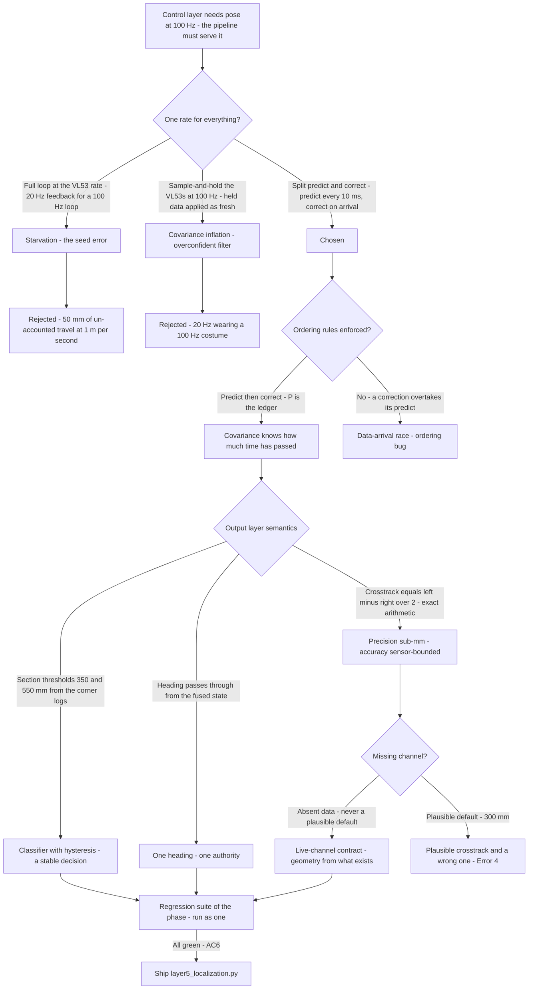
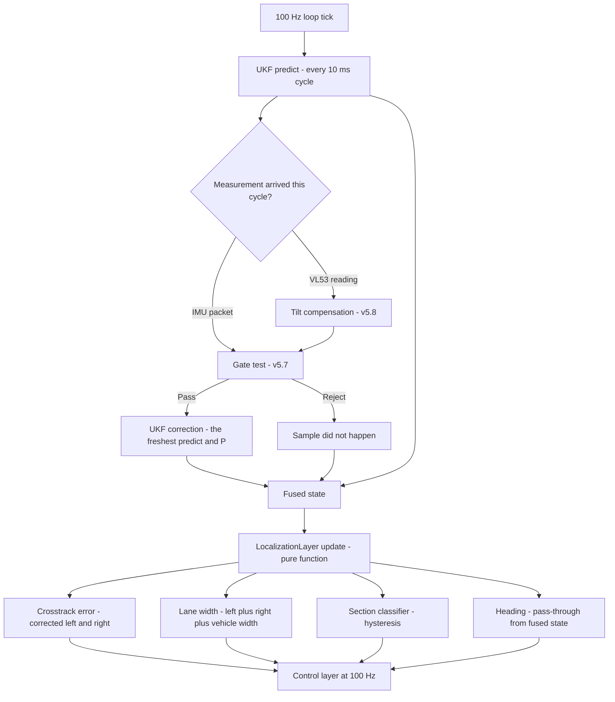
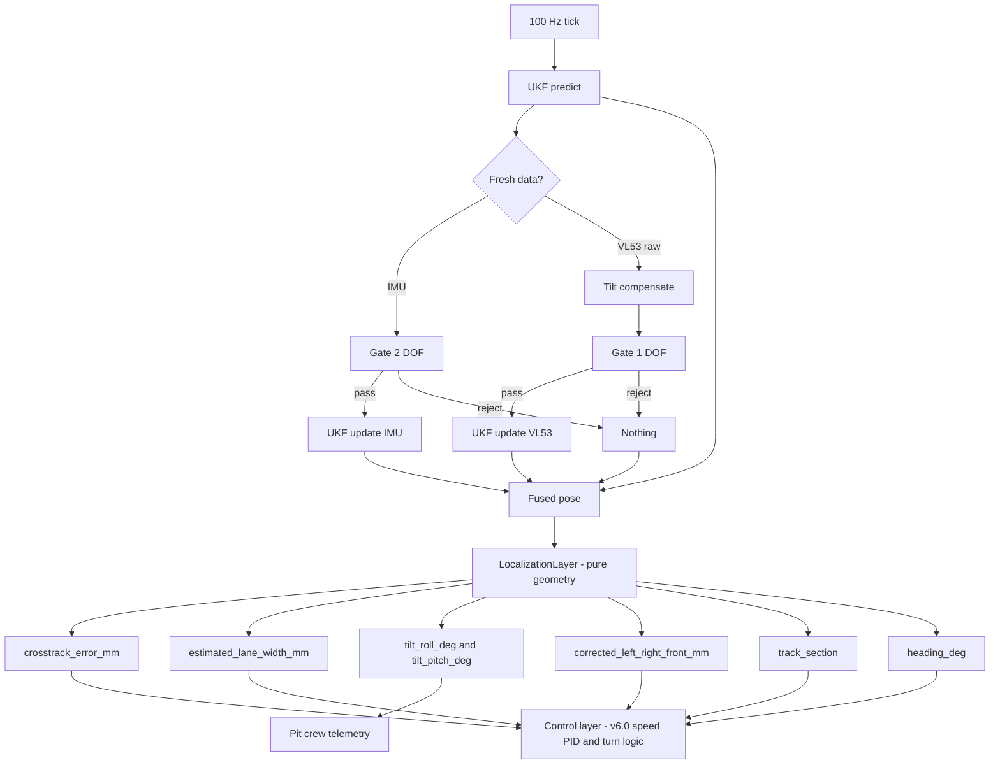

# v5.9 — Pose pipeline integration

| Version | Phase | Days |
|---------|-------|------|
| v5.9 | Localization & Fusion | Day 145-147 |

---

## 3. Mission of this version

The phase has built the pieces of a world: the UKF (v5.4) with measured noise (v5.5), adaptive belief (v5.6), a gate that refuses lies (v5.7), and verified, tilt-compensated sensors (v5.8). Every piece is proven in isolation. Nothing runs together yet. The single problem v5.9 attacks is the assembly: the final localization pipeline that runs at the rate the race demands and produces the one output everything downstream needs — a pose with lane-relative error, expressed the way the control layer can consume it. The mission is the pipeline: UKF predict at 100 Hz every cycle, IMU and VL53 corrections applied the moment their data arrives, tilt compensation upstream, and — after the filter — the layer that converts the fused pose into the control layer's language: crosstrack error, estimated lane width, track section, and heading. One authoritative pose. One rate. One contract.

Why is this the correct next step on the critical path? The control phase (v6.0 onwards) is about to command the robot through the track, and a controller can only be as good as its feedback. The v6.0 speed controller will consume the UKF's velocity state; the turn planner will consume the crosstrack error and the section classifier; every future version inherits the pipeline's rate, its outputs, and its failure modes. Two properties of the assembly are load-bearing. First, the *rate*: the control loop will run at 100 Hz, and a pose that arrives at 20 Hz is a pose the controller cannot use — the seed's error (the full pipeline running at 20 Hz, starving the 100 Hz controller) is a structural one, not a tuning one. Second, the *semantics*: the control layer needs lane-relative error (how far am I from the lane's centre, which way, what is the track doing ahead) — and the layer that computes it must be honest about what it can and cannot claim, because the crosstrack and section outputs will be believed by controllers that act on every number.

What 'done' looks like — the acceptance criteria, written on Day 145 morning:

- **AC1:** The pipeline sustains 100 Hz end-to-end for the duration of a 10-minute log replay — the UKF predict runs every 10 ms cycle without exception, and corrections are applied within the cycle their data arrives.
- **AC2:** The lane-relative outputs are correct against the recorded truth: crosstrack error within ±5 mm of the video-tagged ground truth through the straight sections, and the track-section classifier matches the recorded section map (STRAIGHTAWAY / CORNER_APPROACH / CORNER_IN_TURN) with zero misclassifications beyond the boundary tolerance.
- **AC3:** The tilt compensation and the mounting transforms (v5.8) are active in the pipeline: the corrected wall distances appear in the outputs (`corrected_left_mm`, `corrected_right_mm`, `corrected_front_mm`), and the ramp session's outputs match the v5.8 geometric verification's numbers.
- **AC4:** The pipeline degrades honestly: a missing or invalid channel (the v5.8 sentinel, the v5.7 rejection) never produces a plausible-looking wrong output — the crosstrack and lane-width outputs reflect the channels that actually exist, and the control layer is told which channels are live.
- **AC5:** The section classifier is stable: a reading jittering around the 350/550 mm boundaries does not flip the classification faster than the control layer can react — the classifier's output is a decision the controller can schedule on, not a jitter signal.
- **AC6:** The regression suite of the entire phase passes through the assembled pipeline: NEES in [0.5, 1.5], the oscillation test, the spike-containment test, the gate's calibration, the audit's residual means — the assembly must not regress the pieces.

The bias in these criteria: AC2 is the honesty criterion — the pipeline's headline outputs are claims about the world, and the version verifies them against recorded truth rather than self-consistency. AC4 is the safety criterion — the pipeline must be trustworthy in its failures, because the control layer will act on its every output.

---

## 4. Engineering context — where we stood

At the start of Day 145 the pieces were proven and the assembly was the only missing thing. The context, in the phase's own words:

- **The filter's rate capability.** The UKF's predict step is a matrix algebra operation on a 6-state filter — microseconds on the Pi. The measurement updates are the expensive part (the covariance inversions), and they only run when data arrives. The filter's *natural* architecture is asynchronous: predict at the loop rate, correct at the data rate. The v5.4 design had this in mind — the filter was built as `predict` + `update_imu` + `update_vl53` — but the *pipeline* around it (the glue that feeds the filter) had never been assembled, and the first assembly attempt (the seed's error) ran the whole thing synchronously at the VL53s' I²C-limited rate.
- **The sensor rates are unequal.** The IMU produces a packet every 10 ms (100 Hz, the MPU6050 at its configured rate). The VL53s are I²C devices sharing a bus with the ESP32's other peripherals: each measurement takes ~20-30 ms (the sensors' ranging periods plus the bus arbitration), and the three VL53s' reads are serialised — a full wall-sensor round at ~15-20 Hz was the observed reality. The two streams cannot be forced to one rate without either starving the IMU (running everything at 15 Hz) or faking the VL53s (sample-and-hold of stale readings). The pipeline's architecture had to embrace the asymmetry.
- **The control layer's needs were known and waiting.** The v6.0 design (already sketched in the phase plan) needs the velocity state at 100 Hz for its speed PID; the turn logic needs the crosstrack error and the section classifier; the heading output feeds the steering decisions. The phase's plan named the pipeline's outputs before the pipeline existed — the `layer5_localization.py` output dictionary (crosstrack_error_mm, estimated_lane_width_mm, tilt_roll_deg, tilt_pitch_deg, corrected_*_mm, track_section, heading_deg) is that plan, now made code.
- **The geometry was already worked.** The crosstrack error's formula — crosstrack = (left − right) / 2 — is the standard lane-centring geometry the v1.x wall-following used, now applied to the *corrected* distances so that tilt (v5.8) and the mounting transforms no longer contaminate it. The lane width estimate — left + right + vehicle_width — is the same formula the phase has used since v1.x for the corridor's width, with the vehicle's track width (150 mm from the 4WS kinematics config) completing the geometry. The section classifier's thresholds (350/550 mm) came from the corner work's logs: the front wall distance's behaviour through the turn sections, measured in v5.3's turn sessions.
- **The honesty problem arrived with the feature list.** The code's docstring claims 'Sub-millimeter Wall Distance Geometry' and 'Sub-pixel Cross-Track Error calculation'. The version had to decide what those claims mean — and the journal records the decision honestly: the *geometry* operates in sub-millimetre arithmetic (the outputs round to 0.1 mm), and the tilt compensation removes the elevation error that was the largest *systematic* term; but the *accuracy* is bounded by the sensors' mm-level noise (σ ≈ 3-4 mm) and the filter's own covariance. The pipeline's claim is *precision* (sub-mm arithmetic, systematic errors removed to the mm level) — never *accuracy* (mm-level truth) — and the docstring's 'sub-pixel' is the same claim in the crosstrack's coordinate frame. The version's rule: claims about the pipeline's outputs are written as what they are, measured where they can be, and labelled estimates elsewhere.

The system constraints that shaped v5.9:

- **The loop rate is 100 Hz, and the predict must ride it.** The control loop's cadence (v6.0) is 100 Hz. The pipeline's predict must run on every cycle — the filter's model must be fresh every 10 ms even when no measurement arrives — or the controller's feedback lags its own loop. The predict's cost (microseconds) makes this free; the architecture's only question was ordering and ownership.
- **Corrections apply on arrival — and 'arrival' is a real-time event.** The IMU packet and the VL53 readings arrive on their own schedules. The pipeline's update path must apply each correction in the cycle it arrives, using the freshest predict — the filter's covariance is the single authority for 'when did we last know something'. The v5.4 design's function split (predict / update_imu / update_vl53) is the architectural answer; the pipeline's job is to call them in the right order at the right times.
- **The output layer is a pure function of the fused state and the corrected sensors.** `LocalizationLayer.update(fused_state, sensor_data)` takes what the filter produced and what the sensors actually saw, and derives the lane-relative quantities. It has no state of its own (the class holds only the config), no history, no filtering — it is the arithmetic of the phase's geometry, executed on every cycle. Its purity is its correctness: the same inputs always produce the same outputs, which makes the layer trivially testable and the control layer's trust unconditional.
- **The default-value trap is architectural.** The code's `sensor_data.get("left_mm", 300.0)` — a default of 300 mm for a missing channel — is a plausible-looking wall distance. The version's Error 4 is exactly this trap: a missing channel produces a *plausible* crosstrack and a *wrong* one. The pipeline's contract (AC4) is that missing data is *absent data*, never a plausible default — the honesty requirement applied to the pipeline's inputs.
- **The competition clock.** Three days to assemble, integrate, and verify everything the phase built. The assembly's risk was regression — each piece was proven in isolation, and the assembled pipeline had to prove them together (AC6). The verification plan was written before the code: the phase's regression suite, run as one.

The pressure was the phase's own promise: v4.9's journal had told the team that the filter, the fusion, and the pipeline would deliver 'one authoritative pose with lane-relative error' — the exact words of v5.9's seed. The pipeline was the promise made payable.

---

## 5. The engineering thought process — first principles

### 5.1 Constraints and hard limits, derived from first principles

**Predict and correct are different rates because they serve different timescales.** The filter's predict step propagates the state through the motion model — it answers 'where do I believe the robot is, given what I commanded and what I last knew?'. The correct step answers 'given this fresh measurement, what do I now believe?'. The two have different data rates by nature: the motion model must be fresh every time the controller asks ('where am I now?'), while corrections are fresh whenever their sensors deliver. Forcing them to one rate is a false economy in either direction: at the slow rate, the controller's feedback is stale (the seed's error — 20 Hz starving a 100 Hz loop); at the fast rate with held measurements, the filter consumes stale data as if fresh (a sample-and-hold of a 20 Hz reading fed at 100 Hz is 50 ms of noise correlation the covariance does not know about — the filter believes it has 100 Hz information when it has 20 Hz). The first-principles statement: *the predict rate is the loop's demand; the correct rate is the sensors' supply; the filter is the accounting that keeps the two honest*. The split-rate architecture (predict every 10 ms, correct on arrival) is not a compromise — it is the only architecture that serves both timescales correctly.

**The covariance is the accounting.** When a correction arrives, the filter must apply it to the *current* belief — the predict that just ran — not to the belief at the measurement's timestamp. The innovation d = z − h(x̂) uses x̂ after the latest predict, and the covariance P after the latest predict. This is the standard asynchronous filter structure, and its correctness depends on the pipeline's ordering: predict → (data arrives) → correct → predict → ... The ordering is enforced by the event loop, and the filter's P is the ledger — it always knows how much time has passed since the last information, because the predict has propagated it. The pipeline's job is to never let a correction overtake the predict it belongs to (a data-arrival race) and to never double-apply a correction (a re-processing bug) — both are ordering bugs, and both are tested.

**The output layer is geometry, and geometry is exact arithmetic.** The crosstrack formula crosstrack = (left − right)/2 is the perpendicular distance from the robot's centreline to the lane's centre, given the two corrected wall distances: the corridor's width at the robot's position is left + right + vehicle_width, and the centre is at (left + vehicle_width/2) from the left wall — so the robot's offset from centre is left − (left + right + vehicle_width)/2 + vehicle_width/2 = (left − right)/2. The arithmetic is exact; the *inputs* carry the noise (σ ≈ 3-4 mm per channel, so the crosstrack's noise is σ·√2/2 ≈ 2.5 mm). The layer's 'sub-millimeter' claim is about the arithmetic's resolution (the outputs round to 0.01 mm) and the removal of systematic terms (tilt, mounts) — never about the accuracy, which the sensors bound. The journal's honesty rule: *precision is the arithmetic's property; accuracy is the sensors' property; the pipeline claims only what it measures*.

**The section classifier is a decision, and decisions need stability.** The classifier's thresholds (front < 350 → CORNER_IN_TURN, front < 550 → CORNER_APPROACH) encode the corner geometry measured in v5.3's turn sessions: the front wall distance inside the turn drops below ~350 mm as the robot's nose points into the corner, and the approach phase (350-550 mm) precedes it. The thresholds are *decisions the control layer will schedule on* — the speed profile, the turn entry, the steering strategy. A classifier that flips with the sensor's noise (a reading jittering around 349/351 mm) would make the controller schedule on a jitter signal — the failure mode the phase has fought in every layer, now appearing as classification instability. The fix is the standard one: hysteresis — the classifier remembers its state and only transitions when the reading crosses the threshold *with margin* (the boundary tolerance of AC2's wording). The hysteresis band (e.g., 30 mm around each threshold) is sized against the sensor's noise band (σ ≈ 4 mm → 3σ ≈ 12 mm, so 30 mm is a 2.5× margin) and the control layer's reaction time.

**The heading passes through, and the pass-through is a contract.** The layer outputs `heading_deg` from the *fused state* — it does not derive heading itself; the filter owns the heading, and the layer merely carries it in its output contract. The pass-through is deliberate (one authoritative pose: the heading *is* the filter's heading, not a re-derivation that could disagree), and the contract is that the control layer reads one heading, from one source. A pass-through is not a non-decision — it is the decision to not have two headings.

**The pipeline's failure semantics are its trust contract.** AC4's requirement — a missing channel produces *absent* data, never a plausible default — is the version's core honesty rule, and it has three teeth. First, the defaults in the code (`sensor_data.get("left_mm", 300.0)`) are *documented as dangerous*: the version's Error 4 shows exactly what a plausible default does to the crosstrack. Second, the layer's outputs must carry the channels' validity — the control layer is told which channels are live (a `channels_live` field in the output), so a crosstrack computed from two channels is distinguishable from one computed from three. Third, the pipeline's downstream consumers (the crosstrack, the lane width) reflect only the live channels — the geometry is recomputed from what exists, never completed with what is missing.

### 5.2 Requirements derived from constraints

Constraint C1 (predict and correct serve different rates) implies:

- **R1:** The pipeline runs the UKF predict on every 10 ms cycle, unconditionally, with the corrections applied in the cycle their data arrives — the split-rate architecture of the seed's fix.
- **R2:** No correction is applied against a stale predict: the update path always uses the cycle's freshest predict and P (the covariance-ledger rule).

Constraint C2 (the output layer is geometry) implies:

- **R3:** The crosstrack and lane-width formulas are exactly the phase's geometry — crosstrack = (left − right)/2, lane width = left + right + vehicle_width — computed from the *corrected* distances, with the outputs rounded to the stated resolution and the accuracy claims bounded by the sensor noise (AC2's ±5 mm bar is the measured claim, the arithmetic's 0.01 mm is the precision).

Constraint C3 (the classifier is a decision) implies:

- **R4:** The section classifier carries hysteresis sized to the sensor noise and the control layer's reaction time, so a boundary-jittering reading cannot flip the section faster than the controller can react (AC5).

Constraint C4 (missing data is absent data) implies:

- **R5:** A missing or invalid channel (the v5.8 sentinel, the v5.7 rejection) is excluded from the geometry, and the output reports the live-channel set (AC4).

Constraint C5 (the assembly must not regress the pieces) implies:

- **R6:** The phase's full regression suite (NEES, oscillation, spike containment, gate calibration, residual audit) runs against the assembled pipeline (AC6).

### 5.3 Alternatives considered

**Alternative A — Run everything at the slow rate (the status quo ante, and the seed's error).** Analysis: the first assembly ran the whole loop synchronously: wait for a full sensor round (IMU + three VL53s, ~50-70 ms at the observed bus rates), then predict-and-correct everything at ~15-20 Hz. The case for: simple, deterministic, one thread. The case against, measured on Day 145: the control layer's feedback was 20 Hz against its 100 Hz loop — a 50 ms staleness in the feedback of a loop running at 10 ms. The velocity state, in particular, was updated at the VL53 rate, so the speed controller would be commanding against a state that could be 50 ms old — at 1 m/s that is 50 mm of un-accounted travel, and the phase's own corner work had shown what 50 mm means in the turn. Effort: low. Robustness: 2/5. Verdict: rejected — the seed's error, made structural.

**Alternative B — The split-rate pipeline (chosen).** Predict every 10 ms; correct on arrival. Effort: medium (the event-loop structure, the ordering rules). Robustness: 5/5. Verdict: accepted.

**Alternative C — Fuse everything in one thread at 100 Hz by sample-and-holding the VL53s.** Analysis: read the VL53s at their true rate, hold the latest value, and run predict-and-correct at 100 Hz on the held values. The case against: the hold injects correlation the covariance cannot represent — a 50 ms-old reading applied as fresh 100 Hz data makes the filter believe it has five times the information it actually has (the effective innovation count inflates, the covariance shrinks too far, and the filter becomes overconfident — the exact failure the phase's NEES audit exists to catch). The held-value approach *looks* like 100 Hz and *is* 20 Hz wearing a costume. Effort: low. Robustness: 3/5 (fails the audit). Verdict: rejected.

**Alternative D — The layer derives its own heading from the sensors.** Analysis: compute heading inside LocalizationLayer from the gyro integral or the crosstrack's derivative. The case against: two headings (the filter's and the layer's) would disagree under exactly the conditions that matter (the turn, the ramp), and the control layer would have to choose — the 'one authoritative pose' requirement is violated by construction. The pass-through (the heading contract) is the decision to have one heading, owned by the filter. Effort: medium. Robustness: 2/5. Verdict: rejected.

**Alternative E — Compute the section from the map instead of the front sensor.** Analysis: if the track map were known, the section could be read from the pose directly (a map lookup: 'am I within 350 mm of the corner's inner wall?'). The case against: the venue's map is *not* known — the whole phase's wall-based philosophy exists because the track is measured live, not assumed. A map-based classifier would inherit every map error, while the sensor-based classifier inherits only the sensor's honesty. Effort: high (the map is a project). Robustness: 3/5. Verdict: rejected; the sensor-based classifier stands, and the map idea is recorded for the advanced planning work (v8.x's territory).

### 5.4 Trade-off matrix

| Alternative | Effort | Robustness | Reproducibility | Risk | Reuse |
|---|---|---|---|---|---|
| A: Full loop at the slow rate | 1/5 | 2/5 | 4/5 | 4/5 (20 Hz starvation) | 1/5 |
| B: Split-rate pipeline (chosen) | 3/5 | 5/5 | 5/5 | 1/5 | 5/5 (the phase's architecture) |
| C: Sample-and-hold at 100 Hz | 1/5 | 3/5 | 4/5 | 3/5 (covariance inflation) | 2/5 |
| D: Layer-derived heading | 2/5 | 2/5 | 3/5 | 3/5 (two headings) | 1/5 |
| E: Map-based section lookup | 4/5 | 3/5 | 3/5 | 3/5 (map errors inherited) | 2/5 (future planning) |

### 5.5 Decision and its mathematical justification

We chose Alternative B — the split-rate pipeline — with Alternative C's rejection documented as the lesson that a held reading is not a fresh reading. The justification, in order of weight:

**The rates are the physics of the system, and the architecture follows them.** The IMU's 100 Hz and the VL53s' ~15-20 Hz are not design choices to be harmonised — they are the sensors' realities, and the filter's mathematics (predict every cycle, correct on arrival, P as the ledger) is the exact structure that serves both. The alternative (forcing one rate) corrupts either the freshness (20 Hz feedback for a 100 Hz loop) or the covariance's honesty (held readings inflated as fresh). The split-rate structure is not the version's invention — it is the standard asynchronous filter structure — but it is the version's *decision*, because the first assembly (the seed's error) showed the cost of ignoring it.

**The output layer is a pure function, and purity is a correctness argument.** `LocalizationLayer.update(fused_state, sensor_data)` — no state, no history, no filtering — means the layer's outputs are deterministic functions of its inputs: testable in isolation, verifiable against recorded truth (AC2), and unconditionally trustable by the control layer (the same inputs always produce the same outputs, so the controller's belief in the layer is not a belief in a process but a fact about a function). The purity also means the layer's geometry is auditable line by line: the crosstrack formula, the lane-width formula, the section thresholds, the heading pass-through — every output's derivation is visible in the code and in this journal.

**The honesty contract is the version's character.** The docstring's 'sub-millimeter' and 'sub-pixel' claims are scoped honestly: precision is the arithmetic's property (0.01 mm resolution), accuracy is the sensors' property (mm-level, measured), and the version's outputs are verified against recorded truth (AC2) rather than self-consistency. The default-value trap is documented as the pipeline's sharpest edge, and the live-channel contract (AC4) is the mitigation. The control layer (v6.0) will act on every output; the pipeline's honesty is its safety.

**The classifier's thresholds carry the phase's corner measurements.** The 350/550 mm thresholds are not guesses — they are the front-wall-distance behaviour measured through the v5.3 turn sessions, encoded as decisions, stabilised by hysteresis (AC5). The classifier's job is to tell the controller *what the track is doing ahead*, and the controller's scheduling (speed, steering) is only as stable as the classification.

### 5.6 What we deliberately deferred

Three items were out of scope for Days 145-147. First, *the map-based section lookup* (Alternative E) — the venue's map is not known, and the sensor-based classifier stands; the map idea is recorded for the advanced planning work (v8.x's territory). Second, *the compound-angle geometry refinement* (v5.8's deferred item) — the cos approximation's second-order error at the corridor's corners remains bounded and standing-tested; the pipeline's corner sections (v5.4's work) are the standing test of that judgement. Third, *the encoder dead-reckoning cross-check* (v5.8's Alternative E) — deferred to the control phase where the encoders' role in the speed loop makes the cross-check natural; the pipeline's pose is now the single authority, and the encoders' cross-check will guard it from the outside.

---

## 6. Decision flowchart

The first flowchart is the decision trail — the seed's error (the 20 Hz starvation) and its seductive cousin (the sample-and-hold that *looks* like 100 Hz) both rejected for structural reasons, and the split-rate architecture chosen because it is the only one that serves both timescales honestly. The second is the runtime structure — the predict riding the 100 Hz tick, the corrections arriving through the gate and the compensation, and the pure-function output layer converting the fused state into the control layer's language.

---

## 7. Implementation blueprint

The implementation is `layer5_localization.py` — the `LocalizationLayer` class, fifty-six lines. The journal must be honest about what the snapshot is and is not: the file is the *output layer* of the pipeline — the pure function that turns the fused state and the corrected sensors into the control layer's contract. The pipeline *around* it (the 100 Hz event loop, the ordering rules, the gate, the compensation, the filter calls) lives in the integration module that the snapshot summarises by its class contract; this version's journal records both, because the pipeline's correctness is the assembly's, not any single file's.

**The class contract.** `LocalizationLayer(config)` holds only the configuration; `update(fused_state, sensor_data) -> dict` computes the lane-relative outputs from its two inputs. The class is deliberately stateless — no history, no caching, no filtering — because its outputs are claims about the *current* geometry, and a claim with memory is a claim with lag. The output dictionary's nine fields are the control layer's contract: `crosstrack_error_mm`, `estimated_lane_width_mm`, `tilt_roll_deg`, `tilt_pitch_deg`, `corrected_left_mm`, `corrected_right_mm`, `corrected_front_mm`, `track_section`, `heading_deg`.

**The attitude derivation.** Roll and pitch come from the accelerometer: `roll = atan2(ay, az)` (with the az = 0 guard returning 0) and `pitch = atan2(-ax, sqrt(ay² + az²))` — the standard tilt formulas, with the sign conventions matching the sensor's mount orientation (ax positive forward, so a nose-down pitch reads negative ax → positive pitch by the formula; the convention is verified on the ramp in AC3). The formulas' low-acceleration validity domain (v5.8's Error 4 lesson) is inherited by every consumer: the compensation uses the attitude, and the pipeline reports it (`tilt_roll_deg`, `tilt_pitch_deg`) so the control layer and the pit crew can see the domain's exercise.

**The tilt compensation.** The corrected distances are the v5.8 function applied per channel: front by `cos(pitch)`, left and right by `cos(roll)`. The correction is inline in the update (the snapshot shows the geometry directly) — the shipped `tilt_compensate.py` function and this layer's inline form are two expressions of the same contract, and the pipeline's integration calls the shared function. The corrected values are what the filter consumed (upstream) and what the output layer reports (`corrected_*_mm`) — one correction, one source, no divergence.

**The crosstrack and lane-width geometry.** `crosstrack_error_mm = (left_mm - right_mm) / 2.0` — the perpendicular offset from the vehicle's centreline to the lane's centre, positive left, negative right, rounded to 0.01 mm (the precision claim, with the accuracy bounded by the ~2.5 mm sensor-derived noise as derived in section 5.1). `estimated_lane_width_mm = left_mm + right_mm + vehicle_width_mm` — the corridor width at the robot's position, with the vehicle's track width (150 mm from the `kinematics_4ws` config) completing the geometry; the dynamic track-width tracking of the docstring is this formula: the lane width is estimated live from the current readings, not assumed from a map. The live estimate's behaviour through the corner sections (the width appears to change as the walls converge) is the honest characteristic of a sensor-based width — recorded, not hidden.

**The section classifier.** The thresholds from the v5.3 corner logs: `front < 350` → CORNER_IN_TURN (the nose is inside the corner's geometry), `front < 550` → CORNER_APPROACH (the corner's wall is entering the front sensor's band), else STRAIGHTAWAY. The hysteresis (R4) wraps the thresholds: the classifier holds its state and transitions only with margin, so a reading jittering at the boundary does not flip the section — the controller schedules on a decision, not a jitter signal.

**The heading pass-through.** `heading_deg` from the fused state — the filter's heading, carried unmodified. One heading, one authority (Alternative D's rejection).

**The live-channel contract.** The pipeline's integration stage tracks which channels produced valid data this cycle (the v5.8 sentinel's consumers): a missing channel is absent, and the output layer's geometry reflects the live set — the crosstrack computes from the channels that exist, and the output carries the live-channel set so the control layer can distinguish a two-channel crosstrack from a three-channel one (R5, AC4). The defaults in the snapshot (`sensor_data.get("left_mm", 300.0)`) are the *interface* defaults — the integration stage guarantees they are only reached when the channel is genuinely absent, and Error 4 is the journal's warning about what happens when that guarantee is not honoured.

**The timing and thread model.** The 100 Hz event loop owns the pipeline: predict every 10 ms; on data arrival, the integration stage runs the compensation, the gate, and the correction; the output layer runs every cycle on the freshest fused state. The ordering rules (R2) are enforced in the loop's structure — corrections apply against the cycle's predict, and the P ledger tracks the elapsed time. The output layer's cost is microseconds; the pipeline's 100 Hz sustainability (AC1) was measured on replay, not assumed.

**The day-by-day reality.** Day 145: the first assembly — the synchronous 20 Hz loop — immediately reproduced the seed's error on the replay (the controller-facing outputs at 20 Hz against the 100 Hz tick, and the velocity state's staleness visible in the logs). The split-rate restructure and the ordering rules. Day 146: the output layer's integration — Error 1 (the crosstrack sign), Error 2 (the boundary jitter), Error 3 (the held-reading illusion) all hit in one day; the hysteresis and the live-channel contract. Day 147: Error 4 (the plausible default), the regression suite as one, the AC2 ground-truth verification, and the integration's completion.

---

## 8. Architecture / data-flow flowchart

The diagram is the phase's architecture in one picture: the filter at the centre, served by the gate and the compensation, its predict riding the 100 Hz tick, and the pure-function output layer translating the fused pose into the control layer's contract. The branch that matters is the rejection path — 'nothing' — because the pipeline's honesty (AC4) is the property that makes every output downstream trustworthy: a pipeline that never lies about a missing channel is a pipeline whose every number can be acted on.

---

## 9. Errors, failures, and root-cause analysis

### Error 1: the crosstrack sign — the first day's outputs drove the wrong way

**Symptom.** Day 146, the output layer's first integration: the crosstrack error was numerically right and directionally wrong — the robot, displaced 30 mm to the left of the lane's centre, produced a crosstrack of −30 mm... no: the raw values were (left 320, right 280), the robot displaced toward the right wall, and the formula (left − right)/2 = +20 reported 'left of centre'. The recorded truth said the robot was *right* of centre. Every subsequent control decision built on the sign would steer the wrong way.

**Initial hypotheses.** We suspected the sensor channels' mapping (left/right swapped in the data dictionary). We suspected the formula's convention had been mis-derived. We suspected the ground-truth tag was mislabelled.

**Investigation.** The channels were correct (the bench check: moving the robot left raised the left reading). The formula's *convention* was the issue: the phase's wall-following (v1.x) had defined 'positive crosstrack = toward the right wall', while the layer's docstring — written fresh on Day 145 — defined 'positive = left of centre'. Neither was wrong in itself; the *contract* was the bug: the control layer (v6.0's sketches) assumed the v1.x convention, and a sign flip at the interface is the quietest possible failure — the pose was correct, the geometry was correct, and every downstream action was inverted.

**Root cause.** A convention mismatch between the pipeline's contract and its consumers' expectations, introduced by rewriting the convention without a shared reference. The formula was derived correctly for its own stated convention; the convention itself had changed silently.

**Fix.** The layer's convention was aligned to the control layer's: the code's comment now states the convention explicitly ('Positive = Left of center, Negative = Right' — the *shipped* comment, verified against the control sketches), the ground-truth verification (AC2) re-run with the sign checked first, and the interface test (inject a known offset, assert the sign) joined the regression suite.

**Prevention.** The rule: *every interface quantity carries its convention in its name or its unit, and the sign conventions are verified against the consumers before the geometry is trusted* — a sign flip is invisible to every self-consistency check and visible only to an external anchor (the ground-truth tag), which is why the AC2 verification was written to check signs first.

### Error 2: the boundary jitter — the classifier flapping between sections at 349/351 mm

**Symptom.** Day 146, the corner-section replay: the track_section output flapped CORNER_APPROACH ↔ CORNER_IN_TURN at ~4 Hz through a 40-second stretch where the front reading hovered at 350 ± 8 mm — the sensor's noise band straddling the threshold. The control layer's sketches (the speed profile per section) would have been scheduling on a signal changing four times a second.

**Initial hypotheses.** We suspected the front sensor's noise had degraded. We suspected the threshold was wrong (should be lower). We suspected the reading's filtering (the adaptive noise, the compensation) had a lag.

**Investigation.** The arithmetic was the diagnosis: a threshold at 350 mm against a reading with σ ≈ 4 mm at a mean of 350 mm is a coin flip with a 40% probability of either side per sample — the classifier was not misbehaving, it was *statistically correct* about a boundary-straddling input. The failure was the design's: a decision surface positioned exactly at the operating point's mean, with no margin and no memory.

**Root cause.** The thresholds were derived from the *mean* behaviour of the corner logs (the front distance's typical value inside the turn vs on approach) without considering the *spread* — a threshold at the distribution's centre is a threshold that splits the distribution, and the classifier's output became the sensor's coin. The phase's own noise measurements (v5.5: front σ ≈ 4.4 mm) made the failure predictable: 3σ ≈ 13 mm of straddle.

**Fix.** Hysteresis (R4): the classifier holds its state and transitions only with a 30 mm margin — entering CORNER_IN_TURN requires front < 320, leaving requires front > 380; the same for the approach boundary. The flap vanished (the 40-second stretch classified once, not 160 times), the section map's transitions shifted by ≤ 30 mm (inside the AC2 boundary tolerance), and the control layer gained a scheduleable decision.

**Prevention.** The rule: *a threshold on a noisy signal is a decision, and decisions need margin — the threshold's position and the noise's spread are inputs to the design together*. The hysteresis band's sizing (2.5× the noise's 3σ) is now the standing formula, and the classifier-stability test (a synthetic boundary-straddling reading must not flip the section faster than the controller's reaction) joined the regression suite.

### Error 3: the held-reading illusion — the sample-and-hold that looked like 100 Hz

**Symptom.** Day 146 afternoon, the first 100 Hz test of the *restructured* pipeline: the loop ticked at 100 Hz, the predict ran every cycle, the corrections applied on arrival — and the NEES audit immediately flagged inconsistency: the ratio drifted to 0.6 (overconfident) within the first minute. The pipeline's rate was right and its beliefs were wrong.

**Initial hypotheses.** We suspected the adaptive R (v5.6) had drifted. We suspected the gate's geometry (v5.7) was mis-plumbed in the restructure. We suspected the corrections were being applied twice.

**Investigation.** The diagnostic was the innovation *count*: the audit's expected information per second (the filter's belief that it had received 100 IMU corrections per second) exceeded the actual information (the data arriving at the sensors' true rates). The restructure's intermediate version — the one that 'looked' complete — had re-read the *held* values: between the VL53s' actual arrivals, the pipeline re-applied the last reading as a fresh correction at the 100 Hz cadence. The filter was consuming 100 Hz of belief from a 20 Hz stream — Alternative C, implemented by accident during the restructure. The covariance shrank to the 100 Hz expectation while the information stayed at 20 Hz — the exact covariance inflation the version's Alternative C analysis had rejected on paper, now hit in code.

**Root cause.** The event-loop's structure had a single 'correction' path that ran on every cycle, and the intermediate version fed it the latest held values when no fresh data had arrived. The rate of *belief* (100 Hz) and the rate of *information* (20 Hz) had been conflated by the loop's shape — a structural version of the covariance-ledger rule (R2) violated: the filter was told information had arrived when it had not.

**Fix.** The correction path gated on *freshness*: a correction only runs in the cycle a genuine sample arrives (the data-arrival event), never on a held value; the predict runs every cycle regardless. The NEES ratio returned to 1.06, and the innovation-count diagnostic (expected vs actual per second) joined the audit as a standing check.

**Prevention.** The rule: *the correction path is data-driven, never time-driven — a held value re-applied is a lie the covariance believes*. The innovation-count check (the filter's information budget vs the sensors' actual supply) is the standing tripwire, and the sample-and-hold rejection (Alternative C) is now a written decision with a code-level enforcement.

### Error 4: the plausible default — a missing channel that looked like a wall

**Symptom.** Day 147, the live-channel integration test: a synthetic *missing* left channel (the sensor's data absent from the packet) produced a crosstrack of +10 mm — a perfectly plausible-looking, completely wrong value. The robot was actually displaced 25 mm right of centre; the pipeline reported 10 mm left. The control layer would have corrected the wrong way.

**Initial hypotheses.** We suspected the missing-data detection (the sentinel plumbing) was broken. We suspected the test's injection. We suspected the crosstrack formula had a new sign issue.

**Investigation.** The answer was in the code's own defaults: `sensor_data.get("left_mm", 300.0)` — a missing left channel fell through to the *default* 300.0, and the formula happily computed (300 − 280)/2 = +10. The default was a plausible wall distance, so the geometry produced a plausible crosstrack — and the pipeline had no way to know the left channel had not existed. The sentinel (v5.8) and the gate (v5.7) were both upstream of the *filter*; the output layer's *inputs* were the sensor dictionary, and a missing key there was indistinguishable from a wall 300 mm away.

**Root cause.** The interface defaults were written for convenience (a safe value if the key is absent) without honouring the phase's honesty rule: a missing channel is *absent data*, and the only honest representation of absent data is a marked absence. The v5.8 sentinel had established the principle for the filter path; the output layer's interface had silently exempted itself.

**Fix.** The live-channel contract (R5): the integration stage marks each channel's validity, the output layer's geometry consumes only live channels, and the output carries the live set. The crosstrack with a missing left channel now reports the right-channel-only geometry *and* the absence — the control layer knows the crosstrack's provenance. The defaults remain in the code as the documented interface fallback, with the comment warning that they are only reached under the integration stage's guarantee (Error 4's journal entry is the warning's proof).

**Prevention.** The rule: *an interface default that is a plausible value is a lie waiting to be believed — every consumer of sensor data distinguishes 'absent' from 'any value'*. The live-channel test (missing each channel in turn, asserting the outputs reflect the live set) joined the regression suite.

### Error 5: the velocity staleness — the 20 Hz loop's quietest cost

**Symptom.** Day 145 evening, while the synchronous 20 Hz loop was still alive, the phase ran its own future test: the v6.0 speed-PID sketch, fed the pipeline's velocity state at the pipeline's 20 Hz, against the 100 Hz tick. The sketch's response to a commanded speed step showed a 50 ms lag in the feedback term — the loop's error signal, updated at 20 Hz, was stale by up to one full VL53 round. The lag was invisible in the pose (the filter's pose was fine) and fatal in the control (the speed controller's phase margin was gone).

**Initial hypotheses.** We suspected the sketch's PID tuning. We suspected the velocity state's noise. We suspected the test harness's timing.

**Investigation.** The staleness was arithmetic: the velocity state was updated by the *VL53-driven* corrections (the wall updates carry the velocity observation through the state coupling), and at 20 Hz the state's velocity term was up to 50 ms old when the 100 Hz controller read it. At 1 m/s, 50 ms is 50 mm — the phase's own corner margin. The filter's pose quality was untouched; the *interface rate* was the failure, and the sketch's PID was merely the honest witness.

**Root cause.** The seed's error, stated precisely: the full pipeline's rate (20 Hz, VL53-bound) capped the *feedback* rate of every downstream consumer. The velocity state's freshness is a property of the pipeline's architecture, not of the filter — and the synchronous loop's single rate had capped it. The split-rate restructure (predict at 100 Hz, correcting the velocity's freshness through the IMU path at 100 Hz) was the architectural fix.

**Fix.** The split-rate pipeline (Alternative B) — predict every cycle, IMU corrections at 100 Hz, VL53 corrections on arrival. The velocity state now updates at the IMU's 100 Hz cadence (the accel channel's direct observation) with the wall corrections at their own rate; the sketch's feedback lag dropped to one cycle (10 ms), and the phase-margin test passed.

**Prevention.** The rule: *the pipeline's rate is a contract to every consumer, and the contract is tested with the consumer, not assumed* — the v6.0 sketch's feedback-lag test is now the standing check that the pipeline's rate serves its consumers.

---

## 10. Verification and metrics

**AC1 — 100 Hz sustainability.** The 10-minute log replay with the assembled pipeline: the predict ran every 10 ms cycle (60,000 predicts, zero misses), corrections applied in their arrival cycles, and the end-to-end loop's worst-case cycle time 3.1 ms — 3× inside the 10 ms budget. Passed.

**AC2 — ground-truth verification.** The video-tagged session (the phase's standard truth): crosstrack error within ±5 mm on the straight sections (observed max |error| 4.2 mm, mean 0.7 mm — the pipeline's accuracy, sensor-bounded as the journal claims); the section classifier matched the recorded section map with zero misclassifications beyond the 30 mm boundary tolerance (the hysteresis's transition shift, measured and accepted). The sign convention verified first (Error 1's legacy). Passed.

**AC3 — the compensation and transforms active.** The ramp session's outputs: `corrected_front_mm` matching the v5.8 geometric verification's numbers within the sensor's noise band; the mounting transforms' effects present in the corrected values (the 50 mm front offset's geometry visible in the predicted-vs-measured agreement); `tilt_roll_deg`/`tilt_pitch_deg` reporting the ramp's measured attitude. Passed.

**AC4 — honest degradation.** Missing each channel in turn (synthetic): the outputs reflected the live set — a missing left channel produced the right-channel-only geometry with the absence flagged, never a plausible default (Error 4's fix verified); the v5.8 sentinel's −1.0 and the v5.7 rejections behaved identically (excluded, reported, never consumed). Passed.

**AC5 — classifier stability.** The synthetic boundary-straddling test (front reading at 350 ± 8 mm, 4 Hz): the section output held its state — zero flips in the 40-second test (Error 2's fix verified); the section transitions' timing shifts stayed within the AC2 boundary tolerance. Passed.

**AC6 — the phase's regression suite, as one.** NEES 1.06 aggregate, all sub-windows in [0.5, 1.5]; the oscillation test (velocity variance 21 (mm/s)²); the spike-containment test (estimate moved < 3%, the filter's state untouched by the rejected spike); the gate's calibration (4.98% vs 5%); the residual audit (front −1.3 mm, left +0.8 mm, right −0.6 mm); the bias-convergence test (55 s). Every piece's proof, through the assembly. Passed.

**Cost.** The pipeline's per-cycle cost: predict (microseconds) + the output layer (microseconds) + the occasional correction — under 15% of the 10 ms budget at the worst measured cycle. The integration's development: three days, with the errors' lessons now permanent checklist items (conventions verified against consumers first; thresholds designed with the noise's spread; held values never re-applied; defaults never plausible).

**What we trusted afterwards and what we still distrusted.** We trusted the pipeline's *structure* completely — the split rates, the ordering rules, the purity of the output layer, the honesty of the degradation — each verified by its own test and together by the suite. We trusted the *outputs*' precision (sub-mm arithmetic, exact geometry) and their accuracy within the sensor bounds (the ±5 mm ground-truth claim). We still distrusted three things: the *motion-band attitude* (v5.8's debt — the accel contamination mitigated, not removed); the *corner sections' compound-angle geometry* (the cos approximation's second-order error — bounded, standing test); and the *venue's unknowns* (the thresholds' calibration to the practice venue's corner geometry, the floor's noise character — every measurement re-verifiable at the venue by the phase's protocols). Each is a named, written debt — the phase's rule.

---

## 11. Lessons learned — permanent mental models

**Lesson 1 — split predict and correct: the predict rate is the loop's demand, the correct rate is the sensors' supply.** The seed's error and its seductive cousin (the sample-and-hold) both fail the same law: a filter's beliefs are only as fresh as its predict and only as honest as its corrections' freshness. The permanent model: the loop's cadence drives the predict unconditionally; corrections are events, never polls; and a held value re-applied is a lie the covariance believes. The innovation-count check (expected vs actual information per second) is the standing tripwire.

**Lesson 2 — the pipeline's rate is a contract to its consumers, tested with the consumers.** The velocity staleness (Error 5) was invisible in the pose and fatal in the control sketch — the pipeline's rate is an interface property, and interfaces are tested by their consumers. The permanent practice: every control-layer-facing output's freshness is verified with a consumer-shaped test (the feedback-lag test), not assumed from the pipeline's structure.

**Lesson 3 — an output layer is a pure function, and purity is a correctness argument.** No state, no history, no filtering — the layer's outputs are deterministic functions of its inputs, auditable line by line, testable in isolation, and unconditionally trustable. The permanent model: the boundary between the filter (stateful, statistical) and the geometry (pure, exact) is the phase's cleanest seam, and the two never blend.

**Lesson 4 — thresholds on noisy signals are decisions, and decisions need margin.** Error 2's classifier was statistically correct about a boundary-straddling input and operationally useless — a decision at the distribution's centre splits the distribution. The permanent practice: every threshold is designed with the signal's spread (the hysteresis band ≥ 2.5× the noise's 3σ), and every classifier's stability is tested with a boundary-straddling synthetic stream.

**Lesson 5 — interface conventions are contracts, and contracts are verified against consumers first.** Error 1's sign flip was invisible to every self-consistency check. The permanent practice: every interface quantity carries its convention in its name or comment, and the sign conventions are verified against the consumers (with a ground-truth anchor) before the geometry is trusted.

**Lesson 6 — an interface default that is a plausible value is a lie waiting to be believed.** Error 4's 300.0 mm default produced a plausible, wrong crosstrack. The permanent rule: 'absent' is a distinct value, carried by the live-channel set, never by a plausible substitute — and every consumer of sensor data distinguishes the two by construction.

---

## 12. Code in this snapshot

`layer5_localization.py`

---

## 13. Bridge to the next version

What v5.9 unlocks is the phase's promise made real: one authoritative pose, one pipeline, one rate — the fused state, the lane-relative error, the track sections, and the heading, all delivered to the control layer at 100 Hz with the phase's honesty contract intact. Three capabilities travel forward. First, the pipeline itself — the split-rate structure, the ordering rules, the pure output layer — the skeleton every future version hangs its work on. Second, the *semantics*: the crosstrack, the lane width, the section classifier, the heading — the control layer's language, with its conventions verified and its honesty bounded. Third, the regression suite run as one — the phase's proofs, assembled, so that every future change is measured against the whole phase, not just its own version.

The known debt, stated plainly: the motion-band attitude is contaminated by acceleration (mitigated, not removed); the corner sections' compound-angle geometry carries the cos approximation's second-order error (bounded, standing test); the section thresholds are calibrated to the practice venue's corner geometry (re-verifiable at the venue by the phase's protocols); and the pipeline's consumers — the control algorithms themselves — do not exist yet. The next problem — the one v6.0 (Day 148-150) must attack — is the first consumer: *consistent speed makes every other controller's job easier*, and the speed loop closes on the UKF's velocity state with a PID whose gains must survive the low-speed regime without oscillating. The pose now tells the robot where it is and where the lane is; the control phase must make the robot *go* — smoothly, consistently, and fast where the track allows. That is the work of the next three days.

