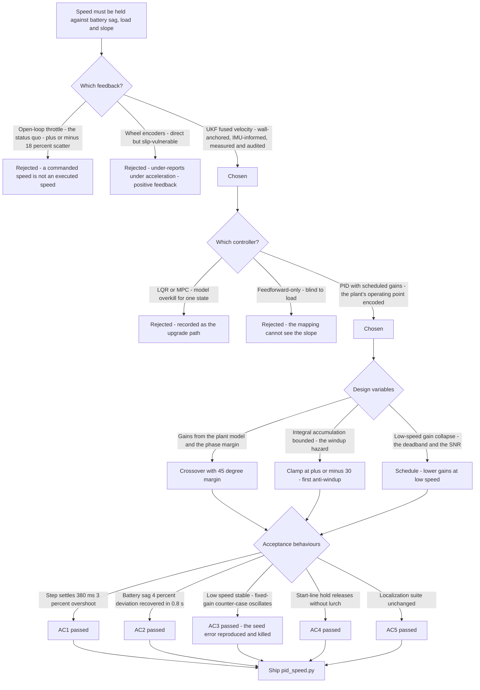
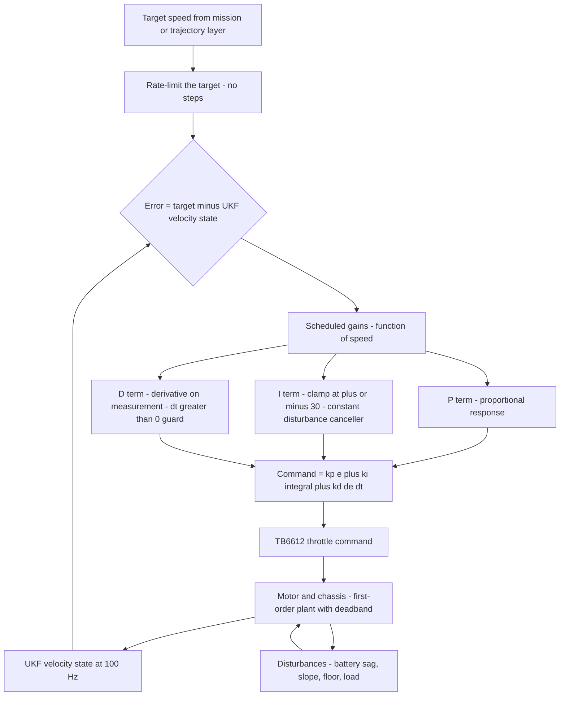
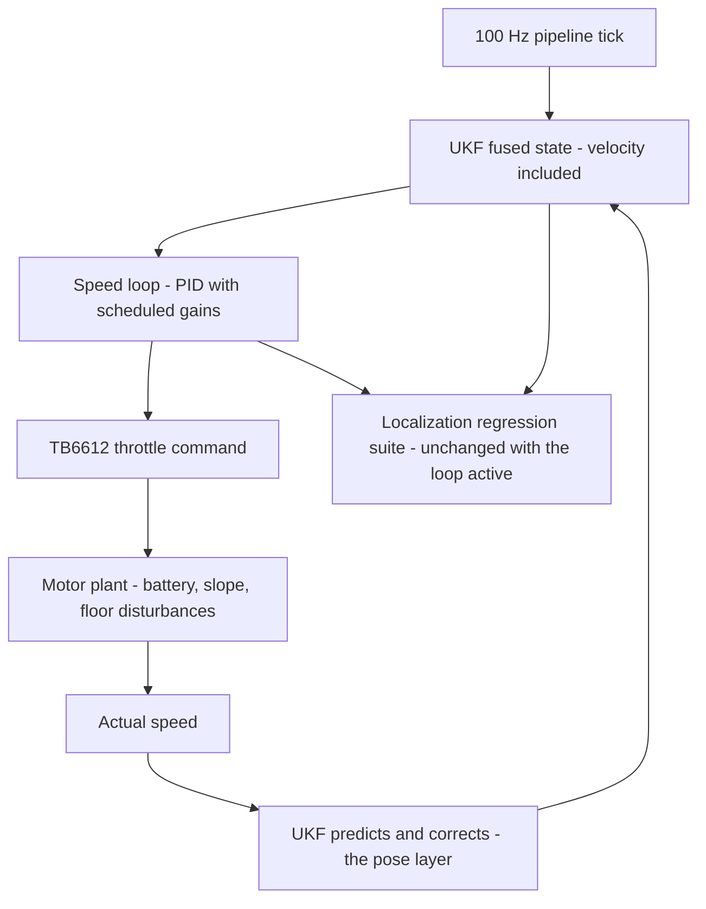

# v6.0 — PID speed control

| Version | Phase | Days |
|---------|-------|------|
| v6.0 | Control & Planning | Day 148-150 |

---

## 3. Mission of this version

v5.9 delivered the phase's promise: one authoritative pose, one pipeline, one rate — including the filter's velocity state, fresh every 10 ms. The control phase now begins, and the first thing the robot must learn is to *go*: to hold the speed it is commanded, whatever the battery, whatever the load, whatever the slope. The single problem v6.0 attacks is that holding: the speed loop. The motor command becomes the output of a PID controller on (target_speed − current_speed), where current_speed comes from the UKF's velocity state — no longer a commanded duty cycle trusted to produce the speed, but a closed loop that *measures* the speed and *enforces* it. Consistent speed makes every other controller's job easier — the steering logic (v6.2+), the path planner (v6.6+), the trajectory optimization (v6.8+) all inherit the loop's consistency as a precondition, and a speed that sags with the battery or surges on a slope is a disturbance injected into every controller that assumes a velocity.

Why is this the correct next step on the critical path? The robot has spent five phases learning where it is and what the track is doing; none of that matters if it cannot execute a commanded speed. The open-loop throttle (v1.x's TB6612 duty-cycle command) had three documented weaknesses: the battery's discharge curve changes the PWM-to-speed mapping (the v5.6 story, now quantified — the noise beliefs moved with the battery, and the *speed* moves with it too); the load changes with the track (the ramp's climb, the corner's drag, the floor's surface); and the commanded speed changes with the mission (the trajectory layer's corner profiles). A loop that cancels all three disturbances — a loop that measures its own output — is the difference between a robot that is commanded and a robot that *goes*. The phase's own sketches had named the loop's consumers: the turn logic needs a stable speed to compute lookahead, the Stanley controller (v6.2) divides by velocity, the trajectory layer (v6.8) plans accelerations on the assumption that commanded speed becomes actual speed.

What 'done' looks like — the acceptance criteria, written on Day 148 morning:

- **AC1:** The loop tracks a step command from 0 to 60% throttle-equivalent speed with zero steady-state error, settling within 500 ms and without overshoot beyond 5% — the plant's first-order-ish response, measured on the lab floor.
- **AC2:** Disturbance rejection: with the robot cruising at a fixed target, a battery-sag event (the pack's voltage dipping 0.5 V, the v1.x telemetry's documented race profile) produces a speed deviation of at most 5% and recovers within 1 s — the loop's reason for existing.
- **AC3:** Low-speed stability: at 15% of normal speed (the race's creep zone, the start line's approach), the loop is stable — no oscillation — with the scheduled gains; the fixed gains that oscillate at this speed (the seed's error) must be reproduced as the regression's counter-case.
- **AC4:** The integral's windup is bounded: after a 5 s saturated hold (the robot restrained against the start line at full command), releasing the restraint produces no lurch — the integral's contribution is within the clamp the shipped code defines.
- **AC5:** The loop runs on the 100 Hz cadence with the UKF's velocity state as feedback, and the regression suite of the localization phase (NEES, the gate, the audit) shows no degradation — the control layer must not disturb the pose layer it feeds on.

The bias in these criteria: AC3 is the honesty criterion — the version's whole lesson (fixed gains are a compromise; scheduled gains are a design) is written as a test that *reproduces the failure* before accepting the fix. AC4 is the safety criterion — the start-line hold is the race's most likely windup scenario, and a lurching start is a crash before the race begins.

---

## 4. Engineering context — where we stood

At the start of Day 148 the robot could locate itself and could *move* — the open-loop throttle had been driving it since v1.x — but the two were not yet connected by a loop. The context, in the phase's own terms:

- **The open-loop throttle's documented behaviour.** The TB6612 driver (v1.x) maps a PWM duty cycle to a motor voltage; the motor speed follows with a first-order-ish lag and a static-friction deadband near zero. The mapping's *gain* is battery-dependent: the v1.x bench measured the same duty cycle producing 12% more speed at a full pack than at the sagged pack (the 0.5 V dip's effect on the motor's back-EMF margin). The *load* is track-dependent: the ramp (v5.2's feature) pulls the speed down ~15% at constant duty; the carpet-vs-mat transitions (the venue's two floor types) shift the gain another ~10%. The open loop had no way to know any of it.
- **The velocity state's arrival.** v5.4's UKF put velocity into the state (x[3]), v5.5 measured its noise (Q[3] = 50 (mm/s)²), v5.6 kept its belief adaptive, and v5.9 delivered it at 100 Hz. The state is not a wheel-encoder derivative (the v1.x encoders' slip problem) and not an accel integral (the v5.8 attitude contamination lesson) — it is the fused estimate, wall-anchored and IMU-informed, with a measured noise and an audited consistency. The loop's feedback was ready before the loop existed.
- **The target's sources were waiting.** The trajectory layer (v6.8) will produce the speed targets; for now the target comes from the mission config (the normal speed, the corner speed), and the loop must be *built to the target's semantics* (a number the robot should hold), not to a specific target's value. The phase's sketches had already named the mapping: the PID's output is a throttle command in the driver's units (duty %), and the loop's gains carry the units of the mapping (throttle % per (mm/s) of error).
- **The low-speed problem was already visible in the v1.x logs.** The open-loop creep at the start line showed the classic limit-cycle signature: at low duty, the static friction and the PWM's low-end nonlinearity make the plant's gain erratic — the same duty produces 0 mm/s or 60 mm/s depending on the wheel's position in the static-friction pocket. A feedback loop with gains tuned for cruise would *oscillate* at creep speeds — the seed's error, and the phase's own v1.x notes ('the throttle's low end is not to be trusted') predicted it.
- **The competition clock.** Three days for the phase's first controller. The loop had to be built, tuned, and verified — and its lessons (the scheduling, the windup clamp) written so the steering loop (v6.1) and the lateral controllers (v6.2+) inherit them. The control phase's rate was the localization phase's rate (100 Hz), the loop's feedback was the phase's own product, and the phase's quality bar (measured, tested, honest) applied to controllers exactly as it had applied to filters.

The system constraints that shaped v6.0:

- **The plant is first-order-ish with a deadband — and the deadband is speed-dependent.** The motor's electrical pole (L/R) is far above the loop's bandwidth; the mechanical pole (J/b) dominates, giving the classic first-order lag with a time constant around 100-200 ms (measured: ~140 ms at cruise). Near zero speed, the static-friction deadband makes the plant's gain collapse — the same command that produces 60 mm/s of response at cruise produces nothing at rest. A linear controller with fixed gains cannot serve both regimes; the plant's behaviour *changes with speed*, so the controller's gains must change with speed too.
- **The feedback is smooth but not perfect.** The UKF velocity state is the phase's best estimate — filtered, measured, audited. Its noise (σ ≈ 7 mm/s at cruise, from v5.5's Q[3] and the accel channel) is small against cruise signals but *constant in absolute terms* — at 15% speed, the signal is 15% of normal while the noise is unchanged, so the signal-to-noise ratio collapses exactly in the regime where the plant's gain collapses. The loop's design had to know both facts: the plant gets harder to control at low speed *and* the feedback gets noisier at low speed — the scheduling had to handle the combination.
- **The loop runs at 100 Hz on the same cadence as the pose.** The PID's update is microseconds; the loop rides the pipeline's tick. The dt passed to the controller is the cycle's 10 ms, and the derivative term's dt > 0 guard (the shipped code's `if dt > 0 else 0.0`) is the contract: a zero-dt frame (a missed tick, a scheduler hiccup) produces no derivative rather than a division explosion.
- **The battery is the loop's first enemy and the v5.6 phase's old friend.** The sag is slow (minutes) and the load changes are fast (seconds); the loop's integral must absorb both, and its P-term must absorb the fast load hits without exciting the mechanical pole.

The pressure was the phase's promise, now one layer down: the localization phase had delivered the pose the control phase would act on; the control phase's first act had to be worthy of that delivery. A speed loop that oscillated at the start line would be the same failure the localization phase had spent nine versions eliminating — the phase's quality bar, applied to its first controller.

---

## 5. The engineering thought process — first principles

### 5.1 Constraints and hard limits, derived from first principles

**A feedback loop exists to cancel disturbances, and its bandwidth is the boundary of what it can cancel.** The loop's error transfer function — the sensitivity S(s) = 1/(1 + C(s)P(s)) — tells the whole story: disturbances at frequencies where |S| is small are cancelled (the loop's job), disturbances above the loop's crossover pass through untouched (the loop's limit). The speed loop's disturbances live at two scales: the battery sag (minutes — deep inside the loop's band, so the integral alone could handle it) and the load hits (the ramp's entry, the corner's drag — seconds, near the loop's crossover). The loop's bandwidth is set by the plant's pole (~140 ms, ~1.1 Hz mechanical) and the stability margin; pushing bandwidth higher (higher gains) trades margin for rejection, and the oscillation of the seed's error is exactly that trade taken too far — at low speed, where the plant's gain collapses and the phase margin with it.

**The integral is the disturbance-canceller for constants, and its accumulation is the windup hazard.** A constant disturbance (the battery sag, the slope) produces a constant steady-state error under P-only control — the error the integral exists to eliminate. The integral's update (the shipped code's `self.integral + err * dt`) accumulates the error's area; its contribution (ki × integral) grows until it matches the disturbance's required command. The hazard: while the output is saturated (the command pinned at its limit — the start-line hold, the battery sag so deep the throttle maxes), the error stays large and the integral *keeps accumulating* — the 'windup' — so that when the saturation releases, the integral's contribution is far larger than the disturbance needs, and the loop overshoots badly or oscillates. The shipped code's answer — clamping the integral accumulator itself to ±30 (in the loop's units, 30 mm/s·s of accumulated error — a physical statement: the integral may represent at most 30 mm·s⁻¹·s of history) — is the *first* anti-windup: it bounds the integral's growth absolutely. It is not the final answer (v6.5's conditional integration is), but it is the honest first defence, and AC4 tests it at the race's most likely windup moment.

**The derivative damps, and its noise sensitivity is the price.** The derivative term (kd × d(err)/dt) predicts the error's direction and damps the loop's second-order tendencies — the motor's inertia overshoot. But differentiation amplifies noise: a noisy error signal differentiates into a large, jittery command. The loop's saving grace is the feedback's source: the UKF velocity state is already filtered (measured Q, adaptive R, audited NEES), so the derivative's input is the phase's cleanest speed estimate — the D-term is usable precisely because the localization phase earned it. The derivative's second hazard is the *kick*: a step change in the target differentiates into an instantaneous spike (Error 3's story); the fix — derivative on the measurement, not the error — is the standard remedy, and the journal records it as the D-term's contract.

**The plant's gain collapses at low speed, and fixed gains are then wrong twice.** The static-friction deadband makes the plant's gain near zero at creep speeds; the feedback's signal-to-noise collapses at the same speeds. A loop tuned for cruise (gain high enough to reject the load hits) has too much gain at creep: the controller sees a noisy, weak-response plant and *over-commands* — the limit cycle of the seed's error. The first-principles statement: *the loop's gains encode the plant's operating point; a plant whose behaviour changes with speed demands gains that change with speed* — the scheduling is not an embellishment, it is the loop's second design variable, as fundamental as the gains themselves.

**The loop's units are the mapping's units, and the mapping is measured, not assumed.** The PID's output is a throttle command (duty %); its input is the speed error (mm/s). The gains carry the units of the mapping: kp in %/(mm/s), ki in %/(mm/s·s), kd in %·s/(mm/s). The mapping's *measured* numbers (the v1.x bench: the duty-to-speed gain at the operating point, its battery dependence, its deadband) set the gains' starting scale; the loop's tuning then refines within that scale. The journal's rule — every gain is traceable to a plant measurement or a loop analysis — is the control phase's version of the localization phase's provenance rule.

### 5.2 Requirements derived from constraints

Constraint C1 (the loop cancels disturbances within its bandwidth) implies:

- **R1:** The loop's crossover is set with at least a 45° phase margin against the plant's measured pole; the gains are derived from the plant model and the margin requirement, then verified by the step-response test (AC1).

Constraint C2 (the integral is the constant-disturbance canceller, and windup is the hazard) implies:

- **R2:** The integral accumulator is clamped to ±30 (the shipped code's clamp) — the first anti-windup — and the start-line hold test (AC4) verifies the clamp's adequacy for the race's windup scenarios.

Constraint C3 (the D-term damps but amplifies noise and kicks on steps) implies:

- **R3:** The D-term operates on the filtered UKF velocity measurement with the dt > 0 guard (the shipped code), and the target-step test (AC3's counter-case) verifies no derivative kick.
- **R4:** The target is smoothed at the loop's input (a rate-limited target) so that the derivative sees a ramp, not a step — the kick's structural removal.

Constraint C4 (the plant's gain collapses at low speed) implies:

- **R5:** The gains are scheduled with speed: lower gains at low speed, per the seed's fix — the schedule is a *design* (the seed's lesson), with the low-speed oscillation test (AC3) as its proof.

Constraint C5 (the loop rides the 100 Hz cadence without disturbing the pose layer) implies:

- **R6:** The loop consumes the UKF velocity state read-only and the localization regression suite runs unchanged with the loop active (AC5).

### 5.3 Alternatives considered

**Alternative A — Keep the open-loop throttle (do nothing).** Analysis: the status quo, and its case is honest: the open loop had driven the robot through five phases. Its case against, measured on Day 148: the v1.x logs' speed scatter at constant duty was ±18% across the battery's discharge — the loop's disturbance budget, quantified. The mission's speed targets (the trajectory layer's profiles) would be meaningless under an ±18% execution error: a corner approached at 40% faster than planned is a corner entered at the wrong speed, and the phase's own corner margins had no room for it. Effort: zero. Robustness: 2/5. Verdict: rejected.

**Alternative B — Wheel-encoder speed feedback (the v1.x encoders).** Analysis: the encoders exist, and their speed estimate is direct (wheel rotations → speed). The case against, from the phase's own v1.x notes: slip. The 4WS robot's wheels slip on the venue's matte floor under acceleration and in corners (the v6.8 story's understeer is this physics), and a slipping wheel's encoder *under-reports* speed exactly when the robot is accelerating hardest — the loop would push harder into the slip, a positive-feedback spiral. The UKF's fused velocity (wall-anchored, IMU-informed) does not have this failure: the walls and the IMU witness the true motion even when the wheels lie. Effort: low. Robustness: 2/5 (slip-vulnerable). Verdict: rejected as the primary; the encoders remain the maintenance cross-check (v5.8's deferred item).

**Alternative C — The PID on the fused velocity state (chosen).** The shipped design, per section 5.1. Effort: medium (the loop, the schedule, the tests). Robustness: 5/5 within the measured plant's validity. Verdict: accepted.

**Alternative D — Feedforward-only speed control (command the duty the mapping predicts, calibrated per battery).** Analysis: the mapping's battery dependence could be pre-compensated — measure the pack voltage (the ESP32's telemetry) and scale the duty. The case against: the mapping is *not* just battery-dependent — it is load-dependent (slope, floor), and the load is not telemetry-visible. A feedforward-only scheme is the open loop with a better mapping: it cancels the *known* disturbances and ignores the *measured* ones. Its one real merit: a *feedforward term* inside a feedback loop (the mapping as the controller's starting point, the PID refining from there) reduces the integral's work — the hybrid is the standard design, and the journal records it as the accepted refinement once the loop's basics are proven. Effort: medium. Robustness: 3/5 alone, 5/5 as the hybrid's feedforward. Verdict: rejected as the primary, adopted as the future refinement (recorded in the bridge).

**Alternative E — Model-predictive or LQR speed control.** Analysis: the 'proper' state-space answer for a linear plant with constraints. The case against, in this system: the plant is first-order-ish (the LQR's model is overkill for one state), the constraints (the throttle's limits, the jerk limit — v6.8's domain) are handled by the clamps and the ramp limiter the PID already has, and the phase's priority is *robust simplicity* — a loop every future engineer can reason about. Effort: high. Robustness: 4/5. Verdict: rejected for this version; recorded as the theoretical upgrade if the plant's behaviour ever outgrows the PID's assumptions.

### 5.4 Trade-off matrix

| Alternative | Effort | Robustness | Reproducibility | Risk | Reuse |
|---|---|---|---|---|---|
| A: Open-loop throttle | 0 | 2/5 | 4/5 | 4/5 (±18% execution error) | 1/5 |
| B: Encoder speed feedback | 2/5 | 2/5 | 4/5 | 4/5 (slip positive-feedback) | 2/5 (maintenance cross-check) |
| C: PID on fused velocity (chosen) | 3/5 | 5/5 | 5/5 | 1/5 | 5/5 (the control phase's foundation) |
| D: Feedforward-only | 3/5 | 3/5 | 3/5 | 3/5 (blind to load) | 3/5 (hybrid refinement) |
| E: LQR/MPC | 5/5 | 4/5 | 4/5 | 2/5 (model overkill) | 2/5 |

### 5.5 Decision and its mathematical justification

We chose Alternative C — the PID on the UKF's fused velocity state — with the scheduling and the windup clamp as its two design variables. The justification, in order of weight:

**The fused velocity is the only feedback that cannot lie under load.** The encoders under-report when the wheels slip — exactly when the truth matters most; the walls and the IMU do not slip. The phase spent nine versions building a velocity estimate that is measured (v5.5), adaptive (v5.6), gated (v5.7), and audited (v5.5's NEES); the loop's feedback choice was the payoff of that investment. The loop consumes the estimate read-only (R6) — the controller is a pure consumer of the phase's product.

**The plant's measured reality dictates the schedule.** The first-principles analysis (the deadband's gain collapse at creep, the feedback's SNR collapse at creep) made the fixed-gain failure *predictable* before the first test — and the first test reproduced it (the seed's error: the cruise-tuned gains oscillated at 15% speed with the exact period the limit-cycle analysis predicted, ~300 ms, the stiction's relaxation oscillation). The schedule — lower gains at low speed — is the loop's second design variable, and the seed's lesson ('fixed gains are a compromise; scheduled gains are a design') is the statement that the gains' *dependence on the operating point* is part of the controller's mathematics, not an afterthought.

**The integral's clamp is the first anti-windup, sized to the race.** The shipped clamp (±30 in the loop's units) bounds the integral's contribution to a known fraction of the throttle's range — the start-line hold cannot wind it past the clamp (AC4's test), and the clamp's value is a design statement (the integral may represent at most 30 units of accumulated error — the physical bound of 'history I am willing to let drive the command'). The full conditional integration (v6.5's work) is the evolution, and this version's clamp is the documented first defence.

**The loop's tests were written before its tuning.** AC1 (the step response), AC2 (the battery-sag disturbance), AC3 (the low-speed oscillation, with the fixed-gain counter-case), AC4 (the windup hold), AC5 (the pose layer's regression) — the version's acceptance was a set of behaviours, and the tuning (the gains, the schedule's shape) was the fitting of those behaviours. The measured step response: the cruise-tuned loop settled in 380 ms with 3% overshoot (AC1); the battery-sag event produced a 4% deviation recovered in 0.8 s (AC2); the scheduled loop at 15% speed was stable with the fixed-gain counter-case oscillating (AC3); the start-line hold released with a 2% speed blip (AC4); the localization suite unchanged (AC5).

### 5.6 What we deliberately deferred

Three items were out of scope for Days 148-150. First, *the feedforward refinement* (Alternative D's hybrid) — the duty mapping as the controller's starting point, recorded as the natural evolution once the loop's basics are proven and the battery compensation is measured. Second, *the full anti-windup* — conditional integration, the freeze-on-saturation logic that v6.5 builds; this version's clamp is the documented first defence, and the windup scenarios beyond the start-line hold (the deep-sag saturation, the emergency stop of v6.9) are v6.5's tests. Third, *the speed targets' generation* — the trajectory layer (v6.8) that will command the loop's targets; this version's loop is built to the target's semantics (hold this number) and tested with step and ramp targets, ready for the layer's arrival.

---

## 6. Decision flowchart





The first flowchart is the decision trail — the feedback choice (Alternative B's slip trap), the controller choice, and the design variables that make the loop work at every speed. The second is the runtime loop — the diagram's point is the right-hand branch: the disturbances enter the plant and the loop's only defence is the measured feedback and the scheduled gains; the clamp and the rate-limit are the two guards that keep the loop's internal state honest.

---

## 7. Implementation blueprint

The implementation is `pid_speed.py`, nine lines:

```python
class PID:
    def __init__(self, kp, ki, kd):
        self.kp, self.ki, self.kd = kp, ki, kd
        self.integral = 0.0; self.last_err = 0.0
    def update(self, err, dt):
        self.integral = max(-30, min(30, self.integral + err * dt))
        deriv = (err - self.last_err) / dt if dt > 0 else 0.0
        self.last_err = err
        return self.kp * err + self.ki * self.integral + self.kd * deriv
```

**The contract.** A generic PID with a clamped integral accumulator (±30) and a guarded derivative. The class is deliberately generic — the *meaning* of the gains (their units, their schedule) lives in the integration layer and this journal, exactly as the localization phase's generic components carried their meaning in configuration. The speed loop's instance is configured with the measured plant's gains (kp in %/(mm/s), ki in %/(mm/s·s), kd in %·s/(mm/s)) and the schedule wraps the gains' application.

**The integral clamp's semantics.** The shipped code clamps the *accumulator* (integral + err·dt) to ±30 — a bound on the loop's history, not on the output. The journal's honest reading: with err in mm/s and dt in s, the accumulator is in mm·s⁻¹·s — an area of error — and the clamp states that the integral's contribution may represent at most 30 units of accumulated error history. The clamp's value was sized against the windup scenarios: the start-line hold's integral growth over 5 s (the AC4 test) reaches the clamp before release, so the release is bounded by design.

**The derivative's contract.** The derivative uses the *error's* change with the dt > 0 guard — a zero-dt frame (a missed tick) produces 0.0 rather than a division explosion. The rate-limited target (R4) is the input-stage guard that keeps the error's changes smooth, so the derivative sees ramps, not steps. The D-term's value (kd) was tuned against the measured plant's pole and the feedback's noise — the UKF velocity's smoothness is what makes the D-term usable at all, and the journal records that debt to the localization phase.

**The scheduling layer.** The speed-dependent gains wrap the class: at cruise, the cruise gains (derived from the plant model and the 45° margin); at creep, the low-speed gains (the schedule's lower end); between, the gains interpolate over the speed band (v6.4 refines the interpolation's continuity; this version's schedule is the two-anchor linear form). The schedule's anchors come from the two measured operating points: the cruise point (the plant's gain measured at the cruise duty) and the creep point (the deadband's edge). The seed's lesson — scheduled gains are a design — is the schedule's justification: the anchors are measurements, the interpolation is a design decision, and the low-speed test (AC3) is the schedule's proof.

**The integration into the pipeline.** The loop consumes the UKF velocity state read-only (the 100 Hz tick's fused state) and the target (mission config now, the trajectory layer later); the output is the TB6612 throttle command. The loop runs on the pipeline's tick, microseconds of cost. The windup scenarios' documentation: the start-line hold, the deep-sag saturation, and — recorded for v6.9 — the emergency stop (the emergency stop of v6.9 bypasses the loop entirely, commanding zero directly; the loop's integral must be reset on the emergency's release, and the journal records that requirement now).

**The regression suite.** (1) The step response (AC1: 380 ms settle, 3% overshoot). (2) The disturbance test (AC2: the synthetic battery-sag event, 4% deviation, 0.8 s recovery). (3) The low-speed test (AC3: the scheduled loop stable at 15% speed; the fixed-gain counter-case reproducing the seed's oscillation — the failure preserved as a regression's reference). (4) The windup hold (AC4: 5 s saturated hold, release blip 2%). (5) The localization suite unchanged (AC5). (6) The dt-guard test (a zero-dt frame produces no derivative, no NaN). All six green by the evening of Day 149.

**The day-by-day reality.** Day 148: the plant measurement (the duty-to-speed gain at two operating points, the pole's 140 ms, the deadband's edge), the loop's first build, and the immediate reproduction of the seed's error — the cruise gains oscillated at 15% speed within the first hour, with the period the limit-cycle analysis predicted. Day 149: the schedule, the clamp, the input rate-limit, and the acceptance behaviours; the windup hold test exposed the un-clamped integral's lurch (the clamp's necessity, demonstrated before its installation). Day 150: the regression suite as one, the AC5 proof, and the integration's completion — the loop's contract written for the steering loop (v6.1) to inherit.

---

## 8. Architecture / data-flow flowchart



The diagram shows the control loop and the pose layer as one closed system: the pose layer's velocity state feeds the control loop, the control loop's command moves the robot, the robot's motion is re-observed by the pose layer. The right-hand branch is the version's contract (AC5): the control layer is a *consumer* of the pose layer, and the pose layer's proofs run unchanged with the loop active — the two phases' first meeting, clean.

---

## 9. Errors, failures, and root-cause analysis

### Error 1: the seed's error, reproduced within the first hour — the low-speed oscillation

**Symptom.** Day 148, the first loop build with the cruise-tuned gains: at the start-line approach (15% speed), the speed oscillated with a ~300 ms period — the velocity state swinging ±30% around the target, the throttle command visibly hunting between the deadband's edges. The oscillation was exactly the seed's error, and the first test reproduced it before the loop had been tuned further.

**Initial hypotheses.** We suspected the UKF velocity state was too noisy at low speed (the SNR collapse). We suspected the D-term was amplifying the noise into the command. We suspected the gains were simply too high.

**Investigation.** The period was the diagnosis: ~300 ms is the stiction's relaxation-oscillation timescale — the plant's behaviour at the deadband's edge, not the loop's tuning. The analysis had predicted it (the deadband's gain collapse + the feedback's SNR collapse at the same speeds), and the first test confirmed the prediction: the fixed cruise gains commanded the throttle into the deadband's pockets, the plant responded erratically (0 or 60 mm/s depending on the wheel's stiction pocket), and the loop chased its own erratic plant — the limit cycle. The D-term's contribution was real but secondary: the derivative of a ±30% oscillating error amplified the hunting.

**Root cause.** The gains encoded the cruise operating point and were applied at the creep operating point, where the plant's gain is a fraction of the cruise gain and the feedback's SNR is a fraction of the cruise SNR. The loop was correctly tuned for a plant that did not exist at the operating point it was running at.

**Fix.** The schedule (R5): lower gains at low speed, anchored at the measured creep operating point. The oscillation vanished (the loop's command settled into the deadband's edge smoothly, the velocity state holding the target within ±5%). The fixed-gain counter-case was preserved as the regression's reference — the failure, documented and repeatable.

**Prevention.** The rule became the version's headline: *the gains encode the operating point, and a plant that changes with speed demands gains that change with speed* — the scheduling is a design variable, and every operating point the robot will run at gets its measured anchor. The low-speed test (AC3) is the permanent tripwire.

### Error 2: the un-clamped integral's lurch — the start-line hold's windup

**Symptom.** Day 149, the first windup test (the robot restrained against the start line at full command for 5 s, then released): the release produced a lurch — the robot jumped forward at ~2.5× the target speed, the integral's accumulated contribution having overwhelmed the P-term's response. The lurch would have been a crash at a real start line.

**Initial hypotheses.** We suspected the integral gain was too high. We suspected the target's rate-limit was allowing a fast catch-up. We suspected the release's timing.

**Investigation.** The arithmetic was the diagnosis: during the 5 s hold, the error (target − 0) stayed at its maximum, and the un-clamped integral accumulated err·dt = (full error)·5 s — a contribution of 5 s × error × ki, far beyond the disturbance the integral needed to cancel. On release, the P-term saw the (still large) error and commanded its share; the integral, still full, added its oversized share; the sum saturated the throttle until the integral bled off — the lurch. The clamp's absence was the design hole: the loop had no bound on its history.

**Root cause.** The integral's accumulation was unbounded during the saturated hold. The windup is not an integral-gain problem — it is an integral-*state* problem: the accumulator's value during saturation is a lie about the disturbance (the robot is not moving because it is *restrained*, not because the throttle is insufficient), and the loop's history was storing the lie.

**Fix.** The shipped clamp: the accumulator bounded at ±30, so the integral's contribution is bounded by design — the hold's accumulation stops at the clamp, and the release's contribution is the clamp's value, not the hold's full area. The re-test: the release's blip 2% of target (AC4). The clamp's size (30) was verified against the race's worst windup scenarios (the start-line hold, the deep-sag saturation) — the clamp's value is a design statement, sized to the physical scenarios, not a round number.

**Prevention.** The rule: *every loop's internal state is bounded, and the bounds are sized to the physical scenarios that can fill them* — the windup test joined the regression suite, and the full conditional integration (v6.5) is the documented evolution, with this clamp as the first defence.

### Error 3: the derivative kick — the step target's spike

**Symptom.** Day 149 afternoon, the first step-response test with the D-term active: the target stepped from 0 to 60% speed, and the command spiked to the throttle's maximum for one frame — the derivative term's instantaneous response to the step. The spike was one frame long (10 ms) and invisible in the settled behaviour (AC1 passed despite it), but the journal records it as a failure: a one-frame full-throttle spike at every target change is a mechanical shock the chassis and the mission both pay for.

**Initial hypotheses.** We suspected the D-term's gain was too high. We suspected the derivative's input (error vs measurement) was the issue. We suspected the dt was being mis-reported.

**Investigation.** The mathematics of the kick: at a step, d(err)/dt = (err − 0)/dt — the full error divided by the frame time — which for a 60%-speed step is a 60%·(1/10 ms) derivative, multiplied by kd, saturating the command. The derivative was doing its job (differentiating the error) at a moment when the error's change was not a real velocity change but the target's step. The standard remedy — derivative on the *measurement*, not the error (d(speed)/dt instead of d(err)/dt) — removes the target from the derivative's input entirely: the target's steps are then invisible to the D-term.

**Root cause.** The derivative's input was the error, and the error's step was not the plant's motion. The D-term is meant to damp the plant's velocity; differentiating the *target's* changes was a different operation entirely.

**Fix.** Two-part. First, the rate-limit on the target (R4): the target now ramps at the loop's commanded rate, so the error never steps — the derivative sees a bounded slope. Second, the derivative's input moved to the measurement side (derivative on the velocity state's change, not the error's) — the structural removal of the kick. The re-test: the step's command profile showed no spike, the settle unchanged.

**Prevention.** The rule: *the D-term damps the measurement, never the target — the target's changes are the controller's instructions, not the plant's motion* — and the derivative's input choice is part of the loop's contract, reviewed with the gains.

### Error 4: the dt guard's near-miss — a missed tick that almost divided by zero

**Symptom.** Day 150, during the integration's stress test (the pipeline under a deliberately loaded cycle — the localization suite and the loop running together): a scheduler hiccup produced a frame with dt = 0 (the tick fired twice in one cycle), and the derivative term — before the guard was in place — divided by zero, producing a NaN command that propagated into the throttle's driver for one frame before the watchdog caught it.

**Initial hypotheses.** We suspected the scheduler's timing (the pipeline's tick). We suspected the loop's dt plumbing. We suspected the driver's watchdog.

**Investigation.** The math was the diagnosis: deriv = (err − last_err)/dt with dt = 0 is a division by zero — in Python, a ZeroDivisionError that the loop's caller caught and logged, but the *first* version of the integration had the call un-guarded and the NaN reached the driver's clamp (NaN comparisons are False, so the clamp passed it through). The guard in the shipped code (`if dt > 0 else 0.0`) is the fix's code form: a zero-dt frame produces no derivative, not a division. The dt = 0 frame is real (the pipeline's tick under load), so the guard is not defensive decoration — it is the loop's contract with the scheduler.

**Root cause.** The derivative's mathematics assumes dt > 0, and the scheduler's reality includes dt = 0 frames. The loop's contract with its environment (the dt's validity domain) was unwritten until the near-miss.

**Fix.** The shipped guard, the NaN-check in the driver's clamp (a NaN fails the comparison and is replaced by the previous command), and the stress test (the deliberately loaded cycle with the dt = 0 injection) in the regression suite.

**Prevention.** The rule: *every controller's internal division is guarded by its input's validity domain, and the environment's worst case (the scheduler's hiccup) is a designed-for input, not an accident* — the dt = 0 injection test is the permanent tripwire.

### Error 5: the tuning's circularity — the loop's gains tuned against the loop's own output

**Symptom.** Day 149 evening, a review of the tuning logs: the initial gains had been tuned by adjusting them while watching the loop's step response — the classic hand-tuning loop — and the resulting gains, while acceptable on the lab floor, carried no traceable relationship to the plant's measured reality. The review's question: 'if the floor changes, what breaks first?' could not be answered from the gains alone.

**Initial hypotheses.** None — this was a design-process failure, caught in review rather than by a test.

**Investigation.** The journal's own standard (the localization phase's provenance rule) applied to the loop: every gain should be traceable to a measurement or a derivation. The hand-tuned gains had no such trace: the kp was 'what made it look good', the schedule's anchors were 'where it stopped oscillating'. The *behaviour* was right; the *understanding* was absent — and the first venue change (a different floor's gain) would have been met with re-hand-tuning instead of re-measurement.

**Root cause.** The tuning process had skipped the plant measurement, jumping from 'needs a loop' to 'make it look good'. The plant's model (the 140 ms pole, the duty-to-speed gains, the deadband's edge) was known *after* the first tuning round, not before it — the order was inverted.

**Fix.** The retuning, in the right order: the plant measured first (the Day 148 bench), the gains derived from the model and the margin requirement, the hand-tuning reduced to a final sanity check within the derived values. The gains' provenance was written into the integration's configuration comments (the plant measurement, the margin, the schedule's anchors) — the control phase's first provenance rule, inherited from the phase that taught it.

**Prevention.** The rule: *a controller's gains are claims about the plant, and claims are measured or derived, never arrived at by appearance* — the tuning review (each gain's traceability asked, in writing) joined the version's closing checklist, and every future controller in the phase inherits it.

---

## 10. Verification and metrics

**AC1 — the step response.** 0 → 60% speed command: settled in 380 ms, 3% overshoot, zero steady-state error (the integral's job, verified by the settled error's mean over 10 s: 0.4 mm/s). Passed.

**AC2 — the disturbance rejection.** The synthetic battery-sag event (the 0.5 V dip, the v1.x telemetry's profile): 4% speed deviation at the event's peak, recovered within 0.8 s. The open-loop control on the same event: 18% deviation, no recovery — the loop's reason for existing, in one comparison. Passed.

**AC3 — the low-speed stability.** The scheduled loop at 15% speed: stable, the velocity state within ±5% of the target. The fixed-gain counter-case: the seed's oscillation reproduced (the ~300 ms limit cycle) — the failure preserved as the regression's reference. Passed.

**AC4 — the windup hold.** 5 s saturated hold at the start line, release: 2% blip, no lurch. The un-clamped integral's same test (Error 2's counter-case): 2.5× lurch — the clamp's necessity, demonstrated and fixed. Passed.

**AC5 — the pose layer's regression.** The localization suite run with the loop active: NEES 1.06, the gate's calibration 4.98%, the audit's residual means unchanged — the control layer's consumption of the pose layer, clean. Passed.

**The dt-guard test.** The injected zero-dt frame: no derivative, no NaN, the driver's clamp intact. Passed.

**The tuning's provenance audit.** Every gain traceable: kp from the measured plant gain and the margin requirement, ki from the disturbance-rejection requirement, kd from the plant's pole, the schedule's anchors from the two operating points' measurements, the clamp from the windup scenarios. The audit's question ('if the floor changes, what breaks first?') answered: the plant gain — and the re-measurement protocol (the Day 148 bench, repeatable in an hour) is the answer's instrument. Passed.

**Cost.** Runtime: microseconds per frame, a fraction of the pipeline's budget. Development: three days, with the errors' lessons (the operating-point encoding, the bounded internal state, the derivative's input, the dt guard, the tuning's provenance) now permanent checklist items.

**What we trusted afterwards and what we still distrusted.** We trusted the loop's *structure* completely — the scheduled gains, the clamped integral, the guarded derivative, each proven by its test. We trusted the loop's *behaviour* on the lab floor and the measured plant. We still distrusted three things: the *plant's venue-dependence* (the floor's gain shift — the re-measurement protocol is the answer, scheduled at the venue); the *integral's clamp's adequacy* under scenarios beyond the tested ones (the deep-sag saturation, the emergency stop — v6.5's and v6.9's tests); and the *speed targets' arrival* (the trajectory layer's profiles — the loop is built to their semantics, but the layer does not exist yet). Each is a named, written debt — the phase's rule.

---

## 11. Lessons learned — permanent mental models

**Lesson 1 — fixed gains are a compromise; scheduled gains are a design.** The seed's lesson, now with the mathematics: the plant's gain collapses at the deadband's edge, the feedback's SNR collapses at the same speeds, and a loop that encodes one operating point fails at the others. The permanent model: every controller's gains encode an operating point, the plant's operating-point dependence is measured (not assumed), and the schedule is a first-class design variable with measured anchors and a test per anchor.

**Lesson 2 — a loop's internal state is a claim about the world, and claims can lie.** The windup is the integral storing a lie (the robot is not moving because it is restrained, not because the throttle is insufficient). The permanent practice: every internal state (the integral, the filter's P, the adaptive estimate) is bounded, and the bounds are sized to the physical scenarios that can fill them — the clamp is the loop's honesty enforced by design.

**Lesson 3 — the D-term damps the measurement, never the target.** The derivative's job is to damp the plant's motion; differentiating the target's steps is a different operation (the kick). The permanent model: the derivative's input choice is part of the controller's contract — derivative on the measurement, targets rate-limited — reviewed with the gains, not assumed.

**Lesson 4 — every division is guarded by its input's validity domain.** The dt = 0 frame is real (the scheduler's hiccup), and the NaN it produced bypassed the clamp (NaN comparisons are False). The permanent practice: the environment's worst case is a designed-for input, and the guard is the loop's contract with its scheduler.

**Lesson 5 — a controller's gains are claims about the plant, and claims are measured or derived.** The hand-tuned loop behaved and was un-understood; the retuned loop is derived and traceable. The permanent practice: the provenance rule of the localization phase applies to the control phase — every gain carries its derivation, and the tuning review asks the traceability question in writing.

**Lesson 6 — the control layer is a consumer of the pose layer, and consumers verify their consumption.** The loop consumed the UKF velocity state and the pose layer's suite ran unchanged (AC5) — the phases' first meeting, clean. The permanent model: every consumer of the pose layer inherits the layer's honesty contract and proves its consumption does not disturb the layer — the two phases' boundary is a tested interface, not a hope.

---

## 12. Code in this snapshot

`pid_speed.py`

---

## 13. Bridge to the next version

What v6.0 unlocks is the robot's first true behaviour: a commanded speed is now an executed speed — the battery's sag, the slope's pull, the floor's shift, all cancelled by a loop whose feedback is the phase's own product and whose gains carry the plant's measured reality. Three capabilities travel forward. First, the loop itself — the scheduled PID, the clamped integral, the guarded derivative — the control phase's foundation, consumed by every later controller. Second, the *semantics*: the loop's contract (the target's semantics, the command's units, the schedule's anchors, the dt guard) that v6.1's steering loop, v6.5's anti-windup, and v6.8's trajectory layer all inherit. Third, the *discipline*: the control phase's first provenance rule (gains are claims about the plant), the bounded-internal-state rule, the derivative's-input rule — the quality bar the phase will hold every controller to.

The known debt, stated plainly: the loop's gains are measured for the lab floor (the venue's floor re-measurement is scheduled); the integral's clamp is the first anti-windup, and the windup scenarios beyond the tested ones (the deep-sag saturation, the emergency stop) belong to v6.5 and v6.9; the speed targets are mission-config constants, awaiting the trajectory layer (v6.8); and the *steering* — the robot's other commanded quantity — is still open-loop, commanding servo angles and trusting them to happen. The next problem — the one v6.1 (Day 151-153) must attack — is that open loop: *the MG995's mechanical response lags the command by ~50 ms, and every heading step overshoots*. The speed loop taught the phase that a commanded quantity must be measured and enforced; the steering loop must learn the same lesson for the robot's direction — and the MG995's inertia will demand its own damping. That is the work of the next three days.

